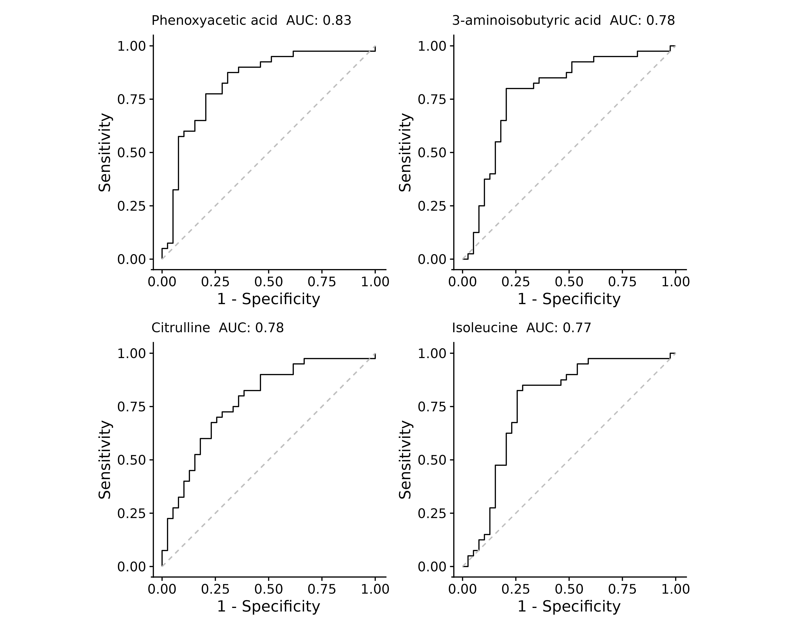
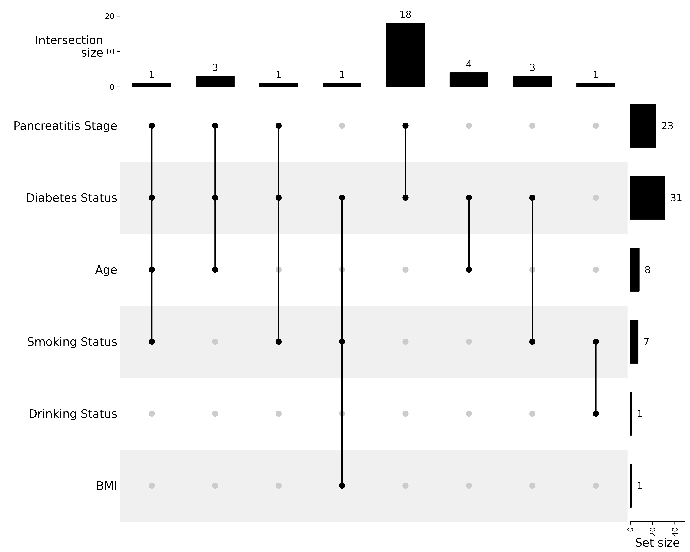

::: {.cell}

:::


## Purpose

Differential analysis of pancreatitis urine metabolites between Green I and Red patient groups.
There is an [Executive Summary](#executive-summary) at the end of this document.

## Data

Median normalized metabolite intensities, or metabolite - metabolite ratio data.

## Methods

Metabolite abundances in each sample were normalized by calculating the median abundance in each sample, and dividing the abundances by the sample median.
Metabolite abundances include only a few zero values (N = 4 across all metabolites and samples) that were subsequently treated as *missing*.
Sample - sample correlations were calculated using information-content-informed Kendall-Tau (ICI-Kt), and median sample correlations used to detect possible outlier samples.
No outlier samples were detected, and all samples were used for differential calculations.
Prior to calculation of metabolite - metabolite ratios, any missing values were replaced with the lowest observed value for that metabolite across samples.
For each normalized metabolite or metabolite - metabolite ratio, a t-test was calculated using the $log_2$ values in the Red and Green I patients.
Any missing values were removed prior to the t-test calculation.
P-values were adjusted using the Benjamini-Hochberg procedure [@benjaminiControllingFalseDiscovery1995].

For association with other patient covariates in the Red and Green I samples, ANOVA was used to perform the statistical test of $log_2$ values with the covariate, regardless of whether there were only two more more categories.
Missing values were removed prior to the ANOVA calculation.
Some covariates necessitated special handling prior to ANOVA.
Diabetes status (`diabetes_bl`) required changing all of the "N/A" instances to "Normal".
Etiology status (`etiology`) required removing all of the "missing" instances (encoded as -999) before the ANOVA.


## Results


::: {.cell}

:::


### Direct Comparison

From the direct comparison of metabolites in the Green I and Red patients, 29 metabolites had an adjusted p-value <= 0.05.
The volcano plot of log-fold-changes and p-values is shown in Figure 1.
The red line corresponds to an adjusted p-value of 0.05.

The table of statistical results is shown in Table 1 and Table 2.

Table 1.
Statistics of direct comparisons of named metabolites for patients in control and CP disease groups.


::: {.cell}
::: {.cell-output-display}

```{=openxml}
<w:tbl xmlns:w="http://schemas.openxmlformats.org/wordprocessingml/2006/main" xmlns:wp="http://schemas.openxmlformats.org/drawingml/2006/wordprocessingDrawing" xmlns:r="http://schemas.openxmlformats.org/officeDocument/2006/relationships" xmlns:w14="http://schemas.microsoft.com/office/word/2010/wordml"><w:tblPr><w:tblCellMar><w:top w:w="0" w:type="dxa"></w:top><w:bottom w:w="0" w:type="dxa"></w:bottom><w:start w:w="60" w:type="dxa"></w:start><w:end w:w="60" w:type="dxa"></w:end></w:tblCellMar><w:tblW w:type="auto" w:w="0"></w:tblW><w:tblLook w:firstRow="0" w:lastRow="0" w:firstColumn="0" w:lastColumn="0" w:noHBand="0" w:noVBand="0"></w:tblLook><w:jc w:val="center"></w:jc></w:tblPr><w:tr><w:trPr><w:cantSplit></w:cantSplit><w:tblHeader></w:tblHeader></w:trPr><w:tc><w:tcPr><w:tcBorders><w:top w:val="single" w:sz="16" w:space="0" w:color="D3D3D3"></w:top><w:bottom w:val="single" w:sz="16" w:space="0" w:color="D3D3D3"></w:bottom><w:start w:val="single" w:space="0" w:color="D3D3D3"></w:start></w:tcBorders></w:tcPr><w:p>
  <w:pPr>
    <w:spacing w:before="0" w:after="60"/>
    <w:keepNext/>
    <w:jc w:val="start"/>
  </w:pPr>
  <w:r>
    <w:rPr>
      <w:rFonts w:ascii="Calibri" w:hAnsi="Calibri"/>
      <w:sz w:val="20"/>
    </w:rPr>
    <w:t xml:space="default">Metabolite</w:t>
  </w:r>
</w:p></w:tc><w:tc><w:tcPr><w:tcBorders><w:top w:val="single" w:sz="16" w:space="0" w:color="D3D3D3"></w:top><w:bottom w:val="single" w:sz="16" w:space="0" w:color="D3D3D3"></w:bottom></w:tcBorders></w:tcPr><w:p>
  <w:pPr>
    <w:spacing w:before="0" w:after="60"/>
    <w:keepNext/>
    <w:jc w:val="end"/>
  </w:pPr>
  <w:r>
    <w:rPr>
      <w:rFonts w:ascii="Calibri" w:hAnsi="Calibri"/>
      <w:sz w:val="20"/>
    </w:rPr>
    <w:t xml:space="default">LogFC</w:t>
  </w:r>
</w:p></w:tc><w:tc><w:tcPr><w:tcBorders><w:top w:val="single" w:sz="16" w:space="0" w:color="D3D3D3"></w:top><w:bottom w:val="single" w:sz="16" w:space="0" w:color="D3D3D3"></w:bottom></w:tcBorders></w:tcPr><w:p>
  <w:pPr>
    <w:spacing w:before="0" w:after="60"/>
    <w:keepNext/>
    <w:jc w:val="end"/>
  </w:pPr>
  <w:r>
    <w:rPr>
      <w:rFonts w:ascii="Calibri" w:hAnsi="Calibri"/>
      <w:sz w:val="20"/>
    </w:rPr>
    <w:t xml:space="default">CP</w:t>
  </w:r>
</w:p></w:tc><w:tc><w:tcPr><w:tcBorders><w:top w:val="single" w:sz="16" w:space="0" w:color="D3D3D3"></w:top><w:bottom w:val="single" w:sz="16" w:space="0" w:color="D3D3D3"></w:bottom></w:tcBorders></w:tcPr><w:p>
  <w:pPr>
    <w:spacing w:before="0" w:after="60"/>
    <w:keepNext/>
    <w:jc w:val="end"/>
  </w:pPr>
  <w:r>
    <w:rPr>
      <w:rFonts w:ascii="Calibri" w:hAnsi="Calibri"/>
      <w:sz w:val="20"/>
    </w:rPr>
    <w:t xml:space="default">Control</w:t>
  </w:r>
</w:p></w:tc><w:tc><w:tcPr><w:tcBorders><w:top w:val="single" w:sz="16" w:space="0" w:color="D3D3D3"></w:top><w:bottom w:val="single" w:sz="16" w:space="0" w:color="D3D3D3"></w:bottom></w:tcBorders></w:tcPr><w:p>
  <w:pPr>
    <w:spacing w:before="0" w:after="60"/>
    <w:keepNext/>
    <w:jc w:val="end"/>
  </w:pPr>
  <w:r>
    <w:rPr>
      <w:rFonts w:ascii="Calibri" w:hAnsi="Calibri"/>
      <w:sz w:val="20"/>
    </w:rPr>
    <w:t xml:space="default">p.value</w:t>
  </w:r>
</w:p></w:tc><w:tc><w:tcPr><w:tcBorders><w:top w:val="single" w:sz="16" w:space="0" w:color="D3D3D3"></w:top><w:bottom w:val="single" w:sz="16" w:space="0" w:color="D3D3D3"></w:bottom></w:tcBorders></w:tcPr><w:p>
  <w:pPr>
    <w:spacing w:before="0" w:after="60"/>
    <w:keepNext/>
    <w:jc w:val="end"/>
  </w:pPr>
  <w:r>
    <w:rPr>
      <w:rFonts w:ascii="Calibri" w:hAnsi="Calibri"/>
      <w:sz w:val="20"/>
    </w:rPr>
    <w:t xml:space="default">p.adjust</w:t>
  </w:r>
</w:p></w:tc><w:tc><w:tcPr><w:tcBorders><w:top w:val="single" w:sz="16" w:space="0" w:color="D3D3D3"></w:top><w:bottom w:val="single" w:sz="16" w:space="0" w:color="D3D3D3"></w:bottom></w:tcBorders></w:tcPr><w:p>
  <w:pPr>
    <w:spacing w:before="0" w:after="60"/>
    <w:keepNext/>
    <w:jc w:val="end"/>
  </w:pPr>
  <w:r>
    <w:rPr>
      <w:rFonts w:ascii="Calibri" w:hAnsi="Calibri"/>
      <w:sz w:val="20"/>
    </w:rPr>
    <w:t xml:space="default">n_CP</w:t>
  </w:r>
</w:p></w:tc><w:tc><w:tcPr><w:tcBorders><w:top w:val="single" w:sz="16" w:space="0" w:color="D3D3D3"></w:top><w:bottom w:val="single" w:sz="16" w:space="0" w:color="D3D3D3"></w:bottom><w:end w:val="single" w:space="0" w:color="D3D3D3"></w:end></w:tcBorders></w:tcPr><w:p>
  <w:pPr>
    <w:spacing w:before="0" w:after="60"/>
    <w:keepNext/>
    <w:jc w:val="end"/>
  </w:pPr>
  <w:r>
    <w:rPr>
      <w:rFonts w:ascii="Calibri" w:hAnsi="Calibri"/>
      <w:sz w:val="20"/>
    </w:rPr>
    <w:t xml:space="default">n_Control</w:t>
  </w:r>
</w:p></w:tc></w:tr><w:tr><w:trPr><w:cantSplit></w:cantSplit></w:trPr><w:tc><w:tcPr><w:tcBorders><w:top w:val="single" w:space="0" w:color="D3D3D3"></w:top><w:bottom w:val="single" w:space="0" w:color="D3D3D3"></w:bottom><w:start w:val="single" w:space="0" w:color="D3D3D3"></w:start><w:end w:val="single" w:space="0" w:color="D3D3D3"></w:end></w:tcBorders></w:tcPr><w:p>
  <w:pPr>
    <w:spacing w:before="0" w:after="60"/>
    <w:keepNext/>
    <w:jc w:val="start"/>
  </w:pPr>
  <w:r>
    <w:rPr>
      <w:rFonts w:ascii="Calibri" w:hAnsi="Calibri"/>
      <w:sz w:val="20"/>
    </w:rPr>
    <w:t xml:space="default">Phenoxyacetic acid</w:t>
  </w:r>
</w:p></w:tc><w:tc><w:tcPr><w:tcBorders><w:top w:val="single" w:space="0" w:color="D3D3D3"></w:top><w:bottom w:val="single" w:space="0" w:color="D3D3D3"></w:bottom><w:start w:val="single" w:space="0" w:color="D3D3D3"></w:start><w:end w:val="single" w:space="0" w:color="D3D3D3"></w:end></w:tcBorders></w:tcPr><w:p>
  <w:pPr>
    <w:spacing w:before="0" w:after="60"/>
    <w:keepNext/>
    <w:jc w:val="end"/>
  </w:pPr>
  <w:r>
    <w:rPr>
      <w:rFonts w:ascii="Calibri" w:hAnsi="Calibri"/>
      <w:sz w:val="20"/>
    </w:rPr>
    <w:t xml:space="default">-1.00</w:t>
  </w:r>
</w:p></w:tc><w:tc><w:tcPr><w:tcBorders><w:top w:val="single" w:space="0" w:color="D3D3D3"></w:top><w:bottom w:val="single" w:space="0" w:color="D3D3D3"></w:bottom><w:start w:val="single" w:space="0" w:color="D3D3D3"></w:start><w:end w:val="single" w:space="0" w:color="D3D3D3"></w:end></w:tcBorders></w:tcPr><w:p>
  <w:pPr>
    <w:spacing w:before="0" w:after="60"/>
    <w:keepNext/>
    <w:jc w:val="end"/>
  </w:pPr>
  <w:r>
    <w:rPr>
      <w:rFonts w:ascii="Calibri" w:hAnsi="Calibri"/>
      <w:sz w:val="20"/>
    </w:rPr>
    <w:t xml:space="default">-2.58</w:t>
  </w:r>
</w:p></w:tc><w:tc><w:tcPr><w:tcBorders><w:top w:val="single" w:space="0" w:color="D3D3D3"></w:top><w:bottom w:val="single" w:space="0" w:color="D3D3D3"></w:bottom><w:start w:val="single" w:space="0" w:color="D3D3D3"></w:start><w:end w:val="single" w:space="0" w:color="D3D3D3"></w:end></w:tcBorders></w:tcPr><w:p>
  <w:pPr>
    <w:spacing w:before="0" w:after="60"/>
    <w:keepNext/>
    <w:jc w:val="end"/>
  </w:pPr>
  <w:r>
    <w:rPr>
      <w:rFonts w:ascii="Calibri" w:hAnsi="Calibri"/>
      <w:sz w:val="20"/>
    </w:rPr>
    <w:t xml:space="default">-1.59</w:t>
  </w:r>
</w:p></w:tc><w:tc><w:tcPr><w:tcBorders><w:top w:val="single" w:space="0" w:color="D3D3D3"></w:top><w:bottom w:val="single" w:space="0" w:color="D3D3D3"></w:bottom><w:start w:val="single" w:space="0" w:color="D3D3D3"></w:start><w:end w:val="single" w:space="0" w:color="D3D3D3"></w:end></w:tcBorders></w:tcPr><w:p>
  <w:pPr>
    <w:spacing w:before="0" w:after="60"/>
    <w:keepNext/>
    <w:jc w:val="end"/>
  </w:pPr>
  <w:r>
    <w:rPr>
      <w:rFonts w:ascii="Calibri" w:hAnsi="Calibri"/>
      <w:sz w:val="20"/>
    </w:rPr>
    <w:t xml:space="default">1.81 × 10^-4</w:t>
  </w:r>
</w:p></w:tc><w:tc><w:tcPr><w:tcBorders><w:top w:val="single" w:space="0" w:color="D3D3D3"></w:top><w:bottom w:val="single" w:space="0" w:color="D3D3D3"></w:bottom><w:start w:val="single" w:space="0" w:color="D3D3D3"></w:start><w:end w:val="single" w:space="0" w:color="D3D3D3"></w:end></w:tcBorders></w:tcPr><w:p>
  <w:pPr>
    <w:spacing w:before="0" w:after="60"/>
    <w:keepNext/>
    <w:jc w:val="end"/>
  </w:pPr>
  <w:r>
    <w:rPr>
      <w:rFonts w:ascii="Calibri" w:hAnsi="Calibri"/>
      <w:sz w:val="20"/>
    </w:rPr>
    <w:t xml:space="default">9.56 × 10^-3</w:t>
  </w:r>
</w:p></w:tc><w:tc><w:tcPr><w:tcBorders><w:top w:val="single" w:space="0" w:color="D3D3D3"></w:top><w:bottom w:val="single" w:space="0" w:color="D3D3D3"></w:bottom><w:start w:val="single" w:space="0" w:color="D3D3D3"></w:start><w:end w:val="single" w:space="0" w:color="D3D3D3"></w:end></w:tcBorders></w:tcPr><w:p>
  <w:pPr>
    <w:spacing w:before="0" w:after="60"/>
    <w:keepNext/>
    <w:jc w:val="end"/>
  </w:pPr>
  <w:r>
    <w:rPr>
      <w:rFonts w:ascii="Calibri" w:hAnsi="Calibri"/>
      <w:sz w:val="20"/>
    </w:rPr>
    <w:t xml:space="default">40</w:t>
  </w:r>
</w:p></w:tc><w:tc><w:tcPr><w:tcBorders><w:top w:val="single" w:space="0" w:color="D3D3D3"></w:top><w:bottom w:val="single" w:space="0" w:color="D3D3D3"></w:bottom><w:start w:val="single" w:space="0" w:color="D3D3D3"></w:start><w:end w:val="single" w:space="0" w:color="D3D3D3"></w:end></w:tcBorders></w:tcPr><w:p>
  <w:pPr>
    <w:spacing w:before="0" w:after="60"/>
    <w:keepNext/>
    <w:jc w:val="end"/>
  </w:pPr>
  <w:r>
    <w:rPr>
      <w:rFonts w:ascii="Calibri" w:hAnsi="Calibri"/>
      <w:sz w:val="20"/>
    </w:rPr>
    <w:t xml:space="default">39</w:t>
  </w:r>
</w:p></w:tc></w:tr>
<w:tr><w:trPr><w:cantSplit></w:cantSplit></w:trPr><w:tc><w:tcPr><w:tcBorders><w:top w:val="single" w:space="0" w:color="D3D3D3"></w:top><w:bottom w:val="single" w:space="0" w:color="D3D3D3"></w:bottom><w:start w:val="single" w:space="0" w:color="D3D3D3"></w:start><w:end w:val="single" w:space="0" w:color="D3D3D3"></w:end></w:tcBorders></w:tcPr><w:p>
  <w:pPr>
    <w:spacing w:before="0" w:after="60"/>
    <w:keepNext/>
    <w:jc w:val="start"/>
  </w:pPr>
  <w:r>
    <w:rPr>
      <w:rFonts w:ascii="Calibri" w:hAnsi="Calibri"/>
      <w:sz w:val="20"/>
    </w:rPr>
    <w:t xml:space="default">3-aminoisobutyric acid</w:t>
  </w:r>
</w:p></w:tc><w:tc><w:tcPr><w:tcBorders><w:top w:val="single" w:space="0" w:color="D3D3D3"></w:top><w:bottom w:val="single" w:space="0" w:color="D3D3D3"></w:bottom><w:start w:val="single" w:space="0" w:color="D3D3D3"></w:start><w:end w:val="single" w:space="0" w:color="D3D3D3"></w:end></w:tcBorders></w:tcPr><w:p>
  <w:pPr>
    <w:spacing w:before="0" w:after="60"/>
    <w:keepNext/>
    <w:jc w:val="end"/>
  </w:pPr>
  <w:r>
    <w:rPr>
      <w:rFonts w:ascii="Calibri" w:hAnsi="Calibri"/>
      <w:sz w:val="20"/>
    </w:rPr>
    <w:t xml:space="default">-0.80</w:t>
  </w:r>
</w:p></w:tc><w:tc><w:tcPr><w:tcBorders><w:top w:val="single" w:space="0" w:color="D3D3D3"></w:top><w:bottom w:val="single" w:space="0" w:color="D3D3D3"></w:bottom><w:start w:val="single" w:space="0" w:color="D3D3D3"></w:start><w:end w:val="single" w:space="0" w:color="D3D3D3"></w:end></w:tcBorders></w:tcPr><w:p>
  <w:pPr>
    <w:spacing w:before="0" w:after="60"/>
    <w:keepNext/>
    <w:jc w:val="end"/>
  </w:pPr>
  <w:r>
    <w:rPr>
      <w:rFonts w:ascii="Calibri" w:hAnsi="Calibri"/>
      <w:sz w:val="20"/>
    </w:rPr>
    <w:t xml:space="default">0.50</w:t>
  </w:r>
</w:p></w:tc><w:tc><w:tcPr><w:tcBorders><w:top w:val="single" w:space="0" w:color="D3D3D3"></w:top><w:bottom w:val="single" w:space="0" w:color="D3D3D3"></w:bottom><w:start w:val="single" w:space="0" w:color="D3D3D3"></w:start><w:end w:val="single" w:space="0" w:color="D3D3D3"></w:end></w:tcBorders></w:tcPr><w:p>
  <w:pPr>
    <w:spacing w:before="0" w:after="60"/>
    <w:keepNext/>
    <w:jc w:val="end"/>
  </w:pPr>
  <w:r>
    <w:rPr>
      <w:rFonts w:ascii="Calibri" w:hAnsi="Calibri"/>
      <w:sz w:val="20"/>
    </w:rPr>
    <w:t xml:space="default">1.30</w:t>
  </w:r>
</w:p></w:tc><w:tc><w:tcPr><w:tcBorders><w:top w:val="single" w:space="0" w:color="D3D3D3"></w:top><w:bottom w:val="single" w:space="0" w:color="D3D3D3"></w:bottom><w:start w:val="single" w:space="0" w:color="D3D3D3"></w:start><w:end w:val="single" w:space="0" w:color="D3D3D3"></w:end></w:tcBorders></w:tcPr><w:p>
  <w:pPr>
    <w:spacing w:before="0" w:after="60"/>
    <w:keepNext/>
    <w:jc w:val="end"/>
  </w:pPr>
  <w:r>
    <w:rPr>
      <w:rFonts w:ascii="Calibri" w:hAnsi="Calibri"/>
      <w:sz w:val="20"/>
    </w:rPr>
    <w:t xml:space="default">3.33 × 10^-3</w:t>
  </w:r>
</w:p></w:tc><w:tc><w:tcPr><w:tcBorders><w:top w:val="single" w:space="0" w:color="D3D3D3"></w:top><w:bottom w:val="single" w:space="0" w:color="D3D3D3"></w:bottom><w:start w:val="single" w:space="0" w:color="D3D3D3"></w:start><w:end w:val="single" w:space="0" w:color="D3D3D3"></w:end></w:tcBorders></w:tcPr><w:p>
  <w:pPr>
    <w:spacing w:before="0" w:after="60"/>
    <w:keepNext/>
    <w:jc w:val="end"/>
  </w:pPr>
  <w:r>
    <w:rPr>
      <w:rFonts w:ascii="Calibri" w:hAnsi="Calibri"/>
      <w:sz w:val="20"/>
    </w:rPr>
    <w:t xml:space="default">4.47 × 10^-2</w:t>
  </w:r>
</w:p></w:tc><w:tc><w:tcPr><w:tcBorders><w:top w:val="single" w:space="0" w:color="D3D3D3"></w:top><w:bottom w:val="single" w:space="0" w:color="D3D3D3"></w:bottom><w:start w:val="single" w:space="0" w:color="D3D3D3"></w:start><w:end w:val="single" w:space="0" w:color="D3D3D3"></w:end></w:tcBorders></w:tcPr><w:p>
  <w:pPr>
    <w:spacing w:before="0" w:after="60"/>
    <w:keepNext/>
    <w:jc w:val="end"/>
  </w:pPr>
  <w:r>
    <w:rPr>
      <w:rFonts w:ascii="Calibri" w:hAnsi="Calibri"/>
      <w:sz w:val="20"/>
    </w:rPr>
    <w:t xml:space="default">40</w:t>
  </w:r>
</w:p></w:tc><w:tc><w:tcPr><w:tcBorders><w:top w:val="single" w:space="0" w:color="D3D3D3"></w:top><w:bottom w:val="single" w:space="0" w:color="D3D3D3"></w:bottom><w:start w:val="single" w:space="0" w:color="D3D3D3"></w:start><w:end w:val="single" w:space="0" w:color="D3D3D3"></w:end></w:tcBorders></w:tcPr><w:p>
  <w:pPr>
    <w:spacing w:before="0" w:after="60"/>
    <w:keepNext/>
    <w:jc w:val="end"/>
  </w:pPr>
  <w:r>
    <w:rPr>
      <w:rFonts w:ascii="Calibri" w:hAnsi="Calibri"/>
      <w:sz w:val="20"/>
    </w:rPr>
    <w:t xml:space="default">39</w:t>
  </w:r>
</w:p></w:tc></w:tr>
<w:tr><w:trPr><w:cantSplit></w:cantSplit></w:trPr><w:tc><w:tcPr><w:tcBorders><w:top w:val="single" w:space="0" w:color="D3D3D3"></w:top><w:bottom w:val="single" w:space="0" w:color="D3D3D3"></w:bottom><w:start w:val="single" w:space="0" w:color="D3D3D3"></w:start><w:end w:val="single" w:space="0" w:color="D3D3D3"></w:end></w:tcBorders></w:tcPr><w:p>
  <w:pPr>
    <w:spacing w:before="0" w:after="60"/>
    <w:keepNext/>
    <w:jc w:val="start"/>
  </w:pPr>
  <w:r>
    <w:rPr>
      <w:rFonts w:ascii="Calibri" w:hAnsi="Calibri"/>
      <w:sz w:val="20"/>
    </w:rPr>
    <w:t xml:space="default">Citrulline</w:t>
  </w:r>
</w:p></w:tc><w:tc><w:tcPr><w:tcBorders><w:top w:val="single" w:space="0" w:color="D3D3D3"></w:top><w:bottom w:val="single" w:space="0" w:color="D3D3D3"></w:bottom><w:start w:val="single" w:space="0" w:color="D3D3D3"></w:start><w:end w:val="single" w:space="0" w:color="D3D3D3"></w:end></w:tcBorders></w:tcPr><w:p>
  <w:pPr>
    <w:spacing w:before="0" w:after="60"/>
    <w:keepNext/>
    <w:jc w:val="end"/>
  </w:pPr>
  <w:r>
    <w:rPr>
      <w:rFonts w:ascii="Calibri" w:hAnsi="Calibri"/>
      <w:sz w:val="20"/>
    </w:rPr>
    <w:t xml:space="default">-0.38</w:t>
  </w:r>
</w:p></w:tc><w:tc><w:tcPr><w:tcBorders><w:top w:val="single" w:space="0" w:color="D3D3D3"></w:top><w:bottom w:val="single" w:space="0" w:color="D3D3D3"></w:bottom><w:start w:val="single" w:space="0" w:color="D3D3D3"></w:start><w:end w:val="single" w:space="0" w:color="D3D3D3"></w:end></w:tcBorders></w:tcPr><w:p>
  <w:pPr>
    <w:spacing w:before="0" w:after="60"/>
    <w:keepNext/>
    <w:jc w:val="end"/>
  </w:pPr>
  <w:r>
    <w:rPr>
      <w:rFonts w:ascii="Calibri" w:hAnsi="Calibri"/>
      <w:sz w:val="20"/>
    </w:rPr>
    <w:t xml:space="default">-0.83</w:t>
  </w:r>
</w:p></w:tc><w:tc><w:tcPr><w:tcBorders><w:top w:val="single" w:space="0" w:color="D3D3D3"></w:top><w:bottom w:val="single" w:space="0" w:color="D3D3D3"></w:bottom><w:start w:val="single" w:space="0" w:color="D3D3D3"></w:start><w:end w:val="single" w:space="0" w:color="D3D3D3"></w:end></w:tcBorders></w:tcPr><w:p>
  <w:pPr>
    <w:spacing w:before="0" w:after="60"/>
    <w:keepNext/>
    <w:jc w:val="end"/>
  </w:pPr>
  <w:r>
    <w:rPr>
      <w:rFonts w:ascii="Calibri" w:hAnsi="Calibri"/>
      <w:sz w:val="20"/>
    </w:rPr>
    <w:t xml:space="default">-0.45</w:t>
  </w:r>
</w:p></w:tc><w:tc><w:tcPr><w:tcBorders><w:top w:val="single" w:space="0" w:color="D3D3D3"></w:top><w:bottom w:val="single" w:space="0" w:color="D3D3D3"></w:bottom><w:start w:val="single" w:space="0" w:color="D3D3D3"></w:start><w:end w:val="single" w:space="0" w:color="D3D3D3"></w:end></w:tcBorders></w:tcPr><w:p>
  <w:pPr>
    <w:spacing w:before="0" w:after="60"/>
    <w:keepNext/>
    <w:jc w:val="end"/>
  </w:pPr>
  <w:r>
    <w:rPr>
      <w:rFonts w:ascii="Calibri" w:hAnsi="Calibri"/>
      <w:sz w:val="20"/>
    </w:rPr>
    <w:t xml:space="default">1.53 × 10^-3</w:t>
  </w:r>
</w:p></w:tc><w:tc><w:tcPr><w:tcBorders><w:top w:val="single" w:space="0" w:color="D3D3D3"></w:top><w:bottom w:val="single" w:space="0" w:color="D3D3D3"></w:bottom><w:start w:val="single" w:space="0" w:color="D3D3D3"></w:start><w:end w:val="single" w:space="0" w:color="D3D3D3"></w:end></w:tcBorders></w:tcPr><w:p>
  <w:pPr>
    <w:spacing w:before="0" w:after="60"/>
    <w:keepNext/>
    <w:jc w:val="end"/>
  </w:pPr>
  <w:r>
    <w:rPr>
      <w:rFonts w:ascii="Calibri" w:hAnsi="Calibri"/>
      <w:sz w:val="20"/>
    </w:rPr>
    <w:t xml:space="default">2.95 × 10^-2</w:t>
  </w:r>
</w:p></w:tc><w:tc><w:tcPr><w:tcBorders><w:top w:val="single" w:space="0" w:color="D3D3D3"></w:top><w:bottom w:val="single" w:space="0" w:color="D3D3D3"></w:bottom><w:start w:val="single" w:space="0" w:color="D3D3D3"></w:start><w:end w:val="single" w:space="0" w:color="D3D3D3"></w:end></w:tcBorders></w:tcPr><w:p>
  <w:pPr>
    <w:spacing w:before="0" w:after="60"/>
    <w:keepNext/>
    <w:jc w:val="end"/>
  </w:pPr>
  <w:r>
    <w:rPr>
      <w:rFonts w:ascii="Calibri" w:hAnsi="Calibri"/>
      <w:sz w:val="20"/>
    </w:rPr>
    <w:t xml:space="default">40</w:t>
  </w:r>
</w:p></w:tc><w:tc><w:tcPr><w:tcBorders><w:top w:val="single" w:space="0" w:color="D3D3D3"></w:top><w:bottom w:val="single" w:space="0" w:color="D3D3D3"></w:bottom><w:start w:val="single" w:space="0" w:color="D3D3D3"></w:start><w:end w:val="single" w:space="0" w:color="D3D3D3"></w:end></w:tcBorders></w:tcPr><w:p>
  <w:pPr>
    <w:spacing w:before="0" w:after="60"/>
    <w:keepNext/>
    <w:jc w:val="end"/>
  </w:pPr>
  <w:r>
    <w:rPr>
      <w:rFonts w:ascii="Calibri" w:hAnsi="Calibri"/>
      <w:sz w:val="20"/>
    </w:rPr>
    <w:t xml:space="default">39</w:t>
  </w:r>
</w:p></w:tc></w:tr>
<w:tr><w:trPr><w:cantSplit></w:cantSplit></w:trPr><w:tc><w:tcPr><w:tcBorders><w:top w:val="single" w:space="0" w:color="D3D3D3"></w:top><w:bottom w:val="single" w:space="0" w:color="D3D3D3"></w:bottom><w:start w:val="single" w:space="0" w:color="D3D3D3"></w:start><w:end w:val="single" w:space="0" w:color="D3D3D3"></w:end></w:tcBorders></w:tcPr><w:p>
  <w:pPr>
    <w:spacing w:before="0" w:after="60"/>
    <w:keepNext/>
    <w:jc w:val="start"/>
  </w:pPr>
  <w:r>
    <w:rPr>
      <w:rFonts w:ascii="Calibri" w:hAnsi="Calibri"/>
      <w:sz w:val="20"/>
    </w:rPr>
    <w:t xml:space="default">Isoleucine</w:t>
  </w:r>
</w:p></w:tc><w:tc><w:tcPr><w:tcBorders><w:top w:val="single" w:space="0" w:color="D3D3D3"></w:top><w:bottom w:val="single" w:space="0" w:color="D3D3D3"></w:bottom><w:start w:val="single" w:space="0" w:color="D3D3D3"></w:start><w:end w:val="single" w:space="0" w:color="D3D3D3"></w:end></w:tcBorders></w:tcPr><w:p>
  <w:pPr>
    <w:spacing w:before="0" w:after="60"/>
    <w:keepNext/>
    <w:jc w:val="end"/>
  </w:pPr>
  <w:r>
    <w:rPr>
      <w:rFonts w:ascii="Calibri" w:hAnsi="Calibri"/>
      <w:sz w:val="20"/>
    </w:rPr>
    <w:t xml:space="default">-0.38</w:t>
  </w:r>
</w:p></w:tc><w:tc><w:tcPr><w:tcBorders><w:top w:val="single" w:space="0" w:color="D3D3D3"></w:top><w:bottom w:val="single" w:space="0" w:color="D3D3D3"></w:bottom><w:start w:val="single" w:space="0" w:color="D3D3D3"></w:start><w:end w:val="single" w:space="0" w:color="D3D3D3"></w:end></w:tcBorders></w:tcPr><w:p>
  <w:pPr>
    <w:spacing w:before="0" w:after="60"/>
    <w:keepNext/>
    <w:jc w:val="end"/>
  </w:pPr>
  <w:r>
    <w:rPr>
      <w:rFonts w:ascii="Calibri" w:hAnsi="Calibri"/>
      <w:sz w:val="20"/>
    </w:rPr>
    <w:t xml:space="default">-0.63</w:t>
  </w:r>
</w:p></w:tc><w:tc><w:tcPr><w:tcBorders><w:top w:val="single" w:space="0" w:color="D3D3D3"></w:top><w:bottom w:val="single" w:space="0" w:color="D3D3D3"></w:bottom><w:start w:val="single" w:space="0" w:color="D3D3D3"></w:start><w:end w:val="single" w:space="0" w:color="D3D3D3"></w:end></w:tcBorders></w:tcPr><w:p>
  <w:pPr>
    <w:spacing w:before="0" w:after="60"/>
    <w:keepNext/>
    <w:jc w:val="end"/>
  </w:pPr>
  <w:r>
    <w:rPr>
      <w:rFonts w:ascii="Calibri" w:hAnsi="Calibri"/>
      <w:sz w:val="20"/>
    </w:rPr>
    <w:t xml:space="default">-0.25</w:t>
  </w:r>
</w:p></w:tc><w:tc><w:tcPr><w:tcBorders><w:top w:val="single" w:space="0" w:color="D3D3D3"></w:top><w:bottom w:val="single" w:space="0" w:color="D3D3D3"></w:bottom><w:start w:val="single" w:space="0" w:color="D3D3D3"></w:start><w:end w:val="single" w:space="0" w:color="D3D3D3"></w:end></w:tcBorders></w:tcPr><w:p>
  <w:pPr>
    <w:spacing w:before="0" w:after="60"/>
    <w:keepNext/>
    <w:jc w:val="end"/>
  </w:pPr>
  <w:r>
    <w:rPr>
      <w:rFonts w:ascii="Calibri" w:hAnsi="Calibri"/>
      <w:sz w:val="20"/>
    </w:rPr>
    <w:t xml:space="default">3.75 × 10^-3</w:t>
  </w:r>
</w:p></w:tc><w:tc><w:tcPr><w:tcBorders><w:top w:val="single" w:space="0" w:color="D3D3D3"></w:top><w:bottom w:val="single" w:space="0" w:color="D3D3D3"></w:bottom><w:start w:val="single" w:space="0" w:color="D3D3D3"></w:start><w:end w:val="single" w:space="0" w:color="D3D3D3"></w:end></w:tcBorders></w:tcPr><w:p>
  <w:pPr>
    <w:spacing w:before="0" w:after="60"/>
    <w:keepNext/>
    <w:jc w:val="end"/>
  </w:pPr>
  <w:r>
    <w:rPr>
      <w:rFonts w:ascii="Calibri" w:hAnsi="Calibri"/>
      <w:sz w:val="20"/>
    </w:rPr>
    <w:t xml:space="default">4.55 × 10^-2</w:t>
  </w:r>
</w:p></w:tc><w:tc><w:tcPr><w:tcBorders><w:top w:val="single" w:space="0" w:color="D3D3D3"></w:top><w:bottom w:val="single" w:space="0" w:color="D3D3D3"></w:bottom><w:start w:val="single" w:space="0" w:color="D3D3D3"></w:start><w:end w:val="single" w:space="0" w:color="D3D3D3"></w:end></w:tcBorders></w:tcPr><w:p>
  <w:pPr>
    <w:spacing w:before="0" w:after="60"/>
    <w:keepNext/>
    <w:jc w:val="end"/>
  </w:pPr>
  <w:r>
    <w:rPr>
      <w:rFonts w:ascii="Calibri" w:hAnsi="Calibri"/>
      <w:sz w:val="20"/>
    </w:rPr>
    <w:t xml:space="default">40</w:t>
  </w:r>
</w:p></w:tc><w:tc><w:tcPr><w:tcBorders><w:top w:val="single" w:space="0" w:color="D3D3D3"></w:top><w:bottom w:val="single" w:space="0" w:color="D3D3D3"></w:bottom><w:start w:val="single" w:space="0" w:color="D3D3D3"></w:start><w:end w:val="single" w:space="0" w:color="D3D3D3"></w:end></w:tcBorders></w:tcPr><w:p>
  <w:pPr>
    <w:spacing w:before="0" w:after="60"/>
    <w:keepNext/>
    <w:jc w:val="end"/>
  </w:pPr>
  <w:r>
    <w:rPr>
      <w:rFonts w:ascii="Calibri" w:hAnsi="Calibri"/>
      <w:sz w:val="20"/>
    </w:rPr>
    <w:t xml:space="default">39</w:t>
  </w:r>
</w:p></w:tc></w:tr>
<w:tr><w:trPr><w:cantSplit></w:cantSplit></w:trPr><w:tc><w:tcPr><w:tcBorders><w:top w:val="single" w:space="0" w:color="D3D3D3"></w:top><w:bottom w:val="single" w:space="0" w:color="D3D3D3"></w:bottom><w:start w:val="single" w:space="0" w:color="D3D3D3"></w:start><w:end w:val="single" w:space="0" w:color="D3D3D3"></w:end></w:tcBorders></w:tcPr><w:p>
  <w:pPr>
    <w:spacing w:before="0" w:after="60"/>
    <w:keepNext/>
    <w:jc w:val="start"/>
  </w:pPr>
  <w:r>
    <w:rPr>
      <w:rFonts w:ascii="Calibri" w:hAnsi="Calibri"/>
      <w:sz w:val="20"/>
    </w:rPr>
    <w:t xml:space="default">Fucose</w:t>
  </w:r>
</w:p></w:tc><w:tc><w:tcPr><w:tcBorders><w:top w:val="single" w:space="0" w:color="D3D3D3"></w:top><w:bottom w:val="single" w:space="0" w:color="D3D3D3"></w:bottom><w:start w:val="single" w:space="0" w:color="D3D3D3"></w:start><w:end w:val="single" w:space="0" w:color="D3D3D3"></w:end></w:tcBorders></w:tcPr><w:p>
  <w:pPr>
    <w:spacing w:before="0" w:after="60"/>
    <w:keepNext/>
    <w:jc w:val="end"/>
  </w:pPr>
  <w:r>
    <w:rPr>
      <w:rFonts w:ascii="Calibri" w:hAnsi="Calibri"/>
      <w:sz w:val="20"/>
    </w:rPr>
    <w:t xml:space="default">0.51</w:t>
  </w:r>
</w:p></w:tc><w:tc><w:tcPr><w:tcBorders><w:top w:val="single" w:space="0" w:color="D3D3D3"></w:top><w:bottom w:val="single" w:space="0" w:color="D3D3D3"></w:bottom><w:start w:val="single" w:space="0" w:color="D3D3D3"></w:start><w:end w:val="single" w:space="0" w:color="D3D3D3"></w:end></w:tcBorders></w:tcPr><w:p>
  <w:pPr>
    <w:spacing w:before="0" w:after="60"/>
    <w:keepNext/>
    <w:jc w:val="end"/>
  </w:pPr>
  <w:r>
    <w:rPr>
      <w:rFonts w:ascii="Calibri" w:hAnsi="Calibri"/>
      <w:sz w:val="20"/>
    </w:rPr>
    <w:t xml:space="default">3.02</w:t>
  </w:r>
</w:p></w:tc><w:tc><w:tcPr><w:tcBorders><w:top w:val="single" w:space="0" w:color="D3D3D3"></w:top><w:bottom w:val="single" w:space="0" w:color="D3D3D3"></w:bottom><w:start w:val="single" w:space="0" w:color="D3D3D3"></w:start><w:end w:val="single" w:space="0" w:color="D3D3D3"></w:end></w:tcBorders></w:tcPr><w:p>
  <w:pPr>
    <w:spacing w:before="0" w:after="60"/>
    <w:keepNext/>
    <w:jc w:val="end"/>
  </w:pPr>
  <w:r>
    <w:rPr>
      <w:rFonts w:ascii="Calibri" w:hAnsi="Calibri"/>
      <w:sz w:val="20"/>
    </w:rPr>
    <w:t xml:space="default">2.51</w:t>
  </w:r>
</w:p></w:tc><w:tc><w:tcPr><w:tcBorders><w:top w:val="single" w:space="0" w:color="D3D3D3"></w:top><w:bottom w:val="single" w:space="0" w:color="D3D3D3"></w:bottom><w:start w:val="single" w:space="0" w:color="D3D3D3"></w:start><w:end w:val="single" w:space="0" w:color="D3D3D3"></w:end></w:tcBorders></w:tcPr><w:p>
  <w:pPr>
    <w:spacing w:before="0" w:after="60"/>
    <w:keepNext/>
    <w:jc w:val="end"/>
  </w:pPr>
  <w:r>
    <w:rPr>
      <w:rFonts w:ascii="Calibri" w:hAnsi="Calibri"/>
      <w:sz w:val="20"/>
    </w:rPr>
    <w:t xml:space="default">3.54 × 10^-3</w:t>
  </w:r>
</w:p></w:tc><w:tc><w:tcPr><w:tcBorders><w:top w:val="single" w:space="0" w:color="D3D3D3"></w:top><w:bottom w:val="single" w:space="0" w:color="D3D3D3"></w:bottom><w:start w:val="single" w:space="0" w:color="D3D3D3"></w:start><w:end w:val="single" w:space="0" w:color="D3D3D3"></w:end></w:tcBorders></w:tcPr><w:p>
  <w:pPr>
    <w:spacing w:before="0" w:after="60"/>
    <w:keepNext/>
    <w:jc w:val="end"/>
  </w:pPr>
  <w:r>
    <w:rPr>
      <w:rFonts w:ascii="Calibri" w:hAnsi="Calibri"/>
      <w:sz w:val="20"/>
    </w:rPr>
    <w:t xml:space="default">4.47 × 10^-2</w:t>
  </w:r>
</w:p></w:tc><w:tc><w:tcPr><w:tcBorders><w:top w:val="single" w:space="0" w:color="D3D3D3"></w:top><w:bottom w:val="single" w:space="0" w:color="D3D3D3"></w:bottom><w:start w:val="single" w:space="0" w:color="D3D3D3"></w:start><w:end w:val="single" w:space="0" w:color="D3D3D3"></w:end></w:tcBorders></w:tcPr><w:p>
  <w:pPr>
    <w:spacing w:before="0" w:after="60"/>
    <w:keepNext/>
    <w:jc w:val="end"/>
  </w:pPr>
  <w:r>
    <w:rPr>
      <w:rFonts w:ascii="Calibri" w:hAnsi="Calibri"/>
      <w:sz w:val="20"/>
    </w:rPr>
    <w:t xml:space="default">40</w:t>
  </w:r>
</w:p></w:tc><w:tc><w:tcPr><w:tcBorders><w:top w:val="single" w:space="0" w:color="D3D3D3"></w:top><w:bottom w:val="single" w:space="0" w:color="D3D3D3"></w:bottom><w:start w:val="single" w:space="0" w:color="D3D3D3"></w:start><w:end w:val="single" w:space="0" w:color="D3D3D3"></w:end></w:tcBorders></w:tcPr><w:p>
  <w:pPr>
    <w:spacing w:before="0" w:after="60"/>
    <w:keepNext/>
    <w:jc w:val="end"/>
  </w:pPr>
  <w:r>
    <w:rPr>
      <w:rFonts w:ascii="Calibri" w:hAnsi="Calibri"/>
      <w:sz w:val="20"/>
    </w:rPr>
    <w:t xml:space="default">39</w:t>
  </w:r>
</w:p></w:tc></w:tr>
<w:tr><w:trPr><w:cantSplit></w:cantSplit></w:trPr><w:tc><w:tcPr><w:tcBorders><w:top w:val="single" w:space="0" w:color="D3D3D3"></w:top><w:bottom w:val="single" w:space="0" w:color="D3D3D3"></w:bottom><w:start w:val="single" w:space="0" w:color="D3D3D3"></w:start><w:end w:val="single" w:space="0" w:color="D3D3D3"></w:end></w:tcBorders></w:tcPr><w:p>
  <w:pPr>
    <w:spacing w:before="0" w:after="60"/>
    <w:keepNext/>
    <w:jc w:val="start"/>
  </w:pPr>
  <w:r>
    <w:rPr>
      <w:rFonts w:ascii="Calibri" w:hAnsi="Calibri"/>
      <w:sz w:val="20"/>
    </w:rPr>
    <w:t xml:space="default">Ribose</w:t>
  </w:r>
</w:p></w:tc><w:tc><w:tcPr><w:tcBorders><w:top w:val="single" w:space="0" w:color="D3D3D3"></w:top><w:bottom w:val="single" w:space="0" w:color="D3D3D3"></w:bottom><w:start w:val="single" w:space="0" w:color="D3D3D3"></w:start><w:end w:val="single" w:space="0" w:color="D3D3D3"></w:end></w:tcBorders></w:tcPr><w:p>
  <w:pPr>
    <w:spacing w:before="0" w:after="60"/>
    <w:keepNext/>
    <w:jc w:val="end"/>
  </w:pPr>
  <w:r>
    <w:rPr>
      <w:rFonts w:ascii="Calibri" w:hAnsi="Calibri"/>
      <w:sz w:val="20"/>
    </w:rPr>
    <w:t xml:space="default">0.58</w:t>
  </w:r>
</w:p></w:tc><w:tc><w:tcPr><w:tcBorders><w:top w:val="single" w:space="0" w:color="D3D3D3"></w:top><w:bottom w:val="single" w:space="0" w:color="D3D3D3"></w:bottom><w:start w:val="single" w:space="0" w:color="D3D3D3"></w:start><w:end w:val="single" w:space="0" w:color="D3D3D3"></w:end></w:tcBorders></w:tcPr><w:p>
  <w:pPr>
    <w:spacing w:before="0" w:after="60"/>
    <w:keepNext/>
    <w:jc w:val="end"/>
  </w:pPr>
  <w:r>
    <w:rPr>
      <w:rFonts w:ascii="Calibri" w:hAnsi="Calibri"/>
      <w:sz w:val="20"/>
    </w:rPr>
    <w:t xml:space="default">1.09</w:t>
  </w:r>
</w:p></w:tc><w:tc><w:tcPr><w:tcBorders><w:top w:val="single" w:space="0" w:color="D3D3D3"></w:top><w:bottom w:val="single" w:space="0" w:color="D3D3D3"></w:bottom><w:start w:val="single" w:space="0" w:color="D3D3D3"></w:start><w:end w:val="single" w:space="0" w:color="D3D3D3"></w:end></w:tcBorders></w:tcPr><w:p>
  <w:pPr>
    <w:spacing w:before="0" w:after="60"/>
    <w:keepNext/>
    <w:jc w:val="end"/>
  </w:pPr>
  <w:r>
    <w:rPr>
      <w:rFonts w:ascii="Calibri" w:hAnsi="Calibri"/>
      <w:sz w:val="20"/>
    </w:rPr>
    <w:t xml:space="default">0.51</w:t>
  </w:r>
</w:p></w:tc><w:tc><w:tcPr><w:tcBorders><w:top w:val="single" w:space="0" w:color="D3D3D3"></w:top><w:bottom w:val="single" w:space="0" w:color="D3D3D3"></w:bottom><w:start w:val="single" w:space="0" w:color="D3D3D3"></w:start><w:end w:val="single" w:space="0" w:color="D3D3D3"></w:end></w:tcBorders></w:tcPr><w:p>
  <w:pPr>
    <w:spacing w:before="0" w:after="60"/>
    <w:keepNext/>
    <w:jc w:val="end"/>
  </w:pPr>
  <w:r>
    <w:rPr>
      <w:rFonts w:ascii="Calibri" w:hAnsi="Calibri"/>
      <w:sz w:val="20"/>
    </w:rPr>
    <w:t xml:space="default">3.07 × 10^-3</w:t>
  </w:r>
</w:p></w:tc><w:tc><w:tcPr><w:tcBorders><w:top w:val="single" w:space="0" w:color="D3D3D3"></w:top><w:bottom w:val="single" w:space="0" w:color="D3D3D3"></w:bottom><w:start w:val="single" w:space="0" w:color="D3D3D3"></w:start><w:end w:val="single" w:space="0" w:color="D3D3D3"></w:end></w:tcBorders></w:tcPr><w:p>
  <w:pPr>
    <w:spacing w:before="0" w:after="60"/>
    <w:keepNext/>
    <w:jc w:val="end"/>
  </w:pPr>
  <w:r>
    <w:rPr>
      <w:rFonts w:ascii="Calibri" w:hAnsi="Calibri"/>
      <w:sz w:val="20"/>
    </w:rPr>
    <w:t xml:space="default">4.38 × 10^-2</w:t>
  </w:r>
</w:p></w:tc><w:tc><w:tcPr><w:tcBorders><w:top w:val="single" w:space="0" w:color="D3D3D3"></w:top><w:bottom w:val="single" w:space="0" w:color="D3D3D3"></w:bottom><w:start w:val="single" w:space="0" w:color="D3D3D3"></w:start><w:end w:val="single" w:space="0" w:color="D3D3D3"></w:end></w:tcBorders></w:tcPr><w:p>
  <w:pPr>
    <w:spacing w:before="0" w:after="60"/>
    <w:keepNext/>
    <w:jc w:val="end"/>
  </w:pPr>
  <w:r>
    <w:rPr>
      <w:rFonts w:ascii="Calibri" w:hAnsi="Calibri"/>
      <w:sz w:val="20"/>
    </w:rPr>
    <w:t xml:space="default">40</w:t>
  </w:r>
</w:p></w:tc><w:tc><w:tcPr><w:tcBorders><w:top w:val="single" w:space="0" w:color="D3D3D3"></w:top><w:bottom w:val="single" w:space="0" w:color="D3D3D3"></w:bottom><w:start w:val="single" w:space="0" w:color="D3D3D3"></w:start><w:end w:val="single" w:space="0" w:color="D3D3D3"></w:end></w:tcBorders></w:tcPr><w:p>
  <w:pPr>
    <w:spacing w:before="0" w:after="60"/>
    <w:keepNext/>
    <w:jc w:val="end"/>
  </w:pPr>
  <w:r>
    <w:rPr>
      <w:rFonts w:ascii="Calibri" w:hAnsi="Calibri"/>
      <w:sz w:val="20"/>
    </w:rPr>
    <w:t xml:space="default">39</w:t>
  </w:r>
</w:p></w:tc></w:tr>
<w:tr><w:trPr><w:cantSplit></w:cantSplit></w:trPr><w:tc><w:tcPr><w:tcBorders><w:top w:val="single" w:space="0" w:color="D3D3D3"></w:top><w:bottom w:val="single" w:space="0" w:color="D3D3D3"></w:bottom><w:start w:val="single" w:space="0" w:color="D3D3D3"></w:start><w:end w:val="single" w:space="0" w:color="D3D3D3"></w:end></w:tcBorders></w:tcPr><w:p>
  <w:pPr>
    <w:spacing w:before="0" w:after="60"/>
    <w:keepNext/>
    <w:jc w:val="start"/>
  </w:pPr>
  <w:r>
    <w:rPr>
      <w:rFonts w:ascii="Calibri" w:hAnsi="Calibri"/>
      <w:sz w:val="20"/>
    </w:rPr>
    <w:t xml:space="default">Xylulose</w:t>
  </w:r>
</w:p></w:tc><w:tc><w:tcPr><w:tcBorders><w:top w:val="single" w:space="0" w:color="D3D3D3"></w:top><w:bottom w:val="single" w:space="0" w:color="D3D3D3"></w:bottom><w:start w:val="single" w:space="0" w:color="D3D3D3"></w:start><w:end w:val="single" w:space="0" w:color="D3D3D3"></w:end></w:tcBorders></w:tcPr><w:p>
  <w:pPr>
    <w:spacing w:before="0" w:after="60"/>
    <w:keepNext/>
    <w:jc w:val="end"/>
  </w:pPr>
  <w:r>
    <w:rPr>
      <w:rFonts w:ascii="Calibri" w:hAnsi="Calibri"/>
      <w:sz w:val="20"/>
    </w:rPr>
    <w:t xml:space="default">0.73</w:t>
  </w:r>
</w:p></w:tc><w:tc><w:tcPr><w:tcBorders><w:top w:val="single" w:space="0" w:color="D3D3D3"></w:top><w:bottom w:val="single" w:space="0" w:color="D3D3D3"></w:bottom><w:start w:val="single" w:space="0" w:color="D3D3D3"></w:start><w:end w:val="single" w:space="0" w:color="D3D3D3"></w:end></w:tcBorders></w:tcPr><w:p>
  <w:pPr>
    <w:spacing w:before="0" w:after="60"/>
    <w:keepNext/>
    <w:jc w:val="end"/>
  </w:pPr>
  <w:r>
    <w:rPr>
      <w:rFonts w:ascii="Calibri" w:hAnsi="Calibri"/>
      <w:sz w:val="20"/>
    </w:rPr>
    <w:t xml:space="default">0.95</w:t>
  </w:r>
</w:p></w:tc><w:tc><w:tcPr><w:tcBorders><w:top w:val="single" w:space="0" w:color="D3D3D3"></w:top><w:bottom w:val="single" w:space="0" w:color="D3D3D3"></w:bottom><w:start w:val="single" w:space="0" w:color="D3D3D3"></w:start><w:end w:val="single" w:space="0" w:color="D3D3D3"></w:end></w:tcBorders></w:tcPr><w:p>
  <w:pPr>
    <w:spacing w:before="0" w:after="60"/>
    <w:keepNext/>
    <w:jc w:val="end"/>
  </w:pPr>
  <w:r>
    <w:rPr>
      <w:rFonts w:ascii="Calibri" w:hAnsi="Calibri"/>
      <w:sz w:val="20"/>
    </w:rPr>
    <w:t xml:space="default">0.21</w:t>
  </w:r>
</w:p></w:tc><w:tc><w:tcPr><w:tcBorders><w:top w:val="single" w:space="0" w:color="D3D3D3"></w:top><w:bottom w:val="single" w:space="0" w:color="D3D3D3"></w:bottom><w:start w:val="single" w:space="0" w:color="D3D3D3"></w:start><w:end w:val="single" w:space="0" w:color="D3D3D3"></w:end></w:tcBorders></w:tcPr><w:p>
  <w:pPr>
    <w:spacing w:before="0" w:after="60"/>
    <w:keepNext/>
    <w:jc w:val="end"/>
  </w:pPr>
  <w:r>
    <w:rPr>
      <w:rFonts w:ascii="Calibri" w:hAnsi="Calibri"/>
      <w:sz w:val="20"/>
    </w:rPr>
    <w:t xml:space="default">2.73 × 10^-4</w:t>
  </w:r>
</w:p></w:tc><w:tc><w:tcPr><w:tcBorders><w:top w:val="single" w:space="0" w:color="D3D3D3"></w:top><w:bottom w:val="single" w:space="0" w:color="D3D3D3"></w:bottom><w:start w:val="single" w:space="0" w:color="D3D3D3"></w:start><w:end w:val="single" w:space="0" w:color="D3D3D3"></w:end></w:tcBorders></w:tcPr><w:p>
  <w:pPr>
    <w:spacing w:before="0" w:after="60"/>
    <w:keepNext/>
    <w:jc w:val="end"/>
  </w:pPr>
  <w:r>
    <w:rPr>
      <w:rFonts w:ascii="Calibri" w:hAnsi="Calibri"/>
      <w:sz w:val="20"/>
    </w:rPr>
    <w:t xml:space="default">1.12 × 10^-2</w:t>
  </w:r>
</w:p></w:tc><w:tc><w:tcPr><w:tcBorders><w:top w:val="single" w:space="0" w:color="D3D3D3"></w:top><w:bottom w:val="single" w:space="0" w:color="D3D3D3"></w:bottom><w:start w:val="single" w:space="0" w:color="D3D3D3"></w:start><w:end w:val="single" w:space="0" w:color="D3D3D3"></w:end></w:tcBorders></w:tcPr><w:p>
  <w:pPr>
    <w:spacing w:before="0" w:after="60"/>
    <w:keepNext/>
    <w:jc w:val="end"/>
  </w:pPr>
  <w:r>
    <w:rPr>
      <w:rFonts w:ascii="Calibri" w:hAnsi="Calibri"/>
      <w:sz w:val="20"/>
    </w:rPr>
    <w:t xml:space="default">40</w:t>
  </w:r>
</w:p></w:tc><w:tc><w:tcPr><w:tcBorders><w:top w:val="single" w:space="0" w:color="D3D3D3"></w:top><w:bottom w:val="single" w:space="0" w:color="D3D3D3"></w:bottom><w:start w:val="single" w:space="0" w:color="D3D3D3"></w:start><w:end w:val="single" w:space="0" w:color="D3D3D3"></w:end></w:tcBorders></w:tcPr><w:p>
  <w:pPr>
    <w:spacing w:before="0" w:after="60"/>
    <w:keepNext/>
    <w:jc w:val="end"/>
  </w:pPr>
  <w:r>
    <w:rPr>
      <w:rFonts w:ascii="Calibri" w:hAnsi="Calibri"/>
      <w:sz w:val="20"/>
    </w:rPr>
    <w:t xml:space="default">39</w:t>
  </w:r>
</w:p></w:tc></w:tr>
<w:tr><w:trPr><w:cantSplit></w:cantSplit></w:trPr><w:tc><w:tcPr><w:tcBorders><w:top w:val="single" w:space="0" w:color="D3D3D3"></w:top><w:bottom w:val="single" w:space="0" w:color="D3D3D3"></w:bottom><w:start w:val="single" w:space="0" w:color="D3D3D3"></w:start><w:end w:val="single" w:space="0" w:color="D3D3D3"></w:end></w:tcBorders></w:tcPr><w:p>
  <w:pPr>
    <w:spacing w:before="0" w:after="60"/>
    <w:keepNext/>
    <w:jc w:val="start"/>
  </w:pPr>
  <w:r>
    <w:rPr>
      <w:rFonts w:ascii="Calibri" w:hAnsi="Calibri"/>
      <w:sz w:val="20"/>
    </w:rPr>
    <w:t xml:space="default">Lactose</w:t>
  </w:r>
</w:p></w:tc><w:tc><w:tcPr><w:tcBorders><w:top w:val="single" w:space="0" w:color="D3D3D3"></w:top><w:bottom w:val="single" w:space="0" w:color="D3D3D3"></w:bottom><w:start w:val="single" w:space="0" w:color="D3D3D3"></w:start><w:end w:val="single" w:space="0" w:color="D3D3D3"></w:end></w:tcBorders></w:tcPr><w:p>
  <w:pPr>
    <w:spacing w:before="0" w:after="60"/>
    <w:keepNext/>
    <w:jc w:val="end"/>
  </w:pPr>
  <w:r>
    <w:rPr>
      <w:rFonts w:ascii="Calibri" w:hAnsi="Calibri"/>
      <w:sz w:val="20"/>
    </w:rPr>
    <w:t xml:space="default">0.78</w:t>
  </w:r>
</w:p></w:tc><w:tc><w:tcPr><w:tcBorders><w:top w:val="single" w:space="0" w:color="D3D3D3"></w:top><w:bottom w:val="single" w:space="0" w:color="D3D3D3"></w:bottom><w:start w:val="single" w:space="0" w:color="D3D3D3"></w:start><w:end w:val="single" w:space="0" w:color="D3D3D3"></w:end></w:tcBorders></w:tcPr><w:p>
  <w:pPr>
    <w:spacing w:before="0" w:after="60"/>
    <w:keepNext/>
    <w:jc w:val="end"/>
  </w:pPr>
  <w:r>
    <w:rPr>
      <w:rFonts w:ascii="Calibri" w:hAnsi="Calibri"/>
      <w:sz w:val="20"/>
    </w:rPr>
    <w:t xml:space="default">2.09</w:t>
  </w:r>
</w:p></w:tc><w:tc><w:tcPr><w:tcBorders><w:top w:val="single" w:space="0" w:color="D3D3D3"></w:top><w:bottom w:val="single" w:space="0" w:color="D3D3D3"></w:bottom><w:start w:val="single" w:space="0" w:color="D3D3D3"></w:start><w:end w:val="single" w:space="0" w:color="D3D3D3"></w:end></w:tcBorders></w:tcPr><w:p>
  <w:pPr>
    <w:spacing w:before="0" w:after="60"/>
    <w:keepNext/>
    <w:jc w:val="end"/>
  </w:pPr>
  <w:r>
    <w:rPr>
      <w:rFonts w:ascii="Calibri" w:hAnsi="Calibri"/>
      <w:sz w:val="20"/>
    </w:rPr>
    <w:t xml:space="default">1.31</w:t>
  </w:r>
</w:p></w:tc><w:tc><w:tcPr><w:tcBorders><w:top w:val="single" w:space="0" w:color="D3D3D3"></w:top><w:bottom w:val="single" w:space="0" w:color="D3D3D3"></w:bottom><w:start w:val="single" w:space="0" w:color="D3D3D3"></w:start><w:end w:val="single" w:space="0" w:color="D3D3D3"></w:end></w:tcBorders></w:tcPr><w:p>
  <w:pPr>
    <w:spacing w:before="0" w:after="60"/>
    <w:keepNext/>
    <w:jc w:val="end"/>
  </w:pPr>
  <w:r>
    <w:rPr>
      <w:rFonts w:ascii="Calibri" w:hAnsi="Calibri"/>
      <w:sz w:val="20"/>
    </w:rPr>
    <w:t xml:space="default">8.41 × 10^-4</w:t>
  </w:r>
</w:p></w:tc><w:tc><w:tcPr><w:tcBorders><w:top w:val="single" w:space="0" w:color="D3D3D3"></w:top><w:bottom w:val="single" w:space="0" w:color="D3D3D3"></w:bottom><w:start w:val="single" w:space="0" w:color="D3D3D3"></w:start><w:end w:val="single" w:space="0" w:color="D3D3D3"></w:end></w:tcBorders></w:tcPr><w:p>
  <w:pPr>
    <w:spacing w:before="0" w:after="60"/>
    <w:keepNext/>
    <w:jc w:val="end"/>
  </w:pPr>
  <w:r>
    <w:rPr>
      <w:rFonts w:ascii="Calibri" w:hAnsi="Calibri"/>
      <w:sz w:val="20"/>
    </w:rPr>
    <w:t xml:space="default">2.13 × 10^-2</w:t>
  </w:r>
</w:p></w:tc><w:tc><w:tcPr><w:tcBorders><w:top w:val="single" w:space="0" w:color="D3D3D3"></w:top><w:bottom w:val="single" w:space="0" w:color="D3D3D3"></w:bottom><w:start w:val="single" w:space="0" w:color="D3D3D3"></w:start><w:end w:val="single" w:space="0" w:color="D3D3D3"></w:end></w:tcBorders></w:tcPr><w:p>
  <w:pPr>
    <w:spacing w:before="0" w:after="60"/>
    <w:keepNext/>
    <w:jc w:val="end"/>
  </w:pPr>
  <w:r>
    <w:rPr>
      <w:rFonts w:ascii="Calibri" w:hAnsi="Calibri"/>
      <w:sz w:val="20"/>
    </w:rPr>
    <w:t xml:space="default">40</w:t>
  </w:r>
</w:p></w:tc><w:tc><w:tcPr><w:tcBorders><w:top w:val="single" w:space="0" w:color="D3D3D3"></w:top><w:bottom w:val="single" w:space="0" w:color="D3D3D3"></w:bottom><w:start w:val="single" w:space="0" w:color="D3D3D3"></w:start><w:end w:val="single" w:space="0" w:color="D3D3D3"></w:end></w:tcBorders></w:tcPr><w:p>
  <w:pPr>
    <w:spacing w:before="0" w:after="60"/>
    <w:keepNext/>
    <w:jc w:val="end"/>
  </w:pPr>
  <w:r>
    <w:rPr>
      <w:rFonts w:ascii="Calibri" w:hAnsi="Calibri"/>
      <w:sz w:val="20"/>
    </w:rPr>
    <w:t xml:space="default">39</w:t>
  </w:r>
</w:p></w:tc></w:tr>
<w:tr><w:trPr><w:cantSplit></w:cantSplit></w:trPr><w:tc><w:tcPr><w:tcBorders><w:top w:val="single" w:space="0" w:color="D3D3D3"></w:top><w:bottom w:val="single" w:space="0" w:color="D3D3D3"></w:bottom><w:start w:val="single" w:space="0" w:color="D3D3D3"></w:start><w:end w:val="single" w:space="0" w:color="D3D3D3"></w:end></w:tcBorders></w:tcPr><w:p>
  <w:pPr>
    <w:spacing w:before="0" w:after="60"/>
    <w:keepNext/>
    <w:jc w:val="start"/>
  </w:pPr>
  <w:r>
    <w:rPr>
      <w:rFonts w:ascii="Calibri" w:hAnsi="Calibri"/>
      <w:sz w:val="20"/>
    </w:rPr>
    <w:t xml:space="default">Cellobiose</w:t>
  </w:r>
</w:p></w:tc><w:tc><w:tcPr><w:tcBorders><w:top w:val="single" w:space="0" w:color="D3D3D3"></w:top><w:bottom w:val="single" w:space="0" w:color="D3D3D3"></w:bottom><w:start w:val="single" w:space="0" w:color="D3D3D3"></w:start><w:end w:val="single" w:space="0" w:color="D3D3D3"></w:end></w:tcBorders></w:tcPr><w:p>
  <w:pPr>
    <w:spacing w:before="0" w:after="60"/>
    <w:keepNext/>
    <w:jc w:val="end"/>
  </w:pPr>
  <w:r>
    <w:rPr>
      <w:rFonts w:ascii="Calibri" w:hAnsi="Calibri"/>
      <w:sz w:val="20"/>
    </w:rPr>
    <w:t xml:space="default">0.79</w:t>
  </w:r>
</w:p></w:tc><w:tc><w:tcPr><w:tcBorders><w:top w:val="single" w:space="0" w:color="D3D3D3"></w:top><w:bottom w:val="single" w:space="0" w:color="D3D3D3"></w:bottom><w:start w:val="single" w:space="0" w:color="D3D3D3"></w:start><w:end w:val="single" w:space="0" w:color="D3D3D3"></w:end></w:tcBorders></w:tcPr><w:p>
  <w:pPr>
    <w:spacing w:before="0" w:after="60"/>
    <w:keepNext/>
    <w:jc w:val="end"/>
  </w:pPr>
  <w:r>
    <w:rPr>
      <w:rFonts w:ascii="Calibri" w:hAnsi="Calibri"/>
      <w:sz w:val="20"/>
    </w:rPr>
    <w:t xml:space="default">1.70</w:t>
  </w:r>
</w:p></w:tc><w:tc><w:tcPr><w:tcBorders><w:top w:val="single" w:space="0" w:color="D3D3D3"></w:top><w:bottom w:val="single" w:space="0" w:color="D3D3D3"></w:bottom><w:start w:val="single" w:space="0" w:color="D3D3D3"></w:start><w:end w:val="single" w:space="0" w:color="D3D3D3"></w:end></w:tcBorders></w:tcPr><w:p>
  <w:pPr>
    <w:spacing w:before="0" w:after="60"/>
    <w:keepNext/>
    <w:jc w:val="end"/>
  </w:pPr>
  <w:r>
    <w:rPr>
      <w:rFonts w:ascii="Calibri" w:hAnsi="Calibri"/>
      <w:sz w:val="20"/>
    </w:rPr>
    <w:t xml:space="default">0.91</w:t>
  </w:r>
</w:p></w:tc><w:tc><w:tcPr><w:tcBorders><w:top w:val="single" w:space="0" w:color="D3D3D3"></w:top><w:bottom w:val="single" w:space="0" w:color="D3D3D3"></w:bottom><w:start w:val="single" w:space="0" w:color="D3D3D3"></w:start><w:end w:val="single" w:space="0" w:color="D3D3D3"></w:end></w:tcBorders></w:tcPr><w:p>
  <w:pPr>
    <w:spacing w:before="0" w:after="60"/>
    <w:keepNext/>
    <w:jc w:val="end"/>
  </w:pPr>
  <w:r>
    <w:rPr>
      <w:rFonts w:ascii="Calibri" w:hAnsi="Calibri"/>
      <w:sz w:val="20"/>
    </w:rPr>
    <w:t xml:space="default">2.71 × 10^-3</w:t>
  </w:r>
</w:p></w:tc><w:tc><w:tcPr><w:tcBorders><w:top w:val="single" w:space="0" w:color="D3D3D3"></w:top><w:bottom w:val="single" w:space="0" w:color="D3D3D3"></w:bottom><w:start w:val="single" w:space="0" w:color="D3D3D3"></w:start><w:end w:val="single" w:space="0" w:color="D3D3D3"></w:end></w:tcBorders></w:tcPr><w:p>
  <w:pPr>
    <w:spacing w:before="0" w:after="60"/>
    <w:keepNext/>
    <w:jc w:val="end"/>
  </w:pPr>
  <w:r>
    <w:rPr>
      <w:rFonts w:ascii="Calibri" w:hAnsi="Calibri"/>
      <w:sz w:val="20"/>
    </w:rPr>
    <w:t xml:space="default">4.23 × 10^-2</w:t>
  </w:r>
</w:p></w:tc><w:tc><w:tcPr><w:tcBorders><w:top w:val="single" w:space="0" w:color="D3D3D3"></w:top><w:bottom w:val="single" w:space="0" w:color="D3D3D3"></w:bottom><w:start w:val="single" w:space="0" w:color="D3D3D3"></w:start><w:end w:val="single" w:space="0" w:color="D3D3D3"></w:end></w:tcBorders></w:tcPr><w:p>
  <w:pPr>
    <w:spacing w:before="0" w:after="60"/>
    <w:keepNext/>
    <w:jc w:val="end"/>
  </w:pPr>
  <w:r>
    <w:rPr>
      <w:rFonts w:ascii="Calibri" w:hAnsi="Calibri"/>
      <w:sz w:val="20"/>
    </w:rPr>
    <w:t xml:space="default">40</w:t>
  </w:r>
</w:p></w:tc><w:tc><w:tcPr><w:tcBorders><w:top w:val="single" w:space="0" w:color="D3D3D3"></w:top><w:bottom w:val="single" w:space="0" w:color="D3D3D3"></w:bottom><w:start w:val="single" w:space="0" w:color="D3D3D3"></w:start><w:end w:val="single" w:space="0" w:color="D3D3D3"></w:end></w:tcBorders></w:tcPr><w:p>
  <w:pPr>
    <w:spacing w:before="0" w:after="60"/>
    <w:keepNext/>
    <w:jc w:val="end"/>
  </w:pPr>
  <w:r>
    <w:rPr>
      <w:rFonts w:ascii="Calibri" w:hAnsi="Calibri"/>
      <w:sz w:val="20"/>
    </w:rPr>
    <w:t xml:space="default">39</w:t>
  </w:r>
</w:p></w:tc></w:tr>
<w:tr><w:trPr><w:cantSplit></w:cantSplit></w:trPr><w:tc><w:tcPr><w:tcBorders><w:top w:val="single" w:space="0" w:color="D3D3D3"></w:top><w:bottom w:val="single" w:space="0" w:color="D3D3D3"></w:bottom><w:start w:val="single" w:space="0" w:color="D3D3D3"></w:start><w:end w:val="single" w:space="0" w:color="D3D3D3"></w:end></w:tcBorders></w:tcPr><w:p>
  <w:pPr>
    <w:spacing w:before="0" w:after="60"/>
    <w:keepNext/>
    <w:jc w:val="start"/>
  </w:pPr>
  <w:r>
    <w:rPr>
      <w:rFonts w:ascii="Calibri" w:hAnsi="Calibri"/>
      <w:sz w:val="20"/>
    </w:rPr>
    <w:t xml:space="default">Ribonic acid</w:t>
  </w:r>
</w:p></w:tc><w:tc><w:tcPr><w:tcBorders><w:top w:val="single" w:space="0" w:color="D3D3D3"></w:top><w:bottom w:val="single" w:space="0" w:color="D3D3D3"></w:bottom><w:start w:val="single" w:space="0" w:color="D3D3D3"></w:start><w:end w:val="single" w:space="0" w:color="D3D3D3"></w:end></w:tcBorders></w:tcPr><w:p>
  <w:pPr>
    <w:spacing w:before="0" w:after="60"/>
    <w:keepNext/>
    <w:jc w:val="end"/>
  </w:pPr>
  <w:r>
    <w:rPr>
      <w:rFonts w:ascii="Calibri" w:hAnsi="Calibri"/>
      <w:sz w:val="20"/>
    </w:rPr>
    <w:t xml:space="default">0.87</w:t>
  </w:r>
</w:p></w:tc><w:tc><w:tcPr><w:tcBorders><w:top w:val="single" w:space="0" w:color="D3D3D3"></w:top><w:bottom w:val="single" w:space="0" w:color="D3D3D3"></w:bottom><w:start w:val="single" w:space="0" w:color="D3D3D3"></w:start><w:end w:val="single" w:space="0" w:color="D3D3D3"></w:end></w:tcBorders></w:tcPr><w:p>
  <w:pPr>
    <w:spacing w:before="0" w:after="60"/>
    <w:keepNext/>
    <w:jc w:val="end"/>
  </w:pPr>
  <w:r>
    <w:rPr>
      <w:rFonts w:ascii="Calibri" w:hAnsi="Calibri"/>
      <w:sz w:val="20"/>
    </w:rPr>
    <w:t xml:space="default">1.08</w:t>
  </w:r>
</w:p></w:tc><w:tc><w:tcPr><w:tcBorders><w:top w:val="single" w:space="0" w:color="D3D3D3"></w:top><w:bottom w:val="single" w:space="0" w:color="D3D3D3"></w:bottom><w:start w:val="single" w:space="0" w:color="D3D3D3"></w:start><w:end w:val="single" w:space="0" w:color="D3D3D3"></w:end></w:tcBorders></w:tcPr><w:p>
  <w:pPr>
    <w:spacing w:before="0" w:after="60"/>
    <w:keepNext/>
    <w:jc w:val="end"/>
  </w:pPr>
  <w:r>
    <w:rPr>
      <w:rFonts w:ascii="Calibri" w:hAnsi="Calibri"/>
      <w:sz w:val="20"/>
    </w:rPr>
    <w:t xml:space="default">0.21</w:t>
  </w:r>
</w:p></w:tc><w:tc><w:tcPr><w:tcBorders><w:top w:val="single" w:space="0" w:color="D3D3D3"></w:top><w:bottom w:val="single" w:space="0" w:color="D3D3D3"></w:bottom><w:start w:val="single" w:space="0" w:color="D3D3D3"></w:start><w:end w:val="single" w:space="0" w:color="D3D3D3"></w:end></w:tcBorders></w:tcPr><w:p>
  <w:pPr>
    <w:spacing w:before="0" w:after="60"/>
    <w:keepNext/>
    <w:jc w:val="end"/>
  </w:pPr>
  <w:r>
    <w:rPr>
      <w:rFonts w:ascii="Calibri" w:hAnsi="Calibri"/>
      <w:sz w:val="20"/>
    </w:rPr>
    <w:t xml:space="default">1.39 × 10^-3</w:t>
  </w:r>
</w:p></w:tc><w:tc><w:tcPr><w:tcBorders><w:top w:val="single" w:space="0" w:color="D3D3D3"></w:top><w:bottom w:val="single" w:space="0" w:color="D3D3D3"></w:bottom><w:start w:val="single" w:space="0" w:color="D3D3D3"></w:start><w:end w:val="single" w:space="0" w:color="D3D3D3"></w:end></w:tcBorders></w:tcPr><w:p>
  <w:pPr>
    <w:spacing w:before="0" w:after="60"/>
    <w:keepNext/>
    <w:jc w:val="end"/>
  </w:pPr>
  <w:r>
    <w:rPr>
      <w:rFonts w:ascii="Calibri" w:hAnsi="Calibri"/>
      <w:sz w:val="20"/>
    </w:rPr>
    <w:t xml:space="default">2.85 × 10^-2</w:t>
  </w:r>
</w:p></w:tc><w:tc><w:tcPr><w:tcBorders><w:top w:val="single" w:space="0" w:color="D3D3D3"></w:top><w:bottom w:val="single" w:space="0" w:color="D3D3D3"></w:bottom><w:start w:val="single" w:space="0" w:color="D3D3D3"></w:start><w:end w:val="single" w:space="0" w:color="D3D3D3"></w:end></w:tcBorders></w:tcPr><w:p>
  <w:pPr>
    <w:spacing w:before="0" w:after="60"/>
    <w:keepNext/>
    <w:jc w:val="end"/>
  </w:pPr>
  <w:r>
    <w:rPr>
      <w:rFonts w:ascii="Calibri" w:hAnsi="Calibri"/>
      <w:sz w:val="20"/>
    </w:rPr>
    <w:t xml:space="default">40</w:t>
  </w:r>
</w:p></w:tc><w:tc><w:tcPr><w:tcBorders><w:top w:val="single" w:space="0" w:color="D3D3D3"></w:top><w:bottom w:val="single" w:space="0" w:color="D3D3D3"></w:bottom><w:start w:val="single" w:space="0" w:color="D3D3D3"></w:start><w:end w:val="single" w:space="0" w:color="D3D3D3"></w:end></w:tcBorders></w:tcPr><w:p>
  <w:pPr>
    <w:spacing w:before="0" w:after="60"/>
    <w:keepNext/>
    <w:jc w:val="end"/>
  </w:pPr>
  <w:r>
    <w:rPr>
      <w:rFonts w:ascii="Calibri" w:hAnsi="Calibri"/>
      <w:sz w:val="20"/>
    </w:rPr>
    <w:t xml:space="default">39</w:t>
  </w:r>
</w:p></w:tc></w:tr>
<w:tr><w:trPr><w:cantSplit></w:cantSplit></w:trPr><w:tc><w:tcPr><w:tcBorders><w:top w:val="single" w:space="0" w:color="D3D3D3"></w:top><w:bottom w:val="single" w:space="0" w:color="D3D3D3"></w:bottom><w:start w:val="single" w:space="0" w:color="D3D3D3"></w:start><w:end w:val="single" w:space="0" w:color="D3D3D3"></w:end></w:tcBorders></w:tcPr><w:p>
  <w:pPr>
    <w:spacing w:before="0" w:after="60"/>
    <w:keepNext/>
    <w:jc w:val="start"/>
  </w:pPr>
  <w:r>
    <w:rPr>
      <w:rFonts w:ascii="Calibri" w:hAnsi="Calibri"/>
      <w:sz w:val="20"/>
    </w:rPr>
    <w:t xml:space="default">Sucrose</w:t>
  </w:r>
</w:p></w:tc><w:tc><w:tcPr><w:tcBorders><w:top w:val="single" w:space="0" w:color="D3D3D3"></w:top><w:bottom w:val="single" w:space="0" w:color="D3D3D3"></w:bottom><w:start w:val="single" w:space="0" w:color="D3D3D3"></w:start><w:end w:val="single" w:space="0" w:color="D3D3D3"></w:end></w:tcBorders></w:tcPr><w:p>
  <w:pPr>
    <w:spacing w:before="0" w:after="60"/>
    <w:keepNext/>
    <w:jc w:val="end"/>
  </w:pPr>
  <w:r>
    <w:rPr>
      <w:rFonts w:ascii="Calibri" w:hAnsi="Calibri"/>
      <w:sz w:val="20"/>
    </w:rPr>
    <w:t xml:space="default">1.24</w:t>
  </w:r>
</w:p></w:tc><w:tc><w:tcPr><w:tcBorders><w:top w:val="single" w:space="0" w:color="D3D3D3"></w:top><w:bottom w:val="single" w:space="0" w:color="D3D3D3"></w:bottom><w:start w:val="single" w:space="0" w:color="D3D3D3"></w:start><w:end w:val="single" w:space="0" w:color="D3D3D3"></w:end></w:tcBorders></w:tcPr><w:p>
  <w:pPr>
    <w:spacing w:before="0" w:after="60"/>
    <w:keepNext/>
    <w:jc w:val="end"/>
  </w:pPr>
  <w:r>
    <w:rPr>
      <w:rFonts w:ascii="Calibri" w:hAnsi="Calibri"/>
      <w:sz w:val="20"/>
    </w:rPr>
    <w:t xml:space="default">0.85</w:t>
  </w:r>
</w:p></w:tc><w:tc><w:tcPr><w:tcBorders><w:top w:val="single" w:space="0" w:color="D3D3D3"></w:top><w:bottom w:val="single" w:space="0" w:color="D3D3D3"></w:bottom><w:start w:val="single" w:space="0" w:color="D3D3D3"></w:start><w:end w:val="single" w:space="0" w:color="D3D3D3"></w:end></w:tcBorders></w:tcPr><w:p>
  <w:pPr>
    <w:spacing w:before="0" w:after="60"/>
    <w:keepNext/>
    <w:jc w:val="end"/>
  </w:pPr>
  <w:r>
    <w:rPr>
      <w:rFonts w:ascii="Calibri" w:hAnsi="Calibri"/>
      <w:sz w:val="20"/>
    </w:rPr>
    <w:t xml:space="default">-0.39</w:t>
  </w:r>
</w:p></w:tc><w:tc><w:tcPr><w:tcBorders><w:top w:val="single" w:space="0" w:color="D3D3D3"></w:top><w:bottom w:val="single" w:space="0" w:color="D3D3D3"></w:bottom><w:start w:val="single" w:space="0" w:color="D3D3D3"></w:start><w:end w:val="single" w:space="0" w:color="D3D3D3"></w:end></w:tcBorders></w:tcPr><w:p>
  <w:pPr>
    <w:spacing w:before="0" w:after="60"/>
    <w:keepNext/>
    <w:jc w:val="end"/>
  </w:pPr>
  <w:r>
    <w:rPr>
      <w:rFonts w:ascii="Calibri" w:hAnsi="Calibri"/>
      <w:sz w:val="20"/>
    </w:rPr>
    <w:t xml:space="default">2.97 × 10^-3</w:t>
  </w:r>
</w:p></w:tc><w:tc><w:tcPr><w:tcBorders><w:top w:val="single" w:space="0" w:color="D3D3D3"></w:top><w:bottom w:val="single" w:space="0" w:color="D3D3D3"></w:bottom><w:start w:val="single" w:space="0" w:color="D3D3D3"></w:start><w:end w:val="single" w:space="0" w:color="D3D3D3"></w:end></w:tcBorders></w:tcPr><w:p>
  <w:pPr>
    <w:spacing w:before="0" w:after="60"/>
    <w:keepNext/>
    <w:jc w:val="end"/>
  </w:pPr>
  <w:r>
    <w:rPr>
      <w:rFonts w:ascii="Calibri" w:hAnsi="Calibri"/>
      <w:sz w:val="20"/>
    </w:rPr>
    <w:t xml:space="default">4.38 × 10^-2</w:t>
  </w:r>
</w:p></w:tc><w:tc><w:tcPr><w:tcBorders><w:top w:val="single" w:space="0" w:color="D3D3D3"></w:top><w:bottom w:val="single" w:space="0" w:color="D3D3D3"></w:bottom><w:start w:val="single" w:space="0" w:color="D3D3D3"></w:start><w:end w:val="single" w:space="0" w:color="D3D3D3"></w:end></w:tcBorders></w:tcPr><w:p>
  <w:pPr>
    <w:spacing w:before="0" w:after="60"/>
    <w:keepNext/>
    <w:jc w:val="end"/>
  </w:pPr>
  <w:r>
    <w:rPr>
      <w:rFonts w:ascii="Calibri" w:hAnsi="Calibri"/>
      <w:sz w:val="20"/>
    </w:rPr>
    <w:t xml:space="default">40</w:t>
  </w:r>
</w:p></w:tc><w:tc><w:tcPr><w:tcBorders><w:top w:val="single" w:space="0" w:color="D3D3D3"></w:top><w:bottom w:val="single" w:space="0" w:color="D3D3D3"></w:bottom><w:start w:val="single" w:space="0" w:color="D3D3D3"></w:start><w:end w:val="single" w:space="0" w:color="D3D3D3"></w:end></w:tcBorders></w:tcPr><w:p>
  <w:pPr>
    <w:spacing w:before="0" w:after="60"/>
    <w:keepNext/>
    <w:jc w:val="end"/>
  </w:pPr>
  <w:r>
    <w:rPr>
      <w:rFonts w:ascii="Calibri" w:hAnsi="Calibri"/>
      <w:sz w:val="20"/>
    </w:rPr>
    <w:t xml:space="default">39</w:t>
  </w:r>
</w:p></w:tc></w:tr>
<w:tr><w:trPr><w:cantSplit></w:cantSplit></w:trPr><w:tc><w:tcPr><w:tcBorders><w:top w:val="single" w:space="0" w:color="D3D3D3"></w:top><w:bottom w:val="single" w:space="0" w:color="D3D3D3"></w:bottom><w:start w:val="single" w:space="0" w:color="D3D3D3"></w:start><w:end w:val="single" w:space="0" w:color="D3D3D3"></w:end></w:tcBorders></w:tcPr><w:p>
  <w:pPr>
    <w:spacing w:before="0" w:after="60"/>
    <w:keepNext/>
    <w:jc w:val="start"/>
  </w:pPr>
  <w:r>
    <w:rPr>
      <w:rFonts w:ascii="Calibri" w:hAnsi="Calibri"/>
      <w:sz w:val="20"/>
    </w:rPr>
    <w:t xml:space="default">6-deoxyglucitol</w:t>
  </w:r>
</w:p></w:tc><w:tc><w:tcPr><w:tcBorders><w:top w:val="single" w:space="0" w:color="D3D3D3"></w:top><w:bottom w:val="single" w:space="0" w:color="D3D3D3"></w:bottom><w:start w:val="single" w:space="0" w:color="D3D3D3"></w:start><w:end w:val="single" w:space="0" w:color="D3D3D3"></w:end></w:tcBorders></w:tcPr><w:p>
  <w:pPr>
    <w:spacing w:before="0" w:after="60"/>
    <w:keepNext/>
    <w:jc w:val="end"/>
  </w:pPr>
  <w:r>
    <w:rPr>
      <w:rFonts w:ascii="Calibri" w:hAnsi="Calibri"/>
      <w:sz w:val="20"/>
    </w:rPr>
    <w:t xml:space="default">1.43</w:t>
  </w:r>
</w:p></w:tc><w:tc><w:tcPr><w:tcBorders><w:top w:val="single" w:space="0" w:color="D3D3D3"></w:top><w:bottom w:val="single" w:space="0" w:color="D3D3D3"></w:bottom><w:start w:val="single" w:space="0" w:color="D3D3D3"></w:start><w:end w:val="single" w:space="0" w:color="D3D3D3"></w:end></w:tcBorders></w:tcPr><w:p>
  <w:pPr>
    <w:spacing w:before="0" w:after="60"/>
    <w:keepNext/>
    <w:jc w:val="end"/>
  </w:pPr>
  <w:r>
    <w:rPr>
      <w:rFonts w:ascii="Calibri" w:hAnsi="Calibri"/>
      <w:sz w:val="20"/>
    </w:rPr>
    <w:t xml:space="default">2.20</w:t>
  </w:r>
</w:p></w:tc><w:tc><w:tcPr><w:tcBorders><w:top w:val="single" w:space="0" w:color="D3D3D3"></w:top><w:bottom w:val="single" w:space="0" w:color="D3D3D3"></w:bottom><w:start w:val="single" w:space="0" w:color="D3D3D3"></w:start><w:end w:val="single" w:space="0" w:color="D3D3D3"></w:end></w:tcBorders></w:tcPr><w:p>
  <w:pPr>
    <w:spacing w:before="0" w:after="60"/>
    <w:keepNext/>
    <w:jc w:val="end"/>
  </w:pPr>
  <w:r>
    <w:rPr>
      <w:rFonts w:ascii="Calibri" w:hAnsi="Calibri"/>
      <w:sz w:val="20"/>
    </w:rPr>
    <w:t xml:space="default">0.77</w:t>
  </w:r>
</w:p></w:tc><w:tc><w:tcPr><w:tcBorders><w:top w:val="single" w:space="0" w:color="D3D3D3"></w:top><w:bottom w:val="single" w:space="0" w:color="D3D3D3"></w:bottom><w:start w:val="single" w:space="0" w:color="D3D3D3"></w:start><w:end w:val="single" w:space="0" w:color="D3D3D3"></w:end></w:tcBorders></w:tcPr><w:p>
  <w:pPr>
    <w:spacing w:before="0" w:after="60"/>
    <w:keepNext/>
    <w:jc w:val="end"/>
  </w:pPr>
  <w:r>
    <w:rPr>
      <w:rFonts w:ascii="Calibri" w:hAnsi="Calibri"/>
      <w:sz w:val="20"/>
    </w:rPr>
    <w:t xml:space="default">3.42 × 10^-3</w:t>
  </w:r>
</w:p></w:tc><w:tc><w:tcPr><w:tcBorders><w:top w:val="single" w:space="0" w:color="D3D3D3"></w:top><w:bottom w:val="single" w:space="0" w:color="D3D3D3"></w:bottom><w:start w:val="single" w:space="0" w:color="D3D3D3"></w:start><w:end w:val="single" w:space="0" w:color="D3D3D3"></w:end></w:tcBorders></w:tcPr><w:p>
  <w:pPr>
    <w:spacing w:before="0" w:after="60"/>
    <w:keepNext/>
    <w:jc w:val="end"/>
  </w:pPr>
  <w:r>
    <w:rPr>
      <w:rFonts w:ascii="Calibri" w:hAnsi="Calibri"/>
      <w:sz w:val="20"/>
    </w:rPr>
    <w:t xml:space="default">4.47 × 10^-2</w:t>
  </w:r>
</w:p></w:tc><w:tc><w:tcPr><w:tcBorders><w:top w:val="single" w:space="0" w:color="D3D3D3"></w:top><w:bottom w:val="single" w:space="0" w:color="D3D3D3"></w:bottom><w:start w:val="single" w:space="0" w:color="D3D3D3"></w:start><w:end w:val="single" w:space="0" w:color="D3D3D3"></w:end></w:tcBorders></w:tcPr><w:p>
  <w:pPr>
    <w:spacing w:before="0" w:after="60"/>
    <w:keepNext/>
    <w:jc w:val="end"/>
  </w:pPr>
  <w:r>
    <w:rPr>
      <w:rFonts w:ascii="Calibri" w:hAnsi="Calibri"/>
      <w:sz w:val="20"/>
    </w:rPr>
    <w:t xml:space="default">40</w:t>
  </w:r>
</w:p></w:tc><w:tc><w:tcPr><w:tcBorders><w:top w:val="single" w:space="0" w:color="D3D3D3"></w:top><w:bottom w:val="single" w:space="0" w:color="D3D3D3"></w:bottom><w:start w:val="single" w:space="0" w:color="D3D3D3"></w:start><w:end w:val="single" w:space="0" w:color="D3D3D3"></w:end></w:tcBorders></w:tcPr><w:p>
  <w:pPr>
    <w:spacing w:before="0" w:after="60"/>
    <w:keepNext/>
    <w:jc w:val="end"/>
  </w:pPr>
  <w:r>
    <w:rPr>
      <w:rFonts w:ascii="Calibri" w:hAnsi="Calibri"/>
      <w:sz w:val="20"/>
    </w:rPr>
    <w:t xml:space="default">39</w:t>
  </w:r>
</w:p></w:tc></w:tr>
<w:tr><w:trPr><w:cantSplit></w:cantSplit></w:trPr><w:tc><w:tcPr><w:tcBorders><w:top w:val="single" w:space="0" w:color="D3D3D3"></w:top><w:bottom w:val="single" w:space="0" w:color="D3D3D3"></w:bottom><w:start w:val="single" w:space="0" w:color="D3D3D3"></w:start><w:end w:val="single" w:space="0" w:color="D3D3D3"></w:end></w:tcBorders></w:tcPr><w:p>
  <w:pPr>
    <w:spacing w:before="0" w:after="60"/>
    <w:keepNext/>
    <w:jc w:val="start"/>
  </w:pPr>
  <w:r>
    <w:rPr>
      <w:rFonts w:ascii="Calibri" w:hAnsi="Calibri"/>
      <w:sz w:val="20"/>
    </w:rPr>
    <w:t xml:space="default">Mannose</w:t>
  </w:r>
</w:p></w:tc><w:tc><w:tcPr><w:tcBorders><w:top w:val="single" w:space="0" w:color="D3D3D3"></w:top><w:bottom w:val="single" w:space="0" w:color="D3D3D3"></w:bottom><w:start w:val="single" w:space="0" w:color="D3D3D3"></w:start><w:end w:val="single" w:space="0" w:color="D3D3D3"></w:end></w:tcBorders></w:tcPr><w:p>
  <w:pPr>
    <w:spacing w:before="0" w:after="60"/>
    <w:keepNext/>
    <w:jc w:val="end"/>
  </w:pPr>
  <w:r>
    <w:rPr>
      <w:rFonts w:ascii="Calibri" w:hAnsi="Calibri"/>
      <w:sz w:val="20"/>
    </w:rPr>
    <w:t xml:space="default">3.67</w:t>
  </w:r>
</w:p></w:tc><w:tc><w:tcPr><w:tcBorders><w:top w:val="single" w:space="0" w:color="D3D3D3"></w:top><w:bottom w:val="single" w:space="0" w:color="D3D3D3"></w:bottom><w:start w:val="single" w:space="0" w:color="D3D3D3"></w:start><w:end w:val="single" w:space="0" w:color="D3D3D3"></w:end></w:tcBorders></w:tcPr><w:p>
  <w:pPr>
    <w:spacing w:before="0" w:after="60"/>
    <w:keepNext/>
    <w:jc w:val="end"/>
  </w:pPr>
  <w:r>
    <w:rPr>
      <w:rFonts w:ascii="Calibri" w:hAnsi="Calibri"/>
      <w:sz w:val="20"/>
    </w:rPr>
    <w:t xml:space="default">0.57</w:t>
  </w:r>
</w:p></w:tc><w:tc><w:tcPr><w:tcBorders><w:top w:val="single" w:space="0" w:color="D3D3D3"></w:top><w:bottom w:val="single" w:space="0" w:color="D3D3D3"></w:bottom><w:start w:val="single" w:space="0" w:color="D3D3D3"></w:start><w:end w:val="single" w:space="0" w:color="D3D3D3"></w:end></w:tcBorders></w:tcPr><w:p>
  <w:pPr>
    <w:spacing w:before="0" w:after="60"/>
    <w:keepNext/>
    <w:jc w:val="end"/>
  </w:pPr>
  <w:r>
    <w:rPr>
      <w:rFonts w:ascii="Calibri" w:hAnsi="Calibri"/>
      <w:sz w:val="20"/>
    </w:rPr>
    <w:t xml:space="default">-3.10</w:t>
  </w:r>
</w:p></w:tc><w:tc><w:tcPr><w:tcBorders><w:top w:val="single" w:space="0" w:color="D3D3D3"></w:top><w:bottom w:val="single" w:space="0" w:color="D3D3D3"></w:bottom><w:start w:val="single" w:space="0" w:color="D3D3D3"></w:start><w:end w:val="single" w:space="0" w:color="D3D3D3"></w:end></w:tcBorders></w:tcPr><w:p>
  <w:pPr>
    <w:spacing w:before="0" w:after="60"/>
    <w:keepNext/>
    <w:jc w:val="end"/>
  </w:pPr>
  <w:r>
    <w:rPr>
      <w:rFonts w:ascii="Calibri" w:hAnsi="Calibri"/>
      <w:sz w:val="20"/>
    </w:rPr>
    <w:t xml:space="default">5.89 × 10^-6</w:t>
  </w:r>
</w:p></w:tc><w:tc><w:tcPr><w:tcBorders><w:top w:val="single" w:space="0" w:color="D3D3D3"></w:top><w:bottom w:val="single" w:space="0" w:color="D3D3D3"></w:bottom><w:start w:val="single" w:space="0" w:color="D3D3D3"></w:start><w:end w:val="single" w:space="0" w:color="D3D3D3"></w:end></w:tcBorders></w:tcPr><w:p>
  <w:pPr>
    <w:spacing w:before="0" w:after="60"/>
    <w:keepNext/>
    <w:jc w:val="end"/>
  </w:pPr>
  <w:r>
    <w:rPr>
      <w:rFonts w:ascii="Calibri" w:hAnsi="Calibri"/>
      <w:sz w:val="20"/>
    </w:rPr>
    <w:t xml:space="default">1.93 × 10^-3</w:t>
  </w:r>
</w:p></w:tc><w:tc><w:tcPr><w:tcBorders><w:top w:val="single" w:space="0" w:color="D3D3D3"></w:top><w:bottom w:val="single" w:space="0" w:color="D3D3D3"></w:bottom><w:start w:val="single" w:space="0" w:color="D3D3D3"></w:start><w:end w:val="single" w:space="0" w:color="D3D3D3"></w:end></w:tcBorders></w:tcPr><w:p>
  <w:pPr>
    <w:spacing w:before="0" w:after="60"/>
    <w:keepNext/>
    <w:jc w:val="end"/>
  </w:pPr>
  <w:r>
    <w:rPr>
      <w:rFonts w:ascii="Calibri" w:hAnsi="Calibri"/>
      <w:sz w:val="20"/>
    </w:rPr>
    <w:t xml:space="default">40</w:t>
  </w:r>
</w:p></w:tc><w:tc><w:tcPr><w:tcBorders><w:top w:val="single" w:space="0" w:color="D3D3D3"></w:top><w:bottom w:val="single" w:space="0" w:color="D3D3D3"></w:bottom><w:start w:val="single" w:space="0" w:color="D3D3D3"></w:start><w:end w:val="single" w:space="0" w:color="D3D3D3"></w:end></w:tcBorders></w:tcPr><w:p>
  <w:pPr>
    <w:spacing w:before="0" w:after="60"/>
    <w:keepNext/>
    <w:jc w:val="end"/>
  </w:pPr>
  <w:r>
    <w:rPr>
      <w:rFonts w:ascii="Calibri" w:hAnsi="Calibri"/>
      <w:sz w:val="20"/>
    </w:rPr>
    <w:t xml:space="default">39</w:t>
  </w:r>
</w:p></w:tc></w:tr></w:tbl>
```


:::
:::


Table 2.
Statistics of direct comparisons of un-named metabolites for patients in control and CP disease groups.


::: {.cell}
::: {.cell-output-display}

```{=openxml}
<w:tbl xmlns:w="http://schemas.openxmlformats.org/wordprocessingml/2006/main" xmlns:wp="http://schemas.openxmlformats.org/drawingml/2006/wordprocessingDrawing" xmlns:r="http://schemas.openxmlformats.org/officeDocument/2006/relationships" xmlns:w14="http://schemas.microsoft.com/office/word/2010/wordml"><w:tblPr><w:tblCellMar><w:top w:w="0" w:type="dxa"></w:top><w:bottom w:w="0" w:type="dxa"></w:bottom><w:start w:w="60" w:type="dxa"></w:start><w:end w:w="60" w:type="dxa"></w:end></w:tblCellMar><w:tblW w:type="auto" w:w="0"></w:tblW><w:tblLook w:firstRow="0" w:lastRow="0" w:firstColumn="0" w:lastColumn="0" w:noHBand="0" w:noVBand="0"></w:tblLook><w:jc w:val="center"></w:jc></w:tblPr><w:tr><w:trPr><w:cantSplit></w:cantSplit><w:tblHeader></w:tblHeader></w:trPr><w:tc><w:tcPr><w:tcBorders><w:top w:val="single" w:sz="16" w:space="0" w:color="D3D3D3"></w:top><w:bottom w:val="single" w:sz="16" w:space="0" w:color="D3D3D3"></w:bottom><w:start w:val="single" w:space="0" w:color="D3D3D3"></w:start></w:tcBorders></w:tcPr><w:p>
  <w:pPr>
    <w:spacing w:before="0" w:after="60"/>
    <w:keepNext/>
    <w:jc w:val="end"/>
  </w:pPr>
  <w:r>
    <w:rPr>
      <w:rFonts w:ascii="Calibri" w:hAnsi="Calibri"/>
      <w:sz w:val="20"/>
    </w:rPr>
    <w:t xml:space="default">Metabolite</w:t>
  </w:r>
</w:p></w:tc><w:tc><w:tcPr><w:tcBorders><w:top w:val="single" w:sz="16" w:space="0" w:color="D3D3D3"></w:top><w:bottom w:val="single" w:sz="16" w:space="0" w:color="D3D3D3"></w:bottom></w:tcBorders></w:tcPr><w:p>
  <w:pPr>
    <w:spacing w:before="0" w:after="60"/>
    <w:keepNext/>
    <w:jc w:val="end"/>
  </w:pPr>
  <w:r>
    <w:rPr>
      <w:rFonts w:ascii="Calibri" w:hAnsi="Calibri"/>
      <w:sz w:val="20"/>
    </w:rPr>
    <w:t xml:space="default">LogFC</w:t>
  </w:r>
</w:p></w:tc><w:tc><w:tcPr><w:tcBorders><w:top w:val="single" w:sz="16" w:space="0" w:color="D3D3D3"></w:top><w:bottom w:val="single" w:sz="16" w:space="0" w:color="D3D3D3"></w:bottom></w:tcBorders></w:tcPr><w:p>
  <w:pPr>
    <w:spacing w:before="0" w:after="60"/>
    <w:keepNext/>
    <w:jc w:val="end"/>
  </w:pPr>
  <w:r>
    <w:rPr>
      <w:rFonts w:ascii="Calibri" w:hAnsi="Calibri"/>
      <w:sz w:val="20"/>
    </w:rPr>
    <w:t xml:space="default">CP</w:t>
  </w:r>
</w:p></w:tc><w:tc><w:tcPr><w:tcBorders><w:top w:val="single" w:sz="16" w:space="0" w:color="D3D3D3"></w:top><w:bottom w:val="single" w:sz="16" w:space="0" w:color="D3D3D3"></w:bottom></w:tcBorders></w:tcPr><w:p>
  <w:pPr>
    <w:spacing w:before="0" w:after="60"/>
    <w:keepNext/>
    <w:jc w:val="end"/>
  </w:pPr>
  <w:r>
    <w:rPr>
      <w:rFonts w:ascii="Calibri" w:hAnsi="Calibri"/>
      <w:sz w:val="20"/>
    </w:rPr>
    <w:t xml:space="default">Control</w:t>
  </w:r>
</w:p></w:tc><w:tc><w:tcPr><w:tcBorders><w:top w:val="single" w:sz="16" w:space="0" w:color="D3D3D3"></w:top><w:bottom w:val="single" w:sz="16" w:space="0" w:color="D3D3D3"></w:bottom></w:tcBorders></w:tcPr><w:p>
  <w:pPr>
    <w:spacing w:before="0" w:after="60"/>
    <w:keepNext/>
    <w:jc w:val="end"/>
  </w:pPr>
  <w:r>
    <w:rPr>
      <w:rFonts w:ascii="Calibri" w:hAnsi="Calibri"/>
      <w:sz w:val="20"/>
    </w:rPr>
    <w:t xml:space="default">p.value</w:t>
  </w:r>
</w:p></w:tc><w:tc><w:tcPr><w:tcBorders><w:top w:val="single" w:sz="16" w:space="0" w:color="D3D3D3"></w:top><w:bottom w:val="single" w:sz="16" w:space="0" w:color="D3D3D3"></w:bottom></w:tcBorders></w:tcPr><w:p>
  <w:pPr>
    <w:spacing w:before="0" w:after="60"/>
    <w:keepNext/>
    <w:jc w:val="end"/>
  </w:pPr>
  <w:r>
    <w:rPr>
      <w:rFonts w:ascii="Calibri" w:hAnsi="Calibri"/>
      <w:sz w:val="20"/>
    </w:rPr>
    <w:t xml:space="default">p.adjust</w:t>
  </w:r>
</w:p></w:tc><w:tc><w:tcPr><w:tcBorders><w:top w:val="single" w:sz="16" w:space="0" w:color="D3D3D3"></w:top><w:bottom w:val="single" w:sz="16" w:space="0" w:color="D3D3D3"></w:bottom></w:tcBorders></w:tcPr><w:p>
  <w:pPr>
    <w:spacing w:before="0" w:after="60"/>
    <w:keepNext/>
    <w:jc w:val="end"/>
  </w:pPr>
  <w:r>
    <w:rPr>
      <w:rFonts w:ascii="Calibri" w:hAnsi="Calibri"/>
      <w:sz w:val="20"/>
    </w:rPr>
    <w:t xml:space="default">n_CP</w:t>
  </w:r>
</w:p></w:tc><w:tc><w:tcPr><w:tcBorders><w:top w:val="single" w:sz="16" w:space="0" w:color="D3D3D3"></w:top><w:bottom w:val="single" w:sz="16" w:space="0" w:color="D3D3D3"></w:bottom><w:end w:val="single" w:space="0" w:color="D3D3D3"></w:end></w:tcBorders></w:tcPr><w:p>
  <w:pPr>
    <w:spacing w:before="0" w:after="60"/>
    <w:keepNext/>
    <w:jc w:val="end"/>
  </w:pPr>
  <w:r>
    <w:rPr>
      <w:rFonts w:ascii="Calibri" w:hAnsi="Calibri"/>
      <w:sz w:val="20"/>
    </w:rPr>
    <w:t xml:space="default">n_Control</w:t>
  </w:r>
</w:p></w:tc></w:tr><w:tr><w:trPr><w:cantSplit></w:cantSplit></w:trPr><w:tc><w:tcPr><w:tcBorders><w:top w:val="single" w:space="0" w:color="D3D3D3"></w:top><w:bottom w:val="single" w:space="0" w:color="D3D3D3"></w:bottom><w:start w:val="single" w:space="0" w:color="D3D3D3"></w:start><w:end w:val="single" w:space="0" w:color="D3D3D3"></w:end></w:tcBorders></w:tcPr><w:p>
  <w:pPr>
    <w:spacing w:before="0" w:after="60"/>
    <w:keepNext/>
    <w:jc w:val="end"/>
  </w:pPr>
  <w:r>
    <w:rPr>
      <w:rFonts w:ascii="Calibri" w:hAnsi="Calibri"/>
      <w:sz w:val="20"/>
    </w:rPr>
    <w:t xml:space="default">228072</w:t>
  </w:r>
</w:p></w:tc><w:tc><w:tcPr><w:tcBorders><w:top w:val="single" w:space="0" w:color="D3D3D3"></w:top><w:bottom w:val="single" w:space="0" w:color="D3D3D3"></w:bottom><w:start w:val="single" w:space="0" w:color="D3D3D3"></w:start><w:end w:val="single" w:space="0" w:color="D3D3D3"></w:end></w:tcBorders></w:tcPr><w:p>
  <w:pPr>
    <w:spacing w:before="0" w:after="60"/>
    <w:keepNext/>
    <w:jc w:val="end"/>
  </w:pPr>
  <w:r>
    <w:rPr>
      <w:rFonts w:ascii="Calibri" w:hAnsi="Calibri"/>
      <w:sz w:val="20"/>
    </w:rPr>
    <w:t xml:space="default">-1.25</w:t>
  </w:r>
</w:p></w:tc><w:tc><w:tcPr><w:tcBorders><w:top w:val="single" w:space="0" w:color="D3D3D3"></w:top><w:bottom w:val="single" w:space="0" w:color="D3D3D3"></w:bottom><w:start w:val="single" w:space="0" w:color="D3D3D3"></w:start><w:end w:val="single" w:space="0" w:color="D3D3D3"></w:end></w:tcBorders></w:tcPr><w:p>
  <w:pPr>
    <w:spacing w:before="0" w:after="60"/>
    <w:keepNext/>
    <w:jc w:val="end"/>
  </w:pPr>
  <w:r>
    <w:rPr>
      <w:rFonts w:ascii="Calibri" w:hAnsi="Calibri"/>
      <w:sz w:val="20"/>
    </w:rPr>
    <w:t xml:space="default">-3.61</w:t>
  </w:r>
</w:p></w:tc><w:tc><w:tcPr><w:tcBorders><w:top w:val="single" w:space="0" w:color="D3D3D3"></w:top><w:bottom w:val="single" w:space="0" w:color="D3D3D3"></w:bottom><w:start w:val="single" w:space="0" w:color="D3D3D3"></w:start><w:end w:val="single" w:space="0" w:color="D3D3D3"></w:end></w:tcBorders></w:tcPr><w:p>
  <w:pPr>
    <w:spacing w:before="0" w:after="60"/>
    <w:keepNext/>
    <w:jc w:val="end"/>
  </w:pPr>
  <w:r>
    <w:rPr>
      <w:rFonts w:ascii="Calibri" w:hAnsi="Calibri"/>
      <w:sz w:val="20"/>
    </w:rPr>
    <w:t xml:space="default">-2.36</w:t>
  </w:r>
</w:p></w:tc><w:tc><w:tcPr><w:tcBorders><w:top w:val="single" w:space="0" w:color="D3D3D3"></w:top><w:bottom w:val="single" w:space="0" w:color="D3D3D3"></w:bottom><w:start w:val="single" w:space="0" w:color="D3D3D3"></w:start><w:end w:val="single" w:space="0" w:color="D3D3D3"></w:end></w:tcBorders></w:tcPr><w:p>
  <w:pPr>
    <w:spacing w:before="0" w:after="60"/>
    <w:keepNext/>
    <w:jc w:val="end"/>
  </w:pPr>
  <w:r>
    <w:rPr>
      <w:rFonts w:ascii="Calibri" w:hAnsi="Calibri"/>
      <w:sz w:val="20"/>
    </w:rPr>
    <w:t xml:space="default">2.36 × 10^-5</w:t>
  </w:r>
</w:p></w:tc><w:tc><w:tcPr><w:tcBorders><w:top w:val="single" w:space="0" w:color="D3D3D3"></w:top><w:bottom w:val="single" w:space="0" w:color="D3D3D3"></w:bottom><w:start w:val="single" w:space="0" w:color="D3D3D3"></w:start><w:end w:val="single" w:space="0" w:color="D3D3D3"></w:end></w:tcBorders></w:tcPr><w:p>
  <w:pPr>
    <w:spacing w:before="0" w:after="60"/>
    <w:keepNext/>
    <w:jc w:val="end"/>
  </w:pPr>
  <w:r>
    <w:rPr>
      <w:rFonts w:ascii="Calibri" w:hAnsi="Calibri"/>
      <w:sz w:val="20"/>
    </w:rPr>
    <w:t xml:space="default">3.87 × 10^-3</w:t>
  </w:r>
</w:p></w:tc><w:tc><w:tcPr><w:tcBorders><w:top w:val="single" w:space="0" w:color="D3D3D3"></w:top><w:bottom w:val="single" w:space="0" w:color="D3D3D3"></w:bottom><w:start w:val="single" w:space="0" w:color="D3D3D3"></w:start><w:end w:val="single" w:space="0" w:color="D3D3D3"></w:end></w:tcBorders></w:tcPr><w:p>
  <w:pPr>
    <w:spacing w:before="0" w:after="60"/>
    <w:keepNext/>
    <w:jc w:val="end"/>
  </w:pPr>
  <w:r>
    <w:rPr>
      <w:rFonts w:ascii="Calibri" w:hAnsi="Calibri"/>
      <w:sz w:val="20"/>
    </w:rPr>
    <w:t xml:space="default">40</w:t>
  </w:r>
</w:p></w:tc><w:tc><w:tcPr><w:tcBorders><w:top w:val="single" w:space="0" w:color="D3D3D3"></w:top><w:bottom w:val="single" w:space="0" w:color="D3D3D3"></w:bottom><w:start w:val="single" w:space="0" w:color="D3D3D3"></w:start><w:end w:val="single" w:space="0" w:color="D3D3D3"></w:end></w:tcBorders></w:tcPr><w:p>
  <w:pPr>
    <w:spacing w:before="0" w:after="60"/>
    <w:keepNext/>
    <w:jc w:val="end"/>
  </w:pPr>
  <w:r>
    <w:rPr>
      <w:rFonts w:ascii="Calibri" w:hAnsi="Calibri"/>
      <w:sz w:val="20"/>
    </w:rPr>
    <w:t xml:space="default">39</w:t>
  </w:r>
</w:p></w:tc></w:tr>
<w:tr><w:trPr><w:cantSplit></w:cantSplit></w:trPr><w:tc><w:tcPr><w:tcBorders><w:top w:val="single" w:space="0" w:color="D3D3D3"></w:top><w:bottom w:val="single" w:space="0" w:color="D3D3D3"></w:bottom><w:start w:val="single" w:space="0" w:color="D3D3D3"></w:start><w:end w:val="single" w:space="0" w:color="D3D3D3"></w:end></w:tcBorders></w:tcPr><w:p>
  <w:pPr>
    <w:spacing w:before="0" w:after="60"/>
    <w:keepNext/>
    <w:jc w:val="end"/>
  </w:pPr>
  <w:r>
    <w:rPr>
      <w:rFonts w:ascii="Calibri" w:hAnsi="Calibri"/>
      <w:sz w:val="20"/>
    </w:rPr>
    <w:t xml:space="default">345452</w:t>
  </w:r>
</w:p></w:tc><w:tc><w:tcPr><w:tcBorders><w:top w:val="single" w:space="0" w:color="D3D3D3"></w:top><w:bottom w:val="single" w:space="0" w:color="D3D3D3"></w:bottom><w:start w:val="single" w:space="0" w:color="D3D3D3"></w:start><w:end w:val="single" w:space="0" w:color="D3D3D3"></w:end></w:tcBorders></w:tcPr><w:p>
  <w:pPr>
    <w:spacing w:before="0" w:after="60"/>
    <w:keepNext/>
    <w:jc w:val="end"/>
  </w:pPr>
  <w:r>
    <w:rPr>
      <w:rFonts w:ascii="Calibri" w:hAnsi="Calibri"/>
      <w:sz w:val="20"/>
    </w:rPr>
    <w:t xml:space="default">-1.21</w:t>
  </w:r>
</w:p></w:tc><w:tc><w:tcPr><w:tcBorders><w:top w:val="single" w:space="0" w:color="D3D3D3"></w:top><w:bottom w:val="single" w:space="0" w:color="D3D3D3"></w:bottom><w:start w:val="single" w:space="0" w:color="D3D3D3"></w:start><w:end w:val="single" w:space="0" w:color="D3D3D3"></w:end></w:tcBorders></w:tcPr><w:p>
  <w:pPr>
    <w:spacing w:before="0" w:after="60"/>
    <w:keepNext/>
    <w:jc w:val="end"/>
  </w:pPr>
  <w:r>
    <w:rPr>
      <w:rFonts w:ascii="Calibri" w:hAnsi="Calibri"/>
      <w:sz w:val="20"/>
    </w:rPr>
    <w:t xml:space="default">-2.79</w:t>
  </w:r>
</w:p></w:tc><w:tc><w:tcPr><w:tcBorders><w:top w:val="single" w:space="0" w:color="D3D3D3"></w:top><w:bottom w:val="single" w:space="0" w:color="D3D3D3"></w:bottom><w:start w:val="single" w:space="0" w:color="D3D3D3"></w:start><w:end w:val="single" w:space="0" w:color="D3D3D3"></w:end></w:tcBorders></w:tcPr><w:p>
  <w:pPr>
    <w:spacing w:before="0" w:after="60"/>
    <w:keepNext/>
    <w:jc w:val="end"/>
  </w:pPr>
  <w:r>
    <w:rPr>
      <w:rFonts w:ascii="Calibri" w:hAnsi="Calibri"/>
      <w:sz w:val="20"/>
    </w:rPr>
    <w:t xml:space="default">-1.58</w:t>
  </w:r>
</w:p></w:tc><w:tc><w:tcPr><w:tcBorders><w:top w:val="single" w:space="0" w:color="D3D3D3"></w:top><w:bottom w:val="single" w:space="0" w:color="D3D3D3"></w:bottom><w:start w:val="single" w:space="0" w:color="D3D3D3"></w:start><w:end w:val="single" w:space="0" w:color="D3D3D3"></w:end></w:tcBorders></w:tcPr><w:p>
  <w:pPr>
    <w:spacing w:before="0" w:after="60"/>
    <w:keepNext/>
    <w:jc w:val="end"/>
  </w:pPr>
  <w:r>
    <w:rPr>
      <w:rFonts w:ascii="Calibri" w:hAnsi="Calibri"/>
      <w:sz w:val="20"/>
    </w:rPr>
    <w:t xml:space="default">2.04 × 10^-4</w:t>
  </w:r>
</w:p></w:tc><w:tc><w:tcPr><w:tcBorders><w:top w:val="single" w:space="0" w:color="D3D3D3"></w:top><w:bottom w:val="single" w:space="0" w:color="D3D3D3"></w:bottom><w:start w:val="single" w:space="0" w:color="D3D3D3"></w:start><w:end w:val="single" w:space="0" w:color="D3D3D3"></w:end></w:tcBorders></w:tcPr><w:p>
  <w:pPr>
    <w:spacing w:before="0" w:after="60"/>
    <w:keepNext/>
    <w:jc w:val="end"/>
  </w:pPr>
  <w:r>
    <w:rPr>
      <w:rFonts w:ascii="Calibri" w:hAnsi="Calibri"/>
      <w:sz w:val="20"/>
    </w:rPr>
    <w:t xml:space="default">9.56 × 10^-3</w:t>
  </w:r>
</w:p></w:tc><w:tc><w:tcPr><w:tcBorders><w:top w:val="single" w:space="0" w:color="D3D3D3"></w:top><w:bottom w:val="single" w:space="0" w:color="D3D3D3"></w:bottom><w:start w:val="single" w:space="0" w:color="D3D3D3"></w:start><w:end w:val="single" w:space="0" w:color="D3D3D3"></w:end></w:tcBorders></w:tcPr><w:p>
  <w:pPr>
    <w:spacing w:before="0" w:after="60"/>
    <w:keepNext/>
    <w:jc w:val="end"/>
  </w:pPr>
  <w:r>
    <w:rPr>
      <w:rFonts w:ascii="Calibri" w:hAnsi="Calibri"/>
      <w:sz w:val="20"/>
    </w:rPr>
    <w:t xml:space="default">40</w:t>
  </w:r>
</w:p></w:tc><w:tc><w:tcPr><w:tcBorders><w:top w:val="single" w:space="0" w:color="D3D3D3"></w:top><w:bottom w:val="single" w:space="0" w:color="D3D3D3"></w:bottom><w:start w:val="single" w:space="0" w:color="D3D3D3"></w:start><w:end w:val="single" w:space="0" w:color="D3D3D3"></w:end></w:tcBorders></w:tcPr><w:p>
  <w:pPr>
    <w:spacing w:before="0" w:after="60"/>
    <w:keepNext/>
    <w:jc w:val="end"/>
  </w:pPr>
  <w:r>
    <w:rPr>
      <w:rFonts w:ascii="Calibri" w:hAnsi="Calibri"/>
      <w:sz w:val="20"/>
    </w:rPr>
    <w:t xml:space="default">39</w:t>
  </w:r>
</w:p></w:tc></w:tr>
<w:tr><w:trPr><w:cantSplit></w:cantSplit></w:trPr><w:tc><w:tcPr><w:tcBorders><w:top w:val="single" w:space="0" w:color="D3D3D3"></w:top><w:bottom w:val="single" w:space="0" w:color="D3D3D3"></w:bottom><w:start w:val="single" w:space="0" w:color="D3D3D3"></w:start><w:end w:val="single" w:space="0" w:color="D3D3D3"></w:end></w:tcBorders></w:tcPr><w:p>
  <w:pPr>
    <w:spacing w:before="0" w:after="60"/>
    <w:keepNext/>
    <w:jc w:val="end"/>
  </w:pPr>
  <w:r>
    <w:rPr>
      <w:rFonts w:ascii="Calibri" w:hAnsi="Calibri"/>
      <w:sz w:val="20"/>
    </w:rPr>
    <w:t xml:space="default">41866</w:t>
  </w:r>
</w:p></w:tc><w:tc><w:tcPr><w:tcBorders><w:top w:val="single" w:space="0" w:color="D3D3D3"></w:top><w:bottom w:val="single" w:space="0" w:color="D3D3D3"></w:bottom><w:start w:val="single" w:space="0" w:color="D3D3D3"></w:start><w:end w:val="single" w:space="0" w:color="D3D3D3"></w:end></w:tcBorders></w:tcPr><w:p>
  <w:pPr>
    <w:spacing w:before="0" w:after="60"/>
    <w:keepNext/>
    <w:jc w:val="end"/>
  </w:pPr>
  <w:r>
    <w:rPr>
      <w:rFonts w:ascii="Calibri" w:hAnsi="Calibri"/>
      <w:sz w:val="20"/>
    </w:rPr>
    <w:t xml:space="default">-0.94</w:t>
  </w:r>
</w:p></w:tc><w:tc><w:tcPr><w:tcBorders><w:top w:val="single" w:space="0" w:color="D3D3D3"></w:top><w:bottom w:val="single" w:space="0" w:color="D3D3D3"></w:bottom><w:start w:val="single" w:space="0" w:color="D3D3D3"></w:start><w:end w:val="single" w:space="0" w:color="D3D3D3"></w:end></w:tcBorders></w:tcPr><w:p>
  <w:pPr>
    <w:spacing w:before="0" w:after="60"/>
    <w:keepNext/>
    <w:jc w:val="end"/>
  </w:pPr>
  <w:r>
    <w:rPr>
      <w:rFonts w:ascii="Calibri" w:hAnsi="Calibri"/>
      <w:sz w:val="20"/>
    </w:rPr>
    <w:t xml:space="default">-2.45</w:t>
  </w:r>
</w:p></w:tc><w:tc><w:tcPr><w:tcBorders><w:top w:val="single" w:space="0" w:color="D3D3D3"></w:top><w:bottom w:val="single" w:space="0" w:color="D3D3D3"></w:bottom><w:start w:val="single" w:space="0" w:color="D3D3D3"></w:start><w:end w:val="single" w:space="0" w:color="D3D3D3"></w:end></w:tcBorders></w:tcPr><w:p>
  <w:pPr>
    <w:spacing w:before="0" w:after="60"/>
    <w:keepNext/>
    <w:jc w:val="end"/>
  </w:pPr>
  <w:r>
    <w:rPr>
      <w:rFonts w:ascii="Calibri" w:hAnsi="Calibri"/>
      <w:sz w:val="20"/>
    </w:rPr>
    <w:t xml:space="default">-1.51</w:t>
  </w:r>
</w:p></w:tc><w:tc><w:tcPr><w:tcBorders><w:top w:val="single" w:space="0" w:color="D3D3D3"></w:top><w:bottom w:val="single" w:space="0" w:color="D3D3D3"></w:bottom><w:start w:val="single" w:space="0" w:color="D3D3D3"></w:start><w:end w:val="single" w:space="0" w:color="D3D3D3"></w:end></w:tcBorders></w:tcPr><w:p>
  <w:pPr>
    <w:spacing w:before="0" w:after="60"/>
    <w:keepNext/>
    <w:jc w:val="end"/>
  </w:pPr>
  <w:r>
    <w:rPr>
      <w:rFonts w:ascii="Calibri" w:hAnsi="Calibri"/>
      <w:sz w:val="20"/>
    </w:rPr>
    <w:t xml:space="default">4.10 × 10^-3</w:t>
  </w:r>
</w:p></w:tc><w:tc><w:tcPr><w:tcBorders><w:top w:val="single" w:space="0" w:color="D3D3D3"></w:top><w:bottom w:val="single" w:space="0" w:color="D3D3D3"></w:bottom><w:start w:val="single" w:space="0" w:color="D3D3D3"></w:start><w:end w:val="single" w:space="0" w:color="D3D3D3"></w:end></w:tcBorders></w:tcPr><w:p>
  <w:pPr>
    <w:spacing w:before="0" w:after="60"/>
    <w:keepNext/>
    <w:jc w:val="end"/>
  </w:pPr>
  <w:r>
    <w:rPr>
      <w:rFonts w:ascii="Calibri" w:hAnsi="Calibri"/>
      <w:sz w:val="20"/>
    </w:rPr>
    <w:t xml:space="default">4.72 × 10^-2</w:t>
  </w:r>
</w:p></w:tc><w:tc><w:tcPr><w:tcBorders><w:top w:val="single" w:space="0" w:color="D3D3D3"></w:top><w:bottom w:val="single" w:space="0" w:color="D3D3D3"></w:bottom><w:start w:val="single" w:space="0" w:color="D3D3D3"></w:start><w:end w:val="single" w:space="0" w:color="D3D3D3"></w:end></w:tcBorders></w:tcPr><w:p>
  <w:pPr>
    <w:spacing w:before="0" w:after="60"/>
    <w:keepNext/>
    <w:jc w:val="end"/>
  </w:pPr>
  <w:r>
    <w:rPr>
      <w:rFonts w:ascii="Calibri" w:hAnsi="Calibri"/>
      <w:sz w:val="20"/>
    </w:rPr>
    <w:t xml:space="default">40</w:t>
  </w:r>
</w:p></w:tc><w:tc><w:tcPr><w:tcBorders><w:top w:val="single" w:space="0" w:color="D3D3D3"></w:top><w:bottom w:val="single" w:space="0" w:color="D3D3D3"></w:bottom><w:start w:val="single" w:space="0" w:color="D3D3D3"></w:start><w:end w:val="single" w:space="0" w:color="D3D3D3"></w:end></w:tcBorders></w:tcPr><w:p>
  <w:pPr>
    <w:spacing w:before="0" w:after="60"/>
    <w:keepNext/>
    <w:jc w:val="end"/>
  </w:pPr>
  <w:r>
    <w:rPr>
      <w:rFonts w:ascii="Calibri" w:hAnsi="Calibri"/>
      <w:sz w:val="20"/>
    </w:rPr>
    <w:t xml:space="default">39</w:t>
  </w:r>
</w:p></w:tc></w:tr>
<w:tr><w:trPr><w:cantSplit></w:cantSplit></w:trPr><w:tc><w:tcPr><w:tcBorders><w:top w:val="single" w:space="0" w:color="D3D3D3"></w:top><w:bottom w:val="single" w:space="0" w:color="D3D3D3"></w:bottom><w:start w:val="single" w:space="0" w:color="D3D3D3"></w:start><w:end w:val="single" w:space="0" w:color="D3D3D3"></w:end></w:tcBorders></w:tcPr><w:p>
  <w:pPr>
    <w:spacing w:before="0" w:after="60"/>
    <w:keepNext/>
    <w:jc w:val="end"/>
  </w:pPr>
  <w:r>
    <w:rPr>
      <w:rFonts w:ascii="Calibri" w:hAnsi="Calibri"/>
      <w:sz w:val="20"/>
    </w:rPr>
    <w:t xml:space="default">33983</w:t>
  </w:r>
</w:p></w:tc><w:tc><w:tcPr><w:tcBorders><w:top w:val="single" w:space="0" w:color="D3D3D3"></w:top><w:bottom w:val="single" w:space="0" w:color="D3D3D3"></w:bottom><w:start w:val="single" w:space="0" w:color="D3D3D3"></w:start><w:end w:val="single" w:space="0" w:color="D3D3D3"></w:end></w:tcBorders></w:tcPr><w:p>
  <w:pPr>
    <w:spacing w:before="0" w:after="60"/>
    <w:keepNext/>
    <w:jc w:val="end"/>
  </w:pPr>
  <w:r>
    <w:rPr>
      <w:rFonts w:ascii="Calibri" w:hAnsi="Calibri"/>
      <w:sz w:val="20"/>
    </w:rPr>
    <w:t xml:space="default">-0.75</w:t>
  </w:r>
</w:p></w:tc><w:tc><w:tcPr><w:tcBorders><w:top w:val="single" w:space="0" w:color="D3D3D3"></w:top><w:bottom w:val="single" w:space="0" w:color="D3D3D3"></w:bottom><w:start w:val="single" w:space="0" w:color="D3D3D3"></w:start><w:end w:val="single" w:space="0" w:color="D3D3D3"></w:end></w:tcBorders></w:tcPr><w:p>
  <w:pPr>
    <w:spacing w:before="0" w:after="60"/>
    <w:keepNext/>
    <w:jc w:val="end"/>
  </w:pPr>
  <w:r>
    <w:rPr>
      <w:rFonts w:ascii="Calibri" w:hAnsi="Calibri"/>
      <w:sz w:val="20"/>
    </w:rPr>
    <w:t xml:space="default">-2.27</w:t>
  </w:r>
</w:p></w:tc><w:tc><w:tcPr><w:tcBorders><w:top w:val="single" w:space="0" w:color="D3D3D3"></w:top><w:bottom w:val="single" w:space="0" w:color="D3D3D3"></w:bottom><w:start w:val="single" w:space="0" w:color="D3D3D3"></w:start><w:end w:val="single" w:space="0" w:color="D3D3D3"></w:end></w:tcBorders></w:tcPr><w:p>
  <w:pPr>
    <w:spacing w:before="0" w:after="60"/>
    <w:keepNext/>
    <w:jc w:val="end"/>
  </w:pPr>
  <w:r>
    <w:rPr>
      <w:rFonts w:ascii="Calibri" w:hAnsi="Calibri"/>
      <w:sz w:val="20"/>
    </w:rPr>
    <w:t xml:space="default">-1.52</w:t>
  </w:r>
</w:p></w:tc><w:tc><w:tcPr><w:tcBorders><w:top w:val="single" w:space="0" w:color="D3D3D3"></w:top><w:bottom w:val="single" w:space="0" w:color="D3D3D3"></w:bottom><w:start w:val="single" w:space="0" w:color="D3D3D3"></w:start><w:end w:val="single" w:space="0" w:color="D3D3D3"></w:end></w:tcBorders></w:tcPr><w:p>
  <w:pPr>
    <w:spacing w:before="0" w:after="60"/>
    <w:keepNext/>
    <w:jc w:val="end"/>
  </w:pPr>
  <w:r>
    <w:rPr>
      <w:rFonts w:ascii="Calibri" w:hAnsi="Calibri"/>
      <w:sz w:val="20"/>
    </w:rPr>
    <w:t xml:space="default">1.11 × 10^-3</w:t>
  </w:r>
</w:p></w:tc><w:tc><w:tcPr><w:tcBorders><w:top w:val="single" w:space="0" w:color="D3D3D3"></w:top><w:bottom w:val="single" w:space="0" w:color="D3D3D3"></w:bottom><w:start w:val="single" w:space="0" w:color="D3D3D3"></w:start><w:end w:val="single" w:space="0" w:color="D3D3D3"></w:end></w:tcBorders></w:tcPr><w:p>
  <w:pPr>
    <w:spacing w:before="0" w:after="60"/>
    <w:keepNext/>
    <w:jc w:val="end"/>
  </w:pPr>
  <w:r>
    <w:rPr>
      <w:rFonts w:ascii="Calibri" w:hAnsi="Calibri"/>
      <w:sz w:val="20"/>
    </w:rPr>
    <w:t xml:space="default">2.42 × 10^-2</w:t>
  </w:r>
</w:p></w:tc><w:tc><w:tcPr><w:tcBorders><w:top w:val="single" w:space="0" w:color="D3D3D3"></w:top><w:bottom w:val="single" w:space="0" w:color="D3D3D3"></w:bottom><w:start w:val="single" w:space="0" w:color="D3D3D3"></w:start><w:end w:val="single" w:space="0" w:color="D3D3D3"></w:end></w:tcBorders></w:tcPr><w:p>
  <w:pPr>
    <w:spacing w:before="0" w:after="60"/>
    <w:keepNext/>
    <w:jc w:val="end"/>
  </w:pPr>
  <w:r>
    <w:rPr>
      <w:rFonts w:ascii="Calibri" w:hAnsi="Calibri"/>
      <w:sz w:val="20"/>
    </w:rPr>
    <w:t xml:space="default">40</w:t>
  </w:r>
</w:p></w:tc><w:tc><w:tcPr><w:tcBorders><w:top w:val="single" w:space="0" w:color="D3D3D3"></w:top><w:bottom w:val="single" w:space="0" w:color="D3D3D3"></w:bottom><w:start w:val="single" w:space="0" w:color="D3D3D3"></w:start><w:end w:val="single" w:space="0" w:color="D3D3D3"></w:end></w:tcBorders></w:tcPr><w:p>
  <w:pPr>
    <w:spacing w:before="0" w:after="60"/>
    <w:keepNext/>
    <w:jc w:val="end"/>
  </w:pPr>
  <w:r>
    <w:rPr>
      <w:rFonts w:ascii="Calibri" w:hAnsi="Calibri"/>
      <w:sz w:val="20"/>
    </w:rPr>
    <w:t xml:space="default">39</w:t>
  </w:r>
</w:p></w:tc></w:tr>
<w:tr><w:trPr><w:cantSplit></w:cantSplit></w:trPr><w:tc><w:tcPr><w:tcBorders><w:top w:val="single" w:space="0" w:color="D3D3D3"></w:top><w:bottom w:val="single" w:space="0" w:color="D3D3D3"></w:bottom><w:start w:val="single" w:space="0" w:color="D3D3D3"></w:start><w:end w:val="single" w:space="0" w:color="D3D3D3"></w:end></w:tcBorders></w:tcPr><w:p>
  <w:pPr>
    <w:spacing w:before="0" w:after="60"/>
    <w:keepNext/>
    <w:jc w:val="end"/>
  </w:pPr>
  <w:r>
    <w:rPr>
      <w:rFonts w:ascii="Calibri" w:hAnsi="Calibri"/>
      <w:sz w:val="20"/>
    </w:rPr>
    <w:t xml:space="default">345144</w:t>
  </w:r>
</w:p></w:tc><w:tc><w:tcPr><w:tcBorders><w:top w:val="single" w:space="0" w:color="D3D3D3"></w:top><w:bottom w:val="single" w:space="0" w:color="D3D3D3"></w:bottom><w:start w:val="single" w:space="0" w:color="D3D3D3"></w:start><w:end w:val="single" w:space="0" w:color="D3D3D3"></w:end></w:tcBorders></w:tcPr><w:p>
  <w:pPr>
    <w:spacing w:before="0" w:after="60"/>
    <w:keepNext/>
    <w:jc w:val="end"/>
  </w:pPr>
  <w:r>
    <w:rPr>
      <w:rFonts w:ascii="Calibri" w:hAnsi="Calibri"/>
      <w:sz w:val="20"/>
    </w:rPr>
    <w:t xml:space="default">-0.61</w:t>
  </w:r>
</w:p></w:tc><w:tc><w:tcPr><w:tcBorders><w:top w:val="single" w:space="0" w:color="D3D3D3"></w:top><w:bottom w:val="single" w:space="0" w:color="D3D3D3"></w:bottom><w:start w:val="single" w:space="0" w:color="D3D3D3"></w:start><w:end w:val="single" w:space="0" w:color="D3D3D3"></w:end></w:tcBorders></w:tcPr><w:p>
  <w:pPr>
    <w:spacing w:before="0" w:after="60"/>
    <w:keepNext/>
    <w:jc w:val="end"/>
  </w:pPr>
  <w:r>
    <w:rPr>
      <w:rFonts w:ascii="Calibri" w:hAnsi="Calibri"/>
      <w:sz w:val="20"/>
    </w:rPr>
    <w:t xml:space="default">-2.61</w:t>
  </w:r>
</w:p></w:tc><w:tc><w:tcPr><w:tcBorders><w:top w:val="single" w:space="0" w:color="D3D3D3"></w:top><w:bottom w:val="single" w:space="0" w:color="D3D3D3"></w:bottom><w:start w:val="single" w:space="0" w:color="D3D3D3"></w:start><w:end w:val="single" w:space="0" w:color="D3D3D3"></w:end></w:tcBorders></w:tcPr><w:p>
  <w:pPr>
    <w:spacing w:before="0" w:after="60"/>
    <w:keepNext/>
    <w:jc w:val="end"/>
  </w:pPr>
  <w:r>
    <w:rPr>
      <w:rFonts w:ascii="Calibri" w:hAnsi="Calibri"/>
      <w:sz w:val="20"/>
    </w:rPr>
    <w:t xml:space="default">-2.00</w:t>
  </w:r>
</w:p></w:tc><w:tc><w:tcPr><w:tcBorders><w:top w:val="single" w:space="0" w:color="D3D3D3"></w:top><w:bottom w:val="single" w:space="0" w:color="D3D3D3"></w:bottom><w:start w:val="single" w:space="0" w:color="D3D3D3"></w:start><w:end w:val="single" w:space="0" w:color="D3D3D3"></w:end></w:tcBorders></w:tcPr><w:p>
  <w:pPr>
    <w:spacing w:before="0" w:after="60"/>
    <w:keepNext/>
    <w:jc w:val="end"/>
  </w:pPr>
  <w:r>
    <w:rPr>
      <w:rFonts w:ascii="Calibri" w:hAnsi="Calibri"/>
      <w:sz w:val="20"/>
    </w:rPr>
    <w:t xml:space="default">1.69 × 10^-3</w:t>
  </w:r>
</w:p></w:tc><w:tc><w:tcPr><w:tcBorders><w:top w:val="single" w:space="0" w:color="D3D3D3"></w:top><w:bottom w:val="single" w:space="0" w:color="D3D3D3"></w:bottom><w:start w:val="single" w:space="0" w:color="D3D3D3"></w:start><w:end w:val="single" w:space="0" w:color="D3D3D3"></w:end></w:tcBorders></w:tcPr><w:p>
  <w:pPr>
    <w:spacing w:before="0" w:after="60"/>
    <w:keepNext/>
    <w:jc w:val="end"/>
  </w:pPr>
  <w:r>
    <w:rPr>
      <w:rFonts w:ascii="Calibri" w:hAnsi="Calibri"/>
      <w:sz w:val="20"/>
    </w:rPr>
    <w:t xml:space="default">3.07 × 10^-2</w:t>
  </w:r>
</w:p></w:tc><w:tc><w:tcPr><w:tcBorders><w:top w:val="single" w:space="0" w:color="D3D3D3"></w:top><w:bottom w:val="single" w:space="0" w:color="D3D3D3"></w:bottom><w:start w:val="single" w:space="0" w:color="D3D3D3"></w:start><w:end w:val="single" w:space="0" w:color="D3D3D3"></w:end></w:tcBorders></w:tcPr><w:p>
  <w:pPr>
    <w:spacing w:before="0" w:after="60"/>
    <w:keepNext/>
    <w:jc w:val="end"/>
  </w:pPr>
  <w:r>
    <w:rPr>
      <w:rFonts w:ascii="Calibri" w:hAnsi="Calibri"/>
      <w:sz w:val="20"/>
    </w:rPr>
    <w:t xml:space="default">40</w:t>
  </w:r>
</w:p></w:tc><w:tc><w:tcPr><w:tcBorders><w:top w:val="single" w:space="0" w:color="D3D3D3"></w:top><w:bottom w:val="single" w:space="0" w:color="D3D3D3"></w:bottom><w:start w:val="single" w:space="0" w:color="D3D3D3"></w:start><w:end w:val="single" w:space="0" w:color="D3D3D3"></w:end></w:tcBorders></w:tcPr><w:p>
  <w:pPr>
    <w:spacing w:before="0" w:after="60"/>
    <w:keepNext/>
    <w:jc w:val="end"/>
  </w:pPr>
  <w:r>
    <w:rPr>
      <w:rFonts w:ascii="Calibri" w:hAnsi="Calibri"/>
      <w:sz w:val="20"/>
    </w:rPr>
    <w:t xml:space="default">39</w:t>
  </w:r>
</w:p></w:tc></w:tr>
<w:tr><w:trPr><w:cantSplit></w:cantSplit></w:trPr><w:tc><w:tcPr><w:tcBorders><w:top w:val="single" w:space="0" w:color="D3D3D3"></w:top><w:bottom w:val="single" w:space="0" w:color="D3D3D3"></w:bottom><w:start w:val="single" w:space="0" w:color="D3D3D3"></w:start><w:end w:val="single" w:space="0" w:color="D3D3D3"></w:end></w:tcBorders></w:tcPr><w:p>
  <w:pPr>
    <w:spacing w:before="0" w:after="60"/>
    <w:keepNext/>
    <w:jc w:val="end"/>
  </w:pPr>
  <w:r>
    <w:rPr>
      <w:rFonts w:ascii="Calibri" w:hAnsi="Calibri"/>
      <w:sz w:val="20"/>
    </w:rPr>
    <w:t xml:space="default">2091</w:t>
  </w:r>
</w:p></w:tc><w:tc><w:tcPr><w:tcBorders><w:top w:val="single" w:space="0" w:color="D3D3D3"></w:top><w:bottom w:val="single" w:space="0" w:color="D3D3D3"></w:bottom><w:start w:val="single" w:space="0" w:color="D3D3D3"></w:start><w:end w:val="single" w:space="0" w:color="D3D3D3"></w:end></w:tcBorders></w:tcPr><w:p>
  <w:pPr>
    <w:spacing w:before="0" w:after="60"/>
    <w:keepNext/>
    <w:jc w:val="end"/>
  </w:pPr>
  <w:r>
    <w:rPr>
      <w:rFonts w:ascii="Calibri" w:hAnsi="Calibri"/>
      <w:sz w:val="20"/>
    </w:rPr>
    <w:t xml:space="default">-0.50</w:t>
  </w:r>
</w:p></w:tc><w:tc><w:tcPr><w:tcBorders><w:top w:val="single" w:space="0" w:color="D3D3D3"></w:top><w:bottom w:val="single" w:space="0" w:color="D3D3D3"></w:bottom><w:start w:val="single" w:space="0" w:color="D3D3D3"></w:start><w:end w:val="single" w:space="0" w:color="D3D3D3"></w:end></w:tcBorders></w:tcPr><w:p>
  <w:pPr>
    <w:spacing w:before="0" w:after="60"/>
    <w:keepNext/>
    <w:jc w:val="end"/>
  </w:pPr>
  <w:r>
    <w:rPr>
      <w:rFonts w:ascii="Calibri" w:hAnsi="Calibri"/>
      <w:sz w:val="20"/>
    </w:rPr>
    <w:t xml:space="default">3.96</w:t>
  </w:r>
</w:p></w:tc><w:tc><w:tcPr><w:tcBorders><w:top w:val="single" w:space="0" w:color="D3D3D3"></w:top><w:bottom w:val="single" w:space="0" w:color="D3D3D3"></w:bottom><w:start w:val="single" w:space="0" w:color="D3D3D3"></w:start><w:end w:val="single" w:space="0" w:color="D3D3D3"></w:end></w:tcBorders></w:tcPr><w:p>
  <w:pPr>
    <w:spacing w:before="0" w:after="60"/>
    <w:keepNext/>
    <w:jc w:val="end"/>
  </w:pPr>
  <w:r>
    <w:rPr>
      <w:rFonts w:ascii="Calibri" w:hAnsi="Calibri"/>
      <w:sz w:val="20"/>
    </w:rPr>
    <w:t xml:space="default">4.46</w:t>
  </w:r>
</w:p></w:tc><w:tc><w:tcPr><w:tcBorders><w:top w:val="single" w:space="0" w:color="D3D3D3"></w:top><w:bottom w:val="single" w:space="0" w:color="D3D3D3"></w:bottom><w:start w:val="single" w:space="0" w:color="D3D3D3"></w:start><w:end w:val="single" w:space="0" w:color="D3D3D3"></w:end></w:tcBorders></w:tcPr><w:p>
  <w:pPr>
    <w:spacing w:before="0" w:after="60"/>
    <w:keepNext/>
    <w:jc w:val="end"/>
  </w:pPr>
  <w:r>
    <w:rPr>
      <w:rFonts w:ascii="Calibri" w:hAnsi="Calibri"/>
      <w:sz w:val="20"/>
    </w:rPr>
    <w:t xml:space="default">8.42 × 10^-4</w:t>
  </w:r>
</w:p></w:tc><w:tc><w:tcPr><w:tcBorders><w:top w:val="single" w:space="0" w:color="D3D3D3"></w:top><w:bottom w:val="single" w:space="0" w:color="D3D3D3"></w:bottom><w:start w:val="single" w:space="0" w:color="D3D3D3"></w:start><w:end w:val="single" w:space="0" w:color="D3D3D3"></w:end></w:tcBorders></w:tcPr><w:p>
  <w:pPr>
    <w:spacing w:before="0" w:after="60"/>
    <w:keepNext/>
    <w:jc w:val="end"/>
  </w:pPr>
  <w:r>
    <w:rPr>
      <w:rFonts w:ascii="Calibri" w:hAnsi="Calibri"/>
      <w:sz w:val="20"/>
    </w:rPr>
    <w:t xml:space="default">2.13 × 10^-2</w:t>
  </w:r>
</w:p></w:tc><w:tc><w:tcPr><w:tcBorders><w:top w:val="single" w:space="0" w:color="D3D3D3"></w:top><w:bottom w:val="single" w:space="0" w:color="D3D3D3"></w:bottom><w:start w:val="single" w:space="0" w:color="D3D3D3"></w:start><w:end w:val="single" w:space="0" w:color="D3D3D3"></w:end></w:tcBorders></w:tcPr><w:p>
  <w:pPr>
    <w:spacing w:before="0" w:after="60"/>
    <w:keepNext/>
    <w:jc w:val="end"/>
  </w:pPr>
  <w:r>
    <w:rPr>
      <w:rFonts w:ascii="Calibri" w:hAnsi="Calibri"/>
      <w:sz w:val="20"/>
    </w:rPr>
    <w:t xml:space="default">40</w:t>
  </w:r>
</w:p></w:tc><w:tc><w:tcPr><w:tcBorders><w:top w:val="single" w:space="0" w:color="D3D3D3"></w:top><w:bottom w:val="single" w:space="0" w:color="D3D3D3"></w:bottom><w:start w:val="single" w:space="0" w:color="D3D3D3"></w:start><w:end w:val="single" w:space="0" w:color="D3D3D3"></w:end></w:tcBorders></w:tcPr><w:p>
  <w:pPr>
    <w:spacing w:before="0" w:after="60"/>
    <w:keepNext/>
    <w:jc w:val="end"/>
  </w:pPr>
  <w:r>
    <w:rPr>
      <w:rFonts w:ascii="Calibri" w:hAnsi="Calibri"/>
      <w:sz w:val="20"/>
    </w:rPr>
    <w:t xml:space="default">39</w:t>
  </w:r>
</w:p></w:tc></w:tr>
<w:tr><w:trPr><w:cantSplit></w:cantSplit></w:trPr><w:tc><w:tcPr><w:tcBorders><w:top w:val="single" w:space="0" w:color="D3D3D3"></w:top><w:bottom w:val="single" w:space="0" w:color="D3D3D3"></w:bottom><w:start w:val="single" w:space="0" w:color="D3D3D3"></w:start><w:end w:val="single" w:space="0" w:color="D3D3D3"></w:end></w:tcBorders></w:tcPr><w:p>
  <w:pPr>
    <w:spacing w:before="0" w:after="60"/>
    <w:keepNext/>
    <w:jc w:val="end"/>
  </w:pPr>
  <w:r>
    <w:rPr>
      <w:rFonts w:ascii="Calibri" w:hAnsi="Calibri"/>
      <w:sz w:val="20"/>
    </w:rPr>
    <w:t xml:space="default">2082</w:t>
  </w:r>
</w:p></w:tc><w:tc><w:tcPr><w:tcBorders><w:top w:val="single" w:space="0" w:color="D3D3D3"></w:top><w:bottom w:val="single" w:space="0" w:color="D3D3D3"></w:bottom><w:start w:val="single" w:space="0" w:color="D3D3D3"></w:start><w:end w:val="single" w:space="0" w:color="D3D3D3"></w:end></w:tcBorders></w:tcPr><w:p>
  <w:pPr>
    <w:spacing w:before="0" w:after="60"/>
    <w:keepNext/>
    <w:jc w:val="end"/>
  </w:pPr>
  <w:r>
    <w:rPr>
      <w:rFonts w:ascii="Calibri" w:hAnsi="Calibri"/>
      <w:sz w:val="20"/>
    </w:rPr>
    <w:t xml:space="default">-0.49</w:t>
  </w:r>
</w:p></w:tc><w:tc><w:tcPr><w:tcBorders><w:top w:val="single" w:space="0" w:color="D3D3D3"></w:top><w:bottom w:val="single" w:space="0" w:color="D3D3D3"></w:bottom><w:start w:val="single" w:space="0" w:color="D3D3D3"></w:start><w:end w:val="single" w:space="0" w:color="D3D3D3"></w:end></w:tcBorders></w:tcPr><w:p>
  <w:pPr>
    <w:spacing w:before="0" w:after="60"/>
    <w:keepNext/>
    <w:jc w:val="end"/>
  </w:pPr>
  <w:r>
    <w:rPr>
      <w:rFonts w:ascii="Calibri" w:hAnsi="Calibri"/>
      <w:sz w:val="20"/>
    </w:rPr>
    <w:t xml:space="default">0.20</w:t>
  </w:r>
</w:p></w:tc><w:tc><w:tcPr><w:tcBorders><w:top w:val="single" w:space="0" w:color="D3D3D3"></w:top><w:bottom w:val="single" w:space="0" w:color="D3D3D3"></w:bottom><w:start w:val="single" w:space="0" w:color="D3D3D3"></w:start><w:end w:val="single" w:space="0" w:color="D3D3D3"></w:end></w:tcBorders></w:tcPr><w:p>
  <w:pPr>
    <w:spacing w:before="0" w:after="60"/>
    <w:keepNext/>
    <w:jc w:val="end"/>
  </w:pPr>
  <w:r>
    <w:rPr>
      <w:rFonts w:ascii="Calibri" w:hAnsi="Calibri"/>
      <w:sz w:val="20"/>
    </w:rPr>
    <w:t xml:space="default">0.69</w:t>
  </w:r>
</w:p></w:tc><w:tc><w:tcPr><w:tcBorders><w:top w:val="single" w:space="0" w:color="D3D3D3"></w:top><w:bottom w:val="single" w:space="0" w:color="D3D3D3"></w:bottom><w:start w:val="single" w:space="0" w:color="D3D3D3"></w:start><w:end w:val="single" w:space="0" w:color="D3D3D3"></w:end></w:tcBorders></w:tcPr><w:p>
  <w:pPr>
    <w:spacing w:before="0" w:after="60"/>
    <w:keepNext/>
    <w:jc w:val="end"/>
  </w:pPr>
  <w:r>
    <w:rPr>
      <w:rFonts w:ascii="Calibri" w:hAnsi="Calibri"/>
      <w:sz w:val="20"/>
    </w:rPr>
    <w:t xml:space="default">9.23 × 10^-5</w:t>
  </w:r>
</w:p></w:tc><w:tc><w:tcPr><w:tcBorders><w:top w:val="single" w:space="0" w:color="D3D3D3"></w:top><w:bottom w:val="single" w:space="0" w:color="D3D3D3"></w:bottom><w:start w:val="single" w:space="0" w:color="D3D3D3"></w:start><w:end w:val="single" w:space="0" w:color="D3D3D3"></w:end></w:tcBorders></w:tcPr><w:p>
  <w:pPr>
    <w:spacing w:before="0" w:after="60"/>
    <w:keepNext/>
    <w:jc w:val="end"/>
  </w:pPr>
  <w:r>
    <w:rPr>
      <w:rFonts w:ascii="Calibri" w:hAnsi="Calibri"/>
      <w:sz w:val="20"/>
    </w:rPr>
    <w:t xml:space="default">7.57 × 10^-3</w:t>
  </w:r>
</w:p></w:tc><w:tc><w:tcPr><w:tcBorders><w:top w:val="single" w:space="0" w:color="D3D3D3"></w:top><w:bottom w:val="single" w:space="0" w:color="D3D3D3"></w:bottom><w:start w:val="single" w:space="0" w:color="D3D3D3"></w:start><w:end w:val="single" w:space="0" w:color="D3D3D3"></w:end></w:tcBorders></w:tcPr><w:p>
  <w:pPr>
    <w:spacing w:before="0" w:after="60"/>
    <w:keepNext/>
    <w:jc w:val="end"/>
  </w:pPr>
  <w:r>
    <w:rPr>
      <w:rFonts w:ascii="Calibri" w:hAnsi="Calibri"/>
      <w:sz w:val="20"/>
    </w:rPr>
    <w:t xml:space="default">40</w:t>
  </w:r>
</w:p></w:tc><w:tc><w:tcPr><w:tcBorders><w:top w:val="single" w:space="0" w:color="D3D3D3"></w:top><w:bottom w:val="single" w:space="0" w:color="D3D3D3"></w:bottom><w:start w:val="single" w:space="0" w:color="D3D3D3"></w:start><w:end w:val="single" w:space="0" w:color="D3D3D3"></w:end></w:tcBorders></w:tcPr><w:p>
  <w:pPr>
    <w:spacing w:before="0" w:after="60"/>
    <w:keepNext/>
    <w:jc w:val="end"/>
  </w:pPr>
  <w:r>
    <w:rPr>
      <w:rFonts w:ascii="Calibri" w:hAnsi="Calibri"/>
      <w:sz w:val="20"/>
    </w:rPr>
    <w:t xml:space="default">39</w:t>
  </w:r>
</w:p></w:tc></w:tr>
<w:tr><w:trPr><w:cantSplit></w:cantSplit></w:trPr><w:tc><w:tcPr><w:tcBorders><w:top w:val="single" w:space="0" w:color="D3D3D3"></w:top><w:bottom w:val="single" w:space="0" w:color="D3D3D3"></w:bottom><w:start w:val="single" w:space="0" w:color="D3D3D3"></w:start><w:end w:val="single" w:space="0" w:color="D3D3D3"></w:end></w:tcBorders></w:tcPr><w:p>
  <w:pPr>
    <w:spacing w:before="0" w:after="60"/>
    <w:keepNext/>
    <w:jc w:val="end"/>
  </w:pPr>
  <w:r>
    <w:rPr>
      <w:rFonts w:ascii="Calibri" w:hAnsi="Calibri"/>
      <w:sz w:val="20"/>
    </w:rPr>
    <w:t xml:space="default">473743</w:t>
  </w:r>
</w:p></w:tc><w:tc><w:tcPr><w:tcBorders><w:top w:val="single" w:space="0" w:color="D3D3D3"></w:top><w:bottom w:val="single" w:space="0" w:color="D3D3D3"></w:bottom><w:start w:val="single" w:space="0" w:color="D3D3D3"></w:start><w:end w:val="single" w:space="0" w:color="D3D3D3"></w:end></w:tcBorders></w:tcPr><w:p>
  <w:pPr>
    <w:spacing w:before="0" w:after="60"/>
    <w:keepNext/>
    <w:jc w:val="end"/>
  </w:pPr>
  <w:r>
    <w:rPr>
      <w:rFonts w:ascii="Calibri" w:hAnsi="Calibri"/>
      <w:sz w:val="20"/>
    </w:rPr>
    <w:t xml:space="default">-0.47</w:t>
  </w:r>
</w:p></w:tc><w:tc><w:tcPr><w:tcBorders><w:top w:val="single" w:space="0" w:color="D3D3D3"></w:top><w:bottom w:val="single" w:space="0" w:color="D3D3D3"></w:bottom><w:start w:val="single" w:space="0" w:color="D3D3D3"></w:start><w:end w:val="single" w:space="0" w:color="D3D3D3"></w:end></w:tcBorders></w:tcPr><w:p>
  <w:pPr>
    <w:spacing w:before="0" w:after="60"/>
    <w:keepNext/>
    <w:jc w:val="end"/>
  </w:pPr>
  <w:r>
    <w:rPr>
      <w:rFonts w:ascii="Calibri" w:hAnsi="Calibri"/>
      <w:sz w:val="20"/>
    </w:rPr>
    <w:t xml:space="default">1.35</w:t>
  </w:r>
</w:p></w:tc><w:tc><w:tcPr><w:tcBorders><w:top w:val="single" w:space="0" w:color="D3D3D3"></w:top><w:bottom w:val="single" w:space="0" w:color="D3D3D3"></w:bottom><w:start w:val="single" w:space="0" w:color="D3D3D3"></w:start><w:end w:val="single" w:space="0" w:color="D3D3D3"></w:end></w:tcBorders></w:tcPr><w:p>
  <w:pPr>
    <w:spacing w:before="0" w:after="60"/>
    <w:keepNext/>
    <w:jc w:val="end"/>
  </w:pPr>
  <w:r>
    <w:rPr>
      <w:rFonts w:ascii="Calibri" w:hAnsi="Calibri"/>
      <w:sz w:val="20"/>
    </w:rPr>
    <w:t xml:space="default">1.82</w:t>
  </w:r>
</w:p></w:tc><w:tc><w:tcPr><w:tcBorders><w:top w:val="single" w:space="0" w:color="D3D3D3"></w:top><w:bottom w:val="single" w:space="0" w:color="D3D3D3"></w:bottom><w:start w:val="single" w:space="0" w:color="D3D3D3"></w:start><w:end w:val="single" w:space="0" w:color="D3D3D3"></w:end></w:tcBorders></w:tcPr><w:p>
  <w:pPr>
    <w:spacing w:before="0" w:after="60"/>
    <w:keepNext/>
    <w:jc w:val="end"/>
  </w:pPr>
  <w:r>
    <w:rPr>
      <w:rFonts w:ascii="Calibri" w:hAnsi="Calibri"/>
      <w:sz w:val="20"/>
    </w:rPr>
    <w:t xml:space="default">2.30 × 10^-3</w:t>
  </w:r>
</w:p></w:tc><w:tc><w:tcPr><w:tcBorders><w:top w:val="single" w:space="0" w:color="D3D3D3"></w:top><w:bottom w:val="single" w:space="0" w:color="D3D3D3"></w:bottom><w:start w:val="single" w:space="0" w:color="D3D3D3"></w:start><w:end w:val="single" w:space="0" w:color="D3D3D3"></w:end></w:tcBorders></w:tcPr><w:p>
  <w:pPr>
    <w:spacing w:before="0" w:after="60"/>
    <w:keepNext/>
    <w:jc w:val="end"/>
  </w:pPr>
  <w:r>
    <w:rPr>
      <w:rFonts w:ascii="Calibri" w:hAnsi="Calibri"/>
      <w:sz w:val="20"/>
    </w:rPr>
    <w:t xml:space="default">3.77 × 10^-2</w:t>
  </w:r>
</w:p></w:tc><w:tc><w:tcPr><w:tcBorders><w:top w:val="single" w:space="0" w:color="D3D3D3"></w:top><w:bottom w:val="single" w:space="0" w:color="D3D3D3"></w:bottom><w:start w:val="single" w:space="0" w:color="D3D3D3"></w:start><w:end w:val="single" w:space="0" w:color="D3D3D3"></w:end></w:tcBorders></w:tcPr><w:p>
  <w:pPr>
    <w:spacing w:before="0" w:after="60"/>
    <w:keepNext/>
    <w:jc w:val="end"/>
  </w:pPr>
  <w:r>
    <w:rPr>
      <w:rFonts w:ascii="Calibri" w:hAnsi="Calibri"/>
      <w:sz w:val="20"/>
    </w:rPr>
    <w:t xml:space="default">40</w:t>
  </w:r>
</w:p></w:tc><w:tc><w:tcPr><w:tcBorders><w:top w:val="single" w:space="0" w:color="D3D3D3"></w:top><w:bottom w:val="single" w:space="0" w:color="D3D3D3"></w:bottom><w:start w:val="single" w:space="0" w:color="D3D3D3"></w:start><w:end w:val="single" w:space="0" w:color="D3D3D3"></w:end></w:tcBorders></w:tcPr><w:p>
  <w:pPr>
    <w:spacing w:before="0" w:after="60"/>
    <w:keepNext/>
    <w:jc w:val="end"/>
  </w:pPr>
  <w:r>
    <w:rPr>
      <w:rFonts w:ascii="Calibri" w:hAnsi="Calibri"/>
      <w:sz w:val="20"/>
    </w:rPr>
    <w:t xml:space="default">39</w:t>
  </w:r>
</w:p></w:tc></w:tr>
<w:tr><w:trPr><w:cantSplit></w:cantSplit></w:trPr><w:tc><w:tcPr><w:tcBorders><w:top w:val="single" w:space="0" w:color="D3D3D3"></w:top><w:bottom w:val="single" w:space="0" w:color="D3D3D3"></w:bottom><w:start w:val="single" w:space="0" w:color="D3D3D3"></w:start><w:end w:val="single" w:space="0" w:color="D3D3D3"></w:end></w:tcBorders></w:tcPr><w:p>
  <w:pPr>
    <w:spacing w:before="0" w:after="60"/>
    <w:keepNext/>
    <w:jc w:val="end"/>
  </w:pPr>
  <w:r>
    <w:rPr>
      <w:rFonts w:ascii="Calibri" w:hAnsi="Calibri"/>
      <w:sz w:val="20"/>
    </w:rPr>
    <w:t xml:space="default">105379</w:t>
  </w:r>
</w:p></w:tc><w:tc><w:tcPr><w:tcBorders><w:top w:val="single" w:space="0" w:color="D3D3D3"></w:top><w:bottom w:val="single" w:space="0" w:color="D3D3D3"></w:bottom><w:start w:val="single" w:space="0" w:color="D3D3D3"></w:start><w:end w:val="single" w:space="0" w:color="D3D3D3"></w:end></w:tcBorders></w:tcPr><w:p>
  <w:pPr>
    <w:spacing w:before="0" w:after="60"/>
    <w:keepNext/>
    <w:jc w:val="end"/>
  </w:pPr>
  <w:r>
    <w:rPr>
      <w:rFonts w:ascii="Calibri" w:hAnsi="Calibri"/>
      <w:sz w:val="20"/>
    </w:rPr>
    <w:t xml:space="default">0.58</w:t>
  </w:r>
</w:p></w:tc><w:tc><w:tcPr><w:tcBorders><w:top w:val="single" w:space="0" w:color="D3D3D3"></w:top><w:bottom w:val="single" w:space="0" w:color="D3D3D3"></w:bottom><w:start w:val="single" w:space="0" w:color="D3D3D3"></w:start><w:end w:val="single" w:space="0" w:color="D3D3D3"></w:end></w:tcBorders></w:tcPr><w:p>
  <w:pPr>
    <w:spacing w:before="0" w:after="60"/>
    <w:keepNext/>
    <w:jc w:val="end"/>
  </w:pPr>
  <w:r>
    <w:rPr>
      <w:rFonts w:ascii="Calibri" w:hAnsi="Calibri"/>
      <w:sz w:val="20"/>
    </w:rPr>
    <w:t xml:space="default">-1.00</w:t>
  </w:r>
</w:p></w:tc><w:tc><w:tcPr><w:tcBorders><w:top w:val="single" w:space="0" w:color="D3D3D3"></w:top><w:bottom w:val="single" w:space="0" w:color="D3D3D3"></w:bottom><w:start w:val="single" w:space="0" w:color="D3D3D3"></w:start><w:end w:val="single" w:space="0" w:color="D3D3D3"></w:end></w:tcBorders></w:tcPr><w:p>
  <w:pPr>
    <w:spacing w:before="0" w:after="60"/>
    <w:keepNext/>
    <w:jc w:val="end"/>
  </w:pPr>
  <w:r>
    <w:rPr>
      <w:rFonts w:ascii="Calibri" w:hAnsi="Calibri"/>
      <w:sz w:val="20"/>
    </w:rPr>
    <w:t xml:space="default">-1.58</w:t>
  </w:r>
</w:p></w:tc><w:tc><w:tcPr><w:tcBorders><w:top w:val="single" w:space="0" w:color="D3D3D3"></w:top><w:bottom w:val="single" w:space="0" w:color="D3D3D3"></w:bottom><w:start w:val="single" w:space="0" w:color="D3D3D3"></w:start><w:end w:val="single" w:space="0" w:color="D3D3D3"></w:end></w:tcBorders></w:tcPr><w:p>
  <w:pPr>
    <w:spacing w:before="0" w:after="60"/>
    <w:keepNext/>
    <w:jc w:val="end"/>
  </w:pPr>
  <w:r>
    <w:rPr>
      <w:rFonts w:ascii="Calibri" w:hAnsi="Calibri"/>
      <w:sz w:val="20"/>
    </w:rPr>
    <w:t xml:space="default">4.18 × 10^-3</w:t>
  </w:r>
</w:p></w:tc><w:tc><w:tcPr><w:tcBorders><w:top w:val="single" w:space="0" w:color="D3D3D3"></w:top><w:bottom w:val="single" w:space="0" w:color="D3D3D3"></w:bottom><w:start w:val="single" w:space="0" w:color="D3D3D3"></w:start><w:end w:val="single" w:space="0" w:color="D3D3D3"></w:end></w:tcBorders></w:tcPr><w:p>
  <w:pPr>
    <w:spacing w:before="0" w:after="60"/>
    <w:keepNext/>
    <w:jc w:val="end"/>
  </w:pPr>
  <w:r>
    <w:rPr>
      <w:rFonts w:ascii="Calibri" w:hAnsi="Calibri"/>
      <w:sz w:val="20"/>
    </w:rPr>
    <w:t xml:space="default">4.72 × 10^-2</w:t>
  </w:r>
</w:p></w:tc><w:tc><w:tcPr><w:tcBorders><w:top w:val="single" w:space="0" w:color="D3D3D3"></w:top><w:bottom w:val="single" w:space="0" w:color="D3D3D3"></w:bottom><w:start w:val="single" w:space="0" w:color="D3D3D3"></w:start><w:end w:val="single" w:space="0" w:color="D3D3D3"></w:end></w:tcBorders></w:tcPr><w:p>
  <w:pPr>
    <w:spacing w:before="0" w:after="60"/>
    <w:keepNext/>
    <w:jc w:val="end"/>
  </w:pPr>
  <w:r>
    <w:rPr>
      <w:rFonts w:ascii="Calibri" w:hAnsi="Calibri"/>
      <w:sz w:val="20"/>
    </w:rPr>
    <w:t xml:space="default">40</w:t>
  </w:r>
</w:p></w:tc><w:tc><w:tcPr><w:tcBorders><w:top w:val="single" w:space="0" w:color="D3D3D3"></w:top><w:bottom w:val="single" w:space="0" w:color="D3D3D3"></w:bottom><w:start w:val="single" w:space="0" w:color="D3D3D3"></w:start><w:end w:val="single" w:space="0" w:color="D3D3D3"></w:end></w:tcBorders></w:tcPr><w:p>
  <w:pPr>
    <w:spacing w:before="0" w:after="60"/>
    <w:keepNext/>
    <w:jc w:val="end"/>
  </w:pPr>
  <w:r>
    <w:rPr>
      <w:rFonts w:ascii="Calibri" w:hAnsi="Calibri"/>
      <w:sz w:val="20"/>
    </w:rPr>
    <w:t xml:space="default">39</w:t>
  </w:r>
</w:p></w:tc></w:tr>
<w:tr><w:trPr><w:cantSplit></w:cantSplit></w:trPr><w:tc><w:tcPr><w:tcBorders><w:top w:val="single" w:space="0" w:color="D3D3D3"></w:top><w:bottom w:val="single" w:space="0" w:color="D3D3D3"></w:bottom><w:start w:val="single" w:space="0" w:color="D3D3D3"></w:start><w:end w:val="single" w:space="0" w:color="D3D3D3"></w:end></w:tcBorders></w:tcPr><w:p>
  <w:pPr>
    <w:spacing w:before="0" w:after="60"/>
    <w:keepNext/>
    <w:jc w:val="end"/>
  </w:pPr>
  <w:r>
    <w:rPr>
      <w:rFonts w:ascii="Calibri" w:hAnsi="Calibri"/>
      <w:sz w:val="20"/>
    </w:rPr>
    <w:t xml:space="default">133590</w:t>
  </w:r>
</w:p></w:tc><w:tc><w:tcPr><w:tcBorders><w:top w:val="single" w:space="0" w:color="D3D3D3"></w:top><w:bottom w:val="single" w:space="0" w:color="D3D3D3"></w:bottom><w:start w:val="single" w:space="0" w:color="D3D3D3"></w:start><w:end w:val="single" w:space="0" w:color="D3D3D3"></w:end></w:tcBorders></w:tcPr><w:p>
  <w:pPr>
    <w:spacing w:before="0" w:after="60"/>
    <w:keepNext/>
    <w:jc w:val="end"/>
  </w:pPr>
  <w:r>
    <w:rPr>
      <w:rFonts w:ascii="Calibri" w:hAnsi="Calibri"/>
      <w:sz w:val="20"/>
    </w:rPr>
    <w:t xml:space="default">0.60</w:t>
  </w:r>
</w:p></w:tc><w:tc><w:tcPr><w:tcBorders><w:top w:val="single" w:space="0" w:color="D3D3D3"></w:top><w:bottom w:val="single" w:space="0" w:color="D3D3D3"></w:bottom><w:start w:val="single" w:space="0" w:color="D3D3D3"></w:start><w:end w:val="single" w:space="0" w:color="D3D3D3"></w:end></w:tcBorders></w:tcPr><w:p>
  <w:pPr>
    <w:spacing w:before="0" w:after="60"/>
    <w:keepNext/>
    <w:jc w:val="end"/>
  </w:pPr>
  <w:r>
    <w:rPr>
      <w:rFonts w:ascii="Calibri" w:hAnsi="Calibri"/>
      <w:sz w:val="20"/>
    </w:rPr>
    <w:t xml:space="default">0.71</w:t>
  </w:r>
</w:p></w:tc><w:tc><w:tcPr><w:tcBorders><w:top w:val="single" w:space="0" w:color="D3D3D3"></w:top><w:bottom w:val="single" w:space="0" w:color="D3D3D3"></w:bottom><w:start w:val="single" w:space="0" w:color="D3D3D3"></w:start><w:end w:val="single" w:space="0" w:color="D3D3D3"></w:end></w:tcBorders></w:tcPr><w:p>
  <w:pPr>
    <w:spacing w:before="0" w:after="60"/>
    <w:keepNext/>
    <w:jc w:val="end"/>
  </w:pPr>
  <w:r>
    <w:rPr>
      <w:rFonts w:ascii="Calibri" w:hAnsi="Calibri"/>
      <w:sz w:val="20"/>
    </w:rPr>
    <w:t xml:space="default">0.12</w:t>
  </w:r>
</w:p></w:tc><w:tc><w:tcPr><w:tcBorders><w:top w:val="single" w:space="0" w:color="D3D3D3"></w:top><w:bottom w:val="single" w:space="0" w:color="D3D3D3"></w:bottom><w:start w:val="single" w:space="0" w:color="D3D3D3"></w:start><w:end w:val="single" w:space="0" w:color="D3D3D3"></w:end></w:tcBorders></w:tcPr><w:p>
  <w:pPr>
    <w:spacing w:before="0" w:after="60"/>
    <w:keepNext/>
    <w:jc w:val="end"/>
  </w:pPr>
  <w:r>
    <w:rPr>
      <w:rFonts w:ascii="Calibri" w:hAnsi="Calibri"/>
      <w:sz w:val="20"/>
    </w:rPr>
    <w:t xml:space="default">5.98 × 10^-4</w:t>
  </w:r>
</w:p></w:tc><w:tc><w:tcPr><w:tcBorders><w:top w:val="single" w:space="0" w:color="D3D3D3"></w:top><w:bottom w:val="single" w:space="0" w:color="D3D3D3"></w:bottom><w:start w:val="single" w:space="0" w:color="D3D3D3"></w:start><w:end w:val="single" w:space="0" w:color="D3D3D3"></w:end></w:tcBorders></w:tcPr><w:p>
  <w:pPr>
    <w:spacing w:before="0" w:after="60"/>
    <w:keepNext/>
    <w:jc w:val="end"/>
  </w:pPr>
  <w:r>
    <w:rPr>
      <w:rFonts w:ascii="Calibri" w:hAnsi="Calibri"/>
      <w:sz w:val="20"/>
    </w:rPr>
    <w:t xml:space="default">2.13 × 10^-2</w:t>
  </w:r>
</w:p></w:tc><w:tc><w:tcPr><w:tcBorders><w:top w:val="single" w:space="0" w:color="D3D3D3"></w:top><w:bottom w:val="single" w:space="0" w:color="D3D3D3"></w:bottom><w:start w:val="single" w:space="0" w:color="D3D3D3"></w:start><w:end w:val="single" w:space="0" w:color="D3D3D3"></w:end></w:tcBorders></w:tcPr><w:p>
  <w:pPr>
    <w:spacing w:before="0" w:after="60"/>
    <w:keepNext/>
    <w:jc w:val="end"/>
  </w:pPr>
  <w:r>
    <w:rPr>
      <w:rFonts w:ascii="Calibri" w:hAnsi="Calibri"/>
      <w:sz w:val="20"/>
    </w:rPr>
    <w:t xml:space="default">40</w:t>
  </w:r>
</w:p></w:tc><w:tc><w:tcPr><w:tcBorders><w:top w:val="single" w:space="0" w:color="D3D3D3"></w:top><w:bottom w:val="single" w:space="0" w:color="D3D3D3"></w:bottom><w:start w:val="single" w:space="0" w:color="D3D3D3"></w:start><w:end w:val="single" w:space="0" w:color="D3D3D3"></w:end></w:tcBorders></w:tcPr><w:p>
  <w:pPr>
    <w:spacing w:before="0" w:after="60"/>
    <w:keepNext/>
    <w:jc w:val="end"/>
  </w:pPr>
  <w:r>
    <w:rPr>
      <w:rFonts w:ascii="Calibri" w:hAnsi="Calibri"/>
      <w:sz w:val="20"/>
    </w:rPr>
    <w:t xml:space="default">39</w:t>
  </w:r>
</w:p></w:tc></w:tr>
<w:tr><w:trPr><w:cantSplit></w:cantSplit></w:trPr><w:tc><w:tcPr><w:tcBorders><w:top w:val="single" w:space="0" w:color="D3D3D3"></w:top><w:bottom w:val="single" w:space="0" w:color="D3D3D3"></w:bottom><w:start w:val="single" w:space="0" w:color="D3D3D3"></w:start><w:end w:val="single" w:space="0" w:color="D3D3D3"></w:end></w:tcBorders></w:tcPr><w:p>
  <w:pPr>
    <w:spacing w:before="0" w:after="60"/>
    <w:keepNext/>
    <w:jc w:val="end"/>
  </w:pPr>
  <w:r>
    <w:rPr>
      <w:rFonts w:ascii="Calibri" w:hAnsi="Calibri"/>
      <w:sz w:val="20"/>
    </w:rPr>
    <w:t xml:space="default">4901</w:t>
  </w:r>
</w:p></w:tc><w:tc><w:tcPr><w:tcBorders><w:top w:val="single" w:space="0" w:color="D3D3D3"></w:top><w:bottom w:val="single" w:space="0" w:color="D3D3D3"></w:bottom><w:start w:val="single" w:space="0" w:color="D3D3D3"></w:start><w:end w:val="single" w:space="0" w:color="D3D3D3"></w:end></w:tcBorders></w:tcPr><w:p>
  <w:pPr>
    <w:spacing w:before="0" w:after="60"/>
    <w:keepNext/>
    <w:jc w:val="end"/>
  </w:pPr>
  <w:r>
    <w:rPr>
      <w:rFonts w:ascii="Calibri" w:hAnsi="Calibri"/>
      <w:sz w:val="20"/>
    </w:rPr>
    <w:t xml:space="default">0.70</w:t>
  </w:r>
</w:p></w:tc><w:tc><w:tcPr><w:tcBorders><w:top w:val="single" w:space="0" w:color="D3D3D3"></w:top><w:bottom w:val="single" w:space="0" w:color="D3D3D3"></w:bottom><w:start w:val="single" w:space="0" w:color="D3D3D3"></w:start><w:end w:val="single" w:space="0" w:color="D3D3D3"></w:end></w:tcBorders></w:tcPr><w:p>
  <w:pPr>
    <w:spacing w:before="0" w:after="60"/>
    <w:keepNext/>
    <w:jc w:val="end"/>
  </w:pPr>
  <w:r>
    <w:rPr>
      <w:rFonts w:ascii="Calibri" w:hAnsi="Calibri"/>
      <w:sz w:val="20"/>
    </w:rPr>
    <w:t xml:space="default">1.17</w:t>
  </w:r>
</w:p></w:tc><w:tc><w:tcPr><w:tcBorders><w:top w:val="single" w:space="0" w:color="D3D3D3"></w:top><w:bottom w:val="single" w:space="0" w:color="D3D3D3"></w:bottom><w:start w:val="single" w:space="0" w:color="D3D3D3"></w:start><w:end w:val="single" w:space="0" w:color="D3D3D3"></w:end></w:tcBorders></w:tcPr><w:p>
  <w:pPr>
    <w:spacing w:before="0" w:after="60"/>
    <w:keepNext/>
    <w:jc w:val="end"/>
  </w:pPr>
  <w:r>
    <w:rPr>
      <w:rFonts w:ascii="Calibri" w:hAnsi="Calibri"/>
      <w:sz w:val="20"/>
    </w:rPr>
    <w:t xml:space="default">0.47</w:t>
  </w:r>
</w:p></w:tc><w:tc><w:tcPr><w:tcBorders><w:top w:val="single" w:space="0" w:color="D3D3D3"></w:top><w:bottom w:val="single" w:space="0" w:color="D3D3D3"></w:bottom><w:start w:val="single" w:space="0" w:color="D3D3D3"></w:start><w:end w:val="single" w:space="0" w:color="D3D3D3"></w:end></w:tcBorders></w:tcPr><w:p>
  <w:pPr>
    <w:spacing w:before="0" w:after="60"/>
    <w:keepNext/>
    <w:jc w:val="end"/>
  </w:pPr>
  <w:r>
    <w:rPr>
      <w:rFonts w:ascii="Calibri" w:hAnsi="Calibri"/>
      <w:sz w:val="20"/>
    </w:rPr>
    <w:t xml:space="default">1.07 × 10^-3</w:t>
  </w:r>
</w:p></w:tc><w:tc><w:tcPr><w:tcBorders><w:top w:val="single" w:space="0" w:color="D3D3D3"></w:top><w:bottom w:val="single" w:space="0" w:color="D3D3D3"></w:bottom><w:start w:val="single" w:space="0" w:color="D3D3D3"></w:start><w:end w:val="single" w:space="0" w:color="D3D3D3"></w:end></w:tcBorders></w:tcPr><w:p>
  <w:pPr>
    <w:spacing w:before="0" w:after="60"/>
    <w:keepNext/>
    <w:jc w:val="end"/>
  </w:pPr>
  <w:r>
    <w:rPr>
      <w:rFonts w:ascii="Calibri" w:hAnsi="Calibri"/>
      <w:sz w:val="20"/>
    </w:rPr>
    <w:t xml:space="default">2.42 × 10^-2</w:t>
  </w:r>
</w:p></w:tc><w:tc><w:tcPr><w:tcBorders><w:top w:val="single" w:space="0" w:color="D3D3D3"></w:top><w:bottom w:val="single" w:space="0" w:color="D3D3D3"></w:bottom><w:start w:val="single" w:space="0" w:color="D3D3D3"></w:start><w:end w:val="single" w:space="0" w:color="D3D3D3"></w:end></w:tcBorders></w:tcPr><w:p>
  <w:pPr>
    <w:spacing w:before="0" w:after="60"/>
    <w:keepNext/>
    <w:jc w:val="end"/>
  </w:pPr>
  <w:r>
    <w:rPr>
      <w:rFonts w:ascii="Calibri" w:hAnsi="Calibri"/>
      <w:sz w:val="20"/>
    </w:rPr>
    <w:t xml:space="default">40</w:t>
  </w:r>
</w:p></w:tc><w:tc><w:tcPr><w:tcBorders><w:top w:val="single" w:space="0" w:color="D3D3D3"></w:top><w:bottom w:val="single" w:space="0" w:color="D3D3D3"></w:bottom><w:start w:val="single" w:space="0" w:color="D3D3D3"></w:start><w:end w:val="single" w:space="0" w:color="D3D3D3"></w:end></w:tcBorders></w:tcPr><w:p>
  <w:pPr>
    <w:spacing w:before="0" w:after="60"/>
    <w:keepNext/>
    <w:jc w:val="end"/>
  </w:pPr>
  <w:r>
    <w:rPr>
      <w:rFonts w:ascii="Calibri" w:hAnsi="Calibri"/>
      <w:sz w:val="20"/>
    </w:rPr>
    <w:t xml:space="default">39</w:t>
  </w:r>
</w:p></w:tc></w:tr>
<w:tr><w:trPr><w:cantSplit></w:cantSplit></w:trPr><w:tc><w:tcPr><w:tcBorders><w:top w:val="single" w:space="0" w:color="D3D3D3"></w:top><w:bottom w:val="single" w:space="0" w:color="D3D3D3"></w:bottom><w:start w:val="single" w:space="0" w:color="D3D3D3"></w:start><w:end w:val="single" w:space="0" w:color="D3D3D3"></w:end></w:tcBorders></w:tcPr><w:p>
  <w:pPr>
    <w:spacing w:before="0" w:after="60"/>
    <w:keepNext/>
    <w:jc w:val="end"/>
  </w:pPr>
  <w:r>
    <w:rPr>
      <w:rFonts w:ascii="Calibri" w:hAnsi="Calibri"/>
      <w:sz w:val="20"/>
    </w:rPr>
    <w:t xml:space="default">473342</w:t>
  </w:r>
</w:p></w:tc><w:tc><w:tcPr><w:tcBorders><w:top w:val="single" w:space="0" w:color="D3D3D3"></w:top><w:bottom w:val="single" w:space="0" w:color="D3D3D3"></w:bottom><w:start w:val="single" w:space="0" w:color="D3D3D3"></w:start><w:end w:val="single" w:space="0" w:color="D3D3D3"></w:end></w:tcBorders></w:tcPr><w:p>
  <w:pPr>
    <w:spacing w:before="0" w:after="60"/>
    <w:keepNext/>
    <w:jc w:val="end"/>
  </w:pPr>
  <w:r>
    <w:rPr>
      <w:rFonts w:ascii="Calibri" w:hAnsi="Calibri"/>
      <w:sz w:val="20"/>
    </w:rPr>
    <w:t xml:space="default">0.75</w:t>
  </w:r>
</w:p></w:tc><w:tc><w:tcPr><w:tcBorders><w:top w:val="single" w:space="0" w:color="D3D3D3"></w:top><w:bottom w:val="single" w:space="0" w:color="D3D3D3"></w:bottom><w:start w:val="single" w:space="0" w:color="D3D3D3"></w:start><w:end w:val="single" w:space="0" w:color="D3D3D3"></w:end></w:tcBorders></w:tcPr><w:p>
  <w:pPr>
    <w:spacing w:before="0" w:after="60"/>
    <w:keepNext/>
    <w:jc w:val="end"/>
  </w:pPr>
  <w:r>
    <w:rPr>
      <w:rFonts w:ascii="Calibri" w:hAnsi="Calibri"/>
      <w:sz w:val="20"/>
    </w:rPr>
    <w:t xml:space="default">-1.35</w:t>
  </w:r>
</w:p></w:tc><w:tc><w:tcPr><w:tcBorders><w:top w:val="single" w:space="0" w:color="D3D3D3"></w:top><w:bottom w:val="single" w:space="0" w:color="D3D3D3"></w:bottom><w:start w:val="single" w:space="0" w:color="D3D3D3"></w:start><w:end w:val="single" w:space="0" w:color="D3D3D3"></w:end></w:tcBorders></w:tcPr><w:p>
  <w:pPr>
    <w:spacing w:before="0" w:after="60"/>
    <w:keepNext/>
    <w:jc w:val="end"/>
  </w:pPr>
  <w:r>
    <w:rPr>
      <w:rFonts w:ascii="Calibri" w:hAnsi="Calibri"/>
      <w:sz w:val="20"/>
    </w:rPr>
    <w:t xml:space="default">-2.10</w:t>
  </w:r>
</w:p></w:tc><w:tc><w:tcPr><w:tcBorders><w:top w:val="single" w:space="0" w:color="D3D3D3"></w:top><w:bottom w:val="single" w:space="0" w:color="D3D3D3"></w:bottom><w:start w:val="single" w:space="0" w:color="D3D3D3"></w:start><w:end w:val="single" w:space="0" w:color="D3D3D3"></w:end></w:tcBorders></w:tcPr><w:p>
  <w:pPr>
    <w:spacing w:before="0" w:after="60"/>
    <w:keepNext/>
    <w:jc w:val="end"/>
  </w:pPr>
  <w:r>
    <w:rPr>
      <w:rFonts w:ascii="Calibri" w:hAnsi="Calibri"/>
      <w:sz w:val="20"/>
    </w:rPr>
    <w:t xml:space="default">7.65 × 10^-4</w:t>
  </w:r>
</w:p></w:tc><w:tc><w:tcPr><w:tcBorders><w:top w:val="single" w:space="0" w:color="D3D3D3"></w:top><w:bottom w:val="single" w:space="0" w:color="D3D3D3"></w:bottom><w:start w:val="single" w:space="0" w:color="D3D3D3"></w:start><w:end w:val="single" w:space="0" w:color="D3D3D3"></w:end></w:tcBorders></w:tcPr><w:p>
  <w:pPr>
    <w:spacing w:before="0" w:after="60"/>
    <w:keepNext/>
    <w:jc w:val="end"/>
  </w:pPr>
  <w:r>
    <w:rPr>
      <w:rFonts w:ascii="Calibri" w:hAnsi="Calibri"/>
      <w:sz w:val="20"/>
    </w:rPr>
    <w:t xml:space="default">2.13 × 10^-2</w:t>
  </w:r>
</w:p></w:tc><w:tc><w:tcPr><w:tcBorders><w:top w:val="single" w:space="0" w:color="D3D3D3"></w:top><w:bottom w:val="single" w:space="0" w:color="D3D3D3"></w:bottom><w:start w:val="single" w:space="0" w:color="D3D3D3"></w:start><w:end w:val="single" w:space="0" w:color="D3D3D3"></w:end></w:tcBorders></w:tcPr><w:p>
  <w:pPr>
    <w:spacing w:before="0" w:after="60"/>
    <w:keepNext/>
    <w:jc w:val="end"/>
  </w:pPr>
  <w:r>
    <w:rPr>
      <w:rFonts w:ascii="Calibri" w:hAnsi="Calibri"/>
      <w:sz w:val="20"/>
    </w:rPr>
    <w:t xml:space="default">40</w:t>
  </w:r>
</w:p></w:tc><w:tc><w:tcPr><w:tcBorders><w:top w:val="single" w:space="0" w:color="D3D3D3"></w:top><w:bottom w:val="single" w:space="0" w:color="D3D3D3"></w:bottom><w:start w:val="single" w:space="0" w:color="D3D3D3"></w:start><w:end w:val="single" w:space="0" w:color="D3D3D3"></w:end></w:tcBorders></w:tcPr><w:p>
  <w:pPr>
    <w:spacing w:before="0" w:after="60"/>
    <w:keepNext/>
    <w:jc w:val="end"/>
  </w:pPr>
  <w:r>
    <w:rPr>
      <w:rFonts w:ascii="Calibri" w:hAnsi="Calibri"/>
      <w:sz w:val="20"/>
    </w:rPr>
    <w:t xml:space="default">39</w:t>
  </w:r>
</w:p></w:tc></w:tr>
<w:tr><w:trPr><w:cantSplit></w:cantSplit></w:trPr><w:tc><w:tcPr><w:tcBorders><w:top w:val="single" w:space="0" w:color="D3D3D3"></w:top><w:bottom w:val="single" w:space="0" w:color="D3D3D3"></w:bottom><w:start w:val="single" w:space="0" w:color="D3D3D3"></w:start><w:end w:val="single" w:space="0" w:color="D3D3D3"></w:end></w:tcBorders></w:tcPr><w:p>
  <w:pPr>
    <w:spacing w:before="0" w:after="60"/>
    <w:keepNext/>
    <w:jc w:val="end"/>
  </w:pPr>
  <w:r>
    <w:rPr>
      <w:rFonts w:ascii="Calibri" w:hAnsi="Calibri"/>
      <w:sz w:val="20"/>
    </w:rPr>
    <w:t xml:space="default">11353</w:t>
  </w:r>
</w:p></w:tc><w:tc><w:tcPr><w:tcBorders><w:top w:val="single" w:space="0" w:color="D3D3D3"></w:top><w:bottom w:val="single" w:space="0" w:color="D3D3D3"></w:bottom><w:start w:val="single" w:space="0" w:color="D3D3D3"></w:start><w:end w:val="single" w:space="0" w:color="D3D3D3"></w:end></w:tcBorders></w:tcPr><w:p>
  <w:pPr>
    <w:spacing w:before="0" w:after="60"/>
    <w:keepNext/>
    <w:jc w:val="end"/>
  </w:pPr>
  <w:r>
    <w:rPr>
      <w:rFonts w:ascii="Calibri" w:hAnsi="Calibri"/>
      <w:sz w:val="20"/>
    </w:rPr>
    <w:t xml:space="default">0.76</w:t>
  </w:r>
</w:p></w:tc><w:tc><w:tcPr><w:tcBorders><w:top w:val="single" w:space="0" w:color="D3D3D3"></w:top><w:bottom w:val="single" w:space="0" w:color="D3D3D3"></w:bottom><w:start w:val="single" w:space="0" w:color="D3D3D3"></w:start><w:end w:val="single" w:space="0" w:color="D3D3D3"></w:end></w:tcBorders></w:tcPr><w:p>
  <w:pPr>
    <w:spacing w:before="0" w:after="60"/>
    <w:keepNext/>
    <w:jc w:val="end"/>
  </w:pPr>
  <w:r>
    <w:rPr>
      <w:rFonts w:ascii="Calibri" w:hAnsi="Calibri"/>
      <w:sz w:val="20"/>
    </w:rPr>
    <w:t xml:space="default">0.80</w:t>
  </w:r>
</w:p></w:tc><w:tc><w:tcPr><w:tcBorders><w:top w:val="single" w:space="0" w:color="D3D3D3"></w:top><w:bottom w:val="single" w:space="0" w:color="D3D3D3"></w:bottom><w:start w:val="single" w:space="0" w:color="D3D3D3"></w:start><w:end w:val="single" w:space="0" w:color="D3D3D3"></w:end></w:tcBorders></w:tcPr><w:p>
  <w:pPr>
    <w:spacing w:before="0" w:after="60"/>
    <w:keepNext/>
    <w:jc w:val="end"/>
  </w:pPr>
  <w:r>
    <w:rPr>
      <w:rFonts w:ascii="Calibri" w:hAnsi="Calibri"/>
      <w:sz w:val="20"/>
    </w:rPr>
    <w:t xml:space="default">0.04</w:t>
  </w:r>
</w:p></w:tc><w:tc><w:tcPr><w:tcBorders><w:top w:val="single" w:space="0" w:color="D3D3D3"></w:top><w:bottom w:val="single" w:space="0" w:color="D3D3D3"></w:bottom><w:start w:val="single" w:space="0" w:color="D3D3D3"></w:start><w:end w:val="single" w:space="0" w:color="D3D3D3"></w:end></w:tcBorders></w:tcPr><w:p>
  <w:pPr>
    <w:spacing w:before="0" w:after="60"/>
    <w:keepNext/>
    <w:jc w:val="end"/>
  </w:pPr>
  <w:r>
    <w:rPr>
      <w:rFonts w:ascii="Calibri" w:hAnsi="Calibri"/>
      <w:sz w:val="20"/>
    </w:rPr>
    <w:t xml:space="default">1.20 × 10^-4</w:t>
  </w:r>
</w:p></w:tc><w:tc><w:tcPr><w:tcBorders><w:top w:val="single" w:space="0" w:color="D3D3D3"></w:top><w:bottom w:val="single" w:space="0" w:color="D3D3D3"></w:bottom><w:start w:val="single" w:space="0" w:color="D3D3D3"></w:start><w:end w:val="single" w:space="0" w:color="D3D3D3"></w:end></w:tcBorders></w:tcPr><w:p>
  <w:pPr>
    <w:spacing w:before="0" w:after="60"/>
    <w:keepNext/>
    <w:jc w:val="end"/>
  </w:pPr>
  <w:r>
    <w:rPr>
      <w:rFonts w:ascii="Calibri" w:hAnsi="Calibri"/>
      <w:sz w:val="20"/>
    </w:rPr>
    <w:t xml:space="default">7.85 × 10^-3</w:t>
  </w:r>
</w:p></w:tc><w:tc><w:tcPr><w:tcBorders><w:top w:val="single" w:space="0" w:color="D3D3D3"></w:top><w:bottom w:val="single" w:space="0" w:color="D3D3D3"></w:bottom><w:start w:val="single" w:space="0" w:color="D3D3D3"></w:start><w:end w:val="single" w:space="0" w:color="D3D3D3"></w:end></w:tcBorders></w:tcPr><w:p>
  <w:pPr>
    <w:spacing w:before="0" w:after="60"/>
    <w:keepNext/>
    <w:jc w:val="end"/>
  </w:pPr>
  <w:r>
    <w:rPr>
      <w:rFonts w:ascii="Calibri" w:hAnsi="Calibri"/>
      <w:sz w:val="20"/>
    </w:rPr>
    <w:t xml:space="default">40</w:t>
  </w:r>
</w:p></w:tc><w:tc><w:tcPr><w:tcBorders><w:top w:val="single" w:space="0" w:color="D3D3D3"></w:top><w:bottom w:val="single" w:space="0" w:color="D3D3D3"></w:bottom><w:start w:val="single" w:space="0" w:color="D3D3D3"></w:start><w:end w:val="single" w:space="0" w:color="D3D3D3"></w:end></w:tcBorders></w:tcPr><w:p>
  <w:pPr>
    <w:spacing w:before="0" w:after="60"/>
    <w:keepNext/>
    <w:jc w:val="end"/>
  </w:pPr>
  <w:r>
    <w:rPr>
      <w:rFonts w:ascii="Calibri" w:hAnsi="Calibri"/>
      <w:sz w:val="20"/>
    </w:rPr>
    <w:t xml:space="default">39</w:t>
  </w:r>
</w:p></w:tc></w:tr>
<w:tr><w:trPr><w:cantSplit></w:cantSplit></w:trPr><w:tc><w:tcPr><w:tcBorders><w:top w:val="single" w:space="0" w:color="D3D3D3"></w:top><w:bottom w:val="single" w:space="0" w:color="D3D3D3"></w:bottom><w:start w:val="single" w:space="0" w:color="D3D3D3"></w:start><w:end w:val="single" w:space="0" w:color="D3D3D3"></w:end></w:tcBorders></w:tcPr><w:p>
  <w:pPr>
    <w:spacing w:before="0" w:after="60"/>
    <w:keepNext/>
    <w:jc w:val="end"/>
  </w:pPr>
  <w:r>
    <w:rPr>
      <w:rFonts w:ascii="Calibri" w:hAnsi="Calibri"/>
      <w:sz w:val="20"/>
    </w:rPr>
    <w:t xml:space="default">34113</w:t>
  </w:r>
</w:p></w:tc><w:tc><w:tcPr><w:tcBorders><w:top w:val="single" w:space="0" w:color="D3D3D3"></w:top><w:bottom w:val="single" w:space="0" w:color="D3D3D3"></w:bottom><w:start w:val="single" w:space="0" w:color="D3D3D3"></w:start><w:end w:val="single" w:space="0" w:color="D3D3D3"></w:end></w:tcBorders></w:tcPr><w:p>
  <w:pPr>
    <w:spacing w:before="0" w:after="60"/>
    <w:keepNext/>
    <w:jc w:val="end"/>
  </w:pPr>
  <w:r>
    <w:rPr>
      <w:rFonts w:ascii="Calibri" w:hAnsi="Calibri"/>
      <w:sz w:val="20"/>
    </w:rPr>
    <w:t xml:space="default">0.79</w:t>
  </w:r>
</w:p></w:tc><w:tc><w:tcPr><w:tcBorders><w:top w:val="single" w:space="0" w:color="D3D3D3"></w:top><w:bottom w:val="single" w:space="0" w:color="D3D3D3"></w:bottom><w:start w:val="single" w:space="0" w:color="D3D3D3"></w:start><w:end w:val="single" w:space="0" w:color="D3D3D3"></w:end></w:tcBorders></w:tcPr><w:p>
  <w:pPr>
    <w:spacing w:before="0" w:after="60"/>
    <w:keepNext/>
    <w:jc w:val="end"/>
  </w:pPr>
  <w:r>
    <w:rPr>
      <w:rFonts w:ascii="Calibri" w:hAnsi="Calibri"/>
      <w:sz w:val="20"/>
    </w:rPr>
    <w:t xml:space="default">0.87</w:t>
  </w:r>
</w:p></w:tc><w:tc><w:tcPr><w:tcBorders><w:top w:val="single" w:space="0" w:color="D3D3D3"></w:top><w:bottom w:val="single" w:space="0" w:color="D3D3D3"></w:bottom><w:start w:val="single" w:space="0" w:color="D3D3D3"></w:start><w:end w:val="single" w:space="0" w:color="D3D3D3"></w:end></w:tcBorders></w:tcPr><w:p>
  <w:pPr>
    <w:spacing w:before="0" w:after="60"/>
    <w:keepNext/>
    <w:jc w:val="end"/>
  </w:pPr>
  <w:r>
    <w:rPr>
      <w:rFonts w:ascii="Calibri" w:hAnsi="Calibri"/>
      <w:sz w:val="20"/>
    </w:rPr>
    <w:t xml:space="default">0.08</w:t>
  </w:r>
</w:p></w:tc><w:tc><w:tcPr><w:tcBorders><w:top w:val="single" w:space="0" w:color="D3D3D3"></w:top><w:bottom w:val="single" w:space="0" w:color="D3D3D3"></w:bottom><w:start w:val="single" w:space="0" w:color="D3D3D3"></w:start><w:end w:val="single" w:space="0" w:color="D3D3D3"></w:end></w:tcBorders></w:tcPr><w:p>
  <w:pPr>
    <w:spacing w:before="0" w:after="60"/>
    <w:keepNext/>
    <w:jc w:val="end"/>
  </w:pPr>
  <w:r>
    <w:rPr>
      <w:rFonts w:ascii="Calibri" w:hAnsi="Calibri"/>
      <w:sz w:val="20"/>
    </w:rPr>
    <w:t xml:space="default">2.11 × 10^-3</w:t>
  </w:r>
</w:p></w:tc><w:tc><w:tcPr><w:tcBorders><w:top w:val="single" w:space="0" w:color="D3D3D3"></w:top><w:bottom w:val="single" w:space="0" w:color="D3D3D3"></w:bottom><w:start w:val="single" w:space="0" w:color="D3D3D3"></w:start><w:end w:val="single" w:space="0" w:color="D3D3D3"></w:end></w:tcBorders></w:tcPr><w:p>
  <w:pPr>
    <w:spacing w:before="0" w:after="60"/>
    <w:keepNext/>
    <w:jc w:val="end"/>
  </w:pPr>
  <w:r>
    <w:rPr>
      <w:rFonts w:ascii="Calibri" w:hAnsi="Calibri"/>
      <w:sz w:val="20"/>
    </w:rPr>
    <w:t xml:space="default">3.65 × 10^-2</w:t>
  </w:r>
</w:p></w:tc><w:tc><w:tcPr><w:tcBorders><w:top w:val="single" w:space="0" w:color="D3D3D3"></w:top><w:bottom w:val="single" w:space="0" w:color="D3D3D3"></w:bottom><w:start w:val="single" w:space="0" w:color="D3D3D3"></w:start><w:end w:val="single" w:space="0" w:color="D3D3D3"></w:end></w:tcBorders></w:tcPr><w:p>
  <w:pPr>
    <w:spacing w:before="0" w:after="60"/>
    <w:keepNext/>
    <w:jc w:val="end"/>
  </w:pPr>
  <w:r>
    <w:rPr>
      <w:rFonts w:ascii="Calibri" w:hAnsi="Calibri"/>
      <w:sz w:val="20"/>
    </w:rPr>
    <w:t xml:space="default">40</w:t>
  </w:r>
</w:p></w:tc><w:tc><w:tcPr><w:tcBorders><w:top w:val="single" w:space="0" w:color="D3D3D3"></w:top><w:bottom w:val="single" w:space="0" w:color="D3D3D3"></w:bottom><w:start w:val="single" w:space="0" w:color="D3D3D3"></w:start><w:end w:val="single" w:space="0" w:color="D3D3D3"></w:end></w:tcBorders></w:tcPr><w:p>
  <w:pPr>
    <w:spacing w:before="0" w:after="60"/>
    <w:keepNext/>
    <w:jc w:val="end"/>
  </w:pPr>
  <w:r>
    <w:rPr>
      <w:rFonts w:ascii="Calibri" w:hAnsi="Calibri"/>
      <w:sz w:val="20"/>
    </w:rPr>
    <w:t xml:space="default">39</w:t>
  </w:r>
</w:p></w:tc></w:tr>
<w:tr><w:trPr><w:cantSplit></w:cantSplit></w:trPr><w:tc><w:tcPr><w:tcBorders><w:top w:val="single" w:space="0" w:color="D3D3D3"></w:top><w:bottom w:val="single" w:space="0" w:color="D3D3D3"></w:bottom><w:start w:val="single" w:space="0" w:color="D3D3D3"></w:start><w:end w:val="single" w:space="0" w:color="D3D3D3"></w:end></w:tcBorders></w:tcPr><w:p>
  <w:pPr>
    <w:spacing w:before="0" w:after="60"/>
    <w:keepNext/>
    <w:jc w:val="end"/>
  </w:pPr>
  <w:r>
    <w:rPr>
      <w:rFonts w:ascii="Calibri" w:hAnsi="Calibri"/>
      <w:sz w:val="20"/>
    </w:rPr>
    <w:t xml:space="default">31764</w:t>
  </w:r>
</w:p></w:tc><w:tc><w:tcPr><w:tcBorders><w:top w:val="single" w:space="0" w:color="D3D3D3"></w:top><w:bottom w:val="single" w:space="0" w:color="D3D3D3"></w:bottom><w:start w:val="single" w:space="0" w:color="D3D3D3"></w:start><w:end w:val="single" w:space="0" w:color="D3D3D3"></w:end></w:tcBorders></w:tcPr><w:p>
  <w:pPr>
    <w:spacing w:before="0" w:after="60"/>
    <w:keepNext/>
    <w:jc w:val="end"/>
  </w:pPr>
  <w:r>
    <w:rPr>
      <w:rFonts w:ascii="Calibri" w:hAnsi="Calibri"/>
      <w:sz w:val="20"/>
    </w:rPr>
    <w:t xml:space="default">1.35</w:t>
  </w:r>
</w:p></w:tc><w:tc><w:tcPr><w:tcBorders><w:top w:val="single" w:space="0" w:color="D3D3D3"></w:top><w:bottom w:val="single" w:space="0" w:color="D3D3D3"></w:bottom><w:start w:val="single" w:space="0" w:color="D3D3D3"></w:start><w:end w:val="single" w:space="0" w:color="D3D3D3"></w:end></w:tcBorders></w:tcPr><w:p>
  <w:pPr>
    <w:spacing w:before="0" w:after="60"/>
    <w:keepNext/>
    <w:jc w:val="end"/>
  </w:pPr>
  <w:r>
    <w:rPr>
      <w:rFonts w:ascii="Calibri" w:hAnsi="Calibri"/>
      <w:sz w:val="20"/>
    </w:rPr>
    <w:t xml:space="default">0.64</w:t>
  </w:r>
</w:p></w:tc><w:tc><w:tcPr><w:tcBorders><w:top w:val="single" w:space="0" w:color="D3D3D3"></w:top><w:bottom w:val="single" w:space="0" w:color="D3D3D3"></w:bottom><w:start w:val="single" w:space="0" w:color="D3D3D3"></w:start><w:end w:val="single" w:space="0" w:color="D3D3D3"></w:end></w:tcBorders></w:tcPr><w:p>
  <w:pPr>
    <w:spacing w:before="0" w:after="60"/>
    <w:keepNext/>
    <w:jc w:val="end"/>
  </w:pPr>
  <w:r>
    <w:rPr>
      <w:rFonts w:ascii="Calibri" w:hAnsi="Calibri"/>
      <w:sz w:val="20"/>
    </w:rPr>
    <w:t xml:space="default">-0.72</w:t>
  </w:r>
</w:p></w:tc><w:tc><w:tcPr><w:tcBorders><w:top w:val="single" w:space="0" w:color="D3D3D3"></w:top><w:bottom w:val="single" w:space="0" w:color="D3D3D3"></w:bottom><w:start w:val="single" w:space="0" w:color="D3D3D3"></w:start><w:end w:val="single" w:space="0" w:color="D3D3D3"></w:end></w:tcBorders></w:tcPr><w:p>
  <w:pPr>
    <w:spacing w:before="0" w:after="60"/>
    <w:keepNext/>
    <w:jc w:val="end"/>
  </w:pPr>
  <w:r>
    <w:rPr>
      <w:rFonts w:ascii="Calibri" w:hAnsi="Calibri"/>
      <w:sz w:val="20"/>
    </w:rPr>
    <w:t xml:space="default">7.94 × 10^-4</w:t>
  </w:r>
</w:p></w:tc><w:tc><w:tcPr><w:tcBorders><w:top w:val="single" w:space="0" w:color="D3D3D3"></w:top><w:bottom w:val="single" w:space="0" w:color="D3D3D3"></w:bottom><w:start w:val="single" w:space="0" w:color="D3D3D3"></w:start><w:end w:val="single" w:space="0" w:color="D3D3D3"></w:end></w:tcBorders></w:tcPr><w:p>
  <w:pPr>
    <w:spacing w:before="0" w:after="60"/>
    <w:keepNext/>
    <w:jc w:val="end"/>
  </w:pPr>
  <w:r>
    <w:rPr>
      <w:rFonts w:ascii="Calibri" w:hAnsi="Calibri"/>
      <w:sz w:val="20"/>
    </w:rPr>
    <w:t xml:space="default">2.13 × 10^-2</w:t>
  </w:r>
</w:p></w:tc><w:tc><w:tcPr><w:tcBorders><w:top w:val="single" w:space="0" w:color="D3D3D3"></w:top><w:bottom w:val="single" w:space="0" w:color="D3D3D3"></w:bottom><w:start w:val="single" w:space="0" w:color="D3D3D3"></w:start><w:end w:val="single" w:space="0" w:color="D3D3D3"></w:end></w:tcBorders></w:tcPr><w:p>
  <w:pPr>
    <w:spacing w:before="0" w:after="60"/>
    <w:keepNext/>
    <w:jc w:val="end"/>
  </w:pPr>
  <w:r>
    <w:rPr>
      <w:rFonts w:ascii="Calibri" w:hAnsi="Calibri"/>
      <w:sz w:val="20"/>
    </w:rPr>
    <w:t xml:space="default">40</w:t>
  </w:r>
</w:p></w:tc><w:tc><w:tcPr><w:tcBorders><w:top w:val="single" w:space="0" w:color="D3D3D3"></w:top><w:bottom w:val="single" w:space="0" w:color="D3D3D3"></w:bottom><w:start w:val="single" w:space="0" w:color="D3D3D3"></w:start><w:end w:val="single" w:space="0" w:color="D3D3D3"></w:end></w:tcBorders></w:tcPr><w:p>
  <w:pPr>
    <w:spacing w:before="0" w:after="60"/>
    <w:keepNext/>
    <w:jc w:val="end"/>
  </w:pPr>
  <w:r>
    <w:rPr>
      <w:rFonts w:ascii="Calibri" w:hAnsi="Calibri"/>
      <w:sz w:val="20"/>
    </w:rPr>
    <w:t xml:space="default">39</w:t>
  </w:r>
</w:p></w:tc></w:tr>
<w:tr><w:trPr><w:cantSplit></w:cantSplit></w:trPr><w:tc><w:tcPr><w:tcBorders><w:top w:val="single" w:space="0" w:color="D3D3D3"></w:top><w:bottom w:val="single" w:space="0" w:color="D3D3D3"></w:bottom><w:start w:val="single" w:space="0" w:color="D3D3D3"></w:start><w:end w:val="single" w:space="0" w:color="D3D3D3"></w:end></w:tcBorders></w:tcPr><w:p>
  <w:pPr>
    <w:spacing w:before="0" w:after="60"/>
    <w:keepNext/>
    <w:jc w:val="end"/>
  </w:pPr>
  <w:r>
    <w:rPr>
      <w:rFonts w:ascii="Calibri" w:hAnsi="Calibri"/>
      <w:sz w:val="20"/>
    </w:rPr>
    <w:t xml:space="default">18242</w:t>
  </w:r>
</w:p></w:tc><w:tc><w:tcPr><w:tcBorders><w:top w:val="single" w:space="0" w:color="D3D3D3"></w:top><w:bottom w:val="single" w:space="0" w:color="D3D3D3"></w:bottom><w:start w:val="single" w:space="0" w:color="D3D3D3"></w:start><w:end w:val="single" w:space="0" w:color="D3D3D3"></w:end></w:tcBorders></w:tcPr><w:p>
  <w:pPr>
    <w:spacing w:before="0" w:after="60"/>
    <w:keepNext/>
    <w:jc w:val="end"/>
  </w:pPr>
  <w:r>
    <w:rPr>
      <w:rFonts w:ascii="Calibri" w:hAnsi="Calibri"/>
      <w:sz w:val="20"/>
    </w:rPr>
    <w:t xml:space="default">1.68</w:t>
  </w:r>
</w:p></w:tc><w:tc><w:tcPr><w:tcBorders><w:top w:val="single" w:space="0" w:color="D3D3D3"></w:top><w:bottom w:val="single" w:space="0" w:color="D3D3D3"></w:bottom><w:start w:val="single" w:space="0" w:color="D3D3D3"></w:start><w:end w:val="single" w:space="0" w:color="D3D3D3"></w:end></w:tcBorders></w:tcPr><w:p>
  <w:pPr>
    <w:spacing w:before="0" w:after="60"/>
    <w:keepNext/>
    <w:jc w:val="end"/>
  </w:pPr>
  <w:r>
    <w:rPr>
      <w:rFonts w:ascii="Calibri" w:hAnsi="Calibri"/>
      <w:sz w:val="20"/>
    </w:rPr>
    <w:t xml:space="default">-0.07</w:t>
  </w:r>
</w:p></w:tc><w:tc><w:tcPr><w:tcBorders><w:top w:val="single" w:space="0" w:color="D3D3D3"></w:top><w:bottom w:val="single" w:space="0" w:color="D3D3D3"></w:bottom><w:start w:val="single" w:space="0" w:color="D3D3D3"></w:start><w:end w:val="single" w:space="0" w:color="D3D3D3"></w:end></w:tcBorders></w:tcPr><w:p>
  <w:pPr>
    <w:spacing w:before="0" w:after="60"/>
    <w:keepNext/>
    <w:jc w:val="end"/>
  </w:pPr>
  <w:r>
    <w:rPr>
      <w:rFonts w:ascii="Calibri" w:hAnsi="Calibri"/>
      <w:sz w:val="20"/>
    </w:rPr>
    <w:t xml:space="default">-1.75</w:t>
  </w:r>
</w:p></w:tc><w:tc><w:tcPr><w:tcBorders><w:top w:val="single" w:space="0" w:color="D3D3D3"></w:top><w:bottom w:val="single" w:space="0" w:color="D3D3D3"></w:bottom><w:start w:val="single" w:space="0" w:color="D3D3D3"></w:start><w:end w:val="single" w:space="0" w:color="D3D3D3"></w:end></w:tcBorders></w:tcPr><w:p>
  <w:pPr>
    <w:spacing w:before="0" w:after="60"/>
    <w:keepNext/>
    <w:jc w:val="end"/>
  </w:pPr>
  <w:r>
    <w:rPr>
      <w:rFonts w:ascii="Calibri" w:hAnsi="Calibri"/>
      <w:sz w:val="20"/>
    </w:rPr>
    <w:t xml:space="default">6.65 × 10^-5</w:t>
  </w:r>
</w:p></w:tc><w:tc><w:tcPr><w:tcBorders><w:top w:val="single" w:space="0" w:color="D3D3D3"></w:top><w:bottom w:val="single" w:space="0" w:color="D3D3D3"></w:bottom><w:start w:val="single" w:space="0" w:color="D3D3D3"></w:start><w:end w:val="single" w:space="0" w:color="D3D3D3"></w:end></w:tcBorders></w:tcPr><w:p>
  <w:pPr>
    <w:spacing w:before="0" w:after="60"/>
    <w:keepNext/>
    <w:jc w:val="end"/>
  </w:pPr>
  <w:r>
    <w:rPr>
      <w:rFonts w:ascii="Calibri" w:hAnsi="Calibri"/>
      <w:sz w:val="20"/>
    </w:rPr>
    <w:t xml:space="default">7.27 × 10^-3</w:t>
  </w:r>
</w:p></w:tc><w:tc><w:tcPr><w:tcBorders><w:top w:val="single" w:space="0" w:color="D3D3D3"></w:top><w:bottom w:val="single" w:space="0" w:color="D3D3D3"></w:bottom><w:start w:val="single" w:space="0" w:color="D3D3D3"></w:start><w:end w:val="single" w:space="0" w:color="D3D3D3"></w:end></w:tcBorders></w:tcPr><w:p>
  <w:pPr>
    <w:spacing w:before="0" w:after="60"/>
    <w:keepNext/>
    <w:jc w:val="end"/>
  </w:pPr>
  <w:r>
    <w:rPr>
      <w:rFonts w:ascii="Calibri" w:hAnsi="Calibri"/>
      <w:sz w:val="20"/>
    </w:rPr>
    <w:t xml:space="default">40</w:t>
  </w:r>
</w:p></w:tc><w:tc><w:tcPr><w:tcBorders><w:top w:val="single" w:space="0" w:color="D3D3D3"></w:top><w:bottom w:val="single" w:space="0" w:color="D3D3D3"></w:bottom><w:start w:val="single" w:space="0" w:color="D3D3D3"></w:start><w:end w:val="single" w:space="0" w:color="D3D3D3"></w:end></w:tcBorders></w:tcPr><w:p>
  <w:pPr>
    <w:spacing w:before="0" w:after="60"/>
    <w:keepNext/>
    <w:jc w:val="end"/>
  </w:pPr>
  <w:r>
    <w:rPr>
      <w:rFonts w:ascii="Calibri" w:hAnsi="Calibri"/>
      <w:sz w:val="20"/>
    </w:rPr>
    <w:t xml:space="default">39</w:t>
  </w:r>
</w:p></w:tc></w:tr></w:tbl>
```


:::
:::

::: {.cell}

:::

::: {.cell}
::: {.cell-output-display}

:::
:::


Figure 1.
Volcano plot of Red - Green I differences.
Red line indicates an adjusted p-value of 0.05.


For each of the metabolites with an adjusted p-value <= 0.05, we can plot the distribution of values in the control and chronic pancreatitis (CP) patients to verify the fold-change and p-values.


::: {.cell}
::: {.cell-output-display}

:::
:::


Figure 2.
Raincloud plots of the log2(metabolite) abundances for each group for each named metabolite with a negative log-fold-change.
The raincloud plot is a combination of 3 plots: 1 - the original data points; 2 - a boxplot of the distribution; and 3 - a density estimate.


::: {.cell}
::: {.cell-output-display}

:::
:::


Figure 3.
Raincloud plots of the log2(metabolite) abundances for each group for each named metabolite with a positive log-fold-change.
The raincloud plot is a combination of 3 plots: 1 - the original data points; 2 - a boxplot of the distribution; and 3 - a density estimate.


::: {.cell}
::: {.cell-output-display}

:::
:::


Figure 4.
Raincloud plots of the log2(metabolite) abundances for each group for each un-named metabolite.
The raincloud plot is a combination of 3 plots: 1 - the original data points; 2 - a boxplot of the distribution; and 3 - a density estimate.

#### ROCs for Differential Metabolites


::: {.cell}
::: {.cell-output-display}

:::
:::


Figure 6.
ROC for the named, significant metabolites with a negative log-fold-change.


::: {.cell}
::: {.cell-output-display}

:::
:::


Figure 5.
ROC for the named, significant metabolites with a positive log-fold-change.


::: {.cell}
::: {.cell-output-display}

:::
:::


Figure 7.
ROC for the unnamed, significant metabolites.


#### Multiway ANOVA

One concern would be that some of the differences in metabolites are due to not just the disease cohort, but also due to the diabetic status and / or gender of the patient.
For just this analysis, we replaced the diabetes status of "N/A" with "No".
You can see the justification for this in the QC/QA document.
A simple way to check this is instead of doing a t-test just on disease cohort, we can run a multiway ANOVA where we include disease, diabetes, gender and their interactions in the model.

The way that looks in R is:

$$aov(log\_intensity \sim cohort\_c + diabetes\_bl + gender + cohort\_c:diabetes\_bl + cohort\_c:gender)$$
This model includes all of the factors that we think are potentially contributing, and allows us to get p-values directly for each term and their interactions.
Caveat: ANOVA makes different assumptions around normality than the t-test, so the set of things metabolites that are significant by ANOVA will be slightly different than those returned from the t-test.

More importantly, however, is that the set of things with an adjusted p-value <= 0.05 from `cohort_c` in the ANOVA model are completely different than anything in the other terms, and in fact the only other term with adjusted p-value <= 0.05 is diabetes status, with myo-inosotol.

### Metabolite - Metabolite Ratio Comparisons


::: {.cell}

:::


Compared to the direct comparison, the ratio results had many, many more significant entries.
To make them somewhat tractable, we used a more stringent cutoff of 0.01.

Table 3.
Statistics of metabolite - metabolite ratios comparison for patients in Green I and Red disease groups.
The top 20 ranked ratios by absolute log-fold-change are shown here after removing **mannose** from the results (N significant 294).
Un-identified metabolite 18242 also has a large number of significant ratios (N significant 144).


::: {.cell}
::: {.cell-output-display}

```{=openxml}
<w:tbl xmlns:w="http://schemas.openxmlformats.org/wordprocessingml/2006/main" xmlns:wp="http://schemas.openxmlformats.org/drawingml/2006/wordprocessingDrawing" xmlns:r="http://schemas.openxmlformats.org/officeDocument/2006/relationships" xmlns:w14="http://schemas.microsoft.com/office/word/2010/wordml"><w:tblPr><w:tblCellMar><w:top w:w="0" w:type="dxa"></w:top><w:bottom w:w="0" w:type="dxa"></w:bottom><w:start w:w="60" w:type="dxa"></w:start><w:end w:w="60" w:type="dxa"></w:end></w:tblCellMar><w:tblW w:type="auto" w:w="0"></w:tblW><w:tblLook w:firstRow="0" w:lastRow="0" w:firstColumn="0" w:lastColumn="0" w:noHBand="0" w:noVBand="0"></w:tblLook><w:jc w:val="center"></w:jc></w:tblPr><w:tr><w:trPr><w:cantSplit></w:cantSplit><w:tblHeader></w:tblHeader></w:trPr><w:tc><w:tcPr><w:tcBorders><w:top w:val="single" w:sz="16" w:space="0" w:color="D3D3D3"></w:top><w:bottom w:val="single" w:sz="16" w:space="0" w:color="D3D3D3"></w:bottom><w:start w:val="single" w:space="0" w:color="D3D3D3"></w:start></w:tcBorders></w:tcPr><w:p>
  <w:pPr>
    <w:spacing w:before="0" w:after="60"/>
    <w:keepNext/>
    <w:jc w:val="start"/>
  </w:pPr>
  <w:r>
    <w:rPr>
      <w:rFonts w:ascii="Calibri" w:hAnsi="Calibri"/>
      <w:sz w:val="20"/>
    </w:rPr>
    <w:t xml:space="default">metabolite1</w:t>
  </w:r>
</w:p></w:tc><w:tc><w:tcPr><w:tcBorders><w:top w:val="single" w:sz="16" w:space="0" w:color="D3D3D3"></w:top><w:bottom w:val="single" w:sz="16" w:space="0" w:color="D3D3D3"></w:bottom></w:tcBorders></w:tcPr><w:p>
  <w:pPr>
    <w:spacing w:before="0" w:after="60"/>
    <w:keepNext/>
    <w:jc w:val="end"/>
  </w:pPr>
  <w:r>
    <w:rPr>
      <w:rFonts w:ascii="Calibri" w:hAnsi="Calibri"/>
      <w:sz w:val="20"/>
    </w:rPr>
    <w:t xml:space="default">metabolite2</w:t>
  </w:r>
</w:p></w:tc><w:tc><w:tcPr><w:tcBorders><w:top w:val="single" w:sz="16" w:space="0" w:color="D3D3D3"></w:top><w:bottom w:val="single" w:sz="16" w:space="0" w:color="D3D3D3"></w:bottom></w:tcBorders></w:tcPr><w:p>
  <w:pPr>
    <w:spacing w:before="0" w:after="60"/>
    <w:keepNext/>
    <w:jc w:val="end"/>
  </w:pPr>
  <w:r>
    <w:rPr>
      <w:rFonts w:ascii="Calibri" w:hAnsi="Calibri"/>
      <w:sz w:val="20"/>
    </w:rPr>
    <w:t xml:space="default">LogFC</w:t>
  </w:r>
</w:p></w:tc><w:tc><w:tcPr><w:tcBorders><w:top w:val="single" w:sz="16" w:space="0" w:color="D3D3D3"></w:top><w:bottom w:val="single" w:sz="16" w:space="0" w:color="D3D3D3"></w:bottom></w:tcBorders></w:tcPr><w:p>
  <w:pPr>
    <w:spacing w:before="0" w:after="60"/>
    <w:keepNext/>
    <w:jc w:val="end"/>
  </w:pPr>
  <w:r>
    <w:rPr>
      <w:rFonts w:ascii="Calibri" w:hAnsi="Calibri"/>
      <w:sz w:val="20"/>
    </w:rPr>
    <w:t xml:space="default">x6</w:t>
  </w:r>
</w:p></w:tc><w:tc><w:tcPr><w:tcBorders><w:top w:val="single" w:sz="16" w:space="0" w:color="D3D3D3"></w:top><w:bottom w:val="single" w:sz="16" w:space="0" w:color="D3D3D3"></w:bottom></w:tcBorders></w:tcPr><w:p>
  <w:pPr>
    <w:spacing w:before="0" w:after="60"/>
    <w:keepNext/>
    <w:jc w:val="end"/>
  </w:pPr>
  <w:r>
    <w:rPr>
      <w:rFonts w:ascii="Calibri" w:hAnsi="Calibri"/>
      <w:sz w:val="20"/>
    </w:rPr>
    <w:t xml:space="default">x1</w:t>
  </w:r>
</w:p></w:tc><w:tc><w:tcPr><w:tcBorders><w:top w:val="single" w:sz="16" w:space="0" w:color="D3D3D3"></w:top><w:bottom w:val="single" w:sz="16" w:space="0" w:color="D3D3D3"></w:bottom></w:tcBorders></w:tcPr><w:p>
  <w:pPr>
    <w:spacing w:before="0" w:after="60"/>
    <w:keepNext/>
    <w:jc w:val="end"/>
  </w:pPr>
  <w:r>
    <w:rPr>
      <w:rFonts w:ascii="Calibri" w:hAnsi="Calibri"/>
      <w:sz w:val="20"/>
    </w:rPr>
    <w:t xml:space="default">p.value</w:t>
  </w:r>
</w:p></w:tc><w:tc><w:tcPr><w:tcBorders><w:top w:val="single" w:sz="16" w:space="0" w:color="D3D3D3"></w:top><w:bottom w:val="single" w:sz="16" w:space="0" w:color="D3D3D3"></w:bottom><w:end w:val="single" w:space="0" w:color="D3D3D3"></w:end></w:tcBorders></w:tcPr><w:p>
  <w:pPr>
    <w:spacing w:before="0" w:after="60"/>
    <w:keepNext/>
    <w:jc w:val="end"/>
  </w:pPr>
  <w:r>
    <w:rPr>
      <w:rFonts w:ascii="Calibri" w:hAnsi="Calibri"/>
      <w:sz w:val="20"/>
    </w:rPr>
    <w:t xml:space="default">p.adjust</w:t>
  </w:r>
</w:p></w:tc></w:tr><w:tr><w:trPr><w:cantSplit></w:cantSplit></w:trPr><w:tc><w:tcPr><w:tcBorders><w:top w:val="single" w:space="0" w:color="D3D3D3"></w:top><w:bottom w:val="single" w:space="0" w:color="D3D3D3"></w:bottom><w:start w:val="single" w:space="0" w:color="D3D3D3"></w:start><w:end w:val="single" w:space="0" w:color="D3D3D3"></w:end></w:tcBorders></w:tcPr><w:p>
  <w:pPr>
    <w:spacing w:before="0" w:after="60"/>
    <w:keepNext/>
    <w:jc w:val="start"/>
  </w:pPr>
  <w:r>
    <w:rPr>
      <w:rFonts w:ascii="Calibri" w:hAnsi="Calibri"/>
      <w:sz w:val="20"/>
    </w:rPr>
    <w:t xml:space="default">228072</w:t>
  </w:r>
</w:p></w:tc><w:tc><w:tcPr><w:tcBorders><w:top w:val="single" w:space="0" w:color="D3D3D3"></w:top><w:bottom w:val="single" w:space="0" w:color="D3D3D3"></w:bottom><w:start w:val="single" w:space="0" w:color="D3D3D3"></w:start><w:end w:val="single" w:space="0" w:color="D3D3D3"></w:end></w:tcBorders></w:tcPr><w:p>
  <w:pPr>
    <w:spacing w:before="0" w:after="60"/>
    <w:keepNext/>
    <w:jc w:val="end"/>
  </w:pPr>
  <w:r>
    <w:rPr>
      <w:rFonts w:ascii="Calibri" w:hAnsi="Calibri"/>
      <w:sz w:val="20"/>
    </w:rPr>
    <w:t xml:space="default">18242</w:t>
  </w:r>
</w:p></w:tc><w:tc><w:tcPr><w:tcBorders><w:top w:val="single" w:space="0" w:color="D3D3D3"></w:top><w:bottom w:val="single" w:space="0" w:color="D3D3D3"></w:bottom><w:start w:val="single" w:space="0" w:color="D3D3D3"></w:start><w:end w:val="single" w:space="0" w:color="D3D3D3"></w:end></w:tcBorders></w:tcPr><w:p>
  <w:pPr>
    <w:spacing w:before="0" w:after="60"/>
    <w:keepNext/>
    <w:jc w:val="end"/>
  </w:pPr>
  <w:r>
    <w:rPr>
      <w:rFonts w:ascii="Calibri" w:hAnsi="Calibri"/>
      <w:sz w:val="20"/>
    </w:rPr>
    <w:t xml:space="default">-2.93</w:t>
  </w:r>
</w:p></w:tc><w:tc><w:tcPr><w:tcBorders><w:top w:val="single" w:space="0" w:color="D3D3D3"></w:top><w:bottom w:val="single" w:space="0" w:color="D3D3D3"></w:bottom><w:start w:val="single" w:space="0" w:color="D3D3D3"></w:start><w:end w:val="single" w:space="0" w:color="D3D3D3"></w:end></w:tcBorders></w:tcPr><w:p>
  <w:pPr>
    <w:spacing w:before="0" w:after="60"/>
    <w:keepNext/>
    <w:jc w:val="end"/>
  </w:pPr>
  <w:r>
    <w:rPr>
      <w:rFonts w:ascii="Calibri" w:hAnsi="Calibri"/>
      <w:sz w:val="20"/>
    </w:rPr>
    <w:t xml:space="default">-3.54</w:t>
  </w:r>
</w:p></w:tc><w:tc><w:tcPr><w:tcBorders><w:top w:val="single" w:space="0" w:color="D3D3D3"></w:top><w:bottom w:val="single" w:space="0" w:color="D3D3D3"></w:bottom><w:start w:val="single" w:space="0" w:color="D3D3D3"></w:start><w:end w:val="single" w:space="0" w:color="D3D3D3"></w:end></w:tcBorders></w:tcPr><w:p>
  <w:pPr>
    <w:spacing w:before="0" w:after="60"/>
    <w:keepNext/>
    <w:jc w:val="end"/>
  </w:pPr>
  <w:r>
    <w:rPr>
      <w:rFonts w:ascii="Calibri" w:hAnsi="Calibri"/>
      <w:sz w:val="20"/>
    </w:rPr>
    <w:t xml:space="default">-0.61</w:t>
  </w:r>
</w:p></w:tc><w:tc><w:tcPr><w:tcBorders><w:top w:val="single" w:space="0" w:color="D3D3D3"></w:top><w:bottom w:val="single" w:space="0" w:color="D3D3D3"></w:bottom><w:start w:val="single" w:space="0" w:color="D3D3D3"></w:start><w:end w:val="single" w:space="0" w:color="D3D3D3"></w:end></w:tcBorders></w:tcPr><w:p>
  <w:pPr>
    <w:spacing w:before="0" w:after="60"/>
    <w:keepNext/>
    <w:jc w:val="end"/>
  </w:pPr>
  <w:r>
    <w:rPr>
      <w:rFonts w:ascii="Calibri" w:hAnsi="Calibri"/>
      <w:sz w:val="20"/>
    </w:rPr>
    <w:t xml:space="default">2.82 × 10^-7</w:t>
  </w:r>
</w:p></w:tc><w:tc><w:tcPr><w:tcBorders><w:top w:val="single" w:space="0" w:color="D3D3D3"></w:top><w:bottom w:val="single" w:space="0" w:color="D3D3D3"></w:bottom><w:start w:val="single" w:space="0" w:color="D3D3D3"></w:start><w:end w:val="single" w:space="0" w:color="D3D3D3"></w:end></w:tcBorders></w:tcPr><w:p>
  <w:pPr>
    <w:spacing w:before="0" w:after="60"/>
    <w:keepNext/>
    <w:jc w:val="end"/>
  </w:pPr>
  <w:r>
    <w:rPr>
      <w:rFonts w:ascii="Calibri" w:hAnsi="Calibri"/>
      <w:sz w:val="20"/>
    </w:rPr>
    <w:t xml:space="default">1.41 × 10^-3</w:t>
  </w:r>
</w:p></w:tc></w:tr>
<w:tr><w:trPr><w:cantSplit></w:cantSplit></w:trPr><w:tc><w:tcPr><w:tcBorders><w:top w:val="single" w:space="0" w:color="D3D3D3"></w:top><w:bottom w:val="single" w:space="0" w:color="D3D3D3"></w:bottom><w:start w:val="single" w:space="0" w:color="D3D3D3"></w:start><w:end w:val="single" w:space="0" w:color="D3D3D3"></w:end></w:tcBorders></w:tcPr><w:p>
  <w:pPr>
    <w:spacing w:before="0" w:after="60"/>
    <w:keepNext/>
    <w:jc w:val="start"/>
  </w:pPr>
  <w:r>
    <w:rPr>
      <w:rFonts w:ascii="Calibri" w:hAnsi="Calibri"/>
      <w:sz w:val="20"/>
    </w:rPr>
    <w:t xml:space="default">345452</w:t>
  </w:r>
</w:p></w:tc><w:tc><w:tcPr><w:tcBorders><w:top w:val="single" w:space="0" w:color="D3D3D3"></w:top><w:bottom w:val="single" w:space="0" w:color="D3D3D3"></w:bottom><w:start w:val="single" w:space="0" w:color="D3D3D3"></w:start><w:end w:val="single" w:space="0" w:color="D3D3D3"></w:end></w:tcBorders></w:tcPr><w:p>
  <w:pPr>
    <w:spacing w:before="0" w:after="60"/>
    <w:keepNext/>
    <w:jc w:val="end"/>
  </w:pPr>
  <w:r>
    <w:rPr>
      <w:rFonts w:ascii="Calibri" w:hAnsi="Calibri"/>
      <w:sz w:val="20"/>
    </w:rPr>
    <w:t xml:space="default">18242</w:t>
  </w:r>
</w:p></w:tc><w:tc><w:tcPr><w:tcBorders><w:top w:val="single" w:space="0" w:color="D3D3D3"></w:top><w:bottom w:val="single" w:space="0" w:color="D3D3D3"></w:bottom><w:start w:val="single" w:space="0" w:color="D3D3D3"></w:start><w:end w:val="single" w:space="0" w:color="D3D3D3"></w:end></w:tcBorders></w:tcPr><w:p>
  <w:pPr>
    <w:spacing w:before="0" w:after="60"/>
    <w:keepNext/>
    <w:jc w:val="end"/>
  </w:pPr>
  <w:r>
    <w:rPr>
      <w:rFonts w:ascii="Calibri" w:hAnsi="Calibri"/>
      <w:sz w:val="20"/>
    </w:rPr>
    <w:t xml:space="default">-2.89</w:t>
  </w:r>
</w:p></w:tc><w:tc><w:tcPr><w:tcBorders><w:top w:val="single" w:space="0" w:color="D3D3D3"></w:top><w:bottom w:val="single" w:space="0" w:color="D3D3D3"></w:bottom><w:start w:val="single" w:space="0" w:color="D3D3D3"></w:start><w:end w:val="single" w:space="0" w:color="D3D3D3"></w:end></w:tcBorders></w:tcPr><w:p>
  <w:pPr>
    <w:spacing w:before="0" w:after="60"/>
    <w:keepNext/>
    <w:jc w:val="end"/>
  </w:pPr>
  <w:r>
    <w:rPr>
      <w:rFonts w:ascii="Calibri" w:hAnsi="Calibri"/>
      <w:sz w:val="20"/>
    </w:rPr>
    <w:t xml:space="default">-2.72</w:t>
  </w:r>
</w:p></w:tc><w:tc><w:tcPr><w:tcBorders><w:top w:val="single" w:space="0" w:color="D3D3D3"></w:top><w:bottom w:val="single" w:space="0" w:color="D3D3D3"></w:bottom><w:start w:val="single" w:space="0" w:color="D3D3D3"></w:start><w:end w:val="single" w:space="0" w:color="D3D3D3"></w:end></w:tcBorders></w:tcPr><w:p>
  <w:pPr>
    <w:spacing w:before="0" w:after="60"/>
    <w:keepNext/>
    <w:jc w:val="end"/>
  </w:pPr>
  <w:r>
    <w:rPr>
      <w:rFonts w:ascii="Calibri" w:hAnsi="Calibri"/>
      <w:sz w:val="20"/>
    </w:rPr>
    <w:t xml:space="default">0.17</w:t>
  </w:r>
</w:p></w:tc><w:tc><w:tcPr><w:tcBorders><w:top w:val="single" w:space="0" w:color="D3D3D3"></w:top><w:bottom w:val="single" w:space="0" w:color="D3D3D3"></w:bottom><w:start w:val="single" w:space="0" w:color="D3D3D3"></w:start><w:end w:val="single" w:space="0" w:color="D3D3D3"></w:end></w:tcBorders></w:tcPr><w:p>
  <w:pPr>
    <w:spacing w:before="0" w:after="60"/>
    <w:keepNext/>
    <w:jc w:val="end"/>
  </w:pPr>
  <w:r>
    <w:rPr>
      <w:rFonts w:ascii="Calibri" w:hAnsi="Calibri"/>
      <w:sz w:val="20"/>
    </w:rPr>
    <w:t xml:space="default">8.22 × 10^-6</w:t>
  </w:r>
</w:p></w:tc><w:tc><w:tcPr><w:tcBorders><w:top w:val="single" w:space="0" w:color="D3D3D3"></w:top><w:bottom w:val="single" w:space="0" w:color="D3D3D3"></w:bottom><w:start w:val="single" w:space="0" w:color="D3D3D3"></w:start><w:end w:val="single" w:space="0" w:color="D3D3D3"></w:end></w:tcBorders></w:tcPr><w:p>
  <w:pPr>
    <w:spacing w:before="0" w:after="60"/>
    <w:keepNext/>
    <w:jc w:val="end"/>
  </w:pPr>
  <w:r>
    <w:rPr>
      <w:rFonts w:ascii="Calibri" w:hAnsi="Calibri"/>
      <w:sz w:val="20"/>
    </w:rPr>
    <w:t xml:space="default">2.01 × 10^-3</w:t>
  </w:r>
</w:p></w:tc></w:tr>
<w:tr><w:trPr><w:cantSplit></w:cantSplit></w:trPr><w:tc><w:tcPr><w:tcBorders><w:top w:val="single" w:space="0" w:color="D3D3D3"></w:top><w:bottom w:val="single" w:space="0" w:color="D3D3D3"></w:bottom><w:start w:val="single" w:space="0" w:color="D3D3D3"></w:start><w:end w:val="single" w:space="0" w:color="D3D3D3"></w:end></w:tcBorders></w:tcPr><w:p>
  <w:pPr>
    <w:spacing w:before="0" w:after="60"/>
    <w:keepNext/>
    <w:jc w:val="start"/>
  </w:pPr>
  <w:r>
    <w:rPr>
      <w:rFonts w:ascii="Calibri" w:hAnsi="Calibri"/>
      <w:sz w:val="20"/>
    </w:rPr>
    <w:t xml:space="default">33386</w:t>
  </w:r>
</w:p></w:tc><w:tc><w:tcPr><w:tcBorders><w:top w:val="single" w:space="0" w:color="D3D3D3"></w:top><w:bottom w:val="single" w:space="0" w:color="D3D3D3"></w:bottom><w:start w:val="single" w:space="0" w:color="D3D3D3"></w:start><w:end w:val="single" w:space="0" w:color="D3D3D3"></w:end></w:tcBorders></w:tcPr><w:p>
  <w:pPr>
    <w:spacing w:before="0" w:after="60"/>
    <w:keepNext/>
    <w:jc w:val="end"/>
  </w:pPr>
  <w:r>
    <w:rPr>
      <w:rFonts w:ascii="Calibri" w:hAnsi="Calibri"/>
      <w:sz w:val="20"/>
    </w:rPr>
    <w:t xml:space="default">18242</w:t>
  </w:r>
</w:p></w:tc><w:tc><w:tcPr><w:tcBorders><w:top w:val="single" w:space="0" w:color="D3D3D3"></w:top><w:bottom w:val="single" w:space="0" w:color="D3D3D3"></w:bottom><w:start w:val="single" w:space="0" w:color="D3D3D3"></w:start><w:end w:val="single" w:space="0" w:color="D3D3D3"></w:end></w:tcBorders></w:tcPr><w:p>
  <w:pPr>
    <w:spacing w:before="0" w:after="60"/>
    <w:keepNext/>
    <w:jc w:val="end"/>
  </w:pPr>
  <w:r>
    <w:rPr>
      <w:rFonts w:ascii="Calibri" w:hAnsi="Calibri"/>
      <w:sz w:val="20"/>
    </w:rPr>
    <w:t xml:space="default">-2.87</w:t>
  </w:r>
</w:p></w:tc><w:tc><w:tcPr><w:tcBorders><w:top w:val="single" w:space="0" w:color="D3D3D3"></w:top><w:bottom w:val="single" w:space="0" w:color="D3D3D3"></w:bottom><w:start w:val="single" w:space="0" w:color="D3D3D3"></w:start><w:end w:val="single" w:space="0" w:color="D3D3D3"></w:end></w:tcBorders></w:tcPr><w:p>
  <w:pPr>
    <w:spacing w:before="0" w:after="60"/>
    <w:keepNext/>
    <w:jc w:val="end"/>
  </w:pPr>
  <w:r>
    <w:rPr>
      <w:rFonts w:ascii="Calibri" w:hAnsi="Calibri"/>
      <w:sz w:val="20"/>
    </w:rPr>
    <w:t xml:space="default">-0.15</w:t>
  </w:r>
</w:p></w:tc><w:tc><w:tcPr><w:tcBorders><w:top w:val="single" w:space="0" w:color="D3D3D3"></w:top><w:bottom w:val="single" w:space="0" w:color="D3D3D3"></w:bottom><w:start w:val="single" w:space="0" w:color="D3D3D3"></w:start><w:end w:val="single" w:space="0" w:color="D3D3D3"></w:end></w:tcBorders></w:tcPr><w:p>
  <w:pPr>
    <w:spacing w:before="0" w:after="60"/>
    <w:keepNext/>
    <w:jc w:val="end"/>
  </w:pPr>
  <w:r>
    <w:rPr>
      <w:rFonts w:ascii="Calibri" w:hAnsi="Calibri"/>
      <w:sz w:val="20"/>
    </w:rPr>
    <w:t xml:space="default">2.72</w:t>
  </w:r>
</w:p></w:tc><w:tc><w:tcPr><w:tcBorders><w:top w:val="single" w:space="0" w:color="D3D3D3"></w:top><w:bottom w:val="single" w:space="0" w:color="D3D3D3"></w:bottom><w:start w:val="single" w:space="0" w:color="D3D3D3"></w:start><w:end w:val="single" w:space="0" w:color="D3D3D3"></w:end></w:tcBorders></w:tcPr><w:p>
  <w:pPr>
    <w:spacing w:before="0" w:after="60"/>
    <w:keepNext/>
    <w:jc w:val="end"/>
  </w:pPr>
  <w:r>
    <w:rPr>
      <w:rFonts w:ascii="Calibri" w:hAnsi="Calibri"/>
      <w:sz w:val="20"/>
    </w:rPr>
    <w:t xml:space="default">4.82 × 10^-6</w:t>
  </w:r>
</w:p></w:tc><w:tc><w:tcPr><w:tcBorders><w:top w:val="single" w:space="0" w:color="D3D3D3"></w:top><w:bottom w:val="single" w:space="0" w:color="D3D3D3"></w:bottom><w:start w:val="single" w:space="0" w:color="D3D3D3"></w:start><w:end w:val="single" w:space="0" w:color="D3D3D3"></w:end></w:tcBorders></w:tcPr><w:p>
  <w:pPr>
    <w:spacing w:before="0" w:after="60"/>
    <w:keepNext/>
    <w:jc w:val="end"/>
  </w:pPr>
  <w:r>
    <w:rPr>
      <w:rFonts w:ascii="Calibri" w:hAnsi="Calibri"/>
      <w:sz w:val="20"/>
    </w:rPr>
    <w:t xml:space="default">1.71 × 10^-3</w:t>
  </w:r>
</w:p></w:tc></w:tr>
<w:tr><w:trPr><w:cantSplit></w:cantSplit></w:trPr><w:tc><w:tcPr><w:tcBorders><w:top w:val="single" w:space="0" w:color="D3D3D3"></w:top><w:bottom w:val="single" w:space="0" w:color="D3D3D3"></w:bottom><w:start w:val="single" w:space="0" w:color="D3D3D3"></w:start><w:end w:val="single" w:space="0" w:color="D3D3D3"></w:end></w:tcBorders></w:tcPr><w:p>
  <w:pPr>
    <w:spacing w:before="0" w:after="60"/>
    <w:keepNext/>
    <w:jc w:val="start"/>
  </w:pPr>
  <w:r>
    <w:rPr>
      <w:rFonts w:ascii="Calibri" w:hAnsi="Calibri"/>
      <w:sz w:val="20"/>
    </w:rPr>
    <w:t xml:space="default">354281</w:t>
  </w:r>
</w:p></w:tc><w:tc><w:tcPr><w:tcBorders><w:top w:val="single" w:space="0" w:color="D3D3D3"></w:top><w:bottom w:val="single" w:space="0" w:color="D3D3D3"></w:bottom><w:start w:val="single" w:space="0" w:color="D3D3D3"></w:start><w:end w:val="single" w:space="0" w:color="D3D3D3"></w:end></w:tcBorders></w:tcPr><w:p>
  <w:pPr>
    <w:spacing w:before="0" w:after="60"/>
    <w:keepNext/>
    <w:jc w:val="end"/>
  </w:pPr>
  <w:r>
    <w:rPr>
      <w:rFonts w:ascii="Calibri" w:hAnsi="Calibri"/>
      <w:sz w:val="20"/>
    </w:rPr>
    <w:t xml:space="default">18242</w:t>
  </w:r>
</w:p></w:tc><w:tc><w:tcPr><w:tcBorders><w:top w:val="single" w:space="0" w:color="D3D3D3"></w:top><w:bottom w:val="single" w:space="0" w:color="D3D3D3"></w:bottom><w:start w:val="single" w:space="0" w:color="D3D3D3"></w:start><w:end w:val="single" w:space="0" w:color="D3D3D3"></w:end></w:tcBorders></w:tcPr><w:p>
  <w:pPr>
    <w:spacing w:before="0" w:after="60"/>
    <w:keepNext/>
    <w:jc w:val="end"/>
  </w:pPr>
  <w:r>
    <w:rPr>
      <w:rFonts w:ascii="Calibri" w:hAnsi="Calibri"/>
      <w:sz w:val="20"/>
    </w:rPr>
    <w:t xml:space="default">-2.73</w:t>
  </w:r>
</w:p></w:tc><w:tc><w:tcPr><w:tcBorders><w:top w:val="single" w:space="0" w:color="D3D3D3"></w:top><w:bottom w:val="single" w:space="0" w:color="D3D3D3"></w:bottom><w:start w:val="single" w:space="0" w:color="D3D3D3"></w:start><w:end w:val="single" w:space="0" w:color="D3D3D3"></w:end></w:tcBorders></w:tcPr><w:p>
  <w:pPr>
    <w:spacing w:before="0" w:after="60"/>
    <w:keepNext/>
    <w:jc w:val="end"/>
  </w:pPr>
  <w:r>
    <w:rPr>
      <w:rFonts w:ascii="Calibri" w:hAnsi="Calibri"/>
      <w:sz w:val="20"/>
    </w:rPr>
    <w:t xml:space="default">-0.45</w:t>
  </w:r>
</w:p></w:tc><w:tc><w:tcPr><w:tcBorders><w:top w:val="single" w:space="0" w:color="D3D3D3"></w:top><w:bottom w:val="single" w:space="0" w:color="D3D3D3"></w:bottom><w:start w:val="single" w:space="0" w:color="D3D3D3"></w:start><w:end w:val="single" w:space="0" w:color="D3D3D3"></w:end></w:tcBorders></w:tcPr><w:p>
  <w:pPr>
    <w:spacing w:before="0" w:after="60"/>
    <w:keepNext/>
    <w:jc w:val="end"/>
  </w:pPr>
  <w:r>
    <w:rPr>
      <w:rFonts w:ascii="Calibri" w:hAnsi="Calibri"/>
      <w:sz w:val="20"/>
    </w:rPr>
    <w:t xml:space="default">2.27</w:t>
  </w:r>
</w:p></w:tc><w:tc><w:tcPr><w:tcBorders><w:top w:val="single" w:space="0" w:color="D3D3D3"></w:top><w:bottom w:val="single" w:space="0" w:color="D3D3D3"></w:bottom><w:start w:val="single" w:space="0" w:color="D3D3D3"></w:start><w:end w:val="single" w:space="0" w:color="D3D3D3"></w:end></w:tcBorders></w:tcPr><w:p>
  <w:pPr>
    <w:spacing w:before="0" w:after="60"/>
    <w:keepNext/>
    <w:jc w:val="end"/>
  </w:pPr>
  <w:r>
    <w:rPr>
      <w:rFonts w:ascii="Calibri" w:hAnsi="Calibri"/>
      <w:sz w:val="20"/>
    </w:rPr>
    <w:t xml:space="default">1.84 × 10^-5</w:t>
  </w:r>
</w:p></w:tc><w:tc><w:tcPr><w:tcBorders><w:top w:val="single" w:space="0" w:color="D3D3D3"></w:top><w:bottom w:val="single" w:space="0" w:color="D3D3D3"></w:bottom><w:start w:val="single" w:space="0" w:color="D3D3D3"></w:start><w:end w:val="single" w:space="0" w:color="D3D3D3"></w:end></w:tcBorders></w:tcPr><w:p>
  <w:pPr>
    <w:spacing w:before="0" w:after="60"/>
    <w:keepNext/>
    <w:jc w:val="end"/>
  </w:pPr>
  <w:r>
    <w:rPr>
      <w:rFonts w:ascii="Calibri" w:hAnsi="Calibri"/>
      <w:sz w:val="20"/>
    </w:rPr>
    <w:t xml:space="default">2.87 × 10^-3</w:t>
  </w:r>
</w:p></w:tc></w:tr>
<w:tr><w:trPr><w:cantSplit></w:cantSplit></w:trPr><w:tc><w:tcPr><w:tcBorders><w:top w:val="single" w:space="0" w:color="D3D3D3"></w:top><w:bottom w:val="single" w:space="0" w:color="D3D3D3"></w:bottom><w:start w:val="single" w:space="0" w:color="D3D3D3"></w:start><w:end w:val="single" w:space="0" w:color="D3D3D3"></w:end></w:tcBorders></w:tcPr><w:p>
  <w:pPr>
    <w:spacing w:before="0" w:after="60"/>
    <w:keepNext/>
    <w:jc w:val="start"/>
  </w:pPr>
  <w:r>
    <w:rPr>
      <w:rFonts w:ascii="Calibri" w:hAnsi="Calibri"/>
      <w:sz w:val="20"/>
    </w:rPr>
    <w:t xml:space="default">phenoxyacetic acid</w:t>
  </w:r>
</w:p></w:tc><w:tc><w:tcPr><w:tcBorders><w:top w:val="single" w:space="0" w:color="D3D3D3"></w:top><w:bottom w:val="single" w:space="0" w:color="D3D3D3"></w:bottom><w:start w:val="single" w:space="0" w:color="D3D3D3"></w:start><w:end w:val="single" w:space="0" w:color="D3D3D3"></w:end></w:tcBorders></w:tcPr><w:p>
  <w:pPr>
    <w:spacing w:before="0" w:after="60"/>
    <w:keepNext/>
    <w:jc w:val="end"/>
  </w:pPr>
  <w:r>
    <w:rPr>
      <w:rFonts w:ascii="Calibri" w:hAnsi="Calibri"/>
      <w:sz w:val="20"/>
    </w:rPr>
    <w:t xml:space="default">18242</w:t>
  </w:r>
</w:p></w:tc><w:tc><w:tcPr><w:tcBorders><w:top w:val="single" w:space="0" w:color="D3D3D3"></w:top><w:bottom w:val="single" w:space="0" w:color="D3D3D3"></w:bottom><w:start w:val="single" w:space="0" w:color="D3D3D3"></w:start><w:end w:val="single" w:space="0" w:color="D3D3D3"></w:end></w:tcBorders></w:tcPr><w:p>
  <w:pPr>
    <w:spacing w:before="0" w:after="60"/>
    <w:keepNext/>
    <w:jc w:val="end"/>
  </w:pPr>
  <w:r>
    <w:rPr>
      <w:rFonts w:ascii="Calibri" w:hAnsi="Calibri"/>
      <w:sz w:val="20"/>
    </w:rPr>
    <w:t xml:space="default">-2.68</w:t>
  </w:r>
</w:p></w:tc><w:tc><w:tcPr><w:tcBorders><w:top w:val="single" w:space="0" w:color="D3D3D3"></w:top><w:bottom w:val="single" w:space="0" w:color="D3D3D3"></w:bottom><w:start w:val="single" w:space="0" w:color="D3D3D3"></w:start><w:end w:val="single" w:space="0" w:color="D3D3D3"></w:end></w:tcBorders></w:tcPr><w:p>
  <w:pPr>
    <w:spacing w:before="0" w:after="60"/>
    <w:keepNext/>
    <w:jc w:val="end"/>
  </w:pPr>
  <w:r>
    <w:rPr>
      <w:rFonts w:ascii="Calibri" w:hAnsi="Calibri"/>
      <w:sz w:val="20"/>
    </w:rPr>
    <w:t xml:space="default">-2.52</w:t>
  </w:r>
</w:p></w:tc><w:tc><w:tcPr><w:tcBorders><w:top w:val="single" w:space="0" w:color="D3D3D3"></w:top><w:bottom w:val="single" w:space="0" w:color="D3D3D3"></w:bottom><w:start w:val="single" w:space="0" w:color="D3D3D3"></w:start><w:end w:val="single" w:space="0" w:color="D3D3D3"></w:end></w:tcBorders></w:tcPr><w:p>
  <w:pPr>
    <w:spacing w:before="0" w:after="60"/>
    <w:keepNext/>
    <w:jc w:val="end"/>
  </w:pPr>
  <w:r>
    <w:rPr>
      <w:rFonts w:ascii="Calibri" w:hAnsi="Calibri"/>
      <w:sz w:val="20"/>
    </w:rPr>
    <w:t xml:space="default">0.16</w:t>
  </w:r>
</w:p></w:tc><w:tc><w:tcPr><w:tcBorders><w:top w:val="single" w:space="0" w:color="D3D3D3"></w:top><w:bottom w:val="single" w:space="0" w:color="D3D3D3"></w:bottom><w:start w:val="single" w:space="0" w:color="D3D3D3"></w:start><w:end w:val="single" w:space="0" w:color="D3D3D3"></w:end></w:tcBorders></w:tcPr><w:p>
  <w:pPr>
    <w:spacing w:before="0" w:after="60"/>
    <w:keepNext/>
    <w:jc w:val="end"/>
  </w:pPr>
  <w:r>
    <w:rPr>
      <w:rFonts w:ascii="Calibri" w:hAnsi="Calibri"/>
      <w:sz w:val="20"/>
    </w:rPr>
    <w:t xml:space="default">1.56 × 10^-6</w:t>
  </w:r>
</w:p></w:tc><w:tc><w:tcPr><w:tcBorders><w:top w:val="single" w:space="0" w:color="D3D3D3"></w:top><w:bottom w:val="single" w:space="0" w:color="D3D3D3"></w:bottom><w:start w:val="single" w:space="0" w:color="D3D3D3"></w:start><w:end w:val="single" w:space="0" w:color="D3D3D3"></w:end></w:tcBorders></w:tcPr><w:p>
  <w:pPr>
    <w:spacing w:before="0" w:after="60"/>
    <w:keepNext/>
    <w:jc w:val="end"/>
  </w:pPr>
  <w:r>
    <w:rPr>
      <w:rFonts w:ascii="Calibri" w:hAnsi="Calibri"/>
      <w:sz w:val="20"/>
    </w:rPr>
    <w:t xml:space="default">1.41 × 10^-3</w:t>
  </w:r>
</w:p></w:tc></w:tr>
<w:tr><w:trPr><w:cantSplit></w:cantSplit></w:trPr><w:tc><w:tcPr><w:tcBorders><w:top w:val="single" w:space="0" w:color="D3D3D3"></w:top><w:bottom w:val="single" w:space="0" w:color="D3D3D3"></w:bottom><w:start w:val="single" w:space="0" w:color="D3D3D3"></w:start><w:end w:val="single" w:space="0" w:color="D3D3D3"></w:end></w:tcBorders></w:tcPr><w:p>
  <w:pPr>
    <w:spacing w:before="0" w:after="60"/>
    <w:keepNext/>
    <w:jc w:val="start"/>
  </w:pPr>
  <w:r>
    <w:rPr>
      <w:rFonts w:ascii="Calibri" w:hAnsi="Calibri"/>
      <w:sz w:val="20"/>
    </w:rPr>
    <w:t xml:space="default">41866</w:t>
  </w:r>
</w:p></w:tc><w:tc><w:tcPr><w:tcBorders><w:top w:val="single" w:space="0" w:color="D3D3D3"></w:top><w:bottom w:val="single" w:space="0" w:color="D3D3D3"></w:bottom><w:start w:val="single" w:space="0" w:color="D3D3D3"></w:start><w:end w:val="single" w:space="0" w:color="D3D3D3"></w:end></w:tcBorders></w:tcPr><w:p>
  <w:pPr>
    <w:spacing w:before="0" w:after="60"/>
    <w:keepNext/>
    <w:jc w:val="end"/>
  </w:pPr>
  <w:r>
    <w:rPr>
      <w:rFonts w:ascii="Calibri" w:hAnsi="Calibri"/>
      <w:sz w:val="20"/>
    </w:rPr>
    <w:t xml:space="default">18242</w:t>
  </w:r>
</w:p></w:tc><w:tc><w:tcPr><w:tcBorders><w:top w:val="single" w:space="0" w:color="D3D3D3"></w:top><w:bottom w:val="single" w:space="0" w:color="D3D3D3"></w:bottom><w:start w:val="single" w:space="0" w:color="D3D3D3"></w:start><w:end w:val="single" w:space="0" w:color="D3D3D3"></w:end></w:tcBorders></w:tcPr><w:p>
  <w:pPr>
    <w:spacing w:before="0" w:after="60"/>
    <w:keepNext/>
    <w:jc w:val="end"/>
  </w:pPr>
  <w:r>
    <w:rPr>
      <w:rFonts w:ascii="Calibri" w:hAnsi="Calibri"/>
      <w:sz w:val="20"/>
    </w:rPr>
    <w:t xml:space="default">-2.61</w:t>
  </w:r>
</w:p></w:tc><w:tc><w:tcPr><w:tcBorders><w:top w:val="single" w:space="0" w:color="D3D3D3"></w:top><w:bottom w:val="single" w:space="0" w:color="D3D3D3"></w:bottom><w:start w:val="single" w:space="0" w:color="D3D3D3"></w:start><w:end w:val="single" w:space="0" w:color="D3D3D3"></w:end></w:tcBorders></w:tcPr><w:p>
  <w:pPr>
    <w:spacing w:before="0" w:after="60"/>
    <w:keepNext/>
    <w:jc w:val="end"/>
  </w:pPr>
  <w:r>
    <w:rPr>
      <w:rFonts w:ascii="Calibri" w:hAnsi="Calibri"/>
      <w:sz w:val="20"/>
    </w:rPr>
    <w:t xml:space="default">-2.38</w:t>
  </w:r>
</w:p></w:tc><w:tc><w:tcPr><w:tcBorders><w:top w:val="single" w:space="0" w:color="D3D3D3"></w:top><w:bottom w:val="single" w:space="0" w:color="D3D3D3"></w:bottom><w:start w:val="single" w:space="0" w:color="D3D3D3"></w:start><w:end w:val="single" w:space="0" w:color="D3D3D3"></w:end></w:tcBorders></w:tcPr><w:p>
  <w:pPr>
    <w:spacing w:before="0" w:after="60"/>
    <w:keepNext/>
    <w:jc w:val="end"/>
  </w:pPr>
  <w:r>
    <w:rPr>
      <w:rFonts w:ascii="Calibri" w:hAnsi="Calibri"/>
      <w:sz w:val="20"/>
    </w:rPr>
    <w:t xml:space="default">0.24</w:t>
  </w:r>
</w:p></w:tc><w:tc><w:tcPr><w:tcBorders><w:top w:val="single" w:space="0" w:color="D3D3D3"></w:top><w:bottom w:val="single" w:space="0" w:color="D3D3D3"></w:bottom><w:start w:val="single" w:space="0" w:color="D3D3D3"></w:start><w:end w:val="single" w:space="0" w:color="D3D3D3"></w:end></w:tcBorders></w:tcPr><w:p>
  <w:pPr>
    <w:spacing w:before="0" w:after="60"/>
    <w:keepNext/>
    <w:jc w:val="end"/>
  </w:pPr>
  <w:r>
    <w:rPr>
      <w:rFonts w:ascii="Calibri" w:hAnsi="Calibri"/>
      <w:sz w:val="20"/>
    </w:rPr>
    <w:t xml:space="default">3.11 × 10^-5</w:t>
  </w:r>
</w:p></w:tc><w:tc><w:tcPr><w:tcBorders><w:top w:val="single" w:space="0" w:color="D3D3D3"></w:top><w:bottom w:val="single" w:space="0" w:color="D3D3D3"></w:bottom><w:start w:val="single" w:space="0" w:color="D3D3D3"></w:start><w:end w:val="single" w:space="0" w:color="D3D3D3"></w:end></w:tcBorders></w:tcPr><w:p>
  <w:pPr>
    <w:spacing w:before="0" w:after="60"/>
    <w:keepNext/>
    <w:jc w:val="end"/>
  </w:pPr>
  <w:r>
    <w:rPr>
      <w:rFonts w:ascii="Calibri" w:hAnsi="Calibri"/>
      <w:sz w:val="20"/>
    </w:rPr>
    <w:t xml:space="default">3.68 × 10^-3</w:t>
  </w:r>
</w:p></w:tc></w:tr>
<w:tr><w:trPr><w:cantSplit></w:cantSplit></w:trPr><w:tc><w:tcPr><w:tcBorders><w:top w:val="single" w:space="0" w:color="D3D3D3"></w:top><w:bottom w:val="single" w:space="0" w:color="D3D3D3"></w:bottom><w:start w:val="single" w:space="0" w:color="D3D3D3"></w:start><w:end w:val="single" w:space="0" w:color="D3D3D3"></w:end></w:tcBorders></w:tcPr><w:p>
  <w:pPr>
    <w:spacing w:before="0" w:after="60"/>
    <w:keepNext/>
    <w:jc w:val="start"/>
  </w:pPr>
  <w:r>
    <w:rPr>
      <w:rFonts w:ascii="Calibri" w:hAnsi="Calibri"/>
      <w:sz w:val="20"/>
    </w:rPr>
    <w:t xml:space="default">228072</w:t>
  </w:r>
</w:p></w:tc><w:tc><w:tcPr><w:tcBorders><w:top w:val="single" w:space="0" w:color="D3D3D3"></w:top><w:bottom w:val="single" w:space="0" w:color="D3D3D3"></w:bottom><w:start w:val="single" w:space="0" w:color="D3D3D3"></w:start><w:end w:val="single" w:space="0" w:color="D3D3D3"></w:end></w:tcBorders></w:tcPr><w:p>
  <w:pPr>
    <w:spacing w:before="0" w:after="60"/>
    <w:keepNext/>
    <w:jc w:val="end"/>
  </w:pPr>
  <w:r>
    <w:rPr>
      <w:rFonts w:ascii="Calibri" w:hAnsi="Calibri"/>
      <w:sz w:val="20"/>
    </w:rPr>
    <w:t xml:space="default">31764</w:t>
  </w:r>
</w:p></w:tc><w:tc><w:tcPr><w:tcBorders><w:top w:val="single" w:space="0" w:color="D3D3D3"></w:top><w:bottom w:val="single" w:space="0" w:color="D3D3D3"></w:bottom><w:start w:val="single" w:space="0" w:color="D3D3D3"></w:start><w:end w:val="single" w:space="0" w:color="D3D3D3"></w:end></w:tcBorders></w:tcPr><w:p>
  <w:pPr>
    <w:spacing w:before="0" w:after="60"/>
    <w:keepNext/>
    <w:jc w:val="end"/>
  </w:pPr>
  <w:r>
    <w:rPr>
      <w:rFonts w:ascii="Calibri" w:hAnsi="Calibri"/>
      <w:sz w:val="20"/>
    </w:rPr>
    <w:t xml:space="default">-2.60</w:t>
  </w:r>
</w:p></w:tc><w:tc><w:tcPr><w:tcBorders><w:top w:val="single" w:space="0" w:color="D3D3D3"></w:top><w:bottom w:val="single" w:space="0" w:color="D3D3D3"></w:bottom><w:start w:val="single" w:space="0" w:color="D3D3D3"></w:start><w:end w:val="single" w:space="0" w:color="D3D3D3"></w:end></w:tcBorders></w:tcPr><w:p>
  <w:pPr>
    <w:spacing w:before="0" w:after="60"/>
    <w:keepNext/>
    <w:jc w:val="end"/>
  </w:pPr>
  <w:r>
    <w:rPr>
      <w:rFonts w:ascii="Calibri" w:hAnsi="Calibri"/>
      <w:sz w:val="20"/>
    </w:rPr>
    <w:t xml:space="default">-4.24</w:t>
  </w:r>
</w:p></w:tc><w:tc><w:tcPr><w:tcBorders><w:top w:val="single" w:space="0" w:color="D3D3D3"></w:top><w:bottom w:val="single" w:space="0" w:color="D3D3D3"></w:bottom><w:start w:val="single" w:space="0" w:color="D3D3D3"></w:start><w:end w:val="single" w:space="0" w:color="D3D3D3"></w:end></w:tcBorders></w:tcPr><w:p>
  <w:pPr>
    <w:spacing w:before="0" w:after="60"/>
    <w:keepNext/>
    <w:jc w:val="end"/>
  </w:pPr>
  <w:r>
    <w:rPr>
      <w:rFonts w:ascii="Calibri" w:hAnsi="Calibri"/>
      <w:sz w:val="20"/>
    </w:rPr>
    <w:t xml:space="default">-1.64</w:t>
  </w:r>
</w:p></w:tc><w:tc><w:tcPr><w:tcBorders><w:top w:val="single" w:space="0" w:color="D3D3D3"></w:top><w:bottom w:val="single" w:space="0" w:color="D3D3D3"></w:bottom><w:start w:val="single" w:space="0" w:color="D3D3D3"></w:start><w:end w:val="single" w:space="0" w:color="D3D3D3"></w:end></w:tcBorders></w:tcPr><w:p>
  <w:pPr>
    <w:spacing w:before="0" w:after="60"/>
    <w:keepNext/>
    <w:jc w:val="end"/>
  </w:pPr>
  <w:r>
    <w:rPr>
      <w:rFonts w:ascii="Calibri" w:hAnsi="Calibri"/>
      <w:sz w:val="20"/>
    </w:rPr>
    <w:t xml:space="default">1.88 × 10^-6</w:t>
  </w:r>
</w:p></w:tc><w:tc><w:tcPr><w:tcBorders><w:top w:val="single" w:space="0" w:color="D3D3D3"></w:top><w:bottom w:val="single" w:space="0" w:color="D3D3D3"></w:bottom><w:start w:val="single" w:space="0" w:color="D3D3D3"></w:start><w:end w:val="single" w:space="0" w:color="D3D3D3"></w:end></w:tcBorders></w:tcPr><w:p>
  <w:pPr>
    <w:spacing w:before="0" w:after="60"/>
    <w:keepNext/>
    <w:jc w:val="end"/>
  </w:pPr>
  <w:r>
    <w:rPr>
      <w:rFonts w:ascii="Calibri" w:hAnsi="Calibri"/>
      <w:sz w:val="20"/>
    </w:rPr>
    <w:t xml:space="default">1.41 × 10^-3</w:t>
  </w:r>
</w:p></w:tc></w:tr>
<w:tr><w:trPr><w:cantSplit></w:cantSplit></w:trPr><w:tc><w:tcPr><w:tcBorders><w:top w:val="single" w:space="0" w:color="D3D3D3"></w:top><w:bottom w:val="single" w:space="0" w:color="D3D3D3"></w:bottom><w:start w:val="single" w:space="0" w:color="D3D3D3"></w:start><w:end w:val="single" w:space="0" w:color="D3D3D3"></w:end></w:tcBorders></w:tcPr><w:p>
  <w:pPr>
    <w:spacing w:before="0" w:after="60"/>
    <w:keepNext/>
    <w:jc w:val="start"/>
  </w:pPr>
  <w:r>
    <w:rPr>
      <w:rFonts w:ascii="Calibri" w:hAnsi="Calibri"/>
      <w:sz w:val="20"/>
    </w:rPr>
    <w:t xml:space="default">345452</w:t>
  </w:r>
</w:p></w:tc><w:tc><w:tcPr><w:tcBorders><w:top w:val="single" w:space="0" w:color="D3D3D3"></w:top><w:bottom w:val="single" w:space="0" w:color="D3D3D3"></w:bottom><w:start w:val="single" w:space="0" w:color="D3D3D3"></w:start><w:end w:val="single" w:space="0" w:color="D3D3D3"></w:end></w:tcBorders></w:tcPr><w:p>
  <w:pPr>
    <w:spacing w:before="0" w:after="60"/>
    <w:keepNext/>
    <w:jc w:val="end"/>
  </w:pPr>
  <w:r>
    <w:rPr>
      <w:rFonts w:ascii="Calibri" w:hAnsi="Calibri"/>
      <w:sz w:val="20"/>
    </w:rPr>
    <w:t xml:space="default">31764</w:t>
  </w:r>
</w:p></w:tc><w:tc><w:tcPr><w:tcBorders><w:top w:val="single" w:space="0" w:color="D3D3D3"></w:top><w:bottom w:val="single" w:space="0" w:color="D3D3D3"></w:bottom><w:start w:val="single" w:space="0" w:color="D3D3D3"></w:start><w:end w:val="single" w:space="0" w:color="D3D3D3"></w:end></w:tcBorders></w:tcPr><w:p>
  <w:pPr>
    <w:spacing w:before="0" w:after="60"/>
    <w:keepNext/>
    <w:jc w:val="end"/>
  </w:pPr>
  <w:r>
    <w:rPr>
      <w:rFonts w:ascii="Calibri" w:hAnsi="Calibri"/>
      <w:sz w:val="20"/>
    </w:rPr>
    <w:t xml:space="default">-2.57</w:t>
  </w:r>
</w:p></w:tc><w:tc><w:tcPr><w:tcBorders><w:top w:val="single" w:space="0" w:color="D3D3D3"></w:top><w:bottom w:val="single" w:space="0" w:color="D3D3D3"></w:bottom><w:start w:val="single" w:space="0" w:color="D3D3D3"></w:start><w:end w:val="single" w:space="0" w:color="D3D3D3"></w:end></w:tcBorders></w:tcPr><w:p>
  <w:pPr>
    <w:spacing w:before="0" w:after="60"/>
    <w:keepNext/>
    <w:jc w:val="end"/>
  </w:pPr>
  <w:r>
    <w:rPr>
      <w:rFonts w:ascii="Calibri" w:hAnsi="Calibri"/>
      <w:sz w:val="20"/>
    </w:rPr>
    <w:t xml:space="default">-3.43</w:t>
  </w:r>
</w:p></w:tc><w:tc><w:tcPr><w:tcBorders><w:top w:val="single" w:space="0" w:color="D3D3D3"></w:top><w:bottom w:val="single" w:space="0" w:color="D3D3D3"></w:bottom><w:start w:val="single" w:space="0" w:color="D3D3D3"></w:start><w:end w:val="single" w:space="0" w:color="D3D3D3"></w:end></w:tcBorders></w:tcPr><w:p>
  <w:pPr>
    <w:spacing w:before="0" w:after="60"/>
    <w:keepNext/>
    <w:jc w:val="end"/>
  </w:pPr>
  <w:r>
    <w:rPr>
      <w:rFonts w:ascii="Calibri" w:hAnsi="Calibri"/>
      <w:sz w:val="20"/>
    </w:rPr>
    <w:t xml:space="default">-0.86</w:t>
  </w:r>
</w:p></w:tc><w:tc><w:tcPr><w:tcBorders><w:top w:val="single" w:space="0" w:color="D3D3D3"></w:top><w:bottom w:val="single" w:space="0" w:color="D3D3D3"></w:bottom><w:start w:val="single" w:space="0" w:color="D3D3D3"></w:start><w:end w:val="single" w:space="0" w:color="D3D3D3"></w:end></w:tcBorders></w:tcPr><w:p>
  <w:pPr>
    <w:spacing w:before="0" w:after="60"/>
    <w:keepNext/>
    <w:jc w:val="end"/>
  </w:pPr>
  <w:r>
    <w:rPr>
      <w:rFonts w:ascii="Calibri" w:hAnsi="Calibri"/>
      <w:sz w:val="20"/>
    </w:rPr>
    <w:t xml:space="default">6.26 × 10^-5</w:t>
  </w:r>
</w:p></w:tc><w:tc><w:tcPr><w:tcBorders><w:top w:val="single" w:space="0" w:color="D3D3D3"></w:top><w:bottom w:val="single" w:space="0" w:color="D3D3D3"></w:bottom><w:start w:val="single" w:space="0" w:color="D3D3D3"></w:start><w:end w:val="single" w:space="0" w:color="D3D3D3"></w:end></w:tcBorders></w:tcPr><w:p>
  <w:pPr>
    <w:spacing w:before="0" w:after="60"/>
    <w:keepNext/>
    <w:jc w:val="end"/>
  </w:pPr>
  <w:r>
    <w:rPr>
      <w:rFonts w:ascii="Calibri" w:hAnsi="Calibri"/>
      <w:sz w:val="20"/>
    </w:rPr>
    <w:t xml:space="default">5.03 × 10^-3</w:t>
  </w:r>
</w:p></w:tc></w:tr>
<w:tr><w:trPr><w:cantSplit></w:cantSplit></w:trPr><w:tc><w:tcPr><w:tcBorders><w:top w:val="single" w:space="0" w:color="D3D3D3"></w:top><w:bottom w:val="single" w:space="0" w:color="D3D3D3"></w:bottom><w:start w:val="single" w:space="0" w:color="D3D3D3"></w:start><w:end w:val="single" w:space="0" w:color="D3D3D3"></w:end></w:tcBorders></w:tcPr><w:p>
  <w:pPr>
    <w:spacing w:before="0" w:after="60"/>
    <w:keepNext/>
    <w:jc w:val="start"/>
  </w:pPr>
  <w:r>
    <w:rPr>
      <w:rFonts w:ascii="Calibri" w:hAnsi="Calibri"/>
      <w:sz w:val="20"/>
    </w:rPr>
    <w:t xml:space="default">41924</w:t>
  </w:r>
</w:p></w:tc><w:tc><w:tcPr><w:tcBorders><w:top w:val="single" w:space="0" w:color="D3D3D3"></w:top><w:bottom w:val="single" w:space="0" w:color="D3D3D3"></w:bottom><w:start w:val="single" w:space="0" w:color="D3D3D3"></w:start><w:end w:val="single" w:space="0" w:color="D3D3D3"></w:end></w:tcBorders></w:tcPr><w:p>
  <w:pPr>
    <w:spacing w:before="0" w:after="60"/>
    <w:keepNext/>
    <w:jc w:val="end"/>
  </w:pPr>
  <w:r>
    <w:rPr>
      <w:rFonts w:ascii="Calibri" w:hAnsi="Calibri"/>
      <w:sz w:val="20"/>
    </w:rPr>
    <w:t xml:space="default">18242</w:t>
  </w:r>
</w:p></w:tc><w:tc><w:tcPr><w:tcBorders><w:top w:val="single" w:space="0" w:color="D3D3D3"></w:top><w:bottom w:val="single" w:space="0" w:color="D3D3D3"></w:bottom><w:start w:val="single" w:space="0" w:color="D3D3D3"></w:start><w:end w:val="single" w:space="0" w:color="D3D3D3"></w:end></w:tcBorders></w:tcPr><w:p>
  <w:pPr>
    <w:spacing w:before="0" w:after="60"/>
    <w:keepNext/>
    <w:jc w:val="end"/>
  </w:pPr>
  <w:r>
    <w:rPr>
      <w:rFonts w:ascii="Calibri" w:hAnsi="Calibri"/>
      <w:sz w:val="20"/>
    </w:rPr>
    <w:t xml:space="default">-2.55</w:t>
  </w:r>
</w:p></w:tc><w:tc><w:tcPr><w:tcBorders><w:top w:val="single" w:space="0" w:color="D3D3D3"></w:top><w:bottom w:val="single" w:space="0" w:color="D3D3D3"></w:bottom><w:start w:val="single" w:space="0" w:color="D3D3D3"></w:start><w:end w:val="single" w:space="0" w:color="D3D3D3"></w:end></w:tcBorders></w:tcPr><w:p>
  <w:pPr>
    <w:spacing w:before="0" w:after="60"/>
    <w:keepNext/>
    <w:jc w:val="end"/>
  </w:pPr>
  <w:r>
    <w:rPr>
      <w:rFonts w:ascii="Calibri" w:hAnsi="Calibri"/>
      <w:sz w:val="20"/>
    </w:rPr>
    <w:t xml:space="default">-0.41</w:t>
  </w:r>
</w:p></w:tc><w:tc><w:tcPr><w:tcBorders><w:top w:val="single" w:space="0" w:color="D3D3D3"></w:top><w:bottom w:val="single" w:space="0" w:color="D3D3D3"></w:bottom><w:start w:val="single" w:space="0" w:color="D3D3D3"></w:start><w:end w:val="single" w:space="0" w:color="D3D3D3"></w:end></w:tcBorders></w:tcPr><w:p>
  <w:pPr>
    <w:spacing w:before="0" w:after="60"/>
    <w:keepNext/>
    <w:jc w:val="end"/>
  </w:pPr>
  <w:r>
    <w:rPr>
      <w:rFonts w:ascii="Calibri" w:hAnsi="Calibri"/>
      <w:sz w:val="20"/>
    </w:rPr>
    <w:t xml:space="default">2.14</w:t>
  </w:r>
</w:p></w:tc><w:tc><w:tcPr><w:tcBorders><w:top w:val="single" w:space="0" w:color="D3D3D3"></w:top><w:bottom w:val="single" w:space="0" w:color="D3D3D3"></w:bottom><w:start w:val="single" w:space="0" w:color="D3D3D3"></w:start><w:end w:val="single" w:space="0" w:color="D3D3D3"></w:end></w:tcBorders></w:tcPr><w:p>
  <w:pPr>
    <w:spacing w:before="0" w:after="60"/>
    <w:keepNext/>
    <w:jc w:val="end"/>
  </w:pPr>
  <w:r>
    <w:rPr>
      <w:rFonts w:ascii="Calibri" w:hAnsi="Calibri"/>
      <w:sz w:val="20"/>
    </w:rPr>
    <w:t xml:space="default">3.85 × 10^-5</w:t>
  </w:r>
</w:p></w:tc><w:tc><w:tcPr><w:tcBorders><w:top w:val="single" w:space="0" w:color="D3D3D3"></w:top><w:bottom w:val="single" w:space="0" w:color="D3D3D3"></w:bottom><w:start w:val="single" w:space="0" w:color="D3D3D3"></w:start><w:end w:val="single" w:space="0" w:color="D3D3D3"></w:end></w:tcBorders></w:tcPr><w:p>
  <w:pPr>
    <w:spacing w:before="0" w:after="60"/>
    <w:keepNext/>
    <w:jc w:val="end"/>
  </w:pPr>
  <w:r>
    <w:rPr>
      <w:rFonts w:ascii="Calibri" w:hAnsi="Calibri"/>
      <w:sz w:val="20"/>
    </w:rPr>
    <w:t xml:space="default">4.06 × 10^-3</w:t>
  </w:r>
</w:p></w:tc></w:tr>
<w:tr><w:trPr><w:cantSplit></w:cantSplit></w:trPr><w:tc><w:tcPr><w:tcBorders><w:top w:val="single" w:space="0" w:color="D3D3D3"></w:top><w:bottom w:val="single" w:space="0" w:color="D3D3D3"></w:bottom><w:start w:val="single" w:space="0" w:color="D3D3D3"></w:start><w:end w:val="single" w:space="0" w:color="D3D3D3"></w:end></w:tcBorders></w:tcPr><w:p>
  <w:pPr>
    <w:spacing w:before="0" w:after="60"/>
    <w:keepNext/>
    <w:jc w:val="start"/>
  </w:pPr>
  <w:r>
    <w:rPr>
      <w:rFonts w:ascii="Calibri" w:hAnsi="Calibri"/>
      <w:sz w:val="20"/>
    </w:rPr>
    <w:t xml:space="default">33386</w:t>
  </w:r>
</w:p></w:tc><w:tc><w:tcPr><w:tcBorders><w:top w:val="single" w:space="0" w:color="D3D3D3"></w:top><w:bottom w:val="single" w:space="0" w:color="D3D3D3"></w:bottom><w:start w:val="single" w:space="0" w:color="D3D3D3"></w:start><w:end w:val="single" w:space="0" w:color="D3D3D3"></w:end></w:tcBorders></w:tcPr><w:p>
  <w:pPr>
    <w:spacing w:before="0" w:after="60"/>
    <w:keepNext/>
    <w:jc w:val="end"/>
  </w:pPr>
  <w:r>
    <w:rPr>
      <w:rFonts w:ascii="Calibri" w:hAnsi="Calibri"/>
      <w:sz w:val="20"/>
    </w:rPr>
    <w:t xml:space="default">31764</w:t>
  </w:r>
</w:p></w:tc><w:tc><w:tcPr><w:tcBorders><w:top w:val="single" w:space="0" w:color="D3D3D3"></w:top><w:bottom w:val="single" w:space="0" w:color="D3D3D3"></w:bottom><w:start w:val="single" w:space="0" w:color="D3D3D3"></w:start><w:end w:val="single" w:space="0" w:color="D3D3D3"></w:end></w:tcBorders></w:tcPr><w:p>
  <w:pPr>
    <w:spacing w:before="0" w:after="60"/>
    <w:keepNext/>
    <w:jc w:val="end"/>
  </w:pPr>
  <w:r>
    <w:rPr>
      <w:rFonts w:ascii="Calibri" w:hAnsi="Calibri"/>
      <w:sz w:val="20"/>
    </w:rPr>
    <w:t xml:space="default">-2.55</w:t>
  </w:r>
</w:p></w:tc><w:tc><w:tcPr><w:tcBorders><w:top w:val="single" w:space="0" w:color="D3D3D3"></w:top><w:bottom w:val="single" w:space="0" w:color="D3D3D3"></w:bottom><w:start w:val="single" w:space="0" w:color="D3D3D3"></w:start><w:end w:val="single" w:space="0" w:color="D3D3D3"></w:end></w:tcBorders></w:tcPr><w:p>
  <w:pPr>
    <w:spacing w:before="0" w:after="60"/>
    <w:keepNext/>
    <w:jc w:val="end"/>
  </w:pPr>
  <w:r>
    <w:rPr>
      <w:rFonts w:ascii="Calibri" w:hAnsi="Calibri"/>
      <w:sz w:val="20"/>
    </w:rPr>
    <w:t xml:space="default">-0.85</w:t>
  </w:r>
</w:p></w:tc><w:tc><w:tcPr><w:tcBorders><w:top w:val="single" w:space="0" w:color="D3D3D3"></w:top><w:bottom w:val="single" w:space="0" w:color="D3D3D3"></w:bottom><w:start w:val="single" w:space="0" w:color="D3D3D3"></w:start><w:end w:val="single" w:space="0" w:color="D3D3D3"></w:end></w:tcBorders></w:tcPr><w:p>
  <w:pPr>
    <w:spacing w:before="0" w:after="60"/>
    <w:keepNext/>
    <w:jc w:val="end"/>
  </w:pPr>
  <w:r>
    <w:rPr>
      <w:rFonts w:ascii="Calibri" w:hAnsi="Calibri"/>
      <w:sz w:val="20"/>
    </w:rPr>
    <w:t xml:space="default">1.69</w:t>
  </w:r>
</w:p></w:tc><w:tc><w:tcPr><w:tcBorders><w:top w:val="single" w:space="0" w:color="D3D3D3"></w:top><w:bottom w:val="single" w:space="0" w:color="D3D3D3"></w:bottom><w:start w:val="single" w:space="0" w:color="D3D3D3"></w:start><w:end w:val="single" w:space="0" w:color="D3D3D3"></w:end></w:tcBorders></w:tcPr><w:p>
  <w:pPr>
    <w:spacing w:before="0" w:after="60"/>
    <w:keepNext/>
    <w:jc w:val="end"/>
  </w:pPr>
  <w:r>
    <w:rPr>
      <w:rFonts w:ascii="Calibri" w:hAnsi="Calibri"/>
      <w:sz w:val="20"/>
    </w:rPr>
    <w:t xml:space="default">5.51 × 10^-5</w:t>
  </w:r>
</w:p></w:tc><w:tc><w:tcPr><w:tcBorders><w:top w:val="single" w:space="0" w:color="D3D3D3"></w:top><w:bottom w:val="single" w:space="0" w:color="D3D3D3"></w:bottom><w:start w:val="single" w:space="0" w:color="D3D3D3"></w:start><w:end w:val="single" w:space="0" w:color="D3D3D3"></w:end></w:tcBorders></w:tcPr><w:p>
  <w:pPr>
    <w:spacing w:before="0" w:after="60"/>
    <w:keepNext/>
    <w:jc w:val="end"/>
  </w:pPr>
  <w:r>
    <w:rPr>
      <w:rFonts w:ascii="Calibri" w:hAnsi="Calibri"/>
      <w:sz w:val="20"/>
    </w:rPr>
    <w:t xml:space="default">4.77 × 10^-3</w:t>
  </w:r>
</w:p></w:tc></w:tr>
<w:tr><w:trPr><w:cantSplit></w:cantSplit></w:trPr><w:tc><w:tcPr><w:tcBorders><w:top w:val="single" w:space="0" w:color="D3D3D3"></w:top><w:bottom w:val="single" w:space="0" w:color="D3D3D3"></w:bottom><w:start w:val="single" w:space="0" w:color="D3D3D3"></w:start><w:end w:val="single" w:space="0" w:color="D3D3D3"></w:end></w:tcBorders></w:tcPr><w:p>
  <w:pPr>
    <w:spacing w:before="0" w:after="60"/>
    <w:keepNext/>
    <w:jc w:val="start"/>
  </w:pPr>
  <w:r>
    <w:rPr>
      <w:rFonts w:ascii="Calibri" w:hAnsi="Calibri"/>
      <w:sz w:val="20"/>
    </w:rPr>
    <w:t xml:space="default">31559</w:t>
  </w:r>
</w:p></w:tc><w:tc><w:tcPr><w:tcBorders><w:top w:val="single" w:space="0" w:color="D3D3D3"></w:top><w:bottom w:val="single" w:space="0" w:color="D3D3D3"></w:bottom><w:start w:val="single" w:space="0" w:color="D3D3D3"></w:start><w:end w:val="single" w:space="0" w:color="D3D3D3"></w:end></w:tcBorders></w:tcPr><w:p>
  <w:pPr>
    <w:spacing w:before="0" w:after="60"/>
    <w:keepNext/>
    <w:jc w:val="end"/>
  </w:pPr>
  <w:r>
    <w:rPr>
      <w:rFonts w:ascii="Calibri" w:hAnsi="Calibri"/>
      <w:sz w:val="20"/>
    </w:rPr>
    <w:t xml:space="default">18242</w:t>
  </w:r>
</w:p></w:tc><w:tc><w:tcPr><w:tcBorders><w:top w:val="single" w:space="0" w:color="D3D3D3"></w:top><w:bottom w:val="single" w:space="0" w:color="D3D3D3"></w:bottom><w:start w:val="single" w:space="0" w:color="D3D3D3"></w:start><w:end w:val="single" w:space="0" w:color="D3D3D3"></w:end></w:tcBorders></w:tcPr><w:p>
  <w:pPr>
    <w:spacing w:before="0" w:after="60"/>
    <w:keepNext/>
    <w:jc w:val="end"/>
  </w:pPr>
  <w:r>
    <w:rPr>
      <w:rFonts w:ascii="Calibri" w:hAnsi="Calibri"/>
      <w:sz w:val="20"/>
    </w:rPr>
    <w:t xml:space="default">-2.50</w:t>
  </w:r>
</w:p></w:tc><w:tc><w:tcPr><w:tcBorders><w:top w:val="single" w:space="0" w:color="D3D3D3"></w:top><w:bottom w:val="single" w:space="0" w:color="D3D3D3"></w:bottom><w:start w:val="single" w:space="0" w:color="D3D3D3"></w:start><w:end w:val="single" w:space="0" w:color="D3D3D3"></w:end></w:tcBorders></w:tcPr><w:p>
  <w:pPr>
    <w:spacing w:before="0" w:after="60"/>
    <w:keepNext/>
    <w:jc w:val="end"/>
  </w:pPr>
  <w:r>
    <w:rPr>
      <w:rFonts w:ascii="Calibri" w:hAnsi="Calibri"/>
      <w:sz w:val="20"/>
    </w:rPr>
    <w:t xml:space="default">1.29</w:t>
  </w:r>
</w:p></w:tc><w:tc><w:tcPr><w:tcBorders><w:top w:val="single" w:space="0" w:color="D3D3D3"></w:top><w:bottom w:val="single" w:space="0" w:color="D3D3D3"></w:bottom><w:start w:val="single" w:space="0" w:color="D3D3D3"></w:start><w:end w:val="single" w:space="0" w:color="D3D3D3"></w:end></w:tcBorders></w:tcPr><w:p>
  <w:pPr>
    <w:spacing w:before="0" w:after="60"/>
    <w:keepNext/>
    <w:jc w:val="end"/>
  </w:pPr>
  <w:r>
    <w:rPr>
      <w:rFonts w:ascii="Calibri" w:hAnsi="Calibri"/>
      <w:sz w:val="20"/>
    </w:rPr>
    <w:t xml:space="default">3.79</w:t>
  </w:r>
</w:p></w:tc><w:tc><w:tcPr><w:tcBorders><w:top w:val="single" w:space="0" w:color="D3D3D3"></w:top><w:bottom w:val="single" w:space="0" w:color="D3D3D3"></w:bottom><w:start w:val="single" w:space="0" w:color="D3D3D3"></w:start><w:end w:val="single" w:space="0" w:color="D3D3D3"></w:end></w:tcBorders></w:tcPr><w:p>
  <w:pPr>
    <w:spacing w:before="0" w:after="60"/>
    <w:keepNext/>
    <w:jc w:val="end"/>
  </w:pPr>
  <w:r>
    <w:rPr>
      <w:rFonts w:ascii="Calibri" w:hAnsi="Calibri"/>
      <w:sz w:val="20"/>
    </w:rPr>
    <w:t xml:space="default">2.53 × 10^-6</w:t>
  </w:r>
</w:p></w:tc><w:tc><w:tcPr><w:tcBorders><w:top w:val="single" w:space="0" w:color="D3D3D3"></w:top><w:bottom w:val="single" w:space="0" w:color="D3D3D3"></w:bottom><w:start w:val="single" w:space="0" w:color="D3D3D3"></w:start><w:end w:val="single" w:space="0" w:color="D3D3D3"></w:end></w:tcBorders></w:tcPr><w:p>
  <w:pPr>
    <w:spacing w:before="0" w:after="60"/>
    <w:keepNext/>
    <w:jc w:val="end"/>
  </w:pPr>
  <w:r>
    <w:rPr>
      <w:rFonts w:ascii="Calibri" w:hAnsi="Calibri"/>
      <w:sz w:val="20"/>
    </w:rPr>
    <w:t xml:space="default">1.52 × 10^-3</w:t>
  </w:r>
</w:p></w:tc></w:tr>
<w:tr><w:trPr><w:cantSplit></w:cantSplit></w:trPr><w:tc><w:tcPr><w:tcBorders><w:top w:val="single" w:space="0" w:color="D3D3D3"></w:top><w:bottom w:val="single" w:space="0" w:color="D3D3D3"></w:bottom><w:start w:val="single" w:space="0" w:color="D3D3D3"></w:start><w:end w:val="single" w:space="0" w:color="D3D3D3"></w:end></w:tcBorders></w:tcPr><w:p>
  <w:pPr>
    <w:spacing w:before="0" w:after="60"/>
    <w:keepNext/>
    <w:jc w:val="start"/>
  </w:pPr>
  <w:r>
    <w:rPr>
      <w:rFonts w:ascii="Calibri" w:hAnsi="Calibri"/>
      <w:sz w:val="20"/>
    </w:rPr>
    <w:t xml:space="default">32284</w:t>
  </w:r>
</w:p></w:tc><w:tc><w:tcPr><w:tcBorders><w:top w:val="single" w:space="0" w:color="D3D3D3"></w:top><w:bottom w:val="single" w:space="0" w:color="D3D3D3"></w:bottom><w:start w:val="single" w:space="0" w:color="D3D3D3"></w:start><w:end w:val="single" w:space="0" w:color="D3D3D3"></w:end></w:tcBorders></w:tcPr><w:p>
  <w:pPr>
    <w:spacing w:before="0" w:after="60"/>
    <w:keepNext/>
    <w:jc w:val="end"/>
  </w:pPr>
  <w:r>
    <w:rPr>
      <w:rFonts w:ascii="Calibri" w:hAnsi="Calibri"/>
      <w:sz w:val="20"/>
    </w:rPr>
    <w:t xml:space="default">18242</w:t>
  </w:r>
</w:p></w:tc><w:tc><w:tcPr><w:tcBorders><w:top w:val="single" w:space="0" w:color="D3D3D3"></w:top><w:bottom w:val="single" w:space="0" w:color="D3D3D3"></w:bottom><w:start w:val="single" w:space="0" w:color="D3D3D3"></w:start><w:end w:val="single" w:space="0" w:color="D3D3D3"></w:end></w:tcBorders></w:tcPr><w:p>
  <w:pPr>
    <w:spacing w:before="0" w:after="60"/>
    <w:keepNext/>
    <w:jc w:val="end"/>
  </w:pPr>
  <w:r>
    <w:rPr>
      <w:rFonts w:ascii="Calibri" w:hAnsi="Calibri"/>
      <w:sz w:val="20"/>
    </w:rPr>
    <w:t xml:space="default">-2.49</w:t>
  </w:r>
</w:p></w:tc><w:tc><w:tcPr><w:tcBorders><w:top w:val="single" w:space="0" w:color="D3D3D3"></w:top><w:bottom w:val="single" w:space="0" w:color="D3D3D3"></w:bottom><w:start w:val="single" w:space="0" w:color="D3D3D3"></w:start><w:end w:val="single" w:space="0" w:color="D3D3D3"></w:end></w:tcBorders></w:tcPr><w:p>
  <w:pPr>
    <w:spacing w:before="0" w:after="60"/>
    <w:keepNext/>
    <w:jc w:val="end"/>
  </w:pPr>
  <w:r>
    <w:rPr>
      <w:rFonts w:ascii="Calibri" w:hAnsi="Calibri"/>
      <w:sz w:val="20"/>
    </w:rPr>
    <w:t xml:space="default">-1.50</w:t>
  </w:r>
</w:p></w:tc><w:tc><w:tcPr><w:tcBorders><w:top w:val="single" w:space="0" w:color="D3D3D3"></w:top><w:bottom w:val="single" w:space="0" w:color="D3D3D3"></w:bottom><w:start w:val="single" w:space="0" w:color="D3D3D3"></w:start><w:end w:val="single" w:space="0" w:color="D3D3D3"></w:end></w:tcBorders></w:tcPr><w:p>
  <w:pPr>
    <w:spacing w:before="0" w:after="60"/>
    <w:keepNext/>
    <w:jc w:val="end"/>
  </w:pPr>
  <w:r>
    <w:rPr>
      <w:rFonts w:ascii="Calibri" w:hAnsi="Calibri"/>
      <w:sz w:val="20"/>
    </w:rPr>
    <w:t xml:space="default">0.99</w:t>
  </w:r>
</w:p></w:tc><w:tc><w:tcPr><w:tcBorders><w:top w:val="single" w:space="0" w:color="D3D3D3"></w:top><w:bottom w:val="single" w:space="0" w:color="D3D3D3"></w:bottom><w:start w:val="single" w:space="0" w:color="D3D3D3"></w:start><w:end w:val="single" w:space="0" w:color="D3D3D3"></w:end></w:tcBorders></w:tcPr><w:p>
  <w:pPr>
    <w:spacing w:before="0" w:after="60"/>
    <w:keepNext/>
    <w:jc w:val="end"/>
  </w:pPr>
  <w:r>
    <w:rPr>
      <w:rFonts w:ascii="Calibri" w:hAnsi="Calibri"/>
      <w:sz w:val="20"/>
    </w:rPr>
    <w:t xml:space="default">4.91 × 10^-6</w:t>
  </w:r>
</w:p></w:tc><w:tc><w:tcPr><w:tcBorders><w:top w:val="single" w:space="0" w:color="D3D3D3"></w:top><w:bottom w:val="single" w:space="0" w:color="D3D3D3"></w:bottom><w:start w:val="single" w:space="0" w:color="D3D3D3"></w:start><w:end w:val="single" w:space="0" w:color="D3D3D3"></w:end></w:tcBorders></w:tcPr><w:p>
  <w:pPr>
    <w:spacing w:before="0" w:after="60"/>
    <w:keepNext/>
    <w:jc w:val="end"/>
  </w:pPr>
  <w:r>
    <w:rPr>
      <w:rFonts w:ascii="Calibri" w:hAnsi="Calibri"/>
      <w:sz w:val="20"/>
    </w:rPr>
    <w:t xml:space="default">1.72 × 10^-3</w:t>
  </w:r>
</w:p></w:tc></w:tr>
<w:tr><w:trPr><w:cantSplit></w:cantSplit></w:trPr><w:tc><w:tcPr><w:tcBorders><w:top w:val="single" w:space="0" w:color="D3D3D3"></w:top><w:bottom w:val="single" w:space="0" w:color="D3D3D3"></w:bottom><w:start w:val="single" w:space="0" w:color="D3D3D3"></w:start><w:end w:val="single" w:space="0" w:color="D3D3D3"></w:end></w:tcBorders></w:tcPr><w:p>
  <w:pPr>
    <w:spacing w:before="0" w:after="60"/>
    <w:keepNext/>
    <w:jc w:val="start"/>
  </w:pPr>
  <w:r>
    <w:rPr>
      <w:rFonts w:ascii="Calibri" w:hAnsi="Calibri"/>
      <w:sz w:val="20"/>
    </w:rPr>
    <w:t xml:space="default">3-aminoisobutyric acid</w:t>
  </w:r>
</w:p></w:tc><w:tc><w:tcPr><w:tcBorders><w:top w:val="single" w:space="0" w:color="D3D3D3"></w:top><w:bottom w:val="single" w:space="0" w:color="D3D3D3"></w:bottom><w:start w:val="single" w:space="0" w:color="D3D3D3"></w:start><w:end w:val="single" w:space="0" w:color="D3D3D3"></w:end></w:tcBorders></w:tcPr><w:p>
  <w:pPr>
    <w:spacing w:before="0" w:after="60"/>
    <w:keepNext/>
    <w:jc w:val="end"/>
  </w:pPr>
  <w:r>
    <w:rPr>
      <w:rFonts w:ascii="Calibri" w:hAnsi="Calibri"/>
      <w:sz w:val="20"/>
    </w:rPr>
    <w:t xml:space="default">18242</w:t>
  </w:r>
</w:p></w:tc><w:tc><w:tcPr><w:tcBorders><w:top w:val="single" w:space="0" w:color="D3D3D3"></w:top><w:bottom w:val="single" w:space="0" w:color="D3D3D3"></w:bottom><w:start w:val="single" w:space="0" w:color="D3D3D3"></w:start><w:end w:val="single" w:space="0" w:color="D3D3D3"></w:end></w:tcBorders></w:tcPr><w:p>
  <w:pPr>
    <w:spacing w:before="0" w:after="60"/>
    <w:keepNext/>
    <w:jc w:val="end"/>
  </w:pPr>
  <w:r>
    <w:rPr>
      <w:rFonts w:ascii="Calibri" w:hAnsi="Calibri"/>
      <w:sz w:val="20"/>
    </w:rPr>
    <w:t xml:space="default">-2.48</w:t>
  </w:r>
</w:p></w:tc><w:tc><w:tcPr><w:tcBorders><w:top w:val="single" w:space="0" w:color="D3D3D3"></w:top><w:bottom w:val="single" w:space="0" w:color="D3D3D3"></w:bottom><w:start w:val="single" w:space="0" w:color="D3D3D3"></w:start><w:end w:val="single" w:space="0" w:color="D3D3D3"></w:end></w:tcBorders></w:tcPr><w:p>
  <w:pPr>
    <w:spacing w:before="0" w:after="60"/>
    <w:keepNext/>
    <w:jc w:val="end"/>
  </w:pPr>
  <w:r>
    <w:rPr>
      <w:rFonts w:ascii="Calibri" w:hAnsi="Calibri"/>
      <w:sz w:val="20"/>
    </w:rPr>
    <w:t xml:space="default">0.57</w:t>
  </w:r>
</w:p></w:tc><w:tc><w:tcPr><w:tcBorders><w:top w:val="single" w:space="0" w:color="D3D3D3"></w:top><w:bottom w:val="single" w:space="0" w:color="D3D3D3"></w:bottom><w:start w:val="single" w:space="0" w:color="D3D3D3"></w:start><w:end w:val="single" w:space="0" w:color="D3D3D3"></w:end></w:tcBorders></w:tcPr><w:p>
  <w:pPr>
    <w:spacing w:before="0" w:after="60"/>
    <w:keepNext/>
    <w:jc w:val="end"/>
  </w:pPr>
  <w:r>
    <w:rPr>
      <w:rFonts w:ascii="Calibri" w:hAnsi="Calibri"/>
      <w:sz w:val="20"/>
    </w:rPr>
    <w:t xml:space="default">3.05</w:t>
  </w:r>
</w:p></w:tc><w:tc><w:tcPr><w:tcBorders><w:top w:val="single" w:space="0" w:color="D3D3D3"></w:top><w:bottom w:val="single" w:space="0" w:color="D3D3D3"></w:bottom><w:start w:val="single" w:space="0" w:color="D3D3D3"></w:start><w:end w:val="single" w:space="0" w:color="D3D3D3"></w:end></w:tcBorders></w:tcPr><w:p>
  <w:pPr>
    <w:spacing w:before="0" w:after="60"/>
    <w:keepNext/>
    <w:jc w:val="end"/>
  </w:pPr>
  <w:r>
    <w:rPr>
      <w:rFonts w:ascii="Calibri" w:hAnsi="Calibri"/>
      <w:sz w:val="20"/>
    </w:rPr>
    <w:t xml:space="default">6.98 × 10^-6</w:t>
  </w:r>
</w:p></w:tc><w:tc><w:tcPr><w:tcBorders><w:top w:val="single" w:space="0" w:color="D3D3D3"></w:top><w:bottom w:val="single" w:space="0" w:color="D3D3D3"></w:bottom><w:start w:val="single" w:space="0" w:color="D3D3D3"></w:start><w:end w:val="single" w:space="0" w:color="D3D3D3"></w:end></w:tcBorders></w:tcPr><w:p>
  <w:pPr>
    <w:spacing w:before="0" w:after="60"/>
    <w:keepNext/>
    <w:jc w:val="end"/>
  </w:pPr>
  <w:r>
    <w:rPr>
      <w:rFonts w:ascii="Calibri" w:hAnsi="Calibri"/>
      <w:sz w:val="20"/>
    </w:rPr>
    <w:t xml:space="default">1.85 × 10^-3</w:t>
  </w:r>
</w:p></w:tc></w:tr>
<w:tr><w:trPr><w:cantSplit></w:cantSplit></w:trPr><w:tc><w:tcPr><w:tcBorders><w:top w:val="single" w:space="0" w:color="D3D3D3"></w:top><w:bottom w:val="single" w:space="0" w:color="D3D3D3"></w:bottom><w:start w:val="single" w:space="0" w:color="D3D3D3"></w:start><w:end w:val="single" w:space="0" w:color="D3D3D3"></w:end></w:tcBorders></w:tcPr><w:p>
  <w:pPr>
    <w:spacing w:before="0" w:after="60"/>
    <w:keepNext/>
    <w:jc w:val="start"/>
  </w:pPr>
  <w:r>
    <w:rPr>
      <w:rFonts w:ascii="Calibri" w:hAnsi="Calibri"/>
      <w:sz w:val="20"/>
    </w:rPr>
    <w:t xml:space="default">sucrose</w:t>
  </w:r>
</w:p></w:tc><w:tc><w:tcPr><w:tcBorders><w:top w:val="single" w:space="0" w:color="D3D3D3"></w:top><w:bottom w:val="single" w:space="0" w:color="D3D3D3"></w:bottom><w:start w:val="single" w:space="0" w:color="D3D3D3"></w:start><w:end w:val="single" w:space="0" w:color="D3D3D3"></w:end></w:tcBorders></w:tcPr><w:p>
  <w:pPr>
    <w:spacing w:before="0" w:after="60"/>
    <w:keepNext/>
    <w:jc w:val="end"/>
  </w:pPr>
  <w:r>
    <w:rPr>
      <w:rFonts w:ascii="Calibri" w:hAnsi="Calibri"/>
      <w:sz w:val="20"/>
    </w:rPr>
    <w:t xml:space="default">228072</w:t>
  </w:r>
</w:p></w:tc><w:tc><w:tcPr><w:tcBorders><w:top w:val="single" w:space="0" w:color="D3D3D3"></w:top><w:bottom w:val="single" w:space="0" w:color="D3D3D3"></w:bottom><w:start w:val="single" w:space="0" w:color="D3D3D3"></w:start><w:end w:val="single" w:space="0" w:color="D3D3D3"></w:end></w:tcBorders></w:tcPr><w:p>
  <w:pPr>
    <w:spacing w:before="0" w:after="60"/>
    <w:keepNext/>
    <w:jc w:val="end"/>
  </w:pPr>
  <w:r>
    <w:rPr>
      <w:rFonts w:ascii="Calibri" w:hAnsi="Calibri"/>
      <w:sz w:val="20"/>
    </w:rPr>
    <w:t xml:space="default">2.49</w:t>
  </w:r>
</w:p></w:tc><w:tc><w:tcPr><w:tcBorders><w:top w:val="single" w:space="0" w:color="D3D3D3"></w:top><w:bottom w:val="single" w:space="0" w:color="D3D3D3"></w:bottom><w:start w:val="single" w:space="0" w:color="D3D3D3"></w:start><w:end w:val="single" w:space="0" w:color="D3D3D3"></w:end></w:tcBorders></w:tcPr><w:p>
  <w:pPr>
    <w:spacing w:before="0" w:after="60"/>
    <w:keepNext/>
    <w:jc w:val="end"/>
  </w:pPr>
  <w:r>
    <w:rPr>
      <w:rFonts w:ascii="Calibri" w:hAnsi="Calibri"/>
      <w:sz w:val="20"/>
    </w:rPr>
    <w:t xml:space="default">4.46</w:t>
  </w:r>
</w:p></w:tc><w:tc><w:tcPr><w:tcBorders><w:top w:val="single" w:space="0" w:color="D3D3D3"></w:top><w:bottom w:val="single" w:space="0" w:color="D3D3D3"></w:bottom><w:start w:val="single" w:space="0" w:color="D3D3D3"></w:start><w:end w:val="single" w:space="0" w:color="D3D3D3"></w:end></w:tcBorders></w:tcPr><w:p>
  <w:pPr>
    <w:spacing w:before="0" w:after="60"/>
    <w:keepNext/>
    <w:jc w:val="end"/>
  </w:pPr>
  <w:r>
    <w:rPr>
      <w:rFonts w:ascii="Calibri" w:hAnsi="Calibri"/>
      <w:sz w:val="20"/>
    </w:rPr>
    <w:t xml:space="default">1.97</w:t>
  </w:r>
</w:p></w:tc><w:tc><w:tcPr><w:tcBorders><w:top w:val="single" w:space="0" w:color="D3D3D3"></w:top><w:bottom w:val="single" w:space="0" w:color="D3D3D3"></w:bottom><w:start w:val="single" w:space="0" w:color="D3D3D3"></w:start><w:end w:val="single" w:space="0" w:color="D3D3D3"></w:end></w:tcBorders></w:tcPr><w:p>
  <w:pPr>
    <w:spacing w:before="0" w:after="60"/>
    <w:keepNext/>
    <w:jc w:val="end"/>
  </w:pPr>
  <w:r>
    <w:rPr>
      <w:rFonts w:ascii="Calibri" w:hAnsi="Calibri"/>
      <w:sz w:val="20"/>
    </w:rPr>
    <w:t xml:space="default">2.77 × 10^-5</w:t>
  </w:r>
</w:p></w:tc><w:tc><w:tcPr><w:tcBorders><w:top w:val="single" w:space="0" w:color="D3D3D3"></w:top><w:bottom w:val="single" w:space="0" w:color="D3D3D3"></w:bottom><w:start w:val="single" w:space="0" w:color="D3D3D3"></w:start><w:end w:val="single" w:space="0" w:color="D3D3D3"></w:end></w:tcBorders></w:tcPr><w:p>
  <w:pPr>
    <w:spacing w:before="0" w:after="60"/>
    <w:keepNext/>
    <w:jc w:val="end"/>
  </w:pPr>
  <w:r>
    <w:rPr>
      <w:rFonts w:ascii="Calibri" w:hAnsi="Calibri"/>
      <w:sz w:val="20"/>
    </w:rPr>
    <w:t xml:space="default">3.43 × 10^-3</w:t>
  </w:r>
</w:p></w:tc></w:tr>
<w:tr><w:trPr><w:cantSplit></w:cantSplit></w:trPr><w:tc><w:tcPr><w:tcBorders><w:top w:val="single" w:space="0" w:color="D3D3D3"></w:top><w:bottom w:val="single" w:space="0" w:color="D3D3D3"></w:bottom><w:start w:val="single" w:space="0" w:color="D3D3D3"></w:start><w:end w:val="single" w:space="0" w:color="D3D3D3"></w:end></w:tcBorders></w:tcPr><w:p>
  <w:pPr>
    <w:spacing w:before="0" w:after="60"/>
    <w:keepNext/>
    <w:jc w:val="start"/>
  </w:pPr>
  <w:r>
    <w:rPr>
      <w:rFonts w:ascii="Calibri" w:hAnsi="Calibri"/>
      <w:sz w:val="20"/>
    </w:rPr>
    <w:t xml:space="default">31764</w:t>
  </w:r>
</w:p></w:tc><w:tc><w:tcPr><w:tcBorders><w:top w:val="single" w:space="0" w:color="D3D3D3"></w:top><w:bottom w:val="single" w:space="0" w:color="D3D3D3"></w:bottom><w:start w:val="single" w:space="0" w:color="D3D3D3"></w:start><w:end w:val="single" w:space="0" w:color="D3D3D3"></w:end></w:tcBorders></w:tcPr><w:p>
  <w:pPr>
    <w:spacing w:before="0" w:after="60"/>
    <w:keepNext/>
    <w:jc w:val="end"/>
  </w:pPr>
  <w:r>
    <w:rPr>
      <w:rFonts w:ascii="Calibri" w:hAnsi="Calibri"/>
      <w:sz w:val="20"/>
    </w:rPr>
    <w:t xml:space="default">4983</w:t>
  </w:r>
</w:p></w:tc><w:tc><w:tcPr><w:tcBorders><w:top w:val="single" w:space="0" w:color="D3D3D3"></w:top><w:bottom w:val="single" w:space="0" w:color="D3D3D3"></w:bottom><w:start w:val="single" w:space="0" w:color="D3D3D3"></w:start><w:end w:val="single" w:space="0" w:color="D3D3D3"></w:end></w:tcBorders></w:tcPr><w:p>
  <w:pPr>
    <w:spacing w:before="0" w:after="60"/>
    <w:keepNext/>
    <w:jc w:val="end"/>
  </w:pPr>
  <w:r>
    <w:rPr>
      <w:rFonts w:ascii="Calibri" w:hAnsi="Calibri"/>
      <w:sz w:val="20"/>
    </w:rPr>
    <w:t xml:space="default">2.55</w:t>
  </w:r>
</w:p></w:tc><w:tc><w:tcPr><w:tcBorders><w:top w:val="single" w:space="0" w:color="D3D3D3"></w:top><w:bottom w:val="single" w:space="0" w:color="D3D3D3"></w:bottom><w:start w:val="single" w:space="0" w:color="D3D3D3"></w:start><w:end w:val="single" w:space="0" w:color="D3D3D3"></w:end></w:tcBorders></w:tcPr><w:p>
  <w:pPr>
    <w:spacing w:before="0" w:after="60"/>
    <w:keepNext/>
    <w:jc w:val="end"/>
  </w:pPr>
  <w:r>
    <w:rPr>
      <w:rFonts w:ascii="Calibri" w:hAnsi="Calibri"/>
      <w:sz w:val="20"/>
    </w:rPr>
    <w:t xml:space="default">-0.51</w:t>
  </w:r>
</w:p></w:tc><w:tc><w:tcPr><w:tcBorders><w:top w:val="single" w:space="0" w:color="D3D3D3"></w:top><w:bottom w:val="single" w:space="0" w:color="D3D3D3"></w:bottom><w:start w:val="single" w:space="0" w:color="D3D3D3"></w:start><w:end w:val="single" w:space="0" w:color="D3D3D3"></w:end></w:tcBorders></w:tcPr><w:p>
  <w:pPr>
    <w:spacing w:before="0" w:after="60"/>
    <w:keepNext/>
    <w:jc w:val="end"/>
  </w:pPr>
  <w:r>
    <w:rPr>
      <w:rFonts w:ascii="Calibri" w:hAnsi="Calibri"/>
      <w:sz w:val="20"/>
    </w:rPr>
    <w:t xml:space="default">-3.06</w:t>
  </w:r>
</w:p></w:tc><w:tc><w:tcPr><w:tcBorders><w:top w:val="single" w:space="0" w:color="D3D3D3"></w:top><w:bottom w:val="single" w:space="0" w:color="D3D3D3"></w:bottom><w:start w:val="single" w:space="0" w:color="D3D3D3"></w:start><w:end w:val="single" w:space="0" w:color="D3D3D3"></w:end></w:tcBorders></w:tcPr><w:p>
  <w:pPr>
    <w:spacing w:before="0" w:after="60"/>
    <w:keepNext/>
    <w:jc w:val="end"/>
  </w:pPr>
  <w:r>
    <w:rPr>
      <w:rFonts w:ascii="Calibri" w:hAnsi="Calibri"/>
      <w:sz w:val="20"/>
    </w:rPr>
    <w:t xml:space="default">1.97 × 10^-4</w:t>
  </w:r>
</w:p></w:tc><w:tc><w:tcPr><w:tcBorders><w:top w:val="single" w:space="0" w:color="D3D3D3"></w:top><w:bottom w:val="single" w:space="0" w:color="D3D3D3"></w:bottom><w:start w:val="single" w:space="0" w:color="D3D3D3"></w:start><w:end w:val="single" w:space="0" w:color="D3D3D3"></w:end></w:tcBorders></w:tcPr><w:p>
  <w:pPr>
    <w:spacing w:before="0" w:after="60"/>
    <w:keepNext/>
    <w:jc w:val="end"/>
  </w:pPr>
  <w:r>
    <w:rPr>
      <w:rFonts w:ascii="Calibri" w:hAnsi="Calibri"/>
      <w:sz w:val="20"/>
    </w:rPr>
    <w:t xml:space="default">9.22 × 10^-3</w:t>
  </w:r>
</w:p></w:tc></w:tr>
<w:tr><w:trPr><w:cantSplit></w:cantSplit></w:trPr><w:tc><w:tcPr><w:tcBorders><w:top w:val="single" w:space="0" w:color="D3D3D3"></w:top><w:bottom w:val="single" w:space="0" w:color="D3D3D3"></w:bottom><w:start w:val="single" w:space="0" w:color="D3D3D3"></w:start><w:end w:val="single" w:space="0" w:color="D3D3D3"></w:end></w:tcBorders></w:tcPr><w:p>
  <w:pPr>
    <w:spacing w:before="0" w:after="60"/>
    <w:keepNext/>
    <w:jc w:val="start"/>
  </w:pPr>
  <w:r>
    <w:rPr>
      <w:rFonts w:ascii="Calibri" w:hAnsi="Calibri"/>
      <w:sz w:val="20"/>
    </w:rPr>
    <w:t xml:space="default">6-deoxyglucitol</w:t>
  </w:r>
</w:p></w:tc><w:tc><w:tcPr><w:tcBorders><w:top w:val="single" w:space="0" w:color="D3D3D3"></w:top><w:bottom w:val="single" w:space="0" w:color="D3D3D3"></w:bottom><w:start w:val="single" w:space="0" w:color="D3D3D3"></w:start><w:end w:val="single" w:space="0" w:color="D3D3D3"></w:end></w:tcBorders></w:tcPr><w:p>
  <w:pPr>
    <w:spacing w:before="0" w:after="60"/>
    <w:keepNext/>
    <w:jc w:val="end"/>
  </w:pPr>
  <w:r>
    <w:rPr>
      <w:rFonts w:ascii="Calibri" w:hAnsi="Calibri"/>
      <w:sz w:val="20"/>
    </w:rPr>
    <w:t xml:space="default">33386</w:t>
  </w:r>
</w:p></w:tc><w:tc><w:tcPr><w:tcBorders><w:top w:val="single" w:space="0" w:color="D3D3D3"></w:top><w:bottom w:val="single" w:space="0" w:color="D3D3D3"></w:bottom><w:start w:val="single" w:space="0" w:color="D3D3D3"></w:start><w:end w:val="single" w:space="0" w:color="D3D3D3"></w:end></w:tcBorders></w:tcPr><w:p>
  <w:pPr>
    <w:spacing w:before="0" w:after="60"/>
    <w:keepNext/>
    <w:jc w:val="end"/>
  </w:pPr>
  <w:r>
    <w:rPr>
      <w:rFonts w:ascii="Calibri" w:hAnsi="Calibri"/>
      <w:sz w:val="20"/>
    </w:rPr>
    <w:t xml:space="default">2.62</w:t>
  </w:r>
</w:p></w:tc><w:tc><w:tcPr><w:tcBorders><w:top w:val="single" w:space="0" w:color="D3D3D3"></w:top><w:bottom w:val="single" w:space="0" w:color="D3D3D3"></w:bottom><w:start w:val="single" w:space="0" w:color="D3D3D3"></w:start><w:end w:val="single" w:space="0" w:color="D3D3D3"></w:end></w:tcBorders></w:tcPr><w:p>
  <w:pPr>
    <w:spacing w:before="0" w:after="60"/>
    <w:keepNext/>
    <w:jc w:val="end"/>
  </w:pPr>
  <w:r>
    <w:rPr>
      <w:rFonts w:ascii="Calibri" w:hAnsi="Calibri"/>
      <w:sz w:val="20"/>
    </w:rPr>
    <w:t xml:space="default">2.42</w:t>
  </w:r>
</w:p></w:tc><w:tc><w:tcPr><w:tcBorders><w:top w:val="single" w:space="0" w:color="D3D3D3"></w:top><w:bottom w:val="single" w:space="0" w:color="D3D3D3"></w:bottom><w:start w:val="single" w:space="0" w:color="D3D3D3"></w:start><w:end w:val="single" w:space="0" w:color="D3D3D3"></w:end></w:tcBorders></w:tcPr><w:p>
  <w:pPr>
    <w:spacing w:before="0" w:after="60"/>
    <w:keepNext/>
    <w:jc w:val="end"/>
  </w:pPr>
  <w:r>
    <w:rPr>
      <w:rFonts w:ascii="Calibri" w:hAnsi="Calibri"/>
      <w:sz w:val="20"/>
    </w:rPr>
    <w:t xml:space="default">-0.20</w:t>
  </w:r>
</w:p></w:tc><w:tc><w:tcPr><w:tcBorders><w:top w:val="single" w:space="0" w:color="D3D3D3"></w:top><w:bottom w:val="single" w:space="0" w:color="D3D3D3"></w:bottom><w:start w:val="single" w:space="0" w:color="D3D3D3"></w:start><w:end w:val="single" w:space="0" w:color="D3D3D3"></w:end></w:tcBorders></w:tcPr><w:p>
  <w:pPr>
    <w:spacing w:before="0" w:after="60"/>
    <w:keepNext/>
    <w:jc w:val="end"/>
  </w:pPr>
  <w:r>
    <w:rPr>
      <w:rFonts w:ascii="Calibri" w:hAnsi="Calibri"/>
      <w:sz w:val="20"/>
    </w:rPr>
    <w:t xml:space="default">1.12 × 10^-4</w:t>
  </w:r>
</w:p></w:tc><w:tc><w:tcPr><w:tcBorders><w:top w:val="single" w:space="0" w:color="D3D3D3"></w:top><w:bottom w:val="single" w:space="0" w:color="D3D3D3"></w:bottom><w:start w:val="single" w:space="0" w:color="D3D3D3"></w:start><w:end w:val="single" w:space="0" w:color="D3D3D3"></w:end></w:tcBorders></w:tcPr><w:p>
  <w:pPr>
    <w:spacing w:before="0" w:after="60"/>
    <w:keepNext/>
    <w:jc w:val="end"/>
  </w:pPr>
  <w:r>
    <w:rPr>
      <w:rFonts w:ascii="Calibri" w:hAnsi="Calibri"/>
      <w:sz w:val="20"/>
    </w:rPr>
    <w:t xml:space="default">6.90 × 10^-3</w:t>
  </w:r>
</w:p></w:tc></w:tr>
<w:tr><w:trPr><w:cantSplit></w:cantSplit></w:trPr><w:tc><w:tcPr><w:tcBorders><w:top w:val="single" w:space="0" w:color="D3D3D3"></w:top><w:bottom w:val="single" w:space="0" w:color="D3D3D3"></w:bottom><w:start w:val="single" w:space="0" w:color="D3D3D3"></w:start><w:end w:val="single" w:space="0" w:color="D3D3D3"></w:end></w:tcBorders></w:tcPr><w:p>
  <w:pPr>
    <w:spacing w:before="0" w:after="60"/>
    <w:keepNext/>
    <w:jc w:val="start"/>
  </w:pPr>
  <w:r>
    <w:rPr>
      <w:rFonts w:ascii="Calibri" w:hAnsi="Calibri"/>
      <w:sz w:val="20"/>
    </w:rPr>
    <w:t xml:space="default">6-deoxyglucitol</w:t>
  </w:r>
</w:p></w:tc><w:tc><w:tcPr><w:tcBorders><w:top w:val="single" w:space="0" w:color="D3D3D3"></w:top><w:bottom w:val="single" w:space="0" w:color="D3D3D3"></w:bottom><w:start w:val="single" w:space="0" w:color="D3D3D3"></w:start><w:end w:val="single" w:space="0" w:color="D3D3D3"></w:end></w:tcBorders></w:tcPr><w:p>
  <w:pPr>
    <w:spacing w:before="0" w:after="60"/>
    <w:keepNext/>
    <w:jc w:val="end"/>
  </w:pPr>
  <w:r>
    <w:rPr>
      <w:rFonts w:ascii="Calibri" w:hAnsi="Calibri"/>
      <w:sz w:val="20"/>
    </w:rPr>
    <w:t xml:space="default">4983</w:t>
  </w:r>
</w:p></w:tc><w:tc><w:tcPr><w:tcBorders><w:top w:val="single" w:space="0" w:color="D3D3D3"></w:top><w:bottom w:val="single" w:space="0" w:color="D3D3D3"></w:bottom><w:start w:val="single" w:space="0" w:color="D3D3D3"></w:start><w:end w:val="single" w:space="0" w:color="D3D3D3"></w:end></w:tcBorders></w:tcPr><w:p>
  <w:pPr>
    <w:spacing w:before="0" w:after="60"/>
    <w:keepNext/>
    <w:jc w:val="end"/>
  </w:pPr>
  <w:r>
    <w:rPr>
      <w:rFonts w:ascii="Calibri" w:hAnsi="Calibri"/>
      <w:sz w:val="20"/>
    </w:rPr>
    <w:t xml:space="default">2.63</w:t>
  </w:r>
</w:p></w:tc><w:tc><w:tcPr><w:tcBorders><w:top w:val="single" w:space="0" w:color="D3D3D3"></w:top><w:bottom w:val="single" w:space="0" w:color="D3D3D3"></w:bottom><w:start w:val="single" w:space="0" w:color="D3D3D3"></w:start><w:end w:val="single" w:space="0" w:color="D3D3D3"></w:end></w:tcBorders></w:tcPr><w:p>
  <w:pPr>
    <w:spacing w:before="0" w:after="60"/>
    <w:keepNext/>
    <w:jc w:val="end"/>
  </w:pPr>
  <w:r>
    <w:rPr>
      <w:rFonts w:ascii="Calibri" w:hAnsi="Calibri"/>
      <w:sz w:val="20"/>
    </w:rPr>
    <w:t xml:space="default">1.06</w:t>
  </w:r>
</w:p></w:tc><w:tc><w:tcPr><w:tcBorders><w:top w:val="single" w:space="0" w:color="D3D3D3"></w:top><w:bottom w:val="single" w:space="0" w:color="D3D3D3"></w:bottom><w:start w:val="single" w:space="0" w:color="D3D3D3"></w:start><w:end w:val="single" w:space="0" w:color="D3D3D3"></w:end></w:tcBorders></w:tcPr><w:p>
  <w:pPr>
    <w:spacing w:before="0" w:after="60"/>
    <w:keepNext/>
    <w:jc w:val="end"/>
  </w:pPr>
  <w:r>
    <w:rPr>
      <w:rFonts w:ascii="Calibri" w:hAnsi="Calibri"/>
      <w:sz w:val="20"/>
    </w:rPr>
    <w:t xml:space="default">-1.57</w:t>
  </w:r>
</w:p></w:tc><w:tc><w:tcPr><w:tcBorders><w:top w:val="single" w:space="0" w:color="D3D3D3"></w:top><w:bottom w:val="single" w:space="0" w:color="D3D3D3"></w:bottom><w:start w:val="single" w:space="0" w:color="D3D3D3"></w:start><w:end w:val="single" w:space="0" w:color="D3D3D3"></w:end></w:tcBorders></w:tcPr><w:p>
  <w:pPr>
    <w:spacing w:before="0" w:after="60"/>
    <w:keepNext/>
    <w:jc w:val="end"/>
  </w:pPr>
  <w:r>
    <w:rPr>
      <w:rFonts w:ascii="Calibri" w:hAnsi="Calibri"/>
      <w:sz w:val="20"/>
    </w:rPr>
    <w:t xml:space="default">2.27 × 10^-4</w:t>
  </w:r>
</w:p></w:tc><w:tc><w:tcPr><w:tcBorders><w:top w:val="single" w:space="0" w:color="D3D3D3"></w:top><w:bottom w:val="single" w:space="0" w:color="D3D3D3"></w:bottom><w:start w:val="single" w:space="0" w:color="D3D3D3"></w:start><w:end w:val="single" w:space="0" w:color="D3D3D3"></w:end></w:tcBorders></w:tcPr><w:p>
  <w:pPr>
    <w:spacing w:before="0" w:after="60"/>
    <w:keepNext/>
    <w:jc w:val="end"/>
  </w:pPr>
  <w:r>
    <w:rPr>
      <w:rFonts w:ascii="Calibri" w:hAnsi="Calibri"/>
      <w:sz w:val="20"/>
    </w:rPr>
    <w:t xml:space="default">9.85 × 10^-3</w:t>
  </w:r>
</w:p></w:tc></w:tr>
<w:tr><w:trPr><w:cantSplit></w:cantSplit></w:trPr><w:tc><w:tcPr><w:tcBorders><w:top w:val="single" w:space="0" w:color="D3D3D3"></w:top><w:bottom w:val="single" w:space="0" w:color="D3D3D3"></w:bottom><w:start w:val="single" w:space="0" w:color="D3D3D3"></w:start><w:end w:val="single" w:space="0" w:color="D3D3D3"></w:end></w:tcBorders></w:tcPr><w:p>
  <w:pPr>
    <w:spacing w:before="0" w:after="60"/>
    <w:keepNext/>
    <w:jc w:val="start"/>
  </w:pPr>
  <w:r>
    <w:rPr>
      <w:rFonts w:ascii="Calibri" w:hAnsi="Calibri"/>
      <w:sz w:val="20"/>
    </w:rPr>
    <w:t xml:space="default">6-deoxyglucitol</w:t>
  </w:r>
</w:p></w:tc><w:tc><w:tcPr><w:tcBorders><w:top w:val="single" w:space="0" w:color="D3D3D3"></w:top><w:bottom w:val="single" w:space="0" w:color="D3D3D3"></w:bottom><w:start w:val="single" w:space="0" w:color="D3D3D3"></w:start><w:end w:val="single" w:space="0" w:color="D3D3D3"></w:end></w:tcBorders></w:tcPr><w:p>
  <w:pPr>
    <w:spacing w:before="0" w:after="60"/>
    <w:keepNext/>
    <w:jc w:val="end"/>
  </w:pPr>
  <w:r>
    <w:rPr>
      <w:rFonts w:ascii="Calibri" w:hAnsi="Calibri"/>
      <w:sz w:val="20"/>
    </w:rPr>
    <w:t xml:space="default">228072</w:t>
  </w:r>
</w:p></w:tc><w:tc><w:tcPr><w:tcBorders><w:top w:val="single" w:space="0" w:color="D3D3D3"></w:top><w:bottom w:val="single" w:space="0" w:color="D3D3D3"></w:bottom><w:start w:val="single" w:space="0" w:color="D3D3D3"></w:start><w:end w:val="single" w:space="0" w:color="D3D3D3"></w:end></w:tcBorders></w:tcPr><w:p>
  <w:pPr>
    <w:spacing w:before="0" w:after="60"/>
    <w:keepNext/>
    <w:jc w:val="end"/>
  </w:pPr>
  <w:r>
    <w:rPr>
      <w:rFonts w:ascii="Calibri" w:hAnsi="Calibri"/>
      <w:sz w:val="20"/>
    </w:rPr>
    <w:t xml:space="default">2.68</w:t>
  </w:r>
</w:p></w:tc><w:tc><w:tcPr><w:tcBorders><w:top w:val="single" w:space="0" w:color="D3D3D3"></w:top><w:bottom w:val="single" w:space="0" w:color="D3D3D3"></w:bottom><w:start w:val="single" w:space="0" w:color="D3D3D3"></w:start><w:end w:val="single" w:space="0" w:color="D3D3D3"></w:end></w:tcBorders></w:tcPr><w:p>
  <w:pPr>
    <w:spacing w:before="0" w:after="60"/>
    <w:keepNext/>
    <w:jc w:val="end"/>
  </w:pPr>
  <w:r>
    <w:rPr>
      <w:rFonts w:ascii="Calibri" w:hAnsi="Calibri"/>
      <w:sz w:val="20"/>
    </w:rPr>
    <w:t xml:space="default">5.81</w:t>
  </w:r>
</w:p></w:tc><w:tc><w:tcPr><w:tcBorders><w:top w:val="single" w:space="0" w:color="D3D3D3"></w:top><w:bottom w:val="single" w:space="0" w:color="D3D3D3"></w:bottom><w:start w:val="single" w:space="0" w:color="D3D3D3"></w:start><w:end w:val="single" w:space="0" w:color="D3D3D3"></w:end></w:tcBorders></w:tcPr><w:p>
  <w:pPr>
    <w:spacing w:before="0" w:after="60"/>
    <w:keepNext/>
    <w:jc w:val="end"/>
  </w:pPr>
  <w:r>
    <w:rPr>
      <w:rFonts w:ascii="Calibri" w:hAnsi="Calibri"/>
      <w:sz w:val="20"/>
    </w:rPr>
    <w:t xml:space="default">3.13</w:t>
  </w:r>
</w:p></w:tc><w:tc><w:tcPr><w:tcBorders><w:top w:val="single" w:space="0" w:color="D3D3D3"></w:top><w:bottom w:val="single" w:space="0" w:color="D3D3D3"></w:bottom><w:start w:val="single" w:space="0" w:color="D3D3D3"></w:start><w:end w:val="single" w:space="0" w:color="D3D3D3"></w:end></w:tcBorders></w:tcPr><w:p>
  <w:pPr>
    <w:spacing w:before="0" w:after="60"/>
    <w:keepNext/>
    <w:jc w:val="end"/>
  </w:pPr>
  <w:r>
    <w:rPr>
      <w:rFonts w:ascii="Calibri" w:hAnsi="Calibri"/>
      <w:sz w:val="20"/>
    </w:rPr>
    <w:t xml:space="default">2.48 × 10^-5</w:t>
  </w:r>
</w:p></w:tc><w:tc><w:tcPr><w:tcBorders><w:top w:val="single" w:space="0" w:color="D3D3D3"></w:top><w:bottom w:val="single" w:space="0" w:color="D3D3D3"></w:bottom><w:start w:val="single" w:space="0" w:color="D3D3D3"></w:start><w:end w:val="single" w:space="0" w:color="D3D3D3"></w:end></w:tcBorders></w:tcPr><w:p>
  <w:pPr>
    <w:spacing w:before="0" w:after="60"/>
    <w:keepNext/>
    <w:jc w:val="end"/>
  </w:pPr>
  <w:r>
    <w:rPr>
      <w:rFonts w:ascii="Calibri" w:hAnsi="Calibri"/>
      <w:sz w:val="20"/>
    </w:rPr>
    <w:t xml:space="default">3.26 × 10^-3</w:t>
  </w:r>
</w:p></w:tc></w:tr>
<w:tr><w:trPr><w:cantSplit></w:cantSplit></w:trPr><w:tc><w:tcPr><w:tcBorders><w:top w:val="single" w:space="0" w:color="D3D3D3"></w:top><w:bottom w:val="single" w:space="0" w:color="D3D3D3"></w:bottom><w:start w:val="single" w:space="0" w:color="D3D3D3"></w:start><w:end w:val="single" w:space="0" w:color="D3D3D3"></w:end></w:tcBorders></w:tcPr><w:p>
  <w:pPr>
    <w:spacing w:before="0" w:after="60"/>
    <w:keepNext/>
    <w:jc w:val="start"/>
  </w:pPr>
  <w:r>
    <w:rPr>
      <w:rFonts w:ascii="Calibri" w:hAnsi="Calibri"/>
      <w:sz w:val="20"/>
    </w:rPr>
    <w:t xml:space="default">18242</w:t>
  </w:r>
</w:p></w:tc><w:tc><w:tcPr><w:tcBorders><w:top w:val="single" w:space="0" w:color="D3D3D3"></w:top><w:bottom w:val="single" w:space="0" w:color="D3D3D3"></w:bottom><w:start w:val="single" w:space="0" w:color="D3D3D3"></w:start><w:end w:val="single" w:space="0" w:color="D3D3D3"></w:end></w:tcBorders></w:tcPr><w:p>
  <w:pPr>
    <w:spacing w:before="0" w:after="60"/>
    <w:keepNext/>
    <w:jc w:val="end"/>
  </w:pPr>
  <w:r>
    <w:rPr>
      <w:rFonts w:ascii="Calibri" w:hAnsi="Calibri"/>
      <w:sz w:val="20"/>
    </w:rPr>
    <w:t xml:space="default">2424</w:t>
  </w:r>
</w:p></w:tc><w:tc><w:tcPr><w:tcBorders><w:top w:val="single" w:space="0" w:color="D3D3D3"></w:top><w:bottom w:val="single" w:space="0" w:color="D3D3D3"></w:bottom><w:start w:val="single" w:space="0" w:color="D3D3D3"></w:start><w:end w:val="single" w:space="0" w:color="D3D3D3"></w:end></w:tcBorders></w:tcPr><w:p>
  <w:pPr>
    <w:spacing w:before="0" w:after="60"/>
    <w:keepNext/>
    <w:jc w:val="end"/>
  </w:pPr>
  <w:r>
    <w:rPr>
      <w:rFonts w:ascii="Calibri" w:hAnsi="Calibri"/>
      <w:sz w:val="20"/>
    </w:rPr>
    <w:t xml:space="default">2.79</w:t>
  </w:r>
</w:p></w:tc><w:tc><w:tcPr><w:tcBorders><w:top w:val="single" w:space="0" w:color="D3D3D3"></w:top><w:bottom w:val="single" w:space="0" w:color="D3D3D3"></w:bottom><w:start w:val="single" w:space="0" w:color="D3D3D3"></w:start><w:end w:val="single" w:space="0" w:color="D3D3D3"></w:end></w:tcBorders></w:tcPr><w:p>
  <w:pPr>
    <w:spacing w:before="0" w:after="60"/>
    <w:keepNext/>
    <w:jc w:val="end"/>
  </w:pPr>
  <w:r>
    <w:rPr>
      <w:rFonts w:ascii="Calibri" w:hAnsi="Calibri"/>
      <w:sz w:val="20"/>
    </w:rPr>
    <w:t xml:space="default">-1.27</w:t>
  </w:r>
</w:p></w:tc><w:tc><w:tcPr><w:tcBorders><w:top w:val="single" w:space="0" w:color="D3D3D3"></w:top><w:bottom w:val="single" w:space="0" w:color="D3D3D3"></w:bottom><w:start w:val="single" w:space="0" w:color="D3D3D3"></w:start><w:end w:val="single" w:space="0" w:color="D3D3D3"></w:end></w:tcBorders></w:tcPr><w:p>
  <w:pPr>
    <w:spacing w:before="0" w:after="60"/>
    <w:keepNext/>
    <w:jc w:val="end"/>
  </w:pPr>
  <w:r>
    <w:rPr>
      <w:rFonts w:ascii="Calibri" w:hAnsi="Calibri"/>
      <w:sz w:val="20"/>
    </w:rPr>
    <w:t xml:space="default">-4.06</w:t>
  </w:r>
</w:p></w:tc><w:tc><w:tcPr><w:tcBorders><w:top w:val="single" w:space="0" w:color="D3D3D3"></w:top><w:bottom w:val="single" w:space="0" w:color="D3D3D3"></w:bottom><w:start w:val="single" w:space="0" w:color="D3D3D3"></w:start><w:end w:val="single" w:space="0" w:color="D3D3D3"></w:end></w:tcBorders></w:tcPr><w:p>
  <w:pPr>
    <w:spacing w:before="0" w:after="60"/>
    <w:keepNext/>
    <w:jc w:val="end"/>
  </w:pPr>
  <w:r>
    <w:rPr>
      <w:rFonts w:ascii="Calibri" w:hAnsi="Calibri"/>
      <w:sz w:val="20"/>
    </w:rPr>
    <w:t xml:space="default">5.59 × 10^-5</w:t>
  </w:r>
</w:p></w:tc><w:tc><w:tcPr><w:tcBorders><w:top w:val="single" w:space="0" w:color="D3D3D3"></w:top><w:bottom w:val="single" w:space="0" w:color="D3D3D3"></w:bottom><w:start w:val="single" w:space="0" w:color="D3D3D3"></w:start><w:end w:val="single" w:space="0" w:color="D3D3D3"></w:end></w:tcBorders></w:tcPr><w:p>
  <w:pPr>
    <w:spacing w:before="0" w:after="60"/>
    <w:keepNext/>
    <w:jc w:val="end"/>
  </w:pPr>
  <w:r>
    <w:rPr>
      <w:rFonts w:ascii="Calibri" w:hAnsi="Calibri"/>
      <w:sz w:val="20"/>
    </w:rPr>
    <w:t xml:space="default">4.81 × 10^-3</w:t>
  </w:r>
</w:p></w:tc></w:tr>
<w:tr><w:trPr><w:cantSplit></w:cantSplit></w:trPr><w:tc><w:tcPr><w:tcBorders><w:top w:val="single" w:space="0" w:color="D3D3D3"></w:top><w:bottom w:val="single" w:space="0" w:color="D3D3D3"></w:bottom><w:start w:val="single" w:space="0" w:color="D3D3D3"></w:start><w:end w:val="single" w:space="0" w:color="D3D3D3"></w:end></w:tcBorders></w:tcPr><w:p>
  <w:pPr>
    <w:spacing w:before="0" w:after="60"/>
    <w:keepNext/>
    <w:jc w:val="start"/>
  </w:pPr>
  <w:r>
    <w:rPr>
      <w:rFonts w:ascii="Calibri" w:hAnsi="Calibri"/>
      <w:sz w:val="20"/>
    </w:rPr>
    <w:t xml:space="default">18242</w:t>
  </w:r>
</w:p></w:tc><w:tc><w:tcPr><w:tcBorders><w:top w:val="single" w:space="0" w:color="D3D3D3"></w:top><w:bottom w:val="single" w:space="0" w:color="D3D3D3"></w:bottom><w:start w:val="single" w:space="0" w:color="D3D3D3"></w:start><w:end w:val="single" w:space="0" w:color="D3D3D3"></w:end></w:tcBorders></w:tcPr><w:p>
  <w:pPr>
    <w:spacing w:before="0" w:after="60"/>
    <w:keepNext/>
    <w:jc w:val="end"/>
  </w:pPr>
  <w:r>
    <w:rPr>
      <w:rFonts w:ascii="Calibri" w:hAnsi="Calibri"/>
      <w:sz w:val="20"/>
    </w:rPr>
    <w:t xml:space="default">4983</w:t>
  </w:r>
</w:p></w:tc><w:tc><w:tcPr><w:tcBorders><w:top w:val="single" w:space="0" w:color="D3D3D3"></w:top><w:bottom w:val="single" w:space="0" w:color="D3D3D3"></w:bottom><w:start w:val="single" w:space="0" w:color="D3D3D3"></w:start><w:end w:val="single" w:space="0" w:color="D3D3D3"></w:end></w:tcBorders></w:tcPr><w:p>
  <w:pPr>
    <w:spacing w:before="0" w:after="60"/>
    <w:keepNext/>
    <w:jc w:val="end"/>
  </w:pPr>
  <w:r>
    <w:rPr>
      <w:rFonts w:ascii="Calibri" w:hAnsi="Calibri"/>
      <w:sz w:val="20"/>
    </w:rPr>
    <w:t xml:space="default">2.88</w:t>
  </w:r>
</w:p></w:tc><w:tc><w:tcPr><w:tcBorders><w:top w:val="single" w:space="0" w:color="D3D3D3"></w:top><w:bottom w:val="single" w:space="0" w:color="D3D3D3"></w:bottom><w:start w:val="single" w:space="0" w:color="D3D3D3"></w:start><w:end w:val="single" w:space="0" w:color="D3D3D3"></w:end></w:tcBorders></w:tcPr><w:p>
  <w:pPr>
    <w:spacing w:before="0" w:after="60"/>
    <w:keepNext/>
    <w:jc w:val="end"/>
  </w:pPr>
  <w:r>
    <w:rPr>
      <w:rFonts w:ascii="Calibri" w:hAnsi="Calibri"/>
      <w:sz w:val="20"/>
    </w:rPr>
    <w:t xml:space="default">-1.22</w:t>
  </w:r>
</w:p></w:tc><w:tc><w:tcPr><w:tcBorders><w:top w:val="single" w:space="0" w:color="D3D3D3"></w:top><w:bottom w:val="single" w:space="0" w:color="D3D3D3"></w:bottom><w:start w:val="single" w:space="0" w:color="D3D3D3"></w:start><w:end w:val="single" w:space="0" w:color="D3D3D3"></w:end></w:tcBorders></w:tcPr><w:p>
  <w:pPr>
    <w:spacing w:before="0" w:after="60"/>
    <w:keepNext/>
    <w:jc w:val="end"/>
  </w:pPr>
  <w:r>
    <w:rPr>
      <w:rFonts w:ascii="Calibri" w:hAnsi="Calibri"/>
      <w:sz w:val="20"/>
    </w:rPr>
    <w:t xml:space="default">-4.09</w:t>
  </w:r>
</w:p></w:tc><w:tc><w:tcPr><w:tcBorders><w:top w:val="single" w:space="0" w:color="D3D3D3"></w:top><w:bottom w:val="single" w:space="0" w:color="D3D3D3"></w:bottom><w:start w:val="single" w:space="0" w:color="D3D3D3"></w:start><w:end w:val="single" w:space="0" w:color="D3D3D3"></w:end></w:tcBorders></w:tcPr><w:p>
  <w:pPr>
    <w:spacing w:before="0" w:after="60"/>
    <w:keepNext/>
    <w:jc w:val="end"/>
  </w:pPr>
  <w:r>
    <w:rPr>
      <w:rFonts w:ascii="Calibri" w:hAnsi="Calibri"/>
      <w:sz w:val="20"/>
    </w:rPr>
    <w:t xml:space="default">2.28 × 10^-5</w:t>
  </w:r>
</w:p></w:tc><w:tc><w:tcPr><w:tcBorders><w:top w:val="single" w:space="0" w:color="D3D3D3"></w:top><w:bottom w:val="single" w:space="0" w:color="D3D3D3"></w:bottom><w:start w:val="single" w:space="0" w:color="D3D3D3"></w:start><w:end w:val="single" w:space="0" w:color="D3D3D3"></w:end></w:tcBorders></w:tcPr><w:p>
  <w:pPr>
    <w:spacing w:before="0" w:after="60"/>
    <w:keepNext/>
    <w:jc w:val="end"/>
  </w:pPr>
  <w:r>
    <w:rPr>
      <w:rFonts w:ascii="Calibri" w:hAnsi="Calibri"/>
      <w:sz w:val="20"/>
    </w:rPr>
    <w:t xml:space="default">3.13 × 10^-3</w:t>
  </w:r>
</w:p></w:tc></w:tr></w:tbl>
```


:::
:::


Alternatively, we can sum the absolute log-fold-changes for each metabolite in each significant ratio to get a ranked list of the metabolites involved in the significant ratios.
Those that appeared in more than **10** significant ratios are shown in Table 4.


::: {.cell}
::: {.cell-output-display}

```{=openxml}
<w:tbl xmlns:w="http://schemas.openxmlformats.org/wordprocessingml/2006/main" xmlns:wp="http://schemas.openxmlformats.org/drawingml/2006/wordprocessingDrawing" xmlns:r="http://schemas.openxmlformats.org/officeDocument/2006/relationships" xmlns:w14="http://schemas.microsoft.com/office/word/2010/wordml"><w:tblPr><w:tblCellMar><w:top w:w="0" w:type="dxa"></w:top><w:bottom w:w="0" w:type="dxa"></w:bottom><w:start w:w="60" w:type="dxa"></w:start><w:end w:w="60" w:type="dxa"></w:end></w:tblCellMar><w:tblW w:type="auto" w:w="0"></w:tblW><w:tblLook w:firstRow="0" w:lastRow="0" w:firstColumn="0" w:lastColumn="0" w:noHBand="0" w:noVBand="0"></w:tblLook><w:jc w:val="center"></w:jc></w:tblPr><w:tr><w:trPr><w:cantSplit></w:cantSplit><w:tblHeader></w:tblHeader></w:trPr><w:tc><w:tcPr><w:tcBorders><w:top w:val="single" w:sz="16" w:space="0" w:color="D3D3D3"></w:top><w:bottom w:val="single" w:sz="16" w:space="0" w:color="D3D3D3"></w:bottom><w:start w:val="single" w:space="0" w:color="D3D3D3"></w:start></w:tcBorders></w:tcPr><w:p>
  <w:pPr>
    <w:spacing w:before="0" w:after="60"/>
    <w:keepNext/>
    <w:jc w:val="start"/>
  </w:pPr>
  <w:r>
    <w:rPr>
      <w:rFonts w:ascii="Calibri" w:hAnsi="Calibri"/>
      <w:sz w:val="20"/>
    </w:rPr>
    <w:t xml:space="default">metabolite</w:t>
  </w:r>
</w:p></w:tc><w:tc><w:tcPr><w:tcBorders><w:top w:val="single" w:sz="16" w:space="0" w:color="D3D3D3"></w:top><w:bottom w:val="single" w:sz="16" w:space="0" w:color="D3D3D3"></w:bottom></w:tcBorders></w:tcPr><w:p>
  <w:pPr>
    <w:spacing w:before="0" w:after="60"/>
    <w:keepNext/>
    <w:jc w:val="end"/>
  </w:pPr>
  <w:r>
    <w:rPr>
      <w:rFonts w:ascii="Calibri" w:hAnsi="Calibri"/>
      <w:sz w:val="20"/>
    </w:rPr>
    <w:t xml:space="default">LogFC_sum</w:t>
  </w:r>
</w:p></w:tc><w:tc><w:tcPr><w:tcBorders><w:top w:val="single" w:sz="16" w:space="0" w:color="D3D3D3"></w:top><w:bottom w:val="single" w:sz="16" w:space="0" w:color="D3D3D3"></w:bottom><w:end w:val="single" w:space="0" w:color="D3D3D3"></w:end></w:tcBorders></w:tcPr><w:p>
  <w:pPr>
    <w:spacing w:before="0" w:after="60"/>
    <w:keepNext/>
    <w:jc w:val="end"/>
  </w:pPr>
  <w:r>
    <w:rPr>
      <w:rFonts w:ascii="Calibri" w:hAnsi="Calibri"/>
      <w:sz w:val="20"/>
    </w:rPr>
    <w:t xml:space="default">N_ratio</w:t>
  </w:r>
</w:p></w:tc></w:tr><w:tr><w:trPr><w:cantSplit></w:cantSplit></w:trPr><w:tc><w:tcPr><w:tcBorders><w:top w:val="single" w:space="0" w:color="D3D3D3"></w:top><w:bottom w:val="single" w:space="0" w:color="D3D3D3"></w:bottom><w:start w:val="single" w:space="0" w:color="D3D3D3"></w:start><w:end w:val="single" w:space="0" w:color="D3D3D3"></w:end></w:tcBorders></w:tcPr><w:p>
  <w:pPr>
    <w:spacing w:before="0" w:after="60"/>
    <w:keepNext/>
    <w:jc w:val="start"/>
  </w:pPr>
  <w:r>
    <w:rPr>
      <w:rFonts w:ascii="Calibri" w:hAnsi="Calibri"/>
      <w:sz w:val="20"/>
    </w:rPr>
    <w:t xml:space="default">mannose</w:t>
  </w:r>
</w:p></w:tc><w:tc><w:tcPr><w:tcBorders><w:top w:val="single" w:space="0" w:color="D3D3D3"></w:top><w:bottom w:val="single" w:space="0" w:color="D3D3D3"></w:bottom><w:start w:val="single" w:space="0" w:color="D3D3D3"></w:start><w:end w:val="single" w:space="0" w:color="D3D3D3"></w:end></w:tcBorders></w:tcPr><w:p>
  <w:pPr>
    <w:spacing w:before="0" w:after="60"/>
    <w:keepNext/>
    <w:jc w:val="end"/>
  </w:pPr>
  <w:r>
    <w:rPr>
      <w:rFonts w:ascii="Calibri" w:hAnsi="Calibri"/>
      <w:sz w:val="20"/>
    </w:rPr>
    <w:t xml:space="default">1,110.4</w:t>
  </w:r>
</w:p></w:tc><w:tc><w:tcPr><w:tcBorders><w:top w:val="single" w:space="0" w:color="D3D3D3"></w:top><w:bottom w:val="single" w:space="0" w:color="D3D3D3"></w:bottom><w:start w:val="single" w:space="0" w:color="D3D3D3"></w:start><w:end w:val="single" w:space="0" w:color="D3D3D3"></w:end></w:tcBorders></w:tcPr><w:p>
  <w:pPr>
    <w:spacing w:before="0" w:after="60"/>
    <w:keepNext/>
    <w:jc w:val="end"/>
  </w:pPr>
  <w:r>
    <w:rPr>
      <w:rFonts w:ascii="Calibri" w:hAnsi="Calibri"/>
      <w:sz w:val="20"/>
    </w:rPr>
    <w:t xml:space="default">294</w:t>
  </w:r>
</w:p></w:tc></w:tr>
<w:tr><w:trPr><w:cantSplit></w:cantSplit></w:trPr><w:tc><w:tcPr><w:tcBorders><w:top w:val="single" w:space="0" w:color="D3D3D3"></w:top><w:bottom w:val="single" w:space="0" w:color="D3D3D3"></w:bottom><w:start w:val="single" w:space="0" w:color="D3D3D3"></w:start><w:end w:val="single" w:space="0" w:color="D3D3D3"></w:end></w:tcBorders></w:tcPr><w:p>
  <w:pPr>
    <w:spacing w:before="0" w:after="60"/>
    <w:keepNext/>
    <w:jc w:val="start"/>
  </w:pPr>
  <w:r>
    <w:rPr>
      <w:rFonts w:ascii="Calibri" w:hAnsi="Calibri"/>
      <w:sz w:val="20"/>
    </w:rPr>
    <w:t xml:space="default">18242</w:t>
  </w:r>
</w:p></w:tc><w:tc><w:tcPr><w:tcBorders><w:top w:val="single" w:space="0" w:color="D3D3D3"></w:top><w:bottom w:val="single" w:space="0" w:color="D3D3D3"></w:bottom><w:start w:val="single" w:space="0" w:color="D3D3D3"></w:start><w:end w:val="single" w:space="0" w:color="D3D3D3"></w:end></w:tcBorders></w:tcPr><w:p>
  <w:pPr>
    <w:spacing w:before="0" w:after="60"/>
    <w:keepNext/>
    <w:jc w:val="end"/>
  </w:pPr>
  <w:r>
    <w:rPr>
      <w:rFonts w:ascii="Calibri" w:hAnsi="Calibri"/>
      <w:sz w:val="20"/>
    </w:rPr>
    <w:t xml:space="default">290.2</w:t>
  </w:r>
</w:p></w:tc><w:tc><w:tcPr><w:tcBorders><w:top w:val="single" w:space="0" w:color="D3D3D3"></w:top><w:bottom w:val="single" w:space="0" w:color="D3D3D3"></w:bottom><w:start w:val="single" w:space="0" w:color="D3D3D3"></w:start><w:end w:val="single" w:space="0" w:color="D3D3D3"></w:end></w:tcBorders></w:tcPr><w:p>
  <w:pPr>
    <w:spacing w:before="0" w:after="60"/>
    <w:keepNext/>
    <w:jc w:val="end"/>
  </w:pPr>
  <w:r>
    <w:rPr>
      <w:rFonts w:ascii="Calibri" w:hAnsi="Calibri"/>
      <w:sz w:val="20"/>
    </w:rPr>
    <w:t xml:space="default">144</w:t>
  </w:r>
</w:p></w:tc></w:tr>
<w:tr><w:trPr><w:cantSplit></w:cantSplit></w:trPr><w:tc><w:tcPr><w:tcBorders><w:top w:val="single" w:space="0" w:color="D3D3D3"></w:top><w:bottom w:val="single" w:space="0" w:color="D3D3D3"></w:bottom><w:start w:val="single" w:space="0" w:color="D3D3D3"></w:start><w:end w:val="single" w:space="0" w:color="D3D3D3"></w:end></w:tcBorders></w:tcPr><w:p>
  <w:pPr>
    <w:spacing w:before="0" w:after="60"/>
    <w:keepNext/>
    <w:jc w:val="start"/>
  </w:pPr>
  <w:r>
    <w:rPr>
      <w:rFonts w:ascii="Calibri" w:hAnsi="Calibri"/>
      <w:sz w:val="20"/>
    </w:rPr>
    <w:t xml:space="default">228072</w:t>
  </w:r>
</w:p></w:tc><w:tc><w:tcPr><w:tcBorders><w:top w:val="single" w:space="0" w:color="D3D3D3"></w:top><w:bottom w:val="single" w:space="0" w:color="D3D3D3"></w:bottom><w:start w:val="single" w:space="0" w:color="D3D3D3"></w:start><w:end w:val="single" w:space="0" w:color="D3D3D3"></w:end></w:tcBorders></w:tcPr><w:p>
  <w:pPr>
    <w:spacing w:before="0" w:after="60"/>
    <w:keepNext/>
    <w:jc w:val="end"/>
  </w:pPr>
  <w:r>
    <w:rPr>
      <w:rFonts w:ascii="Calibri" w:hAnsi="Calibri"/>
      <w:sz w:val="20"/>
    </w:rPr>
    <w:t xml:space="default">192.4</w:t>
  </w:r>
</w:p></w:tc><w:tc><w:tcPr><w:tcBorders><w:top w:val="single" w:space="0" w:color="D3D3D3"></w:top><w:bottom w:val="single" w:space="0" w:color="D3D3D3"></w:bottom><w:start w:val="single" w:space="0" w:color="D3D3D3"></w:start><w:end w:val="single" w:space="0" w:color="D3D3D3"></w:end></w:tcBorders></w:tcPr><w:p>
  <w:pPr>
    <w:spacing w:before="0" w:after="60"/>
    <w:keepNext/>
    <w:jc w:val="end"/>
  </w:pPr>
  <w:r>
    <w:rPr>
      <w:rFonts w:ascii="Calibri" w:hAnsi="Calibri"/>
      <w:sz w:val="20"/>
    </w:rPr>
    <w:t xml:space="default">113</w:t>
  </w:r>
</w:p></w:tc></w:tr>
<w:tr><w:trPr><w:cantSplit></w:cantSplit></w:trPr><w:tc><w:tcPr><w:tcBorders><w:top w:val="single" w:space="0" w:color="D3D3D3"></w:top><w:bottom w:val="single" w:space="0" w:color="D3D3D3"></w:bottom><w:start w:val="single" w:space="0" w:color="D3D3D3"></w:start><w:end w:val="single" w:space="0" w:color="D3D3D3"></w:end></w:tcBorders></w:tcPr><w:p>
  <w:pPr>
    <w:spacing w:before="0" w:after="60"/>
    <w:keepNext/>
    <w:jc w:val="start"/>
  </w:pPr>
  <w:r>
    <w:rPr>
      <w:rFonts w:ascii="Calibri" w:hAnsi="Calibri"/>
      <w:sz w:val="20"/>
    </w:rPr>
    <w:t xml:space="default">345452</w:t>
  </w:r>
</w:p></w:tc><w:tc><w:tcPr><w:tcBorders><w:top w:val="single" w:space="0" w:color="D3D3D3"></w:top><w:bottom w:val="single" w:space="0" w:color="D3D3D3"></w:bottom><w:start w:val="single" w:space="0" w:color="D3D3D3"></w:start><w:end w:val="single" w:space="0" w:color="D3D3D3"></w:end></w:tcBorders></w:tcPr><w:p>
  <w:pPr>
    <w:spacing w:before="0" w:after="60"/>
    <w:keepNext/>
    <w:jc w:val="end"/>
  </w:pPr>
  <w:r>
    <w:rPr>
      <w:rFonts w:ascii="Calibri" w:hAnsi="Calibri"/>
      <w:sz w:val="20"/>
    </w:rPr>
    <w:t xml:space="default">107.0</w:t>
  </w:r>
</w:p></w:tc><w:tc><w:tcPr><w:tcBorders><w:top w:val="single" w:space="0" w:color="D3D3D3"></w:top><w:bottom w:val="single" w:space="0" w:color="D3D3D3"></w:bottom><w:start w:val="single" w:space="0" w:color="D3D3D3"></w:start><w:end w:val="single" w:space="0" w:color="D3D3D3"></w:end></w:tcBorders></w:tcPr><w:p>
  <w:pPr>
    <w:spacing w:before="0" w:after="60"/>
    <w:keepNext/>
    <w:jc w:val="end"/>
  </w:pPr>
  <w:r>
    <w:rPr>
      <w:rFonts w:ascii="Calibri" w:hAnsi="Calibri"/>
      <w:sz w:val="20"/>
    </w:rPr>
    <w:t xml:space="default">60</w:t>
  </w:r>
</w:p></w:tc></w:tr>
<w:tr><w:trPr><w:cantSplit></w:cantSplit></w:trPr><w:tc><w:tcPr><w:tcBorders><w:top w:val="single" w:space="0" w:color="D3D3D3"></w:top><w:bottom w:val="single" w:space="0" w:color="D3D3D3"></w:bottom><w:start w:val="single" w:space="0" w:color="D3D3D3"></w:start><w:end w:val="single" w:space="0" w:color="D3D3D3"></w:end></w:tcBorders></w:tcPr><w:p>
  <w:pPr>
    <w:spacing w:before="0" w:after="60"/>
    <w:keepNext/>
    <w:jc w:val="start"/>
  </w:pPr>
  <w:r>
    <w:rPr>
      <w:rFonts w:ascii="Calibri" w:hAnsi="Calibri"/>
      <w:sz w:val="20"/>
    </w:rPr>
    <w:t xml:space="default">phenoxyacetic acid</w:t>
  </w:r>
</w:p></w:tc><w:tc><w:tcPr><w:tcBorders><w:top w:val="single" w:space="0" w:color="D3D3D3"></w:top><w:bottom w:val="single" w:space="0" w:color="D3D3D3"></w:bottom><w:start w:val="single" w:space="0" w:color="D3D3D3"></w:start><w:end w:val="single" w:space="0" w:color="D3D3D3"></w:end></w:tcBorders></w:tcPr><w:p>
  <w:pPr>
    <w:spacing w:before="0" w:after="60"/>
    <w:keepNext/>
    <w:jc w:val="end"/>
  </w:pPr>
  <w:r>
    <w:rPr>
      <w:rFonts w:ascii="Calibri" w:hAnsi="Calibri"/>
      <w:sz w:val="20"/>
    </w:rPr>
    <w:t xml:space="default">100.3</w:t>
  </w:r>
</w:p></w:tc><w:tc><w:tcPr><w:tcBorders><w:top w:val="single" w:space="0" w:color="D3D3D3"></w:top><w:bottom w:val="single" w:space="0" w:color="D3D3D3"></w:bottom><w:start w:val="single" w:space="0" w:color="D3D3D3"></w:start><w:end w:val="single" w:space="0" w:color="D3D3D3"></w:end></w:tcBorders></w:tcPr><w:p>
  <w:pPr>
    <w:spacing w:before="0" w:after="60"/>
    <w:keepNext/>
    <w:jc w:val="end"/>
  </w:pPr>
  <w:r>
    <w:rPr>
      <w:rFonts w:ascii="Calibri" w:hAnsi="Calibri"/>
      <w:sz w:val="20"/>
    </w:rPr>
    <w:t xml:space="default">62</w:t>
  </w:r>
</w:p></w:tc></w:tr>
<w:tr><w:trPr><w:cantSplit></w:cantSplit></w:trPr><w:tc><w:tcPr><w:tcBorders><w:top w:val="single" w:space="0" w:color="D3D3D3"></w:top><w:bottom w:val="single" w:space="0" w:color="D3D3D3"></w:bottom><w:start w:val="single" w:space="0" w:color="D3D3D3"></w:start><w:end w:val="single" w:space="0" w:color="D3D3D3"></w:end></w:tcBorders></w:tcPr><w:p>
  <w:pPr>
    <w:spacing w:before="0" w:after="60"/>
    <w:keepNext/>
    <w:jc w:val="start"/>
  </w:pPr>
  <w:r>
    <w:rPr>
      <w:rFonts w:ascii="Calibri" w:hAnsi="Calibri"/>
      <w:sz w:val="20"/>
    </w:rPr>
    <w:t xml:space="default">31764</w:t>
  </w:r>
</w:p></w:tc><w:tc><w:tcPr><w:tcBorders><w:top w:val="single" w:space="0" w:color="D3D3D3"></w:top><w:bottom w:val="single" w:space="0" w:color="D3D3D3"></w:bottom><w:start w:val="single" w:space="0" w:color="D3D3D3"></w:start><w:end w:val="single" w:space="0" w:color="D3D3D3"></w:end></w:tcBorders></w:tcPr><w:p>
  <w:pPr>
    <w:spacing w:before="0" w:after="60"/>
    <w:keepNext/>
    <w:jc w:val="end"/>
  </w:pPr>
  <w:r>
    <w:rPr>
      <w:rFonts w:ascii="Calibri" w:hAnsi="Calibri"/>
      <w:sz w:val="20"/>
    </w:rPr>
    <w:t xml:space="default">97.1</w:t>
  </w:r>
</w:p></w:tc><w:tc><w:tcPr><w:tcBorders><w:top w:val="single" w:space="0" w:color="D3D3D3"></w:top><w:bottom w:val="single" w:space="0" w:color="D3D3D3"></w:bottom><w:start w:val="single" w:space="0" w:color="D3D3D3"></w:start><w:end w:val="single" w:space="0" w:color="D3D3D3"></w:end></w:tcBorders></w:tcPr><w:p>
  <w:pPr>
    <w:spacing w:before="0" w:after="60"/>
    <w:keepNext/>
    <w:jc w:val="end"/>
  </w:pPr>
  <w:r>
    <w:rPr>
      <w:rFonts w:ascii="Calibri" w:hAnsi="Calibri"/>
      <w:sz w:val="20"/>
    </w:rPr>
    <w:t xml:space="default">52</w:t>
  </w:r>
</w:p></w:tc></w:tr>
<w:tr><w:trPr><w:cantSplit></w:cantSplit></w:trPr><w:tc><w:tcPr><w:tcBorders><w:top w:val="single" w:space="0" w:color="D3D3D3"></w:top><w:bottom w:val="single" w:space="0" w:color="D3D3D3"></w:bottom><w:start w:val="single" w:space="0" w:color="D3D3D3"></w:start><w:end w:val="single" w:space="0" w:color="D3D3D3"></w:end></w:tcBorders></w:tcPr><w:p>
  <w:pPr>
    <w:spacing w:before="0" w:after="60"/>
    <w:keepNext/>
    <w:jc w:val="start"/>
  </w:pPr>
  <w:r>
    <w:rPr>
      <w:rFonts w:ascii="Calibri" w:hAnsi="Calibri"/>
      <w:sz w:val="20"/>
    </w:rPr>
    <w:t xml:space="default">11353</w:t>
  </w:r>
</w:p></w:tc><w:tc><w:tcPr><w:tcBorders><w:top w:val="single" w:space="0" w:color="D3D3D3"></w:top><w:bottom w:val="single" w:space="0" w:color="D3D3D3"></w:bottom><w:start w:val="single" w:space="0" w:color="D3D3D3"></w:start><w:end w:val="single" w:space="0" w:color="D3D3D3"></w:end></w:tcBorders></w:tcPr><w:p>
  <w:pPr>
    <w:spacing w:before="0" w:after="60"/>
    <w:keepNext/>
    <w:jc w:val="end"/>
  </w:pPr>
  <w:r>
    <w:rPr>
      <w:rFonts w:ascii="Calibri" w:hAnsi="Calibri"/>
      <w:sz w:val="20"/>
    </w:rPr>
    <w:t xml:space="default">83.2</w:t>
  </w:r>
</w:p></w:tc><w:tc><w:tcPr><w:tcBorders><w:top w:val="single" w:space="0" w:color="D3D3D3"></w:top><w:bottom w:val="single" w:space="0" w:color="D3D3D3"></w:bottom><w:start w:val="single" w:space="0" w:color="D3D3D3"></w:start><w:end w:val="single" w:space="0" w:color="D3D3D3"></w:end></w:tcBorders></w:tcPr><w:p>
  <w:pPr>
    <w:spacing w:before="0" w:after="60"/>
    <w:keepNext/>
    <w:jc w:val="end"/>
  </w:pPr>
  <w:r>
    <w:rPr>
      <w:rFonts w:ascii="Calibri" w:hAnsi="Calibri"/>
      <w:sz w:val="20"/>
    </w:rPr>
    <w:t xml:space="default">67</w:t>
  </w:r>
</w:p></w:tc></w:tr>
<w:tr><w:trPr><w:cantSplit></w:cantSplit></w:trPr><w:tc><w:tcPr><w:tcBorders><w:top w:val="single" w:space="0" w:color="D3D3D3"></w:top><w:bottom w:val="single" w:space="0" w:color="D3D3D3"></w:bottom><w:start w:val="single" w:space="0" w:color="D3D3D3"></w:start><w:end w:val="single" w:space="0" w:color="D3D3D3"></w:end></w:tcBorders></w:tcPr><w:p>
  <w:pPr>
    <w:spacing w:before="0" w:after="60"/>
    <w:keepNext/>
    <w:jc w:val="start"/>
  </w:pPr>
  <w:r>
    <w:rPr>
      <w:rFonts w:ascii="Calibri" w:hAnsi="Calibri"/>
      <w:sz w:val="20"/>
    </w:rPr>
    <w:t xml:space="default">xylulose</w:t>
  </w:r>
</w:p></w:tc><w:tc><w:tcPr><w:tcBorders><w:top w:val="single" w:space="0" w:color="D3D3D3"></w:top><w:bottom w:val="single" w:space="0" w:color="D3D3D3"></w:bottom><w:start w:val="single" w:space="0" w:color="D3D3D3"></w:start><w:end w:val="single" w:space="0" w:color="D3D3D3"></w:end></w:tcBorders></w:tcPr><w:p>
  <w:pPr>
    <w:spacing w:before="0" w:after="60"/>
    <w:keepNext/>
    <w:jc w:val="end"/>
  </w:pPr>
  <w:r>
    <w:rPr>
      <w:rFonts w:ascii="Calibri" w:hAnsi="Calibri"/>
      <w:sz w:val="20"/>
    </w:rPr>
    <w:t xml:space="default">77.9</w:t>
  </w:r>
</w:p></w:tc><w:tc><w:tcPr><w:tcBorders><w:top w:val="single" w:space="0" w:color="D3D3D3"></w:top><w:bottom w:val="single" w:space="0" w:color="D3D3D3"></w:bottom><w:start w:val="single" w:space="0" w:color="D3D3D3"></w:start><w:end w:val="single" w:space="0" w:color="D3D3D3"></w:end></w:tcBorders></w:tcPr><w:p>
  <w:pPr>
    <w:spacing w:before="0" w:after="60"/>
    <w:keepNext/>
    <w:jc w:val="end"/>
  </w:pPr>
  <w:r>
    <w:rPr>
      <w:rFonts w:ascii="Calibri" w:hAnsi="Calibri"/>
      <w:sz w:val="20"/>
    </w:rPr>
    <w:t xml:space="default">61</w:t>
  </w:r>
</w:p></w:tc></w:tr>
<w:tr><w:trPr><w:cantSplit></w:cantSplit></w:trPr><w:tc><w:tcPr><w:tcBorders><w:top w:val="single" w:space="0" w:color="D3D3D3"></w:top><w:bottom w:val="single" w:space="0" w:color="D3D3D3"></w:bottom><w:start w:val="single" w:space="0" w:color="D3D3D3"></w:start><w:end w:val="single" w:space="0" w:color="D3D3D3"></w:end></w:tcBorders></w:tcPr><w:p>
  <w:pPr>
    <w:spacing w:before="0" w:after="60"/>
    <w:keepNext/>
    <w:jc w:val="start"/>
  </w:pPr>
  <w:r>
    <w:rPr>
      <w:rFonts w:ascii="Calibri" w:hAnsi="Calibri"/>
      <w:sz w:val="20"/>
    </w:rPr>
    <w:t xml:space="default">473342</w:t>
  </w:r>
</w:p></w:tc><w:tc><w:tcPr><w:tcBorders><w:top w:val="single" w:space="0" w:color="D3D3D3"></w:top><w:bottom w:val="single" w:space="0" w:color="D3D3D3"></w:bottom><w:start w:val="single" w:space="0" w:color="D3D3D3"></w:start><w:end w:val="single" w:space="0" w:color="D3D3D3"></w:end></w:tcBorders></w:tcPr><w:p>
  <w:pPr>
    <w:spacing w:before="0" w:after="60"/>
    <w:keepNext/>
    <w:jc w:val="end"/>
  </w:pPr>
  <w:r>
    <w:rPr>
      <w:rFonts w:ascii="Calibri" w:hAnsi="Calibri"/>
      <w:sz w:val="20"/>
    </w:rPr>
    <w:t xml:space="default">74.2</w:t>
  </w:r>
</w:p></w:tc><w:tc><w:tcPr><w:tcBorders><w:top w:val="single" w:space="0" w:color="D3D3D3"></w:top><w:bottom w:val="single" w:space="0" w:color="D3D3D3"></w:bottom><w:start w:val="single" w:space="0" w:color="D3D3D3"></w:start><w:end w:val="single" w:space="0" w:color="D3D3D3"></w:end></w:tcBorders></w:tcPr><w:p>
  <w:pPr>
    <w:spacing w:before="0" w:after="60"/>
    <w:keepNext/>
    <w:jc w:val="end"/>
  </w:pPr>
  <w:r>
    <w:rPr>
      <w:rFonts w:ascii="Calibri" w:hAnsi="Calibri"/>
      <w:sz w:val="20"/>
    </w:rPr>
    <w:t xml:space="default">57</w:t>
  </w:r>
</w:p></w:tc></w:tr>
<w:tr><w:trPr><w:cantSplit></w:cantSplit></w:trPr><w:tc><w:tcPr><w:tcBorders><w:top w:val="single" w:space="0" w:color="D3D3D3"></w:top><w:bottom w:val="single" w:space="0" w:color="D3D3D3"></w:bottom><w:start w:val="single" w:space="0" w:color="D3D3D3"></w:start><w:end w:val="single" w:space="0" w:color="D3D3D3"></w:end></w:tcBorders></w:tcPr><w:p>
  <w:pPr>
    <w:spacing w:before="0" w:after="60"/>
    <w:keepNext/>
    <w:jc w:val="start"/>
  </w:pPr>
  <w:r>
    <w:rPr>
      <w:rFonts w:ascii="Calibri" w:hAnsi="Calibri"/>
      <w:sz w:val="20"/>
    </w:rPr>
    <w:t xml:space="default">lactose</w:t>
  </w:r>
</w:p></w:tc><w:tc><w:tcPr><w:tcBorders><w:top w:val="single" w:space="0" w:color="D3D3D3"></w:top><w:bottom w:val="single" w:space="0" w:color="D3D3D3"></w:bottom><w:start w:val="single" w:space="0" w:color="D3D3D3"></w:start><w:end w:val="single" w:space="0" w:color="D3D3D3"></w:end></w:tcBorders></w:tcPr><w:p>
  <w:pPr>
    <w:spacing w:before="0" w:after="60"/>
    <w:keepNext/>
    <w:jc w:val="end"/>
  </w:pPr>
  <w:r>
    <w:rPr>
      <w:rFonts w:ascii="Calibri" w:hAnsi="Calibri"/>
      <w:sz w:val="20"/>
    </w:rPr>
    <w:t xml:space="default">58.5</w:t>
  </w:r>
</w:p></w:tc><w:tc><w:tcPr><w:tcBorders><w:top w:val="single" w:space="0" w:color="D3D3D3"></w:top><w:bottom w:val="single" w:space="0" w:color="D3D3D3"></w:bottom><w:start w:val="single" w:space="0" w:color="D3D3D3"></w:start><w:end w:val="single" w:space="0" w:color="D3D3D3"></w:end></w:tcBorders></w:tcPr><w:p>
  <w:pPr>
    <w:spacing w:before="0" w:after="60"/>
    <w:keepNext/>
    <w:jc w:val="end"/>
  </w:pPr>
  <w:r>
    <w:rPr>
      <w:rFonts w:ascii="Calibri" w:hAnsi="Calibri"/>
      <w:sz w:val="20"/>
    </w:rPr>
    <w:t xml:space="default">44</w:t>
  </w:r>
</w:p></w:tc></w:tr>
<w:tr><w:trPr><w:cantSplit></w:cantSplit></w:trPr><w:tc><w:tcPr><w:tcBorders><w:top w:val="single" w:space="0" w:color="D3D3D3"></w:top><w:bottom w:val="single" w:space="0" w:color="D3D3D3"></w:bottom><w:start w:val="single" w:space="0" w:color="D3D3D3"></w:start><w:end w:val="single" w:space="0" w:color="D3D3D3"></w:end></w:tcBorders></w:tcPr><w:p>
  <w:pPr>
    <w:spacing w:before="0" w:after="60"/>
    <w:keepNext/>
    <w:jc w:val="start"/>
  </w:pPr>
  <w:r>
    <w:rPr>
      <w:rFonts w:ascii="Calibri" w:hAnsi="Calibri"/>
      <w:sz w:val="20"/>
    </w:rPr>
    <w:t xml:space="default">33983</w:t>
  </w:r>
</w:p></w:tc><w:tc><w:tcPr><w:tcBorders><w:top w:val="single" w:space="0" w:color="D3D3D3"></w:top><w:bottom w:val="single" w:space="0" w:color="D3D3D3"></w:bottom><w:start w:val="single" w:space="0" w:color="D3D3D3"></w:start><w:end w:val="single" w:space="0" w:color="D3D3D3"></w:end></w:tcBorders></w:tcPr><w:p>
  <w:pPr>
    <w:spacing w:before="0" w:after="60"/>
    <w:keepNext/>
    <w:jc w:val="end"/>
  </w:pPr>
  <w:r>
    <w:rPr>
      <w:rFonts w:ascii="Calibri" w:hAnsi="Calibri"/>
      <w:sz w:val="20"/>
    </w:rPr>
    <w:t xml:space="default">58.1</w:t>
  </w:r>
</w:p></w:tc><w:tc><w:tcPr><w:tcBorders><w:top w:val="single" w:space="0" w:color="D3D3D3"></w:top><w:bottom w:val="single" w:space="0" w:color="D3D3D3"></w:bottom><w:start w:val="single" w:space="0" w:color="D3D3D3"></w:start><w:end w:val="single" w:space="0" w:color="D3D3D3"></w:end></w:tcBorders></w:tcPr><w:p>
  <w:pPr>
    <w:spacing w:before="0" w:after="60"/>
    <w:keepNext/>
    <w:jc w:val="end"/>
  </w:pPr>
  <w:r>
    <w:rPr>
      <w:rFonts w:ascii="Calibri" w:hAnsi="Calibri"/>
      <w:sz w:val="20"/>
    </w:rPr>
    <w:t xml:space="default">40</w:t>
  </w:r>
</w:p></w:tc></w:tr>
<w:tr><w:trPr><w:cantSplit></w:cantSplit></w:trPr><w:tc><w:tcPr><w:tcBorders><w:top w:val="single" w:space="0" w:color="D3D3D3"></w:top><w:bottom w:val="single" w:space="0" w:color="D3D3D3"></w:bottom><w:start w:val="single" w:space="0" w:color="D3D3D3"></w:start><w:end w:val="single" w:space="0" w:color="D3D3D3"></w:end></w:tcBorders></w:tcPr><w:p>
  <w:pPr>
    <w:spacing w:before="0" w:after="60"/>
    <w:keepNext/>
    <w:jc w:val="start"/>
  </w:pPr>
  <w:r>
    <w:rPr>
      <w:rFonts w:ascii="Calibri" w:hAnsi="Calibri"/>
      <w:sz w:val="20"/>
    </w:rPr>
    <w:t xml:space="default">ribonic acid</w:t>
  </w:r>
</w:p></w:tc><w:tc><w:tcPr><w:tcBorders><w:top w:val="single" w:space="0" w:color="D3D3D3"></w:top><w:bottom w:val="single" w:space="0" w:color="D3D3D3"></w:bottom><w:start w:val="single" w:space="0" w:color="D3D3D3"></w:start><w:end w:val="single" w:space="0" w:color="D3D3D3"></w:end></w:tcBorders></w:tcPr><w:p>
  <w:pPr>
    <w:spacing w:before="0" w:after="60"/>
    <w:keepNext/>
    <w:jc w:val="end"/>
  </w:pPr>
  <w:r>
    <w:rPr>
      <w:rFonts w:ascii="Calibri" w:hAnsi="Calibri"/>
      <w:sz w:val="20"/>
    </w:rPr>
    <w:t xml:space="default">53.9</w:t>
  </w:r>
</w:p></w:tc><w:tc><w:tcPr><w:tcBorders><w:top w:val="single" w:space="0" w:color="D3D3D3"></w:top><w:bottom w:val="single" w:space="0" w:color="D3D3D3"></w:bottom><w:start w:val="single" w:space="0" w:color="D3D3D3"></w:start><w:end w:val="single" w:space="0" w:color="D3D3D3"></w:end></w:tcBorders></w:tcPr><w:p>
  <w:pPr>
    <w:spacing w:before="0" w:after="60"/>
    <w:keepNext/>
    <w:jc w:val="end"/>
  </w:pPr>
  <w:r>
    <w:rPr>
      <w:rFonts w:ascii="Calibri" w:hAnsi="Calibri"/>
      <w:sz w:val="20"/>
    </w:rPr>
    <w:t xml:space="default">37</w:t>
  </w:r>
</w:p></w:tc></w:tr>
<w:tr><w:trPr><w:cantSplit></w:cantSplit></w:trPr><w:tc><w:tcPr><w:tcBorders><w:top w:val="single" w:space="0" w:color="D3D3D3"></w:top><w:bottom w:val="single" w:space="0" w:color="D3D3D3"></w:bottom><w:start w:val="single" w:space="0" w:color="D3D3D3"></w:start><w:end w:val="single" w:space="0" w:color="D3D3D3"></w:end></w:tcBorders></w:tcPr><w:p>
  <w:pPr>
    <w:spacing w:before="0" w:after="60"/>
    <w:keepNext/>
    <w:jc w:val="start"/>
  </w:pPr>
  <w:r>
    <w:rPr>
      <w:rFonts w:ascii="Calibri" w:hAnsi="Calibri"/>
      <w:sz w:val="20"/>
    </w:rPr>
    <w:t xml:space="default">133590</w:t>
  </w:r>
</w:p></w:tc><w:tc><w:tcPr><w:tcBorders><w:top w:val="single" w:space="0" w:color="D3D3D3"></w:top><w:bottom w:val="single" w:space="0" w:color="D3D3D3"></w:bottom><w:start w:val="single" w:space="0" w:color="D3D3D3"></w:start><w:end w:val="single" w:space="0" w:color="D3D3D3"></w:end></w:tcBorders></w:tcPr><w:p>
  <w:pPr>
    <w:spacing w:before="0" w:after="60"/>
    <w:keepNext/>
    <w:jc w:val="end"/>
  </w:pPr>
  <w:r>
    <w:rPr>
      <w:rFonts w:ascii="Calibri" w:hAnsi="Calibri"/>
      <w:sz w:val="20"/>
    </w:rPr>
    <w:t xml:space="default">47.3</w:t>
  </w:r>
</w:p></w:tc><w:tc><w:tcPr><w:tcBorders><w:top w:val="single" w:space="0" w:color="D3D3D3"></w:top><w:bottom w:val="single" w:space="0" w:color="D3D3D3"></w:bottom><w:start w:val="single" w:space="0" w:color="D3D3D3"></w:start><w:end w:val="single" w:space="0" w:color="D3D3D3"></w:end></w:tcBorders></w:tcPr><w:p>
  <w:pPr>
    <w:spacing w:before="0" w:after="60"/>
    <w:keepNext/>
    <w:jc w:val="end"/>
  </w:pPr>
  <w:r>
    <w:rPr>
      <w:rFonts w:ascii="Calibri" w:hAnsi="Calibri"/>
      <w:sz w:val="20"/>
    </w:rPr>
    <w:t xml:space="default">41</w:t>
  </w:r>
</w:p></w:tc></w:tr>
<w:tr><w:trPr><w:cantSplit></w:cantSplit></w:trPr><w:tc><w:tcPr><w:tcBorders><w:top w:val="single" w:space="0" w:color="D3D3D3"></w:top><w:bottom w:val="single" w:space="0" w:color="D3D3D3"></w:bottom><w:start w:val="single" w:space="0" w:color="D3D3D3"></w:start><w:end w:val="single" w:space="0" w:color="D3D3D3"></w:end></w:tcBorders></w:tcPr><w:p>
  <w:pPr>
    <w:spacing w:before="0" w:after="60"/>
    <w:keepNext/>
    <w:jc w:val="start"/>
  </w:pPr>
  <w:r>
    <w:rPr>
      <w:rFonts w:ascii="Calibri" w:hAnsi="Calibri"/>
      <w:sz w:val="20"/>
    </w:rPr>
    <w:t xml:space="default">4901</w:t>
  </w:r>
</w:p></w:tc><w:tc><w:tcPr><w:tcBorders><w:top w:val="single" w:space="0" w:color="D3D3D3"></w:top><w:bottom w:val="single" w:space="0" w:color="D3D3D3"></w:bottom><w:start w:val="single" w:space="0" w:color="D3D3D3"></w:start><w:end w:val="single" w:space="0" w:color="D3D3D3"></w:end></w:tcBorders></w:tcPr><w:p>
  <w:pPr>
    <w:spacing w:before="0" w:after="60"/>
    <w:keepNext/>
    <w:jc w:val="end"/>
  </w:pPr>
  <w:r>
    <w:rPr>
      <w:rFonts w:ascii="Calibri" w:hAnsi="Calibri"/>
      <w:sz w:val="20"/>
    </w:rPr>
    <w:t xml:space="default">38.9</w:t>
  </w:r>
</w:p></w:tc><w:tc><w:tcPr><w:tcBorders><w:top w:val="single" w:space="0" w:color="D3D3D3"></w:top><w:bottom w:val="single" w:space="0" w:color="D3D3D3"></w:bottom><w:start w:val="single" w:space="0" w:color="D3D3D3"></w:start><w:end w:val="single" w:space="0" w:color="D3D3D3"></w:end></w:tcBorders></w:tcPr><w:p>
  <w:pPr>
    <w:spacing w:before="0" w:after="60"/>
    <w:keepNext/>
    <w:jc w:val="end"/>
  </w:pPr>
  <w:r>
    <w:rPr>
      <w:rFonts w:ascii="Calibri" w:hAnsi="Calibri"/>
      <w:sz w:val="20"/>
    </w:rPr>
    <w:t xml:space="default">30</w:t>
  </w:r>
</w:p></w:tc></w:tr>
<w:tr><w:trPr><w:cantSplit></w:cantSplit></w:trPr><w:tc><w:tcPr><w:tcBorders><w:top w:val="single" w:space="0" w:color="D3D3D3"></w:top><w:bottom w:val="single" w:space="0" w:color="D3D3D3"></w:bottom><w:start w:val="single" w:space="0" w:color="D3D3D3"></w:start><w:end w:val="single" w:space="0" w:color="D3D3D3"></w:end></w:tcBorders></w:tcPr><w:p>
  <w:pPr>
    <w:spacing w:before="0" w:after="60"/>
    <w:keepNext/>
    <w:jc w:val="start"/>
  </w:pPr>
  <w:r>
    <w:rPr>
      <w:rFonts w:ascii="Calibri" w:hAnsi="Calibri"/>
      <w:sz w:val="20"/>
    </w:rPr>
    <w:t xml:space="default">2082</w:t>
  </w:r>
</w:p></w:tc><w:tc><w:tcPr><w:tcBorders><w:top w:val="single" w:space="0" w:color="D3D3D3"></w:top><w:bottom w:val="single" w:space="0" w:color="D3D3D3"></w:bottom><w:start w:val="single" w:space="0" w:color="D3D3D3"></w:start><w:end w:val="single" w:space="0" w:color="D3D3D3"></w:end></w:tcBorders></w:tcPr><w:p>
  <w:pPr>
    <w:spacing w:before="0" w:after="60"/>
    <w:keepNext/>
    <w:jc w:val="end"/>
  </w:pPr>
  <w:r>
    <w:rPr>
      <w:rFonts w:ascii="Calibri" w:hAnsi="Calibri"/>
      <w:sz w:val="20"/>
    </w:rPr>
    <w:t xml:space="default">36.9</w:t>
  </w:r>
</w:p></w:tc><w:tc><w:tcPr><w:tcBorders><w:top w:val="single" w:space="0" w:color="D3D3D3"></w:top><w:bottom w:val="single" w:space="0" w:color="D3D3D3"></w:bottom><w:start w:val="single" w:space="0" w:color="D3D3D3"></w:start><w:end w:val="single" w:space="0" w:color="D3D3D3"></w:end></w:tcBorders></w:tcPr><w:p>
  <w:pPr>
    <w:spacing w:before="0" w:after="60"/>
    <w:keepNext/>
    <w:jc w:val="end"/>
  </w:pPr>
  <w:r>
    <w:rPr>
      <w:rFonts w:ascii="Calibri" w:hAnsi="Calibri"/>
      <w:sz w:val="20"/>
    </w:rPr>
    <w:t xml:space="default">31</w:t>
  </w:r>
</w:p></w:tc></w:tr>
<w:tr><w:trPr><w:cantSplit></w:cantSplit></w:trPr><w:tc><w:tcPr><w:tcBorders><w:top w:val="single" w:space="0" w:color="D3D3D3"></w:top><w:bottom w:val="single" w:space="0" w:color="D3D3D3"></w:bottom><w:start w:val="single" w:space="0" w:color="D3D3D3"></w:start><w:end w:val="single" w:space="0" w:color="D3D3D3"></w:end></w:tcBorders></w:tcPr><w:p>
  <w:pPr>
    <w:spacing w:before="0" w:after="60"/>
    <w:keepNext/>
    <w:jc w:val="start"/>
  </w:pPr>
  <w:r>
    <w:rPr>
      <w:rFonts w:ascii="Calibri" w:hAnsi="Calibri"/>
      <w:sz w:val="20"/>
    </w:rPr>
    <w:t xml:space="default">glycerol-3-galactoside</w:t>
  </w:r>
</w:p></w:tc><w:tc><w:tcPr><w:tcBorders><w:top w:val="single" w:space="0" w:color="D3D3D3"></w:top><w:bottom w:val="single" w:space="0" w:color="D3D3D3"></w:bottom><w:start w:val="single" w:space="0" w:color="D3D3D3"></w:start><w:end w:val="single" w:space="0" w:color="D3D3D3"></w:end></w:tcBorders></w:tcPr><w:p>
  <w:pPr>
    <w:spacing w:before="0" w:after="60"/>
    <w:keepNext/>
    <w:jc w:val="end"/>
  </w:pPr>
  <w:r>
    <w:rPr>
      <w:rFonts w:ascii="Calibri" w:hAnsi="Calibri"/>
      <w:sz w:val="20"/>
    </w:rPr>
    <w:t xml:space="default">36.9</w:t>
  </w:r>
</w:p></w:tc><w:tc><w:tcPr><w:tcBorders><w:top w:val="single" w:space="0" w:color="D3D3D3"></w:top><w:bottom w:val="single" w:space="0" w:color="D3D3D3"></w:bottom><w:start w:val="single" w:space="0" w:color="D3D3D3"></w:start><w:end w:val="single" w:space="0" w:color="D3D3D3"></w:end></w:tcBorders></w:tcPr><w:p>
  <w:pPr>
    <w:spacing w:before="0" w:after="60"/>
    <w:keepNext/>
    <w:jc w:val="end"/>
  </w:pPr>
  <w:r>
    <w:rPr>
      <w:rFonts w:ascii="Calibri" w:hAnsi="Calibri"/>
      <w:sz w:val="20"/>
    </w:rPr>
    <w:t xml:space="default">21</w:t>
  </w:r>
</w:p></w:tc></w:tr>
<w:tr><w:trPr><w:cantSplit></w:cantSplit></w:trPr><w:tc><w:tcPr><w:tcBorders><w:top w:val="single" w:space="0" w:color="D3D3D3"></w:top><w:bottom w:val="single" w:space="0" w:color="D3D3D3"></w:bottom><w:start w:val="single" w:space="0" w:color="D3D3D3"></w:start><w:end w:val="single" w:space="0" w:color="D3D3D3"></w:end></w:tcBorders></w:tcPr><w:p>
  <w:pPr>
    <w:spacing w:before="0" w:after="60"/>
    <w:keepNext/>
    <w:jc w:val="start"/>
  </w:pPr>
  <w:r>
    <w:rPr>
      <w:rFonts w:ascii="Calibri" w:hAnsi="Calibri"/>
      <w:sz w:val="20"/>
    </w:rPr>
    <w:t xml:space="default">cellobiose</w:t>
  </w:r>
</w:p></w:tc><w:tc><w:tcPr><w:tcBorders><w:top w:val="single" w:space="0" w:color="D3D3D3"></w:top><w:bottom w:val="single" w:space="0" w:color="D3D3D3"></w:bottom><w:start w:val="single" w:space="0" w:color="D3D3D3"></w:start><w:end w:val="single" w:space="0" w:color="D3D3D3"></w:end></w:tcBorders></w:tcPr><w:p>
  <w:pPr>
    <w:spacing w:before="0" w:after="60"/>
    <w:keepNext/>
    <w:jc w:val="end"/>
  </w:pPr>
  <w:r>
    <w:rPr>
      <w:rFonts w:ascii="Calibri" w:hAnsi="Calibri"/>
      <w:sz w:val="20"/>
    </w:rPr>
    <w:t xml:space="default">36.7</w:t>
  </w:r>
</w:p></w:tc><w:tc><w:tcPr><w:tcBorders><w:top w:val="single" w:space="0" w:color="D3D3D3"></w:top><w:bottom w:val="single" w:space="0" w:color="D3D3D3"></w:bottom><w:start w:val="single" w:space="0" w:color="D3D3D3"></w:start><w:end w:val="single" w:space="0" w:color="D3D3D3"></w:end></w:tcBorders></w:tcPr><w:p>
  <w:pPr>
    <w:spacing w:before="0" w:after="60"/>
    <w:keepNext/>
    <w:jc w:val="end"/>
  </w:pPr>
  <w:r>
    <w:rPr>
      <w:rFonts w:ascii="Calibri" w:hAnsi="Calibri"/>
      <w:sz w:val="20"/>
    </w:rPr>
    <w:t xml:space="default">27</w:t>
  </w:r>
</w:p></w:tc></w:tr>
<w:tr><w:trPr><w:cantSplit></w:cantSplit></w:trPr><w:tc><w:tcPr><w:tcBorders><w:top w:val="single" w:space="0" w:color="D3D3D3"></w:top><w:bottom w:val="single" w:space="0" w:color="D3D3D3"></w:bottom><w:start w:val="single" w:space="0" w:color="D3D3D3"></w:start><w:end w:val="single" w:space="0" w:color="D3D3D3"></w:end></w:tcBorders></w:tcPr><w:p>
  <w:pPr>
    <w:spacing w:before="0" w:after="60"/>
    <w:keepNext/>
    <w:jc w:val="start"/>
  </w:pPr>
  <w:r>
    <w:rPr>
      <w:rFonts w:ascii="Calibri" w:hAnsi="Calibri"/>
      <w:sz w:val="20"/>
    </w:rPr>
    <w:t xml:space="default">345144</w:t>
  </w:r>
</w:p></w:tc><w:tc><w:tcPr><w:tcBorders><w:top w:val="single" w:space="0" w:color="D3D3D3"></w:top><w:bottom w:val="single" w:space="0" w:color="D3D3D3"></w:bottom><w:start w:val="single" w:space="0" w:color="D3D3D3"></w:start><w:end w:val="single" w:space="0" w:color="D3D3D3"></w:end></w:tcBorders></w:tcPr><w:p>
  <w:pPr>
    <w:spacing w:before="0" w:after="60"/>
    <w:keepNext/>
    <w:jc w:val="end"/>
  </w:pPr>
  <w:r>
    <w:rPr>
      <w:rFonts w:ascii="Calibri" w:hAnsi="Calibri"/>
      <w:sz w:val="20"/>
    </w:rPr>
    <w:t xml:space="default">35.6</w:t>
  </w:r>
</w:p></w:tc><w:tc><w:tcPr><w:tcBorders><w:top w:val="single" w:space="0" w:color="D3D3D3"></w:top><w:bottom w:val="single" w:space="0" w:color="D3D3D3"></w:bottom><w:start w:val="single" w:space="0" w:color="D3D3D3"></w:start><w:end w:val="single" w:space="0" w:color="D3D3D3"></w:end></w:tcBorders></w:tcPr><w:p>
  <w:pPr>
    <w:spacing w:before="0" w:after="60"/>
    <w:keepNext/>
    <w:jc w:val="end"/>
  </w:pPr>
  <w:r>
    <w:rPr>
      <w:rFonts w:ascii="Calibri" w:hAnsi="Calibri"/>
      <w:sz w:val="20"/>
    </w:rPr>
    <w:t xml:space="default">24</w:t>
  </w:r>
</w:p></w:tc></w:tr>
<w:tr><w:trPr><w:cantSplit></w:cantSplit></w:trPr><w:tc><w:tcPr><w:tcBorders><w:top w:val="single" w:space="0" w:color="D3D3D3"></w:top><w:bottom w:val="single" w:space="0" w:color="D3D3D3"></w:bottom><w:start w:val="single" w:space="0" w:color="D3D3D3"></w:start><w:end w:val="single" w:space="0" w:color="D3D3D3"></w:end></w:tcBorders></w:tcPr><w:p>
  <w:pPr>
    <w:spacing w:before="0" w:after="60"/>
    <w:keepNext/>
    <w:jc w:val="start"/>
  </w:pPr>
  <w:r>
    <w:rPr>
      <w:rFonts w:ascii="Calibri" w:hAnsi="Calibri"/>
      <w:sz w:val="20"/>
    </w:rPr>
    <w:t xml:space="default">3-aminoisobutyric acid</w:t>
  </w:r>
</w:p></w:tc><w:tc><w:tcPr><w:tcBorders><w:top w:val="single" w:space="0" w:color="D3D3D3"></w:top><w:bottom w:val="single" w:space="0" w:color="D3D3D3"></w:bottom><w:start w:val="single" w:space="0" w:color="D3D3D3"></w:start><w:end w:val="single" w:space="0" w:color="D3D3D3"></w:end></w:tcBorders></w:tcPr><w:p>
  <w:pPr>
    <w:spacing w:before="0" w:after="60"/>
    <w:keepNext/>
    <w:jc w:val="end"/>
  </w:pPr>
  <w:r>
    <w:rPr>
      <w:rFonts w:ascii="Calibri" w:hAnsi="Calibri"/>
      <w:sz w:val="20"/>
    </w:rPr>
    <w:t xml:space="default">35.6</w:t>
  </w:r>
</w:p></w:tc><w:tc><w:tcPr><w:tcBorders><w:top w:val="single" w:space="0" w:color="D3D3D3"></w:top><w:bottom w:val="single" w:space="0" w:color="D3D3D3"></w:bottom><w:start w:val="single" w:space="0" w:color="D3D3D3"></w:start><w:end w:val="single" w:space="0" w:color="D3D3D3"></w:end></w:tcBorders></w:tcPr><w:p>
  <w:pPr>
    <w:spacing w:before="0" w:after="60"/>
    <w:keepNext/>
    <w:jc w:val="end"/>
  </w:pPr>
  <w:r>
    <w:rPr>
      <w:rFonts w:ascii="Calibri" w:hAnsi="Calibri"/>
      <w:sz w:val="20"/>
    </w:rPr>
    <w:t xml:space="default">20</w:t>
  </w:r>
</w:p></w:tc></w:tr>
<w:tr><w:trPr><w:cantSplit></w:cantSplit></w:trPr><w:tc><w:tcPr><w:tcBorders><w:top w:val="single" w:space="0" w:color="D3D3D3"></w:top><w:bottom w:val="single" w:space="0" w:color="D3D3D3"></w:bottom><w:start w:val="single" w:space="0" w:color="D3D3D3"></w:start><w:end w:val="single" w:space="0" w:color="D3D3D3"></w:end></w:tcBorders></w:tcPr><w:p>
  <w:pPr>
    <w:spacing w:before="0" w:after="60"/>
    <w:keepNext/>
    <w:jc w:val="start"/>
  </w:pPr>
  <w:r>
    <w:rPr>
      <w:rFonts w:ascii="Calibri" w:hAnsi="Calibri"/>
      <w:sz w:val="20"/>
    </w:rPr>
    <w:t xml:space="default">34113</w:t>
  </w:r>
</w:p></w:tc><w:tc><w:tcPr><w:tcBorders><w:top w:val="single" w:space="0" w:color="D3D3D3"></w:top><w:bottom w:val="single" w:space="0" w:color="D3D3D3"></w:bottom><w:start w:val="single" w:space="0" w:color="D3D3D3"></w:start><w:end w:val="single" w:space="0" w:color="D3D3D3"></w:end></w:tcBorders></w:tcPr><w:p>
  <w:pPr>
    <w:spacing w:before="0" w:after="60"/>
    <w:keepNext/>
    <w:jc w:val="end"/>
  </w:pPr>
  <w:r>
    <w:rPr>
      <w:rFonts w:ascii="Calibri" w:hAnsi="Calibri"/>
      <w:sz w:val="20"/>
    </w:rPr>
    <w:t xml:space="default">32.9</w:t>
  </w:r>
</w:p></w:tc><w:tc><w:tcPr><w:tcBorders><w:top w:val="single" w:space="0" w:color="D3D3D3"></w:top><w:bottom w:val="single" w:space="0" w:color="D3D3D3"></w:bottom><w:start w:val="single" w:space="0" w:color="D3D3D3"></w:start><w:end w:val="single" w:space="0" w:color="D3D3D3"></w:end></w:tcBorders></w:tcPr><w:p>
  <w:pPr>
    <w:spacing w:before="0" w:after="60"/>
    <w:keepNext/>
    <w:jc w:val="end"/>
  </w:pPr>
  <w:r>
    <w:rPr>
      <w:rFonts w:ascii="Calibri" w:hAnsi="Calibri"/>
      <w:sz w:val="20"/>
    </w:rPr>
    <w:t xml:space="default">21</w:t>
  </w:r>
</w:p></w:tc></w:tr>
<w:tr><w:trPr><w:cantSplit></w:cantSplit></w:trPr><w:tc><w:tcPr><w:tcBorders><w:top w:val="single" w:space="0" w:color="D3D3D3"></w:top><w:bottom w:val="single" w:space="0" w:color="D3D3D3"></w:bottom><w:start w:val="single" w:space="0" w:color="D3D3D3"></w:start><w:end w:val="single" w:space="0" w:color="D3D3D3"></w:end></w:tcBorders></w:tcPr><w:p>
  <w:pPr>
    <w:spacing w:before="0" w:after="60"/>
    <w:keepNext/>
    <w:jc w:val="start"/>
  </w:pPr>
  <w:r>
    <w:rPr>
      <w:rFonts w:ascii="Calibri" w:hAnsi="Calibri"/>
      <w:sz w:val="20"/>
    </w:rPr>
    <w:t xml:space="default">1684</w:t>
  </w:r>
</w:p></w:tc><w:tc><w:tcPr><w:tcBorders><w:top w:val="single" w:space="0" w:color="D3D3D3"></w:top><w:bottom w:val="single" w:space="0" w:color="D3D3D3"></w:bottom><w:start w:val="single" w:space="0" w:color="D3D3D3"></w:start><w:end w:val="single" w:space="0" w:color="D3D3D3"></w:end></w:tcBorders></w:tcPr><w:p>
  <w:pPr>
    <w:spacing w:before="0" w:after="60"/>
    <w:keepNext/>
    <w:jc w:val="end"/>
  </w:pPr>
  <w:r>
    <w:rPr>
      <w:rFonts w:ascii="Calibri" w:hAnsi="Calibri"/>
      <w:sz w:val="20"/>
    </w:rPr>
    <w:t xml:space="default">32.7</w:t>
  </w:r>
</w:p></w:tc><w:tc><w:tcPr><w:tcBorders><w:top w:val="single" w:space="0" w:color="D3D3D3"></w:top><w:bottom w:val="single" w:space="0" w:color="D3D3D3"></w:bottom><w:start w:val="single" w:space="0" w:color="D3D3D3"></w:start><w:end w:val="single" w:space="0" w:color="D3D3D3"></w:end></w:tcBorders></w:tcPr><w:p>
  <w:pPr>
    <w:spacing w:before="0" w:after="60"/>
    <w:keepNext/>
    <w:jc w:val="end"/>
  </w:pPr>
  <w:r>
    <w:rPr>
      <w:rFonts w:ascii="Calibri" w:hAnsi="Calibri"/>
      <w:sz w:val="20"/>
    </w:rPr>
    <w:t xml:space="default">19</w:t>
  </w:r>
</w:p></w:tc></w:tr>
<w:tr><w:trPr><w:cantSplit></w:cantSplit></w:trPr><w:tc><w:tcPr><w:tcBorders><w:top w:val="single" w:space="0" w:color="D3D3D3"></w:top><w:bottom w:val="single" w:space="0" w:color="D3D3D3"></w:bottom><w:start w:val="single" w:space="0" w:color="D3D3D3"></w:start><w:end w:val="single" w:space="0" w:color="D3D3D3"></w:end></w:tcBorders></w:tcPr><w:p>
  <w:pPr>
    <w:spacing w:before="0" w:after="60"/>
    <w:keepNext/>
    <w:jc w:val="start"/>
  </w:pPr>
  <w:r>
    <w:rPr>
      <w:rFonts w:ascii="Calibri" w:hAnsi="Calibri"/>
      <w:sz w:val="20"/>
    </w:rPr>
    <w:t xml:space="default">sucrose</w:t>
  </w:r>
</w:p></w:tc><w:tc><w:tcPr><w:tcBorders><w:top w:val="single" w:space="0" w:color="D3D3D3"></w:top><w:bottom w:val="single" w:space="0" w:color="D3D3D3"></w:bottom><w:start w:val="single" w:space="0" w:color="D3D3D3"></w:start><w:end w:val="single" w:space="0" w:color="D3D3D3"></w:end></w:tcBorders></w:tcPr><w:p>
  <w:pPr>
    <w:spacing w:before="0" w:after="60"/>
    <w:keepNext/>
    <w:jc w:val="end"/>
  </w:pPr>
  <w:r>
    <w:rPr>
      <w:rFonts w:ascii="Calibri" w:hAnsi="Calibri"/>
      <w:sz w:val="20"/>
    </w:rPr>
    <w:t xml:space="default">32.6</w:t>
  </w:r>
</w:p></w:tc><w:tc><w:tcPr><w:tcBorders><w:top w:val="single" w:space="0" w:color="D3D3D3"></w:top><w:bottom w:val="single" w:space="0" w:color="D3D3D3"></w:bottom><w:start w:val="single" w:space="0" w:color="D3D3D3"></w:start><w:end w:val="single" w:space="0" w:color="D3D3D3"></w:end></w:tcBorders></w:tcPr><w:p>
  <w:pPr>
    <w:spacing w:before="0" w:after="60"/>
    <w:keepNext/>
    <w:jc w:val="end"/>
  </w:pPr>
  <w:r>
    <w:rPr>
      <w:rFonts w:ascii="Calibri" w:hAnsi="Calibri"/>
      <w:sz w:val="20"/>
    </w:rPr>
    <w:t xml:space="default">16</w:t>
  </w:r>
</w:p></w:tc></w:tr>
<w:tr><w:trPr><w:cantSplit></w:cantSplit></w:trPr><w:tc><w:tcPr><w:tcBorders><w:top w:val="single" w:space="0" w:color="D3D3D3"></w:top><w:bottom w:val="single" w:space="0" w:color="D3D3D3"></w:bottom><w:start w:val="single" w:space="0" w:color="D3D3D3"></w:start><w:end w:val="single" w:space="0" w:color="D3D3D3"></w:end></w:tcBorders></w:tcPr><w:p>
  <w:pPr>
    <w:spacing w:before="0" w:after="60"/>
    <w:keepNext/>
    <w:jc w:val="start"/>
  </w:pPr>
  <w:r>
    <w:rPr>
      <w:rFonts w:ascii="Calibri" w:hAnsi="Calibri"/>
      <w:sz w:val="20"/>
    </w:rPr>
    <w:t xml:space="default">61</w:t>
  </w:r>
</w:p></w:tc><w:tc><w:tcPr><w:tcBorders><w:top w:val="single" w:space="0" w:color="D3D3D3"></w:top><w:bottom w:val="single" w:space="0" w:color="D3D3D3"></w:bottom><w:start w:val="single" w:space="0" w:color="D3D3D3"></w:start><w:end w:val="single" w:space="0" w:color="D3D3D3"></w:end></w:tcBorders></w:tcPr><w:p>
  <w:pPr>
    <w:spacing w:before="0" w:after="60"/>
    <w:keepNext/>
    <w:jc w:val="end"/>
  </w:pPr>
  <w:r>
    <w:rPr>
      <w:rFonts w:ascii="Calibri" w:hAnsi="Calibri"/>
      <w:sz w:val="20"/>
    </w:rPr>
    <w:t xml:space="default">32.3</w:t>
  </w:r>
</w:p></w:tc><w:tc><w:tcPr><w:tcBorders><w:top w:val="single" w:space="0" w:color="D3D3D3"></w:top><w:bottom w:val="single" w:space="0" w:color="D3D3D3"></w:bottom><w:start w:val="single" w:space="0" w:color="D3D3D3"></w:start><w:end w:val="single" w:space="0" w:color="D3D3D3"></w:end></w:tcBorders></w:tcPr><w:p>
  <w:pPr>
    <w:spacing w:before="0" w:after="60"/>
    <w:keepNext/>
    <w:jc w:val="end"/>
  </w:pPr>
  <w:r>
    <w:rPr>
      <w:rFonts w:ascii="Calibri" w:hAnsi="Calibri"/>
      <w:sz w:val="20"/>
    </w:rPr>
    <w:t xml:space="default">22</w:t>
  </w:r>
</w:p></w:tc></w:tr>
<w:tr><w:trPr><w:cantSplit></w:cantSplit></w:trPr><w:tc><w:tcPr><w:tcBorders><w:top w:val="single" w:space="0" w:color="D3D3D3"></w:top><w:bottom w:val="single" w:space="0" w:color="D3D3D3"></w:bottom><w:start w:val="single" w:space="0" w:color="D3D3D3"></w:start><w:end w:val="single" w:space="0" w:color="D3D3D3"></w:end></w:tcBorders></w:tcPr><w:p>
  <w:pPr>
    <w:spacing w:before="0" w:after="60"/>
    <w:keepNext/>
    <w:jc w:val="start"/>
  </w:pPr>
  <w:r>
    <w:rPr>
      <w:rFonts w:ascii="Calibri" w:hAnsi="Calibri"/>
      <w:sz w:val="20"/>
    </w:rPr>
    <w:t xml:space="default">6-deoxyglucitol</w:t>
  </w:r>
</w:p></w:tc><w:tc><w:tcPr><w:tcBorders><w:top w:val="single" w:space="0" w:color="D3D3D3"></w:top><w:bottom w:val="single" w:space="0" w:color="D3D3D3"></w:bottom><w:start w:val="single" w:space="0" w:color="D3D3D3"></w:start><w:end w:val="single" w:space="0" w:color="D3D3D3"></w:end></w:tcBorders></w:tcPr><w:p>
  <w:pPr>
    <w:spacing w:before="0" w:after="60"/>
    <w:keepNext/>
    <w:jc w:val="end"/>
  </w:pPr>
  <w:r>
    <w:rPr>
      <w:rFonts w:ascii="Calibri" w:hAnsi="Calibri"/>
      <w:sz w:val="20"/>
    </w:rPr>
    <w:t xml:space="default">31.1</w:t>
  </w:r>
</w:p></w:tc><w:tc><w:tcPr><w:tcBorders><w:top w:val="single" w:space="0" w:color="D3D3D3"></w:top><w:bottom w:val="single" w:space="0" w:color="D3D3D3"></w:bottom><w:start w:val="single" w:space="0" w:color="D3D3D3"></w:start><w:end w:val="single" w:space="0" w:color="D3D3D3"></w:end></w:tcBorders></w:tcPr><w:p>
  <w:pPr>
    <w:spacing w:before="0" w:after="60"/>
    <w:keepNext/>
    <w:jc w:val="end"/>
  </w:pPr>
  <w:r>
    <w:rPr>
      <w:rFonts w:ascii="Calibri" w:hAnsi="Calibri"/>
      <w:sz w:val="20"/>
    </w:rPr>
    <w:t xml:space="default">14</w:t>
  </w:r>
</w:p></w:tc></w:tr>
<w:tr><w:trPr><w:cantSplit></w:cantSplit></w:trPr><w:tc><w:tcPr><w:tcBorders><w:top w:val="single" w:space="0" w:color="D3D3D3"></w:top><w:bottom w:val="single" w:space="0" w:color="D3D3D3"></w:bottom><w:start w:val="single" w:space="0" w:color="D3D3D3"></w:start><w:end w:val="single" w:space="0" w:color="D3D3D3"></w:end></w:tcBorders></w:tcPr><w:p>
  <w:pPr>
    <w:spacing w:before="0" w:after="60"/>
    <w:keepNext/>
    <w:jc w:val="start"/>
  </w:pPr>
  <w:r>
    <w:rPr>
      <w:rFonts w:ascii="Calibri" w:hAnsi="Calibri"/>
      <w:sz w:val="20"/>
    </w:rPr>
    <w:t xml:space="default">509528</w:t>
  </w:r>
</w:p></w:tc><w:tc><w:tcPr><w:tcBorders><w:top w:val="single" w:space="0" w:color="D3D3D3"></w:top><w:bottom w:val="single" w:space="0" w:color="D3D3D3"></w:bottom><w:start w:val="single" w:space="0" w:color="D3D3D3"></w:start><w:end w:val="single" w:space="0" w:color="D3D3D3"></w:end></w:tcBorders></w:tcPr><w:p>
  <w:pPr>
    <w:spacing w:before="0" w:after="60"/>
    <w:keepNext/>
    <w:jc w:val="end"/>
  </w:pPr>
  <w:r>
    <w:rPr>
      <w:rFonts w:ascii="Calibri" w:hAnsi="Calibri"/>
      <w:sz w:val="20"/>
    </w:rPr>
    <w:t xml:space="default">30.7</w:t>
  </w:r>
</w:p></w:tc><w:tc><w:tcPr><w:tcBorders><w:top w:val="single" w:space="0" w:color="D3D3D3"></w:top><w:bottom w:val="single" w:space="0" w:color="D3D3D3"></w:bottom><w:start w:val="single" w:space="0" w:color="D3D3D3"></w:start><w:end w:val="single" w:space="0" w:color="D3D3D3"></w:end></w:tcBorders></w:tcPr><w:p>
  <w:pPr>
    <w:spacing w:before="0" w:after="60"/>
    <w:keepNext/>
    <w:jc w:val="end"/>
  </w:pPr>
  <w:r>
    <w:rPr>
      <w:rFonts w:ascii="Calibri" w:hAnsi="Calibri"/>
      <w:sz w:val="20"/>
    </w:rPr>
    <w:t xml:space="default">19</w:t>
  </w:r>
</w:p></w:tc></w:tr>
<w:tr><w:trPr><w:cantSplit></w:cantSplit></w:trPr><w:tc><w:tcPr><w:tcBorders><w:top w:val="single" w:space="0" w:color="D3D3D3"></w:top><w:bottom w:val="single" w:space="0" w:color="D3D3D3"></w:bottom><w:start w:val="single" w:space="0" w:color="D3D3D3"></w:start><w:end w:val="single" w:space="0" w:color="D3D3D3"></w:end></w:tcBorders></w:tcPr><w:p>
  <w:pPr>
    <w:spacing w:before="0" w:after="60"/>
    <w:keepNext/>
    <w:jc w:val="start"/>
  </w:pPr>
  <w:r>
    <w:rPr>
      <w:rFonts w:ascii="Calibri" w:hAnsi="Calibri"/>
      <w:sz w:val="20"/>
    </w:rPr>
    <w:t xml:space="default">41866</w:t>
  </w:r>
</w:p></w:tc><w:tc><w:tcPr><w:tcBorders><w:top w:val="single" w:space="0" w:color="D3D3D3"></w:top><w:bottom w:val="single" w:space="0" w:color="D3D3D3"></w:bottom><w:start w:val="single" w:space="0" w:color="D3D3D3"></w:start><w:end w:val="single" w:space="0" w:color="D3D3D3"></w:end></w:tcBorders></w:tcPr><w:p>
  <w:pPr>
    <w:spacing w:before="0" w:after="60"/>
    <w:keepNext/>
    <w:jc w:val="end"/>
  </w:pPr>
  <w:r>
    <w:rPr>
      <w:rFonts w:ascii="Calibri" w:hAnsi="Calibri"/>
      <w:sz w:val="20"/>
    </w:rPr>
    <w:t xml:space="default">27.6</w:t>
  </w:r>
</w:p></w:tc><w:tc><w:tcPr><w:tcBorders><w:top w:val="single" w:space="0" w:color="D3D3D3"></w:top><w:bottom w:val="single" w:space="0" w:color="D3D3D3"></w:bottom><w:start w:val="single" w:space="0" w:color="D3D3D3"></w:start><w:end w:val="single" w:space="0" w:color="D3D3D3"></w:end></w:tcBorders></w:tcPr><w:p>
  <w:pPr>
    <w:spacing w:before="0" w:after="60"/>
    <w:keepNext/>
    <w:jc w:val="end"/>
  </w:pPr>
  <w:r>
    <w:rPr>
      <w:rFonts w:ascii="Calibri" w:hAnsi="Calibri"/>
      <w:sz w:val="20"/>
    </w:rPr>
    <w:t xml:space="default">14</w:t>
  </w:r>
</w:p></w:tc></w:tr>
<w:tr><w:trPr><w:cantSplit></w:cantSplit></w:trPr><w:tc><w:tcPr><w:tcBorders><w:top w:val="single" w:space="0" w:color="D3D3D3"></w:top><w:bottom w:val="single" w:space="0" w:color="D3D3D3"></w:bottom><w:start w:val="single" w:space="0" w:color="D3D3D3"></w:start><w:end w:val="single" w:space="0" w:color="D3D3D3"></w:end></w:tcBorders></w:tcPr><w:p>
  <w:pPr>
    <w:spacing w:before="0" w:after="60"/>
    <w:keepNext/>
    <w:jc w:val="start"/>
  </w:pPr>
  <w:r>
    <w:rPr>
      <w:rFonts w:ascii="Calibri" w:hAnsi="Calibri"/>
      <w:sz w:val="20"/>
    </w:rPr>
    <w:t xml:space="default">ribose</w:t>
  </w:r>
</w:p></w:tc><w:tc><w:tcPr><w:tcBorders><w:top w:val="single" w:space="0" w:color="D3D3D3"></w:top><w:bottom w:val="single" w:space="0" w:color="D3D3D3"></w:bottom><w:start w:val="single" w:space="0" w:color="D3D3D3"></w:start><w:end w:val="single" w:space="0" w:color="D3D3D3"></w:end></w:tcBorders></w:tcPr><w:p>
  <w:pPr>
    <w:spacing w:before="0" w:after="60"/>
    <w:keepNext/>
    <w:jc w:val="end"/>
  </w:pPr>
  <w:r>
    <w:rPr>
      <w:rFonts w:ascii="Calibri" w:hAnsi="Calibri"/>
      <w:sz w:val="20"/>
    </w:rPr>
    <w:t xml:space="default">27.4</w:t>
  </w:r>
</w:p></w:tc><w:tc><w:tcPr><w:tcBorders><w:top w:val="single" w:space="0" w:color="D3D3D3"></w:top><w:bottom w:val="single" w:space="0" w:color="D3D3D3"></w:bottom><w:start w:val="single" w:space="0" w:color="D3D3D3"></w:start><w:end w:val="single" w:space="0" w:color="D3D3D3"></w:end></w:tcBorders></w:tcPr><w:p>
  <w:pPr>
    <w:spacing w:before="0" w:after="60"/>
    <w:keepNext/>
    <w:jc w:val="end"/>
  </w:pPr>
  <w:r>
    <w:rPr>
      <w:rFonts w:ascii="Calibri" w:hAnsi="Calibri"/>
      <w:sz w:val="20"/>
    </w:rPr>
    <w:t xml:space="default">22</w:t>
  </w:r>
</w:p></w:tc></w:tr>
<w:tr><w:trPr><w:cantSplit></w:cantSplit></w:trPr><w:tc><w:tcPr><w:tcBorders><w:top w:val="single" w:space="0" w:color="D3D3D3"></w:top><w:bottom w:val="single" w:space="0" w:color="D3D3D3"></w:bottom><w:start w:val="single" w:space="0" w:color="D3D3D3"></w:start><w:end w:val="single" w:space="0" w:color="D3D3D3"></w:end></w:tcBorders></w:tcPr><w:p>
  <w:pPr>
    <w:spacing w:before="0" w:after="60"/>
    <w:keepNext/>
    <w:jc w:val="start"/>
  </w:pPr>
  <w:r>
    <w:rPr>
      <w:rFonts w:ascii="Calibri" w:hAnsi="Calibri"/>
      <w:sz w:val="20"/>
    </w:rPr>
    <w:t xml:space="default">31559</w:t>
  </w:r>
</w:p></w:tc><w:tc><w:tcPr><w:tcBorders><w:top w:val="single" w:space="0" w:color="D3D3D3"></w:top><w:bottom w:val="single" w:space="0" w:color="D3D3D3"></w:bottom><w:start w:val="single" w:space="0" w:color="D3D3D3"></w:start><w:end w:val="single" w:space="0" w:color="D3D3D3"></w:end></w:tcBorders></w:tcPr><w:p>
  <w:pPr>
    <w:spacing w:before="0" w:after="60"/>
    <w:keepNext/>
    <w:jc w:val="end"/>
  </w:pPr>
  <w:r>
    <w:rPr>
      <w:rFonts w:ascii="Calibri" w:hAnsi="Calibri"/>
      <w:sz w:val="20"/>
    </w:rPr>
    <w:t xml:space="default">26.2</w:t>
  </w:r>
</w:p></w:tc><w:tc><w:tcPr><w:tcBorders><w:top w:val="single" w:space="0" w:color="D3D3D3"></w:top><w:bottom w:val="single" w:space="0" w:color="D3D3D3"></w:bottom><w:start w:val="single" w:space="0" w:color="D3D3D3"></w:start><w:end w:val="single" w:space="0" w:color="D3D3D3"></w:end></w:tcBorders></w:tcPr><w:p>
  <w:pPr>
    <w:spacing w:before="0" w:after="60"/>
    <w:keepNext/>
    <w:jc w:val="end"/>
  </w:pPr>
  <w:r>
    <w:rPr>
      <w:rFonts w:ascii="Calibri" w:hAnsi="Calibri"/>
      <w:sz w:val="20"/>
    </w:rPr>
    <w:t xml:space="default">14</w:t>
  </w:r>
</w:p></w:tc></w:tr>
<w:tr><w:trPr><w:cantSplit></w:cantSplit></w:trPr><w:tc><w:tcPr><w:tcBorders><w:top w:val="single" w:space="0" w:color="D3D3D3"></w:top><w:bottom w:val="single" w:space="0" w:color="D3D3D3"></w:bottom><w:start w:val="single" w:space="0" w:color="D3D3D3"></w:start><w:end w:val="single" w:space="0" w:color="D3D3D3"></w:end></w:tcBorders></w:tcPr><w:p>
  <w:pPr>
    <w:spacing w:before="0" w:after="60"/>
    <w:keepNext/>
    <w:jc w:val="start"/>
  </w:pPr>
  <w:r>
    <w:rPr>
      <w:rFonts w:ascii="Calibri" w:hAnsi="Calibri"/>
      <w:sz w:val="20"/>
    </w:rPr>
    <w:t xml:space="default">3-hydroxyphenylacetic acid</w:t>
  </w:r>
</w:p></w:tc><w:tc><w:tcPr><w:tcBorders><w:top w:val="single" w:space="0" w:color="D3D3D3"></w:top><w:bottom w:val="single" w:space="0" w:color="D3D3D3"></w:bottom><w:start w:val="single" w:space="0" w:color="D3D3D3"></w:start><w:end w:val="single" w:space="0" w:color="D3D3D3"></w:end></w:tcBorders></w:tcPr><w:p>
  <w:pPr>
    <w:spacing w:before="0" w:after="60"/>
    <w:keepNext/>
    <w:jc w:val="end"/>
  </w:pPr>
  <w:r>
    <w:rPr>
      <w:rFonts w:ascii="Calibri" w:hAnsi="Calibri"/>
      <w:sz w:val="20"/>
    </w:rPr>
    <w:t xml:space="default">26.0</w:t>
  </w:r>
</w:p></w:tc><w:tc><w:tcPr><w:tcBorders><w:top w:val="single" w:space="0" w:color="D3D3D3"></w:top><w:bottom w:val="single" w:space="0" w:color="D3D3D3"></w:bottom><w:start w:val="single" w:space="0" w:color="D3D3D3"></w:start><w:end w:val="single" w:space="0" w:color="D3D3D3"></w:end></w:tcBorders></w:tcPr><w:p>
  <w:pPr>
    <w:spacing w:before="0" w:after="60"/>
    <w:keepNext/>
    <w:jc w:val="end"/>
  </w:pPr>
  <w:r>
    <w:rPr>
      <w:rFonts w:ascii="Calibri" w:hAnsi="Calibri"/>
      <w:sz w:val="20"/>
    </w:rPr>
    <w:t xml:space="default">15</w:t>
  </w:r>
</w:p></w:tc></w:tr>
<w:tr><w:trPr><w:cantSplit></w:cantSplit></w:trPr><w:tc><w:tcPr><w:tcBorders><w:top w:val="single" w:space="0" w:color="D3D3D3"></w:top><w:bottom w:val="single" w:space="0" w:color="D3D3D3"></w:bottom><w:start w:val="single" w:space="0" w:color="D3D3D3"></w:start><w:end w:val="single" w:space="0" w:color="D3D3D3"></w:end></w:tcBorders></w:tcPr><w:p>
  <w:pPr>
    <w:spacing w:before="0" w:after="60"/>
    <w:keepNext/>
    <w:jc w:val="start"/>
  </w:pPr>
  <w:r>
    <w:rPr>
      <w:rFonts w:ascii="Calibri" w:hAnsi="Calibri"/>
      <w:sz w:val="20"/>
    </w:rPr>
    <w:t xml:space="default">16747</w:t>
  </w:r>
</w:p></w:tc><w:tc><w:tcPr><w:tcBorders><w:top w:val="single" w:space="0" w:color="D3D3D3"></w:top><w:bottom w:val="single" w:space="0" w:color="D3D3D3"></w:bottom><w:start w:val="single" w:space="0" w:color="D3D3D3"></w:start><w:end w:val="single" w:space="0" w:color="D3D3D3"></w:end></w:tcBorders></w:tcPr><w:p>
  <w:pPr>
    <w:spacing w:before="0" w:after="60"/>
    <w:keepNext/>
    <w:jc w:val="end"/>
  </w:pPr>
  <w:r>
    <w:rPr>
      <w:rFonts w:ascii="Calibri" w:hAnsi="Calibri"/>
      <w:sz w:val="20"/>
    </w:rPr>
    <w:t xml:space="default">25.5</w:t>
  </w:r>
</w:p></w:tc><w:tc><w:tcPr><w:tcBorders><w:top w:val="single" w:space="0" w:color="D3D3D3"></w:top><w:bottom w:val="single" w:space="0" w:color="D3D3D3"></w:bottom><w:start w:val="single" w:space="0" w:color="D3D3D3"></w:start><w:end w:val="single" w:space="0" w:color="D3D3D3"></w:end></w:tcBorders></w:tcPr><w:p>
  <w:pPr>
    <w:spacing w:before="0" w:after="60"/>
    <w:keepNext/>
    <w:jc w:val="end"/>
  </w:pPr>
  <w:r>
    <w:rPr>
      <w:rFonts w:ascii="Calibri" w:hAnsi="Calibri"/>
      <w:sz w:val="20"/>
    </w:rPr>
    <w:t xml:space="default">20</w:t>
  </w:r>
</w:p></w:tc></w:tr>
<w:tr><w:trPr><w:cantSplit></w:cantSplit></w:trPr><w:tc><w:tcPr><w:tcBorders><w:top w:val="single" w:space="0" w:color="D3D3D3"></w:top><w:bottom w:val="single" w:space="0" w:color="D3D3D3"></w:bottom><w:start w:val="single" w:space="0" w:color="D3D3D3"></w:start><w:end w:val="single" w:space="0" w:color="D3D3D3"></w:end></w:tcBorders></w:tcPr><w:p>
  <w:pPr>
    <w:spacing w:before="0" w:after="60"/>
    <w:keepNext/>
    <w:jc w:val="start"/>
  </w:pPr>
  <w:r>
    <w:rPr>
      <w:rFonts w:ascii="Calibri" w:hAnsi="Calibri"/>
      <w:sz w:val="20"/>
    </w:rPr>
    <w:t xml:space="default">33386</w:t>
  </w:r>
</w:p></w:tc><w:tc><w:tcPr><w:tcBorders><w:top w:val="single" w:space="0" w:color="D3D3D3"></w:top><w:bottom w:val="single" w:space="0" w:color="D3D3D3"></w:bottom><w:start w:val="single" w:space="0" w:color="D3D3D3"></w:start><w:end w:val="single" w:space="0" w:color="D3D3D3"></w:end></w:tcBorders></w:tcPr><w:p>
  <w:pPr>
    <w:spacing w:before="0" w:after="60"/>
    <w:keepNext/>
    <w:jc w:val="end"/>
  </w:pPr>
  <w:r>
    <w:rPr>
      <w:rFonts w:ascii="Calibri" w:hAnsi="Calibri"/>
      <w:sz w:val="20"/>
    </w:rPr>
    <w:t xml:space="default">25.2</w:t>
  </w:r>
</w:p></w:tc><w:tc><w:tcPr><w:tcBorders><w:top w:val="single" w:space="0" w:color="D3D3D3"></w:top><w:bottom w:val="single" w:space="0" w:color="D3D3D3"></w:bottom><w:start w:val="single" w:space="0" w:color="D3D3D3"></w:start><w:end w:val="single" w:space="0" w:color="D3D3D3"></w:end></w:tcBorders></w:tcPr><w:p>
  <w:pPr>
    <w:spacing w:before="0" w:after="60"/>
    <w:keepNext/>
    <w:jc w:val="end"/>
  </w:pPr>
  <w:r>
    <w:rPr>
      <w:rFonts w:ascii="Calibri" w:hAnsi="Calibri"/>
      <w:sz w:val="20"/>
    </w:rPr>
    <w:t xml:space="default">10</w:t>
  </w:r>
</w:p></w:tc></w:tr>
<w:tr><w:trPr><w:cantSplit></w:cantSplit></w:trPr><w:tc><w:tcPr><w:tcBorders><w:top w:val="single" w:space="0" w:color="D3D3D3"></w:top><w:bottom w:val="single" w:space="0" w:color="D3D3D3"></w:bottom><w:start w:val="single" w:space="0" w:color="D3D3D3"></w:start><w:end w:val="single" w:space="0" w:color="D3D3D3"></w:end></w:tcBorders></w:tcPr><w:p>
  <w:pPr>
    <w:spacing w:before="0" w:after="60"/>
    <w:keepNext/>
    <w:jc w:val="start"/>
  </w:pPr>
  <w:r>
    <w:rPr>
      <w:rFonts w:ascii="Calibri" w:hAnsi="Calibri"/>
      <w:sz w:val="20"/>
    </w:rPr>
    <w:t xml:space="default">fucose</w:t>
  </w:r>
</w:p></w:tc><w:tc><w:tcPr><w:tcBorders><w:top w:val="single" w:space="0" w:color="D3D3D3"></w:top><w:bottom w:val="single" w:space="0" w:color="D3D3D3"></w:bottom><w:start w:val="single" w:space="0" w:color="D3D3D3"></w:start><w:end w:val="single" w:space="0" w:color="D3D3D3"></w:end></w:tcBorders></w:tcPr><w:p>
  <w:pPr>
    <w:spacing w:before="0" w:after="60"/>
    <w:keepNext/>
    <w:jc w:val="end"/>
  </w:pPr>
  <w:r>
    <w:rPr>
      <w:rFonts w:ascii="Calibri" w:hAnsi="Calibri"/>
      <w:sz w:val="20"/>
    </w:rPr>
    <w:t xml:space="default">25.0</w:t>
  </w:r>
</w:p></w:tc><w:tc><w:tcPr><w:tcBorders><w:top w:val="single" w:space="0" w:color="D3D3D3"></w:top><w:bottom w:val="single" w:space="0" w:color="D3D3D3"></w:bottom><w:start w:val="single" w:space="0" w:color="D3D3D3"></w:start><w:end w:val="single" w:space="0" w:color="D3D3D3"></w:end></w:tcBorders></w:tcPr><w:p>
  <w:pPr>
    <w:spacing w:before="0" w:after="60"/>
    <w:keepNext/>
    <w:jc w:val="end"/>
  </w:pPr>
  <w:r>
    <w:rPr>
      <w:rFonts w:ascii="Calibri" w:hAnsi="Calibri"/>
      <w:sz w:val="20"/>
    </w:rPr>
    <w:t xml:space="default">21</w:t>
  </w:r>
</w:p></w:tc></w:tr>
<w:tr><w:trPr><w:cantSplit></w:cantSplit></w:trPr><w:tc><w:tcPr><w:tcBorders><w:top w:val="single" w:space="0" w:color="D3D3D3"></w:top><w:bottom w:val="single" w:space="0" w:color="D3D3D3"></w:bottom><w:start w:val="single" w:space="0" w:color="D3D3D3"></w:start><w:end w:val="single" w:space="0" w:color="D3D3D3"></w:end></w:tcBorders></w:tcPr><w:p>
  <w:pPr>
    <w:spacing w:before="0" w:after="60"/>
    <w:keepNext/>
    <w:jc w:val="start"/>
  </w:pPr>
  <w:r>
    <w:rPr>
      <w:rFonts w:ascii="Calibri" w:hAnsi="Calibri"/>
      <w:sz w:val="20"/>
    </w:rPr>
    <w:t xml:space="default">105379</w:t>
  </w:r>
</w:p></w:tc><w:tc><w:tcPr><w:tcBorders><w:top w:val="single" w:space="0" w:color="D3D3D3"></w:top><w:bottom w:val="single" w:space="0" w:color="D3D3D3"></w:bottom><w:start w:val="single" w:space="0" w:color="D3D3D3"></w:start><w:end w:val="single" w:space="0" w:color="D3D3D3"></w:end></w:tcBorders></w:tcPr><w:p>
  <w:pPr>
    <w:spacing w:before="0" w:after="60"/>
    <w:keepNext/>
    <w:jc w:val="end"/>
  </w:pPr>
  <w:r>
    <w:rPr>
      <w:rFonts w:ascii="Calibri" w:hAnsi="Calibri"/>
      <w:sz w:val="20"/>
    </w:rPr>
    <w:t xml:space="default">25.0</w:t>
  </w:r>
</w:p></w:tc><w:tc><w:tcPr><w:tcBorders><w:top w:val="single" w:space="0" w:color="D3D3D3"></w:top><w:bottom w:val="single" w:space="0" w:color="D3D3D3"></w:bottom><w:start w:val="single" w:space="0" w:color="D3D3D3"></w:start><w:end w:val="single" w:space="0" w:color="D3D3D3"></w:end></w:tcBorders></w:tcPr><w:p>
  <w:pPr>
    <w:spacing w:before="0" w:after="60"/>
    <w:keepNext/>
    <w:jc w:val="end"/>
  </w:pPr>
  <w:r>
    <w:rPr>
      <w:rFonts w:ascii="Calibri" w:hAnsi="Calibri"/>
      <w:sz w:val="20"/>
    </w:rPr>
    <w:t xml:space="default">19</w:t>
  </w:r>
</w:p></w:tc></w:tr>
<w:tr><w:trPr><w:cantSplit></w:cantSplit></w:trPr><w:tc><w:tcPr><w:tcBorders><w:top w:val="single" w:space="0" w:color="D3D3D3"></w:top><w:bottom w:val="single" w:space="0" w:color="D3D3D3"></w:bottom><w:start w:val="single" w:space="0" w:color="D3D3D3"></w:start><w:end w:val="single" w:space="0" w:color="D3D3D3"></w:end></w:tcBorders></w:tcPr><w:p>
  <w:pPr>
    <w:spacing w:before="0" w:after="60"/>
    <w:keepNext/>
    <w:jc w:val="start"/>
  </w:pPr>
  <w:r>
    <w:rPr>
      <w:rFonts w:ascii="Calibri" w:hAnsi="Calibri"/>
      <w:sz w:val="20"/>
    </w:rPr>
    <w:t xml:space="default">196521</w:t>
  </w:r>
</w:p></w:tc><w:tc><w:tcPr><w:tcBorders><w:top w:val="single" w:space="0" w:color="D3D3D3"></w:top><w:bottom w:val="single" w:space="0" w:color="D3D3D3"></w:bottom><w:start w:val="single" w:space="0" w:color="D3D3D3"></w:start><w:end w:val="single" w:space="0" w:color="D3D3D3"></w:end></w:tcBorders></w:tcPr><w:p>
  <w:pPr>
    <w:spacing w:before="0" w:after="60"/>
    <w:keepNext/>
    <w:jc w:val="end"/>
  </w:pPr>
  <w:r>
    <w:rPr>
      <w:rFonts w:ascii="Calibri" w:hAnsi="Calibri"/>
      <w:sz w:val="20"/>
    </w:rPr>
    <w:t xml:space="default">24.5</w:t>
  </w:r>
</w:p></w:tc><w:tc><w:tcPr><w:tcBorders><w:top w:val="single" w:space="0" w:color="D3D3D3"></w:top><w:bottom w:val="single" w:space="0" w:color="D3D3D3"></w:bottom><w:start w:val="single" w:space="0" w:color="D3D3D3"></w:start><w:end w:val="single" w:space="0" w:color="D3D3D3"></w:end></w:tcBorders></w:tcPr><w:p>
  <w:pPr>
    <w:spacing w:before="0" w:after="60"/>
    <w:keepNext/>
    <w:jc w:val="end"/>
  </w:pPr>
  <w:r>
    <w:rPr>
      <w:rFonts w:ascii="Calibri" w:hAnsi="Calibri"/>
      <w:sz w:val="20"/>
    </w:rPr>
    <w:t xml:space="default">20</w:t>
  </w:r>
</w:p></w:tc></w:tr>
<w:tr><w:trPr><w:cantSplit></w:cantSplit></w:trPr><w:tc><w:tcPr><w:tcBorders><w:top w:val="single" w:space="0" w:color="D3D3D3"></w:top><w:bottom w:val="single" w:space="0" w:color="D3D3D3"></w:bottom><w:start w:val="single" w:space="0" w:color="D3D3D3"></w:start><w:end w:val="single" w:space="0" w:color="D3D3D3"></w:end></w:tcBorders></w:tcPr><w:p>
  <w:pPr>
    <w:spacing w:before="0" w:after="60"/>
    <w:keepNext/>
    <w:jc w:val="start"/>
  </w:pPr>
  <w:r>
    <w:rPr>
      <w:rFonts w:ascii="Calibri" w:hAnsi="Calibri"/>
      <w:sz w:val="20"/>
    </w:rPr>
    <w:t xml:space="default">citrulline</w:t>
  </w:r>
</w:p></w:tc><w:tc><w:tcPr><w:tcBorders><w:top w:val="single" w:space="0" w:color="D3D3D3"></w:top><w:bottom w:val="single" w:space="0" w:color="D3D3D3"></w:bottom><w:start w:val="single" w:space="0" w:color="D3D3D3"></w:start><w:end w:val="single" w:space="0" w:color="D3D3D3"></w:end></w:tcBorders></w:tcPr><w:p>
  <w:pPr>
    <w:spacing w:before="0" w:after="60"/>
    <w:keepNext/>
    <w:jc w:val="end"/>
  </w:pPr>
  <w:r>
    <w:rPr>
      <w:rFonts w:ascii="Calibri" w:hAnsi="Calibri"/>
      <w:sz w:val="20"/>
    </w:rPr>
    <w:t xml:space="default">23.5</w:t>
  </w:r>
</w:p></w:tc><w:tc><w:tcPr><w:tcBorders><w:top w:val="single" w:space="0" w:color="D3D3D3"></w:top><w:bottom w:val="single" w:space="0" w:color="D3D3D3"></w:bottom><w:start w:val="single" w:space="0" w:color="D3D3D3"></w:start><w:end w:val="single" w:space="0" w:color="D3D3D3"></w:end></w:tcBorders></w:tcPr><w:p>
  <w:pPr>
    <w:spacing w:before="0" w:after="60"/>
    <w:keepNext/>
    <w:jc w:val="end"/>
  </w:pPr>
  <w:r>
    <w:rPr>
      <w:rFonts w:ascii="Calibri" w:hAnsi="Calibri"/>
      <w:sz w:val="20"/>
    </w:rPr>
    <w:t xml:space="default">19</w:t>
  </w:r>
</w:p></w:tc></w:tr>
<w:tr><w:trPr><w:cantSplit></w:cantSplit></w:trPr><w:tc><w:tcPr><w:tcBorders><w:top w:val="single" w:space="0" w:color="D3D3D3"></w:top><w:bottom w:val="single" w:space="0" w:color="D3D3D3"></w:bottom><w:start w:val="single" w:space="0" w:color="D3D3D3"></w:start><w:end w:val="single" w:space="0" w:color="D3D3D3"></w:end></w:tcBorders></w:tcPr><w:p>
  <w:pPr>
    <w:spacing w:before="0" w:after="60"/>
    <w:keepNext/>
    <w:jc w:val="start"/>
  </w:pPr>
  <w:r>
    <w:rPr>
      <w:rFonts w:ascii="Calibri" w:hAnsi="Calibri"/>
      <w:sz w:val="20"/>
    </w:rPr>
    <w:t xml:space="default">1,2-anhydro-myo-inositol</w:t>
  </w:r>
</w:p></w:tc><w:tc><w:tcPr><w:tcBorders><w:top w:val="single" w:space="0" w:color="D3D3D3"></w:top><w:bottom w:val="single" w:space="0" w:color="D3D3D3"></w:bottom><w:start w:val="single" w:space="0" w:color="D3D3D3"></w:start><w:end w:val="single" w:space="0" w:color="D3D3D3"></w:end></w:tcBorders></w:tcPr><w:p>
  <w:pPr>
    <w:spacing w:before="0" w:after="60"/>
    <w:keepNext/>
    <w:jc w:val="end"/>
  </w:pPr>
  <w:r>
    <w:rPr>
      <w:rFonts w:ascii="Calibri" w:hAnsi="Calibri"/>
      <w:sz w:val="20"/>
    </w:rPr>
    <w:t xml:space="default">23.2</w:t>
  </w:r>
</w:p></w:tc><w:tc><w:tcPr><w:tcBorders><w:top w:val="single" w:space="0" w:color="D3D3D3"></w:top><w:bottom w:val="single" w:space="0" w:color="D3D3D3"></w:bottom><w:start w:val="single" w:space="0" w:color="D3D3D3"></w:start><w:end w:val="single" w:space="0" w:color="D3D3D3"></w:end></w:tcBorders></w:tcPr><w:p>
  <w:pPr>
    <w:spacing w:before="0" w:after="60"/>
    <w:keepNext/>
    <w:jc w:val="end"/>
  </w:pPr>
  <w:r>
    <w:rPr>
      <w:rFonts w:ascii="Calibri" w:hAnsi="Calibri"/>
      <w:sz w:val="20"/>
    </w:rPr>
    <w:t xml:space="default">14</w:t>
  </w:r>
</w:p></w:tc></w:tr>
<w:tr><w:trPr><w:cantSplit></w:cantSplit></w:trPr><w:tc><w:tcPr><w:tcBorders><w:top w:val="single" w:space="0" w:color="D3D3D3"></w:top><w:bottom w:val="single" w:space="0" w:color="D3D3D3"></w:bottom><w:start w:val="single" w:space="0" w:color="D3D3D3"></w:start><w:end w:val="single" w:space="0" w:color="D3D3D3"></w:end></w:tcBorders></w:tcPr><w:p>
  <w:pPr>
    <w:spacing w:before="0" w:after="60"/>
    <w:keepNext/>
    <w:jc w:val="start"/>
  </w:pPr>
  <w:r>
    <w:rPr>
      <w:rFonts w:ascii="Calibri" w:hAnsi="Calibri"/>
      <w:sz w:val="20"/>
    </w:rPr>
    <w:t xml:space="default">2-hydroxyvaleric acid</w:t>
  </w:r>
</w:p></w:tc><w:tc><w:tcPr><w:tcBorders><w:top w:val="single" w:space="0" w:color="D3D3D3"></w:top><w:bottom w:val="single" w:space="0" w:color="D3D3D3"></w:bottom><w:start w:val="single" w:space="0" w:color="D3D3D3"></w:start><w:end w:val="single" w:space="0" w:color="D3D3D3"></w:end></w:tcBorders></w:tcPr><w:p>
  <w:pPr>
    <w:spacing w:before="0" w:after="60"/>
    <w:keepNext/>
    <w:jc w:val="end"/>
  </w:pPr>
  <w:r>
    <w:rPr>
      <w:rFonts w:ascii="Calibri" w:hAnsi="Calibri"/>
      <w:sz w:val="20"/>
    </w:rPr>
    <w:t xml:space="default">21.4</w:t>
  </w:r>
</w:p></w:tc><w:tc><w:tcPr><w:tcBorders><w:top w:val="single" w:space="0" w:color="D3D3D3"></w:top><w:bottom w:val="single" w:space="0" w:color="D3D3D3"></w:bottom><w:start w:val="single" w:space="0" w:color="D3D3D3"></w:start><w:end w:val="single" w:space="0" w:color="D3D3D3"></w:end></w:tcBorders></w:tcPr><w:p>
  <w:pPr>
    <w:spacing w:before="0" w:after="60"/>
    <w:keepNext/>
    <w:jc w:val="end"/>
  </w:pPr>
  <w:r>
    <w:rPr>
      <w:rFonts w:ascii="Calibri" w:hAnsi="Calibri"/>
      <w:sz w:val="20"/>
    </w:rPr>
    <w:t xml:space="default">14</w:t>
  </w:r>
</w:p></w:tc></w:tr>
<w:tr><w:trPr><w:cantSplit></w:cantSplit></w:trPr><w:tc><w:tcPr><w:tcBorders><w:top w:val="single" w:space="0" w:color="D3D3D3"></w:top><w:bottom w:val="single" w:space="0" w:color="D3D3D3"></w:bottom><w:start w:val="single" w:space="0" w:color="D3D3D3"></w:start><w:end w:val="single" w:space="0" w:color="D3D3D3"></w:end></w:tcBorders></w:tcPr><w:p>
  <w:pPr>
    <w:spacing w:before="0" w:after="60"/>
    <w:keepNext/>
    <w:jc w:val="start"/>
  </w:pPr>
  <w:r>
    <w:rPr>
      <w:rFonts w:ascii="Calibri" w:hAnsi="Calibri"/>
      <w:sz w:val="20"/>
    </w:rPr>
    <w:t xml:space="default">2091</w:t>
  </w:r>
</w:p></w:tc><w:tc><w:tcPr><w:tcBorders><w:top w:val="single" w:space="0" w:color="D3D3D3"></w:top><w:bottom w:val="single" w:space="0" w:color="D3D3D3"></w:bottom><w:start w:val="single" w:space="0" w:color="D3D3D3"></w:start><w:end w:val="single" w:space="0" w:color="D3D3D3"></w:end></w:tcBorders></w:tcPr><w:p>
  <w:pPr>
    <w:spacing w:before="0" w:after="60"/>
    <w:keepNext/>
    <w:jc w:val="end"/>
  </w:pPr>
  <w:r>
    <w:rPr>
      <w:rFonts w:ascii="Calibri" w:hAnsi="Calibri"/>
      <w:sz w:val="20"/>
    </w:rPr>
    <w:t xml:space="default">20.4</w:t>
  </w:r>
</w:p></w:tc><w:tc><w:tcPr><w:tcBorders><w:top w:val="single" w:space="0" w:color="D3D3D3"></w:top><w:bottom w:val="single" w:space="0" w:color="D3D3D3"></w:bottom><w:start w:val="single" w:space="0" w:color="D3D3D3"></w:start><w:end w:val="single" w:space="0" w:color="D3D3D3"></w:end></w:tcBorders></w:tcPr><w:p>
  <w:pPr>
    <w:spacing w:before="0" w:after="60"/>
    <w:keepNext/>
    <w:jc w:val="end"/>
  </w:pPr>
  <w:r>
    <w:rPr>
      <w:rFonts w:ascii="Calibri" w:hAnsi="Calibri"/>
      <w:sz w:val="20"/>
    </w:rPr>
    <w:t xml:space="default">14</w:t>
  </w:r>
</w:p></w:tc></w:tr>
<w:tr><w:trPr><w:cantSplit></w:cantSplit></w:trPr><w:tc><w:tcPr><w:tcBorders><w:top w:val="single" w:space="0" w:color="D3D3D3"></w:top><w:bottom w:val="single" w:space="0" w:color="D3D3D3"></w:bottom><w:start w:val="single" w:space="0" w:color="D3D3D3"></w:start><w:end w:val="single" w:space="0" w:color="D3D3D3"></w:end></w:tcBorders></w:tcPr><w:p>
  <w:pPr>
    <w:spacing w:before="0" w:after="60"/>
    <w:keepNext/>
    <w:jc w:val="start"/>
  </w:pPr>
  <w:r>
    <w:rPr>
      <w:rFonts w:ascii="Calibri" w:hAnsi="Calibri"/>
      <w:sz w:val="20"/>
    </w:rPr>
    <w:t xml:space="default">lactic acid</w:t>
  </w:r>
</w:p></w:tc><w:tc><w:tcPr><w:tcBorders><w:top w:val="single" w:space="0" w:color="D3D3D3"></w:top><w:bottom w:val="single" w:space="0" w:color="D3D3D3"></w:bottom><w:start w:val="single" w:space="0" w:color="D3D3D3"></w:start><w:end w:val="single" w:space="0" w:color="D3D3D3"></w:end></w:tcBorders></w:tcPr><w:p>
  <w:pPr>
    <w:spacing w:before="0" w:after="60"/>
    <w:keepNext/>
    <w:jc w:val="end"/>
  </w:pPr>
  <w:r>
    <w:rPr>
      <w:rFonts w:ascii="Calibri" w:hAnsi="Calibri"/>
      <w:sz w:val="20"/>
    </w:rPr>
    <w:t xml:space="default">20.0</w:t>
  </w:r>
</w:p></w:tc><w:tc><w:tcPr><w:tcBorders><w:top w:val="single" w:space="0" w:color="D3D3D3"></w:top><w:bottom w:val="single" w:space="0" w:color="D3D3D3"></w:bottom><w:start w:val="single" w:space="0" w:color="D3D3D3"></w:start><w:end w:val="single" w:space="0" w:color="D3D3D3"></w:end></w:tcBorders></w:tcPr><w:p>
  <w:pPr>
    <w:spacing w:before="0" w:after="60"/>
    <w:keepNext/>
    <w:jc w:val="end"/>
  </w:pPr>
  <w:r>
    <w:rPr>
      <w:rFonts w:ascii="Calibri" w:hAnsi="Calibri"/>
      <w:sz w:val="20"/>
    </w:rPr>
    <w:t xml:space="default">13</w:t>
  </w:r>
</w:p></w:tc></w:tr>
<w:tr><w:trPr><w:cantSplit></w:cantSplit></w:trPr><w:tc><w:tcPr><w:tcBorders><w:top w:val="single" w:space="0" w:color="D3D3D3"></w:top><w:bottom w:val="single" w:space="0" w:color="D3D3D3"></w:bottom><w:start w:val="single" w:space="0" w:color="D3D3D3"></w:start><w:end w:val="single" w:space="0" w:color="D3D3D3"></w:end></w:tcBorders></w:tcPr><w:p>
  <w:pPr>
    <w:spacing w:before="0" w:after="60"/>
    <w:keepNext/>
    <w:jc w:val="start"/>
  </w:pPr>
  <w:r>
    <w:rPr>
      <w:rFonts w:ascii="Calibri" w:hAnsi="Calibri"/>
      <w:sz w:val="20"/>
    </w:rPr>
    <w:t xml:space="default">alpha-aminoadipic acid</w:t>
  </w:r>
</w:p></w:tc><w:tc><w:tcPr><w:tcBorders><w:top w:val="single" w:space="0" w:color="D3D3D3"></w:top><w:bottom w:val="single" w:space="0" w:color="D3D3D3"></w:bottom><w:start w:val="single" w:space="0" w:color="D3D3D3"></w:start><w:end w:val="single" w:space="0" w:color="D3D3D3"></w:end></w:tcBorders></w:tcPr><w:p>
  <w:pPr>
    <w:spacing w:before="0" w:after="60"/>
    <w:keepNext/>
    <w:jc w:val="end"/>
  </w:pPr>
  <w:r>
    <w:rPr>
      <w:rFonts w:ascii="Calibri" w:hAnsi="Calibri"/>
      <w:sz w:val="20"/>
    </w:rPr>
    <w:t xml:space="default">19.7</w:t>
  </w:r>
</w:p></w:tc><w:tc><w:tcPr><w:tcBorders><w:top w:val="single" w:space="0" w:color="D3D3D3"></w:top><w:bottom w:val="single" w:space="0" w:color="D3D3D3"></w:bottom><w:start w:val="single" w:space="0" w:color="D3D3D3"></w:start><w:end w:val="single" w:space="0" w:color="D3D3D3"></w:end></w:tcBorders></w:tcPr><w:p>
  <w:pPr>
    <w:spacing w:before="0" w:after="60"/>
    <w:keepNext/>
    <w:jc w:val="end"/>
  </w:pPr>
  <w:r>
    <w:rPr>
      <w:rFonts w:ascii="Calibri" w:hAnsi="Calibri"/>
      <w:sz w:val="20"/>
    </w:rPr>
    <w:t xml:space="default">13</w:t>
  </w:r>
</w:p></w:tc></w:tr>
<w:tr><w:trPr><w:cantSplit></w:cantSplit></w:trPr><w:tc><w:tcPr><w:tcBorders><w:top w:val="single" w:space="0" w:color="D3D3D3"></w:top><w:bottom w:val="single" w:space="0" w:color="D3D3D3"></w:bottom><w:start w:val="single" w:space="0" w:color="D3D3D3"></w:start><w:end w:val="single" w:space="0" w:color="D3D3D3"></w:end></w:tcBorders></w:tcPr><w:p>
  <w:pPr>
    <w:spacing w:before="0" w:after="60"/>
    <w:keepNext/>
    <w:jc w:val="start"/>
  </w:pPr>
  <w:r>
    <w:rPr>
      <w:rFonts w:ascii="Calibri" w:hAnsi="Calibri"/>
      <w:sz w:val="20"/>
    </w:rPr>
    <w:t xml:space="default">32247</w:t>
  </w:r>
</w:p></w:tc><w:tc><w:tcPr><w:tcBorders><w:top w:val="single" w:space="0" w:color="D3D3D3"></w:top><w:bottom w:val="single" w:space="0" w:color="D3D3D3"></w:bottom><w:start w:val="single" w:space="0" w:color="D3D3D3"></w:start><w:end w:val="single" w:space="0" w:color="D3D3D3"></w:end></w:tcBorders></w:tcPr><w:p>
  <w:pPr>
    <w:spacing w:before="0" w:after="60"/>
    <w:keepNext/>
    <w:jc w:val="end"/>
  </w:pPr>
  <w:r>
    <w:rPr>
      <w:rFonts w:ascii="Calibri" w:hAnsi="Calibri"/>
      <w:sz w:val="20"/>
    </w:rPr>
    <w:t xml:space="default">19.5</w:t>
  </w:r>
</w:p></w:tc><w:tc><w:tcPr><w:tcBorders><w:top w:val="single" w:space="0" w:color="D3D3D3"></w:top><w:bottom w:val="single" w:space="0" w:color="D3D3D3"></w:bottom><w:start w:val="single" w:space="0" w:color="D3D3D3"></w:start><w:end w:val="single" w:space="0" w:color="D3D3D3"></w:end></w:tcBorders></w:tcPr><w:p>
  <w:pPr>
    <w:spacing w:before="0" w:after="60"/>
    <w:keepNext/>
    <w:jc w:val="end"/>
  </w:pPr>
  <w:r>
    <w:rPr>
      <w:rFonts w:ascii="Calibri" w:hAnsi="Calibri"/>
      <w:sz w:val="20"/>
    </w:rPr>
    <w:t xml:space="default">13</w:t>
  </w:r>
</w:p></w:tc></w:tr>
<w:tr><w:trPr><w:cantSplit></w:cantSplit></w:trPr><w:tc><w:tcPr><w:tcBorders><w:top w:val="single" w:space="0" w:color="D3D3D3"></w:top><w:bottom w:val="single" w:space="0" w:color="D3D3D3"></w:bottom><w:start w:val="single" w:space="0" w:color="D3D3D3"></w:start><w:end w:val="single" w:space="0" w:color="D3D3D3"></w:end></w:tcBorders></w:tcPr><w:p>
  <w:pPr>
    <w:spacing w:before="0" w:after="60"/>
    <w:keepNext/>
    <w:jc w:val="start"/>
  </w:pPr>
  <w:r>
    <w:rPr>
      <w:rFonts w:ascii="Calibri" w:hAnsi="Calibri"/>
      <w:sz w:val="20"/>
    </w:rPr>
    <w:t xml:space="default">473743</w:t>
  </w:r>
</w:p></w:tc><w:tc><w:tcPr><w:tcBorders><w:top w:val="single" w:space="0" w:color="D3D3D3"></w:top><w:bottom w:val="single" w:space="0" w:color="D3D3D3"></w:bottom><w:start w:val="single" w:space="0" w:color="D3D3D3"></w:start><w:end w:val="single" w:space="0" w:color="D3D3D3"></w:end></w:tcBorders></w:tcPr><w:p>
  <w:pPr>
    <w:spacing w:before="0" w:after="60"/>
    <w:keepNext/>
    <w:jc w:val="end"/>
  </w:pPr>
  <w:r>
    <w:rPr>
      <w:rFonts w:ascii="Calibri" w:hAnsi="Calibri"/>
      <w:sz w:val="20"/>
    </w:rPr>
    <w:t xml:space="default">18.9</w:t>
  </w:r>
</w:p></w:tc><w:tc><w:tcPr><w:tcBorders><w:top w:val="single" w:space="0" w:color="D3D3D3"></w:top><w:bottom w:val="single" w:space="0" w:color="D3D3D3"></w:bottom><w:start w:val="single" w:space="0" w:color="D3D3D3"></w:start><w:end w:val="single" w:space="0" w:color="D3D3D3"></w:end></w:tcBorders></w:tcPr><w:p>
  <w:pPr>
    <w:spacing w:before="0" w:after="60"/>
    <w:keepNext/>
    <w:jc w:val="end"/>
  </w:pPr>
  <w:r>
    <w:rPr>
      <w:rFonts w:ascii="Calibri" w:hAnsi="Calibri"/>
      <w:sz w:val="20"/>
    </w:rPr>
    <w:t xml:space="default">13</w:t>
  </w:r>
</w:p></w:tc></w:tr>
<w:tr><w:trPr><w:cantSplit></w:cantSplit></w:trPr><w:tc><w:tcPr><w:tcBorders><w:top w:val="single" w:space="0" w:color="D3D3D3"></w:top><w:bottom w:val="single" w:space="0" w:color="D3D3D3"></w:bottom><w:start w:val="single" w:space="0" w:color="D3D3D3"></w:start><w:end w:val="single" w:space="0" w:color="D3D3D3"></w:end></w:tcBorders></w:tcPr><w:p>
  <w:pPr>
    <w:spacing w:before="0" w:after="60"/>
    <w:keepNext/>
    <w:jc w:val="start"/>
  </w:pPr>
  <w:r>
    <w:rPr>
      <w:rFonts w:ascii="Calibri" w:hAnsi="Calibri"/>
      <w:sz w:val="20"/>
    </w:rPr>
    <w:t xml:space="default">33410</w:t>
  </w:r>
</w:p></w:tc><w:tc><w:tcPr><w:tcBorders><w:top w:val="single" w:space="0" w:color="D3D3D3"></w:top><w:bottom w:val="single" w:space="0" w:color="D3D3D3"></w:bottom><w:start w:val="single" w:space="0" w:color="D3D3D3"></w:start><w:end w:val="single" w:space="0" w:color="D3D3D3"></w:end></w:tcBorders></w:tcPr><w:p>
  <w:pPr>
    <w:spacing w:before="0" w:after="60"/>
    <w:keepNext/>
    <w:jc w:val="end"/>
  </w:pPr>
  <w:r>
    <w:rPr>
      <w:rFonts w:ascii="Calibri" w:hAnsi="Calibri"/>
      <w:sz w:val="20"/>
    </w:rPr>
    <w:t xml:space="default">18.9</w:t>
  </w:r>
</w:p></w:tc><w:tc><w:tcPr><w:tcBorders><w:top w:val="single" w:space="0" w:color="D3D3D3"></w:top><w:bottom w:val="single" w:space="0" w:color="D3D3D3"></w:bottom><w:start w:val="single" w:space="0" w:color="D3D3D3"></w:start><w:end w:val="single" w:space="0" w:color="D3D3D3"></w:end></w:tcBorders></w:tcPr><w:p>
  <w:pPr>
    <w:spacing w:before="0" w:after="60"/>
    <w:keepNext/>
    <w:jc w:val="end"/>
  </w:pPr>
  <w:r>
    <w:rPr>
      <w:rFonts w:ascii="Calibri" w:hAnsi="Calibri"/>
      <w:sz w:val="20"/>
    </w:rPr>
    <w:t xml:space="default">13</w:t>
  </w:r>
</w:p></w:tc></w:tr>
<w:tr><w:trPr><w:cantSplit></w:cantSplit></w:trPr><w:tc><w:tcPr><w:tcBorders><w:top w:val="single" w:space="0" w:color="D3D3D3"></w:top><w:bottom w:val="single" w:space="0" w:color="D3D3D3"></w:bottom><w:start w:val="single" w:space="0" w:color="D3D3D3"></w:start><w:end w:val="single" w:space="0" w:color="D3D3D3"></w:end></w:tcBorders></w:tcPr><w:p>
  <w:pPr>
    <w:spacing w:before="0" w:after="60"/>
    <w:keepNext/>
    <w:jc w:val="start"/>
  </w:pPr>
  <w:r>
    <w:rPr>
      <w:rFonts w:ascii="Calibri" w:hAnsi="Calibri"/>
      <w:sz w:val="20"/>
    </w:rPr>
    <w:t xml:space="default">glycolic acid</w:t>
  </w:r>
</w:p></w:tc><w:tc><w:tcPr><w:tcBorders><w:top w:val="single" w:space="0" w:color="D3D3D3"></w:top><w:bottom w:val="single" w:space="0" w:color="D3D3D3"></w:bottom><w:start w:val="single" w:space="0" w:color="D3D3D3"></w:start><w:end w:val="single" w:space="0" w:color="D3D3D3"></w:end></w:tcBorders></w:tcPr><w:p>
  <w:pPr>
    <w:spacing w:before="0" w:after="60"/>
    <w:keepNext/>
    <w:jc w:val="end"/>
  </w:pPr>
  <w:r>
    <w:rPr>
      <w:rFonts w:ascii="Calibri" w:hAnsi="Calibri"/>
      <w:sz w:val="20"/>
    </w:rPr>
    <w:t xml:space="default">18.4</w:t>
  </w:r>
</w:p></w:tc><w:tc><w:tcPr><w:tcBorders><w:top w:val="single" w:space="0" w:color="D3D3D3"></w:top><w:bottom w:val="single" w:space="0" w:color="D3D3D3"></w:bottom><w:start w:val="single" w:space="0" w:color="D3D3D3"></w:start><w:end w:val="single" w:space="0" w:color="D3D3D3"></w:end></w:tcBorders></w:tcPr><w:p>
  <w:pPr>
    <w:spacing w:before="0" w:after="60"/>
    <w:keepNext/>
    <w:jc w:val="end"/>
  </w:pPr>
  <w:r>
    <w:rPr>
      <w:rFonts w:ascii="Calibri" w:hAnsi="Calibri"/>
      <w:sz w:val="20"/>
    </w:rPr>
    <w:t xml:space="default">12</w:t>
  </w:r>
</w:p></w:tc></w:tr>
<w:tr><w:trPr><w:cantSplit></w:cantSplit></w:trPr><w:tc><w:tcPr><w:tcBorders><w:top w:val="single" w:space="0" w:color="D3D3D3"></w:top><w:bottom w:val="single" w:space="0" w:color="D3D3D3"></w:bottom><w:start w:val="single" w:space="0" w:color="D3D3D3"></w:start><w:end w:val="single" w:space="0" w:color="D3D3D3"></w:end></w:tcBorders></w:tcPr><w:p>
  <w:pPr>
    <w:spacing w:before="0" w:after="60"/>
    <w:keepNext/>
    <w:jc w:val="start"/>
  </w:pPr>
  <w:r>
    <w:rPr>
      <w:rFonts w:ascii="Calibri" w:hAnsi="Calibri"/>
      <w:sz w:val="20"/>
    </w:rPr>
    <w:t xml:space="default">uracil</w:t>
  </w:r>
</w:p></w:tc><w:tc><w:tcPr><w:tcBorders><w:top w:val="single" w:space="0" w:color="D3D3D3"></w:top><w:bottom w:val="single" w:space="0" w:color="D3D3D3"></w:bottom><w:start w:val="single" w:space="0" w:color="D3D3D3"></w:start><w:end w:val="single" w:space="0" w:color="D3D3D3"></w:end></w:tcBorders></w:tcPr><w:p>
  <w:pPr>
    <w:spacing w:before="0" w:after="60"/>
    <w:keepNext/>
    <w:jc w:val="end"/>
  </w:pPr>
  <w:r>
    <w:rPr>
      <w:rFonts w:ascii="Calibri" w:hAnsi="Calibri"/>
      <w:sz w:val="20"/>
    </w:rPr>
    <w:t xml:space="default">18.0</w:t>
  </w:r>
</w:p></w:tc><w:tc><w:tcPr><w:tcBorders><w:top w:val="single" w:space="0" w:color="D3D3D3"></w:top><w:bottom w:val="single" w:space="0" w:color="D3D3D3"></w:bottom><w:start w:val="single" w:space="0" w:color="D3D3D3"></w:start><w:end w:val="single" w:space="0" w:color="D3D3D3"></w:end></w:tcBorders></w:tcPr><w:p>
  <w:pPr>
    <w:spacing w:before="0" w:after="60"/>
    <w:keepNext/>
    <w:jc w:val="end"/>
  </w:pPr>
  <w:r>
    <w:rPr>
      <w:rFonts w:ascii="Calibri" w:hAnsi="Calibri"/>
      <w:sz w:val="20"/>
    </w:rPr>
    <w:t xml:space="default">11</w:t>
  </w:r>
</w:p></w:tc></w:tr>
<w:tr><w:trPr><w:cantSplit></w:cantSplit></w:trPr><w:tc><w:tcPr><w:tcBorders><w:top w:val="single" w:space="0" w:color="D3D3D3"></w:top><w:bottom w:val="single" w:space="0" w:color="D3D3D3"></w:bottom><w:start w:val="single" w:space="0" w:color="D3D3D3"></w:start><w:end w:val="single" w:space="0" w:color="D3D3D3"></w:end></w:tcBorders></w:tcPr><w:p>
  <w:pPr>
    <w:spacing w:before="0" w:after="60"/>
    <w:keepNext/>
    <w:jc w:val="start"/>
  </w:pPr>
  <w:r>
    <w:rPr>
      <w:rFonts w:ascii="Calibri" w:hAnsi="Calibri"/>
      <w:sz w:val="20"/>
    </w:rPr>
    <w:t xml:space="default">isoleucine</w:t>
  </w:r>
</w:p></w:tc><w:tc><w:tcPr><w:tcBorders><w:top w:val="single" w:space="0" w:color="D3D3D3"></w:top><w:bottom w:val="single" w:space="0" w:color="D3D3D3"></w:bottom><w:start w:val="single" w:space="0" w:color="D3D3D3"></w:start><w:end w:val="single" w:space="0" w:color="D3D3D3"></w:end></w:tcBorders></w:tcPr><w:p>
  <w:pPr>
    <w:spacing w:before="0" w:after="60"/>
    <w:keepNext/>
    <w:jc w:val="end"/>
  </w:pPr>
  <w:r>
    <w:rPr>
      <w:rFonts w:ascii="Calibri" w:hAnsi="Calibri"/>
      <w:sz w:val="20"/>
    </w:rPr>
    <w:t xml:space="default">18.0</w:t>
  </w:r>
</w:p></w:tc><w:tc><w:tcPr><w:tcBorders><w:top w:val="single" w:space="0" w:color="D3D3D3"></w:top><w:bottom w:val="single" w:space="0" w:color="D3D3D3"></w:bottom><w:start w:val="single" w:space="0" w:color="D3D3D3"></w:start><w:end w:val="single" w:space="0" w:color="D3D3D3"></w:end></w:tcBorders></w:tcPr><w:p>
  <w:pPr>
    <w:spacing w:before="0" w:after="60"/>
    <w:keepNext/>
    <w:jc w:val="end"/>
  </w:pPr>
  <w:r>
    <w:rPr>
      <w:rFonts w:ascii="Calibri" w:hAnsi="Calibri"/>
      <w:sz w:val="20"/>
    </w:rPr>
    <w:t xml:space="default">12</w:t>
  </w:r>
</w:p></w:tc></w:tr>
<w:tr><w:trPr><w:cantSplit></w:cantSplit></w:trPr><w:tc><w:tcPr><w:tcBorders><w:top w:val="single" w:space="0" w:color="D3D3D3"></w:top><w:bottom w:val="single" w:space="0" w:color="D3D3D3"></w:bottom><w:start w:val="single" w:space="0" w:color="D3D3D3"></w:start><w:end w:val="single" w:space="0" w:color="D3D3D3"></w:end></w:tcBorders></w:tcPr><w:p>
  <w:pPr>
    <w:spacing w:before="0" w:after="60"/>
    <w:keepNext/>
    <w:jc w:val="start"/>
  </w:pPr>
  <w:r>
    <w:rPr>
      <w:rFonts w:ascii="Calibri" w:hAnsi="Calibri"/>
      <w:sz w:val="20"/>
    </w:rPr>
    <w:t xml:space="default">serine</w:t>
  </w:r>
</w:p></w:tc><w:tc><w:tcPr><w:tcBorders><w:top w:val="single" w:space="0" w:color="D3D3D3"></w:top><w:bottom w:val="single" w:space="0" w:color="D3D3D3"></w:bottom><w:start w:val="single" w:space="0" w:color="D3D3D3"></w:start><w:end w:val="single" w:space="0" w:color="D3D3D3"></w:end></w:tcBorders></w:tcPr><w:p>
  <w:pPr>
    <w:spacing w:before="0" w:after="60"/>
    <w:keepNext/>
    <w:jc w:val="end"/>
  </w:pPr>
  <w:r>
    <w:rPr>
      <w:rFonts w:ascii="Calibri" w:hAnsi="Calibri"/>
      <w:sz w:val="20"/>
    </w:rPr>
    <w:t xml:space="default">18.0</w:t>
  </w:r>
</w:p></w:tc><w:tc><w:tcPr><w:tcBorders><w:top w:val="single" w:space="0" w:color="D3D3D3"></w:top><w:bottom w:val="single" w:space="0" w:color="D3D3D3"></w:bottom><w:start w:val="single" w:space="0" w:color="D3D3D3"></w:start><w:end w:val="single" w:space="0" w:color="D3D3D3"></w:end></w:tcBorders></w:tcPr><w:p>
  <w:pPr>
    <w:spacing w:before="0" w:after="60"/>
    <w:keepNext/>
    <w:jc w:val="end"/>
  </w:pPr>
  <w:r>
    <w:rPr>
      <w:rFonts w:ascii="Calibri" w:hAnsi="Calibri"/>
      <w:sz w:val="20"/>
    </w:rPr>
    <w:t xml:space="default">12</w:t>
  </w:r>
</w:p></w:tc></w:tr>
<w:tr><w:trPr><w:cantSplit></w:cantSplit></w:trPr><w:tc><w:tcPr><w:tcBorders><w:top w:val="single" w:space="0" w:color="D3D3D3"></w:top><w:bottom w:val="single" w:space="0" w:color="D3D3D3"></w:bottom><w:start w:val="single" w:space="0" w:color="D3D3D3"></w:start><w:end w:val="single" w:space="0" w:color="D3D3D3"></w:end></w:tcBorders></w:tcPr><w:p>
  <w:pPr>
    <w:spacing w:before="0" w:after="60"/>
    <w:keepNext/>
    <w:jc w:val="start"/>
  </w:pPr>
  <w:r>
    <w:rPr>
      <w:rFonts w:ascii="Calibri" w:hAnsi="Calibri"/>
      <w:sz w:val="20"/>
    </w:rPr>
    <w:t xml:space="default">cystine</w:t>
  </w:r>
</w:p></w:tc><w:tc><w:tcPr><w:tcBorders><w:top w:val="single" w:space="0" w:color="D3D3D3"></w:top><w:bottom w:val="single" w:space="0" w:color="D3D3D3"></w:bottom><w:start w:val="single" w:space="0" w:color="D3D3D3"></w:start><w:end w:val="single" w:space="0" w:color="D3D3D3"></w:end></w:tcBorders></w:tcPr><w:p>
  <w:pPr>
    <w:spacing w:before="0" w:after="60"/>
    <w:keepNext/>
    <w:jc w:val="end"/>
  </w:pPr>
  <w:r>
    <w:rPr>
      <w:rFonts w:ascii="Calibri" w:hAnsi="Calibri"/>
      <w:sz w:val="20"/>
    </w:rPr>
    <w:t xml:space="default">17.3</w:t>
  </w:r>
</w:p></w:tc><w:tc><w:tcPr><w:tcBorders><w:top w:val="single" w:space="0" w:color="D3D3D3"></w:top><w:bottom w:val="single" w:space="0" w:color="D3D3D3"></w:bottom><w:start w:val="single" w:space="0" w:color="D3D3D3"></w:start><w:end w:val="single" w:space="0" w:color="D3D3D3"></w:end></w:tcBorders></w:tcPr><w:p>
  <w:pPr>
    <w:spacing w:before="0" w:after="60"/>
    <w:keepNext/>
    <w:jc w:val="end"/>
  </w:pPr>
  <w:r>
    <w:rPr>
      <w:rFonts w:ascii="Calibri" w:hAnsi="Calibri"/>
      <w:sz w:val="20"/>
    </w:rPr>
    <w:t xml:space="default">10</w:t>
  </w:r>
</w:p></w:tc></w:tr>
<w:tr><w:trPr><w:cantSplit></w:cantSplit></w:trPr><w:tc><w:tcPr><w:tcBorders><w:top w:val="single" w:space="0" w:color="D3D3D3"></w:top><w:bottom w:val="single" w:space="0" w:color="D3D3D3"></w:bottom><w:start w:val="single" w:space="0" w:color="D3D3D3"></w:start><w:end w:val="single" w:space="0" w:color="D3D3D3"></w:end></w:tcBorders></w:tcPr><w:p>
  <w:pPr>
    <w:spacing w:before="0" w:after="60"/>
    <w:keepNext/>
    <w:jc w:val="start"/>
  </w:pPr>
  <w:r>
    <w:rPr>
      <w:rFonts w:ascii="Calibri" w:hAnsi="Calibri"/>
      <w:sz w:val="20"/>
    </w:rPr>
    <w:t xml:space="default">N-alpha-acetyllysine</w:t>
  </w:r>
</w:p></w:tc><w:tc><w:tcPr><w:tcBorders><w:top w:val="single" w:space="0" w:color="D3D3D3"></w:top><w:bottom w:val="single" w:space="0" w:color="D3D3D3"></w:bottom><w:start w:val="single" w:space="0" w:color="D3D3D3"></w:start><w:end w:val="single" w:space="0" w:color="D3D3D3"></w:end></w:tcBorders></w:tcPr><w:p>
  <w:pPr>
    <w:spacing w:before="0" w:after="60"/>
    <w:keepNext/>
    <w:jc w:val="end"/>
  </w:pPr>
  <w:r>
    <w:rPr>
      <w:rFonts w:ascii="Calibri" w:hAnsi="Calibri"/>
      <w:sz w:val="20"/>
    </w:rPr>
    <w:t xml:space="default">17.1</w:t>
  </w:r>
</w:p></w:tc><w:tc><w:tcPr><w:tcBorders><w:top w:val="single" w:space="0" w:color="D3D3D3"></w:top><w:bottom w:val="single" w:space="0" w:color="D3D3D3"></w:bottom><w:start w:val="single" w:space="0" w:color="D3D3D3"></w:start><w:end w:val="single" w:space="0" w:color="D3D3D3"></w:end></w:tcBorders></w:tcPr><w:p>
  <w:pPr>
    <w:spacing w:before="0" w:after="60"/>
    <w:keepNext/>
    <w:jc w:val="end"/>
  </w:pPr>
  <w:r>
    <w:rPr>
      <w:rFonts w:ascii="Calibri" w:hAnsi="Calibri"/>
      <w:sz w:val="20"/>
    </w:rPr>
    <w:t xml:space="default">12</w:t>
  </w:r>
</w:p></w:tc></w:tr>
<w:tr><w:trPr><w:cantSplit></w:cantSplit></w:trPr><w:tc><w:tcPr><w:tcBorders><w:top w:val="single" w:space="0" w:color="D3D3D3"></w:top><w:bottom w:val="single" w:space="0" w:color="D3D3D3"></w:bottom><w:start w:val="single" w:space="0" w:color="D3D3D3"></w:start><w:end w:val="single" w:space="0" w:color="D3D3D3"></w:end></w:tcBorders></w:tcPr><w:p>
  <w:pPr>
    <w:spacing w:before="0" w:after="60"/>
    <w:keepNext/>
    <w:jc w:val="start"/>
  </w:pPr>
  <w:r>
    <w:rPr>
      <w:rFonts w:ascii="Calibri" w:hAnsi="Calibri"/>
      <w:sz w:val="20"/>
    </w:rPr>
    <w:t xml:space="default">4-hydroxybenzoate</w:t>
  </w:r>
</w:p></w:tc><w:tc><w:tcPr><w:tcBorders><w:top w:val="single" w:space="0" w:color="D3D3D3"></w:top><w:bottom w:val="single" w:space="0" w:color="D3D3D3"></w:bottom><w:start w:val="single" w:space="0" w:color="D3D3D3"></w:start><w:end w:val="single" w:space="0" w:color="D3D3D3"></w:end></w:tcBorders></w:tcPr><w:p>
  <w:pPr>
    <w:spacing w:before="0" w:after="60"/>
    <w:keepNext/>
    <w:jc w:val="end"/>
  </w:pPr>
  <w:r>
    <w:rPr>
      <w:rFonts w:ascii="Calibri" w:hAnsi="Calibri"/>
      <w:sz w:val="20"/>
    </w:rPr>
    <w:t xml:space="default">16.8</w:t>
  </w:r>
</w:p></w:tc><w:tc><w:tcPr><w:tcBorders><w:top w:val="single" w:space="0" w:color="D3D3D3"></w:top><w:bottom w:val="single" w:space="0" w:color="D3D3D3"></w:bottom><w:start w:val="single" w:space="0" w:color="D3D3D3"></w:start><w:end w:val="single" w:space="0" w:color="D3D3D3"></w:end></w:tcBorders></w:tcPr><w:p>
  <w:pPr>
    <w:spacing w:before="0" w:after="60"/>
    <w:keepNext/>
    <w:jc w:val="end"/>
  </w:pPr>
  <w:r>
    <w:rPr>
      <w:rFonts w:ascii="Calibri" w:hAnsi="Calibri"/>
      <w:sz w:val="20"/>
    </w:rPr>
    <w:t xml:space="default">10</w:t>
  </w:r>
</w:p></w:tc></w:tr>
<w:tr><w:trPr><w:cantSplit></w:cantSplit></w:trPr><w:tc><w:tcPr><w:tcBorders><w:top w:val="single" w:space="0" w:color="D3D3D3"></w:top><w:bottom w:val="single" w:space="0" w:color="D3D3D3"></w:bottom><w:start w:val="single" w:space="0" w:color="D3D3D3"></w:start><w:end w:val="single" w:space="0" w:color="D3D3D3"></w:end></w:tcBorders></w:tcPr><w:p>
  <w:pPr>
    <w:spacing w:before="0" w:after="60"/>
    <w:keepNext/>
    <w:jc w:val="start"/>
  </w:pPr>
  <w:r>
    <w:rPr>
      <w:rFonts w:ascii="Calibri" w:hAnsi="Calibri"/>
      <w:sz w:val="20"/>
    </w:rPr>
    <w:t xml:space="default">224100</w:t>
  </w:r>
</w:p></w:tc><w:tc><w:tcPr><w:tcBorders><w:top w:val="single" w:space="0" w:color="D3D3D3"></w:top><w:bottom w:val="single" w:space="0" w:color="D3D3D3"></w:bottom><w:start w:val="single" w:space="0" w:color="D3D3D3"></w:start><w:end w:val="single" w:space="0" w:color="D3D3D3"></w:end></w:tcBorders></w:tcPr><w:p>
  <w:pPr>
    <w:spacing w:before="0" w:after="60"/>
    <w:keepNext/>
    <w:jc w:val="end"/>
  </w:pPr>
  <w:r>
    <w:rPr>
      <w:rFonts w:ascii="Calibri" w:hAnsi="Calibri"/>
      <w:sz w:val="20"/>
    </w:rPr>
    <w:t xml:space="default">16.4</w:t>
  </w:r>
</w:p></w:tc><w:tc><w:tcPr><w:tcBorders><w:top w:val="single" w:space="0" w:color="D3D3D3"></w:top><w:bottom w:val="single" w:space="0" w:color="D3D3D3"></w:bottom><w:start w:val="single" w:space="0" w:color="D3D3D3"></w:start><w:end w:val="single" w:space="0" w:color="D3D3D3"></w:end></w:tcBorders></w:tcPr><w:p>
  <w:pPr>
    <w:spacing w:before="0" w:after="60"/>
    <w:keepNext/>
    <w:jc w:val="end"/>
  </w:pPr>
  <w:r>
    <w:rPr>
      <w:rFonts w:ascii="Calibri" w:hAnsi="Calibri"/>
      <w:sz w:val="20"/>
    </w:rPr>
    <w:t xml:space="default">12</w:t>
  </w:r>
</w:p></w:tc></w:tr>
<w:tr><w:trPr><w:cantSplit></w:cantSplit></w:trPr><w:tc><w:tcPr><w:tcBorders><w:top w:val="single" w:space="0" w:color="D3D3D3"></w:top><w:bottom w:val="single" w:space="0" w:color="D3D3D3"></w:bottom><w:start w:val="single" w:space="0" w:color="D3D3D3"></w:start><w:end w:val="single" w:space="0" w:color="D3D3D3"></w:end></w:tcBorders></w:tcPr><w:p>
  <w:pPr>
    <w:spacing w:before="0" w:after="60"/>
    <w:keepNext/>
    <w:jc w:val="start"/>
  </w:pPr>
  <w:r>
    <w:rPr>
      <w:rFonts w:ascii="Calibri" w:hAnsi="Calibri"/>
      <w:sz w:val="20"/>
    </w:rPr>
    <w:t xml:space="default">342750</w:t>
  </w:r>
</w:p></w:tc><w:tc><w:tcPr><w:tcBorders><w:top w:val="single" w:space="0" w:color="D3D3D3"></w:top><w:bottom w:val="single" w:space="0" w:color="D3D3D3"></w:bottom><w:start w:val="single" w:space="0" w:color="D3D3D3"></w:start><w:end w:val="single" w:space="0" w:color="D3D3D3"></w:end></w:tcBorders></w:tcPr><w:p>
  <w:pPr>
    <w:spacing w:before="0" w:after="60"/>
    <w:keepNext/>
    <w:jc w:val="end"/>
  </w:pPr>
  <w:r>
    <w:rPr>
      <w:rFonts w:ascii="Calibri" w:hAnsi="Calibri"/>
      <w:sz w:val="20"/>
    </w:rPr>
    <w:t xml:space="default">16.1</w:t>
  </w:r>
</w:p></w:tc><w:tc><w:tcPr><w:tcBorders><w:top w:val="single" w:space="0" w:color="D3D3D3"></w:top><w:bottom w:val="single" w:space="0" w:color="D3D3D3"></w:bottom><w:start w:val="single" w:space="0" w:color="D3D3D3"></w:start><w:end w:val="single" w:space="0" w:color="D3D3D3"></w:end></w:tcBorders></w:tcPr><w:p>
  <w:pPr>
    <w:spacing w:before="0" w:after="60"/>
    <w:keepNext/>
    <w:jc w:val="end"/>
  </w:pPr>
  <w:r>
    <w:rPr>
      <w:rFonts w:ascii="Calibri" w:hAnsi="Calibri"/>
      <w:sz w:val="20"/>
    </w:rPr>
    <w:t xml:space="default">11</w:t>
  </w:r>
</w:p></w:tc></w:tr>
<w:tr><w:trPr><w:cantSplit></w:cantSplit></w:trPr><w:tc><w:tcPr><w:tcBorders><w:top w:val="single" w:space="0" w:color="D3D3D3"></w:top><w:bottom w:val="single" w:space="0" w:color="D3D3D3"></w:bottom><w:start w:val="single" w:space="0" w:color="D3D3D3"></w:start><w:end w:val="single" w:space="0" w:color="D3D3D3"></w:end></w:tcBorders></w:tcPr><w:p>
  <w:pPr>
    <w:spacing w:before="0" w:after="60"/>
    <w:keepNext/>
    <w:jc w:val="start"/>
  </w:pPr>
  <w:r>
    <w:rPr>
      <w:rFonts w:ascii="Calibri" w:hAnsi="Calibri"/>
      <w:sz w:val="20"/>
    </w:rPr>
    <w:t xml:space="default">342512</w:t>
  </w:r>
</w:p></w:tc><w:tc><w:tcPr><w:tcBorders><w:top w:val="single" w:space="0" w:color="D3D3D3"></w:top><w:bottom w:val="single" w:space="0" w:color="D3D3D3"></w:bottom><w:start w:val="single" w:space="0" w:color="D3D3D3"></w:start><w:end w:val="single" w:space="0" w:color="D3D3D3"></w:end></w:tcBorders></w:tcPr><w:p>
  <w:pPr>
    <w:spacing w:before="0" w:after="60"/>
    <w:keepNext/>
    <w:jc w:val="end"/>
  </w:pPr>
  <w:r>
    <w:rPr>
      <w:rFonts w:ascii="Calibri" w:hAnsi="Calibri"/>
      <w:sz w:val="20"/>
    </w:rPr>
    <w:t xml:space="default">15.7</w:t>
  </w:r>
</w:p></w:tc><w:tc><w:tcPr><w:tcBorders><w:top w:val="single" w:space="0" w:color="D3D3D3"></w:top><w:bottom w:val="single" w:space="0" w:color="D3D3D3"></w:bottom><w:start w:val="single" w:space="0" w:color="D3D3D3"></w:start><w:end w:val="single" w:space="0" w:color="D3D3D3"></w:end></w:tcBorders></w:tcPr><w:p>
  <w:pPr>
    <w:spacing w:before="0" w:after="60"/>
    <w:keepNext/>
    <w:jc w:val="end"/>
  </w:pPr>
  <w:r>
    <w:rPr>
      <w:rFonts w:ascii="Calibri" w:hAnsi="Calibri"/>
      <w:sz w:val="20"/>
    </w:rPr>
    <w:t xml:space="default">10</w:t>
  </w:r>
</w:p></w:tc></w:tr>
<w:tr><w:trPr><w:cantSplit></w:cantSplit></w:trPr><w:tc><w:tcPr><w:tcBorders><w:top w:val="single" w:space="0" w:color="D3D3D3"></w:top><w:bottom w:val="single" w:space="0" w:color="D3D3D3"></w:bottom><w:start w:val="single" w:space="0" w:color="D3D3D3"></w:start><w:end w:val="single" w:space="0" w:color="D3D3D3"></w:end></w:tcBorders></w:tcPr><w:p>
  <w:pPr>
    <w:spacing w:before="0" w:after="60"/>
    <w:keepNext/>
    <w:jc w:val="start"/>
  </w:pPr>
  <w:r>
    <w:rPr>
      <w:rFonts w:ascii="Calibri" w:hAnsi="Calibri"/>
      <w:sz w:val="20"/>
    </w:rPr>
    <w:t xml:space="default">199094</w:t>
  </w:r>
</w:p></w:tc><w:tc><w:tcPr><w:tcBorders><w:top w:val="single" w:space="0" w:color="D3D3D3"></w:top><w:bottom w:val="single" w:space="0" w:color="D3D3D3"></w:bottom><w:start w:val="single" w:space="0" w:color="D3D3D3"></w:start><w:end w:val="single" w:space="0" w:color="D3D3D3"></w:end></w:tcBorders></w:tcPr><w:p>
  <w:pPr>
    <w:spacing w:before="0" w:after="60"/>
    <w:keepNext/>
    <w:jc w:val="end"/>
  </w:pPr>
  <w:r>
    <w:rPr>
      <w:rFonts w:ascii="Calibri" w:hAnsi="Calibri"/>
      <w:sz w:val="20"/>
    </w:rPr>
    <w:t xml:space="default">15.4</w:t>
  </w:r>
</w:p></w:tc><w:tc><w:tcPr><w:tcBorders><w:top w:val="single" w:space="0" w:color="D3D3D3"></w:top><w:bottom w:val="single" w:space="0" w:color="D3D3D3"></w:bottom><w:start w:val="single" w:space="0" w:color="D3D3D3"></w:start><w:end w:val="single" w:space="0" w:color="D3D3D3"></w:end></w:tcBorders></w:tcPr><w:p>
  <w:pPr>
    <w:spacing w:before="0" w:after="60"/>
    <w:keepNext/>
    <w:jc w:val="end"/>
  </w:pPr>
  <w:r>
    <w:rPr>
      <w:rFonts w:ascii="Calibri" w:hAnsi="Calibri"/>
      <w:sz w:val="20"/>
    </w:rPr>
    <w:t xml:space="default">10</w:t>
  </w:r>
</w:p></w:tc></w:tr>
<w:tr><w:trPr><w:cantSplit></w:cantSplit></w:trPr><w:tc><w:tcPr><w:tcBorders><w:top w:val="single" w:space="0" w:color="D3D3D3"></w:top><w:bottom w:val="single" w:space="0" w:color="D3D3D3"></w:bottom><w:start w:val="single" w:space="0" w:color="D3D3D3"></w:start><w:end w:val="single" w:space="0" w:color="D3D3D3"></w:end></w:tcBorders></w:tcPr><w:p>
  <w:pPr>
    <w:spacing w:before="0" w:after="60"/>
    <w:keepNext/>
    <w:jc w:val="start"/>
  </w:pPr>
  <w:r>
    <w:rPr>
      <w:rFonts w:ascii="Calibri" w:hAnsi="Calibri"/>
      <w:sz w:val="20"/>
    </w:rPr>
    <w:t xml:space="default">lyxitol</w:t>
  </w:r>
</w:p></w:tc><w:tc><w:tcPr><w:tcBorders><w:top w:val="single" w:space="0" w:color="D3D3D3"></w:top><w:bottom w:val="single" w:space="0" w:color="D3D3D3"></w:bottom><w:start w:val="single" w:space="0" w:color="D3D3D3"></w:start><w:end w:val="single" w:space="0" w:color="D3D3D3"></w:end></w:tcBorders></w:tcPr><w:p>
  <w:pPr>
    <w:spacing w:before="0" w:after="60"/>
    <w:keepNext/>
    <w:jc w:val="end"/>
  </w:pPr>
  <w:r>
    <w:rPr>
      <w:rFonts w:ascii="Calibri" w:hAnsi="Calibri"/>
      <w:sz w:val="20"/>
    </w:rPr>
    <w:t xml:space="default">14.6</w:t>
  </w:r>
</w:p></w:tc><w:tc><w:tcPr><w:tcBorders><w:top w:val="single" w:space="0" w:color="D3D3D3"></w:top><w:bottom w:val="single" w:space="0" w:color="D3D3D3"></w:bottom><w:start w:val="single" w:space="0" w:color="D3D3D3"></w:start><w:end w:val="single" w:space="0" w:color="D3D3D3"></w:end></w:tcBorders></w:tcPr><w:p>
  <w:pPr>
    <w:spacing w:before="0" w:after="60"/>
    <w:keepNext/>
    <w:jc w:val="end"/>
  </w:pPr>
  <w:r>
    <w:rPr>
      <w:rFonts w:ascii="Calibri" w:hAnsi="Calibri"/>
      <w:sz w:val="20"/>
    </w:rPr>
    <w:t xml:space="default">11</w:t>
  </w:r>
</w:p></w:tc></w:tr>
<w:tr><w:trPr><w:cantSplit></w:cantSplit></w:trPr><w:tc><w:tcPr><w:tcBorders><w:top w:val="single" w:space="0" w:color="D3D3D3"></w:top><w:bottom w:val="single" w:space="0" w:color="D3D3D3"></w:bottom><w:start w:val="single" w:space="0" w:color="D3D3D3"></w:start><w:end w:val="single" w:space="0" w:color="D3D3D3"></w:end></w:tcBorders></w:tcPr><w:p>
  <w:pPr>
    <w:spacing w:before="0" w:after="60"/>
    <w:keepNext/>
    <w:jc w:val="start"/>
  </w:pPr>
  <w:r>
    <w:rPr>
      <w:rFonts w:ascii="Calibri" w:hAnsi="Calibri"/>
      <w:sz w:val="20"/>
    </w:rPr>
    <w:t xml:space="default">1799</w:t>
  </w:r>
</w:p></w:tc><w:tc><w:tcPr><w:tcBorders><w:top w:val="single" w:space="0" w:color="D3D3D3"></w:top><w:bottom w:val="single" w:space="0" w:color="D3D3D3"></w:bottom><w:start w:val="single" w:space="0" w:color="D3D3D3"></w:start><w:end w:val="single" w:space="0" w:color="D3D3D3"></w:end></w:tcBorders></w:tcPr><w:p>
  <w:pPr>
    <w:spacing w:before="0" w:after="60"/>
    <w:keepNext/>
    <w:jc w:val="end"/>
  </w:pPr>
  <w:r>
    <w:rPr>
      <w:rFonts w:ascii="Calibri" w:hAnsi="Calibri"/>
      <w:sz w:val="20"/>
    </w:rPr>
    <w:t xml:space="default">14.4</w:t>
  </w:r>
</w:p></w:tc><w:tc><w:tcPr><w:tcBorders><w:top w:val="single" w:space="0" w:color="D3D3D3"></w:top><w:bottom w:val="single" w:space="0" w:color="D3D3D3"></w:bottom><w:start w:val="single" w:space="0" w:color="D3D3D3"></w:start><w:end w:val="single" w:space="0" w:color="D3D3D3"></w:end></w:tcBorders></w:tcPr><w:p>
  <w:pPr>
    <w:spacing w:before="0" w:after="60"/>
    <w:keepNext/>
    <w:jc w:val="end"/>
  </w:pPr>
  <w:r>
    <w:rPr>
      <w:rFonts w:ascii="Calibri" w:hAnsi="Calibri"/>
      <w:sz w:val="20"/>
    </w:rPr>
    <w:t xml:space="default">10</w:t>
  </w:r>
</w:p></w:tc></w:tr></w:tbl>
```


:::
:::

::: {.cell}

:::

::: {.cell}
::: {.cell-output-display}

:::
:::


Figure 8.
Volcano plot of Red - Green I metabolite-metabolite ratio differences.
Red line indicates an adjusted p-value of 0.01.

#### Multiway ANOVA


::: {.cell}

:::


In contrast to the direct comparisons, the multiway ANOVA using ratios did turn up some other things significant, however they were very few compared to the number of ratios significant using the t-test (1257).
In particular, terms cohort and diabetes with 6 significant ratios; diabetes with 9 significant ratios.

### Similarity of Ratio and Direct Comparisons

We can also ask if there were any **different** metabolites in the significant ratio entries compared to the significant direct comparisons.
We actually queried all of the significant metabolites in the ratio results, and then checked if one of the pairs was from the direct comparison.
There were 47 significant ratios where one member **was not** from the direct comparison results.

## Feature - Feature Correlations in Green I & Red

For each feature, we calculated the ICI-Kt correlations amongst all features across the Green I and Red samples.
We then trim to just the significant features, to see if anything behaves very similarly.
The heatmap of correlations is shown in Figure 9.


::: {.cell}
::: {.cell-output-display}

:::
:::


Figure 9.
Feature-feature ICI-Kt correlations in the Green I and Red patient samples.

It looks like there are clusters of features in here based on their feature - feature correlations.

We can also plot the heatmap of feature abundances across the Green I and Red patients, and use the above ordering to order the features, as shown in Figure 10.


::: {.cell}
::: {.cell-output-display}

:::
:::


Figure 10.
Significant metabolite abundances by patient, clustered by ICI-Kt correlation.


## Metabolites Differential for Other Covariates

In addition to testing for statistical differences with disease, we can also test for statistical differences with other patient covariates.
These included:

- Age
- Smoking Status
- Race
- BMI Group
- Gender
- Etiology
- Drinking Status
- DXA Result
- Diabetes Status

The UpSet plot in Figure 11 shows that the primary covariate that the differential metabolites intersect with are those from diabetes status, with a couple others shared with age and smoking status.
Which metabolites are in each column or group of combinations of covariates are listed in Table 5.


::: {.cell}
::: {.cell-output-display}

:::
:::


Figure 11.
UpSet plot of significant metabolites from pancreatitis **stage** (Green and Red I), and other patient covariates.
Columns denote the intersection of covariates, and how many metabolites are shared between that intersection.
Rows indicate which covariate, as well as the number of significant metabolites in that covariate.
Only metabolites significant in two or more covariates are considered here.


::: {.cell}
::: {.cell-output-display}

```{=openxml}
<w:tbl xmlns:w="http://schemas.openxmlformats.org/wordprocessingml/2006/main" xmlns:wp="http://schemas.openxmlformats.org/drawingml/2006/wordprocessingDrawing" xmlns:r="http://schemas.openxmlformats.org/officeDocument/2006/relationships" xmlns:w14="http://schemas.microsoft.com/office/word/2010/wordml"><w:tblPr><w:tblCellMar><w:top w:w="0" w:type="dxa"></w:top><w:bottom w:w="0" w:type="dxa"></w:bottom><w:start w:w="60" w:type="dxa"></w:start><w:end w:w="60" w:type="dxa"></w:end></w:tblCellMar><w:tblW w:type="auto" w:w="0"></w:tblW><w:tblLook w:firstRow="0" w:lastRow="0" w:firstColumn="0" w:lastColumn="0" w:noHBand="0" w:noVBand="0"></w:tblLook><w:jc w:val="center"></w:jc></w:tblPr><w:tr><w:trPr><w:cantSplit></w:cantSplit><w:tblHeader></w:tblHeader></w:trPr><w:tc><w:tcPr><w:tcBorders><w:top w:val="single" w:sz="16" w:space="0" w:color="D3D3D3"></w:top><w:bottom w:val="single" w:sz="16" w:space="0" w:color="D3D3D3"></w:bottom><w:start w:val="single" w:space="0" w:color="D3D3D3"></w:start></w:tcBorders></w:tcPr><w:p>
  <w:pPr>
    <w:spacing w:before="0" w:after="60"/>
    <w:keepNext/>
    <w:jc w:val="start"/>
  </w:pPr>
  <w:r>
    <w:rPr>
      <w:rFonts w:ascii="Calibri" w:hAnsi="Calibri"/>
      <w:sz w:val="20"/>
    </w:rPr>
    <w:t xml:space="default">Metabolite</w:t>
  </w:r>
</w:p></w:tc><w:tc><w:tcPr><w:tcBorders><w:top w:val="single" w:sz="16" w:space="0" w:color="D3D3D3"></w:top><w:bottom w:val="single" w:sz="16" w:space="0" w:color="D3D3D3"></w:bottom></w:tcBorders></w:tcPr><w:p>
  <w:pPr>
    <w:spacing w:before="0" w:after="60"/>
    <w:keepNext/>
    <w:jc w:val="end"/>
  </w:pPr>
  <w:r>
    <w:rPr>
      <w:rFonts w:ascii="Calibri" w:hAnsi="Calibri"/>
      <w:sz w:val="20"/>
    </w:rPr>
    <w:t xml:space="default">Pancreatitis Stage</w:t>
  </w:r>
</w:p></w:tc><w:tc><w:tcPr><w:tcBorders><w:top w:val="single" w:sz="16" w:space="0" w:color="D3D3D3"></w:top><w:bottom w:val="single" w:sz="16" w:space="0" w:color="D3D3D3"></w:bottom></w:tcBorders></w:tcPr><w:p>
  <w:pPr>
    <w:spacing w:before="0" w:after="60"/>
    <w:keepNext/>
    <w:jc w:val="end"/>
  </w:pPr>
  <w:r>
    <w:rPr>
      <w:rFonts w:ascii="Calibri" w:hAnsi="Calibri"/>
      <w:sz w:val="20"/>
    </w:rPr>
    <w:t xml:space="default">Diabetes Status</w:t>
  </w:r>
</w:p></w:tc><w:tc><w:tcPr><w:tcBorders><w:top w:val="single" w:sz="16" w:space="0" w:color="D3D3D3"></w:top><w:bottom w:val="single" w:sz="16" w:space="0" w:color="D3D3D3"></w:bottom></w:tcBorders></w:tcPr><w:p>
  <w:pPr>
    <w:spacing w:before="0" w:after="60"/>
    <w:keepNext/>
    <w:jc w:val="end"/>
  </w:pPr>
  <w:r>
    <w:rPr>
      <w:rFonts w:ascii="Calibri" w:hAnsi="Calibri"/>
      <w:sz w:val="20"/>
    </w:rPr>
    <w:t xml:space="default">Age</w:t>
  </w:r>
</w:p></w:tc><w:tc><w:tcPr><w:tcBorders><w:top w:val="single" w:sz="16" w:space="0" w:color="D3D3D3"></w:top><w:bottom w:val="single" w:sz="16" w:space="0" w:color="D3D3D3"></w:bottom></w:tcBorders></w:tcPr><w:p>
  <w:pPr>
    <w:spacing w:before="0" w:after="60"/>
    <w:keepNext/>
    <w:jc w:val="end"/>
  </w:pPr>
  <w:r>
    <w:rPr>
      <w:rFonts w:ascii="Calibri" w:hAnsi="Calibri"/>
      <w:sz w:val="20"/>
    </w:rPr>
    <w:t xml:space="default">Smoking Status</w:t>
  </w:r>
</w:p></w:tc><w:tc><w:tcPr><w:tcBorders><w:top w:val="single" w:sz="16" w:space="0" w:color="D3D3D3"></w:top><w:bottom w:val="single" w:sz="16" w:space="0" w:color="D3D3D3"></w:bottom></w:tcBorders></w:tcPr><w:p>
  <w:pPr>
    <w:spacing w:before="0" w:after="60"/>
    <w:keepNext/>
    <w:jc w:val="end"/>
  </w:pPr>
  <w:r>
    <w:rPr>
      <w:rFonts w:ascii="Calibri" w:hAnsi="Calibri"/>
      <w:sz w:val="20"/>
    </w:rPr>
    <w:t xml:space="default">Drinking Status</w:t>
  </w:r>
</w:p></w:tc><w:tc><w:tcPr><w:tcBorders><w:top w:val="single" w:sz="16" w:space="0" w:color="D3D3D3"></w:top><w:bottom w:val="single" w:sz="16" w:space="0" w:color="D3D3D3"></w:bottom><w:end w:val="single" w:space="0" w:color="D3D3D3"></w:end></w:tcBorders></w:tcPr><w:p>
  <w:pPr>
    <w:spacing w:before="0" w:after="60"/>
    <w:keepNext/>
    <w:jc w:val="end"/>
  </w:pPr>
  <w:r>
    <w:rPr>
      <w:rFonts w:ascii="Calibri" w:hAnsi="Calibri"/>
      <w:sz w:val="20"/>
    </w:rPr>
    <w:t xml:space="default">BMI</w:t>
  </w:r>
</w:p></w:tc></w:tr><w:tr><w:trPr><w:cantSplit></w:cantSplit></w:trPr><w:tc><w:tcPr><w:tcBorders><w:top w:val="single" w:sz="16" w:space="0" w:color="D3D3D3"></w:top><w:bottom w:val="single" w:sz="16" w:space="0" w:color="D3D3D3"></w:bottom><w:start w:val="single" w:space="0" w:color="D3D3D3"></w:start><w:end w:val="single" w:space="0" w:color="D3D3D3"></w:end></w:tcBorders><w:tcMar><w:top w:w="25" w:type="dxa"></w:top></w:tcMar><w:gridSpan w:val="7"/></w:tcPr><w:p>
  <w:pPr>
    <w:spacing w:before="0" w:after="60"/>
    <w:keepNext/>
  </w:pPr>
  <w:r>
    <w:rPr>
      <w:rFonts w:ascii="Calibri" w:hAnsi="Calibri"/>
      <w:sz w:val="20"/>
    </w:rPr>
    <w:t xml:space="default">Group 1</w:t>
  </w:r>
</w:p></w:tc></w:tr>
<w:tr><w:trPr><w:cantSplit></w:cantSplit></w:trPr><w:tc><w:tcPr><w:tcBorders><w:top w:val="single" w:space="0" w:color="D3D3D3"></w:top><w:bottom w:val="single" w:space="0" w:color="D3D3D3"></w:bottom><w:start w:val="single" w:space="0" w:color="D3D3D3"></w:start><w:end w:val="single" w:space="0" w:color="D3D3D3"></w:end></w:tcBorders></w:tcPr><w:p>
  <w:pPr>
    <w:spacing w:before="0" w:after="60"/>
    <w:keepNext/>
    <w:jc w:val="start"/>
  </w:pPr>
  <w:r>
    <w:rPr>
      <w:rFonts w:ascii="Calibri" w:hAnsi="Calibri"/>
      <w:sz w:val="20"/>
    </w:rPr>
    <w:t xml:space="default">11353</w:t>
  </w:r>
</w:p></w:tc><w:tc><w:tcPr><w:tcBorders><w:top w:val="single" w:space="0" w:color="D3D3D3"></w:top><w:bottom w:val="single" w:space="0" w:color="D3D3D3"></w:bottom><w:start w:val="single" w:space="0" w:color="D3D3D3"></w:start><w:end w:val="single" w:space="0" w:color="D3D3D3"></w:end></w:tcBorders></w:tcPr><w:p>
  <w:pPr>
    <w:spacing w:before="0" w:after="60"/>
    <w:keepNext/>
    <w:jc w:val="end"/>
  </w:pPr>
  <w:r>
    <w:rPr>
      <w:rFonts w:ascii="Calibri" w:hAnsi="Calibri"/>
      <w:sz w:val="20"/>
      <w:b w:val="true"/>
    </w:rPr>
    <w:t xml:space="default">0.0078</w:t>
  </w:r>
</w:p></w:tc><w:tc><w:tcPr><w:tcBorders><w:top w:val="single" w:space="0" w:color="D3D3D3"></w:top><w:bottom w:val="single" w:space="0" w:color="D3D3D3"></w:bottom><w:start w:val="single" w:space="0" w:color="D3D3D3"></w:start><w:end w:val="single" w:space="0" w:color="D3D3D3"></w:end></w:tcBorders></w:tcPr><w:p>
  <w:pPr>
    <w:spacing w:before="0" w:after="60"/>
    <w:keepNext/>
    <w:jc w:val="end"/>
  </w:pPr>
  <w:r>
    <w:rPr>
      <w:rFonts w:ascii="Calibri" w:hAnsi="Calibri"/>
      <w:sz w:val="20"/>
      <w:b w:val="true"/>
    </w:rPr>
    <w:t xml:space="default">0.00042</w:t>
  </w:r>
</w:p></w:tc><w:tc><w:tcPr><w:tcBorders><w:top w:val="single" w:space="0" w:color="D3D3D3"></w:top><w:bottom w:val="single" w:space="0" w:color="D3D3D3"></w:bottom><w:start w:val="single" w:space="0" w:color="D3D3D3"></w:start><w:end w:val="single" w:space="0" w:color="D3D3D3"></w:end></w:tcBorders></w:tcPr><w:p>
  <w:pPr>
    <w:spacing w:before="0" w:after="60"/>
    <w:keepNext/>
    <w:jc w:val="end"/>
  </w:pPr>
  <w:r>
    <w:rPr>
      <w:rFonts w:ascii="Calibri" w:hAnsi="Calibri"/>
      <w:sz w:val="20"/>
      <w:b w:val="true"/>
    </w:rPr>
    <w:t xml:space="default">0.024</w:t>
  </w:r>
</w:p></w:tc><w:tc><w:tcPr><w:tcBorders><w:top w:val="single" w:space="0" w:color="D3D3D3"></w:top><w:bottom w:val="single" w:space="0" w:color="D3D3D3"></w:bottom><w:start w:val="single" w:space="0" w:color="D3D3D3"></w:start><w:end w:val="single" w:space="0" w:color="D3D3D3"></w:end></w:tcBorders></w:tcPr><w:p>
  <w:pPr>
    <w:spacing w:before="0" w:after="60"/>
    <w:keepNext/>
    <w:jc w:val="end"/>
  </w:pPr>
  <w:r>
    <w:rPr>
      <w:rFonts w:ascii="Calibri" w:hAnsi="Calibri"/>
      <w:sz w:val="20"/>
      <w:b w:val="true"/>
    </w:rPr>
    <w:t xml:space="default">0.035</w:t>
  </w:r>
</w:p></w:tc><w:tc><w:tcPr><w:tcBorders><w:top w:val="single" w:space="0" w:color="D3D3D3"></w:top><w:bottom w:val="single" w:space="0" w:color="D3D3D3"></w:bottom><w:start w:val="single" w:space="0" w:color="D3D3D3"></w:start><w:end w:val="single" w:space="0" w:color="D3D3D3"></w:end></w:tcBorders></w:tcPr><w:p>
  <w:pPr>
    <w:spacing w:before="0" w:after="60"/>
    <w:keepNext/>
    <w:jc w:val="end"/>
  </w:pPr>
  <w:r>
    <w:rPr>
      <w:rFonts w:ascii="Calibri" w:hAnsi="Calibri"/>
      <w:sz w:val="20"/>
    </w:rPr>
    <w:t xml:space="default">0.24</w:t>
  </w:r>
</w:p></w:tc><w:tc><w:tcPr><w:tcBorders><w:top w:val="single" w:space="0" w:color="D3D3D3"></w:top><w:bottom w:val="single" w:space="0" w:color="D3D3D3"></w:bottom><w:start w:val="single" w:space="0" w:color="D3D3D3"></w:start><w:end w:val="single" w:space="0" w:color="D3D3D3"></w:end></w:tcBorders></w:tcPr><w:p>
  <w:pPr>
    <w:spacing w:before="0" w:after="60"/>
    <w:keepNext/>
    <w:jc w:val="end"/>
  </w:pPr>
  <w:r>
    <w:rPr>
      <w:rFonts w:ascii="Calibri" w:hAnsi="Calibri"/>
      <w:sz w:val="20"/>
    </w:rPr>
    <w:t xml:space="default">0.27</w:t>
  </w:r>
</w:p></w:tc></w:tr>
<w:tr><w:trPr><w:cantSplit></w:cantSplit></w:trPr><w:tc><w:tcPr><w:tcBorders><w:top w:val="single" w:sz="16" w:space="0" w:color="D3D3D3"></w:top><w:bottom w:val="single" w:sz="16" w:space="0" w:color="D3D3D3"></w:bottom><w:start w:val="single" w:space="0" w:color="D3D3D3"></w:start><w:end w:val="single" w:space="0" w:color="D3D3D3"></w:end></w:tcBorders><w:tcMar><w:top w:w="25" w:type="dxa"></w:top></w:tcMar><w:gridSpan w:val="7"/></w:tcPr><w:p>
  <w:pPr>
    <w:spacing w:before="0" w:after="60"/>
    <w:keepNext/>
  </w:pPr>
  <w:r>
    <w:rPr>
      <w:rFonts w:ascii="Calibri" w:hAnsi="Calibri"/>
      <w:sz w:val="20"/>
    </w:rPr>
    <w:t xml:space="default">Group 2</w:t>
  </w:r>
</w:p></w:tc></w:tr>
<w:tr><w:trPr><w:cantSplit></w:cantSplit></w:trPr><w:tc><w:tcPr><w:tcBorders><w:top w:val="single" w:space="0" w:color="D3D3D3"></w:top><w:bottom w:val="single" w:space="0" w:color="D3D3D3"></w:bottom><w:start w:val="single" w:space="0" w:color="D3D3D3"></w:start><w:end w:val="single" w:space="0" w:color="D3D3D3"></w:end></w:tcBorders></w:tcPr><w:p>
  <w:pPr>
    <w:spacing w:before="0" w:after="60"/>
    <w:keepNext/>
    <w:jc w:val="start"/>
  </w:pPr>
  <w:r>
    <w:rPr>
      <w:rFonts w:ascii="Calibri" w:hAnsi="Calibri"/>
      <w:sz w:val="20"/>
    </w:rPr>
    <w:t xml:space="default">isoleucine</w:t>
  </w:r>
</w:p></w:tc><w:tc><w:tcPr><w:tcBorders><w:top w:val="single" w:space="0" w:color="D3D3D3"></w:top><w:bottom w:val="single" w:space="0" w:color="D3D3D3"></w:bottom><w:start w:val="single" w:space="0" w:color="D3D3D3"></w:start><w:end w:val="single" w:space="0" w:color="D3D3D3"></w:end></w:tcBorders></w:tcPr><w:p>
  <w:pPr>
    <w:spacing w:before="0" w:after="60"/>
    <w:keepNext/>
    <w:jc w:val="end"/>
  </w:pPr>
  <w:r>
    <w:rPr>
      <w:rFonts w:ascii="Calibri" w:hAnsi="Calibri"/>
      <w:sz w:val="20"/>
      <w:b w:val="true"/>
    </w:rPr>
    <w:t xml:space="default">0.046</w:t>
  </w:r>
</w:p></w:tc><w:tc><w:tcPr><w:tcBorders><w:top w:val="single" w:space="0" w:color="D3D3D3"></w:top><w:bottom w:val="single" w:space="0" w:color="D3D3D3"></w:bottom><w:start w:val="single" w:space="0" w:color="D3D3D3"></w:start><w:end w:val="single" w:space="0" w:color="D3D3D3"></w:end></w:tcBorders></w:tcPr><w:p>
  <w:pPr>
    <w:spacing w:before="0" w:after="60"/>
    <w:keepNext/>
    <w:jc w:val="end"/>
  </w:pPr>
  <w:r>
    <w:rPr>
      <w:rFonts w:ascii="Calibri" w:hAnsi="Calibri"/>
      <w:sz w:val="20"/>
      <w:b w:val="true"/>
    </w:rPr>
    <w:t xml:space="default">0.013</w:t>
  </w:r>
</w:p></w:tc><w:tc><w:tcPr><w:tcBorders><w:top w:val="single" w:space="0" w:color="D3D3D3"></w:top><w:bottom w:val="single" w:space="0" w:color="D3D3D3"></w:bottom><w:start w:val="single" w:space="0" w:color="D3D3D3"></w:start><w:end w:val="single" w:space="0" w:color="D3D3D3"></w:end></w:tcBorders></w:tcPr><w:p>
  <w:pPr>
    <w:spacing w:before="0" w:after="60"/>
    <w:keepNext/>
    <w:jc w:val="end"/>
  </w:pPr>
  <w:r>
    <w:rPr>
      <w:rFonts w:ascii="Calibri" w:hAnsi="Calibri"/>
      <w:sz w:val="20"/>
      <w:b w:val="true"/>
    </w:rPr>
    <w:t xml:space="default">0.024</w:t>
  </w:r>
</w:p></w:tc><w:tc><w:tcPr><w:tcBorders><w:top w:val="single" w:space="0" w:color="D3D3D3"></w:top><w:bottom w:val="single" w:space="0" w:color="D3D3D3"></w:bottom><w:start w:val="single" w:space="0" w:color="D3D3D3"></w:start><w:end w:val="single" w:space="0" w:color="D3D3D3"></w:end></w:tcBorders></w:tcPr><w:p>
  <w:pPr>
    <w:spacing w:before="0" w:after="60"/>
    <w:keepNext/>
    <w:jc w:val="end"/>
  </w:pPr>
  <w:r>
    <w:rPr>
      <w:rFonts w:ascii="Calibri" w:hAnsi="Calibri"/>
      <w:sz w:val="20"/>
    </w:rPr>
    <w:t xml:space="default">0.12</w:t>
  </w:r>
</w:p></w:tc><w:tc><w:tcPr><w:tcBorders><w:top w:val="single" w:space="0" w:color="D3D3D3"></w:top><w:bottom w:val="single" w:space="0" w:color="D3D3D3"></w:bottom><w:start w:val="single" w:space="0" w:color="D3D3D3"></w:start><w:end w:val="single" w:space="0" w:color="D3D3D3"></w:end></w:tcBorders></w:tcPr><w:p>
  <w:pPr>
    <w:spacing w:before="0" w:after="60"/>
    <w:keepNext/>
    <w:jc w:val="end"/>
  </w:pPr>
  <w:r>
    <w:rPr>
      <w:rFonts w:ascii="Calibri" w:hAnsi="Calibri"/>
      <w:sz w:val="20"/>
    </w:rPr>
    <w:t xml:space="default">0.10</w:t>
  </w:r>
</w:p></w:tc><w:tc><w:tcPr><w:tcBorders><w:top w:val="single" w:space="0" w:color="D3D3D3"></w:top><w:bottom w:val="single" w:space="0" w:color="D3D3D3"></w:bottom><w:start w:val="single" w:space="0" w:color="D3D3D3"></w:start><w:end w:val="single" w:space="0" w:color="D3D3D3"></w:end></w:tcBorders></w:tcPr><w:p>
  <w:pPr>
    <w:spacing w:before="0" w:after="60"/>
    <w:keepNext/>
    <w:jc w:val="end"/>
  </w:pPr>
  <w:r>
    <w:rPr>
      <w:rFonts w:ascii="Calibri" w:hAnsi="Calibri"/>
      <w:sz w:val="20"/>
    </w:rPr>
    <w:t xml:space="default">0.45</w:t>
  </w:r>
</w:p></w:tc></w:tr>
<w:tr><w:trPr><w:cantSplit></w:cantSplit></w:trPr><w:tc><w:tcPr><w:tcBorders><w:top w:val="single" w:space="0" w:color="D3D3D3"></w:top><w:bottom w:val="single" w:space="0" w:color="D3D3D3"></w:bottom><w:start w:val="single" w:space="0" w:color="D3D3D3"></w:start><w:end w:val="single" w:space="0" w:color="D3D3D3"></w:end></w:tcBorders></w:tcPr><w:p>
  <w:pPr>
    <w:spacing w:before="0" w:after="60"/>
    <w:keepNext/>
    <w:jc w:val="start"/>
  </w:pPr>
  <w:r>
    <w:rPr>
      <w:rFonts w:ascii="Calibri" w:hAnsi="Calibri"/>
      <w:sz w:val="20"/>
    </w:rPr>
    <w:t xml:space="default">18242</w:t>
  </w:r>
</w:p></w:tc><w:tc><w:tcPr><w:tcBorders><w:top w:val="single" w:space="0" w:color="D3D3D3"></w:top><w:bottom w:val="single" w:space="0" w:color="D3D3D3"></w:bottom><w:start w:val="single" w:space="0" w:color="D3D3D3"></w:start><w:end w:val="single" w:space="0" w:color="D3D3D3"></w:end></w:tcBorders></w:tcPr><w:p>
  <w:pPr>
    <w:spacing w:before="0" w:after="60"/>
    <w:keepNext/>
    <w:jc w:val="end"/>
  </w:pPr>
  <w:r>
    <w:rPr>
      <w:rFonts w:ascii="Calibri" w:hAnsi="Calibri"/>
      <w:sz w:val="20"/>
      <w:b w:val="true"/>
    </w:rPr>
    <w:t xml:space="default">0.0073</w:t>
  </w:r>
</w:p></w:tc><w:tc><w:tcPr><w:tcBorders><w:top w:val="single" w:space="0" w:color="D3D3D3"></w:top><w:bottom w:val="single" w:space="0" w:color="D3D3D3"></w:bottom><w:start w:val="single" w:space="0" w:color="D3D3D3"></w:start><w:end w:val="single" w:space="0" w:color="D3D3D3"></w:end></w:tcBorders></w:tcPr><w:p>
  <w:pPr>
    <w:spacing w:before="0" w:after="60"/>
    <w:keepNext/>
    <w:jc w:val="end"/>
  </w:pPr>
  <w:r>
    <w:rPr>
      <w:rFonts w:ascii="Calibri" w:hAnsi="Calibri"/>
      <w:sz w:val="20"/>
      <w:b w:val="true"/>
    </w:rPr>
    <w:t xml:space="default">0.0015</w:t>
  </w:r>
</w:p></w:tc><w:tc><w:tcPr><w:tcBorders><w:top w:val="single" w:space="0" w:color="D3D3D3"></w:top><w:bottom w:val="single" w:space="0" w:color="D3D3D3"></w:bottom><w:start w:val="single" w:space="0" w:color="D3D3D3"></w:start><w:end w:val="single" w:space="0" w:color="D3D3D3"></w:end></w:tcBorders></w:tcPr><w:p>
  <w:pPr>
    <w:spacing w:before="0" w:after="60"/>
    <w:keepNext/>
    <w:jc w:val="end"/>
  </w:pPr>
  <w:r>
    <w:rPr>
      <w:rFonts w:ascii="Calibri" w:hAnsi="Calibri"/>
      <w:sz w:val="20"/>
      <w:b w:val="true"/>
    </w:rPr>
    <w:t xml:space="default">0.038</w:t>
  </w:r>
</w:p></w:tc><w:tc><w:tcPr><w:tcBorders><w:top w:val="single" w:space="0" w:color="D3D3D3"></w:top><w:bottom w:val="single" w:space="0" w:color="D3D3D3"></w:bottom><w:start w:val="single" w:space="0" w:color="D3D3D3"></w:start><w:end w:val="single" w:space="0" w:color="D3D3D3"></w:end></w:tcBorders></w:tcPr><w:p>
  <w:pPr>
    <w:spacing w:before="0" w:after="60"/>
    <w:keepNext/>
    <w:jc w:val="end"/>
  </w:pPr>
  <w:r>
    <w:rPr>
      <w:rFonts w:ascii="Calibri" w:hAnsi="Calibri"/>
      <w:sz w:val="20"/>
    </w:rPr>
    <w:t xml:space="default">0.074</w:t>
  </w:r>
</w:p></w:tc><w:tc><w:tcPr><w:tcBorders><w:top w:val="single" w:space="0" w:color="D3D3D3"></w:top><w:bottom w:val="single" w:space="0" w:color="D3D3D3"></w:bottom><w:start w:val="single" w:space="0" w:color="D3D3D3"></w:start><w:end w:val="single" w:space="0" w:color="D3D3D3"></w:end></w:tcBorders></w:tcPr><w:p>
  <w:pPr>
    <w:spacing w:before="0" w:after="60"/>
    <w:keepNext/>
    <w:jc w:val="end"/>
  </w:pPr>
  <w:r>
    <w:rPr>
      <w:rFonts w:ascii="Calibri" w:hAnsi="Calibri"/>
      <w:sz w:val="20"/>
    </w:rPr>
    <w:t xml:space="default">0.10</w:t>
  </w:r>
</w:p></w:tc><w:tc><w:tcPr><w:tcBorders><w:top w:val="single" w:space="0" w:color="D3D3D3"></w:top><w:bottom w:val="single" w:space="0" w:color="D3D3D3"></w:bottom><w:start w:val="single" w:space="0" w:color="D3D3D3"></w:start><w:end w:val="single" w:space="0" w:color="D3D3D3"></w:end></w:tcBorders></w:tcPr><w:p>
  <w:pPr>
    <w:spacing w:before="0" w:after="60"/>
    <w:keepNext/>
    <w:jc w:val="end"/>
  </w:pPr>
  <w:r>
    <w:rPr>
      <w:rFonts w:ascii="Calibri" w:hAnsi="Calibri"/>
      <w:sz w:val="20"/>
    </w:rPr>
    <w:t xml:space="default">0.46</w:t>
  </w:r>
</w:p></w:tc></w:tr>
<w:tr><w:trPr><w:cantSplit></w:cantSplit></w:trPr><w:tc><w:tcPr><w:tcBorders><w:top w:val="single" w:space="0" w:color="D3D3D3"></w:top><w:bottom w:val="single" w:space="0" w:color="D3D3D3"></w:bottom><w:start w:val="single" w:space="0" w:color="D3D3D3"></w:start><w:end w:val="single" w:space="0" w:color="D3D3D3"></w:end></w:tcBorders></w:tcPr><w:p>
  <w:pPr>
    <w:spacing w:before="0" w:after="60"/>
    <w:keepNext/>
    <w:jc w:val="start"/>
  </w:pPr>
  <w:r>
    <w:rPr>
      <w:rFonts w:ascii="Calibri" w:hAnsi="Calibri"/>
      <w:sz w:val="20"/>
    </w:rPr>
    <w:t xml:space="default">4901</w:t>
  </w:r>
</w:p></w:tc><w:tc><w:tcPr><w:tcBorders><w:top w:val="single" w:space="0" w:color="D3D3D3"></w:top><w:bottom w:val="single" w:space="0" w:color="D3D3D3"></w:bottom><w:start w:val="single" w:space="0" w:color="D3D3D3"></w:start><w:end w:val="single" w:space="0" w:color="D3D3D3"></w:end></w:tcBorders></w:tcPr><w:p>
  <w:pPr>
    <w:spacing w:before="0" w:after="60"/>
    <w:keepNext/>
    <w:jc w:val="end"/>
  </w:pPr>
  <w:r>
    <w:rPr>
      <w:rFonts w:ascii="Calibri" w:hAnsi="Calibri"/>
      <w:sz w:val="20"/>
      <w:b w:val="true"/>
    </w:rPr>
    <w:t xml:space="default">0.024</w:t>
  </w:r>
</w:p></w:tc><w:tc><w:tcPr><w:tcBorders><w:top w:val="single" w:space="0" w:color="D3D3D3"></w:top><w:bottom w:val="single" w:space="0" w:color="D3D3D3"></w:bottom><w:start w:val="single" w:space="0" w:color="D3D3D3"></w:start><w:end w:val="single" w:space="0" w:color="D3D3D3"></w:end></w:tcBorders></w:tcPr><w:p>
  <w:pPr>
    <w:spacing w:before="0" w:after="60"/>
    <w:keepNext/>
    <w:jc w:val="end"/>
  </w:pPr>
  <w:r>
    <w:rPr>
      <w:rFonts w:ascii="Calibri" w:hAnsi="Calibri"/>
      <w:sz w:val="20"/>
      <w:b w:val="true"/>
    </w:rPr>
    <w:t xml:space="default">0.0039</w:t>
  </w:r>
</w:p></w:tc><w:tc><w:tcPr><w:tcBorders><w:top w:val="single" w:space="0" w:color="D3D3D3"></w:top><w:bottom w:val="single" w:space="0" w:color="D3D3D3"></w:bottom><w:start w:val="single" w:space="0" w:color="D3D3D3"></w:start><w:end w:val="single" w:space="0" w:color="D3D3D3"></w:end></w:tcBorders></w:tcPr><w:p>
  <w:pPr>
    <w:spacing w:before="0" w:after="60"/>
    <w:keepNext/>
    <w:jc w:val="end"/>
  </w:pPr>
  <w:r>
    <w:rPr>
      <w:rFonts w:ascii="Calibri" w:hAnsi="Calibri"/>
      <w:sz w:val="20"/>
      <w:b w:val="true"/>
    </w:rPr>
    <w:t xml:space="default">0.024</w:t>
  </w:r>
</w:p></w:tc><w:tc><w:tcPr><w:tcBorders><w:top w:val="single" w:space="0" w:color="D3D3D3"></w:top><w:bottom w:val="single" w:space="0" w:color="D3D3D3"></w:bottom><w:start w:val="single" w:space="0" w:color="D3D3D3"></w:start><w:end w:val="single" w:space="0" w:color="D3D3D3"></w:end></w:tcBorders></w:tcPr><w:p>
  <w:pPr>
    <w:spacing w:before="0" w:after="60"/>
    <w:keepNext/>
    <w:jc w:val="end"/>
  </w:pPr>
  <w:r>
    <w:rPr>
      <w:rFonts w:ascii="Calibri" w:hAnsi="Calibri"/>
      <w:sz w:val="20"/>
    </w:rPr>
    <w:t xml:space="default">0.26</w:t>
  </w:r>
</w:p></w:tc><w:tc><w:tcPr><w:tcBorders><w:top w:val="single" w:space="0" w:color="D3D3D3"></w:top><w:bottom w:val="single" w:space="0" w:color="D3D3D3"></w:bottom><w:start w:val="single" w:space="0" w:color="D3D3D3"></w:start><w:end w:val="single" w:space="0" w:color="D3D3D3"></w:end></w:tcBorders></w:tcPr><w:p>
  <w:pPr>
    <w:spacing w:before="0" w:after="60"/>
    <w:keepNext/>
    <w:jc w:val="end"/>
  </w:pPr>
  <w:r>
    <w:rPr>
      <w:rFonts w:ascii="Calibri" w:hAnsi="Calibri"/>
      <w:sz w:val="20"/>
    </w:rPr>
    <w:t xml:space="default">0.46</w:t>
  </w:r>
</w:p></w:tc><w:tc><w:tcPr><w:tcBorders><w:top w:val="single" w:space="0" w:color="D3D3D3"></w:top><w:bottom w:val="single" w:space="0" w:color="D3D3D3"></w:bottom><w:start w:val="single" w:space="0" w:color="D3D3D3"></w:start><w:end w:val="single" w:space="0" w:color="D3D3D3"></w:end></w:tcBorders></w:tcPr><w:p>
  <w:pPr>
    <w:spacing w:before="0" w:after="60"/>
    <w:keepNext/>
    <w:jc w:val="end"/>
  </w:pPr>
  <w:r>
    <w:rPr>
      <w:rFonts w:ascii="Calibri" w:hAnsi="Calibri"/>
      <w:sz w:val="20"/>
    </w:rPr>
    <w:t xml:space="default">0.19</w:t>
  </w:r>
</w:p></w:tc></w:tr>
<w:tr><w:trPr><w:cantSplit></w:cantSplit></w:trPr><w:tc><w:tcPr><w:tcBorders><w:top w:val="single" w:sz="16" w:space="0" w:color="D3D3D3"></w:top><w:bottom w:val="single" w:sz="16" w:space="0" w:color="D3D3D3"></w:bottom><w:start w:val="single" w:space="0" w:color="D3D3D3"></w:start><w:end w:val="single" w:space="0" w:color="D3D3D3"></w:end></w:tcBorders><w:tcMar><w:top w:w="25" w:type="dxa"></w:top></w:tcMar><w:gridSpan w:val="7"/></w:tcPr><w:p>
  <w:pPr>
    <w:spacing w:before="0" w:after="60"/>
    <w:keepNext/>
  </w:pPr>
  <w:r>
    <w:rPr>
      <w:rFonts w:ascii="Calibri" w:hAnsi="Calibri"/>
      <w:sz w:val="20"/>
    </w:rPr>
    <w:t xml:space="default">Group 3</w:t>
  </w:r>
</w:p></w:tc></w:tr>
<w:tr><w:trPr><w:cantSplit></w:cantSplit></w:trPr><w:tc><w:tcPr><w:tcBorders><w:top w:val="single" w:space="0" w:color="D3D3D3"></w:top><w:bottom w:val="single" w:space="0" w:color="D3D3D3"></w:bottom><w:start w:val="single" w:space="0" w:color="D3D3D3"></w:start><w:end w:val="single" w:space="0" w:color="D3D3D3"></w:end></w:tcBorders></w:tcPr><w:p>
  <w:pPr>
    <w:spacing w:before="0" w:after="60"/>
    <w:keepNext/>
    <w:jc w:val="start"/>
  </w:pPr>
  <w:r>
    <w:rPr>
      <w:rFonts w:ascii="Calibri" w:hAnsi="Calibri"/>
      <w:sz w:val="20"/>
    </w:rPr>
    <w:t xml:space="default">2091</w:t>
  </w:r>
</w:p></w:tc><w:tc><w:tcPr><w:tcBorders><w:top w:val="single" w:space="0" w:color="D3D3D3"></w:top><w:bottom w:val="single" w:space="0" w:color="D3D3D3"></w:bottom><w:start w:val="single" w:space="0" w:color="D3D3D3"></w:start><w:end w:val="single" w:space="0" w:color="D3D3D3"></w:end></w:tcBorders></w:tcPr><w:p>
  <w:pPr>
    <w:spacing w:before="0" w:after="60"/>
    <w:keepNext/>
    <w:jc w:val="end"/>
  </w:pPr>
  <w:r>
    <w:rPr>
      <w:rFonts w:ascii="Calibri" w:hAnsi="Calibri"/>
      <w:sz w:val="20"/>
      <w:b w:val="true"/>
    </w:rPr>
    <w:t xml:space="default">0.021</w:t>
  </w:r>
</w:p></w:tc><w:tc><w:tcPr><w:tcBorders><w:top w:val="single" w:space="0" w:color="D3D3D3"></w:top><w:bottom w:val="single" w:space="0" w:color="D3D3D3"></w:bottom><w:start w:val="single" w:space="0" w:color="D3D3D3"></w:start><w:end w:val="single" w:space="0" w:color="D3D3D3"></w:end></w:tcBorders></w:tcPr><w:p>
  <w:pPr>
    <w:spacing w:before="0" w:after="60"/>
    <w:keepNext/>
    <w:jc w:val="end"/>
  </w:pPr>
  <w:r>
    <w:rPr>
      <w:rFonts w:ascii="Calibri" w:hAnsi="Calibri"/>
      <w:sz w:val="20"/>
      <w:b w:val="true"/>
    </w:rPr>
    <w:t xml:space="default">0.025</w:t>
  </w:r>
</w:p></w:tc><w:tc><w:tcPr><w:tcBorders><w:top w:val="single" w:space="0" w:color="D3D3D3"></w:top><w:bottom w:val="single" w:space="0" w:color="D3D3D3"></w:bottom><w:start w:val="single" w:space="0" w:color="D3D3D3"></w:start><w:end w:val="single" w:space="0" w:color="D3D3D3"></w:end></w:tcBorders></w:tcPr><w:p>
  <w:pPr>
    <w:spacing w:before="0" w:after="60"/>
    <w:keepNext/>
    <w:jc w:val="end"/>
  </w:pPr>
  <w:r>
    <w:rPr>
      <w:rFonts w:ascii="Calibri" w:hAnsi="Calibri"/>
      <w:sz w:val="20"/>
    </w:rPr>
    <w:t xml:space="default">0.29</w:t>
  </w:r>
</w:p></w:tc><w:tc><w:tcPr><w:tcBorders><w:top w:val="single" w:space="0" w:color="D3D3D3"></w:top><w:bottom w:val="single" w:space="0" w:color="D3D3D3"></w:bottom><w:start w:val="single" w:space="0" w:color="D3D3D3"></w:start><w:end w:val="single" w:space="0" w:color="D3D3D3"></w:end></w:tcBorders></w:tcPr><w:p>
  <w:pPr>
    <w:spacing w:before="0" w:after="60"/>
    <w:keepNext/>
    <w:jc w:val="end"/>
  </w:pPr>
  <w:r>
    <w:rPr>
      <w:rFonts w:ascii="Calibri" w:hAnsi="Calibri"/>
      <w:sz w:val="20"/>
      <w:b w:val="true"/>
    </w:rPr>
    <w:t xml:space="default">0.036</w:t>
  </w:r>
</w:p></w:tc><w:tc><w:tcPr><w:tcBorders><w:top w:val="single" w:space="0" w:color="D3D3D3"></w:top><w:bottom w:val="single" w:space="0" w:color="D3D3D3"></w:bottom><w:start w:val="single" w:space="0" w:color="D3D3D3"></w:start><w:end w:val="single" w:space="0" w:color="D3D3D3"></w:end></w:tcBorders></w:tcPr><w:p>
  <w:pPr>
    <w:spacing w:before="0" w:after="60"/>
    <w:keepNext/>
    <w:jc w:val="end"/>
  </w:pPr>
  <w:r>
    <w:rPr>
      <w:rFonts w:ascii="Calibri" w:hAnsi="Calibri"/>
      <w:sz w:val="20"/>
    </w:rPr>
    <w:t xml:space="default">0.19</w:t>
  </w:r>
</w:p></w:tc><w:tc><w:tcPr><w:tcBorders><w:top w:val="single" w:space="0" w:color="D3D3D3"></w:top><w:bottom w:val="single" w:space="0" w:color="D3D3D3"></w:bottom><w:start w:val="single" w:space="0" w:color="D3D3D3"></w:start><w:end w:val="single" w:space="0" w:color="D3D3D3"></w:end></w:tcBorders></w:tcPr><w:p>
  <w:pPr>
    <w:spacing w:before="0" w:after="60"/>
    <w:keepNext/>
    <w:jc w:val="end"/>
  </w:pPr>
  <w:r>
    <w:rPr>
      <w:rFonts w:ascii="Calibri" w:hAnsi="Calibri"/>
      <w:sz w:val="20"/>
    </w:rPr>
    <w:t xml:space="default">0.19</w:t>
  </w:r>
</w:p></w:tc></w:tr>
<w:tr><w:trPr><w:cantSplit></w:cantSplit></w:trPr><w:tc><w:tcPr><w:tcBorders><w:top w:val="single" w:sz="16" w:space="0" w:color="D3D3D3"></w:top><w:bottom w:val="single" w:sz="16" w:space="0" w:color="D3D3D3"></w:bottom><w:start w:val="single" w:space="0" w:color="D3D3D3"></w:start><w:end w:val="single" w:space="0" w:color="D3D3D3"></w:end></w:tcBorders><w:tcMar><w:top w:w="25" w:type="dxa"></w:top></w:tcMar><w:gridSpan w:val="7"/></w:tcPr><w:p>
  <w:pPr>
    <w:spacing w:before="0" w:after="60"/>
    <w:keepNext/>
  </w:pPr>
  <w:r>
    <w:rPr>
      <w:rFonts w:ascii="Calibri" w:hAnsi="Calibri"/>
      <w:sz w:val="20"/>
    </w:rPr>
    <w:t xml:space="default">Group 4</w:t>
  </w:r>
</w:p></w:tc></w:tr>
<w:tr><w:trPr><w:cantSplit></w:cantSplit></w:trPr><w:tc><w:tcPr><w:tcBorders><w:top w:val="single" w:space="0" w:color="D3D3D3"></w:top><w:bottom w:val="single" w:space="0" w:color="D3D3D3"></w:bottom><w:start w:val="single" w:space="0" w:color="D3D3D3"></w:start><w:end w:val="single" w:space="0" w:color="D3D3D3"></w:end></w:tcBorders></w:tcPr><w:p>
  <w:pPr>
    <w:spacing w:before="0" w:after="60"/>
    <w:keepNext/>
    <w:jc w:val="start"/>
  </w:pPr>
  <w:r>
    <w:rPr>
      <w:rFonts w:ascii="Calibri" w:hAnsi="Calibri"/>
      <w:sz w:val="20"/>
    </w:rPr>
    <w:t xml:space="default">354281</w:t>
  </w:r>
</w:p></w:tc><w:tc><w:tcPr><w:tcBorders><w:top w:val="single" w:space="0" w:color="D3D3D3"></w:top><w:bottom w:val="single" w:space="0" w:color="D3D3D3"></w:bottom><w:start w:val="single" w:space="0" w:color="D3D3D3"></w:start><w:end w:val="single" w:space="0" w:color="D3D3D3"></w:end></w:tcBorders></w:tcPr><w:p>
  <w:pPr>
    <w:spacing w:before="0" w:after="60"/>
    <w:keepNext/>
    <w:jc w:val="end"/>
  </w:pPr>
  <w:r>
    <w:rPr>
      <w:rFonts w:ascii="Calibri" w:hAnsi="Calibri"/>
      <w:sz w:val="20"/>
    </w:rPr>
    <w:t xml:space="default">0.056</w:t>
  </w:r>
</w:p></w:tc><w:tc><w:tcPr><w:tcBorders><w:top w:val="single" w:space="0" w:color="D3D3D3"></w:top><w:bottom w:val="single" w:space="0" w:color="D3D3D3"></w:bottom><w:start w:val="single" w:space="0" w:color="D3D3D3"></w:start><w:end w:val="single" w:space="0" w:color="D3D3D3"></w:end></w:tcBorders></w:tcPr><w:p>
  <w:pPr>
    <w:spacing w:before="0" w:after="60"/>
    <w:keepNext/>
    <w:jc w:val="end"/>
  </w:pPr>
  <w:r>
    <w:rPr>
      <w:rFonts w:ascii="Calibri" w:hAnsi="Calibri"/>
      <w:sz w:val="20"/>
      <w:b w:val="true"/>
    </w:rPr>
    <w:t xml:space="default">0.025</w:t>
  </w:r>
</w:p></w:tc><w:tc><w:tcPr><w:tcBorders><w:top w:val="single" w:space="0" w:color="D3D3D3"></w:top><w:bottom w:val="single" w:space="0" w:color="D3D3D3"></w:bottom><w:start w:val="single" w:space="0" w:color="D3D3D3"></w:start><w:end w:val="single" w:space="0" w:color="D3D3D3"></w:end></w:tcBorders></w:tcPr><w:p>
  <w:pPr>
    <w:spacing w:before="0" w:after="60"/>
    <w:keepNext/>
    <w:jc w:val="end"/>
  </w:pPr>
  <w:r>
    <w:rPr>
      <w:rFonts w:ascii="Calibri" w:hAnsi="Calibri"/>
      <w:sz w:val="20"/>
    </w:rPr>
    <w:t xml:space="default">0.57</w:t>
  </w:r>
</w:p></w:tc><w:tc><w:tcPr><w:tcBorders><w:top w:val="single" w:space="0" w:color="D3D3D3"></w:top><w:bottom w:val="single" w:space="0" w:color="D3D3D3"></w:bottom><w:start w:val="single" w:space="0" w:color="D3D3D3"></w:start><w:end w:val="single" w:space="0" w:color="D3D3D3"></w:end></w:tcBorders></w:tcPr><w:p>
  <w:pPr>
    <w:spacing w:before="0" w:after="60"/>
    <w:keepNext/>
    <w:jc w:val="end"/>
  </w:pPr>
  <w:r>
    <w:rPr>
      <w:rFonts w:ascii="Calibri" w:hAnsi="Calibri"/>
      <w:sz w:val="20"/>
      <w:b w:val="true"/>
    </w:rPr>
    <w:t xml:space="default">0.040</w:t>
  </w:r>
</w:p></w:tc><w:tc><w:tcPr><w:tcBorders><w:top w:val="single" w:space="0" w:color="D3D3D3"></w:top><w:bottom w:val="single" w:space="0" w:color="D3D3D3"></w:bottom><w:start w:val="single" w:space="0" w:color="D3D3D3"></w:start><w:end w:val="single" w:space="0" w:color="D3D3D3"></w:end></w:tcBorders></w:tcPr><w:p>
  <w:pPr>
    <w:spacing w:before="0" w:after="60"/>
    <w:keepNext/>
    <w:jc w:val="end"/>
  </w:pPr>
  <w:r>
    <w:rPr>
      <w:rFonts w:ascii="Calibri" w:hAnsi="Calibri"/>
      <w:sz w:val="20"/>
    </w:rPr>
    <w:t xml:space="default">0.16</w:t>
  </w:r>
</w:p></w:tc><w:tc><w:tcPr><w:tcBorders><w:top w:val="single" w:space="0" w:color="D3D3D3"></w:top><w:bottom w:val="single" w:space="0" w:color="D3D3D3"></w:bottom><w:start w:val="single" w:space="0" w:color="D3D3D3"></w:start><w:end w:val="single" w:space="0" w:color="D3D3D3"></w:end></w:tcBorders></w:tcPr><w:p>
  <w:pPr>
    <w:spacing w:before="0" w:after="60"/>
    <w:keepNext/>
    <w:jc w:val="end"/>
  </w:pPr>
  <w:r>
    <w:rPr>
      <w:rFonts w:ascii="Calibri" w:hAnsi="Calibri"/>
      <w:sz w:val="20"/>
      <w:b w:val="true"/>
    </w:rPr>
    <w:t xml:space="default">0.00054</w:t>
  </w:r>
</w:p></w:tc></w:tr>
<w:tr><w:trPr><w:cantSplit></w:cantSplit></w:trPr><w:tc><w:tcPr><w:tcBorders><w:top w:val="single" w:sz="16" w:space="0" w:color="D3D3D3"></w:top><w:bottom w:val="single" w:sz="16" w:space="0" w:color="D3D3D3"></w:bottom><w:start w:val="single" w:space="0" w:color="D3D3D3"></w:start><w:end w:val="single" w:space="0" w:color="D3D3D3"></w:end></w:tcBorders><w:tcMar><w:top w:w="25" w:type="dxa"></w:top></w:tcMar><w:gridSpan w:val="7"/></w:tcPr><w:p>
  <w:pPr>
    <w:spacing w:before="0" w:after="60"/>
    <w:keepNext/>
  </w:pPr>
  <w:r>
    <w:rPr>
      <w:rFonts w:ascii="Calibri" w:hAnsi="Calibri"/>
      <w:sz w:val="20"/>
    </w:rPr>
    <w:t xml:space="default">Group 5</w:t>
  </w:r>
</w:p></w:tc></w:tr>
<w:tr><w:trPr><w:cantSplit></w:cantSplit></w:trPr><w:tc><w:tcPr><w:tcBorders><w:top w:val="single" w:space="0" w:color="D3D3D3"></w:top><w:bottom w:val="single" w:space="0" w:color="D3D3D3"></w:bottom><w:start w:val="single" w:space="0" w:color="D3D3D3"></w:start><w:end w:val="single" w:space="0" w:color="D3D3D3"></w:end></w:tcBorders></w:tcPr><w:p>
  <w:pPr>
    <w:spacing w:before="0" w:after="60"/>
    <w:keepNext/>
    <w:jc w:val="start"/>
  </w:pPr>
  <w:r>
    <w:rPr>
      <w:rFonts w:ascii="Calibri" w:hAnsi="Calibri"/>
      <w:sz w:val="20"/>
    </w:rPr>
    <w:t xml:space="default">cellobiose</w:t>
  </w:r>
</w:p></w:tc><w:tc><w:tcPr><w:tcBorders><w:top w:val="single" w:space="0" w:color="D3D3D3"></w:top><w:bottom w:val="single" w:space="0" w:color="D3D3D3"></w:bottom><w:start w:val="single" w:space="0" w:color="D3D3D3"></w:start><w:end w:val="single" w:space="0" w:color="D3D3D3"></w:end></w:tcBorders></w:tcPr><w:p>
  <w:pPr>
    <w:spacing w:before="0" w:after="60"/>
    <w:keepNext/>
    <w:jc w:val="end"/>
  </w:pPr>
  <w:r>
    <w:rPr>
      <w:rFonts w:ascii="Calibri" w:hAnsi="Calibri"/>
      <w:sz w:val="20"/>
      <w:b w:val="true"/>
    </w:rPr>
    <w:t xml:space="default">0.042</w:t>
  </w:r>
</w:p></w:tc><w:tc><w:tcPr><w:tcBorders><w:top w:val="single" w:space="0" w:color="D3D3D3"></w:top><w:bottom w:val="single" w:space="0" w:color="D3D3D3"></w:bottom><w:start w:val="single" w:space="0" w:color="D3D3D3"></w:start><w:end w:val="single" w:space="0" w:color="D3D3D3"></w:end></w:tcBorders></w:tcPr><w:p>
  <w:pPr>
    <w:spacing w:before="0" w:after="60"/>
    <w:keepNext/>
    <w:jc w:val="end"/>
  </w:pPr>
  <w:r>
    <w:rPr>
      <w:rFonts w:ascii="Calibri" w:hAnsi="Calibri"/>
      <w:sz w:val="20"/>
      <w:b w:val="true"/>
    </w:rPr>
    <w:t xml:space="default">0.0018</w:t>
  </w:r>
</w:p></w:tc><w:tc><w:tcPr><w:tcBorders><w:top w:val="single" w:space="0" w:color="D3D3D3"></w:top><w:bottom w:val="single" w:space="0" w:color="D3D3D3"></w:bottom><w:start w:val="single" w:space="0" w:color="D3D3D3"></w:start><w:end w:val="single" w:space="0" w:color="D3D3D3"></w:end></w:tcBorders></w:tcPr><w:p>
  <w:pPr>
    <w:spacing w:before="0" w:after="60"/>
    <w:keepNext/>
    <w:jc w:val="end"/>
  </w:pPr>
  <w:r>
    <w:rPr>
      <w:rFonts w:ascii="Calibri" w:hAnsi="Calibri"/>
      <w:sz w:val="20"/>
    </w:rPr>
    <w:t xml:space="default">0.088</w:t>
  </w:r>
</w:p></w:tc><w:tc><w:tcPr><w:tcBorders><w:top w:val="single" w:space="0" w:color="D3D3D3"></w:top><w:bottom w:val="single" w:space="0" w:color="D3D3D3"></w:bottom><w:start w:val="single" w:space="0" w:color="D3D3D3"></w:start><w:end w:val="single" w:space="0" w:color="D3D3D3"></w:end></w:tcBorders></w:tcPr><w:p>
  <w:pPr>
    <w:spacing w:before="0" w:after="60"/>
    <w:keepNext/>
    <w:jc w:val="end"/>
  </w:pPr>
  <w:r>
    <w:rPr>
      <w:rFonts w:ascii="Calibri" w:hAnsi="Calibri"/>
      <w:sz w:val="20"/>
    </w:rPr>
    <w:t xml:space="default">0.090</w:t>
  </w:r>
</w:p></w:tc><w:tc><w:tcPr><w:tcBorders><w:top w:val="single" w:space="0" w:color="D3D3D3"></w:top><w:bottom w:val="single" w:space="0" w:color="D3D3D3"></w:bottom><w:start w:val="single" w:space="0" w:color="D3D3D3"></w:start><w:end w:val="single" w:space="0" w:color="D3D3D3"></w:end></w:tcBorders></w:tcPr><w:p>
  <w:pPr>
    <w:spacing w:before="0" w:after="60"/>
    <w:keepNext/>
    <w:jc w:val="end"/>
  </w:pPr>
  <w:r>
    <w:rPr>
      <w:rFonts w:ascii="Calibri" w:hAnsi="Calibri"/>
      <w:sz w:val="20"/>
    </w:rPr>
    <w:t xml:space="default">0.53</w:t>
  </w:r>
</w:p></w:tc><w:tc><w:tcPr><w:tcBorders><w:top w:val="single" w:space="0" w:color="D3D3D3"></w:top><w:bottom w:val="single" w:space="0" w:color="D3D3D3"></w:bottom><w:start w:val="single" w:space="0" w:color="D3D3D3"></w:start><w:end w:val="single" w:space="0" w:color="D3D3D3"></w:end></w:tcBorders></w:tcPr><w:p>
  <w:pPr>
    <w:spacing w:before="0" w:after="60"/>
    <w:keepNext/>
    <w:jc w:val="end"/>
  </w:pPr>
  <w:r>
    <w:rPr>
      <w:rFonts w:ascii="Calibri" w:hAnsi="Calibri"/>
      <w:sz w:val="20"/>
    </w:rPr>
    <w:t xml:space="default">0.47</w:t>
  </w:r>
</w:p></w:tc></w:tr>
<w:tr><w:trPr><w:cantSplit></w:cantSplit></w:trPr><w:tc><w:tcPr><w:tcBorders><w:top w:val="single" w:space="0" w:color="D3D3D3"></w:top><w:bottom w:val="single" w:space="0" w:color="D3D3D3"></w:bottom><w:start w:val="single" w:space="0" w:color="D3D3D3"></w:start><w:end w:val="single" w:space="0" w:color="D3D3D3"></w:end></w:tcBorders></w:tcPr><w:p>
  <w:pPr>
    <w:spacing w:before="0" w:after="60"/>
    <w:keepNext/>
    <w:jc w:val="start"/>
  </w:pPr>
  <w:r>
    <w:rPr>
      <w:rFonts w:ascii="Calibri" w:hAnsi="Calibri"/>
      <w:sz w:val="20"/>
    </w:rPr>
    <w:t xml:space="default">citrulline</w:t>
  </w:r>
</w:p></w:tc><w:tc><w:tcPr><w:tcBorders><w:top w:val="single" w:space="0" w:color="D3D3D3"></w:top><w:bottom w:val="single" w:space="0" w:color="D3D3D3"></w:bottom><w:start w:val="single" w:space="0" w:color="D3D3D3"></w:start><w:end w:val="single" w:space="0" w:color="D3D3D3"></w:end></w:tcBorders></w:tcPr><w:p>
  <w:pPr>
    <w:spacing w:before="0" w:after="60"/>
    <w:keepNext/>
    <w:jc w:val="end"/>
  </w:pPr>
  <w:r>
    <w:rPr>
      <w:rFonts w:ascii="Calibri" w:hAnsi="Calibri"/>
      <w:sz w:val="20"/>
      <w:b w:val="true"/>
    </w:rPr>
    <w:t xml:space="default">0.030</w:t>
  </w:r>
</w:p></w:tc><w:tc><w:tcPr><w:tcBorders><w:top w:val="single" w:space="0" w:color="D3D3D3"></w:top><w:bottom w:val="single" w:space="0" w:color="D3D3D3"></w:bottom><w:start w:val="single" w:space="0" w:color="D3D3D3"></w:start><w:end w:val="single" w:space="0" w:color="D3D3D3"></w:end></w:tcBorders></w:tcPr><w:p>
  <w:pPr>
    <w:spacing w:before="0" w:after="60"/>
    <w:keepNext/>
    <w:jc w:val="end"/>
  </w:pPr>
  <w:r>
    <w:rPr>
      <w:rFonts w:ascii="Calibri" w:hAnsi="Calibri"/>
      <w:sz w:val="20"/>
      <w:b w:val="true"/>
    </w:rPr>
    <w:t xml:space="default">0.0018</w:t>
  </w:r>
</w:p></w:tc><w:tc><w:tcPr><w:tcBorders><w:top w:val="single" w:space="0" w:color="D3D3D3"></w:top><w:bottom w:val="single" w:space="0" w:color="D3D3D3"></w:bottom><w:start w:val="single" w:space="0" w:color="D3D3D3"></w:start><w:end w:val="single" w:space="0" w:color="D3D3D3"></w:end></w:tcBorders></w:tcPr><w:p>
  <w:pPr>
    <w:spacing w:before="0" w:after="60"/>
    <w:keepNext/>
    <w:jc w:val="end"/>
  </w:pPr>
  <w:r>
    <w:rPr>
      <w:rFonts w:ascii="Calibri" w:hAnsi="Calibri"/>
      <w:sz w:val="20"/>
    </w:rPr>
    <w:t xml:space="default">0.097</w:t>
  </w:r>
</w:p></w:tc><w:tc><w:tcPr><w:tcBorders><w:top w:val="single" w:space="0" w:color="D3D3D3"></w:top><w:bottom w:val="single" w:space="0" w:color="D3D3D3"></w:bottom><w:start w:val="single" w:space="0" w:color="D3D3D3"></w:start><w:end w:val="single" w:space="0" w:color="D3D3D3"></w:end></w:tcBorders></w:tcPr><w:p>
  <w:pPr>
    <w:spacing w:before="0" w:after="60"/>
    <w:keepNext/>
    <w:jc w:val="end"/>
  </w:pPr>
  <w:r>
    <w:rPr>
      <w:rFonts w:ascii="Calibri" w:hAnsi="Calibri"/>
      <w:sz w:val="20"/>
    </w:rPr>
    <w:t xml:space="default">0.27</w:t>
  </w:r>
</w:p></w:tc><w:tc><w:tcPr><w:tcBorders><w:top w:val="single" w:space="0" w:color="D3D3D3"></w:top><w:bottom w:val="single" w:space="0" w:color="D3D3D3"></w:bottom><w:start w:val="single" w:space="0" w:color="D3D3D3"></w:start><w:end w:val="single" w:space="0" w:color="D3D3D3"></w:end></w:tcBorders></w:tcPr><w:p>
  <w:pPr>
    <w:spacing w:before="0" w:after="60"/>
    <w:keepNext/>
    <w:jc w:val="end"/>
  </w:pPr>
  <w:r>
    <w:rPr>
      <w:rFonts w:ascii="Calibri" w:hAnsi="Calibri"/>
      <w:sz w:val="20"/>
    </w:rPr>
    <w:t xml:space="default">0.60</w:t>
  </w:r>
</w:p></w:tc><w:tc><w:tcPr><w:tcBorders><w:top w:val="single" w:space="0" w:color="D3D3D3"></w:top><w:bottom w:val="single" w:space="0" w:color="D3D3D3"></w:bottom><w:start w:val="single" w:space="0" w:color="D3D3D3"></w:start><w:end w:val="single" w:space="0" w:color="D3D3D3"></w:end></w:tcBorders></w:tcPr><w:p>
  <w:pPr>
    <w:spacing w:before="0" w:after="60"/>
    <w:keepNext/>
    <w:jc w:val="end"/>
  </w:pPr>
  <w:r>
    <w:rPr>
      <w:rFonts w:ascii="Calibri" w:hAnsi="Calibri"/>
      <w:sz w:val="20"/>
    </w:rPr>
    <w:t xml:space="default">0.15</w:t>
  </w:r>
</w:p></w:tc></w:tr>
<w:tr><w:trPr><w:cantSplit></w:cantSplit></w:trPr><w:tc><w:tcPr><w:tcBorders><w:top w:val="single" w:space="0" w:color="D3D3D3"></w:top><w:bottom w:val="single" w:space="0" w:color="D3D3D3"></w:bottom><w:start w:val="single" w:space="0" w:color="D3D3D3"></w:start><w:end w:val="single" w:space="0" w:color="D3D3D3"></w:end></w:tcBorders></w:tcPr><w:p>
  <w:pPr>
    <w:spacing w:before="0" w:after="60"/>
    <w:keepNext/>
    <w:jc w:val="start"/>
  </w:pPr>
  <w:r>
    <w:rPr>
      <w:rFonts w:ascii="Calibri" w:hAnsi="Calibri"/>
      <w:sz w:val="20"/>
    </w:rPr>
    <w:t xml:space="default">lactose</w:t>
  </w:r>
</w:p></w:tc><w:tc><w:tcPr><w:tcBorders><w:top w:val="single" w:space="0" w:color="D3D3D3"></w:top><w:bottom w:val="single" w:space="0" w:color="D3D3D3"></w:bottom><w:start w:val="single" w:space="0" w:color="D3D3D3"></w:start><w:end w:val="single" w:space="0" w:color="D3D3D3"></w:end></w:tcBorders></w:tcPr><w:p>
  <w:pPr>
    <w:spacing w:before="0" w:after="60"/>
    <w:keepNext/>
    <w:jc w:val="end"/>
  </w:pPr>
  <w:r>
    <w:rPr>
      <w:rFonts w:ascii="Calibri" w:hAnsi="Calibri"/>
      <w:sz w:val="20"/>
      <w:b w:val="true"/>
    </w:rPr>
    <w:t xml:space="default">0.021</w:t>
  </w:r>
</w:p></w:tc><w:tc><w:tcPr><w:tcBorders><w:top w:val="single" w:space="0" w:color="D3D3D3"></w:top><w:bottom w:val="single" w:space="0" w:color="D3D3D3"></w:bottom><w:start w:val="single" w:space="0" w:color="D3D3D3"></w:start><w:end w:val="single" w:space="0" w:color="D3D3D3"></w:end></w:tcBorders></w:tcPr><w:p>
  <w:pPr>
    <w:spacing w:before="0" w:after="60"/>
    <w:keepNext/>
    <w:jc w:val="end"/>
  </w:pPr>
  <w:r>
    <w:rPr>
      <w:rFonts w:ascii="Calibri" w:hAnsi="Calibri"/>
      <w:sz w:val="20"/>
      <w:b w:val="true"/>
    </w:rPr>
    <w:t xml:space="default">0.00042</w:t>
  </w:r>
</w:p></w:tc><w:tc><w:tcPr><w:tcBorders><w:top w:val="single" w:space="0" w:color="D3D3D3"></w:top><w:bottom w:val="single" w:space="0" w:color="D3D3D3"></w:bottom><w:start w:val="single" w:space="0" w:color="D3D3D3"></w:start><w:end w:val="single" w:space="0" w:color="D3D3D3"></w:end></w:tcBorders></w:tcPr><w:p>
  <w:pPr>
    <w:spacing w:before="0" w:after="60"/>
    <w:keepNext/>
    <w:jc w:val="end"/>
  </w:pPr>
  <w:r>
    <w:rPr>
      <w:rFonts w:ascii="Calibri" w:hAnsi="Calibri"/>
      <w:sz w:val="20"/>
    </w:rPr>
    <w:t xml:space="default">0.088</w:t>
  </w:r>
</w:p></w:tc><w:tc><w:tcPr><w:tcBorders><w:top w:val="single" w:space="0" w:color="D3D3D3"></w:top><w:bottom w:val="single" w:space="0" w:color="D3D3D3"></w:bottom><w:start w:val="single" w:space="0" w:color="D3D3D3"></w:start><w:end w:val="single" w:space="0" w:color="D3D3D3"></w:end></w:tcBorders></w:tcPr><w:p>
  <w:pPr>
    <w:spacing w:before="0" w:after="60"/>
    <w:keepNext/>
    <w:jc w:val="end"/>
  </w:pPr>
  <w:r>
    <w:rPr>
      <w:rFonts w:ascii="Calibri" w:hAnsi="Calibri"/>
      <w:sz w:val="20"/>
    </w:rPr>
    <w:t xml:space="default">0.097</w:t>
  </w:r>
</w:p></w:tc><w:tc><w:tcPr><w:tcBorders><w:top w:val="single" w:space="0" w:color="D3D3D3"></w:top><w:bottom w:val="single" w:space="0" w:color="D3D3D3"></w:bottom><w:start w:val="single" w:space="0" w:color="D3D3D3"></w:start><w:end w:val="single" w:space="0" w:color="D3D3D3"></w:end></w:tcBorders></w:tcPr><w:p>
  <w:pPr>
    <w:spacing w:before="0" w:after="60"/>
    <w:keepNext/>
    <w:jc w:val="end"/>
  </w:pPr>
  <w:r>
    <w:rPr>
      <w:rFonts w:ascii="Calibri" w:hAnsi="Calibri"/>
      <w:sz w:val="20"/>
    </w:rPr>
    <w:t xml:space="default">0.38</w:t>
  </w:r>
</w:p></w:tc><w:tc><w:tcPr><w:tcBorders><w:top w:val="single" w:space="0" w:color="D3D3D3"></w:top><w:bottom w:val="single" w:space="0" w:color="D3D3D3"></w:bottom><w:start w:val="single" w:space="0" w:color="D3D3D3"></w:start><w:end w:val="single" w:space="0" w:color="D3D3D3"></w:end></w:tcBorders></w:tcPr><w:p>
  <w:pPr>
    <w:spacing w:before="0" w:after="60"/>
    <w:keepNext/>
    <w:jc w:val="end"/>
  </w:pPr>
  <w:r>
    <w:rPr>
      <w:rFonts w:ascii="Calibri" w:hAnsi="Calibri"/>
      <w:sz w:val="20"/>
    </w:rPr>
    <w:t xml:space="default">0.19</w:t>
  </w:r>
</w:p></w:tc></w:tr>
<w:tr><w:trPr><w:cantSplit></w:cantSplit></w:trPr><w:tc><w:tcPr><w:tcBorders><w:top w:val="single" w:space="0" w:color="D3D3D3"></w:top><w:bottom w:val="single" w:space="0" w:color="D3D3D3"></w:bottom><w:start w:val="single" w:space="0" w:color="D3D3D3"></w:start><w:end w:val="single" w:space="0" w:color="D3D3D3"></w:end></w:tcBorders></w:tcPr><w:p>
  <w:pPr>
    <w:spacing w:before="0" w:after="60"/>
    <w:keepNext/>
    <w:jc w:val="start"/>
  </w:pPr>
  <w:r>
    <w:rPr>
      <w:rFonts w:ascii="Calibri" w:hAnsi="Calibri"/>
      <w:sz w:val="20"/>
    </w:rPr>
    <w:t xml:space="default">mannose</w:t>
  </w:r>
</w:p></w:tc><w:tc><w:tcPr><w:tcBorders><w:top w:val="single" w:space="0" w:color="D3D3D3"></w:top><w:bottom w:val="single" w:space="0" w:color="D3D3D3"></w:bottom><w:start w:val="single" w:space="0" w:color="D3D3D3"></w:start><w:end w:val="single" w:space="0" w:color="D3D3D3"></w:end></w:tcBorders></w:tcPr><w:p>
  <w:pPr>
    <w:spacing w:before="0" w:after="60"/>
    <w:keepNext/>
    <w:jc w:val="end"/>
  </w:pPr>
  <w:r>
    <w:rPr>
      <w:rFonts w:ascii="Calibri" w:hAnsi="Calibri"/>
      <w:sz w:val="20"/>
      <w:b w:val="true"/>
    </w:rPr>
    <w:t xml:space="default">0.0019</w:t>
  </w:r>
</w:p></w:tc><w:tc><w:tcPr><w:tcBorders><w:top w:val="single" w:space="0" w:color="D3D3D3"></w:top><w:bottom w:val="single" w:space="0" w:color="D3D3D3"></w:bottom><w:start w:val="single" w:space="0" w:color="D3D3D3"></w:start><w:end w:val="single" w:space="0" w:color="D3D3D3"></w:end></w:tcBorders></w:tcPr><w:p>
  <w:pPr>
    <w:spacing w:before="0" w:after="60"/>
    <w:keepNext/>
    <w:jc w:val="end"/>
  </w:pPr>
  <w:r>
    <w:rPr>
      <w:rFonts w:ascii="Calibri" w:hAnsi="Calibri"/>
      <w:sz w:val="20"/>
      <w:b w:val="true"/>
    </w:rPr>
    <w:t xml:space="default">0.0022</w:t>
  </w:r>
</w:p></w:tc><w:tc><w:tcPr><w:tcBorders><w:top w:val="single" w:space="0" w:color="D3D3D3"></w:top><w:bottom w:val="single" w:space="0" w:color="D3D3D3"></w:bottom><w:start w:val="single" w:space="0" w:color="D3D3D3"></w:start><w:end w:val="single" w:space="0" w:color="D3D3D3"></w:end></w:tcBorders></w:tcPr><w:p>
  <w:pPr>
    <w:spacing w:before="0" w:after="60"/>
    <w:keepNext/>
    <w:jc w:val="end"/>
  </w:pPr>
  <w:r>
    <w:rPr>
      <w:rFonts w:ascii="Calibri" w:hAnsi="Calibri"/>
      <w:sz w:val="20"/>
    </w:rPr>
    <w:t xml:space="default">0.20</w:t>
  </w:r>
</w:p></w:tc><w:tc><w:tcPr><w:tcBorders><w:top w:val="single" w:space="0" w:color="D3D3D3"></w:top><w:bottom w:val="single" w:space="0" w:color="D3D3D3"></w:bottom><w:start w:val="single" w:space="0" w:color="D3D3D3"></w:start><w:end w:val="single" w:space="0" w:color="D3D3D3"></w:end></w:tcBorders></w:tcPr><w:p>
  <w:pPr>
    <w:spacing w:before="0" w:after="60"/>
    <w:keepNext/>
    <w:jc w:val="end"/>
  </w:pPr>
  <w:r>
    <w:rPr>
      <w:rFonts w:ascii="Calibri" w:hAnsi="Calibri"/>
      <w:sz w:val="20"/>
    </w:rPr>
    <w:t xml:space="default">0.15</w:t>
  </w:r>
</w:p></w:tc><w:tc><w:tcPr><w:tcBorders><w:top w:val="single" w:space="0" w:color="D3D3D3"></w:top><w:bottom w:val="single" w:space="0" w:color="D3D3D3"></w:bottom><w:start w:val="single" w:space="0" w:color="D3D3D3"></w:start><w:end w:val="single" w:space="0" w:color="D3D3D3"></w:end></w:tcBorders></w:tcPr><w:p>
  <w:pPr>
    <w:spacing w:before="0" w:after="60"/>
    <w:keepNext/>
    <w:jc w:val="end"/>
  </w:pPr>
  <w:r>
    <w:rPr>
      <w:rFonts w:ascii="Calibri" w:hAnsi="Calibri"/>
      <w:sz w:val="20"/>
    </w:rPr>
    <w:t xml:space="default">0.45</w:t>
  </w:r>
</w:p></w:tc><w:tc><w:tcPr><w:tcBorders><w:top w:val="single" w:space="0" w:color="D3D3D3"></w:top><w:bottom w:val="single" w:space="0" w:color="D3D3D3"></w:bottom><w:start w:val="single" w:space="0" w:color="D3D3D3"></w:start><w:end w:val="single" w:space="0" w:color="D3D3D3"></w:end></w:tcBorders></w:tcPr><w:p>
  <w:pPr>
    <w:spacing w:before="0" w:after="60"/>
    <w:keepNext/>
    <w:jc w:val="end"/>
  </w:pPr>
  <w:r>
    <w:rPr>
      <w:rFonts w:ascii="Calibri" w:hAnsi="Calibri"/>
      <w:sz w:val="20"/>
    </w:rPr>
    <w:t xml:space="default">0.92</w:t>
  </w:r>
</w:p></w:tc></w:tr>
<w:tr><w:trPr><w:cantSplit></w:cantSplit></w:trPr><w:tc><w:tcPr><w:tcBorders><w:top w:val="single" w:space="0" w:color="D3D3D3"></w:top><w:bottom w:val="single" w:space="0" w:color="D3D3D3"></w:bottom><w:start w:val="single" w:space="0" w:color="D3D3D3"></w:start><w:end w:val="single" w:space="0" w:color="D3D3D3"></w:end></w:tcBorders></w:tcPr><w:p>
  <w:pPr>
    <w:spacing w:before="0" w:after="60"/>
    <w:keepNext/>
    <w:jc w:val="start"/>
  </w:pPr>
  <w:r>
    <w:rPr>
      <w:rFonts w:ascii="Calibri" w:hAnsi="Calibri"/>
      <w:sz w:val="20"/>
    </w:rPr>
    <w:t xml:space="default">ribonic acid</w:t>
  </w:r>
</w:p></w:tc><w:tc><w:tcPr><w:tcBorders><w:top w:val="single" w:space="0" w:color="D3D3D3"></w:top><w:bottom w:val="single" w:space="0" w:color="D3D3D3"></w:bottom><w:start w:val="single" w:space="0" w:color="D3D3D3"></w:start><w:end w:val="single" w:space="0" w:color="D3D3D3"></w:end></w:tcBorders></w:tcPr><w:p>
  <w:pPr>
    <w:spacing w:before="0" w:after="60"/>
    <w:keepNext/>
    <w:jc w:val="end"/>
  </w:pPr>
  <w:r>
    <w:rPr>
      <w:rFonts w:ascii="Calibri" w:hAnsi="Calibri"/>
      <w:sz w:val="20"/>
      <w:b w:val="true"/>
    </w:rPr>
    <w:t xml:space="default">0.028</w:t>
  </w:r>
</w:p></w:tc><w:tc><w:tcPr><w:tcBorders><w:top w:val="single" w:space="0" w:color="D3D3D3"></w:top><w:bottom w:val="single" w:space="0" w:color="D3D3D3"></w:bottom><w:start w:val="single" w:space="0" w:color="D3D3D3"></w:start><w:end w:val="single" w:space="0" w:color="D3D3D3"></w:end></w:tcBorders></w:tcPr><w:p>
  <w:pPr>
    <w:spacing w:before="0" w:after="60"/>
    <w:keepNext/>
    <w:jc w:val="end"/>
  </w:pPr>
  <w:r>
    <w:rPr>
      <w:rFonts w:ascii="Calibri" w:hAnsi="Calibri"/>
      <w:sz w:val="20"/>
      <w:b w:val="true"/>
    </w:rPr>
    <w:t xml:space="default">0.049</w:t>
  </w:r>
</w:p></w:tc><w:tc><w:tcPr><w:tcBorders><w:top w:val="single" w:space="0" w:color="D3D3D3"></w:top><w:bottom w:val="single" w:space="0" w:color="D3D3D3"></w:bottom><w:start w:val="single" w:space="0" w:color="D3D3D3"></w:start><w:end w:val="single" w:space="0" w:color="D3D3D3"></w:end></w:tcBorders></w:tcPr><w:p>
  <w:pPr>
    <w:spacing w:before="0" w:after="60"/>
    <w:keepNext/>
    <w:jc w:val="end"/>
  </w:pPr>
  <w:r>
    <w:rPr>
      <w:rFonts w:ascii="Calibri" w:hAnsi="Calibri"/>
      <w:sz w:val="20"/>
    </w:rPr>
    <w:t xml:space="default">0.39</w:t>
  </w:r>
</w:p></w:tc><w:tc><w:tcPr><w:tcBorders><w:top w:val="single" w:space="0" w:color="D3D3D3"></w:top><w:bottom w:val="single" w:space="0" w:color="D3D3D3"></w:bottom><w:start w:val="single" w:space="0" w:color="D3D3D3"></w:start><w:end w:val="single" w:space="0" w:color="D3D3D3"></w:end></w:tcBorders></w:tcPr><w:p>
  <w:pPr>
    <w:spacing w:before="0" w:after="60"/>
    <w:keepNext/>
    <w:jc w:val="end"/>
  </w:pPr>
  <w:r>
    <w:rPr>
      <w:rFonts w:ascii="Calibri" w:hAnsi="Calibri"/>
      <w:sz w:val="20"/>
    </w:rPr>
    <w:t xml:space="default">0.26</w:t>
  </w:r>
</w:p></w:tc><w:tc><w:tcPr><w:tcBorders><w:top w:val="single" w:space="0" w:color="D3D3D3"></w:top><w:bottom w:val="single" w:space="0" w:color="D3D3D3"></w:bottom><w:start w:val="single" w:space="0" w:color="D3D3D3"></w:start><w:end w:val="single" w:space="0" w:color="D3D3D3"></w:end></w:tcBorders></w:tcPr><w:p>
  <w:pPr>
    <w:spacing w:before="0" w:after="60"/>
    <w:keepNext/>
    <w:jc w:val="end"/>
  </w:pPr>
  <w:r>
    <w:rPr>
      <w:rFonts w:ascii="Calibri" w:hAnsi="Calibri"/>
      <w:sz w:val="20"/>
    </w:rPr>
    <w:t xml:space="default">0.12</w:t>
  </w:r>
</w:p></w:tc><w:tc><w:tcPr><w:tcBorders><w:top w:val="single" w:space="0" w:color="D3D3D3"></w:top><w:bottom w:val="single" w:space="0" w:color="D3D3D3"></w:bottom><w:start w:val="single" w:space="0" w:color="D3D3D3"></w:start><w:end w:val="single" w:space="0" w:color="D3D3D3"></w:end></w:tcBorders></w:tcPr><w:p>
  <w:pPr>
    <w:spacing w:before="0" w:after="60"/>
    <w:keepNext/>
    <w:jc w:val="end"/>
  </w:pPr>
  <w:r>
    <w:rPr>
      <w:rFonts w:ascii="Calibri" w:hAnsi="Calibri"/>
      <w:sz w:val="20"/>
    </w:rPr>
    <w:t xml:space="default">0.43</w:t>
  </w:r>
</w:p></w:tc></w:tr>
<w:tr><w:trPr><w:cantSplit></w:cantSplit></w:trPr><w:tc><w:tcPr><w:tcBorders><w:top w:val="single" w:space="0" w:color="D3D3D3"></w:top><w:bottom w:val="single" w:space="0" w:color="D3D3D3"></w:bottom><w:start w:val="single" w:space="0" w:color="D3D3D3"></w:start><w:end w:val="single" w:space="0" w:color="D3D3D3"></w:end></w:tcBorders></w:tcPr><w:p>
  <w:pPr>
    <w:spacing w:before="0" w:after="60"/>
    <w:keepNext/>
    <w:jc w:val="start"/>
  </w:pPr>
  <w:r>
    <w:rPr>
      <w:rFonts w:ascii="Calibri" w:hAnsi="Calibri"/>
      <w:sz w:val="20"/>
    </w:rPr>
    <w:t xml:space="default">ribose</w:t>
  </w:r>
</w:p></w:tc><w:tc><w:tcPr><w:tcBorders><w:top w:val="single" w:space="0" w:color="D3D3D3"></w:top><w:bottom w:val="single" w:space="0" w:color="D3D3D3"></w:bottom><w:start w:val="single" w:space="0" w:color="D3D3D3"></w:start><w:end w:val="single" w:space="0" w:color="D3D3D3"></w:end></w:tcBorders></w:tcPr><w:p>
  <w:pPr>
    <w:spacing w:before="0" w:after="60"/>
    <w:keepNext/>
    <w:jc w:val="end"/>
  </w:pPr>
  <w:r>
    <w:rPr>
      <w:rFonts w:ascii="Calibri" w:hAnsi="Calibri"/>
      <w:sz w:val="20"/>
      <w:b w:val="true"/>
    </w:rPr>
    <w:t xml:space="default">0.044</w:t>
  </w:r>
</w:p></w:tc><w:tc><w:tcPr><w:tcBorders><w:top w:val="single" w:space="0" w:color="D3D3D3"></w:top><w:bottom w:val="single" w:space="0" w:color="D3D3D3"></w:bottom><w:start w:val="single" w:space="0" w:color="D3D3D3"></w:start><w:end w:val="single" w:space="0" w:color="D3D3D3"></w:end></w:tcBorders></w:tcPr><w:p>
  <w:pPr>
    <w:spacing w:before="0" w:after="60"/>
    <w:keepNext/>
    <w:jc w:val="end"/>
  </w:pPr>
  <w:r>
    <w:rPr>
      <w:rFonts w:ascii="Calibri" w:hAnsi="Calibri"/>
      <w:sz w:val="20"/>
      <w:b w:val="true"/>
    </w:rPr>
    <w:t xml:space="default">0.025</w:t>
  </w:r>
</w:p></w:tc><w:tc><w:tcPr><w:tcBorders><w:top w:val="single" w:space="0" w:color="D3D3D3"></w:top><w:bottom w:val="single" w:space="0" w:color="D3D3D3"></w:bottom><w:start w:val="single" w:space="0" w:color="D3D3D3"></w:start><w:end w:val="single" w:space="0" w:color="D3D3D3"></w:end></w:tcBorders></w:tcPr><w:p>
  <w:pPr>
    <w:spacing w:before="0" w:after="60"/>
    <w:keepNext/>
    <w:jc w:val="end"/>
  </w:pPr>
  <w:r>
    <w:rPr>
      <w:rFonts w:ascii="Calibri" w:hAnsi="Calibri"/>
      <w:sz w:val="20"/>
    </w:rPr>
    <w:t xml:space="default">0.35</w:t>
  </w:r>
</w:p></w:tc><w:tc><w:tcPr><w:tcBorders><w:top w:val="single" w:space="0" w:color="D3D3D3"></w:top><w:bottom w:val="single" w:space="0" w:color="D3D3D3"></w:bottom><w:start w:val="single" w:space="0" w:color="D3D3D3"></w:start><w:end w:val="single" w:space="0" w:color="D3D3D3"></w:end></w:tcBorders></w:tcPr><w:p>
  <w:pPr>
    <w:spacing w:before="0" w:after="60"/>
    <w:keepNext/>
    <w:jc w:val="end"/>
  </w:pPr>
  <w:r>
    <w:rPr>
      <w:rFonts w:ascii="Calibri" w:hAnsi="Calibri"/>
      <w:sz w:val="20"/>
    </w:rPr>
    <w:t xml:space="default">0.067</w:t>
  </w:r>
</w:p></w:tc><w:tc><w:tcPr><w:tcBorders><w:top w:val="single" w:space="0" w:color="D3D3D3"></w:top><w:bottom w:val="single" w:space="0" w:color="D3D3D3"></w:bottom><w:start w:val="single" w:space="0" w:color="D3D3D3"></w:start><w:end w:val="single" w:space="0" w:color="D3D3D3"></w:end></w:tcBorders></w:tcPr><w:p>
  <w:pPr>
    <w:spacing w:before="0" w:after="60"/>
    <w:keepNext/>
    <w:jc w:val="end"/>
  </w:pPr>
  <w:r>
    <w:rPr>
      <w:rFonts w:ascii="Calibri" w:hAnsi="Calibri"/>
      <w:sz w:val="20"/>
    </w:rPr>
    <w:t xml:space="default">0.51</w:t>
  </w:r>
</w:p></w:tc><w:tc><w:tcPr><w:tcBorders><w:top w:val="single" w:space="0" w:color="D3D3D3"></w:top><w:bottom w:val="single" w:space="0" w:color="D3D3D3"></w:bottom><w:start w:val="single" w:space="0" w:color="D3D3D3"></w:start><w:end w:val="single" w:space="0" w:color="D3D3D3"></w:end></w:tcBorders></w:tcPr><w:p>
  <w:pPr>
    <w:spacing w:before="0" w:after="60"/>
    <w:keepNext/>
    <w:jc w:val="end"/>
  </w:pPr>
  <w:r>
    <w:rPr>
      <w:rFonts w:ascii="Calibri" w:hAnsi="Calibri"/>
      <w:sz w:val="20"/>
    </w:rPr>
    <w:t xml:space="default">0.66</w:t>
  </w:r>
</w:p></w:tc></w:tr>
<w:tr><w:trPr><w:cantSplit></w:cantSplit></w:trPr><w:tc><w:tcPr><w:tcBorders><w:top w:val="single" w:space="0" w:color="D3D3D3"></w:top><w:bottom w:val="single" w:space="0" w:color="D3D3D3"></w:bottom><w:start w:val="single" w:space="0" w:color="D3D3D3"></w:start><w:end w:val="single" w:space="0" w:color="D3D3D3"></w:end></w:tcBorders></w:tcPr><w:p>
  <w:pPr>
    <w:spacing w:before="0" w:after="60"/>
    <w:keepNext/>
    <w:jc w:val="start"/>
  </w:pPr>
  <w:r>
    <w:rPr>
      <w:rFonts w:ascii="Calibri" w:hAnsi="Calibri"/>
      <w:sz w:val="20"/>
    </w:rPr>
    <w:t xml:space="default">105379</w:t>
  </w:r>
</w:p></w:tc><w:tc><w:tcPr><w:tcBorders><w:top w:val="single" w:space="0" w:color="D3D3D3"></w:top><w:bottom w:val="single" w:space="0" w:color="D3D3D3"></w:bottom><w:start w:val="single" w:space="0" w:color="D3D3D3"></w:start><w:end w:val="single" w:space="0" w:color="D3D3D3"></w:end></w:tcBorders></w:tcPr><w:p>
  <w:pPr>
    <w:spacing w:before="0" w:after="60"/>
    <w:keepNext/>
    <w:jc w:val="end"/>
  </w:pPr>
  <w:r>
    <w:rPr>
      <w:rFonts w:ascii="Calibri" w:hAnsi="Calibri"/>
      <w:sz w:val="20"/>
      <w:b w:val="true"/>
    </w:rPr>
    <w:t xml:space="default">0.047</w:t>
  </w:r>
</w:p></w:tc><w:tc><w:tcPr><w:tcBorders><w:top w:val="single" w:space="0" w:color="D3D3D3"></w:top><w:bottom w:val="single" w:space="0" w:color="D3D3D3"></w:bottom><w:start w:val="single" w:space="0" w:color="D3D3D3"></w:start><w:end w:val="single" w:space="0" w:color="D3D3D3"></w:end></w:tcBorders></w:tcPr><w:p>
  <w:pPr>
    <w:spacing w:before="0" w:after="60"/>
    <w:keepNext/>
    <w:jc w:val="end"/>
  </w:pPr>
  <w:r>
    <w:rPr>
      <w:rFonts w:ascii="Calibri" w:hAnsi="Calibri"/>
      <w:sz w:val="20"/>
      <w:b w:val="true"/>
    </w:rPr>
    <w:t xml:space="default">0.010</w:t>
  </w:r>
</w:p></w:tc><w:tc><w:tcPr><w:tcBorders><w:top w:val="single" w:space="0" w:color="D3D3D3"></w:top><w:bottom w:val="single" w:space="0" w:color="D3D3D3"></w:bottom><w:start w:val="single" w:space="0" w:color="D3D3D3"></w:start><w:end w:val="single" w:space="0" w:color="D3D3D3"></w:end></w:tcBorders></w:tcPr><w:p>
  <w:pPr>
    <w:spacing w:before="0" w:after="60"/>
    <w:keepNext/>
    <w:jc w:val="end"/>
  </w:pPr>
  <w:r>
    <w:rPr>
      <w:rFonts w:ascii="Calibri" w:hAnsi="Calibri"/>
      <w:sz w:val="20"/>
    </w:rPr>
    <w:t xml:space="default">0.33</w:t>
  </w:r>
</w:p></w:tc><w:tc><w:tcPr><w:tcBorders><w:top w:val="single" w:space="0" w:color="D3D3D3"></w:top><w:bottom w:val="single" w:space="0" w:color="D3D3D3"></w:bottom><w:start w:val="single" w:space="0" w:color="D3D3D3"></w:start><w:end w:val="single" w:space="0" w:color="D3D3D3"></w:end></w:tcBorders></w:tcPr><w:p>
  <w:pPr>
    <w:spacing w:before="0" w:after="60"/>
    <w:keepNext/>
    <w:jc w:val="end"/>
  </w:pPr>
  <w:r>
    <w:rPr>
      <w:rFonts w:ascii="Calibri" w:hAnsi="Calibri"/>
      <w:sz w:val="20"/>
    </w:rPr>
    <w:t xml:space="default">0.62</w:t>
  </w:r>
</w:p></w:tc><w:tc><w:tcPr><w:tcBorders><w:top w:val="single" w:space="0" w:color="D3D3D3"></w:top><w:bottom w:val="single" w:space="0" w:color="D3D3D3"></w:bottom><w:start w:val="single" w:space="0" w:color="D3D3D3"></w:start><w:end w:val="single" w:space="0" w:color="D3D3D3"></w:end></w:tcBorders></w:tcPr><w:p>
  <w:pPr>
    <w:spacing w:before="0" w:after="60"/>
    <w:keepNext/>
    <w:jc w:val="end"/>
  </w:pPr>
  <w:r>
    <w:rPr>
      <w:rFonts w:ascii="Calibri" w:hAnsi="Calibri"/>
      <w:sz w:val="20"/>
    </w:rPr>
    <w:t xml:space="default">0.34</w:t>
  </w:r>
</w:p></w:tc><w:tc><w:tcPr><w:tcBorders><w:top w:val="single" w:space="0" w:color="D3D3D3"></w:top><w:bottom w:val="single" w:space="0" w:color="D3D3D3"></w:bottom><w:start w:val="single" w:space="0" w:color="D3D3D3"></w:start><w:end w:val="single" w:space="0" w:color="D3D3D3"></w:end></w:tcBorders></w:tcPr><w:p>
  <w:pPr>
    <w:spacing w:before="0" w:after="60"/>
    <w:keepNext/>
    <w:jc w:val="end"/>
  </w:pPr>
  <w:r>
    <w:rPr>
      <w:rFonts w:ascii="Calibri" w:hAnsi="Calibri"/>
      <w:sz w:val="20"/>
    </w:rPr>
    <w:t xml:space="default">0.76</w:t>
  </w:r>
</w:p></w:tc></w:tr>
<w:tr><w:trPr><w:cantSplit></w:cantSplit></w:trPr><w:tc><w:tcPr><w:tcBorders><w:top w:val="single" w:space="0" w:color="D3D3D3"></w:top><w:bottom w:val="single" w:space="0" w:color="D3D3D3"></w:bottom><w:start w:val="single" w:space="0" w:color="D3D3D3"></w:start><w:end w:val="single" w:space="0" w:color="D3D3D3"></w:end></w:tcBorders></w:tcPr><w:p>
  <w:pPr>
    <w:spacing w:before="0" w:after="60"/>
    <w:keepNext/>
    <w:jc w:val="start"/>
  </w:pPr>
  <w:r>
    <w:rPr>
      <w:rFonts w:ascii="Calibri" w:hAnsi="Calibri"/>
      <w:sz w:val="20"/>
    </w:rPr>
    <w:t xml:space="default">133590</w:t>
  </w:r>
</w:p></w:tc><w:tc><w:tcPr><w:tcBorders><w:top w:val="single" w:space="0" w:color="D3D3D3"></w:top><w:bottom w:val="single" w:space="0" w:color="D3D3D3"></w:bottom><w:start w:val="single" w:space="0" w:color="D3D3D3"></w:start><w:end w:val="single" w:space="0" w:color="D3D3D3"></w:end></w:tcBorders></w:tcPr><w:p>
  <w:pPr>
    <w:spacing w:before="0" w:after="60"/>
    <w:keepNext/>
    <w:jc w:val="end"/>
  </w:pPr>
  <w:r>
    <w:rPr>
      <w:rFonts w:ascii="Calibri" w:hAnsi="Calibri"/>
      <w:sz w:val="20"/>
      <w:b w:val="true"/>
    </w:rPr>
    <w:t xml:space="default">0.021</w:t>
  </w:r>
</w:p></w:tc><w:tc><w:tcPr><w:tcBorders><w:top w:val="single" w:space="0" w:color="D3D3D3"></w:top><w:bottom w:val="single" w:space="0" w:color="D3D3D3"></w:bottom><w:start w:val="single" w:space="0" w:color="D3D3D3"></w:start><w:end w:val="single" w:space="0" w:color="D3D3D3"></w:end></w:tcBorders></w:tcPr><w:p>
  <w:pPr>
    <w:spacing w:before="0" w:after="60"/>
    <w:keepNext/>
    <w:jc w:val="end"/>
  </w:pPr>
  <w:r>
    <w:rPr>
      <w:rFonts w:ascii="Calibri" w:hAnsi="Calibri"/>
      <w:sz w:val="20"/>
      <w:b w:val="true"/>
    </w:rPr>
    <w:t xml:space="default">0.0018</w:t>
  </w:r>
</w:p></w:tc><w:tc><w:tcPr><w:tcBorders><w:top w:val="single" w:space="0" w:color="D3D3D3"></w:top><w:bottom w:val="single" w:space="0" w:color="D3D3D3"></w:bottom><w:start w:val="single" w:space="0" w:color="D3D3D3"></w:start><w:end w:val="single" w:space="0" w:color="D3D3D3"></w:end></w:tcBorders></w:tcPr><w:p>
  <w:pPr>
    <w:spacing w:before="0" w:after="60"/>
    <w:keepNext/>
    <w:jc w:val="end"/>
  </w:pPr>
  <w:r>
    <w:rPr>
      <w:rFonts w:ascii="Calibri" w:hAnsi="Calibri"/>
      <w:sz w:val="20"/>
    </w:rPr>
    <w:t xml:space="default">0.13</w:t>
  </w:r>
</w:p></w:tc><w:tc><w:tcPr><w:tcBorders><w:top w:val="single" w:space="0" w:color="D3D3D3"></w:top><w:bottom w:val="single" w:space="0" w:color="D3D3D3"></w:bottom><w:start w:val="single" w:space="0" w:color="D3D3D3"></w:start><w:end w:val="single" w:space="0" w:color="D3D3D3"></w:end></w:tcBorders></w:tcPr><w:p>
  <w:pPr>
    <w:spacing w:before="0" w:after="60"/>
    <w:keepNext/>
    <w:jc w:val="end"/>
  </w:pPr>
  <w:r>
    <w:rPr>
      <w:rFonts w:ascii="Calibri" w:hAnsi="Calibri"/>
      <w:sz w:val="20"/>
    </w:rPr>
    <w:t xml:space="default">0.22</w:t>
  </w:r>
</w:p></w:tc><w:tc><w:tcPr><w:tcBorders><w:top w:val="single" w:space="0" w:color="D3D3D3"></w:top><w:bottom w:val="single" w:space="0" w:color="D3D3D3"></w:bottom><w:start w:val="single" w:space="0" w:color="D3D3D3"></w:start><w:end w:val="single" w:space="0" w:color="D3D3D3"></w:end></w:tcBorders></w:tcPr><w:p>
  <w:pPr>
    <w:spacing w:before="0" w:after="60"/>
    <w:keepNext/>
    <w:jc w:val="end"/>
  </w:pPr>
  <w:r>
    <w:rPr>
      <w:rFonts w:ascii="Calibri" w:hAnsi="Calibri"/>
      <w:sz w:val="20"/>
    </w:rPr>
    <w:t xml:space="default">0.60</w:t>
  </w:r>
</w:p></w:tc><w:tc><w:tcPr><w:tcBorders><w:top w:val="single" w:space="0" w:color="D3D3D3"></w:top><w:bottom w:val="single" w:space="0" w:color="D3D3D3"></w:bottom><w:start w:val="single" w:space="0" w:color="D3D3D3"></w:start><w:end w:val="single" w:space="0" w:color="D3D3D3"></w:end></w:tcBorders></w:tcPr><w:p>
  <w:pPr>
    <w:spacing w:before="0" w:after="60"/>
    <w:keepNext/>
    <w:jc w:val="end"/>
  </w:pPr>
  <w:r>
    <w:rPr>
      <w:rFonts w:ascii="Calibri" w:hAnsi="Calibri"/>
      <w:sz w:val="20"/>
    </w:rPr>
    <w:t xml:space="default">0.19</w:t>
  </w:r>
</w:p></w:tc></w:tr>
<w:tr><w:trPr><w:cantSplit></w:cantSplit></w:trPr><w:tc><w:tcPr><w:tcBorders><w:top w:val="single" w:space="0" w:color="D3D3D3"></w:top><w:bottom w:val="single" w:space="0" w:color="D3D3D3"></w:bottom><w:start w:val="single" w:space="0" w:color="D3D3D3"></w:start><w:end w:val="single" w:space="0" w:color="D3D3D3"></w:end></w:tcBorders></w:tcPr><w:p>
  <w:pPr>
    <w:spacing w:before="0" w:after="60"/>
    <w:keepNext/>
    <w:jc w:val="start"/>
  </w:pPr>
  <w:r>
    <w:rPr>
      <w:rFonts w:ascii="Calibri" w:hAnsi="Calibri"/>
      <w:sz w:val="20"/>
    </w:rPr>
    <w:t xml:space="default">2082</w:t>
  </w:r>
</w:p></w:tc><w:tc><w:tcPr><w:tcBorders><w:top w:val="single" w:space="0" w:color="D3D3D3"></w:top><w:bottom w:val="single" w:space="0" w:color="D3D3D3"></w:bottom><w:start w:val="single" w:space="0" w:color="D3D3D3"></w:start><w:end w:val="single" w:space="0" w:color="D3D3D3"></w:end></w:tcBorders></w:tcPr><w:p>
  <w:pPr>
    <w:spacing w:before="0" w:after="60"/>
    <w:keepNext/>
    <w:jc w:val="end"/>
  </w:pPr>
  <w:r>
    <w:rPr>
      <w:rFonts w:ascii="Calibri" w:hAnsi="Calibri"/>
      <w:sz w:val="20"/>
      <w:b w:val="true"/>
    </w:rPr>
    <w:t xml:space="default">0.0076</w:t>
  </w:r>
</w:p></w:tc><w:tc><w:tcPr><w:tcBorders><w:top w:val="single" w:space="0" w:color="D3D3D3"></w:top><w:bottom w:val="single" w:space="0" w:color="D3D3D3"></w:bottom><w:start w:val="single" w:space="0" w:color="D3D3D3"></w:start><w:end w:val="single" w:space="0" w:color="D3D3D3"></w:end></w:tcBorders></w:tcPr><w:p>
  <w:pPr>
    <w:spacing w:before="0" w:after="60"/>
    <w:keepNext/>
    <w:jc w:val="end"/>
  </w:pPr>
  <w:r>
    <w:rPr>
      <w:rFonts w:ascii="Calibri" w:hAnsi="Calibri"/>
      <w:sz w:val="20"/>
      <w:b w:val="true"/>
    </w:rPr>
    <w:t xml:space="default">0.0014</w:t>
  </w:r>
</w:p></w:tc><w:tc><w:tcPr><w:tcBorders><w:top w:val="single" w:space="0" w:color="D3D3D3"></w:top><w:bottom w:val="single" w:space="0" w:color="D3D3D3"></w:bottom><w:start w:val="single" w:space="0" w:color="D3D3D3"></w:start><w:end w:val="single" w:space="0" w:color="D3D3D3"></w:end></w:tcBorders></w:tcPr><w:p>
  <w:pPr>
    <w:spacing w:before="0" w:after="60"/>
    <w:keepNext/>
    <w:jc w:val="end"/>
  </w:pPr>
  <w:r>
    <w:rPr>
      <w:rFonts w:ascii="Calibri" w:hAnsi="Calibri"/>
      <w:sz w:val="20"/>
    </w:rPr>
    <w:t xml:space="default">0.086</w:t>
  </w:r>
</w:p></w:tc><w:tc><w:tcPr><w:tcBorders><w:top w:val="single" w:space="0" w:color="D3D3D3"></w:top><w:bottom w:val="single" w:space="0" w:color="D3D3D3"></w:bottom><w:start w:val="single" w:space="0" w:color="D3D3D3"></w:start><w:end w:val="single" w:space="0" w:color="D3D3D3"></w:end></w:tcBorders></w:tcPr><w:p>
  <w:pPr>
    <w:spacing w:before="0" w:after="60"/>
    <w:keepNext/>
    <w:jc w:val="end"/>
  </w:pPr>
  <w:r>
    <w:rPr>
      <w:rFonts w:ascii="Calibri" w:hAnsi="Calibri"/>
      <w:sz w:val="20"/>
    </w:rPr>
    <w:t xml:space="default">0.056</w:t>
  </w:r>
</w:p></w:tc><w:tc><w:tcPr><w:tcBorders><w:top w:val="single" w:space="0" w:color="D3D3D3"></w:top><w:bottom w:val="single" w:space="0" w:color="D3D3D3"></w:bottom><w:start w:val="single" w:space="0" w:color="D3D3D3"></w:start><w:end w:val="single" w:space="0" w:color="D3D3D3"></w:end></w:tcBorders></w:tcPr><w:p>
  <w:pPr>
    <w:spacing w:before="0" w:after="60"/>
    <w:keepNext/>
    <w:jc w:val="end"/>
  </w:pPr>
  <w:r>
    <w:rPr>
      <w:rFonts w:ascii="Calibri" w:hAnsi="Calibri"/>
      <w:sz w:val="20"/>
    </w:rPr>
    <w:t xml:space="default">0.28</w:t>
  </w:r>
</w:p></w:tc><w:tc><w:tcPr><w:tcBorders><w:top w:val="single" w:space="0" w:color="D3D3D3"></w:top><w:bottom w:val="single" w:space="0" w:color="D3D3D3"></w:bottom><w:start w:val="single" w:space="0" w:color="D3D3D3"></w:start><w:end w:val="single" w:space="0" w:color="D3D3D3"></w:end></w:tcBorders></w:tcPr><w:p>
  <w:pPr>
    <w:spacing w:before="0" w:after="60"/>
    <w:keepNext/>
    <w:jc w:val="end"/>
  </w:pPr>
  <w:r>
    <w:rPr>
      <w:rFonts w:ascii="Calibri" w:hAnsi="Calibri"/>
      <w:sz w:val="20"/>
    </w:rPr>
    <w:t xml:space="default">0.77</w:t>
  </w:r>
</w:p></w:tc></w:tr>
<w:tr><w:trPr><w:cantSplit></w:cantSplit></w:trPr><w:tc><w:tcPr><w:tcBorders><w:top w:val="single" w:space="0" w:color="D3D3D3"></w:top><w:bottom w:val="single" w:space="0" w:color="D3D3D3"></w:bottom><w:start w:val="single" w:space="0" w:color="D3D3D3"></w:start><w:end w:val="single" w:space="0" w:color="D3D3D3"></w:end></w:tcBorders></w:tcPr><w:p>
  <w:pPr>
    <w:spacing w:before="0" w:after="60"/>
    <w:keepNext/>
    <w:jc w:val="start"/>
  </w:pPr>
  <w:r>
    <w:rPr>
      <w:rFonts w:ascii="Calibri" w:hAnsi="Calibri"/>
      <w:sz w:val="20"/>
    </w:rPr>
    <w:t xml:space="default">3-aminoisobutyric acid</w:t>
  </w:r>
</w:p></w:tc><w:tc><w:tcPr><w:tcBorders><w:top w:val="single" w:space="0" w:color="D3D3D3"></w:top><w:bottom w:val="single" w:space="0" w:color="D3D3D3"></w:bottom><w:start w:val="single" w:space="0" w:color="D3D3D3"></w:start><w:end w:val="single" w:space="0" w:color="D3D3D3"></w:end></w:tcBorders></w:tcPr><w:p>
  <w:pPr>
    <w:spacing w:before="0" w:after="60"/>
    <w:keepNext/>
    <w:jc w:val="end"/>
  </w:pPr>
  <w:r>
    <w:rPr>
      <w:rFonts w:ascii="Calibri" w:hAnsi="Calibri"/>
      <w:sz w:val="20"/>
      <w:b w:val="true"/>
    </w:rPr>
    <w:t xml:space="default">0.045</w:t>
  </w:r>
</w:p></w:tc><w:tc><w:tcPr><w:tcBorders><w:top w:val="single" w:space="0" w:color="D3D3D3"></w:top><w:bottom w:val="single" w:space="0" w:color="D3D3D3"></w:bottom><w:start w:val="single" w:space="0" w:color="D3D3D3"></w:start><w:end w:val="single" w:space="0" w:color="D3D3D3"></w:end></w:tcBorders></w:tcPr><w:p>
  <w:pPr>
    <w:spacing w:before="0" w:after="60"/>
    <w:keepNext/>
    <w:jc w:val="end"/>
  </w:pPr>
  <w:r>
    <w:rPr>
      <w:rFonts w:ascii="Calibri" w:hAnsi="Calibri"/>
      <w:sz w:val="20"/>
      <w:b w:val="true"/>
    </w:rPr>
    <w:t xml:space="default">0.017</w:t>
  </w:r>
</w:p></w:tc><w:tc><w:tcPr><w:tcBorders><w:top w:val="single" w:space="0" w:color="D3D3D3"></w:top><w:bottom w:val="single" w:space="0" w:color="D3D3D3"></w:bottom><w:start w:val="single" w:space="0" w:color="D3D3D3"></w:start><w:end w:val="single" w:space="0" w:color="D3D3D3"></w:end></w:tcBorders></w:tcPr><w:p>
  <w:pPr>
    <w:spacing w:before="0" w:after="60"/>
    <w:keepNext/>
    <w:jc w:val="end"/>
  </w:pPr>
  <w:r>
    <w:rPr>
      <w:rFonts w:ascii="Calibri" w:hAnsi="Calibri"/>
      <w:sz w:val="20"/>
    </w:rPr>
    <w:t xml:space="default">0.088</w:t>
  </w:r>
</w:p></w:tc><w:tc><w:tcPr><w:tcBorders><w:top w:val="single" w:space="0" w:color="D3D3D3"></w:top><w:bottom w:val="single" w:space="0" w:color="D3D3D3"></w:bottom><w:start w:val="single" w:space="0" w:color="D3D3D3"></w:start><w:end w:val="single" w:space="0" w:color="D3D3D3"></w:end></w:tcBorders></w:tcPr><w:p>
  <w:pPr>
    <w:spacing w:before="0" w:after="60"/>
    <w:keepNext/>
    <w:jc w:val="end"/>
  </w:pPr>
  <w:r>
    <w:rPr>
      <w:rFonts w:ascii="Calibri" w:hAnsi="Calibri"/>
      <w:sz w:val="20"/>
    </w:rPr>
    <w:t xml:space="default">0.18</w:t>
  </w:r>
</w:p></w:tc><w:tc><w:tcPr><w:tcBorders><w:top w:val="single" w:space="0" w:color="D3D3D3"></w:top><w:bottom w:val="single" w:space="0" w:color="D3D3D3"></w:bottom><w:start w:val="single" w:space="0" w:color="D3D3D3"></w:start><w:end w:val="single" w:space="0" w:color="D3D3D3"></w:end></w:tcBorders></w:tcPr><w:p>
  <w:pPr>
    <w:spacing w:before="0" w:after="60"/>
    <w:keepNext/>
    <w:jc w:val="end"/>
  </w:pPr>
  <w:r>
    <w:rPr>
      <w:rFonts w:ascii="Calibri" w:hAnsi="Calibri"/>
      <w:sz w:val="20"/>
    </w:rPr>
    <w:t xml:space="default">0.51</w:t>
  </w:r>
</w:p></w:tc><w:tc><w:tcPr><w:tcBorders><w:top w:val="single" w:space="0" w:color="D3D3D3"></w:top><w:bottom w:val="single" w:space="0" w:color="D3D3D3"></w:bottom><w:start w:val="single" w:space="0" w:color="D3D3D3"></w:start><w:end w:val="single" w:space="0" w:color="D3D3D3"></w:end></w:tcBorders></w:tcPr><w:p>
  <w:pPr>
    <w:spacing w:before="0" w:after="60"/>
    <w:keepNext/>
    <w:jc w:val="end"/>
  </w:pPr>
  <w:r>
    <w:rPr>
      <w:rFonts w:ascii="Calibri" w:hAnsi="Calibri"/>
      <w:sz w:val="20"/>
    </w:rPr>
    <w:t xml:space="default">0.054</w:t>
  </w:r>
</w:p></w:tc></w:tr>
<w:tr><w:trPr><w:cantSplit></w:cantSplit></w:trPr><w:tc><w:tcPr><w:tcBorders><w:top w:val="single" w:space="0" w:color="D3D3D3"></w:top><w:bottom w:val="single" w:space="0" w:color="D3D3D3"></w:bottom><w:start w:val="single" w:space="0" w:color="D3D3D3"></w:start><w:end w:val="single" w:space="0" w:color="D3D3D3"></w:end></w:tcBorders></w:tcPr><w:p>
  <w:pPr>
    <w:spacing w:before="0" w:after="60"/>
    <w:keepNext/>
    <w:jc w:val="start"/>
  </w:pPr>
  <w:r>
    <w:rPr>
      <w:rFonts w:ascii="Calibri" w:hAnsi="Calibri"/>
      <w:sz w:val="20"/>
    </w:rPr>
    <w:t xml:space="default">31764</w:t>
  </w:r>
</w:p></w:tc><w:tc><w:tcPr><w:tcBorders><w:top w:val="single" w:space="0" w:color="D3D3D3"></w:top><w:bottom w:val="single" w:space="0" w:color="D3D3D3"></w:bottom><w:start w:val="single" w:space="0" w:color="D3D3D3"></w:start><w:end w:val="single" w:space="0" w:color="D3D3D3"></w:end></w:tcBorders></w:tcPr><w:p>
  <w:pPr>
    <w:spacing w:before="0" w:after="60"/>
    <w:keepNext/>
    <w:jc w:val="end"/>
  </w:pPr>
  <w:r>
    <w:rPr>
      <w:rFonts w:ascii="Calibri" w:hAnsi="Calibri"/>
      <w:sz w:val="20"/>
      <w:b w:val="true"/>
    </w:rPr>
    <w:t xml:space="default">0.021</w:t>
  </w:r>
</w:p></w:tc><w:tc><w:tcPr><w:tcBorders><w:top w:val="single" w:space="0" w:color="D3D3D3"></w:top><w:bottom w:val="single" w:space="0" w:color="D3D3D3"></w:bottom><w:start w:val="single" w:space="0" w:color="D3D3D3"></w:start><w:end w:val="single" w:space="0" w:color="D3D3D3"></w:end></w:tcBorders></w:tcPr><w:p>
  <w:pPr>
    <w:spacing w:before="0" w:after="60"/>
    <w:keepNext/>
    <w:jc w:val="end"/>
  </w:pPr>
  <w:r>
    <w:rPr>
      <w:rFonts w:ascii="Calibri" w:hAnsi="Calibri"/>
      <w:sz w:val="20"/>
      <w:b w:val="true"/>
    </w:rPr>
    <w:t xml:space="default">0.011</w:t>
  </w:r>
</w:p></w:tc><w:tc><w:tcPr><w:tcBorders><w:top w:val="single" w:space="0" w:color="D3D3D3"></w:top><w:bottom w:val="single" w:space="0" w:color="D3D3D3"></w:bottom><w:start w:val="single" w:space="0" w:color="D3D3D3"></w:start><w:end w:val="single" w:space="0" w:color="D3D3D3"></w:end></w:tcBorders></w:tcPr><w:p>
  <w:pPr>
    <w:spacing w:before="0" w:after="60"/>
    <w:keepNext/>
    <w:jc w:val="end"/>
  </w:pPr>
  <w:r>
    <w:rPr>
      <w:rFonts w:ascii="Calibri" w:hAnsi="Calibri"/>
      <w:sz w:val="20"/>
    </w:rPr>
    <w:t xml:space="default">0.27</w:t>
  </w:r>
</w:p></w:tc><w:tc><w:tcPr><w:tcBorders><w:top w:val="single" w:space="0" w:color="D3D3D3"></w:top><w:bottom w:val="single" w:space="0" w:color="D3D3D3"></w:bottom><w:start w:val="single" w:space="0" w:color="D3D3D3"></w:start><w:end w:val="single" w:space="0" w:color="D3D3D3"></w:end></w:tcBorders></w:tcPr><w:p>
  <w:pPr>
    <w:spacing w:before="0" w:after="60"/>
    <w:keepNext/>
    <w:jc w:val="end"/>
  </w:pPr>
  <w:r>
    <w:rPr>
      <w:rFonts w:ascii="Calibri" w:hAnsi="Calibri"/>
      <w:sz w:val="20"/>
    </w:rPr>
    <w:t xml:space="default">0.080</w:t>
  </w:r>
</w:p></w:tc><w:tc><w:tcPr><w:tcBorders><w:top w:val="single" w:space="0" w:color="D3D3D3"></w:top><w:bottom w:val="single" w:space="0" w:color="D3D3D3"></w:bottom><w:start w:val="single" w:space="0" w:color="D3D3D3"></w:start><w:end w:val="single" w:space="0" w:color="D3D3D3"></w:end></w:tcBorders></w:tcPr><w:p>
  <w:pPr>
    <w:spacing w:before="0" w:after="60"/>
    <w:keepNext/>
    <w:jc w:val="end"/>
  </w:pPr>
  <w:r>
    <w:rPr>
      <w:rFonts w:ascii="Calibri" w:hAnsi="Calibri"/>
      <w:sz w:val="20"/>
    </w:rPr>
    <w:t xml:space="default">0.22</w:t>
  </w:r>
</w:p></w:tc><w:tc><w:tcPr><w:tcBorders><w:top w:val="single" w:space="0" w:color="D3D3D3"></w:top><w:bottom w:val="single" w:space="0" w:color="D3D3D3"></w:bottom><w:start w:val="single" w:space="0" w:color="D3D3D3"></w:start><w:end w:val="single" w:space="0" w:color="D3D3D3"></w:end></w:tcBorders></w:tcPr><w:p>
  <w:pPr>
    <w:spacing w:before="0" w:after="60"/>
    <w:keepNext/>
    <w:jc w:val="end"/>
  </w:pPr>
  <w:r>
    <w:rPr>
      <w:rFonts w:ascii="Calibri" w:hAnsi="Calibri"/>
      <w:sz w:val="20"/>
    </w:rPr>
    <w:t xml:space="default">0.54</w:t>
  </w:r>
</w:p></w:tc></w:tr>
<w:tr><w:trPr><w:cantSplit></w:cantSplit></w:trPr><w:tc><w:tcPr><w:tcBorders><w:top w:val="single" w:space="0" w:color="D3D3D3"></w:top><w:bottom w:val="single" w:space="0" w:color="D3D3D3"></w:bottom><w:start w:val="single" w:space="0" w:color="D3D3D3"></w:start><w:end w:val="single" w:space="0" w:color="D3D3D3"></w:end></w:tcBorders></w:tcPr><w:p>
  <w:pPr>
    <w:spacing w:before="0" w:after="60"/>
    <w:keepNext/>
    <w:jc w:val="start"/>
  </w:pPr>
  <w:r>
    <w:rPr>
      <w:rFonts w:ascii="Calibri" w:hAnsi="Calibri"/>
      <w:sz w:val="20"/>
    </w:rPr>
    <w:t xml:space="default">34113</w:t>
  </w:r>
</w:p></w:tc><w:tc><w:tcPr><w:tcBorders><w:top w:val="single" w:space="0" w:color="D3D3D3"></w:top><w:bottom w:val="single" w:space="0" w:color="D3D3D3"></w:bottom><w:start w:val="single" w:space="0" w:color="D3D3D3"></w:start><w:end w:val="single" w:space="0" w:color="D3D3D3"></w:end></w:tcBorders></w:tcPr><w:p>
  <w:pPr>
    <w:spacing w:before="0" w:after="60"/>
    <w:keepNext/>
    <w:jc w:val="end"/>
  </w:pPr>
  <w:r>
    <w:rPr>
      <w:rFonts w:ascii="Calibri" w:hAnsi="Calibri"/>
      <w:sz w:val="20"/>
      <w:b w:val="true"/>
    </w:rPr>
    <w:t xml:space="default">0.036</w:t>
  </w:r>
</w:p></w:tc><w:tc><w:tcPr><w:tcBorders><w:top w:val="single" w:space="0" w:color="D3D3D3"></w:top><w:bottom w:val="single" w:space="0" w:color="D3D3D3"></w:bottom><w:start w:val="single" w:space="0" w:color="D3D3D3"></w:start><w:end w:val="single" w:space="0" w:color="D3D3D3"></w:end></w:tcBorders></w:tcPr><w:p>
  <w:pPr>
    <w:spacing w:before="0" w:after="60"/>
    <w:keepNext/>
    <w:jc w:val="end"/>
  </w:pPr>
  <w:r>
    <w:rPr>
      <w:rFonts w:ascii="Calibri" w:hAnsi="Calibri"/>
      <w:sz w:val="20"/>
      <w:b w:val="true"/>
    </w:rPr>
    <w:t xml:space="default">0.011</w:t>
  </w:r>
</w:p></w:tc><w:tc><w:tcPr><w:tcBorders><w:top w:val="single" w:space="0" w:color="D3D3D3"></w:top><w:bottom w:val="single" w:space="0" w:color="D3D3D3"></w:bottom><w:start w:val="single" w:space="0" w:color="D3D3D3"></w:start><w:end w:val="single" w:space="0" w:color="D3D3D3"></w:end></w:tcBorders></w:tcPr><w:p>
  <w:pPr>
    <w:spacing w:before="0" w:after="60"/>
    <w:keepNext/>
    <w:jc w:val="end"/>
  </w:pPr>
  <w:r>
    <w:rPr>
      <w:rFonts w:ascii="Calibri" w:hAnsi="Calibri"/>
      <w:sz w:val="20"/>
    </w:rPr>
    <w:t xml:space="default">0.086</w:t>
  </w:r>
</w:p></w:tc><w:tc><w:tcPr><w:tcBorders><w:top w:val="single" w:space="0" w:color="D3D3D3"></w:top><w:bottom w:val="single" w:space="0" w:color="D3D3D3"></w:bottom><w:start w:val="single" w:space="0" w:color="D3D3D3"></w:start><w:end w:val="single" w:space="0" w:color="D3D3D3"></w:end></w:tcBorders></w:tcPr><w:p>
  <w:pPr>
    <w:spacing w:before="0" w:after="60"/>
    <w:keepNext/>
    <w:jc w:val="end"/>
  </w:pPr>
  <w:r>
    <w:rPr>
      <w:rFonts w:ascii="Calibri" w:hAnsi="Calibri"/>
      <w:sz w:val="20"/>
    </w:rPr>
    <w:t xml:space="default">0.062</w:t>
  </w:r>
</w:p></w:tc><w:tc><w:tcPr><w:tcBorders><w:top w:val="single" w:space="0" w:color="D3D3D3"></w:top><w:bottom w:val="single" w:space="0" w:color="D3D3D3"></w:bottom><w:start w:val="single" w:space="0" w:color="D3D3D3"></w:start><w:end w:val="single" w:space="0" w:color="D3D3D3"></w:end></w:tcBorders></w:tcPr><w:p>
  <w:pPr>
    <w:spacing w:before="0" w:after="60"/>
    <w:keepNext/>
    <w:jc w:val="end"/>
  </w:pPr>
  <w:r>
    <w:rPr>
      <w:rFonts w:ascii="Calibri" w:hAnsi="Calibri"/>
      <w:sz w:val="20"/>
    </w:rPr>
    <w:t xml:space="default">0.34</w:t>
  </w:r>
</w:p></w:tc><w:tc><w:tcPr><w:tcBorders><w:top w:val="single" w:space="0" w:color="D3D3D3"></w:top><w:bottom w:val="single" w:space="0" w:color="D3D3D3"></w:bottom><w:start w:val="single" w:space="0" w:color="D3D3D3"></w:start><w:end w:val="single" w:space="0" w:color="D3D3D3"></w:end></w:tcBorders></w:tcPr><w:p>
  <w:pPr>
    <w:spacing w:before="0" w:after="60"/>
    <w:keepNext/>
    <w:jc w:val="end"/>
  </w:pPr>
  <w:r>
    <w:rPr>
      <w:rFonts w:ascii="Calibri" w:hAnsi="Calibri"/>
      <w:sz w:val="20"/>
    </w:rPr>
    <w:t xml:space="default">0.21</w:t>
  </w:r>
</w:p></w:tc></w:tr>
<w:tr><w:trPr><w:cantSplit></w:cantSplit></w:trPr><w:tc><w:tcPr><w:tcBorders><w:top w:val="single" w:space="0" w:color="D3D3D3"></w:top><w:bottom w:val="single" w:space="0" w:color="D3D3D3"></w:bottom><w:start w:val="single" w:space="0" w:color="D3D3D3"></w:start><w:end w:val="single" w:space="0" w:color="D3D3D3"></w:end></w:tcBorders></w:tcPr><w:p>
  <w:pPr>
    <w:spacing w:before="0" w:after="60"/>
    <w:keepNext/>
    <w:jc w:val="start"/>
  </w:pPr>
  <w:r>
    <w:rPr>
      <w:rFonts w:ascii="Calibri" w:hAnsi="Calibri"/>
      <w:sz w:val="20"/>
    </w:rPr>
    <w:t xml:space="default">345452</w:t>
  </w:r>
</w:p></w:tc><w:tc><w:tcPr><w:tcBorders><w:top w:val="single" w:space="0" w:color="D3D3D3"></w:top><w:bottom w:val="single" w:space="0" w:color="D3D3D3"></w:bottom><w:start w:val="single" w:space="0" w:color="D3D3D3"></w:start><w:end w:val="single" w:space="0" w:color="D3D3D3"></w:end></w:tcBorders></w:tcPr><w:p>
  <w:pPr>
    <w:spacing w:before="0" w:after="60"/>
    <w:keepNext/>
    <w:jc w:val="end"/>
  </w:pPr>
  <w:r>
    <w:rPr>
      <w:rFonts w:ascii="Calibri" w:hAnsi="Calibri"/>
      <w:sz w:val="20"/>
      <w:b w:val="true"/>
    </w:rPr>
    <w:t xml:space="default">0.0096</w:t>
  </w:r>
</w:p></w:tc><w:tc><w:tcPr><w:tcBorders><w:top w:val="single" w:space="0" w:color="D3D3D3"></w:top><w:bottom w:val="single" w:space="0" w:color="D3D3D3"></w:bottom><w:start w:val="single" w:space="0" w:color="D3D3D3"></w:start><w:end w:val="single" w:space="0" w:color="D3D3D3"></w:end></w:tcBorders></w:tcPr><w:p>
  <w:pPr>
    <w:spacing w:before="0" w:after="60"/>
    <w:keepNext/>
    <w:jc w:val="end"/>
  </w:pPr>
  <w:r>
    <w:rPr>
      <w:rFonts w:ascii="Calibri" w:hAnsi="Calibri"/>
      <w:sz w:val="20"/>
      <w:b w:val="true"/>
    </w:rPr>
    <w:t xml:space="default">0.0018</w:t>
  </w:r>
</w:p></w:tc><w:tc><w:tcPr><w:tcBorders><w:top w:val="single" w:space="0" w:color="D3D3D3"></w:top><w:bottom w:val="single" w:space="0" w:color="D3D3D3"></w:bottom><w:start w:val="single" w:space="0" w:color="D3D3D3"></w:start><w:end w:val="single" w:space="0" w:color="D3D3D3"></w:end></w:tcBorders></w:tcPr><w:p>
  <w:pPr>
    <w:spacing w:before="0" w:after="60"/>
    <w:keepNext/>
    <w:jc w:val="end"/>
  </w:pPr>
  <w:r>
    <w:rPr>
      <w:rFonts w:ascii="Calibri" w:hAnsi="Calibri"/>
      <w:sz w:val="20"/>
    </w:rPr>
    <w:t xml:space="default">0.15</w:t>
  </w:r>
</w:p></w:tc><w:tc><w:tcPr><w:tcBorders><w:top w:val="single" w:space="0" w:color="D3D3D3"></w:top><w:bottom w:val="single" w:space="0" w:color="D3D3D3"></w:bottom><w:start w:val="single" w:space="0" w:color="D3D3D3"></w:start><w:end w:val="single" w:space="0" w:color="D3D3D3"></w:end></w:tcBorders></w:tcPr><w:p>
  <w:pPr>
    <w:spacing w:before="0" w:after="60"/>
    <w:keepNext/>
    <w:jc w:val="end"/>
  </w:pPr>
  <w:r>
    <w:rPr>
      <w:rFonts w:ascii="Calibri" w:hAnsi="Calibri"/>
      <w:sz w:val="20"/>
    </w:rPr>
    <w:t xml:space="default">0.29</w:t>
  </w:r>
</w:p></w:tc><w:tc><w:tcPr><w:tcBorders><w:top w:val="single" w:space="0" w:color="D3D3D3"></w:top><w:bottom w:val="single" w:space="0" w:color="D3D3D3"></w:bottom><w:start w:val="single" w:space="0" w:color="D3D3D3"></w:start><w:end w:val="single" w:space="0" w:color="D3D3D3"></w:end></w:tcBorders></w:tcPr><w:p>
  <w:pPr>
    <w:spacing w:before="0" w:after="60"/>
    <w:keepNext/>
    <w:jc w:val="end"/>
  </w:pPr>
  <w:r>
    <w:rPr>
      <w:rFonts w:ascii="Calibri" w:hAnsi="Calibri"/>
      <w:sz w:val="20"/>
    </w:rPr>
    <w:t xml:space="default">0.51</w:t>
  </w:r>
</w:p></w:tc><w:tc><w:tcPr><w:tcBorders><w:top w:val="single" w:space="0" w:color="D3D3D3"></w:top><w:bottom w:val="single" w:space="0" w:color="D3D3D3"></w:bottom><w:start w:val="single" w:space="0" w:color="D3D3D3"></w:start><w:end w:val="single" w:space="0" w:color="D3D3D3"></w:end></w:tcBorders></w:tcPr><w:p>
  <w:pPr>
    <w:spacing w:before="0" w:after="60"/>
    <w:keepNext/>
    <w:jc w:val="end"/>
  </w:pPr>
  <w:r>
    <w:rPr>
      <w:rFonts w:ascii="Calibri" w:hAnsi="Calibri"/>
      <w:sz w:val="20"/>
    </w:rPr>
    <w:t xml:space="default">0.79</w:t>
  </w:r>
</w:p></w:tc></w:tr>
<w:tr><w:trPr><w:cantSplit></w:cantSplit></w:trPr><w:tc><w:tcPr><w:tcBorders><w:top w:val="single" w:space="0" w:color="D3D3D3"></w:top><w:bottom w:val="single" w:space="0" w:color="D3D3D3"></w:bottom><w:start w:val="single" w:space="0" w:color="D3D3D3"></w:start><w:end w:val="single" w:space="0" w:color="D3D3D3"></w:end></w:tcBorders></w:tcPr><w:p>
  <w:pPr>
    <w:spacing w:before="0" w:after="60"/>
    <w:keepNext/>
    <w:jc w:val="start"/>
  </w:pPr>
  <w:r>
    <w:rPr>
      <w:rFonts w:ascii="Calibri" w:hAnsi="Calibri"/>
      <w:sz w:val="20"/>
    </w:rPr>
    <w:t xml:space="default">41866</w:t>
  </w:r>
</w:p></w:tc><w:tc><w:tcPr><w:tcBorders><w:top w:val="single" w:space="0" w:color="D3D3D3"></w:top><w:bottom w:val="single" w:space="0" w:color="D3D3D3"></w:bottom><w:start w:val="single" w:space="0" w:color="D3D3D3"></w:start><w:end w:val="single" w:space="0" w:color="D3D3D3"></w:end></w:tcBorders></w:tcPr><w:p>
  <w:pPr>
    <w:spacing w:before="0" w:after="60"/>
    <w:keepNext/>
    <w:jc w:val="end"/>
  </w:pPr>
  <w:r>
    <w:rPr>
      <w:rFonts w:ascii="Calibri" w:hAnsi="Calibri"/>
      <w:sz w:val="20"/>
      <w:b w:val="true"/>
    </w:rPr>
    <w:t xml:space="default">0.047</w:t>
  </w:r>
</w:p></w:tc><w:tc><w:tcPr><w:tcBorders><w:top w:val="single" w:space="0" w:color="D3D3D3"></w:top><w:bottom w:val="single" w:space="0" w:color="D3D3D3"></w:bottom><w:start w:val="single" w:space="0" w:color="D3D3D3"></w:start><w:end w:val="single" w:space="0" w:color="D3D3D3"></w:end></w:tcBorders></w:tcPr><w:p>
  <w:pPr>
    <w:spacing w:before="0" w:after="60"/>
    <w:keepNext/>
    <w:jc w:val="end"/>
  </w:pPr>
  <w:r>
    <w:rPr>
      <w:rFonts w:ascii="Calibri" w:hAnsi="Calibri"/>
      <w:sz w:val="20"/>
      <w:b w:val="true"/>
    </w:rPr>
    <w:t xml:space="default">0.0066</w:t>
  </w:r>
</w:p></w:tc><w:tc><w:tcPr><w:tcBorders><w:top w:val="single" w:space="0" w:color="D3D3D3"></w:top><w:bottom w:val="single" w:space="0" w:color="D3D3D3"></w:bottom><w:start w:val="single" w:space="0" w:color="D3D3D3"></w:start><w:end w:val="single" w:space="0" w:color="D3D3D3"></w:end></w:tcBorders></w:tcPr><w:p>
  <w:pPr>
    <w:spacing w:before="0" w:after="60"/>
    <w:keepNext/>
    <w:jc w:val="end"/>
  </w:pPr>
  <w:r>
    <w:rPr>
      <w:rFonts w:ascii="Calibri" w:hAnsi="Calibri"/>
      <w:sz w:val="20"/>
    </w:rPr>
    <w:t xml:space="default">0.23</w:t>
  </w:r>
</w:p></w:tc><w:tc><w:tcPr><w:tcBorders><w:top w:val="single" w:space="0" w:color="D3D3D3"></w:top><w:bottom w:val="single" w:space="0" w:color="D3D3D3"></w:bottom><w:start w:val="single" w:space="0" w:color="D3D3D3"></w:start><w:end w:val="single" w:space="0" w:color="D3D3D3"></w:end></w:tcBorders></w:tcPr><w:p>
  <w:pPr>
    <w:spacing w:before="0" w:after="60"/>
    <w:keepNext/>
    <w:jc w:val="end"/>
  </w:pPr>
  <w:r>
    <w:rPr>
      <w:rFonts w:ascii="Calibri" w:hAnsi="Calibri"/>
      <w:sz w:val="20"/>
    </w:rPr>
    <w:t xml:space="default">0.33</w:t>
  </w:r>
</w:p></w:tc><w:tc><w:tcPr><w:tcBorders><w:top w:val="single" w:space="0" w:color="D3D3D3"></w:top><w:bottom w:val="single" w:space="0" w:color="D3D3D3"></w:bottom><w:start w:val="single" w:space="0" w:color="D3D3D3"></w:start><w:end w:val="single" w:space="0" w:color="D3D3D3"></w:end></w:tcBorders></w:tcPr><w:p>
  <w:pPr>
    <w:spacing w:before="0" w:after="60"/>
    <w:keepNext/>
    <w:jc w:val="end"/>
  </w:pPr>
  <w:r>
    <w:rPr>
      <w:rFonts w:ascii="Calibri" w:hAnsi="Calibri"/>
      <w:sz w:val="20"/>
    </w:rPr>
    <w:t xml:space="default">0.74</w:t>
  </w:r>
</w:p></w:tc><w:tc><w:tcPr><w:tcBorders><w:top w:val="single" w:space="0" w:color="D3D3D3"></w:top><w:bottom w:val="single" w:space="0" w:color="D3D3D3"></w:bottom><w:start w:val="single" w:space="0" w:color="D3D3D3"></w:start><w:end w:val="single" w:space="0" w:color="D3D3D3"></w:end></w:tcBorders></w:tcPr><w:p>
  <w:pPr>
    <w:spacing w:before="0" w:after="60"/>
    <w:keepNext/>
    <w:jc w:val="end"/>
  </w:pPr>
  <w:r>
    <w:rPr>
      <w:rFonts w:ascii="Calibri" w:hAnsi="Calibri"/>
      <w:sz w:val="20"/>
    </w:rPr>
    <w:t xml:space="default">0.71</w:t>
  </w:r>
</w:p></w:tc></w:tr>
<w:tr><w:trPr><w:cantSplit></w:cantSplit></w:trPr><w:tc><w:tcPr><w:tcBorders><w:top w:val="single" w:space="0" w:color="D3D3D3"></w:top><w:bottom w:val="single" w:space="0" w:color="D3D3D3"></w:bottom><w:start w:val="single" w:space="0" w:color="D3D3D3"></w:start><w:end w:val="single" w:space="0" w:color="D3D3D3"></w:end></w:tcBorders></w:tcPr><w:p>
  <w:pPr>
    <w:spacing w:before="0" w:after="60"/>
    <w:keepNext/>
    <w:jc w:val="start"/>
  </w:pPr>
  <w:r>
    <w:rPr>
      <w:rFonts w:ascii="Calibri" w:hAnsi="Calibri"/>
      <w:sz w:val="20"/>
    </w:rPr>
    <w:t xml:space="default">473342</w:t>
  </w:r>
</w:p></w:tc><w:tc><w:tcPr><w:tcBorders><w:top w:val="single" w:space="0" w:color="D3D3D3"></w:top><w:bottom w:val="single" w:space="0" w:color="D3D3D3"></w:bottom><w:start w:val="single" w:space="0" w:color="D3D3D3"></w:start><w:end w:val="single" w:space="0" w:color="D3D3D3"></w:end></w:tcBorders></w:tcPr><w:p>
  <w:pPr>
    <w:spacing w:before="0" w:after="60"/>
    <w:keepNext/>
    <w:jc w:val="end"/>
  </w:pPr>
  <w:r>
    <w:rPr>
      <w:rFonts w:ascii="Calibri" w:hAnsi="Calibri"/>
      <w:sz w:val="20"/>
      <w:b w:val="true"/>
    </w:rPr>
    <w:t xml:space="default">0.021</w:t>
  </w:r>
</w:p></w:tc><w:tc><w:tcPr><w:tcBorders><w:top w:val="single" w:space="0" w:color="D3D3D3"></w:top><w:bottom w:val="single" w:space="0" w:color="D3D3D3"></w:bottom><w:start w:val="single" w:space="0" w:color="D3D3D3"></w:start><w:end w:val="single" w:space="0" w:color="D3D3D3"></w:end></w:tcBorders></w:tcPr><w:p>
  <w:pPr>
    <w:spacing w:before="0" w:after="60"/>
    <w:keepNext/>
    <w:jc w:val="end"/>
  </w:pPr>
  <w:r>
    <w:rPr>
      <w:rFonts w:ascii="Calibri" w:hAnsi="Calibri"/>
      <w:sz w:val="20"/>
      <w:b w:val="true"/>
    </w:rPr>
    <w:t xml:space="default">0.028</w:t>
  </w:r>
</w:p></w:tc><w:tc><w:tcPr><w:tcBorders><w:top w:val="single" w:space="0" w:color="D3D3D3"></w:top><w:bottom w:val="single" w:space="0" w:color="D3D3D3"></w:bottom><w:start w:val="single" w:space="0" w:color="D3D3D3"></w:start><w:end w:val="single" w:space="0" w:color="D3D3D3"></w:end></w:tcBorders></w:tcPr><w:p>
  <w:pPr>
    <w:spacing w:before="0" w:after="60"/>
    <w:keepNext/>
    <w:jc w:val="end"/>
  </w:pPr>
  <w:r>
    <w:rPr>
      <w:rFonts w:ascii="Calibri" w:hAnsi="Calibri"/>
      <w:sz w:val="20"/>
    </w:rPr>
    <w:t xml:space="default">0.33</w:t>
  </w:r>
</w:p></w:tc><w:tc><w:tcPr><w:tcBorders><w:top w:val="single" w:space="0" w:color="D3D3D3"></w:top><w:bottom w:val="single" w:space="0" w:color="D3D3D3"></w:bottom><w:start w:val="single" w:space="0" w:color="D3D3D3"></w:start><w:end w:val="single" w:space="0" w:color="D3D3D3"></w:end></w:tcBorders></w:tcPr><w:p>
  <w:pPr>
    <w:spacing w:before="0" w:after="60"/>
    <w:keepNext/>
    <w:jc w:val="end"/>
  </w:pPr>
  <w:r>
    <w:rPr>
      <w:rFonts w:ascii="Calibri" w:hAnsi="Calibri"/>
      <w:sz w:val="20"/>
    </w:rPr>
    <w:t xml:space="default">0.34</w:t>
  </w:r>
</w:p></w:tc><w:tc><w:tcPr><w:tcBorders><w:top w:val="single" w:space="0" w:color="D3D3D3"></w:top><w:bottom w:val="single" w:space="0" w:color="D3D3D3"></w:bottom><w:start w:val="single" w:space="0" w:color="D3D3D3"></w:start><w:end w:val="single" w:space="0" w:color="D3D3D3"></w:end></w:tcBorders></w:tcPr><w:p>
  <w:pPr>
    <w:spacing w:before="0" w:after="60"/>
    <w:keepNext/>
    <w:jc w:val="end"/>
  </w:pPr>
  <w:r>
    <w:rPr>
      <w:rFonts w:ascii="Calibri" w:hAnsi="Calibri"/>
      <w:sz w:val="20"/>
    </w:rPr>
    <w:t xml:space="default">0.50</w:t>
  </w:r>
</w:p></w:tc><w:tc><w:tcPr><w:tcBorders><w:top w:val="single" w:space="0" w:color="D3D3D3"></w:top><w:bottom w:val="single" w:space="0" w:color="D3D3D3"></w:bottom><w:start w:val="single" w:space="0" w:color="D3D3D3"></w:start><w:end w:val="single" w:space="0" w:color="D3D3D3"></w:end></w:tcBorders></w:tcPr><w:p>
  <w:pPr>
    <w:spacing w:before="0" w:after="60"/>
    <w:keepNext/>
    <w:jc w:val="end"/>
  </w:pPr>
  <w:r>
    <w:rPr>
      <w:rFonts w:ascii="Calibri" w:hAnsi="Calibri"/>
      <w:sz w:val="20"/>
    </w:rPr>
    <w:t xml:space="default">0.86</w:t>
  </w:r>
</w:p></w:tc></w:tr>
<w:tr><w:trPr><w:cantSplit></w:cantSplit></w:trPr><w:tc><w:tcPr><w:tcBorders><w:top w:val="single" w:space="0" w:color="D3D3D3"></w:top><w:bottom w:val="single" w:space="0" w:color="D3D3D3"></w:bottom><w:start w:val="single" w:space="0" w:color="D3D3D3"></w:start><w:end w:val="single" w:space="0" w:color="D3D3D3"></w:end></w:tcBorders></w:tcPr><w:p>
  <w:pPr>
    <w:spacing w:before="0" w:after="60"/>
    <w:keepNext/>
    <w:jc w:val="start"/>
  </w:pPr>
  <w:r>
    <w:rPr>
      <w:rFonts w:ascii="Calibri" w:hAnsi="Calibri"/>
      <w:sz w:val="20"/>
    </w:rPr>
    <w:t xml:space="default">473743</w:t>
  </w:r>
</w:p></w:tc><w:tc><w:tcPr><w:tcBorders><w:top w:val="single" w:space="0" w:color="D3D3D3"></w:top><w:bottom w:val="single" w:space="0" w:color="D3D3D3"></w:bottom><w:start w:val="single" w:space="0" w:color="D3D3D3"></w:start><w:end w:val="single" w:space="0" w:color="D3D3D3"></w:end></w:tcBorders></w:tcPr><w:p>
  <w:pPr>
    <w:spacing w:before="0" w:after="60"/>
    <w:keepNext/>
    <w:jc w:val="end"/>
  </w:pPr>
  <w:r>
    <w:rPr>
      <w:rFonts w:ascii="Calibri" w:hAnsi="Calibri"/>
      <w:sz w:val="20"/>
      <w:b w:val="true"/>
    </w:rPr>
    <w:t xml:space="default">0.038</w:t>
  </w:r>
</w:p></w:tc><w:tc><w:tcPr><w:tcBorders><w:top w:val="single" w:space="0" w:color="D3D3D3"></w:top><w:bottom w:val="single" w:space="0" w:color="D3D3D3"></w:bottom><w:start w:val="single" w:space="0" w:color="D3D3D3"></w:start><w:end w:val="single" w:space="0" w:color="D3D3D3"></w:end></w:tcBorders></w:tcPr><w:p>
  <w:pPr>
    <w:spacing w:before="0" w:after="60"/>
    <w:keepNext/>
    <w:jc w:val="end"/>
  </w:pPr>
  <w:r>
    <w:rPr>
      <w:rFonts w:ascii="Calibri" w:hAnsi="Calibri"/>
      <w:sz w:val="20"/>
      <w:b w:val="true"/>
    </w:rPr>
    <w:t xml:space="default">0.0094</w:t>
  </w:r>
</w:p></w:tc><w:tc><w:tcPr><w:tcBorders><w:top w:val="single" w:space="0" w:color="D3D3D3"></w:top><w:bottom w:val="single" w:space="0" w:color="D3D3D3"></w:bottom><w:start w:val="single" w:space="0" w:color="D3D3D3"></w:start><w:end w:val="single" w:space="0" w:color="D3D3D3"></w:end></w:tcBorders></w:tcPr><w:p>
  <w:pPr>
    <w:spacing w:before="0" w:after="60"/>
    <w:keepNext/>
    <w:jc w:val="end"/>
  </w:pPr>
  <w:r>
    <w:rPr>
      <w:rFonts w:ascii="Calibri" w:hAnsi="Calibri"/>
      <w:sz w:val="20"/>
    </w:rPr>
    <w:t xml:space="default">0.33</w:t>
  </w:r>
</w:p></w:tc><w:tc><w:tcPr><w:tcBorders><w:top w:val="single" w:space="0" w:color="D3D3D3"></w:top><w:bottom w:val="single" w:space="0" w:color="D3D3D3"></w:bottom><w:start w:val="single" w:space="0" w:color="D3D3D3"></w:start><w:end w:val="single" w:space="0" w:color="D3D3D3"></w:end></w:tcBorders></w:tcPr><w:p>
  <w:pPr>
    <w:spacing w:before="0" w:after="60"/>
    <w:keepNext/>
    <w:jc w:val="end"/>
  </w:pPr>
  <w:r>
    <w:rPr>
      <w:rFonts w:ascii="Calibri" w:hAnsi="Calibri"/>
      <w:sz w:val="20"/>
    </w:rPr>
    <w:t xml:space="default">0.090</w:t>
  </w:r>
</w:p></w:tc><w:tc><w:tcPr><w:tcBorders><w:top w:val="single" w:space="0" w:color="D3D3D3"></w:top><w:bottom w:val="single" w:space="0" w:color="D3D3D3"></w:bottom><w:start w:val="single" w:space="0" w:color="D3D3D3"></w:start><w:end w:val="single" w:space="0" w:color="D3D3D3"></w:end></w:tcBorders></w:tcPr><w:p>
  <w:pPr>
    <w:spacing w:before="0" w:after="60"/>
    <w:keepNext/>
    <w:jc w:val="end"/>
  </w:pPr>
  <w:r>
    <w:rPr>
      <w:rFonts w:ascii="Calibri" w:hAnsi="Calibri"/>
      <w:sz w:val="20"/>
    </w:rPr>
    <w:t xml:space="default">0.19</w:t>
  </w:r>
</w:p></w:tc><w:tc><w:tcPr><w:tcBorders><w:top w:val="single" w:space="0" w:color="D3D3D3"></w:top><w:bottom w:val="single" w:space="0" w:color="D3D3D3"></w:bottom><w:start w:val="single" w:space="0" w:color="D3D3D3"></w:start><w:end w:val="single" w:space="0" w:color="D3D3D3"></w:end></w:tcBorders></w:tcPr><w:p>
  <w:pPr>
    <w:spacing w:before="0" w:after="60"/>
    <w:keepNext/>
    <w:jc w:val="end"/>
  </w:pPr>
  <w:r>
    <w:rPr>
      <w:rFonts w:ascii="Calibri" w:hAnsi="Calibri"/>
      <w:sz w:val="20"/>
    </w:rPr>
    <w:t xml:space="default">0.39</w:t>
  </w:r>
</w:p></w:tc></w:tr>
<w:tr><w:trPr><w:cantSplit></w:cantSplit></w:trPr><w:tc><w:tcPr><w:tcBorders><w:top w:val="single" w:space="0" w:color="D3D3D3"></w:top><w:bottom w:val="single" w:space="0" w:color="D3D3D3"></w:bottom><w:start w:val="single" w:space="0" w:color="D3D3D3"></w:start><w:end w:val="single" w:space="0" w:color="D3D3D3"></w:end></w:tcBorders></w:tcPr><w:p>
  <w:pPr>
    <w:spacing w:before="0" w:after="60"/>
    <w:keepNext/>
    <w:jc w:val="start"/>
  </w:pPr>
  <w:r>
    <w:rPr>
      <w:rFonts w:ascii="Calibri" w:hAnsi="Calibri"/>
      <w:sz w:val="20"/>
    </w:rPr>
    <w:t xml:space="default">6-deoxyglucitol</w:t>
  </w:r>
</w:p></w:tc><w:tc><w:tcPr><w:tcBorders><w:top w:val="single" w:space="0" w:color="D3D3D3"></w:top><w:bottom w:val="single" w:space="0" w:color="D3D3D3"></w:bottom><w:start w:val="single" w:space="0" w:color="D3D3D3"></w:start><w:end w:val="single" w:space="0" w:color="D3D3D3"></w:end></w:tcBorders></w:tcPr><w:p>
  <w:pPr>
    <w:spacing w:before="0" w:after="60"/>
    <w:keepNext/>
    <w:jc w:val="end"/>
  </w:pPr>
  <w:r>
    <w:rPr>
      <w:rFonts w:ascii="Calibri" w:hAnsi="Calibri"/>
      <w:sz w:val="20"/>
      <w:b w:val="true"/>
    </w:rPr>
    <w:t xml:space="default">0.045</w:t>
  </w:r>
</w:p></w:tc><w:tc><w:tcPr><w:tcBorders><w:top w:val="single" w:space="0" w:color="D3D3D3"></w:top><w:bottom w:val="single" w:space="0" w:color="D3D3D3"></w:bottom><w:start w:val="single" w:space="0" w:color="D3D3D3"></w:start><w:end w:val="single" w:space="0" w:color="D3D3D3"></w:end></w:tcBorders></w:tcPr><w:p>
  <w:pPr>
    <w:spacing w:before="0" w:after="60"/>
    <w:keepNext/>
    <w:jc w:val="end"/>
  </w:pPr>
  <w:r>
    <w:rPr>
      <w:rFonts w:ascii="Calibri" w:hAnsi="Calibri"/>
      <w:sz w:val="20"/>
      <w:b w:val="true"/>
    </w:rPr>
    <w:t xml:space="default">0.039</w:t>
  </w:r>
</w:p></w:tc><w:tc><w:tcPr><w:tcBorders><w:top w:val="single" w:space="0" w:color="D3D3D3"></w:top><w:bottom w:val="single" w:space="0" w:color="D3D3D3"></w:bottom><w:start w:val="single" w:space="0" w:color="D3D3D3"></w:start><w:end w:val="single" w:space="0" w:color="D3D3D3"></w:end></w:tcBorders></w:tcPr><w:p>
  <w:pPr>
    <w:spacing w:before="0" w:after="60"/>
    <w:keepNext/>
    <w:jc w:val="end"/>
  </w:pPr>
  <w:r>
    <w:rPr>
      <w:rFonts w:ascii="Calibri" w:hAnsi="Calibri"/>
      <w:sz w:val="20"/>
    </w:rPr>
    <w:t xml:space="default">0.42</w:t>
  </w:r>
</w:p></w:tc><w:tc><w:tcPr><w:tcBorders><w:top w:val="single" w:space="0" w:color="D3D3D3"></w:top><w:bottom w:val="single" w:space="0" w:color="D3D3D3"></w:bottom><w:start w:val="single" w:space="0" w:color="D3D3D3"></w:start><w:end w:val="single" w:space="0" w:color="D3D3D3"></w:end></w:tcBorders></w:tcPr><w:p>
  <w:pPr>
    <w:spacing w:before="0" w:after="60"/>
    <w:keepNext/>
    <w:jc w:val="end"/>
  </w:pPr>
  <w:r>
    <w:rPr>
      <w:rFonts w:ascii="Calibri" w:hAnsi="Calibri"/>
      <w:sz w:val="20"/>
    </w:rPr>
    <w:t xml:space="default">0.29</w:t>
  </w:r>
</w:p></w:tc><w:tc><w:tcPr><w:tcBorders><w:top w:val="single" w:space="0" w:color="D3D3D3"></w:top><w:bottom w:val="single" w:space="0" w:color="D3D3D3"></w:bottom><w:start w:val="single" w:space="0" w:color="D3D3D3"></w:start><w:end w:val="single" w:space="0" w:color="D3D3D3"></w:end></w:tcBorders></w:tcPr><w:p>
  <w:pPr>
    <w:spacing w:before="0" w:after="60"/>
    <w:keepNext/>
    <w:jc w:val="end"/>
  </w:pPr>
  <w:r>
    <w:rPr>
      <w:rFonts w:ascii="Calibri" w:hAnsi="Calibri"/>
      <w:sz w:val="20"/>
    </w:rPr>
    <w:t xml:space="default">0.25</w:t>
  </w:r>
</w:p></w:tc><w:tc><w:tcPr><w:tcBorders><w:top w:val="single" w:space="0" w:color="D3D3D3"></w:top><w:bottom w:val="single" w:space="0" w:color="D3D3D3"></w:bottom><w:start w:val="single" w:space="0" w:color="D3D3D3"></w:start><w:end w:val="single" w:space="0" w:color="D3D3D3"></w:end></w:tcBorders></w:tcPr><w:p>
  <w:pPr>
    <w:spacing w:before="0" w:after="60"/>
    <w:keepNext/>
    <w:jc w:val="end"/>
  </w:pPr>
  <w:r>
    <w:rPr>
      <w:rFonts w:ascii="Calibri" w:hAnsi="Calibri"/>
      <w:sz w:val="20"/>
    </w:rPr>
    <w:t xml:space="default">0.76</w:t>
  </w:r>
</w:p></w:tc></w:tr>
<w:tr><w:trPr><w:cantSplit></w:cantSplit></w:trPr><w:tc><w:tcPr><w:tcBorders><w:top w:val="single" w:space="0" w:color="D3D3D3"></w:top><w:bottom w:val="single" w:space="0" w:color="D3D3D3"></w:bottom><w:start w:val="single" w:space="0" w:color="D3D3D3"></w:start><w:end w:val="single" w:space="0" w:color="D3D3D3"></w:end></w:tcBorders></w:tcPr><w:p>
  <w:pPr>
    <w:spacing w:before="0" w:after="60"/>
    <w:keepNext/>
    <w:jc w:val="start"/>
  </w:pPr>
  <w:r>
    <w:rPr>
      <w:rFonts w:ascii="Calibri" w:hAnsi="Calibri"/>
      <w:sz w:val="20"/>
    </w:rPr>
    <w:t xml:space="default">xylulose</w:t>
  </w:r>
</w:p></w:tc><w:tc><w:tcPr><w:tcBorders><w:top w:val="single" w:space="0" w:color="D3D3D3"></w:top><w:bottom w:val="single" w:space="0" w:color="D3D3D3"></w:bottom><w:start w:val="single" w:space="0" w:color="D3D3D3"></w:start><w:end w:val="single" w:space="0" w:color="D3D3D3"></w:end></w:tcBorders></w:tcPr><w:p>
  <w:pPr>
    <w:spacing w:before="0" w:after="60"/>
    <w:keepNext/>
    <w:jc w:val="end"/>
  </w:pPr>
  <w:r>
    <w:rPr>
      <w:rFonts w:ascii="Calibri" w:hAnsi="Calibri"/>
      <w:sz w:val="20"/>
      <w:b w:val="true"/>
    </w:rPr>
    <w:t xml:space="default">0.011</w:t>
  </w:r>
</w:p></w:tc><w:tc><w:tcPr><w:tcBorders><w:top w:val="single" w:space="0" w:color="D3D3D3"></w:top><w:bottom w:val="single" w:space="0" w:color="D3D3D3"></w:bottom><w:start w:val="single" w:space="0" w:color="D3D3D3"></w:start><w:end w:val="single" w:space="0" w:color="D3D3D3"></w:end></w:tcBorders></w:tcPr><w:p>
  <w:pPr>
    <w:spacing w:before="0" w:after="60"/>
    <w:keepNext/>
    <w:jc w:val="end"/>
  </w:pPr>
  <w:r>
    <w:rPr>
      <w:rFonts w:ascii="Calibri" w:hAnsi="Calibri"/>
      <w:sz w:val="20"/>
      <w:b w:val="true"/>
    </w:rPr>
    <w:t xml:space="default">0.020</w:t>
  </w:r>
</w:p></w:tc><w:tc><w:tcPr><w:tcBorders><w:top w:val="single" w:space="0" w:color="D3D3D3"></w:top><w:bottom w:val="single" w:space="0" w:color="D3D3D3"></w:bottom><w:start w:val="single" w:space="0" w:color="D3D3D3"></w:start><w:end w:val="single" w:space="0" w:color="D3D3D3"></w:end></w:tcBorders></w:tcPr><w:p>
  <w:pPr>
    <w:spacing w:before="0" w:after="60"/>
    <w:keepNext/>
    <w:jc w:val="end"/>
  </w:pPr>
  <w:r>
    <w:rPr>
      <w:rFonts w:ascii="Calibri" w:hAnsi="Calibri"/>
      <w:sz w:val="20"/>
    </w:rPr>
    <w:t xml:space="default">0.19</w:t>
  </w:r>
</w:p></w:tc><w:tc><w:tcPr><w:tcBorders><w:top w:val="single" w:space="0" w:color="D3D3D3"></w:top><w:bottom w:val="single" w:space="0" w:color="D3D3D3"></w:bottom><w:start w:val="single" w:space="0" w:color="D3D3D3"></w:start><w:end w:val="single" w:space="0" w:color="D3D3D3"></w:end></w:tcBorders></w:tcPr><w:p>
  <w:pPr>
    <w:spacing w:before="0" w:after="60"/>
    <w:keepNext/>
    <w:jc w:val="end"/>
  </w:pPr>
  <w:r>
    <w:rPr>
      <w:rFonts w:ascii="Calibri" w:hAnsi="Calibri"/>
      <w:sz w:val="20"/>
    </w:rPr>
    <w:t xml:space="default">0.095</w:t>
  </w:r>
</w:p></w:tc><w:tc><w:tcPr><w:tcBorders><w:top w:val="single" w:space="0" w:color="D3D3D3"></w:top><w:bottom w:val="single" w:space="0" w:color="D3D3D3"></w:bottom><w:start w:val="single" w:space="0" w:color="D3D3D3"></w:start><w:end w:val="single" w:space="0" w:color="D3D3D3"></w:end></w:tcBorders></w:tcPr><w:p>
  <w:pPr>
    <w:spacing w:before="0" w:after="60"/>
    <w:keepNext/>
    <w:jc w:val="end"/>
  </w:pPr>
  <w:r>
    <w:rPr>
      <w:rFonts w:ascii="Calibri" w:hAnsi="Calibri"/>
      <w:sz w:val="20"/>
    </w:rPr>
    <w:t xml:space="default">0.11</w:t>
  </w:r>
</w:p></w:tc><w:tc><w:tcPr><w:tcBorders><w:top w:val="single" w:space="0" w:color="D3D3D3"></w:top><w:bottom w:val="single" w:space="0" w:color="D3D3D3"></w:bottom><w:start w:val="single" w:space="0" w:color="D3D3D3"></w:start><w:end w:val="single" w:space="0" w:color="D3D3D3"></w:end></w:tcBorders></w:tcPr><w:p>
  <w:pPr>
    <w:spacing w:before="0" w:after="60"/>
    <w:keepNext/>
    <w:jc w:val="end"/>
  </w:pPr>
  <w:r>
    <w:rPr>
      <w:rFonts w:ascii="Calibri" w:hAnsi="Calibri"/>
      <w:sz w:val="20"/>
    </w:rPr>
    <w:t xml:space="default">0.19</w:t>
  </w:r>
</w:p></w:tc></w:tr>
<w:tr><w:trPr><w:cantSplit></w:cantSplit></w:trPr><w:tc><w:tcPr><w:tcBorders><w:top w:val="single" w:sz="16" w:space="0" w:color="D3D3D3"></w:top><w:bottom w:val="single" w:sz="16" w:space="0" w:color="D3D3D3"></w:bottom><w:start w:val="single" w:space="0" w:color="D3D3D3"></w:start><w:end w:val="single" w:space="0" w:color="D3D3D3"></w:end></w:tcBorders><w:tcMar><w:top w:w="25" w:type="dxa"></w:top></w:tcMar><w:gridSpan w:val="7"/></w:tcPr><w:p>
  <w:pPr>
    <w:spacing w:before="0" w:after="60"/>
    <w:keepNext/>
  </w:pPr>
  <w:r>
    <w:rPr>
      <w:rFonts w:ascii="Calibri" w:hAnsi="Calibri"/>
      <w:sz w:val="20"/>
    </w:rPr>
    <w:t xml:space="default">Group 6</w:t>
  </w:r>
</w:p></w:tc></w:tr>
<w:tr><w:trPr><w:cantSplit></w:cantSplit></w:trPr><w:tc><w:tcPr><w:tcBorders><w:top w:val="single" w:space="0" w:color="D3D3D3"></w:top><w:bottom w:val="single" w:space="0" w:color="D3D3D3"></w:bottom><w:start w:val="single" w:space="0" w:color="D3D3D3"></w:start><w:end w:val="single" w:space="0" w:color="D3D3D3"></w:end></w:tcBorders></w:tcPr><w:p>
  <w:pPr>
    <w:spacing w:before="0" w:after="60"/>
    <w:keepNext/>
    <w:jc w:val="start"/>
  </w:pPr>
  <w:r>
    <w:rPr>
      <w:rFonts w:ascii="Calibri" w:hAnsi="Calibri"/>
      <w:sz w:val="20"/>
    </w:rPr>
    <w:t xml:space="default">ascorbic acid</w:t>
  </w:r>
</w:p></w:tc><w:tc><w:tcPr><w:tcBorders><w:top w:val="single" w:space="0" w:color="D3D3D3"></w:top><w:bottom w:val="single" w:space="0" w:color="D3D3D3"></w:bottom><w:start w:val="single" w:space="0" w:color="D3D3D3"></w:start><w:end w:val="single" w:space="0" w:color="D3D3D3"></w:end></w:tcBorders></w:tcPr><w:p>
  <w:pPr>
    <w:spacing w:before="0" w:after="60"/>
    <w:keepNext/>
    <w:jc w:val="end"/>
  </w:pPr>
  <w:r>
    <w:rPr>
      <w:rFonts w:ascii="Calibri" w:hAnsi="Calibri"/>
      <w:sz w:val="20"/>
    </w:rPr>
    <w:t xml:space="default">0.29</w:t>
  </w:r>
</w:p></w:tc><w:tc><w:tcPr><w:tcBorders><w:top w:val="single" w:space="0" w:color="D3D3D3"></w:top><w:bottom w:val="single" w:space="0" w:color="D3D3D3"></w:bottom><w:start w:val="single" w:space="0" w:color="D3D3D3"></w:start><w:end w:val="single" w:space="0" w:color="D3D3D3"></w:end></w:tcBorders></w:tcPr><w:p>
  <w:pPr>
    <w:spacing w:before="0" w:after="60"/>
    <w:keepNext/>
    <w:jc w:val="end"/>
  </w:pPr>
  <w:r>
    <w:rPr>
      <w:rFonts w:ascii="Calibri" w:hAnsi="Calibri"/>
      <w:sz w:val="20"/>
      <w:b w:val="true"/>
    </w:rPr>
    <w:t xml:space="default">0.020</w:t>
  </w:r>
</w:p></w:tc><w:tc><w:tcPr><w:tcBorders><w:top w:val="single" w:space="0" w:color="D3D3D3"></w:top><w:bottom w:val="single" w:space="0" w:color="D3D3D3"></w:bottom><w:start w:val="single" w:space="0" w:color="D3D3D3"></w:start><w:end w:val="single" w:space="0" w:color="D3D3D3"></w:end></w:tcBorders></w:tcPr><w:p>
  <w:pPr>
    <w:spacing w:before="0" w:after="60"/>
    <w:keepNext/>
    <w:jc w:val="end"/>
  </w:pPr>
  <w:r>
    <w:rPr>
      <w:rFonts w:ascii="Calibri" w:hAnsi="Calibri"/>
      <w:sz w:val="20"/>
      <w:b w:val="true"/>
    </w:rPr>
    <w:t xml:space="default">0.038</w:t>
  </w:r>
</w:p></w:tc><w:tc><w:tcPr><w:tcBorders><w:top w:val="single" w:space="0" w:color="D3D3D3"></w:top><w:bottom w:val="single" w:space="0" w:color="D3D3D3"></w:bottom><w:start w:val="single" w:space="0" w:color="D3D3D3"></w:start><w:end w:val="single" w:space="0" w:color="D3D3D3"></w:end></w:tcBorders></w:tcPr><w:p>
  <w:pPr>
    <w:spacing w:before="0" w:after="60"/>
    <w:keepNext/>
    <w:jc w:val="end"/>
  </w:pPr>
  <w:r>
    <w:rPr>
      <w:rFonts w:ascii="Calibri" w:hAnsi="Calibri"/>
      <w:sz w:val="20"/>
    </w:rPr>
    <w:t xml:space="default">0.70</w:t>
  </w:r>
</w:p></w:tc><w:tc><w:tcPr><w:tcBorders><w:top w:val="single" w:space="0" w:color="D3D3D3"></w:top><w:bottom w:val="single" w:space="0" w:color="D3D3D3"></w:bottom><w:start w:val="single" w:space="0" w:color="D3D3D3"></w:start><w:end w:val="single" w:space="0" w:color="D3D3D3"></w:end></w:tcBorders></w:tcPr><w:p>
  <w:pPr>
    <w:spacing w:before="0" w:after="60"/>
    <w:keepNext/>
    <w:jc w:val="end"/>
  </w:pPr>
  <w:r>
    <w:rPr>
      <w:rFonts w:ascii="Calibri" w:hAnsi="Calibri"/>
      <w:sz w:val="20"/>
    </w:rPr>
    <w:t xml:space="default">0.92</w:t>
  </w:r>
</w:p></w:tc><w:tc><w:tcPr><w:tcBorders><w:top w:val="single" w:space="0" w:color="D3D3D3"></w:top><w:bottom w:val="single" w:space="0" w:color="D3D3D3"></w:bottom><w:start w:val="single" w:space="0" w:color="D3D3D3"></w:start><w:end w:val="single" w:space="0" w:color="D3D3D3"></w:end></w:tcBorders></w:tcPr><w:p>
  <w:pPr>
    <w:spacing w:before="0" w:after="60"/>
    <w:keepNext/>
    <w:jc w:val="end"/>
  </w:pPr>
  <w:r>
    <w:rPr>
      <w:rFonts w:ascii="Calibri" w:hAnsi="Calibri"/>
      <w:sz w:val="20"/>
    </w:rPr>
    <w:t xml:space="default">0.21</w:t>
  </w:r>
</w:p></w:tc></w:tr>
<w:tr><w:trPr><w:cantSplit></w:cantSplit></w:trPr><w:tc><w:tcPr><w:tcBorders><w:top w:val="single" w:space="0" w:color="D3D3D3"></w:top><w:bottom w:val="single" w:space="0" w:color="D3D3D3"></w:bottom><w:start w:val="single" w:space="0" w:color="D3D3D3"></w:start><w:end w:val="single" w:space="0" w:color="D3D3D3"></w:end></w:tcBorders></w:tcPr><w:p>
  <w:pPr>
    <w:spacing w:before="0" w:after="60"/>
    <w:keepNext/>
    <w:jc w:val="start"/>
  </w:pPr>
  <w:r>
    <w:rPr>
      <w:rFonts w:ascii="Calibri" w:hAnsi="Calibri"/>
      <w:sz w:val="20"/>
    </w:rPr>
    <w:t xml:space="default">threonine</w:t>
  </w:r>
</w:p></w:tc><w:tc><w:tcPr><w:tcBorders><w:top w:val="single" w:space="0" w:color="D3D3D3"></w:top><w:bottom w:val="single" w:space="0" w:color="D3D3D3"></w:bottom><w:start w:val="single" w:space="0" w:color="D3D3D3"></w:start><w:end w:val="single" w:space="0" w:color="D3D3D3"></w:end></w:tcBorders></w:tcPr><w:p>
  <w:pPr>
    <w:spacing w:before="0" w:after="60"/>
    <w:keepNext/>
    <w:jc w:val="end"/>
  </w:pPr>
  <w:r>
    <w:rPr>
      <w:rFonts w:ascii="Calibri" w:hAnsi="Calibri"/>
      <w:sz w:val="20"/>
    </w:rPr>
    <w:t xml:space="default">0.11</w:t>
  </w:r>
</w:p></w:tc><w:tc><w:tcPr><w:tcBorders><w:top w:val="single" w:space="0" w:color="D3D3D3"></w:top><w:bottom w:val="single" w:space="0" w:color="D3D3D3"></w:bottom><w:start w:val="single" w:space="0" w:color="D3D3D3"></w:start><w:end w:val="single" w:space="0" w:color="D3D3D3"></w:end></w:tcBorders></w:tcPr><w:p>
  <w:pPr>
    <w:spacing w:before="0" w:after="60"/>
    <w:keepNext/>
    <w:jc w:val="end"/>
  </w:pPr>
  <w:r>
    <w:rPr>
      <w:rFonts w:ascii="Calibri" w:hAnsi="Calibri"/>
      <w:sz w:val="20"/>
      <w:b w:val="true"/>
    </w:rPr>
    <w:t xml:space="default">0.023</w:t>
  </w:r>
</w:p></w:tc><w:tc><w:tcPr><w:tcBorders><w:top w:val="single" w:space="0" w:color="D3D3D3"></w:top><w:bottom w:val="single" w:space="0" w:color="D3D3D3"></w:bottom><w:start w:val="single" w:space="0" w:color="D3D3D3"></w:start><w:end w:val="single" w:space="0" w:color="D3D3D3"></w:end></w:tcBorders></w:tcPr><w:p>
  <w:pPr>
    <w:spacing w:before="0" w:after="60"/>
    <w:keepNext/>
    <w:jc w:val="end"/>
  </w:pPr>
  <w:r>
    <w:rPr>
      <w:rFonts w:ascii="Calibri" w:hAnsi="Calibri"/>
      <w:sz w:val="20"/>
      <w:b w:val="true"/>
    </w:rPr>
    <w:t xml:space="default">0.038</w:t>
  </w:r>
</w:p></w:tc><w:tc><w:tcPr><w:tcBorders><w:top w:val="single" w:space="0" w:color="D3D3D3"></w:top><w:bottom w:val="single" w:space="0" w:color="D3D3D3"></w:bottom><w:start w:val="single" w:space="0" w:color="D3D3D3"></w:start><w:end w:val="single" w:space="0" w:color="D3D3D3"></w:end></w:tcBorders></w:tcPr><w:p>
  <w:pPr>
    <w:spacing w:before="0" w:after="60"/>
    <w:keepNext/>
    <w:jc w:val="end"/>
  </w:pPr>
  <w:r>
    <w:rPr>
      <w:rFonts w:ascii="Calibri" w:hAnsi="Calibri"/>
      <w:sz w:val="20"/>
    </w:rPr>
    <w:t xml:space="default">0.097</w:t>
  </w:r>
</w:p></w:tc><w:tc><w:tcPr><w:tcBorders><w:top w:val="single" w:space="0" w:color="D3D3D3"></w:top><w:bottom w:val="single" w:space="0" w:color="D3D3D3"></w:bottom><w:start w:val="single" w:space="0" w:color="D3D3D3"></w:start><w:end w:val="single" w:space="0" w:color="D3D3D3"></w:end></w:tcBorders></w:tcPr><w:p>
  <w:pPr>
    <w:spacing w:before="0" w:after="60"/>
    <w:keepNext/>
    <w:jc w:val="end"/>
  </w:pPr>
  <w:r>
    <w:rPr>
      <w:rFonts w:ascii="Calibri" w:hAnsi="Calibri"/>
      <w:sz w:val="20"/>
    </w:rPr>
    <w:t xml:space="default">0.38</w:t>
  </w:r>
</w:p></w:tc><w:tc><w:tcPr><w:tcBorders><w:top w:val="single" w:space="0" w:color="D3D3D3"></w:top><w:bottom w:val="single" w:space="0" w:color="D3D3D3"></w:bottom><w:start w:val="single" w:space="0" w:color="D3D3D3"></w:start><w:end w:val="single" w:space="0" w:color="D3D3D3"></w:end></w:tcBorders></w:tcPr><w:p>
  <w:pPr>
    <w:spacing w:before="0" w:after="60"/>
    <w:keepNext/>
    <w:jc w:val="end"/>
  </w:pPr>
  <w:r>
    <w:rPr>
      <w:rFonts w:ascii="Calibri" w:hAnsi="Calibri"/>
      <w:sz w:val="20"/>
    </w:rPr>
    <w:t xml:space="default">0.65</w:t>
  </w:r>
</w:p></w:tc></w:tr>
<w:tr><w:trPr><w:cantSplit></w:cantSplit></w:trPr><w:tc><w:tcPr><w:tcBorders><w:top w:val="single" w:space="0" w:color="D3D3D3"></w:top><w:bottom w:val="single" w:space="0" w:color="D3D3D3"></w:bottom><w:start w:val="single" w:space="0" w:color="D3D3D3"></w:start><w:end w:val="single" w:space="0" w:color="D3D3D3"></w:end></w:tcBorders></w:tcPr><w:p>
  <w:pPr>
    <w:spacing w:before="0" w:after="60"/>
    <w:keepNext/>
    <w:jc w:val="start"/>
  </w:pPr>
  <w:r>
    <w:rPr>
      <w:rFonts w:ascii="Calibri" w:hAnsi="Calibri"/>
      <w:sz w:val="20"/>
    </w:rPr>
    <w:t xml:space="default">uracil</w:t>
  </w:r>
</w:p></w:tc><w:tc><w:tcPr><w:tcBorders><w:top w:val="single" w:space="0" w:color="D3D3D3"></w:top><w:bottom w:val="single" w:space="0" w:color="D3D3D3"></w:bottom><w:start w:val="single" w:space="0" w:color="D3D3D3"></w:start><w:end w:val="single" w:space="0" w:color="D3D3D3"></w:end></w:tcBorders></w:tcPr><w:p>
  <w:pPr>
    <w:spacing w:before="0" w:after="60"/>
    <w:keepNext/>
    <w:jc w:val="end"/>
  </w:pPr>
  <w:r>
    <w:rPr>
      <w:rFonts w:ascii="Calibri" w:hAnsi="Calibri"/>
      <w:sz w:val="20"/>
    </w:rPr>
    <w:t xml:space="default">0.064</w:t>
  </w:r>
</w:p></w:tc><w:tc><w:tcPr><w:tcBorders><w:top w:val="single" w:space="0" w:color="D3D3D3"></w:top><w:bottom w:val="single" w:space="0" w:color="D3D3D3"></w:bottom><w:start w:val="single" w:space="0" w:color="D3D3D3"></w:start><w:end w:val="single" w:space="0" w:color="D3D3D3"></w:end></w:tcBorders></w:tcPr><w:p>
  <w:pPr>
    <w:spacing w:before="0" w:after="60"/>
    <w:keepNext/>
    <w:jc w:val="end"/>
  </w:pPr>
  <w:r>
    <w:rPr>
      <w:rFonts w:ascii="Calibri" w:hAnsi="Calibri"/>
      <w:sz w:val="20"/>
      <w:b w:val="true"/>
    </w:rPr>
    <w:t xml:space="default">0.0014</w:t>
  </w:r>
</w:p></w:tc><w:tc><w:tcPr><w:tcBorders><w:top w:val="single" w:space="0" w:color="D3D3D3"></w:top><w:bottom w:val="single" w:space="0" w:color="D3D3D3"></w:bottom><w:start w:val="single" w:space="0" w:color="D3D3D3"></w:start><w:end w:val="single" w:space="0" w:color="D3D3D3"></w:end></w:tcBorders></w:tcPr><w:p>
  <w:pPr>
    <w:spacing w:before="0" w:after="60"/>
    <w:keepNext/>
    <w:jc w:val="end"/>
  </w:pPr>
  <w:r>
    <w:rPr>
      <w:rFonts w:ascii="Calibri" w:hAnsi="Calibri"/>
      <w:sz w:val="20"/>
      <w:b w:val="true"/>
    </w:rPr>
    <w:t xml:space="default">0.025</w:t>
  </w:r>
</w:p></w:tc><w:tc><w:tcPr><w:tcBorders><w:top w:val="single" w:space="0" w:color="D3D3D3"></w:top><w:bottom w:val="single" w:space="0" w:color="D3D3D3"></w:bottom><w:start w:val="single" w:space="0" w:color="D3D3D3"></w:start><w:end w:val="single" w:space="0" w:color="D3D3D3"></w:end></w:tcBorders></w:tcPr><w:p>
  <w:pPr>
    <w:spacing w:before="0" w:after="60"/>
    <w:keepNext/>
    <w:jc w:val="end"/>
  </w:pPr>
  <w:r>
    <w:rPr>
      <w:rFonts w:ascii="Calibri" w:hAnsi="Calibri"/>
      <w:sz w:val="20"/>
    </w:rPr>
    <w:t xml:space="default">0.10</w:t>
  </w:r>
</w:p></w:tc><w:tc><w:tcPr><w:tcBorders><w:top w:val="single" w:space="0" w:color="D3D3D3"></w:top><w:bottom w:val="single" w:space="0" w:color="D3D3D3"></w:bottom><w:start w:val="single" w:space="0" w:color="D3D3D3"></w:start><w:end w:val="single" w:space="0" w:color="D3D3D3"></w:end></w:tcBorders></w:tcPr><w:p>
  <w:pPr>
    <w:spacing w:before="0" w:after="60"/>
    <w:keepNext/>
    <w:jc w:val="end"/>
  </w:pPr>
  <w:r>
    <w:rPr>
      <w:rFonts w:ascii="Calibri" w:hAnsi="Calibri"/>
      <w:sz w:val="20"/>
    </w:rPr>
    <w:t xml:space="default">0.47</w:t>
  </w:r>
</w:p></w:tc><w:tc><w:tcPr><w:tcBorders><w:top w:val="single" w:space="0" w:color="D3D3D3"></w:top><w:bottom w:val="single" w:space="0" w:color="D3D3D3"></w:bottom><w:start w:val="single" w:space="0" w:color="D3D3D3"></w:start><w:end w:val="single" w:space="0" w:color="D3D3D3"></w:end></w:tcBorders></w:tcPr><w:p>
  <w:pPr>
    <w:spacing w:before="0" w:after="60"/>
    <w:keepNext/>
    <w:jc w:val="end"/>
  </w:pPr>
  <w:r>
    <w:rPr>
      <w:rFonts w:ascii="Calibri" w:hAnsi="Calibri"/>
      <w:sz w:val="20"/>
    </w:rPr>
    <w:t xml:space="default">0.19</w:t>
  </w:r>
</w:p></w:tc></w:tr>
<w:tr><w:trPr><w:cantSplit></w:cantSplit></w:trPr><w:tc><w:tcPr><w:tcBorders><w:top w:val="single" w:space="0" w:color="D3D3D3"></w:top><w:bottom w:val="single" w:space="0" w:color="D3D3D3"></w:bottom><w:start w:val="single" w:space="0" w:color="D3D3D3"></w:start><w:end w:val="single" w:space="0" w:color="D3D3D3"></w:end></w:tcBorders></w:tcPr><w:p>
  <w:pPr>
    <w:spacing w:before="0" w:after="60"/>
    <w:keepNext/>
    <w:jc w:val="start"/>
  </w:pPr>
  <w:r>
    <w:rPr>
      <w:rFonts w:ascii="Calibri" w:hAnsi="Calibri"/>
      <w:sz w:val="20"/>
    </w:rPr>
    <w:t xml:space="default">2-hydroxyvaleric acid</w:t>
  </w:r>
</w:p></w:tc><w:tc><w:tcPr><w:tcBorders><w:top w:val="single" w:space="0" w:color="D3D3D3"></w:top><w:bottom w:val="single" w:space="0" w:color="D3D3D3"></w:bottom><w:start w:val="single" w:space="0" w:color="D3D3D3"></w:start><w:end w:val="single" w:space="0" w:color="D3D3D3"></w:end></w:tcBorders></w:tcPr><w:p>
  <w:pPr>
    <w:spacing w:before="0" w:after="60"/>
    <w:keepNext/>
    <w:jc w:val="end"/>
  </w:pPr>
  <w:r>
    <w:rPr>
      <w:rFonts w:ascii="Calibri" w:hAnsi="Calibri"/>
      <w:sz w:val="20"/>
    </w:rPr>
    <w:t xml:space="default">0.15</w:t>
  </w:r>
</w:p></w:tc><w:tc><w:tcPr><w:tcBorders><w:top w:val="single" w:space="0" w:color="D3D3D3"></w:top><w:bottom w:val="single" w:space="0" w:color="D3D3D3"></w:bottom><w:start w:val="single" w:space="0" w:color="D3D3D3"></w:start><w:end w:val="single" w:space="0" w:color="D3D3D3"></w:end></w:tcBorders></w:tcPr><w:p>
  <w:pPr>
    <w:spacing w:before="0" w:after="60"/>
    <w:keepNext/>
    <w:jc w:val="end"/>
  </w:pPr>
  <w:r>
    <w:rPr>
      <w:rFonts w:ascii="Calibri" w:hAnsi="Calibri"/>
      <w:sz w:val="20"/>
      <w:b w:val="true"/>
    </w:rPr>
    <w:t xml:space="default">0.025</w:t>
  </w:r>
</w:p></w:tc><w:tc><w:tcPr><w:tcBorders><w:top w:val="single" w:space="0" w:color="D3D3D3"></w:top><w:bottom w:val="single" w:space="0" w:color="D3D3D3"></w:bottom><w:start w:val="single" w:space="0" w:color="D3D3D3"></w:start><w:end w:val="single" w:space="0" w:color="D3D3D3"></w:end></w:tcBorders></w:tcPr><w:p>
  <w:pPr>
    <w:spacing w:before="0" w:after="60"/>
    <w:keepNext/>
    <w:jc w:val="end"/>
  </w:pPr>
  <w:r>
    <w:rPr>
      <w:rFonts w:ascii="Calibri" w:hAnsi="Calibri"/>
      <w:sz w:val="20"/>
      <w:b w:val="true"/>
    </w:rPr>
    <w:t xml:space="default">0.038</w:t>
  </w:r>
</w:p></w:tc><w:tc><w:tcPr><w:tcBorders><w:top w:val="single" w:space="0" w:color="D3D3D3"></w:top><w:bottom w:val="single" w:space="0" w:color="D3D3D3"></w:bottom><w:start w:val="single" w:space="0" w:color="D3D3D3"></w:start><w:end w:val="single" w:space="0" w:color="D3D3D3"></w:end></w:tcBorders></w:tcPr><w:p>
  <w:pPr>
    <w:spacing w:before="0" w:after="60"/>
    <w:keepNext/>
    <w:jc w:val="end"/>
  </w:pPr>
  <w:r>
    <w:rPr>
      <w:rFonts w:ascii="Calibri" w:hAnsi="Calibri"/>
      <w:sz w:val="20"/>
    </w:rPr>
    <w:t xml:space="default">0.43</w:t>
  </w:r>
</w:p></w:tc><w:tc><w:tcPr><w:tcBorders><w:top w:val="single" w:space="0" w:color="D3D3D3"></w:top><w:bottom w:val="single" w:space="0" w:color="D3D3D3"></w:bottom><w:start w:val="single" w:space="0" w:color="D3D3D3"></w:start><w:end w:val="single" w:space="0" w:color="D3D3D3"></w:end></w:tcBorders></w:tcPr><w:p>
  <w:pPr>
    <w:spacing w:before="0" w:after="60"/>
    <w:keepNext/>
    <w:jc w:val="end"/>
  </w:pPr>
  <w:r>
    <w:rPr>
      <w:rFonts w:ascii="Calibri" w:hAnsi="Calibri"/>
      <w:sz w:val="20"/>
    </w:rPr>
    <w:t xml:space="default">0.51</w:t>
  </w:r>
</w:p></w:tc><w:tc><w:tcPr><w:tcBorders><w:top w:val="single" w:space="0" w:color="D3D3D3"></w:top><w:bottom w:val="single" w:space="0" w:color="D3D3D3"></w:bottom><w:start w:val="single" w:space="0" w:color="D3D3D3"></w:start><w:end w:val="single" w:space="0" w:color="D3D3D3"></w:end></w:tcBorders></w:tcPr><w:p>
  <w:pPr>
    <w:spacing w:before="0" w:after="60"/>
    <w:keepNext/>
    <w:jc w:val="end"/>
  </w:pPr>
  <w:r>
    <w:rPr>
      <w:rFonts w:ascii="Calibri" w:hAnsi="Calibri"/>
      <w:sz w:val="20"/>
    </w:rPr>
    <w:t xml:space="default">0.88</w:t>
  </w:r>
</w:p></w:tc></w:tr>
<w:tr><w:trPr><w:cantSplit></w:cantSplit></w:trPr><w:tc><w:tcPr><w:tcBorders><w:top w:val="single" w:sz="16" w:space="0" w:color="D3D3D3"></w:top><w:bottom w:val="single" w:sz="16" w:space="0" w:color="D3D3D3"></w:bottom><w:start w:val="single" w:space="0" w:color="D3D3D3"></w:start><w:end w:val="single" w:space="0" w:color="D3D3D3"></w:end></w:tcBorders><w:tcMar><w:top w:w="25" w:type="dxa"></w:top></w:tcMar><w:gridSpan w:val="7"/></w:tcPr><w:p>
  <w:pPr>
    <w:spacing w:before="0" w:after="60"/>
    <w:keepNext/>
  </w:pPr>
  <w:r>
    <w:rPr>
      <w:rFonts w:ascii="Calibri" w:hAnsi="Calibri"/>
      <w:sz w:val="20"/>
    </w:rPr>
    <w:t xml:space="default">Group 7</w:t>
  </w:r>
</w:p></w:tc></w:tr>
<w:tr><w:trPr><w:cantSplit></w:cantSplit></w:trPr><w:tc><w:tcPr><w:tcBorders><w:top w:val="single" w:space="0" w:color="D3D3D3"></w:top><w:bottom w:val="single" w:space="0" w:color="D3D3D3"></w:bottom><w:start w:val="single" w:space="0" w:color="D3D3D3"></w:start><w:end w:val="single" w:space="0" w:color="D3D3D3"></w:end></w:tcBorders></w:tcPr><w:p>
  <w:pPr>
    <w:spacing w:before="0" w:after="60"/>
    <w:keepNext/>
    <w:jc w:val="start"/>
  </w:pPr>
  <w:r>
    <w:rPr>
      <w:rFonts w:ascii="Calibri" w:hAnsi="Calibri"/>
      <w:sz w:val="20"/>
    </w:rPr>
    <w:t xml:space="default">106904</w:t>
  </w:r>
</w:p></w:tc><w:tc><w:tcPr><w:tcBorders><w:top w:val="single" w:space="0" w:color="D3D3D3"></w:top><w:bottom w:val="single" w:space="0" w:color="D3D3D3"></w:bottom><w:start w:val="single" w:space="0" w:color="D3D3D3"></w:start><w:end w:val="single" w:space="0" w:color="D3D3D3"></w:end></w:tcBorders></w:tcPr><w:p>
  <w:pPr>
    <w:spacing w:before="0" w:after="60"/>
    <w:keepNext/>
    <w:jc w:val="end"/>
  </w:pPr>
  <w:r>
    <w:rPr>
      <w:rFonts w:ascii="Calibri" w:hAnsi="Calibri"/>
      <w:sz w:val="20"/>
    </w:rPr>
    <w:t xml:space="default">0.12</w:t>
  </w:r>
</w:p></w:tc><w:tc><w:tcPr><w:tcBorders><w:top w:val="single" w:space="0" w:color="D3D3D3"></w:top><w:bottom w:val="single" w:space="0" w:color="D3D3D3"></w:bottom><w:start w:val="single" w:space="0" w:color="D3D3D3"></w:start><w:end w:val="single" w:space="0" w:color="D3D3D3"></w:end></w:tcBorders></w:tcPr><w:p>
  <w:pPr>
    <w:spacing w:before="0" w:after="60"/>
    <w:keepNext/>
    <w:jc w:val="end"/>
  </w:pPr>
  <w:r>
    <w:rPr>
      <w:rFonts w:ascii="Calibri" w:hAnsi="Calibri"/>
      <w:sz w:val="20"/>
      <w:b w:val="true"/>
    </w:rPr>
    <w:t xml:space="default">0.032</w:t>
  </w:r>
</w:p></w:tc><w:tc><w:tcPr><w:tcBorders><w:top w:val="single" w:space="0" w:color="D3D3D3"></w:top><w:bottom w:val="single" w:space="0" w:color="D3D3D3"></w:bottom><w:start w:val="single" w:space="0" w:color="D3D3D3"></w:start><w:end w:val="single" w:space="0" w:color="D3D3D3"></w:end></w:tcBorders></w:tcPr><w:p>
  <w:pPr>
    <w:spacing w:before="0" w:after="60"/>
    <w:keepNext/>
    <w:jc w:val="end"/>
  </w:pPr>
  <w:r>
    <w:rPr>
      <w:rFonts w:ascii="Calibri" w:hAnsi="Calibri"/>
      <w:sz w:val="20"/>
    </w:rPr>
    <w:t xml:space="default">0.49</w:t>
  </w:r>
</w:p></w:tc><w:tc><w:tcPr><w:tcBorders><w:top w:val="single" w:space="0" w:color="D3D3D3"></w:top><w:bottom w:val="single" w:space="0" w:color="D3D3D3"></w:bottom><w:start w:val="single" w:space="0" w:color="D3D3D3"></w:start><w:end w:val="single" w:space="0" w:color="D3D3D3"></w:end></w:tcBorders></w:tcPr><w:p>
  <w:pPr>
    <w:spacing w:before="0" w:after="60"/>
    <w:keepNext/>
    <w:jc w:val="end"/>
  </w:pPr>
  <w:r>
    <w:rPr>
      <w:rFonts w:ascii="Calibri" w:hAnsi="Calibri"/>
      <w:sz w:val="20"/>
      <w:b w:val="true"/>
    </w:rPr>
    <w:t xml:space="default">0.0080</w:t>
  </w:r>
</w:p></w:tc><w:tc><w:tcPr><w:tcBorders><w:top w:val="single" w:space="0" w:color="D3D3D3"></w:top><w:bottom w:val="single" w:space="0" w:color="D3D3D3"></w:bottom><w:start w:val="single" w:space="0" w:color="D3D3D3"></w:start><w:end w:val="single" w:space="0" w:color="D3D3D3"></w:end></w:tcBorders></w:tcPr><w:p>
  <w:pPr>
    <w:spacing w:before="0" w:after="60"/>
    <w:keepNext/>
    <w:jc w:val="end"/>
  </w:pPr>
  <w:r>
    <w:rPr>
      <w:rFonts w:ascii="Calibri" w:hAnsi="Calibri"/>
      <w:sz w:val="20"/>
    </w:rPr>
    <w:t xml:space="default">0.36</w:t>
  </w:r>
</w:p></w:tc><w:tc><w:tcPr><w:tcBorders><w:top w:val="single" w:space="0" w:color="D3D3D3"></w:top><w:bottom w:val="single" w:space="0" w:color="D3D3D3"></w:bottom><w:start w:val="single" w:space="0" w:color="D3D3D3"></w:start><w:end w:val="single" w:space="0" w:color="D3D3D3"></w:end></w:tcBorders></w:tcPr><w:p>
  <w:pPr>
    <w:spacing w:before="0" w:after="60"/>
    <w:keepNext/>
    <w:jc w:val="end"/>
  </w:pPr>
  <w:r>
    <w:rPr>
      <w:rFonts w:ascii="Calibri" w:hAnsi="Calibri"/>
      <w:sz w:val="20"/>
    </w:rPr>
    <w:t xml:space="default">0.46</w:t>
  </w:r>
</w:p></w:tc></w:tr>
<w:tr><w:trPr><w:cantSplit></w:cantSplit></w:trPr><w:tc><w:tcPr><w:tcBorders><w:top w:val="single" w:space="0" w:color="D3D3D3"></w:top><w:bottom w:val="single" w:space="0" w:color="D3D3D3"></w:bottom><w:start w:val="single" w:space="0" w:color="D3D3D3"></w:start><w:end w:val="single" w:space="0" w:color="D3D3D3"></w:end></w:tcBorders></w:tcPr><w:p>
  <w:pPr>
    <w:spacing w:before="0" w:after="60"/>
    <w:keepNext/>
    <w:jc w:val="start"/>
  </w:pPr>
  <w:r>
    <w:rPr>
      <w:rFonts w:ascii="Calibri" w:hAnsi="Calibri"/>
      <w:sz w:val="20"/>
    </w:rPr>
    <w:t xml:space="default">509528</w:t>
  </w:r>
</w:p></w:tc><w:tc><w:tcPr><w:tcBorders><w:top w:val="single" w:space="0" w:color="D3D3D3"></w:top><w:bottom w:val="single" w:space="0" w:color="D3D3D3"></w:bottom><w:start w:val="single" w:space="0" w:color="D3D3D3"></w:start><w:end w:val="single" w:space="0" w:color="D3D3D3"></w:end></w:tcBorders></w:tcPr><w:p>
  <w:pPr>
    <w:spacing w:before="0" w:after="60"/>
    <w:keepNext/>
    <w:jc w:val="end"/>
  </w:pPr>
  <w:r>
    <w:rPr>
      <w:rFonts w:ascii="Calibri" w:hAnsi="Calibri"/>
      <w:sz w:val="20"/>
    </w:rPr>
    <w:t xml:space="default">0.059</w:t>
  </w:r>
</w:p></w:tc><w:tc><w:tcPr><w:tcBorders><w:top w:val="single" w:space="0" w:color="D3D3D3"></w:top><w:bottom w:val="single" w:space="0" w:color="D3D3D3"></w:bottom><w:start w:val="single" w:space="0" w:color="D3D3D3"></w:start><w:end w:val="single" w:space="0" w:color="D3D3D3"></w:end></w:tcBorders></w:tcPr><w:p>
  <w:pPr>
    <w:spacing w:before="0" w:after="60"/>
    <w:keepNext/>
    <w:jc w:val="end"/>
  </w:pPr>
  <w:r>
    <w:rPr>
      <w:rFonts w:ascii="Calibri" w:hAnsi="Calibri"/>
      <w:sz w:val="20"/>
      <w:b w:val="true"/>
    </w:rPr>
    <w:t xml:space="default">0.041</w:t>
  </w:r>
</w:p></w:tc><w:tc><w:tcPr><w:tcBorders><w:top w:val="single" w:space="0" w:color="D3D3D3"></w:top><w:bottom w:val="single" w:space="0" w:color="D3D3D3"></w:bottom><w:start w:val="single" w:space="0" w:color="D3D3D3"></w:start><w:end w:val="single" w:space="0" w:color="D3D3D3"></w:end></w:tcBorders></w:tcPr><w:p>
  <w:pPr>
    <w:spacing w:before="0" w:after="60"/>
    <w:keepNext/>
    <w:jc w:val="end"/>
  </w:pPr>
  <w:r>
    <w:rPr>
      <w:rFonts w:ascii="Calibri" w:hAnsi="Calibri"/>
      <w:sz w:val="20"/>
    </w:rPr>
    <w:t xml:space="default">0.097</w:t>
  </w:r>
</w:p></w:tc><w:tc><w:tcPr><w:tcBorders><w:top w:val="single" w:space="0" w:color="D3D3D3"></w:top><w:bottom w:val="single" w:space="0" w:color="D3D3D3"></w:bottom><w:start w:val="single" w:space="0" w:color="D3D3D3"></w:start><w:end w:val="single" w:space="0" w:color="D3D3D3"></w:end></w:tcBorders></w:tcPr><w:p>
  <w:pPr>
    <w:spacing w:before="0" w:after="60"/>
    <w:keepNext/>
    <w:jc w:val="end"/>
  </w:pPr>
  <w:r>
    <w:rPr>
      <w:rFonts w:ascii="Calibri" w:hAnsi="Calibri"/>
      <w:sz w:val="20"/>
      <w:b w:val="true"/>
    </w:rPr>
    <w:t xml:space="default">0.010</w:t>
  </w:r>
</w:p></w:tc><w:tc><w:tcPr><w:tcBorders><w:top w:val="single" w:space="0" w:color="D3D3D3"></w:top><w:bottom w:val="single" w:space="0" w:color="D3D3D3"></w:bottom><w:start w:val="single" w:space="0" w:color="D3D3D3"></w:start><w:end w:val="single" w:space="0" w:color="D3D3D3"></w:end></w:tcBorders></w:tcPr><w:p>
  <w:pPr>
    <w:spacing w:before="0" w:after="60"/>
    <w:keepNext/>
    <w:jc w:val="end"/>
  </w:pPr>
  <w:r>
    <w:rPr>
      <w:rFonts w:ascii="Calibri" w:hAnsi="Calibri"/>
      <w:sz w:val="20"/>
    </w:rPr>
    <w:t xml:space="default">0.54</w:t>
  </w:r>
</w:p></w:tc><w:tc><w:tcPr><w:tcBorders><w:top w:val="single" w:space="0" w:color="D3D3D3"></w:top><w:bottom w:val="single" w:space="0" w:color="D3D3D3"></w:bottom><w:start w:val="single" w:space="0" w:color="D3D3D3"></w:start><w:end w:val="single" w:space="0" w:color="D3D3D3"></w:end></w:tcBorders></w:tcPr><w:p>
  <w:pPr>
    <w:spacing w:before="0" w:after="60"/>
    <w:keepNext/>
    <w:jc w:val="end"/>
  </w:pPr>
  <w:r>
    <w:rPr>
      <w:rFonts w:ascii="Calibri" w:hAnsi="Calibri"/>
      <w:sz w:val="20"/>
    </w:rPr>
    <w:t xml:space="default">0.14</w:t>
  </w:r>
</w:p></w:tc></w:tr>
<w:tr><w:trPr><w:cantSplit></w:cantSplit></w:trPr><w:tc><w:tcPr><w:tcBorders><w:top w:val="single" w:space="0" w:color="D3D3D3"></w:top><w:bottom w:val="single" w:space="0" w:color="D3D3D3"></w:bottom><w:start w:val="single" w:space="0" w:color="D3D3D3"></w:start><w:end w:val="single" w:space="0" w:color="D3D3D3"></w:end></w:tcBorders></w:tcPr><w:p>
  <w:pPr>
    <w:spacing w:before="0" w:after="60"/>
    <w:keepNext/>
    <w:jc w:val="start"/>
  </w:pPr>
  <w:r>
    <w:rPr>
      <w:rFonts w:ascii="Calibri" w:hAnsi="Calibri"/>
      <w:sz w:val="20"/>
    </w:rPr>
    <w:t xml:space="default">892</w:t>
  </w:r>
</w:p></w:tc><w:tc><w:tcPr><w:tcBorders><w:top w:val="single" w:space="0" w:color="D3D3D3"></w:top><w:bottom w:val="single" w:space="0" w:color="D3D3D3"></w:bottom><w:start w:val="single" w:space="0" w:color="D3D3D3"></w:start><w:end w:val="single" w:space="0" w:color="D3D3D3"></w:end></w:tcBorders></w:tcPr><w:p>
  <w:pPr>
    <w:spacing w:before="0" w:after="60"/>
    <w:keepNext/>
    <w:jc w:val="end"/>
  </w:pPr>
  <w:r>
    <w:rPr>
      <w:rFonts w:ascii="Calibri" w:hAnsi="Calibri"/>
      <w:sz w:val="20"/>
    </w:rPr>
    <w:t xml:space="default">0.095</w:t>
  </w:r>
</w:p></w:tc><w:tc><w:tcPr><w:tcBorders><w:top w:val="single" w:space="0" w:color="D3D3D3"></w:top><w:bottom w:val="single" w:space="0" w:color="D3D3D3"></w:bottom><w:start w:val="single" w:space="0" w:color="D3D3D3"></w:start><w:end w:val="single" w:space="0" w:color="D3D3D3"></w:end></w:tcBorders></w:tcPr><w:p>
  <w:pPr>
    <w:spacing w:before="0" w:after="60"/>
    <w:keepNext/>
    <w:jc w:val="end"/>
  </w:pPr>
  <w:r>
    <w:rPr>
      <w:rFonts w:ascii="Calibri" w:hAnsi="Calibri"/>
      <w:sz w:val="20"/>
      <w:b w:val="true"/>
    </w:rPr>
    <w:t xml:space="default">0.0058</w:t>
  </w:r>
</w:p></w:tc><w:tc><w:tcPr><w:tcBorders><w:top w:val="single" w:space="0" w:color="D3D3D3"></w:top><w:bottom w:val="single" w:space="0" w:color="D3D3D3"></w:bottom><w:start w:val="single" w:space="0" w:color="D3D3D3"></w:start><w:end w:val="single" w:space="0" w:color="D3D3D3"></w:end></w:tcBorders></w:tcPr><w:p>
  <w:pPr>
    <w:spacing w:before="0" w:after="60"/>
    <w:keepNext/>
    <w:jc w:val="end"/>
  </w:pPr>
  <w:r>
    <w:rPr>
      <w:rFonts w:ascii="Calibri" w:hAnsi="Calibri"/>
      <w:sz w:val="20"/>
    </w:rPr>
    <w:t xml:space="default">0.33</w:t>
  </w:r>
</w:p></w:tc><w:tc><w:tcPr><w:tcBorders><w:top w:val="single" w:space="0" w:color="D3D3D3"></w:top><w:bottom w:val="single" w:space="0" w:color="D3D3D3"></w:bottom><w:start w:val="single" w:space="0" w:color="D3D3D3"></w:start><w:end w:val="single" w:space="0" w:color="D3D3D3"></w:end></w:tcBorders></w:tcPr><w:p>
  <w:pPr>
    <w:spacing w:before="0" w:after="60"/>
    <w:keepNext/>
    <w:jc w:val="end"/>
  </w:pPr>
  <w:r>
    <w:rPr>
      <w:rFonts w:ascii="Calibri" w:hAnsi="Calibri"/>
      <w:sz w:val="20"/>
      <w:b w:val="true"/>
    </w:rPr>
    <w:t xml:space="default">0.036</w:t>
  </w:r>
</w:p></w:tc><w:tc><w:tcPr><w:tcBorders><w:top w:val="single" w:space="0" w:color="D3D3D3"></w:top><w:bottom w:val="single" w:space="0" w:color="D3D3D3"></w:bottom><w:start w:val="single" w:space="0" w:color="D3D3D3"></w:start><w:end w:val="single" w:space="0" w:color="D3D3D3"></w:end></w:tcBorders></w:tcPr><w:p>
  <w:pPr>
    <w:spacing w:before="0" w:after="60"/>
    <w:keepNext/>
    <w:jc w:val="end"/>
  </w:pPr>
  <w:r>
    <w:rPr>
      <w:rFonts w:ascii="Calibri" w:hAnsi="Calibri"/>
      <w:sz w:val="20"/>
    </w:rPr>
    <w:t xml:space="default">0.38</w:t>
  </w:r>
</w:p></w:tc><w:tc><w:tcPr><w:tcBorders><w:top w:val="single" w:space="0" w:color="D3D3D3"></w:top><w:bottom w:val="single" w:space="0" w:color="D3D3D3"></w:bottom><w:start w:val="single" w:space="0" w:color="D3D3D3"></w:start><w:end w:val="single" w:space="0" w:color="D3D3D3"></w:end></w:tcBorders></w:tcPr><w:p>
  <w:pPr>
    <w:spacing w:before="0" w:after="60"/>
    <w:keepNext/>
    <w:jc w:val="end"/>
  </w:pPr>
  <w:r>
    <w:rPr>
      <w:rFonts w:ascii="Calibri" w:hAnsi="Calibri"/>
      <w:sz w:val="20"/>
    </w:rPr>
    <w:t xml:space="default">0.10</w:t>
  </w:r>
</w:p></w:tc></w:tr>
<w:tr><w:trPr><w:cantSplit></w:cantSplit></w:trPr><w:tc><w:tcPr><w:tcBorders><w:top w:val="single" w:sz="16" w:space="0" w:color="D3D3D3"></w:top><w:bottom w:val="single" w:sz="16" w:space="0" w:color="D3D3D3"></w:bottom><w:start w:val="single" w:space="0" w:color="D3D3D3"></w:start><w:end w:val="single" w:space="0" w:color="D3D3D3"></w:end></w:tcBorders><w:tcMar><w:top w:w="25" w:type="dxa"></w:top></w:tcMar><w:gridSpan w:val="7"/></w:tcPr><w:p>
  <w:pPr>
    <w:spacing w:before="0" w:after="60"/>
    <w:keepNext/>
  </w:pPr>
  <w:r>
    <w:rPr>
      <w:rFonts w:ascii="Calibri" w:hAnsi="Calibri"/>
      <w:sz w:val="20"/>
    </w:rPr>
    <w:t xml:space="default">Group 8</w:t>
  </w:r>
</w:p></w:tc></w:tr>
<w:tr><w:trPr><w:cantSplit></w:cantSplit></w:trPr><w:tc><w:tcPr><w:tcBorders><w:top w:val="single" w:space="0" w:color="D3D3D3"></w:top><w:bottom w:val="single" w:space="0" w:color="D3D3D3"></w:bottom><w:start w:val="single" w:space="0" w:color="D3D3D3"></w:start><w:end w:val="single" w:space="0" w:color="D3D3D3"></w:end></w:tcBorders></w:tcPr><w:p>
  <w:pPr>
    <w:spacing w:before="0" w:after="60"/>
    <w:keepNext/>
    <w:jc w:val="start"/>
  </w:pPr>
  <w:r>
    <w:rPr>
      <w:rFonts w:ascii="Calibri" w:hAnsi="Calibri"/>
      <w:sz w:val="20"/>
    </w:rPr>
    <w:t xml:space="default">32529</w:t>
  </w:r>
</w:p></w:tc><w:tc><w:tcPr><w:tcBorders><w:top w:val="single" w:space="0" w:color="D3D3D3"></w:top><w:bottom w:val="single" w:space="0" w:color="D3D3D3"></w:bottom><w:start w:val="single" w:space="0" w:color="D3D3D3"></w:start><w:end w:val="single" w:space="0" w:color="D3D3D3"></w:end></w:tcBorders></w:tcPr><w:p>
  <w:pPr>
    <w:spacing w:before="0" w:after="60"/>
    <w:keepNext/>
    <w:jc w:val="end"/>
  </w:pPr>
  <w:r>
    <w:rPr>
      <w:rFonts w:ascii="Calibri" w:hAnsi="Calibri"/>
      <w:sz w:val="20"/>
    </w:rPr>
    <w:t xml:space="default">0.13</w:t>
  </w:r>
</w:p></w:tc><w:tc><w:tcPr><w:tcBorders><w:top w:val="single" w:space="0" w:color="D3D3D3"></w:top><w:bottom w:val="single" w:space="0" w:color="D3D3D3"></w:bottom><w:start w:val="single" w:space="0" w:color="D3D3D3"></w:start><w:end w:val="single" w:space="0" w:color="D3D3D3"></w:end></w:tcBorders></w:tcPr><w:p>
  <w:pPr>
    <w:spacing w:before="0" w:after="60"/>
    <w:keepNext/>
    <w:jc w:val="end"/>
  </w:pPr>
  <w:r>
    <w:rPr>
      <w:rFonts w:ascii="Calibri" w:hAnsi="Calibri"/>
      <w:sz w:val="20"/>
    </w:rPr>
    <w:t xml:space="default">0.13</w:t>
  </w:r>
</w:p></w:tc><w:tc><w:tcPr><w:tcBorders><w:top w:val="single" w:space="0" w:color="D3D3D3"></w:top><w:bottom w:val="single" w:space="0" w:color="D3D3D3"></w:bottom><w:start w:val="single" w:space="0" w:color="D3D3D3"></w:start><w:end w:val="single" w:space="0" w:color="D3D3D3"></w:end></w:tcBorders></w:tcPr><w:p>
  <w:pPr>
    <w:spacing w:before="0" w:after="60"/>
    <w:keepNext/>
    <w:jc w:val="end"/>
  </w:pPr>
  <w:r>
    <w:rPr>
      <w:rFonts w:ascii="Calibri" w:hAnsi="Calibri"/>
      <w:sz w:val="20"/>
    </w:rPr>
    <w:t xml:space="default">0.45</w:t>
  </w:r>
</w:p></w:tc><w:tc><w:tcPr><w:tcBorders><w:top w:val="single" w:space="0" w:color="D3D3D3"></w:top><w:bottom w:val="single" w:space="0" w:color="D3D3D3"></w:bottom><w:start w:val="single" w:space="0" w:color="D3D3D3"></w:start><w:end w:val="single" w:space="0" w:color="D3D3D3"></w:end></w:tcBorders></w:tcPr><w:p>
  <w:pPr>
    <w:spacing w:before="0" w:after="60"/>
    <w:keepNext/>
    <w:jc w:val="end"/>
  </w:pPr>
  <w:r>
    <w:rPr>
      <w:rFonts w:ascii="Calibri" w:hAnsi="Calibri"/>
      <w:sz w:val="20"/>
      <w:b w:val="true"/>
    </w:rPr>
    <w:t xml:space="default">0.044</w:t>
  </w:r>
</w:p></w:tc><w:tc><w:tcPr><w:tcBorders><w:top w:val="single" w:space="0" w:color="D3D3D3"></w:top><w:bottom w:val="single" w:space="0" w:color="D3D3D3"></w:bottom><w:start w:val="single" w:space="0" w:color="D3D3D3"></w:start><w:end w:val="single" w:space="0" w:color="D3D3D3"></w:end></w:tcBorders></w:tcPr><w:p>
  <w:pPr>
    <w:spacing w:before="0" w:after="60"/>
    <w:keepNext/>
    <w:jc w:val="end"/>
  </w:pPr>
  <w:r>
    <w:rPr>
      <w:rFonts w:ascii="Calibri" w:hAnsi="Calibri"/>
      <w:sz w:val="20"/>
      <w:b w:val="true"/>
    </w:rPr>
    <w:t xml:space="default">0.040</w:t>
  </w:r>
</w:p></w:tc><w:tc><w:tcPr><w:tcBorders><w:top w:val="single" w:space="0" w:color="D3D3D3"></w:top><w:bottom w:val="single" w:space="0" w:color="D3D3D3"></w:bottom><w:start w:val="single" w:space="0" w:color="D3D3D3"></w:start><w:end w:val="single" w:space="0" w:color="D3D3D3"></w:end></w:tcBorders></w:tcPr><w:p>
  <w:pPr>
    <w:spacing w:before="0" w:after="60"/>
    <w:keepNext/>
    <w:jc w:val="end"/>
  </w:pPr>
  <w:r>
    <w:rPr>
      <w:rFonts w:ascii="Calibri" w:hAnsi="Calibri"/>
      <w:sz w:val="20"/>
    </w:rPr>
    <w:t xml:space="default">0.39</w:t>
  </w:r>
</w:p></w:tc></w:tr></w:tbl>
```


:::
:::


Table 5.
The list of metabolites and their adjusted p-values from each covariate, corresponding to what is shown in Figure 11.
Each column here is a "Group" of metabolites, and the bolded entries denote significant adjusted p-values in the corresponding covariate statistical test.


::: {.cell}
::: {.cell-output-display}

```{=openxml}
<w:tbl xmlns:w="http://schemas.openxmlformats.org/wordprocessingml/2006/main" xmlns:wp="http://schemas.openxmlformats.org/drawingml/2006/wordprocessingDrawing" xmlns:r="http://schemas.openxmlformats.org/officeDocument/2006/relationships" xmlns:w14="http://schemas.microsoft.com/office/word/2010/wordml"><w:tblPr><w:tblCellMar><w:top w:w="0" w:type="dxa"></w:top><w:bottom w:w="0" w:type="dxa"></w:bottom><w:start w:w="60" w:type="dxa"></w:start><w:end w:w="60" w:type="dxa"></w:end></w:tblCellMar><w:tblW w:type="auto" w:w="0"></w:tblW><w:tblLook w:firstRow="0" w:lastRow="0" w:firstColumn="0" w:lastColumn="0" w:noHBand="0" w:noVBand="0"></w:tblLook><w:jc w:val="center"></w:jc></w:tblPr><w:tr><w:trPr><w:cantSplit></w:cantSplit><w:tblHeader></w:tblHeader></w:trPr><w:tc><w:tcPr><w:tcBorders><w:top w:val="single" w:sz="16" w:space="0" w:color="D3D3D3"></w:top><w:bottom w:val="single" w:sz="16" w:space="0" w:color="D3D3D3"></w:bottom><w:start w:val="single" w:space="0" w:color="D3D3D3"></w:start></w:tcBorders></w:tcPr><w:p>
  <w:pPr>
    <w:spacing w:before="0" w:after="60"/>
    <w:keepNext/>
    <w:jc w:val="start"/>
  </w:pPr>
  <w:r>
    <w:rPr>
      <w:rFonts w:ascii="Calibri" w:hAnsi="Calibri"/>
      <w:sz w:val="20"/>
    </w:rPr>
    <w:t xml:space="default">Metabolite</w:t>
  </w:r>
</w:p></w:tc><w:tc><w:tcPr><w:tcBorders><w:top w:val="single" w:sz="16" w:space="0" w:color="D3D3D3"></w:top><w:bottom w:val="single" w:sz="16" w:space="0" w:color="D3D3D3"></w:bottom></w:tcBorders></w:tcPr><w:p>
  <w:pPr>
    <w:spacing w:before="0" w:after="60"/>
    <w:keepNext/>
    <w:jc w:val="end"/>
  </w:pPr>
  <w:r>
    <w:rPr>
      <w:rFonts w:ascii="Calibri" w:hAnsi="Calibri"/>
      <w:sz w:val="20"/>
    </w:rPr>
    <w:t xml:space="default">Pancreatitis Stage</w:t>
  </w:r>
</w:p></w:tc><w:tc><w:tcPr><w:tcBorders><w:top w:val="single" w:sz="16" w:space="0" w:color="D3D3D3"></w:top><w:bottom w:val="single" w:sz="16" w:space="0" w:color="D3D3D3"></w:bottom></w:tcBorders></w:tcPr><w:p>
  <w:pPr>
    <w:spacing w:before="0" w:after="60"/>
    <w:keepNext/>
    <w:jc w:val="end"/>
  </w:pPr>
  <w:r>
    <w:rPr>
      <w:rFonts w:ascii="Calibri" w:hAnsi="Calibri"/>
      <w:sz w:val="20"/>
    </w:rPr>
    <w:t xml:space="default">Diabetes Status</w:t>
  </w:r>
</w:p></w:tc><w:tc><w:tcPr><w:tcBorders><w:top w:val="single" w:sz="16" w:space="0" w:color="D3D3D3"></w:top><w:bottom w:val="single" w:sz="16" w:space="0" w:color="D3D3D3"></w:bottom></w:tcBorders></w:tcPr><w:p>
  <w:pPr>
    <w:spacing w:before="0" w:after="60"/>
    <w:keepNext/>
    <w:jc w:val="end"/>
  </w:pPr>
  <w:r>
    <w:rPr>
      <w:rFonts w:ascii="Calibri" w:hAnsi="Calibri"/>
      <w:sz w:val="20"/>
    </w:rPr>
    <w:t xml:space="default">Age</w:t>
  </w:r>
</w:p></w:tc><w:tc><w:tcPr><w:tcBorders><w:top w:val="single" w:sz="16" w:space="0" w:color="D3D3D3"></w:top><w:bottom w:val="single" w:sz="16" w:space="0" w:color="D3D3D3"></w:bottom></w:tcBorders></w:tcPr><w:p>
  <w:pPr>
    <w:spacing w:before="0" w:after="60"/>
    <w:keepNext/>
    <w:jc w:val="end"/>
  </w:pPr>
  <w:r>
    <w:rPr>
      <w:rFonts w:ascii="Calibri" w:hAnsi="Calibri"/>
      <w:sz w:val="20"/>
    </w:rPr>
    <w:t xml:space="default">Smoking Status</w:t>
  </w:r>
</w:p></w:tc><w:tc><w:tcPr><w:tcBorders><w:top w:val="single" w:sz="16" w:space="0" w:color="D3D3D3"></w:top><w:bottom w:val="single" w:sz="16" w:space="0" w:color="D3D3D3"></w:bottom></w:tcBorders></w:tcPr><w:p>
  <w:pPr>
    <w:spacing w:before="0" w:after="60"/>
    <w:keepNext/>
    <w:jc w:val="end"/>
  </w:pPr>
  <w:r>
    <w:rPr>
      <w:rFonts w:ascii="Calibri" w:hAnsi="Calibri"/>
      <w:sz w:val="20"/>
    </w:rPr>
    <w:t xml:space="default">Drinking Status</w:t>
  </w:r>
</w:p></w:tc><w:tc><w:tcPr><w:tcBorders><w:top w:val="single" w:sz="16" w:space="0" w:color="D3D3D3"></w:top><w:bottom w:val="single" w:sz="16" w:space="0" w:color="D3D3D3"></w:bottom><w:end w:val="single" w:space="0" w:color="D3D3D3"></w:end></w:tcBorders></w:tcPr><w:p>
  <w:pPr>
    <w:spacing w:before="0" w:after="60"/>
    <w:keepNext/>
    <w:jc w:val="end"/>
  </w:pPr>
  <w:r>
    <w:rPr>
      <w:rFonts w:ascii="Calibri" w:hAnsi="Calibri"/>
      <w:sz w:val="20"/>
    </w:rPr>
    <w:t xml:space="default">BMI</w:t>
  </w:r>
</w:p></w:tc></w:tr><w:tr><w:trPr><w:cantSplit></w:cantSplit></w:trPr><w:tc><w:tcPr><w:tcBorders><w:top w:val="single" w:space="0" w:color="D3D3D3"></w:top><w:bottom w:val="single" w:space="0" w:color="D3D3D3"></w:bottom><w:start w:val="single" w:space="0" w:color="D3D3D3"></w:start><w:end w:val="single" w:space="0" w:color="D3D3D3"></w:end></w:tcBorders></w:tcPr><w:p>
  <w:pPr>
    <w:spacing w:before="0" w:after="60"/>
    <w:keepNext/>
    <w:jc w:val="start"/>
  </w:pPr>
  <w:r>
    <w:rPr>
      <w:rFonts w:ascii="Calibri" w:hAnsi="Calibri"/>
      <w:sz w:val="20"/>
    </w:rPr>
    <w:t xml:space="default">228072</w:t>
  </w:r>
</w:p></w:tc><w:tc><w:tcPr><w:tcBorders><w:top w:val="single" w:space="0" w:color="D3D3D3"></w:top><w:bottom w:val="single" w:space="0" w:color="D3D3D3"></w:bottom><w:start w:val="single" w:space="0" w:color="D3D3D3"></w:start><w:end w:val="single" w:space="0" w:color="D3D3D3"></w:end></w:tcBorders></w:tcPr><w:p>
  <w:pPr>
    <w:spacing w:before="0" w:after="60"/>
    <w:keepNext/>
    <w:jc w:val="end"/>
  </w:pPr>
  <w:r>
    <w:rPr>
      <w:rFonts w:ascii="Calibri" w:hAnsi="Calibri"/>
      <w:sz w:val="20"/>
      <w:b w:val="true"/>
    </w:rPr>
    <w:t xml:space="default">0.0039</w:t>
  </w:r>
</w:p></w:tc><w:tc><w:tcPr><w:tcBorders><w:top w:val="single" w:space="0" w:color="D3D3D3"></w:top><w:bottom w:val="single" w:space="0" w:color="D3D3D3"></w:bottom><w:start w:val="single" w:space="0" w:color="D3D3D3"></w:start><w:end w:val="single" w:space="0" w:color="D3D3D3"></w:end></w:tcBorders></w:tcPr><w:p>
  <w:pPr>
    <w:spacing w:before="0" w:after="60"/>
    <w:keepNext/>
    <w:jc w:val="end"/>
  </w:pPr>
  <w:r>
    <w:rPr>
      <w:rFonts w:ascii="Calibri" w:hAnsi="Calibri"/>
      <w:sz w:val="20"/>
    </w:rPr>
    <w:t xml:space="default">0.10</w:t>
  </w:r>
</w:p></w:tc><w:tc><w:tcPr><w:tcBorders><w:top w:val="single" w:space="0" w:color="D3D3D3"></w:top><w:bottom w:val="single" w:space="0" w:color="D3D3D3"></w:bottom><w:start w:val="single" w:space="0" w:color="D3D3D3"></w:start><w:end w:val="single" w:space="0" w:color="D3D3D3"></w:end></w:tcBorders></w:tcPr><w:p>
  <w:pPr>
    <w:spacing w:before="0" w:after="60"/>
    <w:keepNext/>
    <w:jc w:val="end"/>
  </w:pPr>
  <w:r>
    <w:rPr>
      <w:rFonts w:ascii="Calibri" w:hAnsi="Calibri"/>
      <w:sz w:val="20"/>
    </w:rPr>
    <w:t xml:space="default">0.17</w:t>
  </w:r>
</w:p></w:tc><w:tc><w:tcPr><w:tcBorders><w:top w:val="single" w:space="0" w:color="D3D3D3"></w:top><w:bottom w:val="single" w:space="0" w:color="D3D3D3"></w:bottom><w:start w:val="single" w:space="0" w:color="D3D3D3"></w:start><w:end w:val="single" w:space="0" w:color="D3D3D3"></w:end></w:tcBorders></w:tcPr><w:p>
  <w:pPr>
    <w:spacing w:before="0" w:after="60"/>
    <w:keepNext/>
    <w:jc w:val="end"/>
  </w:pPr>
  <w:r>
    <w:rPr>
      <w:rFonts w:ascii="Calibri" w:hAnsi="Calibri"/>
      <w:sz w:val="20"/>
    </w:rPr>
    <w:t xml:space="default">0.062</w:t>
  </w:r>
</w:p></w:tc><w:tc><w:tcPr><w:tcBorders><w:top w:val="single" w:space="0" w:color="D3D3D3"></w:top><w:bottom w:val="single" w:space="0" w:color="D3D3D3"></w:bottom><w:start w:val="single" w:space="0" w:color="D3D3D3"></w:start><w:end w:val="single" w:space="0" w:color="D3D3D3"></w:end></w:tcBorders></w:tcPr><w:p>
  <w:pPr>
    <w:spacing w:before="0" w:after="60"/>
    <w:keepNext/>
    <w:jc w:val="end"/>
  </w:pPr>
  <w:r>
    <w:rPr>
      <w:rFonts w:ascii="Calibri" w:hAnsi="Calibri"/>
      <w:sz w:val="20"/>
    </w:rPr>
    <w:t xml:space="default">0.21</w:t>
  </w:r>
</w:p></w:tc><w:tc><w:tcPr><w:tcBorders><w:top w:val="single" w:space="0" w:color="D3D3D3"></w:top><w:bottom w:val="single" w:space="0" w:color="D3D3D3"></w:bottom><w:start w:val="single" w:space="0" w:color="D3D3D3"></w:start><w:end w:val="single" w:space="0" w:color="D3D3D3"></w:end></w:tcBorders></w:tcPr><w:p>
  <w:pPr>
    <w:spacing w:before="0" w:after="60"/>
    <w:keepNext/>
    <w:jc w:val="end"/>
  </w:pPr>
  <w:r>
    <w:rPr>
      <w:rFonts w:ascii="Calibri" w:hAnsi="Calibri"/>
      <w:sz w:val="20"/>
    </w:rPr>
    <w:t xml:space="default">0.66</w:t>
  </w:r>
</w:p></w:tc></w:tr>
<w:tr><w:trPr><w:cantSplit></w:cantSplit></w:trPr><w:tc><w:tcPr><w:tcBorders><w:top w:val="single" w:space="0" w:color="D3D3D3"></w:top><w:bottom w:val="single" w:space="0" w:color="D3D3D3"></w:bottom><w:start w:val="single" w:space="0" w:color="D3D3D3"></w:start><w:end w:val="single" w:space="0" w:color="D3D3D3"></w:end></w:tcBorders></w:tcPr><w:p>
  <w:pPr>
    <w:spacing w:before="0" w:after="60"/>
    <w:keepNext/>
    <w:jc w:val="start"/>
  </w:pPr>
  <w:r>
    <w:rPr>
      <w:rFonts w:ascii="Calibri" w:hAnsi="Calibri"/>
      <w:sz w:val="20"/>
    </w:rPr>
    <w:t xml:space="default">phenoxyacetic acid</w:t>
  </w:r>
</w:p></w:tc><w:tc><w:tcPr><w:tcBorders><w:top w:val="single" w:space="0" w:color="D3D3D3"></w:top><w:bottom w:val="single" w:space="0" w:color="D3D3D3"></w:bottom><w:start w:val="single" w:space="0" w:color="D3D3D3"></w:start><w:end w:val="single" w:space="0" w:color="D3D3D3"></w:end></w:tcBorders></w:tcPr><w:p>
  <w:pPr>
    <w:spacing w:before="0" w:after="60"/>
    <w:keepNext/>
    <w:jc w:val="end"/>
  </w:pPr>
  <w:r>
    <w:rPr>
      <w:rFonts w:ascii="Calibri" w:hAnsi="Calibri"/>
      <w:sz w:val="20"/>
      <w:b w:val="true"/>
    </w:rPr>
    <w:t xml:space="default">0.0096</w:t>
  </w:r>
</w:p></w:tc><w:tc><w:tcPr><w:tcBorders><w:top w:val="single" w:space="0" w:color="D3D3D3"></w:top><w:bottom w:val="single" w:space="0" w:color="D3D3D3"></w:bottom><w:start w:val="single" w:space="0" w:color="D3D3D3"></w:start><w:end w:val="single" w:space="0" w:color="D3D3D3"></w:end></w:tcBorders></w:tcPr><w:p>
  <w:pPr>
    <w:spacing w:before="0" w:after="60"/>
    <w:keepNext/>
    <w:jc w:val="end"/>
  </w:pPr>
  <w:r>
    <w:rPr>
      <w:rFonts w:ascii="Calibri" w:hAnsi="Calibri"/>
      <w:sz w:val="20"/>
    </w:rPr>
    <w:t xml:space="default">0.13</w:t>
  </w:r>
</w:p></w:tc><w:tc><w:tcPr><w:tcBorders><w:top w:val="single" w:space="0" w:color="D3D3D3"></w:top><w:bottom w:val="single" w:space="0" w:color="D3D3D3"></w:bottom><w:start w:val="single" w:space="0" w:color="D3D3D3"></w:start><w:end w:val="single" w:space="0" w:color="D3D3D3"></w:end></w:tcBorders></w:tcPr><w:p>
  <w:pPr>
    <w:spacing w:before="0" w:after="60"/>
    <w:keepNext/>
    <w:jc w:val="end"/>
  </w:pPr>
  <w:r>
    <w:rPr>
      <w:rFonts w:ascii="Calibri" w:hAnsi="Calibri"/>
      <w:sz w:val="20"/>
    </w:rPr>
    <w:t xml:space="default">0.57</w:t>
  </w:r>
</w:p></w:tc><w:tc><w:tcPr><w:tcBorders><w:top w:val="single" w:space="0" w:color="D3D3D3"></w:top><w:bottom w:val="single" w:space="0" w:color="D3D3D3"></w:bottom><w:start w:val="single" w:space="0" w:color="D3D3D3"></w:start><w:end w:val="single" w:space="0" w:color="D3D3D3"></w:end></w:tcBorders></w:tcPr><w:p>
  <w:pPr>
    <w:spacing w:before="0" w:after="60"/>
    <w:keepNext/>
    <w:jc w:val="end"/>
  </w:pPr>
  <w:r>
    <w:rPr>
      <w:rFonts w:ascii="Calibri" w:hAnsi="Calibri"/>
      <w:sz w:val="20"/>
    </w:rPr>
    <w:t xml:space="default">0.079</w:t>
  </w:r>
</w:p></w:tc><w:tc><w:tcPr><w:tcBorders><w:top w:val="single" w:space="0" w:color="D3D3D3"></w:top><w:bottom w:val="single" w:space="0" w:color="D3D3D3"></w:bottom><w:start w:val="single" w:space="0" w:color="D3D3D3"></w:start><w:end w:val="single" w:space="0" w:color="D3D3D3"></w:end></w:tcBorders></w:tcPr><w:p>
  <w:pPr>
    <w:spacing w:before="0" w:after="60"/>
    <w:keepNext/>
    <w:jc w:val="end"/>
  </w:pPr>
  <w:r>
    <w:rPr>
      <w:rFonts w:ascii="Calibri" w:hAnsi="Calibri"/>
      <w:sz w:val="20"/>
    </w:rPr>
    <w:t xml:space="default">0.10</w:t>
  </w:r>
</w:p></w:tc><w:tc><w:tcPr><w:tcBorders><w:top w:val="single" w:space="0" w:color="D3D3D3"></w:top><w:bottom w:val="single" w:space="0" w:color="D3D3D3"></w:bottom><w:start w:val="single" w:space="0" w:color="D3D3D3"></w:start><w:end w:val="single" w:space="0" w:color="D3D3D3"></w:end></w:tcBorders></w:tcPr><w:p>
  <w:pPr>
    <w:spacing w:before="0" w:after="60"/>
    <w:keepNext/>
    <w:jc w:val="end"/>
  </w:pPr>
  <w:r>
    <w:rPr>
      <w:rFonts w:ascii="Calibri" w:hAnsi="Calibri"/>
      <w:sz w:val="20"/>
    </w:rPr>
    <w:t xml:space="default">0.39</w:t>
  </w:r>
</w:p></w:tc></w:tr>
<w:tr><w:trPr><w:cantSplit></w:cantSplit></w:trPr><w:tc><w:tcPr><w:tcBorders><w:top w:val="single" w:space="0" w:color="D3D3D3"></w:top><w:bottom w:val="single" w:space="0" w:color="D3D3D3"></w:bottom><w:start w:val="single" w:space="0" w:color="D3D3D3"></w:start><w:end w:val="single" w:space="0" w:color="D3D3D3"></w:end></w:tcBorders></w:tcPr><w:p>
  <w:pPr>
    <w:spacing w:before="0" w:after="60"/>
    <w:keepNext/>
    <w:jc w:val="start"/>
  </w:pPr>
  <w:r>
    <w:rPr>
      <w:rFonts w:ascii="Calibri" w:hAnsi="Calibri"/>
      <w:sz w:val="20"/>
    </w:rPr>
    <w:t xml:space="default">33983</w:t>
  </w:r>
</w:p></w:tc><w:tc><w:tcPr><w:tcBorders><w:top w:val="single" w:space="0" w:color="D3D3D3"></w:top><w:bottom w:val="single" w:space="0" w:color="D3D3D3"></w:bottom><w:start w:val="single" w:space="0" w:color="D3D3D3"></w:start><w:end w:val="single" w:space="0" w:color="D3D3D3"></w:end></w:tcBorders></w:tcPr><w:p>
  <w:pPr>
    <w:spacing w:before="0" w:after="60"/>
    <w:keepNext/>
    <w:jc w:val="end"/>
  </w:pPr>
  <w:r>
    <w:rPr>
      <w:rFonts w:ascii="Calibri" w:hAnsi="Calibri"/>
      <w:sz w:val="20"/>
      <w:b w:val="true"/>
    </w:rPr>
    <w:t xml:space="default">0.024</w:t>
  </w:r>
</w:p></w:tc><w:tc><w:tcPr><w:tcBorders><w:top w:val="single" w:space="0" w:color="D3D3D3"></w:top><w:bottom w:val="single" w:space="0" w:color="D3D3D3"></w:bottom><w:start w:val="single" w:space="0" w:color="D3D3D3"></w:start><w:end w:val="single" w:space="0" w:color="D3D3D3"></w:end></w:tcBorders></w:tcPr><w:p>
  <w:pPr>
    <w:spacing w:before="0" w:after="60"/>
    <w:keepNext/>
    <w:jc w:val="end"/>
  </w:pPr>
  <w:r>
    <w:rPr>
      <w:rFonts w:ascii="Calibri" w:hAnsi="Calibri"/>
      <w:sz w:val="20"/>
    </w:rPr>
    <w:t xml:space="default">0.064</w:t>
  </w:r>
</w:p></w:tc><w:tc><w:tcPr><w:tcBorders><w:top w:val="single" w:space="0" w:color="D3D3D3"></w:top><w:bottom w:val="single" w:space="0" w:color="D3D3D3"></w:bottom><w:start w:val="single" w:space="0" w:color="D3D3D3"></w:start><w:end w:val="single" w:space="0" w:color="D3D3D3"></w:end></w:tcBorders></w:tcPr><w:p>
  <w:pPr>
    <w:spacing w:before="0" w:after="60"/>
    <w:keepNext/>
    <w:jc w:val="end"/>
  </w:pPr>
  <w:r>
    <w:rPr>
      <w:rFonts w:ascii="Calibri" w:hAnsi="Calibri"/>
      <w:sz w:val="20"/>
    </w:rPr>
    <w:t xml:space="default">0.13</w:t>
  </w:r>
</w:p></w:tc><w:tc><w:tcPr><w:tcBorders><w:top w:val="single" w:space="0" w:color="D3D3D3"></w:top><w:bottom w:val="single" w:space="0" w:color="D3D3D3"></w:bottom><w:start w:val="single" w:space="0" w:color="D3D3D3"></w:start><w:end w:val="single" w:space="0" w:color="D3D3D3"></w:end></w:tcBorders></w:tcPr><w:p>
  <w:pPr>
    <w:spacing w:before="0" w:after="60"/>
    <w:keepNext/>
    <w:jc w:val="end"/>
  </w:pPr>
  <w:r>
    <w:rPr>
      <w:rFonts w:ascii="Calibri" w:hAnsi="Calibri"/>
      <w:sz w:val="20"/>
    </w:rPr>
    <w:t xml:space="default">0.27</w:t>
  </w:r>
</w:p></w:tc><w:tc><w:tcPr><w:tcBorders><w:top w:val="single" w:space="0" w:color="D3D3D3"></w:top><w:bottom w:val="single" w:space="0" w:color="D3D3D3"></w:bottom><w:start w:val="single" w:space="0" w:color="D3D3D3"></w:start><w:end w:val="single" w:space="0" w:color="D3D3D3"></w:end></w:tcBorders></w:tcPr><w:p>
  <w:pPr>
    <w:spacing w:before="0" w:after="60"/>
    <w:keepNext/>
    <w:jc w:val="end"/>
  </w:pPr>
  <w:r>
    <w:rPr>
      <w:rFonts w:ascii="Calibri" w:hAnsi="Calibri"/>
      <w:sz w:val="20"/>
    </w:rPr>
    <w:t xml:space="default">0.38</w:t>
  </w:r>
</w:p></w:tc><w:tc><w:tcPr><w:tcBorders><w:top w:val="single" w:space="0" w:color="D3D3D3"></w:top><w:bottom w:val="single" w:space="0" w:color="D3D3D3"></w:bottom><w:start w:val="single" w:space="0" w:color="D3D3D3"></w:start><w:end w:val="single" w:space="0" w:color="D3D3D3"></w:end></w:tcBorders></w:tcPr><w:p>
  <w:pPr>
    <w:spacing w:before="0" w:after="60"/>
    <w:keepNext/>
    <w:jc w:val="end"/>
  </w:pPr>
  <w:r>
    <w:rPr>
      <w:rFonts w:ascii="Calibri" w:hAnsi="Calibri"/>
      <w:sz w:val="20"/>
    </w:rPr>
    <w:t xml:space="default">0.34</w:t>
  </w:r>
</w:p></w:tc></w:tr>
<w:tr><w:trPr><w:cantSplit></w:cantSplit></w:trPr><w:tc><w:tcPr><w:tcBorders><w:top w:val="single" w:space="0" w:color="D3D3D3"></w:top><w:bottom w:val="single" w:space="0" w:color="D3D3D3"></w:bottom><w:start w:val="single" w:space="0" w:color="D3D3D3"></w:start><w:end w:val="single" w:space="0" w:color="D3D3D3"></w:end></w:tcBorders></w:tcPr><w:p>
  <w:pPr>
    <w:spacing w:before="0" w:after="60"/>
    <w:keepNext/>
    <w:jc w:val="start"/>
  </w:pPr>
  <w:r>
    <w:rPr>
      <w:rFonts w:ascii="Calibri" w:hAnsi="Calibri"/>
      <w:sz w:val="20"/>
    </w:rPr>
    <w:t xml:space="default">345144</w:t>
  </w:r>
</w:p></w:tc><w:tc><w:tcPr><w:tcBorders><w:top w:val="single" w:space="0" w:color="D3D3D3"></w:top><w:bottom w:val="single" w:space="0" w:color="D3D3D3"></w:bottom><w:start w:val="single" w:space="0" w:color="D3D3D3"></w:start><w:end w:val="single" w:space="0" w:color="D3D3D3"></w:end></w:tcBorders></w:tcPr><w:p>
  <w:pPr>
    <w:spacing w:before="0" w:after="60"/>
    <w:keepNext/>
    <w:jc w:val="end"/>
  </w:pPr>
  <w:r>
    <w:rPr>
      <w:rFonts w:ascii="Calibri" w:hAnsi="Calibri"/>
      <w:sz w:val="20"/>
      <w:b w:val="true"/>
    </w:rPr>
    <w:t xml:space="default">0.031</w:t>
  </w:r>
</w:p></w:tc><w:tc><w:tcPr><w:tcBorders><w:top w:val="single" w:space="0" w:color="D3D3D3"></w:top><w:bottom w:val="single" w:space="0" w:color="D3D3D3"></w:bottom><w:start w:val="single" w:space="0" w:color="D3D3D3"></w:start><w:end w:val="single" w:space="0" w:color="D3D3D3"></w:end></w:tcBorders></w:tcPr><w:p>
  <w:pPr>
    <w:spacing w:before="0" w:after="60"/>
    <w:keepNext/>
    <w:jc w:val="end"/>
  </w:pPr>
  <w:r>
    <w:rPr>
      <w:rFonts w:ascii="Calibri" w:hAnsi="Calibri"/>
      <w:sz w:val="20"/>
    </w:rPr>
    <w:t xml:space="default">0.063</w:t>
  </w:r>
</w:p></w:tc><w:tc><w:tcPr><w:tcBorders><w:top w:val="single" w:space="0" w:color="D3D3D3"></w:top><w:bottom w:val="single" w:space="0" w:color="D3D3D3"></w:bottom><w:start w:val="single" w:space="0" w:color="D3D3D3"></w:start><w:end w:val="single" w:space="0" w:color="D3D3D3"></w:end></w:tcBorders></w:tcPr><w:p>
  <w:pPr>
    <w:spacing w:before="0" w:after="60"/>
    <w:keepNext/>
    <w:jc w:val="end"/>
  </w:pPr>
  <w:r>
    <w:rPr>
      <w:rFonts w:ascii="Calibri" w:hAnsi="Calibri"/>
      <w:sz w:val="20"/>
    </w:rPr>
    <w:t xml:space="default">0.61</w:t>
  </w:r>
</w:p></w:tc><w:tc><w:tcPr><w:tcBorders><w:top w:val="single" w:space="0" w:color="D3D3D3"></w:top><w:bottom w:val="single" w:space="0" w:color="D3D3D3"></w:bottom><w:start w:val="single" w:space="0" w:color="D3D3D3"></w:start><w:end w:val="single" w:space="0" w:color="D3D3D3"></w:end></w:tcBorders></w:tcPr><w:p>
  <w:pPr>
    <w:spacing w:before="0" w:after="60"/>
    <w:keepNext/>
    <w:jc w:val="end"/>
  </w:pPr>
  <w:r>
    <w:rPr>
      <w:rFonts w:ascii="Calibri" w:hAnsi="Calibri"/>
      <w:sz w:val="20"/>
    </w:rPr>
    <w:t xml:space="default">0.19</w:t>
  </w:r>
</w:p></w:tc><w:tc><w:tcPr><w:tcBorders><w:top w:val="single" w:space="0" w:color="D3D3D3"></w:top><w:bottom w:val="single" w:space="0" w:color="D3D3D3"></w:bottom><w:start w:val="single" w:space="0" w:color="D3D3D3"></w:start><w:end w:val="single" w:space="0" w:color="D3D3D3"></w:end></w:tcBorders></w:tcPr><w:p>
  <w:pPr>
    <w:spacing w:before="0" w:after="60"/>
    <w:keepNext/>
    <w:jc w:val="end"/>
  </w:pPr>
  <w:r>
    <w:rPr>
      <w:rFonts w:ascii="Calibri" w:hAnsi="Calibri"/>
      <w:sz w:val="20"/>
    </w:rPr>
    <w:t xml:space="default">0.36</w:t>
  </w:r>
</w:p></w:tc><w:tc><w:tcPr><w:tcBorders><w:top w:val="single" w:space="0" w:color="D3D3D3"></w:top><w:bottom w:val="single" w:space="0" w:color="D3D3D3"></w:bottom><w:start w:val="single" w:space="0" w:color="D3D3D3"></w:start><w:end w:val="single" w:space="0" w:color="D3D3D3"></w:end></w:tcBorders></w:tcPr><w:p>
  <w:pPr>
    <w:spacing w:before="0" w:after="60"/>
    <w:keepNext/>
    <w:jc w:val="end"/>
  </w:pPr>
  <w:r>
    <w:rPr>
      <w:rFonts w:ascii="Calibri" w:hAnsi="Calibri"/>
      <w:sz w:val="20"/>
    </w:rPr>
    <w:t xml:space="default">0.80</w:t>
  </w:r>
</w:p></w:tc></w:tr>
<w:tr><w:trPr><w:cantSplit></w:cantSplit></w:trPr><w:tc><w:tcPr><w:tcBorders><w:top w:val="single" w:space="0" w:color="D3D3D3"></w:top><w:bottom w:val="single" w:space="0" w:color="D3D3D3"></w:bottom><w:start w:val="single" w:space="0" w:color="D3D3D3"></w:start><w:end w:val="single" w:space="0" w:color="D3D3D3"></w:end></w:tcBorders></w:tcPr><w:p>
  <w:pPr>
    <w:spacing w:before="0" w:after="60"/>
    <w:keepNext/>
    <w:jc w:val="start"/>
  </w:pPr>
  <w:r>
    <w:rPr>
      <w:rFonts w:ascii="Calibri" w:hAnsi="Calibri"/>
      <w:sz w:val="20"/>
    </w:rPr>
    <w:t xml:space="default">sucrose</w:t>
  </w:r>
</w:p></w:tc><w:tc><w:tcPr><w:tcBorders><w:top w:val="single" w:space="0" w:color="D3D3D3"></w:top><w:bottom w:val="single" w:space="0" w:color="D3D3D3"></w:bottom><w:start w:val="single" w:space="0" w:color="D3D3D3"></w:start><w:end w:val="single" w:space="0" w:color="D3D3D3"></w:end></w:tcBorders></w:tcPr><w:p>
  <w:pPr>
    <w:spacing w:before="0" w:after="60"/>
    <w:keepNext/>
    <w:jc w:val="end"/>
  </w:pPr>
  <w:r>
    <w:rPr>
      <w:rFonts w:ascii="Calibri" w:hAnsi="Calibri"/>
      <w:sz w:val="20"/>
      <w:b w:val="true"/>
    </w:rPr>
    <w:t xml:space="default">0.044</w:t>
  </w:r>
</w:p></w:tc><w:tc><w:tcPr><w:tcBorders><w:top w:val="single" w:space="0" w:color="D3D3D3"></w:top><w:bottom w:val="single" w:space="0" w:color="D3D3D3"></w:bottom><w:start w:val="single" w:space="0" w:color="D3D3D3"></w:start><w:end w:val="single" w:space="0" w:color="D3D3D3"></w:end></w:tcBorders></w:tcPr><w:p>
  <w:pPr>
    <w:spacing w:before="0" w:after="60"/>
    <w:keepNext/>
    <w:jc w:val="end"/>
  </w:pPr>
  <w:r>
    <w:rPr>
      <w:rFonts w:ascii="Calibri" w:hAnsi="Calibri"/>
      <w:sz w:val="20"/>
    </w:rPr>
    <w:t xml:space="default">0.16</w:t>
  </w:r>
</w:p></w:tc><w:tc><w:tcPr><w:tcBorders><w:top w:val="single" w:space="0" w:color="D3D3D3"></w:top><w:bottom w:val="single" w:space="0" w:color="D3D3D3"></w:bottom><w:start w:val="single" w:space="0" w:color="D3D3D3"></w:start><w:end w:val="single" w:space="0" w:color="D3D3D3"></w:end></w:tcBorders></w:tcPr><w:p>
  <w:pPr>
    <w:spacing w:before="0" w:after="60"/>
    <w:keepNext/>
    <w:jc w:val="end"/>
  </w:pPr>
  <w:r>
    <w:rPr>
      <w:rFonts w:ascii="Calibri" w:hAnsi="Calibri"/>
      <w:sz w:val="20"/>
    </w:rPr>
    <w:t xml:space="default">0.15</w:t>
  </w:r>
</w:p></w:tc><w:tc><w:tcPr><w:tcBorders><w:top w:val="single" w:space="0" w:color="D3D3D3"></w:top><w:bottom w:val="single" w:space="0" w:color="D3D3D3"></w:bottom><w:start w:val="single" w:space="0" w:color="D3D3D3"></w:start><w:end w:val="single" w:space="0" w:color="D3D3D3"></w:end></w:tcBorders></w:tcPr><w:p>
  <w:pPr>
    <w:spacing w:before="0" w:after="60"/>
    <w:keepNext/>
    <w:jc w:val="end"/>
  </w:pPr>
  <w:r>
    <w:rPr>
      <w:rFonts w:ascii="Calibri" w:hAnsi="Calibri"/>
      <w:sz w:val="20"/>
    </w:rPr>
    <w:t xml:space="default">0.23</w:t>
  </w:r>
</w:p></w:tc><w:tc><w:tcPr><w:tcBorders><w:top w:val="single" w:space="0" w:color="D3D3D3"></w:top><w:bottom w:val="single" w:space="0" w:color="D3D3D3"></w:bottom><w:start w:val="single" w:space="0" w:color="D3D3D3"></w:start><w:end w:val="single" w:space="0" w:color="D3D3D3"></w:end></w:tcBorders></w:tcPr><w:p>
  <w:pPr>
    <w:spacing w:before="0" w:after="60"/>
    <w:keepNext/>
    <w:jc w:val="end"/>
  </w:pPr>
  <w:r>
    <w:rPr>
      <w:rFonts w:ascii="Calibri" w:hAnsi="Calibri"/>
      <w:sz w:val="20"/>
    </w:rPr>
    <w:t xml:space="default">0.10</w:t>
  </w:r>
</w:p></w:tc><w:tc><w:tcPr><w:tcBorders><w:top w:val="single" w:space="0" w:color="D3D3D3"></w:top><w:bottom w:val="single" w:space="0" w:color="D3D3D3"></w:bottom><w:start w:val="single" w:space="0" w:color="D3D3D3"></w:start><w:end w:val="single" w:space="0" w:color="D3D3D3"></w:end></w:tcBorders></w:tcPr><w:p>
  <w:pPr>
    <w:spacing w:before="0" w:after="60"/>
    <w:keepNext/>
    <w:jc w:val="end"/>
  </w:pPr>
  <w:r>
    <w:rPr>
      <w:rFonts w:ascii="Calibri" w:hAnsi="Calibri"/>
      <w:sz w:val="20"/>
    </w:rPr>
    <w:t xml:space="default">0.19</w:t>
  </w:r>
</w:p></w:tc></w:tr>
<w:tr><w:trPr><w:cantSplit></w:cantSplit></w:trPr><w:tc><w:tcPr><w:tcBorders><w:top w:val="single" w:space="0" w:color="D3D3D3"></w:top><w:bottom w:val="single" w:space="0" w:color="D3D3D3"></w:bottom><w:start w:val="single" w:space="0" w:color="D3D3D3"></w:start><w:end w:val="single" w:space="0" w:color="D3D3D3"></w:end></w:tcBorders></w:tcPr><w:p>
  <w:pPr>
    <w:spacing w:before="0" w:after="60"/>
    <w:keepNext/>
    <w:jc w:val="start"/>
  </w:pPr>
  <w:r>
    <w:rPr>
      <w:rFonts w:ascii="Calibri" w:hAnsi="Calibri"/>
      <w:sz w:val="20"/>
    </w:rPr>
    <w:t xml:space="default">fucose</w:t>
  </w:r>
</w:p></w:tc><w:tc><w:tcPr><w:tcBorders><w:top w:val="single" w:space="0" w:color="D3D3D3"></w:top><w:bottom w:val="single" w:space="0" w:color="D3D3D3"></w:bottom><w:start w:val="single" w:space="0" w:color="D3D3D3"></w:start><w:end w:val="single" w:space="0" w:color="D3D3D3"></w:end></w:tcBorders></w:tcPr><w:p>
  <w:pPr>
    <w:spacing w:before="0" w:after="60"/>
    <w:keepNext/>
    <w:jc w:val="end"/>
  </w:pPr>
  <w:r>
    <w:rPr>
      <w:rFonts w:ascii="Calibri" w:hAnsi="Calibri"/>
      <w:sz w:val="20"/>
      <w:b w:val="true"/>
    </w:rPr>
    <w:t xml:space="default">0.045</w:t>
  </w:r>
</w:p></w:tc><w:tc><w:tcPr><w:tcBorders><w:top w:val="single" w:space="0" w:color="D3D3D3"></w:top><w:bottom w:val="single" w:space="0" w:color="D3D3D3"></w:bottom><w:start w:val="single" w:space="0" w:color="D3D3D3"></w:start><w:end w:val="single" w:space="0" w:color="D3D3D3"></w:end></w:tcBorders></w:tcPr><w:p>
  <w:pPr>
    <w:spacing w:before="0" w:after="60"/>
    <w:keepNext/>
    <w:jc w:val="end"/>
  </w:pPr>
  <w:r>
    <w:rPr>
      <w:rFonts w:ascii="Calibri" w:hAnsi="Calibri"/>
      <w:sz w:val="20"/>
    </w:rPr>
    <w:t xml:space="default">0.086</w:t>
  </w:r>
</w:p></w:tc><w:tc><w:tcPr><w:tcBorders><w:top w:val="single" w:space="0" w:color="D3D3D3"></w:top><w:bottom w:val="single" w:space="0" w:color="D3D3D3"></w:bottom><w:start w:val="single" w:space="0" w:color="D3D3D3"></w:start><w:end w:val="single" w:space="0" w:color="D3D3D3"></w:end></w:tcBorders></w:tcPr><w:p>
  <w:pPr>
    <w:spacing w:before="0" w:after="60"/>
    <w:keepNext/>
    <w:jc w:val="end"/>
  </w:pPr>
  <w:r>
    <w:rPr>
      <w:rFonts w:ascii="Calibri" w:hAnsi="Calibri"/>
      <w:sz w:val="20"/>
    </w:rPr>
    <w:t xml:space="default">0.34</w:t>
  </w:r>
</w:p></w:tc><w:tc><w:tcPr><w:tcBorders><w:top w:val="single" w:space="0" w:color="D3D3D3"></w:top><w:bottom w:val="single" w:space="0" w:color="D3D3D3"></w:bottom><w:start w:val="single" w:space="0" w:color="D3D3D3"></w:start><w:end w:val="single" w:space="0" w:color="D3D3D3"></w:end></w:tcBorders></w:tcPr><w:p>
  <w:pPr>
    <w:spacing w:before="0" w:after="60"/>
    <w:keepNext/>
    <w:jc w:val="end"/>
  </w:pPr>
  <w:r>
    <w:rPr>
      <w:rFonts w:ascii="Calibri" w:hAnsi="Calibri"/>
      <w:sz w:val="20"/>
    </w:rPr>
    <w:t xml:space="default">0.56</w:t>
  </w:r>
</w:p></w:tc><w:tc><w:tcPr><w:tcBorders><w:top w:val="single" w:space="0" w:color="D3D3D3"></w:top><w:bottom w:val="single" w:space="0" w:color="D3D3D3"></w:bottom><w:start w:val="single" w:space="0" w:color="D3D3D3"></w:start><w:end w:val="single" w:space="0" w:color="D3D3D3"></w:end></w:tcBorders></w:tcPr><w:p>
  <w:pPr>
    <w:spacing w:before="0" w:after="60"/>
    <w:keepNext/>
    <w:jc w:val="end"/>
  </w:pPr>
  <w:r>
    <w:rPr>
      <w:rFonts w:ascii="Calibri" w:hAnsi="Calibri"/>
      <w:sz w:val="20"/>
    </w:rPr>
    <w:t xml:space="default">0.74</w:t>
  </w:r>
</w:p></w:tc><w:tc><w:tcPr><w:tcBorders><w:top w:val="single" w:space="0" w:color="D3D3D3"></w:top><w:bottom w:val="single" w:space="0" w:color="D3D3D3"></w:bottom><w:start w:val="single" w:space="0" w:color="D3D3D3"></w:start><w:end w:val="single" w:space="0" w:color="D3D3D3"></w:end></w:tcBorders></w:tcPr><w:p>
  <w:pPr>
    <w:spacing w:before="0" w:after="60"/>
    <w:keepNext/>
    <w:jc w:val="end"/>
  </w:pPr>
  <w:r>
    <w:rPr>
      <w:rFonts w:ascii="Calibri" w:hAnsi="Calibri"/>
      <w:sz w:val="20"/>
    </w:rPr>
    <w:t xml:space="default">0.82</w:t>
  </w:r>
</w:p></w:tc></w:tr>
<w:tr><w:trPr><w:cantSplit></w:cantSplit></w:trPr><w:tc><w:tcPr><w:tcBorders><w:top w:val="single" w:space="0" w:color="D3D3D3"></w:top><w:bottom w:val="single" w:space="0" w:color="D3D3D3"></w:bottom><w:start w:val="single" w:space="0" w:color="D3D3D3"></w:start><w:end w:val="single" w:space="0" w:color="D3D3D3"></w:end></w:tcBorders></w:tcPr><w:p>
  <w:pPr>
    <w:spacing w:before="0" w:after="60"/>
    <w:keepNext/>
    <w:jc w:val="start"/>
  </w:pPr>
  <w:r>
    <w:rPr>
      <w:rFonts w:ascii="Calibri" w:hAnsi="Calibri"/>
      <w:sz w:val="20"/>
    </w:rPr>
    <w:t xml:space="default">myo-inositol</w:t>
  </w:r>
</w:p></w:tc><w:tc><w:tcPr><w:tcBorders><w:top w:val="single" w:space="0" w:color="D3D3D3"></w:top><w:bottom w:val="single" w:space="0" w:color="D3D3D3"></w:bottom><w:start w:val="single" w:space="0" w:color="D3D3D3"></w:start><w:end w:val="single" w:space="0" w:color="D3D3D3"></w:end></w:tcBorders></w:tcPr><w:p>
  <w:pPr>
    <w:spacing w:before="0" w:after="60"/>
    <w:keepNext/>
    <w:jc w:val="end"/>
  </w:pPr>
  <w:r>
    <w:rPr>
      <w:rFonts w:ascii="Calibri" w:hAnsi="Calibri"/>
      <w:sz w:val="20"/>
    </w:rPr>
    <w:t xml:space="default">0.087</w:t>
  </w:r>
</w:p></w:tc><w:tc><w:tcPr><w:tcBorders><w:top w:val="single" w:space="0" w:color="D3D3D3"></w:top><w:bottom w:val="single" w:space="0" w:color="D3D3D3"></w:bottom><w:start w:val="single" w:space="0" w:color="D3D3D3"></w:start><w:end w:val="single" w:space="0" w:color="D3D3D3"></w:end></w:tcBorders></w:tcPr><w:p>
  <w:pPr>
    <w:spacing w:before="0" w:after="60"/>
    <w:keepNext/>
    <w:jc w:val="end"/>
  </w:pPr>
  <w:r>
    <w:rPr>
      <w:rFonts w:ascii="Calibri" w:hAnsi="Calibri"/>
      <w:sz w:val="20"/>
      <w:b w:val="true"/>
    </w:rPr>
    <w:t xml:space="default">0.00049</w:t>
  </w:r>
</w:p></w:tc><w:tc><w:tcPr><w:tcBorders><w:top w:val="single" w:space="0" w:color="D3D3D3"></w:top><w:bottom w:val="single" w:space="0" w:color="D3D3D3"></w:bottom><w:start w:val="single" w:space="0" w:color="D3D3D3"></w:start><w:end w:val="single" w:space="0" w:color="D3D3D3"></w:end></w:tcBorders></w:tcPr><w:p>
  <w:pPr>
    <w:spacing w:before="0" w:after="60"/>
    <w:keepNext/>
    <w:jc w:val="end"/>
  </w:pPr>
  <w:r>
    <w:rPr>
      <w:rFonts w:ascii="Calibri" w:hAnsi="Calibri"/>
      <w:sz w:val="20"/>
    </w:rPr>
    <w:t xml:space="default">0.088</w:t>
  </w:r>
</w:p></w:tc><w:tc><w:tcPr><w:tcBorders><w:top w:val="single" w:space="0" w:color="D3D3D3"></w:top><w:bottom w:val="single" w:space="0" w:color="D3D3D3"></w:bottom><w:start w:val="single" w:space="0" w:color="D3D3D3"></w:start><w:end w:val="single" w:space="0" w:color="D3D3D3"></w:end></w:tcBorders></w:tcPr><w:p>
  <w:pPr>
    <w:spacing w:before="0" w:after="60"/>
    <w:keepNext/>
    <w:jc w:val="end"/>
  </w:pPr>
  <w:r>
    <w:rPr>
      <w:rFonts w:ascii="Calibri" w:hAnsi="Calibri"/>
      <w:sz w:val="20"/>
    </w:rPr>
    <w:t xml:space="default">0.92</w:t>
  </w:r>
</w:p></w:tc><w:tc><w:tcPr><w:tcBorders><w:top w:val="single" w:space="0" w:color="D3D3D3"></w:top><w:bottom w:val="single" w:space="0" w:color="D3D3D3"></w:bottom><w:start w:val="single" w:space="0" w:color="D3D3D3"></w:start><w:end w:val="single" w:space="0" w:color="D3D3D3"></w:end></w:tcBorders></w:tcPr><w:p>
  <w:pPr>
    <w:spacing w:before="0" w:after="60"/>
    <w:keepNext/>
    <w:jc w:val="end"/>
  </w:pPr>
  <w:r>
    <w:rPr>
      <w:rFonts w:ascii="Calibri" w:hAnsi="Calibri"/>
      <w:sz w:val="20"/>
    </w:rPr>
    <w:t xml:space="default">0.94</w:t>
  </w:r>
</w:p></w:tc><w:tc><w:tcPr><w:tcBorders><w:top w:val="single" w:space="0" w:color="D3D3D3"></w:top><w:bottom w:val="single" w:space="0" w:color="D3D3D3"></w:bottom><w:start w:val="single" w:space="0" w:color="D3D3D3"></w:start><w:end w:val="single" w:space="0" w:color="D3D3D3"></w:end></w:tcBorders></w:tcPr><w:p>
  <w:pPr>
    <w:spacing w:before="0" w:after="60"/>
    <w:keepNext/>
    <w:jc w:val="end"/>
  </w:pPr>
  <w:r>
    <w:rPr>
      <w:rFonts w:ascii="Calibri" w:hAnsi="Calibri"/>
      <w:sz w:val="20"/>
    </w:rPr>
    <w:t xml:space="default">0.83</w:t>
  </w:r>
</w:p></w:tc></w:tr>
<w:tr><w:trPr><w:cantSplit></w:cantSplit></w:trPr><w:tc><w:tcPr><w:tcBorders><w:top w:val="single" w:space="0" w:color="D3D3D3"></w:top><w:bottom w:val="single" w:space="0" w:color="D3D3D3"></w:bottom><w:start w:val="single" w:space="0" w:color="D3D3D3"></w:start><w:end w:val="single" w:space="0" w:color="D3D3D3"></w:end></w:tcBorders></w:tcPr><w:p>
  <w:pPr>
    <w:spacing w:before="0" w:after="60"/>
    <w:keepNext/>
    <w:jc w:val="start"/>
  </w:pPr>
  <w:r>
    <w:rPr>
      <w:rFonts w:ascii="Calibri" w:hAnsi="Calibri"/>
      <w:sz w:val="20"/>
    </w:rPr>
    <w:t xml:space="default">121191</w:t>
  </w:r>
</w:p></w:tc><w:tc><w:tcPr><w:tcBorders><w:top w:val="single" w:space="0" w:color="D3D3D3"></w:top><w:bottom w:val="single" w:space="0" w:color="D3D3D3"></w:bottom><w:start w:val="single" w:space="0" w:color="D3D3D3"></w:start><w:end w:val="single" w:space="0" w:color="D3D3D3"></w:end></w:tcBorders></w:tcPr><w:p>
  <w:pPr>
    <w:spacing w:before="0" w:after="60"/>
    <w:keepNext/>
    <w:jc w:val="end"/>
  </w:pPr>
  <w:r>
    <w:rPr>
      <w:rFonts w:ascii="Calibri" w:hAnsi="Calibri"/>
      <w:sz w:val="20"/>
    </w:rPr>
    <w:t xml:space="default">0.075</w:t>
  </w:r>
</w:p></w:tc><w:tc><w:tcPr><w:tcBorders><w:top w:val="single" w:space="0" w:color="D3D3D3"></w:top><w:bottom w:val="single" w:space="0" w:color="D3D3D3"></w:bottom><w:start w:val="single" w:space="0" w:color="D3D3D3"></w:start><w:end w:val="single" w:space="0" w:color="D3D3D3"></w:end></w:tcBorders></w:tcPr><w:p>
  <w:pPr>
    <w:spacing w:before="0" w:after="60"/>
    <w:keepNext/>
    <w:jc w:val="end"/>
  </w:pPr>
  <w:r>
    <w:rPr>
      <w:rFonts w:ascii="Calibri" w:hAnsi="Calibri"/>
      <w:sz w:val="20"/>
      <w:b w:val="true"/>
    </w:rPr>
    <w:t xml:space="default">0.0014</w:t>
  </w:r>
</w:p></w:tc><w:tc><w:tcPr><w:tcBorders><w:top w:val="single" w:space="0" w:color="D3D3D3"></w:top><w:bottom w:val="single" w:space="0" w:color="D3D3D3"></w:bottom><w:start w:val="single" w:space="0" w:color="D3D3D3"></w:start><w:end w:val="single" w:space="0" w:color="D3D3D3"></w:end></w:tcBorders></w:tcPr><w:p>
  <w:pPr>
    <w:spacing w:before="0" w:after="60"/>
    <w:keepNext/>
    <w:jc w:val="end"/>
  </w:pPr>
  <w:r>
    <w:rPr>
      <w:rFonts w:ascii="Calibri" w:hAnsi="Calibri"/>
      <w:sz w:val="20"/>
    </w:rPr>
    <w:t xml:space="default">0.13</w:t>
  </w:r>
</w:p></w:tc><w:tc><w:tcPr><w:tcBorders><w:top w:val="single" w:space="0" w:color="D3D3D3"></w:top><w:bottom w:val="single" w:space="0" w:color="D3D3D3"></w:bottom><w:start w:val="single" w:space="0" w:color="D3D3D3"></w:start><w:end w:val="single" w:space="0" w:color="D3D3D3"></w:end></w:tcBorders></w:tcPr><w:p>
  <w:pPr>
    <w:spacing w:before="0" w:after="60"/>
    <w:keepNext/>
    <w:jc w:val="end"/>
  </w:pPr>
  <w:r>
    <w:rPr>
      <w:rFonts w:ascii="Calibri" w:hAnsi="Calibri"/>
      <w:sz w:val="20"/>
    </w:rPr>
    <w:t xml:space="default">0.74</w:t>
  </w:r>
</w:p></w:tc><w:tc><w:tcPr><w:tcBorders><w:top w:val="single" w:space="0" w:color="D3D3D3"></w:top><w:bottom w:val="single" w:space="0" w:color="D3D3D3"></w:bottom><w:start w:val="single" w:space="0" w:color="D3D3D3"></w:start><w:end w:val="single" w:space="0" w:color="D3D3D3"></w:end></w:tcBorders></w:tcPr><w:p>
  <w:pPr>
    <w:spacing w:before="0" w:after="60"/>
    <w:keepNext/>
    <w:jc w:val="end"/>
  </w:pPr>
  <w:r>
    <w:rPr>
      <w:rFonts w:ascii="Calibri" w:hAnsi="Calibri"/>
      <w:sz w:val="20"/>
    </w:rPr>
    <w:t xml:space="default">0.94</w:t>
  </w:r>
</w:p></w:tc><w:tc><w:tcPr><w:tcBorders><w:top w:val="single" w:space="0" w:color="D3D3D3"></w:top><w:bottom w:val="single" w:space="0" w:color="D3D3D3"></w:bottom><w:start w:val="single" w:space="0" w:color="D3D3D3"></w:start><w:end w:val="single" w:space="0" w:color="D3D3D3"></w:end></w:tcBorders></w:tcPr><w:p>
  <w:pPr>
    <w:spacing w:before="0" w:after="60"/>
    <w:keepNext/>
    <w:jc w:val="end"/>
  </w:pPr>
  <w:r>
    <w:rPr>
      <w:rFonts w:ascii="Calibri" w:hAnsi="Calibri"/>
      <w:sz w:val="20"/>
    </w:rPr>
    <w:t xml:space="default">0.34</w:t>
  </w:r>
</w:p></w:tc></w:tr>
<w:tr><w:trPr><w:cantSplit></w:cantSplit></w:trPr><w:tc><w:tcPr><w:tcBorders><w:top w:val="single" w:space="0" w:color="D3D3D3"></w:top><w:bottom w:val="single" w:space="0" w:color="D3D3D3"></w:bottom><w:start w:val="single" w:space="0" w:color="D3D3D3"></w:start><w:end w:val="single" w:space="0" w:color="D3D3D3"></w:end></w:tcBorders></w:tcPr><w:p>
  <w:pPr>
    <w:spacing w:before="0" w:after="60"/>
    <w:keepNext/>
    <w:jc w:val="start"/>
  </w:pPr>
  <w:r>
    <w:rPr>
      <w:rFonts w:ascii="Calibri" w:hAnsi="Calibri"/>
      <w:sz w:val="20"/>
    </w:rPr>
    <w:t xml:space="default">1,2-anhydro-myo-inositol</w:t>
  </w:r>
</w:p></w:tc><w:tc><w:tcPr><w:tcBorders><w:top w:val="single" w:space="0" w:color="D3D3D3"></w:top><w:bottom w:val="single" w:space="0" w:color="D3D3D3"></w:bottom><w:start w:val="single" w:space="0" w:color="D3D3D3"></w:start><w:end w:val="single" w:space="0" w:color="D3D3D3"></w:end></w:tcBorders></w:tcPr><w:p>
  <w:pPr>
    <w:spacing w:before="0" w:after="60"/>
    <w:keepNext/>
    <w:jc w:val="end"/>
  </w:pPr>
  <w:r>
    <w:rPr>
      <w:rFonts w:ascii="Calibri" w:hAnsi="Calibri"/>
      <w:sz w:val="20"/>
    </w:rPr>
    <w:t xml:space="default">0.066</w:t>
  </w:r>
</w:p></w:tc><w:tc><w:tcPr><w:tcBorders><w:top w:val="single" w:space="0" w:color="D3D3D3"></w:top><w:bottom w:val="single" w:space="0" w:color="D3D3D3"></w:bottom><w:start w:val="single" w:space="0" w:color="D3D3D3"></w:start><w:end w:val="single" w:space="0" w:color="D3D3D3"></w:end></w:tcBorders></w:tcPr><w:p>
  <w:pPr>
    <w:spacing w:before="0" w:after="60"/>
    <w:keepNext/>
    <w:jc w:val="end"/>
  </w:pPr>
  <w:r>
    <w:rPr>
      <w:rFonts w:ascii="Calibri" w:hAnsi="Calibri"/>
      <w:sz w:val="20"/>
      <w:b w:val="true"/>
    </w:rPr>
    <w:t xml:space="default">0.0018</w:t>
  </w:r>
</w:p></w:tc><w:tc><w:tcPr><w:tcBorders><w:top w:val="single" w:space="0" w:color="D3D3D3"></w:top><w:bottom w:val="single" w:space="0" w:color="D3D3D3"></w:bottom><w:start w:val="single" w:space="0" w:color="D3D3D3"></w:start><w:end w:val="single" w:space="0" w:color="D3D3D3"></w:end></w:tcBorders></w:tcPr><w:p>
  <w:pPr>
    <w:spacing w:before="0" w:after="60"/>
    <w:keepNext/>
    <w:jc w:val="end"/>
  </w:pPr>
  <w:r>
    <w:rPr>
      <w:rFonts w:ascii="Calibri" w:hAnsi="Calibri"/>
      <w:sz w:val="20"/>
    </w:rPr>
    <w:t xml:space="default">0.097</w:t>
  </w:r>
</w:p></w:tc><w:tc><w:tcPr><w:tcBorders><w:top w:val="single" w:space="0" w:color="D3D3D3"></w:top><w:bottom w:val="single" w:space="0" w:color="D3D3D3"></w:bottom><w:start w:val="single" w:space="0" w:color="D3D3D3"></w:start><w:end w:val="single" w:space="0" w:color="D3D3D3"></w:end></w:tcBorders></w:tcPr><w:p>
  <w:pPr>
    <w:spacing w:before="0" w:after="60"/>
    <w:keepNext/>
    <w:jc w:val="end"/>
  </w:pPr>
  <w:r>
    <w:rPr>
      <w:rFonts w:ascii="Calibri" w:hAnsi="Calibri"/>
      <w:sz w:val="20"/>
    </w:rPr>
    <w:t xml:space="default">0.72</w:t>
  </w:r>
</w:p></w:tc><w:tc><w:tcPr><w:tcBorders><w:top w:val="single" w:space="0" w:color="D3D3D3"></w:top><w:bottom w:val="single" w:space="0" w:color="D3D3D3"></w:bottom><w:start w:val="single" w:space="0" w:color="D3D3D3"></w:start><w:end w:val="single" w:space="0" w:color="D3D3D3"></w:end></w:tcBorders></w:tcPr><w:p>
  <w:pPr>
    <w:spacing w:before="0" w:after="60"/>
    <w:keepNext/>
    <w:jc w:val="end"/>
  </w:pPr>
  <w:r>
    <w:rPr>
      <w:rFonts w:ascii="Calibri" w:hAnsi="Calibri"/>
      <w:sz w:val="20"/>
    </w:rPr>
    <w:t xml:space="default">0.98</w:t>
  </w:r>
</w:p></w:tc><w:tc><w:tcPr><w:tcBorders><w:top w:val="single" w:space="0" w:color="D3D3D3"></w:top><w:bottom w:val="single" w:space="0" w:color="D3D3D3"></w:bottom><w:start w:val="single" w:space="0" w:color="D3D3D3"></w:start><w:end w:val="single" w:space="0" w:color="D3D3D3"></w:end></w:tcBorders></w:tcPr><w:p>
  <w:pPr>
    <w:spacing w:before="0" w:after="60"/>
    <w:keepNext/>
    <w:jc w:val="end"/>
  </w:pPr>
  <w:r>
    <w:rPr>
      <w:rFonts w:ascii="Calibri" w:hAnsi="Calibri"/>
      <w:sz w:val="20"/>
    </w:rPr>
    <w:t xml:space="default">0.97</w:t>
  </w:r>
</w:p></w:tc></w:tr>
<w:tr><w:trPr><w:cantSplit></w:cantSplit></w:trPr><w:tc><w:tcPr><w:tcBorders><w:top w:val="single" w:space="0" w:color="D3D3D3"></w:top><w:bottom w:val="single" w:space="0" w:color="D3D3D3"></w:bottom><w:start w:val="single" w:space="0" w:color="D3D3D3"></w:start><w:end w:val="single" w:space="0" w:color="D3D3D3"></w:end></w:tcBorders></w:tcPr><w:p>
  <w:pPr>
    <w:spacing w:before="0" w:after="60"/>
    <w:keepNext/>
    <w:jc w:val="start"/>
  </w:pPr>
  <w:r>
    <w:rPr>
      <w:rFonts w:ascii="Calibri" w:hAnsi="Calibri"/>
      <w:sz w:val="20"/>
    </w:rPr>
    <w:t xml:space="default">1-methylgalactose</w:t>
  </w:r>
</w:p></w:tc><w:tc><w:tcPr><w:tcBorders><w:top w:val="single" w:space="0" w:color="D3D3D3"></w:top><w:bottom w:val="single" w:space="0" w:color="D3D3D3"></w:bottom><w:start w:val="single" w:space="0" w:color="D3D3D3"></w:start><w:end w:val="single" w:space="0" w:color="D3D3D3"></w:end></w:tcBorders></w:tcPr><w:p>
  <w:pPr>
    <w:spacing w:before="0" w:after="60"/>
    <w:keepNext/>
    <w:jc w:val="end"/>
  </w:pPr>
  <w:r>
    <w:rPr>
      <w:rFonts w:ascii="Calibri" w:hAnsi="Calibri"/>
      <w:sz w:val="20"/>
    </w:rPr>
    <w:t xml:space="default">0.063</w:t>
  </w:r>
</w:p></w:tc><w:tc><w:tcPr><w:tcBorders><w:top w:val="single" w:space="0" w:color="D3D3D3"></w:top><w:bottom w:val="single" w:space="0" w:color="D3D3D3"></w:bottom><w:start w:val="single" w:space="0" w:color="D3D3D3"></w:start><w:end w:val="single" w:space="0" w:color="D3D3D3"></w:end></w:tcBorders></w:tcPr><w:p>
  <w:pPr>
    <w:spacing w:before="0" w:after="60"/>
    <w:keepNext/>
    <w:jc w:val="end"/>
  </w:pPr>
  <w:r>
    <w:rPr>
      <w:rFonts w:ascii="Calibri" w:hAnsi="Calibri"/>
      <w:sz w:val="20"/>
      <w:b w:val="true"/>
    </w:rPr>
    <w:t xml:space="default">0.0018</w:t>
  </w:r>
</w:p></w:tc><w:tc><w:tcPr><w:tcBorders><w:top w:val="single" w:space="0" w:color="D3D3D3"></w:top><w:bottom w:val="single" w:space="0" w:color="D3D3D3"></w:bottom><w:start w:val="single" w:space="0" w:color="D3D3D3"></w:start><w:end w:val="single" w:space="0" w:color="D3D3D3"></w:end></w:tcBorders></w:tcPr><w:p>
  <w:pPr>
    <w:spacing w:before="0" w:after="60"/>
    <w:keepNext/>
    <w:jc w:val="end"/>
  </w:pPr>
  <w:r>
    <w:rPr>
      <w:rFonts w:ascii="Calibri" w:hAnsi="Calibri"/>
      <w:sz w:val="20"/>
    </w:rPr>
    <w:t xml:space="default">0.088</w:t>
  </w:r>
</w:p></w:tc><w:tc><w:tcPr><w:tcBorders><w:top w:val="single" w:space="0" w:color="D3D3D3"></w:top><w:bottom w:val="single" w:space="0" w:color="D3D3D3"></w:bottom><w:start w:val="single" w:space="0" w:color="D3D3D3"></w:start><w:end w:val="single" w:space="0" w:color="D3D3D3"></w:end></w:tcBorders></w:tcPr><w:p>
  <w:pPr>
    <w:spacing w:before="0" w:after="60"/>
    <w:keepNext/>
    <w:jc w:val="end"/>
  </w:pPr>
  <w:r>
    <w:rPr>
      <w:rFonts w:ascii="Calibri" w:hAnsi="Calibri"/>
      <w:sz w:val="20"/>
    </w:rPr>
    <w:t xml:space="default">0.30</w:t>
  </w:r>
</w:p></w:tc><w:tc><w:tcPr><w:tcBorders><w:top w:val="single" w:space="0" w:color="D3D3D3"></w:top><w:bottom w:val="single" w:space="0" w:color="D3D3D3"></w:bottom><w:start w:val="single" w:space="0" w:color="D3D3D3"></w:start><w:end w:val="single" w:space="0" w:color="D3D3D3"></w:end></w:tcBorders></w:tcPr><w:p>
  <w:pPr>
    <w:spacing w:before="0" w:after="60"/>
    <w:keepNext/>
    <w:jc w:val="end"/>
  </w:pPr>
  <w:r>
    <w:rPr>
      <w:rFonts w:ascii="Calibri" w:hAnsi="Calibri"/>
      <w:sz w:val="20"/>
    </w:rPr>
    <w:t xml:space="default">0.95</w:t>
  </w:r>
</w:p></w:tc><w:tc><w:tcPr><w:tcBorders><w:top w:val="single" w:space="0" w:color="D3D3D3"></w:top><w:bottom w:val="single" w:space="0" w:color="D3D3D3"></w:bottom><w:start w:val="single" w:space="0" w:color="D3D3D3"></w:start><w:end w:val="single" w:space="0" w:color="D3D3D3"></w:end></w:tcBorders></w:tcPr><w:p>
  <w:pPr>
    <w:spacing w:before="0" w:after="60"/>
    <w:keepNext/>
    <w:jc w:val="end"/>
  </w:pPr>
  <w:r>
    <w:rPr>
      <w:rFonts w:ascii="Calibri" w:hAnsi="Calibri"/>
      <w:sz w:val="20"/>
    </w:rPr>
    <w:t xml:space="default">0.32</w:t>
  </w:r>
</w:p></w:tc></w:tr>
<w:tr><w:trPr><w:cantSplit></w:cantSplit></w:trPr><w:tc><w:tcPr><w:tcBorders><w:top w:val="single" w:space="0" w:color="D3D3D3"></w:top><w:bottom w:val="single" w:space="0" w:color="D3D3D3"></w:bottom><w:start w:val="single" w:space="0" w:color="D3D3D3"></w:start><w:end w:val="single" w:space="0" w:color="D3D3D3"></w:end></w:tcBorders></w:tcPr><w:p>
  <w:pPr>
    <w:spacing w:before="0" w:after="60"/>
    <w:keepNext/>
    <w:jc w:val="start"/>
  </w:pPr>
  <w:r>
    <w:rPr>
      <w:rFonts w:ascii="Calibri" w:hAnsi="Calibri"/>
      <w:sz w:val="20"/>
    </w:rPr>
    <w:t xml:space="default">lactic acid</w:t>
  </w:r>
</w:p></w:tc><w:tc><w:tcPr><w:tcBorders><w:top w:val="single" w:space="0" w:color="D3D3D3"></w:top><w:bottom w:val="single" w:space="0" w:color="D3D3D3"></w:bottom><w:start w:val="single" w:space="0" w:color="D3D3D3"></w:start><w:end w:val="single" w:space="0" w:color="D3D3D3"></w:end></w:tcBorders></w:tcPr><w:p>
  <w:pPr>
    <w:spacing w:before="0" w:after="60"/>
    <w:keepNext/>
    <w:jc w:val="end"/>
  </w:pPr>
  <w:r>
    <w:rPr>
      <w:rFonts w:ascii="Calibri" w:hAnsi="Calibri"/>
      <w:sz w:val="20"/>
    </w:rPr>
    <w:t xml:space="default">0.056</w:t>
  </w:r>
</w:p></w:tc><w:tc><w:tcPr><w:tcBorders><w:top w:val="single" w:space="0" w:color="D3D3D3"></w:top><w:bottom w:val="single" w:space="0" w:color="D3D3D3"></w:bottom><w:start w:val="single" w:space="0" w:color="D3D3D3"></w:start><w:end w:val="single" w:space="0" w:color="D3D3D3"></w:end></w:tcBorders></w:tcPr><w:p>
  <w:pPr>
    <w:spacing w:before="0" w:after="60"/>
    <w:keepNext/>
    <w:jc w:val="end"/>
  </w:pPr>
  <w:r>
    <w:rPr>
      <w:rFonts w:ascii="Calibri" w:hAnsi="Calibri"/>
      <w:sz w:val="20"/>
      <w:b w:val="true"/>
    </w:rPr>
    <w:t xml:space="default">0.0055</w:t>
  </w:r>
</w:p></w:tc><w:tc><w:tcPr><w:tcBorders><w:top w:val="single" w:space="0" w:color="D3D3D3"></w:top><w:bottom w:val="single" w:space="0" w:color="D3D3D3"></w:bottom><w:start w:val="single" w:space="0" w:color="D3D3D3"></w:start><w:end w:val="single" w:space="0" w:color="D3D3D3"></w:end></w:tcBorders></w:tcPr><w:p>
  <w:pPr>
    <w:spacing w:before="0" w:after="60"/>
    <w:keepNext/>
    <w:jc w:val="end"/>
  </w:pPr>
  <w:r>
    <w:rPr>
      <w:rFonts w:ascii="Calibri" w:hAnsi="Calibri"/>
      <w:sz w:val="20"/>
    </w:rPr>
    <w:t xml:space="default">0.088</w:t>
  </w:r>
</w:p></w:tc><w:tc><w:tcPr><w:tcBorders><w:top w:val="single" w:space="0" w:color="D3D3D3"></w:top><w:bottom w:val="single" w:space="0" w:color="D3D3D3"></w:bottom><w:start w:val="single" w:space="0" w:color="D3D3D3"></w:start><w:end w:val="single" w:space="0" w:color="D3D3D3"></w:end></w:tcBorders></w:tcPr><w:p>
  <w:pPr>
    <w:spacing w:before="0" w:after="60"/>
    <w:keepNext/>
    <w:jc w:val="end"/>
  </w:pPr>
  <w:r>
    <w:rPr>
      <w:rFonts w:ascii="Calibri" w:hAnsi="Calibri"/>
      <w:sz w:val="20"/>
    </w:rPr>
    <w:t xml:space="default">0.24</w:t>
  </w:r>
</w:p></w:tc><w:tc><w:tcPr><w:tcBorders><w:top w:val="single" w:space="0" w:color="D3D3D3"></w:top><w:bottom w:val="single" w:space="0" w:color="D3D3D3"></w:bottom><w:start w:val="single" w:space="0" w:color="D3D3D3"></w:start><w:end w:val="single" w:space="0" w:color="D3D3D3"></w:end></w:tcBorders></w:tcPr><w:p>
  <w:pPr>
    <w:spacing w:before="0" w:after="60"/>
    <w:keepNext/>
    <w:jc w:val="end"/>
  </w:pPr>
  <w:r>
    <w:rPr>
      <w:rFonts w:ascii="Calibri" w:hAnsi="Calibri"/>
      <w:sz w:val="20"/>
    </w:rPr>
    <w:t xml:space="default">0.34</w:t>
  </w:r>
</w:p></w:tc><w:tc><w:tcPr><w:tcBorders><w:top w:val="single" w:space="0" w:color="D3D3D3"></w:top><w:bottom w:val="single" w:space="0" w:color="D3D3D3"></w:bottom><w:start w:val="single" w:space="0" w:color="D3D3D3"></w:start><w:end w:val="single" w:space="0" w:color="D3D3D3"></w:end></w:tcBorders></w:tcPr><w:p>
  <w:pPr>
    <w:spacing w:before="0" w:after="60"/>
    <w:keepNext/>
    <w:jc w:val="end"/>
  </w:pPr>
  <w:r>
    <w:rPr>
      <w:rFonts w:ascii="Calibri" w:hAnsi="Calibri"/>
      <w:sz w:val="20"/>
    </w:rPr>
    <w:t xml:space="default">0.14</w:t>
  </w:r>
</w:p></w:tc></w:tr>
<w:tr><w:trPr><w:cantSplit></w:cantSplit></w:trPr><w:tc><w:tcPr><w:tcBorders><w:top w:val="single" w:space="0" w:color="D3D3D3"></w:top><w:bottom w:val="single" w:space="0" w:color="D3D3D3"></w:bottom><w:start w:val="single" w:space="0" w:color="D3D3D3"></w:start><w:end w:val="single" w:space="0" w:color="D3D3D3"></w:end></w:tcBorders></w:tcPr><w:p>
  <w:pPr>
    <w:spacing w:before="0" w:after="60"/>
    <w:keepNext/>
    <w:jc w:val="start"/>
  </w:pPr>
  <w:r>
    <w:rPr>
      <w:rFonts w:ascii="Calibri" w:hAnsi="Calibri"/>
      <w:sz w:val="20"/>
    </w:rPr>
    <w:t xml:space="default">serine</w:t>
  </w:r>
</w:p></w:tc><w:tc><w:tcPr><w:tcBorders><w:top w:val="single" w:space="0" w:color="D3D3D3"></w:top><w:bottom w:val="single" w:space="0" w:color="D3D3D3"></w:bottom><w:start w:val="single" w:space="0" w:color="D3D3D3"></w:start><w:end w:val="single" w:space="0" w:color="D3D3D3"></w:end></w:tcBorders></w:tcPr><w:p>
  <w:pPr>
    <w:spacing w:before="0" w:after="60"/>
    <w:keepNext/>
    <w:jc w:val="end"/>
  </w:pPr>
  <w:r>
    <w:rPr>
      <w:rFonts w:ascii="Calibri" w:hAnsi="Calibri"/>
      <w:sz w:val="20"/>
    </w:rPr>
    <w:t xml:space="default">0.075</w:t>
  </w:r>
</w:p></w:tc><w:tc><w:tcPr><w:tcBorders><w:top w:val="single" w:space="0" w:color="D3D3D3"></w:top><w:bottom w:val="single" w:space="0" w:color="D3D3D3"></w:bottom><w:start w:val="single" w:space="0" w:color="D3D3D3"></w:start><w:end w:val="single" w:space="0" w:color="D3D3D3"></w:end></w:tcBorders></w:tcPr><w:p>
  <w:pPr>
    <w:spacing w:before="0" w:after="60"/>
    <w:keepNext/>
    <w:jc w:val="end"/>
  </w:pPr>
  <w:r>
    <w:rPr>
      <w:rFonts w:ascii="Calibri" w:hAnsi="Calibri"/>
      <w:sz w:val="20"/>
      <w:b w:val="true"/>
    </w:rPr>
    <w:t xml:space="default">0.0058</w:t>
  </w:r>
</w:p></w:tc><w:tc><w:tcPr><w:tcBorders><w:top w:val="single" w:space="0" w:color="D3D3D3"></w:top><w:bottom w:val="single" w:space="0" w:color="D3D3D3"></w:bottom><w:start w:val="single" w:space="0" w:color="D3D3D3"></w:start><w:end w:val="single" w:space="0" w:color="D3D3D3"></w:end></w:tcBorders></w:tcPr><w:p>
  <w:pPr>
    <w:spacing w:before="0" w:after="60"/>
    <w:keepNext/>
    <w:jc w:val="end"/>
  </w:pPr>
  <w:r>
    <w:rPr>
      <w:rFonts w:ascii="Calibri" w:hAnsi="Calibri"/>
      <w:sz w:val="20"/>
    </w:rPr>
    <w:t xml:space="default">0.052</w:t>
  </w:r>
</w:p></w:tc><w:tc><w:tcPr><w:tcBorders><w:top w:val="single" w:space="0" w:color="D3D3D3"></w:top><w:bottom w:val="single" w:space="0" w:color="D3D3D3"></w:bottom><w:start w:val="single" w:space="0" w:color="D3D3D3"></w:start><w:end w:val="single" w:space="0" w:color="D3D3D3"></w:end></w:tcBorders></w:tcPr><w:p>
  <w:pPr>
    <w:spacing w:before="0" w:after="60"/>
    <w:keepNext/>
    <w:jc w:val="end"/>
  </w:pPr>
  <w:r>
    <w:rPr>
      <w:rFonts w:ascii="Calibri" w:hAnsi="Calibri"/>
      <w:sz w:val="20"/>
    </w:rPr>
    <w:t xml:space="default">0.27</w:t>
  </w:r>
</w:p></w:tc><w:tc><w:tcPr><w:tcBorders><w:top w:val="single" w:space="0" w:color="D3D3D3"></w:top><w:bottom w:val="single" w:space="0" w:color="D3D3D3"></w:bottom><w:start w:val="single" w:space="0" w:color="D3D3D3"></w:start><w:end w:val="single" w:space="0" w:color="D3D3D3"></w:end></w:tcBorders></w:tcPr><w:p>
  <w:pPr>
    <w:spacing w:before="0" w:after="60"/>
    <w:keepNext/>
    <w:jc w:val="end"/>
  </w:pPr>
  <w:r>
    <w:rPr>
      <w:rFonts w:ascii="Calibri" w:hAnsi="Calibri"/>
      <w:sz w:val="20"/>
    </w:rPr>
    <w:t xml:space="default">0.39</w:t>
  </w:r>
</w:p></w:tc><w:tc><w:tcPr><w:tcBorders><w:top w:val="single" w:space="0" w:color="D3D3D3"></w:top><w:bottom w:val="single" w:space="0" w:color="D3D3D3"></w:bottom><w:start w:val="single" w:space="0" w:color="D3D3D3"></w:start><w:end w:val="single" w:space="0" w:color="D3D3D3"></w:end></w:tcBorders></w:tcPr><w:p>
  <w:pPr>
    <w:spacing w:before="0" w:after="60"/>
    <w:keepNext/>
    <w:jc w:val="end"/>
  </w:pPr>
  <w:r>
    <w:rPr>
      <w:rFonts w:ascii="Calibri" w:hAnsi="Calibri"/>
      <w:sz w:val="20"/>
    </w:rPr>
    <w:t xml:space="default">0.21</w:t>
  </w:r>
</w:p></w:tc></w:tr>
<w:tr><w:trPr><w:cantSplit></w:cantSplit></w:trPr><w:tc><w:tcPr><w:tcBorders><w:top w:val="single" w:space="0" w:color="D3D3D3"></w:top><w:bottom w:val="single" w:space="0" w:color="D3D3D3"></w:bottom><w:start w:val="single" w:space="0" w:color="D3D3D3"></w:start><w:end w:val="single" w:space="0" w:color="D3D3D3"></w:end></w:tcBorders></w:tcPr><w:p>
  <w:pPr>
    <w:spacing w:before="0" w:after="60"/>
    <w:keepNext/>
    <w:jc w:val="start"/>
  </w:pPr>
  <w:r>
    <w:rPr>
      <w:rFonts w:ascii="Calibri" w:hAnsi="Calibri"/>
      <w:sz w:val="20"/>
    </w:rPr>
    <w:t xml:space="default">glutamine</w:t>
  </w:r>
</w:p></w:tc><w:tc><w:tcPr><w:tcBorders><w:top w:val="single" w:space="0" w:color="D3D3D3"></w:top><w:bottom w:val="single" w:space="0" w:color="D3D3D3"></w:bottom><w:start w:val="single" w:space="0" w:color="D3D3D3"></w:start><w:end w:val="single" w:space="0" w:color="D3D3D3"></w:end></w:tcBorders></w:tcPr><w:p>
  <w:pPr>
    <w:spacing w:before="0" w:after="60"/>
    <w:keepNext/>
    <w:jc w:val="end"/>
  </w:pPr>
  <w:r>
    <w:rPr>
      <w:rFonts w:ascii="Calibri" w:hAnsi="Calibri"/>
      <w:sz w:val="20"/>
    </w:rPr>
    <w:t xml:space="default">0.23</w:t>
  </w:r>
</w:p></w:tc><w:tc><w:tcPr><w:tcBorders><w:top w:val="single" w:space="0" w:color="D3D3D3"></w:top><w:bottom w:val="single" w:space="0" w:color="D3D3D3"></w:bottom><w:start w:val="single" w:space="0" w:color="D3D3D3"></w:start><w:end w:val="single" w:space="0" w:color="D3D3D3"></w:end></w:tcBorders></w:tcPr><w:p>
  <w:pPr>
    <w:spacing w:before="0" w:after="60"/>
    <w:keepNext/>
    <w:jc w:val="end"/>
  </w:pPr>
  <w:r>
    <w:rPr>
      <w:rFonts w:ascii="Calibri" w:hAnsi="Calibri"/>
      <w:sz w:val="20"/>
      <w:b w:val="true"/>
    </w:rPr>
    <w:t xml:space="default">0.0059</w:t>
  </w:r>
</w:p></w:tc><w:tc><w:tcPr><w:tcBorders><w:top w:val="single" w:space="0" w:color="D3D3D3"></w:top><w:bottom w:val="single" w:space="0" w:color="D3D3D3"></w:bottom><w:start w:val="single" w:space="0" w:color="D3D3D3"></w:start><w:end w:val="single" w:space="0" w:color="D3D3D3"></w:end></w:tcBorders></w:tcPr><w:p>
  <w:pPr>
    <w:spacing w:before="0" w:after="60"/>
    <w:keepNext/>
    <w:jc w:val="end"/>
  </w:pPr>
  <w:r>
    <w:rPr>
      <w:rFonts w:ascii="Calibri" w:hAnsi="Calibri"/>
      <w:sz w:val="20"/>
    </w:rPr>
    <w:t xml:space="default">0.42</w:t>
  </w:r>
</w:p></w:tc><w:tc><w:tcPr><w:tcBorders><w:top w:val="single" w:space="0" w:color="D3D3D3"></w:top><w:bottom w:val="single" w:space="0" w:color="D3D3D3"></w:bottom><w:start w:val="single" w:space="0" w:color="D3D3D3"></w:start><w:end w:val="single" w:space="0" w:color="D3D3D3"></w:end></w:tcBorders></w:tcPr><w:p>
  <w:pPr>
    <w:spacing w:before="0" w:after="60"/>
    <w:keepNext/>
    <w:jc w:val="end"/>
  </w:pPr>
  <w:r>
    <w:rPr>
      <w:rFonts w:ascii="Calibri" w:hAnsi="Calibri"/>
      <w:sz w:val="20"/>
    </w:rPr>
    <w:t xml:space="default">0.50</w:t>
  </w:r>
</w:p></w:tc><w:tc><w:tcPr><w:tcBorders><w:top w:val="single" w:space="0" w:color="D3D3D3"></w:top><w:bottom w:val="single" w:space="0" w:color="D3D3D3"></w:bottom><w:start w:val="single" w:space="0" w:color="D3D3D3"></w:start><w:end w:val="single" w:space="0" w:color="D3D3D3"></w:end></w:tcBorders></w:tcPr><w:p>
  <w:pPr>
    <w:spacing w:before="0" w:after="60"/>
    <w:keepNext/>
    <w:jc w:val="end"/>
  </w:pPr>
  <w:r>
    <w:rPr>
      <w:rFonts w:ascii="Calibri" w:hAnsi="Calibri"/>
      <w:sz w:val="20"/>
    </w:rPr>
    <w:t xml:space="default">0.76</w:t>
  </w:r>
</w:p></w:tc><w:tc><w:tcPr><w:tcBorders><w:top w:val="single" w:space="0" w:color="D3D3D3"></w:top><w:bottom w:val="single" w:space="0" w:color="D3D3D3"></w:bottom><w:start w:val="single" w:space="0" w:color="D3D3D3"></w:start><w:end w:val="single" w:space="0" w:color="D3D3D3"></w:end></w:tcBorders></w:tcPr><w:p>
  <w:pPr>
    <w:spacing w:before="0" w:after="60"/>
    <w:keepNext/>
    <w:jc w:val="end"/>
  </w:pPr>
  <w:r>
    <w:rPr>
      <w:rFonts w:ascii="Calibri" w:hAnsi="Calibri"/>
      <w:sz w:val="20"/>
    </w:rPr>
    <w:t xml:space="default">0.17</w:t>
  </w:r>
</w:p></w:tc></w:tr>
<w:tr><w:trPr><w:cantSplit></w:cantSplit></w:trPr><w:tc><w:tcPr><w:tcBorders><w:top w:val="single" w:space="0" w:color="D3D3D3"></w:top><w:bottom w:val="single" w:space="0" w:color="D3D3D3"></w:bottom><w:start w:val="single" w:space="0" w:color="D3D3D3"></w:start><w:end w:val="single" w:space="0" w:color="D3D3D3"></w:end></w:tcBorders></w:tcPr><w:p>
  <w:pPr>
    <w:spacing w:before="0" w:after="60"/>
    <w:keepNext/>
    <w:jc w:val="start"/>
  </w:pPr>
  <w:r>
    <w:rPr>
      <w:rFonts w:ascii="Calibri" w:hAnsi="Calibri"/>
      <w:sz w:val="20"/>
    </w:rPr>
    <w:t xml:space="default">N-carbamylglutamate</w:t>
  </w:r>
</w:p></w:tc><w:tc><w:tcPr><w:tcBorders><w:top w:val="single" w:space="0" w:color="D3D3D3"></w:top><w:bottom w:val="single" w:space="0" w:color="D3D3D3"></w:bottom><w:start w:val="single" w:space="0" w:color="D3D3D3"></w:start><w:end w:val="single" w:space="0" w:color="D3D3D3"></w:end></w:tcBorders></w:tcPr><w:p>
  <w:pPr>
    <w:spacing w:before="0" w:after="60"/>
    <w:keepNext/>
    <w:jc w:val="end"/>
  </w:pPr>
  <w:r>
    <w:rPr>
      <w:rFonts w:ascii="Calibri" w:hAnsi="Calibri"/>
      <w:sz w:val="20"/>
    </w:rPr>
    <w:t xml:space="default">0.15</w:t>
  </w:r>
</w:p></w:tc><w:tc><w:tcPr><w:tcBorders><w:top w:val="single" w:space="0" w:color="D3D3D3"></w:top><w:bottom w:val="single" w:space="0" w:color="D3D3D3"></w:bottom><w:start w:val="single" w:space="0" w:color="D3D3D3"></w:start><w:end w:val="single" w:space="0" w:color="D3D3D3"></w:end></w:tcBorders></w:tcPr><w:p>
  <w:pPr>
    <w:spacing w:before="0" w:after="60"/>
    <w:keepNext/>
    <w:jc w:val="end"/>
  </w:pPr>
  <w:r>
    <w:rPr>
      <w:rFonts w:ascii="Calibri" w:hAnsi="Calibri"/>
      <w:sz w:val="20"/>
      <w:b w:val="true"/>
    </w:rPr>
    <w:t xml:space="default">0.0062</w:t>
  </w:r>
</w:p></w:tc><w:tc><w:tcPr><w:tcBorders><w:top w:val="single" w:space="0" w:color="D3D3D3"></w:top><w:bottom w:val="single" w:space="0" w:color="D3D3D3"></w:bottom><w:start w:val="single" w:space="0" w:color="D3D3D3"></w:start><w:end w:val="single" w:space="0" w:color="D3D3D3"></w:end></w:tcBorders></w:tcPr><w:p>
  <w:pPr>
    <w:spacing w:before="0" w:after="60"/>
    <w:keepNext/>
    <w:jc w:val="end"/>
  </w:pPr>
  <w:r>
    <w:rPr>
      <w:rFonts w:ascii="Calibri" w:hAnsi="Calibri"/>
      <w:sz w:val="20"/>
    </w:rPr>
    <w:t xml:space="default">0.33</w:t>
  </w:r>
</w:p></w:tc><w:tc><w:tcPr><w:tcBorders><w:top w:val="single" w:space="0" w:color="D3D3D3"></w:top><w:bottom w:val="single" w:space="0" w:color="D3D3D3"></w:bottom><w:start w:val="single" w:space="0" w:color="D3D3D3"></w:start><w:end w:val="single" w:space="0" w:color="D3D3D3"></w:end></w:tcBorders></w:tcPr><w:p>
  <w:pPr>
    <w:spacing w:before="0" w:after="60"/>
    <w:keepNext/>
    <w:jc w:val="end"/>
  </w:pPr>
  <w:r>
    <w:rPr>
      <w:rFonts w:ascii="Calibri" w:hAnsi="Calibri"/>
      <w:sz w:val="20"/>
    </w:rPr>
    <w:t xml:space="default">0.82</w:t>
  </w:r>
</w:p></w:tc><w:tc><w:tcPr><w:tcBorders><w:top w:val="single" w:space="0" w:color="D3D3D3"></w:top><w:bottom w:val="single" w:space="0" w:color="D3D3D3"></w:bottom><w:start w:val="single" w:space="0" w:color="D3D3D3"></w:start><w:end w:val="single" w:space="0" w:color="D3D3D3"></w:end></w:tcBorders></w:tcPr><w:p>
  <w:pPr>
    <w:spacing w:before="0" w:after="60"/>
    <w:keepNext/>
    <w:jc w:val="end"/>
  </w:pPr>
  <w:r>
    <w:rPr>
      <w:rFonts w:ascii="Calibri" w:hAnsi="Calibri"/>
      <w:sz w:val="20"/>
    </w:rPr>
    <w:t xml:space="default">0.98</w:t>
  </w:r>
</w:p></w:tc><w:tc><w:tcPr><w:tcBorders><w:top w:val="single" w:space="0" w:color="D3D3D3"></w:top><w:bottom w:val="single" w:space="0" w:color="D3D3D3"></w:bottom><w:start w:val="single" w:space="0" w:color="D3D3D3"></w:start><w:end w:val="single" w:space="0" w:color="D3D3D3"></w:end></w:tcBorders></w:tcPr><w:p>
  <w:pPr>
    <w:spacing w:before="0" w:after="60"/>
    <w:keepNext/>
    <w:jc w:val="end"/>
  </w:pPr>
  <w:r>
    <w:rPr>
      <w:rFonts w:ascii="Calibri" w:hAnsi="Calibri"/>
      <w:sz w:val="20"/>
    </w:rPr>
    <w:t xml:space="default">0.90</w:t>
  </w:r>
</w:p></w:tc></w:tr>
<w:tr><w:trPr><w:cantSplit></w:cantSplit></w:trPr><w:tc><w:tcPr><w:tcBorders><w:top w:val="single" w:space="0" w:color="D3D3D3"></w:top><w:bottom w:val="single" w:space="0" w:color="D3D3D3"></w:bottom><w:start w:val="single" w:space="0" w:color="D3D3D3"></w:start><w:end w:val="single" w:space="0" w:color="D3D3D3"></w:end></w:tcBorders></w:tcPr><w:p>
  <w:pPr>
    <w:spacing w:before="0" w:after="60"/>
    <w:keepNext/>
    <w:jc w:val="start"/>
  </w:pPr>
  <w:r>
    <w:rPr>
      <w:rFonts w:ascii="Calibri" w:hAnsi="Calibri"/>
      <w:sz w:val="20"/>
    </w:rPr>
    <w:t xml:space="default">109464</w:t>
  </w:r>
</w:p></w:tc><w:tc><w:tcPr><w:tcBorders><w:top w:val="single" w:space="0" w:color="D3D3D3"></w:top><w:bottom w:val="single" w:space="0" w:color="D3D3D3"></w:bottom><w:start w:val="single" w:space="0" w:color="D3D3D3"></w:start><w:end w:val="single" w:space="0" w:color="D3D3D3"></w:end></w:tcBorders></w:tcPr><w:p>
  <w:pPr>
    <w:spacing w:before="0" w:after="60"/>
    <w:keepNext/>
    <w:jc w:val="end"/>
  </w:pPr>
  <w:r>
    <w:rPr>
      <w:rFonts w:ascii="Calibri" w:hAnsi="Calibri"/>
      <w:sz w:val="20"/>
    </w:rPr>
    <w:t xml:space="default">0.23</w:t>
  </w:r>
</w:p></w:tc><w:tc><w:tcPr><w:tcBorders><w:top w:val="single" w:space="0" w:color="D3D3D3"></w:top><w:bottom w:val="single" w:space="0" w:color="D3D3D3"></w:bottom><w:start w:val="single" w:space="0" w:color="D3D3D3"></w:start><w:end w:val="single" w:space="0" w:color="D3D3D3"></w:end></w:tcBorders></w:tcPr><w:p>
  <w:pPr>
    <w:spacing w:before="0" w:after="60"/>
    <w:keepNext/>
    <w:jc w:val="end"/>
  </w:pPr>
  <w:r>
    <w:rPr>
      <w:rFonts w:ascii="Calibri" w:hAnsi="Calibri"/>
      <w:sz w:val="20"/>
      <w:b w:val="true"/>
    </w:rPr>
    <w:t xml:space="default">0.011</w:t>
  </w:r>
</w:p></w:tc><w:tc><w:tcPr><w:tcBorders><w:top w:val="single" w:space="0" w:color="D3D3D3"></w:top><w:bottom w:val="single" w:space="0" w:color="D3D3D3"></w:bottom><w:start w:val="single" w:space="0" w:color="D3D3D3"></w:start><w:end w:val="single" w:space="0" w:color="D3D3D3"></w:end></w:tcBorders></w:tcPr><w:p>
  <w:pPr>
    <w:spacing w:before="0" w:after="60"/>
    <w:keepNext/>
    <w:jc w:val="end"/>
  </w:pPr>
  <w:r>
    <w:rPr>
      <w:rFonts w:ascii="Calibri" w:hAnsi="Calibri"/>
      <w:sz w:val="20"/>
    </w:rPr>
    <w:t xml:space="default">0.39</w:t>
  </w:r>
</w:p></w:tc><w:tc><w:tcPr><w:tcBorders><w:top w:val="single" w:space="0" w:color="D3D3D3"></w:top><w:bottom w:val="single" w:space="0" w:color="D3D3D3"></w:bottom><w:start w:val="single" w:space="0" w:color="D3D3D3"></w:start><w:end w:val="single" w:space="0" w:color="D3D3D3"></w:end></w:tcBorders></w:tcPr><w:p>
  <w:pPr>
    <w:spacing w:before="0" w:after="60"/>
    <w:keepNext/>
    <w:jc w:val="end"/>
  </w:pPr>
  <w:r>
    <w:rPr>
      <w:rFonts w:ascii="Calibri" w:hAnsi="Calibri"/>
      <w:sz w:val="20"/>
    </w:rPr>
    <w:t xml:space="default">0.46</w:t>
  </w:r>
</w:p></w:tc><w:tc><w:tcPr><w:tcBorders><w:top w:val="single" w:space="0" w:color="D3D3D3"></w:top><w:bottom w:val="single" w:space="0" w:color="D3D3D3"></w:bottom><w:start w:val="single" w:space="0" w:color="D3D3D3"></w:start><w:end w:val="single" w:space="0" w:color="D3D3D3"></w:end></w:tcBorders></w:tcPr><w:p>
  <w:pPr>
    <w:spacing w:before="0" w:after="60"/>
    <w:keepNext/>
    <w:jc w:val="end"/>
  </w:pPr>
  <w:r>
    <w:rPr>
      <w:rFonts w:ascii="Calibri" w:hAnsi="Calibri"/>
      <w:sz w:val="20"/>
    </w:rPr>
    <w:t xml:space="default">0.85</w:t>
  </w:r>
</w:p></w:tc><w:tc><w:tcPr><w:tcBorders><w:top w:val="single" w:space="0" w:color="D3D3D3"></w:top><w:bottom w:val="single" w:space="0" w:color="D3D3D3"></w:bottom><w:start w:val="single" w:space="0" w:color="D3D3D3"></w:start><w:end w:val="single" w:space="0" w:color="D3D3D3"></w:end></w:tcBorders></w:tcPr><w:p>
  <w:pPr>
    <w:spacing w:before="0" w:after="60"/>
    <w:keepNext/>
    <w:jc w:val="end"/>
  </w:pPr>
  <w:r>
    <w:rPr>
      <w:rFonts w:ascii="Calibri" w:hAnsi="Calibri"/>
      <w:sz w:val="20"/>
    </w:rPr>
    <w:t xml:space="default">0.31</w:t>
  </w:r>
</w:p></w:tc></w:tr>
<w:tr><w:trPr><w:cantSplit></w:cantSplit></w:trPr><w:tc><w:tcPr><w:tcBorders><w:top w:val="single" w:space="0" w:color="D3D3D3"></w:top><w:bottom w:val="single" w:space="0" w:color="D3D3D3"></w:bottom><w:start w:val="single" w:space="0" w:color="D3D3D3"></w:start><w:end w:val="single" w:space="0" w:color="D3D3D3"></w:end></w:tcBorders></w:tcPr><w:p>
  <w:pPr>
    <w:spacing w:before="0" w:after="60"/>
    <w:keepNext/>
    <w:jc w:val="start"/>
  </w:pPr>
  <w:r>
    <w:rPr>
      <w:rFonts w:ascii="Calibri" w:hAnsi="Calibri"/>
      <w:sz w:val="20"/>
    </w:rPr>
    <w:t xml:space="default">32284</w:t>
  </w:r>
</w:p></w:tc><w:tc><w:tcPr><w:tcBorders><w:top w:val="single" w:space="0" w:color="D3D3D3"></w:top><w:bottom w:val="single" w:space="0" w:color="D3D3D3"></w:bottom><w:start w:val="single" w:space="0" w:color="D3D3D3"></w:start><w:end w:val="single" w:space="0" w:color="D3D3D3"></w:end></w:tcBorders></w:tcPr><w:p>
  <w:pPr>
    <w:spacing w:before="0" w:after="60"/>
    <w:keepNext/>
    <w:jc w:val="end"/>
  </w:pPr>
  <w:r>
    <w:rPr>
      <w:rFonts w:ascii="Calibri" w:hAnsi="Calibri"/>
      <w:sz w:val="20"/>
    </w:rPr>
    <w:t xml:space="default">0.075</w:t>
  </w:r>
</w:p></w:tc><w:tc><w:tcPr><w:tcBorders><w:top w:val="single" w:space="0" w:color="D3D3D3"></w:top><w:bottom w:val="single" w:space="0" w:color="D3D3D3"></w:bottom><w:start w:val="single" w:space="0" w:color="D3D3D3"></w:start><w:end w:val="single" w:space="0" w:color="D3D3D3"></w:end></w:tcBorders></w:tcPr><w:p>
  <w:pPr>
    <w:spacing w:before="0" w:after="60"/>
    <w:keepNext/>
    <w:jc w:val="end"/>
  </w:pPr>
  <w:r>
    <w:rPr>
      <w:rFonts w:ascii="Calibri" w:hAnsi="Calibri"/>
      <w:sz w:val="20"/>
      <w:b w:val="true"/>
    </w:rPr>
    <w:t xml:space="default">0.015</w:t>
  </w:r>
</w:p></w:tc><w:tc><w:tcPr><w:tcBorders><w:top w:val="single" w:space="0" w:color="D3D3D3"></w:top><w:bottom w:val="single" w:space="0" w:color="D3D3D3"></w:bottom><w:start w:val="single" w:space="0" w:color="D3D3D3"></w:start><w:end w:val="single" w:space="0" w:color="D3D3D3"></w:end></w:tcBorders></w:tcPr><w:p>
  <w:pPr>
    <w:spacing w:before="0" w:after="60"/>
    <w:keepNext/>
    <w:jc w:val="end"/>
  </w:pPr>
  <w:r>
    <w:rPr>
      <w:rFonts w:ascii="Calibri" w:hAnsi="Calibri"/>
      <w:sz w:val="20"/>
    </w:rPr>
    <w:t xml:space="default">0.19</w:t>
  </w:r>
</w:p></w:tc><w:tc><w:tcPr><w:tcBorders><w:top w:val="single" w:space="0" w:color="D3D3D3"></w:top><w:bottom w:val="single" w:space="0" w:color="D3D3D3"></w:bottom><w:start w:val="single" w:space="0" w:color="D3D3D3"></w:start><w:end w:val="single" w:space="0" w:color="D3D3D3"></w:end></w:tcBorders></w:tcPr><w:p>
  <w:pPr>
    <w:spacing w:before="0" w:after="60"/>
    <w:keepNext/>
    <w:jc w:val="end"/>
  </w:pPr>
  <w:r>
    <w:rPr>
      <w:rFonts w:ascii="Calibri" w:hAnsi="Calibri"/>
      <w:sz w:val="20"/>
    </w:rPr>
    <w:t xml:space="default">0.33</w:t>
  </w:r>
</w:p></w:tc><w:tc><w:tcPr><w:tcBorders><w:top w:val="single" w:space="0" w:color="D3D3D3"></w:top><w:bottom w:val="single" w:space="0" w:color="D3D3D3"></w:bottom><w:start w:val="single" w:space="0" w:color="D3D3D3"></w:start><w:end w:val="single" w:space="0" w:color="D3D3D3"></w:end></w:tcBorders></w:tcPr><w:p>
  <w:pPr>
    <w:spacing w:before="0" w:after="60"/>
    <w:keepNext/>
    <w:jc w:val="end"/>
  </w:pPr>
  <w:r>
    <w:rPr>
      <w:rFonts w:ascii="Calibri" w:hAnsi="Calibri"/>
      <w:sz w:val="20"/>
    </w:rPr>
    <w:t xml:space="default">0.85</w:t>
  </w:r>
</w:p></w:tc><w:tc><w:tcPr><w:tcBorders><w:top w:val="single" w:space="0" w:color="D3D3D3"></w:top><w:bottom w:val="single" w:space="0" w:color="D3D3D3"></w:bottom><w:start w:val="single" w:space="0" w:color="D3D3D3"></w:start><w:end w:val="single" w:space="0" w:color="D3D3D3"></w:end></w:tcBorders></w:tcPr><w:p>
  <w:pPr>
    <w:spacing w:before="0" w:after="60"/>
    <w:keepNext/>
    <w:jc w:val="end"/>
  </w:pPr>
  <w:r>
    <w:rPr>
      <w:rFonts w:ascii="Calibri" w:hAnsi="Calibri"/>
      <w:sz w:val="20"/>
    </w:rPr>
    <w:t xml:space="default">0.43</w:t>
  </w:r>
</w:p></w:tc></w:tr>
<w:tr><w:trPr><w:cantSplit></w:cantSplit></w:trPr><w:tc><w:tcPr><w:tcBorders><w:top w:val="single" w:space="0" w:color="D3D3D3"></w:top><w:bottom w:val="single" w:space="0" w:color="D3D3D3"></w:bottom><w:start w:val="single" w:space="0" w:color="D3D3D3"></w:start><w:end w:val="single" w:space="0" w:color="D3D3D3"></w:end></w:tcBorders></w:tcPr><w:p>
  <w:pPr>
    <w:spacing w:before="0" w:after="60"/>
    <w:keepNext/>
    <w:jc w:val="start"/>
  </w:pPr>
  <w:r>
    <w:rPr>
      <w:rFonts w:ascii="Calibri" w:hAnsi="Calibri"/>
      <w:sz w:val="20"/>
    </w:rPr>
    <w:t xml:space="default">146226</w:t>
  </w:r>
</w:p></w:tc><w:tc><w:tcPr><w:tcBorders><w:top w:val="single" w:space="0" w:color="D3D3D3"></w:top><w:bottom w:val="single" w:space="0" w:color="D3D3D3"></w:bottom><w:start w:val="single" w:space="0" w:color="D3D3D3"></w:start><w:end w:val="single" w:space="0" w:color="D3D3D3"></w:end></w:tcBorders></w:tcPr><w:p>
  <w:pPr>
    <w:spacing w:before="0" w:after="60"/>
    <w:keepNext/>
    <w:jc w:val="end"/>
  </w:pPr>
  <w:r>
    <w:rPr>
      <w:rFonts w:ascii="Calibri" w:hAnsi="Calibri"/>
      <w:sz w:val="20"/>
    </w:rPr>
    <w:t xml:space="default">0.49</w:t>
  </w:r>
</w:p></w:tc><w:tc><w:tcPr><w:tcBorders><w:top w:val="single" w:space="0" w:color="D3D3D3"></w:top><w:bottom w:val="single" w:space="0" w:color="D3D3D3"></w:bottom><w:start w:val="single" w:space="0" w:color="D3D3D3"></w:start><w:end w:val="single" w:space="0" w:color="D3D3D3"></w:end></w:tcBorders></w:tcPr><w:p>
  <w:pPr>
    <w:spacing w:before="0" w:after="60"/>
    <w:keepNext/>
    <w:jc w:val="end"/>
  </w:pPr>
  <w:r>
    <w:rPr>
      <w:rFonts w:ascii="Calibri" w:hAnsi="Calibri"/>
      <w:sz w:val="20"/>
      <w:b w:val="true"/>
    </w:rPr>
    <w:t xml:space="default">0.016</w:t>
  </w:r>
</w:p></w:tc><w:tc><w:tcPr><w:tcBorders><w:top w:val="single" w:space="0" w:color="D3D3D3"></w:top><w:bottom w:val="single" w:space="0" w:color="D3D3D3"></w:bottom><w:start w:val="single" w:space="0" w:color="D3D3D3"></w:start><w:end w:val="single" w:space="0" w:color="D3D3D3"></w:end></w:tcBorders></w:tcPr><w:p>
  <w:pPr>
    <w:spacing w:before="0" w:after="60"/>
    <w:keepNext/>
    <w:jc w:val="end"/>
  </w:pPr>
  <w:r>
    <w:rPr>
      <w:rFonts w:ascii="Calibri" w:hAnsi="Calibri"/>
      <w:sz w:val="20"/>
    </w:rPr>
    <w:t xml:space="default">0.42</w:t>
  </w:r>
</w:p></w:tc><w:tc><w:tcPr><w:tcBorders><w:top w:val="single" w:space="0" w:color="D3D3D3"></w:top><w:bottom w:val="single" w:space="0" w:color="D3D3D3"></w:bottom><w:start w:val="single" w:space="0" w:color="D3D3D3"></w:start><w:end w:val="single" w:space="0" w:color="D3D3D3"></w:end></w:tcBorders></w:tcPr><w:p>
  <w:pPr>
    <w:spacing w:before="0" w:after="60"/>
    <w:keepNext/>
    <w:jc w:val="end"/>
  </w:pPr>
  <w:r>
    <w:rPr>
      <w:rFonts w:ascii="Calibri" w:hAnsi="Calibri"/>
      <w:sz w:val="20"/>
    </w:rPr>
    <w:t xml:space="default">0.61</w:t>
  </w:r>
</w:p></w:tc><w:tc><w:tcPr><w:tcBorders><w:top w:val="single" w:space="0" w:color="D3D3D3"></w:top><w:bottom w:val="single" w:space="0" w:color="D3D3D3"></w:bottom><w:start w:val="single" w:space="0" w:color="D3D3D3"></w:start><w:end w:val="single" w:space="0" w:color="D3D3D3"></w:end></w:tcBorders></w:tcPr><w:p>
  <w:pPr>
    <w:spacing w:before="0" w:after="60"/>
    <w:keepNext/>
    <w:jc w:val="end"/>
  </w:pPr>
  <w:r>
    <w:rPr>
      <w:rFonts w:ascii="Calibri" w:hAnsi="Calibri"/>
      <w:sz w:val="20"/>
    </w:rPr>
    <w:t xml:space="default">0.85</w:t>
  </w:r>
</w:p></w:tc><w:tc><w:tcPr><w:tcBorders><w:top w:val="single" w:space="0" w:color="D3D3D3"></w:top><w:bottom w:val="single" w:space="0" w:color="D3D3D3"></w:bottom><w:start w:val="single" w:space="0" w:color="D3D3D3"></w:start><w:end w:val="single" w:space="0" w:color="D3D3D3"></w:end></w:tcBorders></w:tcPr><w:p>
  <w:pPr>
    <w:spacing w:before="0" w:after="60"/>
    <w:keepNext/>
    <w:jc w:val="end"/>
  </w:pPr>
  <w:r>
    <w:rPr>
      <w:rFonts w:ascii="Calibri" w:hAnsi="Calibri"/>
      <w:sz w:val="20"/>
    </w:rPr>
    <w:t xml:space="default">0.34</w:t>
  </w:r>
</w:p></w:tc></w:tr>
<w:tr><w:trPr><w:cantSplit></w:cantSplit></w:trPr><w:tc><w:tcPr><w:tcBorders><w:top w:val="single" w:space="0" w:color="D3D3D3"></w:top><w:bottom w:val="single" w:space="0" w:color="D3D3D3"></w:bottom><w:start w:val="single" w:space="0" w:color="D3D3D3"></w:start><w:end w:val="single" w:space="0" w:color="D3D3D3"></w:end></w:tcBorders></w:tcPr><w:p>
  <w:pPr>
    <w:spacing w:before="0" w:after="60"/>
    <w:keepNext/>
    <w:jc w:val="start"/>
  </w:pPr>
  <w:r>
    <w:rPr>
      <w:rFonts w:ascii="Calibri" w:hAnsi="Calibri"/>
      <w:sz w:val="20"/>
    </w:rPr>
    <w:t xml:space="default">urea</w:t>
  </w:r>
</w:p></w:tc><w:tc><w:tcPr><w:tcBorders><w:top w:val="single" w:space="0" w:color="D3D3D3"></w:top><w:bottom w:val="single" w:space="0" w:color="D3D3D3"></w:bottom><w:start w:val="single" w:space="0" w:color="D3D3D3"></w:start><w:end w:val="single" w:space="0" w:color="D3D3D3"></w:end></w:tcBorders></w:tcPr><w:p>
  <w:pPr>
    <w:spacing w:before="0" w:after="60"/>
    <w:keepNext/>
    <w:jc w:val="end"/>
  </w:pPr>
  <w:r>
    <w:rPr>
      <w:rFonts w:ascii="Calibri" w:hAnsi="Calibri"/>
      <w:sz w:val="20"/>
    </w:rPr>
    <w:t xml:space="default">0.10</w:t>
  </w:r>
</w:p></w:tc><w:tc><w:tcPr><w:tcBorders><w:top w:val="single" w:space="0" w:color="D3D3D3"></w:top><w:bottom w:val="single" w:space="0" w:color="D3D3D3"></w:bottom><w:start w:val="single" w:space="0" w:color="D3D3D3"></w:start><w:end w:val="single" w:space="0" w:color="D3D3D3"></w:end></w:tcBorders></w:tcPr><w:p>
  <w:pPr>
    <w:spacing w:before="0" w:after="60"/>
    <w:keepNext/>
    <w:jc w:val="end"/>
  </w:pPr>
  <w:r>
    <w:rPr>
      <w:rFonts w:ascii="Calibri" w:hAnsi="Calibri"/>
      <w:sz w:val="20"/>
      <w:b w:val="true"/>
    </w:rPr>
    <w:t xml:space="default">0.017</w:t>
  </w:r>
</w:p></w:tc><w:tc><w:tcPr><w:tcBorders><w:top w:val="single" w:space="0" w:color="D3D3D3"></w:top><w:bottom w:val="single" w:space="0" w:color="D3D3D3"></w:bottom><w:start w:val="single" w:space="0" w:color="D3D3D3"></w:start><w:end w:val="single" w:space="0" w:color="D3D3D3"></w:end></w:tcBorders></w:tcPr><w:p>
  <w:pPr>
    <w:spacing w:before="0" w:after="60"/>
    <w:keepNext/>
    <w:jc w:val="end"/>
  </w:pPr>
  <w:r>
    <w:rPr>
      <w:rFonts w:ascii="Calibri" w:hAnsi="Calibri"/>
      <w:sz w:val="20"/>
    </w:rPr>
    <w:t xml:space="default">0.097</w:t>
  </w:r>
</w:p></w:tc><w:tc><w:tcPr><w:tcBorders><w:top w:val="single" w:space="0" w:color="D3D3D3"></w:top><w:bottom w:val="single" w:space="0" w:color="D3D3D3"></w:bottom><w:start w:val="single" w:space="0" w:color="D3D3D3"></w:start><w:end w:val="single" w:space="0" w:color="D3D3D3"></w:end></w:tcBorders></w:tcPr><w:p>
  <w:pPr>
    <w:spacing w:before="0" w:after="60"/>
    <w:keepNext/>
    <w:jc w:val="end"/>
  </w:pPr>
  <w:r>
    <w:rPr>
      <w:rFonts w:ascii="Calibri" w:hAnsi="Calibri"/>
      <w:sz w:val="20"/>
    </w:rPr>
    <w:t xml:space="default">0.21</w:t>
  </w:r>
</w:p></w:tc><w:tc><w:tcPr><w:tcBorders><w:top w:val="single" w:space="0" w:color="D3D3D3"></w:top><w:bottom w:val="single" w:space="0" w:color="D3D3D3"></w:bottom><w:start w:val="single" w:space="0" w:color="D3D3D3"></w:start><w:end w:val="single" w:space="0" w:color="D3D3D3"></w:end></w:tcBorders></w:tcPr><w:p>
  <w:pPr>
    <w:spacing w:before="0" w:after="60"/>
    <w:keepNext/>
    <w:jc w:val="end"/>
  </w:pPr>
  <w:r>
    <w:rPr>
      <w:rFonts w:ascii="Calibri" w:hAnsi="Calibri"/>
      <w:sz w:val="20"/>
    </w:rPr>
    <w:t xml:space="default">0.48</w:t>
  </w:r>
</w:p></w:tc><w:tc><w:tcPr><w:tcBorders><w:top w:val="single" w:space="0" w:color="D3D3D3"></w:top><w:bottom w:val="single" w:space="0" w:color="D3D3D3"></w:bottom><w:start w:val="single" w:space="0" w:color="D3D3D3"></w:start><w:end w:val="single" w:space="0" w:color="D3D3D3"></w:end></w:tcBorders></w:tcPr><w:p>
  <w:pPr>
    <w:spacing w:before="0" w:after="60"/>
    <w:keepNext/>
    <w:jc w:val="end"/>
  </w:pPr>
  <w:r>
    <w:rPr>
      <w:rFonts w:ascii="Calibri" w:hAnsi="Calibri"/>
      <w:sz w:val="20"/>
    </w:rPr>
    <w:t xml:space="default">0.77</w:t>
  </w:r>
</w:p></w:tc></w:tr>
<w:tr><w:trPr><w:cantSplit></w:cantSplit></w:trPr><w:tc><w:tcPr><w:tcBorders><w:top w:val="single" w:space="0" w:color="D3D3D3"></w:top><w:bottom w:val="single" w:space="0" w:color="D3D3D3"></w:bottom><w:start w:val="single" w:space="0" w:color="D3D3D3"></w:start><w:end w:val="single" w:space="0" w:color="D3D3D3"></w:end></w:tcBorders></w:tcPr><w:p>
  <w:pPr>
    <w:spacing w:before="0" w:after="60"/>
    <w:keepNext/>
    <w:jc w:val="start"/>
  </w:pPr>
  <w:r>
    <w:rPr>
      <w:rFonts w:ascii="Calibri" w:hAnsi="Calibri"/>
      <w:sz w:val="20"/>
    </w:rPr>
    <w:t xml:space="default">glucose</w:t>
  </w:r>
</w:p></w:tc><w:tc><w:tcPr><w:tcBorders><w:top w:val="single" w:space="0" w:color="D3D3D3"></w:top><w:bottom w:val="single" w:space="0" w:color="D3D3D3"></w:bottom><w:start w:val="single" w:space="0" w:color="D3D3D3"></w:start><w:end w:val="single" w:space="0" w:color="D3D3D3"></w:end></w:tcBorders></w:tcPr><w:p>
  <w:pPr>
    <w:spacing w:before="0" w:after="60"/>
    <w:keepNext/>
    <w:jc w:val="end"/>
  </w:pPr>
  <w:r>
    <w:rPr>
      <w:rFonts w:ascii="Calibri" w:hAnsi="Calibri"/>
      <w:sz w:val="20"/>
    </w:rPr>
    <w:t xml:space="default">0.21</w:t>
  </w:r>
</w:p></w:tc><w:tc><w:tcPr><w:tcBorders><w:top w:val="single" w:space="0" w:color="D3D3D3"></w:top><w:bottom w:val="single" w:space="0" w:color="D3D3D3"></w:bottom><w:start w:val="single" w:space="0" w:color="D3D3D3"></w:start><w:end w:val="single" w:space="0" w:color="D3D3D3"></w:end></w:tcBorders></w:tcPr><w:p>
  <w:pPr>
    <w:spacing w:before="0" w:after="60"/>
    <w:keepNext/>
    <w:jc w:val="end"/>
  </w:pPr>
  <w:r>
    <w:rPr>
      <w:rFonts w:ascii="Calibri" w:hAnsi="Calibri"/>
      <w:sz w:val="20"/>
      <w:b w:val="true"/>
    </w:rPr>
    <w:t xml:space="default">0.017</w:t>
  </w:r>
</w:p></w:tc><w:tc><w:tcPr><w:tcBorders><w:top w:val="single" w:space="0" w:color="D3D3D3"></w:top><w:bottom w:val="single" w:space="0" w:color="D3D3D3"></w:bottom><w:start w:val="single" w:space="0" w:color="D3D3D3"></w:start><w:end w:val="single" w:space="0" w:color="D3D3D3"></w:end></w:tcBorders></w:tcPr><w:p>
  <w:pPr>
    <w:spacing w:before="0" w:after="60"/>
    <w:keepNext/>
    <w:jc w:val="end"/>
  </w:pPr>
  <w:r>
    <w:rPr>
      <w:rFonts w:ascii="Calibri" w:hAnsi="Calibri"/>
      <w:sz w:val="20"/>
    </w:rPr>
    <w:t xml:space="default">0.33</w:t>
  </w:r>
</w:p></w:tc><w:tc><w:tcPr><w:tcBorders><w:top w:val="single" w:space="0" w:color="D3D3D3"></w:top><w:bottom w:val="single" w:space="0" w:color="D3D3D3"></w:bottom><w:start w:val="single" w:space="0" w:color="D3D3D3"></w:start><w:end w:val="single" w:space="0" w:color="D3D3D3"></w:end></w:tcBorders></w:tcPr><w:p>
  <w:pPr>
    <w:spacing w:before="0" w:after="60"/>
    <w:keepNext/>
    <w:jc w:val="end"/>
  </w:pPr>
  <w:r>
    <w:rPr>
      <w:rFonts w:ascii="Calibri" w:hAnsi="Calibri"/>
      <w:sz w:val="20"/>
    </w:rPr>
    <w:t xml:space="default">0.69</w:t>
  </w:r>
</w:p></w:tc><w:tc><w:tcPr><w:tcBorders><w:top w:val="single" w:space="0" w:color="D3D3D3"></w:top><w:bottom w:val="single" w:space="0" w:color="D3D3D3"></w:bottom><w:start w:val="single" w:space="0" w:color="D3D3D3"></w:start><w:end w:val="single" w:space="0" w:color="D3D3D3"></w:end></w:tcBorders></w:tcPr><w:p>
  <w:pPr>
    <w:spacing w:before="0" w:after="60"/>
    <w:keepNext/>
    <w:jc w:val="end"/>
  </w:pPr>
  <w:r>
    <w:rPr>
      <w:rFonts w:ascii="Calibri" w:hAnsi="Calibri"/>
      <w:sz w:val="20"/>
    </w:rPr>
    <w:t xml:space="default">0.92</w:t>
  </w:r>
</w:p></w:tc><w:tc><w:tcPr><w:tcBorders><w:top w:val="single" w:space="0" w:color="D3D3D3"></w:top><w:bottom w:val="single" w:space="0" w:color="D3D3D3"></w:bottom><w:start w:val="single" w:space="0" w:color="D3D3D3"></w:start><w:end w:val="single" w:space="0" w:color="D3D3D3"></w:end></w:tcBorders></w:tcPr><w:p>
  <w:pPr>
    <w:spacing w:before="0" w:after="60"/>
    <w:keepNext/>
    <w:jc w:val="end"/>
  </w:pPr>
  <w:r>
    <w:rPr>
      <w:rFonts w:ascii="Calibri" w:hAnsi="Calibri"/>
      <w:sz w:val="20"/>
    </w:rPr>
    <w:t xml:space="default">0.88</w:t>
  </w:r>
</w:p></w:tc></w:tr>
<w:tr><w:trPr><w:cantSplit></w:cantSplit></w:trPr><w:tc><w:tcPr><w:tcBorders><w:top w:val="single" w:space="0" w:color="D3D3D3"></w:top><w:bottom w:val="single" w:space="0" w:color="D3D3D3"></w:bottom><w:start w:val="single" w:space="0" w:color="D3D3D3"></w:start><w:end w:val="single" w:space="0" w:color="D3D3D3"></w:end></w:tcBorders></w:tcPr><w:p>
  <w:pPr>
    <w:spacing w:before="0" w:after="60"/>
    <w:keepNext/>
    <w:jc w:val="start"/>
  </w:pPr>
  <w:r>
    <w:rPr>
      <w:rFonts w:ascii="Calibri" w:hAnsi="Calibri"/>
      <w:sz w:val="20"/>
    </w:rPr>
    <w:t xml:space="default">indole-3-acetate</w:t>
  </w:r>
</w:p></w:tc><w:tc><w:tcPr><w:tcBorders><w:top w:val="single" w:space="0" w:color="D3D3D3"></w:top><w:bottom w:val="single" w:space="0" w:color="D3D3D3"></w:bottom><w:start w:val="single" w:space="0" w:color="D3D3D3"></w:start><w:end w:val="single" w:space="0" w:color="D3D3D3"></w:end></w:tcBorders></w:tcPr><w:p>
  <w:pPr>
    <w:spacing w:before="0" w:after="60"/>
    <w:keepNext/>
    <w:jc w:val="end"/>
  </w:pPr>
  <w:r>
    <w:rPr>
      <w:rFonts w:ascii="Calibri" w:hAnsi="Calibri"/>
      <w:sz w:val="20"/>
    </w:rPr>
    <w:t xml:space="default">0.12</w:t>
  </w:r>
</w:p></w:tc><w:tc><w:tcPr><w:tcBorders><w:top w:val="single" w:space="0" w:color="D3D3D3"></w:top><w:bottom w:val="single" w:space="0" w:color="D3D3D3"></w:bottom><w:start w:val="single" w:space="0" w:color="D3D3D3"></w:start><w:end w:val="single" w:space="0" w:color="D3D3D3"></w:end></w:tcBorders></w:tcPr><w:p>
  <w:pPr>
    <w:spacing w:before="0" w:after="60"/>
    <w:keepNext/>
    <w:jc w:val="end"/>
  </w:pPr>
  <w:r>
    <w:rPr>
      <w:rFonts w:ascii="Calibri" w:hAnsi="Calibri"/>
      <w:sz w:val="20"/>
      <w:b w:val="true"/>
    </w:rPr>
    <w:t xml:space="default">0.019</w:t>
  </w:r>
</w:p></w:tc><w:tc><w:tcPr><w:tcBorders><w:top w:val="single" w:space="0" w:color="D3D3D3"></w:top><w:bottom w:val="single" w:space="0" w:color="D3D3D3"></w:bottom><w:start w:val="single" w:space="0" w:color="D3D3D3"></w:start><w:end w:val="single" w:space="0" w:color="D3D3D3"></w:end></w:tcBorders></w:tcPr><w:p>
  <w:pPr>
    <w:spacing w:before="0" w:after="60"/>
    <w:keepNext/>
    <w:jc w:val="end"/>
  </w:pPr>
  <w:r>
    <w:rPr>
      <w:rFonts w:ascii="Calibri" w:hAnsi="Calibri"/>
      <w:sz w:val="20"/>
    </w:rPr>
    <w:t xml:space="default">0.42</w:t>
  </w:r>
</w:p></w:tc><w:tc><w:tcPr><w:tcBorders><w:top w:val="single" w:space="0" w:color="D3D3D3"></w:top><w:bottom w:val="single" w:space="0" w:color="D3D3D3"></w:bottom><w:start w:val="single" w:space="0" w:color="D3D3D3"></w:start><w:end w:val="single" w:space="0" w:color="D3D3D3"></w:end></w:tcBorders></w:tcPr><w:p>
  <w:pPr>
    <w:spacing w:before="0" w:after="60"/>
    <w:keepNext/>
    <w:jc w:val="end"/>
  </w:pPr>
  <w:r>
    <w:rPr>
      <w:rFonts w:ascii="Calibri" w:hAnsi="Calibri"/>
      <w:sz w:val="20"/>
    </w:rPr>
    <w:t xml:space="default">0.25</w:t>
  </w:r>
</w:p></w:tc><w:tc><w:tcPr><w:tcBorders><w:top w:val="single" w:space="0" w:color="D3D3D3"></w:top><w:bottom w:val="single" w:space="0" w:color="D3D3D3"></w:bottom><w:start w:val="single" w:space="0" w:color="D3D3D3"></w:start><w:end w:val="single" w:space="0" w:color="D3D3D3"></w:end></w:tcBorders></w:tcPr><w:p>
  <w:pPr>
    <w:spacing w:before="0" w:after="60"/>
    <w:keepNext/>
    <w:jc w:val="end"/>
  </w:pPr>
  <w:r>
    <w:rPr>
      <w:rFonts w:ascii="Calibri" w:hAnsi="Calibri"/>
      <w:sz w:val="20"/>
    </w:rPr>
    <w:t xml:space="default">0.74</w:t>
  </w:r>
</w:p></w:tc><w:tc><w:tcPr><w:tcBorders><w:top w:val="single" w:space="0" w:color="D3D3D3"></w:top><w:bottom w:val="single" w:space="0" w:color="D3D3D3"></w:bottom><w:start w:val="single" w:space="0" w:color="D3D3D3"></w:start><w:end w:val="single" w:space="0" w:color="D3D3D3"></w:end></w:tcBorders></w:tcPr><w:p>
  <w:pPr>
    <w:spacing w:before="0" w:after="60"/>
    <w:keepNext/>
    <w:jc w:val="end"/>
  </w:pPr>
  <w:r>
    <w:rPr>
      <w:rFonts w:ascii="Calibri" w:hAnsi="Calibri"/>
      <w:sz w:val="20"/>
    </w:rPr>
    <w:t xml:space="default">0.64</w:t>
  </w:r>
</w:p></w:tc></w:tr>
<w:tr><w:trPr><w:cantSplit></w:cantSplit></w:trPr><w:tc><w:tcPr><w:tcBorders><w:top w:val="single" w:space="0" w:color="D3D3D3"></w:top><w:bottom w:val="single" w:space="0" w:color="D3D3D3"></w:bottom><w:start w:val="single" w:space="0" w:color="D3D3D3"></w:start><w:end w:val="single" w:space="0" w:color="D3D3D3"></w:end></w:tcBorders></w:tcPr><w:p>
  <w:pPr>
    <w:spacing w:before="0" w:after="60"/>
    <w:keepNext/>
    <w:jc w:val="start"/>
  </w:pPr>
  <w:r>
    <w:rPr>
      <w:rFonts w:ascii="Calibri" w:hAnsi="Calibri"/>
      <w:sz w:val="20"/>
    </w:rPr>
    <w:t xml:space="default">33386</w:t>
  </w:r>
</w:p></w:tc><w:tc><w:tcPr><w:tcBorders><w:top w:val="single" w:space="0" w:color="D3D3D3"></w:top><w:bottom w:val="single" w:space="0" w:color="D3D3D3"></w:bottom><w:start w:val="single" w:space="0" w:color="D3D3D3"></w:start><w:end w:val="single" w:space="0" w:color="D3D3D3"></w:end></w:tcBorders></w:tcPr><w:p>
  <w:pPr>
    <w:spacing w:before="0" w:after="60"/>
    <w:keepNext/>
    <w:jc w:val="end"/>
  </w:pPr>
  <w:r>
    <w:rPr>
      <w:rFonts w:ascii="Calibri" w:hAnsi="Calibri"/>
      <w:sz w:val="20"/>
    </w:rPr>
    <w:t xml:space="default">0.063</w:t>
  </w:r>
</w:p></w:tc><w:tc><w:tcPr><w:tcBorders><w:top w:val="single" w:space="0" w:color="D3D3D3"></w:top><w:bottom w:val="single" w:space="0" w:color="D3D3D3"></w:bottom><w:start w:val="single" w:space="0" w:color="D3D3D3"></w:start><w:end w:val="single" w:space="0" w:color="D3D3D3"></w:end></w:tcBorders></w:tcPr><w:p>
  <w:pPr>
    <w:spacing w:before="0" w:after="60"/>
    <w:keepNext/>
    <w:jc w:val="end"/>
  </w:pPr>
  <w:r>
    <w:rPr>
      <w:rFonts w:ascii="Calibri" w:hAnsi="Calibri"/>
      <w:sz w:val="20"/>
      <w:b w:val="true"/>
    </w:rPr>
    <w:t xml:space="default">0.019</w:t>
  </w:r>
</w:p></w:tc><w:tc><w:tcPr><w:tcBorders><w:top w:val="single" w:space="0" w:color="D3D3D3"></w:top><w:bottom w:val="single" w:space="0" w:color="D3D3D3"></w:bottom><w:start w:val="single" w:space="0" w:color="D3D3D3"></w:start><w:end w:val="single" w:space="0" w:color="D3D3D3"></w:end></w:tcBorders></w:tcPr><w:p>
  <w:pPr>
    <w:spacing w:before="0" w:after="60"/>
    <w:keepNext/>
    <w:jc w:val="end"/>
  </w:pPr>
  <w:r>
    <w:rPr>
      <w:rFonts w:ascii="Calibri" w:hAnsi="Calibri"/>
      <w:sz w:val="20"/>
    </w:rPr>
    <w:t xml:space="default">0.21</w:t>
  </w:r>
</w:p></w:tc><w:tc><w:tcPr><w:tcBorders><w:top w:val="single" w:space="0" w:color="D3D3D3"></w:top><w:bottom w:val="single" w:space="0" w:color="D3D3D3"></w:bottom><w:start w:val="single" w:space="0" w:color="D3D3D3"></w:start><w:end w:val="single" w:space="0" w:color="D3D3D3"></w:end></w:tcBorders></w:tcPr><w:p>
  <w:pPr>
    <w:spacing w:before="0" w:after="60"/>
    <w:keepNext/>
    <w:jc w:val="end"/>
  </w:pPr>
  <w:r>
    <w:rPr>
      <w:rFonts w:ascii="Calibri" w:hAnsi="Calibri"/>
      <w:sz w:val="20"/>
    </w:rPr>
    <w:t xml:space="default">0.63</w:t>
  </w:r>
</w:p></w:tc><w:tc><w:tcPr><w:tcBorders><w:top w:val="single" w:space="0" w:color="D3D3D3"></w:top><w:bottom w:val="single" w:space="0" w:color="D3D3D3"></w:bottom><w:start w:val="single" w:space="0" w:color="D3D3D3"></w:start><w:end w:val="single" w:space="0" w:color="D3D3D3"></w:end></w:tcBorders></w:tcPr><w:p>
  <w:pPr>
    <w:spacing w:before="0" w:after="60"/>
    <w:keepNext/>
    <w:jc w:val="end"/>
  </w:pPr>
  <w:r>
    <w:rPr>
      <w:rFonts w:ascii="Calibri" w:hAnsi="Calibri"/>
      <w:sz w:val="20"/>
    </w:rPr>
    <w:t xml:space="default">0.86</w:t>
  </w:r>
</w:p></w:tc><w:tc><w:tcPr><w:tcBorders><w:top w:val="single" w:space="0" w:color="D3D3D3"></w:top><w:bottom w:val="single" w:space="0" w:color="D3D3D3"></w:bottom><w:start w:val="single" w:space="0" w:color="D3D3D3"></w:start><w:end w:val="single" w:space="0" w:color="D3D3D3"></w:end></w:tcBorders></w:tcPr><w:p>
  <w:pPr>
    <w:spacing w:before="0" w:after="60"/>
    <w:keepNext/>
    <w:jc w:val="end"/>
  </w:pPr>
  <w:r>
    <w:rPr>
      <w:rFonts w:ascii="Calibri" w:hAnsi="Calibri"/>
      <w:sz w:val="20"/>
    </w:rPr>
    <w:t xml:space="default">0.79</w:t>
  </w:r>
</w:p></w:tc></w:tr>
<w:tr><w:trPr><w:cantSplit></w:cantSplit></w:trPr><w:tc><w:tcPr><w:tcBorders><w:top w:val="single" w:space="0" w:color="D3D3D3"></w:top><w:bottom w:val="single" w:space="0" w:color="D3D3D3"></w:bottom><w:start w:val="single" w:space="0" w:color="D3D3D3"></w:start><w:end w:val="single" w:space="0" w:color="D3D3D3"></w:end></w:tcBorders></w:tcPr><w:p>
  <w:pPr>
    <w:spacing w:before="0" w:after="60"/>
    <w:keepNext/>
    <w:jc w:val="start"/>
  </w:pPr>
  <w:r>
    <w:rPr>
      <w:rFonts w:ascii="Calibri" w:hAnsi="Calibri"/>
      <w:sz w:val="20"/>
    </w:rPr>
    <w:t xml:space="default">citramalic acid</w:t>
  </w:r>
</w:p></w:tc><w:tc><w:tcPr><w:tcBorders><w:top w:val="single" w:space="0" w:color="D3D3D3"></w:top><w:bottom w:val="single" w:space="0" w:color="D3D3D3"></w:bottom><w:start w:val="single" w:space="0" w:color="D3D3D3"></w:start><w:end w:val="single" w:space="0" w:color="D3D3D3"></w:end></w:tcBorders></w:tcPr><w:p>
  <w:pPr>
    <w:spacing w:before="0" w:after="60"/>
    <w:keepNext/>
    <w:jc w:val="end"/>
  </w:pPr>
  <w:r>
    <w:rPr>
      <w:rFonts w:ascii="Calibri" w:hAnsi="Calibri"/>
      <w:sz w:val="20"/>
    </w:rPr>
    <w:t xml:space="default">0.16</w:t>
  </w:r>
</w:p></w:tc><w:tc><w:tcPr><w:tcBorders><w:top w:val="single" w:space="0" w:color="D3D3D3"></w:top><w:bottom w:val="single" w:space="0" w:color="D3D3D3"></w:bottom><w:start w:val="single" w:space="0" w:color="D3D3D3"></w:start><w:end w:val="single" w:space="0" w:color="D3D3D3"></w:end></w:tcBorders></w:tcPr><w:p>
  <w:pPr>
    <w:spacing w:before="0" w:after="60"/>
    <w:keepNext/>
    <w:jc w:val="end"/>
  </w:pPr>
  <w:r>
    <w:rPr>
      <w:rFonts w:ascii="Calibri" w:hAnsi="Calibri"/>
      <w:sz w:val="20"/>
      <w:b w:val="true"/>
    </w:rPr>
    <w:t xml:space="default">0.020</w:t>
  </w:r>
</w:p></w:tc><w:tc><w:tcPr><w:tcBorders><w:top w:val="single" w:space="0" w:color="D3D3D3"></w:top><w:bottom w:val="single" w:space="0" w:color="D3D3D3"></w:bottom><w:start w:val="single" w:space="0" w:color="D3D3D3"></w:start><w:end w:val="single" w:space="0" w:color="D3D3D3"></w:end></w:tcBorders></w:tcPr><w:p>
  <w:pPr>
    <w:spacing w:before="0" w:after="60"/>
    <w:keepNext/>
    <w:jc w:val="end"/>
  </w:pPr>
  <w:r>
    <w:rPr>
      <w:rFonts w:ascii="Calibri" w:hAnsi="Calibri"/>
      <w:sz w:val="20"/>
    </w:rPr>
    <w:t xml:space="default">0.30</w:t>
  </w:r>
</w:p></w:tc><w:tc><w:tcPr><w:tcBorders><w:top w:val="single" w:space="0" w:color="D3D3D3"></w:top><w:bottom w:val="single" w:space="0" w:color="D3D3D3"></w:bottom><w:start w:val="single" w:space="0" w:color="D3D3D3"></w:start><w:end w:val="single" w:space="0" w:color="D3D3D3"></w:end></w:tcBorders></w:tcPr><w:p>
  <w:pPr>
    <w:spacing w:before="0" w:after="60"/>
    <w:keepNext/>
    <w:jc w:val="end"/>
  </w:pPr>
  <w:r>
    <w:rPr>
      <w:rFonts w:ascii="Calibri" w:hAnsi="Calibri"/>
      <w:sz w:val="20"/>
    </w:rPr>
    <w:t xml:space="default">0.78</w:t>
  </w:r>
</w:p></w:tc><w:tc><w:tcPr><w:tcBorders><w:top w:val="single" w:space="0" w:color="D3D3D3"></w:top><w:bottom w:val="single" w:space="0" w:color="D3D3D3"></w:bottom><w:start w:val="single" w:space="0" w:color="D3D3D3"></w:start><w:end w:val="single" w:space="0" w:color="D3D3D3"></w:end></w:tcBorders></w:tcPr><w:p>
  <w:pPr>
    <w:spacing w:before="0" w:after="60"/>
    <w:keepNext/>
    <w:jc w:val="end"/>
  </w:pPr>
  <w:r>
    <w:rPr>
      <w:rFonts w:ascii="Calibri" w:hAnsi="Calibri"/>
      <w:sz w:val="20"/>
    </w:rPr>
    <w:t xml:space="default">0.87</w:t>
  </w:r>
</w:p></w:tc><w:tc><w:tcPr><w:tcBorders><w:top w:val="single" w:space="0" w:color="D3D3D3"></w:top><w:bottom w:val="single" w:space="0" w:color="D3D3D3"></w:bottom><w:start w:val="single" w:space="0" w:color="D3D3D3"></w:start><w:end w:val="single" w:space="0" w:color="D3D3D3"></w:end></w:tcBorders></w:tcPr><w:p>
  <w:pPr>
    <w:spacing w:before="0" w:after="60"/>
    <w:keepNext/>
    <w:jc w:val="end"/>
  </w:pPr>
  <w:r>
    <w:rPr>
      <w:rFonts w:ascii="Calibri" w:hAnsi="Calibri"/>
      <w:sz w:val="20"/>
    </w:rPr>
    <w:t xml:space="default">0.97</w:t>
  </w:r>
</w:p></w:tc></w:tr>
<w:tr><w:trPr><w:cantSplit></w:cantSplit></w:trPr><w:tc><w:tcPr><w:tcBorders><w:top w:val="single" w:space="0" w:color="D3D3D3"></w:top><w:bottom w:val="single" w:space="0" w:color="D3D3D3"></w:bottom><w:start w:val="single" w:space="0" w:color="D3D3D3"></w:start><w:end w:val="single" w:space="0" w:color="D3D3D3"></w:end></w:tcBorders></w:tcPr><w:p>
  <w:pPr>
    <w:spacing w:before="0" w:after="60"/>
    <w:keepNext/>
    <w:jc w:val="start"/>
  </w:pPr>
  <w:r>
    <w:rPr>
      <w:rFonts w:ascii="Calibri" w:hAnsi="Calibri"/>
      <w:sz w:val="20"/>
    </w:rPr>
    <w:t xml:space="default">ethanolamine</w:t>
  </w:r>
</w:p></w:tc><w:tc><w:tcPr><w:tcBorders><w:top w:val="single" w:space="0" w:color="D3D3D3"></w:top><w:bottom w:val="single" w:space="0" w:color="D3D3D3"></w:bottom><w:start w:val="single" w:space="0" w:color="D3D3D3"></w:start><w:end w:val="single" w:space="0" w:color="D3D3D3"></w:end></w:tcBorders></w:tcPr><w:p>
  <w:pPr>
    <w:spacing w:before="0" w:after="60"/>
    <w:keepNext/>
    <w:jc w:val="end"/>
  </w:pPr>
  <w:r>
    <w:rPr>
      <w:rFonts w:ascii="Calibri" w:hAnsi="Calibri"/>
      <w:sz w:val="20"/>
    </w:rPr>
    <w:t xml:space="default">0.25</w:t>
  </w:r>
</w:p></w:tc><w:tc><w:tcPr><w:tcBorders><w:top w:val="single" w:space="0" w:color="D3D3D3"></w:top><w:bottom w:val="single" w:space="0" w:color="D3D3D3"></w:bottom><w:start w:val="single" w:space="0" w:color="D3D3D3"></w:start><w:end w:val="single" w:space="0" w:color="D3D3D3"></w:end></w:tcBorders></w:tcPr><w:p>
  <w:pPr>
    <w:spacing w:before="0" w:after="60"/>
    <w:keepNext/>
    <w:jc w:val="end"/>
  </w:pPr>
  <w:r>
    <w:rPr>
      <w:rFonts w:ascii="Calibri" w:hAnsi="Calibri"/>
      <w:sz w:val="20"/>
      <w:b w:val="true"/>
    </w:rPr>
    <w:t xml:space="default">0.020</w:t>
  </w:r>
</w:p></w:tc><w:tc><w:tcPr><w:tcBorders><w:top w:val="single" w:space="0" w:color="D3D3D3"></w:top><w:bottom w:val="single" w:space="0" w:color="D3D3D3"></w:bottom><w:start w:val="single" w:space="0" w:color="D3D3D3"></w:start><w:end w:val="single" w:space="0" w:color="D3D3D3"></w:end></w:tcBorders></w:tcPr><w:p>
  <w:pPr>
    <w:spacing w:before="0" w:after="60"/>
    <w:keepNext/>
    <w:jc w:val="end"/>
  </w:pPr>
  <w:r>
    <w:rPr>
      <w:rFonts w:ascii="Calibri" w:hAnsi="Calibri"/>
      <w:sz w:val="20"/>
    </w:rPr>
    <w:t xml:space="default">0.088</w:t>
  </w:r>
</w:p></w:tc><w:tc><w:tcPr><w:tcBorders><w:top w:val="single" w:space="0" w:color="D3D3D3"></w:top><w:bottom w:val="single" w:space="0" w:color="D3D3D3"></w:bottom><w:start w:val="single" w:space="0" w:color="D3D3D3"></w:start><w:end w:val="single" w:space="0" w:color="D3D3D3"></w:end></w:tcBorders></w:tcPr><w:p>
  <w:pPr>
    <w:spacing w:before="0" w:after="60"/>
    <w:keepNext/>
    <w:jc w:val="end"/>
  </w:pPr>
  <w:r>
    <w:rPr>
      <w:rFonts w:ascii="Calibri" w:hAnsi="Calibri"/>
      <w:sz w:val="20"/>
    </w:rPr>
    <w:t xml:space="default">0.29</w:t>
  </w:r>
</w:p></w:tc><w:tc><w:tcPr><w:tcBorders><w:top w:val="single" w:space="0" w:color="D3D3D3"></w:top><w:bottom w:val="single" w:space="0" w:color="D3D3D3"></w:bottom><w:start w:val="single" w:space="0" w:color="D3D3D3"></w:start><w:end w:val="single" w:space="0" w:color="D3D3D3"></w:end></w:tcBorders></w:tcPr><w:p>
  <w:pPr>
    <w:spacing w:before="0" w:after="60"/>
    <w:keepNext/>
    <w:jc w:val="end"/>
  </w:pPr>
  <w:r>
    <w:rPr>
      <w:rFonts w:ascii="Calibri" w:hAnsi="Calibri"/>
      <w:sz w:val="20"/>
    </w:rPr>
    <w:t xml:space="default">0.38</w:t>
  </w:r>
</w:p></w:tc><w:tc><w:tcPr><w:tcBorders><w:top w:val="single" w:space="0" w:color="D3D3D3"></w:top><w:bottom w:val="single" w:space="0" w:color="D3D3D3"></w:bottom><w:start w:val="single" w:space="0" w:color="D3D3D3"></w:start><w:end w:val="single" w:space="0" w:color="D3D3D3"></w:end></w:tcBorders></w:tcPr><w:p>
  <w:pPr>
    <w:spacing w:before="0" w:after="60"/>
    <w:keepNext/>
    <w:jc w:val="end"/>
  </w:pPr>
  <w:r>
    <w:rPr>
      <w:rFonts w:ascii="Calibri" w:hAnsi="Calibri"/>
      <w:sz w:val="20"/>
    </w:rPr>
    <w:t xml:space="default">0.20</w:t>
  </w:r>
</w:p></w:tc></w:tr>
<w:tr><w:trPr><w:cantSplit></w:cantSplit></w:trPr><w:tc><w:tcPr><w:tcBorders><w:top w:val="single" w:space="0" w:color="D3D3D3"></w:top><w:bottom w:val="single" w:space="0" w:color="D3D3D3"></w:bottom><w:start w:val="single" w:space="0" w:color="D3D3D3"></w:start><w:end w:val="single" w:space="0" w:color="D3D3D3"></w:end></w:tcBorders></w:tcPr><w:p>
  <w:pPr>
    <w:spacing w:before="0" w:after="60"/>
    <w:keepNext/>
    <w:jc w:val="start"/>
  </w:pPr>
  <w:r>
    <w:rPr>
      <w:rFonts w:ascii="Calibri" w:hAnsi="Calibri"/>
      <w:sz w:val="20"/>
    </w:rPr>
    <w:t xml:space="default">isothreonic acid</w:t>
  </w:r>
</w:p></w:tc><w:tc><w:tcPr><w:tcBorders><w:top w:val="single" w:space="0" w:color="D3D3D3"></w:top><w:bottom w:val="single" w:space="0" w:color="D3D3D3"></w:bottom><w:start w:val="single" w:space="0" w:color="D3D3D3"></w:start><w:end w:val="single" w:space="0" w:color="D3D3D3"></w:end></w:tcBorders></w:tcPr><w:p>
  <w:pPr>
    <w:spacing w:before="0" w:after="60"/>
    <w:keepNext/>
    <w:jc w:val="end"/>
  </w:pPr>
  <w:r>
    <w:rPr>
      <w:rFonts w:ascii="Calibri" w:hAnsi="Calibri"/>
      <w:sz w:val="20"/>
    </w:rPr>
    <w:t xml:space="default">0.071</w:t>
  </w:r>
</w:p></w:tc><w:tc><w:tcPr><w:tcBorders><w:top w:val="single" w:space="0" w:color="D3D3D3"></w:top><w:bottom w:val="single" w:space="0" w:color="D3D3D3"></w:bottom><w:start w:val="single" w:space="0" w:color="D3D3D3"></w:start><w:end w:val="single" w:space="0" w:color="D3D3D3"></w:end></w:tcBorders></w:tcPr><w:p>
  <w:pPr>
    <w:spacing w:before="0" w:after="60"/>
    <w:keepNext/>
    <w:jc w:val="end"/>
  </w:pPr>
  <w:r>
    <w:rPr>
      <w:rFonts w:ascii="Calibri" w:hAnsi="Calibri"/>
      <w:sz w:val="20"/>
      <w:b w:val="true"/>
    </w:rPr>
    <w:t xml:space="default">0.020</w:t>
  </w:r>
</w:p></w:tc><w:tc><w:tcPr><w:tcBorders><w:top w:val="single" w:space="0" w:color="D3D3D3"></w:top><w:bottom w:val="single" w:space="0" w:color="D3D3D3"></w:bottom><w:start w:val="single" w:space="0" w:color="D3D3D3"></w:start><w:end w:val="single" w:space="0" w:color="D3D3D3"></w:end></w:tcBorders></w:tcPr><w:p>
  <w:pPr>
    <w:spacing w:before="0" w:after="60"/>
    <w:keepNext/>
    <w:jc w:val="end"/>
  </w:pPr>
  <w:r>
    <w:rPr>
      <w:rFonts w:ascii="Calibri" w:hAnsi="Calibri"/>
      <w:sz w:val="20"/>
    </w:rPr>
    <w:t xml:space="default">0.39</w:t>
  </w:r>
</w:p></w:tc><w:tc><w:tcPr><w:tcBorders><w:top w:val="single" w:space="0" w:color="D3D3D3"></w:top><w:bottom w:val="single" w:space="0" w:color="D3D3D3"></w:bottom><w:start w:val="single" w:space="0" w:color="D3D3D3"></w:start><w:end w:val="single" w:space="0" w:color="D3D3D3"></w:end></w:tcBorders></w:tcPr><w:p>
  <w:pPr>
    <w:spacing w:before="0" w:after="60"/>
    <w:keepNext/>
    <w:jc w:val="end"/>
  </w:pPr>
  <w:r>
    <w:rPr>
      <w:rFonts w:ascii="Calibri" w:hAnsi="Calibri"/>
      <w:sz w:val="20"/>
    </w:rPr>
    <w:t xml:space="default">0.090</w:t>
  </w:r>
</w:p></w:tc><w:tc><w:tcPr><w:tcBorders><w:top w:val="single" w:space="0" w:color="D3D3D3"></w:top><w:bottom w:val="single" w:space="0" w:color="D3D3D3"></w:bottom><w:start w:val="single" w:space="0" w:color="D3D3D3"></w:start><w:end w:val="single" w:space="0" w:color="D3D3D3"></w:end></w:tcBorders></w:tcPr><w:p>
  <w:pPr>
    <w:spacing w:before="0" w:after="60"/>
    <w:keepNext/>
    <w:jc w:val="end"/>
  </w:pPr>
  <w:r>
    <w:rPr>
      <w:rFonts w:ascii="Calibri" w:hAnsi="Calibri"/>
      <w:sz w:val="20"/>
    </w:rPr>
    <w:t xml:space="default">0.28</w:t>
  </w:r>
</w:p></w:tc><w:tc><w:tcPr><w:tcBorders><w:top w:val="single" w:space="0" w:color="D3D3D3"></w:top><w:bottom w:val="single" w:space="0" w:color="D3D3D3"></w:bottom><w:start w:val="single" w:space="0" w:color="D3D3D3"></w:start><w:end w:val="single" w:space="0" w:color="D3D3D3"></w:end></w:tcBorders></w:tcPr><w:p>
  <w:pPr>
    <w:spacing w:before="0" w:after="60"/>
    <w:keepNext/>
    <w:jc w:val="end"/>
  </w:pPr>
  <w:r>
    <w:rPr>
      <w:rFonts w:ascii="Calibri" w:hAnsi="Calibri"/>
      <w:sz w:val="20"/>
    </w:rPr>
    <w:t xml:space="default">0.53</w:t>
  </w:r>
</w:p></w:tc></w:tr>
<w:tr><w:trPr><w:cantSplit></w:cantSplit></w:trPr><w:tc><w:tcPr><w:tcBorders><w:top w:val="single" w:space="0" w:color="D3D3D3"></w:top><w:bottom w:val="single" w:space="0" w:color="D3D3D3"></w:bottom><w:start w:val="single" w:space="0" w:color="D3D3D3"></w:start><w:end w:val="single" w:space="0" w:color="D3D3D3"></w:end></w:tcBorders></w:tcPr><w:p>
  <w:pPr>
    <w:spacing w:before="0" w:after="60"/>
    <w:keepNext/>
    <w:jc w:val="start"/>
  </w:pPr>
  <w:r>
    <w:rPr>
      <w:rFonts w:ascii="Calibri" w:hAnsi="Calibri"/>
      <w:sz w:val="20"/>
    </w:rPr>
    <w:t xml:space="default">109393</w:t>
  </w:r>
</w:p></w:tc><w:tc><w:tcPr><w:tcBorders><w:top w:val="single" w:space="0" w:color="D3D3D3"></w:top><w:bottom w:val="single" w:space="0" w:color="D3D3D3"></w:bottom><w:start w:val="single" w:space="0" w:color="D3D3D3"></w:start><w:end w:val="single" w:space="0" w:color="D3D3D3"></w:end></w:tcBorders></w:tcPr><w:p>
  <w:pPr>
    <w:spacing w:before="0" w:after="60"/>
    <w:keepNext/>
    <w:jc w:val="end"/>
  </w:pPr>
  <w:r>
    <w:rPr>
      <w:rFonts w:ascii="Calibri" w:hAnsi="Calibri"/>
      <w:sz w:val="20"/>
    </w:rPr>
    <w:t xml:space="default">0.65</w:t>
  </w:r>
</w:p></w:tc><w:tc><w:tcPr><w:tcBorders><w:top w:val="single" w:space="0" w:color="D3D3D3"></w:top><w:bottom w:val="single" w:space="0" w:color="D3D3D3"></w:bottom><w:start w:val="single" w:space="0" w:color="D3D3D3"></w:start><w:end w:val="single" w:space="0" w:color="D3D3D3"></w:end></w:tcBorders></w:tcPr><w:p>
  <w:pPr>
    <w:spacing w:before="0" w:after="60"/>
    <w:keepNext/>
    <w:jc w:val="end"/>
  </w:pPr>
  <w:r>
    <w:rPr>
      <w:rFonts w:ascii="Calibri" w:hAnsi="Calibri"/>
      <w:sz w:val="20"/>
      <w:b w:val="true"/>
    </w:rPr>
    <w:t xml:space="default">0.020</w:t>
  </w:r>
</w:p></w:tc><w:tc><w:tcPr><w:tcBorders><w:top w:val="single" w:space="0" w:color="D3D3D3"></w:top><w:bottom w:val="single" w:space="0" w:color="D3D3D3"></w:bottom><w:start w:val="single" w:space="0" w:color="D3D3D3"></w:start><w:end w:val="single" w:space="0" w:color="D3D3D3"></w:end></w:tcBorders></w:tcPr><w:p>
  <w:pPr>
    <w:spacing w:before="0" w:after="60"/>
    <w:keepNext/>
    <w:jc w:val="end"/>
  </w:pPr>
  <w:r>
    <w:rPr>
      <w:rFonts w:ascii="Calibri" w:hAnsi="Calibri"/>
      <w:sz w:val="20"/>
    </w:rPr>
    <w:t xml:space="default">0.20</w:t>
  </w:r>
</w:p></w:tc><w:tc><w:tcPr><w:tcBorders><w:top w:val="single" w:space="0" w:color="D3D3D3"></w:top><w:bottom w:val="single" w:space="0" w:color="D3D3D3"></w:bottom><w:start w:val="single" w:space="0" w:color="D3D3D3"></w:start><w:end w:val="single" w:space="0" w:color="D3D3D3"></w:end></w:tcBorders></w:tcPr><w:p>
  <w:pPr>
    <w:spacing w:before="0" w:after="60"/>
    <w:keepNext/>
    <w:jc w:val="end"/>
  </w:pPr>
  <w:r>
    <w:rPr>
      <w:rFonts w:ascii="Calibri" w:hAnsi="Calibri"/>
      <w:sz w:val="20"/>
    </w:rPr>
    <w:t xml:space="default">0.92</w:t>
  </w:r>
</w:p></w:tc><w:tc><w:tcPr><w:tcBorders><w:top w:val="single" w:space="0" w:color="D3D3D3"></w:top><w:bottom w:val="single" w:space="0" w:color="D3D3D3"></w:bottom><w:start w:val="single" w:space="0" w:color="D3D3D3"></w:start><w:end w:val="single" w:space="0" w:color="D3D3D3"></w:end></w:tcBorders></w:tcPr><w:p>
  <w:pPr>
    <w:spacing w:before="0" w:after="60"/>
    <w:keepNext/>
    <w:jc w:val="end"/>
  </w:pPr>
  <w:r>
    <w:rPr>
      <w:rFonts w:ascii="Calibri" w:hAnsi="Calibri"/>
      <w:sz w:val="20"/>
    </w:rPr>
    <w:t xml:space="default">0.92</w:t>
  </w:r>
</w:p></w:tc><w:tc><w:tcPr><w:tcBorders><w:top w:val="single" w:space="0" w:color="D3D3D3"></w:top><w:bottom w:val="single" w:space="0" w:color="D3D3D3"></w:bottom><w:start w:val="single" w:space="0" w:color="D3D3D3"></w:start><w:end w:val="single" w:space="0" w:color="D3D3D3"></w:end></w:tcBorders></w:tcPr><w:p>
  <w:pPr>
    <w:spacing w:before="0" w:after="60"/>
    <w:keepNext/>
    <w:jc w:val="end"/>
  </w:pPr>
  <w:r>
    <w:rPr>
      <w:rFonts w:ascii="Calibri" w:hAnsi="Calibri"/>
      <w:sz w:val="20"/>
    </w:rPr>
    <w:t xml:space="default">0.86</w:t>
  </w:r>
</w:p></w:tc></w:tr>
<w:tr><w:trPr><w:cantSplit></w:cantSplit></w:trPr><w:tc><w:tcPr><w:tcBorders><w:top w:val="single" w:space="0" w:color="D3D3D3"></w:top><w:bottom w:val="single" w:space="0" w:color="D3D3D3"></w:bottom><w:start w:val="single" w:space="0" w:color="D3D3D3"></w:start><w:end w:val="single" w:space="0" w:color="D3D3D3"></w:end></w:tcBorders></w:tcPr><w:p>
  <w:pPr>
    <w:spacing w:before="0" w:after="60"/>
    <w:keepNext/>
    <w:jc w:val="start"/>
  </w:pPr>
  <w:r>
    <w:rPr>
      <w:rFonts w:ascii="Calibri" w:hAnsi="Calibri"/>
      <w:sz w:val="20"/>
    </w:rPr>
    <w:t xml:space="default">1684</w:t>
  </w:r>
</w:p></w:tc><w:tc><w:tcPr><w:tcBorders><w:top w:val="single" w:space="0" w:color="D3D3D3"></w:top><w:bottom w:val="single" w:space="0" w:color="D3D3D3"></w:bottom><w:start w:val="single" w:space="0" w:color="D3D3D3"></w:start><w:end w:val="single" w:space="0" w:color="D3D3D3"></w:end></w:tcBorders></w:tcPr><w:p>
  <w:pPr>
    <w:spacing w:before="0" w:after="60"/>
    <w:keepNext/>
    <w:jc w:val="end"/>
  </w:pPr>
  <w:r>
    <w:rPr>
      <w:rFonts w:ascii="Calibri" w:hAnsi="Calibri"/>
      <w:sz w:val="20"/>
    </w:rPr>
    <w:t xml:space="default">0.059</w:t>
  </w:r>
</w:p></w:tc><w:tc><w:tcPr><w:tcBorders><w:top w:val="single" w:space="0" w:color="D3D3D3"></w:top><w:bottom w:val="single" w:space="0" w:color="D3D3D3"></w:bottom><w:start w:val="single" w:space="0" w:color="D3D3D3"></w:start><w:end w:val="single" w:space="0" w:color="D3D3D3"></w:end></w:tcBorders></w:tcPr><w:p>
  <w:pPr>
    <w:spacing w:before="0" w:after="60"/>
    <w:keepNext/>
    <w:jc w:val="end"/>
  </w:pPr>
  <w:r>
    <w:rPr>
      <w:rFonts w:ascii="Calibri" w:hAnsi="Calibri"/>
      <w:sz w:val="20"/>
      <w:b w:val="true"/>
    </w:rPr>
    <w:t xml:space="default">0.023</w:t>
  </w:r>
</w:p></w:tc><w:tc><w:tcPr><w:tcBorders><w:top w:val="single" w:space="0" w:color="D3D3D3"></w:top><w:bottom w:val="single" w:space="0" w:color="D3D3D3"></w:bottom><w:start w:val="single" w:space="0" w:color="D3D3D3"></w:start><w:end w:val="single" w:space="0" w:color="D3D3D3"></w:end></w:tcBorders></w:tcPr><w:p>
  <w:pPr>
    <w:spacing w:before="0" w:after="60"/>
    <w:keepNext/>
    <w:jc w:val="end"/>
  </w:pPr>
  <w:r>
    <w:rPr>
      <w:rFonts w:ascii="Calibri" w:hAnsi="Calibri"/>
      <w:sz w:val="20"/>
    </w:rPr>
    <w:t xml:space="default">0.33</w:t>
  </w:r>
</w:p></w:tc><w:tc><w:tcPr><w:tcBorders><w:top w:val="single" w:space="0" w:color="D3D3D3"></w:top><w:bottom w:val="single" w:space="0" w:color="D3D3D3"></w:bottom><w:start w:val="single" w:space="0" w:color="D3D3D3"></w:start><w:end w:val="single" w:space="0" w:color="D3D3D3"></w:end></w:tcBorders></w:tcPr><w:p>
  <w:pPr>
    <w:spacing w:before="0" w:after="60"/>
    <w:keepNext/>
    <w:jc w:val="end"/>
  </w:pPr>
  <w:r>
    <w:rPr>
      <w:rFonts w:ascii="Calibri" w:hAnsi="Calibri"/>
      <w:sz w:val="20"/>
    </w:rPr>
    <w:t xml:space="default">0.12</w:t>
  </w:r>
</w:p></w:tc><w:tc><w:tcPr><w:tcBorders><w:top w:val="single" w:space="0" w:color="D3D3D3"></w:top><w:bottom w:val="single" w:space="0" w:color="D3D3D3"></w:bottom><w:start w:val="single" w:space="0" w:color="D3D3D3"></w:start><w:end w:val="single" w:space="0" w:color="D3D3D3"></w:end></w:tcBorders></w:tcPr><w:p>
  <w:pPr>
    <w:spacing w:before="0" w:after="60"/>
    <w:keepNext/>
    <w:jc w:val="end"/>
  </w:pPr>
  <w:r>
    <w:rPr>
      <w:rFonts w:ascii="Calibri" w:hAnsi="Calibri"/>
      <w:sz w:val="20"/>
    </w:rPr>
    <w:t xml:space="default">0.60</w:t>
  </w:r>
</w:p></w:tc><w:tc><w:tcPr><w:tcBorders><w:top w:val="single" w:space="0" w:color="D3D3D3"></w:top><w:bottom w:val="single" w:space="0" w:color="D3D3D3"></w:bottom><w:start w:val="single" w:space="0" w:color="D3D3D3"></w:start><w:end w:val="single" w:space="0" w:color="D3D3D3"></w:end></w:tcBorders></w:tcPr><w:p>
  <w:pPr>
    <w:spacing w:before="0" w:after="60"/>
    <w:keepNext/>
    <w:jc w:val="end"/>
  </w:pPr>
  <w:r>
    <w:rPr>
      <w:rFonts w:ascii="Calibri" w:hAnsi="Calibri"/>
      <w:sz w:val="20"/>
    </w:rPr>
    <w:t xml:space="default">0.17</w:t>
  </w:r>
</w:p></w:tc></w:tr>
<w:tr><w:trPr><w:cantSplit></w:cantSplit></w:trPr><w:tc><w:tcPr><w:tcBorders><w:top w:val="single" w:space="0" w:color="D3D3D3"></w:top><w:bottom w:val="single" w:space="0" w:color="D3D3D3"></w:bottom><w:start w:val="single" w:space="0" w:color="D3D3D3"></w:start><w:end w:val="single" w:space="0" w:color="D3D3D3"></w:end></w:tcBorders></w:tcPr><w:p>
  <w:pPr>
    <w:spacing w:before="0" w:after="60"/>
    <w:keepNext/>
    <w:jc w:val="start"/>
  </w:pPr>
  <w:r>
    <w:rPr>
      <w:rFonts w:ascii="Calibri" w:hAnsi="Calibri"/>
      <w:sz w:val="20"/>
    </w:rPr>
    <w:t xml:space="default">61</w:t>
  </w:r>
</w:p></w:tc><w:tc><w:tcPr><w:tcBorders><w:top w:val="single" w:space="0" w:color="D3D3D3"></w:top><w:bottom w:val="single" w:space="0" w:color="D3D3D3"></w:bottom><w:start w:val="single" w:space="0" w:color="D3D3D3"></w:start><w:end w:val="single" w:space="0" w:color="D3D3D3"></w:end></w:tcBorders></w:tcPr><w:p>
  <w:pPr>
    <w:spacing w:before="0" w:after="60"/>
    <w:keepNext/>
    <w:jc w:val="end"/>
  </w:pPr>
  <w:r>
    <w:rPr>
      <w:rFonts w:ascii="Calibri" w:hAnsi="Calibri"/>
      <w:sz w:val="20"/>
    </w:rPr>
    <w:t xml:space="default">0.056</w:t>
  </w:r>
</w:p></w:tc><w:tc><w:tcPr><w:tcBorders><w:top w:val="single" w:space="0" w:color="D3D3D3"></w:top><w:bottom w:val="single" w:space="0" w:color="D3D3D3"></w:bottom><w:start w:val="single" w:space="0" w:color="D3D3D3"></w:start><w:end w:val="single" w:space="0" w:color="D3D3D3"></w:end></w:tcBorders></w:tcPr><w:p>
  <w:pPr>
    <w:spacing w:before="0" w:after="60"/>
    <w:keepNext/>
    <w:jc w:val="end"/>
  </w:pPr>
  <w:r>
    <w:rPr>
      <w:rFonts w:ascii="Calibri" w:hAnsi="Calibri"/>
      <w:sz w:val="20"/>
      <w:b w:val="true"/>
    </w:rPr>
    <w:t xml:space="default">0.025</w:t>
  </w:r>
</w:p></w:tc><w:tc><w:tcPr><w:tcBorders><w:top w:val="single" w:space="0" w:color="D3D3D3"></w:top><w:bottom w:val="single" w:space="0" w:color="D3D3D3"></w:bottom><w:start w:val="single" w:space="0" w:color="D3D3D3"></w:start><w:end w:val="single" w:space="0" w:color="D3D3D3"></w:end></w:tcBorders></w:tcPr><w:p>
  <w:pPr>
    <w:spacing w:before="0" w:after="60"/>
    <w:keepNext/>
    <w:jc w:val="end"/>
  </w:pPr>
  <w:r>
    <w:rPr>
      <w:rFonts w:ascii="Calibri" w:hAnsi="Calibri"/>
      <w:sz w:val="20"/>
    </w:rPr>
    <w:t xml:space="default">0.22</w:t>
  </w:r>
</w:p></w:tc><w:tc><w:tcPr><w:tcBorders><w:top w:val="single" w:space="0" w:color="D3D3D3"></w:top><w:bottom w:val="single" w:space="0" w:color="D3D3D3"></w:bottom><w:start w:val="single" w:space="0" w:color="D3D3D3"></w:start><w:end w:val="single" w:space="0" w:color="D3D3D3"></w:end></w:tcBorders></w:tcPr><w:p>
  <w:pPr>
    <w:spacing w:before="0" w:after="60"/>
    <w:keepNext/>
    <w:jc w:val="end"/>
  </w:pPr>
  <w:r>
    <w:rPr>
      <w:rFonts w:ascii="Calibri" w:hAnsi="Calibri"/>
      <w:sz w:val="20"/>
    </w:rPr>
    <w:t xml:space="default">0.21</w:t>
  </w:r>
</w:p></w:tc><w:tc><w:tcPr><w:tcBorders><w:top w:val="single" w:space="0" w:color="D3D3D3"></w:top><w:bottom w:val="single" w:space="0" w:color="D3D3D3"></w:bottom><w:start w:val="single" w:space="0" w:color="D3D3D3"></w:start><w:end w:val="single" w:space="0" w:color="D3D3D3"></w:end></w:tcBorders></w:tcPr><w:p>
  <w:pPr>
    <w:spacing w:before="0" w:after="60"/>
    <w:keepNext/>
    <w:jc w:val="end"/>
  </w:pPr>
  <w:r>
    <w:rPr>
      <w:rFonts w:ascii="Calibri" w:hAnsi="Calibri"/>
      <w:sz w:val="20"/>
    </w:rPr>
    <w:t xml:space="default">0.50</w:t>
  </w:r>
</w:p></w:tc><w:tc><w:tcPr><w:tcBorders><w:top w:val="single" w:space="0" w:color="D3D3D3"></w:top><w:bottom w:val="single" w:space="0" w:color="D3D3D3"></w:bottom><w:start w:val="single" w:space="0" w:color="D3D3D3"></w:start><w:end w:val="single" w:space="0" w:color="D3D3D3"></w:end></w:tcBorders></w:tcPr><w:p>
  <w:pPr>
    <w:spacing w:before="0" w:after="60"/>
    <w:keepNext/>
    <w:jc w:val="end"/>
  </w:pPr>
  <w:r>
    <w:rPr>
      <w:rFonts w:ascii="Calibri" w:hAnsi="Calibri"/>
      <w:sz w:val="20"/>
    </w:rPr>
    <w:t xml:space="default">0.88</w:t>
  </w:r>
</w:p></w:tc></w:tr>
<w:tr><w:trPr><w:cantSplit></w:cantSplit></w:trPr><w:tc><w:tcPr><w:tcBorders><w:top w:val="single" w:space="0" w:color="D3D3D3"></w:top><w:bottom w:val="single" w:space="0" w:color="D3D3D3"></w:bottom><w:start w:val="single" w:space="0" w:color="D3D3D3"></w:start><w:end w:val="single" w:space="0" w:color="D3D3D3"></w:end></w:tcBorders></w:tcPr><w:p>
  <w:pPr>
    <w:spacing w:before="0" w:after="60"/>
    <w:keepNext/>
    <w:jc w:val="start"/>
  </w:pPr>
  <w:r>
    <w:rPr>
      <w:rFonts w:ascii="Calibri" w:hAnsi="Calibri"/>
      <w:sz w:val="20"/>
    </w:rPr>
    <w:t xml:space="default">4-hydroxyphenylacetic acid</w:t>
  </w:r>
</w:p></w:tc><w:tc><w:tcPr><w:tcBorders><w:top w:val="single" w:space="0" w:color="D3D3D3"></w:top><w:bottom w:val="single" w:space="0" w:color="D3D3D3"></w:bottom><w:start w:val="single" w:space="0" w:color="D3D3D3"></w:start><w:end w:val="single" w:space="0" w:color="D3D3D3"></w:end></w:tcBorders></w:tcPr><w:p>
  <w:pPr>
    <w:spacing w:before="0" w:after="60"/>
    <w:keepNext/>
    <w:jc w:val="end"/>
  </w:pPr>
  <w:r>
    <w:rPr>
      <w:rFonts w:ascii="Calibri" w:hAnsi="Calibri"/>
      <w:sz w:val="20"/>
    </w:rPr>
    <w:t xml:space="default">0.13</w:t>
  </w:r>
</w:p></w:tc><w:tc><w:tcPr><w:tcBorders><w:top w:val="single" w:space="0" w:color="D3D3D3"></w:top><w:bottom w:val="single" w:space="0" w:color="D3D3D3"></w:bottom><w:start w:val="single" w:space="0" w:color="D3D3D3"></w:start><w:end w:val="single" w:space="0" w:color="D3D3D3"></w:end></w:tcBorders></w:tcPr><w:p>
  <w:pPr>
    <w:spacing w:before="0" w:after="60"/>
    <w:keepNext/>
    <w:jc w:val="end"/>
  </w:pPr>
  <w:r>
    <w:rPr>
      <w:rFonts w:ascii="Calibri" w:hAnsi="Calibri"/>
      <w:sz w:val="20"/>
      <w:b w:val="true"/>
    </w:rPr>
    <w:t xml:space="default">0.025</w:t>
  </w:r>
</w:p></w:tc><w:tc><w:tcPr><w:tcBorders><w:top w:val="single" w:space="0" w:color="D3D3D3"></w:top><w:bottom w:val="single" w:space="0" w:color="D3D3D3"></w:bottom><w:start w:val="single" w:space="0" w:color="D3D3D3"></w:start><w:end w:val="single" w:space="0" w:color="D3D3D3"></w:end></w:tcBorders></w:tcPr><w:p>
  <w:pPr>
    <w:spacing w:before="0" w:after="60"/>
    <w:keepNext/>
    <w:jc w:val="end"/>
  </w:pPr>
  <w:r>
    <w:rPr>
      <w:rFonts w:ascii="Calibri" w:hAnsi="Calibri"/>
      <w:sz w:val="20"/>
    </w:rPr>
    <w:t xml:space="default">0.33</w:t>
  </w:r>
</w:p></w:tc><w:tc><w:tcPr><w:tcBorders><w:top w:val="single" w:space="0" w:color="D3D3D3"></w:top><w:bottom w:val="single" w:space="0" w:color="D3D3D3"></w:bottom><w:start w:val="single" w:space="0" w:color="D3D3D3"></w:start><w:end w:val="single" w:space="0" w:color="D3D3D3"></w:end></w:tcBorders></w:tcPr><w:p>
  <w:pPr>
    <w:spacing w:before="0" w:after="60"/>
    <w:keepNext/>
    <w:jc w:val="end"/>
  </w:pPr>
  <w:r>
    <w:rPr>
      <w:rFonts w:ascii="Calibri" w:hAnsi="Calibri"/>
      <w:sz w:val="20"/>
    </w:rPr>
    <w:t xml:space="default">0.14</w:t>
  </w:r>
</w:p></w:tc><w:tc><w:tcPr><w:tcBorders><w:top w:val="single" w:space="0" w:color="D3D3D3"></w:top><w:bottom w:val="single" w:space="0" w:color="D3D3D3"></w:bottom><w:start w:val="single" w:space="0" w:color="D3D3D3"></w:start><w:end w:val="single" w:space="0" w:color="D3D3D3"></w:end></w:tcBorders></w:tcPr><w:p>
  <w:pPr>
    <w:spacing w:before="0" w:after="60"/>
    <w:keepNext/>
    <w:jc w:val="end"/>
  </w:pPr>
  <w:r>
    <w:rPr>
      <w:rFonts w:ascii="Calibri" w:hAnsi="Calibri"/>
      <w:sz w:val="20"/>
    </w:rPr>
    <w:t xml:space="default">0.80</w:t>
  </w:r>
</w:p></w:tc><w:tc><w:tcPr><w:tcBorders><w:top w:val="single" w:space="0" w:color="D3D3D3"></w:top><w:bottom w:val="single" w:space="0" w:color="D3D3D3"></w:bottom><w:start w:val="single" w:space="0" w:color="D3D3D3"></w:start><w:end w:val="single" w:space="0" w:color="D3D3D3"></w:end></w:tcBorders></w:tcPr><w:p>
  <w:pPr>
    <w:spacing w:before="0" w:after="60"/>
    <w:keepNext/>
    <w:jc w:val="end"/>
  </w:pPr>
  <w:r>
    <w:rPr>
      <w:rFonts w:ascii="Calibri" w:hAnsi="Calibri"/>
      <w:sz w:val="20"/>
    </w:rPr>
    <w:t xml:space="default">0.46</w:t>
  </w:r>
</w:p></w:tc></w:tr>
<w:tr><w:trPr><w:cantSplit></w:cantSplit></w:trPr><w:tc><w:tcPr><w:tcBorders><w:top w:val="single" w:space="0" w:color="D3D3D3"></w:top><w:bottom w:val="single" w:space="0" w:color="D3D3D3"></w:bottom><w:start w:val="single" w:space="0" w:color="D3D3D3"></w:start><w:end w:val="single" w:space="0" w:color="D3D3D3"></w:end></w:tcBorders></w:tcPr><w:p>
  <w:pPr>
    <w:spacing w:before="0" w:after="60"/>
    <w:keepNext/>
    <w:jc w:val="start"/>
  </w:pPr>
  <w:r>
    <w:rPr>
      <w:rFonts w:ascii="Calibri" w:hAnsi="Calibri"/>
      <w:sz w:val="20"/>
    </w:rPr>
    <w:t xml:space="default">creatinine</w:t>
  </w:r>
</w:p></w:tc><w:tc><w:tcPr><w:tcBorders><w:top w:val="single" w:space="0" w:color="D3D3D3"></w:top><w:bottom w:val="single" w:space="0" w:color="D3D3D3"></w:bottom><w:start w:val="single" w:space="0" w:color="D3D3D3"></w:start><w:end w:val="single" w:space="0" w:color="D3D3D3"></w:end></w:tcBorders></w:tcPr><w:p>
  <w:pPr>
    <w:spacing w:before="0" w:after="60"/>
    <w:keepNext/>
    <w:jc w:val="end"/>
  </w:pPr>
  <w:r>
    <w:rPr>
      <w:rFonts w:ascii="Calibri" w:hAnsi="Calibri"/>
      <w:sz w:val="20"/>
    </w:rPr>
    <w:t xml:space="default">0.19</w:t>
  </w:r>
</w:p></w:tc><w:tc><w:tcPr><w:tcBorders><w:top w:val="single" w:space="0" w:color="D3D3D3"></w:top><w:bottom w:val="single" w:space="0" w:color="D3D3D3"></w:bottom><w:start w:val="single" w:space="0" w:color="D3D3D3"></w:start><w:end w:val="single" w:space="0" w:color="D3D3D3"></w:end></w:tcBorders></w:tcPr><w:p>
  <w:pPr>
    <w:spacing w:before="0" w:after="60"/>
    <w:keepNext/>
    <w:jc w:val="end"/>
  </w:pPr>
  <w:r>
    <w:rPr>
      <w:rFonts w:ascii="Calibri" w:hAnsi="Calibri"/>
      <w:sz w:val="20"/>
      <w:b w:val="true"/>
    </w:rPr>
    <w:t xml:space="default">0.027</w:t>
  </w:r>
</w:p></w:tc><w:tc><w:tcPr><w:tcBorders><w:top w:val="single" w:space="0" w:color="D3D3D3"></w:top><w:bottom w:val="single" w:space="0" w:color="D3D3D3"></w:bottom><w:start w:val="single" w:space="0" w:color="D3D3D3"></w:start><w:end w:val="single" w:space="0" w:color="D3D3D3"></w:end></w:tcBorders></w:tcPr><w:p>
  <w:pPr>
    <w:spacing w:before="0" w:after="60"/>
    <w:keepNext/>
    <w:jc w:val="end"/>
  </w:pPr>
  <w:r>
    <w:rPr>
      <w:rFonts w:ascii="Calibri" w:hAnsi="Calibri"/>
      <w:sz w:val="20"/>
    </w:rPr>
    <w:t xml:space="default">0.20</w:t>
  </w:r>
</w:p></w:tc><w:tc><w:tcPr><w:tcBorders><w:top w:val="single" w:space="0" w:color="D3D3D3"></w:top><w:bottom w:val="single" w:space="0" w:color="D3D3D3"></w:bottom><w:start w:val="single" w:space="0" w:color="D3D3D3"></w:start><w:end w:val="single" w:space="0" w:color="D3D3D3"></w:end></w:tcBorders></w:tcPr><w:p>
  <w:pPr>
    <w:spacing w:before="0" w:after="60"/>
    <w:keepNext/>
    <w:jc w:val="end"/>
  </w:pPr>
  <w:r>
    <w:rPr>
      <w:rFonts w:ascii="Calibri" w:hAnsi="Calibri"/>
      <w:sz w:val="20"/>
    </w:rPr>
    <w:t xml:space="default">0.81</w:t>
  </w:r>
</w:p></w:tc><w:tc><w:tcPr><w:tcBorders><w:top w:val="single" w:space="0" w:color="D3D3D3"></w:top><w:bottom w:val="single" w:space="0" w:color="D3D3D3"></w:bottom><w:start w:val="single" w:space="0" w:color="D3D3D3"></w:start><w:end w:val="single" w:space="0" w:color="D3D3D3"></w:end></w:tcBorders></w:tcPr><w:p>
  <w:pPr>
    <w:spacing w:before="0" w:after="60"/>
    <w:keepNext/>
    <w:jc w:val="end"/>
  </w:pPr>
  <w:r>
    <w:rPr>
      <w:rFonts w:ascii="Calibri" w:hAnsi="Calibri"/>
      <w:sz w:val="20"/>
    </w:rPr>
    <w:t xml:space="default">0.91</w:t>
  </w:r>
</w:p></w:tc><w:tc><w:tcPr><w:tcBorders><w:top w:val="single" w:space="0" w:color="D3D3D3"></w:top><w:bottom w:val="single" w:space="0" w:color="D3D3D3"></w:bottom><w:start w:val="single" w:space="0" w:color="D3D3D3"></w:start><w:end w:val="single" w:space="0" w:color="D3D3D3"></w:end></w:tcBorders></w:tcPr><w:p>
  <w:pPr>
    <w:spacing w:before="0" w:after="60"/>
    <w:keepNext/>
    <w:jc w:val="end"/>
  </w:pPr>
  <w:r>
    <w:rPr>
      <w:rFonts w:ascii="Calibri" w:hAnsi="Calibri"/>
      <w:sz w:val="20"/>
    </w:rPr>
    <w:t xml:space="default">0.91</w:t>
  </w:r>
</w:p></w:tc></w:tr>
<w:tr><w:trPr><w:cantSplit></w:cantSplit></w:trPr><w:tc><w:tcPr><w:tcBorders><w:top w:val="single" w:space="0" w:color="D3D3D3"></w:top><w:bottom w:val="single" w:space="0" w:color="D3D3D3"></w:bottom><w:start w:val="single" w:space="0" w:color="D3D3D3"></w:start><w:end w:val="single" w:space="0" w:color="D3D3D3"></w:end></w:tcBorders></w:tcPr><w:p>
  <w:pPr>
    <w:spacing w:before="0" w:after="60"/>
    <w:keepNext/>
    <w:jc w:val="start"/>
  </w:pPr>
  <w:r>
    <w:rPr>
      <w:rFonts w:ascii="Calibri" w:hAnsi="Calibri"/>
      <w:sz w:val="20"/>
    </w:rPr>
    <w:t xml:space="default">342512</w:t>
  </w:r>
</w:p></w:tc><w:tc><w:tcPr><w:tcBorders><w:top w:val="single" w:space="0" w:color="D3D3D3"></w:top><w:bottom w:val="single" w:space="0" w:color="D3D3D3"></w:bottom><w:start w:val="single" w:space="0" w:color="D3D3D3"></w:start><w:end w:val="single" w:space="0" w:color="D3D3D3"></w:end></w:tcBorders></w:tcPr><w:p>
  <w:pPr>
    <w:spacing w:before="0" w:after="60"/>
    <w:keepNext/>
    <w:jc w:val="end"/>
  </w:pPr>
  <w:r>
    <w:rPr>
      <w:rFonts w:ascii="Calibri" w:hAnsi="Calibri"/>
      <w:sz w:val="20"/>
    </w:rPr>
    <w:t xml:space="default">0.059</w:t>
  </w:r>
</w:p></w:tc><w:tc><w:tcPr><w:tcBorders><w:top w:val="single" w:space="0" w:color="D3D3D3"></w:top><w:bottom w:val="single" w:space="0" w:color="D3D3D3"></w:bottom><w:start w:val="single" w:space="0" w:color="D3D3D3"></w:start><w:end w:val="single" w:space="0" w:color="D3D3D3"></w:end></w:tcBorders></w:tcPr><w:p>
  <w:pPr>
    <w:spacing w:before="0" w:after="60"/>
    <w:keepNext/>
    <w:jc w:val="end"/>
  </w:pPr>
  <w:r>
    <w:rPr>
      <w:rFonts w:ascii="Calibri" w:hAnsi="Calibri"/>
      <w:sz w:val="20"/>
      <w:b w:val="true"/>
    </w:rPr>
    <w:t xml:space="default">0.031</w:t>
  </w:r>
</w:p></w:tc><w:tc><w:tcPr><w:tcBorders><w:top w:val="single" w:space="0" w:color="D3D3D3"></w:top><w:bottom w:val="single" w:space="0" w:color="D3D3D3"></w:bottom><w:start w:val="single" w:space="0" w:color="D3D3D3"></w:start><w:end w:val="single" w:space="0" w:color="D3D3D3"></w:end></w:tcBorders></w:tcPr><w:p>
  <w:pPr>
    <w:spacing w:before="0" w:after="60"/>
    <w:keepNext/>
    <w:jc w:val="end"/>
  </w:pPr>
  <w:r>
    <w:rPr>
      <w:rFonts w:ascii="Calibri" w:hAnsi="Calibri"/>
      <w:sz w:val="20"/>
    </w:rPr>
    <w:t xml:space="default">0.16</w:t>
  </w:r>
</w:p></w:tc><w:tc><w:tcPr><w:tcBorders><w:top w:val="single" w:space="0" w:color="D3D3D3"></w:top><w:bottom w:val="single" w:space="0" w:color="D3D3D3"></w:bottom><w:start w:val="single" w:space="0" w:color="D3D3D3"></w:start><w:end w:val="single" w:space="0" w:color="D3D3D3"></w:end></w:tcBorders></w:tcPr><w:p>
  <w:pPr>
    <w:spacing w:before="0" w:after="60"/>
    <w:keepNext/>
    <w:jc w:val="end"/>
  </w:pPr>
  <w:r>
    <w:rPr>
      <w:rFonts w:ascii="Calibri" w:hAnsi="Calibri"/>
      <w:sz w:val="20"/>
    </w:rPr>
    <w:t xml:space="default">0.13</w:t>
  </w:r>
</w:p></w:tc><w:tc><w:tcPr><w:tcBorders><w:top w:val="single" w:space="0" w:color="D3D3D3"></w:top><w:bottom w:val="single" w:space="0" w:color="D3D3D3"></w:bottom><w:start w:val="single" w:space="0" w:color="D3D3D3"></w:start><w:end w:val="single" w:space="0" w:color="D3D3D3"></w:end></w:tcBorders></w:tcPr><w:p>
  <w:pPr>
    <w:spacing w:before="0" w:after="60"/>
    <w:keepNext/>
    <w:jc w:val="end"/>
  </w:pPr>
  <w:r>
    <w:rPr>
      <w:rFonts w:ascii="Calibri" w:hAnsi="Calibri"/>
      <w:sz w:val="20"/>
    </w:rPr>
    <w:t xml:space="default">0.60</w:t>
  </w:r>
</w:p></w:tc><w:tc><w:tcPr><w:tcBorders><w:top w:val="single" w:space="0" w:color="D3D3D3"></w:top><w:bottom w:val="single" w:space="0" w:color="D3D3D3"></w:bottom><w:start w:val="single" w:space="0" w:color="D3D3D3"></w:start><w:end w:val="single" w:space="0" w:color="D3D3D3"></w:end></w:tcBorders></w:tcPr><w:p>
  <w:pPr>
    <w:spacing w:before="0" w:after="60"/>
    <w:keepNext/>
    <w:jc w:val="end"/>
  </w:pPr>
  <w:r>
    <w:rPr>
      <w:rFonts w:ascii="Calibri" w:hAnsi="Calibri"/>
      <w:sz w:val="20"/>
    </w:rPr>
    <w:t xml:space="default">0.67</w:t>
  </w:r>
</w:p></w:tc></w:tr>
<w:tr><w:trPr><w:cantSplit></w:cantSplit></w:trPr><w:tc><w:tcPr><w:tcBorders><w:top w:val="single" w:space="0" w:color="D3D3D3"></w:top><w:bottom w:val="single" w:space="0" w:color="D3D3D3"></w:bottom><w:start w:val="single" w:space="0" w:color="D3D3D3"></w:start><w:end w:val="single" w:space="0" w:color="D3D3D3"></w:end></w:tcBorders></w:tcPr><w:p>
  <w:pPr>
    <w:spacing w:before="0" w:after="60"/>
    <w:keepNext/>
    <w:jc w:val="start"/>
  </w:pPr>
  <w:r>
    <w:rPr>
      <w:rFonts w:ascii="Calibri" w:hAnsi="Calibri"/>
      <w:sz w:val="20"/>
    </w:rPr>
    <w:t xml:space="default">84181</w:t>
  </w:r>
</w:p></w:tc><w:tc><w:tcPr><w:tcBorders><w:top w:val="single" w:space="0" w:color="D3D3D3"></w:top><w:bottom w:val="single" w:space="0" w:color="D3D3D3"></w:bottom><w:start w:val="single" w:space="0" w:color="D3D3D3"></w:start><w:end w:val="single" w:space="0" w:color="D3D3D3"></w:end></w:tcBorders></w:tcPr><w:p>
  <w:pPr>
    <w:spacing w:before="0" w:after="60"/>
    <w:keepNext/>
    <w:jc w:val="end"/>
  </w:pPr>
  <w:r>
    <w:rPr>
      <w:rFonts w:ascii="Calibri" w:hAnsi="Calibri"/>
      <w:sz w:val="20"/>
    </w:rPr>
    <w:t xml:space="default">0.075</w:t>
  </w:r>
</w:p></w:tc><w:tc><w:tcPr><w:tcBorders><w:top w:val="single" w:space="0" w:color="D3D3D3"></w:top><w:bottom w:val="single" w:space="0" w:color="D3D3D3"></w:bottom><w:start w:val="single" w:space="0" w:color="D3D3D3"></w:start><w:end w:val="single" w:space="0" w:color="D3D3D3"></w:end></w:tcBorders></w:tcPr><w:p>
  <w:pPr>
    <w:spacing w:before="0" w:after="60"/>
    <w:keepNext/>
    <w:jc w:val="end"/>
  </w:pPr>
  <w:r>
    <w:rPr>
      <w:rFonts w:ascii="Calibri" w:hAnsi="Calibri"/>
      <w:sz w:val="20"/>
      <w:b w:val="true"/>
    </w:rPr>
    <w:t xml:space="default">0.032</w:t>
  </w:r>
</w:p></w:tc><w:tc><w:tcPr><w:tcBorders><w:top w:val="single" w:space="0" w:color="D3D3D3"></w:top><w:bottom w:val="single" w:space="0" w:color="D3D3D3"></w:bottom><w:start w:val="single" w:space="0" w:color="D3D3D3"></w:start><w:end w:val="single" w:space="0" w:color="D3D3D3"></w:end></w:tcBorders></w:tcPr><w:p>
  <w:pPr>
    <w:spacing w:before="0" w:after="60"/>
    <w:keepNext/>
    <w:jc w:val="end"/>
  </w:pPr>
  <w:r>
    <w:rPr>
      <w:rFonts w:ascii="Calibri" w:hAnsi="Calibri"/>
      <w:sz w:val="20"/>
    </w:rPr>
    <w:t xml:space="default">0.21</w:t>
  </w:r>
</w:p></w:tc><w:tc><w:tcPr><w:tcBorders><w:top w:val="single" w:space="0" w:color="D3D3D3"></w:top><w:bottom w:val="single" w:space="0" w:color="D3D3D3"></w:bottom><w:start w:val="single" w:space="0" w:color="D3D3D3"></w:start><w:end w:val="single" w:space="0" w:color="D3D3D3"></w:end></w:tcBorders></w:tcPr><w:p>
  <w:pPr>
    <w:spacing w:before="0" w:after="60"/>
    <w:keepNext/>
    <w:jc w:val="end"/>
  </w:pPr>
  <w:r>
    <w:rPr>
      <w:rFonts w:ascii="Calibri" w:hAnsi="Calibri"/>
      <w:sz w:val="20"/>
    </w:rPr>
    <w:t xml:space="default">0.15</w:t>
  </w:r>
</w:p></w:tc><w:tc><w:tcPr><w:tcBorders><w:top w:val="single" w:space="0" w:color="D3D3D3"></w:top><w:bottom w:val="single" w:space="0" w:color="D3D3D3"></w:bottom><w:start w:val="single" w:space="0" w:color="D3D3D3"></w:start><w:end w:val="single" w:space="0" w:color="D3D3D3"></w:end></w:tcBorders></w:tcPr><w:p>
  <w:pPr>
    <w:spacing w:before="0" w:after="60"/>
    <w:keepNext/>
    <w:jc w:val="end"/>
  </w:pPr>
  <w:r>
    <w:rPr>
      <w:rFonts w:ascii="Calibri" w:hAnsi="Calibri"/>
      <w:sz w:val="20"/>
    </w:rPr>
    <w:t xml:space="default">0.74</w:t>
  </w:r>
</w:p></w:tc><w:tc><w:tcPr><w:tcBorders><w:top w:val="single" w:space="0" w:color="D3D3D3"></w:top><w:bottom w:val="single" w:space="0" w:color="D3D3D3"></w:bottom><w:start w:val="single" w:space="0" w:color="D3D3D3"></w:start><w:end w:val="single" w:space="0" w:color="D3D3D3"></w:end></w:tcBorders></w:tcPr><w:p>
  <w:pPr>
    <w:spacing w:before="0" w:after="60"/>
    <w:keepNext/>
    <w:jc w:val="end"/>
  </w:pPr>
  <w:r>
    <w:rPr>
      <w:rFonts w:ascii="Calibri" w:hAnsi="Calibri"/>
      <w:sz w:val="20"/>
    </w:rPr>
    <w:t xml:space="default">0.19</w:t>
  </w:r>
</w:p></w:tc></w:tr>
<w:tr><w:trPr><w:cantSplit></w:cantSplit></w:trPr><w:tc><w:tcPr><w:tcBorders><w:top w:val="single" w:space="0" w:color="D3D3D3"></w:top><w:bottom w:val="single" w:space="0" w:color="D3D3D3"></w:bottom><w:start w:val="single" w:space="0" w:color="D3D3D3"></w:start><w:end w:val="single" w:space="0" w:color="D3D3D3"></w:end></w:tcBorders></w:tcPr><w:p>
  <w:pPr>
    <w:spacing w:before="0" w:after="60"/>
    <w:keepNext/>
    <w:jc w:val="start"/>
  </w:pPr>
  <w:r>
    <w:rPr>
      <w:rFonts w:ascii="Calibri" w:hAnsi="Calibri"/>
      <w:sz w:val="20"/>
    </w:rPr>
    <w:t xml:space="default">glycine</w:t>
  </w:r>
</w:p></w:tc><w:tc><w:tcPr><w:tcBorders><w:top w:val="single" w:space="0" w:color="D3D3D3"></w:top><w:bottom w:val="single" w:space="0" w:color="D3D3D3"></w:bottom><w:start w:val="single" w:space="0" w:color="D3D3D3"></w:start><w:end w:val="single" w:space="0" w:color="D3D3D3"></w:end></w:tcBorders></w:tcPr><w:p>
  <w:pPr>
    <w:spacing w:before="0" w:after="60"/>
    <w:keepNext/>
    <w:jc w:val="end"/>
  </w:pPr>
  <w:r>
    <w:rPr>
      <w:rFonts w:ascii="Calibri" w:hAnsi="Calibri"/>
      <w:sz w:val="20"/>
    </w:rPr>
    <w:t xml:space="default">0.49</w:t>
  </w:r>
</w:p></w:tc><w:tc><w:tcPr><w:tcBorders><w:top w:val="single" w:space="0" w:color="D3D3D3"></w:top><w:bottom w:val="single" w:space="0" w:color="D3D3D3"></w:bottom><w:start w:val="single" w:space="0" w:color="D3D3D3"></w:start><w:end w:val="single" w:space="0" w:color="D3D3D3"></w:end></w:tcBorders></w:tcPr><w:p>
  <w:pPr>
    <w:spacing w:before="0" w:after="60"/>
    <w:keepNext/>
    <w:jc w:val="end"/>
  </w:pPr>
  <w:r>
    <w:rPr>
      <w:rFonts w:ascii="Calibri" w:hAnsi="Calibri"/>
      <w:sz w:val="20"/>
      <w:b w:val="true"/>
    </w:rPr>
    <w:t xml:space="default">0.035</w:t>
  </w:r>
</w:p></w:tc><w:tc><w:tcPr><w:tcBorders><w:top w:val="single" w:space="0" w:color="D3D3D3"></w:top><w:bottom w:val="single" w:space="0" w:color="D3D3D3"></w:bottom><w:start w:val="single" w:space="0" w:color="D3D3D3"></w:start><w:end w:val="single" w:space="0" w:color="D3D3D3"></w:end></w:tcBorders></w:tcPr><w:p>
  <w:pPr>
    <w:spacing w:before="0" w:after="60"/>
    <w:keepNext/>
    <w:jc w:val="end"/>
  </w:pPr>
  <w:r>
    <w:rPr>
      <w:rFonts w:ascii="Calibri" w:hAnsi="Calibri"/>
      <w:sz w:val="20"/>
    </w:rPr>
    <w:t xml:space="default">0.13</w:t>
  </w:r>
</w:p></w:tc><w:tc><w:tcPr><w:tcBorders><w:top w:val="single" w:space="0" w:color="D3D3D3"></w:top><w:bottom w:val="single" w:space="0" w:color="D3D3D3"></w:bottom><w:start w:val="single" w:space="0" w:color="D3D3D3"></w:start><w:end w:val="single" w:space="0" w:color="D3D3D3"></w:end></w:tcBorders></w:tcPr><w:p>
  <w:pPr>
    <w:spacing w:before="0" w:after="60"/>
    <w:keepNext/>
    <w:jc w:val="end"/>
  </w:pPr>
  <w:r>
    <w:rPr>
      <w:rFonts w:ascii="Calibri" w:hAnsi="Calibri"/>
      <w:sz w:val="20"/>
    </w:rPr>
    <w:t xml:space="default">0.30</w:t>
  </w:r>
</w:p></w:tc><w:tc><w:tcPr><w:tcBorders><w:top w:val="single" w:space="0" w:color="D3D3D3"></w:top><w:bottom w:val="single" w:space="0" w:color="D3D3D3"></w:bottom><w:start w:val="single" w:space="0" w:color="D3D3D3"></w:start><w:end w:val="single" w:space="0" w:color="D3D3D3"></w:end></w:tcBorders></w:tcPr><w:p>
  <w:pPr>
    <w:spacing w:before="0" w:after="60"/>
    <w:keepNext/>
    <w:jc w:val="end"/>
  </w:pPr>
  <w:r>
    <w:rPr>
      <w:rFonts w:ascii="Calibri" w:hAnsi="Calibri"/>
      <w:sz w:val="20"/>
    </w:rPr>
    <w:t xml:space="default">0.92</w:t>
  </w:r>
</w:p></w:tc><w:tc><w:tcPr><w:tcBorders><w:top w:val="single" w:space="0" w:color="D3D3D3"></w:top><w:bottom w:val="single" w:space="0" w:color="D3D3D3"></w:bottom><w:start w:val="single" w:space="0" w:color="D3D3D3"></w:start><w:end w:val="single" w:space="0" w:color="D3D3D3"></w:end></w:tcBorders></w:tcPr><w:p>
  <w:pPr>
    <w:spacing w:before="0" w:after="60"/>
    <w:keepNext/>
    <w:jc w:val="end"/>
  </w:pPr>
  <w:r>
    <w:rPr>
      <w:rFonts w:ascii="Calibri" w:hAnsi="Calibri"/>
      <w:sz w:val="20"/>
    </w:rPr>
    <w:t xml:space="default">0.43</w:t>
  </w:r>
</w:p></w:tc></w:tr>
<w:tr><w:trPr><w:cantSplit></w:cantSplit></w:trPr><w:tc><w:tcPr><w:tcBorders><w:top w:val="single" w:space="0" w:color="D3D3D3"></w:top><w:bottom w:val="single" w:space="0" w:color="D3D3D3"></w:bottom><w:start w:val="single" w:space="0" w:color="D3D3D3"></w:start><w:end w:val="single" w:space="0" w:color="D3D3D3"></w:end></w:tcBorders></w:tcPr><w:p>
  <w:pPr>
    <w:spacing w:before="0" w:after="60"/>
    <w:keepNext/>
    <w:jc w:val="start"/>
  </w:pPr>
  <w:r>
    <w:rPr>
      <w:rFonts w:ascii="Calibri" w:hAnsi="Calibri"/>
      <w:sz w:val="20"/>
    </w:rPr>
    <w:t xml:space="default">1799</w:t>
  </w:r>
</w:p></w:tc><w:tc><w:tcPr><w:tcBorders><w:top w:val="single" w:space="0" w:color="D3D3D3"></w:top><w:bottom w:val="single" w:space="0" w:color="D3D3D3"></w:bottom><w:start w:val="single" w:space="0" w:color="D3D3D3"></w:start><w:end w:val="single" w:space="0" w:color="D3D3D3"></w:end></w:tcBorders></w:tcPr><w:p>
  <w:pPr>
    <w:spacing w:before="0" w:after="60"/>
    <w:keepNext/>
    <w:jc w:val="end"/>
  </w:pPr>
  <w:r>
    <w:rPr>
      <w:rFonts w:ascii="Calibri" w:hAnsi="Calibri"/>
      <w:sz w:val="20"/>
    </w:rPr>
    <w:t xml:space="default">0.20</w:t>
  </w:r>
</w:p></w:tc><w:tc><w:tcPr><w:tcBorders><w:top w:val="single" w:space="0" w:color="D3D3D3"></w:top><w:bottom w:val="single" w:space="0" w:color="D3D3D3"></w:bottom><w:start w:val="single" w:space="0" w:color="D3D3D3"></w:start><w:end w:val="single" w:space="0" w:color="D3D3D3"></w:end></w:tcBorders></w:tcPr><w:p>
  <w:pPr>
    <w:spacing w:before="0" w:after="60"/>
    <w:keepNext/>
    <w:jc w:val="end"/>
  </w:pPr>
  <w:r>
    <w:rPr>
      <w:rFonts w:ascii="Calibri" w:hAnsi="Calibri"/>
      <w:sz w:val="20"/>
      <w:b w:val="true"/>
    </w:rPr>
    <w:t xml:space="default">0.036</w:t>
  </w:r>
</w:p></w:tc><w:tc><w:tcPr><w:tcBorders><w:top w:val="single" w:space="0" w:color="D3D3D3"></w:top><w:bottom w:val="single" w:space="0" w:color="D3D3D3"></w:bottom><w:start w:val="single" w:space="0" w:color="D3D3D3"></w:start><w:end w:val="single" w:space="0" w:color="D3D3D3"></w:end></w:tcBorders></w:tcPr><w:p>
  <w:pPr>
    <w:spacing w:before="0" w:after="60"/>
    <w:keepNext/>
    <w:jc w:val="end"/>
  </w:pPr>
  <w:r>
    <w:rPr>
      <w:rFonts w:ascii="Calibri" w:hAnsi="Calibri"/>
      <w:sz w:val="20"/>
    </w:rPr>
    <w:t xml:space="default">0.45</w:t>
  </w:r>
</w:p></w:tc><w:tc><w:tcPr><w:tcBorders><w:top w:val="single" w:space="0" w:color="D3D3D3"></w:top><w:bottom w:val="single" w:space="0" w:color="D3D3D3"></w:bottom><w:start w:val="single" w:space="0" w:color="D3D3D3"></w:start><w:end w:val="single" w:space="0" w:color="D3D3D3"></w:end></w:tcBorders></w:tcPr><w:p>
  <w:pPr>
    <w:spacing w:before="0" w:after="60"/>
    <w:keepNext/>
    <w:jc w:val="end"/>
  </w:pPr>
  <w:r>
    <w:rPr>
      <w:rFonts w:ascii="Calibri" w:hAnsi="Calibri"/>
      <w:sz w:val="20"/>
    </w:rPr>
    <w:t xml:space="default">0.56</w:t>
  </w:r>
</w:p></w:tc><w:tc><w:tcPr><w:tcBorders><w:top w:val="single" w:space="0" w:color="D3D3D3"></w:top><w:bottom w:val="single" w:space="0" w:color="D3D3D3"></w:bottom><w:start w:val="single" w:space="0" w:color="D3D3D3"></w:start><w:end w:val="single" w:space="0" w:color="D3D3D3"></w:end></w:tcBorders></w:tcPr><w:p>
  <w:pPr>
    <w:spacing w:before="0" w:after="60"/>
    <w:keepNext/>
    <w:jc w:val="end"/>
  </w:pPr>
  <w:r>
    <w:rPr>
      <w:rFonts w:ascii="Calibri" w:hAnsi="Calibri"/>
      <w:sz w:val="20"/>
    </w:rPr>
    <w:t xml:space="default">0.85</w:t>
  </w:r>
</w:p></w:tc><w:tc><w:tcPr><w:tcBorders><w:top w:val="single" w:space="0" w:color="D3D3D3"></w:top><w:bottom w:val="single" w:space="0" w:color="D3D3D3"></w:bottom><w:start w:val="single" w:space="0" w:color="D3D3D3"></w:start><w:end w:val="single" w:space="0" w:color="D3D3D3"></w:end></w:tcBorders></w:tcPr><w:p>
  <w:pPr>
    <w:spacing w:before="0" w:after="60"/>
    <w:keepNext/>
    <w:jc w:val="end"/>
  </w:pPr>
  <w:r>
    <w:rPr>
      <w:rFonts w:ascii="Calibri" w:hAnsi="Calibri"/>
      <w:sz w:val="20"/>
    </w:rPr>
    <w:t xml:space="default">0.21</w:t>
  </w:r>
</w:p></w:tc></w:tr>
<w:tr><w:trPr><w:cantSplit></w:cantSplit></w:trPr><w:tc><w:tcPr><w:tcBorders><w:top w:val="single" w:space="0" w:color="D3D3D3"></w:top><w:bottom w:val="single" w:space="0" w:color="D3D3D3"></w:bottom><w:start w:val="single" w:space="0" w:color="D3D3D3"></w:start><w:end w:val="single" w:space="0" w:color="D3D3D3"></w:end></w:tcBorders></w:tcPr><w:p>
  <w:pPr>
    <w:spacing w:before="0" w:after="60"/>
    <w:keepNext/>
    <w:jc w:val="start"/>
  </w:pPr>
  <w:r>
    <w:rPr>
      <w:rFonts w:ascii="Calibri" w:hAnsi="Calibri"/>
      <w:sz w:val="20"/>
    </w:rPr>
    <w:t xml:space="default">231706</w:t>
  </w:r>
</w:p></w:tc><w:tc><w:tcPr><w:tcBorders><w:top w:val="single" w:space="0" w:color="D3D3D3"></w:top><w:bottom w:val="single" w:space="0" w:color="D3D3D3"></w:bottom><w:start w:val="single" w:space="0" w:color="D3D3D3"></w:start><w:end w:val="single" w:space="0" w:color="D3D3D3"></w:end></w:tcBorders></w:tcPr><w:p>
  <w:pPr>
    <w:spacing w:before="0" w:after="60"/>
    <w:keepNext/>
    <w:jc w:val="end"/>
  </w:pPr>
  <w:r>
    <w:rPr>
      <w:rFonts w:ascii="Calibri" w:hAnsi="Calibri"/>
      <w:sz w:val="20"/>
    </w:rPr>
    <w:t xml:space="default">0.15</w:t>
  </w:r>
</w:p></w:tc><w:tc><w:tcPr><w:tcBorders><w:top w:val="single" w:space="0" w:color="D3D3D3"></w:top><w:bottom w:val="single" w:space="0" w:color="D3D3D3"></w:bottom><w:start w:val="single" w:space="0" w:color="D3D3D3"></w:start><w:end w:val="single" w:space="0" w:color="D3D3D3"></w:end></w:tcBorders></w:tcPr><w:p>
  <w:pPr>
    <w:spacing w:before="0" w:after="60"/>
    <w:keepNext/>
    <w:jc w:val="end"/>
  </w:pPr>
  <w:r>
    <w:rPr>
      <w:rFonts w:ascii="Calibri" w:hAnsi="Calibri"/>
      <w:sz w:val="20"/>
      <w:b w:val="true"/>
    </w:rPr>
    <w:t xml:space="default">0.036</w:t>
  </w:r>
</w:p></w:tc><w:tc><w:tcPr><w:tcBorders><w:top w:val="single" w:space="0" w:color="D3D3D3"></w:top><w:bottom w:val="single" w:space="0" w:color="D3D3D3"></w:bottom><w:start w:val="single" w:space="0" w:color="D3D3D3"></w:start><w:end w:val="single" w:space="0" w:color="D3D3D3"></w:end></w:tcBorders></w:tcPr><w:p>
  <w:pPr>
    <w:spacing w:before="0" w:after="60"/>
    <w:keepNext/>
    <w:jc w:val="end"/>
  </w:pPr>
  <w:r>
    <w:rPr>
      <w:rFonts w:ascii="Calibri" w:hAnsi="Calibri"/>
      <w:sz w:val="20"/>
    </w:rPr>
    <w:t xml:space="default">0.57</w:t>
  </w:r>
</w:p></w:tc><w:tc><w:tcPr><w:tcBorders><w:top w:val="single" w:space="0" w:color="D3D3D3"></w:top><w:bottom w:val="single" w:space="0" w:color="D3D3D3"></w:bottom><w:start w:val="single" w:space="0" w:color="D3D3D3"></w:start><w:end w:val="single" w:space="0" w:color="D3D3D3"></w:end></w:tcBorders></w:tcPr><w:p>
  <w:pPr>
    <w:spacing w:before="0" w:after="60"/>
    <w:keepNext/>
    <w:jc w:val="end"/>
  </w:pPr>
  <w:r>
    <w:rPr>
      <w:rFonts w:ascii="Calibri" w:hAnsi="Calibri"/>
      <w:sz w:val="20"/>
    </w:rPr>
    <w:t xml:space="default">0.097</w:t>
  </w:r>
</w:p></w:tc><w:tc><w:tcPr><w:tcBorders><w:top w:val="single" w:space="0" w:color="D3D3D3"></w:top><w:bottom w:val="single" w:space="0" w:color="D3D3D3"></w:bottom><w:start w:val="single" w:space="0" w:color="D3D3D3"></w:start><w:end w:val="single" w:space="0" w:color="D3D3D3"></w:end></w:tcBorders></w:tcPr><w:p>
  <w:pPr>
    <w:spacing w:before="0" w:after="60"/>
    <w:keepNext/>
    <w:jc w:val="end"/>
  </w:pPr>
  <w:r>
    <w:rPr>
      <w:rFonts w:ascii="Calibri" w:hAnsi="Calibri"/>
      <w:sz w:val="20"/>
    </w:rPr>
    <w:t xml:space="default">0.38</w:t>
  </w:r>
</w:p></w:tc><w:tc><w:tcPr><w:tcBorders><w:top w:val="single" w:space="0" w:color="D3D3D3"></w:top><w:bottom w:val="single" w:space="0" w:color="D3D3D3"></w:bottom><w:start w:val="single" w:space="0" w:color="D3D3D3"></w:start><w:end w:val="single" w:space="0" w:color="D3D3D3"></w:end></w:tcBorders></w:tcPr><w:p>
  <w:pPr>
    <w:spacing w:before="0" w:after="60"/>
    <w:keepNext/>
    <w:jc w:val="end"/>
  </w:pPr>
  <w:r>
    <w:rPr>
      <w:rFonts w:ascii="Calibri" w:hAnsi="Calibri"/>
      <w:sz w:val="20"/>
    </w:rPr>
    <w:t xml:space="default">0.67</w:t>
  </w:r>
</w:p></w:tc></w:tr>
<w:tr><w:trPr><w:cantSplit></w:cantSplit></w:trPr><w:tc><w:tcPr><w:tcBorders><w:top w:val="single" w:space="0" w:color="D3D3D3"></w:top><w:bottom w:val="single" w:space="0" w:color="D3D3D3"></w:bottom><w:start w:val="single" w:space="0" w:color="D3D3D3"></w:start><w:end w:val="single" w:space="0" w:color="D3D3D3"></w:end></w:tcBorders></w:tcPr><w:p>
  <w:pPr>
    <w:spacing w:before="0" w:after="60"/>
    <w:keepNext/>
    <w:jc w:val="start"/>
  </w:pPr>
  <w:r>
    <w:rPr>
      <w:rFonts w:ascii="Calibri" w:hAnsi="Calibri"/>
      <w:sz w:val="20"/>
    </w:rPr>
    <w:t xml:space="default">glucosamine</w:t>
  </w:r>
</w:p></w:tc><w:tc><w:tcPr><w:tcBorders><w:top w:val="single" w:space="0" w:color="D3D3D3"></w:top><w:bottom w:val="single" w:space="0" w:color="D3D3D3"></w:bottom><w:start w:val="single" w:space="0" w:color="D3D3D3"></w:start><w:end w:val="single" w:space="0" w:color="D3D3D3"></w:end></w:tcBorders></w:tcPr><w:p>
  <w:pPr>
    <w:spacing w:before="0" w:after="60"/>
    <w:keepNext/>
    <w:jc w:val="end"/>
  </w:pPr>
  <w:r>
    <w:rPr>
      <w:rFonts w:ascii="Calibri" w:hAnsi="Calibri"/>
      <w:sz w:val="20"/>
    </w:rPr>
    <w:t xml:space="default">0.13</w:t>
  </w:r>
</w:p></w:tc><w:tc><w:tcPr><w:tcBorders><w:top w:val="single" w:space="0" w:color="D3D3D3"></w:top><w:bottom w:val="single" w:space="0" w:color="D3D3D3"></w:bottom><w:start w:val="single" w:space="0" w:color="D3D3D3"></w:start><w:end w:val="single" w:space="0" w:color="D3D3D3"></w:end></w:tcBorders></w:tcPr><w:p>
  <w:pPr>
    <w:spacing w:before="0" w:after="60"/>
    <w:keepNext/>
    <w:jc w:val="end"/>
  </w:pPr>
  <w:r>
    <w:rPr>
      <w:rFonts w:ascii="Calibri" w:hAnsi="Calibri"/>
      <w:sz w:val="20"/>
      <w:b w:val="true"/>
    </w:rPr>
    <w:t xml:space="default">0.040</w:t>
  </w:r>
</w:p></w:tc><w:tc><w:tcPr><w:tcBorders><w:top w:val="single" w:space="0" w:color="D3D3D3"></w:top><w:bottom w:val="single" w:space="0" w:color="D3D3D3"></w:bottom><w:start w:val="single" w:space="0" w:color="D3D3D3"></w:start><w:end w:val="single" w:space="0" w:color="D3D3D3"></w:end></w:tcBorders></w:tcPr><w:p>
  <w:pPr>
    <w:spacing w:before="0" w:after="60"/>
    <w:keepNext/>
    <w:jc w:val="end"/>
  </w:pPr>
  <w:r>
    <w:rPr>
      <w:rFonts w:ascii="Calibri" w:hAnsi="Calibri"/>
      <w:sz w:val="20"/>
    </w:rPr>
    <w:t xml:space="default">0.33</w:t>
  </w:r>
</w:p></w:tc><w:tc><w:tcPr><w:tcBorders><w:top w:val="single" w:space="0" w:color="D3D3D3"></w:top><w:bottom w:val="single" w:space="0" w:color="D3D3D3"></w:bottom><w:start w:val="single" w:space="0" w:color="D3D3D3"></w:start><w:end w:val="single" w:space="0" w:color="D3D3D3"></w:end></w:tcBorders></w:tcPr><w:p>
  <w:pPr>
    <w:spacing w:before="0" w:after="60"/>
    <w:keepNext/>
    <w:jc w:val="end"/>
  </w:pPr>
  <w:r>
    <w:rPr>
      <w:rFonts w:ascii="Calibri" w:hAnsi="Calibri"/>
      <w:sz w:val="20"/>
    </w:rPr>
    <w:t xml:space="default">0.65</w:t>
  </w:r>
</w:p></w:tc><w:tc><w:tcPr><w:tcBorders><w:top w:val="single" w:space="0" w:color="D3D3D3"></w:top><w:bottom w:val="single" w:space="0" w:color="D3D3D3"></w:bottom><w:start w:val="single" w:space="0" w:color="D3D3D3"></w:start><w:end w:val="single" w:space="0" w:color="D3D3D3"></w:end></w:tcBorders></w:tcPr><w:p>
  <w:pPr>
    <w:spacing w:before="0" w:after="60"/>
    <w:keepNext/>
    <w:jc w:val="end"/>
  </w:pPr>
  <w:r>
    <w:rPr>
      <w:rFonts w:ascii="Calibri" w:hAnsi="Calibri"/>
      <w:sz w:val="20"/>
    </w:rPr>
    <w:t xml:space="default">0.96</w:t>
  </w:r>
</w:p></w:tc><w:tc><w:tcPr><w:tcBorders><w:top w:val="single" w:space="0" w:color="D3D3D3"></w:top><w:bottom w:val="single" w:space="0" w:color="D3D3D3"></w:bottom><w:start w:val="single" w:space="0" w:color="D3D3D3"></w:start><w:end w:val="single" w:space="0" w:color="D3D3D3"></w:end></w:tcBorders></w:tcPr><w:p>
  <w:pPr>
    <w:spacing w:before="0" w:after="60"/>
    <w:keepNext/>
    <w:jc w:val="end"/>
  </w:pPr>
  <w:r>
    <w:rPr>
      <w:rFonts w:ascii="Calibri" w:hAnsi="Calibri"/>
      <w:sz w:val="20"/>
    </w:rPr>
    <w:t xml:space="default">0.94</w:t>
  </w:r>
</w:p></w:tc></w:tr>
<w:tr><w:trPr><w:cantSplit></w:cantSplit></w:trPr><w:tc><w:tcPr><w:tcBorders><w:top w:val="single" w:space="0" w:color="D3D3D3"></w:top><w:bottom w:val="single" w:space="0" w:color="D3D3D3"></w:bottom><w:start w:val="single" w:space="0" w:color="D3D3D3"></w:start><w:end w:val="single" w:space="0" w:color="D3D3D3"></w:end></w:tcBorders></w:tcPr><w:p>
  <w:pPr>
    <w:spacing w:before="0" w:after="60"/>
    <w:keepNext/>
    <w:jc w:val="start"/>
  </w:pPr>
  <w:r>
    <w:rPr>
      <w:rFonts w:ascii="Calibri" w:hAnsi="Calibri"/>
      <w:sz w:val="20"/>
    </w:rPr>
    <w:t xml:space="default">53954</w:t>
  </w:r>
</w:p></w:tc><w:tc><w:tcPr><w:tcBorders><w:top w:val="single" w:space="0" w:color="D3D3D3"></w:top><w:bottom w:val="single" w:space="0" w:color="D3D3D3"></w:bottom><w:start w:val="single" w:space="0" w:color="D3D3D3"></w:start><w:end w:val="single" w:space="0" w:color="D3D3D3"></w:end></w:tcBorders></w:tcPr><w:p>
  <w:pPr>
    <w:spacing w:before="0" w:after="60"/>
    <w:keepNext/>
    <w:jc w:val="end"/>
  </w:pPr>
  <w:r>
    <w:rPr>
      <w:rFonts w:ascii="Calibri" w:hAnsi="Calibri"/>
      <w:sz w:val="20"/>
    </w:rPr>
    <w:t xml:space="default">0.075</w:t>
  </w:r>
</w:p></w:tc><w:tc><w:tcPr><w:tcBorders><w:top w:val="single" w:space="0" w:color="D3D3D3"></w:top><w:bottom w:val="single" w:space="0" w:color="D3D3D3"></w:bottom><w:start w:val="single" w:space="0" w:color="D3D3D3"></w:start><w:end w:val="single" w:space="0" w:color="D3D3D3"></w:end></w:tcBorders></w:tcPr><w:p>
  <w:pPr>
    <w:spacing w:before="0" w:after="60"/>
    <w:keepNext/>
    <w:jc w:val="end"/>
  </w:pPr>
  <w:r>
    <w:rPr>
      <w:rFonts w:ascii="Calibri" w:hAnsi="Calibri"/>
      <w:sz w:val="20"/>
      <w:b w:val="true"/>
    </w:rPr>
    <w:t xml:space="default">0.040</w:t>
  </w:r>
</w:p></w:tc><w:tc><w:tcPr><w:tcBorders><w:top w:val="single" w:space="0" w:color="D3D3D3"></w:top><w:bottom w:val="single" w:space="0" w:color="D3D3D3"></w:bottom><w:start w:val="single" w:space="0" w:color="D3D3D3"></w:start><w:end w:val="single" w:space="0" w:color="D3D3D3"></w:end></w:tcBorders></w:tcPr><w:p>
  <w:pPr>
    <w:spacing w:before="0" w:after="60"/>
    <w:keepNext/>
    <w:jc w:val="end"/>
  </w:pPr>
  <w:r>
    <w:rPr>
      <w:rFonts w:ascii="Calibri" w:hAnsi="Calibri"/>
      <w:sz w:val="20"/>
    </w:rPr>
    <w:t xml:space="default">0.60</w:t>
  </w:r>
</w:p></w:tc><w:tc><w:tcPr><w:tcBorders><w:top w:val="single" w:space="0" w:color="D3D3D3"></w:top><w:bottom w:val="single" w:space="0" w:color="D3D3D3"></w:bottom><w:start w:val="single" w:space="0" w:color="D3D3D3"></w:start><w:end w:val="single" w:space="0" w:color="D3D3D3"></w:end></w:tcBorders></w:tcPr><w:p>
  <w:pPr>
    <w:spacing w:before="0" w:after="60"/>
    <w:keepNext/>
    <w:jc w:val="end"/>
  </w:pPr>
  <w:r>
    <w:rPr>
      <w:rFonts w:ascii="Calibri" w:hAnsi="Calibri"/>
      <w:sz w:val="20"/>
    </w:rPr>
    <w:t xml:space="default">0.11</w:t>
  </w:r>
</w:p></w:tc><w:tc><w:tcPr><w:tcBorders><w:top w:val="single" w:space="0" w:color="D3D3D3"></w:top><w:bottom w:val="single" w:space="0" w:color="D3D3D3"></w:bottom><w:start w:val="single" w:space="0" w:color="D3D3D3"></w:start><w:end w:val="single" w:space="0" w:color="D3D3D3"></w:end></w:tcBorders></w:tcPr><w:p>
  <w:pPr>
    <w:spacing w:before="0" w:after="60"/>
    <w:keepNext/>
    <w:jc w:val="end"/>
  </w:pPr>
  <w:r>
    <w:rPr>
      <w:rFonts w:ascii="Calibri" w:hAnsi="Calibri"/>
      <w:sz w:val="20"/>
    </w:rPr>
    <w:t xml:space="default">0.49</w:t>
  </w:r>
</w:p></w:tc><w:tc><w:tcPr><w:tcBorders><w:top w:val="single" w:space="0" w:color="D3D3D3"></w:top><w:bottom w:val="single" w:space="0" w:color="D3D3D3"></w:bottom><w:start w:val="single" w:space="0" w:color="D3D3D3"></w:start><w:end w:val="single" w:space="0" w:color="D3D3D3"></w:end></w:tcBorders></w:tcPr><w:p>
  <w:pPr>
    <w:spacing w:before="0" w:after="60"/>
    <w:keepNext/>
    <w:jc w:val="end"/>
  </w:pPr>
  <w:r>
    <w:rPr>
      <w:rFonts w:ascii="Calibri" w:hAnsi="Calibri"/>
      <w:sz w:val="20"/>
    </w:rPr>
    <w:t xml:space="default">0.49</w:t>
  </w:r>
</w:p></w:tc></w:tr>
<w:tr><w:trPr><w:cantSplit></w:cantSplit></w:trPr><w:tc><w:tcPr><w:tcBorders><w:top w:val="single" w:space="0" w:color="D3D3D3"></w:top><w:bottom w:val="single" w:space="0" w:color="D3D3D3"></w:bottom><w:start w:val="single" w:space="0" w:color="D3D3D3"></w:start><w:end w:val="single" w:space="0" w:color="D3D3D3"></w:end></w:tcBorders></w:tcPr><w:p>
  <w:pPr>
    <w:spacing w:before="0" w:after="60"/>
    <w:keepNext/>
    <w:jc w:val="start"/>
  </w:pPr>
  <w:r>
    <w:rPr>
      <w:rFonts w:ascii="Calibri" w:hAnsi="Calibri"/>
      <w:sz w:val="20"/>
    </w:rPr>
    <w:t xml:space="default">32247</w:t>
  </w:r>
</w:p></w:tc><w:tc><w:tcPr><w:tcBorders><w:top w:val="single" w:space="0" w:color="D3D3D3"></w:top><w:bottom w:val="single" w:space="0" w:color="D3D3D3"></w:bottom><w:start w:val="single" w:space="0" w:color="D3D3D3"></w:start><w:end w:val="single" w:space="0" w:color="D3D3D3"></w:end></w:tcBorders></w:tcPr><w:p>
  <w:pPr>
    <w:spacing w:before="0" w:after="60"/>
    <w:keepNext/>
    <w:jc w:val="end"/>
  </w:pPr>
  <w:r>
    <w:rPr>
      <w:rFonts w:ascii="Calibri" w:hAnsi="Calibri"/>
      <w:sz w:val="20"/>
    </w:rPr>
    <w:t xml:space="default">0.060</w:t>
  </w:r>
</w:p></w:tc><w:tc><w:tcPr><w:tcBorders><w:top w:val="single" w:space="0" w:color="D3D3D3"></w:top><w:bottom w:val="single" w:space="0" w:color="D3D3D3"></w:bottom><w:start w:val="single" w:space="0" w:color="D3D3D3"></w:start><w:end w:val="single" w:space="0" w:color="D3D3D3"></w:end></w:tcBorders></w:tcPr><w:p>
  <w:pPr>
    <w:spacing w:before="0" w:after="60"/>
    <w:keepNext/>
    <w:jc w:val="end"/>
  </w:pPr>
  <w:r>
    <w:rPr>
      <w:rFonts w:ascii="Calibri" w:hAnsi="Calibri"/>
      <w:sz w:val="20"/>
      <w:b w:val="true"/>
    </w:rPr>
    <w:t xml:space="default">0.041</w:t>
  </w:r>
</w:p></w:tc><w:tc><w:tcPr><w:tcBorders><w:top w:val="single" w:space="0" w:color="D3D3D3"></w:top><w:bottom w:val="single" w:space="0" w:color="D3D3D3"></w:bottom><w:start w:val="single" w:space="0" w:color="D3D3D3"></w:start><w:end w:val="single" w:space="0" w:color="D3D3D3"></w:end></w:tcBorders></w:tcPr><w:p>
  <w:pPr>
    <w:spacing w:before="0" w:after="60"/>
    <w:keepNext/>
    <w:jc w:val="end"/>
  </w:pPr>
  <w:r>
    <w:rPr>
      <w:rFonts w:ascii="Calibri" w:hAnsi="Calibri"/>
      <w:sz w:val="20"/>
    </w:rPr>
    <w:t xml:space="default">0.45</w:t>
  </w:r>
</w:p></w:tc><w:tc><w:tcPr><w:tcBorders><w:top w:val="single" w:space="0" w:color="D3D3D3"></w:top><w:bottom w:val="single" w:space="0" w:color="D3D3D3"></w:bottom><w:start w:val="single" w:space="0" w:color="D3D3D3"></w:start><w:end w:val="single" w:space="0" w:color="D3D3D3"></w:end></w:tcBorders></w:tcPr><w:p>
  <w:pPr>
    <w:spacing w:before="0" w:after="60"/>
    <w:keepNext/>
    <w:jc w:val="end"/>
  </w:pPr>
  <w:r>
    <w:rPr>
      <w:rFonts w:ascii="Calibri" w:hAnsi="Calibri"/>
      <w:sz w:val="20"/>
    </w:rPr>
    <w:t xml:space="default">0.055</w:t>
  </w:r>
</w:p></w:tc><w:tc><w:tcPr><w:tcBorders><w:top w:val="single" w:space="0" w:color="D3D3D3"></w:top><w:bottom w:val="single" w:space="0" w:color="D3D3D3"></w:bottom><w:start w:val="single" w:space="0" w:color="D3D3D3"></w:start><w:end w:val="single" w:space="0" w:color="D3D3D3"></w:end></w:tcBorders></w:tcPr><w:p>
  <w:pPr>
    <w:spacing w:before="0" w:after="60"/>
    <w:keepNext/>
    <w:jc w:val="end"/>
  </w:pPr>
  <w:r>
    <w:rPr>
      <w:rFonts w:ascii="Calibri" w:hAnsi="Calibri"/>
      <w:sz w:val="20"/>
    </w:rPr>
    <w:t xml:space="default">0.38</w:t>
  </w:r>
</w:p></w:tc><w:tc><w:tcPr><w:tcBorders><w:top w:val="single" w:space="0" w:color="D3D3D3"></w:top><w:bottom w:val="single" w:space="0" w:color="D3D3D3"></w:bottom><w:start w:val="single" w:space="0" w:color="D3D3D3"></w:start><w:end w:val="single" w:space="0" w:color="D3D3D3"></w:end></w:tcBorders></w:tcPr><w:p>
  <w:pPr>
    <w:spacing w:before="0" w:after="60"/>
    <w:keepNext/>
    <w:jc w:val="end"/>
  </w:pPr>
  <w:r>
    <w:rPr>
      <w:rFonts w:ascii="Calibri" w:hAnsi="Calibri"/>
      <w:sz w:val="20"/>
    </w:rPr>
    <w:t xml:space="default">0.14</w:t>
  </w:r>
</w:p></w:tc></w:tr>
<w:tr><w:trPr><w:cantSplit></w:cantSplit></w:trPr><w:tc><w:tcPr><w:tcBorders><w:top w:val="single" w:space="0" w:color="D3D3D3"></w:top><w:bottom w:val="single" w:space="0" w:color="D3D3D3"></w:bottom><w:start w:val="single" w:space="0" w:color="D3D3D3"></w:start><w:end w:val="single" w:space="0" w:color="D3D3D3"></w:end></w:tcBorders></w:tcPr><w:p>
  <w:pPr>
    <w:spacing w:before="0" w:after="60"/>
    <w:keepNext/>
    <w:jc w:val="start"/>
  </w:pPr>
  <w:r>
    <w:rPr>
      <w:rFonts w:ascii="Calibri" w:hAnsi="Calibri"/>
      <w:sz w:val="20"/>
    </w:rPr>
    <w:t xml:space="default">5900</w:t>
  </w:r>
</w:p></w:tc><w:tc><w:tcPr><w:tcBorders><w:top w:val="single" w:space="0" w:color="D3D3D3"></w:top><w:bottom w:val="single" w:space="0" w:color="D3D3D3"></w:bottom><w:start w:val="single" w:space="0" w:color="D3D3D3"></w:start><w:end w:val="single" w:space="0" w:color="D3D3D3"></w:end></w:tcBorders></w:tcPr><w:p>
  <w:pPr>
    <w:spacing w:before="0" w:after="60"/>
    <w:keepNext/>
    <w:jc w:val="end"/>
  </w:pPr>
  <w:r>
    <w:rPr>
      <w:rFonts w:ascii="Calibri" w:hAnsi="Calibri"/>
      <w:sz w:val="20"/>
    </w:rPr>
    <w:t xml:space="default">0.071</w:t>
  </w:r>
</w:p></w:tc><w:tc><w:tcPr><w:tcBorders><w:top w:val="single" w:space="0" w:color="D3D3D3"></w:top><w:bottom w:val="single" w:space="0" w:color="D3D3D3"></w:bottom><w:start w:val="single" w:space="0" w:color="D3D3D3"></w:start><w:end w:val="single" w:space="0" w:color="D3D3D3"></w:end></w:tcBorders></w:tcPr><w:p>
  <w:pPr>
    <w:spacing w:before="0" w:after="60"/>
    <w:keepNext/>
    <w:jc w:val="end"/>
  </w:pPr>
  <w:r>
    <w:rPr>
      <w:rFonts w:ascii="Calibri" w:hAnsi="Calibri"/>
      <w:sz w:val="20"/>
      <w:b w:val="true"/>
    </w:rPr>
    <w:t xml:space="default">0.041</w:t>
  </w:r>
</w:p></w:tc><w:tc><w:tcPr><w:tcBorders><w:top w:val="single" w:space="0" w:color="D3D3D3"></w:top><w:bottom w:val="single" w:space="0" w:color="D3D3D3"></w:bottom><w:start w:val="single" w:space="0" w:color="D3D3D3"></w:start><w:end w:val="single" w:space="0" w:color="D3D3D3"></w:end></w:tcBorders></w:tcPr><w:p>
  <w:pPr>
    <w:spacing w:before="0" w:after="60"/>
    <w:keepNext/>
    <w:jc w:val="end"/>
  </w:pPr>
  <w:r>
    <w:rPr>
      <w:rFonts w:ascii="Calibri" w:hAnsi="Calibri"/>
      <w:sz w:val="20"/>
    </w:rPr>
    <w:t xml:space="default">0.16</w:t>
  </w:r>
</w:p></w:tc><w:tc><w:tcPr><w:tcBorders><w:top w:val="single" w:space="0" w:color="D3D3D3"></w:top><w:bottom w:val="single" w:space="0" w:color="D3D3D3"></w:bottom><w:start w:val="single" w:space="0" w:color="D3D3D3"></w:start><w:end w:val="single" w:space="0" w:color="D3D3D3"></w:end></w:tcBorders></w:tcPr><w:p>
  <w:pPr>
    <w:spacing w:before="0" w:after="60"/>
    <w:keepNext/>
    <w:jc w:val="end"/>
  </w:pPr>
  <w:r>
    <w:rPr>
      <w:rFonts w:ascii="Calibri" w:hAnsi="Calibri"/>
      <w:sz w:val="20"/>
    </w:rPr>
    <w:t xml:space="default">0.067</w:t>
  </w:r>
</w:p></w:tc><w:tc><w:tcPr><w:tcBorders><w:top w:val="single" w:space="0" w:color="D3D3D3"></w:top><w:bottom w:val="single" w:space="0" w:color="D3D3D3"></w:bottom><w:start w:val="single" w:space="0" w:color="D3D3D3"></w:start><w:end w:val="single" w:space="0" w:color="D3D3D3"></w:end></w:tcBorders></w:tcPr><w:p>
  <w:pPr>
    <w:spacing w:before="0" w:after="60"/>
    <w:keepNext/>
    <w:jc w:val="end"/>
  </w:pPr>
  <w:r>
    <w:rPr>
      <w:rFonts w:ascii="Calibri" w:hAnsi="Calibri"/>
      <w:sz w:val="20"/>
    </w:rPr>
    <w:t xml:space="default">0.28</w:t>
  </w:r>
</w:p></w:tc><w:tc><w:tcPr><w:tcBorders><w:top w:val="single" w:space="0" w:color="D3D3D3"></w:top><w:bottom w:val="single" w:space="0" w:color="D3D3D3"></w:bottom><w:start w:val="single" w:space="0" w:color="D3D3D3"></w:start><w:end w:val="single" w:space="0" w:color="D3D3D3"></w:end></w:tcBorders></w:tcPr><w:p>
  <w:pPr>
    <w:spacing w:before="0" w:after="60"/>
    <w:keepNext/>
    <w:jc w:val="end"/>
  </w:pPr>
  <w:r>
    <w:rPr>
      <w:rFonts w:ascii="Calibri" w:hAnsi="Calibri"/>
      <w:sz w:val="20"/>
    </w:rPr>
    <w:t xml:space="default">0.34</w:t>
  </w:r>
</w:p></w:tc></w:tr>
<w:tr><w:trPr><w:cantSplit></w:cantSplit></w:trPr><w:tc><w:tcPr><w:tcBorders><w:top w:val="single" w:space="0" w:color="D3D3D3"></w:top><w:bottom w:val="single" w:space="0" w:color="D3D3D3"></w:bottom><w:start w:val="single" w:space="0" w:color="D3D3D3"></w:start><w:end w:val="single" w:space="0" w:color="D3D3D3"></w:end></w:tcBorders></w:tcPr><w:p>
  <w:pPr>
    <w:spacing w:before="0" w:after="60"/>
    <w:keepNext/>
    <w:jc w:val="start"/>
  </w:pPr>
  <w:r>
    <w:rPr>
      <w:rFonts w:ascii="Calibri" w:hAnsi="Calibri"/>
      <w:sz w:val="20"/>
    </w:rPr>
    <w:t xml:space="default">137</w:t>
  </w:r>
</w:p></w:tc><w:tc><w:tcPr><w:tcBorders><w:top w:val="single" w:space="0" w:color="D3D3D3"></w:top><w:bottom w:val="single" w:space="0" w:color="D3D3D3"></w:bottom><w:start w:val="single" w:space="0" w:color="D3D3D3"></w:start><w:end w:val="single" w:space="0" w:color="D3D3D3"></w:end></w:tcBorders></w:tcPr><w:p>
  <w:pPr>
    <w:spacing w:before="0" w:after="60"/>
    <w:keepNext/>
    <w:jc w:val="end"/>
  </w:pPr>
  <w:r>
    <w:rPr>
      <w:rFonts w:ascii="Calibri" w:hAnsi="Calibri"/>
      <w:sz w:val="20"/>
    </w:rPr>
    <w:t xml:space="default">0.063</w:t>
  </w:r>
</w:p></w:tc><w:tc><w:tcPr><w:tcBorders><w:top w:val="single" w:space="0" w:color="D3D3D3"></w:top><w:bottom w:val="single" w:space="0" w:color="D3D3D3"></w:bottom><w:start w:val="single" w:space="0" w:color="D3D3D3"></w:start><w:end w:val="single" w:space="0" w:color="D3D3D3"></w:end></w:tcBorders></w:tcPr><w:p>
  <w:pPr>
    <w:spacing w:before="0" w:after="60"/>
    <w:keepNext/>
    <w:jc w:val="end"/>
  </w:pPr>
  <w:r>
    <w:rPr>
      <w:rFonts w:ascii="Calibri" w:hAnsi="Calibri"/>
      <w:sz w:val="20"/>
      <w:b w:val="true"/>
    </w:rPr>
    <w:t xml:space="default">0.047</w:t>
  </w:r>
</w:p></w:tc><w:tc><w:tcPr><w:tcBorders><w:top w:val="single" w:space="0" w:color="D3D3D3"></w:top><w:bottom w:val="single" w:space="0" w:color="D3D3D3"></w:bottom><w:start w:val="single" w:space="0" w:color="D3D3D3"></w:start><w:end w:val="single" w:space="0" w:color="D3D3D3"></w:end></w:tcBorders></w:tcPr><w:p>
  <w:pPr>
    <w:spacing w:before="0" w:after="60"/>
    <w:keepNext/>
    <w:jc w:val="end"/>
  </w:pPr>
  <w:r>
    <w:rPr>
      <w:rFonts w:ascii="Calibri" w:hAnsi="Calibri"/>
      <w:sz w:val="20"/>
    </w:rPr>
    <w:t xml:space="default">0.088</w:t>
  </w:r>
</w:p></w:tc><w:tc><w:tcPr><w:tcBorders><w:top w:val="single" w:space="0" w:color="D3D3D3"></w:top><w:bottom w:val="single" w:space="0" w:color="D3D3D3"></w:bottom><w:start w:val="single" w:space="0" w:color="D3D3D3"></w:start><w:end w:val="single" w:space="0" w:color="D3D3D3"></w:end></w:tcBorders></w:tcPr><w:p>
  <w:pPr>
    <w:spacing w:before="0" w:after="60"/>
    <w:keepNext/>
    <w:jc w:val="end"/>
  </w:pPr>
  <w:r>
    <w:rPr>
      <w:rFonts w:ascii="Calibri" w:hAnsi="Calibri"/>
      <w:sz w:val="20"/>
    </w:rPr>
    <w:t xml:space="default">0.56</w:t>
  </w:r>
</w:p></w:tc><w:tc><w:tcPr><w:tcBorders><w:top w:val="single" w:space="0" w:color="D3D3D3"></w:top><w:bottom w:val="single" w:space="0" w:color="D3D3D3"></w:bottom><w:start w:val="single" w:space="0" w:color="D3D3D3"></w:start><w:end w:val="single" w:space="0" w:color="D3D3D3"></w:end></w:tcBorders></w:tcPr><w:p>
  <w:pPr>
    <w:spacing w:before="0" w:after="60"/>
    <w:keepNext/>
    <w:jc w:val="end"/>
  </w:pPr>
  <w:r>
    <w:rPr>
      <w:rFonts w:ascii="Calibri" w:hAnsi="Calibri"/>
      <w:sz w:val="20"/>
    </w:rPr>
    <w:t xml:space="default">0.53</w:t>
  </w:r>
</w:p></w:tc><w:tc><w:tcPr><w:tcBorders><w:top w:val="single" w:space="0" w:color="D3D3D3"></w:top><w:bottom w:val="single" w:space="0" w:color="D3D3D3"></w:bottom><w:start w:val="single" w:space="0" w:color="D3D3D3"></w:start><w:end w:val="single" w:space="0" w:color="D3D3D3"></w:end></w:tcBorders></w:tcPr><w:p>
  <w:pPr>
    <w:spacing w:before="0" w:after="60"/>
    <w:keepNext/>
    <w:jc w:val="end"/>
  </w:pPr>
  <w:r>
    <w:rPr>
      <w:rFonts w:ascii="Calibri" w:hAnsi="Calibri"/>
      <w:sz w:val="20"/>
    </w:rPr>
    <w:t xml:space="default">0.77</w:t>
  </w:r>
</w:p></w:tc></w:tr>
<w:tr><w:trPr><w:cantSplit></w:cantSplit></w:trPr><w:tc><w:tcPr><w:tcBorders><w:top w:val="single" w:space="0" w:color="D3D3D3"></w:top><w:bottom w:val="single" w:space="0" w:color="D3D3D3"></w:bottom><w:start w:val="single" w:space="0" w:color="D3D3D3"></w:start><w:end w:val="single" w:space="0" w:color="D3D3D3"></w:end></w:tcBorders></w:tcPr><w:p>
  <w:pPr>
    <w:spacing w:before="0" w:after="60"/>
    <w:keepNext/>
    <w:jc w:val="start"/>
  </w:pPr>
  <w:r>
    <w:rPr>
      <w:rFonts w:ascii="Calibri" w:hAnsi="Calibri"/>
      <w:sz w:val="20"/>
    </w:rPr>
    <w:t xml:space="default">12276</w:t>
  </w:r>
</w:p></w:tc><w:tc><w:tcPr><w:tcBorders><w:top w:val="single" w:space="0" w:color="D3D3D3"></w:top><w:bottom w:val="single" w:space="0" w:color="D3D3D3"></w:bottom><w:start w:val="single" w:space="0" w:color="D3D3D3"></w:start><w:end w:val="single" w:space="0" w:color="D3D3D3"></w:end></w:tcBorders></w:tcPr><w:p>
  <w:pPr>
    <w:spacing w:before="0" w:after="60"/>
    <w:keepNext/>
    <w:jc w:val="end"/>
  </w:pPr>
  <w:r>
    <w:rPr>
      <w:rFonts w:ascii="Calibri" w:hAnsi="Calibri"/>
      <w:sz w:val="20"/>
    </w:rPr>
    <w:t xml:space="default">0.23</w:t>
  </w:r>
</w:p></w:tc><w:tc><w:tcPr><w:tcBorders><w:top w:val="single" w:space="0" w:color="D3D3D3"></w:top><w:bottom w:val="single" w:space="0" w:color="D3D3D3"></w:bottom><w:start w:val="single" w:space="0" w:color="D3D3D3"></w:start><w:end w:val="single" w:space="0" w:color="D3D3D3"></w:end></w:tcBorders></w:tcPr><w:p>
  <w:pPr>
    <w:spacing w:before="0" w:after="60"/>
    <w:keepNext/>
    <w:jc w:val="end"/>
  </w:pPr>
  <w:r>
    <w:rPr>
      <w:rFonts w:ascii="Calibri" w:hAnsi="Calibri"/>
      <w:sz w:val="20"/>
      <w:b w:val="true"/>
    </w:rPr>
    <w:t xml:space="default">0.049</w:t>
  </w:r>
</w:p></w:tc><w:tc><w:tcPr><w:tcBorders><w:top w:val="single" w:space="0" w:color="D3D3D3"></w:top><w:bottom w:val="single" w:space="0" w:color="D3D3D3"></w:bottom><w:start w:val="single" w:space="0" w:color="D3D3D3"></w:start><w:end w:val="single" w:space="0" w:color="D3D3D3"></w:end></w:tcBorders></w:tcPr><w:p>
  <w:pPr>
    <w:spacing w:before="0" w:after="60"/>
    <w:keepNext/>
    <w:jc w:val="end"/>
  </w:pPr>
  <w:r>
    <w:rPr>
      <w:rFonts w:ascii="Calibri" w:hAnsi="Calibri"/>
      <w:sz w:val="20"/>
    </w:rPr>
    <w:t xml:space="default">0.33</w:t>
  </w:r>
</w:p></w:tc><w:tc><w:tcPr><w:tcBorders><w:top w:val="single" w:space="0" w:color="D3D3D3"></w:top><w:bottom w:val="single" w:space="0" w:color="D3D3D3"></w:bottom><w:start w:val="single" w:space="0" w:color="D3D3D3"></w:start><w:end w:val="single" w:space="0" w:color="D3D3D3"></w:end></w:tcBorders></w:tcPr><w:p>
  <w:pPr>
    <w:spacing w:before="0" w:after="60"/>
    <w:keepNext/>
    <w:jc w:val="end"/>
  </w:pPr>
  <w:r>
    <w:rPr>
      <w:rFonts w:ascii="Calibri" w:hAnsi="Calibri"/>
      <w:sz w:val="20"/>
    </w:rPr>
    <w:t xml:space="default">0.64</w:t>
  </w:r>
</w:p></w:tc><w:tc><w:tcPr><w:tcBorders><w:top w:val="single" w:space="0" w:color="D3D3D3"></w:top><w:bottom w:val="single" w:space="0" w:color="D3D3D3"></w:bottom><w:start w:val="single" w:space="0" w:color="D3D3D3"></w:start><w:end w:val="single" w:space="0" w:color="D3D3D3"></w:end></w:tcBorders></w:tcPr><w:p>
  <w:pPr>
    <w:spacing w:before="0" w:after="60"/>
    <w:keepNext/>
    <w:jc w:val="end"/>
  </w:pPr>
  <w:r>
    <w:rPr>
      <w:rFonts w:ascii="Calibri" w:hAnsi="Calibri"/>
      <w:sz w:val="20"/>
    </w:rPr>
    <w:t xml:space="default">0.90</w:t>
  </w:r>
</w:p></w:tc><w:tc><w:tcPr><w:tcBorders><w:top w:val="single" w:space="0" w:color="D3D3D3"></w:top><w:bottom w:val="single" w:space="0" w:color="D3D3D3"></w:bottom><w:start w:val="single" w:space="0" w:color="D3D3D3"></w:start><w:end w:val="single" w:space="0" w:color="D3D3D3"></w:end></w:tcBorders></w:tcPr><w:p>
  <w:pPr>
    <w:spacing w:before="0" w:after="60"/>
    <w:keepNext/>
    <w:jc w:val="end"/>
  </w:pPr>
  <w:r>
    <w:rPr>
      <w:rFonts w:ascii="Calibri" w:hAnsi="Calibri"/>
      <w:sz w:val="20"/>
    </w:rPr>
    <w:t xml:space="default">0.72</w:t>
  </w:r>
</w:p></w:tc></w:tr>
<w:tr><w:trPr><w:cantSplit></w:cantSplit></w:trPr><w:tc><w:tcPr><w:tcBorders><w:top w:val="single" w:space="0" w:color="D3D3D3"></w:top><w:bottom w:val="single" w:space="0" w:color="D3D3D3"></w:bottom><w:start w:val="single" w:space="0" w:color="D3D3D3"></w:start><w:end w:val="single" w:space="0" w:color="D3D3D3"></w:end></w:tcBorders></w:tcPr><w:p>
  <w:pPr>
    <w:spacing w:before="0" w:after="60"/>
    <w:keepNext/>
    <w:jc w:val="start"/>
  </w:pPr>
  <w:r>
    <w:rPr>
      <w:rFonts w:ascii="Calibri" w:hAnsi="Calibri"/>
      <w:sz w:val="20"/>
    </w:rPr>
    <w:t xml:space="default">glycerol-3-galactoside</w:t>
  </w:r>
</w:p></w:tc><w:tc><w:tcPr><w:tcBorders><w:top w:val="single" w:space="0" w:color="D3D3D3"></w:top><w:bottom w:val="single" w:space="0" w:color="D3D3D3"></w:bottom><w:start w:val="single" w:space="0" w:color="D3D3D3"></w:start><w:end w:val="single" w:space="0" w:color="D3D3D3"></w:end></w:tcBorders></w:tcPr><w:p>
  <w:pPr>
    <w:spacing w:before="0" w:after="60"/>
    <w:keepNext/>
    <w:jc w:val="end"/>
  </w:pPr>
  <w:r>
    <w:rPr>
      <w:rFonts w:ascii="Calibri" w:hAnsi="Calibri"/>
      <w:sz w:val="20"/>
    </w:rPr>
    <w:t xml:space="default">0.056</w:t>
  </w:r>
</w:p></w:tc><w:tc><w:tcPr><w:tcBorders><w:top w:val="single" w:space="0" w:color="D3D3D3"></w:top><w:bottom w:val="single" w:space="0" w:color="D3D3D3"></w:bottom><w:start w:val="single" w:space="0" w:color="D3D3D3"></w:start><w:end w:val="single" w:space="0" w:color="D3D3D3"></w:end></w:tcBorders></w:tcPr><w:p>
  <w:pPr>
    <w:spacing w:before="0" w:after="60"/>
    <w:keepNext/>
    <w:jc w:val="end"/>
  </w:pPr>
  <w:r>
    <w:rPr>
      <w:rFonts w:ascii="Calibri" w:hAnsi="Calibri"/>
      <w:sz w:val="20"/>
      <w:b w:val="true"/>
    </w:rPr>
    <w:t xml:space="default">0.049</w:t>
  </w:r>
</w:p></w:tc><w:tc><w:tcPr><w:tcBorders><w:top w:val="single" w:space="0" w:color="D3D3D3"></w:top><w:bottom w:val="single" w:space="0" w:color="D3D3D3"></w:bottom><w:start w:val="single" w:space="0" w:color="D3D3D3"></w:start><w:end w:val="single" w:space="0" w:color="D3D3D3"></w:end></w:tcBorders></w:tcPr><w:p>
  <w:pPr>
    <w:spacing w:before="0" w:after="60"/>
    <w:keepNext/>
    <w:jc w:val="end"/>
  </w:pPr>
  <w:r>
    <w:rPr>
      <w:rFonts w:ascii="Calibri" w:hAnsi="Calibri"/>
      <w:sz w:val="20"/>
    </w:rPr>
    <w:t xml:space="default">0.33</w:t>
  </w:r>
</w:p></w:tc><w:tc><w:tcPr><w:tcBorders><w:top w:val="single" w:space="0" w:color="D3D3D3"></w:top><w:bottom w:val="single" w:space="0" w:color="D3D3D3"></w:bottom><w:start w:val="single" w:space="0" w:color="D3D3D3"></w:start><w:end w:val="single" w:space="0" w:color="D3D3D3"></w:end></w:tcBorders></w:tcPr><w:p>
  <w:pPr>
    <w:spacing w:before="0" w:after="60"/>
    <w:keepNext/>
    <w:jc w:val="end"/>
  </w:pPr>
  <w:r>
    <w:rPr>
      <w:rFonts w:ascii="Calibri" w:hAnsi="Calibri"/>
      <w:sz w:val="20"/>
    </w:rPr>
    <w:t xml:space="default">0.67</w:t>
  </w:r>
</w:p></w:tc><w:tc><w:tcPr><w:tcBorders><w:top w:val="single" w:space="0" w:color="D3D3D3"></w:top><w:bottom w:val="single" w:space="0" w:color="D3D3D3"></w:bottom><w:start w:val="single" w:space="0" w:color="D3D3D3"></w:start><w:end w:val="single" w:space="0" w:color="D3D3D3"></w:end></w:tcBorders></w:tcPr><w:p>
  <w:pPr>
    <w:spacing w:before="0" w:after="60"/>
    <w:keepNext/>
    <w:jc w:val="end"/>
  </w:pPr>
  <w:r>
    <w:rPr>
      <w:rFonts w:ascii="Calibri" w:hAnsi="Calibri"/>
      <w:sz w:val="20"/>
    </w:rPr>
    <w:t xml:space="default">0.87</w:t>
  </w:r>
</w:p></w:tc><w:tc><w:tcPr><w:tcBorders><w:top w:val="single" w:space="0" w:color="D3D3D3"></w:top><w:bottom w:val="single" w:space="0" w:color="D3D3D3"></w:bottom><w:start w:val="single" w:space="0" w:color="D3D3D3"></w:start><w:end w:val="single" w:space="0" w:color="D3D3D3"></w:end></w:tcBorders></w:tcPr><w:p>
  <w:pPr>
    <w:spacing w:before="0" w:after="60"/>
    <w:keepNext/>
    <w:jc w:val="end"/>
  </w:pPr>
  <w:r>
    <w:rPr>
      <w:rFonts w:ascii="Calibri" w:hAnsi="Calibri"/>
      <w:sz w:val="20"/>
    </w:rPr>
    <w:t xml:space="default">0.65</w:t>
  </w:r>
</w:p></w:tc></w:tr>
<w:tr><w:trPr><w:cantSplit></w:cantSplit></w:trPr><w:tc><w:tcPr><w:tcBorders><w:top w:val="single" w:space="0" w:color="D3D3D3"></w:top><w:bottom w:val="single" w:space="0" w:color="D3D3D3"></w:bottom><w:start w:val="single" w:space="0" w:color="D3D3D3"></w:start><w:end w:val="single" w:space="0" w:color="D3D3D3"></w:end></w:tcBorders></w:tcPr><w:p>
  <w:pPr>
    <w:spacing w:before="0" w:after="60"/>
    <w:keepNext/>
    <w:jc w:val="start"/>
  </w:pPr>
  <w:r>
    <w:rPr>
      <w:rFonts w:ascii="Calibri" w:hAnsi="Calibri"/>
      <w:sz w:val="20"/>
    </w:rPr>
    <w:t xml:space="default">threitol</w:t>
  </w:r>
</w:p></w:tc><w:tc><w:tcPr><w:tcBorders><w:top w:val="single" w:space="0" w:color="D3D3D3"></w:top><w:bottom w:val="single" w:space="0" w:color="D3D3D3"></w:bottom><w:start w:val="single" w:space="0" w:color="D3D3D3"></w:start><w:end w:val="single" w:space="0" w:color="D3D3D3"></w:end></w:tcBorders></w:tcPr><w:p>
  <w:pPr>
    <w:spacing w:before="0" w:after="60"/>
    <w:keepNext/>
    <w:jc w:val="end"/>
  </w:pPr>
  <w:r>
    <w:rPr>
      <w:rFonts w:ascii="Calibri" w:hAnsi="Calibri"/>
      <w:sz w:val="20"/>
    </w:rPr>
    <w:t xml:space="default">0.29</w:t>
  </w:r>
</w:p></w:tc><w:tc><w:tcPr><w:tcBorders><w:top w:val="single" w:space="0" w:color="D3D3D3"></w:top><w:bottom w:val="single" w:space="0" w:color="D3D3D3"></w:bottom><w:start w:val="single" w:space="0" w:color="D3D3D3"></w:start><w:end w:val="single" w:space="0" w:color="D3D3D3"></w:end></w:tcBorders></w:tcPr><w:p>
  <w:pPr>
    <w:spacing w:before="0" w:after="60"/>
    <w:keepNext/>
    <w:jc w:val="end"/>
  </w:pPr>
  <w:r>
    <w:rPr>
      <w:rFonts w:ascii="Calibri" w:hAnsi="Calibri"/>
      <w:sz w:val="20"/>
      <w:b w:val="true"/>
    </w:rPr>
    <w:t xml:space="default">0.049</w:t>
  </w:r>
</w:p></w:tc><w:tc><w:tcPr><w:tcBorders><w:top w:val="single" w:space="0" w:color="D3D3D3"></w:top><w:bottom w:val="single" w:space="0" w:color="D3D3D3"></w:bottom><w:start w:val="single" w:space="0" w:color="D3D3D3"></w:start><w:end w:val="single" w:space="0" w:color="D3D3D3"></w:end></w:tcBorders></w:tcPr><w:p>
  <w:pPr>
    <w:spacing w:before="0" w:after="60"/>
    <w:keepNext/>
    <w:jc w:val="end"/>
  </w:pPr>
  <w:r>
    <w:rPr>
      <w:rFonts w:ascii="Calibri" w:hAnsi="Calibri"/>
      <w:sz w:val="20"/>
    </w:rPr>
    <w:t xml:space="default">0.28</w:t>
  </w:r>
</w:p></w:tc><w:tc><w:tcPr><w:tcBorders><w:top w:val="single" w:space="0" w:color="D3D3D3"></w:top><w:bottom w:val="single" w:space="0" w:color="D3D3D3"></w:bottom><w:start w:val="single" w:space="0" w:color="D3D3D3"></w:start><w:end w:val="single" w:space="0" w:color="D3D3D3"></w:end></w:tcBorders></w:tcPr><w:p>
  <w:pPr>
    <w:spacing w:before="0" w:after="60"/>
    <w:keepNext/>
    <w:jc w:val="end"/>
  </w:pPr>
  <w:r>
    <w:rPr>
      <w:rFonts w:ascii="Calibri" w:hAnsi="Calibri"/>
      <w:sz w:val="20"/>
    </w:rPr>
    <w:t xml:space="default">0.14</w:t>
  </w:r>
</w:p></w:tc><w:tc><w:tcPr><w:tcBorders><w:top w:val="single" w:space="0" w:color="D3D3D3"></w:top><w:bottom w:val="single" w:space="0" w:color="D3D3D3"></w:bottom><w:start w:val="single" w:space="0" w:color="D3D3D3"></w:start><w:end w:val="single" w:space="0" w:color="D3D3D3"></w:end></w:tcBorders></w:tcPr><w:p>
  <w:pPr>
    <w:spacing w:before="0" w:after="60"/>
    <w:keepNext/>
    <w:jc w:val="end"/>
  </w:pPr>
  <w:r>
    <w:rPr>
      <w:rFonts w:ascii="Calibri" w:hAnsi="Calibri"/>
      <w:sz w:val="20"/>
    </w:rPr>
    <w:t xml:space="default">0.85</w:t>
  </w:r>
</w:p></w:tc><w:tc><w:tcPr><w:tcBorders><w:top w:val="single" w:space="0" w:color="D3D3D3"></w:top><w:bottom w:val="single" w:space="0" w:color="D3D3D3"></w:bottom><w:start w:val="single" w:space="0" w:color="D3D3D3"></w:start><w:end w:val="single" w:space="0" w:color="D3D3D3"></w:end></w:tcBorders></w:tcPr><w:p>
  <w:pPr>
    <w:spacing w:before="0" w:after="60"/>
    <w:keepNext/>
    <w:jc w:val="end"/>
  </w:pPr>
  <w:r>
    <w:rPr>
      <w:rFonts w:ascii="Calibri" w:hAnsi="Calibri"/>
      <w:sz w:val="20"/>
    </w:rPr>
    <w:t xml:space="default">0.73</w:t>
  </w:r>
</w:p></w:tc></w:tr>
<w:tr><w:trPr><w:cantSplit></w:cantSplit></w:trPr><w:tc><w:tcPr><w:tcBorders><w:top w:val="single" w:space="0" w:color="D3D3D3"></w:top><w:bottom w:val="single" w:space="0" w:color="D3D3D3"></w:bottom><w:start w:val="single" w:space="0" w:color="D3D3D3"></w:start><w:end w:val="single" w:space="0" w:color="D3D3D3"></w:end></w:tcBorders></w:tcPr><w:p>
  <w:pPr>
    <w:spacing w:before="0" w:after="60"/>
    <w:keepNext/>
    <w:jc w:val="start"/>
  </w:pPr>
  <w:r>
    <w:rPr>
      <w:rFonts w:ascii="Calibri" w:hAnsi="Calibri"/>
      <w:sz w:val="20"/>
    </w:rPr>
    <w:t xml:space="default">glycolic acid</w:t>
  </w:r>
</w:p></w:tc><w:tc><w:tcPr><w:tcBorders><w:top w:val="single" w:space="0" w:color="D3D3D3"></w:top><w:bottom w:val="single" w:space="0" w:color="D3D3D3"></w:bottom><w:start w:val="single" w:space="0" w:color="D3D3D3"></w:start><w:end w:val="single" w:space="0" w:color="D3D3D3"></w:end></w:tcBorders></w:tcPr><w:p>
  <w:pPr>
    <w:spacing w:before="0" w:after="60"/>
    <w:keepNext/>
    <w:jc w:val="end"/>
  </w:pPr>
  <w:r>
    <w:rPr>
      <w:rFonts w:ascii="Calibri" w:hAnsi="Calibri"/>
      <w:sz w:val="20"/>
    </w:rPr>
    <w:t xml:space="default">0.094</w:t>
  </w:r>
</w:p></w:tc><w:tc><w:tcPr><w:tcBorders><w:top w:val="single" w:space="0" w:color="D3D3D3"></w:top><w:bottom w:val="single" w:space="0" w:color="D3D3D3"></w:bottom><w:start w:val="single" w:space="0" w:color="D3D3D3"></w:start><w:end w:val="single" w:space="0" w:color="D3D3D3"></w:end></w:tcBorders></w:tcPr><w:p>
  <w:pPr>
    <w:spacing w:before="0" w:after="60"/>
    <w:keepNext/>
    <w:jc w:val="end"/>
  </w:pPr>
  <w:r>
    <w:rPr>
      <w:rFonts w:ascii="Calibri" w:hAnsi="Calibri"/>
      <w:sz w:val="20"/>
      <w:b w:val="true"/>
    </w:rPr>
    <w:t xml:space="default">0.049</w:t>
  </w:r>
</w:p></w:tc><w:tc><w:tcPr><w:tcBorders><w:top w:val="single" w:space="0" w:color="D3D3D3"></w:top><w:bottom w:val="single" w:space="0" w:color="D3D3D3"></w:bottom><w:start w:val="single" w:space="0" w:color="D3D3D3"></w:start><w:end w:val="single" w:space="0" w:color="D3D3D3"></w:end></w:tcBorders></w:tcPr><w:p>
  <w:pPr>
    <w:spacing w:before="0" w:after="60"/>
    <w:keepNext/>
    <w:jc w:val="end"/>
  </w:pPr>
  <w:r>
    <w:rPr>
      <w:rFonts w:ascii="Calibri" w:hAnsi="Calibri"/>
      <w:sz w:val="20"/>
    </w:rPr>
    <w:t xml:space="default">0.15</w:t>
  </w:r>
</w:p></w:tc><w:tc><w:tcPr><w:tcBorders><w:top w:val="single" w:space="0" w:color="D3D3D3"></w:top><w:bottom w:val="single" w:space="0" w:color="D3D3D3"></w:bottom><w:start w:val="single" w:space="0" w:color="D3D3D3"></w:start><w:end w:val="single" w:space="0" w:color="D3D3D3"></w:end></w:tcBorders></w:tcPr><w:p>
  <w:pPr>
    <w:spacing w:before="0" w:after="60"/>
    <w:keepNext/>
    <w:jc w:val="end"/>
  </w:pPr>
  <w:r>
    <w:rPr>
      <w:rFonts w:ascii="Calibri" w:hAnsi="Calibri"/>
      <w:sz w:val="20"/>
    </w:rPr>
    <w:t xml:space="default">0.095</w:t>
  </w:r>
</w:p></w:tc><w:tc><w:tcPr><w:tcBorders><w:top w:val="single" w:space="0" w:color="D3D3D3"></w:top><w:bottom w:val="single" w:space="0" w:color="D3D3D3"></w:bottom><w:start w:val="single" w:space="0" w:color="D3D3D3"></w:start><w:end w:val="single" w:space="0" w:color="D3D3D3"></w:end></w:tcBorders></w:tcPr><w:p>
  <w:pPr>
    <w:spacing w:before="0" w:after="60"/>
    <w:keepNext/>
    <w:jc w:val="end"/>
  </w:pPr>
  <w:r>
    <w:rPr>
      <w:rFonts w:ascii="Calibri" w:hAnsi="Calibri"/>
      <w:sz w:val="20"/>
    </w:rPr>
    <w:t xml:space="default">0.11</w:t>
  </w:r>
</w:p></w:tc><w:tc><w:tcPr><w:tcBorders><w:top w:val="single" w:space="0" w:color="D3D3D3"></w:top><w:bottom w:val="single" w:space="0" w:color="D3D3D3"></w:bottom><w:start w:val="single" w:space="0" w:color="D3D3D3"></w:start><w:end w:val="single" w:space="0" w:color="D3D3D3"></w:end></w:tcBorders></w:tcPr><w:p>
  <w:pPr>
    <w:spacing w:before="0" w:after="60"/>
    <w:keepNext/>
    <w:jc w:val="end"/>
  </w:pPr>
  <w:r>
    <w:rPr>
      <w:rFonts w:ascii="Calibri" w:hAnsi="Calibri"/>
      <w:sz w:val="20"/>
    </w:rPr>
    <w:t xml:space="default">0.48</w:t>
  </w:r>
</w:p></w:tc></w:tr>
<w:tr><w:trPr><w:cantSplit></w:cantSplit></w:trPr><w:tc><w:tcPr><w:tcBorders><w:top w:val="single" w:space="0" w:color="D3D3D3"></w:top><w:bottom w:val="single" w:space="0" w:color="D3D3D3"></w:bottom><w:start w:val="single" w:space="0" w:color="D3D3D3"></w:start><w:end w:val="single" w:space="0" w:color="D3D3D3"></w:end></w:tcBorders></w:tcPr><w:p>
  <w:pPr>
    <w:spacing w:before="0" w:after="60"/>
    <w:keepNext/>
    <w:jc w:val="start"/>
  </w:pPr>
  <w:r>
    <w:rPr>
      <w:rFonts w:ascii="Calibri" w:hAnsi="Calibri"/>
      <w:sz w:val="20"/>
    </w:rPr>
    <w:t xml:space="default">UDP-glucuronic acid</w:t>
  </w:r>
</w:p></w:tc><w:tc><w:tcPr><w:tcBorders><w:top w:val="single" w:space="0" w:color="D3D3D3"></w:top><w:bottom w:val="single" w:space="0" w:color="D3D3D3"></w:bottom><w:start w:val="single" w:space="0" w:color="D3D3D3"></w:start><w:end w:val="single" w:space="0" w:color="D3D3D3"></w:end></w:tcBorders></w:tcPr><w:p>
  <w:pPr>
    <w:spacing w:before="0" w:after="60"/>
    <w:keepNext/>
    <w:jc w:val="end"/>
  </w:pPr>
  <w:r>
    <w:rPr>
      <w:rFonts w:ascii="Calibri" w:hAnsi="Calibri"/>
      <w:sz w:val="20"/>
    </w:rPr>
    <w:t xml:space="default">0.11</w:t>
  </w:r>
</w:p></w:tc><w:tc><w:tcPr><w:tcBorders><w:top w:val="single" w:space="0" w:color="D3D3D3"></w:top><w:bottom w:val="single" w:space="0" w:color="D3D3D3"></w:bottom><w:start w:val="single" w:space="0" w:color="D3D3D3"></w:start><w:end w:val="single" w:space="0" w:color="D3D3D3"></w:end></w:tcBorders></w:tcPr><w:p>
  <w:pPr>
    <w:spacing w:before="0" w:after="60"/>
    <w:keepNext/>
    <w:jc w:val="end"/>
  </w:pPr>
  <w:r>
    <w:rPr>
      <w:rFonts w:ascii="Calibri" w:hAnsi="Calibri"/>
      <w:sz w:val="20"/>
      <w:b w:val="true"/>
    </w:rPr>
    <w:t xml:space="default">0.050</w:t>
  </w:r>
</w:p></w:tc><w:tc><w:tcPr><w:tcBorders><w:top w:val="single" w:space="0" w:color="D3D3D3"></w:top><w:bottom w:val="single" w:space="0" w:color="D3D3D3"></w:bottom><w:start w:val="single" w:space="0" w:color="D3D3D3"></w:start><w:end w:val="single" w:space="0" w:color="D3D3D3"></w:end></w:tcBorders></w:tcPr><w:p>
  <w:pPr>
    <w:spacing w:before="0" w:after="60"/>
    <w:keepNext/>
    <w:jc w:val="end"/>
  </w:pPr>
  <w:r>
    <w:rPr>
      <w:rFonts w:ascii="Calibri" w:hAnsi="Calibri"/>
      <w:sz w:val="20"/>
    </w:rPr>
    <w:t xml:space="default">0.16</w:t>
  </w:r>
</w:p></w:tc><w:tc><w:tcPr><w:tcBorders><w:top w:val="single" w:space="0" w:color="D3D3D3"></w:top><w:bottom w:val="single" w:space="0" w:color="D3D3D3"></w:bottom><w:start w:val="single" w:space="0" w:color="D3D3D3"></w:start><w:end w:val="single" w:space="0" w:color="D3D3D3"></w:end></w:tcBorders></w:tcPr><w:p>
  <w:pPr>
    <w:spacing w:before="0" w:after="60"/>
    <w:keepNext/>
    <w:jc w:val="end"/>
  </w:pPr>
  <w:r>
    <w:rPr>
      <w:rFonts w:ascii="Calibri" w:hAnsi="Calibri"/>
      <w:sz w:val="20"/>
    </w:rPr>
    <w:t xml:space="default">0.26</w:t>
  </w:r>
</w:p></w:tc><w:tc><w:tcPr><w:tcBorders><w:top w:val="single" w:space="0" w:color="D3D3D3"></w:top><w:bottom w:val="single" w:space="0" w:color="D3D3D3"></w:bottom><w:start w:val="single" w:space="0" w:color="D3D3D3"></w:start><w:end w:val="single" w:space="0" w:color="D3D3D3"></w:end></w:tcBorders></w:tcPr><w:p>
  <w:pPr>
    <w:spacing w:before="0" w:after="60"/>
    <w:keepNext/>
    <w:jc w:val="end"/>
  </w:pPr>
  <w:r>
    <w:rPr>
      <w:rFonts w:ascii="Calibri" w:hAnsi="Calibri"/>
      <w:sz w:val="20"/>
    </w:rPr>
    <w:t xml:space="default">0.16</w:t>
  </w:r>
</w:p></w:tc><w:tc><w:tcPr><w:tcBorders><w:top w:val="single" w:space="0" w:color="D3D3D3"></w:top><w:bottom w:val="single" w:space="0" w:color="D3D3D3"></w:bottom><w:start w:val="single" w:space="0" w:color="D3D3D3"></w:start><w:end w:val="single" w:space="0" w:color="D3D3D3"></w:end></w:tcBorders></w:tcPr><w:p>
  <w:pPr>
    <w:spacing w:before="0" w:after="60"/>
    <w:keepNext/>
    <w:jc w:val="end"/>
  </w:pPr>
  <w:r>
    <w:rPr>
      <w:rFonts w:ascii="Calibri" w:hAnsi="Calibri"/>
      <w:sz w:val="20"/>
    </w:rPr>
    <w:t xml:space="default">0.21</w:t>
  </w:r>
</w:p></w:tc></w:tr>
<w:tr><w:trPr><w:cantSplit></w:cantSplit></w:trPr><w:tc><w:tcPr><w:tcBorders><w:top w:val="single" w:space="0" w:color="D3D3D3"></w:top><w:bottom w:val="single" w:space="0" w:color="D3D3D3"></w:bottom><w:start w:val="single" w:space="0" w:color="D3D3D3"></w:start><w:end w:val="single" w:space="0" w:color="D3D3D3"></w:end></w:tcBorders></w:tcPr><w:p>
  <w:pPr>
    <w:spacing w:before="0" w:after="60"/>
    <w:keepNext/>
    <w:jc w:val="start"/>
  </w:pPr>
  <w:r>
    <w:rPr>
      <w:rFonts w:ascii="Calibri" w:hAnsi="Calibri"/>
      <w:sz w:val="20"/>
    </w:rPr>
    <w:t xml:space="default">phenylalanine</w:t>
  </w:r>
</w:p></w:tc><w:tc><w:tcPr><w:tcBorders><w:top w:val="single" w:space="0" w:color="D3D3D3"></w:top><w:bottom w:val="single" w:space="0" w:color="D3D3D3"></w:bottom><w:start w:val="single" w:space="0" w:color="D3D3D3"></w:start><w:end w:val="single" w:space="0" w:color="D3D3D3"></w:end></w:tcBorders></w:tcPr><w:p>
  <w:pPr>
    <w:spacing w:before="0" w:after="60"/>
    <w:keepNext/>
    <w:jc w:val="end"/>
  </w:pPr>
  <w:r>
    <w:rPr>
      <w:rFonts w:ascii="Calibri" w:hAnsi="Calibri"/>
      <w:sz w:val="20"/>
    </w:rPr>
    <w:t xml:space="default">0.20</w:t>
  </w:r>
</w:p></w:tc><w:tc><w:tcPr><w:tcBorders><w:top w:val="single" w:space="0" w:color="D3D3D3"></w:top><w:bottom w:val="single" w:space="0" w:color="D3D3D3"></w:bottom><w:start w:val="single" w:space="0" w:color="D3D3D3"></w:start><w:end w:val="single" w:space="0" w:color="D3D3D3"></w:end></w:tcBorders></w:tcPr><w:p>
  <w:pPr>
    <w:spacing w:before="0" w:after="60"/>
    <w:keepNext/>
    <w:jc w:val="end"/>
  </w:pPr>
  <w:r>
    <w:rPr>
      <w:rFonts w:ascii="Calibri" w:hAnsi="Calibri"/>
      <w:sz w:val="20"/>
    </w:rPr>
    <w:t xml:space="default">0.054</w:t>
  </w:r>
</w:p></w:tc><w:tc><w:tcPr><w:tcBorders><w:top w:val="single" w:space="0" w:color="D3D3D3"></w:top><w:bottom w:val="single" w:space="0" w:color="D3D3D3"></w:bottom><w:start w:val="single" w:space="0" w:color="D3D3D3"></w:start><w:end w:val="single" w:space="0" w:color="D3D3D3"></w:end></w:tcBorders></w:tcPr><w:p>
  <w:pPr>
    <w:spacing w:before="0" w:after="60"/>
    <w:keepNext/>
    <w:jc w:val="end"/>
  </w:pPr>
  <w:r>
    <w:rPr>
      <w:rFonts w:ascii="Calibri" w:hAnsi="Calibri"/>
      <w:sz w:val="20"/>
      <w:b w:val="true"/>
    </w:rPr>
    <w:t xml:space="default">0.043</w:t>
  </w:r>
</w:p></w:tc><w:tc><w:tcPr><w:tcBorders><w:top w:val="single" w:space="0" w:color="D3D3D3"></w:top><w:bottom w:val="single" w:space="0" w:color="D3D3D3"></w:bottom><w:start w:val="single" w:space="0" w:color="D3D3D3"></w:start><w:end w:val="single" w:space="0" w:color="D3D3D3"></w:end></w:tcBorders></w:tcPr><w:p>
  <w:pPr>
    <w:spacing w:before="0" w:after="60"/>
    <w:keepNext/>
    <w:jc w:val="end"/>
  </w:pPr>
  <w:r>
    <w:rPr>
      <w:rFonts w:ascii="Calibri" w:hAnsi="Calibri"/>
      <w:sz w:val="20"/>
    </w:rPr>
    <w:t xml:space="default">0.63</w:t>
  </w:r>
</w:p></w:tc><w:tc><w:tcPr><w:tcBorders><w:top w:val="single" w:space="0" w:color="D3D3D3"></w:top><w:bottom w:val="single" w:space="0" w:color="D3D3D3"></w:bottom><w:start w:val="single" w:space="0" w:color="D3D3D3"></w:start><w:end w:val="single" w:space="0" w:color="D3D3D3"></w:end></w:tcBorders></w:tcPr><w:p>
  <w:pPr>
    <w:spacing w:before="0" w:after="60"/>
    <w:keepNext/>
    <w:jc w:val="end"/>
  </w:pPr>
  <w:r>
    <w:rPr>
      <w:rFonts w:ascii="Calibri" w:hAnsi="Calibri"/>
      <w:sz w:val="20"/>
    </w:rPr>
    <w:t xml:space="default">0.87</w:t>
  </w:r>
</w:p></w:tc><w:tc><w:tcPr><w:tcBorders><w:top w:val="single" w:space="0" w:color="D3D3D3"></w:top><w:bottom w:val="single" w:space="0" w:color="D3D3D3"></w:bottom><w:start w:val="single" w:space="0" w:color="D3D3D3"></w:start><w:end w:val="single" w:space="0" w:color="D3D3D3"></w:end></w:tcBorders></w:tcPr><w:p>
  <w:pPr>
    <w:spacing w:before="0" w:after="60"/>
    <w:keepNext/>
    <w:jc w:val="end"/>
  </w:pPr>
  <w:r>
    <w:rPr>
      <w:rFonts w:ascii="Calibri" w:hAnsi="Calibri"/>
      <w:sz w:val="20"/>
    </w:rPr>
    <w:t xml:space="default">0.79</w:t>
  </w:r>
</w:p></w:tc></w:tr>
<w:tr><w:trPr><w:cantSplit></w:cantSplit></w:trPr><w:tc><w:tcPr><w:tcBorders><w:top w:val="single" w:space="0" w:color="D3D3D3"></w:top><w:bottom w:val="single" w:space="0" w:color="D3D3D3"></w:bottom><w:start w:val="single" w:space="0" w:color="D3D3D3"></w:start><w:end w:val="single" w:space="0" w:color="D3D3D3"></w:end></w:tcBorders></w:tcPr><w:p>
  <w:pPr>
    <w:spacing w:before="0" w:after="60"/>
    <w:keepNext/>
    <w:jc w:val="start"/>
  </w:pPr>
  <w:r>
    <w:rPr>
      <w:rFonts w:ascii="Calibri" w:hAnsi="Calibri"/>
      <w:sz w:val="20"/>
    </w:rPr>
    <w:t xml:space="default">alpha-aminoadipic acid</w:t>
  </w:r>
</w:p></w:tc><w:tc><w:tcPr><w:tcBorders><w:top w:val="single" w:space="0" w:color="D3D3D3"></w:top><w:bottom w:val="single" w:space="0" w:color="D3D3D3"></w:bottom><w:start w:val="single" w:space="0" w:color="D3D3D3"></w:start><w:end w:val="single" w:space="0" w:color="D3D3D3"></w:end></w:tcBorders></w:tcPr><w:p>
  <w:pPr>
    <w:spacing w:before="0" w:after="60"/>
    <w:keepNext/>
    <w:jc w:val="end"/>
  </w:pPr>
  <w:r>
    <w:rPr>
      <w:rFonts w:ascii="Calibri" w:hAnsi="Calibri"/>
      <w:sz w:val="20"/>
    </w:rPr>
    <w:t xml:space="default">0.089</w:t>
  </w:r>
</w:p></w:tc><w:tc><w:tcPr><w:tcBorders><w:top w:val="single" w:space="0" w:color="D3D3D3"></w:top><w:bottom w:val="single" w:space="0" w:color="D3D3D3"></w:bottom><w:start w:val="single" w:space="0" w:color="D3D3D3"></w:start><w:end w:val="single" w:space="0" w:color="D3D3D3"></w:end></w:tcBorders></w:tcPr><w:p>
  <w:pPr>
    <w:spacing w:before="0" w:after="60"/>
    <w:keepNext/>
    <w:jc w:val="end"/>
  </w:pPr>
  <w:r>
    <w:rPr>
      <w:rFonts w:ascii="Calibri" w:hAnsi="Calibri"/>
      <w:sz w:val="20"/>
    </w:rPr>
    <w:t xml:space="default">0.070</w:t>
  </w:r>
</w:p></w:tc><w:tc><w:tcPr><w:tcBorders><w:top w:val="single" w:space="0" w:color="D3D3D3"></w:top><w:bottom w:val="single" w:space="0" w:color="D3D3D3"></w:bottom><w:start w:val="single" w:space="0" w:color="D3D3D3"></w:start><w:end w:val="single" w:space="0" w:color="D3D3D3"></w:end></w:tcBorders></w:tcPr><w:p>
  <w:pPr>
    <w:spacing w:before="0" w:after="60"/>
    <w:keepNext/>
    <w:jc w:val="end"/>
  </w:pPr>
  <w:r>
    <w:rPr>
      <w:rFonts w:ascii="Calibri" w:hAnsi="Calibri"/>
      <w:sz w:val="20"/>
    </w:rPr>
    <w:t xml:space="default">0.088</w:t>
  </w:r>
</w:p></w:tc><w:tc><w:tcPr><w:tcBorders><w:top w:val="single" w:space="0" w:color="D3D3D3"></w:top><w:bottom w:val="single" w:space="0" w:color="D3D3D3"></w:bottom><w:start w:val="single" w:space="0" w:color="D3D3D3"></w:start><w:end w:val="single" w:space="0" w:color="D3D3D3"></w:end></w:tcBorders></w:tcPr><w:p>
  <w:pPr>
    <w:spacing w:before="0" w:after="60"/>
    <w:keepNext/>
    <w:jc w:val="end"/>
  </w:pPr>
  <w:r>
    <w:rPr>
      <w:rFonts w:ascii="Calibri" w:hAnsi="Calibri"/>
      <w:sz w:val="20"/>
      <w:b w:val="true"/>
    </w:rPr>
    <w:t xml:space="default">0.0080</w:t>
  </w:r>
</w:p></w:tc><w:tc><w:tcPr><w:tcBorders><w:top w:val="single" w:space="0" w:color="D3D3D3"></w:top><w:bottom w:val="single" w:space="0" w:color="D3D3D3"></w:bottom><w:start w:val="single" w:space="0" w:color="D3D3D3"></w:start><w:end w:val="single" w:space="0" w:color="D3D3D3"></w:end></w:tcBorders></w:tcPr><w:p>
  <w:pPr>
    <w:spacing w:before="0" w:after="60"/>
    <w:keepNext/>
    <w:jc w:val="end"/>
  </w:pPr>
  <w:r>
    <w:rPr>
      <w:rFonts w:ascii="Calibri" w:hAnsi="Calibri"/>
      <w:sz w:val="20"/>
    </w:rPr>
    <w:t xml:space="default">0.16</w:t>
  </w:r>
</w:p></w:tc><w:tc><w:tcPr><w:tcBorders><w:top w:val="single" w:space="0" w:color="D3D3D3"></w:top><w:bottom w:val="single" w:space="0" w:color="D3D3D3"></w:bottom><w:start w:val="single" w:space="0" w:color="D3D3D3"></w:start><w:end w:val="single" w:space="0" w:color="D3D3D3"></w:end></w:tcBorders></w:tcPr><w:p>
  <w:pPr>
    <w:spacing w:before="0" w:after="60"/>
    <w:keepNext/>
    <w:jc w:val="end"/>
  </w:pPr>
  <w:r>
    <w:rPr>
      <w:rFonts w:ascii="Calibri" w:hAnsi="Calibri"/>
      <w:sz w:val="20"/>
    </w:rPr>
    <w:t xml:space="default">0.10</w:t>
  </w:r>
</w:p></w:tc></w:tr>
<w:tr><w:trPr><w:cantSplit></w:cantSplit></w:trPr><w:tc><w:tcPr><w:tcBorders><w:top w:val="single" w:space="0" w:color="D3D3D3"></w:top><w:bottom w:val="single" w:space="0" w:color="D3D3D3"></w:bottom><w:start w:val="single" w:space="0" w:color="D3D3D3"></w:start><w:end w:val="single" w:space="0" w:color="D3D3D3"></w:end></w:tcBorders></w:tcPr><w:p>
  <w:pPr>
    <w:spacing w:before="0" w:after="60"/>
    <w:keepNext/>
    <w:jc w:val="start"/>
  </w:pPr>
  <w:r>
    <w:rPr>
      <w:rFonts w:ascii="Calibri" w:hAnsi="Calibri"/>
      <w:sz w:val="20"/>
    </w:rPr>
    <w:t xml:space="default">31664</w:t>
  </w:r>
</w:p></w:tc><w:tc><w:tcPr><w:tcBorders><w:top w:val="single" w:space="0" w:color="D3D3D3"></w:top><w:bottom w:val="single" w:space="0" w:color="D3D3D3"></w:bottom><w:start w:val="single" w:space="0" w:color="D3D3D3"></w:start><w:end w:val="single" w:space="0" w:color="D3D3D3"></w:end></w:tcBorders></w:tcPr><w:p>
  <w:pPr>
    <w:spacing w:before="0" w:after="60"/>
    <w:keepNext/>
    <w:jc w:val="end"/>
  </w:pPr>
  <w:r>
    <w:rPr>
      <w:rFonts w:ascii="Calibri" w:hAnsi="Calibri"/>
      <w:sz w:val="20"/>
    </w:rPr>
    <w:t xml:space="default">0.087</w:t>
  </w:r>
</w:p></w:tc><w:tc><w:tcPr><w:tcBorders><w:top w:val="single" w:space="0" w:color="D3D3D3"></w:top><w:bottom w:val="single" w:space="0" w:color="D3D3D3"></w:bottom><w:start w:val="single" w:space="0" w:color="D3D3D3"></w:start><w:end w:val="single" w:space="0" w:color="D3D3D3"></w:end></w:tcBorders></w:tcPr><w:p>
  <w:pPr>
    <w:spacing w:before="0" w:after="60"/>
    <w:keepNext/>
    <w:jc w:val="end"/>
  </w:pPr>
  <w:r>
    <w:rPr>
      <w:rFonts w:ascii="Calibri" w:hAnsi="Calibri"/>
      <w:sz w:val="20"/>
    </w:rPr>
    <w:t xml:space="default">0.14</w:t>
  </w:r>
</w:p></w:tc><w:tc><w:tcPr><w:tcBorders><w:top w:val="single" w:space="0" w:color="D3D3D3"></w:top><w:bottom w:val="single" w:space="0" w:color="D3D3D3"></w:bottom><w:start w:val="single" w:space="0" w:color="D3D3D3"></w:start><w:end w:val="single" w:space="0" w:color="D3D3D3"></w:end></w:tcBorders></w:tcPr><w:p>
  <w:pPr>
    <w:spacing w:before="0" w:after="60"/>
    <w:keepNext/>
    <w:jc w:val="end"/>
  </w:pPr>
  <w:r>
    <w:rPr>
      <w:rFonts w:ascii="Calibri" w:hAnsi="Calibri"/>
      <w:sz w:val="20"/>
    </w:rPr>
    <w:t xml:space="default">0.33</w:t>
  </w:r>
</w:p></w:tc><w:tc><w:tcPr><w:tcBorders><w:top w:val="single" w:space="0" w:color="D3D3D3"></w:top><w:bottom w:val="single" w:space="0" w:color="D3D3D3"></w:bottom><w:start w:val="single" w:space="0" w:color="D3D3D3"></w:start><w:end w:val="single" w:space="0" w:color="D3D3D3"></w:end></w:tcBorders></w:tcPr><w:p>
  <w:pPr>
    <w:spacing w:before="0" w:after="60"/>
    <w:keepNext/>
    <w:jc w:val="end"/>
  </w:pPr>
  <w:r>
    <w:rPr>
      <w:rFonts w:ascii="Calibri" w:hAnsi="Calibri"/>
      <w:sz w:val="20"/>
      <w:b w:val="true"/>
    </w:rPr>
    <w:t xml:space="default">0.036</w:t>
  </w:r>
</w:p></w:tc><w:tc><w:tcPr><w:tcBorders><w:top w:val="single" w:space="0" w:color="D3D3D3"></w:top><w:bottom w:val="single" w:space="0" w:color="D3D3D3"></w:bottom><w:start w:val="single" w:space="0" w:color="D3D3D3"></w:start><w:end w:val="single" w:space="0" w:color="D3D3D3"></w:end></w:tcBorders></w:tcPr><w:p>
  <w:pPr>
    <w:spacing w:before="0" w:after="60"/>
    <w:keepNext/>
    <w:jc w:val="end"/>
  </w:pPr>
  <w:r>
    <w:rPr>
      <w:rFonts w:ascii="Calibri" w:hAnsi="Calibri"/>
      <w:sz w:val="20"/>
    </w:rPr>
    <w:t xml:space="default">0.46</w:t>
  </w:r>
</w:p></w:tc><w:tc><w:tcPr><w:tcBorders><w:top w:val="single" w:space="0" w:color="D3D3D3"></w:top><w:bottom w:val="single" w:space="0" w:color="D3D3D3"></w:bottom><w:start w:val="single" w:space="0" w:color="D3D3D3"></w:start><w:end w:val="single" w:space="0" w:color="D3D3D3"></w:end></w:tcBorders></w:tcPr><w:p>
  <w:pPr>
    <w:spacing w:before="0" w:after="60"/>
    <w:keepNext/>
    <w:jc w:val="end"/>
  </w:pPr>
  <w:r>
    <w:rPr>
      <w:rFonts w:ascii="Calibri" w:hAnsi="Calibri"/>
      <w:sz w:val="20"/>
    </w:rPr>
    <w:t xml:space="default">0.19</w:t>
  </w:r>
</w:p></w:tc></w:tr>
<w:tr><w:trPr><w:cantSplit></w:cantSplit></w:trPr><w:tc><w:tcPr><w:tcBorders><w:top w:val="single" w:space="0" w:color="D3D3D3"></w:top><w:bottom w:val="single" w:space="0" w:color="D3D3D3"></w:bottom><w:start w:val="single" w:space="0" w:color="D3D3D3"></w:start><w:end w:val="single" w:space="0" w:color="D3D3D3"></w:end></w:tcBorders></w:tcPr><w:p>
  <w:pPr>
    <w:spacing w:before="0" w:after="60"/>
    <w:keepNext/>
    <w:jc w:val="start"/>
  </w:pPr>
  <w:r>
    <w:rPr>
      <w:rFonts w:ascii="Calibri" w:hAnsi="Calibri"/>
      <w:sz w:val="20"/>
    </w:rPr>
    <w:t xml:space="default">34149</w:t>
  </w:r>
</w:p></w:tc><w:tc><w:tcPr><w:tcBorders><w:top w:val="single" w:space="0" w:color="D3D3D3"></w:top><w:bottom w:val="single" w:space="0" w:color="D3D3D3"></w:bottom><w:start w:val="single" w:space="0" w:color="D3D3D3"></w:start><w:end w:val="single" w:space="0" w:color="D3D3D3"></w:end></w:tcBorders></w:tcPr><w:p>
  <w:pPr>
    <w:spacing w:before="0" w:after="60"/>
    <w:keepNext/>
    <w:jc w:val="end"/>
  </w:pPr>
  <w:r>
    <w:rPr>
      <w:rFonts w:ascii="Calibri" w:hAnsi="Calibri"/>
      <w:sz w:val="20"/>
    </w:rPr>
    <w:t xml:space="default">0.10</w:t>
  </w:r>
</w:p></w:tc><w:tc><w:tcPr><w:tcBorders><w:top w:val="single" w:space="0" w:color="D3D3D3"></w:top><w:bottom w:val="single" w:space="0" w:color="D3D3D3"></w:bottom><w:start w:val="single" w:space="0" w:color="D3D3D3"></w:start><w:end w:val="single" w:space="0" w:color="D3D3D3"></w:end></w:tcBorders></w:tcPr><w:p>
  <w:pPr>
    <w:spacing w:before="0" w:after="60"/>
    <w:keepNext/>
    <w:jc w:val="end"/>
  </w:pPr>
  <w:r>
    <w:rPr>
      <w:rFonts w:ascii="Calibri" w:hAnsi="Calibri"/>
      <w:sz w:val="20"/>
    </w:rPr>
    <w:t xml:space="default">0.19</w:t>
  </w:r>
</w:p></w:tc><w:tc><w:tcPr><w:tcBorders><w:top w:val="single" w:space="0" w:color="D3D3D3"></w:top><w:bottom w:val="single" w:space="0" w:color="D3D3D3"></w:bottom><w:start w:val="single" w:space="0" w:color="D3D3D3"></w:start><w:end w:val="single" w:space="0" w:color="D3D3D3"></w:end></w:tcBorders></w:tcPr><w:p>
  <w:pPr>
    <w:spacing w:before="0" w:after="60"/>
    <w:keepNext/>
    <w:jc w:val="end"/>
  </w:pPr>
  <w:r>
    <w:rPr>
      <w:rFonts w:ascii="Calibri" w:hAnsi="Calibri"/>
      <w:sz w:val="20"/>
    </w:rPr>
    <w:t xml:space="default">0.16</w:t>
  </w:r>
</w:p></w:tc><w:tc><w:tcPr><w:tcBorders><w:top w:val="single" w:space="0" w:color="D3D3D3"></w:top><w:bottom w:val="single" w:space="0" w:color="D3D3D3"></w:bottom><w:start w:val="single" w:space="0" w:color="D3D3D3"></w:start><w:end w:val="single" w:space="0" w:color="D3D3D3"></w:end></w:tcBorders></w:tcPr><w:p>
  <w:pPr>
    <w:spacing w:before="0" w:after="60"/>
    <w:keepNext/>
    <w:jc w:val="end"/>
  </w:pPr>
  <w:r>
    <w:rPr>
      <w:rFonts w:ascii="Calibri" w:hAnsi="Calibri"/>
      <w:sz w:val="20"/>
      <w:b w:val="true"/>
    </w:rPr>
    <w:t xml:space="default">0.036</w:t>
  </w:r>
</w:p></w:tc><w:tc><w:tcPr><w:tcBorders><w:top w:val="single" w:space="0" w:color="D3D3D3"></w:top><w:bottom w:val="single" w:space="0" w:color="D3D3D3"></w:bottom><w:start w:val="single" w:space="0" w:color="D3D3D3"></w:start><w:end w:val="single" w:space="0" w:color="D3D3D3"></w:end></w:tcBorders></w:tcPr><w:p>
  <w:pPr>
    <w:spacing w:before="0" w:after="60"/>
    <w:keepNext/>
    <w:jc w:val="end"/>
  </w:pPr>
  <w:r>
    <w:rPr>
      <w:rFonts w:ascii="Calibri" w:hAnsi="Calibri"/>
      <w:sz w:val="20"/>
    </w:rPr>
    <w:t xml:space="default">0.53</w:t>
  </w:r>
</w:p></w:tc><w:tc><w:tcPr><w:tcBorders><w:top w:val="single" w:space="0" w:color="D3D3D3"></w:top><w:bottom w:val="single" w:space="0" w:color="D3D3D3"></w:bottom><w:start w:val="single" w:space="0" w:color="D3D3D3"></w:start><w:end w:val="single" w:space="0" w:color="D3D3D3"></w:end></w:tcBorders></w:tcPr><w:p>
  <w:pPr>
    <w:spacing w:before="0" w:after="60"/>
    <w:keepNext/>
    <w:jc w:val="end"/>
  </w:pPr>
  <w:r>
    <w:rPr>
      <w:rFonts w:ascii="Calibri" w:hAnsi="Calibri"/>
      <w:sz w:val="20"/>
    </w:rPr>
    <w:t xml:space="default">0.14</w:t>
  </w:r>
</w:p></w:tc></w:tr>
<w:tr><w:trPr><w:cantSplit></w:cantSplit></w:trPr><w:tc><w:tcPr><w:tcBorders><w:top w:val="single" w:space="0" w:color="D3D3D3"></w:top><w:bottom w:val="single" w:space="0" w:color="D3D3D3"></w:bottom><w:start w:val="single" w:space="0" w:color="D3D3D3"></w:start><w:end w:val="single" w:space="0" w:color="D3D3D3"></w:end></w:tcBorders></w:tcPr><w:p>
  <w:pPr>
    <w:spacing w:before="0" w:after="60"/>
    <w:keepNext/>
    <w:jc w:val="start"/>
  </w:pPr>
  <w:r>
    <w:rPr>
      <w:rFonts w:ascii="Calibri" w:hAnsi="Calibri"/>
      <w:sz w:val="20"/>
    </w:rPr>
    <w:t xml:space="default">N-acetylneuraminic acid</w:t>
  </w:r>
</w:p></w:tc><w:tc><w:tcPr><w:tcBorders><w:top w:val="single" w:space="0" w:color="D3D3D3"></w:top><w:bottom w:val="single" w:space="0" w:color="D3D3D3"></w:bottom><w:start w:val="single" w:space="0" w:color="D3D3D3"></w:start><w:end w:val="single" w:space="0" w:color="D3D3D3"></w:end></w:tcBorders></w:tcPr><w:p>
  <w:pPr>
    <w:spacing w:before="0" w:after="60"/>
    <w:keepNext/>
    <w:jc w:val="end"/>
  </w:pPr>
  <w:r>
    <w:rPr>
      <w:rFonts w:ascii="Calibri" w:hAnsi="Calibri"/>
      <w:sz w:val="20"/>
    </w:rPr>
    <w:t xml:space="default">0.096</w:t>
  </w:r>
</w:p></w:tc><w:tc><w:tcPr><w:tcBorders><w:top w:val="single" w:space="0" w:color="D3D3D3"></w:top><w:bottom w:val="single" w:space="0" w:color="D3D3D3"></w:bottom><w:start w:val="single" w:space="0" w:color="D3D3D3"></w:start><w:end w:val="single" w:space="0" w:color="D3D3D3"></w:end></w:tcBorders></w:tcPr><w:p>
  <w:pPr>
    <w:spacing w:before="0" w:after="60"/>
    <w:keepNext/>
    <w:jc w:val="end"/>
  </w:pPr>
  <w:r>
    <w:rPr>
      <w:rFonts w:ascii="Calibri" w:hAnsi="Calibri"/>
      <w:sz w:val="20"/>
    </w:rPr>
    <w:t xml:space="default">0.29</w:t>
  </w:r>
</w:p></w:tc><w:tc><w:tcPr><w:tcBorders><w:top w:val="single" w:space="0" w:color="D3D3D3"></w:top><w:bottom w:val="single" w:space="0" w:color="D3D3D3"></w:bottom><w:start w:val="single" w:space="0" w:color="D3D3D3"></w:start><w:end w:val="single" w:space="0" w:color="D3D3D3"></w:end></w:tcBorders></w:tcPr><w:p>
  <w:pPr>
    <w:spacing w:before="0" w:after="60"/>
    <w:keepNext/>
    <w:jc w:val="end"/>
  </w:pPr>
  <w:r>
    <w:rPr>
      <w:rFonts w:ascii="Calibri" w:hAnsi="Calibri"/>
      <w:sz w:val="20"/>
    </w:rPr>
    <w:t xml:space="default">0.51</w:t>
  </w:r>
</w:p></w:tc><w:tc><w:tcPr><w:tcBorders><w:top w:val="single" w:space="0" w:color="D3D3D3"></w:top><w:bottom w:val="single" w:space="0" w:color="D3D3D3"></w:bottom><w:start w:val="single" w:space="0" w:color="D3D3D3"></w:start><w:end w:val="single" w:space="0" w:color="D3D3D3"></w:end></w:tcBorders></w:tcPr><w:p>
  <w:pPr>
    <w:spacing w:before="0" w:after="60"/>
    <w:keepNext/>
    <w:jc w:val="end"/>
  </w:pPr>
  <w:r>
    <w:rPr>
      <w:rFonts w:ascii="Calibri" w:hAnsi="Calibri"/>
      <w:sz w:val="20"/>
      <w:b w:val="true"/>
    </w:rPr>
    <w:t xml:space="default">0.044</w:t>
  </w:r>
</w:p></w:tc><w:tc><w:tcPr><w:tcBorders><w:top w:val="single" w:space="0" w:color="D3D3D3"></w:top><w:bottom w:val="single" w:space="0" w:color="D3D3D3"></w:bottom><w:start w:val="single" w:space="0" w:color="D3D3D3"></w:start><w:end w:val="single" w:space="0" w:color="D3D3D3"></w:end></w:tcBorders></w:tcPr><w:p>
  <w:pPr>
    <w:spacing w:before="0" w:after="60"/>
    <w:keepNext/>
    <w:jc w:val="end"/>
  </w:pPr>
  <w:r>
    <w:rPr>
      <w:rFonts w:ascii="Calibri" w:hAnsi="Calibri"/>
      <w:sz w:val="20"/>
    </w:rPr>
    <w:t xml:space="default">0.38</w:t>
  </w:r>
</w:p></w:tc><w:tc><w:tcPr><w:tcBorders><w:top w:val="single" w:space="0" w:color="D3D3D3"></w:top><w:bottom w:val="single" w:space="0" w:color="D3D3D3"></w:bottom><w:start w:val="single" w:space="0" w:color="D3D3D3"></w:start><w:end w:val="single" w:space="0" w:color="D3D3D3"></w:end></w:tcBorders></w:tcPr><w:p>
  <w:pPr>
    <w:spacing w:before="0" w:after="60"/>
    <w:keepNext/>
    <w:jc w:val="end"/>
  </w:pPr>
  <w:r>
    <w:rPr>
      <w:rFonts w:ascii="Calibri" w:hAnsi="Calibri"/>
      <w:sz w:val="20"/>
    </w:rPr>
    <w:t xml:space="default">0.21</w:t>
  </w:r>
</w:p></w:tc></w:tr>
<w:tr><w:trPr><w:cantSplit></w:cantSplit></w:trPr><w:tc><w:tcPr><w:tcBorders><w:top w:val="single" w:space="0" w:color="D3D3D3"></w:top><w:bottom w:val="single" w:space="0" w:color="D3D3D3"></w:bottom><w:start w:val="single" w:space="0" w:color="D3D3D3"></w:start><w:end w:val="single" w:space="0" w:color="D3D3D3"></w:end></w:tcBorders></w:tcPr><w:p>
  <w:pPr>
    <w:spacing w:before="0" w:after="60"/>
    <w:keepNext/>
    <w:jc w:val="start"/>
  </w:pPr>
  <w:r>
    <w:rPr>
      <w:rFonts w:ascii="Calibri" w:hAnsi="Calibri"/>
      <w:sz w:val="20"/>
    </w:rPr>
    <w:t xml:space="default">31222</w:t>
  </w:r>
</w:p></w:tc><w:tc><w:tcPr><w:tcBorders><w:top w:val="single" w:space="0" w:color="D3D3D3"></w:top><w:bottom w:val="single" w:space="0" w:color="D3D3D3"></w:bottom><w:start w:val="single" w:space="0" w:color="D3D3D3"></w:start><w:end w:val="single" w:space="0" w:color="D3D3D3"></w:end></w:tcBorders></w:tcPr><w:p>
  <w:pPr>
    <w:spacing w:before="0" w:after="60"/>
    <w:keepNext/>
    <w:jc w:val="end"/>
  </w:pPr>
  <w:r>
    <w:rPr>
      <w:rFonts w:ascii="Calibri" w:hAnsi="Calibri"/>
      <w:sz w:val="20"/>
    </w:rPr>
    <w:t xml:space="default">0.81</w:t>
  </w:r>
</w:p></w:tc><w:tc><w:tcPr><w:tcBorders><w:top w:val="single" w:space="0" w:color="D3D3D3"></w:top><w:bottom w:val="single" w:space="0" w:color="D3D3D3"></w:bottom><w:start w:val="single" w:space="0" w:color="D3D3D3"></w:start><w:end w:val="single" w:space="0" w:color="D3D3D3"></w:end></w:tcBorders></w:tcPr><w:p>
  <w:pPr>
    <w:spacing w:before="0" w:after="60"/>
    <w:keepNext/>
    <w:jc w:val="end"/>
  </w:pPr>
  <w:r>
    <w:rPr>
      <w:rFonts w:ascii="Calibri" w:hAnsi="Calibri"/>
      <w:sz w:val="20"/>
    </w:rPr>
    <w:t xml:space="default">0.26</w:t>
  </w:r>
</w:p></w:tc><w:tc><w:tcPr><w:tcBorders><w:top w:val="single" w:space="0" w:color="D3D3D3"></w:top><w:bottom w:val="single" w:space="0" w:color="D3D3D3"></w:bottom><w:start w:val="single" w:space="0" w:color="D3D3D3"></w:start><w:end w:val="single" w:space="0" w:color="D3D3D3"></w:end></w:tcBorders></w:tcPr><w:p>
  <w:pPr>
    <w:spacing w:before="0" w:after="60"/>
    <w:keepNext/>
    <w:jc w:val="end"/>
  </w:pPr>
  <w:r>
    <w:rPr>
      <w:rFonts w:ascii="Calibri" w:hAnsi="Calibri"/>
      <w:sz w:val="20"/>
    </w:rPr>
    <w:t xml:space="default">0.80</w:t>
  </w:r>
</w:p></w:tc><w:tc><w:tcPr><w:tcBorders><w:top w:val="single" w:space="0" w:color="D3D3D3"></w:top><w:bottom w:val="single" w:space="0" w:color="D3D3D3"></w:bottom><w:start w:val="single" w:space="0" w:color="D3D3D3"></w:start><w:end w:val="single" w:space="0" w:color="D3D3D3"></w:end></w:tcBorders></w:tcPr><w:p>
  <w:pPr>
    <w:spacing w:before="0" w:after="60"/>
    <w:keepNext/>
    <w:jc w:val="end"/>
  </w:pPr>
  <w:r>
    <w:rPr>
      <w:rFonts w:ascii="Calibri" w:hAnsi="Calibri"/>
      <w:sz w:val="20"/>
    </w:rPr>
    <w:t xml:space="default">0.63</w:t>
  </w:r>
</w:p></w:tc><w:tc><w:tcPr><w:tcBorders><w:top w:val="single" w:space="0" w:color="D3D3D3"></w:top><w:bottom w:val="single" w:space="0" w:color="D3D3D3"></w:bottom><w:start w:val="single" w:space="0" w:color="D3D3D3"></w:start><w:end w:val="single" w:space="0" w:color="D3D3D3"></w:end></w:tcBorders></w:tcPr><w:p>
  <w:pPr>
    <w:spacing w:before="0" w:after="60"/>
    <w:keepNext/>
    <w:jc w:val="end"/>
  </w:pPr>
  <w:r>
    <w:rPr>
      <w:rFonts w:ascii="Calibri" w:hAnsi="Calibri"/>
      <w:sz w:val="20"/>
      <w:b w:val="true"/>
    </w:rPr>
    <w:t xml:space="default">0.040</w:t>
  </w:r>
</w:p></w:tc><w:tc><w:tcPr><w:tcBorders><w:top w:val="single" w:space="0" w:color="D3D3D3"></w:top><w:bottom w:val="single" w:space="0" w:color="D3D3D3"></w:bottom><w:start w:val="single" w:space="0" w:color="D3D3D3"></w:start><w:end w:val="single" w:space="0" w:color="D3D3D3"></w:end></w:tcBorders></w:tcPr><w:p>
  <w:pPr>
    <w:spacing w:before="0" w:after="60"/>
    <w:keepNext/>
    <w:jc w:val="end"/>
  </w:pPr>
  <w:r>
    <w:rPr>
      <w:rFonts w:ascii="Calibri" w:hAnsi="Calibri"/>
      <w:sz w:val="20"/>
    </w:rPr>
    <w:t xml:space="default">1.0</w:t>
  </w:r>
</w:p></w:tc></w:tr>
<w:tr><w:trPr><w:cantSplit></w:cantSplit></w:trPr><w:tc><w:tcPr><w:tcBorders><w:top w:val="single" w:space="0" w:color="D3D3D3"></w:top><w:bottom w:val="single" w:space="0" w:color="D3D3D3"></w:bottom><w:start w:val="single" w:space="0" w:color="D3D3D3"></w:start><w:end w:val="single" w:space="0" w:color="D3D3D3"></w:end></w:tcBorders></w:tcPr><w:p>
  <w:pPr>
    <w:spacing w:before="0" w:after="60"/>
    <w:keepNext/>
    <w:jc w:val="start"/>
  </w:pPr>
  <w:r>
    <w:rPr>
      <w:rFonts w:ascii="Calibri" w:hAnsi="Calibri"/>
      <w:sz w:val="20"/>
    </w:rPr>
    <w:t xml:space="default">1968</w:t>
  </w:r>
</w:p></w:tc><w:tc><w:tcPr><w:tcBorders><w:top w:val="single" w:space="0" w:color="D3D3D3"></w:top><w:bottom w:val="single" w:space="0" w:color="D3D3D3"></w:bottom><w:start w:val="single" w:space="0" w:color="D3D3D3"></w:start><w:end w:val="single" w:space="0" w:color="D3D3D3"></w:end></w:tcBorders></w:tcPr><w:p>
  <w:pPr>
    <w:spacing w:before="0" w:after="60"/>
    <w:keepNext/>
    <w:jc w:val="end"/>
  </w:pPr>
  <w:r>
    <w:rPr>
      <w:rFonts w:ascii="Calibri" w:hAnsi="Calibri"/>
      <w:sz w:val="20"/>
    </w:rPr>
    <w:t xml:space="default">0.27</w:t>
  </w:r>
</w:p></w:tc><w:tc><w:tcPr><w:tcBorders><w:top w:val="single" w:space="0" w:color="D3D3D3"></w:top><w:bottom w:val="single" w:space="0" w:color="D3D3D3"></w:bottom><w:start w:val="single" w:space="0" w:color="D3D3D3"></w:start><w:end w:val="single" w:space="0" w:color="D3D3D3"></w:end></w:tcBorders></w:tcPr><w:p>
  <w:pPr>
    <w:spacing w:before="0" w:after="60"/>
    <w:keepNext/>
    <w:jc w:val="end"/>
  </w:pPr>
  <w:r>
    <w:rPr>
      <w:rFonts w:ascii="Calibri" w:hAnsi="Calibri"/>
      <w:sz w:val="20"/>
    </w:rPr>
    <w:t xml:space="default">0.21</w:t>
  </w:r>
</w:p></w:tc><w:tc><w:tcPr><w:tcBorders><w:top w:val="single" w:space="0" w:color="D3D3D3"></w:top><w:bottom w:val="single" w:space="0" w:color="D3D3D3"></w:bottom><w:start w:val="single" w:space="0" w:color="D3D3D3"></w:start><w:end w:val="single" w:space="0" w:color="D3D3D3"></w:end></w:tcBorders></w:tcPr><w:p>
  <w:pPr>
    <w:spacing w:before="0" w:after="60"/>
    <w:keepNext/>
    <w:jc w:val="end"/>
  </w:pPr>
  <w:r>
    <w:rPr>
      <w:rFonts w:ascii="Calibri" w:hAnsi="Calibri"/>
      <w:sz w:val="20"/>
    </w:rPr>
    <w:t xml:space="default">0.92</w:t>
  </w:r>
</w:p></w:tc><w:tc><w:tcPr><w:tcBorders><w:top w:val="single" w:space="0" w:color="D3D3D3"></w:top><w:bottom w:val="single" w:space="0" w:color="D3D3D3"></w:bottom><w:start w:val="single" w:space="0" w:color="D3D3D3"></w:start><w:end w:val="single" w:space="0" w:color="D3D3D3"></w:end></w:tcBorders></w:tcPr><w:p>
  <w:pPr>
    <w:spacing w:before="0" w:after="60"/>
    <w:keepNext/>
    <w:jc w:val="end"/>
  </w:pPr>
  <w:r>
    <w:rPr>
      <w:rFonts w:ascii="Calibri" w:hAnsi="Calibri"/>
      <w:sz w:val="20"/>
    </w:rPr>
    <w:t xml:space="default">0.37</w:t>
  </w:r>
</w:p></w:tc><w:tc><w:tcPr><w:tcBorders><w:top w:val="single" w:space="0" w:color="D3D3D3"></w:top><w:bottom w:val="single" w:space="0" w:color="D3D3D3"></w:bottom><w:start w:val="single" w:space="0" w:color="D3D3D3"></w:start><w:end w:val="single" w:space="0" w:color="D3D3D3"></w:end></w:tcBorders></w:tcPr><w:p>
  <w:pPr>
    <w:spacing w:before="0" w:after="60"/>
    <w:keepNext/>
    <w:jc w:val="end"/>
  </w:pPr>
  <w:r>
    <w:rPr>
      <w:rFonts w:ascii="Calibri" w:hAnsi="Calibri"/>
      <w:sz w:val="20"/>
    </w:rPr>
    <w:t xml:space="default">0.30</w:t>
  </w:r>
</w:p></w:tc><w:tc><w:tcPr><w:tcBorders><w:top w:val="single" w:space="0" w:color="D3D3D3"></w:top><w:bottom w:val="single" w:space="0" w:color="D3D3D3"></w:bottom><w:start w:val="single" w:space="0" w:color="D3D3D3"></w:start><w:end w:val="single" w:space="0" w:color="D3D3D3"></w:end></w:tcBorders></w:tcPr><w:p>
  <w:pPr>
    <w:spacing w:before="0" w:after="60"/>
    <w:keepNext/>
    <w:jc w:val="end"/>
  </w:pPr>
  <w:r>
    <w:rPr>
      <w:rFonts w:ascii="Calibri" w:hAnsi="Calibri"/>
      <w:sz w:val="20"/>
      <w:b w:val="true"/>
    </w:rPr>
    <w:t xml:space="default">0.022</w:t>
  </w:r>
</w:p></w:tc></w:tr>
<w:tr><w:trPr><w:cantSplit></w:cantSplit></w:trPr><w:tc><w:tcPr><w:tcBorders><w:top w:val="single" w:space="0" w:color="D3D3D3"></w:top><w:bottom w:val="single" w:space="0" w:color="D3D3D3"></w:bottom><w:start w:val="single" w:space="0" w:color="D3D3D3"></w:start><w:end w:val="single" w:space="0" w:color="D3D3D3"></w:end></w:tcBorders></w:tcPr><w:p>
  <w:pPr>
    <w:spacing w:before="0" w:after="60"/>
    <w:keepNext/>
    <w:jc w:val="start"/>
  </w:pPr>
  <w:r>
    <w:rPr>
      <w:rFonts w:ascii="Calibri" w:hAnsi="Calibri"/>
      <w:sz w:val="20"/>
    </w:rPr>
    <w:t xml:space="default">4983</w:t>
  </w:r>
</w:p></w:tc><w:tc><w:tcPr><w:tcBorders><w:top w:val="single" w:space="0" w:color="D3D3D3"></w:top><w:bottom w:val="single" w:space="0" w:color="D3D3D3"></w:bottom><w:start w:val="single" w:space="0" w:color="D3D3D3"></w:start><w:end w:val="single" w:space="0" w:color="D3D3D3"></w:end></w:tcBorders></w:tcPr><w:p>
  <w:pPr>
    <w:spacing w:before="0" w:after="60"/>
    <w:keepNext/>
    <w:jc w:val="end"/>
  </w:pPr>
  <w:r>
    <w:rPr>
      <w:rFonts w:ascii="Calibri" w:hAnsi="Calibri"/>
      <w:sz w:val="20"/>
    </w:rPr>
    <w:t xml:space="default">0.073</w:t>
  </w:r>
</w:p></w:tc><w:tc><w:tcPr><w:tcBorders><w:top w:val="single" w:space="0" w:color="D3D3D3"></w:top><w:bottom w:val="single" w:space="0" w:color="D3D3D3"></w:bottom><w:start w:val="single" w:space="0" w:color="D3D3D3"></w:start><w:end w:val="single" w:space="0" w:color="D3D3D3"></w:end></w:tcBorders></w:tcPr><w:p>
  <w:pPr>
    <w:spacing w:before="0" w:after="60"/>
    <w:keepNext/>
    <w:jc w:val="end"/>
  </w:pPr>
  <w:r>
    <w:rPr>
      <w:rFonts w:ascii="Calibri" w:hAnsi="Calibri"/>
      <w:sz w:val="20"/>
    </w:rPr>
    <w:t xml:space="default">0.10</w:t>
  </w:r>
</w:p></w:tc><w:tc><w:tcPr><w:tcBorders><w:top w:val="single" w:space="0" w:color="D3D3D3"></w:top><w:bottom w:val="single" w:space="0" w:color="D3D3D3"></w:bottom><w:start w:val="single" w:space="0" w:color="D3D3D3"></w:start><w:end w:val="single" w:space="0" w:color="D3D3D3"></w:end></w:tcBorders></w:tcPr><w:p>
  <w:pPr>
    <w:spacing w:before="0" w:after="60"/>
    <w:keepNext/>
    <w:jc w:val="end"/>
  </w:pPr>
  <w:r>
    <w:rPr>
      <w:rFonts w:ascii="Calibri" w:hAnsi="Calibri"/>
      <w:sz w:val="20"/>
    </w:rPr>
    <w:t xml:space="default">0.72</w:t>
  </w:r>
</w:p></w:tc><w:tc><w:tcPr><w:tcBorders><w:top w:val="single" w:space="0" w:color="D3D3D3"></w:top><w:bottom w:val="single" w:space="0" w:color="D3D3D3"></w:bottom><w:start w:val="single" w:space="0" w:color="D3D3D3"></w:start><w:end w:val="single" w:space="0" w:color="D3D3D3"></w:end></w:tcBorders></w:tcPr><w:p>
  <w:pPr>
    <w:spacing w:before="0" w:after="60"/>
    <w:keepNext/>
    <w:jc w:val="end"/>
  </w:pPr>
  <w:r>
    <w:rPr>
      <w:rFonts w:ascii="Calibri" w:hAnsi="Calibri"/>
      <w:sz w:val="20"/>
    </w:rPr>
    <w:t xml:space="default">0.090</w:t>
  </w:r>
</w:p></w:tc><w:tc><w:tcPr><w:tcBorders><w:top w:val="single" w:space="0" w:color="D3D3D3"></w:top><w:bottom w:val="single" w:space="0" w:color="D3D3D3"></w:bottom><w:start w:val="single" w:space="0" w:color="D3D3D3"></w:start><w:end w:val="single" w:space="0" w:color="D3D3D3"></w:end></w:tcBorders></w:tcPr><w:p>
  <w:pPr>
    <w:spacing w:before="0" w:after="60"/>
    <w:keepNext/>
    <w:jc w:val="end"/>
  </w:pPr>
  <w:r>
    <w:rPr>
      <w:rFonts w:ascii="Calibri" w:hAnsi="Calibri"/>
      <w:sz w:val="20"/>
    </w:rPr>
    <w:t xml:space="default">0.20</w:t>
  </w:r>
</w:p></w:tc><w:tc><w:tcPr><w:tcBorders><w:top w:val="single" w:space="0" w:color="D3D3D3"></w:top><w:bottom w:val="single" w:space="0" w:color="D3D3D3"></w:bottom><w:start w:val="single" w:space="0" w:color="D3D3D3"></w:start><w:end w:val="single" w:space="0" w:color="D3D3D3"></w:end></w:tcBorders></w:tcPr><w:p>
  <w:pPr>
    <w:spacing w:before="0" w:after="60"/>
    <w:keepNext/>
    <w:jc w:val="end"/>
  </w:pPr>
  <w:r>
    <w:rPr>
      <w:rFonts w:ascii="Calibri" w:hAnsi="Calibri"/>
      <w:sz w:val="20"/>
      <w:b w:val="true"/>
    </w:rPr>
    <w:t xml:space="default">0.022</w:t>
  </w:r>
</w:p></w:tc></w:tr>
<w:tr><w:trPr><w:cantSplit></w:cantSplit></w:trPr><w:tc><w:tcPr><w:tcBorders><w:top w:val="single" w:space="0" w:color="D3D3D3"></w:top><w:bottom w:val="single" w:space="0" w:color="D3D3D3"></w:bottom><w:start w:val="single" w:space="0" w:color="D3D3D3"></w:start><w:end w:val="single" w:space="0" w:color="D3D3D3"></w:end></w:tcBorders></w:tcPr><w:p>
  <w:pPr>
    <w:spacing w:before="0" w:after="60"/>
    <w:keepNext/>
    <w:jc w:val="start"/>
  </w:pPr>
  <w:r>
    <w:rPr>
      <w:rFonts w:ascii="Calibri" w:hAnsi="Calibri"/>
      <w:sz w:val="20"/>
    </w:rPr>
    <w:t xml:space="default">171295</w:t>
  </w:r>
</w:p></w:tc><w:tc><w:tcPr><w:tcBorders><w:top w:val="single" w:space="0" w:color="D3D3D3"></w:top><w:bottom w:val="single" w:space="0" w:color="D3D3D3"></w:bottom><w:start w:val="single" w:space="0" w:color="D3D3D3"></w:start><w:end w:val="single" w:space="0" w:color="D3D3D3"></w:end></w:tcBorders></w:tcPr><w:p>
  <w:pPr>
    <w:spacing w:before="0" w:after="60"/>
    <w:keepNext/>
    <w:jc w:val="end"/>
  </w:pPr>
  <w:r>
    <w:rPr>
      <w:rFonts w:ascii="Calibri" w:hAnsi="Calibri"/>
      <w:sz w:val="20"/>
    </w:rPr>
    <w:t xml:space="default">0.14</w:t>
  </w:r>
</w:p></w:tc><w:tc><w:tcPr><w:tcBorders><w:top w:val="single" w:space="0" w:color="D3D3D3"></w:top><w:bottom w:val="single" w:space="0" w:color="D3D3D3"></w:bottom><w:start w:val="single" w:space="0" w:color="D3D3D3"></w:start><w:end w:val="single" w:space="0" w:color="D3D3D3"></w:end></w:tcBorders></w:tcPr><w:p>
  <w:pPr>
    <w:spacing w:before="0" w:after="60"/>
    <w:keepNext/>
    <w:jc w:val="end"/>
  </w:pPr>
  <w:r>
    <w:rPr>
      <w:rFonts w:ascii="Calibri" w:hAnsi="Calibri"/>
      <w:sz w:val="20"/>
    </w:rPr>
    <w:t xml:space="default">0.13</w:t>
  </w:r>
</w:p></w:tc><w:tc><w:tcPr><w:tcBorders><w:top w:val="single" w:space="0" w:color="D3D3D3"></w:top><w:bottom w:val="single" w:space="0" w:color="D3D3D3"></w:bottom><w:start w:val="single" w:space="0" w:color="D3D3D3"></w:start><w:end w:val="single" w:space="0" w:color="D3D3D3"></w:end></w:tcBorders></w:tcPr><w:p>
  <w:pPr>
    <w:spacing w:before="0" w:after="60"/>
    <w:keepNext/>
    <w:jc w:val="end"/>
  </w:pPr>
  <w:r>
    <w:rPr>
      <w:rFonts w:ascii="Calibri" w:hAnsi="Calibri"/>
      <w:sz w:val="20"/>
    </w:rPr>
    <w:t xml:space="default">0.51</w:t>
  </w:r>
</w:p></w:tc><w:tc><w:tcPr><w:tcBorders><w:top w:val="single" w:space="0" w:color="D3D3D3"></w:top><w:bottom w:val="single" w:space="0" w:color="D3D3D3"></w:bottom><w:start w:val="single" w:space="0" w:color="D3D3D3"></w:start><w:end w:val="single" w:space="0" w:color="D3D3D3"></w:end></w:tcBorders></w:tcPr><w:p>
  <w:pPr>
    <w:spacing w:before="0" w:after="60"/>
    <w:keepNext/>
    <w:jc w:val="end"/>
  </w:pPr>
  <w:r>
    <w:rPr>
      <w:rFonts w:ascii="Calibri" w:hAnsi="Calibri"/>
      <w:sz w:val="20"/>
    </w:rPr>
    <w:t xml:space="default">0.11</w:t>
  </w:r>
</w:p></w:tc><w:tc><w:tcPr><w:tcBorders><w:top w:val="single" w:space="0" w:color="D3D3D3"></w:top><w:bottom w:val="single" w:space="0" w:color="D3D3D3"></w:bottom><w:start w:val="single" w:space="0" w:color="D3D3D3"></w:start><w:end w:val="single" w:space="0" w:color="D3D3D3"></w:end></w:tcBorders></w:tcPr><w:p>
  <w:pPr>
    <w:spacing w:before="0" w:after="60"/>
    <w:keepNext/>
    <w:jc w:val="end"/>
  </w:pPr>
  <w:r>
    <w:rPr>
      <w:rFonts w:ascii="Calibri" w:hAnsi="Calibri"/>
      <w:sz w:val="20"/>
    </w:rPr>
    <w:t xml:space="default">0.10</w:t>
  </w:r>
</w:p></w:tc><w:tc><w:tcPr><w:tcBorders><w:top w:val="single" w:space="0" w:color="D3D3D3"></w:top><w:bottom w:val="single" w:space="0" w:color="D3D3D3"></w:bottom><w:start w:val="single" w:space="0" w:color="D3D3D3"></w:start><w:end w:val="single" w:space="0" w:color="D3D3D3"></w:end></w:tcBorders></w:tcPr><w:p>
  <w:pPr>
    <w:spacing w:before="0" w:after="60"/>
    <w:keepNext/>
    <w:jc w:val="end"/>
  </w:pPr>
  <w:r>
    <w:rPr>
      <w:rFonts w:ascii="Calibri" w:hAnsi="Calibri"/>
      <w:sz w:val="20"/>
      <w:b w:val="true"/>
    </w:rPr>
    <w:t xml:space="default">0.036</w:t>
  </w:r>
</w:p></w:tc></w:tr></w:tbl>
```


:::
:::


Table 6.
List of metabolites that were significant in only one covariate, by covariate and then by adjusted p-value in that covariate.


## Executive Summary

* Comparison of Green I vs Red patient groups.
* 29 metabolites significant, sum named and some not.
* Metabolite - metabolite ratios (n = 1257) did show new metabolites over the direct comparison.
* Plots of the raw values demonstrate that the differences are real, but the distributions are extremely wide and overlapping.
* Multiway ANOVA showed that the other factors, namely diabetes and gender, do not seem to be associated with the changes in abundances.
* Statistical results for the direct and ratio comparisons are provided in `conwell_pancreatitis_output_tables_YYYY-MM-DD.xlsx`.

## References
