## Purpose

Quality control / quality analysis (QC/QA) report of the urine metabolomics from pancreatitis samples.
There is an [Executive Summary](#executive-summary) at the end of this report.

This report should have been supplied as two versions:

1. A Word document.
1. A self-contained HTML file with possibly some interactive graphics.

## Data

Data consists of urine measured metabolites, and various sample metadata.

## Methods

We analyzed all the data using R v 4.3.0 [@rcoreteamLanguageEnvironmentStatistical2021a]. 
Data were read in using `readxl` or `readr` depending on source.
For metadata, extra metadata was joined to basic metadata supplied using the `processing_id`.
Samples were normalized by osmolarity alone, median abundance, or combination of osmolarity and median abundance.

Sample-sample correlations were calculated using information-content-informed Kendall-tau, a modification of Kendall-tau correlation to allow the inclusion of missing values [@flightInformationContentInformedKendalltauCorrelation2022a].
Almost all of the analysis below uses the intensities directly provided, so the correlations here should correspond almost 1:1 to a normal Kendall-tau.

Statistical tests of sample metadata to sample principal component scores were performed using ANOVA tests implemented in the `visualizationQualityControl` package v 0.4.10 [@flightVisualizationQualityControlDevelopmentVisualization2021].

We determined the limit of detection (LOD) across all metabolites from the mean and standard deviation of each metabolite in the pooled samples.
Generating bins of 0.05 across the mean, we calculated the standard deviation of the standard deviation (SDoSD) of the mean values within each bin, and examine the plot to determine where the SDoSD begines to increase.


::: {.cell}

:::


## All Data

To start, we examine correlation and principal component analysis grouping using **all** of the data, including the pooled quality-control samples provided by the metabolomics core.

Let's first double check how many of each disease group of samples we have.
The counts are shown in Table 1.
Tables 2, 3 show the breakdown by race and gender, respectively.

Table 1.
Number of samples in each disease group.


::: {.cell}
::: {.cell-output-display}

```{=openxml}
<w:tbl xmlns:w="http://schemas.openxmlformats.org/wordprocessingml/2006/main" xmlns:wp="http://schemas.openxmlformats.org/drawingml/2006/wordprocessingDrawing" xmlns:r="http://schemas.openxmlformats.org/officeDocument/2006/relationships" xmlns:w14="http://schemas.microsoft.com/office/word/2010/wordml"><w:tblPr><w:tblCellMar><w:top w:w="0" w:type="dxa"></w:top><w:bottom w:w="0" w:type="dxa"></w:bottom><w:start w:w="60" w:type="dxa"></w:start><w:end w:w="60" w:type="dxa"></w:end></w:tblCellMar><w:tblW w:type="auto" w:w="0"></w:tblW><w:tblLook w:firstRow="0" w:lastRow="0" w:firstColumn="0" w:lastColumn="0" w:noHBand="0" w:noVBand="0"></w:tblLook><w:jc w:val="center"></w:jc></w:tblPr><w:tr><w:trPr><w:cantSplit></w:cantSplit><w:tblHeader></w:tblHeader></w:trPr><w:tc><w:tcPr><w:tcBorders><w:top w:val="single" w:sz="16" w:space="0" w:color="D3D3D3"></w:top><w:bottom w:val="single" w:sz="16" w:space="0" w:color="D3D3D3"></w:bottom><w:start w:val="single" w:space="0" w:color="D3D3D3"></w:start></w:tcBorders></w:tcPr><w:p>
  <w:pPr>
    <w:spacing w:before="0" w:after="60"/>
    <w:keepNext/>
    <w:jc w:val="start"/>
  </w:pPr>
  <w:r>
    <w:rPr>
      <w:rFonts w:ascii="Calibri" w:hAnsi="Calibri"/>
      <w:sz w:val="20"/>
    </w:rPr>
    <w:t xml:space="default">cohort_group</w:t>
  </w:r>
</w:p></w:tc><w:tc><w:tcPr><w:tcBorders><w:top w:val="single" w:sz="16" w:space="0" w:color="D3D3D3"></w:top><w:bottom w:val="single" w:sz="16" w:space="0" w:color="D3D3D3"></w:bottom></w:tcBorders></w:tcPr><w:p>
  <w:pPr>
    <w:spacing w:before="0" w:after="60"/>
    <w:keepNext/>
    <w:jc w:val="end"/>
  </w:pPr>
  <w:r>
    <w:rPr>
      <w:rFonts w:ascii="Calibri" w:hAnsi="Calibri"/>
      <w:sz w:val="20"/>
    </w:rPr>
    <w:t xml:space="default">cohort_c</w:t>
  </w:r>
</w:p></w:tc><w:tc><w:tcPr><w:tcBorders><w:top w:val="single" w:sz="16" w:space="0" w:color="D3D3D3"></w:top><w:bottom w:val="single" w:sz="16" w:space="0" w:color="D3D3D3"></w:bottom><w:end w:val="single" w:space="0" w:color="D3D3D3"></w:end></w:tcBorders></w:tcPr><w:p>
  <w:pPr>
    <w:spacing w:before="0" w:after="60"/>
    <w:keepNext/>
    <w:jc w:val="end"/>
  </w:pPr>
  <w:r>
    <w:rPr>
      <w:rFonts w:ascii="Calibri" w:hAnsi="Calibri"/>
      <w:sz w:val="20"/>
    </w:rPr>
    <w:t xml:space="default">n_samples</w:t>
  </w:r>
</w:p></w:tc></w:tr><w:tr><w:trPr><w:cantSplit></w:cantSplit></w:trPr><w:tc><w:tcPr><w:tcBorders><w:top w:val="single" w:space="0" w:color="D3D3D3"></w:top><w:bottom w:val="single" w:space="0" w:color="D3D3D3"></w:bottom><w:start w:val="single" w:space="0" w:color="D3D3D3"></w:start><w:end w:val="single" w:space="0" w:color="D3D3D3"></w:end></w:tcBorders></w:tcPr><w:p>
  <w:pPr>
    <w:spacing w:before="0" w:after="60"/>
    <w:keepNext/>
    <w:jc w:val="start"/>
  </w:pPr>
  <w:r>
    <w:rPr>
      <w:rFonts w:ascii="Calibri" w:hAnsi="Calibri"/>
      <w:sz w:val="20"/>
    </w:rPr>
    <w:t xml:space="default">Green I</w:t>
  </w:r>
</w:p></w:tc><w:tc><w:tcPr><w:tcBorders><w:top w:val="single" w:space="0" w:color="D3D3D3"></w:top><w:bottom w:val="single" w:space="0" w:color="D3D3D3"></w:bottom><w:start w:val="single" w:space="0" w:color="D3D3D3"></w:start><w:end w:val="single" w:space="0" w:color="D3D3D3"></w:end></w:tcBorders></w:tcPr><w:p>
  <w:pPr>
    <w:spacing w:before="0" w:after="60"/>
    <w:keepNext/>
    <w:jc w:val="end"/>
  </w:pPr>
  <w:r>
    <w:rPr>
      <w:rFonts w:ascii="Calibri" w:hAnsi="Calibri"/>
      <w:sz w:val="20"/>
    </w:rPr>
    <w:t xml:space="default">1</w:t>
  </w:r>
</w:p></w:tc><w:tc><w:tcPr><w:tcBorders><w:top w:val="single" w:space="0" w:color="D3D3D3"></w:top><w:bottom w:val="single" w:space="0" w:color="D3D3D3"></w:bottom><w:start w:val="single" w:space="0" w:color="D3D3D3"></w:start><w:end w:val="single" w:space="0" w:color="D3D3D3"></w:end></w:tcBorders></w:tcPr><w:p>
  <w:pPr>
    <w:spacing w:before="0" w:after="60"/>
    <w:keepNext/>
    <w:jc w:val="end"/>
  </w:pPr>
  <w:r>
    <w:rPr>
      <w:rFonts w:ascii="Calibri" w:hAnsi="Calibri"/>
      <w:sz w:val="20"/>
    </w:rPr>
    <w:t xml:space="default">40</w:t>
  </w:r>
</w:p></w:tc></w:tr>
<w:tr><w:trPr><w:cantSplit></w:cantSplit></w:trPr><w:tc><w:tcPr><w:tcBorders><w:top w:val="single" w:space="0" w:color="D3D3D3"></w:top><w:bottom w:val="single" w:space="0" w:color="D3D3D3"></w:bottom><w:start w:val="single" w:space="0" w:color="D3D3D3"></w:start><w:end w:val="single" w:space="0" w:color="D3D3D3"></w:end></w:tcBorders></w:tcPr><w:p>
  <w:pPr>
    <w:spacing w:before="0" w:after="60"/>
    <w:keepNext/>
    <w:jc w:val="start"/>
  </w:pPr>
  <w:r>
    <w:rPr>
      <w:rFonts w:ascii="Calibri" w:hAnsi="Calibri"/>
      <w:sz w:val="20"/>
    </w:rPr>
    <w:t xml:space="default">Pooled</w:t>
  </w:r>
</w:p></w:tc><w:tc><w:tcPr><w:tcBorders><w:top w:val="single" w:space="0" w:color="D3D3D3"></w:top><w:bottom w:val="single" w:space="0" w:color="D3D3D3"></w:bottom><w:start w:val="single" w:space="0" w:color="D3D3D3"></w:start><w:end w:val="single" w:space="0" w:color="D3D3D3"></w:end></w:tcBorders></w:tcPr><w:p>
  <w:pPr>
    <w:spacing w:before="0" w:after="60"/>
    <w:keepNext/>
    <w:jc w:val="end"/>
  </w:pPr>
  <w:r>
    <w:rPr>
      <w:rFonts w:ascii="Calibri" w:hAnsi="Calibri"/>
      <w:sz w:val="20"/>
    </w:rPr>
    <w:t xml:space="default">0</w:t>
  </w:r>
</w:p></w:tc><w:tc><w:tcPr><w:tcBorders><w:top w:val="single" w:space="0" w:color="D3D3D3"></w:top><w:bottom w:val="single" w:space="0" w:color="D3D3D3"></w:bottom><w:start w:val="single" w:space="0" w:color="D3D3D3"></w:start><w:end w:val="single" w:space="0" w:color="D3D3D3"></w:end></w:tcBorders></w:tcPr><w:p>
  <w:pPr>
    <w:spacing w:before="0" w:after="60"/>
    <w:keepNext/>
    <w:jc w:val="end"/>
  </w:pPr>
  <w:r>
    <w:rPr>
      <w:rFonts w:ascii="Calibri" w:hAnsi="Calibri"/>
      <w:sz w:val="20"/>
    </w:rPr>
    <w:t xml:space="default">15</w:t>
  </w:r>
</w:p></w:tc></w:tr>
<w:tr><w:trPr><w:cantSplit></w:cantSplit></w:trPr><w:tc><w:tcPr><w:tcBorders><w:top w:val="single" w:space="0" w:color="D3D3D3"></w:top><w:bottom w:val="single" w:space="0" w:color="D3D3D3"></w:bottom><w:start w:val="single" w:space="0" w:color="D3D3D3"></w:start><w:end w:val="single" w:space="0" w:color="D3D3D3"></w:end></w:tcBorders></w:tcPr><w:p>
  <w:pPr>
    <w:spacing w:before="0" w:after="60"/>
    <w:keepNext/>
    <w:jc w:val="start"/>
  </w:pPr>
  <w:r>
    <w:rPr>
      <w:rFonts w:ascii="Calibri" w:hAnsi="Calibri"/>
      <w:sz w:val="20"/>
    </w:rPr>
    <w:t xml:space="default">Red</w:t>
  </w:r>
</w:p></w:tc><w:tc><w:tcPr><w:tcBorders><w:top w:val="single" w:space="0" w:color="D3D3D3"></w:top><w:bottom w:val="single" w:space="0" w:color="D3D3D3"></w:bottom><w:start w:val="single" w:space="0" w:color="D3D3D3"></w:start><w:end w:val="single" w:space="0" w:color="D3D3D3"></w:end></w:tcBorders></w:tcPr><w:p>
  <w:pPr>
    <w:spacing w:before="0" w:after="60"/>
    <w:keepNext/>
    <w:jc w:val="end"/>
  </w:pPr>
  <w:r>
    <w:rPr>
      <w:rFonts w:ascii="Calibri" w:hAnsi="Calibri"/>
      <w:sz w:val="20"/>
    </w:rPr>
    <w:t xml:space="default">6</w:t>
  </w:r>
</w:p></w:tc><w:tc><w:tcPr><w:tcBorders><w:top w:val="single" w:space="0" w:color="D3D3D3"></w:top><w:bottom w:val="single" w:space="0" w:color="D3D3D3"></w:bottom><w:start w:val="single" w:space="0" w:color="D3D3D3"></w:start><w:end w:val="single" w:space="0" w:color="D3D3D3"></w:end></w:tcBorders></w:tcPr><w:p>
  <w:pPr>
    <w:spacing w:before="0" w:after="60"/>
    <w:keepNext/>
    <w:jc w:val="end"/>
  </w:pPr>
  <w:r>
    <w:rPr>
      <w:rFonts w:ascii="Calibri" w:hAnsi="Calibri"/>
      <w:sz w:val="20"/>
    </w:rPr>
    <w:t xml:space="default">40</w:t>
  </w:r>
</w:p></w:tc></w:tr></w:tbl>
```


:::
:::


Table 2.
Number of samples by race.


::: {.cell}
::: {.cell-output-display}

```{=openxml}
<w:tbl xmlns:w="http://schemas.openxmlformats.org/wordprocessingml/2006/main" xmlns:wp="http://schemas.openxmlformats.org/drawingml/2006/wordprocessingDrawing" xmlns:r="http://schemas.openxmlformats.org/officeDocument/2006/relationships" xmlns:w14="http://schemas.microsoft.com/office/word/2010/wordml"><w:tblPr><w:tblCellMar><w:top w:w="0" w:type="dxa"></w:top><w:bottom w:w="0" w:type="dxa"></w:bottom><w:start w:w="60" w:type="dxa"></w:start><w:end w:w="60" w:type="dxa"></w:end></w:tblCellMar><w:tblW w:type="auto" w:w="0"></w:tblW><w:tblLook w:firstRow="0" w:lastRow="0" w:firstColumn="0" w:lastColumn="0" w:noHBand="0" w:noVBand="0"></w:tblLook><w:jc w:val="center"></w:jc></w:tblPr><w:tr><w:trPr><w:cantSplit></w:cantSplit><w:tblHeader></w:tblHeader></w:trPr><w:tc><w:tcPr><w:tcBorders><w:top w:val="single" w:sz="16" w:space="0" w:color="D3D3D3"></w:top><w:bottom w:val="single" w:sz="16" w:space="0" w:color="D3D3D3"></w:bottom><w:start w:val="single" w:space="0" w:color="D3D3D3"></w:start></w:tcBorders></w:tcPr><w:p>
  <w:pPr>
    <w:spacing w:before="0" w:after="60"/>
    <w:keepNext/>
    <w:jc w:val="start"/>
  </w:pPr>
  <w:r>
    <w:rPr>
      <w:rFonts w:ascii="Calibri" w:hAnsi="Calibri"/>
      <w:sz w:val="20"/>
    </w:rPr>
    <w:t xml:space="default">race_pt</w:t>
  </w:r>
</w:p></w:tc><w:tc><w:tcPr><w:tcBorders><w:top w:val="single" w:sz="16" w:space="0" w:color="D3D3D3"></w:top><w:bottom w:val="single" w:sz="16" w:space="0" w:color="D3D3D3"></w:bottom><w:end w:val="single" w:space="0" w:color="D3D3D3"></w:end></w:tcBorders></w:tcPr><w:p>
  <w:pPr>
    <w:spacing w:before="0" w:after="60"/>
    <w:keepNext/>
    <w:jc w:val="end"/>
  </w:pPr>
  <w:r>
    <w:rPr>
      <w:rFonts w:ascii="Calibri" w:hAnsi="Calibri"/>
      <w:sz w:val="20"/>
    </w:rPr>
    <w:t xml:space="default">n_samples</w:t>
  </w:r>
</w:p></w:tc></w:tr><w:tr><w:trPr><w:cantSplit></w:cantSplit></w:trPr><w:tc><w:tcPr><w:tcBorders><w:top w:val="single" w:space="0" w:color="D3D3D3"></w:top><w:bottom w:val="single" w:space="0" w:color="D3D3D3"></w:bottom><w:start w:val="single" w:space="0" w:color="D3D3D3"></w:start><w:end w:val="single" w:space="0" w:color="D3D3D3"></w:end></w:tcBorders></w:tcPr><w:p>
  <w:pPr>
    <w:spacing w:before="0" w:after="60"/>
    <w:keepNext/>
    <w:jc w:val="start"/>
  </w:pPr>
  <w:r>
    <w:rPr>
      <w:rFonts w:ascii="Calibri" w:hAnsi="Calibri"/>
      <w:sz w:val="20"/>
    </w:rPr>
    <w:t xml:space="default">Asian</w:t>
  </w:r>
</w:p></w:tc><w:tc><w:tcPr><w:tcBorders><w:top w:val="single" w:space="0" w:color="D3D3D3"></w:top><w:bottom w:val="single" w:space="0" w:color="D3D3D3"></w:bottom><w:start w:val="single" w:space="0" w:color="D3D3D3"></w:start><w:end w:val="single" w:space="0" w:color="D3D3D3"></w:end></w:tcBorders></w:tcPr><w:p>
  <w:pPr>
    <w:spacing w:before="0" w:after="60"/>
    <w:keepNext/>
    <w:jc w:val="end"/>
  </w:pPr>
  <w:r>
    <w:rPr>
      <w:rFonts w:ascii="Calibri" w:hAnsi="Calibri"/>
      <w:sz w:val="20"/>
    </w:rPr>
    <w:t xml:space="default">3</w:t>
  </w:r>
</w:p></w:tc></w:tr>
<w:tr><w:trPr><w:cantSplit></w:cantSplit></w:trPr><w:tc><w:tcPr><w:tcBorders><w:top w:val="single" w:space="0" w:color="D3D3D3"></w:top><w:bottom w:val="single" w:space="0" w:color="D3D3D3"></w:bottom><w:start w:val="single" w:space="0" w:color="D3D3D3"></w:start><w:end w:val="single" w:space="0" w:color="D3D3D3"></w:end></w:tcBorders></w:tcPr><w:p>
  <w:pPr>
    <w:spacing w:before="0" w:after="60"/>
    <w:keepNext/>
    <w:jc w:val="start"/>
  </w:pPr>
  <w:r>
    <w:rPr>
      <w:rFonts w:ascii="Calibri" w:hAnsi="Calibri"/>
      <w:sz w:val="20"/>
    </w:rPr>
    <w:t xml:space="default">Black or African American</w:t>
  </w:r>
</w:p></w:tc><w:tc><w:tcPr><w:tcBorders><w:top w:val="single" w:space="0" w:color="D3D3D3"></w:top><w:bottom w:val="single" w:space="0" w:color="D3D3D3"></w:bottom><w:start w:val="single" w:space="0" w:color="D3D3D3"></w:start><w:end w:val="single" w:space="0" w:color="D3D3D3"></w:end></w:tcBorders></w:tcPr><w:p>
  <w:pPr>
    <w:spacing w:before="0" w:after="60"/>
    <w:keepNext/>
    <w:jc w:val="end"/>
  </w:pPr>
  <w:r>
    <w:rPr>
      <w:rFonts w:ascii="Calibri" w:hAnsi="Calibri"/>
      <w:sz w:val="20"/>
    </w:rPr>
    <w:t xml:space="default">14</w:t>
  </w:r>
</w:p></w:tc></w:tr>
<w:tr><w:trPr><w:cantSplit></w:cantSplit></w:trPr><w:tc><w:tcPr><w:tcBorders><w:top w:val="single" w:space="0" w:color="D3D3D3"></w:top><w:bottom w:val="single" w:space="0" w:color="D3D3D3"></w:bottom><w:start w:val="single" w:space="0" w:color="D3D3D3"></w:start><w:end w:val="single" w:space="0" w:color="D3D3D3"></w:end></w:tcBorders></w:tcPr><w:p>
  <w:pPr>
    <w:spacing w:before="0" w:after="60"/>
    <w:keepNext/>
    <w:jc w:val="start"/>
  </w:pPr>
  <w:r>
    <w:rPr>
      <w:rFonts w:ascii="Calibri" w:hAnsi="Calibri"/>
      <w:sz w:val="20"/>
    </w:rPr>
    <w:t xml:space="default">Do not know</w:t>
  </w:r>
</w:p></w:tc><w:tc><w:tcPr><w:tcBorders><w:top w:val="single" w:space="0" w:color="D3D3D3"></w:top><w:bottom w:val="single" w:space="0" w:color="D3D3D3"></w:bottom><w:start w:val="single" w:space="0" w:color="D3D3D3"></w:start><w:end w:val="single" w:space="0" w:color="D3D3D3"></w:end></w:tcBorders></w:tcPr><w:p>
  <w:pPr>
    <w:spacing w:before="0" w:after="60"/>
    <w:keepNext/>
    <w:jc w:val="end"/>
  </w:pPr>
  <w:r>
    <w:rPr>
      <w:rFonts w:ascii="Calibri" w:hAnsi="Calibri"/>
      <w:sz w:val="20"/>
    </w:rPr>
    <w:t xml:space="default">1</w:t>
  </w:r>
</w:p></w:tc></w:tr>
<w:tr><w:trPr><w:cantSplit></w:cantSplit></w:trPr><w:tc><w:tcPr><w:tcBorders><w:top w:val="single" w:space="0" w:color="D3D3D3"></w:top><w:bottom w:val="single" w:space="0" w:color="D3D3D3"></w:bottom><w:start w:val="single" w:space="0" w:color="D3D3D3"></w:start><w:end w:val="single" w:space="0" w:color="D3D3D3"></w:end></w:tcBorders></w:tcPr><w:p>
  <w:pPr>
    <w:spacing w:before="0" w:after="60"/>
    <w:keepNext/>
    <w:jc w:val="start"/>
  </w:pPr>
  <w:r>
    <w:rPr>
      <w:rFonts w:ascii="Calibri" w:hAnsi="Calibri"/>
      <w:sz w:val="20"/>
    </w:rPr>
    <w:t xml:space="default">More than one race</w:t>
  </w:r>
</w:p></w:tc><w:tc><w:tcPr><w:tcBorders><w:top w:val="single" w:space="0" w:color="D3D3D3"></w:top><w:bottom w:val="single" w:space="0" w:color="D3D3D3"></w:bottom><w:start w:val="single" w:space="0" w:color="D3D3D3"></w:start><w:end w:val="single" w:space="0" w:color="D3D3D3"></w:end></w:tcBorders></w:tcPr><w:p>
  <w:pPr>
    <w:spacing w:before="0" w:after="60"/>
    <w:keepNext/>
    <w:jc w:val="end"/>
  </w:pPr>
  <w:r>
    <w:rPr>
      <w:rFonts w:ascii="Calibri" w:hAnsi="Calibri"/>
      <w:sz w:val="20"/>
    </w:rPr>
    <w:t xml:space="default">1</w:t>
  </w:r>
</w:p></w:tc></w:tr>
<w:tr><w:trPr><w:cantSplit></w:cantSplit></w:trPr><w:tc><w:tcPr><w:tcBorders><w:top w:val="single" w:space="0" w:color="D3D3D3"></w:top><w:bottom w:val="single" w:space="0" w:color="D3D3D3"></w:bottom><w:start w:val="single" w:space="0" w:color="D3D3D3"></w:start><w:end w:val="single" w:space="0" w:color="D3D3D3"></w:end></w:tcBorders></w:tcPr><w:p>
  <w:pPr>
    <w:spacing w:before="0" w:after="60"/>
    <w:keepNext/>
    <w:jc w:val="start"/>
  </w:pPr>
  <w:r>
    <w:rPr>
      <w:rFonts w:ascii="Calibri" w:hAnsi="Calibri"/>
      <w:sz w:val="20"/>
    </w:rPr>
    <w:t xml:space="default">White</w:t>
  </w:r>
</w:p></w:tc><w:tc><w:tcPr><w:tcBorders><w:top w:val="single" w:space="0" w:color="D3D3D3"></w:top><w:bottom w:val="single" w:space="0" w:color="D3D3D3"></w:bottom><w:start w:val="single" w:space="0" w:color="D3D3D3"></w:start><w:end w:val="single" w:space="0" w:color="D3D3D3"></w:end></w:tcBorders></w:tcPr><w:p>
  <w:pPr>
    <w:spacing w:before="0" w:after="60"/>
    <w:keepNext/>
    <w:jc w:val="end"/>
  </w:pPr>
  <w:r>
    <w:rPr>
      <w:rFonts w:ascii="Calibri" w:hAnsi="Calibri"/>
      <w:sz w:val="20"/>
    </w:rPr>
    <w:t xml:space="default">61</w:t>
  </w:r>
</w:p></w:tc></w:tr>
<w:tr><w:trPr><w:cantSplit></w:cantSplit></w:trPr><w:tc><w:tcPr><w:tcBorders><w:top w:val="single" w:space="0" w:color="D3D3D3"></w:top><w:bottom w:val="single" w:space="0" w:color="D3D3D3"></w:bottom><w:start w:val="single" w:space="0" w:color="D3D3D3"></w:start><w:end w:val="single" w:space="0" w:color="D3D3D3"></w:end></w:tcBorders></w:tcPr><w:p>
  <w:pPr>
    <w:spacing w:before="0" w:after="60"/>
    <w:keepNext/>
    <w:jc w:val="start"/>
  </w:pPr>
  <w:r>
    <w:rPr>
      <w:rFonts w:ascii="Calibri" w:hAnsi="Calibri"/>
      <w:sz w:val="20"/>
    </w:rPr>
    <w:t xml:space="default">NA</w:t>
  </w:r>
</w:p></w:tc><w:tc><w:tcPr><w:tcBorders><w:top w:val="single" w:space="0" w:color="D3D3D3"></w:top><w:bottom w:val="single" w:space="0" w:color="D3D3D3"></w:bottom><w:start w:val="single" w:space="0" w:color="D3D3D3"></w:start><w:end w:val="single" w:space="0" w:color="D3D3D3"></w:end></w:tcBorders></w:tcPr><w:p>
  <w:pPr>
    <w:spacing w:before="0" w:after="60"/>
    <w:keepNext/>
    <w:jc w:val="end"/>
  </w:pPr>
  <w:r>
    <w:rPr>
      <w:rFonts w:ascii="Calibri" w:hAnsi="Calibri"/>
      <w:sz w:val="20"/>
    </w:rPr>
    <w:t xml:space="default">15</w:t>
  </w:r>
</w:p></w:tc></w:tr></w:tbl>
```


:::
:::


Table 3.
Number of samples by gender.


::: {.cell}
::: {.cell-output-display}

```{=openxml}
<w:tbl xmlns:w="http://schemas.openxmlformats.org/wordprocessingml/2006/main" xmlns:wp="http://schemas.openxmlformats.org/drawingml/2006/wordprocessingDrawing" xmlns:r="http://schemas.openxmlformats.org/officeDocument/2006/relationships" xmlns:w14="http://schemas.microsoft.com/office/word/2010/wordml"><w:tblPr><w:tblCellMar><w:top w:w="0" w:type="dxa"></w:top><w:bottom w:w="0" w:type="dxa"></w:bottom><w:start w:w="60" w:type="dxa"></w:start><w:end w:w="60" w:type="dxa"></w:end></w:tblCellMar><w:tblW w:type="auto" w:w="0"></w:tblW><w:tblLook w:firstRow="0" w:lastRow="0" w:firstColumn="0" w:lastColumn="0" w:noHBand="0" w:noVBand="0"></w:tblLook><w:jc w:val="center"></w:jc></w:tblPr><w:tr><w:trPr><w:cantSplit></w:cantSplit><w:tblHeader></w:tblHeader></w:trPr><w:tc><w:tcPr><w:tcBorders><w:top w:val="single" w:sz="16" w:space="0" w:color="D3D3D3"></w:top><w:bottom w:val="single" w:sz="16" w:space="0" w:color="D3D3D3"></w:bottom><w:start w:val="single" w:space="0" w:color="D3D3D3"></w:start></w:tcBorders></w:tcPr><w:p>
  <w:pPr>
    <w:spacing w:before="0" w:after="60"/>
    <w:keepNext/>
    <w:jc w:val="start"/>
  </w:pPr>
  <w:r>
    <w:rPr>
      <w:rFonts w:ascii="Calibri" w:hAnsi="Calibri"/>
      <w:sz w:val="20"/>
    </w:rPr>
    <w:t xml:space="default">gender</w:t>
  </w:r>
</w:p></w:tc><w:tc><w:tcPr><w:tcBorders><w:top w:val="single" w:sz="16" w:space="0" w:color="D3D3D3"></w:top><w:bottom w:val="single" w:sz="16" w:space="0" w:color="D3D3D3"></w:bottom><w:end w:val="single" w:space="0" w:color="D3D3D3"></w:end></w:tcBorders></w:tcPr><w:p>
  <w:pPr>
    <w:spacing w:before="0" w:after="60"/>
    <w:keepNext/>
    <w:jc w:val="end"/>
  </w:pPr>
  <w:r>
    <w:rPr>
      <w:rFonts w:ascii="Calibri" w:hAnsi="Calibri"/>
      <w:sz w:val="20"/>
    </w:rPr>
    <w:t xml:space="default">n_samples</w:t>
  </w:r>
</w:p></w:tc></w:tr><w:tr><w:trPr><w:cantSplit></w:cantSplit></w:trPr><w:tc><w:tcPr><w:tcBorders><w:top w:val="single" w:space="0" w:color="D3D3D3"></w:top><w:bottom w:val="single" w:space="0" w:color="D3D3D3"></w:bottom><w:start w:val="single" w:space="0" w:color="D3D3D3"></w:start><w:end w:val="single" w:space="0" w:color="D3D3D3"></w:end></w:tcBorders></w:tcPr><w:p>
  <w:pPr>
    <w:spacing w:before="0" w:after="60"/>
    <w:keepNext/>
    <w:jc w:val="start"/>
  </w:pPr>
  <w:r>
    <w:rPr>
      <w:rFonts w:ascii="Calibri" w:hAnsi="Calibri"/>
      <w:sz w:val="20"/>
    </w:rPr>
    <w:t xml:space="default">F</w:t>
  </w:r>
</w:p></w:tc><w:tc><w:tcPr><w:tcBorders><w:top w:val="single" w:space="0" w:color="D3D3D3"></w:top><w:bottom w:val="single" w:space="0" w:color="D3D3D3"></w:bottom><w:start w:val="single" w:space="0" w:color="D3D3D3"></w:start><w:end w:val="single" w:space="0" w:color="D3D3D3"></w:end></w:tcBorders></w:tcPr><w:p>
  <w:pPr>
    <w:spacing w:before="0" w:after="60"/>
    <w:keepNext/>
    <w:jc w:val="end"/>
  </w:pPr>
  <w:r>
    <w:rPr>
      <w:rFonts w:ascii="Calibri" w:hAnsi="Calibri"/>
      <w:sz w:val="20"/>
    </w:rPr>
    <w:t xml:space="default">45</w:t>
  </w:r>
</w:p></w:tc></w:tr>
<w:tr><w:trPr><w:cantSplit></w:cantSplit></w:trPr><w:tc><w:tcPr><w:tcBorders><w:top w:val="single" w:space="0" w:color="D3D3D3"></w:top><w:bottom w:val="single" w:space="0" w:color="D3D3D3"></w:bottom><w:start w:val="single" w:space="0" w:color="D3D3D3"></w:start><w:end w:val="single" w:space="0" w:color="D3D3D3"></w:end></w:tcBorders></w:tcPr><w:p>
  <w:pPr>
    <w:spacing w:before="0" w:after="60"/>
    <w:keepNext/>
    <w:jc w:val="start"/>
  </w:pPr>
  <w:r>
    <w:rPr>
      <w:rFonts w:ascii="Calibri" w:hAnsi="Calibri"/>
      <w:sz w:val="20"/>
    </w:rPr>
    <w:t xml:space="default">M</w:t>
  </w:r>
</w:p></w:tc><w:tc><w:tcPr><w:tcBorders><w:top w:val="single" w:space="0" w:color="D3D3D3"></w:top><w:bottom w:val="single" w:space="0" w:color="D3D3D3"></w:bottom><w:start w:val="single" w:space="0" w:color="D3D3D3"></w:start><w:end w:val="single" w:space="0" w:color="D3D3D3"></w:end></w:tcBorders></w:tcPr><w:p>
  <w:pPr>
    <w:spacing w:before="0" w:after="60"/>
    <w:keepNext/>
    <w:jc w:val="end"/>
  </w:pPr>
  <w:r>
    <w:rPr>
      <w:rFonts w:ascii="Calibri" w:hAnsi="Calibri"/>
      <w:sz w:val="20"/>
    </w:rPr>
    <w:t xml:space="default">35</w:t>
  </w:r>
</w:p></w:tc></w:tr>
<w:tr><w:trPr><w:cantSplit></w:cantSplit></w:trPr><w:tc><w:tcPr><w:tcBorders><w:top w:val="single" w:space="0" w:color="D3D3D3"></w:top><w:bottom w:val="single" w:space="0" w:color="D3D3D3"></w:bottom><w:start w:val="single" w:space="0" w:color="D3D3D3"></w:start><w:end w:val="single" w:space="0" w:color="D3D3D3"></w:end></w:tcBorders></w:tcPr><w:p>
  <w:pPr>
    <w:spacing w:before="0" w:after="60"/>
    <w:keepNext/>
    <w:jc w:val="start"/>
  </w:pPr>
  <w:r>
    <w:rPr>
      <w:rFonts w:ascii="Calibri" w:hAnsi="Calibri"/>
      <w:sz w:val="20"/>
    </w:rPr>
    <w:t xml:space="default">NA</w:t>
  </w:r>
</w:p></w:tc><w:tc><w:tcPr><w:tcBorders><w:top w:val="single" w:space="0" w:color="D3D3D3"></w:top><w:bottom w:val="single" w:space="0" w:color="D3D3D3"></w:bottom><w:start w:val="single" w:space="0" w:color="D3D3D3"></w:start><w:end w:val="single" w:space="0" w:color="D3D3D3"></w:end></w:tcBorders></w:tcPr><w:p>
  <w:pPr>
    <w:spacing w:before="0" w:after="60"/>
    <w:keepNext/>
    <w:jc w:val="end"/>
  </w:pPr>
  <w:r>
    <w:rPr>
      <w:rFonts w:ascii="Calibri" w:hAnsi="Calibri"/>
      <w:sz w:val="20"/>
    </w:rPr>
    <w:t xml:space="default">15</w:t>
  </w:r>
</w:p></w:tc></w:tr></w:tbl>
```


:::
:::


### Need for Normalization

We can check whether samples need more than osmolarity normalization by examinging boxplots of the metabolite intensity distribution before and after normalization.
These are shown in Figure 1.
As shown, we don't think that using **osmolarity** alone is enough for normalization for these samples.
Interestingly, median or osmolarity+median normalization give the same intensities.


::: {.cell}
::: {.cell-output-display}

:::
:::


Figure 1.
Metabolite log(intensity) boxplots for no normalization (none), median normalization (median), osmolarity normalization, or both median and osmolarity normalizatin (osmo-med), with samples colored by which disease group they belong to (cohort_c).

### ICI-Kt

For all sample-sample pairs, we calculate the ICI-Kt correlation (see Methods).
These correlations are shown as a heatmap in Figure 2.
The way to read this heatmap is that the correlation values are encoded as a color, and each square is the correlation of each sample with another sample.
So row 1, column 2 (and column 1, row 2) represents the correlation of pooled sample 1 to pooled sample 2.
The disease group of each sample is encoded by the colors along the rows and columns of the heatmap.
The ordering of the samples in the heatmap is decided by treating the correlation as a similarity (1 - correlation), and then clustering them using hierarchical clustering.
Therefore, ideally we would see groups of high correlating samples that also group by their disease status.


::: {.cell}
::: {.cell-output-display}
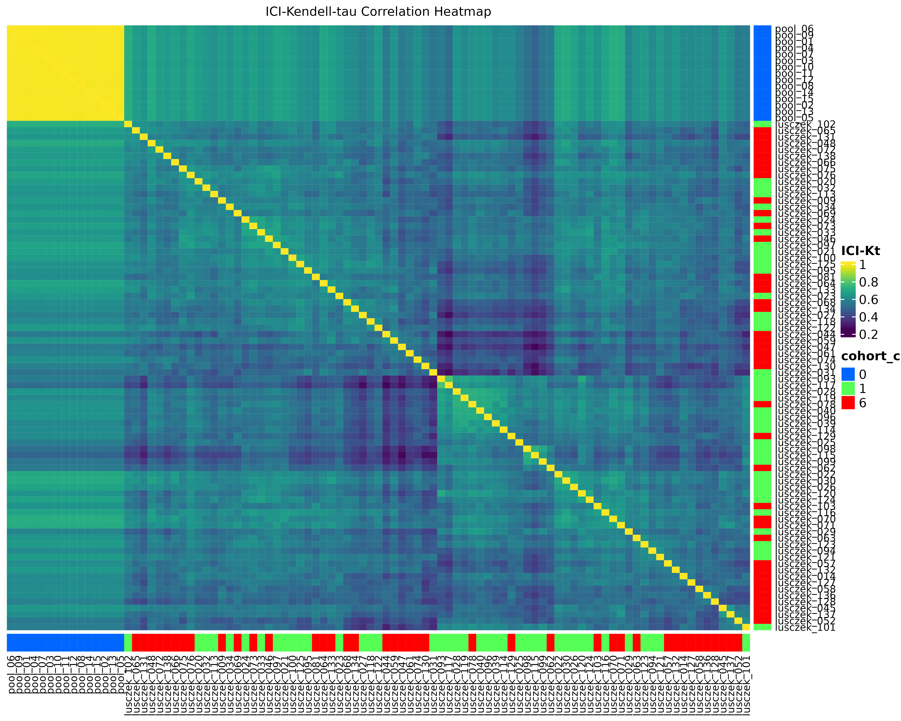
:::
:::


Figure 2.
ICI-Kt correlation heatmap of all samples, ordered by similarity (1 - correlation) and colored by disease group.

This, we admit is not what we hope to see.
There are not large groups of high correlations that also correspond to disease group.
In fact, there doesn't seem to be anything with **really high** correlation outside of the pooled replicates.
The **highest** correlations should be just off the diagonal, i.e. the correlation with the nearest neighbor, except where there are bigger differences.
Let's see what that distribution looks like, in Figure 3.


::: {.cell}
::: {.cell-output-display}
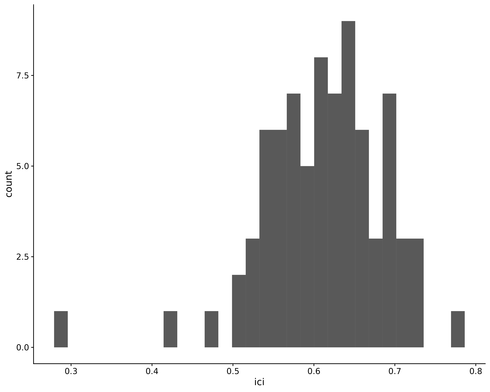
:::
:::


Figure 3.
Histogram of the direct neighbor ICI-Kt correlations (just off the diagonal) from Figure 2.

So a mean value of 0.62, which isn't stupendous, but also not too bad either.
The real problem is that green and red samples have comparatively high correlations with each other.
For example, the ICI-Kt correlation of "lusczek_138" (red) with "lusczek_030" (green) is 0.596.

We can confirm what this really looks like by plotting their actual intensities against each other too, shown in Figure 4.


::: {.cell}
::: {.cell-output-display}
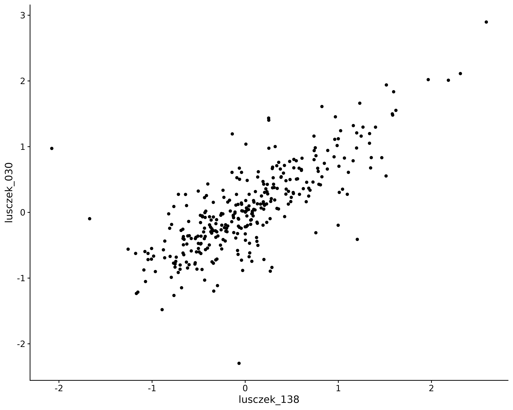
:::
:::


Figure 4.
Plot of the log-intensities of lusczek_138 (red sample) vs lusczek_030 (green sample).

### PCA

We double check all of the above using principal components analysis (PCA), which operates slightly differently than the ICI-Kt correlation.
Figure 5 shows the first two principal components on the osmolarity+median normalized data, with samples colored by disease group.


::: {.cell}
::: {.cell-output-display}
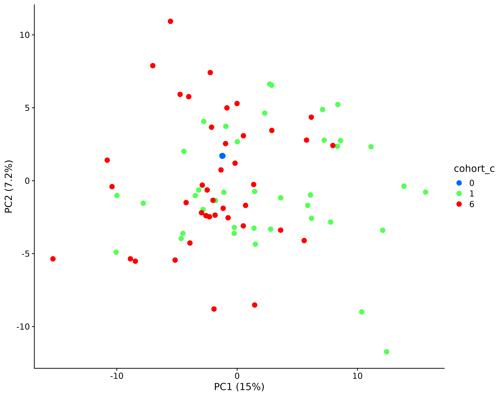
:::
:::


Figure 5.
PCA plot of samples colored by their disease group.


## Green & Red Only

Looking at Figure 5, we can see that all of the pooled samples cluster right in the middle of the plot, and in fact are just off the 0, 0 point on each of PC1 and PC2.
It is possible that they are messing with things a bit.
Therefore, we restrict the analysis to just green I and red samples (`cohort_c` values of 1 and 6, control and chronic pancreatitis, respectively).

### ICI-Kt


::: {.cell}
::: {.cell-output-display}
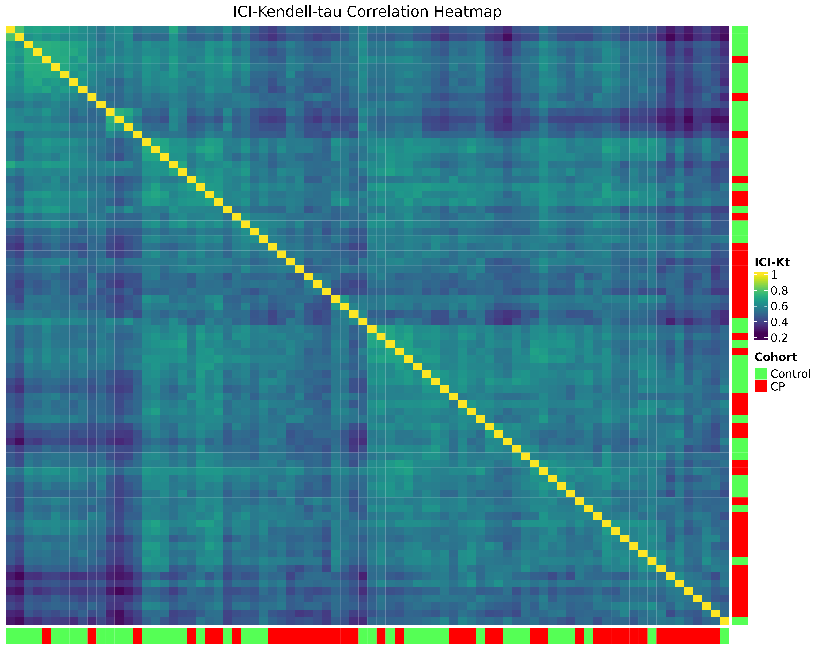
:::
:::


Figure 6.
ICI-Kt heatmap of green I and red samples only, samples arranged by their sample - sample similarity.

When grouped by the cohort group, there is nothing obviously wrong in the sample - sample correlations, as shown in Figure 7.


::: {.cell}
::: {.cell-output-display}
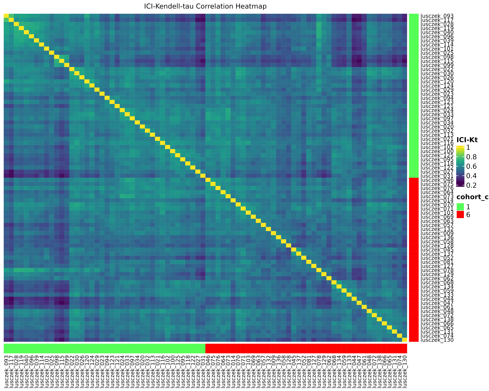
:::
:::


Figure 7.
ICI-Kt heatmap of green I and red samples only, samples arranged by their sample - sample similarity within each cohort of samples.

### Outlier Samples

We can also use the median correlations and feature intensity distributions within each cohort of samples to check if any are outlier samples that should be removed prior to differential analysis.
Figure 8 shows that there is a single sample in cohort 1 (green I) that should be removed.


::: {.cell}
::: {.cell-output-display}
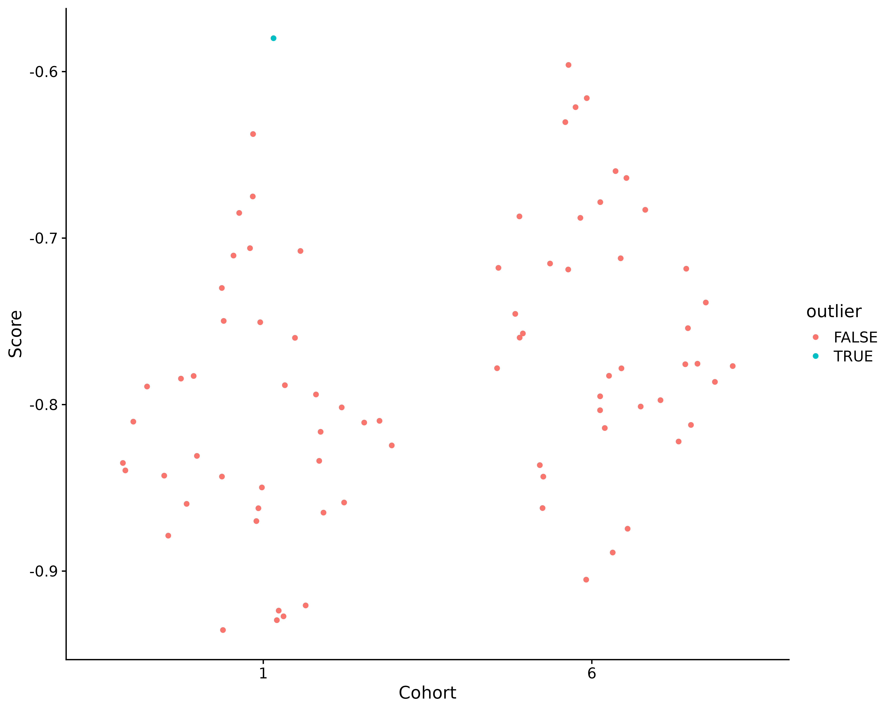
:::
:::


Figure 8.
Sample scores, and indication of whether the sample should be considered an outlier based on the combination of metabolite intensity outlier fraction and sample - sample median correlations.


::: {.cell}
::: {.cell-output-display}
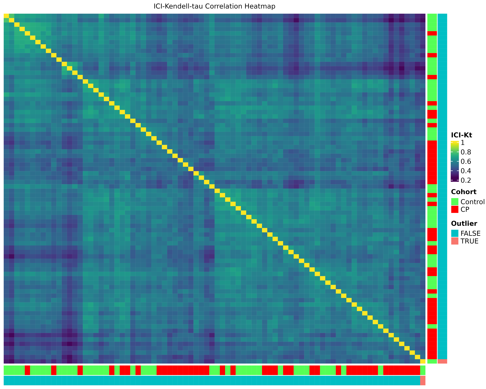
:::
:::


Figure 9. 
ICI-Kt heatmap of Control and CP samples only, samples arranged by their sample - sample similarity. Colors indicate the class of sample, as well as whether the sample was detected as an outlier.

### PCA


::: {.cell}
::: {.cell-output-display}
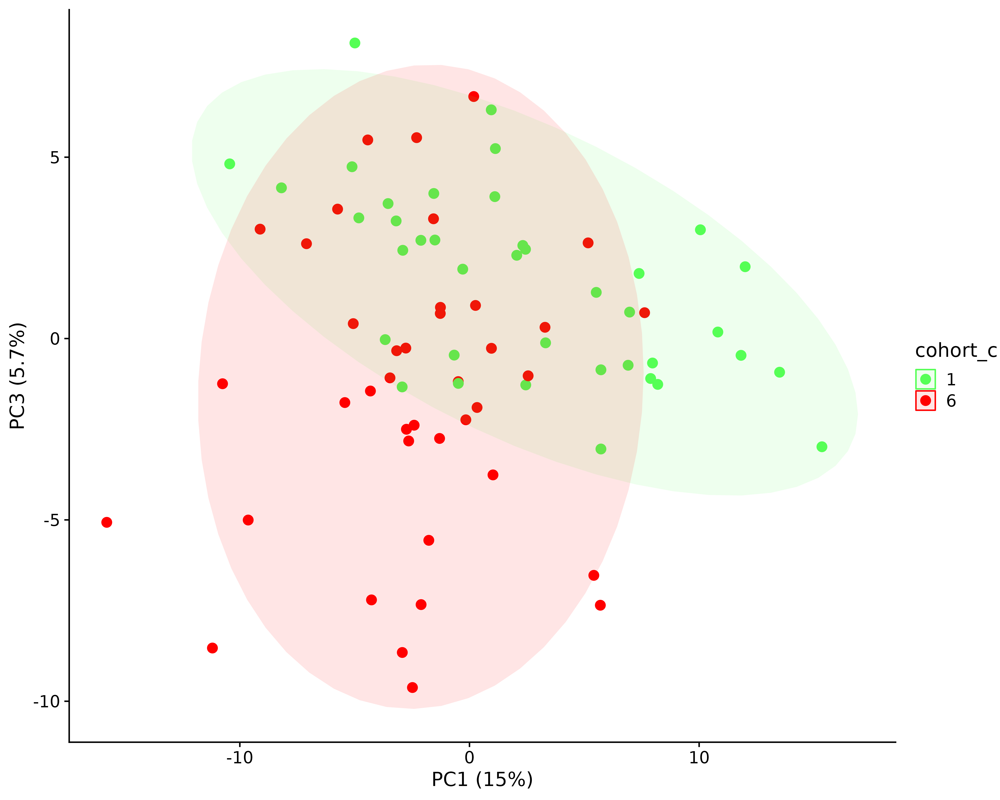
:::
:::


Figure 10.
PCA of green and red samples only, after removing the outlier sample.
Notice it still requires PC3 to separate them.

We can also plot the loadings of the metabolites and see what is going on here.


::: {.cell}
::: {.cell-output-display}
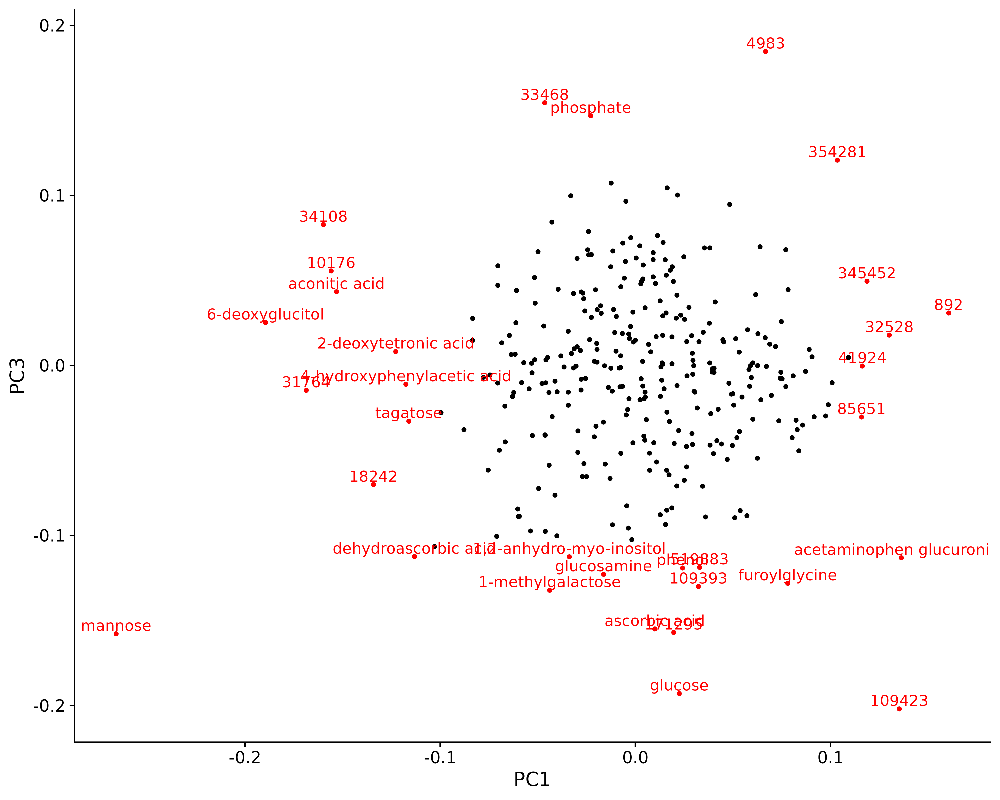
:::
:::


Figure 11.
PCA loadings of metabolites on PC1 and PC3.
Metabolites with a significant loading value for either of PC1 or PC3 (p-value <= 0.05) are shown in red and labeled.


::: {.cell}
::: {.cell-output-display}
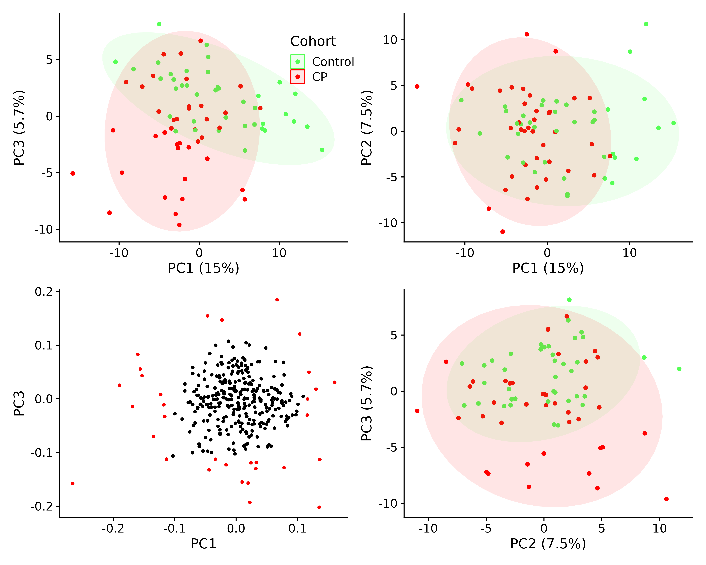
:::
:::


Figure 12.
Score plots of PC1 vs PC3, PC1 vs PC2, PC2 vs PC3, and the loadings of metabolites on PC1 vs PC3.

### PC Scores vs Attributes

We tested the sample attributes against their principal component scores.
PC3 shows up as being very important, but interestingly, it seems to have the same p-value for both `cohort_group` and `year`.
When we check the disease group by year, we see that green I (1) and red (6) are perfectly confounded by year.

Table 4.
ANOVA associations of various sample attributes and principal components.


::: {.cell}
::: {.cell-output-display}

```{=openxml}
<w:tbl xmlns:w="http://schemas.openxmlformats.org/wordprocessingml/2006/main" xmlns:wp="http://schemas.openxmlformats.org/drawingml/2006/wordprocessingDrawing" xmlns:r="http://schemas.openxmlformats.org/officeDocument/2006/relationships" xmlns:w14="http://schemas.microsoft.com/office/word/2010/wordml"><w:tblPr><w:tblCellMar><w:top w:w="0" w:type="dxa"></w:top><w:bottom w:w="0" w:type="dxa"></w:bottom><w:start w:w="60" w:type="dxa"></w:start><w:end w:w="60" w:type="dxa"></w:end></w:tblCellMar><w:tblW w:type="auto" w:w="0"></w:tblW><w:tblLook w:firstRow="0" w:lastRow="0" w:firstColumn="0" w:lastColumn="0" w:noHBand="0" w:noVBand="0"></w:tblLook><w:jc w:val="center"></w:jc></w:tblPr><w:tr><w:trPr><w:cantSplit></w:cantSplit><w:tblHeader></w:tblHeader></w:trPr><w:tc><w:tcPr><w:tcBorders><w:top w:val="single" w:sz="16" w:space="0" w:color="D3D3D3"></w:top><w:bottom w:val="single" w:sz="16" w:space="0" w:color="D3D3D3"></w:bottom><w:start w:val="single" w:space="0" w:color="D3D3D3"></w:start></w:tcBorders></w:tcPr><w:p>
  <w:pPr>
    <w:spacing w:before="0" w:after="60"/>
    <w:keepNext/>
    <w:jc w:val="start"/>
  </w:pPr>
  <w:r>
    <w:rPr>
      <w:rFonts w:ascii="Calibri" w:hAnsi="Calibri"/>
      <w:sz w:val="20"/>
    </w:rPr>
    <w:t xml:space="default">PC</w:t>
  </w:r>
</w:p></w:tc><w:tc><w:tcPr><w:tcBorders><w:top w:val="single" w:sz="16" w:space="0" w:color="D3D3D3"></w:top><w:bottom w:val="single" w:sz="16" w:space="0" w:color="D3D3D3"></w:bottom></w:tcBorders></w:tcPr><w:p>
  <w:pPr>
    <w:spacing w:before="0" w:after="60"/>
    <w:keepNext/>
    <w:jc w:val="end"/>
  </w:pPr>
  <w:r>
    <w:rPr>
      <w:rFonts w:ascii="Calibri" w:hAnsi="Calibri"/>
      <w:sz w:val="20"/>
    </w:rPr>
    <w:t xml:space="default">p.value</w:t>
  </w:r>
</w:p></w:tc><w:tc><w:tcPr><w:tcBorders><w:top w:val="single" w:sz="16" w:space="0" w:color="D3D3D3"></w:top><w:bottom w:val="single" w:sz="16" w:space="0" w:color="D3D3D3"></w:bottom></w:tcBorders></w:tcPr><w:p>
  <w:pPr>
    <w:spacing w:before="0" w:after="60"/>
    <w:keepNext/>
    <w:jc w:val="end"/>
  </w:pPr>
  <w:r>
    <w:rPr>
      <w:rFonts w:ascii="Calibri" w:hAnsi="Calibri"/>
      <w:sz w:val="20"/>
    </w:rPr>
    <w:t xml:space="default">statistic</w:t>
  </w:r>
</w:p></w:tc><w:tc><w:tcPr><w:tcBorders><w:top w:val="single" w:sz="16" w:space="0" w:color="D3D3D3"></w:top><w:bottom w:val="single" w:sz="16" w:space="0" w:color="D3D3D3"></w:bottom><w:end w:val="single" w:space="0" w:color="D3D3D3"></w:end></w:tcBorders></w:tcPr><w:p>
  <w:pPr>
    <w:spacing w:before="0" w:after="60"/>
    <w:keepNext/>
    <w:jc w:val="end"/>
  </w:pPr>
  <w:r>
    <w:rPr>
      <w:rFonts w:ascii="Calibri" w:hAnsi="Calibri"/>
      <w:sz w:val="20"/>
    </w:rPr>
    <w:t xml:space="default">df</w:t>
  </w:r>
</w:p></w:tc></w:tr><w:tr><w:trPr><w:cantSplit></w:cantSplit></w:trPr><w:tc><w:tcPr><w:tcBorders><w:top w:val="single" w:sz="16" w:space="0" w:color="D3D3D3"></w:top><w:bottom w:val="single" w:sz="16" w:space="0" w:color="D3D3D3"></w:bottom><w:start w:val="single" w:space="0" w:color="D3D3D3"></w:start><w:end w:val="single" w:space="0" w:color="D3D3D3"></w:end></w:tcBorders><w:tcMar><w:top w:w="25" w:type="dxa"></w:top></w:tcMar><w:gridSpan w:val="4"/></w:tcPr><w:p>
  <w:pPr>
    <w:spacing w:before="0" w:after="60"/>
    <w:keepNext/>
  </w:pPr>
  <w:r>
    <w:rPr>
      <w:rFonts w:ascii="Calibri" w:hAnsi="Calibri"/>
      <w:sz w:val="20"/>
    </w:rPr>
    <w:t xml:space="default">cohort_group</w:t>
  </w:r>
</w:p></w:tc></w:tr>
<w:tr><w:trPr><w:cantSplit></w:cantSplit></w:trPr><w:tc><w:tcPr><w:tcBorders><w:top w:val="single" w:space="0" w:color="D3D3D3"></w:top><w:bottom w:val="single" w:space="0" w:color="D3D3D3"></w:bottom><w:start w:val="single" w:space="0" w:color="D3D3D3"></w:start><w:end w:val="single" w:space="0" w:color="D3D3D3"></w:end></w:tcBorders></w:tcPr><w:p>
  <w:pPr>
    <w:spacing w:before="0" w:after="60"/>
    <w:keepNext/>
    <w:jc w:val="start"/>
  </w:pPr>
  <w:r>
    <w:rPr>
      <w:rFonts w:ascii="Calibri" w:hAnsi="Calibri"/>
      <w:sz w:val="20"/>
    </w:rPr>
    <w:t xml:space="default">PC3</w:t>
  </w:r>
</w:p></w:tc><w:tc><w:tcPr><w:tcBorders><w:top w:val="single" w:space="0" w:color="D3D3D3"></w:top><w:bottom w:val="single" w:space="0" w:color="D3D3D3"></w:bottom><w:start w:val="single" w:space="0" w:color="D3D3D3"></w:start><w:end w:val="single" w:space="0" w:color="D3D3D3"></w:end></w:tcBorders></w:tcPr><w:p>
  <w:pPr>
    <w:spacing w:before="0" w:after="60"/>
    <w:keepNext/>
    <w:jc w:val="end"/>
  </w:pPr>
  <w:r>
    <w:rPr>
      <w:rFonts w:ascii="Calibri" w:hAnsi="Calibri"/>
      <w:sz w:val="20"/>
    </w:rPr>
    <w:t xml:space="default">1.36 × 10^-4</w:t>
  </w:r>
</w:p></w:tc><w:tc><w:tcPr><w:tcBorders><w:top w:val="single" w:space="0" w:color="D3D3D3"></w:top><w:bottom w:val="single" w:space="0" w:color="D3D3D3"></w:bottom><w:start w:val="single" w:space="0" w:color="D3D3D3"></w:start><w:end w:val="single" w:space="0" w:color="D3D3D3"></w:end></w:tcBorders></w:tcPr><w:p>
  <w:pPr>
    <w:spacing w:before="0" w:after="60"/>
    <w:keepNext/>
    <w:jc w:val="end"/>
  </w:pPr>
  <w:r>
    <w:rPr>
      <w:rFonts w:ascii="Calibri" w:hAnsi="Calibri"/>
      <w:sz w:val="20"/>
    </w:rPr>
    <w:t xml:space="default">16.13</w:t>
  </w:r>
</w:p></w:tc><w:tc><w:tcPr><w:tcBorders><w:top w:val="single" w:space="0" w:color="D3D3D3"></w:top><w:bottom w:val="single" w:space="0" w:color="D3D3D3"></w:bottom><w:start w:val="single" w:space="0" w:color="D3D3D3"></w:start><w:end w:val="single" w:space="0" w:color="D3D3D3"></w:end></w:tcBorders></w:tcPr><w:p>
  <w:pPr>
    <w:spacing w:before="0" w:after="60"/>
    <w:keepNext/>
    <w:jc w:val="end"/>
  </w:pPr>
  <w:r>
    <w:rPr>
      <w:rFonts w:ascii="Calibri" w:hAnsi="Calibri"/>
      <w:sz w:val="20"/>
    </w:rPr>
    <w:t xml:space="default">1.00</w:t>
  </w:r>
</w:p></w:tc></w:tr>
<w:tr><w:trPr><w:cantSplit></w:cantSplit></w:trPr><w:tc><w:tcPr><w:tcBorders><w:top w:val="single" w:space="0" w:color="D3D3D3"></w:top><w:bottom w:val="single" w:space="0" w:color="D3D3D3"></w:bottom><w:start w:val="single" w:space="0" w:color="D3D3D3"></w:start><w:end w:val="single" w:space="0" w:color="D3D3D3"></w:end></w:tcBorders></w:tcPr><w:p>
  <w:pPr>
    <w:spacing w:before="0" w:after="60"/>
    <w:keepNext/>
    <w:jc w:val="start"/>
  </w:pPr>
  <w:r>
    <w:rPr>
      <w:rFonts w:ascii="Calibri" w:hAnsi="Calibri"/>
      <w:sz w:val="20"/>
    </w:rPr>
    <w:t xml:space="default">PC1</w:t>
  </w:r>
</w:p></w:tc><w:tc><w:tcPr><w:tcBorders><w:top w:val="single" w:space="0" w:color="D3D3D3"></w:top><w:bottom w:val="single" w:space="0" w:color="D3D3D3"></w:bottom><w:start w:val="single" w:space="0" w:color="D3D3D3"></w:start><w:end w:val="single" w:space="0" w:color="D3D3D3"></w:end></w:tcBorders></w:tcPr><w:p>
  <w:pPr>
    <w:spacing w:before="0" w:after="60"/>
    <w:keepNext/>
    <w:jc w:val="end"/>
  </w:pPr>
  <w:r>
    <w:rPr>
      <w:rFonts w:ascii="Calibri" w:hAnsi="Calibri"/>
      <w:sz w:val="20"/>
    </w:rPr>
    <w:t xml:space="default">2.29 × 10^-4</w:t>
  </w:r>
</w:p></w:tc><w:tc><w:tcPr><w:tcBorders><w:top w:val="single" w:space="0" w:color="D3D3D3"></w:top><w:bottom w:val="single" w:space="0" w:color="D3D3D3"></w:bottom><w:start w:val="single" w:space="0" w:color="D3D3D3"></w:start><w:end w:val="single" w:space="0" w:color="D3D3D3"></w:end></w:tcBorders></w:tcPr><w:p>
  <w:pPr>
    <w:spacing w:before="0" w:after="60"/>
    <w:keepNext/>
    <w:jc w:val="end"/>
  </w:pPr>
  <w:r>
    <w:rPr>
      <w:rFonts w:ascii="Calibri" w:hAnsi="Calibri"/>
      <w:sz w:val="20"/>
    </w:rPr>
    <w:t xml:space="default">14.95</w:t>
  </w:r>
</w:p></w:tc><w:tc><w:tcPr><w:tcBorders><w:top w:val="single" w:space="0" w:color="D3D3D3"></w:top><w:bottom w:val="single" w:space="0" w:color="D3D3D3"></w:bottom><w:start w:val="single" w:space="0" w:color="D3D3D3"></w:start><w:end w:val="single" w:space="0" w:color="D3D3D3"></w:end></w:tcBorders></w:tcPr><w:p>
  <w:pPr>
    <w:spacing w:before="0" w:after="60"/>
    <w:keepNext/>
    <w:jc w:val="end"/>
  </w:pPr>
  <w:r>
    <w:rPr>
      <w:rFonts w:ascii="Calibri" w:hAnsi="Calibri"/>
      <w:sz w:val="20"/>
    </w:rPr>
    <w:t xml:space="default">1.00</w:t>
  </w:r>
</w:p></w:tc></w:tr>
<w:tr><w:trPr><w:cantSplit></w:cantSplit></w:trPr><w:tc><w:tcPr><w:tcBorders><w:top w:val="single" w:space="0" w:color="D3D3D3"></w:top><w:bottom w:val="single" w:space="0" w:color="D3D3D3"></w:bottom><w:start w:val="single" w:space="0" w:color="D3D3D3"></w:start><w:end w:val="single" w:space="0" w:color="D3D3D3"></w:end></w:tcBorders></w:tcPr><w:p>
  <w:pPr>
    <w:spacing w:before="0" w:after="60"/>
    <w:keepNext/>
    <w:jc w:val="start"/>
  </w:pPr>
  <w:r>
    <w:rPr>
      <w:rFonts w:ascii="Calibri" w:hAnsi="Calibri"/>
      <w:sz w:val="20"/>
    </w:rPr>
    <w:t xml:space="default">PC53</w:t>
  </w:r>
</w:p></w:tc><w:tc><w:tcPr><w:tcBorders><w:top w:val="single" w:space="0" w:color="D3D3D3"></w:top><w:bottom w:val="single" w:space="0" w:color="D3D3D3"></w:bottom><w:start w:val="single" w:space="0" w:color="D3D3D3"></w:start><w:end w:val="single" w:space="0" w:color="D3D3D3"></w:end></w:tcBorders></w:tcPr><w:p>
  <w:pPr>
    <w:spacing w:before="0" w:after="60"/>
    <w:keepNext/>
    <w:jc w:val="end"/>
  </w:pPr>
  <w:r>
    <w:rPr>
      <w:rFonts w:ascii="Calibri" w:hAnsi="Calibri"/>
      <w:sz w:val="20"/>
    </w:rPr>
    <w:t xml:space="default">5.60 × 10^-2</w:t>
  </w:r>
</w:p></w:tc><w:tc><w:tcPr><w:tcBorders><w:top w:val="single" w:space="0" w:color="D3D3D3"></w:top><w:bottom w:val="single" w:space="0" w:color="D3D3D3"></w:bottom><w:start w:val="single" w:space="0" w:color="D3D3D3"></w:start><w:end w:val="single" w:space="0" w:color="D3D3D3"></w:end></w:tcBorders></w:tcPr><w:p>
  <w:pPr>
    <w:spacing w:before="0" w:after="60"/>
    <w:keepNext/>
    <w:jc w:val="end"/>
  </w:pPr>
  <w:r>
    <w:rPr>
      <w:rFonts w:ascii="Calibri" w:hAnsi="Calibri"/>
      <w:sz w:val="20"/>
    </w:rPr>
    <w:t xml:space="default">3.77</w:t>
  </w:r>
</w:p></w:tc><w:tc><w:tcPr><w:tcBorders><w:top w:val="single" w:space="0" w:color="D3D3D3"></w:top><w:bottom w:val="single" w:space="0" w:color="D3D3D3"></w:bottom><w:start w:val="single" w:space="0" w:color="D3D3D3"></w:start><w:end w:val="single" w:space="0" w:color="D3D3D3"></w:end></w:tcBorders></w:tcPr><w:p>
  <w:pPr>
    <w:spacing w:before="0" w:after="60"/>
    <w:keepNext/>
    <w:jc w:val="end"/>
  </w:pPr>
  <w:r>
    <w:rPr>
      <w:rFonts w:ascii="Calibri" w:hAnsi="Calibri"/>
      <w:sz w:val="20"/>
    </w:rPr>
    <w:t xml:space="default">1.00</w:t>
  </w:r>
</w:p></w:tc></w:tr>
<w:tr><w:trPr><w:cantSplit></w:cantSplit></w:trPr><w:tc><w:tcPr><w:tcBorders><w:top w:val="single" w:sz="16" w:space="0" w:color="D3D3D3"></w:top><w:bottom w:val="single" w:sz="16" w:space="0" w:color="D3D3D3"></w:bottom><w:start w:val="single" w:space="0" w:color="D3D3D3"></w:start><w:end w:val="single" w:space="0" w:color="D3D3D3"></w:end></w:tcBorders><w:tcMar><w:top w:w="25" w:type="dxa"></w:top></w:tcMar><w:gridSpan w:val="4"/></w:tcPr><w:p>
  <w:pPr>
    <w:spacing w:before="0" w:after="60"/>
    <w:keepNext/>
  </w:pPr>
  <w:r>
    <w:rPr>
      <w:rFonts w:ascii="Calibri" w:hAnsi="Calibri"/>
      <w:sz w:val="20"/>
    </w:rPr>
    <w:t xml:space="default">diabetes_bl</w:t>
  </w:r>
</w:p></w:tc></w:tr>
<w:tr><w:trPr><w:cantSplit></w:cantSplit></w:trPr><w:tc><w:tcPr><w:tcBorders><w:top w:val="single" w:space="0" w:color="D3D3D3"></w:top><w:bottom w:val="single" w:space="0" w:color="D3D3D3"></w:bottom><w:start w:val="single" w:space="0" w:color="D3D3D3"></w:start><w:end w:val="single" w:space="0" w:color="D3D3D3"></w:end></w:tcBorders></w:tcPr><w:p>
  <w:pPr>
    <w:spacing w:before="0" w:after="60"/>
    <w:keepNext/>
    <w:jc w:val="start"/>
  </w:pPr>
  <w:r>
    <w:rPr>
      <w:rFonts w:ascii="Calibri" w:hAnsi="Calibri"/>
      <w:sz w:val="20"/>
    </w:rPr>
    <w:t xml:space="default">PC3</w:t>
  </w:r>
</w:p></w:tc><w:tc><w:tcPr><w:tcBorders><w:top w:val="single" w:space="0" w:color="D3D3D3"></w:top><w:bottom w:val="single" w:space="0" w:color="D3D3D3"></w:bottom><w:start w:val="single" w:space="0" w:color="D3D3D3"></w:start><w:end w:val="single" w:space="0" w:color="D3D3D3"></w:end></w:tcBorders></w:tcPr><w:p>
  <w:pPr>
    <w:spacing w:before="0" w:after="60"/>
    <w:keepNext/>
    <w:jc w:val="end"/>
  </w:pPr>
  <w:r>
    <w:rPr>
      <w:rFonts w:ascii="Calibri" w:hAnsi="Calibri"/>
      <w:sz w:val="20"/>
    </w:rPr>
    <w:t xml:space="default">2.28 × 10^-8</w:t>
  </w:r>
</w:p></w:tc><w:tc><w:tcPr><w:tcBorders><w:top w:val="single" w:space="0" w:color="D3D3D3"></w:top><w:bottom w:val="single" w:space="0" w:color="D3D3D3"></w:bottom><w:start w:val="single" w:space="0" w:color="D3D3D3"></w:start><w:end w:val="single" w:space="0" w:color="D3D3D3"></w:end></w:tcBorders></w:tcPr><w:p>
  <w:pPr>
    <w:spacing w:before="0" w:after="60"/>
    <w:keepNext/>
    <w:jc w:val="end"/>
  </w:pPr>
  <w:r>
    <w:rPr>
      <w:rFonts w:ascii="Calibri" w:hAnsi="Calibri"/>
      <w:sz w:val="20"/>
    </w:rPr>
    <w:t xml:space="default">22.38</w:t>
  </w:r>
</w:p></w:tc><w:tc><w:tcPr><w:tcBorders><w:top w:val="single" w:space="0" w:color="D3D3D3"></w:top><w:bottom w:val="single" w:space="0" w:color="D3D3D3"></w:bottom><w:start w:val="single" w:space="0" w:color="D3D3D3"></w:start><w:end w:val="single" w:space="0" w:color="D3D3D3"></w:end></w:tcBorders></w:tcPr><w:p>
  <w:pPr>
    <w:spacing w:before="0" w:after="60"/>
    <w:keepNext/>
    <w:jc w:val="end"/>
  </w:pPr>
  <w:r>
    <w:rPr>
      <w:rFonts w:ascii="Calibri" w:hAnsi="Calibri"/>
      <w:sz w:val="20"/>
    </w:rPr>
    <w:t xml:space="default">2.00</w:t>
  </w:r>
</w:p></w:tc></w:tr>
<w:tr><w:trPr><w:cantSplit></w:cantSplit></w:trPr><w:tc><w:tcPr><w:tcBorders><w:top w:val="single" w:space="0" w:color="D3D3D3"></w:top><w:bottom w:val="single" w:space="0" w:color="D3D3D3"></w:bottom><w:start w:val="single" w:space="0" w:color="D3D3D3"></w:start><w:end w:val="single" w:space="0" w:color="D3D3D3"></w:end></w:tcBorders></w:tcPr><w:p>
  <w:pPr>
    <w:spacing w:before="0" w:after="60"/>
    <w:keepNext/>
    <w:jc w:val="start"/>
  </w:pPr>
  <w:r>
    <w:rPr>
      <w:rFonts w:ascii="Calibri" w:hAnsi="Calibri"/>
      <w:sz w:val="20"/>
    </w:rPr>
    <w:t xml:space="default">PC1</w:t>
  </w:r>
</w:p></w:tc><w:tc><w:tcPr><w:tcBorders><w:top w:val="single" w:space="0" w:color="D3D3D3"></w:top><w:bottom w:val="single" w:space="0" w:color="D3D3D3"></w:bottom><w:start w:val="single" w:space="0" w:color="D3D3D3"></w:start><w:end w:val="single" w:space="0" w:color="D3D3D3"></w:end></w:tcBorders></w:tcPr><w:p>
  <w:pPr>
    <w:spacing w:before="0" w:after="60"/>
    <w:keepNext/>
    <w:jc w:val="end"/>
  </w:pPr>
  <w:r>
    <w:rPr>
      <w:rFonts w:ascii="Calibri" w:hAnsi="Calibri"/>
      <w:sz w:val="20"/>
    </w:rPr>
    <w:t xml:space="default">2.74 × 10^-4</w:t>
  </w:r>
</w:p></w:tc><w:tc><w:tcPr><w:tcBorders><w:top w:val="single" w:space="0" w:color="D3D3D3"></w:top><w:bottom w:val="single" w:space="0" w:color="D3D3D3"></w:bottom><w:start w:val="single" w:space="0" w:color="D3D3D3"></w:start><w:end w:val="single" w:space="0" w:color="D3D3D3"></w:end></w:tcBorders></w:tcPr><w:p>
  <w:pPr>
    <w:spacing w:before="0" w:after="60"/>
    <w:keepNext/>
    <w:jc w:val="end"/>
  </w:pPr>
  <w:r>
    <w:rPr>
      <w:rFonts w:ascii="Calibri" w:hAnsi="Calibri"/>
      <w:sz w:val="20"/>
    </w:rPr>
    <w:t xml:space="default">9.16</w:t>
  </w:r>
</w:p></w:tc><w:tc><w:tcPr><w:tcBorders><w:top w:val="single" w:space="0" w:color="D3D3D3"></w:top><w:bottom w:val="single" w:space="0" w:color="D3D3D3"></w:bottom><w:start w:val="single" w:space="0" w:color="D3D3D3"></w:start><w:end w:val="single" w:space="0" w:color="D3D3D3"></w:end></w:tcBorders></w:tcPr><w:p>
  <w:pPr>
    <w:spacing w:before="0" w:after="60"/>
    <w:keepNext/>
    <w:jc w:val="end"/>
  </w:pPr>
  <w:r>
    <w:rPr>
      <w:rFonts w:ascii="Calibri" w:hAnsi="Calibri"/>
      <w:sz w:val="20"/>
    </w:rPr>
    <w:t xml:space="default">2.00</w:t>
  </w:r>
</w:p></w:tc></w:tr>
<w:tr><w:trPr><w:cantSplit></w:cantSplit></w:trPr><w:tc><w:tcPr><w:tcBorders><w:top w:val="single" w:space="0" w:color="D3D3D3"></w:top><w:bottom w:val="single" w:space="0" w:color="D3D3D3"></w:bottom><w:start w:val="single" w:space="0" w:color="D3D3D3"></w:start><w:end w:val="single" w:space="0" w:color="D3D3D3"></w:end></w:tcBorders></w:tcPr><w:p>
  <w:pPr>
    <w:spacing w:before="0" w:after="60"/>
    <w:keepNext/>
    <w:jc w:val="start"/>
  </w:pPr>
  <w:r>
    <w:rPr>
      <w:rFonts w:ascii="Calibri" w:hAnsi="Calibri"/>
      <w:sz w:val="20"/>
    </w:rPr>
    <w:t xml:space="default">PC4</w:t>
  </w:r>
</w:p></w:tc><w:tc><w:tcPr><w:tcBorders><w:top w:val="single" w:space="0" w:color="D3D3D3"></w:top><w:bottom w:val="single" w:space="0" w:color="D3D3D3"></w:bottom><w:start w:val="single" w:space="0" w:color="D3D3D3"></w:start><w:end w:val="single" w:space="0" w:color="D3D3D3"></w:end></w:tcBorders></w:tcPr><w:p>
  <w:pPr>
    <w:spacing w:before="0" w:after="60"/>
    <w:keepNext/>
    <w:jc w:val="end"/>
  </w:pPr>
  <w:r>
    <w:rPr>
      <w:rFonts w:ascii="Calibri" w:hAnsi="Calibri"/>
      <w:sz w:val="20"/>
    </w:rPr>
    <w:t xml:space="default">7.36 × 10^-2</w:t>
  </w:r>
</w:p></w:tc><w:tc><w:tcPr><w:tcBorders><w:top w:val="single" w:space="0" w:color="D3D3D3"></w:top><w:bottom w:val="single" w:space="0" w:color="D3D3D3"></w:bottom><w:start w:val="single" w:space="0" w:color="D3D3D3"></w:start><w:end w:val="single" w:space="0" w:color="D3D3D3"></w:end></w:tcBorders></w:tcPr><w:p>
  <w:pPr>
    <w:spacing w:before="0" w:after="60"/>
    <w:keepNext/>
    <w:jc w:val="end"/>
  </w:pPr>
  <w:r>
    <w:rPr>
      <w:rFonts w:ascii="Calibri" w:hAnsi="Calibri"/>
      <w:sz w:val="20"/>
    </w:rPr>
    <w:t xml:space="default">2.70</w:t>
  </w:r>
</w:p></w:tc><w:tc><w:tcPr><w:tcBorders><w:top w:val="single" w:space="0" w:color="D3D3D3"></w:top><w:bottom w:val="single" w:space="0" w:color="D3D3D3"></w:bottom><w:start w:val="single" w:space="0" w:color="D3D3D3"></w:start><w:end w:val="single" w:space="0" w:color="D3D3D3"></w:end></w:tcBorders></w:tcPr><w:p>
  <w:pPr>
    <w:spacing w:before="0" w:after="60"/>
    <w:keepNext/>
    <w:jc w:val="end"/>
  </w:pPr>
  <w:r>
    <w:rPr>
      <w:rFonts w:ascii="Calibri" w:hAnsi="Calibri"/>
      <w:sz w:val="20"/>
    </w:rPr>
    <w:t xml:space="default">2.00</w:t>
  </w:r>
</w:p></w:tc></w:tr>
<w:tr><w:trPr><w:cantSplit></w:cantSplit></w:trPr><w:tc><w:tcPr><w:tcBorders><w:top w:val="single" w:sz="16" w:space="0" w:color="D3D3D3"></w:top><w:bottom w:val="single" w:sz="16" w:space="0" w:color="D3D3D3"></w:bottom><w:start w:val="single" w:space="0" w:color="D3D3D3"></w:start><w:end w:val="single" w:space="0" w:color="D3D3D3"></w:end></w:tcBorders><w:tcMar><w:top w:w="25" w:type="dxa"></w:top></w:tcMar><w:gridSpan w:val="4"/></w:tcPr><w:p>
  <w:pPr>
    <w:spacing w:before="0" w:after="60"/>
    <w:keepNext/>
  </w:pPr>
  <w:r>
    <w:rPr>
      <w:rFonts w:ascii="Calibri" w:hAnsi="Calibri"/>
      <w:sz w:val="20"/>
    </w:rPr>
    <w:t xml:space="default">disease_cohort</w:t>
  </w:r>
</w:p></w:tc></w:tr>
<w:tr><w:trPr><w:cantSplit></w:cantSplit></w:trPr><w:tc><w:tcPr><w:tcBorders><w:top w:val="single" w:space="0" w:color="D3D3D3"></w:top><w:bottom w:val="single" w:space="0" w:color="D3D3D3"></w:bottom><w:start w:val="single" w:space="0" w:color="D3D3D3"></w:start><w:end w:val="single" w:space="0" w:color="D3D3D3"></w:end></w:tcBorders></w:tcPr><w:p>
  <w:pPr>
    <w:spacing w:before="0" w:after="60"/>
    <w:keepNext/>
    <w:jc w:val="start"/>
  </w:pPr>
  <w:r>
    <w:rPr>
      <w:rFonts w:ascii="Calibri" w:hAnsi="Calibri"/>
      <w:sz w:val="20"/>
    </w:rPr>
    <w:t xml:space="default">PC3</w:t>
  </w:r>
</w:p></w:tc><w:tc><w:tcPr><w:tcBorders><w:top w:val="single" w:space="0" w:color="D3D3D3"></w:top><w:bottom w:val="single" w:space="0" w:color="D3D3D3"></w:bottom><w:start w:val="single" w:space="0" w:color="D3D3D3"></w:start><w:end w:val="single" w:space="0" w:color="D3D3D3"></w:end></w:tcBorders></w:tcPr><w:p>
  <w:pPr>
    <w:spacing w:before="0" w:after="60"/>
    <w:keepNext/>
    <w:jc w:val="end"/>
  </w:pPr>
  <w:r>
    <w:rPr>
      <w:rFonts w:ascii="Calibri" w:hAnsi="Calibri"/>
      <w:sz w:val="20"/>
    </w:rPr>
    <w:t xml:space="default">1.36 × 10^-4</w:t>
  </w:r>
</w:p></w:tc><w:tc><w:tcPr><w:tcBorders><w:top w:val="single" w:space="0" w:color="D3D3D3"></w:top><w:bottom w:val="single" w:space="0" w:color="D3D3D3"></w:bottom><w:start w:val="single" w:space="0" w:color="D3D3D3"></w:start><w:end w:val="single" w:space="0" w:color="D3D3D3"></w:end></w:tcBorders></w:tcPr><w:p>
  <w:pPr>
    <w:spacing w:before="0" w:after="60"/>
    <w:keepNext/>
    <w:jc w:val="end"/>
  </w:pPr>
  <w:r>
    <w:rPr>
      <w:rFonts w:ascii="Calibri" w:hAnsi="Calibri"/>
      <w:sz w:val="20"/>
    </w:rPr>
    <w:t xml:space="default">16.13</w:t>
  </w:r>
</w:p></w:tc><w:tc><w:tcPr><w:tcBorders><w:top w:val="single" w:space="0" w:color="D3D3D3"></w:top><w:bottom w:val="single" w:space="0" w:color="D3D3D3"></w:bottom><w:start w:val="single" w:space="0" w:color="D3D3D3"></w:start><w:end w:val="single" w:space="0" w:color="D3D3D3"></w:end></w:tcBorders></w:tcPr><w:p>
  <w:pPr>
    <w:spacing w:before="0" w:after="60"/>
    <w:keepNext/>
    <w:jc w:val="end"/>
  </w:pPr>
  <w:r>
    <w:rPr>
      <w:rFonts w:ascii="Calibri" w:hAnsi="Calibri"/>
      <w:sz w:val="20"/>
    </w:rPr>
    <w:t xml:space="default">1.00</w:t>
  </w:r>
</w:p></w:tc></w:tr>
<w:tr><w:trPr><w:cantSplit></w:cantSplit></w:trPr><w:tc><w:tcPr><w:tcBorders><w:top w:val="single" w:space="0" w:color="D3D3D3"></w:top><w:bottom w:val="single" w:space="0" w:color="D3D3D3"></w:bottom><w:start w:val="single" w:space="0" w:color="D3D3D3"></w:start><w:end w:val="single" w:space="0" w:color="D3D3D3"></w:end></w:tcBorders></w:tcPr><w:p>
  <w:pPr>
    <w:spacing w:before="0" w:after="60"/>
    <w:keepNext/>
    <w:jc w:val="start"/>
  </w:pPr>
  <w:r>
    <w:rPr>
      <w:rFonts w:ascii="Calibri" w:hAnsi="Calibri"/>
      <w:sz w:val="20"/>
    </w:rPr>
    <w:t xml:space="default">PC1</w:t>
  </w:r>
</w:p></w:tc><w:tc><w:tcPr><w:tcBorders><w:top w:val="single" w:space="0" w:color="D3D3D3"></w:top><w:bottom w:val="single" w:space="0" w:color="D3D3D3"></w:bottom><w:start w:val="single" w:space="0" w:color="D3D3D3"></w:start><w:end w:val="single" w:space="0" w:color="D3D3D3"></w:end></w:tcBorders></w:tcPr><w:p>
  <w:pPr>
    <w:spacing w:before="0" w:after="60"/>
    <w:keepNext/>
    <w:jc w:val="end"/>
  </w:pPr>
  <w:r>
    <w:rPr>
      <w:rFonts w:ascii="Calibri" w:hAnsi="Calibri"/>
      <w:sz w:val="20"/>
    </w:rPr>
    <w:t xml:space="default">2.29 × 10^-4</w:t>
  </w:r>
</w:p></w:tc><w:tc><w:tcPr><w:tcBorders><w:top w:val="single" w:space="0" w:color="D3D3D3"></w:top><w:bottom w:val="single" w:space="0" w:color="D3D3D3"></w:bottom><w:start w:val="single" w:space="0" w:color="D3D3D3"></w:start><w:end w:val="single" w:space="0" w:color="D3D3D3"></w:end></w:tcBorders></w:tcPr><w:p>
  <w:pPr>
    <w:spacing w:before="0" w:after="60"/>
    <w:keepNext/>
    <w:jc w:val="end"/>
  </w:pPr>
  <w:r>
    <w:rPr>
      <w:rFonts w:ascii="Calibri" w:hAnsi="Calibri"/>
      <w:sz w:val="20"/>
    </w:rPr>
    <w:t xml:space="default">14.95</w:t>
  </w:r>
</w:p></w:tc><w:tc><w:tcPr><w:tcBorders><w:top w:val="single" w:space="0" w:color="D3D3D3"></w:top><w:bottom w:val="single" w:space="0" w:color="D3D3D3"></w:bottom><w:start w:val="single" w:space="0" w:color="D3D3D3"></w:start><w:end w:val="single" w:space="0" w:color="D3D3D3"></w:end></w:tcBorders></w:tcPr><w:p>
  <w:pPr>
    <w:spacing w:before="0" w:after="60"/>
    <w:keepNext/>
    <w:jc w:val="end"/>
  </w:pPr>
  <w:r>
    <w:rPr>
      <w:rFonts w:ascii="Calibri" w:hAnsi="Calibri"/>
      <w:sz w:val="20"/>
    </w:rPr>
    <w:t xml:space="default">1.00</w:t>
  </w:r>
</w:p></w:tc></w:tr>
<w:tr><w:trPr><w:cantSplit></w:cantSplit></w:trPr><w:tc><w:tcPr><w:tcBorders><w:top w:val="single" w:space="0" w:color="D3D3D3"></w:top><w:bottom w:val="single" w:space="0" w:color="D3D3D3"></w:bottom><w:start w:val="single" w:space="0" w:color="D3D3D3"></w:start><w:end w:val="single" w:space="0" w:color="D3D3D3"></w:end></w:tcBorders></w:tcPr><w:p>
  <w:pPr>
    <w:spacing w:before="0" w:after="60"/>
    <w:keepNext/>
    <w:jc w:val="start"/>
  </w:pPr>
  <w:r>
    <w:rPr>
      <w:rFonts w:ascii="Calibri" w:hAnsi="Calibri"/>
      <w:sz w:val="20"/>
    </w:rPr>
    <w:t xml:space="default">PC53</w:t>
  </w:r>
</w:p></w:tc><w:tc><w:tcPr><w:tcBorders><w:top w:val="single" w:space="0" w:color="D3D3D3"></w:top><w:bottom w:val="single" w:space="0" w:color="D3D3D3"></w:bottom><w:start w:val="single" w:space="0" w:color="D3D3D3"></w:start><w:end w:val="single" w:space="0" w:color="D3D3D3"></w:end></w:tcBorders></w:tcPr><w:p>
  <w:pPr>
    <w:spacing w:before="0" w:after="60"/>
    <w:keepNext/>
    <w:jc w:val="end"/>
  </w:pPr>
  <w:r>
    <w:rPr>
      <w:rFonts w:ascii="Calibri" w:hAnsi="Calibri"/>
      <w:sz w:val="20"/>
    </w:rPr>
    <w:t xml:space="default">5.60 × 10^-2</w:t>
  </w:r>
</w:p></w:tc><w:tc><w:tcPr><w:tcBorders><w:top w:val="single" w:space="0" w:color="D3D3D3"></w:top><w:bottom w:val="single" w:space="0" w:color="D3D3D3"></w:bottom><w:start w:val="single" w:space="0" w:color="D3D3D3"></w:start><w:end w:val="single" w:space="0" w:color="D3D3D3"></w:end></w:tcBorders></w:tcPr><w:p>
  <w:pPr>
    <w:spacing w:before="0" w:after="60"/>
    <w:keepNext/>
    <w:jc w:val="end"/>
  </w:pPr>
  <w:r>
    <w:rPr>
      <w:rFonts w:ascii="Calibri" w:hAnsi="Calibri"/>
      <w:sz w:val="20"/>
    </w:rPr>
    <w:t xml:space="default">3.77</w:t>
  </w:r>
</w:p></w:tc><w:tc><w:tcPr><w:tcBorders><w:top w:val="single" w:space="0" w:color="D3D3D3"></w:top><w:bottom w:val="single" w:space="0" w:color="D3D3D3"></w:bottom><w:start w:val="single" w:space="0" w:color="D3D3D3"></w:start><w:end w:val="single" w:space="0" w:color="D3D3D3"></w:end></w:tcBorders></w:tcPr><w:p>
  <w:pPr>
    <w:spacing w:before="0" w:after="60"/>
    <w:keepNext/>
    <w:jc w:val="end"/>
  </w:pPr>
  <w:r>
    <w:rPr>
      <w:rFonts w:ascii="Calibri" w:hAnsi="Calibri"/>
      <w:sz w:val="20"/>
    </w:rPr>
    <w:t xml:space="default">1.00</w:t>
  </w:r>
</w:p></w:tc></w:tr>
<w:tr><w:trPr><w:cantSplit></w:cantSplit></w:trPr><w:tc><w:tcPr><w:tcBorders><w:top w:val="single" w:sz="16" w:space="0" w:color="D3D3D3"></w:top><w:bottom w:val="single" w:sz="16" w:space="0" w:color="D3D3D3"></w:bottom><w:start w:val="single" w:space="0" w:color="D3D3D3"></w:start><w:end w:val="single" w:space="0" w:color="D3D3D3"></w:end></w:tcBorders><w:tcMar><w:top w:w="25" w:type="dxa"></w:top></w:tcMar><w:gridSpan w:val="4"/></w:tcPr><w:p>
  <w:pPr>
    <w:spacing w:before="0" w:after="60"/>
    <w:keepNext/>
  </w:pPr>
  <w:r>
    <w:rPr>
      <w:rFonts w:ascii="Calibri" w:hAnsi="Calibri"/>
      <w:sz w:val="20"/>
    </w:rPr>
    <w:t xml:space="default">drink_combo</w:t>
  </w:r>
</w:p></w:tc></w:tr>
<w:tr><w:trPr><w:cantSplit></w:cantSplit></w:trPr><w:tc><w:tcPr><w:tcBorders><w:top w:val="single" w:space="0" w:color="D3D3D3"></w:top><w:bottom w:val="single" w:space="0" w:color="D3D3D3"></w:bottom><w:start w:val="single" w:space="0" w:color="D3D3D3"></w:start><w:end w:val="single" w:space="0" w:color="D3D3D3"></w:end></w:tcBorders></w:tcPr><w:p>
  <w:pPr>
    <w:spacing w:before="0" w:after="60"/>
    <w:keepNext/>
    <w:jc w:val="start"/>
  </w:pPr>
  <w:r>
    <w:rPr>
      <w:rFonts w:ascii="Calibri" w:hAnsi="Calibri"/>
      <w:sz w:val="20"/>
    </w:rPr>
    <w:t xml:space="default">PC77</w:t>
  </w:r>
</w:p></w:tc><w:tc><w:tcPr><w:tcBorders><w:top w:val="single" w:space="0" w:color="D3D3D3"></w:top><w:bottom w:val="single" w:space="0" w:color="D3D3D3"></w:bottom><w:start w:val="single" w:space="0" w:color="D3D3D3"></w:start><w:end w:val="single" w:space="0" w:color="D3D3D3"></w:end></w:tcBorders></w:tcPr><w:p>
  <w:pPr>
    <w:spacing w:before="0" w:after="60"/>
    <w:keepNext/>
    <w:jc w:val="end"/>
  </w:pPr>
  <w:r>
    <w:rPr>
      <w:rFonts w:ascii="Calibri" w:hAnsi="Calibri"/>
      <w:sz w:val="20"/>
    </w:rPr>
    <w:t xml:space="default">3.20 × 10^-3</w:t>
  </w:r>
</w:p></w:tc><w:tc><w:tcPr><w:tcBorders><w:top w:val="single" w:space="0" w:color="D3D3D3"></w:top><w:bottom w:val="single" w:space="0" w:color="D3D3D3"></w:bottom><w:start w:val="single" w:space="0" w:color="D3D3D3"></w:start><w:end w:val="single" w:space="0" w:color="D3D3D3"></w:end></w:tcBorders></w:tcPr><w:p>
  <w:pPr>
    <w:spacing w:before="0" w:after="60"/>
    <w:keepNext/>
    <w:jc w:val="end"/>
  </w:pPr>
  <w:r>
    <w:rPr>
      <w:rFonts w:ascii="Calibri" w:hAnsi="Calibri"/>
      <w:sz w:val="20"/>
    </w:rPr>
    <w:t xml:space="default">3.94</w:t>
  </w:r>
</w:p></w:tc><w:tc><w:tcPr><w:tcBorders><w:top w:val="single" w:space="0" w:color="D3D3D3"></w:top><w:bottom w:val="single" w:space="0" w:color="D3D3D3"></w:bottom><w:start w:val="single" w:space="0" w:color="D3D3D3"></w:start><w:end w:val="single" w:space="0" w:color="D3D3D3"></w:end></w:tcBorders></w:tcPr><w:p>
  <w:pPr>
    <w:spacing w:before="0" w:after="60"/>
    <w:keepNext/>
    <w:jc w:val="end"/>
  </w:pPr>
  <w:r>
    <w:rPr>
      <w:rFonts w:ascii="Calibri" w:hAnsi="Calibri"/>
      <w:sz w:val="20"/>
    </w:rPr>
    <w:t xml:space="default">5.00</w:t>
  </w:r>
</w:p></w:tc></w:tr>
<w:tr><w:trPr><w:cantSplit></w:cantSplit></w:trPr><w:tc><w:tcPr><w:tcBorders><w:top w:val="single" w:space="0" w:color="D3D3D3"></w:top><w:bottom w:val="single" w:space="0" w:color="D3D3D3"></w:bottom><w:start w:val="single" w:space="0" w:color="D3D3D3"></w:start><w:end w:val="single" w:space="0" w:color="D3D3D3"></w:end></w:tcBorders></w:tcPr><w:p>
  <w:pPr>
    <w:spacing w:before="0" w:after="60"/>
    <w:keepNext/>
    <w:jc w:val="start"/>
  </w:pPr>
  <w:r>
    <w:rPr>
      <w:rFonts w:ascii="Calibri" w:hAnsi="Calibri"/>
      <w:sz w:val="20"/>
    </w:rPr>
    <w:t xml:space="default">PC9</w:t>
  </w:r>
</w:p></w:tc><w:tc><w:tcPr><w:tcBorders><w:top w:val="single" w:space="0" w:color="D3D3D3"></w:top><w:bottom w:val="single" w:space="0" w:color="D3D3D3"></w:bottom><w:start w:val="single" w:space="0" w:color="D3D3D3"></w:start><w:end w:val="single" w:space="0" w:color="D3D3D3"></w:end></w:tcBorders></w:tcPr><w:p>
  <w:pPr>
    <w:spacing w:before="0" w:after="60"/>
    <w:keepNext/>
    <w:jc w:val="end"/>
  </w:pPr>
  <w:r>
    <w:rPr>
      <w:rFonts w:ascii="Calibri" w:hAnsi="Calibri"/>
      <w:sz w:val="20"/>
    </w:rPr>
    <w:t xml:space="default">5.73 × 10^-3</w:t>
  </w:r>
</w:p></w:tc><w:tc><w:tcPr><w:tcBorders><w:top w:val="single" w:space="0" w:color="D3D3D3"></w:top><w:bottom w:val="single" w:space="0" w:color="D3D3D3"></w:bottom><w:start w:val="single" w:space="0" w:color="D3D3D3"></w:start><w:end w:val="single" w:space="0" w:color="D3D3D3"></w:end></w:tcBorders></w:tcPr><w:p>
  <w:pPr>
    <w:spacing w:before="0" w:after="60"/>
    <w:keepNext/>
    <w:jc w:val="end"/>
  </w:pPr>
  <w:r>
    <w:rPr>
      <w:rFonts w:ascii="Calibri" w:hAnsi="Calibri"/>
      <w:sz w:val="20"/>
    </w:rPr>
    <w:t xml:space="default">3.60</w:t>
  </w:r>
</w:p></w:tc><w:tc><w:tcPr><w:tcBorders><w:top w:val="single" w:space="0" w:color="D3D3D3"></w:top><w:bottom w:val="single" w:space="0" w:color="D3D3D3"></w:bottom><w:start w:val="single" w:space="0" w:color="D3D3D3"></w:start><w:end w:val="single" w:space="0" w:color="D3D3D3"></w:end></w:tcBorders></w:tcPr><w:p>
  <w:pPr>
    <w:spacing w:before="0" w:after="60"/>
    <w:keepNext/>
    <w:jc w:val="end"/>
  </w:pPr>
  <w:r>
    <w:rPr>
      <w:rFonts w:ascii="Calibri" w:hAnsi="Calibri"/>
      <w:sz w:val="20"/>
    </w:rPr>
    <w:t xml:space="default">5.00</w:t>
  </w:r>
</w:p></w:tc></w:tr>
<w:tr><w:trPr><w:cantSplit></w:cantSplit></w:trPr><w:tc><w:tcPr><w:tcBorders><w:top w:val="single" w:space="0" w:color="D3D3D3"></w:top><w:bottom w:val="single" w:space="0" w:color="D3D3D3"></w:bottom><w:start w:val="single" w:space="0" w:color="D3D3D3"></w:start><w:end w:val="single" w:space="0" w:color="D3D3D3"></w:end></w:tcBorders></w:tcPr><w:p>
  <w:pPr>
    <w:spacing w:before="0" w:after="60"/>
    <w:keepNext/>
    <w:jc w:val="start"/>
  </w:pPr>
  <w:r>
    <w:rPr>
      <w:rFonts w:ascii="Calibri" w:hAnsi="Calibri"/>
      <w:sz w:val="20"/>
    </w:rPr>
    <w:t xml:space="default">PC4</w:t>
  </w:r>
</w:p></w:tc><w:tc><w:tcPr><w:tcBorders><w:top w:val="single" w:space="0" w:color="D3D3D3"></w:top><w:bottom w:val="single" w:space="0" w:color="D3D3D3"></w:bottom><w:start w:val="single" w:space="0" w:color="D3D3D3"></w:start><w:end w:val="single" w:space="0" w:color="D3D3D3"></w:end></w:tcBorders></w:tcPr><w:p>
  <w:pPr>
    <w:spacing w:before="0" w:after="60"/>
    <w:keepNext/>
    <w:jc w:val="end"/>
  </w:pPr>
  <w:r>
    <w:rPr>
      <w:rFonts w:ascii="Calibri" w:hAnsi="Calibri"/>
      <w:sz w:val="20"/>
    </w:rPr>
    <w:t xml:space="default">1.93 × 10^-2</w:t>
  </w:r>
</w:p></w:tc><w:tc><w:tcPr><w:tcBorders><w:top w:val="single" w:space="0" w:color="D3D3D3"></w:top><w:bottom w:val="single" w:space="0" w:color="D3D3D3"></w:bottom><w:start w:val="single" w:space="0" w:color="D3D3D3"></w:start><w:end w:val="single" w:space="0" w:color="D3D3D3"></w:end></w:tcBorders></w:tcPr><w:p>
  <w:pPr>
    <w:spacing w:before="0" w:after="60"/>
    <w:keepNext/>
    <w:jc w:val="end"/>
  </w:pPr>
  <w:r>
    <w:rPr>
      <w:rFonts w:ascii="Calibri" w:hAnsi="Calibri"/>
      <w:sz w:val="20"/>
    </w:rPr>
    <w:t xml:space="default">2.89</w:t>
  </w:r>
</w:p></w:tc><w:tc><w:tcPr><w:tcBorders><w:top w:val="single" w:space="0" w:color="D3D3D3"></w:top><w:bottom w:val="single" w:space="0" w:color="D3D3D3"></w:bottom><w:start w:val="single" w:space="0" w:color="D3D3D3"></w:start><w:end w:val="single" w:space="0" w:color="D3D3D3"></w:end></w:tcBorders></w:tcPr><w:p>
  <w:pPr>
    <w:spacing w:before="0" w:after="60"/>
    <w:keepNext/>
    <w:jc w:val="end"/>
  </w:pPr>
  <w:r>
    <w:rPr>
      <w:rFonts w:ascii="Calibri" w:hAnsi="Calibri"/>
      <w:sz w:val="20"/>
    </w:rPr>
    <w:t xml:space="default">5.00</w:t>
  </w:r>
</w:p></w:tc></w:tr>
<w:tr><w:trPr><w:cantSplit></w:cantSplit></w:trPr><w:tc><w:tcPr><w:tcBorders><w:top w:val="single" w:sz="16" w:space="0" w:color="D3D3D3"></w:top><w:bottom w:val="single" w:sz="16" w:space="0" w:color="D3D3D3"></w:bottom><w:start w:val="single" w:space="0" w:color="D3D3D3"></w:start><w:end w:val="single" w:space="0" w:color="D3D3D3"></w:end></w:tcBorders><w:tcMar><w:top w:w="25" w:type="dxa"></w:top></w:tcMar><w:gridSpan w:val="4"/></w:tcPr><w:p>
  <w:pPr>
    <w:spacing w:before="0" w:after="60"/>
    <w:keepNext/>
  </w:pPr>
  <w:r>
    <w:rPr>
      <w:rFonts w:ascii="Calibri" w:hAnsi="Calibri"/>
      <w:sz w:val="20"/>
    </w:rPr>
    <w:t xml:space="default">etiology</w:t>
  </w:r>
</w:p></w:tc></w:tr>
<w:tr><w:trPr><w:cantSplit></w:cantSplit></w:trPr><w:tc><w:tcPr><w:tcBorders><w:top w:val="single" w:space="0" w:color="D3D3D3"></w:top><w:bottom w:val="single" w:space="0" w:color="D3D3D3"></w:bottom><w:start w:val="single" w:space="0" w:color="D3D3D3"></w:start><w:end w:val="single" w:space="0" w:color="D3D3D3"></w:end></w:tcBorders></w:tcPr><w:p>
  <w:pPr>
    <w:spacing w:before="0" w:after="60"/>
    <w:keepNext/>
    <w:jc w:val="start"/>
  </w:pPr>
  <w:r>
    <w:rPr>
      <w:rFonts w:ascii="Calibri" w:hAnsi="Calibri"/>
      <w:sz w:val="20"/>
    </w:rPr>
    <w:t xml:space="default">PC3</w:t>
  </w:r>
</w:p></w:tc><w:tc><w:tcPr><w:tcBorders><w:top w:val="single" w:space="0" w:color="D3D3D3"></w:top><w:bottom w:val="single" w:space="0" w:color="D3D3D3"></w:bottom><w:start w:val="single" w:space="0" w:color="D3D3D3"></w:start><w:end w:val="single" w:space="0" w:color="D3D3D3"></w:end></w:tcBorders></w:tcPr><w:p>
  <w:pPr>
    <w:spacing w:before="0" w:after="60"/>
    <w:keepNext/>
    <w:jc w:val="end"/>
  </w:pPr>
  <w:r>
    <w:rPr>
      <w:rFonts w:ascii="Calibri" w:hAnsi="Calibri"/>
      <w:sz w:val="20"/>
    </w:rPr>
    <w:t xml:space="default">2.53 × 10^-4</w:t>
  </w:r>
</w:p></w:tc><w:tc><w:tcPr><w:tcBorders><w:top w:val="single" w:space="0" w:color="D3D3D3"></w:top><w:bottom w:val="single" w:space="0" w:color="D3D3D3"></w:bottom><w:start w:val="single" w:space="0" w:color="D3D3D3"></w:start><w:end w:val="single" w:space="0" w:color="D3D3D3"></w:end></w:tcBorders></w:tcPr><w:p>
  <w:pPr>
    <w:spacing w:before="0" w:after="60"/>
    <w:keepNext/>
    <w:jc w:val="end"/>
  </w:pPr>
  <w:r>
    <w:rPr>
      <w:rFonts w:ascii="Calibri" w:hAnsi="Calibri"/>
      <w:sz w:val="20"/>
    </w:rPr>
    <w:t xml:space="default">7.22</w:t>
  </w:r>
</w:p></w:tc><w:tc><w:tcPr><w:tcBorders><w:top w:val="single" w:space="0" w:color="D3D3D3"></w:top><w:bottom w:val="single" w:space="0" w:color="D3D3D3"></w:bottom><w:start w:val="single" w:space="0" w:color="D3D3D3"></w:start><w:end w:val="single" w:space="0" w:color="D3D3D3"></w:end></w:tcBorders></w:tcPr><w:p>
  <w:pPr>
    <w:spacing w:before="0" w:after="60"/>
    <w:keepNext/>
    <w:jc w:val="end"/>
  </w:pPr>
  <w:r>
    <w:rPr>
      <w:rFonts w:ascii="Calibri" w:hAnsi="Calibri"/>
      <w:sz w:val="20"/>
    </w:rPr>
    <w:t xml:space="default">3.00</w:t>
  </w:r>
</w:p></w:tc></w:tr>
<w:tr><w:trPr><w:cantSplit></w:cantSplit></w:trPr><w:tc><w:tcPr><w:tcBorders><w:top w:val="single" w:space="0" w:color="D3D3D3"></w:top><w:bottom w:val="single" w:space="0" w:color="D3D3D3"></w:bottom><w:start w:val="single" w:space="0" w:color="D3D3D3"></w:start><w:end w:val="single" w:space="0" w:color="D3D3D3"></w:end></w:tcBorders></w:tcPr><w:p>
  <w:pPr>
    <w:spacing w:before="0" w:after="60"/>
    <w:keepNext/>
    <w:jc w:val="start"/>
  </w:pPr>
  <w:r>
    <w:rPr>
      <w:rFonts w:ascii="Calibri" w:hAnsi="Calibri"/>
      <w:sz w:val="20"/>
    </w:rPr>
    <w:t xml:space="default">PC1</w:t>
  </w:r>
</w:p></w:tc><w:tc><w:tcPr><w:tcBorders><w:top w:val="single" w:space="0" w:color="D3D3D3"></w:top><w:bottom w:val="single" w:space="0" w:color="D3D3D3"></w:bottom><w:start w:val="single" w:space="0" w:color="D3D3D3"></w:start><w:end w:val="single" w:space="0" w:color="D3D3D3"></w:end></w:tcBorders></w:tcPr><w:p>
  <w:pPr>
    <w:spacing w:before="0" w:after="60"/>
    <w:keepNext/>
    <w:jc w:val="end"/>
  </w:pPr>
  <w:r>
    <w:rPr>
      <w:rFonts w:ascii="Calibri" w:hAnsi="Calibri"/>
      <w:sz w:val="20"/>
    </w:rPr>
    <w:t xml:space="default">1.36 × 10^-3</w:t>
  </w:r>
</w:p></w:tc><w:tc><w:tcPr><w:tcBorders><w:top w:val="single" w:space="0" w:color="D3D3D3"></w:top><w:bottom w:val="single" w:space="0" w:color="D3D3D3"></w:bottom><w:start w:val="single" w:space="0" w:color="D3D3D3"></w:start><w:end w:val="single" w:space="0" w:color="D3D3D3"></w:end></w:tcBorders></w:tcPr><w:p>
  <w:pPr>
    <w:spacing w:before="0" w:after="60"/>
    <w:keepNext/>
    <w:jc w:val="end"/>
  </w:pPr>
  <w:r>
    <w:rPr>
      <w:rFonts w:ascii="Calibri" w:hAnsi="Calibri"/>
      <w:sz w:val="20"/>
    </w:rPr>
    <w:t xml:space="default">5.74</w:t>
  </w:r>
</w:p></w:tc><w:tc><w:tcPr><w:tcBorders><w:top w:val="single" w:space="0" w:color="D3D3D3"></w:top><w:bottom w:val="single" w:space="0" w:color="D3D3D3"></w:bottom><w:start w:val="single" w:space="0" w:color="D3D3D3"></w:start><w:end w:val="single" w:space="0" w:color="D3D3D3"></w:end></w:tcBorders></w:tcPr><w:p>
  <w:pPr>
    <w:spacing w:before="0" w:after="60"/>
    <w:keepNext/>
    <w:jc w:val="end"/>
  </w:pPr>
  <w:r>
    <w:rPr>
      <w:rFonts w:ascii="Calibri" w:hAnsi="Calibri"/>
      <w:sz w:val="20"/>
    </w:rPr>
    <w:t xml:space="default">3.00</w:t>
  </w:r>
</w:p></w:tc></w:tr>
<w:tr><w:trPr><w:cantSplit></w:cantSplit></w:trPr><w:tc><w:tcPr><w:tcBorders><w:top w:val="single" w:space="0" w:color="D3D3D3"></w:top><w:bottom w:val="single" w:space="0" w:color="D3D3D3"></w:bottom><w:start w:val="single" w:space="0" w:color="D3D3D3"></w:start><w:end w:val="single" w:space="0" w:color="D3D3D3"></w:end></w:tcBorders></w:tcPr><w:p>
  <w:pPr>
    <w:spacing w:before="0" w:after="60"/>
    <w:keepNext/>
    <w:jc w:val="start"/>
  </w:pPr>
  <w:r>
    <w:rPr>
      <w:rFonts w:ascii="Calibri" w:hAnsi="Calibri"/>
      <w:sz w:val="20"/>
    </w:rPr>
    <w:t xml:space="default">PC18</w:t>
  </w:r>
</w:p></w:tc><w:tc><w:tcPr><w:tcBorders><w:top w:val="single" w:space="0" w:color="D3D3D3"></w:top><w:bottom w:val="single" w:space="0" w:color="D3D3D3"></w:bottom><w:start w:val="single" w:space="0" w:color="D3D3D3"></w:start><w:end w:val="single" w:space="0" w:color="D3D3D3"></w:end></w:tcBorders></w:tcPr><w:p>
  <w:pPr>
    <w:spacing w:before="0" w:after="60"/>
    <w:keepNext/>
    <w:jc w:val="end"/>
  </w:pPr>
  <w:r>
    <w:rPr>
      <w:rFonts w:ascii="Calibri" w:hAnsi="Calibri"/>
      <w:sz w:val="20"/>
    </w:rPr>
    <w:t xml:space="default">2.08 × 10^-2</w:t>
  </w:r>
</w:p></w:tc><w:tc><w:tcPr><w:tcBorders><w:top w:val="single" w:space="0" w:color="D3D3D3"></w:top><w:bottom w:val="single" w:space="0" w:color="D3D3D3"></w:bottom><w:start w:val="single" w:space="0" w:color="D3D3D3"></w:start><w:end w:val="single" w:space="0" w:color="D3D3D3"></w:end></w:tcBorders></w:tcPr><w:p>
  <w:pPr>
    <w:spacing w:before="0" w:after="60"/>
    <w:keepNext/>
    <w:jc w:val="end"/>
  </w:pPr>
  <w:r>
    <w:rPr>
      <w:rFonts w:ascii="Calibri" w:hAnsi="Calibri"/>
      <w:sz w:val="20"/>
    </w:rPr>
    <w:t xml:space="default">3.45</w:t>
  </w:r>
</w:p></w:tc><w:tc><w:tcPr><w:tcBorders><w:top w:val="single" w:space="0" w:color="D3D3D3"></w:top><w:bottom w:val="single" w:space="0" w:color="D3D3D3"></w:bottom><w:start w:val="single" w:space="0" w:color="D3D3D3"></w:start><w:end w:val="single" w:space="0" w:color="D3D3D3"></w:end></w:tcBorders></w:tcPr><w:p>
  <w:pPr>
    <w:spacing w:before="0" w:after="60"/>
    <w:keepNext/>
    <w:jc w:val="end"/>
  </w:pPr>
  <w:r>
    <w:rPr>
      <w:rFonts w:ascii="Calibri" w:hAnsi="Calibri"/>
      <w:sz w:val="20"/>
    </w:rPr>
    <w:t xml:space="default">3.00</w:t>
  </w:r>
</w:p></w:tc></w:tr>
<w:tr><w:trPr><w:cantSplit></w:cantSplit></w:trPr><w:tc><w:tcPr><w:tcBorders><w:top w:val="single" w:sz="16" w:space="0" w:color="D3D3D3"></w:top><w:bottom w:val="single" w:sz="16" w:space="0" w:color="D3D3D3"></w:bottom><w:start w:val="single" w:space="0" w:color="D3D3D3"></w:start><w:end w:val="single" w:space="0" w:color="D3D3D3"></w:end></w:tcBorders><w:tcMar><w:top w:w="25" w:type="dxa"></w:top></w:tcMar><w:gridSpan w:val="4"/></w:tcPr><w:p>
  <w:pPr>
    <w:spacing w:before="0" w:after="60"/>
    <w:keepNext/>
  </w:pPr>
  <w:r>
    <w:rPr>
      <w:rFonts w:ascii="Calibri" w:hAnsi="Calibri"/>
      <w:sz w:val="20"/>
    </w:rPr>
    <w:t xml:space="default">etoh_etiology</w:t>
  </w:r>
</w:p></w:tc></w:tr>
<w:tr><w:trPr><w:cantSplit></w:cantSplit></w:trPr><w:tc><w:tcPr><w:tcBorders><w:top w:val="single" w:space="0" w:color="D3D3D3"></w:top><w:bottom w:val="single" w:space="0" w:color="D3D3D3"></w:bottom><w:start w:val="single" w:space="0" w:color="D3D3D3"></w:start><w:end w:val="single" w:space="0" w:color="D3D3D3"></w:end></w:tcBorders></w:tcPr><w:p>
  <w:pPr>
    <w:spacing w:before="0" w:after="60"/>
    <w:keepNext/>
    <w:jc w:val="start"/>
  </w:pPr>
  <w:r>
    <w:rPr>
      <w:rFonts w:ascii="Calibri" w:hAnsi="Calibri"/>
      <w:sz w:val="20"/>
    </w:rPr>
    <w:t xml:space="default">PC3</w:t>
  </w:r>
</w:p></w:tc><w:tc><w:tcPr><w:tcBorders><w:top w:val="single" w:space="0" w:color="D3D3D3"></w:top><w:bottom w:val="single" w:space="0" w:color="D3D3D3"></w:bottom><w:start w:val="single" w:space="0" w:color="D3D3D3"></w:start><w:end w:val="single" w:space="0" w:color="D3D3D3"></w:end></w:tcBorders></w:tcPr><w:p>
  <w:pPr>
    <w:spacing w:before="0" w:after="60"/>
    <w:keepNext/>
    <w:jc w:val="end"/>
  </w:pPr>
  <w:r>
    <w:rPr>
      <w:rFonts w:ascii="Calibri" w:hAnsi="Calibri"/>
      <w:sz w:val="20"/>
    </w:rPr>
    <w:t xml:space="default">6.68 × 10^-5</w:t>
  </w:r>
</w:p></w:tc><w:tc><w:tcPr><w:tcBorders><w:top w:val="single" w:space="0" w:color="D3D3D3"></w:top><w:bottom w:val="single" w:space="0" w:color="D3D3D3"></w:bottom><w:start w:val="single" w:space="0" w:color="D3D3D3"></w:start><w:end w:val="single" w:space="0" w:color="D3D3D3"></w:end></w:tcBorders></w:tcPr><w:p>
  <w:pPr>
    <w:spacing w:before="0" w:after="60"/>
    <w:keepNext/>
    <w:jc w:val="end"/>
  </w:pPr>
  <w:r>
    <w:rPr>
      <w:rFonts w:ascii="Calibri" w:hAnsi="Calibri"/>
      <w:sz w:val="20"/>
    </w:rPr>
    <w:t xml:space="default">10.94</w:t>
  </w:r>
</w:p></w:tc><w:tc><w:tcPr><w:tcBorders><w:top w:val="single" w:space="0" w:color="D3D3D3"></w:top><w:bottom w:val="single" w:space="0" w:color="D3D3D3"></w:bottom><w:start w:val="single" w:space="0" w:color="D3D3D3"></w:start><w:end w:val="single" w:space="0" w:color="D3D3D3"></w:end></w:tcBorders></w:tcPr><w:p>
  <w:pPr>
    <w:spacing w:before="0" w:after="60"/>
    <w:keepNext/>
    <w:jc w:val="end"/>
  </w:pPr>
  <w:r>
    <w:rPr>
      <w:rFonts w:ascii="Calibri" w:hAnsi="Calibri"/>
      <w:sz w:val="20"/>
    </w:rPr>
    <w:t xml:space="default">2.00</w:t>
  </w:r>
</w:p></w:tc></w:tr>
<w:tr><w:trPr><w:cantSplit></w:cantSplit></w:trPr><w:tc><w:tcPr><w:tcBorders><w:top w:val="single" w:space="0" w:color="D3D3D3"></w:top><w:bottom w:val="single" w:space="0" w:color="D3D3D3"></w:bottom><w:start w:val="single" w:space="0" w:color="D3D3D3"></w:start><w:end w:val="single" w:space="0" w:color="D3D3D3"></w:end></w:tcBorders></w:tcPr><w:p>
  <w:pPr>
    <w:spacing w:before="0" w:after="60"/>
    <w:keepNext/>
    <w:jc w:val="start"/>
  </w:pPr>
  <w:r>
    <w:rPr>
      <w:rFonts w:ascii="Calibri" w:hAnsi="Calibri"/>
      <w:sz w:val="20"/>
    </w:rPr>
    <w:t xml:space="default">PC1</w:t>
  </w:r>
</w:p></w:tc><w:tc><w:tcPr><w:tcBorders><w:top w:val="single" w:space="0" w:color="D3D3D3"></w:top><w:bottom w:val="single" w:space="0" w:color="D3D3D3"></w:bottom><w:start w:val="single" w:space="0" w:color="D3D3D3"></w:start><w:end w:val="single" w:space="0" w:color="D3D3D3"></w:end></w:tcBorders></w:tcPr><w:p>
  <w:pPr>
    <w:spacing w:before="0" w:after="60"/>
    <w:keepNext/>
    <w:jc w:val="end"/>
  </w:pPr>
  <w:r>
    <w:rPr>
      <w:rFonts w:ascii="Calibri" w:hAnsi="Calibri"/>
      <w:sz w:val="20"/>
    </w:rPr>
    <w:t xml:space="default">4.35 × 10^-4</w:t>
  </w:r>
</w:p></w:tc><w:tc><w:tcPr><w:tcBorders><w:top w:val="single" w:space="0" w:color="D3D3D3"></w:top><w:bottom w:val="single" w:space="0" w:color="D3D3D3"></w:bottom><w:start w:val="single" w:space="0" w:color="D3D3D3"></w:start><w:end w:val="single" w:space="0" w:color="D3D3D3"></w:end></w:tcBorders></w:tcPr><w:p>
  <w:pPr>
    <w:spacing w:before="0" w:after="60"/>
    <w:keepNext/>
    <w:jc w:val="end"/>
  </w:pPr>
  <w:r>
    <w:rPr>
      <w:rFonts w:ascii="Calibri" w:hAnsi="Calibri"/>
      <w:sz w:val="20"/>
    </w:rPr>
    <w:t xml:space="default">8.58</w:t>
  </w:r>
</w:p></w:tc><w:tc><w:tcPr><w:tcBorders><w:top w:val="single" w:space="0" w:color="D3D3D3"></w:top><w:bottom w:val="single" w:space="0" w:color="D3D3D3"></w:bottom><w:start w:val="single" w:space="0" w:color="D3D3D3"></w:start><w:end w:val="single" w:space="0" w:color="D3D3D3"></w:end></w:tcBorders></w:tcPr><w:p>
  <w:pPr>
    <w:spacing w:before="0" w:after="60"/>
    <w:keepNext/>
    <w:jc w:val="end"/>
  </w:pPr>
  <w:r>
    <w:rPr>
      <w:rFonts w:ascii="Calibri" w:hAnsi="Calibri"/>
      <w:sz w:val="20"/>
    </w:rPr>
    <w:t xml:space="default">2.00</w:t>
  </w:r>
</w:p></w:tc></w:tr>
<w:tr><w:trPr><w:cantSplit></w:cantSplit></w:trPr><w:tc><w:tcPr><w:tcBorders><w:top w:val="single" w:space="0" w:color="D3D3D3"></w:top><w:bottom w:val="single" w:space="0" w:color="D3D3D3"></w:bottom><w:start w:val="single" w:space="0" w:color="D3D3D3"></w:start><w:end w:val="single" w:space="0" w:color="D3D3D3"></w:end></w:tcBorders></w:tcPr><w:p>
  <w:pPr>
    <w:spacing w:before="0" w:after="60"/>
    <w:keepNext/>
    <w:jc w:val="start"/>
  </w:pPr>
  <w:r>
    <w:rPr>
      <w:rFonts w:ascii="Calibri" w:hAnsi="Calibri"/>
      <w:sz w:val="20"/>
    </w:rPr>
    <w:t xml:space="default">PC18</w:t>
  </w:r>
</w:p></w:tc><w:tc><w:tcPr><w:tcBorders><w:top w:val="single" w:space="0" w:color="D3D3D3"></w:top><w:bottom w:val="single" w:space="0" w:color="D3D3D3"></w:bottom><w:start w:val="single" w:space="0" w:color="D3D3D3"></w:start><w:end w:val="single" w:space="0" w:color="D3D3D3"></w:end></w:tcBorders></w:tcPr><w:p>
  <w:pPr>
    <w:spacing w:before="0" w:after="60"/>
    <w:keepNext/>
    <w:jc w:val="end"/>
  </w:pPr>
  <w:r>
    <w:rPr>
      <w:rFonts w:ascii="Calibri" w:hAnsi="Calibri"/>
      <w:sz w:val="20"/>
    </w:rPr>
    <w:t xml:space="default">1.63 × 10^-2</w:t>
  </w:r>
</w:p></w:tc><w:tc><w:tcPr><w:tcBorders><w:top w:val="single" w:space="0" w:color="D3D3D3"></w:top><w:bottom w:val="single" w:space="0" w:color="D3D3D3"></w:bottom><w:start w:val="single" w:space="0" w:color="D3D3D3"></w:start><w:end w:val="single" w:space="0" w:color="D3D3D3"></w:end></w:tcBorders></w:tcPr><w:p>
  <w:pPr>
    <w:spacing w:before="0" w:after="60"/>
    <w:keepNext/>
    <w:jc w:val="end"/>
  </w:pPr>
  <w:r>
    <w:rPr>
      <w:rFonts w:ascii="Calibri" w:hAnsi="Calibri"/>
      <w:sz w:val="20"/>
    </w:rPr>
    <w:t xml:space="default">4.35</w:t>
  </w:r>
</w:p></w:tc><w:tc><w:tcPr><w:tcBorders><w:top w:val="single" w:space="0" w:color="D3D3D3"></w:top><w:bottom w:val="single" w:space="0" w:color="D3D3D3"></w:bottom><w:start w:val="single" w:space="0" w:color="D3D3D3"></w:start><w:end w:val="single" w:space="0" w:color="D3D3D3"></w:end></w:tcBorders></w:tcPr><w:p>
  <w:pPr>
    <w:spacing w:before="0" w:after="60"/>
    <w:keepNext/>
    <w:jc w:val="end"/>
  </w:pPr>
  <w:r>
    <w:rPr>
      <w:rFonts w:ascii="Calibri" w:hAnsi="Calibri"/>
      <w:sz w:val="20"/>
    </w:rPr>
    <w:t xml:space="default">2.00</w:t>
  </w:r>
</w:p></w:tc></w:tr>
<w:tr><w:trPr><w:cantSplit></w:cantSplit></w:trPr><w:tc><w:tcPr><w:tcBorders><w:top w:val="single" w:sz="16" w:space="0" w:color="D3D3D3"></w:top><w:bottom w:val="single" w:sz="16" w:space="0" w:color="D3D3D3"></w:bottom><w:start w:val="single" w:space="0" w:color="D3D3D3"></w:start><w:end w:val="single" w:space="0" w:color="D3D3D3"></w:end></w:tcBorders><w:tcMar><w:top w:w="25" w:type="dxa"></w:top></w:tcMar><w:gridSpan w:val="4"/></w:tcPr><w:p>
  <w:pPr>
    <w:spacing w:before="0" w:after="60"/>
    <w:keepNext/>
  </w:pPr>
  <w:r>
    <w:rPr>
      <w:rFonts w:ascii="Calibri" w:hAnsi="Calibri"/>
      <w:sz w:val="20"/>
    </w:rPr>
    <w:t xml:space="default">gender</w:t>
  </w:r>
</w:p></w:tc></w:tr>
<w:tr><w:trPr><w:cantSplit></w:cantSplit></w:trPr><w:tc><w:tcPr><w:tcBorders><w:top w:val="single" w:space="0" w:color="D3D3D3"></w:top><w:bottom w:val="single" w:space="0" w:color="D3D3D3"></w:bottom><w:start w:val="single" w:space="0" w:color="D3D3D3"></w:start><w:end w:val="single" w:space="0" w:color="D3D3D3"></w:end></w:tcBorders></w:tcPr><w:p>
  <w:pPr>
    <w:spacing w:before="0" w:after="60"/>
    <w:keepNext/>
    <w:jc w:val="start"/>
  </w:pPr>
  <w:r>
    <w:rPr>
      <w:rFonts w:ascii="Calibri" w:hAnsi="Calibri"/>
      <w:sz w:val="20"/>
    </w:rPr>
    <w:t xml:space="default">PC51</w:t>
  </w:r>
</w:p></w:tc><w:tc><w:tcPr><w:tcBorders><w:top w:val="single" w:space="0" w:color="D3D3D3"></w:top><w:bottom w:val="single" w:space="0" w:color="D3D3D3"></w:bottom><w:start w:val="single" w:space="0" w:color="D3D3D3"></w:start><w:end w:val="single" w:space="0" w:color="D3D3D3"></w:end></w:tcBorders></w:tcPr><w:p>
  <w:pPr>
    <w:spacing w:before="0" w:after="60"/>
    <w:keepNext/>
    <w:jc w:val="end"/>
  </w:pPr>
  <w:r>
    <w:rPr>
      <w:rFonts w:ascii="Calibri" w:hAnsi="Calibri"/>
      <w:sz w:val="20"/>
    </w:rPr>
    <w:t xml:space="default">2.81 × 10^-3</w:t>
  </w:r>
</w:p></w:tc><w:tc><w:tcPr><w:tcBorders><w:top w:val="single" w:space="0" w:color="D3D3D3"></w:top><w:bottom w:val="single" w:space="0" w:color="D3D3D3"></w:bottom><w:start w:val="single" w:space="0" w:color="D3D3D3"></w:start><w:end w:val="single" w:space="0" w:color="D3D3D3"></w:end></w:tcBorders></w:tcPr><w:p>
  <w:pPr>
    <w:spacing w:before="0" w:after="60"/>
    <w:keepNext/>
    <w:jc w:val="end"/>
  </w:pPr>
  <w:r>
    <w:rPr>
      <w:rFonts w:ascii="Calibri" w:hAnsi="Calibri"/>
      <w:sz w:val="20"/>
    </w:rPr>
    <w:t xml:space="default">9.53</w:t>
  </w:r>
</w:p></w:tc><w:tc><w:tcPr><w:tcBorders><w:top w:val="single" w:space="0" w:color="D3D3D3"></w:top><w:bottom w:val="single" w:space="0" w:color="D3D3D3"></w:bottom><w:start w:val="single" w:space="0" w:color="D3D3D3"></w:start><w:end w:val="single" w:space="0" w:color="D3D3D3"></w:end></w:tcBorders></w:tcPr><w:p>
  <w:pPr>
    <w:spacing w:before="0" w:after="60"/>
    <w:keepNext/>
    <w:jc w:val="end"/>
  </w:pPr>
  <w:r>
    <w:rPr>
      <w:rFonts w:ascii="Calibri" w:hAnsi="Calibri"/>
      <w:sz w:val="20"/>
    </w:rPr>
    <w:t xml:space="default">1.00</w:t>
  </w:r>
</w:p></w:tc></w:tr>
<w:tr><w:trPr><w:cantSplit></w:cantSplit></w:trPr><w:tc><w:tcPr><w:tcBorders><w:top w:val="single" w:space="0" w:color="D3D3D3"></w:top><w:bottom w:val="single" w:space="0" w:color="D3D3D3"></w:bottom><w:start w:val="single" w:space="0" w:color="D3D3D3"></w:start><w:end w:val="single" w:space="0" w:color="D3D3D3"></w:end></w:tcBorders></w:tcPr><w:p>
  <w:pPr>
    <w:spacing w:before="0" w:after="60"/>
    <w:keepNext/>
    <w:jc w:val="start"/>
  </w:pPr>
  <w:r>
    <w:rPr>
      <w:rFonts w:ascii="Calibri" w:hAnsi="Calibri"/>
      <w:sz w:val="20"/>
    </w:rPr>
    <w:t xml:space="default">PC24</w:t>
  </w:r>
</w:p></w:tc><w:tc><w:tcPr><w:tcBorders><w:top w:val="single" w:space="0" w:color="D3D3D3"></w:top><w:bottom w:val="single" w:space="0" w:color="D3D3D3"></w:bottom><w:start w:val="single" w:space="0" w:color="D3D3D3"></w:start><w:end w:val="single" w:space="0" w:color="D3D3D3"></w:end></w:tcBorders></w:tcPr><w:p>
  <w:pPr>
    <w:spacing w:before="0" w:after="60"/>
    <w:keepNext/>
    <w:jc w:val="end"/>
  </w:pPr>
  <w:r>
    <w:rPr>
      <w:rFonts w:ascii="Calibri" w:hAnsi="Calibri"/>
      <w:sz w:val="20"/>
    </w:rPr>
    <w:t xml:space="default">2.87 × 10^-2</w:t>
  </w:r>
</w:p></w:tc><w:tc><w:tcPr><w:tcBorders><w:top w:val="single" w:space="0" w:color="D3D3D3"></w:top><w:bottom w:val="single" w:space="0" w:color="D3D3D3"></w:bottom><w:start w:val="single" w:space="0" w:color="D3D3D3"></w:start><w:end w:val="single" w:space="0" w:color="D3D3D3"></w:end></w:tcBorders></w:tcPr><w:p>
  <w:pPr>
    <w:spacing w:before="0" w:after="60"/>
    <w:keepNext/>
    <w:jc w:val="end"/>
  </w:pPr>
  <w:r>
    <w:rPr>
      <w:rFonts w:ascii="Calibri" w:hAnsi="Calibri"/>
      <w:sz w:val="20"/>
    </w:rPr>
    <w:t xml:space="default">4.97</w:t>
  </w:r>
</w:p></w:tc><w:tc><w:tcPr><w:tcBorders><w:top w:val="single" w:space="0" w:color="D3D3D3"></w:top><w:bottom w:val="single" w:space="0" w:color="D3D3D3"></w:bottom><w:start w:val="single" w:space="0" w:color="D3D3D3"></w:start><w:end w:val="single" w:space="0" w:color="D3D3D3"></w:end></w:tcBorders></w:tcPr><w:p>
  <w:pPr>
    <w:spacing w:before="0" w:after="60"/>
    <w:keepNext/>
    <w:jc w:val="end"/>
  </w:pPr>
  <w:r>
    <w:rPr>
      <w:rFonts w:ascii="Calibri" w:hAnsi="Calibri"/>
      <w:sz w:val="20"/>
    </w:rPr>
    <w:t xml:space="default">1.00</w:t>
  </w:r>
</w:p></w:tc></w:tr>
<w:tr><w:trPr><w:cantSplit></w:cantSplit></w:trPr><w:tc><w:tcPr><w:tcBorders><w:top w:val="single" w:space="0" w:color="D3D3D3"></w:top><w:bottom w:val="single" w:space="0" w:color="D3D3D3"></w:bottom><w:start w:val="single" w:space="0" w:color="D3D3D3"></w:start><w:end w:val="single" w:space="0" w:color="D3D3D3"></w:end></w:tcBorders></w:tcPr><w:p>
  <w:pPr>
    <w:spacing w:before="0" w:after="60"/>
    <w:keepNext/>
    <w:jc w:val="start"/>
  </w:pPr>
  <w:r>
    <w:rPr>
      <w:rFonts w:ascii="Calibri" w:hAnsi="Calibri"/>
      <w:sz w:val="20"/>
    </w:rPr>
    <w:t xml:space="default">PC1</w:t>
  </w:r>
</w:p></w:tc><w:tc><w:tcPr><w:tcBorders><w:top w:val="single" w:space="0" w:color="D3D3D3"></w:top><w:bottom w:val="single" w:space="0" w:color="D3D3D3"></w:bottom><w:start w:val="single" w:space="0" w:color="D3D3D3"></w:start><w:end w:val="single" w:space="0" w:color="D3D3D3"></w:end></w:tcBorders></w:tcPr><w:p>
  <w:pPr>
    <w:spacing w:before="0" w:after="60"/>
    <w:keepNext/>
    <w:jc w:val="end"/>
  </w:pPr>
  <w:r>
    <w:rPr>
      <w:rFonts w:ascii="Calibri" w:hAnsi="Calibri"/>
      <w:sz w:val="20"/>
    </w:rPr>
    <w:t xml:space="default">2.96 × 10^-2</w:t>
  </w:r>
</w:p></w:tc><w:tc><w:tcPr><w:tcBorders><w:top w:val="single" w:space="0" w:color="D3D3D3"></w:top><w:bottom w:val="single" w:space="0" w:color="D3D3D3"></w:bottom><w:start w:val="single" w:space="0" w:color="D3D3D3"></w:start><w:end w:val="single" w:space="0" w:color="D3D3D3"></w:end></w:tcBorders></w:tcPr><w:p>
  <w:pPr>
    <w:spacing w:before="0" w:after="60"/>
    <w:keepNext/>
    <w:jc w:val="end"/>
  </w:pPr>
  <w:r>
    <w:rPr>
      <w:rFonts w:ascii="Calibri" w:hAnsi="Calibri"/>
      <w:sz w:val="20"/>
    </w:rPr>
    <w:t xml:space="default">4.91</w:t>
  </w:r>
</w:p></w:tc><w:tc><w:tcPr><w:tcBorders><w:top w:val="single" w:space="0" w:color="D3D3D3"></w:top><w:bottom w:val="single" w:space="0" w:color="D3D3D3"></w:bottom><w:start w:val="single" w:space="0" w:color="D3D3D3"></w:start><w:end w:val="single" w:space="0" w:color="D3D3D3"></w:end></w:tcBorders></w:tcPr><w:p>
  <w:pPr>
    <w:spacing w:before="0" w:after="60"/>
    <w:keepNext/>
    <w:jc w:val="end"/>
  </w:pPr>
  <w:r>
    <w:rPr>
      <w:rFonts w:ascii="Calibri" w:hAnsi="Calibri"/>
      <w:sz w:val="20"/>
    </w:rPr>
    <w:t xml:space="default">1.00</w:t>
  </w:r>
</w:p></w:tc></w:tr>
<w:tr><w:trPr><w:cantSplit></w:cantSplit></w:trPr><w:tc><w:tcPr><w:tcBorders><w:top w:val="single" w:sz="16" w:space="0" w:color="D3D3D3"></w:top><w:bottom w:val="single" w:sz="16" w:space="0" w:color="D3D3D3"></w:bottom><w:start w:val="single" w:space="0" w:color="D3D3D3"></w:start><w:end w:val="single" w:space="0" w:color="D3D3D3"></w:end></w:tcBorders><w:tcMar><w:top w:w="25" w:type="dxa"></w:top></w:tcMar><w:gridSpan w:val="4"/></w:tcPr><w:p>
  <w:pPr>
    <w:spacing w:before="0" w:after="60"/>
    <w:keepNext/>
  </w:pPr>
  <w:r>
    <w:rPr>
      <w:rFonts w:ascii="Calibri" w:hAnsi="Calibri"/>
      <w:sz w:val="20"/>
    </w:rPr>
    <w:t xml:space="default">race_pt</w:t>
  </w:r>
</w:p></w:tc></w:tr>
<w:tr><w:trPr><w:cantSplit></w:cantSplit></w:trPr><w:tc><w:tcPr><w:tcBorders><w:top w:val="single" w:space="0" w:color="D3D3D3"></w:top><w:bottom w:val="single" w:space="0" w:color="D3D3D3"></w:bottom><w:start w:val="single" w:space="0" w:color="D3D3D3"></w:start><w:end w:val="single" w:space="0" w:color="D3D3D3"></w:end></w:tcBorders></w:tcPr><w:p>
  <w:pPr>
    <w:spacing w:before="0" w:after="60"/>
    <w:keepNext/>
    <w:jc w:val="start"/>
  </w:pPr>
  <w:r>
    <w:rPr>
      <w:rFonts w:ascii="Calibri" w:hAnsi="Calibri"/>
      <w:sz w:val="20"/>
    </w:rPr>
    <w:t xml:space="default">PC29</w:t>
  </w:r>
</w:p></w:tc><w:tc><w:tcPr><w:tcBorders><w:top w:val="single" w:space="0" w:color="D3D3D3"></w:top><w:bottom w:val="single" w:space="0" w:color="D3D3D3"></w:bottom><w:start w:val="single" w:space="0" w:color="D3D3D3"></w:start><w:end w:val="single" w:space="0" w:color="D3D3D3"></w:end></w:tcBorders></w:tcPr><w:p>
  <w:pPr>
    <w:spacing w:before="0" w:after="60"/>
    <w:keepNext/>
    <w:jc w:val="end"/>
  </w:pPr>
  <w:r>
    <w:rPr>
      <w:rFonts w:ascii="Calibri" w:hAnsi="Calibri"/>
      <w:sz w:val="20"/>
    </w:rPr>
    <w:t xml:space="default">3.06 × 10^-3</w:t>
  </w:r>
</w:p></w:tc><w:tc><w:tcPr><w:tcBorders><w:top w:val="single" w:space="0" w:color="D3D3D3"></w:top><w:bottom w:val="single" w:space="0" w:color="D3D3D3"></w:bottom><w:start w:val="single" w:space="0" w:color="D3D3D3"></w:start><w:end w:val="single" w:space="0" w:color="D3D3D3"></w:end></w:tcBorders></w:tcPr><w:p>
  <w:pPr>
    <w:spacing w:before="0" w:after="60"/>
    <w:keepNext/>
    <w:jc w:val="end"/>
  </w:pPr>
  <w:r>
    <w:rPr>
      <w:rFonts w:ascii="Calibri" w:hAnsi="Calibri"/>
      <w:sz w:val="20"/>
    </w:rPr>
    <w:t xml:space="default">4.39</w:t>
  </w:r>
</w:p></w:tc><w:tc><w:tcPr><w:tcBorders><w:top w:val="single" w:space="0" w:color="D3D3D3"></w:top><w:bottom w:val="single" w:space="0" w:color="D3D3D3"></w:bottom><w:start w:val="single" w:space="0" w:color="D3D3D3"></w:start><w:end w:val="single" w:space="0" w:color="D3D3D3"></w:end></w:tcBorders></w:tcPr><w:p>
  <w:pPr>
    <w:spacing w:before="0" w:after="60"/>
    <w:keepNext/>
    <w:jc w:val="end"/>
  </w:pPr>
  <w:r>
    <w:rPr>
      <w:rFonts w:ascii="Calibri" w:hAnsi="Calibri"/>
      <w:sz w:val="20"/>
    </w:rPr>
    <w:t xml:space="default">4.00</w:t>
  </w:r>
</w:p></w:tc></w:tr>
<w:tr><w:trPr><w:cantSplit></w:cantSplit></w:trPr><w:tc><w:tcPr><w:tcBorders><w:top w:val="single" w:space="0" w:color="D3D3D3"></w:top><w:bottom w:val="single" w:space="0" w:color="D3D3D3"></w:bottom><w:start w:val="single" w:space="0" w:color="D3D3D3"></w:start><w:end w:val="single" w:space="0" w:color="D3D3D3"></w:end></w:tcBorders></w:tcPr><w:p>
  <w:pPr>
    <w:spacing w:before="0" w:after="60"/>
    <w:keepNext/>
    <w:jc w:val="start"/>
  </w:pPr>
  <w:r>
    <w:rPr>
      <w:rFonts w:ascii="Calibri" w:hAnsi="Calibri"/>
      <w:sz w:val="20"/>
    </w:rPr>
    <w:t xml:space="default">PC17</w:t>
  </w:r>
</w:p></w:tc><w:tc><w:tcPr><w:tcBorders><w:top w:val="single" w:space="0" w:color="D3D3D3"></w:top><w:bottom w:val="single" w:space="0" w:color="D3D3D3"></w:bottom><w:start w:val="single" w:space="0" w:color="D3D3D3"></w:start><w:end w:val="single" w:space="0" w:color="D3D3D3"></w:end></w:tcBorders></w:tcPr><w:p>
  <w:pPr>
    <w:spacing w:before="0" w:after="60"/>
    <w:keepNext/>
    <w:jc w:val="end"/>
  </w:pPr>
  <w:r>
    <w:rPr>
      <w:rFonts w:ascii="Calibri" w:hAnsi="Calibri"/>
      <w:sz w:val="20"/>
    </w:rPr>
    <w:t xml:space="default">3.64 × 10^-3</w:t>
  </w:r>
</w:p></w:tc><w:tc><w:tcPr><w:tcBorders><w:top w:val="single" w:space="0" w:color="D3D3D3"></w:top><w:bottom w:val="single" w:space="0" w:color="D3D3D3"></w:bottom><w:start w:val="single" w:space="0" w:color="D3D3D3"></w:start><w:end w:val="single" w:space="0" w:color="D3D3D3"></w:end></w:tcBorders></w:tcPr><w:p>
  <w:pPr>
    <w:spacing w:before="0" w:after="60"/>
    <w:keepNext/>
    <w:jc w:val="end"/>
  </w:pPr>
  <w:r>
    <w:rPr>
      <w:rFonts w:ascii="Calibri" w:hAnsi="Calibri"/>
      <w:sz w:val="20"/>
    </w:rPr>
    <w:t xml:space="default">4.27</w:t>
  </w:r>
</w:p></w:tc><w:tc><w:tcPr><w:tcBorders><w:top w:val="single" w:space="0" w:color="D3D3D3"></w:top><w:bottom w:val="single" w:space="0" w:color="D3D3D3"></w:bottom><w:start w:val="single" w:space="0" w:color="D3D3D3"></w:start><w:end w:val="single" w:space="0" w:color="D3D3D3"></w:end></w:tcBorders></w:tcPr><w:p>
  <w:pPr>
    <w:spacing w:before="0" w:after="60"/>
    <w:keepNext/>
    <w:jc w:val="end"/>
  </w:pPr>
  <w:r>
    <w:rPr>
      <w:rFonts w:ascii="Calibri" w:hAnsi="Calibri"/>
      <w:sz w:val="20"/>
    </w:rPr>
    <w:t xml:space="default">4.00</w:t>
  </w:r>
</w:p></w:tc></w:tr>
<w:tr><w:trPr><w:cantSplit></w:cantSplit></w:trPr><w:tc><w:tcPr><w:tcBorders><w:top w:val="single" w:space="0" w:color="D3D3D3"></w:top><w:bottom w:val="single" w:space="0" w:color="D3D3D3"></w:bottom><w:start w:val="single" w:space="0" w:color="D3D3D3"></w:start><w:end w:val="single" w:space="0" w:color="D3D3D3"></w:end></w:tcBorders></w:tcPr><w:p>
  <w:pPr>
    <w:spacing w:before="0" w:after="60"/>
    <w:keepNext/>
    <w:jc w:val="start"/>
  </w:pPr>
  <w:r>
    <w:rPr>
      <w:rFonts w:ascii="Calibri" w:hAnsi="Calibri"/>
      <w:sz w:val="20"/>
    </w:rPr>
    <w:t xml:space="default">PC58</w:t>
  </w:r>
</w:p></w:tc><w:tc><w:tcPr><w:tcBorders><w:top w:val="single" w:space="0" w:color="D3D3D3"></w:top><w:bottom w:val="single" w:space="0" w:color="D3D3D3"></w:bottom><w:start w:val="single" w:space="0" w:color="D3D3D3"></w:start><w:end w:val="single" w:space="0" w:color="D3D3D3"></w:end></w:tcBorders></w:tcPr><w:p>
  <w:pPr>
    <w:spacing w:before="0" w:after="60"/>
    <w:keepNext/>
    <w:jc w:val="end"/>
  </w:pPr>
  <w:r>
    <w:rPr>
      <w:rFonts w:ascii="Calibri" w:hAnsi="Calibri"/>
      <w:sz w:val="20"/>
    </w:rPr>
    <w:t xml:space="default">2.13 × 10^-2</w:t>
  </w:r>
</w:p></w:tc><w:tc><w:tcPr><w:tcBorders><w:top w:val="single" w:space="0" w:color="D3D3D3"></w:top><w:bottom w:val="single" w:space="0" w:color="D3D3D3"></w:bottom><w:start w:val="single" w:space="0" w:color="D3D3D3"></w:start><w:end w:val="single" w:space="0" w:color="D3D3D3"></w:end></w:tcBorders></w:tcPr><w:p>
  <w:pPr>
    <w:spacing w:before="0" w:after="60"/>
    <w:keepNext/>
    <w:jc w:val="end"/>
  </w:pPr>
  <w:r>
    <w:rPr>
      <w:rFonts w:ascii="Calibri" w:hAnsi="Calibri"/>
      <w:sz w:val="20"/>
    </w:rPr>
    <w:t xml:space="default">3.07</w:t>
  </w:r>
</w:p></w:tc><w:tc><w:tcPr><w:tcBorders><w:top w:val="single" w:space="0" w:color="D3D3D3"></w:top><w:bottom w:val="single" w:space="0" w:color="D3D3D3"></w:bottom><w:start w:val="single" w:space="0" w:color="D3D3D3"></w:start><w:end w:val="single" w:space="0" w:color="D3D3D3"></w:end></w:tcBorders></w:tcPr><w:p>
  <w:pPr>
    <w:spacing w:before="0" w:after="60"/>
    <w:keepNext/>
    <w:jc w:val="end"/>
  </w:pPr>
  <w:r>
    <w:rPr>
      <w:rFonts w:ascii="Calibri" w:hAnsi="Calibri"/>
      <w:sz w:val="20"/>
    </w:rPr>
    <w:t xml:space="default">4.00</w:t>
  </w:r>
</w:p></w:tc></w:tr>
<w:tr><w:trPr><w:cantSplit></w:cantSplit></w:trPr><w:tc><w:tcPr><w:tcBorders><w:top w:val="single" w:sz="16" w:space="0" w:color="D3D3D3"></w:top><w:bottom w:val="single" w:sz="16" w:space="0" w:color="D3D3D3"></w:bottom><w:start w:val="single" w:space="0" w:color="D3D3D3"></w:start><w:end w:val="single" w:space="0" w:color="D3D3D3"></w:end></w:tcBorders><w:tcMar><w:top w:w="25" w:type="dxa"></w:top></w:tcMar><w:gridSpan w:val="4"/></w:tcPr><w:p>
  <w:pPr>
    <w:spacing w:before="0" w:after="60"/>
    <w:keepNext/>
  </w:pPr>
  <w:r>
    <w:rPr>
      <w:rFonts w:ascii="Calibri" w:hAnsi="Calibri"/>
      <w:sz w:val="20"/>
    </w:rPr>
    <w:t xml:space="default">site</w:t>
  </w:r>
</w:p></w:tc></w:tr>
<w:tr><w:trPr><w:cantSplit></w:cantSplit></w:trPr><w:tc><w:tcPr><w:tcBorders><w:top w:val="single" w:space="0" w:color="D3D3D3"></w:top><w:bottom w:val="single" w:space="0" w:color="D3D3D3"></w:bottom><w:start w:val="single" w:space="0" w:color="D3D3D3"></w:start><w:end w:val="single" w:space="0" w:color="D3D3D3"></w:end></w:tcBorders></w:tcPr><w:p>
  <w:pPr>
    <w:spacing w:before="0" w:after="60"/>
    <w:keepNext/>
    <w:jc w:val="start"/>
  </w:pPr>
  <w:r>
    <w:rPr>
      <w:rFonts w:ascii="Calibri" w:hAnsi="Calibri"/>
      <w:sz w:val="20"/>
    </w:rPr>
    <w:t xml:space="default">PC25</w:t>
  </w:r>
</w:p></w:tc><w:tc><w:tcPr><w:tcBorders><w:top w:val="single" w:space="0" w:color="D3D3D3"></w:top><w:bottom w:val="single" w:space="0" w:color="D3D3D3"></w:bottom><w:start w:val="single" w:space="0" w:color="D3D3D3"></w:start><w:end w:val="single" w:space="0" w:color="D3D3D3"></w:end></w:tcBorders></w:tcPr><w:p>
  <w:pPr>
    <w:spacing w:before="0" w:after="60"/>
    <w:keepNext/>
    <w:jc w:val="end"/>
  </w:pPr>
  <w:r>
    <w:rPr>
      <w:rFonts w:ascii="Calibri" w:hAnsi="Calibri"/>
      <w:sz w:val="20"/>
    </w:rPr>
    <w:t xml:space="default">1.08 × 10^-2</w:t>
  </w:r>
</w:p></w:tc><w:tc><w:tcPr><w:tcBorders><w:top w:val="single" w:space="0" w:color="D3D3D3"></w:top><w:bottom w:val="single" w:space="0" w:color="D3D3D3"></w:bottom><w:start w:val="single" w:space="0" w:color="D3D3D3"></w:start><w:end w:val="single" w:space="0" w:color="D3D3D3"></w:end></w:tcBorders></w:tcPr><w:p>
  <w:pPr>
    <w:spacing w:before="0" w:after="60"/>
    <w:keepNext/>
    <w:jc w:val="end"/>
  </w:pPr>
  <w:r>
    <w:rPr>
      <w:rFonts w:ascii="Calibri" w:hAnsi="Calibri"/>
      <w:sz w:val="20"/>
    </w:rPr>
    <w:t xml:space="default">4.80</w:t>
  </w:r>
</w:p></w:tc><w:tc><w:tcPr><w:tcBorders><w:top w:val="single" w:space="0" w:color="D3D3D3"></w:top><w:bottom w:val="single" w:space="0" w:color="D3D3D3"></w:bottom><w:start w:val="single" w:space="0" w:color="D3D3D3"></w:start><w:end w:val="single" w:space="0" w:color="D3D3D3"></w:end></w:tcBorders></w:tcPr><w:p>
  <w:pPr>
    <w:spacing w:before="0" w:after="60"/>
    <w:keepNext/>
    <w:jc w:val="end"/>
  </w:pPr>
  <w:r>
    <w:rPr>
      <w:rFonts w:ascii="Calibri" w:hAnsi="Calibri"/>
      <w:sz w:val="20"/>
    </w:rPr>
    <w:t xml:space="default">2.00</w:t>
  </w:r>
</w:p></w:tc></w:tr>
<w:tr><w:trPr><w:cantSplit></w:cantSplit></w:trPr><w:tc><w:tcPr><w:tcBorders><w:top w:val="single" w:space="0" w:color="D3D3D3"></w:top><w:bottom w:val="single" w:space="0" w:color="D3D3D3"></w:bottom><w:start w:val="single" w:space="0" w:color="D3D3D3"></w:start><w:end w:val="single" w:space="0" w:color="D3D3D3"></w:end></w:tcBorders></w:tcPr><w:p>
  <w:pPr>
    <w:spacing w:before="0" w:after="60"/>
    <w:keepNext/>
    <w:jc w:val="start"/>
  </w:pPr>
  <w:r>
    <w:rPr>
      <w:rFonts w:ascii="Calibri" w:hAnsi="Calibri"/>
      <w:sz w:val="20"/>
    </w:rPr>
    <w:t xml:space="default">PC21</w:t>
  </w:r>
</w:p></w:tc><w:tc><w:tcPr><w:tcBorders><w:top w:val="single" w:space="0" w:color="D3D3D3"></w:top><w:bottom w:val="single" w:space="0" w:color="D3D3D3"></w:bottom><w:start w:val="single" w:space="0" w:color="D3D3D3"></w:start><w:end w:val="single" w:space="0" w:color="D3D3D3"></w:end></w:tcBorders></w:tcPr><w:p>
  <w:pPr>
    <w:spacing w:before="0" w:after="60"/>
    <w:keepNext/>
    <w:jc w:val="end"/>
  </w:pPr>
  <w:r>
    <w:rPr>
      <w:rFonts w:ascii="Calibri" w:hAnsi="Calibri"/>
      <w:sz w:val="20"/>
    </w:rPr>
    <w:t xml:space="default">2.22 × 10^-2</w:t>
  </w:r>
</w:p></w:tc><w:tc><w:tcPr><w:tcBorders><w:top w:val="single" w:space="0" w:color="D3D3D3"></w:top><w:bottom w:val="single" w:space="0" w:color="D3D3D3"></w:bottom><w:start w:val="single" w:space="0" w:color="D3D3D3"></w:start><w:end w:val="single" w:space="0" w:color="D3D3D3"></w:end></w:tcBorders></w:tcPr><w:p>
  <w:pPr>
    <w:spacing w:before="0" w:after="60"/>
    <w:keepNext/>
    <w:jc w:val="end"/>
  </w:pPr>
  <w:r>
    <w:rPr>
      <w:rFonts w:ascii="Calibri" w:hAnsi="Calibri"/>
      <w:sz w:val="20"/>
    </w:rPr>
    <w:t xml:space="default">4.01</w:t>
  </w:r>
</w:p></w:tc><w:tc><w:tcPr><w:tcBorders><w:top w:val="single" w:space="0" w:color="D3D3D3"></w:top><w:bottom w:val="single" w:space="0" w:color="D3D3D3"></w:bottom><w:start w:val="single" w:space="0" w:color="D3D3D3"></w:start><w:end w:val="single" w:space="0" w:color="D3D3D3"></w:end></w:tcBorders></w:tcPr><w:p>
  <w:pPr>
    <w:spacing w:before="0" w:after="60"/>
    <w:keepNext/>
    <w:jc w:val="end"/>
  </w:pPr>
  <w:r>
    <w:rPr>
      <w:rFonts w:ascii="Calibri" w:hAnsi="Calibri"/>
      <w:sz w:val="20"/>
    </w:rPr>
    <w:t xml:space="default">2.00</w:t>
  </w:r>
</w:p></w:tc></w:tr>
<w:tr><w:trPr><w:cantSplit></w:cantSplit></w:trPr><w:tc><w:tcPr><w:tcBorders><w:top w:val="single" w:space="0" w:color="D3D3D3"></w:top><w:bottom w:val="single" w:space="0" w:color="D3D3D3"></w:bottom><w:start w:val="single" w:space="0" w:color="D3D3D3"></w:start><w:end w:val="single" w:space="0" w:color="D3D3D3"></w:end></w:tcBorders></w:tcPr><w:p>
  <w:pPr>
    <w:spacing w:before="0" w:after="60"/>
    <w:keepNext/>
    <w:jc w:val="start"/>
  </w:pPr>
  <w:r>
    <w:rPr>
      <w:rFonts w:ascii="Calibri" w:hAnsi="Calibri"/>
      <w:sz w:val="20"/>
    </w:rPr>
    <w:t xml:space="default">PC17</w:t>
  </w:r>
</w:p></w:tc><w:tc><w:tcPr><w:tcBorders><w:top w:val="single" w:space="0" w:color="D3D3D3"></w:top><w:bottom w:val="single" w:space="0" w:color="D3D3D3"></w:bottom><w:start w:val="single" w:space="0" w:color="D3D3D3"></w:start><w:end w:val="single" w:space="0" w:color="D3D3D3"></w:end></w:tcBorders></w:tcPr><w:p>
  <w:pPr>
    <w:spacing w:before="0" w:after="60"/>
    <w:keepNext/>
    <w:jc w:val="end"/>
  </w:pPr>
  <w:r>
    <w:rPr>
      <w:rFonts w:ascii="Calibri" w:hAnsi="Calibri"/>
      <w:sz w:val="20"/>
    </w:rPr>
    <w:t xml:space="default">3.66 × 10^-2</w:t>
  </w:r>
</w:p></w:tc><w:tc><w:tcPr><w:tcBorders><w:top w:val="single" w:space="0" w:color="D3D3D3"></w:top><w:bottom w:val="single" w:space="0" w:color="D3D3D3"></w:bottom><w:start w:val="single" w:space="0" w:color="D3D3D3"></w:start><w:end w:val="single" w:space="0" w:color="D3D3D3"></w:end></w:tcBorders></w:tcPr><w:p>
  <w:pPr>
    <w:spacing w:before="0" w:after="60"/>
    <w:keepNext/>
    <w:jc w:val="end"/>
  </w:pPr>
  <w:r>
    <w:rPr>
      <w:rFonts w:ascii="Calibri" w:hAnsi="Calibri"/>
      <w:sz w:val="20"/>
    </w:rPr>
    <w:t xml:space="default">3.46</w:t>
  </w:r>
</w:p></w:tc><w:tc><w:tcPr><w:tcBorders><w:top w:val="single" w:space="0" w:color="D3D3D3"></w:top><w:bottom w:val="single" w:space="0" w:color="D3D3D3"></w:bottom><w:start w:val="single" w:space="0" w:color="D3D3D3"></w:start><w:end w:val="single" w:space="0" w:color="D3D3D3"></w:end></w:tcBorders></w:tcPr><w:p>
  <w:pPr>
    <w:spacing w:before="0" w:after="60"/>
    <w:keepNext/>
    <w:jc w:val="end"/>
  </w:pPr>
  <w:r>
    <w:rPr>
      <w:rFonts w:ascii="Calibri" w:hAnsi="Calibri"/>
      <w:sz w:val="20"/>
    </w:rPr>
    <w:t xml:space="default">2.00</w:t>
  </w:r>
</w:p></w:tc></w:tr>
<w:tr><w:trPr><w:cantSplit></w:cantSplit></w:trPr><w:tc><w:tcPr><w:tcBorders><w:top w:val="single" w:sz="16" w:space="0" w:color="D3D3D3"></w:top><w:bottom w:val="single" w:sz="16" w:space="0" w:color="D3D3D3"></w:bottom><w:start w:val="single" w:space="0" w:color="D3D3D3"></w:start><w:end w:val="single" w:space="0" w:color="D3D3D3"></w:end></w:tcBorders><w:tcMar><w:top w:w="25" w:type="dxa"></w:top></w:tcMar><w:gridSpan w:val="4"/></w:tcPr><w:p>
  <w:pPr>
    <w:spacing w:before="0" w:after="60"/>
    <w:keepNext/>
  </w:pPr>
  <w:r>
    <w:rPr>
      <w:rFonts w:ascii="Calibri" w:hAnsi="Calibri"/>
      <w:sz w:val="20"/>
    </w:rPr>
    <w:t xml:space="default">year</w:t>
  </w:r>
</w:p></w:tc></w:tr>
<w:tr><w:trPr><w:cantSplit></w:cantSplit></w:trPr><w:tc><w:tcPr><w:tcBorders><w:top w:val="single" w:space="0" w:color="D3D3D3"></w:top><w:bottom w:val="single" w:space="0" w:color="D3D3D3"></w:bottom><w:start w:val="single" w:space="0" w:color="D3D3D3"></w:start><w:end w:val="single" w:space="0" w:color="D3D3D3"></w:end></w:tcBorders></w:tcPr><w:p>
  <w:pPr>
    <w:spacing w:before="0" w:after="60"/>
    <w:keepNext/>
    <w:jc w:val="start"/>
  </w:pPr>
  <w:r>
    <w:rPr>
      <w:rFonts w:ascii="Calibri" w:hAnsi="Calibri"/>
      <w:sz w:val="20"/>
    </w:rPr>
    <w:t xml:space="default">PC3</w:t>
  </w:r>
</w:p></w:tc><w:tc><w:tcPr><w:tcBorders><w:top w:val="single" w:space="0" w:color="D3D3D3"></w:top><w:bottom w:val="single" w:space="0" w:color="D3D3D3"></w:bottom><w:start w:val="single" w:space="0" w:color="D3D3D3"></w:start><w:end w:val="single" w:space="0" w:color="D3D3D3"></w:end></w:tcBorders></w:tcPr><w:p>
  <w:pPr>
    <w:spacing w:before="0" w:after="60"/>
    <w:keepNext/>
    <w:jc w:val="end"/>
  </w:pPr>
  <w:r>
    <w:rPr>
      <w:rFonts w:ascii="Calibri" w:hAnsi="Calibri"/>
      <w:sz w:val="20"/>
    </w:rPr>
    <w:t xml:space="default">1.36 × 10^-4</w:t>
  </w:r>
</w:p></w:tc><w:tc><w:tcPr><w:tcBorders><w:top w:val="single" w:space="0" w:color="D3D3D3"></w:top><w:bottom w:val="single" w:space="0" w:color="D3D3D3"></w:bottom><w:start w:val="single" w:space="0" w:color="D3D3D3"></w:start><w:end w:val="single" w:space="0" w:color="D3D3D3"></w:end></w:tcBorders></w:tcPr><w:p>
  <w:pPr>
    <w:spacing w:before="0" w:after="60"/>
    <w:keepNext/>
    <w:jc w:val="end"/>
  </w:pPr>
  <w:r>
    <w:rPr>
      <w:rFonts w:ascii="Calibri" w:hAnsi="Calibri"/>
      <w:sz w:val="20"/>
    </w:rPr>
    <w:t xml:space="default">16.13</w:t>
  </w:r>
</w:p></w:tc><w:tc><w:tcPr><w:tcBorders><w:top w:val="single" w:space="0" w:color="D3D3D3"></w:top><w:bottom w:val="single" w:space="0" w:color="D3D3D3"></w:bottom><w:start w:val="single" w:space="0" w:color="D3D3D3"></w:start><w:end w:val="single" w:space="0" w:color="D3D3D3"></w:end></w:tcBorders></w:tcPr><w:p>
  <w:pPr>
    <w:spacing w:before="0" w:after="60"/>
    <w:keepNext/>
    <w:jc w:val="end"/>
  </w:pPr>
  <w:r>
    <w:rPr>
      <w:rFonts w:ascii="Calibri" w:hAnsi="Calibri"/>
      <w:sz w:val="20"/>
    </w:rPr>
    <w:t xml:space="default">1.00</w:t>
  </w:r>
</w:p></w:tc></w:tr>
<w:tr><w:trPr><w:cantSplit></w:cantSplit></w:trPr><w:tc><w:tcPr><w:tcBorders><w:top w:val="single" w:space="0" w:color="D3D3D3"></w:top><w:bottom w:val="single" w:space="0" w:color="D3D3D3"></w:bottom><w:start w:val="single" w:space="0" w:color="D3D3D3"></w:start><w:end w:val="single" w:space="0" w:color="D3D3D3"></w:end></w:tcBorders></w:tcPr><w:p>
  <w:pPr>
    <w:spacing w:before="0" w:after="60"/>
    <w:keepNext/>
    <w:jc w:val="start"/>
  </w:pPr>
  <w:r>
    <w:rPr>
      <w:rFonts w:ascii="Calibri" w:hAnsi="Calibri"/>
      <w:sz w:val="20"/>
    </w:rPr>
    <w:t xml:space="default">PC1</w:t>
  </w:r>
</w:p></w:tc><w:tc><w:tcPr><w:tcBorders><w:top w:val="single" w:space="0" w:color="D3D3D3"></w:top><w:bottom w:val="single" w:space="0" w:color="D3D3D3"></w:bottom><w:start w:val="single" w:space="0" w:color="D3D3D3"></w:start><w:end w:val="single" w:space="0" w:color="D3D3D3"></w:end></w:tcBorders></w:tcPr><w:p>
  <w:pPr>
    <w:spacing w:before="0" w:after="60"/>
    <w:keepNext/>
    <w:jc w:val="end"/>
  </w:pPr>
  <w:r>
    <w:rPr>
      <w:rFonts w:ascii="Calibri" w:hAnsi="Calibri"/>
      <w:sz w:val="20"/>
    </w:rPr>
    <w:t xml:space="default">2.29 × 10^-4</w:t>
  </w:r>
</w:p></w:tc><w:tc><w:tcPr><w:tcBorders><w:top w:val="single" w:space="0" w:color="D3D3D3"></w:top><w:bottom w:val="single" w:space="0" w:color="D3D3D3"></w:bottom><w:start w:val="single" w:space="0" w:color="D3D3D3"></w:start><w:end w:val="single" w:space="0" w:color="D3D3D3"></w:end></w:tcBorders></w:tcPr><w:p>
  <w:pPr>
    <w:spacing w:before="0" w:after="60"/>
    <w:keepNext/>
    <w:jc w:val="end"/>
  </w:pPr>
  <w:r>
    <w:rPr>
      <w:rFonts w:ascii="Calibri" w:hAnsi="Calibri"/>
      <w:sz w:val="20"/>
    </w:rPr>
    <w:t xml:space="default">14.95</w:t>
  </w:r>
</w:p></w:tc><w:tc><w:tcPr><w:tcBorders><w:top w:val="single" w:space="0" w:color="D3D3D3"></w:top><w:bottom w:val="single" w:space="0" w:color="D3D3D3"></w:bottom><w:start w:val="single" w:space="0" w:color="D3D3D3"></w:start><w:end w:val="single" w:space="0" w:color="D3D3D3"></w:end></w:tcBorders></w:tcPr><w:p>
  <w:pPr>
    <w:spacing w:before="0" w:after="60"/>
    <w:keepNext/>
    <w:jc w:val="end"/>
  </w:pPr>
  <w:r>
    <w:rPr>
      <w:rFonts w:ascii="Calibri" w:hAnsi="Calibri"/>
      <w:sz w:val="20"/>
    </w:rPr>
    <w:t xml:space="default">1.00</w:t>
  </w:r>
</w:p></w:tc></w:tr>
<w:tr><w:trPr><w:cantSplit></w:cantSplit></w:trPr><w:tc><w:tcPr><w:tcBorders><w:top w:val="single" w:space="0" w:color="D3D3D3"></w:top><w:bottom w:val="single" w:space="0" w:color="D3D3D3"></w:bottom><w:start w:val="single" w:space="0" w:color="D3D3D3"></w:start><w:end w:val="single" w:space="0" w:color="D3D3D3"></w:end></w:tcBorders></w:tcPr><w:p>
  <w:pPr>
    <w:spacing w:before="0" w:after="60"/>
    <w:keepNext/>
    <w:jc w:val="start"/>
  </w:pPr>
  <w:r>
    <w:rPr>
      <w:rFonts w:ascii="Calibri" w:hAnsi="Calibri"/>
      <w:sz w:val="20"/>
    </w:rPr>
    <w:t xml:space="default">PC53</w:t>
  </w:r>
</w:p></w:tc><w:tc><w:tcPr><w:tcBorders><w:top w:val="single" w:space="0" w:color="D3D3D3"></w:top><w:bottom w:val="single" w:space="0" w:color="D3D3D3"></w:bottom><w:start w:val="single" w:space="0" w:color="D3D3D3"></w:start><w:end w:val="single" w:space="0" w:color="D3D3D3"></w:end></w:tcBorders></w:tcPr><w:p>
  <w:pPr>
    <w:spacing w:before="0" w:after="60"/>
    <w:keepNext/>
    <w:jc w:val="end"/>
  </w:pPr>
  <w:r>
    <w:rPr>
      <w:rFonts w:ascii="Calibri" w:hAnsi="Calibri"/>
      <w:sz w:val="20"/>
    </w:rPr>
    <w:t xml:space="default">5.60 × 10^-2</w:t>
  </w:r>
</w:p></w:tc><w:tc><w:tcPr><w:tcBorders><w:top w:val="single" w:space="0" w:color="D3D3D3"></w:top><w:bottom w:val="single" w:space="0" w:color="D3D3D3"></w:bottom><w:start w:val="single" w:space="0" w:color="D3D3D3"></w:start><w:end w:val="single" w:space="0" w:color="D3D3D3"></w:end></w:tcBorders></w:tcPr><w:p>
  <w:pPr>
    <w:spacing w:before="0" w:after="60"/>
    <w:keepNext/>
    <w:jc w:val="end"/>
  </w:pPr>
  <w:r>
    <w:rPr>
      <w:rFonts w:ascii="Calibri" w:hAnsi="Calibri"/>
      <w:sz w:val="20"/>
    </w:rPr>
    <w:t xml:space="default">3.77</w:t>
  </w:r>
</w:p></w:tc><w:tc><w:tcPr><w:tcBorders><w:top w:val="single" w:space="0" w:color="D3D3D3"></w:top><w:bottom w:val="single" w:space="0" w:color="D3D3D3"></w:bottom><w:start w:val="single" w:space="0" w:color="D3D3D3"></w:start><w:end w:val="single" w:space="0" w:color="D3D3D3"></w:end></w:tcBorders></w:tcPr><w:p>
  <w:pPr>
    <w:spacing w:before="0" w:after="60"/>
    <w:keepNext/>
    <w:jc w:val="end"/>
  </w:pPr>
  <w:r>
    <w:rPr>
      <w:rFonts w:ascii="Calibri" w:hAnsi="Calibri"/>
      <w:sz w:val="20"/>
    </w:rPr>
    <w:t xml:space="default">1.00</w:t>
  </w:r>
</w:p></w:tc></w:tr></w:tbl>
```


:::
:::


Table 5.
ANOVA results for PC1 and PC3 only.


::: {.cell}
::: {.cell-output-display}

```{=openxml}
<w:tbl xmlns:w="http://schemas.openxmlformats.org/wordprocessingml/2006/main" xmlns:wp="http://schemas.openxmlformats.org/drawingml/2006/wordprocessingDrawing" xmlns:r="http://schemas.openxmlformats.org/officeDocument/2006/relationships" xmlns:w14="http://schemas.microsoft.com/office/word/2010/wordml"><w:tblPr><w:tblCellMar><w:top w:w="0" w:type="dxa"></w:top><w:bottom w:w="0" w:type="dxa"></w:bottom><w:start w:w="60" w:type="dxa"></w:start><w:end w:w="60" w:type="dxa"></w:end></w:tblCellMar><w:tblW w:type="auto" w:w="0"></w:tblW><w:tblLook w:firstRow="0" w:lastRow="0" w:firstColumn="0" w:lastColumn="0" w:noHBand="0" w:noVBand="0"></w:tblLook><w:jc w:val="center"></w:jc></w:tblPr><w:tr><w:trPr><w:cantSplit></w:cantSplit><w:tblHeader></w:tblHeader></w:trPr><w:tc><w:tcPr><w:tcBorders><w:top w:val="single" w:sz="16" w:space="0" w:color="D3D3D3"></w:top><w:bottom w:val="single" w:sz="16" w:space="0" w:color="D3D3D3"></w:bottom><w:start w:val="single" w:space="0" w:color="D3D3D3"></w:start></w:tcBorders></w:tcPr><w:p>
  <w:pPr>
    <w:spacing w:before="0" w:after="60"/>
    <w:keepNext/>
    <w:jc w:val="start"/>
  </w:pPr>
  <w:r>
    <w:rPr>
      <w:rFonts w:ascii="Calibri" w:hAnsi="Calibri"/>
      <w:sz w:val="20"/>
    </w:rPr>
    <w:t xml:space="default">variable</w:t>
  </w:r>
</w:p></w:tc><w:tc><w:tcPr><w:tcBorders><w:top w:val="single" w:sz="16" w:space="0" w:color="D3D3D3"></w:top><w:bottom w:val="single" w:sz="16" w:space="0" w:color="D3D3D3"></w:bottom></w:tcBorders></w:tcPr><w:p>
  <w:pPr>
    <w:spacing w:before="0" w:after="60"/>
    <w:keepNext/>
    <w:jc w:val="start"/>
  </w:pPr>
  <w:r>
    <w:rPr>
      <w:rFonts w:ascii="Calibri" w:hAnsi="Calibri"/>
      <w:sz w:val="20"/>
    </w:rPr>
    <w:t xml:space="default">PC</w:t>
  </w:r>
</w:p></w:tc><w:tc><w:tcPr><w:tcBorders><w:top w:val="single" w:sz="16" w:space="0" w:color="D3D3D3"></w:top><w:bottom w:val="single" w:sz="16" w:space="0" w:color="D3D3D3"></w:bottom></w:tcBorders></w:tcPr><w:p>
  <w:pPr>
    <w:spacing w:before="0" w:after="60"/>
    <w:keepNext/>
    <w:jc w:val="end"/>
  </w:pPr>
  <w:r>
    <w:rPr>
      <w:rFonts w:ascii="Calibri" w:hAnsi="Calibri"/>
      <w:sz w:val="20"/>
    </w:rPr>
    <w:t xml:space="default">p.value</w:t>
  </w:r>
</w:p></w:tc><w:tc><w:tcPr><w:tcBorders><w:top w:val="single" w:sz="16" w:space="0" w:color="D3D3D3"></w:top><w:bottom w:val="single" w:sz="16" w:space="0" w:color="D3D3D3"></w:bottom></w:tcBorders></w:tcPr><w:p>
  <w:pPr>
    <w:spacing w:before="0" w:after="60"/>
    <w:keepNext/>
    <w:jc w:val="end"/>
  </w:pPr>
  <w:r>
    <w:rPr>
      <w:rFonts w:ascii="Calibri" w:hAnsi="Calibri"/>
      <w:sz w:val="20"/>
    </w:rPr>
    <w:t xml:space="default">statistic</w:t>
  </w:r>
</w:p></w:tc><w:tc><w:tcPr><w:tcBorders><w:top w:val="single" w:sz="16" w:space="0" w:color="D3D3D3"></w:top><w:bottom w:val="single" w:sz="16" w:space="0" w:color="D3D3D3"></w:bottom><w:end w:val="single" w:space="0" w:color="D3D3D3"></w:end></w:tcBorders></w:tcPr><w:p>
  <w:pPr>
    <w:spacing w:before="0" w:after="60"/>
    <w:keepNext/>
    <w:jc w:val="end"/>
  </w:pPr>
  <w:r>
    <w:rPr>
      <w:rFonts w:ascii="Calibri" w:hAnsi="Calibri"/>
      <w:sz w:val="20"/>
    </w:rPr>
    <w:t xml:space="default">df</w:t>
  </w:r>
</w:p></w:tc></w:tr><w:tr><w:trPr><w:cantSplit></w:cantSplit></w:trPr><w:tc><w:tcPr><w:tcBorders><w:top w:val="single" w:space="0" w:color="D3D3D3"></w:top><w:bottom w:val="single" w:space="0" w:color="D3D3D3"></w:bottom><w:start w:val="single" w:space="0" w:color="D3D3D3"></w:start><w:end w:val="single" w:space="0" w:color="D3D3D3"></w:end></w:tcBorders></w:tcPr><w:p>
  <w:pPr>
    <w:spacing w:before="0" w:after="60"/>
    <w:keepNext/>
    <w:jc w:val="start"/>
  </w:pPr>
  <w:r>
    <w:rPr>
      <w:rFonts w:ascii="Calibri" w:hAnsi="Calibri"/>
      <w:sz w:val="20"/>
    </w:rPr>
    <w:t xml:space="default">cohort_group</w:t>
  </w:r>
</w:p></w:tc><w:tc><w:tcPr><w:tcBorders><w:top w:val="single" w:space="0" w:color="D3D3D3"></w:top><w:bottom w:val="single" w:space="0" w:color="D3D3D3"></w:bottom><w:start w:val="single" w:space="0" w:color="D3D3D3"></w:start><w:end w:val="single" w:space="0" w:color="D3D3D3"></w:end></w:tcBorders></w:tcPr><w:p>
  <w:pPr>
    <w:spacing w:before="0" w:after="60"/>
    <w:keepNext/>
    <w:jc w:val="start"/>
  </w:pPr>
  <w:r>
    <w:rPr>
      <w:rFonts w:ascii="Calibri" w:hAnsi="Calibri"/>
      <w:sz w:val="20"/>
    </w:rPr>
    <w:t xml:space="default">PC3</w:t>
  </w:r>
</w:p></w:tc><w:tc><w:tcPr><w:tcBorders><w:top w:val="single" w:space="0" w:color="D3D3D3"></w:top><w:bottom w:val="single" w:space="0" w:color="D3D3D3"></w:bottom><w:start w:val="single" w:space="0" w:color="D3D3D3"></w:start><w:end w:val="single" w:space="0" w:color="D3D3D3"></w:end></w:tcBorders></w:tcPr><w:p>
  <w:pPr>
    <w:spacing w:before="0" w:after="60"/>
    <w:keepNext/>
    <w:jc w:val="end"/>
  </w:pPr>
  <w:r>
    <w:rPr>
      <w:rFonts w:ascii="Calibri" w:hAnsi="Calibri"/>
      <w:sz w:val="20"/>
    </w:rPr>
    <w:t xml:space="default">1.36 × 10^-4</w:t>
  </w:r>
</w:p></w:tc><w:tc><w:tcPr><w:tcBorders><w:top w:val="single" w:space="0" w:color="D3D3D3"></w:top><w:bottom w:val="single" w:space="0" w:color="D3D3D3"></w:bottom><w:start w:val="single" w:space="0" w:color="D3D3D3"></w:start><w:end w:val="single" w:space="0" w:color="D3D3D3"></w:end></w:tcBorders></w:tcPr><w:p>
  <w:pPr>
    <w:spacing w:before="0" w:after="60"/>
    <w:keepNext/>
    <w:jc w:val="end"/>
  </w:pPr>
  <w:r>
    <w:rPr>
      <w:rFonts w:ascii="Calibri" w:hAnsi="Calibri"/>
      <w:sz w:val="20"/>
    </w:rPr>
    <w:t xml:space="default">16.13</w:t>
  </w:r>
</w:p></w:tc><w:tc><w:tcPr><w:tcBorders><w:top w:val="single" w:space="0" w:color="D3D3D3"></w:top><w:bottom w:val="single" w:space="0" w:color="D3D3D3"></w:bottom><w:start w:val="single" w:space="0" w:color="D3D3D3"></w:start><w:end w:val="single" w:space="0" w:color="D3D3D3"></w:end></w:tcBorders></w:tcPr><w:p>
  <w:pPr>
    <w:spacing w:before="0" w:after="60"/>
    <w:keepNext/>
    <w:jc w:val="end"/>
  </w:pPr>
  <w:r>
    <w:rPr>
      <w:rFonts w:ascii="Calibri" w:hAnsi="Calibri"/>
      <w:sz w:val="20"/>
    </w:rPr>
    <w:t xml:space="default">1.00</w:t>
  </w:r>
</w:p></w:tc></w:tr>
<w:tr><w:trPr><w:cantSplit></w:cantSplit></w:trPr><w:tc><w:tcPr><w:tcBorders><w:top w:val="single" w:space="0" w:color="D3D3D3"></w:top><w:bottom w:val="single" w:space="0" w:color="D3D3D3"></w:bottom><w:start w:val="single" w:space="0" w:color="D3D3D3"></w:start><w:end w:val="single" w:space="0" w:color="D3D3D3"></w:end></w:tcBorders></w:tcPr><w:p>
  <w:pPr>
    <w:spacing w:before="0" w:after="60"/>
    <w:keepNext/>
    <w:jc w:val="start"/>
  </w:pPr>
  <w:r>
    <w:rPr>
      <w:rFonts w:ascii="Calibri" w:hAnsi="Calibri"/>
      <w:sz w:val="20"/>
    </w:rPr>
    <w:t xml:space="default">year</w:t>
  </w:r>
</w:p></w:tc><w:tc><w:tcPr><w:tcBorders><w:top w:val="single" w:space="0" w:color="D3D3D3"></w:top><w:bottom w:val="single" w:space="0" w:color="D3D3D3"></w:bottom><w:start w:val="single" w:space="0" w:color="D3D3D3"></w:start><w:end w:val="single" w:space="0" w:color="D3D3D3"></w:end></w:tcBorders></w:tcPr><w:p>
  <w:pPr>
    <w:spacing w:before="0" w:after="60"/>
    <w:keepNext/>
    <w:jc w:val="start"/>
  </w:pPr>
  <w:r>
    <w:rPr>
      <w:rFonts w:ascii="Calibri" w:hAnsi="Calibri"/>
      <w:sz w:val="20"/>
    </w:rPr>
    <w:t xml:space="default">PC3</w:t>
  </w:r>
</w:p></w:tc><w:tc><w:tcPr><w:tcBorders><w:top w:val="single" w:space="0" w:color="D3D3D3"></w:top><w:bottom w:val="single" w:space="0" w:color="D3D3D3"></w:bottom><w:start w:val="single" w:space="0" w:color="D3D3D3"></w:start><w:end w:val="single" w:space="0" w:color="D3D3D3"></w:end></w:tcBorders></w:tcPr><w:p>
  <w:pPr>
    <w:spacing w:before="0" w:after="60"/>
    <w:keepNext/>
    <w:jc w:val="end"/>
  </w:pPr>
  <w:r>
    <w:rPr>
      <w:rFonts w:ascii="Calibri" w:hAnsi="Calibri"/>
      <w:sz w:val="20"/>
    </w:rPr>
    <w:t xml:space="default">1.36 × 10^-4</w:t>
  </w:r>
</w:p></w:tc><w:tc><w:tcPr><w:tcBorders><w:top w:val="single" w:space="0" w:color="D3D3D3"></w:top><w:bottom w:val="single" w:space="0" w:color="D3D3D3"></w:bottom><w:start w:val="single" w:space="0" w:color="D3D3D3"></w:start><w:end w:val="single" w:space="0" w:color="D3D3D3"></w:end></w:tcBorders></w:tcPr><w:p>
  <w:pPr>
    <w:spacing w:before="0" w:after="60"/>
    <w:keepNext/>
    <w:jc w:val="end"/>
  </w:pPr>
  <w:r>
    <w:rPr>
      <w:rFonts w:ascii="Calibri" w:hAnsi="Calibri"/>
      <w:sz w:val="20"/>
    </w:rPr>
    <w:t xml:space="default">16.13</w:t>
  </w:r>
</w:p></w:tc><w:tc><w:tcPr><w:tcBorders><w:top w:val="single" w:space="0" w:color="D3D3D3"></w:top><w:bottom w:val="single" w:space="0" w:color="D3D3D3"></w:bottom><w:start w:val="single" w:space="0" w:color="D3D3D3"></w:start><w:end w:val="single" w:space="0" w:color="D3D3D3"></w:end></w:tcBorders></w:tcPr><w:p>
  <w:pPr>
    <w:spacing w:before="0" w:after="60"/>
    <w:keepNext/>
    <w:jc w:val="end"/>
  </w:pPr>
  <w:r>
    <w:rPr>
      <w:rFonts w:ascii="Calibri" w:hAnsi="Calibri"/>
      <w:sz w:val="20"/>
    </w:rPr>
    <w:t xml:space="default">1.00</w:t>
  </w:r>
</w:p></w:tc></w:tr>
<w:tr><w:trPr><w:cantSplit></w:cantSplit></w:trPr><w:tc><w:tcPr><w:tcBorders><w:top w:val="single" w:space="0" w:color="D3D3D3"></w:top><w:bottom w:val="single" w:space="0" w:color="D3D3D3"></w:bottom><w:start w:val="single" w:space="0" w:color="D3D3D3"></w:start><w:end w:val="single" w:space="0" w:color="D3D3D3"></w:end></w:tcBorders></w:tcPr><w:p>
  <w:pPr>
    <w:spacing w:before="0" w:after="60"/>
    <w:keepNext/>
    <w:jc w:val="start"/>
  </w:pPr>
  <w:r>
    <w:rPr>
      <w:rFonts w:ascii="Calibri" w:hAnsi="Calibri"/>
      <w:sz w:val="20"/>
    </w:rPr>
    <w:t xml:space="default">cohort_group</w:t>
  </w:r>
</w:p></w:tc><w:tc><w:tcPr><w:tcBorders><w:top w:val="single" w:space="0" w:color="D3D3D3"></w:top><w:bottom w:val="single" w:space="0" w:color="D3D3D3"></w:bottom><w:start w:val="single" w:space="0" w:color="D3D3D3"></w:start><w:end w:val="single" w:space="0" w:color="D3D3D3"></w:end></w:tcBorders></w:tcPr><w:p>
  <w:pPr>
    <w:spacing w:before="0" w:after="60"/>
    <w:keepNext/>
    <w:jc w:val="start"/>
  </w:pPr>
  <w:r>
    <w:rPr>
      <w:rFonts w:ascii="Calibri" w:hAnsi="Calibri"/>
      <w:sz w:val="20"/>
    </w:rPr>
    <w:t xml:space="default">PC1</w:t>
  </w:r>
</w:p></w:tc><w:tc><w:tcPr><w:tcBorders><w:top w:val="single" w:space="0" w:color="D3D3D3"></w:top><w:bottom w:val="single" w:space="0" w:color="D3D3D3"></w:bottom><w:start w:val="single" w:space="0" w:color="D3D3D3"></w:start><w:end w:val="single" w:space="0" w:color="D3D3D3"></w:end></w:tcBorders></w:tcPr><w:p>
  <w:pPr>
    <w:spacing w:before="0" w:after="60"/>
    <w:keepNext/>
    <w:jc w:val="end"/>
  </w:pPr>
  <w:r>
    <w:rPr>
      <w:rFonts w:ascii="Calibri" w:hAnsi="Calibri"/>
      <w:sz w:val="20"/>
    </w:rPr>
    <w:t xml:space="default">2.29 × 10^-4</w:t>
  </w:r>
</w:p></w:tc><w:tc><w:tcPr><w:tcBorders><w:top w:val="single" w:space="0" w:color="D3D3D3"></w:top><w:bottom w:val="single" w:space="0" w:color="D3D3D3"></w:bottom><w:start w:val="single" w:space="0" w:color="D3D3D3"></w:start><w:end w:val="single" w:space="0" w:color="D3D3D3"></w:end></w:tcBorders></w:tcPr><w:p>
  <w:pPr>
    <w:spacing w:before="0" w:after="60"/>
    <w:keepNext/>
    <w:jc w:val="end"/>
  </w:pPr>
  <w:r>
    <w:rPr>
      <w:rFonts w:ascii="Calibri" w:hAnsi="Calibri"/>
      <w:sz w:val="20"/>
    </w:rPr>
    <w:t xml:space="default">14.95</w:t>
  </w:r>
</w:p></w:tc><w:tc><w:tcPr><w:tcBorders><w:top w:val="single" w:space="0" w:color="D3D3D3"></w:top><w:bottom w:val="single" w:space="0" w:color="D3D3D3"></w:bottom><w:start w:val="single" w:space="0" w:color="D3D3D3"></w:start><w:end w:val="single" w:space="0" w:color="D3D3D3"></w:end></w:tcBorders></w:tcPr><w:p>
  <w:pPr>
    <w:spacing w:before="0" w:after="60"/>
    <w:keepNext/>
    <w:jc w:val="end"/>
  </w:pPr>
  <w:r>
    <w:rPr>
      <w:rFonts w:ascii="Calibri" w:hAnsi="Calibri"/>
      <w:sz w:val="20"/>
    </w:rPr>
    <w:t xml:space="default">1.00</w:t>
  </w:r>
</w:p></w:tc></w:tr>
<w:tr><w:trPr><w:cantSplit></w:cantSplit></w:trPr><w:tc><w:tcPr><w:tcBorders><w:top w:val="single" w:space="0" w:color="D3D3D3"></w:top><w:bottom w:val="single" w:space="0" w:color="D3D3D3"></w:bottom><w:start w:val="single" w:space="0" w:color="D3D3D3"></w:start><w:end w:val="single" w:space="0" w:color="D3D3D3"></w:end></w:tcBorders></w:tcPr><w:p>
  <w:pPr>
    <w:spacing w:before="0" w:after="60"/>
    <w:keepNext/>
    <w:jc w:val="start"/>
  </w:pPr>
  <w:r>
    <w:rPr>
      <w:rFonts w:ascii="Calibri" w:hAnsi="Calibri"/>
      <w:sz w:val="20"/>
    </w:rPr>
    <w:t xml:space="default">year</w:t>
  </w:r>
</w:p></w:tc><w:tc><w:tcPr><w:tcBorders><w:top w:val="single" w:space="0" w:color="D3D3D3"></w:top><w:bottom w:val="single" w:space="0" w:color="D3D3D3"></w:bottom><w:start w:val="single" w:space="0" w:color="D3D3D3"></w:start><w:end w:val="single" w:space="0" w:color="D3D3D3"></w:end></w:tcBorders></w:tcPr><w:p>
  <w:pPr>
    <w:spacing w:before="0" w:after="60"/>
    <w:keepNext/>
    <w:jc w:val="start"/>
  </w:pPr>
  <w:r>
    <w:rPr>
      <w:rFonts w:ascii="Calibri" w:hAnsi="Calibri"/>
      <w:sz w:val="20"/>
    </w:rPr>
    <w:t xml:space="default">PC1</w:t>
  </w:r>
</w:p></w:tc><w:tc><w:tcPr><w:tcBorders><w:top w:val="single" w:space="0" w:color="D3D3D3"></w:top><w:bottom w:val="single" w:space="0" w:color="D3D3D3"></w:bottom><w:start w:val="single" w:space="0" w:color="D3D3D3"></w:start><w:end w:val="single" w:space="0" w:color="D3D3D3"></w:end></w:tcBorders></w:tcPr><w:p>
  <w:pPr>
    <w:spacing w:before="0" w:after="60"/>
    <w:keepNext/>
    <w:jc w:val="end"/>
  </w:pPr>
  <w:r>
    <w:rPr>
      <w:rFonts w:ascii="Calibri" w:hAnsi="Calibri"/>
      <w:sz w:val="20"/>
    </w:rPr>
    <w:t xml:space="default">2.29 × 10^-4</w:t>
  </w:r>
</w:p></w:tc><w:tc><w:tcPr><w:tcBorders><w:top w:val="single" w:space="0" w:color="D3D3D3"></w:top><w:bottom w:val="single" w:space="0" w:color="D3D3D3"></w:bottom><w:start w:val="single" w:space="0" w:color="D3D3D3"></w:start><w:end w:val="single" w:space="0" w:color="D3D3D3"></w:end></w:tcBorders></w:tcPr><w:p>
  <w:pPr>
    <w:spacing w:before="0" w:after="60"/>
    <w:keepNext/>
    <w:jc w:val="end"/>
  </w:pPr>
  <w:r>
    <w:rPr>
      <w:rFonts w:ascii="Calibri" w:hAnsi="Calibri"/>
      <w:sz w:val="20"/>
    </w:rPr>
    <w:t xml:space="default">14.95</w:t>
  </w:r>
</w:p></w:tc><w:tc><w:tcPr><w:tcBorders><w:top w:val="single" w:space="0" w:color="D3D3D3"></w:top><w:bottom w:val="single" w:space="0" w:color="D3D3D3"></w:bottom><w:start w:val="single" w:space="0" w:color="D3D3D3"></w:start><w:end w:val="single" w:space="0" w:color="D3D3D3"></w:end></w:tcBorders></w:tcPr><w:p>
  <w:pPr>
    <w:spacing w:before="0" w:after="60"/>
    <w:keepNext/>
    <w:jc w:val="end"/>
  </w:pPr>
  <w:r>
    <w:rPr>
      <w:rFonts w:ascii="Calibri" w:hAnsi="Calibri"/>
      <w:sz w:val="20"/>
    </w:rPr>
    <w:t xml:space="default">1.00</w:t>
  </w:r>
</w:p></w:tc></w:tr></w:tbl>
```


:::
:::


Table 6.
Number of samples by disease group and year.
Highlighted group 1 (green I) and group 6 (red).


::: {.cell}
::: {.cell-output-display}

```{=openxml}
<w:tbl xmlns:w="http://schemas.openxmlformats.org/wordprocessingml/2006/main" xmlns:wp="http://schemas.openxmlformats.org/drawingml/2006/wordprocessingDrawing" xmlns:r="http://schemas.openxmlformats.org/officeDocument/2006/relationships" xmlns:w14="http://schemas.microsoft.com/office/word/2010/wordml"><w:tblPr><w:tblCellMar><w:top w:w="0" w:type="dxa"></w:top><w:bottom w:w="0" w:type="dxa"></w:bottom><w:start w:w="60" w:type="dxa"></w:start><w:end w:w="60" w:type="dxa"></w:end></w:tblCellMar><w:tblW w:type="auto" w:w="0"></w:tblW><w:tblLook w:firstRow="0" w:lastRow="0" w:firstColumn="0" w:lastColumn="0" w:noHBand="0" w:noVBand="0"></w:tblLook><w:jc w:val="center"></w:jc></w:tblPr><w:tr><w:trPr><w:cantSplit></w:cantSplit><w:tblHeader></w:tblHeader></w:trPr><w:tc><w:tcPr><w:tcBorders><w:top w:val="single" w:sz="16" w:space="0" w:color="D3D3D3"></w:top><w:bottom w:val="single" w:sz="16" w:space="0" w:color="D3D3D3"></w:bottom><w:start w:val="single" w:space="0" w:color="D3D3D3"></w:start></w:tcBorders></w:tcPr><w:p>
  <w:pPr>
    <w:spacing w:before="0" w:after="60"/>
    <w:keepNext/>
    <w:jc w:val="end"/>
  </w:pPr>
  <w:r>
    <w:rPr>
      <w:rFonts w:ascii="Calibri" w:hAnsi="Calibri"/>
      <w:sz w:val="20"/>
    </w:rPr>
    <w:t xml:space="default">cohort_c</w:t>
  </w:r>
</w:p></w:tc><w:tc><w:tcPr><w:tcBorders><w:top w:val="single" w:sz="16" w:space="0" w:color="D3D3D3"></w:top><w:bottom w:val="single" w:sz="16" w:space="0" w:color="D3D3D3"></w:bottom></w:tcBorders></w:tcPr><w:p>
  <w:pPr>
    <w:spacing w:before="0" w:after="60"/>
    <w:keepNext/>
    <w:jc w:val="end"/>
  </w:pPr>
  <w:r>
    <w:rPr>
      <w:rFonts w:ascii="Calibri" w:hAnsi="Calibri"/>
      <w:sz w:val="20"/>
    </w:rPr>
    <w:t xml:space="default">2017</w:t>
  </w:r>
</w:p></w:tc><w:tc><w:tcPr><w:tcBorders><w:top w:val="single" w:sz="16" w:space="0" w:color="D3D3D3"></w:top><w:bottom w:val="single" w:sz="16" w:space="0" w:color="D3D3D3"></w:bottom><w:end w:val="single" w:space="0" w:color="D3D3D3"></w:end></w:tcBorders></w:tcPr><w:p>
  <w:pPr>
    <w:spacing w:before="0" w:after="60"/>
    <w:keepNext/>
    <w:jc w:val="end"/>
  </w:pPr>
  <w:r>
    <w:rPr>
      <w:rFonts w:ascii="Calibri" w:hAnsi="Calibri"/>
      <w:sz w:val="20"/>
    </w:rPr>
    <w:t xml:space="default">2019</w:t>
  </w:r>
</w:p></w:tc></w:tr><w:tr><w:trPr><w:cantSplit></w:cantSplit></w:trPr><w:tc><w:tcPr><w:tcBorders><w:top w:val="single" w:space="0" w:color="D3D3D3"></w:top><w:bottom w:val="single" w:space="0" w:color="D3D3D3"></w:bottom><w:start w:val="single" w:space="0" w:color="D3D3D3"></w:start><w:end w:val="single" w:space="0" w:color="D3D3D3"></w:end></w:tcBorders></w:tcPr><w:p>
  <w:pPr>
    <w:spacing w:before="0" w:after="60"/>
    <w:keepNext/>
    <w:jc w:val="end"/>
  </w:pPr>
  <w:r>
    <w:rPr>
      <w:rFonts w:ascii="Calibri" w:hAnsi="Calibri"/>
      <w:sz w:val="20"/>
    </w:rPr>
    <w:t xml:space="default">1</w:t>
  </w:r>
</w:p></w:tc><w:tc><w:tcPr><w:tcBorders><w:top w:val="single" w:space="0" w:color="D3D3D3"></w:top><w:bottom w:val="single" w:space="0" w:color="D3D3D3"></w:bottom><w:start w:val="single" w:space="0" w:color="D3D3D3"></w:start><w:end w:val="single" w:space="0" w:color="D3D3D3"></w:end></w:tcBorders></w:tcPr><w:p>
  <w:pPr>
    <w:spacing w:before="0" w:after="60"/>
    <w:keepNext/>
    <w:jc w:val="end"/>
  </w:pPr>
  <w:r>
    <w:rPr>
      <w:rFonts w:ascii="Calibri" w:hAnsi="Calibri"/>
      <w:sz w:val="20"/>
    </w:rPr>
    <w:t xml:space="default">0</w:t>
  </w:r>
</w:p></w:tc><w:tc><w:tcPr><w:tcBorders><w:top w:val="single" w:space="0" w:color="D3D3D3"></w:top><w:bottom w:val="single" w:space="0" w:color="D3D3D3"></w:bottom><w:start w:val="single" w:space="0" w:color="D3D3D3"></w:start><w:end w:val="single" w:space="0" w:color="D3D3D3"></w:end></w:tcBorders></w:tcPr><w:p>
  <w:pPr>
    <w:spacing w:before="0" w:after="60"/>
    <w:keepNext/>
    <w:jc w:val="end"/>
  </w:pPr>
  <w:r>
    <w:rPr>
      <w:rFonts w:ascii="Calibri" w:hAnsi="Calibri"/>
      <w:sz w:val="20"/>
    </w:rPr>
    <w:t xml:space="default">39</w:t>
  </w:r>
</w:p></w:tc></w:tr>
<w:tr><w:trPr><w:cantSplit></w:cantSplit></w:trPr><w:tc><w:tcPr><w:tcBorders><w:top w:val="single" w:space="0" w:color="D3D3D3"></w:top><w:bottom w:val="single" w:space="0" w:color="D3D3D3"></w:bottom><w:start w:val="single" w:space="0" w:color="D3D3D3"></w:start><w:end w:val="single" w:space="0" w:color="D3D3D3"></w:end></w:tcBorders></w:tcPr><w:p>
  <w:pPr>
    <w:spacing w:before="0" w:after="60"/>
    <w:keepNext/>
    <w:jc w:val="end"/>
  </w:pPr>
  <w:r>
    <w:rPr>
      <w:rFonts w:ascii="Calibri" w:hAnsi="Calibri"/>
      <w:sz w:val="20"/>
    </w:rPr>
    <w:t xml:space="default">6</w:t>
  </w:r>
</w:p></w:tc><w:tc><w:tcPr><w:tcBorders><w:top w:val="single" w:space="0" w:color="D3D3D3"></w:top><w:bottom w:val="single" w:space="0" w:color="D3D3D3"></w:bottom><w:start w:val="single" w:space="0" w:color="D3D3D3"></w:start><w:end w:val="single" w:space="0" w:color="D3D3D3"></w:end></w:tcBorders></w:tcPr><w:p>
  <w:pPr>
    <w:spacing w:before="0" w:after="60"/>
    <w:keepNext/>
    <w:jc w:val="end"/>
  </w:pPr>
  <w:r>
    <w:rPr>
      <w:rFonts w:ascii="Calibri" w:hAnsi="Calibri"/>
      <w:sz w:val="20"/>
    </w:rPr>
    <w:t xml:space="default">40</w:t>
  </w:r>
</w:p></w:tc><w:tc><w:tcPr><w:tcBorders><w:top w:val="single" w:space="0" w:color="D3D3D3"></w:top><w:bottom w:val="single" w:space="0" w:color="D3D3D3"></w:bottom><w:start w:val="single" w:space="0" w:color="D3D3D3"></w:start><w:end w:val="single" w:space="0" w:color="D3D3D3"></w:end></w:tcBorders></w:tcPr><w:p>
  <w:pPr>
    <w:spacing w:before="0" w:after="60"/>
    <w:keepNext/>
    <w:jc w:val="end"/>
  </w:pPr>
  <w:r>
    <w:rPr>
      <w:rFonts w:ascii="Calibri" w:hAnsi="Calibri"/>
      <w:sz w:val="20"/>
    </w:rPr>
    <w:t xml:space="default">0</w:t>
  </w:r>
</w:p></w:tc></w:tr></w:tbl>
```


:::
:::


We can also return the statistics for all the things significant for PC1 - PC3,
as well as all the values for *cohort_group*, as shown in Table 7.

Table 7.
Statistics and p-values for ANOVA tested attributes against sample scores for PCs 1 - 3.


::: {.cell}
::: {.cell-output-display}

```{=openxml}
<w:tbl xmlns:w="http://schemas.openxmlformats.org/wordprocessingml/2006/main" xmlns:wp="http://schemas.openxmlformats.org/drawingml/2006/wordprocessingDrawing" xmlns:r="http://schemas.openxmlformats.org/officeDocument/2006/relationships" xmlns:w14="http://schemas.microsoft.com/office/word/2010/wordml"><w:tblPr><w:tblCellMar><w:top w:w="0" w:type="dxa"></w:top><w:bottom w:w="0" w:type="dxa"></w:bottom><w:start w:w="60" w:type="dxa"></w:start><w:end w:w="60" w:type="dxa"></w:end></w:tblCellMar><w:tblW w:type="auto" w:w="0"></w:tblW><w:tblLook w:firstRow="0" w:lastRow="0" w:firstColumn="0" w:lastColumn="0" w:noHBand="0" w:noVBand="0"></w:tblLook><w:jc w:val="center"></w:jc></w:tblPr><w:tr><w:trPr><w:cantSplit></w:cantSplit><w:tblHeader></w:tblHeader></w:trPr><w:tc><w:tcPr><w:tcBorders><w:top w:val="single" w:sz="16" w:space="0" w:color="D3D3D3"></w:top><w:bottom w:val="single" w:sz="16" w:space="0" w:color="D3D3D3"></w:bottom><w:start w:val="single" w:space="0" w:color="D3D3D3"></w:start></w:tcBorders></w:tcPr><w:p>
  <w:pPr>
    <w:spacing w:before="0" w:after="60"/>
    <w:keepNext/>
    <w:jc w:val="start"/>
  </w:pPr>
  <w:r>
    <w:rPr>
      <w:rFonts w:ascii="Calibri" w:hAnsi="Calibri"/>
      <w:sz w:val="20"/>
    </w:rPr>
    <w:t xml:space="default">variable</w:t>
  </w:r>
</w:p></w:tc><w:tc><w:tcPr><w:tcBorders><w:top w:val="single" w:sz="16" w:space="0" w:color="D3D3D3"></w:top><w:bottom w:val="single" w:sz="16" w:space="0" w:color="D3D3D3"></w:bottom></w:tcBorders></w:tcPr><w:p>
  <w:pPr>
    <w:spacing w:before="0" w:after="60"/>
    <w:keepNext/>
    <w:jc w:val="start"/>
  </w:pPr>
  <w:r>
    <w:rPr>
      <w:rFonts w:ascii="Calibri" w:hAnsi="Calibri"/>
      <w:sz w:val="20"/>
    </w:rPr>
    <w:t xml:space="default">PC</w:t>
  </w:r>
</w:p></w:tc><w:tc><w:tcPr><w:tcBorders><w:top w:val="single" w:sz="16" w:space="0" w:color="D3D3D3"></w:top><w:bottom w:val="single" w:sz="16" w:space="0" w:color="D3D3D3"></w:bottom></w:tcBorders></w:tcPr><w:p>
  <w:pPr>
    <w:spacing w:before="0" w:after="60"/>
    <w:keepNext/>
    <w:jc w:val="end"/>
  </w:pPr>
  <w:r>
    <w:rPr>
      <w:rFonts w:ascii="Calibri" w:hAnsi="Calibri"/>
      <w:sz w:val="20"/>
    </w:rPr>
    <w:t xml:space="default">p.value</w:t>
  </w:r>
</w:p></w:tc><w:tc><w:tcPr><w:tcBorders><w:top w:val="single" w:sz="16" w:space="0" w:color="D3D3D3"></w:top><w:bottom w:val="single" w:sz="16" w:space="0" w:color="D3D3D3"></w:bottom><w:end w:val="single" w:space="0" w:color="D3D3D3"></w:end></w:tcBorders></w:tcPr><w:p>
  <w:pPr>
    <w:spacing w:before="0" w:after="60"/>
    <w:keepNext/>
    <w:jc w:val="end"/>
  </w:pPr>
  <w:r>
    <w:rPr>
      <w:rFonts w:ascii="Calibri" w:hAnsi="Calibri"/>
      <w:sz w:val="20"/>
    </w:rPr>
    <w:t xml:space="default">statistic</w:t>
  </w:r>
</w:p></w:tc></w:tr><w:tr><w:trPr><w:cantSplit></w:cantSplit></w:trPr><w:tc><w:tcPr><w:tcBorders><w:top w:val="single" w:space="0" w:color="D3D3D3"></w:top><w:bottom w:val="single" w:space="0" w:color="D3D3D3"></w:bottom><w:start w:val="single" w:space="0" w:color="D3D3D3"></w:start><w:end w:val="single" w:space="0" w:color="D3D3D3"></w:end></w:tcBorders></w:tcPr><w:p>
  <w:pPr>
    <w:spacing w:before="0" w:after="60"/>
    <w:keepNext/>
    <w:jc w:val="start"/>
  </w:pPr>
  <w:r>
    <w:rPr>
      <w:rFonts w:ascii="Calibri" w:hAnsi="Calibri"/>
      <w:sz w:val="20"/>
      <w:b w:val="true"/>
    </w:rPr>
    <w:t xml:space="default">cohort_group</w:t>
  </w:r>
</w:p></w:tc><w:tc><w:tcPr><w:tcBorders><w:top w:val="single" w:space="0" w:color="D3D3D3"></w:top><w:bottom w:val="single" w:space="0" w:color="D3D3D3"></w:bottom><w:start w:val="single" w:space="0" w:color="D3D3D3"></w:start><w:end w:val="single" w:space="0" w:color="D3D3D3"></w:end></w:tcBorders></w:tcPr><w:p>
  <w:pPr>
    <w:spacing w:before="0" w:after="60"/>
    <w:keepNext/>
    <w:jc w:val="start"/>
  </w:pPr>
  <w:r>
    <w:rPr>
      <w:rFonts w:ascii="Calibri" w:hAnsi="Calibri"/>
      <w:sz w:val="20"/>
      <w:b w:val="true"/>
    </w:rPr>
    <w:t xml:space="default">PC1</w:t>
  </w:r>
</w:p></w:tc><w:tc><w:tcPr><w:tcBorders><w:top w:val="single" w:space="0" w:color="D3D3D3"></w:top><w:bottom w:val="single" w:space="0" w:color="D3D3D3"></w:bottom><w:start w:val="single" w:space="0" w:color="D3D3D3"></w:start><w:end w:val="single" w:space="0" w:color="D3D3D3"></w:end></w:tcBorders></w:tcPr><w:p>
  <w:pPr>
    <w:spacing w:before="0" w:after="60"/>
    <w:keepNext/>
    <w:jc w:val="end"/>
  </w:pPr>
  <w:r>
    <w:rPr>
      <w:rFonts w:ascii="Calibri" w:hAnsi="Calibri"/>
      <w:sz w:val="20"/>
      <w:b w:val="true"/>
    </w:rPr>
    <w:t xml:space="default">2.29 × 10^-4</w:t>
  </w:r>
</w:p></w:tc><w:tc><w:tcPr><w:tcBorders><w:top w:val="single" w:space="0" w:color="D3D3D3"></w:top><w:bottom w:val="single" w:space="0" w:color="D3D3D3"></w:bottom><w:start w:val="single" w:space="0" w:color="D3D3D3"></w:start><w:end w:val="single" w:space="0" w:color="D3D3D3"></w:end></w:tcBorders></w:tcPr><w:p>
  <w:pPr>
    <w:spacing w:before="0" w:after="60"/>
    <w:keepNext/>
    <w:jc w:val="end"/>
  </w:pPr>
  <w:r>
    <w:rPr>
      <w:rFonts w:ascii="Calibri" w:hAnsi="Calibri"/>
      <w:sz w:val="20"/>
      <w:b w:val="true"/>
    </w:rPr>
    <w:t xml:space="default">14.95</w:t>
  </w:r>
</w:p></w:tc></w:tr>
<w:tr><w:trPr><w:cantSplit></w:cantSplit></w:trPr><w:tc><w:tcPr><w:tcBorders><w:top w:val="single" w:space="0" w:color="D3D3D3"></w:top><w:bottom w:val="single" w:space="0" w:color="D3D3D3"></w:bottom><w:start w:val="single" w:space="0" w:color="D3D3D3"></w:start><w:end w:val="single" w:space="0" w:color="D3D3D3"></w:end></w:tcBorders></w:tcPr><w:p>
  <w:pPr>
    <w:spacing w:before="0" w:after="60"/>
    <w:keepNext/>
    <w:jc w:val="start"/>
  </w:pPr>
  <w:r>
    <w:rPr>
      <w:rFonts w:ascii="Calibri" w:hAnsi="Calibri"/>
      <w:sz w:val="20"/>
      <w:b w:val="true"/>
    </w:rPr>
    <w:t xml:space="default">diabetes_bl</w:t>
  </w:r>
</w:p></w:tc><w:tc><w:tcPr><w:tcBorders><w:top w:val="single" w:space="0" w:color="D3D3D3"></w:top><w:bottom w:val="single" w:space="0" w:color="D3D3D3"></w:bottom><w:start w:val="single" w:space="0" w:color="D3D3D3"></w:start><w:end w:val="single" w:space="0" w:color="D3D3D3"></w:end></w:tcBorders></w:tcPr><w:p>
  <w:pPr>
    <w:spacing w:before="0" w:after="60"/>
    <w:keepNext/>
    <w:jc w:val="start"/>
  </w:pPr>
  <w:r>
    <w:rPr>
      <w:rFonts w:ascii="Calibri" w:hAnsi="Calibri"/>
      <w:sz w:val="20"/>
      <w:b w:val="true"/>
    </w:rPr>
    <w:t xml:space="default">PC1</w:t>
  </w:r>
</w:p></w:tc><w:tc><w:tcPr><w:tcBorders><w:top w:val="single" w:space="0" w:color="D3D3D3"></w:top><w:bottom w:val="single" w:space="0" w:color="D3D3D3"></w:bottom><w:start w:val="single" w:space="0" w:color="D3D3D3"></w:start><w:end w:val="single" w:space="0" w:color="D3D3D3"></w:end></w:tcBorders></w:tcPr><w:p>
  <w:pPr>
    <w:spacing w:before="0" w:after="60"/>
    <w:keepNext/>
    <w:jc w:val="end"/>
  </w:pPr>
  <w:r>
    <w:rPr>
      <w:rFonts w:ascii="Calibri" w:hAnsi="Calibri"/>
      <w:sz w:val="20"/>
      <w:b w:val="true"/>
    </w:rPr>
    <w:t xml:space="default">2.74 × 10^-4</w:t>
  </w:r>
</w:p></w:tc><w:tc><w:tcPr><w:tcBorders><w:top w:val="single" w:space="0" w:color="D3D3D3"></w:top><w:bottom w:val="single" w:space="0" w:color="D3D3D3"></w:bottom><w:start w:val="single" w:space="0" w:color="D3D3D3"></w:start><w:end w:val="single" w:space="0" w:color="D3D3D3"></w:end></w:tcBorders></w:tcPr><w:p>
  <w:pPr>
    <w:spacing w:before="0" w:after="60"/>
    <w:keepNext/>
    <w:jc w:val="end"/>
  </w:pPr>
  <w:r>
    <w:rPr>
      <w:rFonts w:ascii="Calibri" w:hAnsi="Calibri"/>
      <w:sz w:val="20"/>
      <w:b w:val="true"/>
    </w:rPr>
    <w:t xml:space="default">9.16</w:t>
  </w:r>
</w:p></w:tc></w:tr>
<w:tr><w:trPr><w:cantSplit></w:cantSplit></w:trPr><w:tc><w:tcPr><w:tcBorders><w:top w:val="single" w:space="0" w:color="D3D3D3"></w:top><w:bottom w:val="single" w:space="0" w:color="D3D3D3"></w:bottom><w:start w:val="single" w:space="0" w:color="D3D3D3"></w:start><w:end w:val="single" w:space="0" w:color="D3D3D3"></w:end></w:tcBorders></w:tcPr><w:p>
  <w:pPr>
    <w:spacing w:before="0" w:after="60"/>
    <w:keepNext/>
    <w:jc w:val="start"/>
  </w:pPr>
  <w:r>
    <w:rPr>
      <w:rFonts w:ascii="Calibri" w:hAnsi="Calibri"/>
      <w:sz w:val="20"/>
      <w:b w:val="true"/>
    </w:rPr>
    <w:t xml:space="default">etoh_etiology</w:t>
  </w:r>
</w:p></w:tc><w:tc><w:tcPr><w:tcBorders><w:top w:val="single" w:space="0" w:color="D3D3D3"></w:top><w:bottom w:val="single" w:space="0" w:color="D3D3D3"></w:bottom><w:start w:val="single" w:space="0" w:color="D3D3D3"></w:start><w:end w:val="single" w:space="0" w:color="D3D3D3"></w:end></w:tcBorders></w:tcPr><w:p>
  <w:pPr>
    <w:spacing w:before="0" w:after="60"/>
    <w:keepNext/>
    <w:jc w:val="start"/>
  </w:pPr>
  <w:r>
    <w:rPr>
      <w:rFonts w:ascii="Calibri" w:hAnsi="Calibri"/>
      <w:sz w:val="20"/>
      <w:b w:val="true"/>
    </w:rPr>
    <w:t xml:space="default">PC1</w:t>
  </w:r>
</w:p></w:tc><w:tc><w:tcPr><w:tcBorders><w:top w:val="single" w:space="0" w:color="D3D3D3"></w:top><w:bottom w:val="single" w:space="0" w:color="D3D3D3"></w:bottom><w:start w:val="single" w:space="0" w:color="D3D3D3"></w:start><w:end w:val="single" w:space="0" w:color="D3D3D3"></w:end></w:tcBorders></w:tcPr><w:p>
  <w:pPr>
    <w:spacing w:before="0" w:after="60"/>
    <w:keepNext/>
    <w:jc w:val="end"/>
  </w:pPr>
  <w:r>
    <w:rPr>
      <w:rFonts w:ascii="Calibri" w:hAnsi="Calibri"/>
      <w:sz w:val="20"/>
      <w:b w:val="true"/>
    </w:rPr>
    <w:t xml:space="default">4.35 × 10^-4</w:t>
  </w:r>
</w:p></w:tc><w:tc><w:tcPr><w:tcBorders><w:top w:val="single" w:space="0" w:color="D3D3D3"></w:top><w:bottom w:val="single" w:space="0" w:color="D3D3D3"></w:bottom><w:start w:val="single" w:space="0" w:color="D3D3D3"></w:start><w:end w:val="single" w:space="0" w:color="D3D3D3"></w:end></w:tcBorders></w:tcPr><w:p>
  <w:pPr>
    <w:spacing w:before="0" w:after="60"/>
    <w:keepNext/>
    <w:jc w:val="end"/>
  </w:pPr>
  <w:r>
    <w:rPr>
      <w:rFonts w:ascii="Calibri" w:hAnsi="Calibri"/>
      <w:sz w:val="20"/>
      <w:b w:val="true"/>
    </w:rPr>
    <w:t xml:space="default">8.58</w:t>
  </w:r>
</w:p></w:tc></w:tr>
<w:tr><w:trPr><w:cantSplit></w:cantSplit></w:trPr><w:tc><w:tcPr><w:tcBorders><w:top w:val="single" w:space="0" w:color="D3D3D3"></w:top><w:bottom w:val="single" w:space="0" w:color="D3D3D3"></w:bottom><w:start w:val="single" w:space="0" w:color="D3D3D3"></w:start><w:end w:val="single" w:space="0" w:color="D3D3D3"></w:end></w:tcBorders></w:tcPr><w:p>
  <w:pPr>
    <w:spacing w:before="0" w:after="60"/>
    <w:keepNext/>
    <w:jc w:val="start"/>
  </w:pPr>
  <w:r>
    <w:rPr>
      <w:rFonts w:ascii="Calibri" w:hAnsi="Calibri"/>
      <w:sz w:val="20"/>
      <w:b w:val="true"/>
    </w:rPr>
    <w:t xml:space="default">etiology</w:t>
  </w:r>
</w:p></w:tc><w:tc><w:tcPr><w:tcBorders><w:top w:val="single" w:space="0" w:color="D3D3D3"></w:top><w:bottom w:val="single" w:space="0" w:color="D3D3D3"></w:bottom><w:start w:val="single" w:space="0" w:color="D3D3D3"></w:start><w:end w:val="single" w:space="0" w:color="D3D3D3"></w:end></w:tcBorders></w:tcPr><w:p>
  <w:pPr>
    <w:spacing w:before="0" w:after="60"/>
    <w:keepNext/>
    <w:jc w:val="start"/>
  </w:pPr>
  <w:r>
    <w:rPr>
      <w:rFonts w:ascii="Calibri" w:hAnsi="Calibri"/>
      <w:sz w:val="20"/>
      <w:b w:val="true"/>
    </w:rPr>
    <w:t xml:space="default">PC1</w:t>
  </w:r>
</w:p></w:tc><w:tc><w:tcPr><w:tcBorders><w:top w:val="single" w:space="0" w:color="D3D3D3"></w:top><w:bottom w:val="single" w:space="0" w:color="D3D3D3"></w:bottom><w:start w:val="single" w:space="0" w:color="D3D3D3"></w:start><w:end w:val="single" w:space="0" w:color="D3D3D3"></w:end></w:tcBorders></w:tcPr><w:p>
  <w:pPr>
    <w:spacing w:before="0" w:after="60"/>
    <w:keepNext/>
    <w:jc w:val="end"/>
  </w:pPr>
  <w:r>
    <w:rPr>
      <w:rFonts w:ascii="Calibri" w:hAnsi="Calibri"/>
      <w:sz w:val="20"/>
      <w:b w:val="true"/>
    </w:rPr>
    <w:t xml:space="default">1.36 × 10^-3</w:t>
  </w:r>
</w:p></w:tc><w:tc><w:tcPr><w:tcBorders><w:top w:val="single" w:space="0" w:color="D3D3D3"></w:top><w:bottom w:val="single" w:space="0" w:color="D3D3D3"></w:bottom><w:start w:val="single" w:space="0" w:color="D3D3D3"></w:start><w:end w:val="single" w:space="0" w:color="D3D3D3"></w:end></w:tcBorders></w:tcPr><w:p>
  <w:pPr>
    <w:spacing w:before="0" w:after="60"/>
    <w:keepNext/>
    <w:jc w:val="end"/>
  </w:pPr>
  <w:r>
    <w:rPr>
      <w:rFonts w:ascii="Calibri" w:hAnsi="Calibri"/>
      <w:sz w:val="20"/>
      <w:b w:val="true"/>
    </w:rPr>
    <w:t xml:space="default">5.74</w:t>
  </w:r>
</w:p></w:tc></w:tr>
<w:tr><w:trPr><w:cantSplit></w:cantSplit></w:trPr><w:tc><w:tcPr><w:tcBorders><w:top w:val="single" w:space="0" w:color="D3D3D3"></w:top><w:bottom w:val="single" w:space="0" w:color="D3D3D3"></w:bottom><w:start w:val="single" w:space="0" w:color="D3D3D3"></w:start><w:end w:val="single" w:space="0" w:color="D3D3D3"></w:end></w:tcBorders></w:tcPr><w:p>
  <w:pPr>
    <w:spacing w:before="0" w:after="60"/>
    <w:keepNext/>
    <w:jc w:val="start"/>
  </w:pPr>
  <w:r>
    <w:rPr>
      <w:rFonts w:ascii="Calibri" w:hAnsi="Calibri"/>
      <w:sz w:val="20"/>
      <w:b w:val="true"/>
    </w:rPr>
    <w:t xml:space="default">drink_combo</w:t>
  </w:r>
</w:p></w:tc><w:tc><w:tcPr><w:tcBorders><w:top w:val="single" w:space="0" w:color="D3D3D3"></w:top><w:bottom w:val="single" w:space="0" w:color="D3D3D3"></w:bottom><w:start w:val="single" w:space="0" w:color="D3D3D3"></w:start><w:end w:val="single" w:space="0" w:color="D3D3D3"></w:end></w:tcBorders></w:tcPr><w:p>
  <w:pPr>
    <w:spacing w:before="0" w:after="60"/>
    <w:keepNext/>
    <w:jc w:val="start"/>
  </w:pPr>
  <w:r>
    <w:rPr>
      <w:rFonts w:ascii="Calibri" w:hAnsi="Calibri"/>
      <w:sz w:val="20"/>
      <w:b w:val="true"/>
    </w:rPr>
    <w:t xml:space="default">PC1</w:t>
  </w:r>
</w:p></w:tc><w:tc><w:tcPr><w:tcBorders><w:top w:val="single" w:space="0" w:color="D3D3D3"></w:top><w:bottom w:val="single" w:space="0" w:color="D3D3D3"></w:bottom><w:start w:val="single" w:space="0" w:color="D3D3D3"></w:start><w:end w:val="single" w:space="0" w:color="D3D3D3"></w:end></w:tcBorders></w:tcPr><w:p>
  <w:pPr>
    <w:spacing w:before="0" w:after="60"/>
    <w:keepNext/>
    <w:jc w:val="end"/>
  </w:pPr>
  <w:r>
    <w:rPr>
      <w:rFonts w:ascii="Calibri" w:hAnsi="Calibri"/>
      <w:sz w:val="20"/>
      <w:b w:val="true"/>
    </w:rPr>
    <w:t xml:space="default">2.12 × 10^-2</w:t>
  </w:r>
</w:p></w:tc><w:tc><w:tcPr><w:tcBorders><w:top w:val="single" w:space="0" w:color="D3D3D3"></w:top><w:bottom w:val="single" w:space="0" w:color="D3D3D3"></w:bottom><w:start w:val="single" w:space="0" w:color="D3D3D3"></w:start><w:end w:val="single" w:space="0" w:color="D3D3D3"></w:end></w:tcBorders></w:tcPr><w:p>
  <w:pPr>
    <w:spacing w:before="0" w:after="60"/>
    <w:keepNext/>
    <w:jc w:val="end"/>
  </w:pPr>
  <w:r>
    <w:rPr>
      <w:rFonts w:ascii="Calibri" w:hAnsi="Calibri"/>
      <w:sz w:val="20"/>
      <w:b w:val="true"/>
    </w:rPr>
    <w:t xml:space="default">2.84</w:t>
  </w:r>
</w:p></w:tc></w:tr>
<w:tr><w:trPr><w:cantSplit></w:cantSplit></w:trPr><w:tc><w:tcPr><w:tcBorders><w:top w:val="single" w:space="0" w:color="D3D3D3"></w:top><w:bottom w:val="single" w:space="0" w:color="D3D3D3"></w:bottom><w:start w:val="single" w:space="0" w:color="D3D3D3"></w:start><w:end w:val="single" w:space="0" w:color="D3D3D3"></w:end></w:tcBorders></w:tcPr><w:p>
  <w:pPr>
    <w:spacing w:before="0" w:after="60"/>
    <w:keepNext/>
    <w:jc w:val="start"/>
  </w:pPr>
  <w:r>
    <w:rPr>
      <w:rFonts w:ascii="Calibri" w:hAnsi="Calibri"/>
      <w:sz w:val="20"/>
      <w:b w:val="true"/>
    </w:rPr>
    <w:t xml:space="default">gender</w:t>
  </w:r>
</w:p></w:tc><w:tc><w:tcPr><w:tcBorders><w:top w:val="single" w:space="0" w:color="D3D3D3"></w:top><w:bottom w:val="single" w:space="0" w:color="D3D3D3"></w:bottom><w:start w:val="single" w:space="0" w:color="D3D3D3"></w:start><w:end w:val="single" w:space="0" w:color="D3D3D3"></w:end></w:tcBorders></w:tcPr><w:p>
  <w:pPr>
    <w:spacing w:before="0" w:after="60"/>
    <w:keepNext/>
    <w:jc w:val="start"/>
  </w:pPr>
  <w:r>
    <w:rPr>
      <w:rFonts w:ascii="Calibri" w:hAnsi="Calibri"/>
      <w:sz w:val="20"/>
      <w:b w:val="true"/>
    </w:rPr>
    <w:t xml:space="default">PC1</w:t>
  </w:r>
</w:p></w:tc><w:tc><w:tcPr><w:tcBorders><w:top w:val="single" w:space="0" w:color="D3D3D3"></w:top><w:bottom w:val="single" w:space="0" w:color="D3D3D3"></w:bottom><w:start w:val="single" w:space="0" w:color="D3D3D3"></w:start><w:end w:val="single" w:space="0" w:color="D3D3D3"></w:end></w:tcBorders></w:tcPr><w:p>
  <w:pPr>
    <w:spacing w:before="0" w:after="60"/>
    <w:keepNext/>
    <w:jc w:val="end"/>
  </w:pPr>
  <w:r>
    <w:rPr>
      <w:rFonts w:ascii="Calibri" w:hAnsi="Calibri"/>
      <w:sz w:val="20"/>
      <w:b w:val="true"/>
    </w:rPr>
    <w:t xml:space="default">2.96 × 10^-2</w:t>
  </w:r>
</w:p></w:tc><w:tc><w:tcPr><w:tcBorders><w:top w:val="single" w:space="0" w:color="D3D3D3"></w:top><w:bottom w:val="single" w:space="0" w:color="D3D3D3"></w:bottom><w:start w:val="single" w:space="0" w:color="D3D3D3"></w:start><w:end w:val="single" w:space="0" w:color="D3D3D3"></w:end></w:tcBorders></w:tcPr><w:p>
  <w:pPr>
    <w:spacing w:before="0" w:after="60"/>
    <w:keepNext/>
    <w:jc w:val="end"/>
  </w:pPr>
  <w:r>
    <w:rPr>
      <w:rFonts w:ascii="Calibri" w:hAnsi="Calibri"/>
      <w:sz w:val="20"/>
      <w:b w:val="true"/>
    </w:rPr>
    <w:t xml:space="default">4.91</w:t>
  </w:r>
</w:p></w:tc></w:tr>
<w:tr><w:trPr><w:cantSplit></w:cantSplit></w:trPr><w:tc><w:tcPr><w:tcBorders><w:top w:val="single" w:space="0" w:color="D3D3D3"></w:top><w:bottom w:val="single" w:space="0" w:color="D3D3D3"></w:bottom><w:start w:val="single" w:space="0" w:color="D3D3D3"></w:start><w:end w:val="single" w:space="0" w:color="D3D3D3"></w:end></w:tcBorders></w:tcPr><w:p>
  <w:pPr>
    <w:spacing w:before="0" w:after="60"/>
    <w:keepNext/>
    <w:jc w:val="start"/>
  </w:pPr>
  <w:r>
    <w:rPr>
      <w:rFonts w:ascii="Calibri" w:hAnsi="Calibri"/>
      <w:sz w:val="20"/>
    </w:rPr>
    <w:t xml:space="default">drink_combo</w:t>
  </w:r>
</w:p></w:tc><w:tc><w:tcPr><w:tcBorders><w:top w:val="single" w:space="0" w:color="D3D3D3"></w:top><w:bottom w:val="single" w:space="0" w:color="D3D3D3"></w:bottom><w:start w:val="single" w:space="0" w:color="D3D3D3"></w:start><w:end w:val="single" w:space="0" w:color="D3D3D3"></w:end></w:tcBorders></w:tcPr><w:p>
  <w:pPr>
    <w:spacing w:before="0" w:after="60"/>
    <w:keepNext/>
    <w:jc w:val="start"/>
  </w:pPr>
  <w:r>
    <w:rPr>
      <w:rFonts w:ascii="Calibri" w:hAnsi="Calibri"/>
      <w:sz w:val="20"/>
    </w:rPr>
    <w:t xml:space="default">PC2</w:t>
  </w:r>
</w:p></w:tc><w:tc><w:tcPr><w:tcBorders><w:top w:val="single" w:space="0" w:color="D3D3D3"></w:top><w:bottom w:val="single" w:space="0" w:color="D3D3D3"></w:bottom><w:start w:val="single" w:space="0" w:color="D3D3D3"></w:start><w:end w:val="single" w:space="0" w:color="D3D3D3"></w:end></w:tcBorders></w:tcPr><w:p>
  <w:pPr>
    <w:spacing w:before="0" w:after="60"/>
    <w:keepNext/>
    <w:jc w:val="end"/>
  </w:pPr>
  <w:r>
    <w:rPr>
      <w:rFonts w:ascii="Calibri" w:hAnsi="Calibri"/>
      <w:sz w:val="20"/>
    </w:rPr>
    <w:t xml:space="default">3.04 × 10^-1</w:t>
  </w:r>
</w:p></w:tc><w:tc><w:tcPr><w:tcBorders><w:top w:val="single" w:space="0" w:color="D3D3D3"></w:top><w:bottom w:val="single" w:space="0" w:color="D3D3D3"></w:bottom><w:start w:val="single" w:space="0" w:color="D3D3D3"></w:start><w:end w:val="single" w:space="0" w:color="D3D3D3"></w:end></w:tcBorders></w:tcPr><w:p>
  <w:pPr>
    <w:spacing w:before="0" w:after="60"/>
    <w:keepNext/>
    <w:jc w:val="end"/>
  </w:pPr>
  <w:r>
    <w:rPr>
      <w:rFonts w:ascii="Calibri" w:hAnsi="Calibri"/>
      <w:sz w:val="20"/>
    </w:rPr>
    <w:t xml:space="default">1.23</w:t>
  </w:r>
</w:p></w:tc></w:tr>
<w:tr><w:trPr><w:cantSplit></w:cantSplit></w:trPr><w:tc><w:tcPr><w:tcBorders><w:top w:val="single" w:space="0" w:color="D3D3D3"></w:top><w:bottom w:val="single" w:space="0" w:color="D3D3D3"></w:bottom><w:start w:val="single" w:space="0" w:color="D3D3D3"></w:start><w:end w:val="single" w:space="0" w:color="D3D3D3"></w:end></w:tcBorders></w:tcPr><w:p>
  <w:pPr>
    <w:spacing w:before="0" w:after="60"/>
    <w:keepNext/>
    <w:jc w:val="start"/>
  </w:pPr>
  <w:r>
    <w:rPr>
      <w:rFonts w:ascii="Calibri" w:hAnsi="Calibri"/>
      <w:sz w:val="20"/>
    </w:rPr>
    <w:t xml:space="default">etiology</w:t>
  </w:r>
</w:p></w:tc><w:tc><w:tcPr><w:tcBorders><w:top w:val="single" w:space="0" w:color="D3D3D3"></w:top><w:bottom w:val="single" w:space="0" w:color="D3D3D3"></w:bottom><w:start w:val="single" w:space="0" w:color="D3D3D3"></w:start><w:end w:val="single" w:space="0" w:color="D3D3D3"></w:end></w:tcBorders></w:tcPr><w:p>
  <w:pPr>
    <w:spacing w:before="0" w:after="60"/>
    <w:keepNext/>
    <w:jc w:val="start"/>
  </w:pPr>
  <w:r>
    <w:rPr>
      <w:rFonts w:ascii="Calibri" w:hAnsi="Calibri"/>
      <w:sz w:val="20"/>
    </w:rPr>
    <w:t xml:space="default">PC2</w:t>
  </w:r>
</w:p></w:tc><w:tc><w:tcPr><w:tcBorders><w:top w:val="single" w:space="0" w:color="D3D3D3"></w:top><w:bottom w:val="single" w:space="0" w:color="D3D3D3"></w:bottom><w:start w:val="single" w:space="0" w:color="D3D3D3"></w:start><w:end w:val="single" w:space="0" w:color="D3D3D3"></w:end></w:tcBorders></w:tcPr><w:p>
  <w:pPr>
    <w:spacing w:before="0" w:after="60"/>
    <w:keepNext/>
    <w:jc w:val="end"/>
  </w:pPr>
  <w:r>
    <w:rPr>
      <w:rFonts w:ascii="Calibri" w:hAnsi="Calibri"/>
      <w:sz w:val="20"/>
    </w:rPr>
    <w:t xml:space="default">3.37 × 10^-1</w:t>
  </w:r>
</w:p></w:tc><w:tc><w:tcPr><w:tcBorders><w:top w:val="single" w:space="0" w:color="D3D3D3"></w:top><w:bottom w:val="single" w:space="0" w:color="D3D3D3"></w:bottom><w:start w:val="single" w:space="0" w:color="D3D3D3"></w:start><w:end w:val="single" w:space="0" w:color="D3D3D3"></w:end></w:tcBorders></w:tcPr><w:p>
  <w:pPr>
    <w:spacing w:before="0" w:after="60"/>
    <w:keepNext/>
    <w:jc w:val="end"/>
  </w:pPr>
  <w:r>
    <w:rPr>
      <w:rFonts w:ascii="Calibri" w:hAnsi="Calibri"/>
      <w:sz w:val="20"/>
    </w:rPr>
    <w:t xml:space="default">1.14</w:t>
  </w:r>
</w:p></w:tc></w:tr>
<w:tr><w:trPr><w:cantSplit></w:cantSplit></w:trPr><w:tc><w:tcPr><w:tcBorders><w:top w:val="single" w:space="0" w:color="D3D3D3"></w:top><w:bottom w:val="single" w:space="0" w:color="D3D3D3"></w:bottom><w:start w:val="single" w:space="0" w:color="D3D3D3"></w:start><w:end w:val="single" w:space="0" w:color="D3D3D3"></w:end></w:tcBorders></w:tcPr><w:p>
  <w:pPr>
    <w:spacing w:before="0" w:after="60"/>
    <w:keepNext/>
    <w:jc w:val="start"/>
  </w:pPr>
  <w:r>
    <w:rPr>
      <w:rFonts w:ascii="Calibri" w:hAnsi="Calibri"/>
      <w:sz w:val="20"/>
    </w:rPr>
    <w:t xml:space="default">diabetes_bl</w:t>
  </w:r>
</w:p></w:tc><w:tc><w:tcPr><w:tcBorders><w:top w:val="single" w:space="0" w:color="D3D3D3"></w:top><w:bottom w:val="single" w:space="0" w:color="D3D3D3"></w:bottom><w:start w:val="single" w:space="0" w:color="D3D3D3"></w:start><w:end w:val="single" w:space="0" w:color="D3D3D3"></w:end></w:tcBorders></w:tcPr><w:p>
  <w:pPr>
    <w:spacing w:before="0" w:after="60"/>
    <w:keepNext/>
    <w:jc w:val="start"/>
  </w:pPr>
  <w:r>
    <w:rPr>
      <w:rFonts w:ascii="Calibri" w:hAnsi="Calibri"/>
      <w:sz w:val="20"/>
    </w:rPr>
    <w:t xml:space="default">PC2</w:t>
  </w:r>
</w:p></w:tc><w:tc><w:tcPr><w:tcBorders><w:top w:val="single" w:space="0" w:color="D3D3D3"></w:top><w:bottom w:val="single" w:space="0" w:color="D3D3D3"></w:bottom><w:start w:val="single" w:space="0" w:color="D3D3D3"></w:start><w:end w:val="single" w:space="0" w:color="D3D3D3"></w:end></w:tcBorders></w:tcPr><w:p>
  <w:pPr>
    <w:spacing w:before="0" w:after="60"/>
    <w:keepNext/>
    <w:jc w:val="end"/>
  </w:pPr>
  <w:r>
    <w:rPr>
      <w:rFonts w:ascii="Calibri" w:hAnsi="Calibri"/>
      <w:sz w:val="20"/>
    </w:rPr>
    <w:t xml:space="default">3.88 × 10^-1</w:t>
  </w:r>
</w:p></w:tc><w:tc><w:tcPr><w:tcBorders><w:top w:val="single" w:space="0" w:color="D3D3D3"></w:top><w:bottom w:val="single" w:space="0" w:color="D3D3D3"></w:bottom><w:start w:val="single" w:space="0" w:color="D3D3D3"></w:start><w:end w:val="single" w:space="0" w:color="D3D3D3"></w:end></w:tcBorders></w:tcPr><w:p>
  <w:pPr>
    <w:spacing w:before="0" w:after="60"/>
    <w:keepNext/>
    <w:jc w:val="end"/>
  </w:pPr>
  <w:r>
    <w:rPr>
      <w:rFonts w:ascii="Calibri" w:hAnsi="Calibri"/>
      <w:sz w:val="20"/>
    </w:rPr>
    <w:t xml:space="default">0.96</w:t>
  </w:r>
</w:p></w:tc></w:tr>
<w:tr><w:trPr><w:cantSplit></w:cantSplit></w:trPr><w:tc><w:tcPr><w:tcBorders><w:top w:val="single" w:space="0" w:color="D3D3D3"></w:top><w:bottom w:val="single" w:space="0" w:color="D3D3D3"></w:bottom><w:start w:val="single" w:space="0" w:color="D3D3D3"></w:start><w:end w:val="single" w:space="0" w:color="D3D3D3"></w:end></w:tcBorders></w:tcPr><w:p>
  <w:pPr>
    <w:spacing w:before="0" w:after="60"/>
    <w:keepNext/>
    <w:jc w:val="start"/>
  </w:pPr>
  <w:r>
    <w:rPr>
      <w:rFonts w:ascii="Calibri" w:hAnsi="Calibri"/>
      <w:sz w:val="20"/>
    </w:rPr>
    <w:t xml:space="default">gender</w:t>
  </w:r>
</w:p></w:tc><w:tc><w:tcPr><w:tcBorders><w:top w:val="single" w:space="0" w:color="D3D3D3"></w:top><w:bottom w:val="single" w:space="0" w:color="D3D3D3"></w:bottom><w:start w:val="single" w:space="0" w:color="D3D3D3"></w:start><w:end w:val="single" w:space="0" w:color="D3D3D3"></w:end></w:tcBorders></w:tcPr><w:p>
  <w:pPr>
    <w:spacing w:before="0" w:after="60"/>
    <w:keepNext/>
    <w:jc w:val="start"/>
  </w:pPr>
  <w:r>
    <w:rPr>
      <w:rFonts w:ascii="Calibri" w:hAnsi="Calibri"/>
      <w:sz w:val="20"/>
    </w:rPr>
    <w:t xml:space="default">PC2</w:t>
  </w:r>
</w:p></w:tc><w:tc><w:tcPr><w:tcBorders><w:top w:val="single" w:space="0" w:color="D3D3D3"></w:top><w:bottom w:val="single" w:space="0" w:color="D3D3D3"></w:bottom><w:start w:val="single" w:space="0" w:color="D3D3D3"></w:start><w:end w:val="single" w:space="0" w:color="D3D3D3"></w:end></w:tcBorders></w:tcPr><w:p>
  <w:pPr>
    <w:spacing w:before="0" w:after="60"/>
    <w:keepNext/>
    <w:jc w:val="end"/>
  </w:pPr>
  <w:r>
    <w:rPr>
      <w:rFonts w:ascii="Calibri" w:hAnsi="Calibri"/>
      <w:sz w:val="20"/>
    </w:rPr>
    <w:t xml:space="default">6.51 × 10^-1</w:t>
  </w:r>
</w:p></w:tc><w:tc><w:tcPr><w:tcBorders><w:top w:val="single" w:space="0" w:color="D3D3D3"></w:top><w:bottom w:val="single" w:space="0" w:color="D3D3D3"></w:bottom><w:start w:val="single" w:space="0" w:color="D3D3D3"></w:start><w:end w:val="single" w:space="0" w:color="D3D3D3"></w:end></w:tcBorders></w:tcPr><w:p>
  <w:pPr>
    <w:spacing w:before="0" w:after="60"/>
    <w:keepNext/>
    <w:jc w:val="end"/>
  </w:pPr>
  <w:r>
    <w:rPr>
      <w:rFonts w:ascii="Calibri" w:hAnsi="Calibri"/>
      <w:sz w:val="20"/>
    </w:rPr>
    <w:t xml:space="default">0.21</w:t>
  </w:r>
</w:p></w:tc></w:tr>
<w:tr><w:trPr><w:cantSplit></w:cantSplit></w:trPr><w:tc><w:tcPr><w:tcBorders><w:top w:val="single" w:space="0" w:color="D3D3D3"></w:top><w:bottom w:val="single" w:space="0" w:color="D3D3D3"></w:bottom><w:start w:val="single" w:space="0" w:color="D3D3D3"></w:start><w:end w:val="single" w:space="0" w:color="D3D3D3"></w:end></w:tcBorders></w:tcPr><w:p>
  <w:pPr>
    <w:spacing w:before="0" w:after="60"/>
    <w:keepNext/>
    <w:jc w:val="start"/>
  </w:pPr>
  <w:r>
    <w:rPr>
      <w:rFonts w:ascii="Calibri" w:hAnsi="Calibri"/>
      <w:sz w:val="20"/>
    </w:rPr>
    <w:t xml:space="default">etoh_etiology</w:t>
  </w:r>
</w:p></w:tc><w:tc><w:tcPr><w:tcBorders><w:top w:val="single" w:space="0" w:color="D3D3D3"></w:top><w:bottom w:val="single" w:space="0" w:color="D3D3D3"></w:bottom><w:start w:val="single" w:space="0" w:color="D3D3D3"></w:start><w:end w:val="single" w:space="0" w:color="D3D3D3"></w:end></w:tcBorders></w:tcPr><w:p>
  <w:pPr>
    <w:spacing w:before="0" w:after="60"/>
    <w:keepNext/>
    <w:jc w:val="start"/>
  </w:pPr>
  <w:r>
    <w:rPr>
      <w:rFonts w:ascii="Calibri" w:hAnsi="Calibri"/>
      <w:sz w:val="20"/>
    </w:rPr>
    <w:t xml:space="default">PC2</w:t>
  </w:r>
</w:p></w:tc><w:tc><w:tcPr><w:tcBorders><w:top w:val="single" w:space="0" w:color="D3D3D3"></w:top><w:bottom w:val="single" w:space="0" w:color="D3D3D3"></w:bottom><w:start w:val="single" w:space="0" w:color="D3D3D3"></w:start><w:end w:val="single" w:space="0" w:color="D3D3D3"></w:end></w:tcBorders></w:tcPr><w:p>
  <w:pPr>
    <w:spacing w:before="0" w:after="60"/>
    <w:keepNext/>
    <w:jc w:val="end"/>
  </w:pPr>
  <w:r>
    <w:rPr>
      <w:rFonts w:ascii="Calibri" w:hAnsi="Calibri"/>
      <w:sz w:val="20"/>
    </w:rPr>
    <w:t xml:space="default">6.78 × 10^-1</w:t>
  </w:r>
</w:p></w:tc><w:tc><w:tcPr><w:tcBorders><w:top w:val="single" w:space="0" w:color="D3D3D3"></w:top><w:bottom w:val="single" w:space="0" w:color="D3D3D3"></w:bottom><w:start w:val="single" w:space="0" w:color="D3D3D3"></w:start><w:end w:val="single" w:space="0" w:color="D3D3D3"></w:end></w:tcBorders></w:tcPr><w:p>
  <w:pPr>
    <w:spacing w:before="0" w:after="60"/>
    <w:keepNext/>
    <w:jc w:val="end"/>
  </w:pPr>
  <w:r>
    <w:rPr>
      <w:rFonts w:ascii="Calibri" w:hAnsi="Calibri"/>
      <w:sz w:val="20"/>
    </w:rPr>
    <w:t xml:space="default">0.39</w:t>
  </w:r>
</w:p></w:tc></w:tr>
<w:tr><w:trPr><w:cantSplit></w:cantSplit></w:trPr><w:tc><w:tcPr><w:tcBorders><w:top w:val="single" w:space="0" w:color="D3D3D3"></w:top><w:bottom w:val="single" w:space="0" w:color="D3D3D3"></w:bottom><w:start w:val="single" w:space="0" w:color="D3D3D3"></w:start><w:end w:val="single" w:space="0" w:color="D3D3D3"></w:end></w:tcBorders></w:tcPr><w:p>
  <w:pPr>
    <w:spacing w:before="0" w:after="60"/>
    <w:keepNext/>
    <w:jc w:val="start"/>
  </w:pPr>
  <w:r>
    <w:rPr>
      <w:rFonts w:ascii="Calibri" w:hAnsi="Calibri"/>
      <w:sz w:val="20"/>
    </w:rPr>
    <w:t xml:space="default">cohort_group</w:t>
  </w:r>
</w:p></w:tc><w:tc><w:tcPr><w:tcBorders><w:top w:val="single" w:space="0" w:color="D3D3D3"></w:top><w:bottom w:val="single" w:space="0" w:color="D3D3D3"></w:bottom><w:start w:val="single" w:space="0" w:color="D3D3D3"></w:start><w:end w:val="single" w:space="0" w:color="D3D3D3"></w:end></w:tcBorders></w:tcPr><w:p>
  <w:pPr>
    <w:spacing w:before="0" w:after="60"/>
    <w:keepNext/>
    <w:jc w:val="start"/>
  </w:pPr>
  <w:r>
    <w:rPr>
      <w:rFonts w:ascii="Calibri" w:hAnsi="Calibri"/>
      <w:sz w:val="20"/>
    </w:rPr>
    <w:t xml:space="default">PC2</w:t>
  </w:r>
</w:p></w:tc><w:tc><w:tcPr><w:tcBorders><w:top w:val="single" w:space="0" w:color="D3D3D3"></w:top><w:bottom w:val="single" w:space="0" w:color="D3D3D3"></w:bottom><w:start w:val="single" w:space="0" w:color="D3D3D3"></w:start><w:end w:val="single" w:space="0" w:color="D3D3D3"></w:end></w:tcBorders></w:tcPr><w:p>
  <w:pPr>
    <w:spacing w:before="0" w:after="60"/>
    <w:keepNext/>
    <w:jc w:val="end"/>
  </w:pPr>
  <w:r>
    <w:rPr>
      <w:rFonts w:ascii="Calibri" w:hAnsi="Calibri"/>
      <w:sz w:val="20"/>
    </w:rPr>
    <w:t xml:space="default">8.21 × 10^-1</w:t>
  </w:r>
</w:p></w:tc><w:tc><w:tcPr><w:tcBorders><w:top w:val="single" w:space="0" w:color="D3D3D3"></w:top><w:bottom w:val="single" w:space="0" w:color="D3D3D3"></w:bottom><w:start w:val="single" w:space="0" w:color="D3D3D3"></w:start><w:end w:val="single" w:space="0" w:color="D3D3D3"></w:end></w:tcBorders></w:tcPr><w:p>
  <w:pPr>
    <w:spacing w:before="0" w:after="60"/>
    <w:keepNext/>
    <w:jc w:val="end"/>
  </w:pPr>
  <w:r>
    <w:rPr>
      <w:rFonts w:ascii="Calibri" w:hAnsi="Calibri"/>
      <w:sz w:val="20"/>
    </w:rPr>
    <w:t xml:space="default">0.05</w:t>
  </w:r>
</w:p></w:tc></w:tr>
<w:tr><w:trPr><w:cantSplit></w:cantSplit></w:trPr><w:tc><w:tcPr><w:tcBorders><w:top w:val="single" w:space="0" w:color="D3D3D3"></w:top><w:bottom w:val="single" w:space="0" w:color="D3D3D3"></w:bottom><w:start w:val="single" w:space="0" w:color="D3D3D3"></w:start><w:end w:val="single" w:space="0" w:color="D3D3D3"></w:end></w:tcBorders></w:tcPr><w:p>
  <w:pPr>
    <w:spacing w:before="0" w:after="60"/>
    <w:keepNext/>
    <w:jc w:val="start"/>
  </w:pPr>
  <w:r>
    <w:rPr>
      <w:rFonts w:ascii="Calibri" w:hAnsi="Calibri"/>
      <w:sz w:val="20"/>
      <w:b w:val="true"/>
    </w:rPr>
    <w:t xml:space="default">diabetes_bl</w:t>
  </w:r>
</w:p></w:tc><w:tc><w:tcPr><w:tcBorders><w:top w:val="single" w:space="0" w:color="D3D3D3"></w:top><w:bottom w:val="single" w:space="0" w:color="D3D3D3"></w:bottom><w:start w:val="single" w:space="0" w:color="D3D3D3"></w:start><w:end w:val="single" w:space="0" w:color="D3D3D3"></w:end></w:tcBorders></w:tcPr><w:p>
  <w:pPr>
    <w:spacing w:before="0" w:after="60"/>
    <w:keepNext/>
    <w:jc w:val="start"/>
  </w:pPr>
  <w:r>
    <w:rPr>
      <w:rFonts w:ascii="Calibri" w:hAnsi="Calibri"/>
      <w:sz w:val="20"/>
      <w:b w:val="true"/>
    </w:rPr>
    <w:t xml:space="default">PC3</w:t>
  </w:r>
</w:p></w:tc><w:tc><w:tcPr><w:tcBorders><w:top w:val="single" w:space="0" w:color="D3D3D3"></w:top><w:bottom w:val="single" w:space="0" w:color="D3D3D3"></w:bottom><w:start w:val="single" w:space="0" w:color="D3D3D3"></w:start><w:end w:val="single" w:space="0" w:color="D3D3D3"></w:end></w:tcBorders></w:tcPr><w:p>
  <w:pPr>
    <w:spacing w:before="0" w:after="60"/>
    <w:keepNext/>
    <w:jc w:val="end"/>
  </w:pPr>
  <w:r>
    <w:rPr>
      <w:rFonts w:ascii="Calibri" w:hAnsi="Calibri"/>
      <w:sz w:val="20"/>
      <w:b w:val="true"/>
    </w:rPr>
    <w:t xml:space="default">2.28 × 10^-8</w:t>
  </w:r>
</w:p></w:tc><w:tc><w:tcPr><w:tcBorders><w:top w:val="single" w:space="0" w:color="D3D3D3"></w:top><w:bottom w:val="single" w:space="0" w:color="D3D3D3"></w:bottom><w:start w:val="single" w:space="0" w:color="D3D3D3"></w:start><w:end w:val="single" w:space="0" w:color="D3D3D3"></w:end></w:tcBorders></w:tcPr><w:p>
  <w:pPr>
    <w:spacing w:before="0" w:after="60"/>
    <w:keepNext/>
    <w:jc w:val="end"/>
  </w:pPr>
  <w:r>
    <w:rPr>
      <w:rFonts w:ascii="Calibri" w:hAnsi="Calibri"/>
      <w:sz w:val="20"/>
      <w:b w:val="true"/>
    </w:rPr>
    <w:t xml:space="default">22.38</w:t>
  </w:r>
</w:p></w:tc></w:tr>
<w:tr><w:trPr><w:cantSplit></w:cantSplit></w:trPr><w:tc><w:tcPr><w:tcBorders><w:top w:val="single" w:space="0" w:color="D3D3D3"></w:top><w:bottom w:val="single" w:space="0" w:color="D3D3D3"></w:bottom><w:start w:val="single" w:space="0" w:color="D3D3D3"></w:start><w:end w:val="single" w:space="0" w:color="D3D3D3"></w:end></w:tcBorders></w:tcPr><w:p>
  <w:pPr>
    <w:spacing w:before="0" w:after="60"/>
    <w:keepNext/>
    <w:jc w:val="start"/>
  </w:pPr>
  <w:r>
    <w:rPr>
      <w:rFonts w:ascii="Calibri" w:hAnsi="Calibri"/>
      <w:sz w:val="20"/>
      <w:b w:val="true"/>
    </w:rPr>
    <w:t xml:space="default">etoh_etiology</w:t>
  </w:r>
</w:p></w:tc><w:tc><w:tcPr><w:tcBorders><w:top w:val="single" w:space="0" w:color="D3D3D3"></w:top><w:bottom w:val="single" w:space="0" w:color="D3D3D3"></w:bottom><w:start w:val="single" w:space="0" w:color="D3D3D3"></w:start><w:end w:val="single" w:space="0" w:color="D3D3D3"></w:end></w:tcBorders></w:tcPr><w:p>
  <w:pPr>
    <w:spacing w:before="0" w:after="60"/>
    <w:keepNext/>
    <w:jc w:val="start"/>
  </w:pPr>
  <w:r>
    <w:rPr>
      <w:rFonts w:ascii="Calibri" w:hAnsi="Calibri"/>
      <w:sz w:val="20"/>
      <w:b w:val="true"/>
    </w:rPr>
    <w:t xml:space="default">PC3</w:t>
  </w:r>
</w:p></w:tc><w:tc><w:tcPr><w:tcBorders><w:top w:val="single" w:space="0" w:color="D3D3D3"></w:top><w:bottom w:val="single" w:space="0" w:color="D3D3D3"></w:bottom><w:start w:val="single" w:space="0" w:color="D3D3D3"></w:start><w:end w:val="single" w:space="0" w:color="D3D3D3"></w:end></w:tcBorders></w:tcPr><w:p>
  <w:pPr>
    <w:spacing w:before="0" w:after="60"/>
    <w:keepNext/>
    <w:jc w:val="end"/>
  </w:pPr>
  <w:r>
    <w:rPr>
      <w:rFonts w:ascii="Calibri" w:hAnsi="Calibri"/>
      <w:sz w:val="20"/>
      <w:b w:val="true"/>
    </w:rPr>
    <w:t xml:space="default">6.68 × 10^-5</w:t>
  </w:r>
</w:p></w:tc><w:tc><w:tcPr><w:tcBorders><w:top w:val="single" w:space="0" w:color="D3D3D3"></w:top><w:bottom w:val="single" w:space="0" w:color="D3D3D3"></w:bottom><w:start w:val="single" w:space="0" w:color="D3D3D3"></w:start><w:end w:val="single" w:space="0" w:color="D3D3D3"></w:end></w:tcBorders></w:tcPr><w:p>
  <w:pPr>
    <w:spacing w:before="0" w:after="60"/>
    <w:keepNext/>
    <w:jc w:val="end"/>
  </w:pPr>
  <w:r>
    <w:rPr>
      <w:rFonts w:ascii="Calibri" w:hAnsi="Calibri"/>
      <w:sz w:val="20"/>
      <w:b w:val="true"/>
    </w:rPr>
    <w:t xml:space="default">10.94</w:t>
  </w:r>
</w:p></w:tc></w:tr>
<w:tr><w:trPr><w:cantSplit></w:cantSplit></w:trPr><w:tc><w:tcPr><w:tcBorders><w:top w:val="single" w:space="0" w:color="D3D3D3"></w:top><w:bottom w:val="single" w:space="0" w:color="D3D3D3"></w:bottom><w:start w:val="single" w:space="0" w:color="D3D3D3"></w:start><w:end w:val="single" w:space="0" w:color="D3D3D3"></w:end></w:tcBorders></w:tcPr><w:p>
  <w:pPr>
    <w:spacing w:before="0" w:after="60"/>
    <w:keepNext/>
    <w:jc w:val="start"/>
  </w:pPr>
  <w:r>
    <w:rPr>
      <w:rFonts w:ascii="Calibri" w:hAnsi="Calibri"/>
      <w:sz w:val="20"/>
      <w:b w:val="true"/>
    </w:rPr>
    <w:t xml:space="default">cohort_group</w:t>
  </w:r>
</w:p></w:tc><w:tc><w:tcPr><w:tcBorders><w:top w:val="single" w:space="0" w:color="D3D3D3"></w:top><w:bottom w:val="single" w:space="0" w:color="D3D3D3"></w:bottom><w:start w:val="single" w:space="0" w:color="D3D3D3"></w:start><w:end w:val="single" w:space="0" w:color="D3D3D3"></w:end></w:tcBorders></w:tcPr><w:p>
  <w:pPr>
    <w:spacing w:before="0" w:after="60"/>
    <w:keepNext/>
    <w:jc w:val="start"/>
  </w:pPr>
  <w:r>
    <w:rPr>
      <w:rFonts w:ascii="Calibri" w:hAnsi="Calibri"/>
      <w:sz w:val="20"/>
      <w:b w:val="true"/>
    </w:rPr>
    <w:t xml:space="default">PC3</w:t>
  </w:r>
</w:p></w:tc><w:tc><w:tcPr><w:tcBorders><w:top w:val="single" w:space="0" w:color="D3D3D3"></w:top><w:bottom w:val="single" w:space="0" w:color="D3D3D3"></w:bottom><w:start w:val="single" w:space="0" w:color="D3D3D3"></w:start><w:end w:val="single" w:space="0" w:color="D3D3D3"></w:end></w:tcBorders></w:tcPr><w:p>
  <w:pPr>
    <w:spacing w:before="0" w:after="60"/>
    <w:keepNext/>
    <w:jc w:val="end"/>
  </w:pPr>
  <w:r>
    <w:rPr>
      <w:rFonts w:ascii="Calibri" w:hAnsi="Calibri"/>
      <w:sz w:val="20"/>
      <w:b w:val="true"/>
    </w:rPr>
    <w:t xml:space="default">1.36 × 10^-4</w:t>
  </w:r>
</w:p></w:tc><w:tc><w:tcPr><w:tcBorders><w:top w:val="single" w:space="0" w:color="D3D3D3"></w:top><w:bottom w:val="single" w:space="0" w:color="D3D3D3"></w:bottom><w:start w:val="single" w:space="0" w:color="D3D3D3"></w:start><w:end w:val="single" w:space="0" w:color="D3D3D3"></w:end></w:tcBorders></w:tcPr><w:p>
  <w:pPr>
    <w:spacing w:before="0" w:after="60"/>
    <w:keepNext/>
    <w:jc w:val="end"/>
  </w:pPr>
  <w:r>
    <w:rPr>
      <w:rFonts w:ascii="Calibri" w:hAnsi="Calibri"/>
      <w:sz w:val="20"/>
      <w:b w:val="true"/>
    </w:rPr>
    <w:t xml:space="default">16.13</w:t>
  </w:r>
</w:p></w:tc></w:tr>
<w:tr><w:trPr><w:cantSplit></w:cantSplit></w:trPr><w:tc><w:tcPr><w:tcBorders><w:top w:val="single" w:space="0" w:color="D3D3D3"></w:top><w:bottom w:val="single" w:space="0" w:color="D3D3D3"></w:bottom><w:start w:val="single" w:space="0" w:color="D3D3D3"></w:start><w:end w:val="single" w:space="0" w:color="D3D3D3"></w:end></w:tcBorders></w:tcPr><w:p>
  <w:pPr>
    <w:spacing w:before="0" w:after="60"/>
    <w:keepNext/>
    <w:jc w:val="start"/>
  </w:pPr>
  <w:r>
    <w:rPr>
      <w:rFonts w:ascii="Calibri" w:hAnsi="Calibri"/>
      <w:sz w:val="20"/>
      <w:b w:val="true"/>
    </w:rPr>
    <w:t xml:space="default">etiology</w:t>
  </w:r>
</w:p></w:tc><w:tc><w:tcPr><w:tcBorders><w:top w:val="single" w:space="0" w:color="D3D3D3"></w:top><w:bottom w:val="single" w:space="0" w:color="D3D3D3"></w:bottom><w:start w:val="single" w:space="0" w:color="D3D3D3"></w:start><w:end w:val="single" w:space="0" w:color="D3D3D3"></w:end></w:tcBorders></w:tcPr><w:p>
  <w:pPr>
    <w:spacing w:before="0" w:after="60"/>
    <w:keepNext/>
    <w:jc w:val="start"/>
  </w:pPr>
  <w:r>
    <w:rPr>
      <w:rFonts w:ascii="Calibri" w:hAnsi="Calibri"/>
      <w:sz w:val="20"/>
      <w:b w:val="true"/>
    </w:rPr>
    <w:t xml:space="default">PC3</w:t>
  </w:r>
</w:p></w:tc><w:tc><w:tcPr><w:tcBorders><w:top w:val="single" w:space="0" w:color="D3D3D3"></w:top><w:bottom w:val="single" w:space="0" w:color="D3D3D3"></w:bottom><w:start w:val="single" w:space="0" w:color="D3D3D3"></w:start><w:end w:val="single" w:space="0" w:color="D3D3D3"></w:end></w:tcBorders></w:tcPr><w:p>
  <w:pPr>
    <w:spacing w:before="0" w:after="60"/>
    <w:keepNext/>
    <w:jc w:val="end"/>
  </w:pPr>
  <w:r>
    <w:rPr>
      <w:rFonts w:ascii="Calibri" w:hAnsi="Calibri"/>
      <w:sz w:val="20"/>
      <w:b w:val="true"/>
    </w:rPr>
    <w:t xml:space="default">2.53 × 10^-4</w:t>
  </w:r>
</w:p></w:tc><w:tc><w:tcPr><w:tcBorders><w:top w:val="single" w:space="0" w:color="D3D3D3"></w:top><w:bottom w:val="single" w:space="0" w:color="D3D3D3"></w:bottom><w:start w:val="single" w:space="0" w:color="D3D3D3"></w:start><w:end w:val="single" w:space="0" w:color="D3D3D3"></w:end></w:tcBorders></w:tcPr><w:p>
  <w:pPr>
    <w:spacing w:before="0" w:after="60"/>
    <w:keepNext/>
    <w:jc w:val="end"/>
  </w:pPr>
  <w:r>
    <w:rPr>
      <w:rFonts w:ascii="Calibri" w:hAnsi="Calibri"/>
      <w:sz w:val="20"/>
      <w:b w:val="true"/>
    </w:rPr>
    <w:t xml:space="default">7.22</w:t>
  </w:r>
</w:p></w:tc></w:tr>
<w:tr><w:trPr><w:cantSplit></w:cantSplit></w:trPr><w:tc><w:tcPr><w:tcBorders><w:top w:val="single" w:space="0" w:color="D3D3D3"></w:top><w:bottom w:val="single" w:space="0" w:color="D3D3D3"></w:bottom><w:start w:val="single" w:space="0" w:color="D3D3D3"></w:start><w:end w:val="single" w:space="0" w:color="D3D3D3"></w:end></w:tcBorders></w:tcPr><w:p>
  <w:pPr>
    <w:spacing w:before="0" w:after="60"/>
    <w:keepNext/>
    <w:jc w:val="start"/>
  </w:pPr>
  <w:r>
    <w:rPr>
      <w:rFonts w:ascii="Calibri" w:hAnsi="Calibri"/>
      <w:sz w:val="20"/>
    </w:rPr>
    <w:t xml:space="default">drink_combo</w:t>
  </w:r>
</w:p></w:tc><w:tc><w:tcPr><w:tcBorders><w:top w:val="single" w:space="0" w:color="D3D3D3"></w:top><w:bottom w:val="single" w:space="0" w:color="D3D3D3"></w:bottom><w:start w:val="single" w:space="0" w:color="D3D3D3"></w:start><w:end w:val="single" w:space="0" w:color="D3D3D3"></w:end></w:tcBorders></w:tcPr><w:p>
  <w:pPr>
    <w:spacing w:before="0" w:after="60"/>
    <w:keepNext/>
    <w:jc w:val="start"/>
  </w:pPr>
  <w:r>
    <w:rPr>
      <w:rFonts w:ascii="Calibri" w:hAnsi="Calibri"/>
      <w:sz w:val="20"/>
    </w:rPr>
    <w:t xml:space="default">PC3</w:t>
  </w:r>
</w:p></w:tc><w:tc><w:tcPr><w:tcBorders><w:top w:val="single" w:space="0" w:color="D3D3D3"></w:top><w:bottom w:val="single" w:space="0" w:color="D3D3D3"></w:bottom><w:start w:val="single" w:space="0" w:color="D3D3D3"></w:start><w:end w:val="single" w:space="0" w:color="D3D3D3"></w:end></w:tcBorders></w:tcPr><w:p>
  <w:pPr>
    <w:spacing w:before="0" w:after="60"/>
    <w:keepNext/>
    <w:jc w:val="end"/>
  </w:pPr>
  <w:r>
    <w:rPr>
      <w:rFonts w:ascii="Calibri" w:hAnsi="Calibri"/>
      <w:sz w:val="20"/>
    </w:rPr>
    <w:t xml:space="default">9.46 × 10^-2</w:t>
  </w:r>
</w:p></w:tc><w:tc><w:tcPr><w:tcBorders><w:top w:val="single" w:space="0" w:color="D3D3D3"></w:top><w:bottom w:val="single" w:space="0" w:color="D3D3D3"></w:bottom><w:start w:val="single" w:space="0" w:color="D3D3D3"></w:start><w:end w:val="single" w:space="0" w:color="D3D3D3"></w:end></w:tcBorders></w:tcPr><w:p>
  <w:pPr>
    <w:spacing w:before="0" w:after="60"/>
    <w:keepNext/>
    <w:jc w:val="end"/>
  </w:pPr>
  <w:r>
    <w:rPr>
      <w:rFonts w:ascii="Calibri" w:hAnsi="Calibri"/>
      <w:sz w:val="20"/>
    </w:rPr>
    <w:t xml:space="default">1.96</w:t>
  </w:r>
</w:p></w:tc></w:tr>
<w:tr><w:trPr><w:cantSplit></w:cantSplit></w:trPr><w:tc><w:tcPr><w:tcBorders><w:top w:val="single" w:space="0" w:color="D3D3D3"></w:top><w:bottom w:val="single" w:space="0" w:color="D3D3D3"></w:bottom><w:start w:val="single" w:space="0" w:color="D3D3D3"></w:start><w:end w:val="single" w:space="0" w:color="D3D3D3"></w:end></w:tcBorders></w:tcPr><w:p>
  <w:pPr>
    <w:spacing w:before="0" w:after="60"/>
    <w:keepNext/>
    <w:jc w:val="start"/>
  </w:pPr>
  <w:r>
    <w:rPr>
      <w:rFonts w:ascii="Calibri" w:hAnsi="Calibri"/>
      <w:sz w:val="20"/>
    </w:rPr>
    <w:t xml:space="default">gender</w:t>
  </w:r>
</w:p></w:tc><w:tc><w:tcPr><w:tcBorders><w:top w:val="single" w:space="0" w:color="D3D3D3"></w:top><w:bottom w:val="single" w:space="0" w:color="D3D3D3"></w:bottom><w:start w:val="single" w:space="0" w:color="D3D3D3"></w:start><w:end w:val="single" w:space="0" w:color="D3D3D3"></w:end></w:tcBorders></w:tcPr><w:p>
  <w:pPr>
    <w:spacing w:before="0" w:after="60"/>
    <w:keepNext/>
    <w:jc w:val="start"/>
  </w:pPr>
  <w:r>
    <w:rPr>
      <w:rFonts w:ascii="Calibri" w:hAnsi="Calibri"/>
      <w:sz w:val="20"/>
    </w:rPr>
    <w:t xml:space="default">PC3</w:t>
  </w:r>
</w:p></w:tc><w:tc><w:tcPr><w:tcBorders><w:top w:val="single" w:space="0" w:color="D3D3D3"></w:top><w:bottom w:val="single" w:space="0" w:color="D3D3D3"></w:bottom><w:start w:val="single" w:space="0" w:color="D3D3D3"></w:start><w:end w:val="single" w:space="0" w:color="D3D3D3"></w:end></w:tcBorders></w:tcPr><w:p>
  <w:pPr>
    <w:spacing w:before="0" w:after="60"/>
    <w:keepNext/>
    <w:jc w:val="end"/>
  </w:pPr>
  <w:r>
    <w:rPr>
      <w:rFonts w:ascii="Calibri" w:hAnsi="Calibri"/>
      <w:sz w:val="20"/>
    </w:rPr>
    <w:t xml:space="default">6.31 × 10^-1</w:t>
  </w:r>
</w:p></w:tc><w:tc><w:tcPr><w:tcBorders><w:top w:val="single" w:space="0" w:color="D3D3D3"></w:top><w:bottom w:val="single" w:space="0" w:color="D3D3D3"></w:bottom><w:start w:val="single" w:space="0" w:color="D3D3D3"></w:start><w:end w:val="single" w:space="0" w:color="D3D3D3"></w:end></w:tcBorders></w:tcPr><w:p>
  <w:pPr>
    <w:spacing w:before="0" w:after="60"/>
    <w:keepNext/>
    <w:jc w:val="end"/>
  </w:pPr>
  <w:r>
    <w:rPr>
      <w:rFonts w:ascii="Calibri" w:hAnsi="Calibri"/>
      <w:sz w:val="20"/>
    </w:rPr>
    <w:t xml:space="default">0.23</w:t>
  </w:r>
</w:p></w:tc></w:tr></w:tbl>
```


:::
:::


### Diabetes NA Samples

Can we assume that the patients labeled as `N/A` for diabetic status are really `No`?
As shown in Table 8, these all seem to occur in either Green I / II, which makes sense, as there would be no reason to **test** for diabetes in a patient with no known pancreatic issues.
Figure 13 labels the red-green PCA plot with diabetic status instead.
Although they are not perfectly overlapped, the `N/A` and **No** groups are much more similar and overlapped than the **Yes** group, implying that `N/A` actually means **No**.
I think we are safe to impute the `N/A` values with **No**.

This is useful to add "diabetes_bl" and "gender" as covariates to test and alternatively control for in multi-way ANOVA tests.


::: {.cell}
::: {.cell-output-display}

```{=openxml}
<w:tbl xmlns:w="http://schemas.openxmlformats.org/wordprocessingml/2006/main" xmlns:wp="http://schemas.openxmlformats.org/drawingml/2006/wordprocessingDrawing" xmlns:r="http://schemas.openxmlformats.org/officeDocument/2006/relationships" xmlns:w14="http://schemas.microsoft.com/office/word/2010/wordml"><w:tblPr><w:tblCellMar><w:top w:w="0" w:type="dxa"></w:top><w:bottom w:w="0" w:type="dxa"></w:bottom><w:start w:w="60" w:type="dxa"></w:start><w:end w:w="60" w:type="dxa"></w:end></w:tblCellMar><w:tblW w:type="auto" w:w="0"></w:tblW><w:tblLook w:firstRow="0" w:lastRow="0" w:firstColumn="0" w:lastColumn="0" w:noHBand="0" w:noVBand="0"></w:tblLook><w:jc w:val="center"></w:jc></w:tblPr><w:tr><w:trPr><w:cantSplit></w:cantSplit><w:tblHeader></w:tblHeader></w:trPr><w:tc><w:tcPr><w:tcBorders><w:top w:val="single" w:sz="16" w:space="0" w:color="D3D3D3"></w:top><w:bottom w:val="single" w:sz="16" w:space="0" w:color="D3D3D3"></w:bottom><w:start w:val="single" w:space="0" w:color="D3D3D3"></w:start></w:tcBorders></w:tcPr><w:p>
  <w:pPr>
    <w:spacing w:before="0" w:after="60"/>
    <w:keepNext/>
    <w:jc w:val="end"/>
  </w:pPr>
  <w:r>
    <w:rPr>
      <w:rFonts w:ascii="Calibri" w:hAnsi="Calibri"/>
      <w:sz w:val="20"/>
    </w:rPr>
    <w:t xml:space="default">cohort_c</w:t>
  </w:r>
</w:p></w:tc><w:tc><w:tcPr><w:tcBorders><w:top w:val="single" w:sz="16" w:space="0" w:color="D3D3D3"></w:top><w:bottom w:val="single" w:sz="16" w:space="0" w:color="D3D3D3"></w:bottom></w:tcBorders></w:tcPr><w:p>
  <w:pPr>
    <w:spacing w:before="0" w:after="60"/>
    <w:keepNext/>
    <w:jc w:val="start"/>
  </w:pPr>
  <w:r>
    <w:rPr>
      <w:rFonts w:ascii="Calibri" w:hAnsi="Calibri"/>
      <w:sz w:val="20"/>
    </w:rPr>
    <w:t xml:space="default">diabetes_bl</w:t>
  </w:r>
</w:p></w:tc><w:tc><w:tcPr><w:tcBorders><w:top w:val="single" w:sz="16" w:space="0" w:color="D3D3D3"></w:top><w:bottom w:val="single" w:sz="16" w:space="0" w:color="D3D3D3"></w:bottom><w:end w:val="single" w:space="0" w:color="D3D3D3"></w:end></w:tcBorders></w:tcPr><w:p>
  <w:pPr>
    <w:spacing w:before="0" w:after="60"/>
    <w:keepNext/>
    <w:jc w:val="end"/>
  </w:pPr>
  <w:r>
    <w:rPr>
      <w:rFonts w:ascii="Calibri" w:hAnsi="Calibri"/>
      <w:sz w:val="20"/>
    </w:rPr>
    <w:t xml:space="default">n_sample</w:t>
  </w:r>
</w:p></w:tc></w:tr><w:tr><w:trPr><w:cantSplit></w:cantSplit></w:trPr><w:tc><w:tcPr><w:tcBorders><w:top w:val="single" w:space="0" w:color="D3D3D3"></w:top><w:bottom w:val="single" w:space="0" w:color="D3D3D3"></w:bottom><w:start w:val="single" w:space="0" w:color="D3D3D3"></w:start><w:end w:val="single" w:space="0" w:color="D3D3D3"></w:end></w:tcBorders></w:tcPr><w:p>
  <w:pPr>
    <w:spacing w:before="0" w:after="60"/>
    <w:keepNext/>
    <w:jc w:val="end"/>
  </w:pPr>
  <w:r>
    <w:rPr>
      <w:rFonts w:ascii="Calibri" w:hAnsi="Calibri"/>
      <w:sz w:val="20"/>
    </w:rPr>
    <w:t xml:space="default">0</w:t>
  </w:r>
</w:p></w:tc><w:tc><w:tcPr><w:tcBorders><w:top w:val="single" w:space="0" w:color="D3D3D3"></w:top><w:bottom w:val="single" w:space="0" w:color="D3D3D3"></w:bottom><w:start w:val="single" w:space="0" w:color="D3D3D3"></w:start><w:end w:val="single" w:space="0" w:color="D3D3D3"></w:end></w:tcBorders></w:tcPr><w:p>
  <w:pPr>
    <w:spacing w:before="0" w:after="60"/>
    <w:keepNext/>
    <w:jc w:val="start"/>
  </w:pPr>
  <w:r>
    <w:rPr>
      <w:rFonts w:ascii="Calibri" w:hAnsi="Calibri"/>
      <w:sz w:val="20"/>
    </w:rPr>
    <w:t xml:space="default">NA</w:t>
  </w:r>
</w:p></w:tc><w:tc><w:tcPr><w:tcBorders><w:top w:val="single" w:space="0" w:color="D3D3D3"></w:top><w:bottom w:val="single" w:space="0" w:color="D3D3D3"></w:bottom><w:start w:val="single" w:space="0" w:color="D3D3D3"></w:start><w:end w:val="single" w:space="0" w:color="D3D3D3"></w:end></w:tcBorders></w:tcPr><w:p>
  <w:pPr>
    <w:spacing w:before="0" w:after="60"/>
    <w:keepNext/>
    <w:jc w:val="end"/>
  </w:pPr>
  <w:r>
    <w:rPr>
      <w:rFonts w:ascii="Calibri" w:hAnsi="Calibri"/>
      <w:sz w:val="20"/>
    </w:rPr>
    <w:t xml:space="default">15</w:t>
  </w:r>
</w:p></w:tc></w:tr>
<w:tr><w:trPr><w:cantSplit></w:cantSplit></w:trPr><w:tc><w:tcPr><w:tcBorders><w:top w:val="single" w:space="0" w:color="D3D3D3"></w:top><w:bottom w:val="single" w:space="0" w:color="D3D3D3"></w:bottom><w:start w:val="single" w:space="0" w:color="D3D3D3"></w:start><w:end w:val="single" w:space="0" w:color="D3D3D3"></w:end></w:tcBorders></w:tcPr><w:p>
  <w:pPr>
    <w:spacing w:before="0" w:after="60"/>
    <w:keepNext/>
    <w:jc w:val="end"/>
  </w:pPr>
  <w:r>
    <w:rPr>
      <w:rFonts w:ascii="Calibri" w:hAnsi="Calibri"/>
      <w:sz w:val="20"/>
    </w:rPr>
    <w:t xml:space="default">1</w:t>
  </w:r>
</w:p></w:tc><w:tc><w:tcPr><w:tcBorders><w:top w:val="single" w:space="0" w:color="D3D3D3"></w:top><w:bottom w:val="single" w:space="0" w:color="D3D3D3"></w:bottom><w:start w:val="single" w:space="0" w:color="D3D3D3"></w:start><w:end w:val="single" w:space="0" w:color="D3D3D3"></w:end></w:tcBorders></w:tcPr><w:p>
  <w:pPr>
    <w:spacing w:before="0" w:after="60"/>
    <w:keepNext/>
    <w:jc w:val="start"/>
  </w:pPr>
  <w:r>
    <w:rPr>
      <w:rFonts w:ascii="Calibri" w:hAnsi="Calibri"/>
      <w:sz w:val="20"/>
    </w:rPr>
    <w:t xml:space="default">N/A</w:t>
  </w:r>
</w:p></w:tc><w:tc><w:tcPr><w:tcBorders><w:top w:val="single" w:space="0" w:color="D3D3D3"></w:top><w:bottom w:val="single" w:space="0" w:color="D3D3D3"></w:bottom><w:start w:val="single" w:space="0" w:color="D3D3D3"></w:start><w:end w:val="single" w:space="0" w:color="D3D3D3"></w:end></w:tcBorders></w:tcPr><w:p>
  <w:pPr>
    <w:spacing w:before="0" w:after="60"/>
    <w:keepNext/>
    <w:jc w:val="end"/>
  </w:pPr>
  <w:r>
    <w:rPr>
      <w:rFonts w:ascii="Calibri" w:hAnsi="Calibri"/>
      <w:sz w:val="20"/>
    </w:rPr>
    <w:t xml:space="default">39</w:t>
  </w:r>
</w:p></w:tc></w:tr>
<w:tr><w:trPr><w:cantSplit></w:cantSplit></w:trPr><w:tc><w:tcPr><w:tcBorders><w:top w:val="single" w:space="0" w:color="D3D3D3"></w:top><w:bottom w:val="single" w:space="0" w:color="D3D3D3"></w:bottom><w:start w:val="single" w:space="0" w:color="D3D3D3"></w:start><w:end w:val="single" w:space="0" w:color="D3D3D3"></w:end></w:tcBorders></w:tcPr><w:p>
  <w:pPr>
    <w:spacing w:before="0" w:after="60"/>
    <w:keepNext/>
    <w:jc w:val="end"/>
  </w:pPr>
  <w:r>
    <w:rPr>
      <w:rFonts w:ascii="Calibri" w:hAnsi="Calibri"/>
      <w:sz w:val="20"/>
    </w:rPr>
    <w:t xml:space="default">1</w:t>
  </w:r>
</w:p></w:tc><w:tc><w:tcPr><w:tcBorders><w:top w:val="single" w:space="0" w:color="D3D3D3"></w:top><w:bottom w:val="single" w:space="0" w:color="D3D3D3"></w:bottom><w:start w:val="single" w:space="0" w:color="D3D3D3"></w:start><w:end w:val="single" w:space="0" w:color="D3D3D3"></w:end></w:tcBorders></w:tcPr><w:p>
  <w:pPr>
    <w:spacing w:before="0" w:after="60"/>
    <w:keepNext/>
    <w:jc w:val="start"/>
  </w:pPr>
  <w:r>
    <w:rPr>
      <w:rFonts w:ascii="Calibri" w:hAnsi="Calibri"/>
      <w:sz w:val="20"/>
    </w:rPr>
    <w:t xml:space="default">Yes</w:t>
  </w:r>
</w:p></w:tc><w:tc><w:tcPr><w:tcBorders><w:top w:val="single" w:space="0" w:color="D3D3D3"></w:top><w:bottom w:val="single" w:space="0" w:color="D3D3D3"></w:bottom><w:start w:val="single" w:space="0" w:color="D3D3D3"></w:start><w:end w:val="single" w:space="0" w:color="D3D3D3"></w:end></w:tcBorders></w:tcPr><w:p>
  <w:pPr>
    <w:spacing w:before="0" w:after="60"/>
    <w:keepNext/>
    <w:jc w:val="end"/>
  </w:pPr>
  <w:r>
    <w:rPr>
      <w:rFonts w:ascii="Calibri" w:hAnsi="Calibri"/>
      <w:sz w:val="20"/>
    </w:rPr>
    <w:t xml:space="default">1</w:t>
  </w:r>
</w:p></w:tc></w:tr>
<w:tr><w:trPr><w:cantSplit></w:cantSplit></w:trPr><w:tc><w:tcPr><w:tcBorders><w:top w:val="single" w:space="0" w:color="D3D3D3"></w:top><w:bottom w:val="single" w:space="0" w:color="D3D3D3"></w:bottom><w:start w:val="single" w:space="0" w:color="D3D3D3"></w:start><w:end w:val="single" w:space="0" w:color="D3D3D3"></w:end></w:tcBorders></w:tcPr><w:p>
  <w:pPr>
    <w:spacing w:before="0" w:after="60"/>
    <w:keepNext/>
    <w:jc w:val="end"/>
  </w:pPr>
  <w:r>
    <w:rPr>
      <w:rFonts w:ascii="Calibri" w:hAnsi="Calibri"/>
      <w:sz w:val="20"/>
    </w:rPr>
    <w:t xml:space="default">6</w:t>
  </w:r>
</w:p></w:tc><w:tc><w:tcPr><w:tcBorders><w:top w:val="single" w:space="0" w:color="D3D3D3"></w:top><w:bottom w:val="single" w:space="0" w:color="D3D3D3"></w:bottom><w:start w:val="single" w:space="0" w:color="D3D3D3"></w:start><w:end w:val="single" w:space="0" w:color="D3D3D3"></w:end></w:tcBorders></w:tcPr><w:p>
  <w:pPr>
    <w:spacing w:before="0" w:after="60"/>
    <w:keepNext/>
    <w:jc w:val="start"/>
  </w:pPr>
  <w:r>
    <w:rPr>
      <w:rFonts w:ascii="Calibri" w:hAnsi="Calibri"/>
      <w:sz w:val="20"/>
    </w:rPr>
    <w:t xml:space="default">No</w:t>
  </w:r>
</w:p></w:tc><w:tc><w:tcPr><w:tcBorders><w:top w:val="single" w:space="0" w:color="D3D3D3"></w:top><w:bottom w:val="single" w:space="0" w:color="D3D3D3"></w:bottom><w:start w:val="single" w:space="0" w:color="D3D3D3"></w:start><w:end w:val="single" w:space="0" w:color="D3D3D3"></w:end></w:tcBorders></w:tcPr><w:p>
  <w:pPr>
    <w:spacing w:before="0" w:after="60"/>
    <w:keepNext/>
    <w:jc w:val="end"/>
  </w:pPr>
  <w:r>
    <w:rPr>
      <w:rFonts w:ascii="Calibri" w:hAnsi="Calibri"/>
      <w:sz w:val="20"/>
    </w:rPr>
    <w:t xml:space="default">16</w:t>
  </w:r>
</w:p></w:tc></w:tr>
<w:tr><w:trPr><w:cantSplit></w:cantSplit></w:trPr><w:tc><w:tcPr><w:tcBorders><w:top w:val="single" w:space="0" w:color="D3D3D3"></w:top><w:bottom w:val="single" w:space="0" w:color="D3D3D3"></w:bottom><w:start w:val="single" w:space="0" w:color="D3D3D3"></w:start><w:end w:val="single" w:space="0" w:color="D3D3D3"></w:end></w:tcBorders></w:tcPr><w:p>
  <w:pPr>
    <w:spacing w:before="0" w:after="60"/>
    <w:keepNext/>
    <w:jc w:val="end"/>
  </w:pPr>
  <w:r>
    <w:rPr>
      <w:rFonts w:ascii="Calibri" w:hAnsi="Calibri"/>
      <w:sz w:val="20"/>
    </w:rPr>
    <w:t xml:space="default">6</w:t>
  </w:r>
</w:p></w:tc><w:tc><w:tcPr><w:tcBorders><w:top w:val="single" w:space="0" w:color="D3D3D3"></w:top><w:bottom w:val="single" w:space="0" w:color="D3D3D3"></w:bottom><w:start w:val="single" w:space="0" w:color="D3D3D3"></w:start><w:end w:val="single" w:space="0" w:color="D3D3D3"></w:end></w:tcBorders></w:tcPr><w:p>
  <w:pPr>
    <w:spacing w:before="0" w:after="60"/>
    <w:keepNext/>
    <w:jc w:val="start"/>
  </w:pPr>
  <w:r>
    <w:rPr>
      <w:rFonts w:ascii="Calibri" w:hAnsi="Calibri"/>
      <w:sz w:val="20"/>
    </w:rPr>
    <w:t xml:space="default">Yes</w:t>
  </w:r>
</w:p></w:tc><w:tc><w:tcPr><w:tcBorders><w:top w:val="single" w:space="0" w:color="D3D3D3"></w:top><w:bottom w:val="single" w:space="0" w:color="D3D3D3"></w:bottom><w:start w:val="single" w:space="0" w:color="D3D3D3"></w:start><w:end w:val="single" w:space="0" w:color="D3D3D3"></w:end></w:tcBorders></w:tcPr><w:p>
  <w:pPr>
    <w:spacing w:before="0" w:after="60"/>
    <w:keepNext/>
    <w:jc w:val="end"/>
  </w:pPr>
  <w:r>
    <w:rPr>
      <w:rFonts w:ascii="Calibri" w:hAnsi="Calibri"/>
      <w:sz w:val="20"/>
    </w:rPr>
    <w:t xml:space="default">24</w:t>
  </w:r>
</w:p></w:tc></w:tr></w:tbl>
```


:::
:::

::: {.cell}
::: {.cell-output-display}
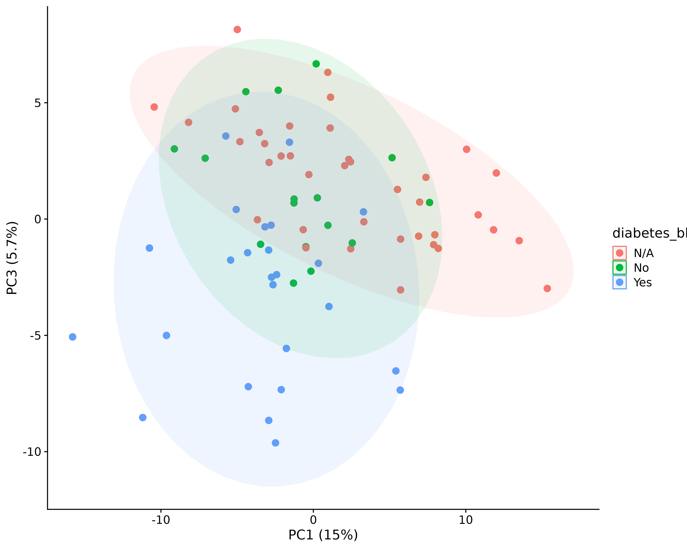
:::
:::


Figure 13.
Comparison of diabetic status using PC1 and PC3.


## Check Metabolites With High Loadings

For each principal component (PC), we can compare the loadings of each metabolite in that PC to all the other metabolite loadings in other PCs, i.e. a null distribution.
Therefore, the p-values reported here for each PC should be correct, with no need for multiple testing correction.

Table 9.
P-values of each metabolite feature (feature_id) with a p-value for each PC.


::: {.cell}
::: {.cell-output-display}

```{=openxml}
<w:tbl xmlns:w="http://schemas.openxmlformats.org/wordprocessingml/2006/main" xmlns:wp="http://schemas.openxmlformats.org/drawingml/2006/wordprocessingDrawing" xmlns:r="http://schemas.openxmlformats.org/officeDocument/2006/relationships" xmlns:w14="http://schemas.microsoft.com/office/word/2010/wordml"><w:tblPr><w:tblCellMar><w:top w:w="0" w:type="dxa"></w:top><w:bottom w:w="0" w:type="dxa"></w:bottom><w:start w:w="60" w:type="dxa"></w:start><w:end w:w="60" w:type="dxa"></w:end></w:tblCellMar><w:tblW w:type="auto" w:w="0"></w:tblW><w:tblLook w:firstRow="0" w:lastRow="0" w:firstColumn="0" w:lastColumn="0" w:noHBand="0" w:noVBand="0"></w:tblLook><w:jc w:val="center"></w:jc></w:tblPr><w:tr><w:trPr><w:cantSplit></w:cantSplit><w:tblHeader></w:tblHeader></w:trPr><w:tc><w:tcPr><w:tcBorders><w:top w:val="single" w:sz="16" w:space="0" w:color="D3D3D3"></w:top><w:bottom w:val="single" w:sz="16" w:space="0" w:color="D3D3D3"></w:bottom><w:start w:val="single" w:space="0" w:color="D3D3D3"></w:start></w:tcBorders></w:tcPr><w:p>
  <w:pPr>
    <w:spacing w:before="0" w:after="60"/>
    <w:keepNext/>
    <w:jc w:val="start"/>
  </w:pPr>
  <w:r>
    <w:rPr>
      <w:rFonts w:ascii="Calibri" w:hAnsi="Calibri"/>
      <w:sz w:val="20"/>
    </w:rPr>
    <w:t xml:space="default">metabolite</w:t>
  </w:r>
</w:p></w:tc><w:tc><w:tcPr><w:tcBorders><w:top w:val="single" w:sz="16" w:space="0" w:color="D3D3D3"></w:top><w:bottom w:val="single" w:sz="16" w:space="0" w:color="D3D3D3"></w:bottom><w:end w:val="single" w:space="0" w:color="D3D3D3"></w:end></w:tcBorders></w:tcPr><w:p>
  <w:pPr>
    <w:spacing w:before="0" w:after="60"/>
    <w:keepNext/>
    <w:jc w:val="end"/>
  </w:pPr>
  <w:r>
    <w:rPr>
      <w:rFonts w:ascii="Calibri" w:hAnsi="Calibri"/>
      <w:sz w:val="20"/>
    </w:rPr>
    <w:t xml:space="default">p.value</w:t>
  </w:r>
</w:p></w:tc></w:tr><w:tr><w:trPr><w:cantSplit></w:cantSplit></w:trPr><w:tc><w:tcPr><w:tcBorders><w:top w:val="single" w:sz="16" w:space="0" w:color="D3D3D3"></w:top><w:bottom w:val="single" w:sz="16" w:space="0" w:color="D3D3D3"></w:bottom><w:start w:val="single" w:space="0" w:color="D3D3D3"></w:start><w:end w:val="single" w:space="0" w:color="D3D3D3"></w:end></w:tcBorders><w:tcMar><w:top w:w="25" w:type="dxa"></w:top></w:tcMar><w:gridSpan w:val="2"/></w:tcPr><w:p>
  <w:pPr>
    <w:spacing w:before="0" w:after="60"/>
    <w:keepNext/>
  </w:pPr>
  <w:r>
    <w:rPr>
      <w:rFonts w:ascii="Calibri" w:hAnsi="Calibri"/>
      <w:sz w:val="20"/>
    </w:rPr>
    <w:t xml:space="default">PC1</w:t>
  </w:r>
</w:p></w:tc></w:tr>
<w:tr><w:trPr><w:cantSplit></w:cantSplit></w:trPr><w:tc><w:tcPr><w:tcBorders><w:top w:val="single" w:space="0" w:color="D3D3D3"></w:top><w:bottom w:val="single" w:space="0" w:color="D3D3D3"></w:bottom><w:start w:val="single" w:space="0" w:color="D3D3D3"></w:start><w:end w:val="single" w:space="0" w:color="D3D3D3"></w:end></w:tcBorders></w:tcPr><w:p>
  <w:pPr>
    <w:spacing w:before="0" w:after="60"/>
    <w:keepNext/>
    <w:jc w:val="start"/>
  </w:pPr>
  <w:r>
    <w:rPr>
      <w:rFonts w:ascii="Calibri" w:hAnsi="Calibri"/>
      <w:sz w:val="20"/>
    </w:rPr>
    <w:t xml:space="default">mannose</w:t>
  </w:r>
</w:p></w:tc><w:tc><w:tcPr><w:tcBorders><w:top w:val="single" w:space="0" w:color="D3D3D3"></w:top><w:bottom w:val="single" w:space="0" w:color="D3D3D3"></w:bottom><w:start w:val="single" w:space="0" w:color="D3D3D3"></w:start><w:end w:val="single" w:space="0" w:color="D3D3D3"></w:end></w:tcBorders></w:tcPr><w:p>
  <w:pPr>
    <w:spacing w:before="0" w:after="60"/>
    <w:keepNext/>
    <w:jc w:val="end"/>
  </w:pPr>
  <w:r>
    <w:rPr>
      <w:rFonts w:ascii="Calibri" w:hAnsi="Calibri"/>
      <w:sz w:val="20"/>
    </w:rPr>
    <w:t xml:space="default">6.27 × 10^-4</w:t>
  </w:r>
</w:p></w:tc></w:tr>
<w:tr><w:trPr><w:cantSplit></w:cantSplit></w:trPr><w:tc><w:tcPr><w:tcBorders><w:top w:val="single" w:space="0" w:color="D3D3D3"></w:top><w:bottom w:val="single" w:space="0" w:color="D3D3D3"></w:bottom><w:start w:val="single" w:space="0" w:color="D3D3D3"></w:start><w:end w:val="single" w:space="0" w:color="D3D3D3"></w:end></w:tcBorders></w:tcPr><w:p>
  <w:pPr>
    <w:spacing w:before="0" w:after="60"/>
    <w:keepNext/>
    <w:jc w:val="start"/>
  </w:pPr>
  <w:r>
    <w:rPr>
      <w:rFonts w:ascii="Calibri" w:hAnsi="Calibri"/>
      <w:sz w:val="20"/>
    </w:rPr>
    <w:t xml:space="default">6-deoxyglucitol</w:t>
  </w:r>
</w:p></w:tc><w:tc><w:tcPr><w:tcBorders><w:top w:val="single" w:space="0" w:color="D3D3D3"></w:top><w:bottom w:val="single" w:space="0" w:color="D3D3D3"></w:bottom><w:start w:val="single" w:space="0" w:color="D3D3D3"></w:start><w:end w:val="single" w:space="0" w:color="D3D3D3"></w:end></w:tcBorders></w:tcPr><w:p>
  <w:pPr>
    <w:spacing w:before="0" w:after="60"/>
    <w:keepNext/>
    <w:jc w:val="end"/>
  </w:pPr>
  <w:r>
    <w:rPr>
      <w:rFonts w:ascii="Calibri" w:hAnsi="Calibri"/>
      <w:sz w:val="20"/>
    </w:rPr>
    <w:t xml:space="default">5.02 × 10^-3</w:t>
  </w:r>
</w:p></w:tc></w:tr>
<w:tr><w:trPr><w:cantSplit></w:cantSplit></w:trPr><w:tc><w:tcPr><w:tcBorders><w:top w:val="single" w:space="0" w:color="D3D3D3"></w:top><w:bottom w:val="single" w:space="0" w:color="D3D3D3"></w:bottom><w:start w:val="single" w:space="0" w:color="D3D3D3"></w:start><w:end w:val="single" w:space="0" w:color="D3D3D3"></w:end></w:tcBorders></w:tcPr><w:p>
  <w:pPr>
    <w:spacing w:before="0" w:after="60"/>
    <w:keepNext/>
    <w:jc w:val="start"/>
  </w:pPr>
  <w:r>
    <w:rPr>
      <w:rFonts w:ascii="Calibri" w:hAnsi="Calibri"/>
      <w:sz w:val="20"/>
    </w:rPr>
    <w:t xml:space="default">31764</w:t>
  </w:r>
</w:p></w:tc><w:tc><w:tcPr><w:tcBorders><w:top w:val="single" w:space="0" w:color="D3D3D3"></w:top><w:bottom w:val="single" w:space="0" w:color="D3D3D3"></w:bottom><w:start w:val="single" w:space="0" w:color="D3D3D3"></w:start><w:end w:val="single" w:space="0" w:color="D3D3D3"></w:end></w:tcBorders></w:tcPr><w:p>
  <w:pPr>
    <w:spacing w:before="0" w:after="60"/>
    <w:keepNext/>
    <w:jc w:val="end"/>
  </w:pPr>
  <w:r>
    <w:rPr>
      <w:rFonts w:ascii="Calibri" w:hAnsi="Calibri"/>
      <w:sz w:val="20"/>
    </w:rPr>
    <w:t xml:space="default">9.29 × 10^-3</w:t>
  </w:r>
</w:p></w:tc></w:tr>
<w:tr><w:trPr><w:cantSplit></w:cantSplit></w:trPr><w:tc><w:tcPr><w:tcBorders><w:top w:val="single" w:space="0" w:color="D3D3D3"></w:top><w:bottom w:val="single" w:space="0" w:color="D3D3D3"></w:bottom><w:start w:val="single" w:space="0" w:color="D3D3D3"></w:start><w:end w:val="single" w:space="0" w:color="D3D3D3"></w:end></w:tcBorders></w:tcPr><w:p>
  <w:pPr>
    <w:spacing w:before="0" w:after="60"/>
    <w:keepNext/>
    <w:jc w:val="start"/>
  </w:pPr>
  <w:r>
    <w:rPr>
      <w:rFonts w:ascii="Calibri" w:hAnsi="Calibri"/>
      <w:sz w:val="20"/>
    </w:rPr>
    <w:t xml:space="default">892</w:t>
  </w:r>
</w:p></w:tc><w:tc><w:tcPr><w:tcBorders><w:top w:val="single" w:space="0" w:color="D3D3D3"></w:top><w:bottom w:val="single" w:space="0" w:color="D3D3D3"></w:bottom><w:start w:val="single" w:space="0" w:color="D3D3D3"></w:start><w:end w:val="single" w:space="0" w:color="D3D3D3"></w:end></w:tcBorders></w:tcPr><w:p>
  <w:pPr>
    <w:spacing w:before="0" w:after="60"/>
    <w:keepNext/>
    <w:jc w:val="end"/>
  </w:pPr>
  <w:r>
    <w:rPr>
      <w:rFonts w:ascii="Calibri" w:hAnsi="Calibri"/>
      <w:sz w:val="20"/>
    </w:rPr>
    <w:t xml:space="default">1.14 × 10^-2</w:t>
  </w:r>
</w:p></w:tc></w:tr>
<w:tr><w:trPr><w:cantSplit></w:cantSplit></w:trPr><w:tc><w:tcPr><w:tcBorders><w:top w:val="single" w:space="0" w:color="D3D3D3"></w:top><w:bottom w:val="single" w:space="0" w:color="D3D3D3"></w:bottom><w:start w:val="single" w:space="0" w:color="D3D3D3"></w:start><w:end w:val="single" w:space="0" w:color="D3D3D3"></w:end></w:tcBorders></w:tcPr><w:p>
  <w:pPr>
    <w:spacing w:before="0" w:after="60"/>
    <w:keepNext/>
    <w:jc w:val="start"/>
  </w:pPr>
  <w:r>
    <w:rPr>
      <w:rFonts w:ascii="Calibri" w:hAnsi="Calibri"/>
      <w:sz w:val="20"/>
    </w:rPr>
    <w:t xml:space="default">34108</w:t>
  </w:r>
</w:p></w:tc><w:tc><w:tcPr><w:tcBorders><w:top w:val="single" w:space="0" w:color="D3D3D3"></w:top><w:bottom w:val="single" w:space="0" w:color="D3D3D3"></w:bottom><w:start w:val="single" w:space="0" w:color="D3D3D3"></w:start><w:end w:val="single" w:space="0" w:color="D3D3D3"></w:end></w:tcBorders></w:tcPr><w:p>
  <w:pPr>
    <w:spacing w:before="0" w:after="60"/>
    <w:keepNext/>
    <w:jc w:val="end"/>
  </w:pPr>
  <w:r>
    <w:rPr>
      <w:rFonts w:ascii="Calibri" w:hAnsi="Calibri"/>
      <w:sz w:val="20"/>
    </w:rPr>
    <w:t xml:space="default">1.16 × 10^-2</w:t>
  </w:r>
</w:p></w:tc></w:tr>
<w:tr><w:trPr><w:cantSplit></w:cantSplit></w:trPr><w:tc><w:tcPr><w:tcBorders><w:top w:val="single" w:space="0" w:color="D3D3D3"></w:top><w:bottom w:val="single" w:space="0" w:color="D3D3D3"></w:bottom><w:start w:val="single" w:space="0" w:color="D3D3D3"></w:start><w:end w:val="single" w:space="0" w:color="D3D3D3"></w:end></w:tcBorders></w:tcPr><w:p>
  <w:pPr>
    <w:spacing w:before="0" w:after="60"/>
    <w:keepNext/>
    <w:jc w:val="start"/>
  </w:pPr>
  <w:r>
    <w:rPr>
      <w:rFonts w:ascii="Calibri" w:hAnsi="Calibri"/>
      <w:sz w:val="20"/>
    </w:rPr>
    <w:t xml:space="default">10176</w:t>
  </w:r>
</w:p></w:tc><w:tc><w:tcPr><w:tcBorders><w:top w:val="single" w:space="0" w:color="D3D3D3"></w:top><w:bottom w:val="single" w:space="0" w:color="D3D3D3"></w:bottom><w:start w:val="single" w:space="0" w:color="D3D3D3"></w:start><w:end w:val="single" w:space="0" w:color="D3D3D3"></w:end></w:tcBorders></w:tcPr><w:p>
  <w:pPr>
    <w:spacing w:before="0" w:after="60"/>
    <w:keepNext/>
    <w:jc w:val="end"/>
  </w:pPr>
  <w:r>
    <w:rPr>
      <w:rFonts w:ascii="Calibri" w:hAnsi="Calibri"/>
      <w:sz w:val="20"/>
    </w:rPr>
    <w:t xml:space="default">1.31 × 10^-2</w:t>
  </w:r>
</w:p></w:tc></w:tr>
<w:tr><w:trPr><w:cantSplit></w:cantSplit></w:trPr><w:tc><w:tcPr><w:tcBorders><w:top w:val="single" w:space="0" w:color="D3D3D3"></w:top><w:bottom w:val="single" w:space="0" w:color="D3D3D3"></w:bottom><w:start w:val="single" w:space="0" w:color="D3D3D3"></w:start><w:end w:val="single" w:space="0" w:color="D3D3D3"></w:end></w:tcBorders></w:tcPr><w:p>
  <w:pPr>
    <w:spacing w:before="0" w:after="60"/>
    <w:keepNext/>
    <w:jc w:val="start"/>
  </w:pPr>
  <w:r>
    <w:rPr>
      <w:rFonts w:ascii="Calibri" w:hAnsi="Calibri"/>
      <w:sz w:val="20"/>
    </w:rPr>
    <w:t xml:space="default">aconitic acid</w:t>
  </w:r>
</w:p></w:tc><w:tc><w:tcPr><w:tcBorders><w:top w:val="single" w:space="0" w:color="D3D3D3"></w:top><w:bottom w:val="single" w:space="0" w:color="D3D3D3"></w:bottom><w:start w:val="single" w:space="0" w:color="D3D3D3"></w:start><w:end w:val="single" w:space="0" w:color="D3D3D3"></w:end></w:tcBorders></w:tcPr><w:p>
  <w:pPr>
    <w:spacing w:before="0" w:after="60"/>
    <w:keepNext/>
    <w:jc w:val="end"/>
  </w:pPr>
  <w:r>
    <w:rPr>
      <w:rFonts w:ascii="Calibri" w:hAnsi="Calibri"/>
      <w:sz w:val="20"/>
    </w:rPr>
    <w:t xml:space="default">1.46 × 10^-2</w:t>
  </w:r>
</w:p></w:tc></w:tr>
<w:tr><w:trPr><w:cantSplit></w:cantSplit></w:trPr><w:tc><w:tcPr><w:tcBorders><w:top w:val="single" w:space="0" w:color="D3D3D3"></w:top><w:bottom w:val="single" w:space="0" w:color="D3D3D3"></w:bottom><w:start w:val="single" w:space="0" w:color="D3D3D3"></w:start><w:end w:val="single" w:space="0" w:color="D3D3D3"></w:end></w:tcBorders></w:tcPr><w:p>
  <w:pPr>
    <w:spacing w:before="0" w:after="60"/>
    <w:keepNext/>
    <w:jc w:val="start"/>
  </w:pPr>
  <w:r>
    <w:rPr>
      <w:rFonts w:ascii="Calibri" w:hAnsi="Calibri"/>
      <w:sz w:val="20"/>
    </w:rPr>
    <w:t xml:space="default">acetaminophen glucuronide</w:t>
  </w:r>
</w:p></w:tc><w:tc><w:tcPr><w:tcBorders><w:top w:val="single" w:space="0" w:color="D3D3D3"></w:top><w:bottom w:val="single" w:space="0" w:color="D3D3D3"></w:bottom><w:start w:val="single" w:space="0" w:color="D3D3D3"></w:start><w:end w:val="single" w:space="0" w:color="D3D3D3"></w:end></w:tcBorders></w:tcPr><w:p>
  <w:pPr>
    <w:spacing w:before="0" w:after="60"/>
    <w:keepNext/>
    <w:jc w:val="end"/>
  </w:pPr>
  <w:r>
    <w:rPr>
      <w:rFonts w:ascii="Calibri" w:hAnsi="Calibri"/>
      <w:sz w:val="20"/>
    </w:rPr>
    <w:t xml:space="default">2.40 × 10^-2</w:t>
  </w:r>
</w:p></w:tc></w:tr>
<w:tr><w:trPr><w:cantSplit></w:cantSplit></w:trPr><w:tc><w:tcPr><w:tcBorders><w:top w:val="single" w:space="0" w:color="D3D3D3"></w:top><w:bottom w:val="single" w:space="0" w:color="D3D3D3"></w:bottom><w:start w:val="single" w:space="0" w:color="D3D3D3"></w:start><w:end w:val="single" w:space="0" w:color="D3D3D3"></w:end></w:tcBorders></w:tcPr><w:p>
  <w:pPr>
    <w:spacing w:before="0" w:after="60"/>
    <w:keepNext/>
    <w:jc w:val="start"/>
  </w:pPr>
  <w:r>
    <w:rPr>
      <w:rFonts w:ascii="Calibri" w:hAnsi="Calibri"/>
      <w:sz w:val="20"/>
    </w:rPr>
    <w:t xml:space="default">109423</w:t>
  </w:r>
</w:p></w:tc><w:tc><w:tcPr><w:tcBorders><w:top w:val="single" w:space="0" w:color="D3D3D3"></w:top><w:bottom w:val="single" w:space="0" w:color="D3D3D3"></w:bottom><w:start w:val="single" w:space="0" w:color="D3D3D3"></w:start><w:end w:val="single" w:space="0" w:color="D3D3D3"></w:end></w:tcBorders></w:tcPr><w:p>
  <w:pPr>
    <w:spacing w:before="0" w:after="60"/>
    <w:keepNext/>
    <w:jc w:val="end"/>
  </w:pPr>
  <w:r>
    <w:rPr>
      <w:rFonts w:ascii="Calibri" w:hAnsi="Calibri"/>
      <w:sz w:val="20"/>
    </w:rPr>
    <w:t xml:space="default">2.46 × 10^-2</w:t>
  </w:r>
</w:p></w:tc></w:tr>
<w:tr><w:trPr><w:cantSplit></w:cantSplit></w:trPr><w:tc><w:tcPr><w:tcBorders><w:top w:val="single" w:space="0" w:color="D3D3D3"></w:top><w:bottom w:val="single" w:space="0" w:color="D3D3D3"></w:bottom><w:start w:val="single" w:space="0" w:color="D3D3D3"></w:start><w:end w:val="single" w:space="0" w:color="D3D3D3"></w:end></w:tcBorders></w:tcPr><w:p>
  <w:pPr>
    <w:spacing w:before="0" w:after="60"/>
    <w:keepNext/>
    <w:jc w:val="start"/>
  </w:pPr>
  <w:r>
    <w:rPr>
      <w:rFonts w:ascii="Calibri" w:hAnsi="Calibri"/>
      <w:sz w:val="20"/>
    </w:rPr>
    <w:t xml:space="default">18242</w:t>
  </w:r>
</w:p></w:tc><w:tc><w:tcPr><w:tcBorders><w:top w:val="single" w:space="0" w:color="D3D3D3"></w:top><w:bottom w:val="single" w:space="0" w:color="D3D3D3"></w:bottom><w:start w:val="single" w:space="0" w:color="D3D3D3"></w:start><w:end w:val="single" w:space="0" w:color="D3D3D3"></w:end></w:tcBorders></w:tcPr><w:p>
  <w:pPr>
    <w:spacing w:before="0" w:after="60"/>
    <w:keepNext/>
    <w:jc w:val="end"/>
  </w:pPr>
  <w:r>
    <w:rPr>
      <w:rFonts w:ascii="Calibri" w:hAnsi="Calibri"/>
      <w:sz w:val="20"/>
    </w:rPr>
    <w:t xml:space="default">2.55 × 10^-2</w:t>
  </w:r>
</w:p></w:tc></w:tr>
<w:tr><w:trPr><w:cantSplit></w:cantSplit></w:trPr><w:tc><w:tcPr><w:tcBorders><w:top w:val="single" w:space="0" w:color="D3D3D3"></w:top><w:bottom w:val="single" w:space="0" w:color="D3D3D3"></w:bottom><w:start w:val="single" w:space="0" w:color="D3D3D3"></w:start><w:end w:val="single" w:space="0" w:color="D3D3D3"></w:end></w:tcBorders></w:tcPr><w:p>
  <w:pPr>
    <w:spacing w:before="0" w:after="60"/>
    <w:keepNext/>
    <w:jc w:val="start"/>
  </w:pPr>
  <w:r>
    <w:rPr>
      <w:rFonts w:ascii="Calibri" w:hAnsi="Calibri"/>
      <w:sz w:val="20"/>
    </w:rPr>
    <w:t xml:space="default">32528</w:t>
  </w:r>
</w:p></w:tc><w:tc><w:tcPr><w:tcBorders><w:top w:val="single" w:space="0" w:color="D3D3D3"></w:top><w:bottom w:val="single" w:space="0" w:color="D3D3D3"></w:bottom><w:start w:val="single" w:space="0" w:color="D3D3D3"></w:start><w:end w:val="single" w:space="0" w:color="D3D3D3"></w:end></w:tcBorders></w:tcPr><w:p>
  <w:pPr>
    <w:spacing w:before="0" w:after="60"/>
    <w:keepNext/>
    <w:jc w:val="end"/>
  </w:pPr>
  <w:r>
    <w:rPr>
      <w:rFonts w:ascii="Calibri" w:hAnsi="Calibri"/>
      <w:sz w:val="20"/>
    </w:rPr>
    <w:t xml:space="default">2.85 × 10^-2</w:t>
  </w:r>
</w:p></w:tc></w:tr>
<w:tr><w:trPr><w:cantSplit></w:cantSplit></w:trPr><w:tc><w:tcPr><w:tcBorders><w:top w:val="single" w:space="0" w:color="D3D3D3"></w:top><w:bottom w:val="single" w:space="0" w:color="D3D3D3"></w:bottom><w:start w:val="single" w:space="0" w:color="D3D3D3"></w:start><w:end w:val="single" w:space="0" w:color="D3D3D3"></w:end></w:tcBorders></w:tcPr><w:p>
  <w:pPr>
    <w:spacing w:before="0" w:after="60"/>
    <w:keepNext/>
    <w:jc w:val="start"/>
  </w:pPr>
  <w:r>
    <w:rPr>
      <w:rFonts w:ascii="Calibri" w:hAnsi="Calibri"/>
      <w:sz w:val="20"/>
    </w:rPr>
    <w:t xml:space="default">2-deoxytetronic acid</w:t>
  </w:r>
</w:p></w:tc><w:tc><w:tcPr><w:tcBorders><w:top w:val="single" w:space="0" w:color="D3D3D3"></w:top><w:bottom w:val="single" w:space="0" w:color="D3D3D3"></w:bottom><w:start w:val="single" w:space="0" w:color="D3D3D3"></w:start><w:end w:val="single" w:space="0" w:color="D3D3D3"></w:end></w:tcBorders></w:tcPr><w:p>
  <w:pPr>
    <w:spacing w:before="0" w:after="60"/>
    <w:keepNext/>
    <w:jc w:val="end"/>
  </w:pPr>
  <w:r>
    <w:rPr>
      <w:rFonts w:ascii="Calibri" w:hAnsi="Calibri"/>
      <w:sz w:val="20"/>
    </w:rPr>
    <w:t xml:space="default">3.61 × 10^-2</w:t>
  </w:r>
</w:p></w:tc></w:tr>
<w:tr><w:trPr><w:cantSplit></w:cantSplit></w:trPr><w:tc><w:tcPr><w:tcBorders><w:top w:val="single" w:space="0" w:color="D3D3D3"></w:top><w:bottom w:val="single" w:space="0" w:color="D3D3D3"></w:bottom><w:start w:val="single" w:space="0" w:color="D3D3D3"></w:start><w:end w:val="single" w:space="0" w:color="D3D3D3"></w:end></w:tcBorders></w:tcPr><w:p>
  <w:pPr>
    <w:spacing w:before="0" w:after="60"/>
    <w:keepNext/>
    <w:jc w:val="start"/>
  </w:pPr>
  <w:r>
    <w:rPr>
      <w:rFonts w:ascii="Calibri" w:hAnsi="Calibri"/>
      <w:sz w:val="20"/>
    </w:rPr>
    <w:t xml:space="default">345452</w:t>
  </w:r>
</w:p></w:tc><w:tc><w:tcPr><w:tcBorders><w:top w:val="single" w:space="0" w:color="D3D3D3"></w:top><w:bottom w:val="single" w:space="0" w:color="D3D3D3"></w:bottom><w:start w:val="single" w:space="0" w:color="D3D3D3"></w:start><w:end w:val="single" w:space="0" w:color="D3D3D3"></w:end></w:tcBorders></w:tcPr><w:p>
  <w:pPr>
    <w:spacing w:before="0" w:after="60"/>
    <w:keepNext/>
    <w:jc w:val="end"/>
  </w:pPr>
  <w:r>
    <w:rPr>
      <w:rFonts w:ascii="Calibri" w:hAnsi="Calibri"/>
      <w:sz w:val="20"/>
    </w:rPr>
    <w:t xml:space="default">4.18 × 10^-2</w:t>
  </w:r>
</w:p></w:tc></w:tr>
<w:tr><w:trPr><w:cantSplit></w:cantSplit></w:trPr><w:tc><w:tcPr><w:tcBorders><w:top w:val="single" w:space="0" w:color="D3D3D3"></w:top><w:bottom w:val="single" w:space="0" w:color="D3D3D3"></w:bottom><w:start w:val="single" w:space="0" w:color="D3D3D3"></w:start><w:end w:val="single" w:space="0" w:color="D3D3D3"></w:end></w:tcBorders></w:tcPr><w:p>
  <w:pPr>
    <w:spacing w:before="0" w:after="60"/>
    <w:keepNext/>
    <w:jc w:val="start"/>
  </w:pPr>
  <w:r>
    <w:rPr>
      <w:rFonts w:ascii="Calibri" w:hAnsi="Calibri"/>
      <w:sz w:val="20"/>
    </w:rPr>
    <w:t xml:space="default">4-hydroxyphenylacetic acid</w:t>
  </w:r>
</w:p></w:tc><w:tc><w:tcPr><w:tcBorders><w:top w:val="single" w:space="0" w:color="D3D3D3"></w:top><w:bottom w:val="single" w:space="0" w:color="D3D3D3"></w:bottom><w:start w:val="single" w:space="0" w:color="D3D3D3"></w:start><w:end w:val="single" w:space="0" w:color="D3D3D3"></w:end></w:tcBorders></w:tcPr><w:p>
  <w:pPr>
    <w:spacing w:before="0" w:after="60"/>
    <w:keepNext/>
    <w:jc w:val="end"/>
  </w:pPr>
  <w:r>
    <w:rPr>
      <w:rFonts w:ascii="Calibri" w:hAnsi="Calibri"/>
      <w:sz w:val="20"/>
    </w:rPr>
    <w:t xml:space="default">4.27 × 10^-2</w:t>
  </w:r>
</w:p></w:tc></w:tr>
<w:tr><w:trPr><w:cantSplit></w:cantSplit></w:trPr><w:tc><w:tcPr><w:tcBorders><w:top w:val="single" w:space="0" w:color="D3D3D3"></w:top><w:bottom w:val="single" w:space="0" w:color="D3D3D3"></w:bottom><w:start w:val="single" w:space="0" w:color="D3D3D3"></w:start><w:end w:val="single" w:space="0" w:color="D3D3D3"></w:end></w:tcBorders></w:tcPr><w:p>
  <w:pPr>
    <w:spacing w:before="0" w:after="60"/>
    <w:keepNext/>
    <w:jc w:val="start"/>
  </w:pPr>
  <w:r>
    <w:rPr>
      <w:rFonts w:ascii="Calibri" w:hAnsi="Calibri"/>
      <w:sz w:val="20"/>
    </w:rPr>
    <w:t xml:space="default">tagatose</w:t>
  </w:r>
</w:p></w:tc><w:tc><w:tcPr><w:tcBorders><w:top w:val="single" w:space="0" w:color="D3D3D3"></w:top><w:bottom w:val="single" w:space="0" w:color="D3D3D3"></w:bottom><w:start w:val="single" w:space="0" w:color="D3D3D3"></w:start><w:end w:val="single" w:space="0" w:color="D3D3D3"></w:end></w:tcBorders></w:tcPr><w:p>
  <w:pPr>
    <w:spacing w:before="0" w:after="60"/>
    <w:keepNext/>
    <w:jc w:val="end"/>
  </w:pPr>
  <w:r>
    <w:rPr>
      <w:rFonts w:ascii="Calibri" w:hAnsi="Calibri"/>
      <w:sz w:val="20"/>
    </w:rPr>
    <w:t xml:space="default">4.47 × 10^-2</w:t>
  </w:r>
</w:p></w:tc></w:tr>
<w:tr><w:trPr><w:cantSplit></w:cantSplit></w:trPr><w:tc><w:tcPr><w:tcBorders><w:top w:val="single" w:space="0" w:color="D3D3D3"></w:top><w:bottom w:val="single" w:space="0" w:color="D3D3D3"></w:bottom><w:start w:val="single" w:space="0" w:color="D3D3D3"></w:start><w:end w:val="single" w:space="0" w:color="D3D3D3"></w:end></w:tcBorders></w:tcPr><w:p>
  <w:pPr>
    <w:spacing w:before="0" w:after="60"/>
    <w:keepNext/>
    <w:jc w:val="start"/>
  </w:pPr>
  <w:r>
    <w:rPr>
      <w:rFonts w:ascii="Calibri" w:hAnsi="Calibri"/>
      <w:sz w:val="20"/>
    </w:rPr>
    <w:t xml:space="default">41924</w:t>
  </w:r>
</w:p></w:tc><w:tc><w:tcPr><w:tcBorders><w:top w:val="single" w:space="0" w:color="D3D3D3"></w:top><w:bottom w:val="single" w:space="0" w:color="D3D3D3"></w:bottom><w:start w:val="single" w:space="0" w:color="D3D3D3"></w:start><w:end w:val="single" w:space="0" w:color="D3D3D3"></w:end></w:tcBorders></w:tcPr><w:p>
  <w:pPr>
    <w:spacing w:before="0" w:after="60"/>
    <w:keepNext/>
    <w:jc w:val="end"/>
  </w:pPr>
  <w:r>
    <w:rPr>
      <w:rFonts w:ascii="Calibri" w:hAnsi="Calibri"/>
      <w:sz w:val="20"/>
    </w:rPr>
    <w:t xml:space="default">4.47 × 10^-2</w:t>
  </w:r>
</w:p></w:tc></w:tr>
<w:tr><w:trPr><w:cantSplit></w:cantSplit></w:trPr><w:tc><w:tcPr><w:tcBorders><w:top w:val="single" w:space="0" w:color="D3D3D3"></w:top><w:bottom w:val="single" w:space="0" w:color="D3D3D3"></w:bottom><w:start w:val="single" w:space="0" w:color="D3D3D3"></w:start><w:end w:val="single" w:space="0" w:color="D3D3D3"></w:end></w:tcBorders></w:tcPr><w:p>
  <w:pPr>
    <w:spacing w:before="0" w:after="60"/>
    <w:keepNext/>
    <w:jc w:val="start"/>
  </w:pPr>
  <w:r>
    <w:rPr>
      <w:rFonts w:ascii="Calibri" w:hAnsi="Calibri"/>
      <w:sz w:val="20"/>
    </w:rPr>
    <w:t xml:space="default">85651</w:t>
  </w:r>
</w:p></w:tc><w:tc><w:tcPr><w:tcBorders><w:top w:val="single" w:space="0" w:color="D3D3D3"></w:top><w:bottom w:val="single" w:space="0" w:color="D3D3D3"></w:bottom><w:start w:val="single" w:space="0" w:color="D3D3D3"></w:start><w:end w:val="single" w:space="0" w:color="D3D3D3"></w:end></w:tcBorders></w:tcPr><w:p>
  <w:pPr>
    <w:spacing w:before="0" w:after="60"/>
    <w:keepNext/>
    <w:jc w:val="end"/>
  </w:pPr>
  <w:r>
    <w:rPr>
      <w:rFonts w:ascii="Calibri" w:hAnsi="Calibri"/>
      <w:sz w:val="20"/>
    </w:rPr>
    <w:t xml:space="default">4.52 × 10^-2</w:t>
  </w:r>
</w:p></w:tc></w:tr>
<w:tr><w:trPr><w:cantSplit></w:cantSplit></w:trPr><w:tc><w:tcPr><w:tcBorders><w:top w:val="single" w:space="0" w:color="D3D3D3"></w:top><w:bottom w:val="single" w:space="0" w:color="D3D3D3"></w:bottom><w:start w:val="single" w:space="0" w:color="D3D3D3"></w:start><w:end w:val="single" w:space="0" w:color="D3D3D3"></w:end></w:tcBorders></w:tcPr><w:p>
  <w:pPr>
    <w:spacing w:before="0" w:after="60"/>
    <w:keepNext/>
    <w:jc w:val="start"/>
  </w:pPr>
  <w:r>
    <w:rPr>
      <w:rFonts w:ascii="Calibri" w:hAnsi="Calibri"/>
      <w:sz w:val="20"/>
    </w:rPr>
    <w:t xml:space="default">dehydroascorbic acid</w:t>
  </w:r>
</w:p></w:tc><w:tc><w:tcPr><w:tcBorders><w:top w:val="single" w:space="0" w:color="D3D3D3"></w:top><w:bottom w:val="single" w:space="0" w:color="D3D3D3"></w:bottom><w:start w:val="single" w:space="0" w:color="D3D3D3"></w:start><w:end w:val="single" w:space="0" w:color="D3D3D3"></w:end></w:tcBorders></w:tcPr><w:p>
  <w:pPr>
    <w:spacing w:before="0" w:after="60"/>
    <w:keepNext/>
    <w:jc w:val="end"/>
  </w:pPr>
  <w:r>
    <w:rPr>
      <w:rFonts w:ascii="Calibri" w:hAnsi="Calibri"/>
      <w:sz w:val="20"/>
    </w:rPr>
    <w:t xml:space="default">4.88 × 10^-2</w:t>
  </w:r>
</w:p></w:tc></w:tr>
<w:tr><w:trPr><w:cantSplit></w:cantSplit></w:trPr><w:tc><w:tcPr><w:tcBorders><w:top w:val="single" w:sz="16" w:space="0" w:color="D3D3D3"></w:top><w:bottom w:val="single" w:sz="16" w:space="0" w:color="D3D3D3"></w:bottom><w:start w:val="single" w:space="0" w:color="D3D3D3"></w:start><w:end w:val="single" w:space="0" w:color="D3D3D3"></w:end></w:tcBorders><w:tcMar><w:top w:w="25" w:type="dxa"></w:top></w:tcMar><w:gridSpan w:val="2"/></w:tcPr><w:p>
  <w:pPr>
    <w:spacing w:before="0" w:after="60"/>
    <w:keepNext/>
  </w:pPr>
  <w:r>
    <w:rPr>
      <w:rFonts w:ascii="Calibri" w:hAnsi="Calibri"/>
      <w:sz w:val="20"/>
    </w:rPr>
    <w:t xml:space="default">PC2</w:t>
  </w:r>
</w:p></w:tc></w:tr>
<w:tr><w:trPr><w:cantSplit></w:cantSplit></w:trPr><w:tc><w:tcPr><w:tcBorders><w:top w:val="single" w:space="0" w:color="D3D3D3"></w:top><w:bottom w:val="single" w:space="0" w:color="D3D3D3"></w:bottom><w:start w:val="single" w:space="0" w:color="D3D3D3"></w:start><w:end w:val="single" w:space="0" w:color="D3D3D3"></w:end></w:tcBorders></w:tcPr><w:p>
  <w:pPr>
    <w:spacing w:before="0" w:after="60"/>
    <w:keepNext/>
    <w:jc w:val="start"/>
  </w:pPr>
  <w:r>
    <w:rPr>
      <w:rFonts w:ascii="Calibri" w:hAnsi="Calibri"/>
      <w:sz w:val="20"/>
    </w:rPr>
    <w:t xml:space="default">4529</w:t>
  </w:r>
</w:p></w:tc><w:tc><w:tcPr><w:tcBorders><w:top w:val="single" w:space="0" w:color="D3D3D3"></w:top><w:bottom w:val="single" w:space="0" w:color="D3D3D3"></w:bottom><w:start w:val="single" w:space="0" w:color="D3D3D3"></w:start><w:end w:val="single" w:space="0" w:color="D3D3D3"></w:end></w:tcBorders></w:tcPr><w:p>
  <w:pPr>
    <w:spacing w:before="0" w:after="60"/>
    <w:keepNext/>
    <w:jc w:val="end"/>
  </w:pPr>
  <w:r>
    <w:rPr>
      <w:rFonts w:ascii="Calibri" w:hAnsi="Calibri"/>
      <w:sz w:val="20"/>
    </w:rPr>
    <w:t xml:space="default">5.49 × 10^-4</w:t>
  </w:r>
</w:p></w:tc></w:tr>
<w:tr><w:trPr><w:cantSplit></w:cantSplit></w:trPr><w:tc><w:tcPr><w:tcBorders><w:top w:val="single" w:space="0" w:color="D3D3D3"></w:top><w:bottom w:val="single" w:space="0" w:color="D3D3D3"></w:bottom><w:start w:val="single" w:space="0" w:color="D3D3D3"></w:start><w:end w:val="single" w:space="0" w:color="D3D3D3"></w:end></w:tcBorders></w:tcPr><w:p>
  <w:pPr>
    <w:spacing w:before="0" w:after="60"/>
    <w:keepNext/>
    <w:jc w:val="start"/>
  </w:pPr>
  <w:r>
    <w:rPr>
      <w:rFonts w:ascii="Calibri" w:hAnsi="Calibri"/>
      <w:sz w:val="20"/>
    </w:rPr>
    <w:t xml:space="default">34172</w:t>
  </w:r>
</w:p></w:tc><w:tc><w:tcPr><w:tcBorders><w:top w:val="single" w:space="0" w:color="D3D3D3"></w:top><w:bottom w:val="single" w:space="0" w:color="D3D3D3"></w:bottom><w:start w:val="single" w:space="0" w:color="D3D3D3"></w:start><w:end w:val="single" w:space="0" w:color="D3D3D3"></w:end></w:tcBorders></w:tcPr><w:p>
  <w:pPr>
    <w:spacing w:before="0" w:after="60"/>
    <w:keepNext/>
    <w:jc w:val="end"/>
  </w:pPr>
  <w:r>
    <w:rPr>
      <w:rFonts w:ascii="Calibri" w:hAnsi="Calibri"/>
      <w:sz w:val="20"/>
    </w:rPr>
    <w:t xml:space="default">5.88 × 10^-4</w:t>
  </w:r>
</w:p></w:tc></w:tr>
<w:tr><w:trPr><w:cantSplit></w:cantSplit></w:trPr><w:tc><w:tcPr><w:tcBorders><w:top w:val="single" w:space="0" w:color="D3D3D3"></w:top><w:bottom w:val="single" w:space="0" w:color="D3D3D3"></w:bottom><w:start w:val="single" w:space="0" w:color="D3D3D3"></w:start><w:end w:val="single" w:space="0" w:color="D3D3D3"></w:end></w:tcBorders></w:tcPr><w:p>
  <w:pPr>
    <w:spacing w:before="0" w:after="60"/>
    <w:keepNext/>
    <w:jc w:val="start"/>
  </w:pPr>
  <w:r>
    <w:rPr>
      <w:rFonts w:ascii="Calibri" w:hAnsi="Calibri"/>
      <w:sz w:val="20"/>
    </w:rPr>
    <w:t xml:space="default">quinic acid</w:t>
  </w:r>
</w:p></w:tc><w:tc><w:tcPr><w:tcBorders><w:top w:val="single" w:space="0" w:color="D3D3D3"></w:top><w:bottom w:val="single" w:space="0" w:color="D3D3D3"></w:bottom><w:start w:val="single" w:space="0" w:color="D3D3D3"></w:start><w:end w:val="single" w:space="0" w:color="D3D3D3"></w:end></w:tcBorders></w:tcPr><w:p>
  <w:pPr>
    <w:spacing w:before="0" w:after="60"/>
    <w:keepNext/>
    <w:jc w:val="end"/>
  </w:pPr>
  <w:r>
    <w:rPr>
      <w:rFonts w:ascii="Calibri" w:hAnsi="Calibri"/>
      <w:sz w:val="20"/>
    </w:rPr>
    <w:t xml:space="default">7.84 × 10^-4</w:t>
  </w:r>
</w:p></w:tc></w:tr>
<w:tr><w:trPr><w:cantSplit></w:cantSplit></w:trPr><w:tc><w:tcPr><w:tcBorders><w:top w:val="single" w:space="0" w:color="D3D3D3"></w:top><w:bottom w:val="single" w:space="0" w:color="D3D3D3"></w:bottom><w:start w:val="single" w:space="0" w:color="D3D3D3"></w:start><w:end w:val="single" w:space="0" w:color="D3D3D3"></w:end></w:tcBorders></w:tcPr><w:p>
  <w:pPr>
    <w:spacing w:before="0" w:after="60"/>
    <w:keepNext/>
    <w:jc w:val="start"/>
  </w:pPr>
  <w:r>
    <w:rPr>
      <w:rFonts w:ascii="Calibri" w:hAnsi="Calibri"/>
      <w:sz w:val="20"/>
    </w:rPr>
    <w:t xml:space="default">32528</w:t>
  </w:r>
</w:p></w:tc><w:tc><w:tcPr><w:tcBorders><w:top w:val="single" w:space="0" w:color="D3D3D3"></w:top><w:bottom w:val="single" w:space="0" w:color="D3D3D3"></w:bottom><w:start w:val="single" w:space="0" w:color="D3D3D3"></w:start><w:end w:val="single" w:space="0" w:color="D3D3D3"></w:end></w:tcBorders></w:tcPr><w:p>
  <w:pPr>
    <w:spacing w:before="0" w:after="60"/>
    <w:keepNext/>
    <w:jc w:val="end"/>
  </w:pPr>
  <w:r>
    <w:rPr>
      <w:rFonts w:ascii="Calibri" w:hAnsi="Calibri"/>
      <w:sz w:val="20"/>
    </w:rPr>
    <w:t xml:space="default">2.82 × 10^-3</w:t>
  </w:r>
</w:p></w:tc></w:tr>
<w:tr><w:trPr><w:cantSplit></w:cantSplit></w:trPr><w:tc><w:tcPr><w:tcBorders><w:top w:val="single" w:space="0" w:color="D3D3D3"></w:top><w:bottom w:val="single" w:space="0" w:color="D3D3D3"></w:bottom><w:start w:val="single" w:space="0" w:color="D3D3D3"></w:start><w:end w:val="single" w:space="0" w:color="D3D3D3"></w:end></w:tcBorders></w:tcPr><w:p>
  <w:pPr>
    <w:spacing w:before="0" w:after="60"/>
    <w:keepNext/>
    <w:jc w:val="start"/>
  </w:pPr>
  <w:r>
    <w:rPr>
      <w:rFonts w:ascii="Calibri" w:hAnsi="Calibri"/>
      <w:sz w:val="20"/>
    </w:rPr>
    <w:t xml:space="default">34169</w:t>
  </w:r>
</w:p></w:tc><w:tc><w:tcPr><w:tcBorders><w:top w:val="single" w:space="0" w:color="D3D3D3"></w:top><w:bottom w:val="single" w:space="0" w:color="D3D3D3"></w:bottom><w:start w:val="single" w:space="0" w:color="D3D3D3"></w:start><w:end w:val="single" w:space="0" w:color="D3D3D3"></w:end></w:tcBorders></w:tcPr><w:p>
  <w:pPr>
    <w:spacing w:before="0" w:after="60"/>
    <w:keepNext/>
    <w:jc w:val="end"/>
  </w:pPr>
  <w:r>
    <w:rPr>
      <w:rFonts w:ascii="Calibri" w:hAnsi="Calibri"/>
      <w:sz w:val="20"/>
    </w:rPr>
    <w:t xml:space="default">3.80 × 10^-3</w:t>
  </w:r>
</w:p></w:tc></w:tr>
<w:tr><w:trPr><w:cantSplit></w:cantSplit></w:trPr><w:tc><w:tcPr><w:tcBorders><w:top w:val="single" w:space="0" w:color="D3D3D3"></w:top><w:bottom w:val="single" w:space="0" w:color="D3D3D3"></w:bottom><w:start w:val="single" w:space="0" w:color="D3D3D3"></w:start><w:end w:val="single" w:space="0" w:color="D3D3D3"></w:end></w:tcBorders></w:tcPr><w:p>
  <w:pPr>
    <w:spacing w:before="0" w:after="60"/>
    <w:keepNext/>
    <w:jc w:val="start"/>
  </w:pPr>
  <w:r>
    <w:rPr>
      <w:rFonts w:ascii="Calibri" w:hAnsi="Calibri"/>
      <w:sz w:val="20"/>
    </w:rPr>
    <w:t xml:space="default">33993</w:t>
  </w:r>
</w:p></w:tc><w:tc><w:tcPr><w:tcBorders><w:top w:val="single" w:space="0" w:color="D3D3D3"></w:top><w:bottom w:val="single" w:space="0" w:color="D3D3D3"></w:bottom><w:start w:val="single" w:space="0" w:color="D3D3D3"></w:start><w:end w:val="single" w:space="0" w:color="D3D3D3"></w:end></w:tcBorders></w:tcPr><w:p>
  <w:pPr>
    <w:spacing w:before="0" w:after="60"/>
    <w:keepNext/>
    <w:jc w:val="end"/>
  </w:pPr>
  <w:r>
    <w:rPr>
      <w:rFonts w:ascii="Calibri" w:hAnsi="Calibri"/>
      <w:sz w:val="20"/>
    </w:rPr>
    <w:t xml:space="default">4.08 × 10^-3</w:t>
  </w:r>
</w:p></w:tc></w:tr>
<w:tr><w:trPr><w:cantSplit></w:cantSplit></w:trPr><w:tc><w:tcPr><w:tcBorders><w:top w:val="single" w:space="0" w:color="D3D3D3"></w:top><w:bottom w:val="single" w:space="0" w:color="D3D3D3"></w:bottom><w:start w:val="single" w:space="0" w:color="D3D3D3"></w:start><w:end w:val="single" w:space="0" w:color="D3D3D3"></w:end></w:tcBorders></w:tcPr><w:p>
  <w:pPr>
    <w:spacing w:before="0" w:after="60"/>
    <w:keepNext/>
    <w:jc w:val="start"/>
  </w:pPr>
  <w:r>
    <w:rPr>
      <w:rFonts w:ascii="Calibri" w:hAnsi="Calibri"/>
      <w:sz w:val="20"/>
    </w:rPr>
    <w:t xml:space="default">2031</w:t>
  </w:r>
</w:p></w:tc><w:tc><w:tcPr><w:tcBorders><w:top w:val="single" w:space="0" w:color="D3D3D3"></w:top><w:bottom w:val="single" w:space="0" w:color="D3D3D3"></w:bottom><w:start w:val="single" w:space="0" w:color="D3D3D3"></w:start><w:end w:val="single" w:space="0" w:color="D3D3D3"></w:end></w:tcBorders></w:tcPr><w:p>
  <w:pPr>
    <w:spacing w:before="0" w:after="60"/>
    <w:keepNext/>
    <w:jc w:val="end"/>
  </w:pPr>
  <w:r>
    <w:rPr>
      <w:rFonts w:ascii="Calibri" w:hAnsi="Calibri"/>
      <w:sz w:val="20"/>
    </w:rPr>
    <w:t xml:space="default">5.45 × 10^-3</w:t>
  </w:r>
</w:p></w:tc></w:tr>
<w:tr><w:trPr><w:cantSplit></w:cantSplit></w:trPr><w:tc><w:tcPr><w:tcBorders><w:top w:val="single" w:space="0" w:color="D3D3D3"></w:top><w:bottom w:val="single" w:space="0" w:color="D3D3D3"></w:bottom><w:start w:val="single" w:space="0" w:color="D3D3D3"></w:start><w:end w:val="single" w:space="0" w:color="D3D3D3"></w:end></w:tcBorders></w:tcPr><w:p>
  <w:pPr>
    <w:spacing w:before="0" w:after="60"/>
    <w:keepNext/>
    <w:jc w:val="start"/>
  </w:pPr>
  <w:r>
    <w:rPr>
      <w:rFonts w:ascii="Calibri" w:hAnsi="Calibri"/>
      <w:sz w:val="20"/>
    </w:rPr>
    <w:t xml:space="default">215881</w:t>
  </w:r>
</w:p></w:tc><w:tc><w:tcPr><w:tcBorders><w:top w:val="single" w:space="0" w:color="D3D3D3"></w:top><w:bottom w:val="single" w:space="0" w:color="D3D3D3"></w:bottom><w:start w:val="single" w:space="0" w:color="D3D3D3"></w:start><w:end w:val="single" w:space="0" w:color="D3D3D3"></w:end></w:tcBorders></w:tcPr><w:p>
  <w:pPr>
    <w:spacing w:before="0" w:after="60"/>
    <w:keepNext/>
    <w:jc w:val="end"/>
  </w:pPr>
  <w:r>
    <w:rPr>
      <w:rFonts w:ascii="Calibri" w:hAnsi="Calibri"/>
      <w:sz w:val="20"/>
    </w:rPr>
    <w:t xml:space="default">7.61 × 10^-3</w:t>
  </w:r>
</w:p></w:tc></w:tr>
<w:tr><w:trPr><w:cantSplit></w:cantSplit></w:trPr><w:tc><w:tcPr><w:tcBorders><w:top w:val="single" w:space="0" w:color="D3D3D3"></w:top><w:bottom w:val="single" w:space="0" w:color="D3D3D3"></w:bottom><w:start w:val="single" w:space="0" w:color="D3D3D3"></w:start><w:end w:val="single" w:space="0" w:color="D3D3D3"></w:end></w:tcBorders></w:tcPr><w:p>
  <w:pPr>
    <w:spacing w:before="0" w:after="60"/>
    <w:keepNext/>
    <w:jc w:val="start"/>
  </w:pPr>
  <w:r>
    <w:rPr>
      <w:rFonts w:ascii="Calibri" w:hAnsi="Calibri"/>
      <w:sz w:val="20"/>
    </w:rPr>
    <w:t xml:space="default">furoylglycine</w:t>
  </w:r>
</w:p></w:tc><w:tc><w:tcPr><w:tcBorders><w:top w:val="single" w:space="0" w:color="D3D3D3"></w:top><w:bottom w:val="single" w:space="0" w:color="D3D3D3"></w:bottom><w:start w:val="single" w:space="0" w:color="D3D3D3"></w:start><w:end w:val="single" w:space="0" w:color="D3D3D3"></w:end></w:tcBorders></w:tcPr><w:p>
  <w:pPr>
    <w:spacing w:before="0" w:after="60"/>
    <w:keepNext/>
    <w:jc w:val="end"/>
  </w:pPr>
  <w:r>
    <w:rPr>
      <w:rFonts w:ascii="Calibri" w:hAnsi="Calibri"/>
      <w:sz w:val="20"/>
    </w:rPr>
    <w:t xml:space="default">1.12 × 10^-2</w:t>
  </w:r>
</w:p></w:tc></w:tr>
<w:tr><w:trPr><w:cantSplit></w:cantSplit></w:trPr><w:tc><w:tcPr><w:tcBorders><w:top w:val="single" w:space="0" w:color="D3D3D3"></w:top><w:bottom w:val="single" w:space="0" w:color="D3D3D3"></w:bottom><w:start w:val="single" w:space="0" w:color="D3D3D3"></w:start><w:end w:val="single" w:space="0" w:color="D3D3D3"></w:end></w:tcBorders></w:tcPr><w:p>
  <w:pPr>
    <w:spacing w:before="0" w:after="60"/>
    <w:keepNext/>
    <w:jc w:val="start"/>
  </w:pPr>
  <w:r>
    <w:rPr>
      <w:rFonts w:ascii="Calibri" w:hAnsi="Calibri"/>
      <w:sz w:val="20"/>
    </w:rPr>
    <w:t xml:space="default">mannose</w:t>
  </w:r>
</w:p></w:tc><w:tc><w:tcPr><w:tcBorders><w:top w:val="single" w:space="0" w:color="D3D3D3"></w:top><w:bottom w:val="single" w:space="0" w:color="D3D3D3"></w:bottom><w:start w:val="single" w:space="0" w:color="D3D3D3"></w:start><w:end w:val="single" w:space="0" w:color="D3D3D3"></w:end></w:tcBorders></w:tcPr><w:p>
  <w:pPr>
    <w:spacing w:before="0" w:after="60"/>
    <w:keepNext/>
    <w:jc w:val="end"/>
  </w:pPr>
  <w:r>
    <w:rPr>
      <w:rFonts w:ascii="Calibri" w:hAnsi="Calibri"/>
      <w:sz w:val="20"/>
    </w:rPr>
    <w:t xml:space="default">1.18 × 10^-2</w:t>
  </w:r>
</w:p></w:tc></w:tr>
<w:tr><w:trPr><w:cantSplit></w:cantSplit></w:trPr><w:tc><w:tcPr><w:tcBorders><w:top w:val="single" w:space="0" w:color="D3D3D3"></w:top><w:bottom w:val="single" w:space="0" w:color="D3D3D3"></w:bottom><w:start w:val="single" w:space="0" w:color="D3D3D3"></w:start><w:end w:val="single" w:space="0" w:color="D3D3D3"></w:end></w:tcBorders></w:tcPr><w:p>
  <w:pPr>
    <w:spacing w:before="0" w:after="60"/>
    <w:keepNext/>
    <w:jc w:val="start"/>
  </w:pPr>
  <w:r>
    <w:rPr>
      <w:rFonts w:ascii="Calibri" w:hAnsi="Calibri"/>
      <w:sz w:val="20"/>
    </w:rPr>
    <w:t xml:space="default">134464</w:t>
  </w:r>
</w:p></w:tc><w:tc><w:tcPr><w:tcBorders><w:top w:val="single" w:space="0" w:color="D3D3D3"></w:top><w:bottom w:val="single" w:space="0" w:color="D3D3D3"></w:bottom><w:start w:val="single" w:space="0" w:color="D3D3D3"></w:start><w:end w:val="single" w:space="0" w:color="D3D3D3"></w:end></w:tcBorders></w:tcPr><w:p>
  <w:pPr>
    <w:spacing w:before="0" w:after="60"/>
    <w:keepNext/>
    <w:jc w:val="end"/>
  </w:pPr>
  <w:r>
    <w:rPr>
      <w:rFonts w:ascii="Calibri" w:hAnsi="Calibri"/>
      <w:sz w:val="20"/>
    </w:rPr>
    <w:t xml:space="default">1.38 × 10^-2</w:t>
  </w:r>
</w:p></w:tc></w:tr>
<w:tr><w:trPr><w:cantSplit></w:cantSplit></w:trPr><w:tc><w:tcPr><w:tcBorders><w:top w:val="single" w:space="0" w:color="D3D3D3"></w:top><w:bottom w:val="single" w:space="0" w:color="D3D3D3"></w:bottom><w:start w:val="single" w:space="0" w:color="D3D3D3"></w:start><w:end w:val="single" w:space="0" w:color="D3D3D3"></w:end></w:tcBorders></w:tcPr><w:p>
  <w:pPr>
    <w:spacing w:before="0" w:after="60"/>
    <w:keepNext/>
    <w:jc w:val="start"/>
  </w:pPr>
  <w:r>
    <w:rPr>
      <w:rFonts w:ascii="Calibri" w:hAnsi="Calibri"/>
      <w:sz w:val="20"/>
    </w:rPr>
    <w:t xml:space="default">14778</w:t>
  </w:r>
</w:p></w:tc><w:tc><w:tcPr><w:tcBorders><w:top w:val="single" w:space="0" w:color="D3D3D3"></w:top><w:bottom w:val="single" w:space="0" w:color="D3D3D3"></w:bottom><w:start w:val="single" w:space="0" w:color="D3D3D3"></w:start><w:end w:val="single" w:space="0" w:color="D3D3D3"></w:end></w:tcBorders></w:tcPr><w:p>
  <w:pPr>
    <w:spacing w:before="0" w:after="60"/>
    <w:keepNext/>
    <w:jc w:val="end"/>
  </w:pPr>
  <w:r>
    <w:rPr>
      <w:rFonts w:ascii="Calibri" w:hAnsi="Calibri"/>
      <w:sz w:val="20"/>
    </w:rPr>
    <w:t xml:space="default">1.58 × 10^-2</w:t>
  </w:r>
</w:p></w:tc></w:tr>
<w:tr><w:trPr><w:cantSplit></w:cantSplit></w:trPr><w:tc><w:tcPr><w:tcBorders><w:top w:val="single" w:space="0" w:color="D3D3D3"></w:top><w:bottom w:val="single" w:space="0" w:color="D3D3D3"></w:bottom><w:start w:val="single" w:space="0" w:color="D3D3D3"></w:start><w:end w:val="single" w:space="0" w:color="D3D3D3"></w:end></w:tcBorders></w:tcPr><w:p>
  <w:pPr>
    <w:spacing w:before="0" w:after="60"/>
    <w:keepNext/>
    <w:jc w:val="start"/>
  </w:pPr>
  <w:r>
    <w:rPr>
      <w:rFonts w:ascii="Calibri" w:hAnsi="Calibri"/>
      <w:sz w:val="20"/>
    </w:rPr>
    <w:t xml:space="default">dehydroascorbic acid</w:t>
  </w:r>
</w:p></w:tc><w:tc><w:tcPr><w:tcBorders><w:top w:val="single" w:space="0" w:color="D3D3D3"></w:top><w:bottom w:val="single" w:space="0" w:color="D3D3D3"></w:bottom><w:start w:val="single" w:space="0" w:color="D3D3D3"></w:start><w:end w:val="single" w:space="0" w:color="D3D3D3"></w:end></w:tcBorders></w:tcPr><w:p>
  <w:pPr>
    <w:spacing w:before="0" w:after="60"/>
    <w:keepNext/>
    <w:jc w:val="end"/>
  </w:pPr>
  <w:r>
    <w:rPr>
      <w:rFonts w:ascii="Calibri" w:hAnsi="Calibri"/>
      <w:sz w:val="20"/>
    </w:rPr>
    <w:t xml:space="default">1.82 × 10^-2</w:t>
  </w:r>
</w:p></w:tc></w:tr>
<w:tr><w:trPr><w:cantSplit></w:cantSplit></w:trPr><w:tc><w:tcPr><w:tcBorders><w:top w:val="single" w:space="0" w:color="D3D3D3"></w:top><w:bottom w:val="single" w:space="0" w:color="D3D3D3"></w:bottom><w:start w:val="single" w:space="0" w:color="D3D3D3"></w:start><w:end w:val="single" w:space="0" w:color="D3D3D3"></w:end></w:tcBorders></w:tcPr><w:p>
  <w:pPr>
    <w:spacing w:before="0" w:after="60"/>
    <w:keepNext/>
    <w:jc w:val="start"/>
  </w:pPr>
  <w:r>
    <w:rPr>
      <w:rFonts w:ascii="Calibri" w:hAnsi="Calibri"/>
      <w:sz w:val="20"/>
    </w:rPr>
    <w:t xml:space="default">3-(3-hydroxyphenyl)-3-hydroxypropionic acid</w:t>
  </w:r>
</w:p></w:tc><w:tc><w:tcPr><w:tcBorders><w:top w:val="single" w:space="0" w:color="D3D3D3"></w:top><w:bottom w:val="single" w:space="0" w:color="D3D3D3"></w:bottom><w:start w:val="single" w:space="0" w:color="D3D3D3"></w:start><w:end w:val="single" w:space="0" w:color="D3D3D3"></w:end></w:tcBorders></w:tcPr><w:p>
  <w:pPr>
    <w:spacing w:before="0" w:after="60"/>
    <w:keepNext/>
    <w:jc w:val="end"/>
  </w:pPr>
  <w:r>
    <w:rPr>
      <w:rFonts w:ascii="Calibri" w:hAnsi="Calibri"/>
      <w:sz w:val="20"/>
    </w:rPr>
    <w:t xml:space="default">1.85 × 10^-2</w:t>
  </w:r>
</w:p></w:tc></w:tr>
<w:tr><w:trPr><w:cantSplit></w:cantSplit></w:trPr><w:tc><w:tcPr><w:tcBorders><w:top w:val="single" w:space="0" w:color="D3D3D3"></w:top><w:bottom w:val="single" w:space="0" w:color="D3D3D3"></w:bottom><w:start w:val="single" w:space="0" w:color="D3D3D3"></w:start><w:end w:val="single" w:space="0" w:color="D3D3D3"></w:end></w:tcBorders></w:tcPr><w:p>
  <w:pPr>
    <w:spacing w:before="0" w:after="60"/>
    <w:keepNext/>
    <w:jc w:val="start"/>
  </w:pPr>
  <w:r>
    <w:rPr>
      <w:rFonts w:ascii="Calibri" w:hAnsi="Calibri"/>
      <w:sz w:val="20"/>
    </w:rPr>
    <w:t xml:space="default">34007</w:t>
  </w:r>
</w:p></w:tc><w:tc><w:tcPr><w:tcBorders><w:top w:val="single" w:space="0" w:color="D3D3D3"></w:top><w:bottom w:val="single" w:space="0" w:color="D3D3D3"></w:bottom><w:start w:val="single" w:space="0" w:color="D3D3D3"></w:start><w:end w:val="single" w:space="0" w:color="D3D3D3"></w:end></w:tcBorders></w:tcPr><w:p>
  <w:pPr>
    <w:spacing w:before="0" w:after="60"/>
    <w:keepNext/>
    <w:jc w:val="end"/>
  </w:pPr>
  <w:r>
    <w:rPr>
      <w:rFonts w:ascii="Calibri" w:hAnsi="Calibri"/>
      <w:sz w:val="20"/>
    </w:rPr>
    <w:t xml:space="default">1.91 × 10^-2</w:t>
  </w:r>
</w:p></w:tc></w:tr>
<w:tr><w:trPr><w:cantSplit></w:cantSplit></w:trPr><w:tc><w:tcPr><w:tcBorders><w:top w:val="single" w:space="0" w:color="D3D3D3"></w:top><w:bottom w:val="single" w:space="0" w:color="D3D3D3"></w:bottom><w:start w:val="single" w:space="0" w:color="D3D3D3"></w:start><w:end w:val="single" w:space="0" w:color="D3D3D3"></w:end></w:tcBorders></w:tcPr><w:p>
  <w:pPr>
    <w:spacing w:before="0" w:after="60"/>
    <w:keepNext/>
    <w:jc w:val="start"/>
  </w:pPr>
  <w:r>
    <w:rPr>
      <w:rFonts w:ascii="Calibri" w:hAnsi="Calibri"/>
      <w:sz w:val="20"/>
    </w:rPr>
    <w:t xml:space="default">163829</w:t>
  </w:r>
</w:p></w:tc><w:tc><w:tcPr><w:tcBorders><w:top w:val="single" w:space="0" w:color="D3D3D3"></w:top><w:bottom w:val="single" w:space="0" w:color="D3D3D3"></w:bottom><w:start w:val="single" w:space="0" w:color="D3D3D3"></w:start><w:end w:val="single" w:space="0" w:color="D3D3D3"></w:end></w:tcBorders></w:tcPr><w:p>
  <w:pPr>
    <w:spacing w:before="0" w:after="60"/>
    <w:keepNext/>
    <w:jc w:val="end"/>
  </w:pPr>
  <w:r>
    <w:rPr>
      <w:rFonts w:ascii="Calibri" w:hAnsi="Calibri"/>
      <w:sz w:val="20"/>
    </w:rPr>
    <w:t xml:space="default">2.32 × 10^-2</w:t>
  </w:r>
</w:p></w:tc></w:tr>
<w:tr><w:trPr><w:cantSplit></w:cantSplit></w:trPr><w:tc><w:tcPr><w:tcBorders><w:top w:val="single" w:space="0" w:color="D3D3D3"></w:top><w:bottom w:val="single" w:space="0" w:color="D3D3D3"></w:bottom><w:start w:val="single" w:space="0" w:color="D3D3D3"></w:start><w:end w:val="single" w:space="0" w:color="D3D3D3"></w:end></w:tcBorders></w:tcPr><w:p>
  <w:pPr>
    <w:spacing w:before="0" w:after="60"/>
    <w:keepNext/>
    <w:jc w:val="start"/>
  </w:pPr>
  <w:r>
    <w:rPr>
      <w:rFonts w:ascii="Calibri" w:hAnsi="Calibri"/>
      <w:sz w:val="20"/>
    </w:rPr>
    <w:t xml:space="default">109423</w:t>
  </w:r>
</w:p></w:tc><w:tc><w:tcPr><w:tcBorders><w:top w:val="single" w:space="0" w:color="D3D3D3"></w:top><w:bottom w:val="single" w:space="0" w:color="D3D3D3"></w:bottom><w:start w:val="single" w:space="0" w:color="D3D3D3"></w:start><w:end w:val="single" w:space="0" w:color="D3D3D3"></w:end></w:tcBorders></w:tcPr><w:p>
  <w:pPr>
    <w:spacing w:before="0" w:after="60"/>
    <w:keepNext/>
    <w:jc w:val="end"/>
  </w:pPr>
  <w:r>
    <w:rPr>
      <w:rFonts w:ascii="Calibri" w:hAnsi="Calibri"/>
      <w:sz w:val="20"/>
    </w:rPr>
    <w:t xml:space="default">3.11 × 10^-2</w:t>
  </w:r>
</w:p></w:tc></w:tr>
<w:tr><w:trPr><w:cantSplit></w:cantSplit></w:trPr><w:tc><w:tcPr><w:tcBorders><w:top w:val="single" w:space="0" w:color="D3D3D3"></w:top><w:bottom w:val="single" w:space="0" w:color="D3D3D3"></w:bottom><w:start w:val="single" w:space="0" w:color="D3D3D3"></w:start><w:end w:val="single" w:space="0" w:color="D3D3D3"></w:end></w:tcBorders></w:tcPr><w:p>
  <w:pPr>
    <w:spacing w:before="0" w:after="60"/>
    <w:keepNext/>
    <w:jc w:val="start"/>
  </w:pPr>
  <w:r>
    <w:rPr>
      <w:rFonts w:ascii="Calibri" w:hAnsi="Calibri"/>
      <w:sz w:val="20"/>
    </w:rPr>
    <w:t xml:space="default">474645</w:t>
  </w:r>
</w:p></w:tc><w:tc><w:tcPr><w:tcBorders><w:top w:val="single" w:space="0" w:color="D3D3D3"></w:top><w:bottom w:val="single" w:space="0" w:color="D3D3D3"></w:bottom><w:start w:val="single" w:space="0" w:color="D3D3D3"></w:start><w:end w:val="single" w:space="0" w:color="D3D3D3"></w:end></w:tcBorders></w:tcPr><w:p>
  <w:pPr>
    <w:spacing w:before="0" w:after="60"/>
    <w:keepNext/>
    <w:jc w:val="end"/>
  </w:pPr>
  <w:r>
    <w:rPr>
      <w:rFonts w:ascii="Calibri" w:hAnsi="Calibri"/>
      <w:sz w:val="20"/>
    </w:rPr>
    <w:t xml:space="default">3.36 × 10^-2</w:t>
  </w:r>
</w:p></w:tc></w:tr>
<w:tr><w:trPr><w:cantSplit></w:cantSplit></w:trPr><w:tc><w:tcPr><w:tcBorders><w:top w:val="single" w:space="0" w:color="D3D3D3"></w:top><w:bottom w:val="single" w:space="0" w:color="D3D3D3"></w:bottom><w:start w:val="single" w:space="0" w:color="D3D3D3"></w:start><w:end w:val="single" w:space="0" w:color="D3D3D3"></w:end></w:tcBorders></w:tcPr><w:p>
  <w:pPr>
    <w:spacing w:before="0" w:after="60"/>
    <w:keepNext/>
    <w:jc w:val="start"/>
  </w:pPr>
  <w:r>
    <w:rPr>
      <w:rFonts w:ascii="Calibri" w:hAnsi="Calibri"/>
      <w:sz w:val="20"/>
    </w:rPr>
    <w:t xml:space="default">31564</w:t>
  </w:r>
</w:p></w:tc><w:tc><w:tcPr><w:tcBorders><w:top w:val="single" w:space="0" w:color="D3D3D3"></w:top><w:bottom w:val="single" w:space="0" w:color="D3D3D3"></w:bottom><w:start w:val="single" w:space="0" w:color="D3D3D3"></w:start><w:end w:val="single" w:space="0" w:color="D3D3D3"></w:end></w:tcBorders></w:tcPr><w:p>
  <w:pPr>
    <w:spacing w:before="0" w:after="60"/>
    <w:keepNext/>
    <w:jc w:val="end"/>
  </w:pPr>
  <w:r>
    <w:rPr>
      <w:rFonts w:ascii="Calibri" w:hAnsi="Calibri"/>
      <w:sz w:val="20"/>
    </w:rPr>
    <w:t xml:space="default">3.40 × 10^-2</w:t>
  </w:r>
</w:p></w:tc></w:tr>
<w:tr><w:trPr><w:cantSplit></w:cantSplit></w:trPr><w:tc><w:tcPr><w:tcBorders><w:top w:val="single" w:space="0" w:color="D3D3D3"></w:top><w:bottom w:val="single" w:space="0" w:color="D3D3D3"></w:bottom><w:start w:val="single" w:space="0" w:color="D3D3D3"></w:start><w:end w:val="single" w:space="0" w:color="D3D3D3"></w:end></w:tcBorders></w:tcPr><w:p>
  <w:pPr>
    <w:spacing w:before="0" w:after="60"/>
    <w:keepNext/>
    <w:jc w:val="start"/>
  </w:pPr>
  <w:r>
    <w:rPr>
      <w:rFonts w:ascii="Calibri" w:hAnsi="Calibri"/>
      <w:sz w:val="20"/>
    </w:rPr>
    <w:t xml:space="default">3-hydroxy-3-(4'-hydroxy-3'-methoxyphenyl)propionic acid</w:t>
  </w:r>
</w:p></w:tc><w:tc><w:tcPr><w:tcBorders><w:top w:val="single" w:space="0" w:color="D3D3D3"></w:top><w:bottom w:val="single" w:space="0" w:color="D3D3D3"></w:bottom><w:start w:val="single" w:space="0" w:color="D3D3D3"></w:start><w:end w:val="single" w:space="0" w:color="D3D3D3"></w:end></w:tcBorders></w:tcPr><w:p>
  <w:pPr>
    <w:spacing w:before="0" w:after="60"/>
    <w:keepNext/>
    <w:jc w:val="end"/>
  </w:pPr>
  <w:r>
    <w:rPr>
      <w:rFonts w:ascii="Calibri" w:hAnsi="Calibri"/>
      <w:sz w:val="20"/>
    </w:rPr>
    <w:t xml:space="default">3.42 × 10^-2</w:t>
  </w:r>
</w:p></w:tc></w:tr>
<w:tr><w:trPr><w:cantSplit></w:cantSplit></w:trPr><w:tc><w:tcPr><w:tcBorders><w:top w:val="single" w:space="0" w:color="D3D3D3"></w:top><w:bottom w:val="single" w:space="0" w:color="D3D3D3"></w:bottom><w:start w:val="single" w:space="0" w:color="D3D3D3"></w:start><w:end w:val="single" w:space="0" w:color="D3D3D3"></w:end></w:tcBorders></w:tcPr><w:p>
  <w:pPr>
    <w:spacing w:before="0" w:after="60"/>
    <w:keepNext/>
    <w:jc w:val="start"/>
  </w:pPr>
  <w:r>
    <w:rPr>
      <w:rFonts w:ascii="Calibri" w:hAnsi="Calibri"/>
      <w:sz w:val="20"/>
    </w:rPr>
    <w:t xml:space="default">109393</w:t>
  </w:r>
</w:p></w:tc><w:tc><w:tcPr><w:tcBorders><w:top w:val="single" w:space="0" w:color="D3D3D3"></w:top><w:bottom w:val="single" w:space="0" w:color="D3D3D3"></w:bottom><w:start w:val="single" w:space="0" w:color="D3D3D3"></w:start><w:end w:val="single" w:space="0" w:color="D3D3D3"></w:end></w:tcBorders></w:tcPr><w:p>
  <w:pPr>
    <w:spacing w:before="0" w:after="60"/>
    <w:keepNext/>
    <w:jc w:val="end"/>
  </w:pPr>
  <w:r>
    <w:rPr>
      <w:rFonts w:ascii="Calibri" w:hAnsi="Calibri"/>
      <w:sz w:val="20"/>
    </w:rPr>
    <w:t xml:space="default">3.81 × 10^-2</w:t>
  </w:r>
</w:p></w:tc></w:tr>
<w:tr><w:trPr><w:cantSplit></w:cantSplit></w:trPr><w:tc><w:tcPr><w:tcBorders><w:top w:val="single" w:space="0" w:color="D3D3D3"></w:top><w:bottom w:val="single" w:space="0" w:color="D3D3D3"></w:bottom><w:start w:val="single" w:space="0" w:color="D3D3D3"></w:start><w:end w:val="single" w:space="0" w:color="D3D3D3"></w:end></w:tcBorders></w:tcPr><w:p>
  <w:pPr>
    <w:spacing w:before="0" w:after="60"/>
    <w:keepNext/>
    <w:jc w:val="start"/>
  </w:pPr>
  <w:r>
    <w:rPr>
      <w:rFonts w:ascii="Calibri" w:hAnsi="Calibri"/>
      <w:sz w:val="20"/>
    </w:rPr>
    <w:t xml:space="default">12444</w:t>
  </w:r>
</w:p></w:tc><w:tc><w:tcPr><w:tcBorders><w:top w:val="single" w:space="0" w:color="D3D3D3"></w:top><w:bottom w:val="single" w:space="0" w:color="D3D3D3"></w:bottom><w:start w:val="single" w:space="0" w:color="D3D3D3"></w:start><w:end w:val="single" w:space="0" w:color="D3D3D3"></w:end></w:tcBorders></w:tcPr><w:p>
  <w:pPr>
    <w:spacing w:before="0" w:after="60"/>
    <w:keepNext/>
    <w:jc w:val="end"/>
  </w:pPr>
  <w:r>
    <w:rPr>
      <w:rFonts w:ascii="Calibri" w:hAnsi="Calibri"/>
      <w:sz w:val="20"/>
    </w:rPr>
    <w:t xml:space="default">4.20 × 10^-2</w:t>
  </w:r>
</w:p></w:tc></w:tr>
<w:tr><w:trPr><w:cantSplit></w:cantSplit></w:trPr><w:tc><w:tcPr><w:tcBorders><w:top w:val="single" w:sz="16" w:space="0" w:color="D3D3D3"></w:top><w:bottom w:val="single" w:sz="16" w:space="0" w:color="D3D3D3"></w:bottom><w:start w:val="single" w:space="0" w:color="D3D3D3"></w:start><w:end w:val="single" w:space="0" w:color="D3D3D3"></w:end></w:tcBorders><w:tcMar><w:top w:w="25" w:type="dxa"></w:top></w:tcMar><w:gridSpan w:val="2"/></w:tcPr><w:p>
  <w:pPr>
    <w:spacing w:before="0" w:after="60"/>
    <w:keepNext/>
  </w:pPr>
  <w:r>
    <w:rPr>
      <w:rFonts w:ascii="Calibri" w:hAnsi="Calibri"/>
      <w:sz w:val="20"/>
    </w:rPr>
    <w:t xml:space="default">PC3</w:t>
  </w:r>
</w:p></w:tc></w:tr>
<w:tr><w:trPr><w:cantSplit></w:cantSplit></w:trPr><w:tc><w:tcPr><w:tcBorders><w:top w:val="single" w:space="0" w:color="D3D3D3"></w:top><w:bottom w:val="single" w:space="0" w:color="D3D3D3"></w:bottom><w:start w:val="single" w:space="0" w:color="D3D3D3"></w:start><w:end w:val="single" w:space="0" w:color="D3D3D3"></w:end></w:tcBorders></w:tcPr><w:p>
  <w:pPr>
    <w:spacing w:before="0" w:after="60"/>
    <w:keepNext/>
    <w:jc w:val="start"/>
  </w:pPr>
  <w:r>
    <w:rPr>
      <w:rFonts w:ascii="Calibri" w:hAnsi="Calibri"/>
      <w:sz w:val="20"/>
    </w:rPr>
    <w:t xml:space="default">109423</w:t>
  </w:r>
</w:p></w:tc><w:tc><w:tcPr><w:tcBorders><w:top w:val="single" w:space="0" w:color="D3D3D3"></w:top><w:bottom w:val="single" w:space="0" w:color="D3D3D3"></w:bottom><w:start w:val="single" w:space="0" w:color="D3D3D3"></w:start><w:end w:val="single" w:space="0" w:color="D3D3D3"></w:end></w:tcBorders></w:tcPr><w:p>
  <w:pPr>
    <w:spacing w:before="0" w:after="60"/>
    <w:keepNext/>
    <w:jc w:val="end"/>
  </w:pPr>
  <w:r>
    <w:rPr>
      <w:rFonts w:ascii="Calibri" w:hAnsi="Calibri"/>
      <w:sz w:val="20"/>
    </w:rPr>
    <w:t xml:space="default">3.53 × 10^-3</w:t>
  </w:r>
</w:p></w:tc></w:tr>
<w:tr><w:trPr><w:cantSplit></w:cantSplit></w:trPr><w:tc><w:tcPr><w:tcBorders><w:top w:val="single" w:space="0" w:color="D3D3D3"></w:top><w:bottom w:val="single" w:space="0" w:color="D3D3D3"></w:bottom><w:start w:val="single" w:space="0" w:color="D3D3D3"></w:start><w:end w:val="single" w:space="0" w:color="D3D3D3"></w:end></w:tcBorders></w:tcPr><w:p>
  <w:pPr>
    <w:spacing w:before="0" w:after="60"/>
    <w:keepNext/>
    <w:jc w:val="start"/>
  </w:pPr>
  <w:r>
    <w:rPr>
      <w:rFonts w:ascii="Calibri" w:hAnsi="Calibri"/>
      <w:sz w:val="20"/>
    </w:rPr>
    <w:t xml:space="default">glucose</w:t>
  </w:r>
</w:p></w:tc><w:tc><w:tcPr><w:tcBorders><w:top w:val="single" w:space="0" w:color="D3D3D3"></w:top><w:bottom w:val="single" w:space="0" w:color="D3D3D3"></w:bottom><w:start w:val="single" w:space="0" w:color="D3D3D3"></w:start><w:end w:val="single" w:space="0" w:color="D3D3D3"></w:end></w:tcBorders></w:tcPr><w:p>
  <w:pPr>
    <w:spacing w:before="0" w:after="60"/>
    <w:keepNext/>
    <w:jc w:val="end"/>
  </w:pPr>
  <w:r>
    <w:rPr>
      <w:rFonts w:ascii="Calibri" w:hAnsi="Calibri"/>
      <w:sz w:val="20"/>
    </w:rPr>
    <w:t xml:space="default">4.35 × 10^-3</w:t>
  </w:r>
</w:p></w:tc></w:tr>
<w:tr><w:trPr><w:cantSplit></w:cantSplit></w:trPr><w:tc><w:tcPr><w:tcBorders><w:top w:val="single" w:space="0" w:color="D3D3D3"></w:top><w:bottom w:val="single" w:space="0" w:color="D3D3D3"></w:bottom><w:start w:val="single" w:space="0" w:color="D3D3D3"></w:start><w:end w:val="single" w:space="0" w:color="D3D3D3"></w:end></w:tcBorders></w:tcPr><w:p>
  <w:pPr>
    <w:spacing w:before="0" w:after="60"/>
    <w:keepNext/>
    <w:jc w:val="start"/>
  </w:pPr>
  <w:r>
    <w:rPr>
      <w:rFonts w:ascii="Calibri" w:hAnsi="Calibri"/>
      <w:sz w:val="20"/>
    </w:rPr>
    <w:t xml:space="default">4983</w:t>
  </w:r>
</w:p></w:tc><w:tc><w:tcPr><w:tcBorders><w:top w:val="single" w:space="0" w:color="D3D3D3"></w:top><w:bottom w:val="single" w:space="0" w:color="D3D3D3"></w:bottom><w:start w:val="single" w:space="0" w:color="D3D3D3"></w:start><w:end w:val="single" w:space="0" w:color="D3D3D3"></w:end></w:tcBorders></w:tcPr><w:p>
  <w:pPr>
    <w:spacing w:before="0" w:after="60"/>
    <w:keepNext/>
    <w:jc w:val="end"/>
  </w:pPr>
  <w:r>
    <w:rPr>
      <w:rFonts w:ascii="Calibri" w:hAnsi="Calibri"/>
      <w:sz w:val="20"/>
    </w:rPr>
    <w:t xml:space="default">5.84 × 10^-3</w:t>
  </w:r>
</w:p></w:tc></w:tr>
<w:tr><w:trPr><w:cantSplit></w:cantSplit></w:trPr><w:tc><w:tcPr><w:tcBorders><w:top w:val="single" w:space="0" w:color="D3D3D3"></w:top><w:bottom w:val="single" w:space="0" w:color="D3D3D3"></w:bottom><w:start w:val="single" w:space="0" w:color="D3D3D3"></w:start><w:end w:val="single" w:space="0" w:color="D3D3D3"></w:end></w:tcBorders></w:tcPr><w:p>
  <w:pPr>
    <w:spacing w:before="0" w:after="60"/>
    <w:keepNext/>
    <w:jc w:val="start"/>
  </w:pPr>
  <w:r>
    <w:rPr>
      <w:rFonts w:ascii="Calibri" w:hAnsi="Calibri"/>
      <w:sz w:val="20"/>
    </w:rPr>
    <w:t xml:space="default">mannose</w:t>
  </w:r>
</w:p></w:tc><w:tc><w:tcPr><w:tcBorders><w:top w:val="single" w:space="0" w:color="D3D3D3"></w:top><w:bottom w:val="single" w:space="0" w:color="D3D3D3"></w:bottom><w:start w:val="single" w:space="0" w:color="D3D3D3"></w:start><w:end w:val="single" w:space="0" w:color="D3D3D3"></w:end></w:tcBorders></w:tcPr><w:p>
  <w:pPr>
    <w:spacing w:before="0" w:after="60"/>
    <w:keepNext/>
    <w:jc w:val="end"/>
  </w:pPr>
  <w:r>
    <w:rPr>
      <w:rFonts w:ascii="Calibri" w:hAnsi="Calibri"/>
      <w:sz w:val="20"/>
    </w:rPr>
    <w:t xml:space="default">1.22 × 10^-2</w:t>
  </w:r>
</w:p></w:tc></w:tr>
<w:tr><w:trPr><w:cantSplit></w:cantSplit></w:trPr><w:tc><w:tcPr><w:tcBorders><w:top w:val="single" w:space="0" w:color="D3D3D3"></w:top><w:bottom w:val="single" w:space="0" w:color="D3D3D3"></w:bottom><w:start w:val="single" w:space="0" w:color="D3D3D3"></w:start><w:end w:val="single" w:space="0" w:color="D3D3D3"></w:end></w:tcBorders></w:tcPr><w:p>
  <w:pPr>
    <w:spacing w:before="0" w:after="60"/>
    <w:keepNext/>
    <w:jc w:val="start"/>
  </w:pPr>
  <w:r>
    <w:rPr>
      <w:rFonts w:ascii="Calibri" w:hAnsi="Calibri"/>
      <w:sz w:val="20"/>
    </w:rPr>
    <w:t xml:space="default">171295</w:t>
  </w:r>
</w:p></w:tc><w:tc><w:tcPr><w:tcBorders><w:top w:val="single" w:space="0" w:color="D3D3D3"></w:top><w:bottom w:val="single" w:space="0" w:color="D3D3D3"></w:bottom><w:start w:val="single" w:space="0" w:color="D3D3D3"></w:start><w:end w:val="single" w:space="0" w:color="D3D3D3"></w:end></w:tcBorders></w:tcPr><w:p>
  <w:pPr>
    <w:spacing w:before="0" w:after="60"/>
    <w:keepNext/>
    <w:jc w:val="end"/>
  </w:pPr>
  <w:r>
    <w:rPr>
      <w:rFonts w:ascii="Calibri" w:hAnsi="Calibri"/>
      <w:sz w:val="20"/>
    </w:rPr>
    <w:t xml:space="default">1.25 × 10^-2</w:t>
  </w:r>
</w:p></w:tc></w:tr>
<w:tr><w:trPr><w:cantSplit></w:cantSplit></w:trPr><w:tc><w:tcPr><w:tcBorders><w:top w:val="single" w:space="0" w:color="D3D3D3"></w:top><w:bottom w:val="single" w:space="0" w:color="D3D3D3"></w:bottom><w:start w:val="single" w:space="0" w:color="D3D3D3"></w:start><w:end w:val="single" w:space="0" w:color="D3D3D3"></w:end></w:tcBorders></w:tcPr><w:p>
  <w:pPr>
    <w:spacing w:before="0" w:after="60"/>
    <w:keepNext/>
    <w:jc w:val="start"/>
  </w:pPr>
  <w:r>
    <w:rPr>
      <w:rFonts w:ascii="Calibri" w:hAnsi="Calibri"/>
      <w:sz w:val="20"/>
    </w:rPr>
    <w:t xml:space="default">ascorbic acid</w:t>
  </w:r>
</w:p></w:tc><w:tc><w:tcPr><w:tcBorders><w:top w:val="single" w:space="0" w:color="D3D3D3"></w:top><w:bottom w:val="single" w:space="0" w:color="D3D3D3"></w:bottom><w:start w:val="single" w:space="0" w:color="D3D3D3"></w:start><w:end w:val="single" w:space="0" w:color="D3D3D3"></w:end></w:tcBorders></w:tcPr><w:p>
  <w:pPr>
    <w:spacing w:before="0" w:after="60"/>
    <w:keepNext/>
    <w:jc w:val="end"/>
  </w:pPr>
  <w:r>
    <w:rPr>
      <w:rFonts w:ascii="Calibri" w:hAnsi="Calibri"/>
      <w:sz w:val="20"/>
    </w:rPr>
    <w:t xml:space="default">1.37 × 10^-2</w:t>
  </w:r>
</w:p></w:tc></w:tr>
<w:tr><w:trPr><w:cantSplit></w:cantSplit></w:trPr><w:tc><w:tcPr><w:tcBorders><w:top w:val="single" w:space="0" w:color="D3D3D3"></w:top><w:bottom w:val="single" w:space="0" w:color="D3D3D3"></w:bottom><w:start w:val="single" w:space="0" w:color="D3D3D3"></w:start><w:end w:val="single" w:space="0" w:color="D3D3D3"></w:end></w:tcBorders></w:tcPr><w:p>
  <w:pPr>
    <w:spacing w:before="0" w:after="60"/>
    <w:keepNext/>
    <w:jc w:val="start"/>
  </w:pPr>
  <w:r>
    <w:rPr>
      <w:rFonts w:ascii="Calibri" w:hAnsi="Calibri"/>
      <w:sz w:val="20"/>
    </w:rPr>
    <w:t xml:space="default">33468</w:t>
  </w:r>
</w:p></w:tc><w:tc><w:tcPr><w:tcBorders><w:top w:val="single" w:space="0" w:color="D3D3D3"></w:top><w:bottom w:val="single" w:space="0" w:color="D3D3D3"></w:bottom><w:start w:val="single" w:space="0" w:color="D3D3D3"></w:start><w:end w:val="single" w:space="0" w:color="D3D3D3"></w:end></w:tcBorders></w:tcPr><w:p>
  <w:pPr>
    <w:spacing w:before="0" w:after="60"/>
    <w:keepNext/>
    <w:jc w:val="end"/>
  </w:pPr>
  <w:r>
    <w:rPr>
      <w:rFonts w:ascii="Calibri" w:hAnsi="Calibri"/>
      <w:sz w:val="20"/>
    </w:rPr>
    <w:t xml:space="default">1.38 × 10^-2</w:t>
  </w:r>
</w:p></w:tc></w:tr>
<w:tr><w:trPr><w:cantSplit></w:cantSplit></w:trPr><w:tc><w:tcPr><w:tcBorders><w:top w:val="single" w:space="0" w:color="D3D3D3"></w:top><w:bottom w:val="single" w:space="0" w:color="D3D3D3"></w:bottom><w:start w:val="single" w:space="0" w:color="D3D3D3"></w:start><w:end w:val="single" w:space="0" w:color="D3D3D3"></w:end></w:tcBorders></w:tcPr><w:p>
  <w:pPr>
    <w:spacing w:before="0" w:after="60"/>
    <w:keepNext/>
    <w:jc w:val="start"/>
  </w:pPr>
  <w:r>
    <w:rPr>
      <w:rFonts w:ascii="Calibri" w:hAnsi="Calibri"/>
      <w:sz w:val="20"/>
    </w:rPr>
    <w:t xml:space="default">phosphate</w:t>
  </w:r>
</w:p></w:tc><w:tc><w:tcPr><w:tcBorders><w:top w:val="single" w:space="0" w:color="D3D3D3"></w:top><w:bottom w:val="single" w:space="0" w:color="D3D3D3"></w:bottom><w:start w:val="single" w:space="0" w:color="D3D3D3"></w:start><w:end w:val="single" w:space="0" w:color="D3D3D3"></w:end></w:tcBorders></w:tcPr><w:p>
  <w:pPr>
    <w:spacing w:before="0" w:after="60"/>
    <w:keepNext/>
    <w:jc w:val="end"/>
  </w:pPr>
  <w:r>
    <w:rPr>
      <w:rFonts w:ascii="Calibri" w:hAnsi="Calibri"/>
      <w:sz w:val="20"/>
    </w:rPr>
    <w:t xml:space="default">1.74 × 10^-2</w:t>
  </w:r>
</w:p></w:tc></w:tr>
<w:tr><w:trPr><w:cantSplit></w:cantSplit></w:trPr><w:tc><w:tcPr><w:tcBorders><w:top w:val="single" w:space="0" w:color="D3D3D3"></w:top><w:bottom w:val="single" w:space="0" w:color="D3D3D3"></w:bottom><w:start w:val="single" w:space="0" w:color="D3D3D3"></w:start><w:end w:val="single" w:space="0" w:color="D3D3D3"></w:end></w:tcBorders></w:tcPr><w:p>
  <w:pPr>
    <w:spacing w:before="0" w:after="60"/>
    <w:keepNext/>
    <w:jc w:val="start"/>
  </w:pPr>
  <w:r>
    <w:rPr>
      <w:rFonts w:ascii="Calibri" w:hAnsi="Calibri"/>
      <w:sz w:val="20"/>
    </w:rPr>
    <w:t xml:space="default">1-methylgalactose</w:t>
  </w:r>
</w:p></w:tc><w:tc><w:tcPr><w:tcBorders><w:top w:val="single" w:space="0" w:color="D3D3D3"></w:top><w:bottom w:val="single" w:space="0" w:color="D3D3D3"></w:bottom><w:start w:val="single" w:space="0" w:color="D3D3D3"></w:start><w:end w:val="single" w:space="0" w:color="D3D3D3"></w:end></w:tcBorders></w:tcPr><w:p>
  <w:pPr>
    <w:spacing w:before="0" w:after="60"/>
    <w:keepNext/>
    <w:jc w:val="end"/>
  </w:pPr>
  <w:r>
    <w:rPr>
      <w:rFonts w:ascii="Calibri" w:hAnsi="Calibri"/>
      <w:sz w:val="20"/>
    </w:rPr>
    <w:t xml:space="default">2.66 × 10^-2</w:t>
  </w:r>
</w:p></w:tc></w:tr>
<w:tr><w:trPr><w:cantSplit></w:cantSplit></w:trPr><w:tc><w:tcPr><w:tcBorders><w:top w:val="single" w:space="0" w:color="D3D3D3"></w:top><w:bottom w:val="single" w:space="0" w:color="D3D3D3"></w:bottom><w:start w:val="single" w:space="0" w:color="D3D3D3"></w:start><w:end w:val="single" w:space="0" w:color="D3D3D3"></w:end></w:tcBorders></w:tcPr><w:p>
  <w:pPr>
    <w:spacing w:before="0" w:after="60"/>
    <w:keepNext/>
    <w:jc w:val="start"/>
  </w:pPr>
  <w:r>
    <w:rPr>
      <w:rFonts w:ascii="Calibri" w:hAnsi="Calibri"/>
      <w:sz w:val="20"/>
    </w:rPr>
    <w:t xml:space="default">109393</w:t>
  </w:r>
</w:p></w:tc><w:tc><w:tcPr><w:tcBorders><w:top w:val="single" w:space="0" w:color="D3D3D3"></w:top><w:bottom w:val="single" w:space="0" w:color="D3D3D3"></w:bottom><w:start w:val="single" w:space="0" w:color="D3D3D3"></w:start><w:end w:val="single" w:space="0" w:color="D3D3D3"></w:end></w:tcBorders></w:tcPr><w:p>
  <w:pPr>
    <w:spacing w:before="0" w:after="60"/>
    <w:keepNext/>
    <w:jc w:val="end"/>
  </w:pPr>
  <w:r>
    <w:rPr>
      <w:rFonts w:ascii="Calibri" w:hAnsi="Calibri"/>
      <w:sz w:val="20"/>
    </w:rPr>
    <w:t xml:space="default">2.86 × 10^-2</w:t>
  </w:r>
</w:p></w:tc></w:tr>
<w:tr><w:trPr><w:cantSplit></w:cantSplit></w:trPr><w:tc><w:tcPr><w:tcBorders><w:top w:val="single" w:space="0" w:color="D3D3D3"></w:top><w:bottom w:val="single" w:space="0" w:color="D3D3D3"></w:bottom><w:start w:val="single" w:space="0" w:color="D3D3D3"></w:start><w:end w:val="single" w:space="0" w:color="D3D3D3"></w:end></w:tcBorders></w:tcPr><w:p>
  <w:pPr>
    <w:spacing w:before="0" w:after="60"/>
    <w:keepNext/>
    <w:jc w:val="start"/>
  </w:pPr>
  <w:r>
    <w:rPr>
      <w:rFonts w:ascii="Calibri" w:hAnsi="Calibri"/>
      <w:sz w:val="20"/>
    </w:rPr>
    <w:t xml:space="default">furoylglycine</w:t>
  </w:r>
</w:p></w:tc><w:tc><w:tcPr><w:tcBorders><w:top w:val="single" w:space="0" w:color="D3D3D3"></w:top><w:bottom w:val="single" w:space="0" w:color="D3D3D3"></w:bottom><w:start w:val="single" w:space="0" w:color="D3D3D3"></w:start><w:end w:val="single" w:space="0" w:color="D3D3D3"></w:end></w:tcBorders></w:tcPr><w:p>
  <w:pPr>
    <w:spacing w:before="0" w:after="60"/>
    <w:keepNext/>
    <w:jc w:val="end"/>
  </w:pPr>
  <w:r>
    <w:rPr>
      <w:rFonts w:ascii="Calibri" w:hAnsi="Calibri"/>
      <w:sz w:val="20"/>
    </w:rPr>
    <w:t xml:space="default">3.05 × 10^-2</w:t>
  </w:r>
</w:p></w:tc></w:tr>
<w:tr><w:trPr><w:cantSplit></w:cantSplit></w:trPr><w:tc><w:tcPr><w:tcBorders><w:top w:val="single" w:space="0" w:color="D3D3D3"></w:top><w:bottom w:val="single" w:space="0" w:color="D3D3D3"></w:bottom><w:start w:val="single" w:space="0" w:color="D3D3D3"></w:start><w:end w:val="single" w:space="0" w:color="D3D3D3"></w:end></w:tcBorders></w:tcPr><w:p>
  <w:pPr>
    <w:spacing w:before="0" w:after="60"/>
    <w:keepNext/>
    <w:jc w:val="start"/>
  </w:pPr>
  <w:r>
    <w:rPr>
      <w:rFonts w:ascii="Calibri" w:hAnsi="Calibri"/>
      <w:sz w:val="20"/>
    </w:rPr>
    <w:t xml:space="default">glucosamine</w:t>
  </w:r>
</w:p></w:tc><w:tc><w:tcPr><w:tcBorders><w:top w:val="single" w:space="0" w:color="D3D3D3"></w:top><w:bottom w:val="single" w:space="0" w:color="D3D3D3"></w:bottom><w:start w:val="single" w:space="0" w:color="D3D3D3"></w:start><w:end w:val="single" w:space="0" w:color="D3D3D3"></w:end></w:tcBorders></w:tcPr><w:p>
  <w:pPr>
    <w:spacing w:before="0" w:after="60"/>
    <w:keepNext/>
    <w:jc w:val="end"/>
  </w:pPr>
  <w:r>
    <w:rPr>
      <w:rFonts w:ascii="Calibri" w:hAnsi="Calibri"/>
      <w:sz w:val="20"/>
    </w:rPr>
    <w:t xml:space="default">3.62 × 10^-2</w:t>
  </w:r>
</w:p></w:tc></w:tr>
<w:tr><w:trPr><w:cantSplit></w:cantSplit></w:trPr><w:tc><w:tcPr><w:tcBorders><w:top w:val="single" w:space="0" w:color="D3D3D3"></w:top><w:bottom w:val="single" w:space="0" w:color="D3D3D3"></w:bottom><w:start w:val="single" w:space="0" w:color="D3D3D3"></w:start><w:end w:val="single" w:space="0" w:color="D3D3D3"></w:end></w:tcBorders></w:tcPr><w:p>
  <w:pPr>
    <w:spacing w:before="0" w:after="60"/>
    <w:keepNext/>
    <w:jc w:val="start"/>
  </w:pPr>
  <w:r>
    <w:rPr>
      <w:rFonts w:ascii="Calibri" w:hAnsi="Calibri"/>
      <w:sz w:val="20"/>
    </w:rPr>
    <w:t xml:space="default">354281</w:t>
  </w:r>
</w:p></w:tc><w:tc><w:tcPr><w:tcBorders><w:top w:val="single" w:space="0" w:color="D3D3D3"></w:top><w:bottom w:val="single" w:space="0" w:color="D3D3D3"></w:bottom><w:start w:val="single" w:space="0" w:color="D3D3D3"></w:start><w:end w:val="single" w:space="0" w:color="D3D3D3"></w:end></w:tcBorders></w:tcPr><w:p>
  <w:pPr>
    <w:spacing w:before="0" w:after="60"/>
    <w:keepNext/>
    <w:jc w:val="end"/>
  </w:pPr>
  <w:r>
    <w:rPr>
      <w:rFonts w:ascii="Calibri" w:hAnsi="Calibri"/>
      <w:sz w:val="20"/>
    </w:rPr>
    <w:t xml:space="default">3.87 × 10^-2</w:t>
  </w:r>
</w:p></w:tc></w:tr>
<w:tr><w:trPr><w:cantSplit></w:cantSplit></w:trPr><w:tc><w:tcPr><w:tcBorders><w:top w:val="single" w:space="0" w:color="D3D3D3"></w:top><w:bottom w:val="single" w:space="0" w:color="D3D3D3"></w:bottom><w:start w:val="single" w:space="0" w:color="D3D3D3"></w:start><w:end w:val="single" w:space="0" w:color="D3D3D3"></w:end></w:tcBorders></w:tcPr><w:p>
  <w:pPr>
    <w:spacing w:before="0" w:after="60"/>
    <w:keepNext/>
    <w:jc w:val="start"/>
  </w:pPr>
  <w:r>
    <w:rPr>
      <w:rFonts w:ascii="Calibri" w:hAnsi="Calibri"/>
      <w:sz w:val="20"/>
    </w:rPr>
    <w:t xml:space="default">phenol</w:t>
  </w:r>
</w:p></w:tc><w:tc><w:tcPr><w:tcBorders><w:top w:val="single" w:space="0" w:color="D3D3D3"></w:top><w:bottom w:val="single" w:space="0" w:color="D3D3D3"></w:bottom><w:start w:val="single" w:space="0" w:color="D3D3D3"></w:start><w:end w:val="single" w:space="0" w:color="D3D3D3"></w:end></w:tcBorders></w:tcPr><w:p>
  <w:pPr>
    <w:spacing w:before="0" w:after="60"/>
    <w:keepNext/>
    <w:jc w:val="end"/>
  </w:pPr>
  <w:r>
    <w:rPr>
      <w:rFonts w:ascii="Calibri" w:hAnsi="Calibri"/>
      <w:sz w:val="20"/>
    </w:rPr>
    <w:t xml:space="default">4.10 × 10^-2</w:t>
  </w:r>
</w:p></w:tc></w:tr>
<w:tr><w:trPr><w:cantSplit></w:cantSplit></w:trPr><w:tc><w:tcPr><w:tcBorders><w:top w:val="single" w:space="0" w:color="D3D3D3"></w:top><w:bottom w:val="single" w:space="0" w:color="D3D3D3"></w:bottom><w:start w:val="single" w:space="0" w:color="D3D3D3"></w:start><w:end w:val="single" w:space="0" w:color="D3D3D3"></w:end></w:tcBorders></w:tcPr><w:p>
  <w:pPr>
    <w:spacing w:before="0" w:after="60"/>
    <w:keepNext/>
    <w:jc w:val="start"/>
  </w:pPr>
  <w:r>
    <w:rPr>
      <w:rFonts w:ascii="Calibri" w:hAnsi="Calibri"/>
      <w:sz w:val="20"/>
    </w:rPr>
    <w:t xml:space="default">519883</w:t>
  </w:r>
</w:p></w:tc><w:tc><w:tcPr><w:tcBorders><w:top w:val="single" w:space="0" w:color="D3D3D3"></w:top><w:bottom w:val="single" w:space="0" w:color="D3D3D3"></w:bottom><w:start w:val="single" w:space="0" w:color="D3D3D3"></w:start><w:end w:val="single" w:space="0" w:color="D3D3D3"></w:end></w:tcBorders></w:tcPr><w:p>
  <w:pPr>
    <w:spacing w:before="0" w:after="60"/>
    <w:keepNext/>
    <w:jc w:val="end"/>
  </w:pPr>
  <w:r>
    <w:rPr>
      <w:rFonts w:ascii="Calibri" w:hAnsi="Calibri"/>
      <w:sz w:val="20"/>
    </w:rPr>
    <w:t xml:space="default">4.16 × 10^-2</w:t>
  </w:r>
</w:p></w:tc></w:tr>
<w:tr><w:trPr><w:cantSplit></w:cantSplit></w:trPr><w:tc><w:tcPr><w:tcBorders><w:top w:val="single" w:space="0" w:color="D3D3D3"></w:top><w:bottom w:val="single" w:space="0" w:color="D3D3D3"></w:bottom><w:start w:val="single" w:space="0" w:color="D3D3D3"></w:start><w:end w:val="single" w:space="0" w:color="D3D3D3"></w:end></w:tcBorders></w:tcPr><w:p>
  <w:pPr>
    <w:spacing w:before="0" w:after="60"/>
    <w:keepNext/>
    <w:jc w:val="start"/>
  </w:pPr>
  <w:r>
    <w:rPr>
      <w:rFonts w:ascii="Calibri" w:hAnsi="Calibri"/>
      <w:sz w:val="20"/>
    </w:rPr>
    <w:t xml:space="default">acetaminophen glucuronide</w:t>
  </w:r>
</w:p></w:tc><w:tc><w:tcPr><w:tcBorders><w:top w:val="single" w:space="0" w:color="D3D3D3"></w:top><w:bottom w:val="single" w:space="0" w:color="D3D3D3"></w:bottom><w:start w:val="single" w:space="0" w:color="D3D3D3"></w:start><w:end w:val="single" w:space="0" w:color="D3D3D3"></w:end></w:tcBorders></w:tcPr><w:p>
  <w:pPr>
    <w:spacing w:before="0" w:after="60"/>
    <w:keepNext/>
    <w:jc w:val="end"/>
  </w:pPr>
  <w:r>
    <w:rPr>
      <w:rFonts w:ascii="Calibri" w:hAnsi="Calibri"/>
      <w:sz w:val="20"/>
    </w:rPr>
    <w:t xml:space="default">4.90 × 10^-2</w:t>
  </w:r>
</w:p></w:tc></w:tr>
<w:tr><w:trPr><w:cantSplit></w:cantSplit></w:trPr><w:tc><w:tcPr><w:tcBorders><w:top w:val="single" w:space="0" w:color="D3D3D3"></w:top><w:bottom w:val="single" w:space="0" w:color="D3D3D3"></w:bottom><w:start w:val="single" w:space="0" w:color="D3D3D3"></w:start><w:end w:val="single" w:space="0" w:color="D3D3D3"></w:end></w:tcBorders></w:tcPr><w:p>
  <w:pPr>
    <w:spacing w:before="0" w:after="60"/>
    <w:keepNext/>
    <w:jc w:val="start"/>
  </w:pPr>
  <w:r>
    <w:rPr>
      <w:rFonts w:ascii="Calibri" w:hAnsi="Calibri"/>
      <w:sz w:val="20"/>
    </w:rPr>
    <w:t xml:space="default">dehydroascorbic acid</w:t>
  </w:r>
</w:p></w:tc><w:tc><w:tcPr><w:tcBorders><w:top w:val="single" w:space="0" w:color="D3D3D3"></w:top><w:bottom w:val="single" w:space="0" w:color="D3D3D3"></w:bottom><w:start w:val="single" w:space="0" w:color="D3D3D3"></w:start><w:end w:val="single" w:space="0" w:color="D3D3D3"></w:end></w:tcBorders></w:tcPr><w:p>
  <w:pPr>
    <w:spacing w:before="0" w:after="60"/>
    <w:keepNext/>
    <w:jc w:val="end"/>
  </w:pPr>
  <w:r>
    <w:rPr>
      <w:rFonts w:ascii="Calibri" w:hAnsi="Calibri"/>
      <w:sz w:val="20"/>
    </w:rPr>
    <w:t xml:space="default">4.94 × 10^-2</w:t>
  </w:r>
</w:p></w:tc></w:tr>
<w:tr><w:trPr><w:cantSplit></w:cantSplit></w:trPr><w:tc><w:tcPr><w:tcBorders><w:top w:val="single" w:space="0" w:color="D3D3D3"></w:top><w:bottom w:val="single" w:space="0" w:color="D3D3D3"></w:bottom><w:start w:val="single" w:space="0" w:color="D3D3D3"></w:start><w:end w:val="single" w:space="0" w:color="D3D3D3"></w:end></w:tcBorders></w:tcPr><w:p>
  <w:pPr>
    <w:spacing w:before="0" w:after="60"/>
    <w:keepNext/>
    <w:jc w:val="start"/>
  </w:pPr>
  <w:r>
    <w:rPr>
      <w:rFonts w:ascii="Calibri" w:hAnsi="Calibri"/>
      <w:sz w:val="20"/>
    </w:rPr>
    <w:t xml:space="default">1,2-anhydro-myo-inositol</w:t>
  </w:r>
</w:p></w:tc><w:tc><w:tcPr><w:tcBorders><w:top w:val="single" w:space="0" w:color="D3D3D3"></w:top><w:bottom w:val="single" w:space="0" w:color="D3D3D3"></w:bottom><w:start w:val="single" w:space="0" w:color="D3D3D3"></w:start><w:end w:val="single" w:space="0" w:color="D3D3D3"></w:end></w:tcBorders></w:tcPr><w:p>
  <w:pPr>
    <w:spacing w:before="0" w:after="60"/>
    <w:keepNext/>
    <w:jc w:val="end"/>
  </w:pPr>
  <w:r>
    <w:rPr>
      <w:rFonts w:ascii="Calibri" w:hAnsi="Calibri"/>
      <w:sz w:val="20"/>
    </w:rPr>
    <w:t xml:space="default">4.96 × 10^-2</w:t>
  </w:r>
</w:p></w:tc></w:tr>
<w:tr><w:trPr><w:cantSplit></w:cantSplit></w:trPr><w:tc><w:tcPr><w:tcBorders><w:top w:val="single" w:sz="16" w:space="0" w:color="D3D3D3"></w:top><w:bottom w:val="single" w:sz="16" w:space="0" w:color="D3D3D3"></w:bottom><w:start w:val="single" w:space="0" w:color="D3D3D3"></w:start><w:end w:val="single" w:space="0" w:color="D3D3D3"></w:end></w:tcBorders><w:tcMar><w:top w:w="25" w:type="dxa"></w:top></w:tcMar><w:gridSpan w:val="2"/></w:tcPr><w:p>
  <w:pPr>
    <w:spacing w:before="0" w:after="60"/>
    <w:keepNext/>
  </w:pPr>
  <w:r>
    <w:rPr>
      <w:rFonts w:ascii="Calibri" w:hAnsi="Calibri"/>
      <w:sz w:val="20"/>
    </w:rPr>
    <w:t xml:space="default">PC4</w:t>
  </w:r>
</w:p></w:tc></w:tr>
<w:tr><w:trPr><w:cantSplit></w:cantSplit></w:trPr><w:tc><w:tcPr><w:tcBorders><w:top w:val="single" w:space="0" w:color="D3D3D3"></w:top><w:bottom w:val="single" w:space="0" w:color="D3D3D3"></w:bottom><w:start w:val="single" w:space="0" w:color="D3D3D3"></w:start><w:end w:val="single" w:space="0" w:color="D3D3D3"></w:end></w:tcBorders></w:tcPr><w:p>
  <w:pPr>
    <w:spacing w:before="0" w:after="60"/>
    <w:keepNext/>
    <w:jc w:val="start"/>
  </w:pPr>
  <w:r>
    <w:rPr>
      <w:rFonts w:ascii="Calibri" w:hAnsi="Calibri"/>
      <w:sz w:val="20"/>
    </w:rPr>
    <w:t xml:space="default">109423</w:t>
  </w:r>
</w:p></w:tc><w:tc><w:tcPr><w:tcBorders><w:top w:val="single" w:space="0" w:color="D3D3D3"></w:top><w:bottom w:val="single" w:space="0" w:color="D3D3D3"></w:bottom><w:start w:val="single" w:space="0" w:color="D3D3D3"></w:start><w:end w:val="single" w:space="0" w:color="D3D3D3"></w:end></w:tcBorders></w:tcPr><w:p>
  <w:pPr>
    <w:spacing w:before="0" w:after="60"/>
    <w:keepNext/>
    <w:jc w:val="end"/>
  </w:pPr>
  <w:r>
    <w:rPr>
      <w:rFonts w:ascii="Calibri" w:hAnsi="Calibri"/>
      <w:sz w:val="20"/>
    </w:rPr>
    <w:t xml:space="default">3.92 × 10^-5</w:t>
  </w:r>
</w:p></w:tc></w:tr>
<w:tr><w:trPr><w:cantSplit></w:cantSplit></w:trPr><w:tc><w:tcPr><w:tcBorders><w:top w:val="single" w:space="0" w:color="D3D3D3"></w:top><w:bottom w:val="single" w:space="0" w:color="D3D3D3"></w:bottom><w:start w:val="single" w:space="0" w:color="D3D3D3"></w:start><w:end w:val="single" w:space="0" w:color="D3D3D3"></w:end></w:tcBorders></w:tcPr><w:p>
  <w:pPr>
    <w:spacing w:before="0" w:after="60"/>
    <w:keepNext/>
    <w:jc w:val="start"/>
  </w:pPr>
  <w:r>
    <w:rPr>
      <w:rFonts w:ascii="Calibri" w:hAnsi="Calibri"/>
      <w:sz w:val="20"/>
    </w:rPr>
    <w:t xml:space="default">alloxanoic acid</w:t>
  </w:r>
</w:p></w:tc><w:tc><w:tcPr><w:tcBorders><w:top w:val="single" w:space="0" w:color="D3D3D3"></w:top><w:bottom w:val="single" w:space="0" w:color="D3D3D3"></w:bottom><w:start w:val="single" w:space="0" w:color="D3D3D3"></w:start><w:end w:val="single" w:space="0" w:color="D3D3D3"></w:end></w:tcBorders></w:tcPr><w:p>
  <w:pPr>
    <w:spacing w:before="0" w:after="60"/>
    <w:keepNext/>
    <w:jc w:val="end"/>
  </w:pPr>
  <w:r>
    <w:rPr>
      <w:rFonts w:ascii="Calibri" w:hAnsi="Calibri"/>
      <w:sz w:val="20"/>
    </w:rPr>
    <w:t xml:space="default">1.37 × 10^-3</w:t>
  </w:r>
</w:p></w:tc></w:tr>
<w:tr><w:trPr><w:cantSplit></w:cantSplit></w:trPr><w:tc><w:tcPr><w:tcBorders><w:top w:val="single" w:space="0" w:color="D3D3D3"></w:top><w:bottom w:val="single" w:space="0" w:color="D3D3D3"></w:bottom><w:start w:val="single" w:space="0" w:color="D3D3D3"></w:start><w:end w:val="single" w:space="0" w:color="D3D3D3"></w:end></w:tcBorders></w:tcPr><w:p>
  <w:pPr>
    <w:spacing w:before="0" w:after="60"/>
    <w:keepNext/>
    <w:jc w:val="start"/>
  </w:pPr>
  <w:r>
    <w:rPr>
      <w:rFonts w:ascii="Calibri" w:hAnsi="Calibri"/>
      <w:sz w:val="20"/>
    </w:rPr>
    <w:t xml:space="default">4983</w:t>
  </w:r>
</w:p></w:tc><w:tc><w:tcPr><w:tcBorders><w:top w:val="single" w:space="0" w:color="D3D3D3"></w:top><w:bottom w:val="single" w:space="0" w:color="D3D3D3"></w:bottom><w:start w:val="single" w:space="0" w:color="D3D3D3"></w:start><w:end w:val="single" w:space="0" w:color="D3D3D3"></w:end></w:tcBorders></w:tcPr><w:p>
  <w:pPr>
    <w:spacing w:before="0" w:after="60"/>
    <w:keepNext/>
    <w:jc w:val="end"/>
  </w:pPr>
  <w:r>
    <w:rPr>
      <w:rFonts w:ascii="Calibri" w:hAnsi="Calibri"/>
      <w:sz w:val="20"/>
    </w:rPr>
    <w:t xml:space="default">4.90 × 10^-3</w:t>
  </w:r>
</w:p></w:tc></w:tr>
<w:tr><w:trPr><w:cantSplit></w:cantSplit></w:trPr><w:tc><w:tcPr><w:tcBorders><w:top w:val="single" w:space="0" w:color="D3D3D3"></w:top><w:bottom w:val="single" w:space="0" w:color="D3D3D3"></w:bottom><w:start w:val="single" w:space="0" w:color="D3D3D3"></w:start><w:end w:val="single" w:space="0" w:color="D3D3D3"></w:end></w:tcBorders></w:tcPr><w:p>
  <w:pPr>
    <w:spacing w:before="0" w:after="60"/>
    <w:keepNext/>
    <w:jc w:val="start"/>
  </w:pPr>
  <w:r>
    <w:rPr>
      <w:rFonts w:ascii="Calibri" w:hAnsi="Calibri"/>
      <w:sz w:val="20"/>
    </w:rPr>
    <w:t xml:space="default">171295</w:t>
  </w:r>
</w:p></w:tc><w:tc><w:tcPr><w:tcBorders><w:top w:val="single" w:space="0" w:color="D3D3D3"></w:top><w:bottom w:val="single" w:space="0" w:color="D3D3D3"></w:bottom><w:start w:val="single" w:space="0" w:color="D3D3D3"></w:start><w:end w:val="single" w:space="0" w:color="D3D3D3"></w:end></w:tcBorders></w:tcPr><w:p>
  <w:pPr>
    <w:spacing w:before="0" w:after="60"/>
    <w:keepNext/>
    <w:jc w:val="end"/>
  </w:pPr>
  <w:r>
    <w:rPr>
      <w:rFonts w:ascii="Calibri" w:hAnsi="Calibri"/>
      <w:sz w:val="20"/>
    </w:rPr>
    <w:t xml:space="default">7.21 × 10^-3</w:t>
  </w:r>
</w:p></w:tc></w:tr>
<w:tr><w:trPr><w:cantSplit></w:cantSplit></w:trPr><w:tc><w:tcPr><w:tcBorders><w:top w:val="single" w:space="0" w:color="D3D3D3"></w:top><w:bottom w:val="single" w:space="0" w:color="D3D3D3"></w:bottom><w:start w:val="single" w:space="0" w:color="D3D3D3"></w:start><w:end w:val="single" w:space="0" w:color="D3D3D3"></w:end></w:tcBorders></w:tcPr><w:p>
  <w:pPr>
    <w:spacing w:before="0" w:after="60"/>
    <w:keepNext/>
    <w:jc w:val="start"/>
  </w:pPr>
  <w:r>
    <w:rPr>
      <w:rFonts w:ascii="Calibri" w:hAnsi="Calibri"/>
      <w:sz w:val="20"/>
    </w:rPr>
    <w:t xml:space="default">acetaminophen glucuronide</w:t>
  </w:r>
</w:p></w:tc><w:tc><w:tcPr><w:tcBorders><w:top w:val="single" w:space="0" w:color="D3D3D3"></w:top><w:bottom w:val="single" w:space="0" w:color="D3D3D3"></w:bottom><w:start w:val="single" w:space="0" w:color="D3D3D3"></w:start><w:end w:val="single" w:space="0" w:color="D3D3D3"></w:end></w:tcBorders></w:tcPr><w:p>
  <w:pPr>
    <w:spacing w:before="0" w:after="60"/>
    <w:keepNext/>
    <w:jc w:val="end"/>
  </w:pPr>
  <w:r>
    <w:rPr>
      <w:rFonts w:ascii="Calibri" w:hAnsi="Calibri"/>
      <w:sz w:val="20"/>
    </w:rPr>
    <w:t xml:space="default">8.94 × 10^-3</w:t>
  </w:r>
</w:p></w:tc></w:tr>
<w:tr><w:trPr><w:cantSplit></w:cantSplit></w:trPr><w:tc><w:tcPr><w:tcBorders><w:top w:val="single" w:space="0" w:color="D3D3D3"></w:top><w:bottom w:val="single" w:space="0" w:color="D3D3D3"></w:bottom><w:start w:val="single" w:space="0" w:color="D3D3D3"></w:start><w:end w:val="single" w:space="0" w:color="D3D3D3"></w:end></w:tcBorders></w:tcPr><w:p>
  <w:pPr>
    <w:spacing w:before="0" w:after="60"/>
    <w:keepNext/>
    <w:jc w:val="start"/>
  </w:pPr>
  <w:r>
    <w:rPr>
      <w:rFonts w:ascii="Calibri" w:hAnsi="Calibri"/>
      <w:sz w:val="20"/>
    </w:rPr>
    <w:t xml:space="default">121305</w:t>
  </w:r>
</w:p></w:tc><w:tc><w:tcPr><w:tcBorders><w:top w:val="single" w:space="0" w:color="D3D3D3"></w:top><w:bottom w:val="single" w:space="0" w:color="D3D3D3"></w:bottom><w:start w:val="single" w:space="0" w:color="D3D3D3"></w:start><w:end w:val="single" w:space="0" w:color="D3D3D3"></w:end></w:tcBorders></w:tcPr><w:p>
  <w:pPr>
    <w:spacing w:before="0" w:after="60"/>
    <w:keepNext/>
    <w:jc w:val="end"/>
  </w:pPr>
  <w:r>
    <w:rPr>
      <w:rFonts w:ascii="Calibri" w:hAnsi="Calibri"/>
      <w:sz w:val="20"/>
    </w:rPr>
    <w:t xml:space="default">1.18 × 10^-2</w:t>
  </w:r>
</w:p></w:tc></w:tr>
<w:tr><w:trPr><w:cantSplit></w:cantSplit></w:trPr><w:tc><w:tcPr><w:tcBorders><w:top w:val="single" w:space="0" w:color="D3D3D3"></w:top><w:bottom w:val="single" w:space="0" w:color="D3D3D3"></w:bottom><w:start w:val="single" w:space="0" w:color="D3D3D3"></w:start><w:end w:val="single" w:space="0" w:color="D3D3D3"></w:end></w:tcBorders></w:tcPr><w:p>
  <w:pPr>
    <w:spacing w:before="0" w:after="60"/>
    <w:keepNext/>
    <w:jc w:val="start"/>
  </w:pPr>
  <w:r>
    <w:rPr>
      <w:rFonts w:ascii="Calibri" w:hAnsi="Calibri"/>
      <w:sz w:val="20"/>
    </w:rPr>
    <w:t xml:space="default">33468</w:t>
  </w:r>
</w:p></w:tc><w:tc><w:tcPr><w:tcBorders><w:top w:val="single" w:space="0" w:color="D3D3D3"></w:top><w:bottom w:val="single" w:space="0" w:color="D3D3D3"></w:bottom><w:start w:val="single" w:space="0" w:color="D3D3D3"></w:start><w:end w:val="single" w:space="0" w:color="D3D3D3"></w:end></w:tcBorders></w:tcPr><w:p>
  <w:pPr>
    <w:spacing w:before="0" w:after="60"/>
    <w:keepNext/>
    <w:jc w:val="end"/>
  </w:pPr>
  <w:r>
    <w:rPr>
      <w:rFonts w:ascii="Calibri" w:hAnsi="Calibri"/>
      <w:sz w:val="20"/>
    </w:rPr>
    <w:t xml:space="default">1.33 × 10^-2</w:t>
  </w:r>
</w:p></w:tc></w:tr>
<w:tr><w:trPr><w:cantSplit></w:cantSplit></w:trPr><w:tc><w:tcPr><w:tcBorders><w:top w:val="single" w:space="0" w:color="D3D3D3"></w:top><w:bottom w:val="single" w:space="0" w:color="D3D3D3"></w:bottom><w:start w:val="single" w:space="0" w:color="D3D3D3"></w:start><w:end w:val="single" w:space="0" w:color="D3D3D3"></w:end></w:tcBorders></w:tcPr><w:p>
  <w:pPr>
    <w:spacing w:before="0" w:after="60"/>
    <w:keepNext/>
    <w:jc w:val="start"/>
  </w:pPr>
  <w:r>
    <w:rPr>
      <w:rFonts w:ascii="Calibri" w:hAnsi="Calibri"/>
      <w:sz w:val="20"/>
    </w:rPr>
    <w:t xml:space="default">phosphate</w:t>
  </w:r>
</w:p></w:tc><w:tc><w:tcPr><w:tcBorders><w:top w:val="single" w:space="0" w:color="D3D3D3"></w:top><w:bottom w:val="single" w:space="0" w:color="D3D3D3"></w:bottom><w:start w:val="single" w:space="0" w:color="D3D3D3"></w:start><w:end w:val="single" w:space="0" w:color="D3D3D3"></w:end></w:tcBorders></w:tcPr><w:p>
  <w:pPr>
    <w:spacing w:before="0" w:after="60"/>
    <w:keepNext/>
    <w:jc w:val="end"/>
  </w:pPr>
  <w:r>
    <w:rPr>
      <w:rFonts w:ascii="Calibri" w:hAnsi="Calibri"/>
      <w:sz w:val="20"/>
    </w:rPr>
    <w:t xml:space="default">1.62 × 10^-2</w:t>
  </w:r>
</w:p></w:tc></w:tr>
<w:tr><w:trPr><w:cantSplit></w:cantSplit></w:trPr><w:tc><w:tcPr><w:tcBorders><w:top w:val="single" w:space="0" w:color="D3D3D3"></w:top><w:bottom w:val="single" w:space="0" w:color="D3D3D3"></w:bottom><w:start w:val="single" w:space="0" w:color="D3D3D3"></w:start><w:end w:val="single" w:space="0" w:color="D3D3D3"></w:end></w:tcBorders></w:tcPr><w:p>
  <w:pPr>
    <w:spacing w:before="0" w:after="60"/>
    <w:keepNext/>
    <w:jc w:val="start"/>
  </w:pPr>
  <w:r>
    <w:rPr>
      <w:rFonts w:ascii="Calibri" w:hAnsi="Calibri"/>
      <w:sz w:val="20"/>
    </w:rPr>
    <w:t xml:space="default">31288</w:t>
  </w:r>
</w:p></w:tc><w:tc><w:tcPr><w:tcBorders><w:top w:val="single" w:space="0" w:color="D3D3D3"></w:top><w:bottom w:val="single" w:space="0" w:color="D3D3D3"></w:bottom><w:start w:val="single" w:space="0" w:color="D3D3D3"></w:start><w:end w:val="single" w:space="0" w:color="D3D3D3"></w:end></w:tcBorders></w:tcPr><w:p>
  <w:pPr>
    <w:spacing w:before="0" w:after="60"/>
    <w:keepNext/>
    <w:jc w:val="end"/>
  </w:pPr>
  <w:r>
    <w:rPr>
      <w:rFonts w:ascii="Calibri" w:hAnsi="Calibri"/>
      <w:sz w:val="20"/>
    </w:rPr>
    <w:t xml:space="default">2.63 × 10^-2</w:t>
  </w:r>
</w:p></w:tc></w:tr>
<w:tr><w:trPr><w:cantSplit></w:cantSplit></w:trPr><w:tc><w:tcPr><w:tcBorders><w:top w:val="single" w:space="0" w:color="D3D3D3"></w:top><w:bottom w:val="single" w:space="0" w:color="D3D3D3"></w:bottom><w:start w:val="single" w:space="0" w:color="D3D3D3"></w:start><w:end w:val="single" w:space="0" w:color="D3D3D3"></w:end></w:tcBorders></w:tcPr><w:p>
  <w:pPr>
    <w:spacing w:before="0" w:after="60"/>
    <w:keepNext/>
    <w:jc w:val="start"/>
  </w:pPr>
  <w:r>
    <w:rPr>
      <w:rFonts w:ascii="Calibri" w:hAnsi="Calibri"/>
      <w:sz w:val="20"/>
    </w:rPr>
    <w:t xml:space="default">354281</w:t>
  </w:r>
</w:p></w:tc><w:tc><w:tcPr><w:tcBorders><w:top w:val="single" w:space="0" w:color="D3D3D3"></w:top><w:bottom w:val="single" w:space="0" w:color="D3D3D3"></w:bottom><w:start w:val="single" w:space="0" w:color="D3D3D3"></w:start><w:end w:val="single" w:space="0" w:color="D3D3D3"></w:end></w:tcBorders></w:tcPr><w:p>
  <w:pPr>
    <w:spacing w:before="0" w:after="60"/>
    <w:keepNext/>
    <w:jc w:val="end"/>
  </w:pPr>
  <w:r>
    <w:rPr>
      <w:rFonts w:ascii="Calibri" w:hAnsi="Calibri"/>
      <w:sz w:val="20"/>
    </w:rPr>
    <w:t xml:space="default">2.73 × 10^-2</w:t>
  </w:r>
</w:p></w:tc></w:tr>
<w:tr><w:trPr><w:cantSplit></w:cantSplit></w:trPr><w:tc><w:tcPr><w:tcBorders><w:top w:val="single" w:space="0" w:color="D3D3D3"></w:top><w:bottom w:val="single" w:space="0" w:color="D3D3D3"></w:bottom><w:start w:val="single" w:space="0" w:color="D3D3D3"></w:start><w:end w:val="single" w:space="0" w:color="D3D3D3"></w:end></w:tcBorders></w:tcPr><w:p>
  <w:pPr>
    <w:spacing w:before="0" w:after="60"/>
    <w:keepNext/>
    <w:jc w:val="start"/>
  </w:pPr>
  <w:r>
    <w:rPr>
      <w:rFonts w:ascii="Calibri" w:hAnsi="Calibri"/>
      <w:sz w:val="20"/>
    </w:rPr>
    <w:t xml:space="default">homovanillic acid</w:t>
  </w:r>
</w:p></w:tc><w:tc><w:tcPr><w:tcBorders><w:top w:val="single" w:space="0" w:color="D3D3D3"></w:top><w:bottom w:val="single" w:space="0" w:color="D3D3D3"></w:bottom><w:start w:val="single" w:space="0" w:color="D3D3D3"></w:start><w:end w:val="single" w:space="0" w:color="D3D3D3"></w:end></w:tcBorders></w:tcPr><w:p>
  <w:pPr>
    <w:spacing w:before="0" w:after="60"/>
    <w:keepNext/>
    <w:jc w:val="end"/>
  </w:pPr>
  <w:r>
    <w:rPr>
      <w:rFonts w:ascii="Calibri" w:hAnsi="Calibri"/>
      <w:sz w:val="20"/>
    </w:rPr>
    <w:t xml:space="default">2.74 × 10^-2</w:t>
  </w:r>
</w:p></w:tc></w:tr>
<w:tr><w:trPr><w:cantSplit></w:cantSplit></w:trPr><w:tc><w:tcPr><w:tcBorders><w:top w:val="single" w:space="0" w:color="D3D3D3"></w:top><w:bottom w:val="single" w:space="0" w:color="D3D3D3"></w:bottom><w:start w:val="single" w:space="0" w:color="D3D3D3"></w:start><w:end w:val="single" w:space="0" w:color="D3D3D3"></w:end></w:tcBorders></w:tcPr><w:p>
  <w:pPr>
    <w:spacing w:before="0" w:after="60"/>
    <w:keepNext/>
    <w:jc w:val="start"/>
  </w:pPr>
  <w:r>
    <w:rPr>
      <w:rFonts w:ascii="Calibri" w:hAnsi="Calibri"/>
      <w:sz w:val="20"/>
    </w:rPr>
    <w:t xml:space="default">34025</w:t>
  </w:r>
</w:p></w:tc><w:tc><w:tcPr><w:tcBorders><w:top w:val="single" w:space="0" w:color="D3D3D3"></w:top><w:bottom w:val="single" w:space="0" w:color="D3D3D3"></w:bottom><w:start w:val="single" w:space="0" w:color="D3D3D3"></w:start><w:end w:val="single" w:space="0" w:color="D3D3D3"></w:end></w:tcBorders></w:tcPr><w:p>
  <w:pPr>
    <w:spacing w:before="0" w:after="60"/>
    <w:keepNext/>
    <w:jc w:val="end"/>
  </w:pPr>
  <w:r>
    <w:rPr>
      <w:rFonts w:ascii="Calibri" w:hAnsi="Calibri"/>
      <w:sz w:val="20"/>
    </w:rPr>
    <w:t xml:space="default">2.85 × 10^-2</w:t>
  </w:r>
</w:p></w:tc></w:tr>
<w:tr><w:trPr><w:cantSplit></w:cantSplit></w:trPr><w:tc><w:tcPr><w:tcBorders><w:top w:val="single" w:space="0" w:color="D3D3D3"></w:top><w:bottom w:val="single" w:space="0" w:color="D3D3D3"></w:bottom><w:start w:val="single" w:space="0" w:color="D3D3D3"></w:start><w:end w:val="single" w:space="0" w:color="D3D3D3"></w:end></w:tcBorders></w:tcPr><w:p>
  <w:pPr>
    <w:spacing w:before="0" w:after="60"/>
    <w:keepNext/>
    <w:jc w:val="start"/>
  </w:pPr>
  <w:r>
    <w:rPr>
      <w:rFonts w:ascii="Calibri" w:hAnsi="Calibri"/>
      <w:sz w:val="20"/>
    </w:rPr>
    <w:t xml:space="default">34022</w:t>
  </w:r>
</w:p></w:tc><w:tc><w:tcPr><w:tcBorders><w:top w:val="single" w:space="0" w:color="D3D3D3"></w:top><w:bottom w:val="single" w:space="0" w:color="D3D3D3"></w:bottom><w:start w:val="single" w:space="0" w:color="D3D3D3"></w:start><w:end w:val="single" w:space="0" w:color="D3D3D3"></w:end></w:tcBorders></w:tcPr><w:p>
  <w:pPr>
    <w:spacing w:before="0" w:after="60"/>
    <w:keepNext/>
    <w:jc w:val="end"/>
  </w:pPr>
  <w:r>
    <w:rPr>
      <w:rFonts w:ascii="Calibri" w:hAnsi="Calibri"/>
      <w:sz w:val="20"/>
    </w:rPr>
    <w:t xml:space="default">4.04 × 10^-2</w:t>
  </w:r>
</w:p></w:tc></w:tr>
<w:tr><w:trPr><w:cantSplit></w:cantSplit></w:trPr><w:tc><w:tcPr><w:tcBorders><w:top w:val="single" w:space="0" w:color="D3D3D3"></w:top><w:bottom w:val="single" w:space="0" w:color="D3D3D3"></w:bottom><w:start w:val="single" w:space="0" w:color="D3D3D3"></w:start><w:end w:val="single" w:space="0" w:color="D3D3D3"></w:end></w:tcBorders></w:tcPr><w:p>
  <w:pPr>
    <w:spacing w:before="0" w:after="60"/>
    <w:keepNext/>
    <w:jc w:val="start"/>
  </w:pPr>
  <w:r>
    <w:rPr>
      <w:rFonts w:ascii="Calibri" w:hAnsi="Calibri"/>
      <w:sz w:val="20"/>
    </w:rPr>
    <w:t xml:space="default">3-(3-hydroxyphenyl)-3-hydroxypropionic acid</w:t>
  </w:r>
</w:p></w:tc><w:tc><w:tcPr><w:tcBorders><w:top w:val="single" w:space="0" w:color="D3D3D3"></w:top><w:bottom w:val="single" w:space="0" w:color="D3D3D3"></w:bottom><w:start w:val="single" w:space="0" w:color="D3D3D3"></w:start><w:end w:val="single" w:space="0" w:color="D3D3D3"></w:end></w:tcBorders></w:tcPr><w:p>
  <w:pPr>
    <w:spacing w:before="0" w:after="60"/>
    <w:keepNext/>
    <w:jc w:val="end"/>
  </w:pPr>
  <w:r>
    <w:rPr>
      <w:rFonts w:ascii="Calibri" w:hAnsi="Calibri"/>
      <w:sz w:val="20"/>
    </w:rPr>
    <w:t xml:space="default">4.09 × 10^-2</w:t>
  </w:r>
</w:p></w:tc></w:tr>
<w:tr><w:trPr><w:cantSplit></w:cantSplit></w:trPr><w:tc><w:tcPr><w:tcBorders><w:top w:val="single" w:space="0" w:color="D3D3D3"></w:top><w:bottom w:val="single" w:space="0" w:color="D3D3D3"></w:bottom><w:start w:val="single" w:space="0" w:color="D3D3D3"></w:start><w:end w:val="single" w:space="0" w:color="D3D3D3"></w:end></w:tcBorders></w:tcPr><w:p>
  <w:pPr>
    <w:spacing w:before="0" w:after="60"/>
    <w:keepNext/>
    <w:jc w:val="start"/>
  </w:pPr>
  <w:r>
    <w:rPr>
      <w:rFonts w:ascii="Calibri" w:hAnsi="Calibri"/>
      <w:sz w:val="20"/>
    </w:rPr>
    <w:t xml:space="default">citric acid</w:t>
  </w:r>
</w:p></w:tc><w:tc><w:tcPr><w:tcBorders><w:top w:val="single" w:space="0" w:color="D3D3D3"></w:top><w:bottom w:val="single" w:space="0" w:color="D3D3D3"></w:bottom><w:start w:val="single" w:space="0" w:color="D3D3D3"></w:start><w:end w:val="single" w:space="0" w:color="D3D3D3"></w:end></w:tcBorders></w:tcPr><w:p>
  <w:pPr>
    <w:spacing w:before="0" w:after="60"/>
    <w:keepNext/>
    <w:jc w:val="end"/>
  </w:pPr>
  <w:r>
    <w:rPr>
      <w:rFonts w:ascii="Calibri" w:hAnsi="Calibri"/>
      <w:sz w:val="20"/>
    </w:rPr>
    <w:t xml:space="default">4.70 × 10^-2</w:t>
  </w:r>
</w:p></w:tc></w:tr></w:tbl>
```


:::
:::


## Any Changes Using a Limit of Detection?


::: {.cell}

:::


All of the above was done using the data directly provided by the metabolomics core, **without** searching for a lower limit of what is actually detectable (limit of detection, LoD).
Just to double check if setting a LoD made an impact, we did use the standard deviation to mean relationship of metabolites measured in the pooled replicates to estimate a lower limit to be 0.2 for the osmolarity - median normalized data, as shown in Figure 14.
This results in 9.84% or 10.4% of data missing when including or removing the pooled samples, respectively.

However, it does not improve samples grouping together by disease status (not shown).


::: {.cell}
::: {.cell-output-display}
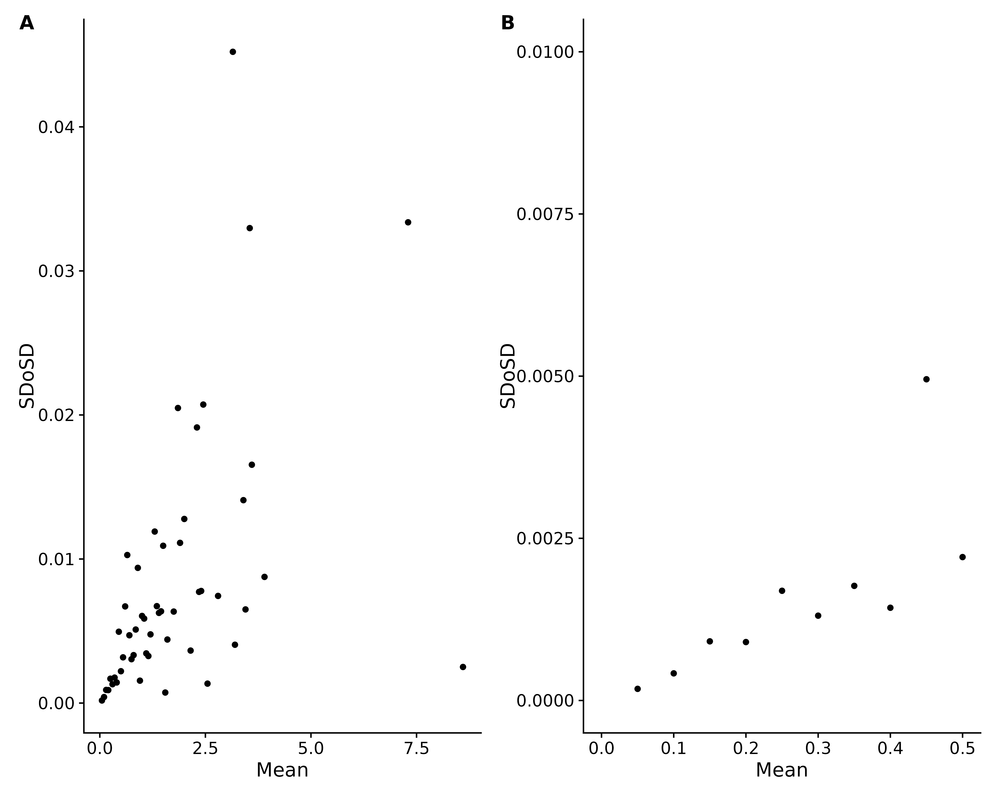
:::
:::


Figure 14.
(A) The mean vs SDoSD for all points where we could calculate a SDoSD.
(B) Zoomed view of (A).

## Metabolite - Metabolite Ratios

Out of curiosity, what happens if we take **all** the possible metabolite - metabolite ratios and calculate them?

### Normalization

Theoretically, this should remove the need for normalization.


::: {.cell}
::: {.cell-output-display}
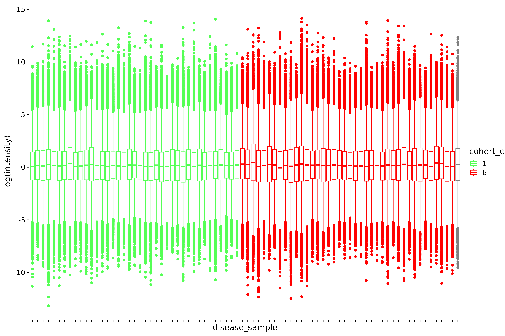
:::
:::


Figure 15.
Metabolite - metabolite log-ratios.

### ICI-Kt


::: {.cell}
::: {.cell-output-display}
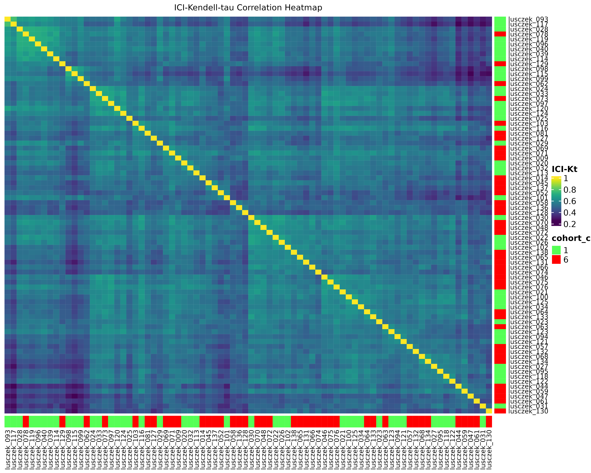
:::
:::


## Green I & Red PCA Table

Here is the information for the PCs from doing PCA on the Green I and Red cohorts only.


::: {.cell}
::: {.cell-output-display}

```{=openxml}
<w:tbl xmlns:w="http://schemas.openxmlformats.org/wordprocessingml/2006/main" xmlns:wp="http://schemas.openxmlformats.org/drawingml/2006/wordprocessingDrawing" xmlns:r="http://schemas.openxmlformats.org/officeDocument/2006/relationships" xmlns:w14="http://schemas.microsoft.com/office/word/2010/wordml"><w:tblPr><w:tblCellMar><w:top w:w="0" w:type="dxa"></w:top><w:bottom w:w="0" w:type="dxa"></w:bottom><w:start w:w="60" w:type="dxa"></w:start><w:end w:w="60" w:type="dxa"></w:end></w:tblCellMar><w:tblW w:type="auto" w:w="0"></w:tblW><w:tblLook w:firstRow="0" w:lastRow="0" w:firstColumn="0" w:lastColumn="0" w:noHBand="0" w:noVBand="0"></w:tblLook><w:jc w:val="center"></w:jc></w:tblPr><w:tr><w:trPr><w:cantSplit></w:cantSplit><w:tblHeader></w:tblHeader></w:trPr><w:tc><w:tcPr><w:tcBorders><w:top w:val="single" w:sz="16" w:space="0" w:color="D3D3D3"></w:top><w:bottom w:val="single" w:sz="16" w:space="0" w:color="D3D3D3"></w:bottom><w:start w:val="single" w:space="0" w:color="D3D3D3"></w:start></w:tcBorders></w:tcPr><w:p>
  <w:pPr>
    <w:spacing w:before="0" w:after="60"/>
    <w:keepNext/>
    <w:jc w:val="start"/>
  </w:pPr>
  <w:r>
    <w:rPr>
      <w:rFonts w:ascii="Calibri" w:hAnsi="Calibri"/>
      <w:sz w:val="20"/>
    </w:rPr>
    <w:t xml:space="default">pc</w:t>
  </w:r>
</w:p></w:tc><w:tc><w:tcPr><w:tcBorders><w:top w:val="single" w:sz="16" w:space="0" w:color="D3D3D3"></w:top><w:bottom w:val="single" w:sz="16" w:space="0" w:color="D3D3D3"></w:bottom></w:tcBorders></w:tcPr><w:p>
  <w:pPr>
    <w:spacing w:before="0" w:after="60"/>
    <w:keepNext/>
    <w:jc w:val="end"/>
  </w:pPr>
  <w:r>
    <w:rPr>
      <w:rFonts w:ascii="Calibri" w:hAnsi="Calibri"/>
      <w:sz w:val="20"/>
    </w:rPr>
    <w:t xml:space="default">variance</w:t>
  </w:r>
</w:p></w:tc><w:tc><w:tcPr><w:tcBorders><w:top w:val="single" w:sz="16" w:space="0" w:color="D3D3D3"></w:top><w:bottom w:val="single" w:sz="16" w:space="0" w:color="D3D3D3"></w:bottom></w:tcBorders></w:tcPr><w:p>
  <w:pPr>
    <w:spacing w:before="0" w:after="60"/>
    <w:keepNext/>
    <w:jc w:val="end"/>
  </w:pPr>
  <w:r>
    <w:rPr>
      <w:rFonts w:ascii="Calibri" w:hAnsi="Calibri"/>
      <w:sz w:val="20"/>
    </w:rPr>
    <w:t xml:space="default">percent</w:t>
  </w:r>
</w:p></w:tc><w:tc><w:tcPr><w:tcBorders><w:top w:val="single" w:sz="16" w:space="0" w:color="D3D3D3"></w:top><w:bottom w:val="single" w:sz="16" w:space="0" w:color="D3D3D3"></w:bottom></w:tcBorders></w:tcPr><w:p>
  <w:pPr>
    <w:spacing w:before="0" w:after="60"/>
    <w:keepNext/>
    <w:jc w:val="end"/>
  </w:pPr>
  <w:r>
    <w:rPr>
      <w:rFonts w:ascii="Calibri" w:hAnsi="Calibri"/>
      <w:sz w:val="20"/>
    </w:rPr>
    <w:t xml:space="default">cumulative</w:t>
  </w:r>
</w:p></w:tc><w:tc><w:tcPr><w:tcBorders><w:top w:val="single" w:sz="16" w:space="0" w:color="D3D3D3"></w:top><w:bottom w:val="single" w:sz="16" w:space="0" w:color="D3D3D3"></w:bottom><w:end w:val="single" w:space="0" w:color="D3D3D3"></w:end></w:tcBorders></w:tcPr><w:p>
  <w:pPr>
    <w:spacing w:before="0" w:after="60"/>
    <w:keepNext/>
    <w:jc w:val="start"/>
  </w:pPr>
  <w:r>
    <w:rPr>
      <w:rFonts w:ascii="Calibri" w:hAnsi="Calibri"/>
      <w:sz w:val="20"/>
    </w:rPr>
    <w:t xml:space="default">labels</w:t>
  </w:r>
</w:p></w:tc></w:tr><w:tr><w:trPr><w:cantSplit></w:cantSplit></w:trPr><w:tc><w:tcPr><w:tcBorders><w:top w:val="single" w:space="0" w:color="D3D3D3"></w:top><w:bottom w:val="single" w:space="0" w:color="D3D3D3"></w:bottom><w:start w:val="single" w:space="0" w:color="D3D3D3"></w:start><w:end w:val="single" w:space="0" w:color="D3D3D3"></w:end></w:tcBorders></w:tcPr><w:p>
  <w:pPr>
    <w:spacing w:before="0" w:after="60"/>
    <w:keepNext/>
    <w:jc w:val="start"/>
  </w:pPr>
  <w:r>
    <w:rPr>
      <w:rFonts w:ascii="Calibri" w:hAnsi="Calibri"/>
      <w:sz w:val="20"/>
    </w:rPr>
    <w:t xml:space="default">PC1</w:t>
  </w:r>
</w:p></w:tc><w:tc><w:tcPr><w:tcBorders><w:top w:val="single" w:space="0" w:color="D3D3D3"></w:top><w:bottom w:val="single" w:space="0" w:color="D3D3D3"></w:bottom><w:start w:val="single" w:space="0" w:color="D3D3D3"></w:start><w:end w:val="single" w:space="0" w:color="D3D3D3"></w:end></w:tcBorders></w:tcPr><w:p>
  <w:pPr>
    <w:spacing w:before="0" w:after="60"/>
    <w:keepNext/>
    <w:jc w:val="end"/>
  </w:pPr>
  <w:r>
    <w:rPr>
      <w:rFonts w:ascii="Calibri" w:hAnsi="Calibri"/>
      <w:sz w:val="20"/>
    </w:rPr>
    <w:t xml:space="default">36.177</w:t>
  </w:r>
</w:p></w:tc><w:tc><w:tcPr><w:tcBorders><w:top w:val="single" w:space="0" w:color="D3D3D3"></w:top><w:bottom w:val="single" w:space="0" w:color="D3D3D3"></w:bottom><w:start w:val="single" w:space="0" w:color="D3D3D3"></w:start><w:end w:val="single" w:space="0" w:color="D3D3D3"></w:end></w:tcBorders></w:tcPr><w:p>
  <w:pPr>
    <w:spacing w:before="0" w:after="60"/>
    <w:keepNext/>
    <w:jc w:val="end"/>
  </w:pPr>
  <w:r>
    <w:rPr>
      <w:rFonts w:ascii="Calibri" w:hAnsi="Calibri"/>
      <w:sz w:val="20"/>
    </w:rPr>
    <w:t xml:space="default">0.147</w:t>
  </w:r>
</w:p></w:tc><w:tc><w:tcPr><w:tcBorders><w:top w:val="single" w:space="0" w:color="D3D3D3"></w:top><w:bottom w:val="single" w:space="0" w:color="D3D3D3"></w:bottom><w:start w:val="single" w:space="0" w:color="D3D3D3"></w:start><w:end w:val="single" w:space="0" w:color="D3D3D3"></w:end></w:tcBorders></w:tcPr><w:p>
  <w:pPr>
    <w:spacing w:before="0" w:after="60"/>
    <w:keepNext/>
    <w:jc w:val="end"/>
  </w:pPr>
  <w:r>
    <w:rPr>
      <w:rFonts w:ascii="Calibri" w:hAnsi="Calibri"/>
      <w:sz w:val="20"/>
    </w:rPr>
    <w:t xml:space="default">0.147</w:t>
  </w:r>
</w:p></w:tc><w:tc><w:tcPr><w:tcBorders><w:top w:val="single" w:space="0" w:color="D3D3D3"></w:top><w:bottom w:val="single" w:space="0" w:color="D3D3D3"></w:bottom><w:start w:val="single" w:space="0" w:color="D3D3D3"></w:start><w:end w:val="single" w:space="0" w:color="D3D3D3"></w:end></w:tcBorders></w:tcPr><w:p>
  <w:pPr>
    <w:spacing w:before="0" w:after="60"/>
    <w:keepNext/>
    <w:jc w:val="start"/>
  </w:pPr>
  <w:r>
    <w:rPr>
      <w:rFonts w:ascii="Calibri" w:hAnsi="Calibri"/>
      <w:sz w:val="20"/>
    </w:rPr>
    <w:t xml:space="default">PC1 (15%)</w:t>
  </w:r>
</w:p></w:tc></w:tr>
<w:tr><w:trPr><w:cantSplit></w:cantSplit></w:trPr><w:tc><w:tcPr><w:tcBorders><w:top w:val="single" w:space="0" w:color="D3D3D3"></w:top><w:bottom w:val="single" w:space="0" w:color="D3D3D3"></w:bottom><w:start w:val="single" w:space="0" w:color="D3D3D3"></w:start><w:end w:val="single" w:space="0" w:color="D3D3D3"></w:end></w:tcBorders></w:tcPr><w:p>
  <w:pPr>
    <w:spacing w:before="0" w:after="60"/>
    <w:keepNext/>
    <w:jc w:val="start"/>
  </w:pPr>
  <w:r>
    <w:rPr>
      <w:rFonts w:ascii="Calibri" w:hAnsi="Calibri"/>
      <w:sz w:val="20"/>
    </w:rPr>
    <w:t xml:space="default">PC2</w:t>
  </w:r>
</w:p></w:tc><w:tc><w:tcPr><w:tcBorders><w:top w:val="single" w:space="0" w:color="D3D3D3"></w:top><w:bottom w:val="single" w:space="0" w:color="D3D3D3"></w:bottom><w:start w:val="single" w:space="0" w:color="D3D3D3"></w:start><w:end w:val="single" w:space="0" w:color="D3D3D3"></w:end></w:tcBorders></w:tcPr><w:p>
  <w:pPr>
    <w:spacing w:before="0" w:after="60"/>
    <w:keepNext/>
    <w:jc w:val="end"/>
  </w:pPr>
  <w:r>
    <w:rPr>
      <w:rFonts w:ascii="Calibri" w:hAnsi="Calibri"/>
      <w:sz w:val="20"/>
    </w:rPr>
    <w:t xml:space="default">18.368</w:t>
  </w:r>
</w:p></w:tc><w:tc><w:tcPr><w:tcBorders><w:top w:val="single" w:space="0" w:color="D3D3D3"></w:top><w:bottom w:val="single" w:space="0" w:color="D3D3D3"></w:bottom><w:start w:val="single" w:space="0" w:color="D3D3D3"></w:start><w:end w:val="single" w:space="0" w:color="D3D3D3"></w:end></w:tcBorders></w:tcPr><w:p>
  <w:pPr>
    <w:spacing w:before="0" w:after="60"/>
    <w:keepNext/>
    <w:jc w:val="end"/>
  </w:pPr>
  <w:r>
    <w:rPr>
      <w:rFonts w:ascii="Calibri" w:hAnsi="Calibri"/>
      <w:sz w:val="20"/>
    </w:rPr>
    <w:t xml:space="default">0.075</w:t>
  </w:r>
</w:p></w:tc><w:tc><w:tcPr><w:tcBorders><w:top w:val="single" w:space="0" w:color="D3D3D3"></w:top><w:bottom w:val="single" w:space="0" w:color="D3D3D3"></w:bottom><w:start w:val="single" w:space="0" w:color="D3D3D3"></w:start><w:end w:val="single" w:space="0" w:color="D3D3D3"></w:end></w:tcBorders></w:tcPr><w:p>
  <w:pPr>
    <w:spacing w:before="0" w:after="60"/>
    <w:keepNext/>
    <w:jc w:val="end"/>
  </w:pPr>
  <w:r>
    <w:rPr>
      <w:rFonts w:ascii="Calibri" w:hAnsi="Calibri"/>
      <w:sz w:val="20"/>
    </w:rPr>
    <w:t xml:space="default">0.222</w:t>
  </w:r>
</w:p></w:tc><w:tc><w:tcPr><w:tcBorders><w:top w:val="single" w:space="0" w:color="D3D3D3"></w:top><w:bottom w:val="single" w:space="0" w:color="D3D3D3"></w:bottom><w:start w:val="single" w:space="0" w:color="D3D3D3"></w:start><w:end w:val="single" w:space="0" w:color="D3D3D3"></w:end></w:tcBorders></w:tcPr><w:p>
  <w:pPr>
    <w:spacing w:before="0" w:after="60"/>
    <w:keepNext/>
    <w:jc w:val="start"/>
  </w:pPr>
  <w:r>
    <w:rPr>
      <w:rFonts w:ascii="Calibri" w:hAnsi="Calibri"/>
      <w:sz w:val="20"/>
    </w:rPr>
    <w:t xml:space="default">PC2 (7.5%)</w:t>
  </w:r>
</w:p></w:tc></w:tr>
<w:tr><w:trPr><w:cantSplit></w:cantSplit></w:trPr><w:tc><w:tcPr><w:tcBorders><w:top w:val="single" w:space="0" w:color="D3D3D3"></w:top><w:bottom w:val="single" w:space="0" w:color="D3D3D3"></w:bottom><w:start w:val="single" w:space="0" w:color="D3D3D3"></w:start><w:end w:val="single" w:space="0" w:color="D3D3D3"></w:end></w:tcBorders></w:tcPr><w:p>
  <w:pPr>
    <w:spacing w:before="0" w:after="60"/>
    <w:keepNext/>
    <w:jc w:val="start"/>
  </w:pPr>
  <w:r>
    <w:rPr>
      <w:rFonts w:ascii="Calibri" w:hAnsi="Calibri"/>
      <w:sz w:val="20"/>
    </w:rPr>
    <w:t xml:space="default">PC3</w:t>
  </w:r>
</w:p></w:tc><w:tc><w:tcPr><w:tcBorders><w:top w:val="single" w:space="0" w:color="D3D3D3"></w:top><w:bottom w:val="single" w:space="0" w:color="D3D3D3"></w:bottom><w:start w:val="single" w:space="0" w:color="D3D3D3"></w:start><w:end w:val="single" w:space="0" w:color="D3D3D3"></w:end></w:tcBorders></w:tcPr><w:p>
  <w:pPr>
    <w:spacing w:before="0" w:after="60"/>
    <w:keepNext/>
    <w:jc w:val="end"/>
  </w:pPr>
  <w:r>
    <w:rPr>
      <w:rFonts w:ascii="Calibri" w:hAnsi="Calibri"/>
      <w:sz w:val="20"/>
    </w:rPr>
    <w:t xml:space="default">14.008</w:t>
  </w:r>
</w:p></w:tc><w:tc><w:tcPr><w:tcBorders><w:top w:val="single" w:space="0" w:color="D3D3D3"></w:top><w:bottom w:val="single" w:space="0" w:color="D3D3D3"></w:bottom><w:start w:val="single" w:space="0" w:color="D3D3D3"></w:start><w:end w:val="single" w:space="0" w:color="D3D3D3"></w:end></w:tcBorders></w:tcPr><w:p>
  <w:pPr>
    <w:spacing w:before="0" w:after="60"/>
    <w:keepNext/>
    <w:jc w:val="end"/>
  </w:pPr>
  <w:r>
    <w:rPr>
      <w:rFonts w:ascii="Calibri" w:hAnsi="Calibri"/>
      <w:sz w:val="20"/>
    </w:rPr>
    <w:t xml:space="default">0.057</w:t>
  </w:r>
</w:p></w:tc><w:tc><w:tcPr><w:tcBorders><w:top w:val="single" w:space="0" w:color="D3D3D3"></w:top><w:bottom w:val="single" w:space="0" w:color="D3D3D3"></w:bottom><w:start w:val="single" w:space="0" w:color="D3D3D3"></w:start><w:end w:val="single" w:space="0" w:color="D3D3D3"></w:end></w:tcBorders></w:tcPr><w:p>
  <w:pPr>
    <w:spacing w:before="0" w:after="60"/>
    <w:keepNext/>
    <w:jc w:val="end"/>
  </w:pPr>
  <w:r>
    <w:rPr>
      <w:rFonts w:ascii="Calibri" w:hAnsi="Calibri"/>
      <w:sz w:val="20"/>
    </w:rPr>
    <w:t xml:space="default">0.278</w:t>
  </w:r>
</w:p></w:tc><w:tc><w:tcPr><w:tcBorders><w:top w:val="single" w:space="0" w:color="D3D3D3"></w:top><w:bottom w:val="single" w:space="0" w:color="D3D3D3"></w:bottom><w:start w:val="single" w:space="0" w:color="D3D3D3"></w:start><w:end w:val="single" w:space="0" w:color="D3D3D3"></w:end></w:tcBorders></w:tcPr><w:p>
  <w:pPr>
    <w:spacing w:before="0" w:after="60"/>
    <w:keepNext/>
    <w:jc w:val="start"/>
  </w:pPr>
  <w:r>
    <w:rPr>
      <w:rFonts w:ascii="Calibri" w:hAnsi="Calibri"/>
      <w:sz w:val="20"/>
    </w:rPr>
    <w:t xml:space="default">PC3 (5.7%)</w:t>
  </w:r>
</w:p></w:tc></w:tr>
<w:tr><w:trPr><w:cantSplit></w:cantSplit></w:trPr><w:tc><w:tcPr><w:tcBorders><w:top w:val="single" w:space="0" w:color="D3D3D3"></w:top><w:bottom w:val="single" w:space="0" w:color="D3D3D3"></w:bottom><w:start w:val="single" w:space="0" w:color="D3D3D3"></w:start><w:end w:val="single" w:space="0" w:color="D3D3D3"></w:end></w:tcBorders></w:tcPr><w:p>
  <w:pPr>
    <w:spacing w:before="0" w:after="60"/>
    <w:keepNext/>
    <w:jc w:val="start"/>
  </w:pPr>
  <w:r>
    <w:rPr>
      <w:rFonts w:ascii="Calibri" w:hAnsi="Calibri"/>
      <w:sz w:val="20"/>
    </w:rPr>
    <w:t xml:space="default">PC4</w:t>
  </w:r>
</w:p></w:tc><w:tc><w:tcPr><w:tcBorders><w:top w:val="single" w:space="0" w:color="D3D3D3"></w:top><w:bottom w:val="single" w:space="0" w:color="D3D3D3"></w:bottom><w:start w:val="single" w:space="0" w:color="D3D3D3"></w:start><w:end w:val="single" w:space="0" w:color="D3D3D3"></w:end></w:tcBorders></w:tcPr><w:p>
  <w:pPr>
    <w:spacing w:before="0" w:after="60"/>
    <w:keepNext/>
    <w:jc w:val="end"/>
  </w:pPr>
  <w:r>
    <w:rPr>
      <w:rFonts w:ascii="Calibri" w:hAnsi="Calibri"/>
      <w:sz w:val="20"/>
    </w:rPr>
    <w:t xml:space="default">12.297</w:t>
  </w:r>
</w:p></w:tc><w:tc><w:tcPr><w:tcBorders><w:top w:val="single" w:space="0" w:color="D3D3D3"></w:top><w:bottom w:val="single" w:space="0" w:color="D3D3D3"></w:bottom><w:start w:val="single" w:space="0" w:color="D3D3D3"></w:start><w:end w:val="single" w:space="0" w:color="D3D3D3"></w:end></w:tcBorders></w:tcPr><w:p>
  <w:pPr>
    <w:spacing w:before="0" w:after="60"/>
    <w:keepNext/>
    <w:jc w:val="end"/>
  </w:pPr>
  <w:r>
    <w:rPr>
      <w:rFonts w:ascii="Calibri" w:hAnsi="Calibri"/>
      <w:sz w:val="20"/>
    </w:rPr>
    <w:t xml:space="default">0.050</w:t>
  </w:r>
</w:p></w:tc><w:tc><w:tcPr><w:tcBorders><w:top w:val="single" w:space="0" w:color="D3D3D3"></w:top><w:bottom w:val="single" w:space="0" w:color="D3D3D3"></w:bottom><w:start w:val="single" w:space="0" w:color="D3D3D3"></w:start><w:end w:val="single" w:space="0" w:color="D3D3D3"></w:end></w:tcBorders></w:tcPr><w:p>
  <w:pPr>
    <w:spacing w:before="0" w:after="60"/>
    <w:keepNext/>
    <w:jc w:val="end"/>
  </w:pPr>
  <w:r>
    <w:rPr>
      <w:rFonts w:ascii="Calibri" w:hAnsi="Calibri"/>
      <w:sz w:val="20"/>
    </w:rPr>
    <w:t xml:space="default">0.328</w:t>
  </w:r>
</w:p></w:tc><w:tc><w:tcPr><w:tcBorders><w:top w:val="single" w:space="0" w:color="D3D3D3"></w:top><w:bottom w:val="single" w:space="0" w:color="D3D3D3"></w:bottom><w:start w:val="single" w:space="0" w:color="D3D3D3"></w:start><w:end w:val="single" w:space="0" w:color="D3D3D3"></w:end></w:tcBorders></w:tcPr><w:p>
  <w:pPr>
    <w:spacing w:before="0" w:after="60"/>
    <w:keepNext/>
    <w:jc w:val="start"/>
  </w:pPr>
  <w:r>
    <w:rPr>
      <w:rFonts w:ascii="Calibri" w:hAnsi="Calibri"/>
      <w:sz w:val="20"/>
    </w:rPr>
    <w:t xml:space="default">PC4 (5%)</w:t>
  </w:r>
</w:p></w:tc></w:tr>
<w:tr><w:trPr><w:cantSplit></w:cantSplit></w:trPr><w:tc><w:tcPr><w:tcBorders><w:top w:val="single" w:space="0" w:color="D3D3D3"></w:top><w:bottom w:val="single" w:space="0" w:color="D3D3D3"></w:bottom><w:start w:val="single" w:space="0" w:color="D3D3D3"></w:start><w:end w:val="single" w:space="0" w:color="D3D3D3"></w:end></w:tcBorders></w:tcPr><w:p>
  <w:pPr>
    <w:spacing w:before="0" w:after="60"/>
    <w:keepNext/>
    <w:jc w:val="start"/>
  </w:pPr>
  <w:r>
    <w:rPr>
      <w:rFonts w:ascii="Calibri" w:hAnsi="Calibri"/>
      <w:sz w:val="20"/>
    </w:rPr>
    <w:t xml:space="default">PC5</w:t>
  </w:r>
</w:p></w:tc><w:tc><w:tcPr><w:tcBorders><w:top w:val="single" w:space="0" w:color="D3D3D3"></w:top><w:bottom w:val="single" w:space="0" w:color="D3D3D3"></w:bottom><w:start w:val="single" w:space="0" w:color="D3D3D3"></w:start><w:end w:val="single" w:space="0" w:color="D3D3D3"></w:end></w:tcBorders></w:tcPr><w:p>
  <w:pPr>
    <w:spacing w:before="0" w:after="60"/>
    <w:keepNext/>
    <w:jc w:val="end"/>
  </w:pPr>
  <w:r>
    <w:rPr>
      <w:rFonts w:ascii="Calibri" w:hAnsi="Calibri"/>
      <w:sz w:val="20"/>
    </w:rPr>
    <w:t xml:space="default">10.793</w:t>
  </w:r>
</w:p></w:tc><w:tc><w:tcPr><w:tcBorders><w:top w:val="single" w:space="0" w:color="D3D3D3"></w:top><w:bottom w:val="single" w:space="0" w:color="D3D3D3"></w:bottom><w:start w:val="single" w:space="0" w:color="D3D3D3"></w:start><w:end w:val="single" w:space="0" w:color="D3D3D3"></w:end></w:tcBorders></w:tcPr><w:p>
  <w:pPr>
    <w:spacing w:before="0" w:after="60"/>
    <w:keepNext/>
    <w:jc w:val="end"/>
  </w:pPr>
  <w:r>
    <w:rPr>
      <w:rFonts w:ascii="Calibri" w:hAnsi="Calibri"/>
      <w:sz w:val="20"/>
    </w:rPr>
    <w:t xml:space="default">0.044</w:t>
  </w:r>
</w:p></w:tc><w:tc><w:tcPr><w:tcBorders><w:top w:val="single" w:space="0" w:color="D3D3D3"></w:top><w:bottom w:val="single" w:space="0" w:color="D3D3D3"></w:bottom><w:start w:val="single" w:space="0" w:color="D3D3D3"></w:start><w:end w:val="single" w:space="0" w:color="D3D3D3"></w:end></w:tcBorders></w:tcPr><w:p>
  <w:pPr>
    <w:spacing w:before="0" w:after="60"/>
    <w:keepNext/>
    <w:jc w:val="end"/>
  </w:pPr>
  <w:r>
    <w:rPr>
      <w:rFonts w:ascii="Calibri" w:hAnsi="Calibri"/>
      <w:sz w:val="20"/>
    </w:rPr>
    <w:t xml:space="default">0.372</w:t>
  </w:r>
</w:p></w:tc><w:tc><w:tcPr><w:tcBorders><w:top w:val="single" w:space="0" w:color="D3D3D3"></w:top><w:bottom w:val="single" w:space="0" w:color="D3D3D3"></w:bottom><w:start w:val="single" w:space="0" w:color="D3D3D3"></w:start><w:end w:val="single" w:space="0" w:color="D3D3D3"></w:end></w:tcBorders></w:tcPr><w:p>
  <w:pPr>
    <w:spacing w:before="0" w:after="60"/>
    <w:keepNext/>
    <w:jc w:val="start"/>
  </w:pPr>
  <w:r>
    <w:rPr>
      <w:rFonts w:ascii="Calibri" w:hAnsi="Calibri"/>
      <w:sz w:val="20"/>
    </w:rPr>
    <w:t xml:space="default">PC5 (4.4%)</w:t>
  </w:r>
</w:p></w:tc></w:tr>
<w:tr><w:trPr><w:cantSplit></w:cantSplit></w:trPr><w:tc><w:tcPr><w:tcBorders><w:top w:val="single" w:space="0" w:color="D3D3D3"></w:top><w:bottom w:val="single" w:space="0" w:color="D3D3D3"></w:bottom><w:start w:val="single" w:space="0" w:color="D3D3D3"></w:start><w:end w:val="single" w:space="0" w:color="D3D3D3"></w:end></w:tcBorders></w:tcPr><w:p>
  <w:pPr>
    <w:spacing w:before="0" w:after="60"/>
    <w:keepNext/>
    <w:jc w:val="start"/>
  </w:pPr>
  <w:r>
    <w:rPr>
      <w:rFonts w:ascii="Calibri" w:hAnsi="Calibri"/>
      <w:sz w:val="20"/>
    </w:rPr>
    <w:t xml:space="default">PC6</w:t>
  </w:r>
</w:p></w:tc><w:tc><w:tcPr><w:tcBorders><w:top w:val="single" w:space="0" w:color="D3D3D3"></w:top><w:bottom w:val="single" w:space="0" w:color="D3D3D3"></w:bottom><w:start w:val="single" w:space="0" w:color="D3D3D3"></w:start><w:end w:val="single" w:space="0" w:color="D3D3D3"></w:end></w:tcBorders></w:tcPr><w:p>
  <w:pPr>
    <w:spacing w:before="0" w:after="60"/>
    <w:keepNext/>
    <w:jc w:val="end"/>
  </w:pPr>
  <w:r>
    <w:rPr>
      <w:rFonts w:ascii="Calibri" w:hAnsi="Calibri"/>
      <w:sz w:val="20"/>
    </w:rPr>
    <w:t xml:space="default">9.644</w:t>
  </w:r>
</w:p></w:tc><w:tc><w:tcPr><w:tcBorders><w:top w:val="single" w:space="0" w:color="D3D3D3"></w:top><w:bottom w:val="single" w:space="0" w:color="D3D3D3"></w:bottom><w:start w:val="single" w:space="0" w:color="D3D3D3"></w:start><w:end w:val="single" w:space="0" w:color="D3D3D3"></w:end></w:tcBorders></w:tcPr><w:p>
  <w:pPr>
    <w:spacing w:before="0" w:after="60"/>
    <w:keepNext/>
    <w:jc w:val="end"/>
  </w:pPr>
  <w:r>
    <w:rPr>
      <w:rFonts w:ascii="Calibri" w:hAnsi="Calibri"/>
      <w:sz w:val="20"/>
    </w:rPr>
    <w:t xml:space="default">0.039</w:t>
  </w:r>
</w:p></w:tc><w:tc><w:tcPr><w:tcBorders><w:top w:val="single" w:space="0" w:color="D3D3D3"></w:top><w:bottom w:val="single" w:space="0" w:color="D3D3D3"></w:bottom><w:start w:val="single" w:space="0" w:color="D3D3D3"></w:start><w:end w:val="single" w:space="0" w:color="D3D3D3"></w:end></w:tcBorders></w:tcPr><w:p>
  <w:pPr>
    <w:spacing w:before="0" w:after="60"/>
    <w:keepNext/>
    <w:jc w:val="end"/>
  </w:pPr>
  <w:r>
    <w:rPr>
      <w:rFonts w:ascii="Calibri" w:hAnsi="Calibri"/>
      <w:sz w:val="20"/>
    </w:rPr>
    <w:t xml:space="default">0.411</w:t>
  </w:r>
</w:p></w:tc><w:tc><w:tcPr><w:tcBorders><w:top w:val="single" w:space="0" w:color="D3D3D3"></w:top><w:bottom w:val="single" w:space="0" w:color="D3D3D3"></w:bottom><w:start w:val="single" w:space="0" w:color="D3D3D3"></w:start><w:end w:val="single" w:space="0" w:color="D3D3D3"></w:end></w:tcBorders></w:tcPr><w:p>
  <w:pPr>
    <w:spacing w:before="0" w:after="60"/>
    <w:keepNext/>
    <w:jc w:val="start"/>
  </w:pPr>
  <w:r>
    <w:rPr>
      <w:rFonts w:ascii="Calibri" w:hAnsi="Calibri"/>
      <w:sz w:val="20"/>
    </w:rPr>
    <w:t xml:space="default">PC6 (3.9%)</w:t>
  </w:r>
</w:p></w:tc></w:tr>
<w:tr><w:trPr><w:cantSplit></w:cantSplit></w:trPr><w:tc><w:tcPr><w:tcBorders><w:top w:val="single" w:space="0" w:color="D3D3D3"></w:top><w:bottom w:val="single" w:space="0" w:color="D3D3D3"></w:bottom><w:start w:val="single" w:space="0" w:color="D3D3D3"></w:start><w:end w:val="single" w:space="0" w:color="D3D3D3"></w:end></w:tcBorders></w:tcPr><w:p>
  <w:pPr>
    <w:spacing w:before="0" w:after="60"/>
    <w:keepNext/>
    <w:jc w:val="start"/>
  </w:pPr>
  <w:r>
    <w:rPr>
      <w:rFonts w:ascii="Calibri" w:hAnsi="Calibri"/>
      <w:sz w:val="20"/>
    </w:rPr>
    <w:t xml:space="default">PC7</w:t>
  </w:r>
</w:p></w:tc><w:tc><w:tcPr><w:tcBorders><w:top w:val="single" w:space="0" w:color="D3D3D3"></w:top><w:bottom w:val="single" w:space="0" w:color="D3D3D3"></w:bottom><w:start w:val="single" w:space="0" w:color="D3D3D3"></w:start><w:end w:val="single" w:space="0" w:color="D3D3D3"></w:end></w:tcBorders></w:tcPr><w:p>
  <w:pPr>
    <w:spacing w:before="0" w:after="60"/>
    <w:keepNext/>
    <w:jc w:val="end"/>
  </w:pPr>
  <w:r>
    <w:rPr>
      <w:rFonts w:ascii="Calibri" w:hAnsi="Calibri"/>
      <w:sz w:val="20"/>
    </w:rPr>
    <w:t xml:space="default">7.898</w:t>
  </w:r>
</w:p></w:tc><w:tc><w:tcPr><w:tcBorders><w:top w:val="single" w:space="0" w:color="D3D3D3"></w:top><w:bottom w:val="single" w:space="0" w:color="D3D3D3"></w:bottom><w:start w:val="single" w:space="0" w:color="D3D3D3"></w:start><w:end w:val="single" w:space="0" w:color="D3D3D3"></w:end></w:tcBorders></w:tcPr><w:p>
  <w:pPr>
    <w:spacing w:before="0" w:after="60"/>
    <w:keepNext/>
    <w:jc w:val="end"/>
  </w:pPr>
  <w:r>
    <w:rPr>
      <w:rFonts w:ascii="Calibri" w:hAnsi="Calibri"/>
      <w:sz w:val="20"/>
    </w:rPr>
    <w:t xml:space="default">0.032</w:t>
  </w:r>
</w:p></w:tc><w:tc><w:tcPr><w:tcBorders><w:top w:val="single" w:space="0" w:color="D3D3D3"></w:top><w:bottom w:val="single" w:space="0" w:color="D3D3D3"></w:bottom><w:start w:val="single" w:space="0" w:color="D3D3D3"></w:start><w:end w:val="single" w:space="0" w:color="D3D3D3"></w:end></w:tcBorders></w:tcPr><w:p>
  <w:pPr>
    <w:spacing w:before="0" w:after="60"/>
    <w:keepNext/>
    <w:jc w:val="end"/>
  </w:pPr>
  <w:r>
    <w:rPr>
      <w:rFonts w:ascii="Calibri" w:hAnsi="Calibri"/>
      <w:sz w:val="20"/>
    </w:rPr>
    <w:t xml:space="default">0.444</w:t>
  </w:r>
</w:p></w:tc><w:tc><w:tcPr><w:tcBorders><w:top w:val="single" w:space="0" w:color="D3D3D3"></w:top><w:bottom w:val="single" w:space="0" w:color="D3D3D3"></w:bottom><w:start w:val="single" w:space="0" w:color="D3D3D3"></w:start><w:end w:val="single" w:space="0" w:color="D3D3D3"></w:end></w:tcBorders></w:tcPr><w:p>
  <w:pPr>
    <w:spacing w:before="0" w:after="60"/>
    <w:keepNext/>
    <w:jc w:val="start"/>
  </w:pPr>
  <w:r>
    <w:rPr>
      <w:rFonts w:ascii="Calibri" w:hAnsi="Calibri"/>
      <w:sz w:val="20"/>
    </w:rPr>
    <w:t xml:space="default">PC7 (3.2%)</w:t>
  </w:r>
</w:p></w:tc></w:tr>
<w:tr><w:trPr><w:cantSplit></w:cantSplit></w:trPr><w:tc><w:tcPr><w:tcBorders><w:top w:val="single" w:space="0" w:color="D3D3D3"></w:top><w:bottom w:val="single" w:space="0" w:color="D3D3D3"></w:bottom><w:start w:val="single" w:space="0" w:color="D3D3D3"></w:start><w:end w:val="single" w:space="0" w:color="D3D3D3"></w:end></w:tcBorders></w:tcPr><w:p>
  <w:pPr>
    <w:spacing w:before="0" w:after="60"/>
    <w:keepNext/>
    <w:jc w:val="start"/>
  </w:pPr>
  <w:r>
    <w:rPr>
      <w:rFonts w:ascii="Calibri" w:hAnsi="Calibri"/>
      <w:sz w:val="20"/>
    </w:rPr>
    <w:t xml:space="default">PC8</w:t>
  </w:r>
</w:p></w:tc><w:tc><w:tcPr><w:tcBorders><w:top w:val="single" w:space="0" w:color="D3D3D3"></w:top><w:bottom w:val="single" w:space="0" w:color="D3D3D3"></w:bottom><w:start w:val="single" w:space="0" w:color="D3D3D3"></w:start><w:end w:val="single" w:space="0" w:color="D3D3D3"></w:end></w:tcBorders></w:tcPr><w:p>
  <w:pPr>
    <w:spacing w:before="0" w:after="60"/>
    <w:keepNext/>
    <w:jc w:val="end"/>
  </w:pPr>
  <w:r>
    <w:rPr>
      <w:rFonts w:ascii="Calibri" w:hAnsi="Calibri"/>
      <w:sz w:val="20"/>
    </w:rPr>
    <w:t xml:space="default">7.548</w:t>
  </w:r>
</w:p></w:tc><w:tc><w:tcPr><w:tcBorders><w:top w:val="single" w:space="0" w:color="D3D3D3"></w:top><w:bottom w:val="single" w:space="0" w:color="D3D3D3"></w:bottom><w:start w:val="single" w:space="0" w:color="D3D3D3"></w:start><w:end w:val="single" w:space="0" w:color="D3D3D3"></w:end></w:tcBorders></w:tcPr><w:p>
  <w:pPr>
    <w:spacing w:before="0" w:after="60"/>
    <w:keepNext/>
    <w:jc w:val="end"/>
  </w:pPr>
  <w:r>
    <w:rPr>
      <w:rFonts w:ascii="Calibri" w:hAnsi="Calibri"/>
      <w:sz w:val="20"/>
    </w:rPr>
    <w:t xml:space="default">0.031</w:t>
  </w:r>
</w:p></w:tc><w:tc><w:tcPr><w:tcBorders><w:top w:val="single" w:space="0" w:color="D3D3D3"></w:top><w:bottom w:val="single" w:space="0" w:color="D3D3D3"></w:bottom><w:start w:val="single" w:space="0" w:color="D3D3D3"></w:start><w:end w:val="single" w:space="0" w:color="D3D3D3"></w:end></w:tcBorders></w:tcPr><w:p>
  <w:pPr>
    <w:spacing w:before="0" w:after="60"/>
    <w:keepNext/>
    <w:jc w:val="end"/>
  </w:pPr>
  <w:r>
    <w:rPr>
      <w:rFonts w:ascii="Calibri" w:hAnsi="Calibri"/>
      <w:sz w:val="20"/>
    </w:rPr>
    <w:t xml:space="default">0.474</w:t>
  </w:r>
</w:p></w:tc><w:tc><w:tcPr><w:tcBorders><w:top w:val="single" w:space="0" w:color="D3D3D3"></w:top><w:bottom w:val="single" w:space="0" w:color="D3D3D3"></w:bottom><w:start w:val="single" w:space="0" w:color="D3D3D3"></w:start><w:end w:val="single" w:space="0" w:color="D3D3D3"></w:end></w:tcBorders></w:tcPr><w:p>
  <w:pPr>
    <w:spacing w:before="0" w:after="60"/>
    <w:keepNext/>
    <w:jc w:val="start"/>
  </w:pPr>
  <w:r>
    <w:rPr>
      <w:rFonts w:ascii="Calibri" w:hAnsi="Calibri"/>
      <w:sz w:val="20"/>
    </w:rPr>
    <w:t xml:space="default">PC8 (3.1%)</w:t>
  </w:r>
</w:p></w:tc></w:tr>
<w:tr><w:trPr><w:cantSplit></w:cantSplit></w:trPr><w:tc><w:tcPr><w:tcBorders><w:top w:val="single" w:space="0" w:color="D3D3D3"></w:top><w:bottom w:val="single" w:space="0" w:color="D3D3D3"></w:bottom><w:start w:val="single" w:space="0" w:color="D3D3D3"></w:start><w:end w:val="single" w:space="0" w:color="D3D3D3"></w:end></w:tcBorders></w:tcPr><w:p>
  <w:pPr>
    <w:spacing w:before="0" w:after="60"/>
    <w:keepNext/>
    <w:jc w:val="start"/>
  </w:pPr>
  <w:r>
    <w:rPr>
      <w:rFonts w:ascii="Calibri" w:hAnsi="Calibri"/>
      <w:sz w:val="20"/>
    </w:rPr>
    <w:t xml:space="default">PC9</w:t>
  </w:r>
</w:p></w:tc><w:tc><w:tcPr><w:tcBorders><w:top w:val="single" w:space="0" w:color="D3D3D3"></w:top><w:bottom w:val="single" w:space="0" w:color="D3D3D3"></w:bottom><w:start w:val="single" w:space="0" w:color="D3D3D3"></w:start><w:end w:val="single" w:space="0" w:color="D3D3D3"></w:end></w:tcBorders></w:tcPr><w:p>
  <w:pPr>
    <w:spacing w:before="0" w:after="60"/>
    <w:keepNext/>
    <w:jc w:val="end"/>
  </w:pPr>
  <w:r>
    <w:rPr>
      <w:rFonts w:ascii="Calibri" w:hAnsi="Calibri"/>
      <w:sz w:val="20"/>
    </w:rPr>
    <w:t xml:space="default">6.793</w:t>
  </w:r>
</w:p></w:tc><w:tc><w:tcPr><w:tcBorders><w:top w:val="single" w:space="0" w:color="D3D3D3"></w:top><w:bottom w:val="single" w:space="0" w:color="D3D3D3"></w:bottom><w:start w:val="single" w:space="0" w:color="D3D3D3"></w:start><w:end w:val="single" w:space="0" w:color="D3D3D3"></w:end></w:tcBorders></w:tcPr><w:p>
  <w:pPr>
    <w:spacing w:before="0" w:after="60"/>
    <w:keepNext/>
    <w:jc w:val="end"/>
  </w:pPr>
  <w:r>
    <w:rPr>
      <w:rFonts w:ascii="Calibri" w:hAnsi="Calibri"/>
      <w:sz w:val="20"/>
    </w:rPr>
    <w:t xml:space="default">0.028</w:t>
  </w:r>
</w:p></w:tc><w:tc><w:tcPr><w:tcBorders><w:top w:val="single" w:space="0" w:color="D3D3D3"></w:top><w:bottom w:val="single" w:space="0" w:color="D3D3D3"></w:bottom><w:start w:val="single" w:space="0" w:color="D3D3D3"></w:start><w:end w:val="single" w:space="0" w:color="D3D3D3"></w:end></w:tcBorders></w:tcPr><w:p>
  <w:pPr>
    <w:spacing w:before="0" w:after="60"/>
    <w:keepNext/>
    <w:jc w:val="end"/>
  </w:pPr>
  <w:r>
    <w:rPr>
      <w:rFonts w:ascii="Calibri" w:hAnsi="Calibri"/>
      <w:sz w:val="20"/>
    </w:rPr>
    <w:t xml:space="default">0.502</w:t>
  </w:r>
</w:p></w:tc><w:tc><w:tcPr><w:tcBorders><w:top w:val="single" w:space="0" w:color="D3D3D3"></w:top><w:bottom w:val="single" w:space="0" w:color="D3D3D3"></w:bottom><w:start w:val="single" w:space="0" w:color="D3D3D3"></w:start><w:end w:val="single" w:space="0" w:color="D3D3D3"></w:end></w:tcBorders></w:tcPr><w:p>
  <w:pPr>
    <w:spacing w:before="0" w:after="60"/>
    <w:keepNext/>
    <w:jc w:val="start"/>
  </w:pPr>
  <w:r>
    <w:rPr>
      <w:rFonts w:ascii="Calibri" w:hAnsi="Calibri"/>
      <w:sz w:val="20"/>
    </w:rPr>
    <w:t xml:space="default">PC9 (2.8%)</w:t>
  </w:r>
</w:p></w:tc></w:tr>
<w:tr><w:trPr><w:cantSplit></w:cantSplit></w:trPr><w:tc><w:tcPr><w:tcBorders><w:top w:val="single" w:space="0" w:color="D3D3D3"></w:top><w:bottom w:val="single" w:space="0" w:color="D3D3D3"></w:bottom><w:start w:val="single" w:space="0" w:color="D3D3D3"></w:start><w:end w:val="single" w:space="0" w:color="D3D3D3"></w:end></w:tcBorders></w:tcPr><w:p>
  <w:pPr>
    <w:spacing w:before="0" w:after="60"/>
    <w:keepNext/>
    <w:jc w:val="start"/>
  </w:pPr>
  <w:r>
    <w:rPr>
      <w:rFonts w:ascii="Calibri" w:hAnsi="Calibri"/>
      <w:sz w:val="20"/>
    </w:rPr>
    <w:t xml:space="default">PC10</w:t>
  </w:r>
</w:p></w:tc><w:tc><w:tcPr><w:tcBorders><w:top w:val="single" w:space="0" w:color="D3D3D3"></w:top><w:bottom w:val="single" w:space="0" w:color="D3D3D3"></w:bottom><w:start w:val="single" w:space="0" w:color="D3D3D3"></w:start><w:end w:val="single" w:space="0" w:color="D3D3D3"></w:end></w:tcBorders></w:tcPr><w:p>
  <w:pPr>
    <w:spacing w:before="0" w:after="60"/>
    <w:keepNext/>
    <w:jc w:val="end"/>
  </w:pPr>
  <w:r>
    <w:rPr>
      <w:rFonts w:ascii="Calibri" w:hAnsi="Calibri"/>
      <w:sz w:val="20"/>
    </w:rPr>
    <w:t xml:space="default">6.394</w:t>
  </w:r>
</w:p></w:tc><w:tc><w:tcPr><w:tcBorders><w:top w:val="single" w:space="0" w:color="D3D3D3"></w:top><w:bottom w:val="single" w:space="0" w:color="D3D3D3"></w:bottom><w:start w:val="single" w:space="0" w:color="D3D3D3"></w:start><w:end w:val="single" w:space="0" w:color="D3D3D3"></w:end></w:tcBorders></w:tcPr><w:p>
  <w:pPr>
    <w:spacing w:before="0" w:after="60"/>
    <w:keepNext/>
    <w:jc w:val="end"/>
  </w:pPr>
  <w:r>
    <w:rPr>
      <w:rFonts w:ascii="Calibri" w:hAnsi="Calibri"/>
      <w:sz w:val="20"/>
    </w:rPr>
    <w:t xml:space="default">0.026</w:t>
  </w:r>
</w:p></w:tc><w:tc><w:tcPr><w:tcBorders><w:top w:val="single" w:space="0" w:color="D3D3D3"></w:top><w:bottom w:val="single" w:space="0" w:color="D3D3D3"></w:bottom><w:start w:val="single" w:space="0" w:color="D3D3D3"></w:start><w:end w:val="single" w:space="0" w:color="D3D3D3"></w:end></w:tcBorders></w:tcPr><w:p>
  <w:pPr>
    <w:spacing w:before="0" w:after="60"/>
    <w:keepNext/>
    <w:jc w:val="end"/>
  </w:pPr>
  <w:r>
    <w:rPr>
      <w:rFonts w:ascii="Calibri" w:hAnsi="Calibri"/>
      <w:sz w:val="20"/>
    </w:rPr>
    <w:t xml:space="default">0.528</w:t>
  </w:r>
</w:p></w:tc><w:tc><w:tcPr><w:tcBorders><w:top w:val="single" w:space="0" w:color="D3D3D3"></w:top><w:bottom w:val="single" w:space="0" w:color="D3D3D3"></w:bottom><w:start w:val="single" w:space="0" w:color="D3D3D3"></w:start><w:end w:val="single" w:space="0" w:color="D3D3D3"></w:end></w:tcBorders></w:tcPr><w:p>
  <w:pPr>
    <w:spacing w:before="0" w:after="60"/>
    <w:keepNext/>
    <w:jc w:val="start"/>
  </w:pPr>
  <w:r>
    <w:rPr>
      <w:rFonts w:ascii="Calibri" w:hAnsi="Calibri"/>
      <w:sz w:val="20"/>
    </w:rPr>
    <w:t xml:space="default">PC10 (2.6%)</w:t>
  </w:r>
</w:p></w:tc></w:tr>
<w:tr><w:trPr><w:cantSplit></w:cantSplit></w:trPr><w:tc><w:tcPr><w:tcBorders><w:top w:val="single" w:space="0" w:color="D3D3D3"></w:top><w:bottom w:val="single" w:space="0" w:color="D3D3D3"></w:bottom><w:start w:val="single" w:space="0" w:color="D3D3D3"></w:start><w:end w:val="single" w:space="0" w:color="D3D3D3"></w:end></w:tcBorders></w:tcPr><w:p>
  <w:pPr>
    <w:spacing w:before="0" w:after="60"/>
    <w:keepNext/>
    <w:jc w:val="start"/>
  </w:pPr>
  <w:r>
    <w:rPr>
      <w:rFonts w:ascii="Calibri" w:hAnsi="Calibri"/>
      <w:sz w:val="20"/>
    </w:rPr>
    <w:t xml:space="default">PC11</w:t>
  </w:r>
</w:p></w:tc><w:tc><w:tcPr><w:tcBorders><w:top w:val="single" w:space="0" w:color="D3D3D3"></w:top><w:bottom w:val="single" w:space="0" w:color="D3D3D3"></w:bottom><w:start w:val="single" w:space="0" w:color="D3D3D3"></w:start><w:end w:val="single" w:space="0" w:color="D3D3D3"></w:end></w:tcBorders></w:tcPr><w:p>
  <w:pPr>
    <w:spacing w:before="0" w:after="60"/>
    <w:keepNext/>
    <w:jc w:val="end"/>
  </w:pPr>
  <w:r>
    <w:rPr>
      <w:rFonts w:ascii="Calibri" w:hAnsi="Calibri"/>
      <w:sz w:val="20"/>
    </w:rPr>
    <w:t xml:space="default">5.633</w:t>
  </w:r>
</w:p></w:tc><w:tc><w:tcPr><w:tcBorders><w:top w:val="single" w:space="0" w:color="D3D3D3"></w:top><w:bottom w:val="single" w:space="0" w:color="D3D3D3"></w:bottom><w:start w:val="single" w:space="0" w:color="D3D3D3"></w:start><w:end w:val="single" w:space="0" w:color="D3D3D3"></w:end></w:tcBorders></w:tcPr><w:p>
  <w:pPr>
    <w:spacing w:before="0" w:after="60"/>
    <w:keepNext/>
    <w:jc w:val="end"/>
  </w:pPr>
  <w:r>
    <w:rPr>
      <w:rFonts w:ascii="Calibri" w:hAnsi="Calibri"/>
      <w:sz w:val="20"/>
    </w:rPr>
    <w:t xml:space="default">0.023</w:t>
  </w:r>
</w:p></w:tc><w:tc><w:tcPr><w:tcBorders><w:top w:val="single" w:space="0" w:color="D3D3D3"></w:top><w:bottom w:val="single" w:space="0" w:color="D3D3D3"></w:bottom><w:start w:val="single" w:space="0" w:color="D3D3D3"></w:start><w:end w:val="single" w:space="0" w:color="D3D3D3"></w:end></w:tcBorders></w:tcPr><w:p>
  <w:pPr>
    <w:spacing w:before="0" w:after="60"/>
    <w:keepNext/>
    <w:jc w:val="end"/>
  </w:pPr>
  <w:r>
    <w:rPr>
      <w:rFonts w:ascii="Calibri" w:hAnsi="Calibri"/>
      <w:sz w:val="20"/>
    </w:rPr>
    <w:t xml:space="default">0.551</w:t>
  </w:r>
</w:p></w:tc><w:tc><w:tcPr><w:tcBorders><w:top w:val="single" w:space="0" w:color="D3D3D3"></w:top><w:bottom w:val="single" w:space="0" w:color="D3D3D3"></w:bottom><w:start w:val="single" w:space="0" w:color="D3D3D3"></w:start><w:end w:val="single" w:space="0" w:color="D3D3D3"></w:end></w:tcBorders></w:tcPr><w:p>
  <w:pPr>
    <w:spacing w:before="0" w:after="60"/>
    <w:keepNext/>
    <w:jc w:val="start"/>
  </w:pPr>
  <w:r>
    <w:rPr>
      <w:rFonts w:ascii="Calibri" w:hAnsi="Calibri"/>
      <w:sz w:val="20"/>
    </w:rPr>
    <w:t xml:space="default">PC11 (2.3%)</w:t>
  </w:r>
</w:p></w:tc></w:tr>
<w:tr><w:trPr><w:cantSplit></w:cantSplit></w:trPr><w:tc><w:tcPr><w:tcBorders><w:top w:val="single" w:space="0" w:color="D3D3D3"></w:top><w:bottom w:val="single" w:space="0" w:color="D3D3D3"></w:bottom><w:start w:val="single" w:space="0" w:color="D3D3D3"></w:start><w:end w:val="single" w:space="0" w:color="D3D3D3"></w:end></w:tcBorders></w:tcPr><w:p>
  <w:pPr>
    <w:spacing w:before="0" w:after="60"/>
    <w:keepNext/>
    <w:jc w:val="start"/>
  </w:pPr>
  <w:r>
    <w:rPr>
      <w:rFonts w:ascii="Calibri" w:hAnsi="Calibri"/>
      <w:sz w:val="20"/>
    </w:rPr>
    <w:t xml:space="default">PC12</w:t>
  </w:r>
</w:p></w:tc><w:tc><w:tcPr><w:tcBorders><w:top w:val="single" w:space="0" w:color="D3D3D3"></w:top><w:bottom w:val="single" w:space="0" w:color="D3D3D3"></w:bottom><w:start w:val="single" w:space="0" w:color="D3D3D3"></w:start><w:end w:val="single" w:space="0" w:color="D3D3D3"></w:end></w:tcBorders></w:tcPr><w:p>
  <w:pPr>
    <w:spacing w:before="0" w:after="60"/>
    <w:keepNext/>
    <w:jc w:val="end"/>
  </w:pPr>
  <w:r>
    <w:rPr>
      <w:rFonts w:ascii="Calibri" w:hAnsi="Calibri"/>
      <w:sz w:val="20"/>
    </w:rPr>
    <w:t xml:space="default">5.392</w:t>
  </w:r>
</w:p></w:tc><w:tc><w:tcPr><w:tcBorders><w:top w:val="single" w:space="0" w:color="D3D3D3"></w:top><w:bottom w:val="single" w:space="0" w:color="D3D3D3"></w:bottom><w:start w:val="single" w:space="0" w:color="D3D3D3"></w:start><w:end w:val="single" w:space="0" w:color="D3D3D3"></w:end></w:tcBorders></w:tcPr><w:p>
  <w:pPr>
    <w:spacing w:before="0" w:after="60"/>
    <w:keepNext/>
    <w:jc w:val="end"/>
  </w:pPr>
  <w:r>
    <w:rPr>
      <w:rFonts w:ascii="Calibri" w:hAnsi="Calibri"/>
      <w:sz w:val="20"/>
    </w:rPr>
    <w:t xml:space="default">0.022</w:t>
  </w:r>
</w:p></w:tc><w:tc><w:tcPr><w:tcBorders><w:top w:val="single" w:space="0" w:color="D3D3D3"></w:top><w:bottom w:val="single" w:space="0" w:color="D3D3D3"></w:bottom><w:start w:val="single" w:space="0" w:color="D3D3D3"></w:start><w:end w:val="single" w:space="0" w:color="D3D3D3"></w:end></w:tcBorders></w:tcPr><w:p>
  <w:pPr>
    <w:spacing w:before="0" w:after="60"/>
    <w:keepNext/>
    <w:jc w:val="end"/>
  </w:pPr>
  <w:r>
    <w:rPr>
      <w:rFonts w:ascii="Calibri" w:hAnsi="Calibri"/>
      <w:sz w:val="20"/>
    </w:rPr>
    <w:t xml:space="default">0.573</w:t>
  </w:r>
</w:p></w:tc><w:tc><w:tcPr><w:tcBorders><w:top w:val="single" w:space="0" w:color="D3D3D3"></w:top><w:bottom w:val="single" w:space="0" w:color="D3D3D3"></w:bottom><w:start w:val="single" w:space="0" w:color="D3D3D3"></w:start><w:end w:val="single" w:space="0" w:color="D3D3D3"></w:end></w:tcBorders></w:tcPr><w:p>
  <w:pPr>
    <w:spacing w:before="0" w:after="60"/>
    <w:keepNext/>
    <w:jc w:val="start"/>
  </w:pPr>
  <w:r>
    <w:rPr>
      <w:rFonts w:ascii="Calibri" w:hAnsi="Calibri"/>
      <w:sz w:val="20"/>
    </w:rPr>
    <w:t xml:space="default">PC12 (2.2%)</w:t>
  </w:r>
</w:p></w:tc></w:tr>
<w:tr><w:trPr><w:cantSplit></w:cantSplit></w:trPr><w:tc><w:tcPr><w:tcBorders><w:top w:val="single" w:space="0" w:color="D3D3D3"></w:top><w:bottom w:val="single" w:space="0" w:color="D3D3D3"></w:bottom><w:start w:val="single" w:space="0" w:color="D3D3D3"></w:start><w:end w:val="single" w:space="0" w:color="D3D3D3"></w:end></w:tcBorders></w:tcPr><w:p>
  <w:pPr>
    <w:spacing w:before="0" w:after="60"/>
    <w:keepNext/>
    <w:jc w:val="start"/>
  </w:pPr>
  <w:r>
    <w:rPr>
      <w:rFonts w:ascii="Calibri" w:hAnsi="Calibri"/>
      <w:sz w:val="20"/>
    </w:rPr>
    <w:t xml:space="default">PC13</w:t>
  </w:r>
</w:p></w:tc><w:tc><w:tcPr><w:tcBorders><w:top w:val="single" w:space="0" w:color="D3D3D3"></w:top><w:bottom w:val="single" w:space="0" w:color="D3D3D3"></w:bottom><w:start w:val="single" w:space="0" w:color="D3D3D3"></w:start><w:end w:val="single" w:space="0" w:color="D3D3D3"></w:end></w:tcBorders></w:tcPr><w:p>
  <w:pPr>
    <w:spacing w:before="0" w:after="60"/>
    <w:keepNext/>
    <w:jc w:val="end"/>
  </w:pPr>
  <w:r>
    <w:rPr>
      <w:rFonts w:ascii="Calibri" w:hAnsi="Calibri"/>
      <w:sz w:val="20"/>
    </w:rPr>
    <w:t xml:space="default">5.050</w:t>
  </w:r>
</w:p></w:tc><w:tc><w:tcPr><w:tcBorders><w:top w:val="single" w:space="0" w:color="D3D3D3"></w:top><w:bottom w:val="single" w:space="0" w:color="D3D3D3"></w:bottom><w:start w:val="single" w:space="0" w:color="D3D3D3"></w:start><w:end w:val="single" w:space="0" w:color="D3D3D3"></w:end></w:tcBorders></w:tcPr><w:p>
  <w:pPr>
    <w:spacing w:before="0" w:after="60"/>
    <w:keepNext/>
    <w:jc w:val="end"/>
  </w:pPr>
  <w:r>
    <w:rPr>
      <w:rFonts w:ascii="Calibri" w:hAnsi="Calibri"/>
      <w:sz w:val="20"/>
    </w:rPr>
    <w:t xml:space="default">0.021</w:t>
  </w:r>
</w:p></w:tc><w:tc><w:tcPr><w:tcBorders><w:top w:val="single" w:space="0" w:color="D3D3D3"></w:top><w:bottom w:val="single" w:space="0" w:color="D3D3D3"></w:bottom><w:start w:val="single" w:space="0" w:color="D3D3D3"></w:start><w:end w:val="single" w:space="0" w:color="D3D3D3"></w:end></w:tcBorders></w:tcPr><w:p>
  <w:pPr>
    <w:spacing w:before="0" w:after="60"/>
    <w:keepNext/>
    <w:jc w:val="end"/>
  </w:pPr>
  <w:r>
    <w:rPr>
      <w:rFonts w:ascii="Calibri" w:hAnsi="Calibri"/>
      <w:sz w:val="20"/>
    </w:rPr>
    <w:t xml:space="default">0.593</w:t>
  </w:r>
</w:p></w:tc><w:tc><w:tcPr><w:tcBorders><w:top w:val="single" w:space="0" w:color="D3D3D3"></w:top><w:bottom w:val="single" w:space="0" w:color="D3D3D3"></w:bottom><w:start w:val="single" w:space="0" w:color="D3D3D3"></w:start><w:end w:val="single" w:space="0" w:color="D3D3D3"></w:end></w:tcBorders></w:tcPr><w:p>
  <w:pPr>
    <w:spacing w:before="0" w:after="60"/>
    <w:keepNext/>
    <w:jc w:val="start"/>
  </w:pPr>
  <w:r>
    <w:rPr>
      <w:rFonts w:ascii="Calibri" w:hAnsi="Calibri"/>
      <w:sz w:val="20"/>
    </w:rPr>
    <w:t xml:space="default">PC13 (2.1%)</w:t>
  </w:r>
</w:p></w:tc></w:tr>
<w:tr><w:trPr><w:cantSplit></w:cantSplit></w:trPr><w:tc><w:tcPr><w:tcBorders><w:top w:val="single" w:space="0" w:color="D3D3D3"></w:top><w:bottom w:val="single" w:space="0" w:color="D3D3D3"></w:bottom><w:start w:val="single" w:space="0" w:color="D3D3D3"></w:start><w:end w:val="single" w:space="0" w:color="D3D3D3"></w:end></w:tcBorders></w:tcPr><w:p>
  <w:pPr>
    <w:spacing w:before="0" w:after="60"/>
    <w:keepNext/>
    <w:jc w:val="start"/>
  </w:pPr>
  <w:r>
    <w:rPr>
      <w:rFonts w:ascii="Calibri" w:hAnsi="Calibri"/>
      <w:sz w:val="20"/>
    </w:rPr>
    <w:t xml:space="default">PC14</w:t>
  </w:r>
</w:p></w:tc><w:tc><w:tcPr><w:tcBorders><w:top w:val="single" w:space="0" w:color="D3D3D3"></w:top><w:bottom w:val="single" w:space="0" w:color="D3D3D3"></w:bottom><w:start w:val="single" w:space="0" w:color="D3D3D3"></w:start><w:end w:val="single" w:space="0" w:color="D3D3D3"></w:end></w:tcBorders></w:tcPr><w:p>
  <w:pPr>
    <w:spacing w:before="0" w:after="60"/>
    <w:keepNext/>
    <w:jc w:val="end"/>
  </w:pPr>
  <w:r>
    <w:rPr>
      <w:rFonts w:ascii="Calibri" w:hAnsi="Calibri"/>
      <w:sz w:val="20"/>
    </w:rPr>
    <w:t xml:space="default">4.707</w:t>
  </w:r>
</w:p></w:tc><w:tc><w:tcPr><w:tcBorders><w:top w:val="single" w:space="0" w:color="D3D3D3"></w:top><w:bottom w:val="single" w:space="0" w:color="D3D3D3"></w:bottom><w:start w:val="single" w:space="0" w:color="D3D3D3"></w:start><w:end w:val="single" w:space="0" w:color="D3D3D3"></w:end></w:tcBorders></w:tcPr><w:p>
  <w:pPr>
    <w:spacing w:before="0" w:after="60"/>
    <w:keepNext/>
    <w:jc w:val="end"/>
  </w:pPr>
  <w:r>
    <w:rPr>
      <w:rFonts w:ascii="Calibri" w:hAnsi="Calibri"/>
      <w:sz w:val="20"/>
    </w:rPr>
    <w:t xml:space="default">0.019</w:t>
  </w:r>
</w:p></w:tc><w:tc><w:tcPr><w:tcBorders><w:top w:val="single" w:space="0" w:color="D3D3D3"></w:top><w:bottom w:val="single" w:space="0" w:color="D3D3D3"></w:bottom><w:start w:val="single" w:space="0" w:color="D3D3D3"></w:start><w:end w:val="single" w:space="0" w:color="D3D3D3"></w:end></w:tcBorders></w:tcPr><w:p>
  <w:pPr>
    <w:spacing w:before="0" w:after="60"/>
    <w:keepNext/>
    <w:jc w:val="end"/>
  </w:pPr>
  <w:r>
    <w:rPr>
      <w:rFonts w:ascii="Calibri" w:hAnsi="Calibri"/>
      <w:sz w:val="20"/>
    </w:rPr>
    <w:t xml:space="default">0.612</w:t>
  </w:r>
</w:p></w:tc><w:tc><w:tcPr><w:tcBorders><w:top w:val="single" w:space="0" w:color="D3D3D3"></w:top><w:bottom w:val="single" w:space="0" w:color="D3D3D3"></w:bottom><w:start w:val="single" w:space="0" w:color="D3D3D3"></w:start><w:end w:val="single" w:space="0" w:color="D3D3D3"></w:end></w:tcBorders></w:tcPr><w:p>
  <w:pPr>
    <w:spacing w:before="0" w:after="60"/>
    <w:keepNext/>
    <w:jc w:val="start"/>
  </w:pPr>
  <w:r>
    <w:rPr>
      <w:rFonts w:ascii="Calibri" w:hAnsi="Calibri"/>
      <w:sz w:val="20"/>
    </w:rPr>
    <w:t xml:space="default">PC14 (1.9%)</w:t>
  </w:r>
</w:p></w:tc></w:tr>
<w:tr><w:trPr><w:cantSplit></w:cantSplit></w:trPr><w:tc><w:tcPr><w:tcBorders><w:top w:val="single" w:space="0" w:color="D3D3D3"></w:top><w:bottom w:val="single" w:space="0" w:color="D3D3D3"></w:bottom><w:start w:val="single" w:space="0" w:color="D3D3D3"></w:start><w:end w:val="single" w:space="0" w:color="D3D3D3"></w:end></w:tcBorders></w:tcPr><w:p>
  <w:pPr>
    <w:spacing w:before="0" w:after="60"/>
    <w:keepNext/>
    <w:jc w:val="start"/>
  </w:pPr>
  <w:r>
    <w:rPr>
      <w:rFonts w:ascii="Calibri" w:hAnsi="Calibri"/>
      <w:sz w:val="20"/>
    </w:rPr>
    <w:t xml:space="default">PC15</w:t>
  </w:r>
</w:p></w:tc><w:tc><w:tcPr><w:tcBorders><w:top w:val="single" w:space="0" w:color="D3D3D3"></w:top><w:bottom w:val="single" w:space="0" w:color="D3D3D3"></w:bottom><w:start w:val="single" w:space="0" w:color="D3D3D3"></w:start><w:end w:val="single" w:space="0" w:color="D3D3D3"></w:end></w:tcBorders></w:tcPr><w:p>
  <w:pPr>
    <w:spacing w:before="0" w:after="60"/>
    <w:keepNext/>
    <w:jc w:val="end"/>
  </w:pPr>
  <w:r>
    <w:rPr>
      <w:rFonts w:ascii="Calibri" w:hAnsi="Calibri"/>
      <w:sz w:val="20"/>
    </w:rPr>
    <w:t xml:space="default">4.609</w:t>
  </w:r>
</w:p></w:tc><w:tc><w:tcPr><w:tcBorders><w:top w:val="single" w:space="0" w:color="D3D3D3"></w:top><w:bottom w:val="single" w:space="0" w:color="D3D3D3"></w:bottom><w:start w:val="single" w:space="0" w:color="D3D3D3"></w:start><w:end w:val="single" w:space="0" w:color="D3D3D3"></w:end></w:tcBorders></w:tcPr><w:p>
  <w:pPr>
    <w:spacing w:before="0" w:after="60"/>
    <w:keepNext/>
    <w:jc w:val="end"/>
  </w:pPr>
  <w:r>
    <w:rPr>
      <w:rFonts w:ascii="Calibri" w:hAnsi="Calibri"/>
      <w:sz w:val="20"/>
    </w:rPr>
    <w:t xml:space="default">0.019</w:t>
  </w:r>
</w:p></w:tc><w:tc><w:tcPr><w:tcBorders><w:top w:val="single" w:space="0" w:color="D3D3D3"></w:top><w:bottom w:val="single" w:space="0" w:color="D3D3D3"></w:bottom><w:start w:val="single" w:space="0" w:color="D3D3D3"></w:start><w:end w:val="single" w:space="0" w:color="D3D3D3"></w:end></w:tcBorders></w:tcPr><w:p>
  <w:pPr>
    <w:spacing w:before="0" w:after="60"/>
    <w:keepNext/>
    <w:jc w:val="end"/>
  </w:pPr>
  <w:r>
    <w:rPr>
      <w:rFonts w:ascii="Calibri" w:hAnsi="Calibri"/>
      <w:sz w:val="20"/>
    </w:rPr>
    <w:t xml:space="default">0.631</w:t>
  </w:r>
</w:p></w:tc><w:tc><w:tcPr><w:tcBorders><w:top w:val="single" w:space="0" w:color="D3D3D3"></w:top><w:bottom w:val="single" w:space="0" w:color="D3D3D3"></w:bottom><w:start w:val="single" w:space="0" w:color="D3D3D3"></w:start><w:end w:val="single" w:space="0" w:color="D3D3D3"></w:end></w:tcBorders></w:tcPr><w:p>
  <w:pPr>
    <w:spacing w:before="0" w:after="60"/>
    <w:keepNext/>
    <w:jc w:val="start"/>
  </w:pPr>
  <w:r>
    <w:rPr>
      <w:rFonts w:ascii="Calibri" w:hAnsi="Calibri"/>
      <w:sz w:val="20"/>
    </w:rPr>
    <w:t xml:space="default">PC15 (1.9%)</w:t>
  </w:r>
</w:p></w:tc></w:tr>
<w:tr><w:trPr><w:cantSplit></w:cantSplit></w:trPr><w:tc><w:tcPr><w:tcBorders><w:top w:val="single" w:space="0" w:color="D3D3D3"></w:top><w:bottom w:val="single" w:space="0" w:color="D3D3D3"></w:bottom><w:start w:val="single" w:space="0" w:color="D3D3D3"></w:start><w:end w:val="single" w:space="0" w:color="D3D3D3"></w:end></w:tcBorders></w:tcPr><w:p>
  <w:pPr>
    <w:spacing w:before="0" w:after="60"/>
    <w:keepNext/>
    <w:jc w:val="start"/>
  </w:pPr>
  <w:r>
    <w:rPr>
      <w:rFonts w:ascii="Calibri" w:hAnsi="Calibri"/>
      <w:sz w:val="20"/>
    </w:rPr>
    <w:t xml:space="default">PC16</w:t>
  </w:r>
</w:p></w:tc><w:tc><w:tcPr><w:tcBorders><w:top w:val="single" w:space="0" w:color="D3D3D3"></w:top><w:bottom w:val="single" w:space="0" w:color="D3D3D3"></w:bottom><w:start w:val="single" w:space="0" w:color="D3D3D3"></w:start><w:end w:val="single" w:space="0" w:color="D3D3D3"></w:end></w:tcBorders></w:tcPr><w:p>
  <w:pPr>
    <w:spacing w:before="0" w:after="60"/>
    <w:keepNext/>
    <w:jc w:val="end"/>
  </w:pPr>
  <w:r>
    <w:rPr>
      <w:rFonts w:ascii="Calibri" w:hAnsi="Calibri"/>
      <w:sz w:val="20"/>
    </w:rPr>
    <w:t xml:space="default">4.148</w:t>
  </w:r>
</w:p></w:tc><w:tc><w:tcPr><w:tcBorders><w:top w:val="single" w:space="0" w:color="D3D3D3"></w:top><w:bottom w:val="single" w:space="0" w:color="D3D3D3"></w:bottom><w:start w:val="single" w:space="0" w:color="D3D3D3"></w:start><w:end w:val="single" w:space="0" w:color="D3D3D3"></w:end></w:tcBorders></w:tcPr><w:p>
  <w:pPr>
    <w:spacing w:before="0" w:after="60"/>
    <w:keepNext/>
    <w:jc w:val="end"/>
  </w:pPr>
  <w:r>
    <w:rPr>
      <w:rFonts w:ascii="Calibri" w:hAnsi="Calibri"/>
      <w:sz w:val="20"/>
    </w:rPr>
    <w:t xml:space="default">0.017</w:t>
  </w:r>
</w:p></w:tc><w:tc><w:tcPr><w:tcBorders><w:top w:val="single" w:space="0" w:color="D3D3D3"></w:top><w:bottom w:val="single" w:space="0" w:color="D3D3D3"></w:bottom><w:start w:val="single" w:space="0" w:color="D3D3D3"></w:start><w:end w:val="single" w:space="0" w:color="D3D3D3"></w:end></w:tcBorders></w:tcPr><w:p>
  <w:pPr>
    <w:spacing w:before="0" w:after="60"/>
    <w:keepNext/>
    <w:jc w:val="end"/>
  </w:pPr>
  <w:r>
    <w:rPr>
      <w:rFonts w:ascii="Calibri" w:hAnsi="Calibri"/>
      <w:sz w:val="20"/>
    </w:rPr>
    <w:t xml:space="default">0.648</w:t>
  </w:r>
</w:p></w:tc><w:tc><w:tcPr><w:tcBorders><w:top w:val="single" w:space="0" w:color="D3D3D3"></w:top><w:bottom w:val="single" w:space="0" w:color="D3D3D3"></w:bottom><w:start w:val="single" w:space="0" w:color="D3D3D3"></w:start><w:end w:val="single" w:space="0" w:color="D3D3D3"></w:end></w:tcBorders></w:tcPr><w:p>
  <w:pPr>
    <w:spacing w:before="0" w:after="60"/>
    <w:keepNext/>
    <w:jc w:val="start"/>
  </w:pPr>
  <w:r>
    <w:rPr>
      <w:rFonts w:ascii="Calibri" w:hAnsi="Calibri"/>
      <w:sz w:val="20"/>
    </w:rPr>
    <w:t xml:space="default">PC16 (1.7%)</w:t>
  </w:r>
</w:p></w:tc></w:tr>
<w:tr><w:trPr><w:cantSplit></w:cantSplit></w:trPr><w:tc><w:tcPr><w:tcBorders><w:top w:val="single" w:space="0" w:color="D3D3D3"></w:top><w:bottom w:val="single" w:space="0" w:color="D3D3D3"></w:bottom><w:start w:val="single" w:space="0" w:color="D3D3D3"></w:start><w:end w:val="single" w:space="0" w:color="D3D3D3"></w:end></w:tcBorders></w:tcPr><w:p>
  <w:pPr>
    <w:spacing w:before="0" w:after="60"/>
    <w:keepNext/>
    <w:jc w:val="start"/>
  </w:pPr>
  <w:r>
    <w:rPr>
      <w:rFonts w:ascii="Calibri" w:hAnsi="Calibri"/>
      <w:sz w:val="20"/>
    </w:rPr>
    <w:t xml:space="default">PC17</w:t>
  </w:r>
</w:p></w:tc><w:tc><w:tcPr><w:tcBorders><w:top w:val="single" w:space="0" w:color="D3D3D3"></w:top><w:bottom w:val="single" w:space="0" w:color="D3D3D3"></w:bottom><w:start w:val="single" w:space="0" w:color="D3D3D3"></w:start><w:end w:val="single" w:space="0" w:color="D3D3D3"></w:end></w:tcBorders></w:tcPr><w:p>
  <w:pPr>
    <w:spacing w:before="0" w:after="60"/>
    <w:keepNext/>
    <w:jc w:val="end"/>
  </w:pPr>
  <w:r>
    <w:rPr>
      <w:rFonts w:ascii="Calibri" w:hAnsi="Calibri"/>
      <w:sz w:val="20"/>
    </w:rPr>
    <w:t xml:space="default">3.897</w:t>
  </w:r>
</w:p></w:tc><w:tc><w:tcPr><w:tcBorders><w:top w:val="single" w:space="0" w:color="D3D3D3"></w:top><w:bottom w:val="single" w:space="0" w:color="D3D3D3"></w:bottom><w:start w:val="single" w:space="0" w:color="D3D3D3"></w:start><w:end w:val="single" w:space="0" w:color="D3D3D3"></w:end></w:tcBorders></w:tcPr><w:p>
  <w:pPr>
    <w:spacing w:before="0" w:after="60"/>
    <w:keepNext/>
    <w:jc w:val="end"/>
  </w:pPr>
  <w:r>
    <w:rPr>
      <w:rFonts w:ascii="Calibri" w:hAnsi="Calibri"/>
      <w:sz w:val="20"/>
    </w:rPr>
    <w:t xml:space="default">0.016</w:t>
  </w:r>
</w:p></w:tc><w:tc><w:tcPr><w:tcBorders><w:top w:val="single" w:space="0" w:color="D3D3D3"></w:top><w:bottom w:val="single" w:space="0" w:color="D3D3D3"></w:bottom><w:start w:val="single" w:space="0" w:color="D3D3D3"></w:start><w:end w:val="single" w:space="0" w:color="D3D3D3"></w:end></w:tcBorders></w:tcPr><w:p>
  <w:pPr>
    <w:spacing w:before="0" w:after="60"/>
    <w:keepNext/>
    <w:jc w:val="end"/>
  </w:pPr>
  <w:r>
    <w:rPr>
      <w:rFonts w:ascii="Calibri" w:hAnsi="Calibri"/>
      <w:sz w:val="20"/>
    </w:rPr>
    <w:t xml:space="default">0.664</w:t>
  </w:r>
</w:p></w:tc><w:tc><w:tcPr><w:tcBorders><w:top w:val="single" w:space="0" w:color="D3D3D3"></w:top><w:bottom w:val="single" w:space="0" w:color="D3D3D3"></w:bottom><w:start w:val="single" w:space="0" w:color="D3D3D3"></w:start><w:end w:val="single" w:space="0" w:color="D3D3D3"></w:end></w:tcBorders></w:tcPr><w:p>
  <w:pPr>
    <w:spacing w:before="0" w:after="60"/>
    <w:keepNext/>
    <w:jc w:val="start"/>
  </w:pPr>
  <w:r>
    <w:rPr>
      <w:rFonts w:ascii="Calibri" w:hAnsi="Calibri"/>
      <w:sz w:val="20"/>
    </w:rPr>
    <w:t xml:space="default">PC17 (1.6%)</w:t>
  </w:r>
</w:p></w:tc></w:tr>
<w:tr><w:trPr><w:cantSplit></w:cantSplit></w:trPr><w:tc><w:tcPr><w:tcBorders><w:top w:val="single" w:space="0" w:color="D3D3D3"></w:top><w:bottom w:val="single" w:space="0" w:color="D3D3D3"></w:bottom><w:start w:val="single" w:space="0" w:color="D3D3D3"></w:start><w:end w:val="single" w:space="0" w:color="D3D3D3"></w:end></w:tcBorders></w:tcPr><w:p>
  <w:pPr>
    <w:spacing w:before="0" w:after="60"/>
    <w:keepNext/>
    <w:jc w:val="start"/>
  </w:pPr>
  <w:r>
    <w:rPr>
      <w:rFonts w:ascii="Calibri" w:hAnsi="Calibri"/>
      <w:sz w:val="20"/>
    </w:rPr>
    <w:t xml:space="default">PC18</w:t>
  </w:r>
</w:p></w:tc><w:tc><w:tcPr><w:tcBorders><w:top w:val="single" w:space="0" w:color="D3D3D3"></w:top><w:bottom w:val="single" w:space="0" w:color="D3D3D3"></w:bottom><w:start w:val="single" w:space="0" w:color="D3D3D3"></w:start><w:end w:val="single" w:space="0" w:color="D3D3D3"></w:end></w:tcBorders></w:tcPr><w:p>
  <w:pPr>
    <w:spacing w:before="0" w:after="60"/>
    <w:keepNext/>
    <w:jc w:val="end"/>
  </w:pPr>
  <w:r>
    <w:rPr>
      <w:rFonts w:ascii="Calibri" w:hAnsi="Calibri"/>
      <w:sz w:val="20"/>
    </w:rPr>
    <w:t xml:space="default">3.798</w:t>
  </w:r>
</w:p></w:tc><w:tc><w:tcPr><w:tcBorders><w:top w:val="single" w:space="0" w:color="D3D3D3"></w:top><w:bottom w:val="single" w:space="0" w:color="D3D3D3"></w:bottom><w:start w:val="single" w:space="0" w:color="D3D3D3"></w:start><w:end w:val="single" w:space="0" w:color="D3D3D3"></w:end></w:tcBorders></w:tcPr><w:p>
  <w:pPr>
    <w:spacing w:before="0" w:after="60"/>
    <w:keepNext/>
    <w:jc w:val="end"/>
  </w:pPr>
  <w:r>
    <w:rPr>
      <w:rFonts w:ascii="Calibri" w:hAnsi="Calibri"/>
      <w:sz w:val="20"/>
    </w:rPr>
    <w:t xml:space="default">0.015</w:t>
  </w:r>
</w:p></w:tc><w:tc><w:tcPr><w:tcBorders><w:top w:val="single" w:space="0" w:color="D3D3D3"></w:top><w:bottom w:val="single" w:space="0" w:color="D3D3D3"></w:bottom><w:start w:val="single" w:space="0" w:color="D3D3D3"></w:start><w:end w:val="single" w:space="0" w:color="D3D3D3"></w:end></w:tcBorders></w:tcPr><w:p>
  <w:pPr>
    <w:spacing w:before="0" w:after="60"/>
    <w:keepNext/>
    <w:jc w:val="end"/>
  </w:pPr>
  <w:r>
    <w:rPr>
      <w:rFonts w:ascii="Calibri" w:hAnsi="Calibri"/>
      <w:sz w:val="20"/>
    </w:rPr>
    <w:t xml:space="default">0.679</w:t>
  </w:r>
</w:p></w:tc><w:tc><w:tcPr><w:tcBorders><w:top w:val="single" w:space="0" w:color="D3D3D3"></w:top><w:bottom w:val="single" w:space="0" w:color="D3D3D3"></w:bottom><w:start w:val="single" w:space="0" w:color="D3D3D3"></w:start><w:end w:val="single" w:space="0" w:color="D3D3D3"></w:end></w:tcBorders></w:tcPr><w:p>
  <w:pPr>
    <w:spacing w:before="0" w:after="60"/>
    <w:keepNext/>
    <w:jc w:val="start"/>
  </w:pPr>
  <w:r>
    <w:rPr>
      <w:rFonts w:ascii="Calibri" w:hAnsi="Calibri"/>
      <w:sz w:val="20"/>
    </w:rPr>
    <w:t xml:space="default">PC18 (1.5%)</w:t>
  </w:r>
</w:p></w:tc></w:tr>
<w:tr><w:trPr><w:cantSplit></w:cantSplit></w:trPr><w:tc><w:tcPr><w:tcBorders><w:top w:val="single" w:space="0" w:color="D3D3D3"></w:top><w:bottom w:val="single" w:space="0" w:color="D3D3D3"></w:bottom><w:start w:val="single" w:space="0" w:color="D3D3D3"></w:start><w:end w:val="single" w:space="0" w:color="D3D3D3"></w:end></w:tcBorders></w:tcPr><w:p>
  <w:pPr>
    <w:spacing w:before="0" w:after="60"/>
    <w:keepNext/>
    <w:jc w:val="start"/>
  </w:pPr>
  <w:r>
    <w:rPr>
      <w:rFonts w:ascii="Calibri" w:hAnsi="Calibri"/>
      <w:sz w:val="20"/>
    </w:rPr>
    <w:t xml:space="default">PC19</w:t>
  </w:r>
</w:p></w:tc><w:tc><w:tcPr><w:tcBorders><w:top w:val="single" w:space="0" w:color="D3D3D3"></w:top><w:bottom w:val="single" w:space="0" w:color="D3D3D3"></w:bottom><w:start w:val="single" w:space="0" w:color="D3D3D3"></w:start><w:end w:val="single" w:space="0" w:color="D3D3D3"></w:end></w:tcBorders></w:tcPr><w:p>
  <w:pPr>
    <w:spacing w:before="0" w:after="60"/>
    <w:keepNext/>
    <w:jc w:val="end"/>
  </w:pPr>
  <w:r>
    <w:rPr>
      <w:rFonts w:ascii="Calibri" w:hAnsi="Calibri"/>
      <w:sz w:val="20"/>
    </w:rPr>
    <w:t xml:space="default">3.604</w:t>
  </w:r>
</w:p></w:tc><w:tc><w:tcPr><w:tcBorders><w:top w:val="single" w:space="0" w:color="D3D3D3"></w:top><w:bottom w:val="single" w:space="0" w:color="D3D3D3"></w:bottom><w:start w:val="single" w:space="0" w:color="D3D3D3"></w:start><w:end w:val="single" w:space="0" w:color="D3D3D3"></w:end></w:tcBorders></w:tcPr><w:p>
  <w:pPr>
    <w:spacing w:before="0" w:after="60"/>
    <w:keepNext/>
    <w:jc w:val="end"/>
  </w:pPr>
  <w:r>
    <w:rPr>
      <w:rFonts w:ascii="Calibri" w:hAnsi="Calibri"/>
      <w:sz w:val="20"/>
    </w:rPr>
    <w:t xml:space="default">0.015</w:t>
  </w:r>
</w:p></w:tc><w:tc><w:tcPr><w:tcBorders><w:top w:val="single" w:space="0" w:color="D3D3D3"></w:top><w:bottom w:val="single" w:space="0" w:color="D3D3D3"></w:bottom><w:start w:val="single" w:space="0" w:color="D3D3D3"></w:start><w:end w:val="single" w:space="0" w:color="D3D3D3"></w:end></w:tcBorders></w:tcPr><w:p>
  <w:pPr>
    <w:spacing w:before="0" w:after="60"/>
    <w:keepNext/>
    <w:jc w:val="end"/>
  </w:pPr>
  <w:r>
    <w:rPr>
      <w:rFonts w:ascii="Calibri" w:hAnsi="Calibri"/>
      <w:sz w:val="20"/>
    </w:rPr>
    <w:t xml:space="default">0.694</w:t>
  </w:r>
</w:p></w:tc><w:tc><w:tcPr><w:tcBorders><w:top w:val="single" w:space="0" w:color="D3D3D3"></w:top><w:bottom w:val="single" w:space="0" w:color="D3D3D3"></w:bottom><w:start w:val="single" w:space="0" w:color="D3D3D3"></w:start><w:end w:val="single" w:space="0" w:color="D3D3D3"></w:end></w:tcBorders></w:tcPr><w:p>
  <w:pPr>
    <w:spacing w:before="0" w:after="60"/>
    <w:keepNext/>
    <w:jc w:val="start"/>
  </w:pPr>
  <w:r>
    <w:rPr>
      <w:rFonts w:ascii="Calibri" w:hAnsi="Calibri"/>
      <w:sz w:val="20"/>
    </w:rPr>
    <w:t xml:space="default">PC19 (1.5%)</w:t>
  </w:r>
</w:p></w:tc></w:tr>
<w:tr><w:trPr><w:cantSplit></w:cantSplit></w:trPr><w:tc><w:tcPr><w:tcBorders><w:top w:val="single" w:space="0" w:color="D3D3D3"></w:top><w:bottom w:val="single" w:space="0" w:color="D3D3D3"></w:bottom><w:start w:val="single" w:space="0" w:color="D3D3D3"></w:start><w:end w:val="single" w:space="0" w:color="D3D3D3"></w:end></w:tcBorders></w:tcPr><w:p>
  <w:pPr>
    <w:spacing w:before="0" w:after="60"/>
    <w:keepNext/>
    <w:jc w:val="start"/>
  </w:pPr>
  <w:r>
    <w:rPr>
      <w:rFonts w:ascii="Calibri" w:hAnsi="Calibri"/>
      <w:sz w:val="20"/>
    </w:rPr>
    <w:t xml:space="default">PC20</w:t>
  </w:r>
</w:p></w:tc><w:tc><w:tcPr><w:tcBorders><w:top w:val="single" w:space="0" w:color="D3D3D3"></w:top><w:bottom w:val="single" w:space="0" w:color="D3D3D3"></w:bottom><w:start w:val="single" w:space="0" w:color="D3D3D3"></w:start><w:end w:val="single" w:space="0" w:color="D3D3D3"></w:end></w:tcBorders></w:tcPr><w:p>
  <w:pPr>
    <w:spacing w:before="0" w:after="60"/>
    <w:keepNext/>
    <w:jc w:val="end"/>
  </w:pPr>
  <w:r>
    <w:rPr>
      <w:rFonts w:ascii="Calibri" w:hAnsi="Calibri"/>
      <w:sz w:val="20"/>
    </w:rPr>
    <w:t xml:space="default">3.453</w:t>
  </w:r>
</w:p></w:tc><w:tc><w:tcPr><w:tcBorders><w:top w:val="single" w:space="0" w:color="D3D3D3"></w:top><w:bottom w:val="single" w:space="0" w:color="D3D3D3"></w:bottom><w:start w:val="single" w:space="0" w:color="D3D3D3"></w:start><w:end w:val="single" w:space="0" w:color="D3D3D3"></w:end></w:tcBorders></w:tcPr><w:p>
  <w:pPr>
    <w:spacing w:before="0" w:after="60"/>
    <w:keepNext/>
    <w:jc w:val="end"/>
  </w:pPr>
  <w:r>
    <w:rPr>
      <w:rFonts w:ascii="Calibri" w:hAnsi="Calibri"/>
      <w:sz w:val="20"/>
    </w:rPr>
    <w:t xml:space="default">0.014</w:t>
  </w:r>
</w:p></w:tc><w:tc><w:tcPr><w:tcBorders><w:top w:val="single" w:space="0" w:color="D3D3D3"></w:top><w:bottom w:val="single" w:space="0" w:color="D3D3D3"></w:bottom><w:start w:val="single" w:space="0" w:color="D3D3D3"></w:start><w:end w:val="single" w:space="0" w:color="D3D3D3"></w:end></w:tcBorders></w:tcPr><w:p>
  <w:pPr>
    <w:spacing w:before="0" w:after="60"/>
    <w:keepNext/>
    <w:jc w:val="end"/>
  </w:pPr>
  <w:r>
    <w:rPr>
      <w:rFonts w:ascii="Calibri" w:hAnsi="Calibri"/>
      <w:sz w:val="20"/>
    </w:rPr>
    <w:t xml:space="default">0.708</w:t>
  </w:r>
</w:p></w:tc><w:tc><w:tcPr><w:tcBorders><w:top w:val="single" w:space="0" w:color="D3D3D3"></w:top><w:bottom w:val="single" w:space="0" w:color="D3D3D3"></w:bottom><w:start w:val="single" w:space="0" w:color="D3D3D3"></w:start><w:end w:val="single" w:space="0" w:color="D3D3D3"></w:end></w:tcBorders></w:tcPr><w:p>
  <w:pPr>
    <w:spacing w:before="0" w:after="60"/>
    <w:keepNext/>
    <w:jc w:val="start"/>
  </w:pPr>
  <w:r>
    <w:rPr>
      <w:rFonts w:ascii="Calibri" w:hAnsi="Calibri"/>
      <w:sz w:val="20"/>
    </w:rPr>
    <w:t xml:space="default">PC20 (1.4%)</w:t>
  </w:r>
</w:p></w:tc></w:tr>
<w:tr><w:trPr><w:cantSplit></w:cantSplit></w:trPr><w:tc><w:tcPr><w:tcBorders><w:top w:val="single" w:space="0" w:color="D3D3D3"></w:top><w:bottom w:val="single" w:space="0" w:color="D3D3D3"></w:bottom><w:start w:val="single" w:space="0" w:color="D3D3D3"></w:start><w:end w:val="single" w:space="0" w:color="D3D3D3"></w:end></w:tcBorders></w:tcPr><w:p>
  <w:pPr>
    <w:spacing w:before="0" w:after="60"/>
    <w:keepNext/>
    <w:jc w:val="start"/>
  </w:pPr>
  <w:r>
    <w:rPr>
      <w:rFonts w:ascii="Calibri" w:hAnsi="Calibri"/>
      <w:sz w:val="20"/>
    </w:rPr>
    <w:t xml:space="default">PC21</w:t>
  </w:r>
</w:p></w:tc><w:tc><w:tcPr><w:tcBorders><w:top w:val="single" w:space="0" w:color="D3D3D3"></w:top><w:bottom w:val="single" w:space="0" w:color="D3D3D3"></w:bottom><w:start w:val="single" w:space="0" w:color="D3D3D3"></w:start><w:end w:val="single" w:space="0" w:color="D3D3D3"></w:end></w:tcBorders></w:tcPr><w:p>
  <w:pPr>
    <w:spacing w:before="0" w:after="60"/>
    <w:keepNext/>
    <w:jc w:val="end"/>
  </w:pPr>
  <w:r>
    <w:rPr>
      <w:rFonts w:ascii="Calibri" w:hAnsi="Calibri"/>
      <w:sz w:val="20"/>
    </w:rPr>
    <w:t xml:space="default">3.330</w:t>
  </w:r>
</w:p></w:tc><w:tc><w:tcPr><w:tcBorders><w:top w:val="single" w:space="0" w:color="D3D3D3"></w:top><w:bottom w:val="single" w:space="0" w:color="D3D3D3"></w:bottom><w:start w:val="single" w:space="0" w:color="D3D3D3"></w:start><w:end w:val="single" w:space="0" w:color="D3D3D3"></w:end></w:tcBorders></w:tcPr><w:p>
  <w:pPr>
    <w:spacing w:before="0" w:after="60"/>
    <w:keepNext/>
    <w:jc w:val="end"/>
  </w:pPr>
  <w:r>
    <w:rPr>
      <w:rFonts w:ascii="Calibri" w:hAnsi="Calibri"/>
      <w:sz w:val="20"/>
    </w:rPr>
    <w:t xml:space="default">0.014</w:t>
  </w:r>
</w:p></w:tc><w:tc><w:tcPr><w:tcBorders><w:top w:val="single" w:space="0" w:color="D3D3D3"></w:top><w:bottom w:val="single" w:space="0" w:color="D3D3D3"></w:bottom><w:start w:val="single" w:space="0" w:color="D3D3D3"></w:start><w:end w:val="single" w:space="0" w:color="D3D3D3"></w:end></w:tcBorders></w:tcPr><w:p>
  <w:pPr>
    <w:spacing w:before="0" w:after="60"/>
    <w:keepNext/>
    <w:jc w:val="end"/>
  </w:pPr>
  <w:r>
    <w:rPr>
      <w:rFonts w:ascii="Calibri" w:hAnsi="Calibri"/>
      <w:sz w:val="20"/>
    </w:rPr>
    <w:t xml:space="default">0.721</w:t>
  </w:r>
</w:p></w:tc><w:tc><w:tcPr><w:tcBorders><w:top w:val="single" w:space="0" w:color="D3D3D3"></w:top><w:bottom w:val="single" w:space="0" w:color="D3D3D3"></w:bottom><w:start w:val="single" w:space="0" w:color="D3D3D3"></w:start><w:end w:val="single" w:space="0" w:color="D3D3D3"></w:end></w:tcBorders></w:tcPr><w:p>
  <w:pPr>
    <w:spacing w:before="0" w:after="60"/>
    <w:keepNext/>
    <w:jc w:val="start"/>
  </w:pPr>
  <w:r>
    <w:rPr>
      <w:rFonts w:ascii="Calibri" w:hAnsi="Calibri"/>
      <w:sz w:val="20"/>
    </w:rPr>
    <w:t xml:space="default">PC21 (1.4%)</w:t>
  </w:r>
</w:p></w:tc></w:tr>
<w:tr><w:trPr><w:cantSplit></w:cantSplit></w:trPr><w:tc><w:tcPr><w:tcBorders><w:top w:val="single" w:space="0" w:color="D3D3D3"></w:top><w:bottom w:val="single" w:space="0" w:color="D3D3D3"></w:bottom><w:start w:val="single" w:space="0" w:color="D3D3D3"></w:start><w:end w:val="single" w:space="0" w:color="D3D3D3"></w:end></w:tcBorders></w:tcPr><w:p>
  <w:pPr>
    <w:spacing w:before="0" w:after="60"/>
    <w:keepNext/>
    <w:jc w:val="start"/>
  </w:pPr>
  <w:r>
    <w:rPr>
      <w:rFonts w:ascii="Calibri" w:hAnsi="Calibri"/>
      <w:sz w:val="20"/>
    </w:rPr>
    <w:t xml:space="default">PC22</w:t>
  </w:r>
</w:p></w:tc><w:tc><w:tcPr><w:tcBorders><w:top w:val="single" w:space="0" w:color="D3D3D3"></w:top><w:bottom w:val="single" w:space="0" w:color="D3D3D3"></w:bottom><w:start w:val="single" w:space="0" w:color="D3D3D3"></w:start><w:end w:val="single" w:space="0" w:color="D3D3D3"></w:end></w:tcBorders></w:tcPr><w:p>
  <w:pPr>
    <w:spacing w:before="0" w:after="60"/>
    <w:keepNext/>
    <w:jc w:val="end"/>
  </w:pPr>
  <w:r>
    <w:rPr>
      <w:rFonts w:ascii="Calibri" w:hAnsi="Calibri"/>
      <w:sz w:val="20"/>
    </w:rPr>
    <w:t xml:space="default">3.121</w:t>
  </w:r>
</w:p></w:tc><w:tc><w:tcPr><w:tcBorders><w:top w:val="single" w:space="0" w:color="D3D3D3"></w:top><w:bottom w:val="single" w:space="0" w:color="D3D3D3"></w:bottom><w:start w:val="single" w:space="0" w:color="D3D3D3"></w:start><w:end w:val="single" w:space="0" w:color="D3D3D3"></w:end></w:tcBorders></w:tcPr><w:p>
  <w:pPr>
    <w:spacing w:before="0" w:after="60"/>
    <w:keepNext/>
    <w:jc w:val="end"/>
  </w:pPr>
  <w:r>
    <w:rPr>
      <w:rFonts w:ascii="Calibri" w:hAnsi="Calibri"/>
      <w:sz w:val="20"/>
    </w:rPr>
    <w:t xml:space="default">0.013</w:t>
  </w:r>
</w:p></w:tc><w:tc><w:tcPr><w:tcBorders><w:top w:val="single" w:space="0" w:color="D3D3D3"></w:top><w:bottom w:val="single" w:space="0" w:color="D3D3D3"></w:bottom><w:start w:val="single" w:space="0" w:color="D3D3D3"></w:start><w:end w:val="single" w:space="0" w:color="D3D3D3"></w:end></w:tcBorders></w:tcPr><w:p>
  <w:pPr>
    <w:spacing w:before="0" w:after="60"/>
    <w:keepNext/>
    <w:jc w:val="end"/>
  </w:pPr>
  <w:r>
    <w:rPr>
      <w:rFonts w:ascii="Calibri" w:hAnsi="Calibri"/>
      <w:sz w:val="20"/>
    </w:rPr>
    <w:t xml:space="default">0.734</w:t>
  </w:r>
</w:p></w:tc><w:tc><w:tcPr><w:tcBorders><w:top w:val="single" w:space="0" w:color="D3D3D3"></w:top><w:bottom w:val="single" w:space="0" w:color="D3D3D3"></w:bottom><w:start w:val="single" w:space="0" w:color="D3D3D3"></w:start><w:end w:val="single" w:space="0" w:color="D3D3D3"></w:end></w:tcBorders></w:tcPr><w:p>
  <w:pPr>
    <w:spacing w:before="0" w:after="60"/>
    <w:keepNext/>
    <w:jc w:val="start"/>
  </w:pPr>
  <w:r>
    <w:rPr>
      <w:rFonts w:ascii="Calibri" w:hAnsi="Calibri"/>
      <w:sz w:val="20"/>
    </w:rPr>
    <w:t xml:space="default">PC22 (1.3%)</w:t>
  </w:r>
</w:p></w:tc></w:tr>
<w:tr><w:trPr><w:cantSplit></w:cantSplit></w:trPr><w:tc><w:tcPr><w:tcBorders><w:top w:val="single" w:space="0" w:color="D3D3D3"></w:top><w:bottom w:val="single" w:space="0" w:color="D3D3D3"></w:bottom><w:start w:val="single" w:space="0" w:color="D3D3D3"></w:start><w:end w:val="single" w:space="0" w:color="D3D3D3"></w:end></w:tcBorders></w:tcPr><w:p>
  <w:pPr>
    <w:spacing w:before="0" w:after="60"/>
    <w:keepNext/>
    <w:jc w:val="start"/>
  </w:pPr>
  <w:r>
    <w:rPr>
      <w:rFonts w:ascii="Calibri" w:hAnsi="Calibri"/>
      <w:sz w:val="20"/>
    </w:rPr>
    <w:t xml:space="default">PC23</w:t>
  </w:r>
</w:p></w:tc><w:tc><w:tcPr><w:tcBorders><w:top w:val="single" w:space="0" w:color="D3D3D3"></w:top><w:bottom w:val="single" w:space="0" w:color="D3D3D3"></w:bottom><w:start w:val="single" w:space="0" w:color="D3D3D3"></w:start><w:end w:val="single" w:space="0" w:color="D3D3D3"></w:end></w:tcBorders></w:tcPr><w:p>
  <w:pPr>
    <w:spacing w:before="0" w:after="60"/>
    <w:keepNext/>
    <w:jc w:val="end"/>
  </w:pPr>
  <w:r>
    <w:rPr>
      <w:rFonts w:ascii="Calibri" w:hAnsi="Calibri"/>
      <w:sz w:val="20"/>
    </w:rPr>
    <w:t xml:space="default">3.038</w:t>
  </w:r>
</w:p></w:tc><w:tc><w:tcPr><w:tcBorders><w:top w:val="single" w:space="0" w:color="D3D3D3"></w:top><w:bottom w:val="single" w:space="0" w:color="D3D3D3"></w:bottom><w:start w:val="single" w:space="0" w:color="D3D3D3"></w:start><w:end w:val="single" w:space="0" w:color="D3D3D3"></w:end></w:tcBorders></w:tcPr><w:p>
  <w:pPr>
    <w:spacing w:before="0" w:after="60"/>
    <w:keepNext/>
    <w:jc w:val="end"/>
  </w:pPr>
  <w:r>
    <w:rPr>
      <w:rFonts w:ascii="Calibri" w:hAnsi="Calibri"/>
      <w:sz w:val="20"/>
    </w:rPr>
    <w:t xml:space="default">0.012</w:t>
  </w:r>
</w:p></w:tc><w:tc><w:tcPr><w:tcBorders><w:top w:val="single" w:space="0" w:color="D3D3D3"></w:top><w:bottom w:val="single" w:space="0" w:color="D3D3D3"></w:bottom><w:start w:val="single" w:space="0" w:color="D3D3D3"></w:start><w:end w:val="single" w:space="0" w:color="D3D3D3"></w:end></w:tcBorders></w:tcPr><w:p>
  <w:pPr>
    <w:spacing w:before="0" w:after="60"/>
    <w:keepNext/>
    <w:jc w:val="end"/>
  </w:pPr>
  <w:r>
    <w:rPr>
      <w:rFonts w:ascii="Calibri" w:hAnsi="Calibri"/>
      <w:sz w:val="20"/>
    </w:rPr>
    <w:t xml:space="default">0.746</w:t>
  </w:r>
</w:p></w:tc><w:tc><w:tcPr><w:tcBorders><w:top w:val="single" w:space="0" w:color="D3D3D3"></w:top><w:bottom w:val="single" w:space="0" w:color="D3D3D3"></w:bottom><w:start w:val="single" w:space="0" w:color="D3D3D3"></w:start><w:end w:val="single" w:space="0" w:color="D3D3D3"></w:end></w:tcBorders></w:tcPr><w:p>
  <w:pPr>
    <w:spacing w:before="0" w:after="60"/>
    <w:keepNext/>
    <w:jc w:val="start"/>
  </w:pPr>
  <w:r>
    <w:rPr>
      <w:rFonts w:ascii="Calibri" w:hAnsi="Calibri"/>
      <w:sz w:val="20"/>
    </w:rPr>
    <w:t xml:space="default">PC23 (1.2%)</w:t>
  </w:r>
</w:p></w:tc></w:tr>
<w:tr><w:trPr><w:cantSplit></w:cantSplit></w:trPr><w:tc><w:tcPr><w:tcBorders><w:top w:val="single" w:space="0" w:color="D3D3D3"></w:top><w:bottom w:val="single" w:space="0" w:color="D3D3D3"></w:bottom><w:start w:val="single" w:space="0" w:color="D3D3D3"></w:start><w:end w:val="single" w:space="0" w:color="D3D3D3"></w:end></w:tcBorders></w:tcPr><w:p>
  <w:pPr>
    <w:spacing w:before="0" w:after="60"/>
    <w:keepNext/>
    <w:jc w:val="start"/>
  </w:pPr>
  <w:r>
    <w:rPr>
      <w:rFonts w:ascii="Calibri" w:hAnsi="Calibri"/>
      <w:sz w:val="20"/>
    </w:rPr>
    <w:t xml:space="default">PC24</w:t>
  </w:r>
</w:p></w:tc><w:tc><w:tcPr><w:tcBorders><w:top w:val="single" w:space="0" w:color="D3D3D3"></w:top><w:bottom w:val="single" w:space="0" w:color="D3D3D3"></w:bottom><w:start w:val="single" w:space="0" w:color="D3D3D3"></w:start><w:end w:val="single" w:space="0" w:color="D3D3D3"></w:end></w:tcBorders></w:tcPr><w:p>
  <w:pPr>
    <w:spacing w:before="0" w:after="60"/>
    <w:keepNext/>
    <w:jc w:val="end"/>
  </w:pPr>
  <w:r>
    <w:rPr>
      <w:rFonts w:ascii="Calibri" w:hAnsi="Calibri"/>
      <w:sz w:val="20"/>
    </w:rPr>
    <w:t xml:space="default">2.758</w:t>
  </w:r>
</w:p></w:tc><w:tc><w:tcPr><w:tcBorders><w:top w:val="single" w:space="0" w:color="D3D3D3"></w:top><w:bottom w:val="single" w:space="0" w:color="D3D3D3"></w:bottom><w:start w:val="single" w:space="0" w:color="D3D3D3"></w:start><w:end w:val="single" w:space="0" w:color="D3D3D3"></w:end></w:tcBorders></w:tcPr><w:p>
  <w:pPr>
    <w:spacing w:before="0" w:after="60"/>
    <w:keepNext/>
    <w:jc w:val="end"/>
  </w:pPr>
  <w:r>
    <w:rPr>
      <w:rFonts w:ascii="Calibri" w:hAnsi="Calibri"/>
      <w:sz w:val="20"/>
    </w:rPr>
    <w:t xml:space="default">0.011</w:t>
  </w:r>
</w:p></w:tc><w:tc><w:tcPr><w:tcBorders><w:top w:val="single" w:space="0" w:color="D3D3D3"></w:top><w:bottom w:val="single" w:space="0" w:color="D3D3D3"></w:bottom><w:start w:val="single" w:space="0" w:color="D3D3D3"></w:start><w:end w:val="single" w:space="0" w:color="D3D3D3"></w:end></w:tcBorders></w:tcPr><w:p>
  <w:pPr>
    <w:spacing w:before="0" w:after="60"/>
    <w:keepNext/>
    <w:jc w:val="end"/>
  </w:pPr>
  <w:r>
    <w:rPr>
      <w:rFonts w:ascii="Calibri" w:hAnsi="Calibri"/>
      <w:sz w:val="20"/>
    </w:rPr>
    <w:t xml:space="default">0.757</w:t>
  </w:r>
</w:p></w:tc><w:tc><w:tcPr><w:tcBorders><w:top w:val="single" w:space="0" w:color="D3D3D3"></w:top><w:bottom w:val="single" w:space="0" w:color="D3D3D3"></w:bottom><w:start w:val="single" w:space="0" w:color="D3D3D3"></w:start><w:end w:val="single" w:space="0" w:color="D3D3D3"></w:end></w:tcBorders></w:tcPr><w:p>
  <w:pPr>
    <w:spacing w:before="0" w:after="60"/>
    <w:keepNext/>
    <w:jc w:val="start"/>
  </w:pPr>
  <w:r>
    <w:rPr>
      <w:rFonts w:ascii="Calibri" w:hAnsi="Calibri"/>
      <w:sz w:val="20"/>
    </w:rPr>
    <w:t xml:space="default">PC24 (1.1%)</w:t>
  </w:r>
</w:p></w:tc></w:tr>
<w:tr><w:trPr><w:cantSplit></w:cantSplit></w:trPr><w:tc><w:tcPr><w:tcBorders><w:top w:val="single" w:space="0" w:color="D3D3D3"></w:top><w:bottom w:val="single" w:space="0" w:color="D3D3D3"></w:bottom><w:start w:val="single" w:space="0" w:color="D3D3D3"></w:start><w:end w:val="single" w:space="0" w:color="D3D3D3"></w:end></w:tcBorders></w:tcPr><w:p>
  <w:pPr>
    <w:spacing w:before="0" w:after="60"/>
    <w:keepNext/>
    <w:jc w:val="start"/>
  </w:pPr>
  <w:r>
    <w:rPr>
      <w:rFonts w:ascii="Calibri" w:hAnsi="Calibri"/>
      <w:sz w:val="20"/>
    </w:rPr>
    <w:t xml:space="default">PC25</w:t>
  </w:r>
</w:p></w:tc><w:tc><w:tcPr><w:tcBorders><w:top w:val="single" w:space="0" w:color="D3D3D3"></w:top><w:bottom w:val="single" w:space="0" w:color="D3D3D3"></w:bottom><w:start w:val="single" w:space="0" w:color="D3D3D3"></w:start><w:end w:val="single" w:space="0" w:color="D3D3D3"></w:end></w:tcBorders></w:tcPr><w:p>
  <w:pPr>
    <w:spacing w:before="0" w:after="60"/>
    <w:keepNext/>
    <w:jc w:val="end"/>
  </w:pPr>
  <w:r>
    <w:rPr>
      <w:rFonts w:ascii="Calibri" w:hAnsi="Calibri"/>
      <w:sz w:val="20"/>
    </w:rPr>
    <w:t xml:space="default">2.690</w:t>
  </w:r>
</w:p></w:tc><w:tc><w:tcPr><w:tcBorders><w:top w:val="single" w:space="0" w:color="D3D3D3"></w:top><w:bottom w:val="single" w:space="0" w:color="D3D3D3"></w:bottom><w:start w:val="single" w:space="0" w:color="D3D3D3"></w:start><w:end w:val="single" w:space="0" w:color="D3D3D3"></w:end></w:tcBorders></w:tcPr><w:p>
  <w:pPr>
    <w:spacing w:before="0" w:after="60"/>
    <w:keepNext/>
    <w:jc w:val="end"/>
  </w:pPr>
  <w:r>
    <w:rPr>
      <w:rFonts w:ascii="Calibri" w:hAnsi="Calibri"/>
      <w:sz w:val="20"/>
    </w:rPr>
    <w:t xml:space="default">0.011</w:t>
  </w:r>
</w:p></w:tc><w:tc><w:tcPr><w:tcBorders><w:top w:val="single" w:space="0" w:color="D3D3D3"></w:top><w:bottom w:val="single" w:space="0" w:color="D3D3D3"></w:bottom><w:start w:val="single" w:space="0" w:color="D3D3D3"></w:start><w:end w:val="single" w:space="0" w:color="D3D3D3"></w:end></w:tcBorders></w:tcPr><w:p>
  <w:pPr>
    <w:spacing w:before="0" w:after="60"/>
    <w:keepNext/>
    <w:jc w:val="end"/>
  </w:pPr>
  <w:r>
    <w:rPr>
      <w:rFonts w:ascii="Calibri" w:hAnsi="Calibri"/>
      <w:sz w:val="20"/>
    </w:rPr>
    <w:t xml:space="default">0.768</w:t>
  </w:r>
</w:p></w:tc><w:tc><w:tcPr><w:tcBorders><w:top w:val="single" w:space="0" w:color="D3D3D3"></w:top><w:bottom w:val="single" w:space="0" w:color="D3D3D3"></w:bottom><w:start w:val="single" w:space="0" w:color="D3D3D3"></w:start><w:end w:val="single" w:space="0" w:color="D3D3D3"></w:end></w:tcBorders></w:tcPr><w:p>
  <w:pPr>
    <w:spacing w:before="0" w:after="60"/>
    <w:keepNext/>
    <w:jc w:val="start"/>
  </w:pPr>
  <w:r>
    <w:rPr>
      <w:rFonts w:ascii="Calibri" w:hAnsi="Calibri"/>
      <w:sz w:val="20"/>
    </w:rPr>
    <w:t xml:space="default">PC25 (1.1%)</w:t>
  </w:r>
</w:p></w:tc></w:tr>
<w:tr><w:trPr><w:cantSplit></w:cantSplit></w:trPr><w:tc><w:tcPr><w:tcBorders><w:top w:val="single" w:space="0" w:color="D3D3D3"></w:top><w:bottom w:val="single" w:space="0" w:color="D3D3D3"></w:bottom><w:start w:val="single" w:space="0" w:color="D3D3D3"></w:start><w:end w:val="single" w:space="0" w:color="D3D3D3"></w:end></w:tcBorders></w:tcPr><w:p>
  <w:pPr>
    <w:spacing w:before="0" w:after="60"/>
    <w:keepNext/>
    <w:jc w:val="start"/>
  </w:pPr>
  <w:r>
    <w:rPr>
      <w:rFonts w:ascii="Calibri" w:hAnsi="Calibri"/>
      <w:sz w:val="20"/>
    </w:rPr>
    <w:t xml:space="default">PC26</w:t>
  </w:r>
</w:p></w:tc><w:tc><w:tcPr><w:tcBorders><w:top w:val="single" w:space="0" w:color="D3D3D3"></w:top><w:bottom w:val="single" w:space="0" w:color="D3D3D3"></w:bottom><w:start w:val="single" w:space="0" w:color="D3D3D3"></w:start><w:end w:val="single" w:space="0" w:color="D3D3D3"></w:end></w:tcBorders></w:tcPr><w:p>
  <w:pPr>
    <w:spacing w:before="0" w:after="60"/>
    <w:keepNext/>
    <w:jc w:val="end"/>
  </w:pPr>
  <w:r>
    <w:rPr>
      <w:rFonts w:ascii="Calibri" w:hAnsi="Calibri"/>
      <w:sz w:val="20"/>
    </w:rPr>
    <w:t xml:space="default">2.509</w:t>
  </w:r>
</w:p></w:tc><w:tc><w:tcPr><w:tcBorders><w:top w:val="single" w:space="0" w:color="D3D3D3"></w:top><w:bottom w:val="single" w:space="0" w:color="D3D3D3"></w:bottom><w:start w:val="single" w:space="0" w:color="D3D3D3"></w:start><w:end w:val="single" w:space="0" w:color="D3D3D3"></w:end></w:tcBorders></w:tcPr><w:p>
  <w:pPr>
    <w:spacing w:before="0" w:after="60"/>
    <w:keepNext/>
    <w:jc w:val="end"/>
  </w:pPr>
  <w:r>
    <w:rPr>
      <w:rFonts w:ascii="Calibri" w:hAnsi="Calibri"/>
      <w:sz w:val="20"/>
    </w:rPr>
    <w:t xml:space="default">0.010</w:t>
  </w:r>
</w:p></w:tc><w:tc><w:tcPr><w:tcBorders><w:top w:val="single" w:space="0" w:color="D3D3D3"></w:top><w:bottom w:val="single" w:space="0" w:color="D3D3D3"></w:bottom><w:start w:val="single" w:space="0" w:color="D3D3D3"></w:start><w:end w:val="single" w:space="0" w:color="D3D3D3"></w:end></w:tcBorders></w:tcPr><w:p>
  <w:pPr>
    <w:spacing w:before="0" w:after="60"/>
    <w:keepNext/>
    <w:jc w:val="end"/>
  </w:pPr>
  <w:r>
    <w:rPr>
      <w:rFonts w:ascii="Calibri" w:hAnsi="Calibri"/>
      <w:sz w:val="20"/>
    </w:rPr>
    <w:t xml:space="default">0.779</w:t>
  </w:r>
</w:p></w:tc><w:tc><w:tcPr><w:tcBorders><w:top w:val="single" w:space="0" w:color="D3D3D3"></w:top><w:bottom w:val="single" w:space="0" w:color="D3D3D3"></w:bottom><w:start w:val="single" w:space="0" w:color="D3D3D3"></w:start><w:end w:val="single" w:space="0" w:color="D3D3D3"></w:end></w:tcBorders></w:tcPr><w:p>
  <w:pPr>
    <w:spacing w:before="0" w:after="60"/>
    <w:keepNext/>
    <w:jc w:val="start"/>
  </w:pPr>
  <w:r>
    <w:rPr>
      <w:rFonts w:ascii="Calibri" w:hAnsi="Calibri"/>
      <w:sz w:val="20"/>
    </w:rPr>
    <w:t xml:space="default">PC26 (1%)</w:t>
  </w:r>
</w:p></w:tc></w:tr>
<w:tr><w:trPr><w:cantSplit></w:cantSplit></w:trPr><w:tc><w:tcPr><w:tcBorders><w:top w:val="single" w:space="0" w:color="D3D3D3"></w:top><w:bottom w:val="single" w:space="0" w:color="D3D3D3"></w:bottom><w:start w:val="single" w:space="0" w:color="D3D3D3"></w:start><w:end w:val="single" w:space="0" w:color="D3D3D3"></w:end></w:tcBorders></w:tcPr><w:p>
  <w:pPr>
    <w:spacing w:before="0" w:after="60"/>
    <w:keepNext/>
    <w:jc w:val="start"/>
  </w:pPr>
  <w:r>
    <w:rPr>
      <w:rFonts w:ascii="Calibri" w:hAnsi="Calibri"/>
      <w:sz w:val="20"/>
    </w:rPr>
    <w:t xml:space="default">PC27</w:t>
  </w:r>
</w:p></w:tc><w:tc><w:tcPr><w:tcBorders><w:top w:val="single" w:space="0" w:color="D3D3D3"></w:top><w:bottom w:val="single" w:space="0" w:color="D3D3D3"></w:bottom><w:start w:val="single" w:space="0" w:color="D3D3D3"></w:start><w:end w:val="single" w:space="0" w:color="D3D3D3"></w:end></w:tcBorders></w:tcPr><w:p>
  <w:pPr>
    <w:spacing w:before="0" w:after="60"/>
    <w:keepNext/>
    <w:jc w:val="end"/>
  </w:pPr>
  <w:r>
    <w:rPr>
      <w:rFonts w:ascii="Calibri" w:hAnsi="Calibri"/>
      <w:sz w:val="20"/>
    </w:rPr>
    <w:t xml:space="default">2.407</w:t>
  </w:r>
</w:p></w:tc><w:tc><w:tcPr><w:tcBorders><w:top w:val="single" w:space="0" w:color="D3D3D3"></w:top><w:bottom w:val="single" w:space="0" w:color="D3D3D3"></w:bottom><w:start w:val="single" w:space="0" w:color="D3D3D3"></w:start><w:end w:val="single" w:space="0" w:color="D3D3D3"></w:end></w:tcBorders></w:tcPr><w:p>
  <w:pPr>
    <w:spacing w:before="0" w:after="60"/>
    <w:keepNext/>
    <w:jc w:val="end"/>
  </w:pPr>
  <w:r>
    <w:rPr>
      <w:rFonts w:ascii="Calibri" w:hAnsi="Calibri"/>
      <w:sz w:val="20"/>
    </w:rPr>
    <w:t xml:space="default">0.010</w:t>
  </w:r>
</w:p></w:tc><w:tc><w:tcPr><w:tcBorders><w:top w:val="single" w:space="0" w:color="D3D3D3"></w:top><w:bottom w:val="single" w:space="0" w:color="D3D3D3"></w:bottom><w:start w:val="single" w:space="0" w:color="D3D3D3"></w:start><w:end w:val="single" w:space="0" w:color="D3D3D3"></w:end></w:tcBorders></w:tcPr><w:p>
  <w:pPr>
    <w:spacing w:before="0" w:after="60"/>
    <w:keepNext/>
    <w:jc w:val="end"/>
  </w:pPr>
  <w:r>
    <w:rPr>
      <w:rFonts w:ascii="Calibri" w:hAnsi="Calibri"/>
      <w:sz w:val="20"/>
    </w:rPr>
    <w:t xml:space="default">0.788</w:t>
  </w:r>
</w:p></w:tc><w:tc><w:tcPr><w:tcBorders><w:top w:val="single" w:space="0" w:color="D3D3D3"></w:top><w:bottom w:val="single" w:space="0" w:color="D3D3D3"></w:bottom><w:start w:val="single" w:space="0" w:color="D3D3D3"></w:start><w:end w:val="single" w:space="0" w:color="D3D3D3"></w:end></w:tcBorders></w:tcPr><w:p>
  <w:pPr>
    <w:spacing w:before="0" w:after="60"/>
    <w:keepNext/>
    <w:jc w:val="start"/>
  </w:pPr>
  <w:r>
    <w:rPr>
      <w:rFonts w:ascii="Calibri" w:hAnsi="Calibri"/>
      <w:sz w:val="20"/>
    </w:rPr>
    <w:t xml:space="default">PC27 (0.98%)</w:t>
  </w:r>
</w:p></w:tc></w:tr>
<w:tr><w:trPr><w:cantSplit></w:cantSplit></w:trPr><w:tc><w:tcPr><w:tcBorders><w:top w:val="single" w:space="0" w:color="D3D3D3"></w:top><w:bottom w:val="single" w:space="0" w:color="D3D3D3"></w:bottom><w:start w:val="single" w:space="0" w:color="D3D3D3"></w:start><w:end w:val="single" w:space="0" w:color="D3D3D3"></w:end></w:tcBorders></w:tcPr><w:p>
  <w:pPr>
    <w:spacing w:before="0" w:after="60"/>
    <w:keepNext/>
    <w:jc w:val="start"/>
  </w:pPr>
  <w:r>
    <w:rPr>
      <w:rFonts w:ascii="Calibri" w:hAnsi="Calibri"/>
      <w:sz w:val="20"/>
    </w:rPr>
    <w:t xml:space="default">PC28</w:t>
  </w:r>
</w:p></w:tc><w:tc><w:tcPr><w:tcBorders><w:top w:val="single" w:space="0" w:color="D3D3D3"></w:top><w:bottom w:val="single" w:space="0" w:color="D3D3D3"></w:bottom><w:start w:val="single" w:space="0" w:color="D3D3D3"></w:start><w:end w:val="single" w:space="0" w:color="D3D3D3"></w:end></w:tcBorders></w:tcPr><w:p>
  <w:pPr>
    <w:spacing w:before="0" w:after="60"/>
    <w:keepNext/>
    <w:jc w:val="end"/>
  </w:pPr>
  <w:r>
    <w:rPr>
      <w:rFonts w:ascii="Calibri" w:hAnsi="Calibri"/>
      <w:sz w:val="20"/>
    </w:rPr>
    <w:t xml:space="default">2.320</w:t>
  </w:r>
</w:p></w:tc><w:tc><w:tcPr><w:tcBorders><w:top w:val="single" w:space="0" w:color="D3D3D3"></w:top><w:bottom w:val="single" w:space="0" w:color="D3D3D3"></w:bottom><w:start w:val="single" w:space="0" w:color="D3D3D3"></w:start><w:end w:val="single" w:space="0" w:color="D3D3D3"></w:end></w:tcBorders></w:tcPr><w:p>
  <w:pPr>
    <w:spacing w:before="0" w:after="60"/>
    <w:keepNext/>
    <w:jc w:val="end"/>
  </w:pPr>
  <w:r>
    <w:rPr>
      <w:rFonts w:ascii="Calibri" w:hAnsi="Calibri"/>
      <w:sz w:val="20"/>
    </w:rPr>
    <w:t xml:space="default">0.009</w:t>
  </w:r>
</w:p></w:tc><w:tc><w:tcPr><w:tcBorders><w:top w:val="single" w:space="0" w:color="D3D3D3"></w:top><w:bottom w:val="single" w:space="0" w:color="D3D3D3"></w:bottom><w:start w:val="single" w:space="0" w:color="D3D3D3"></w:start><w:end w:val="single" w:space="0" w:color="D3D3D3"></w:end></w:tcBorders></w:tcPr><w:p>
  <w:pPr>
    <w:spacing w:before="0" w:after="60"/>
    <w:keepNext/>
    <w:jc w:val="end"/>
  </w:pPr>
  <w:r>
    <w:rPr>
      <w:rFonts w:ascii="Calibri" w:hAnsi="Calibri"/>
      <w:sz w:val="20"/>
    </w:rPr>
    <w:t xml:space="default">0.798</w:t>
  </w:r>
</w:p></w:tc><w:tc><w:tcPr><w:tcBorders><w:top w:val="single" w:space="0" w:color="D3D3D3"></w:top><w:bottom w:val="single" w:space="0" w:color="D3D3D3"></w:bottom><w:start w:val="single" w:space="0" w:color="D3D3D3"></w:start><w:end w:val="single" w:space="0" w:color="D3D3D3"></w:end></w:tcBorders></w:tcPr><w:p>
  <w:pPr>
    <w:spacing w:before="0" w:after="60"/>
    <w:keepNext/>
    <w:jc w:val="start"/>
  </w:pPr>
  <w:r>
    <w:rPr>
      <w:rFonts w:ascii="Calibri" w:hAnsi="Calibri"/>
      <w:sz w:val="20"/>
    </w:rPr>
    <w:t xml:space="default">PC28 (0.94%)</w:t>
  </w:r>
</w:p></w:tc></w:tr>
<w:tr><w:trPr><w:cantSplit></w:cantSplit></w:trPr><w:tc><w:tcPr><w:tcBorders><w:top w:val="single" w:space="0" w:color="D3D3D3"></w:top><w:bottom w:val="single" w:space="0" w:color="D3D3D3"></w:bottom><w:start w:val="single" w:space="0" w:color="D3D3D3"></w:start><w:end w:val="single" w:space="0" w:color="D3D3D3"></w:end></w:tcBorders></w:tcPr><w:p>
  <w:pPr>
    <w:spacing w:before="0" w:after="60"/>
    <w:keepNext/>
    <w:jc w:val="start"/>
  </w:pPr>
  <w:r>
    <w:rPr>
      <w:rFonts w:ascii="Calibri" w:hAnsi="Calibri"/>
      <w:sz w:val="20"/>
    </w:rPr>
    <w:t xml:space="default">PC29</w:t>
  </w:r>
</w:p></w:tc><w:tc><w:tcPr><w:tcBorders><w:top w:val="single" w:space="0" w:color="D3D3D3"></w:top><w:bottom w:val="single" w:space="0" w:color="D3D3D3"></w:bottom><w:start w:val="single" w:space="0" w:color="D3D3D3"></w:start><w:end w:val="single" w:space="0" w:color="D3D3D3"></w:end></w:tcBorders></w:tcPr><w:p>
  <w:pPr>
    <w:spacing w:before="0" w:after="60"/>
    <w:keepNext/>
    <w:jc w:val="end"/>
  </w:pPr>
  <w:r>
    <w:rPr>
      <w:rFonts w:ascii="Calibri" w:hAnsi="Calibri"/>
      <w:sz w:val="20"/>
    </w:rPr>
    <w:t xml:space="default">2.222</w:t>
  </w:r>
</w:p></w:tc><w:tc><w:tcPr><w:tcBorders><w:top w:val="single" w:space="0" w:color="D3D3D3"></w:top><w:bottom w:val="single" w:space="0" w:color="D3D3D3"></w:bottom><w:start w:val="single" w:space="0" w:color="D3D3D3"></w:start><w:end w:val="single" w:space="0" w:color="D3D3D3"></w:end></w:tcBorders></w:tcPr><w:p>
  <w:pPr>
    <w:spacing w:before="0" w:after="60"/>
    <w:keepNext/>
    <w:jc w:val="end"/>
  </w:pPr>
  <w:r>
    <w:rPr>
      <w:rFonts w:ascii="Calibri" w:hAnsi="Calibri"/>
      <w:sz w:val="20"/>
    </w:rPr>
    <w:t xml:space="default">0.009</w:t>
  </w:r>
</w:p></w:tc><w:tc><w:tcPr><w:tcBorders><w:top w:val="single" w:space="0" w:color="D3D3D3"></w:top><w:bottom w:val="single" w:space="0" w:color="D3D3D3"></w:bottom><w:start w:val="single" w:space="0" w:color="D3D3D3"></w:start><w:end w:val="single" w:space="0" w:color="D3D3D3"></w:end></w:tcBorders></w:tcPr><w:p>
  <w:pPr>
    <w:spacing w:before="0" w:after="60"/>
    <w:keepNext/>
    <w:jc w:val="end"/>
  </w:pPr>
  <w:r>
    <w:rPr>
      <w:rFonts w:ascii="Calibri" w:hAnsi="Calibri"/>
      <w:sz w:val="20"/>
    </w:rPr>
    <w:t xml:space="default">0.807</w:t>
  </w:r>
</w:p></w:tc><w:tc><w:tcPr><w:tcBorders><w:top w:val="single" w:space="0" w:color="D3D3D3"></w:top><w:bottom w:val="single" w:space="0" w:color="D3D3D3"></w:bottom><w:start w:val="single" w:space="0" w:color="D3D3D3"></w:start><w:end w:val="single" w:space="0" w:color="D3D3D3"></w:end></w:tcBorders></w:tcPr><w:p>
  <w:pPr>
    <w:spacing w:before="0" w:after="60"/>
    <w:keepNext/>
    <w:jc w:val="start"/>
  </w:pPr>
  <w:r>
    <w:rPr>
      <w:rFonts w:ascii="Calibri" w:hAnsi="Calibri"/>
      <w:sz w:val="20"/>
    </w:rPr>
    <w:t xml:space="default">PC29 (0.9%)</w:t>
  </w:r>
</w:p></w:tc></w:tr>
<w:tr><w:trPr><w:cantSplit></w:cantSplit></w:trPr><w:tc><w:tcPr><w:tcBorders><w:top w:val="single" w:space="0" w:color="D3D3D3"></w:top><w:bottom w:val="single" w:space="0" w:color="D3D3D3"></w:bottom><w:start w:val="single" w:space="0" w:color="D3D3D3"></w:start><w:end w:val="single" w:space="0" w:color="D3D3D3"></w:end></w:tcBorders></w:tcPr><w:p>
  <w:pPr>
    <w:spacing w:before="0" w:after="60"/>
    <w:keepNext/>
    <w:jc w:val="start"/>
  </w:pPr>
  <w:r>
    <w:rPr>
      <w:rFonts w:ascii="Calibri" w:hAnsi="Calibri"/>
      <w:sz w:val="20"/>
    </w:rPr>
    <w:t xml:space="default">PC30</w:t>
  </w:r>
</w:p></w:tc><w:tc><w:tcPr><w:tcBorders><w:top w:val="single" w:space="0" w:color="D3D3D3"></w:top><w:bottom w:val="single" w:space="0" w:color="D3D3D3"></w:bottom><w:start w:val="single" w:space="0" w:color="D3D3D3"></w:start><w:end w:val="single" w:space="0" w:color="D3D3D3"></w:end></w:tcBorders></w:tcPr><w:p>
  <w:pPr>
    <w:spacing w:before="0" w:after="60"/>
    <w:keepNext/>
    <w:jc w:val="end"/>
  </w:pPr>
  <w:r>
    <w:rPr>
      <w:rFonts w:ascii="Calibri" w:hAnsi="Calibri"/>
      <w:sz w:val="20"/>
    </w:rPr>
    <w:t xml:space="default">2.177</w:t>
  </w:r>
</w:p></w:tc><w:tc><w:tcPr><w:tcBorders><w:top w:val="single" w:space="0" w:color="D3D3D3"></w:top><w:bottom w:val="single" w:space="0" w:color="D3D3D3"></w:bottom><w:start w:val="single" w:space="0" w:color="D3D3D3"></w:start><w:end w:val="single" w:space="0" w:color="D3D3D3"></w:end></w:tcBorders></w:tcPr><w:p>
  <w:pPr>
    <w:spacing w:before="0" w:after="60"/>
    <w:keepNext/>
    <w:jc w:val="end"/>
  </w:pPr>
  <w:r>
    <w:rPr>
      <w:rFonts w:ascii="Calibri" w:hAnsi="Calibri"/>
      <w:sz w:val="20"/>
    </w:rPr>
    <w:t xml:space="default">0.009</w:t>
  </w:r>
</w:p></w:tc><w:tc><w:tcPr><w:tcBorders><w:top w:val="single" w:space="0" w:color="D3D3D3"></w:top><w:bottom w:val="single" w:space="0" w:color="D3D3D3"></w:bottom><w:start w:val="single" w:space="0" w:color="D3D3D3"></w:start><w:end w:val="single" w:space="0" w:color="D3D3D3"></w:end></w:tcBorders></w:tcPr><w:p>
  <w:pPr>
    <w:spacing w:before="0" w:after="60"/>
    <w:keepNext/>
    <w:jc w:val="end"/>
  </w:pPr>
  <w:r>
    <w:rPr>
      <w:rFonts w:ascii="Calibri" w:hAnsi="Calibri"/>
      <w:sz w:val="20"/>
    </w:rPr>
    <w:t xml:space="default">0.816</w:t>
  </w:r>
</w:p></w:tc><w:tc><w:tcPr><w:tcBorders><w:top w:val="single" w:space="0" w:color="D3D3D3"></w:top><w:bottom w:val="single" w:space="0" w:color="D3D3D3"></w:bottom><w:start w:val="single" w:space="0" w:color="D3D3D3"></w:start><w:end w:val="single" w:space="0" w:color="D3D3D3"></w:end></w:tcBorders></w:tcPr><w:p>
  <w:pPr>
    <w:spacing w:before="0" w:after="60"/>
    <w:keepNext/>
    <w:jc w:val="start"/>
  </w:pPr>
  <w:r>
    <w:rPr>
      <w:rFonts w:ascii="Calibri" w:hAnsi="Calibri"/>
      <w:sz w:val="20"/>
    </w:rPr>
    <w:t xml:space="default">PC30 (0.88%)</w:t>
  </w:r>
</w:p></w:tc></w:tr>
<w:tr><w:trPr><w:cantSplit></w:cantSplit></w:trPr><w:tc><w:tcPr><w:tcBorders><w:top w:val="single" w:space="0" w:color="D3D3D3"></w:top><w:bottom w:val="single" w:space="0" w:color="D3D3D3"></w:bottom><w:start w:val="single" w:space="0" w:color="D3D3D3"></w:start><w:end w:val="single" w:space="0" w:color="D3D3D3"></w:end></w:tcBorders></w:tcPr><w:p>
  <w:pPr>
    <w:spacing w:before="0" w:after="60"/>
    <w:keepNext/>
    <w:jc w:val="start"/>
  </w:pPr>
  <w:r>
    <w:rPr>
      <w:rFonts w:ascii="Calibri" w:hAnsi="Calibri"/>
      <w:sz w:val="20"/>
    </w:rPr>
    <w:t xml:space="default">PC31</w:t>
  </w:r>
</w:p></w:tc><w:tc><w:tcPr><w:tcBorders><w:top w:val="single" w:space="0" w:color="D3D3D3"></w:top><w:bottom w:val="single" w:space="0" w:color="D3D3D3"></w:bottom><w:start w:val="single" w:space="0" w:color="D3D3D3"></w:start><w:end w:val="single" w:space="0" w:color="D3D3D3"></w:end></w:tcBorders></w:tcPr><w:p>
  <w:pPr>
    <w:spacing w:before="0" w:after="60"/>
    <w:keepNext/>
    <w:jc w:val="end"/>
  </w:pPr>
  <w:r>
    <w:rPr>
      <w:rFonts w:ascii="Calibri" w:hAnsi="Calibri"/>
      <w:sz w:val="20"/>
    </w:rPr>
    <w:t xml:space="default">2.056</w:t>
  </w:r>
</w:p></w:tc><w:tc><w:tcPr><w:tcBorders><w:top w:val="single" w:space="0" w:color="D3D3D3"></w:top><w:bottom w:val="single" w:space="0" w:color="D3D3D3"></w:bottom><w:start w:val="single" w:space="0" w:color="D3D3D3"></w:start><w:end w:val="single" w:space="0" w:color="D3D3D3"></w:end></w:tcBorders></w:tcPr><w:p>
  <w:pPr>
    <w:spacing w:before="0" w:after="60"/>
    <w:keepNext/>
    <w:jc w:val="end"/>
  </w:pPr>
  <w:r>
    <w:rPr>
      <w:rFonts w:ascii="Calibri" w:hAnsi="Calibri"/>
      <w:sz w:val="20"/>
    </w:rPr>
    <w:t xml:space="default">0.008</w:t>
  </w:r>
</w:p></w:tc><w:tc><w:tcPr><w:tcBorders><w:top w:val="single" w:space="0" w:color="D3D3D3"></w:top><w:bottom w:val="single" w:space="0" w:color="D3D3D3"></w:bottom><w:start w:val="single" w:space="0" w:color="D3D3D3"></w:start><w:end w:val="single" w:space="0" w:color="D3D3D3"></w:end></w:tcBorders></w:tcPr><w:p>
  <w:pPr>
    <w:spacing w:before="0" w:after="60"/>
    <w:keepNext/>
    <w:jc w:val="end"/>
  </w:pPr>
  <w:r>
    <w:rPr>
      <w:rFonts w:ascii="Calibri" w:hAnsi="Calibri"/>
      <w:sz w:val="20"/>
    </w:rPr>
    <w:t xml:space="default">0.824</w:t>
  </w:r>
</w:p></w:tc><w:tc><w:tcPr><w:tcBorders><w:top w:val="single" w:space="0" w:color="D3D3D3"></w:top><w:bottom w:val="single" w:space="0" w:color="D3D3D3"></w:bottom><w:start w:val="single" w:space="0" w:color="D3D3D3"></w:start><w:end w:val="single" w:space="0" w:color="D3D3D3"></w:end></w:tcBorders></w:tcPr><w:p>
  <w:pPr>
    <w:spacing w:before="0" w:after="60"/>
    <w:keepNext/>
    <w:jc w:val="start"/>
  </w:pPr>
  <w:r>
    <w:rPr>
      <w:rFonts w:ascii="Calibri" w:hAnsi="Calibri"/>
      <w:sz w:val="20"/>
    </w:rPr>
    <w:t xml:space="default">PC31 (0.84%)</w:t>
  </w:r>
</w:p></w:tc></w:tr>
<w:tr><w:trPr><w:cantSplit></w:cantSplit></w:trPr><w:tc><w:tcPr><w:tcBorders><w:top w:val="single" w:space="0" w:color="D3D3D3"></w:top><w:bottom w:val="single" w:space="0" w:color="D3D3D3"></w:bottom><w:start w:val="single" w:space="0" w:color="D3D3D3"></w:start><w:end w:val="single" w:space="0" w:color="D3D3D3"></w:end></w:tcBorders></w:tcPr><w:p>
  <w:pPr>
    <w:spacing w:before="0" w:after="60"/>
    <w:keepNext/>
    <w:jc w:val="start"/>
  </w:pPr>
  <w:r>
    <w:rPr>
      <w:rFonts w:ascii="Calibri" w:hAnsi="Calibri"/>
      <w:sz w:val="20"/>
    </w:rPr>
    <w:t xml:space="default">PC32</w:t>
  </w:r>
</w:p></w:tc><w:tc><w:tcPr><w:tcBorders><w:top w:val="single" w:space="0" w:color="D3D3D3"></w:top><w:bottom w:val="single" w:space="0" w:color="D3D3D3"></w:bottom><w:start w:val="single" w:space="0" w:color="D3D3D3"></w:start><w:end w:val="single" w:space="0" w:color="D3D3D3"></w:end></w:tcBorders></w:tcPr><w:p>
  <w:pPr>
    <w:spacing w:before="0" w:after="60"/>
    <w:keepNext/>
    <w:jc w:val="end"/>
  </w:pPr>
  <w:r>
    <w:rPr>
      <w:rFonts w:ascii="Calibri" w:hAnsi="Calibri"/>
      <w:sz w:val="20"/>
    </w:rPr>
    <w:t xml:space="default">2.032</w:t>
  </w:r>
</w:p></w:tc><w:tc><w:tcPr><w:tcBorders><w:top w:val="single" w:space="0" w:color="D3D3D3"></w:top><w:bottom w:val="single" w:space="0" w:color="D3D3D3"></w:bottom><w:start w:val="single" w:space="0" w:color="D3D3D3"></w:start><w:end w:val="single" w:space="0" w:color="D3D3D3"></w:end></w:tcBorders></w:tcPr><w:p>
  <w:pPr>
    <w:spacing w:before="0" w:after="60"/>
    <w:keepNext/>
    <w:jc w:val="end"/>
  </w:pPr>
  <w:r>
    <w:rPr>
      <w:rFonts w:ascii="Calibri" w:hAnsi="Calibri"/>
      <w:sz w:val="20"/>
    </w:rPr>
    <w:t xml:space="default">0.008</w:t>
  </w:r>
</w:p></w:tc><w:tc><w:tcPr><w:tcBorders><w:top w:val="single" w:space="0" w:color="D3D3D3"></w:top><w:bottom w:val="single" w:space="0" w:color="D3D3D3"></w:bottom><w:start w:val="single" w:space="0" w:color="D3D3D3"></w:start><w:end w:val="single" w:space="0" w:color="D3D3D3"></w:end></w:tcBorders></w:tcPr><w:p>
  <w:pPr>
    <w:spacing w:before="0" w:after="60"/>
    <w:keepNext/>
    <w:jc w:val="end"/>
  </w:pPr>
  <w:r>
    <w:rPr>
      <w:rFonts w:ascii="Calibri" w:hAnsi="Calibri"/>
      <w:sz w:val="20"/>
    </w:rPr>
    <w:t xml:space="default">0.832</w:t>
  </w:r>
</w:p></w:tc><w:tc><w:tcPr><w:tcBorders><w:top w:val="single" w:space="0" w:color="D3D3D3"></w:top><w:bottom w:val="single" w:space="0" w:color="D3D3D3"></w:bottom><w:start w:val="single" w:space="0" w:color="D3D3D3"></w:start><w:end w:val="single" w:space="0" w:color="D3D3D3"></w:end></w:tcBorders></w:tcPr><w:p>
  <w:pPr>
    <w:spacing w:before="0" w:after="60"/>
    <w:keepNext/>
    <w:jc w:val="start"/>
  </w:pPr>
  <w:r>
    <w:rPr>
      <w:rFonts w:ascii="Calibri" w:hAnsi="Calibri"/>
      <w:sz w:val="20"/>
    </w:rPr>
    <w:t xml:space="default">PC32 (0.83%)</w:t>
  </w:r>
</w:p></w:tc></w:tr>
<w:tr><w:trPr><w:cantSplit></w:cantSplit></w:trPr><w:tc><w:tcPr><w:tcBorders><w:top w:val="single" w:space="0" w:color="D3D3D3"></w:top><w:bottom w:val="single" w:space="0" w:color="D3D3D3"></w:bottom><w:start w:val="single" w:space="0" w:color="D3D3D3"></w:start><w:end w:val="single" w:space="0" w:color="D3D3D3"></w:end></w:tcBorders></w:tcPr><w:p>
  <w:pPr>
    <w:spacing w:before="0" w:after="60"/>
    <w:keepNext/>
    <w:jc w:val="start"/>
  </w:pPr>
  <w:r>
    <w:rPr>
      <w:rFonts w:ascii="Calibri" w:hAnsi="Calibri"/>
      <w:sz w:val="20"/>
    </w:rPr>
    <w:t xml:space="default">PC33</w:t>
  </w:r>
</w:p></w:tc><w:tc><w:tcPr><w:tcBorders><w:top w:val="single" w:space="0" w:color="D3D3D3"></w:top><w:bottom w:val="single" w:space="0" w:color="D3D3D3"></w:bottom><w:start w:val="single" w:space="0" w:color="D3D3D3"></w:start><w:end w:val="single" w:space="0" w:color="D3D3D3"></w:end></w:tcBorders></w:tcPr><w:p>
  <w:pPr>
    <w:spacing w:before="0" w:after="60"/>
    <w:keepNext/>
    <w:jc w:val="end"/>
  </w:pPr>
  <w:r>
    <w:rPr>
      <w:rFonts w:ascii="Calibri" w:hAnsi="Calibri"/>
      <w:sz w:val="20"/>
    </w:rPr>
    <w:t xml:space="default">1.927</w:t>
  </w:r>
</w:p></w:tc><w:tc><w:tcPr><w:tcBorders><w:top w:val="single" w:space="0" w:color="D3D3D3"></w:top><w:bottom w:val="single" w:space="0" w:color="D3D3D3"></w:bottom><w:start w:val="single" w:space="0" w:color="D3D3D3"></w:start><w:end w:val="single" w:space="0" w:color="D3D3D3"></w:end></w:tcBorders></w:tcPr><w:p>
  <w:pPr>
    <w:spacing w:before="0" w:after="60"/>
    <w:keepNext/>
    <w:jc w:val="end"/>
  </w:pPr>
  <w:r>
    <w:rPr>
      <w:rFonts w:ascii="Calibri" w:hAnsi="Calibri"/>
      <w:sz w:val="20"/>
    </w:rPr>
    <w:t xml:space="default">0.008</w:t>
  </w:r>
</w:p></w:tc><w:tc><w:tcPr><w:tcBorders><w:top w:val="single" w:space="0" w:color="D3D3D3"></w:top><w:bottom w:val="single" w:space="0" w:color="D3D3D3"></w:bottom><w:start w:val="single" w:space="0" w:color="D3D3D3"></w:start><w:end w:val="single" w:space="0" w:color="D3D3D3"></w:end></w:tcBorders></w:tcPr><w:p>
  <w:pPr>
    <w:spacing w:before="0" w:after="60"/>
    <w:keepNext/>
    <w:jc w:val="end"/>
  </w:pPr>
  <w:r>
    <w:rPr>
      <w:rFonts w:ascii="Calibri" w:hAnsi="Calibri"/>
      <w:sz w:val="20"/>
    </w:rPr>
    <w:t xml:space="default">0.840</w:t>
  </w:r>
</w:p></w:tc><w:tc><w:tcPr><w:tcBorders><w:top w:val="single" w:space="0" w:color="D3D3D3"></w:top><w:bottom w:val="single" w:space="0" w:color="D3D3D3"></w:bottom><w:start w:val="single" w:space="0" w:color="D3D3D3"></w:start><w:end w:val="single" w:space="0" w:color="D3D3D3"></w:end></w:tcBorders></w:tcPr><w:p>
  <w:pPr>
    <w:spacing w:before="0" w:after="60"/>
    <w:keepNext/>
    <w:jc w:val="start"/>
  </w:pPr>
  <w:r>
    <w:rPr>
      <w:rFonts w:ascii="Calibri" w:hAnsi="Calibri"/>
      <w:sz w:val="20"/>
    </w:rPr>
    <w:t xml:space="default">PC33 (0.78%)</w:t>
  </w:r>
</w:p></w:tc></w:tr>
<w:tr><w:trPr><w:cantSplit></w:cantSplit></w:trPr><w:tc><w:tcPr><w:tcBorders><w:top w:val="single" w:space="0" w:color="D3D3D3"></w:top><w:bottom w:val="single" w:space="0" w:color="D3D3D3"></w:bottom><w:start w:val="single" w:space="0" w:color="D3D3D3"></w:start><w:end w:val="single" w:space="0" w:color="D3D3D3"></w:end></w:tcBorders></w:tcPr><w:p>
  <w:pPr>
    <w:spacing w:before="0" w:after="60"/>
    <w:keepNext/>
    <w:jc w:val="start"/>
  </w:pPr>
  <w:r>
    <w:rPr>
      <w:rFonts w:ascii="Calibri" w:hAnsi="Calibri"/>
      <w:sz w:val="20"/>
    </w:rPr>
    <w:t xml:space="default">PC34</w:t>
  </w:r>
</w:p></w:tc><w:tc><w:tcPr><w:tcBorders><w:top w:val="single" w:space="0" w:color="D3D3D3"></w:top><w:bottom w:val="single" w:space="0" w:color="D3D3D3"></w:bottom><w:start w:val="single" w:space="0" w:color="D3D3D3"></w:start><w:end w:val="single" w:space="0" w:color="D3D3D3"></w:end></w:tcBorders></w:tcPr><w:p>
  <w:pPr>
    <w:spacing w:before="0" w:after="60"/>
    <w:keepNext/>
    <w:jc w:val="end"/>
  </w:pPr>
  <w:r>
    <w:rPr>
      <w:rFonts w:ascii="Calibri" w:hAnsi="Calibri"/>
      <w:sz w:val="20"/>
    </w:rPr>
    <w:t xml:space="default">1.843</w:t>
  </w:r>
</w:p></w:tc><w:tc><w:tcPr><w:tcBorders><w:top w:val="single" w:space="0" w:color="D3D3D3"></w:top><w:bottom w:val="single" w:space="0" w:color="D3D3D3"></w:bottom><w:start w:val="single" w:space="0" w:color="D3D3D3"></w:start><w:end w:val="single" w:space="0" w:color="D3D3D3"></w:end></w:tcBorders></w:tcPr><w:p>
  <w:pPr>
    <w:spacing w:before="0" w:after="60"/>
    <w:keepNext/>
    <w:jc w:val="end"/>
  </w:pPr>
  <w:r>
    <w:rPr>
      <w:rFonts w:ascii="Calibri" w:hAnsi="Calibri"/>
      <w:sz w:val="20"/>
    </w:rPr>
    <w:t xml:space="default">0.007</w:t>
  </w:r>
</w:p></w:tc><w:tc><w:tcPr><w:tcBorders><w:top w:val="single" w:space="0" w:color="D3D3D3"></w:top><w:bottom w:val="single" w:space="0" w:color="D3D3D3"></w:bottom><w:start w:val="single" w:space="0" w:color="D3D3D3"></w:start><w:end w:val="single" w:space="0" w:color="D3D3D3"></w:end></w:tcBorders></w:tcPr><w:p>
  <w:pPr>
    <w:spacing w:before="0" w:after="60"/>
    <w:keepNext/>
    <w:jc w:val="end"/>
  </w:pPr>
  <w:r>
    <w:rPr>
      <w:rFonts w:ascii="Calibri" w:hAnsi="Calibri"/>
      <w:sz w:val="20"/>
    </w:rPr>
    <w:t xml:space="default">0.848</w:t>
  </w:r>
</w:p></w:tc><w:tc><w:tcPr><w:tcBorders><w:top w:val="single" w:space="0" w:color="D3D3D3"></w:top><w:bottom w:val="single" w:space="0" w:color="D3D3D3"></w:bottom><w:start w:val="single" w:space="0" w:color="D3D3D3"></w:start><w:end w:val="single" w:space="0" w:color="D3D3D3"></w:end></w:tcBorders></w:tcPr><w:p>
  <w:pPr>
    <w:spacing w:before="0" w:after="60"/>
    <w:keepNext/>
    <w:jc w:val="start"/>
  </w:pPr>
  <w:r>
    <w:rPr>
      <w:rFonts w:ascii="Calibri" w:hAnsi="Calibri"/>
      <w:sz w:val="20"/>
    </w:rPr>
    <w:t xml:space="default">PC34 (0.75%)</w:t>
  </w:r>
</w:p></w:tc></w:tr>
<w:tr><w:trPr><w:cantSplit></w:cantSplit></w:trPr><w:tc><w:tcPr><w:tcBorders><w:top w:val="single" w:space="0" w:color="D3D3D3"></w:top><w:bottom w:val="single" w:space="0" w:color="D3D3D3"></w:bottom><w:start w:val="single" w:space="0" w:color="D3D3D3"></w:start><w:end w:val="single" w:space="0" w:color="D3D3D3"></w:end></w:tcBorders></w:tcPr><w:p>
  <w:pPr>
    <w:spacing w:before="0" w:after="60"/>
    <w:keepNext/>
    <w:jc w:val="start"/>
  </w:pPr>
  <w:r>
    <w:rPr>
      <w:rFonts w:ascii="Calibri" w:hAnsi="Calibri"/>
      <w:sz w:val="20"/>
    </w:rPr>
    <w:t xml:space="default">PC35</w:t>
  </w:r>
</w:p></w:tc><w:tc><w:tcPr><w:tcBorders><w:top w:val="single" w:space="0" w:color="D3D3D3"></w:top><w:bottom w:val="single" w:space="0" w:color="D3D3D3"></w:bottom><w:start w:val="single" w:space="0" w:color="D3D3D3"></w:start><w:end w:val="single" w:space="0" w:color="D3D3D3"></w:end></w:tcBorders></w:tcPr><w:p>
  <w:pPr>
    <w:spacing w:before="0" w:after="60"/>
    <w:keepNext/>
    <w:jc w:val="end"/>
  </w:pPr>
  <w:r>
    <w:rPr>
      <w:rFonts w:ascii="Calibri" w:hAnsi="Calibri"/>
      <w:sz w:val="20"/>
    </w:rPr>
    <w:t xml:space="default">1.804</w:t>
  </w:r>
</w:p></w:tc><w:tc><w:tcPr><w:tcBorders><w:top w:val="single" w:space="0" w:color="D3D3D3"></w:top><w:bottom w:val="single" w:space="0" w:color="D3D3D3"></w:bottom><w:start w:val="single" w:space="0" w:color="D3D3D3"></w:start><w:end w:val="single" w:space="0" w:color="D3D3D3"></w:end></w:tcBorders></w:tcPr><w:p>
  <w:pPr>
    <w:spacing w:before="0" w:after="60"/>
    <w:keepNext/>
    <w:jc w:val="end"/>
  </w:pPr>
  <w:r>
    <w:rPr>
      <w:rFonts w:ascii="Calibri" w:hAnsi="Calibri"/>
      <w:sz w:val="20"/>
    </w:rPr>
    <w:t xml:space="default">0.007</w:t>
  </w:r>
</w:p></w:tc><w:tc><w:tcPr><w:tcBorders><w:top w:val="single" w:space="0" w:color="D3D3D3"></w:top><w:bottom w:val="single" w:space="0" w:color="D3D3D3"></w:bottom><w:start w:val="single" w:space="0" w:color="D3D3D3"></w:start><w:end w:val="single" w:space="0" w:color="D3D3D3"></w:end></w:tcBorders></w:tcPr><w:p>
  <w:pPr>
    <w:spacing w:before="0" w:after="60"/>
    <w:keepNext/>
    <w:jc w:val="end"/>
  </w:pPr>
  <w:r>
    <w:rPr>
      <w:rFonts w:ascii="Calibri" w:hAnsi="Calibri"/>
      <w:sz w:val="20"/>
    </w:rPr>
    <w:t xml:space="default">0.855</w:t>
  </w:r>
</w:p></w:tc><w:tc><w:tcPr><w:tcBorders><w:top w:val="single" w:space="0" w:color="D3D3D3"></w:top><w:bottom w:val="single" w:space="0" w:color="D3D3D3"></w:bottom><w:start w:val="single" w:space="0" w:color="D3D3D3"></w:start><w:end w:val="single" w:space="0" w:color="D3D3D3"></w:end></w:tcBorders></w:tcPr><w:p>
  <w:pPr>
    <w:spacing w:before="0" w:after="60"/>
    <w:keepNext/>
    <w:jc w:val="start"/>
  </w:pPr>
  <w:r>
    <w:rPr>
      <w:rFonts w:ascii="Calibri" w:hAnsi="Calibri"/>
      <w:sz w:val="20"/>
    </w:rPr>
    <w:t xml:space="default">PC35 (0.73%)</w:t>
  </w:r>
</w:p></w:tc></w:tr>
<w:tr><w:trPr><w:cantSplit></w:cantSplit></w:trPr><w:tc><w:tcPr><w:tcBorders><w:top w:val="single" w:space="0" w:color="D3D3D3"></w:top><w:bottom w:val="single" w:space="0" w:color="D3D3D3"></w:bottom><w:start w:val="single" w:space="0" w:color="D3D3D3"></w:start><w:end w:val="single" w:space="0" w:color="D3D3D3"></w:end></w:tcBorders></w:tcPr><w:p>
  <w:pPr>
    <w:spacing w:before="0" w:after="60"/>
    <w:keepNext/>
    <w:jc w:val="start"/>
  </w:pPr>
  <w:r>
    <w:rPr>
      <w:rFonts w:ascii="Calibri" w:hAnsi="Calibri"/>
      <w:sz w:val="20"/>
    </w:rPr>
    <w:t xml:space="default">PC36</w:t>
  </w:r>
</w:p></w:tc><w:tc><w:tcPr><w:tcBorders><w:top w:val="single" w:space="0" w:color="D3D3D3"></w:top><w:bottom w:val="single" w:space="0" w:color="D3D3D3"></w:bottom><w:start w:val="single" w:space="0" w:color="D3D3D3"></w:start><w:end w:val="single" w:space="0" w:color="D3D3D3"></w:end></w:tcBorders></w:tcPr><w:p>
  <w:pPr>
    <w:spacing w:before="0" w:after="60"/>
    <w:keepNext/>
    <w:jc w:val="end"/>
  </w:pPr>
  <w:r>
    <w:rPr>
      <w:rFonts w:ascii="Calibri" w:hAnsi="Calibri"/>
      <w:sz w:val="20"/>
    </w:rPr>
    <w:t xml:space="default">1.665</w:t>
  </w:r>
</w:p></w:tc><w:tc><w:tcPr><w:tcBorders><w:top w:val="single" w:space="0" w:color="D3D3D3"></w:top><w:bottom w:val="single" w:space="0" w:color="D3D3D3"></w:bottom><w:start w:val="single" w:space="0" w:color="D3D3D3"></w:start><w:end w:val="single" w:space="0" w:color="D3D3D3"></w:end></w:tcBorders></w:tcPr><w:p>
  <w:pPr>
    <w:spacing w:before="0" w:after="60"/>
    <w:keepNext/>
    <w:jc w:val="end"/>
  </w:pPr>
  <w:r>
    <w:rPr>
      <w:rFonts w:ascii="Calibri" w:hAnsi="Calibri"/>
      <w:sz w:val="20"/>
    </w:rPr>
    <w:t xml:space="default">0.007</w:t>
  </w:r>
</w:p></w:tc><w:tc><w:tcPr><w:tcBorders><w:top w:val="single" w:space="0" w:color="D3D3D3"></w:top><w:bottom w:val="single" w:space="0" w:color="D3D3D3"></w:bottom><w:start w:val="single" w:space="0" w:color="D3D3D3"></w:start><w:end w:val="single" w:space="0" w:color="D3D3D3"></w:end></w:tcBorders></w:tcPr><w:p>
  <w:pPr>
    <w:spacing w:before="0" w:after="60"/>
    <w:keepNext/>
    <w:jc w:val="end"/>
  </w:pPr>
  <w:r>
    <w:rPr>
      <w:rFonts w:ascii="Calibri" w:hAnsi="Calibri"/>
      <w:sz w:val="20"/>
    </w:rPr>
    <w:t xml:space="default">0.862</w:t>
  </w:r>
</w:p></w:tc><w:tc><w:tcPr><w:tcBorders><w:top w:val="single" w:space="0" w:color="D3D3D3"></w:top><w:bottom w:val="single" w:space="0" w:color="D3D3D3"></w:bottom><w:start w:val="single" w:space="0" w:color="D3D3D3"></w:start><w:end w:val="single" w:space="0" w:color="D3D3D3"></w:end></w:tcBorders></w:tcPr><w:p>
  <w:pPr>
    <w:spacing w:before="0" w:after="60"/>
    <w:keepNext/>
    <w:jc w:val="start"/>
  </w:pPr>
  <w:r>
    <w:rPr>
      <w:rFonts w:ascii="Calibri" w:hAnsi="Calibri"/>
      <w:sz w:val="20"/>
    </w:rPr>
    <w:t xml:space="default">PC36 (0.68%)</w:t>
  </w:r>
</w:p></w:tc></w:tr>
<w:tr><w:trPr><w:cantSplit></w:cantSplit></w:trPr><w:tc><w:tcPr><w:tcBorders><w:top w:val="single" w:space="0" w:color="D3D3D3"></w:top><w:bottom w:val="single" w:space="0" w:color="D3D3D3"></w:bottom><w:start w:val="single" w:space="0" w:color="D3D3D3"></w:start><w:end w:val="single" w:space="0" w:color="D3D3D3"></w:end></w:tcBorders></w:tcPr><w:p>
  <w:pPr>
    <w:spacing w:before="0" w:after="60"/>
    <w:keepNext/>
    <w:jc w:val="start"/>
  </w:pPr>
  <w:r>
    <w:rPr>
      <w:rFonts w:ascii="Calibri" w:hAnsi="Calibri"/>
      <w:sz w:val="20"/>
    </w:rPr>
    <w:t xml:space="default">PC37</w:t>
  </w:r>
</w:p></w:tc><w:tc><w:tcPr><w:tcBorders><w:top w:val="single" w:space="0" w:color="D3D3D3"></w:top><w:bottom w:val="single" w:space="0" w:color="D3D3D3"></w:bottom><w:start w:val="single" w:space="0" w:color="D3D3D3"></w:start><w:end w:val="single" w:space="0" w:color="D3D3D3"></w:end></w:tcBorders></w:tcPr><w:p>
  <w:pPr>
    <w:spacing w:before="0" w:after="60"/>
    <w:keepNext/>
    <w:jc w:val="end"/>
  </w:pPr>
  <w:r>
    <w:rPr>
      <w:rFonts w:ascii="Calibri" w:hAnsi="Calibri"/>
      <w:sz w:val="20"/>
    </w:rPr>
    <w:t xml:space="default">1.647</w:t>
  </w:r>
</w:p></w:tc><w:tc><w:tcPr><w:tcBorders><w:top w:val="single" w:space="0" w:color="D3D3D3"></w:top><w:bottom w:val="single" w:space="0" w:color="D3D3D3"></w:bottom><w:start w:val="single" w:space="0" w:color="D3D3D3"></w:start><w:end w:val="single" w:space="0" w:color="D3D3D3"></w:end></w:tcBorders></w:tcPr><w:p>
  <w:pPr>
    <w:spacing w:before="0" w:after="60"/>
    <w:keepNext/>
    <w:jc w:val="end"/>
  </w:pPr>
  <w:r>
    <w:rPr>
      <w:rFonts w:ascii="Calibri" w:hAnsi="Calibri"/>
      <w:sz w:val="20"/>
    </w:rPr>
    <w:t xml:space="default">0.007</w:t>
  </w:r>
</w:p></w:tc><w:tc><w:tcPr><w:tcBorders><w:top w:val="single" w:space="0" w:color="D3D3D3"></w:top><w:bottom w:val="single" w:space="0" w:color="D3D3D3"></w:bottom><w:start w:val="single" w:space="0" w:color="D3D3D3"></w:start><w:end w:val="single" w:space="0" w:color="D3D3D3"></w:end></w:tcBorders></w:tcPr><w:p>
  <w:pPr>
    <w:spacing w:before="0" w:after="60"/>
    <w:keepNext/>
    <w:jc w:val="end"/>
  </w:pPr>
  <w:r>
    <w:rPr>
      <w:rFonts w:ascii="Calibri" w:hAnsi="Calibri"/>
      <w:sz w:val="20"/>
    </w:rPr>
    <w:t xml:space="default">0.868</w:t>
  </w:r>
</w:p></w:tc><w:tc><w:tcPr><w:tcBorders><w:top w:val="single" w:space="0" w:color="D3D3D3"></w:top><w:bottom w:val="single" w:space="0" w:color="D3D3D3"></w:bottom><w:start w:val="single" w:space="0" w:color="D3D3D3"></w:start><w:end w:val="single" w:space="0" w:color="D3D3D3"></w:end></w:tcBorders></w:tcPr><w:p>
  <w:pPr>
    <w:spacing w:before="0" w:after="60"/>
    <w:keepNext/>
    <w:jc w:val="start"/>
  </w:pPr>
  <w:r>
    <w:rPr>
      <w:rFonts w:ascii="Calibri" w:hAnsi="Calibri"/>
      <w:sz w:val="20"/>
    </w:rPr>
    <w:t xml:space="default">PC37 (0.67%)</w:t>
  </w:r>
</w:p></w:tc></w:tr>
<w:tr><w:trPr><w:cantSplit></w:cantSplit></w:trPr><w:tc><w:tcPr><w:tcBorders><w:top w:val="single" w:space="0" w:color="D3D3D3"></w:top><w:bottom w:val="single" w:space="0" w:color="D3D3D3"></w:bottom><w:start w:val="single" w:space="0" w:color="D3D3D3"></w:start><w:end w:val="single" w:space="0" w:color="D3D3D3"></w:end></w:tcBorders></w:tcPr><w:p>
  <w:pPr>
    <w:spacing w:before="0" w:after="60"/>
    <w:keepNext/>
    <w:jc w:val="start"/>
  </w:pPr>
  <w:r>
    <w:rPr>
      <w:rFonts w:ascii="Calibri" w:hAnsi="Calibri"/>
      <w:sz w:val="20"/>
    </w:rPr>
    <w:t xml:space="default">PC38</w:t>
  </w:r>
</w:p></w:tc><w:tc><w:tcPr><w:tcBorders><w:top w:val="single" w:space="0" w:color="D3D3D3"></w:top><w:bottom w:val="single" w:space="0" w:color="D3D3D3"></w:bottom><w:start w:val="single" w:space="0" w:color="D3D3D3"></w:start><w:end w:val="single" w:space="0" w:color="D3D3D3"></w:end></w:tcBorders></w:tcPr><w:p>
  <w:pPr>
    <w:spacing w:before="0" w:after="60"/>
    <w:keepNext/>
    <w:jc w:val="end"/>
  </w:pPr>
  <w:r>
    <w:rPr>
      <w:rFonts w:ascii="Calibri" w:hAnsi="Calibri"/>
      <w:sz w:val="20"/>
    </w:rPr>
    <w:t xml:space="default">1.540</w:t>
  </w:r>
</w:p></w:tc><w:tc><w:tcPr><w:tcBorders><w:top w:val="single" w:space="0" w:color="D3D3D3"></w:top><w:bottom w:val="single" w:space="0" w:color="D3D3D3"></w:bottom><w:start w:val="single" w:space="0" w:color="D3D3D3"></w:start><w:end w:val="single" w:space="0" w:color="D3D3D3"></w:end></w:tcBorders></w:tcPr><w:p>
  <w:pPr>
    <w:spacing w:before="0" w:after="60"/>
    <w:keepNext/>
    <w:jc w:val="end"/>
  </w:pPr>
  <w:r>
    <w:rPr>
      <w:rFonts w:ascii="Calibri" w:hAnsi="Calibri"/>
      <w:sz w:val="20"/>
    </w:rPr>
    <w:t xml:space="default">0.006</w:t>
  </w:r>
</w:p></w:tc><w:tc><w:tcPr><w:tcBorders><w:top w:val="single" w:space="0" w:color="D3D3D3"></w:top><w:bottom w:val="single" w:space="0" w:color="D3D3D3"></w:bottom><w:start w:val="single" w:space="0" w:color="D3D3D3"></w:start><w:end w:val="single" w:space="0" w:color="D3D3D3"></w:end></w:tcBorders></w:tcPr><w:p>
  <w:pPr>
    <w:spacing w:before="0" w:after="60"/>
    <w:keepNext/>
    <w:jc w:val="end"/>
  </w:pPr>
  <w:r>
    <w:rPr>
      <w:rFonts w:ascii="Calibri" w:hAnsi="Calibri"/>
      <w:sz w:val="20"/>
    </w:rPr>
    <w:t xml:space="default">0.875</w:t>
  </w:r>
</w:p></w:tc><w:tc><w:tcPr><w:tcBorders><w:top w:val="single" w:space="0" w:color="D3D3D3"></w:top><w:bottom w:val="single" w:space="0" w:color="D3D3D3"></w:bottom><w:start w:val="single" w:space="0" w:color="D3D3D3"></w:start><w:end w:val="single" w:space="0" w:color="D3D3D3"></w:end></w:tcBorders></w:tcPr><w:p>
  <w:pPr>
    <w:spacing w:before="0" w:after="60"/>
    <w:keepNext/>
    <w:jc w:val="start"/>
  </w:pPr>
  <w:r>
    <w:rPr>
      <w:rFonts w:ascii="Calibri" w:hAnsi="Calibri"/>
      <w:sz w:val="20"/>
    </w:rPr>
    <w:t xml:space="default">PC38 (0.63%)</w:t>
  </w:r>
</w:p></w:tc></w:tr>
<w:tr><w:trPr><w:cantSplit></w:cantSplit></w:trPr><w:tc><w:tcPr><w:tcBorders><w:top w:val="single" w:space="0" w:color="D3D3D3"></w:top><w:bottom w:val="single" w:space="0" w:color="D3D3D3"></w:bottom><w:start w:val="single" w:space="0" w:color="D3D3D3"></w:start><w:end w:val="single" w:space="0" w:color="D3D3D3"></w:end></w:tcBorders></w:tcPr><w:p>
  <w:pPr>
    <w:spacing w:before="0" w:after="60"/>
    <w:keepNext/>
    <w:jc w:val="start"/>
  </w:pPr>
  <w:r>
    <w:rPr>
      <w:rFonts w:ascii="Calibri" w:hAnsi="Calibri"/>
      <w:sz w:val="20"/>
    </w:rPr>
    <w:t xml:space="default">PC39</w:t>
  </w:r>
</w:p></w:tc><w:tc><w:tcPr><w:tcBorders><w:top w:val="single" w:space="0" w:color="D3D3D3"></w:top><w:bottom w:val="single" w:space="0" w:color="D3D3D3"></w:bottom><w:start w:val="single" w:space="0" w:color="D3D3D3"></w:start><w:end w:val="single" w:space="0" w:color="D3D3D3"></w:end></w:tcBorders></w:tcPr><w:p>
  <w:pPr>
    <w:spacing w:before="0" w:after="60"/>
    <w:keepNext/>
    <w:jc w:val="end"/>
  </w:pPr>
  <w:r>
    <w:rPr>
      <w:rFonts w:ascii="Calibri" w:hAnsi="Calibri"/>
      <w:sz w:val="20"/>
    </w:rPr>
    <w:t xml:space="default">1.507</w:t>
  </w:r>
</w:p></w:tc><w:tc><w:tcPr><w:tcBorders><w:top w:val="single" w:space="0" w:color="D3D3D3"></w:top><w:bottom w:val="single" w:space="0" w:color="D3D3D3"></w:bottom><w:start w:val="single" w:space="0" w:color="D3D3D3"></w:start><w:end w:val="single" w:space="0" w:color="D3D3D3"></w:end></w:tcBorders></w:tcPr><w:p>
  <w:pPr>
    <w:spacing w:before="0" w:after="60"/>
    <w:keepNext/>
    <w:jc w:val="end"/>
  </w:pPr>
  <w:r>
    <w:rPr>
      <w:rFonts w:ascii="Calibri" w:hAnsi="Calibri"/>
      <w:sz w:val="20"/>
    </w:rPr>
    <w:t xml:space="default">0.006</w:t>
  </w:r>
</w:p></w:tc><w:tc><w:tcPr><w:tcBorders><w:top w:val="single" w:space="0" w:color="D3D3D3"></w:top><w:bottom w:val="single" w:space="0" w:color="D3D3D3"></w:bottom><w:start w:val="single" w:space="0" w:color="D3D3D3"></w:start><w:end w:val="single" w:space="0" w:color="D3D3D3"></w:end></w:tcBorders></w:tcPr><w:p>
  <w:pPr>
    <w:spacing w:before="0" w:after="60"/>
    <w:keepNext/>
    <w:jc w:val="end"/>
  </w:pPr>
  <w:r>
    <w:rPr>
      <w:rFonts w:ascii="Calibri" w:hAnsi="Calibri"/>
      <w:sz w:val="20"/>
    </w:rPr>
    <w:t xml:space="default">0.881</w:t>
  </w:r>
</w:p></w:tc><w:tc><w:tcPr><w:tcBorders><w:top w:val="single" w:space="0" w:color="D3D3D3"></w:top><w:bottom w:val="single" w:space="0" w:color="D3D3D3"></w:bottom><w:start w:val="single" w:space="0" w:color="D3D3D3"></w:start><w:end w:val="single" w:space="0" w:color="D3D3D3"></w:end></w:tcBorders></w:tcPr><w:p>
  <w:pPr>
    <w:spacing w:before="0" w:after="60"/>
    <w:keepNext/>
    <w:jc w:val="start"/>
  </w:pPr>
  <w:r>
    <w:rPr>
      <w:rFonts w:ascii="Calibri" w:hAnsi="Calibri"/>
      <w:sz w:val="20"/>
    </w:rPr>
    <w:t xml:space="default">PC39 (0.61%)</w:t>
  </w:r>
</w:p></w:tc></w:tr>
<w:tr><w:trPr><w:cantSplit></w:cantSplit></w:trPr><w:tc><w:tcPr><w:tcBorders><w:top w:val="single" w:space="0" w:color="D3D3D3"></w:top><w:bottom w:val="single" w:space="0" w:color="D3D3D3"></w:bottom><w:start w:val="single" w:space="0" w:color="D3D3D3"></w:start><w:end w:val="single" w:space="0" w:color="D3D3D3"></w:end></w:tcBorders></w:tcPr><w:p>
  <w:pPr>
    <w:spacing w:before="0" w:after="60"/>
    <w:keepNext/>
    <w:jc w:val="start"/>
  </w:pPr>
  <w:r>
    <w:rPr>
      <w:rFonts w:ascii="Calibri" w:hAnsi="Calibri"/>
      <w:sz w:val="20"/>
    </w:rPr>
    <w:t xml:space="default">PC40</w:t>
  </w:r>
</w:p></w:tc><w:tc><w:tcPr><w:tcBorders><w:top w:val="single" w:space="0" w:color="D3D3D3"></w:top><w:bottom w:val="single" w:space="0" w:color="D3D3D3"></w:bottom><w:start w:val="single" w:space="0" w:color="D3D3D3"></w:start><w:end w:val="single" w:space="0" w:color="D3D3D3"></w:end></w:tcBorders></w:tcPr><w:p>
  <w:pPr>
    <w:spacing w:before="0" w:after="60"/>
    <w:keepNext/>
    <w:jc w:val="end"/>
  </w:pPr>
  <w:r>
    <w:rPr>
      <w:rFonts w:ascii="Calibri" w:hAnsi="Calibri"/>
      <w:sz w:val="20"/>
    </w:rPr>
    <w:t xml:space="default">1.475</w:t>
  </w:r>
</w:p></w:tc><w:tc><w:tcPr><w:tcBorders><w:top w:val="single" w:space="0" w:color="D3D3D3"></w:top><w:bottom w:val="single" w:space="0" w:color="D3D3D3"></w:bottom><w:start w:val="single" w:space="0" w:color="D3D3D3"></w:start><w:end w:val="single" w:space="0" w:color="D3D3D3"></w:end></w:tcBorders></w:tcPr><w:p>
  <w:pPr>
    <w:spacing w:before="0" w:after="60"/>
    <w:keepNext/>
    <w:jc w:val="end"/>
  </w:pPr>
  <w:r>
    <w:rPr>
      <w:rFonts w:ascii="Calibri" w:hAnsi="Calibri"/>
      <w:sz w:val="20"/>
    </w:rPr>
    <w:t xml:space="default">0.006</w:t>
  </w:r>
</w:p></w:tc><w:tc><w:tcPr><w:tcBorders><w:top w:val="single" w:space="0" w:color="D3D3D3"></w:top><w:bottom w:val="single" w:space="0" w:color="D3D3D3"></w:bottom><w:start w:val="single" w:space="0" w:color="D3D3D3"></w:start><w:end w:val="single" w:space="0" w:color="D3D3D3"></w:end></w:tcBorders></w:tcPr><w:p>
  <w:pPr>
    <w:spacing w:before="0" w:after="60"/>
    <w:keepNext/>
    <w:jc w:val="end"/>
  </w:pPr>
  <w:r>
    <w:rPr>
      <w:rFonts w:ascii="Calibri" w:hAnsi="Calibri"/>
      <w:sz w:val="20"/>
    </w:rPr>
    <w:t xml:space="default">0.887</w:t>
  </w:r>
</w:p></w:tc><w:tc><w:tcPr><w:tcBorders><w:top w:val="single" w:space="0" w:color="D3D3D3"></w:top><w:bottom w:val="single" w:space="0" w:color="D3D3D3"></w:bottom><w:start w:val="single" w:space="0" w:color="D3D3D3"></w:start><w:end w:val="single" w:space="0" w:color="D3D3D3"></w:end></w:tcBorders></w:tcPr><w:p>
  <w:pPr>
    <w:spacing w:before="0" w:after="60"/>
    <w:keepNext/>
    <w:jc w:val="start"/>
  </w:pPr>
  <w:r>
    <w:rPr>
      <w:rFonts w:ascii="Calibri" w:hAnsi="Calibri"/>
      <w:sz w:val="20"/>
    </w:rPr>
    <w:t xml:space="default">PC40 (0.6%)</w:t>
  </w:r>
</w:p></w:tc></w:tr>
<w:tr><w:trPr><w:cantSplit></w:cantSplit></w:trPr><w:tc><w:tcPr><w:tcBorders><w:top w:val="single" w:space="0" w:color="D3D3D3"></w:top><w:bottom w:val="single" w:space="0" w:color="D3D3D3"></w:bottom><w:start w:val="single" w:space="0" w:color="D3D3D3"></w:start><w:end w:val="single" w:space="0" w:color="D3D3D3"></w:end></w:tcBorders></w:tcPr><w:p>
  <w:pPr>
    <w:spacing w:before="0" w:after="60"/>
    <w:keepNext/>
    <w:jc w:val="start"/>
  </w:pPr>
  <w:r>
    <w:rPr>
      <w:rFonts w:ascii="Calibri" w:hAnsi="Calibri"/>
      <w:sz w:val="20"/>
    </w:rPr>
    <w:t xml:space="default">PC41</w:t>
  </w:r>
</w:p></w:tc><w:tc><w:tcPr><w:tcBorders><w:top w:val="single" w:space="0" w:color="D3D3D3"></w:top><w:bottom w:val="single" w:space="0" w:color="D3D3D3"></w:bottom><w:start w:val="single" w:space="0" w:color="D3D3D3"></w:start><w:end w:val="single" w:space="0" w:color="D3D3D3"></w:end></w:tcBorders></w:tcPr><w:p>
  <w:pPr>
    <w:spacing w:before="0" w:after="60"/>
    <w:keepNext/>
    <w:jc w:val="end"/>
  </w:pPr>
  <w:r>
    <w:rPr>
      <w:rFonts w:ascii="Calibri" w:hAnsi="Calibri"/>
      <w:sz w:val="20"/>
    </w:rPr>
    <w:t xml:space="default">1.407</w:t>
  </w:r>
</w:p></w:tc><w:tc><w:tcPr><w:tcBorders><w:top w:val="single" w:space="0" w:color="D3D3D3"></w:top><w:bottom w:val="single" w:space="0" w:color="D3D3D3"></w:bottom><w:start w:val="single" w:space="0" w:color="D3D3D3"></w:start><w:end w:val="single" w:space="0" w:color="D3D3D3"></w:end></w:tcBorders></w:tcPr><w:p>
  <w:pPr>
    <w:spacing w:before="0" w:after="60"/>
    <w:keepNext/>
    <w:jc w:val="end"/>
  </w:pPr>
  <w:r>
    <w:rPr>
      <w:rFonts w:ascii="Calibri" w:hAnsi="Calibri"/>
      <w:sz w:val="20"/>
    </w:rPr>
    <w:t xml:space="default">0.006</w:t>
  </w:r>
</w:p></w:tc><w:tc><w:tcPr><w:tcBorders><w:top w:val="single" w:space="0" w:color="D3D3D3"></w:top><w:bottom w:val="single" w:space="0" w:color="D3D3D3"></w:bottom><w:start w:val="single" w:space="0" w:color="D3D3D3"></w:start><w:end w:val="single" w:space="0" w:color="D3D3D3"></w:end></w:tcBorders></w:tcPr><w:p>
  <w:pPr>
    <w:spacing w:before="0" w:after="60"/>
    <w:keepNext/>
    <w:jc w:val="end"/>
  </w:pPr>
  <w:r>
    <w:rPr>
      <w:rFonts w:ascii="Calibri" w:hAnsi="Calibri"/>
      <w:sz w:val="20"/>
    </w:rPr>
    <w:t xml:space="default">0.892</w:t>
  </w:r>
</w:p></w:tc><w:tc><w:tcPr><w:tcBorders><w:top w:val="single" w:space="0" w:color="D3D3D3"></w:top><w:bottom w:val="single" w:space="0" w:color="D3D3D3"></w:bottom><w:start w:val="single" w:space="0" w:color="D3D3D3"></w:start><w:end w:val="single" w:space="0" w:color="D3D3D3"></w:end></w:tcBorders></w:tcPr><w:p>
  <w:pPr>
    <w:spacing w:before="0" w:after="60"/>
    <w:keepNext/>
    <w:jc w:val="start"/>
  </w:pPr>
  <w:r>
    <w:rPr>
      <w:rFonts w:ascii="Calibri" w:hAnsi="Calibri"/>
      <w:sz w:val="20"/>
    </w:rPr>
    <w:t xml:space="default">PC41 (0.57%)</w:t>
  </w:r>
</w:p></w:tc></w:tr>
<w:tr><w:trPr><w:cantSplit></w:cantSplit></w:trPr><w:tc><w:tcPr><w:tcBorders><w:top w:val="single" w:space="0" w:color="D3D3D3"></w:top><w:bottom w:val="single" w:space="0" w:color="D3D3D3"></w:bottom><w:start w:val="single" w:space="0" w:color="D3D3D3"></w:start><w:end w:val="single" w:space="0" w:color="D3D3D3"></w:end></w:tcBorders></w:tcPr><w:p>
  <w:pPr>
    <w:spacing w:before="0" w:after="60"/>
    <w:keepNext/>
    <w:jc w:val="start"/>
  </w:pPr>
  <w:r>
    <w:rPr>
      <w:rFonts w:ascii="Calibri" w:hAnsi="Calibri"/>
      <w:sz w:val="20"/>
    </w:rPr>
    <w:t xml:space="default">PC42</w:t>
  </w:r>
</w:p></w:tc><w:tc><w:tcPr><w:tcBorders><w:top w:val="single" w:space="0" w:color="D3D3D3"></w:top><w:bottom w:val="single" w:space="0" w:color="D3D3D3"></w:bottom><w:start w:val="single" w:space="0" w:color="D3D3D3"></w:start><w:end w:val="single" w:space="0" w:color="D3D3D3"></w:end></w:tcBorders></w:tcPr><w:p>
  <w:pPr>
    <w:spacing w:before="0" w:after="60"/>
    <w:keepNext/>
    <w:jc w:val="end"/>
  </w:pPr>
  <w:r>
    <w:rPr>
      <w:rFonts w:ascii="Calibri" w:hAnsi="Calibri"/>
      <w:sz w:val="20"/>
    </w:rPr>
    <w:t xml:space="default">1.387</w:t>
  </w:r>
</w:p></w:tc><w:tc><w:tcPr><w:tcBorders><w:top w:val="single" w:space="0" w:color="D3D3D3"></w:top><w:bottom w:val="single" w:space="0" w:color="D3D3D3"></w:bottom><w:start w:val="single" w:space="0" w:color="D3D3D3"></w:start><w:end w:val="single" w:space="0" w:color="D3D3D3"></w:end></w:tcBorders></w:tcPr><w:p>
  <w:pPr>
    <w:spacing w:before="0" w:after="60"/>
    <w:keepNext/>
    <w:jc w:val="end"/>
  </w:pPr>
  <w:r>
    <w:rPr>
      <w:rFonts w:ascii="Calibri" w:hAnsi="Calibri"/>
      <w:sz w:val="20"/>
    </w:rPr>
    <w:t xml:space="default">0.006</w:t>
  </w:r>
</w:p></w:tc><w:tc><w:tcPr><w:tcBorders><w:top w:val="single" w:space="0" w:color="D3D3D3"></w:top><w:bottom w:val="single" w:space="0" w:color="D3D3D3"></w:bottom><w:start w:val="single" w:space="0" w:color="D3D3D3"></w:start><w:end w:val="single" w:space="0" w:color="D3D3D3"></w:end></w:tcBorders></w:tcPr><w:p>
  <w:pPr>
    <w:spacing w:before="0" w:after="60"/>
    <w:keepNext/>
    <w:jc w:val="end"/>
  </w:pPr>
  <w:r>
    <w:rPr>
      <w:rFonts w:ascii="Calibri" w:hAnsi="Calibri"/>
      <w:sz w:val="20"/>
    </w:rPr>
    <w:t xml:space="default">0.898</w:t>
  </w:r>
</w:p></w:tc><w:tc><w:tcPr><w:tcBorders><w:top w:val="single" w:space="0" w:color="D3D3D3"></w:top><w:bottom w:val="single" w:space="0" w:color="D3D3D3"></w:bottom><w:start w:val="single" w:space="0" w:color="D3D3D3"></w:start><w:end w:val="single" w:space="0" w:color="D3D3D3"></w:end></w:tcBorders></w:tcPr><w:p>
  <w:pPr>
    <w:spacing w:before="0" w:after="60"/>
    <w:keepNext/>
    <w:jc w:val="start"/>
  </w:pPr>
  <w:r>
    <w:rPr>
      <w:rFonts w:ascii="Calibri" w:hAnsi="Calibri"/>
      <w:sz w:val="20"/>
    </w:rPr>
    <w:t xml:space="default">PC42 (0.56%)</w:t>
  </w:r>
</w:p></w:tc></w:tr>
<w:tr><w:trPr><w:cantSplit></w:cantSplit></w:trPr><w:tc><w:tcPr><w:tcBorders><w:top w:val="single" w:space="0" w:color="D3D3D3"></w:top><w:bottom w:val="single" w:space="0" w:color="D3D3D3"></w:bottom><w:start w:val="single" w:space="0" w:color="D3D3D3"></w:start><w:end w:val="single" w:space="0" w:color="D3D3D3"></w:end></w:tcBorders></w:tcPr><w:p>
  <w:pPr>
    <w:spacing w:before="0" w:after="60"/>
    <w:keepNext/>
    <w:jc w:val="start"/>
  </w:pPr>
  <w:r>
    <w:rPr>
      <w:rFonts w:ascii="Calibri" w:hAnsi="Calibri"/>
      <w:sz w:val="20"/>
    </w:rPr>
    <w:t xml:space="default">PC43</w:t>
  </w:r>
</w:p></w:tc><w:tc><w:tcPr><w:tcBorders><w:top w:val="single" w:space="0" w:color="D3D3D3"></w:top><w:bottom w:val="single" w:space="0" w:color="D3D3D3"></w:bottom><w:start w:val="single" w:space="0" w:color="D3D3D3"></w:start><w:end w:val="single" w:space="0" w:color="D3D3D3"></w:end></w:tcBorders></w:tcPr><w:p>
  <w:pPr>
    <w:spacing w:before="0" w:after="60"/>
    <w:keepNext/>
    <w:jc w:val="end"/>
  </w:pPr>
  <w:r>
    <w:rPr>
      <w:rFonts w:ascii="Calibri" w:hAnsi="Calibri"/>
      <w:sz w:val="20"/>
    </w:rPr>
    <w:t xml:space="default">1.301</w:t>
  </w:r>
</w:p></w:tc><w:tc><w:tcPr><w:tcBorders><w:top w:val="single" w:space="0" w:color="D3D3D3"></w:top><w:bottom w:val="single" w:space="0" w:color="D3D3D3"></w:bottom><w:start w:val="single" w:space="0" w:color="D3D3D3"></w:start><w:end w:val="single" w:space="0" w:color="D3D3D3"></w:end></w:tcBorders></w:tcPr><w:p>
  <w:pPr>
    <w:spacing w:before="0" w:after="60"/>
    <w:keepNext/>
    <w:jc w:val="end"/>
  </w:pPr>
  <w:r>
    <w:rPr>
      <w:rFonts w:ascii="Calibri" w:hAnsi="Calibri"/>
      <w:sz w:val="20"/>
    </w:rPr>
    <w:t xml:space="default">0.005</w:t>
  </w:r>
</w:p></w:tc><w:tc><w:tcPr><w:tcBorders><w:top w:val="single" w:space="0" w:color="D3D3D3"></w:top><w:bottom w:val="single" w:space="0" w:color="D3D3D3"></w:bottom><w:start w:val="single" w:space="0" w:color="D3D3D3"></w:start><w:end w:val="single" w:space="0" w:color="D3D3D3"></w:end></w:tcBorders></w:tcPr><w:p>
  <w:pPr>
    <w:spacing w:before="0" w:after="60"/>
    <w:keepNext/>
    <w:jc w:val="end"/>
  </w:pPr>
  <w:r>
    <w:rPr>
      <w:rFonts w:ascii="Calibri" w:hAnsi="Calibri"/>
      <w:sz w:val="20"/>
    </w:rPr>
    <w:t xml:space="default">0.903</w:t>
  </w:r>
</w:p></w:tc><w:tc><w:tcPr><w:tcBorders><w:top w:val="single" w:space="0" w:color="D3D3D3"></w:top><w:bottom w:val="single" w:space="0" w:color="D3D3D3"></w:bottom><w:start w:val="single" w:space="0" w:color="D3D3D3"></w:start><w:end w:val="single" w:space="0" w:color="D3D3D3"></w:end></w:tcBorders></w:tcPr><w:p>
  <w:pPr>
    <w:spacing w:before="0" w:after="60"/>
    <w:keepNext/>
    <w:jc w:val="start"/>
  </w:pPr>
  <w:r>
    <w:rPr>
      <w:rFonts w:ascii="Calibri" w:hAnsi="Calibri"/>
      <w:sz w:val="20"/>
    </w:rPr>
    <w:t xml:space="default">PC43 (0.53%)</w:t>
  </w:r>
</w:p></w:tc></w:tr>
<w:tr><w:trPr><w:cantSplit></w:cantSplit></w:trPr><w:tc><w:tcPr><w:tcBorders><w:top w:val="single" w:space="0" w:color="D3D3D3"></w:top><w:bottom w:val="single" w:space="0" w:color="D3D3D3"></w:bottom><w:start w:val="single" w:space="0" w:color="D3D3D3"></w:start><w:end w:val="single" w:space="0" w:color="D3D3D3"></w:end></w:tcBorders></w:tcPr><w:p>
  <w:pPr>
    <w:spacing w:before="0" w:after="60"/>
    <w:keepNext/>
    <w:jc w:val="start"/>
  </w:pPr>
  <w:r>
    <w:rPr>
      <w:rFonts w:ascii="Calibri" w:hAnsi="Calibri"/>
      <w:sz w:val="20"/>
    </w:rPr>
    <w:t xml:space="default">PC44</w:t>
  </w:r>
</w:p></w:tc><w:tc><w:tcPr><w:tcBorders><w:top w:val="single" w:space="0" w:color="D3D3D3"></w:top><w:bottom w:val="single" w:space="0" w:color="D3D3D3"></w:bottom><w:start w:val="single" w:space="0" w:color="D3D3D3"></w:start><w:end w:val="single" w:space="0" w:color="D3D3D3"></w:end></w:tcBorders></w:tcPr><w:p>
  <w:pPr>
    <w:spacing w:before="0" w:after="60"/>
    <w:keepNext/>
    <w:jc w:val="end"/>
  </w:pPr>
  <w:r>
    <w:rPr>
      <w:rFonts w:ascii="Calibri" w:hAnsi="Calibri"/>
      <w:sz w:val="20"/>
    </w:rPr>
    <w:t xml:space="default">1.229</w:t>
  </w:r>
</w:p></w:tc><w:tc><w:tcPr><w:tcBorders><w:top w:val="single" w:space="0" w:color="D3D3D3"></w:top><w:bottom w:val="single" w:space="0" w:color="D3D3D3"></w:bottom><w:start w:val="single" w:space="0" w:color="D3D3D3"></w:start><w:end w:val="single" w:space="0" w:color="D3D3D3"></w:end></w:tcBorders></w:tcPr><w:p>
  <w:pPr>
    <w:spacing w:before="0" w:after="60"/>
    <w:keepNext/>
    <w:jc w:val="end"/>
  </w:pPr>
  <w:r>
    <w:rPr>
      <w:rFonts w:ascii="Calibri" w:hAnsi="Calibri"/>
      <w:sz w:val="20"/>
    </w:rPr>
    <w:t xml:space="default">0.005</w:t>
  </w:r>
</w:p></w:tc><w:tc><w:tcPr><w:tcBorders><w:top w:val="single" w:space="0" w:color="D3D3D3"></w:top><w:bottom w:val="single" w:space="0" w:color="D3D3D3"></w:bottom><w:start w:val="single" w:space="0" w:color="D3D3D3"></w:start><w:end w:val="single" w:space="0" w:color="D3D3D3"></w:end></w:tcBorders></w:tcPr><w:p>
  <w:pPr>
    <w:spacing w:before="0" w:after="60"/>
    <w:keepNext/>
    <w:jc w:val="end"/>
  </w:pPr>
  <w:r>
    <w:rPr>
      <w:rFonts w:ascii="Calibri" w:hAnsi="Calibri"/>
      <w:sz w:val="20"/>
    </w:rPr>
    <w:t xml:space="default">0.908</w:t>
  </w:r>
</w:p></w:tc><w:tc><w:tcPr><w:tcBorders><w:top w:val="single" w:space="0" w:color="D3D3D3"></w:top><w:bottom w:val="single" w:space="0" w:color="D3D3D3"></w:bottom><w:start w:val="single" w:space="0" w:color="D3D3D3"></w:start><w:end w:val="single" w:space="0" w:color="D3D3D3"></w:end></w:tcBorders></w:tcPr><w:p>
  <w:pPr>
    <w:spacing w:before="0" w:after="60"/>
    <w:keepNext/>
    <w:jc w:val="start"/>
  </w:pPr>
  <w:r>
    <w:rPr>
      <w:rFonts w:ascii="Calibri" w:hAnsi="Calibri"/>
      <w:sz w:val="20"/>
    </w:rPr>
    <w:t xml:space="default">PC44 (0.5%)</w:t>
  </w:r>
</w:p></w:tc></w:tr>
<w:tr><w:trPr><w:cantSplit></w:cantSplit></w:trPr><w:tc><w:tcPr><w:tcBorders><w:top w:val="single" w:space="0" w:color="D3D3D3"></w:top><w:bottom w:val="single" w:space="0" w:color="D3D3D3"></w:bottom><w:start w:val="single" w:space="0" w:color="D3D3D3"></w:start><w:end w:val="single" w:space="0" w:color="D3D3D3"></w:end></w:tcBorders></w:tcPr><w:p>
  <w:pPr>
    <w:spacing w:before="0" w:after="60"/>
    <w:keepNext/>
    <w:jc w:val="start"/>
  </w:pPr>
  <w:r>
    <w:rPr>
      <w:rFonts w:ascii="Calibri" w:hAnsi="Calibri"/>
      <w:sz w:val="20"/>
    </w:rPr>
    <w:t xml:space="default">PC45</w:t>
  </w:r>
</w:p></w:tc><w:tc><w:tcPr><w:tcBorders><w:top w:val="single" w:space="0" w:color="D3D3D3"></w:top><w:bottom w:val="single" w:space="0" w:color="D3D3D3"></w:bottom><w:start w:val="single" w:space="0" w:color="D3D3D3"></w:start><w:end w:val="single" w:space="0" w:color="D3D3D3"></w:end></w:tcBorders></w:tcPr><w:p>
  <w:pPr>
    <w:spacing w:before="0" w:after="60"/>
    <w:keepNext/>
    <w:jc w:val="end"/>
  </w:pPr>
  <w:r>
    <w:rPr>
      <w:rFonts w:ascii="Calibri" w:hAnsi="Calibri"/>
      <w:sz w:val="20"/>
    </w:rPr>
    <w:t xml:space="default">1.206</w:t>
  </w:r>
</w:p></w:tc><w:tc><w:tcPr><w:tcBorders><w:top w:val="single" w:space="0" w:color="D3D3D3"></w:top><w:bottom w:val="single" w:space="0" w:color="D3D3D3"></w:bottom><w:start w:val="single" w:space="0" w:color="D3D3D3"></w:start><w:end w:val="single" w:space="0" w:color="D3D3D3"></w:end></w:tcBorders></w:tcPr><w:p>
  <w:pPr>
    <w:spacing w:before="0" w:after="60"/>
    <w:keepNext/>
    <w:jc w:val="end"/>
  </w:pPr>
  <w:r>
    <w:rPr>
      <w:rFonts w:ascii="Calibri" w:hAnsi="Calibri"/>
      <w:sz w:val="20"/>
    </w:rPr>
    <w:t xml:space="default">0.005</w:t>
  </w:r>
</w:p></w:tc><w:tc><w:tcPr><w:tcBorders><w:top w:val="single" w:space="0" w:color="D3D3D3"></w:top><w:bottom w:val="single" w:space="0" w:color="D3D3D3"></w:bottom><w:start w:val="single" w:space="0" w:color="D3D3D3"></w:start><w:end w:val="single" w:space="0" w:color="D3D3D3"></w:end></w:tcBorders></w:tcPr><w:p>
  <w:pPr>
    <w:spacing w:before="0" w:after="60"/>
    <w:keepNext/>
    <w:jc w:val="end"/>
  </w:pPr>
  <w:r>
    <w:rPr>
      <w:rFonts w:ascii="Calibri" w:hAnsi="Calibri"/>
      <w:sz w:val="20"/>
    </w:rPr>
    <w:t xml:space="default">0.913</w:t>
  </w:r>
</w:p></w:tc><w:tc><w:tcPr><w:tcBorders><w:top w:val="single" w:space="0" w:color="D3D3D3"></w:top><w:bottom w:val="single" w:space="0" w:color="D3D3D3"></w:bottom><w:start w:val="single" w:space="0" w:color="D3D3D3"></w:start><w:end w:val="single" w:space="0" w:color="D3D3D3"></w:end></w:tcBorders></w:tcPr><w:p>
  <w:pPr>
    <w:spacing w:before="0" w:after="60"/>
    <w:keepNext/>
    <w:jc w:val="start"/>
  </w:pPr>
  <w:r>
    <w:rPr>
      <w:rFonts w:ascii="Calibri" w:hAnsi="Calibri"/>
      <w:sz w:val="20"/>
    </w:rPr>
    <w:t xml:space="default">PC45 (0.49%)</w:t>
  </w:r>
</w:p></w:tc></w:tr>
<w:tr><w:trPr><w:cantSplit></w:cantSplit></w:trPr><w:tc><w:tcPr><w:tcBorders><w:top w:val="single" w:space="0" w:color="D3D3D3"></w:top><w:bottom w:val="single" w:space="0" w:color="D3D3D3"></w:bottom><w:start w:val="single" w:space="0" w:color="D3D3D3"></w:start><w:end w:val="single" w:space="0" w:color="D3D3D3"></w:end></w:tcBorders></w:tcPr><w:p>
  <w:pPr>
    <w:spacing w:before="0" w:after="60"/>
    <w:keepNext/>
    <w:jc w:val="start"/>
  </w:pPr>
  <w:r>
    <w:rPr>
      <w:rFonts w:ascii="Calibri" w:hAnsi="Calibri"/>
      <w:sz w:val="20"/>
    </w:rPr>
    <w:t xml:space="default">PC46</w:t>
  </w:r>
</w:p></w:tc><w:tc><w:tcPr><w:tcBorders><w:top w:val="single" w:space="0" w:color="D3D3D3"></w:top><w:bottom w:val="single" w:space="0" w:color="D3D3D3"></w:bottom><w:start w:val="single" w:space="0" w:color="D3D3D3"></w:start><w:end w:val="single" w:space="0" w:color="D3D3D3"></w:end></w:tcBorders></w:tcPr><w:p>
  <w:pPr>
    <w:spacing w:before="0" w:after="60"/>
    <w:keepNext/>
    <w:jc w:val="end"/>
  </w:pPr>
  <w:r>
    <w:rPr>
      <w:rFonts w:ascii="Calibri" w:hAnsi="Calibri"/>
      <w:sz w:val="20"/>
    </w:rPr>
    <w:t xml:space="default">1.186</w:t>
  </w:r>
</w:p></w:tc><w:tc><w:tcPr><w:tcBorders><w:top w:val="single" w:space="0" w:color="D3D3D3"></w:top><w:bottom w:val="single" w:space="0" w:color="D3D3D3"></w:bottom><w:start w:val="single" w:space="0" w:color="D3D3D3"></w:start><w:end w:val="single" w:space="0" w:color="D3D3D3"></w:end></w:tcBorders></w:tcPr><w:p>
  <w:pPr>
    <w:spacing w:before="0" w:after="60"/>
    <w:keepNext/>
    <w:jc w:val="end"/>
  </w:pPr>
  <w:r>
    <w:rPr>
      <w:rFonts w:ascii="Calibri" w:hAnsi="Calibri"/>
      <w:sz w:val="20"/>
    </w:rPr>
    <w:t xml:space="default">0.005</w:t>
  </w:r>
</w:p></w:tc><w:tc><w:tcPr><w:tcBorders><w:top w:val="single" w:space="0" w:color="D3D3D3"></w:top><w:bottom w:val="single" w:space="0" w:color="D3D3D3"></w:bottom><w:start w:val="single" w:space="0" w:color="D3D3D3"></w:start><w:end w:val="single" w:space="0" w:color="D3D3D3"></w:end></w:tcBorders></w:tcPr><w:p>
  <w:pPr>
    <w:spacing w:before="0" w:after="60"/>
    <w:keepNext/>
    <w:jc w:val="end"/>
  </w:pPr>
  <w:r>
    <w:rPr>
      <w:rFonts w:ascii="Calibri" w:hAnsi="Calibri"/>
      <w:sz w:val="20"/>
    </w:rPr>
    <w:t xml:space="default">0.918</w:t>
  </w:r>
</w:p></w:tc><w:tc><w:tcPr><w:tcBorders><w:top w:val="single" w:space="0" w:color="D3D3D3"></w:top><w:bottom w:val="single" w:space="0" w:color="D3D3D3"></w:bottom><w:start w:val="single" w:space="0" w:color="D3D3D3"></w:start><w:end w:val="single" w:space="0" w:color="D3D3D3"></w:end></w:tcBorders></w:tcPr><w:p>
  <w:pPr>
    <w:spacing w:before="0" w:after="60"/>
    <w:keepNext/>
    <w:jc w:val="start"/>
  </w:pPr>
  <w:r>
    <w:rPr>
      <w:rFonts w:ascii="Calibri" w:hAnsi="Calibri"/>
      <w:sz w:val="20"/>
    </w:rPr>
    <w:t xml:space="default">PC46 (0.48%)</w:t>
  </w:r>
</w:p></w:tc></w:tr>
<w:tr><w:trPr><w:cantSplit></w:cantSplit></w:trPr><w:tc><w:tcPr><w:tcBorders><w:top w:val="single" w:space="0" w:color="D3D3D3"></w:top><w:bottom w:val="single" w:space="0" w:color="D3D3D3"></w:bottom><w:start w:val="single" w:space="0" w:color="D3D3D3"></w:start><w:end w:val="single" w:space="0" w:color="D3D3D3"></w:end></w:tcBorders></w:tcPr><w:p>
  <w:pPr>
    <w:spacing w:before="0" w:after="60"/>
    <w:keepNext/>
    <w:jc w:val="start"/>
  </w:pPr>
  <w:r>
    <w:rPr>
      <w:rFonts w:ascii="Calibri" w:hAnsi="Calibri"/>
      <w:sz w:val="20"/>
    </w:rPr>
    <w:t xml:space="default">PC47</w:t>
  </w:r>
</w:p></w:tc><w:tc><w:tcPr><w:tcBorders><w:top w:val="single" w:space="0" w:color="D3D3D3"></w:top><w:bottom w:val="single" w:space="0" w:color="D3D3D3"></w:bottom><w:start w:val="single" w:space="0" w:color="D3D3D3"></w:start><w:end w:val="single" w:space="0" w:color="D3D3D3"></w:end></w:tcBorders></w:tcPr><w:p>
  <w:pPr>
    <w:spacing w:before="0" w:after="60"/>
    <w:keepNext/>
    <w:jc w:val="end"/>
  </w:pPr>
  <w:r>
    <w:rPr>
      <w:rFonts w:ascii="Calibri" w:hAnsi="Calibri"/>
      <w:sz w:val="20"/>
    </w:rPr>
    <w:t xml:space="default">1.086</w:t>
  </w:r>
</w:p></w:tc><w:tc><w:tcPr><w:tcBorders><w:top w:val="single" w:space="0" w:color="D3D3D3"></w:top><w:bottom w:val="single" w:space="0" w:color="D3D3D3"></w:bottom><w:start w:val="single" w:space="0" w:color="D3D3D3"></w:start><w:end w:val="single" w:space="0" w:color="D3D3D3"></w:end></w:tcBorders></w:tcPr><w:p>
  <w:pPr>
    <w:spacing w:before="0" w:after="60"/>
    <w:keepNext/>
    <w:jc w:val="end"/>
  </w:pPr>
  <w:r>
    <w:rPr>
      <w:rFonts w:ascii="Calibri" w:hAnsi="Calibri"/>
      <w:sz w:val="20"/>
    </w:rPr>
    <w:t xml:space="default">0.004</w:t>
  </w:r>
</w:p></w:tc><w:tc><w:tcPr><w:tcBorders><w:top w:val="single" w:space="0" w:color="D3D3D3"></w:top><w:bottom w:val="single" w:space="0" w:color="D3D3D3"></w:bottom><w:start w:val="single" w:space="0" w:color="D3D3D3"></w:start><w:end w:val="single" w:space="0" w:color="D3D3D3"></w:end></w:tcBorders></w:tcPr><w:p>
  <w:pPr>
    <w:spacing w:before="0" w:after="60"/>
    <w:keepNext/>
    <w:jc w:val="end"/>
  </w:pPr>
  <w:r>
    <w:rPr>
      <w:rFonts w:ascii="Calibri" w:hAnsi="Calibri"/>
      <w:sz w:val="20"/>
    </w:rPr>
    <w:t xml:space="default">0.923</w:t>
  </w:r>
</w:p></w:tc><w:tc><w:tcPr><w:tcBorders><w:top w:val="single" w:space="0" w:color="D3D3D3"></w:top><w:bottom w:val="single" w:space="0" w:color="D3D3D3"></w:bottom><w:start w:val="single" w:space="0" w:color="D3D3D3"></w:start><w:end w:val="single" w:space="0" w:color="D3D3D3"></w:end></w:tcBorders></w:tcPr><w:p>
  <w:pPr>
    <w:spacing w:before="0" w:after="60"/>
    <w:keepNext/>
    <w:jc w:val="start"/>
  </w:pPr>
  <w:r>
    <w:rPr>
      <w:rFonts w:ascii="Calibri" w:hAnsi="Calibri"/>
      <w:sz w:val="20"/>
    </w:rPr>
    <w:t xml:space="default">PC47 (0.44%)</w:t>
  </w:r>
</w:p></w:tc></w:tr>
<w:tr><w:trPr><w:cantSplit></w:cantSplit></w:trPr><w:tc><w:tcPr><w:tcBorders><w:top w:val="single" w:space="0" w:color="D3D3D3"></w:top><w:bottom w:val="single" w:space="0" w:color="D3D3D3"></w:bottom><w:start w:val="single" w:space="0" w:color="D3D3D3"></w:start><w:end w:val="single" w:space="0" w:color="D3D3D3"></w:end></w:tcBorders></w:tcPr><w:p>
  <w:pPr>
    <w:spacing w:before="0" w:after="60"/>
    <w:keepNext/>
    <w:jc w:val="start"/>
  </w:pPr>
  <w:r>
    <w:rPr>
      <w:rFonts w:ascii="Calibri" w:hAnsi="Calibri"/>
      <w:sz w:val="20"/>
    </w:rPr>
    <w:t xml:space="default">PC48</w:t>
  </w:r>
</w:p></w:tc><w:tc><w:tcPr><w:tcBorders><w:top w:val="single" w:space="0" w:color="D3D3D3"></w:top><w:bottom w:val="single" w:space="0" w:color="D3D3D3"></w:bottom><w:start w:val="single" w:space="0" w:color="D3D3D3"></w:start><w:end w:val="single" w:space="0" w:color="D3D3D3"></w:end></w:tcBorders></w:tcPr><w:p>
  <w:pPr>
    <w:spacing w:before="0" w:after="60"/>
    <w:keepNext/>
    <w:jc w:val="end"/>
  </w:pPr>
  <w:r>
    <w:rPr>
      <w:rFonts w:ascii="Calibri" w:hAnsi="Calibri"/>
      <w:sz w:val="20"/>
    </w:rPr>
    <w:t xml:space="default">1.054</w:t>
  </w:r>
</w:p></w:tc><w:tc><w:tcPr><w:tcBorders><w:top w:val="single" w:space="0" w:color="D3D3D3"></w:top><w:bottom w:val="single" w:space="0" w:color="D3D3D3"></w:bottom><w:start w:val="single" w:space="0" w:color="D3D3D3"></w:start><w:end w:val="single" w:space="0" w:color="D3D3D3"></w:end></w:tcBorders></w:tcPr><w:p>
  <w:pPr>
    <w:spacing w:before="0" w:after="60"/>
    <w:keepNext/>
    <w:jc w:val="end"/>
  </w:pPr>
  <w:r>
    <w:rPr>
      <w:rFonts w:ascii="Calibri" w:hAnsi="Calibri"/>
      <w:sz w:val="20"/>
    </w:rPr>
    <w:t xml:space="default">0.004</w:t>
  </w:r>
</w:p></w:tc><w:tc><w:tcPr><w:tcBorders><w:top w:val="single" w:space="0" w:color="D3D3D3"></w:top><w:bottom w:val="single" w:space="0" w:color="D3D3D3"></w:bottom><w:start w:val="single" w:space="0" w:color="D3D3D3"></w:start><w:end w:val="single" w:space="0" w:color="D3D3D3"></w:end></w:tcBorders></w:tcPr><w:p>
  <w:pPr>
    <w:spacing w:before="0" w:after="60"/>
    <w:keepNext/>
    <w:jc w:val="end"/>
  </w:pPr>
  <w:r>
    <w:rPr>
      <w:rFonts w:ascii="Calibri" w:hAnsi="Calibri"/>
      <w:sz w:val="20"/>
    </w:rPr>
    <w:t xml:space="default">0.927</w:t>
  </w:r>
</w:p></w:tc><w:tc><w:tcPr><w:tcBorders><w:top w:val="single" w:space="0" w:color="D3D3D3"></w:top><w:bottom w:val="single" w:space="0" w:color="D3D3D3"></w:bottom><w:start w:val="single" w:space="0" w:color="D3D3D3"></w:start><w:end w:val="single" w:space="0" w:color="D3D3D3"></w:end></w:tcBorders></w:tcPr><w:p>
  <w:pPr>
    <w:spacing w:before="0" w:after="60"/>
    <w:keepNext/>
    <w:jc w:val="start"/>
  </w:pPr>
  <w:r>
    <w:rPr>
      <w:rFonts w:ascii="Calibri" w:hAnsi="Calibri"/>
      <w:sz w:val="20"/>
    </w:rPr>
    <w:t xml:space="default">PC48 (0.43%)</w:t>
  </w:r>
</w:p></w:tc></w:tr>
<w:tr><w:trPr><w:cantSplit></w:cantSplit></w:trPr><w:tc><w:tcPr><w:tcBorders><w:top w:val="single" w:space="0" w:color="D3D3D3"></w:top><w:bottom w:val="single" w:space="0" w:color="D3D3D3"></w:bottom><w:start w:val="single" w:space="0" w:color="D3D3D3"></w:start><w:end w:val="single" w:space="0" w:color="D3D3D3"></w:end></w:tcBorders></w:tcPr><w:p>
  <w:pPr>
    <w:spacing w:before="0" w:after="60"/>
    <w:keepNext/>
    <w:jc w:val="start"/>
  </w:pPr>
  <w:r>
    <w:rPr>
      <w:rFonts w:ascii="Calibri" w:hAnsi="Calibri"/>
      <w:sz w:val="20"/>
    </w:rPr>
    <w:t xml:space="default">PC49</w:t>
  </w:r>
</w:p></w:tc><w:tc><w:tcPr><w:tcBorders><w:top w:val="single" w:space="0" w:color="D3D3D3"></w:top><w:bottom w:val="single" w:space="0" w:color="D3D3D3"></w:bottom><w:start w:val="single" w:space="0" w:color="D3D3D3"></w:start><w:end w:val="single" w:space="0" w:color="D3D3D3"></w:end></w:tcBorders></w:tcPr><w:p>
  <w:pPr>
    <w:spacing w:before="0" w:after="60"/>
    <w:keepNext/>
    <w:jc w:val="end"/>
  </w:pPr>
  <w:r>
    <w:rPr>
      <w:rFonts w:ascii="Calibri" w:hAnsi="Calibri"/>
      <w:sz w:val="20"/>
    </w:rPr>
    <w:t xml:space="default">1.024</w:t>
  </w:r>
</w:p></w:tc><w:tc><w:tcPr><w:tcBorders><w:top w:val="single" w:space="0" w:color="D3D3D3"></w:top><w:bottom w:val="single" w:space="0" w:color="D3D3D3"></w:bottom><w:start w:val="single" w:space="0" w:color="D3D3D3"></w:start><w:end w:val="single" w:space="0" w:color="D3D3D3"></w:end></w:tcBorders></w:tcPr><w:p>
  <w:pPr>
    <w:spacing w:before="0" w:after="60"/>
    <w:keepNext/>
    <w:jc w:val="end"/>
  </w:pPr>
  <w:r>
    <w:rPr>
      <w:rFonts w:ascii="Calibri" w:hAnsi="Calibri"/>
      <w:sz w:val="20"/>
    </w:rPr>
    <w:t xml:space="default">0.004</w:t>
  </w:r>
</w:p></w:tc><w:tc><w:tcPr><w:tcBorders><w:top w:val="single" w:space="0" w:color="D3D3D3"></w:top><w:bottom w:val="single" w:space="0" w:color="D3D3D3"></w:bottom><w:start w:val="single" w:space="0" w:color="D3D3D3"></w:start><w:end w:val="single" w:space="0" w:color="D3D3D3"></w:end></w:tcBorders></w:tcPr><w:p>
  <w:pPr>
    <w:spacing w:before="0" w:after="60"/>
    <w:keepNext/>
    <w:jc w:val="end"/>
  </w:pPr>
  <w:r>
    <w:rPr>
      <w:rFonts w:ascii="Calibri" w:hAnsi="Calibri"/>
      <w:sz w:val="20"/>
    </w:rPr>
    <w:t xml:space="default">0.931</w:t>
  </w:r>
</w:p></w:tc><w:tc><w:tcPr><w:tcBorders><w:top w:val="single" w:space="0" w:color="D3D3D3"></w:top><w:bottom w:val="single" w:space="0" w:color="D3D3D3"></w:bottom><w:start w:val="single" w:space="0" w:color="D3D3D3"></w:start><w:end w:val="single" w:space="0" w:color="D3D3D3"></w:end></w:tcBorders></w:tcPr><w:p>
  <w:pPr>
    <w:spacing w:before="0" w:after="60"/>
    <w:keepNext/>
    <w:jc w:val="start"/>
  </w:pPr>
  <w:r>
    <w:rPr>
      <w:rFonts w:ascii="Calibri" w:hAnsi="Calibri"/>
      <w:sz w:val="20"/>
    </w:rPr>
    <w:t xml:space="default">PC49 (0.42%)</w:t>
  </w:r>
</w:p></w:tc></w:tr>
<w:tr><w:trPr><w:cantSplit></w:cantSplit></w:trPr><w:tc><w:tcPr><w:tcBorders><w:top w:val="single" w:space="0" w:color="D3D3D3"></w:top><w:bottom w:val="single" w:space="0" w:color="D3D3D3"></w:bottom><w:start w:val="single" w:space="0" w:color="D3D3D3"></w:start><w:end w:val="single" w:space="0" w:color="D3D3D3"></w:end></w:tcBorders></w:tcPr><w:p>
  <w:pPr>
    <w:spacing w:before="0" w:after="60"/>
    <w:keepNext/>
    <w:jc w:val="start"/>
  </w:pPr>
  <w:r>
    <w:rPr>
      <w:rFonts w:ascii="Calibri" w:hAnsi="Calibri"/>
      <w:sz w:val="20"/>
    </w:rPr>
    <w:t xml:space="default">PC50</w:t>
  </w:r>
</w:p></w:tc><w:tc><w:tcPr><w:tcBorders><w:top w:val="single" w:space="0" w:color="D3D3D3"></w:top><w:bottom w:val="single" w:space="0" w:color="D3D3D3"></w:bottom><w:start w:val="single" w:space="0" w:color="D3D3D3"></w:start><w:end w:val="single" w:space="0" w:color="D3D3D3"></w:end></w:tcBorders></w:tcPr><w:p>
  <w:pPr>
    <w:spacing w:before="0" w:after="60"/>
    <w:keepNext/>
    <w:jc w:val="end"/>
  </w:pPr>
  <w:r>
    <w:rPr>
      <w:rFonts w:ascii="Calibri" w:hAnsi="Calibri"/>
      <w:sz w:val="20"/>
    </w:rPr>
    <w:t xml:space="default">1.017</w:t>
  </w:r>
</w:p></w:tc><w:tc><w:tcPr><w:tcBorders><w:top w:val="single" w:space="0" w:color="D3D3D3"></w:top><w:bottom w:val="single" w:space="0" w:color="D3D3D3"></w:bottom><w:start w:val="single" w:space="0" w:color="D3D3D3"></w:start><w:end w:val="single" w:space="0" w:color="D3D3D3"></w:end></w:tcBorders></w:tcPr><w:p>
  <w:pPr>
    <w:spacing w:before="0" w:after="60"/>
    <w:keepNext/>
    <w:jc w:val="end"/>
  </w:pPr>
  <w:r>
    <w:rPr>
      <w:rFonts w:ascii="Calibri" w:hAnsi="Calibri"/>
      <w:sz w:val="20"/>
    </w:rPr>
    <w:t xml:space="default">0.004</w:t>
  </w:r>
</w:p></w:tc><w:tc><w:tcPr><w:tcBorders><w:top w:val="single" w:space="0" w:color="D3D3D3"></w:top><w:bottom w:val="single" w:space="0" w:color="D3D3D3"></w:bottom><w:start w:val="single" w:space="0" w:color="D3D3D3"></w:start><w:end w:val="single" w:space="0" w:color="D3D3D3"></w:end></w:tcBorders></w:tcPr><w:p>
  <w:pPr>
    <w:spacing w:before="0" w:after="60"/>
    <w:keepNext/>
    <w:jc w:val="end"/>
  </w:pPr>
  <w:r>
    <w:rPr>
      <w:rFonts w:ascii="Calibri" w:hAnsi="Calibri"/>
      <w:sz w:val="20"/>
    </w:rPr>
    <w:t xml:space="default">0.935</w:t>
  </w:r>
</w:p></w:tc><w:tc><w:tcPr><w:tcBorders><w:top w:val="single" w:space="0" w:color="D3D3D3"></w:top><w:bottom w:val="single" w:space="0" w:color="D3D3D3"></w:bottom><w:start w:val="single" w:space="0" w:color="D3D3D3"></w:start><w:end w:val="single" w:space="0" w:color="D3D3D3"></w:end></w:tcBorders></w:tcPr><w:p>
  <w:pPr>
    <w:spacing w:before="0" w:after="60"/>
    <w:keepNext/>
    <w:jc w:val="start"/>
  </w:pPr>
  <w:r>
    <w:rPr>
      <w:rFonts w:ascii="Calibri" w:hAnsi="Calibri"/>
      <w:sz w:val="20"/>
    </w:rPr>
    <w:t xml:space="default">PC50 (0.41%)</w:t>
  </w:r>
</w:p></w:tc></w:tr>
<w:tr><w:trPr><w:cantSplit></w:cantSplit></w:trPr><w:tc><w:tcPr><w:tcBorders><w:top w:val="single" w:space="0" w:color="D3D3D3"></w:top><w:bottom w:val="single" w:space="0" w:color="D3D3D3"></w:bottom><w:start w:val="single" w:space="0" w:color="D3D3D3"></w:start><w:end w:val="single" w:space="0" w:color="D3D3D3"></w:end></w:tcBorders></w:tcPr><w:p>
  <w:pPr>
    <w:spacing w:before="0" w:after="60"/>
    <w:keepNext/>
    <w:jc w:val="start"/>
  </w:pPr>
  <w:r>
    <w:rPr>
      <w:rFonts w:ascii="Calibri" w:hAnsi="Calibri"/>
      <w:sz w:val="20"/>
    </w:rPr>
    <w:t xml:space="default">PC51</w:t>
  </w:r>
</w:p></w:tc><w:tc><w:tcPr><w:tcBorders><w:top w:val="single" w:space="0" w:color="D3D3D3"></w:top><w:bottom w:val="single" w:space="0" w:color="D3D3D3"></w:bottom><w:start w:val="single" w:space="0" w:color="D3D3D3"></w:start><w:end w:val="single" w:space="0" w:color="D3D3D3"></w:end></w:tcBorders></w:tcPr><w:p>
  <w:pPr>
    <w:spacing w:before="0" w:after="60"/>
    <w:keepNext/>
    <w:jc w:val="end"/>
  </w:pPr>
  <w:r>
    <w:rPr>
      <w:rFonts w:ascii="Calibri" w:hAnsi="Calibri"/>
      <w:sz w:val="20"/>
    </w:rPr>
    <w:t xml:space="default">0.972</w:t>
  </w:r>
</w:p></w:tc><w:tc><w:tcPr><w:tcBorders><w:top w:val="single" w:space="0" w:color="D3D3D3"></w:top><w:bottom w:val="single" w:space="0" w:color="D3D3D3"></w:bottom><w:start w:val="single" w:space="0" w:color="D3D3D3"></w:start><w:end w:val="single" w:space="0" w:color="D3D3D3"></w:end></w:tcBorders></w:tcPr><w:p>
  <w:pPr>
    <w:spacing w:before="0" w:after="60"/>
    <w:keepNext/>
    <w:jc w:val="end"/>
  </w:pPr>
  <w:r>
    <w:rPr>
      <w:rFonts w:ascii="Calibri" w:hAnsi="Calibri"/>
      <w:sz w:val="20"/>
    </w:rPr>
    <w:t xml:space="default">0.004</w:t>
  </w:r>
</w:p></w:tc><w:tc><w:tcPr><w:tcBorders><w:top w:val="single" w:space="0" w:color="D3D3D3"></w:top><w:bottom w:val="single" w:space="0" w:color="D3D3D3"></w:bottom><w:start w:val="single" w:space="0" w:color="D3D3D3"></w:start><w:end w:val="single" w:space="0" w:color="D3D3D3"></w:end></w:tcBorders></w:tcPr><w:p>
  <w:pPr>
    <w:spacing w:before="0" w:after="60"/>
    <w:keepNext/>
    <w:jc w:val="end"/>
  </w:pPr>
  <w:r>
    <w:rPr>
      <w:rFonts w:ascii="Calibri" w:hAnsi="Calibri"/>
      <w:sz w:val="20"/>
    </w:rPr>
    <w:t xml:space="default">0.939</w:t>
  </w:r>
</w:p></w:tc><w:tc><w:tcPr><w:tcBorders><w:top w:val="single" w:space="0" w:color="D3D3D3"></w:top><w:bottom w:val="single" w:space="0" w:color="D3D3D3"></w:bottom><w:start w:val="single" w:space="0" w:color="D3D3D3"></w:start><w:end w:val="single" w:space="0" w:color="D3D3D3"></w:end></w:tcBorders></w:tcPr><w:p>
  <w:pPr>
    <w:spacing w:before="0" w:after="60"/>
    <w:keepNext/>
    <w:jc w:val="start"/>
  </w:pPr>
  <w:r>
    <w:rPr>
      <w:rFonts w:ascii="Calibri" w:hAnsi="Calibri"/>
      <w:sz w:val="20"/>
    </w:rPr>
    <w:t xml:space="default">PC51 (0.39%)</w:t>
  </w:r>
</w:p></w:tc></w:tr>
<w:tr><w:trPr><w:cantSplit></w:cantSplit></w:trPr><w:tc><w:tcPr><w:tcBorders><w:top w:val="single" w:space="0" w:color="D3D3D3"></w:top><w:bottom w:val="single" w:space="0" w:color="D3D3D3"></w:bottom><w:start w:val="single" w:space="0" w:color="D3D3D3"></w:start><w:end w:val="single" w:space="0" w:color="D3D3D3"></w:end></w:tcBorders></w:tcPr><w:p>
  <w:pPr>
    <w:spacing w:before="0" w:after="60"/>
    <w:keepNext/>
    <w:jc w:val="start"/>
  </w:pPr>
  <w:r>
    <w:rPr>
      <w:rFonts w:ascii="Calibri" w:hAnsi="Calibri"/>
      <w:sz w:val="20"/>
    </w:rPr>
    <w:t xml:space="default">PC52</w:t>
  </w:r>
</w:p></w:tc><w:tc><w:tcPr><w:tcBorders><w:top w:val="single" w:space="0" w:color="D3D3D3"></w:top><w:bottom w:val="single" w:space="0" w:color="D3D3D3"></w:bottom><w:start w:val="single" w:space="0" w:color="D3D3D3"></w:start><w:end w:val="single" w:space="0" w:color="D3D3D3"></w:end></w:tcBorders></w:tcPr><w:p>
  <w:pPr>
    <w:spacing w:before="0" w:after="60"/>
    <w:keepNext/>
    <w:jc w:val="end"/>
  </w:pPr>
  <w:r>
    <w:rPr>
      <w:rFonts w:ascii="Calibri" w:hAnsi="Calibri"/>
      <w:sz w:val="20"/>
    </w:rPr>
    <w:t xml:space="default">0.944</w:t>
  </w:r>
</w:p></w:tc><w:tc><w:tcPr><w:tcBorders><w:top w:val="single" w:space="0" w:color="D3D3D3"></w:top><w:bottom w:val="single" w:space="0" w:color="D3D3D3"></w:bottom><w:start w:val="single" w:space="0" w:color="D3D3D3"></w:start><w:end w:val="single" w:space="0" w:color="D3D3D3"></w:end></w:tcBorders></w:tcPr><w:p>
  <w:pPr>
    <w:spacing w:before="0" w:after="60"/>
    <w:keepNext/>
    <w:jc w:val="end"/>
  </w:pPr>
  <w:r>
    <w:rPr>
      <w:rFonts w:ascii="Calibri" w:hAnsi="Calibri"/>
      <w:sz w:val="20"/>
    </w:rPr>
    <w:t xml:space="default">0.004</w:t>
  </w:r>
</w:p></w:tc><w:tc><w:tcPr><w:tcBorders><w:top w:val="single" w:space="0" w:color="D3D3D3"></w:top><w:bottom w:val="single" w:space="0" w:color="D3D3D3"></w:bottom><w:start w:val="single" w:space="0" w:color="D3D3D3"></w:start><w:end w:val="single" w:space="0" w:color="D3D3D3"></w:end></w:tcBorders></w:tcPr><w:p>
  <w:pPr>
    <w:spacing w:before="0" w:after="60"/>
    <w:keepNext/>
    <w:jc w:val="end"/>
  </w:pPr>
  <w:r>
    <w:rPr>
      <w:rFonts w:ascii="Calibri" w:hAnsi="Calibri"/>
      <w:sz w:val="20"/>
    </w:rPr>
    <w:t xml:space="default">0.943</w:t>
  </w:r>
</w:p></w:tc><w:tc><w:tcPr><w:tcBorders><w:top w:val="single" w:space="0" w:color="D3D3D3"></w:top><w:bottom w:val="single" w:space="0" w:color="D3D3D3"></w:bottom><w:start w:val="single" w:space="0" w:color="D3D3D3"></w:start><w:end w:val="single" w:space="0" w:color="D3D3D3"></w:end></w:tcBorders></w:tcPr><w:p>
  <w:pPr>
    <w:spacing w:before="0" w:after="60"/>
    <w:keepNext/>
    <w:jc w:val="start"/>
  </w:pPr>
  <w:r>
    <w:rPr>
      <w:rFonts w:ascii="Calibri" w:hAnsi="Calibri"/>
      <w:sz w:val="20"/>
    </w:rPr>
    <w:t xml:space="default">PC52 (0.38%)</w:t>
  </w:r>
</w:p></w:tc></w:tr>
<w:tr><w:trPr><w:cantSplit></w:cantSplit></w:trPr><w:tc><w:tcPr><w:tcBorders><w:top w:val="single" w:space="0" w:color="D3D3D3"></w:top><w:bottom w:val="single" w:space="0" w:color="D3D3D3"></w:bottom><w:start w:val="single" w:space="0" w:color="D3D3D3"></w:start><w:end w:val="single" w:space="0" w:color="D3D3D3"></w:end></w:tcBorders></w:tcPr><w:p>
  <w:pPr>
    <w:spacing w:before="0" w:after="60"/>
    <w:keepNext/>
    <w:jc w:val="start"/>
  </w:pPr>
  <w:r>
    <w:rPr>
      <w:rFonts w:ascii="Calibri" w:hAnsi="Calibri"/>
      <w:sz w:val="20"/>
    </w:rPr>
    <w:t xml:space="default">PC53</w:t>
  </w:r>
</w:p></w:tc><w:tc><w:tcPr><w:tcBorders><w:top w:val="single" w:space="0" w:color="D3D3D3"></w:top><w:bottom w:val="single" w:space="0" w:color="D3D3D3"></w:bottom><w:start w:val="single" w:space="0" w:color="D3D3D3"></w:start><w:end w:val="single" w:space="0" w:color="D3D3D3"></w:end></w:tcBorders></w:tcPr><w:p>
  <w:pPr>
    <w:spacing w:before="0" w:after="60"/>
    <w:keepNext/>
    <w:jc w:val="end"/>
  </w:pPr>
  <w:r>
    <w:rPr>
      <w:rFonts w:ascii="Calibri" w:hAnsi="Calibri"/>
      <w:sz w:val="20"/>
    </w:rPr>
    <w:t xml:space="default">0.896</w:t>
  </w:r>
</w:p></w:tc><w:tc><w:tcPr><w:tcBorders><w:top w:val="single" w:space="0" w:color="D3D3D3"></w:top><w:bottom w:val="single" w:space="0" w:color="D3D3D3"></w:bottom><w:start w:val="single" w:space="0" w:color="D3D3D3"></w:start><w:end w:val="single" w:space="0" w:color="D3D3D3"></w:end></w:tcBorders></w:tcPr><w:p>
  <w:pPr>
    <w:spacing w:before="0" w:after="60"/>
    <w:keepNext/>
    <w:jc w:val="end"/>
  </w:pPr>
  <w:r>
    <w:rPr>
      <w:rFonts w:ascii="Calibri" w:hAnsi="Calibri"/>
      <w:sz w:val="20"/>
    </w:rPr>
    <w:t xml:space="default">0.004</w:t>
  </w:r>
</w:p></w:tc><w:tc><w:tcPr><w:tcBorders><w:top w:val="single" w:space="0" w:color="D3D3D3"></w:top><w:bottom w:val="single" w:space="0" w:color="D3D3D3"></w:bottom><w:start w:val="single" w:space="0" w:color="D3D3D3"></w:start><w:end w:val="single" w:space="0" w:color="D3D3D3"></w:end></w:tcBorders></w:tcPr><w:p>
  <w:pPr>
    <w:spacing w:before="0" w:after="60"/>
    <w:keepNext/>
    <w:jc w:val="end"/>
  </w:pPr>
  <w:r>
    <w:rPr>
      <w:rFonts w:ascii="Calibri" w:hAnsi="Calibri"/>
      <w:sz w:val="20"/>
    </w:rPr>
    <w:t xml:space="default">0.947</w:t>
  </w:r>
</w:p></w:tc><w:tc><w:tcPr><w:tcBorders><w:top w:val="single" w:space="0" w:color="D3D3D3"></w:top><w:bottom w:val="single" w:space="0" w:color="D3D3D3"></w:bottom><w:start w:val="single" w:space="0" w:color="D3D3D3"></w:start><w:end w:val="single" w:space="0" w:color="D3D3D3"></w:end></w:tcBorders></w:tcPr><w:p>
  <w:pPr>
    <w:spacing w:before="0" w:after="60"/>
    <w:keepNext/>
    <w:jc w:val="start"/>
  </w:pPr>
  <w:r>
    <w:rPr>
      <w:rFonts w:ascii="Calibri" w:hAnsi="Calibri"/>
      <w:sz w:val="20"/>
    </w:rPr>
    <w:t xml:space="default">PC53 (0.36%)</w:t>
  </w:r>
</w:p></w:tc></w:tr>
<w:tr><w:trPr><w:cantSplit></w:cantSplit></w:trPr><w:tc><w:tcPr><w:tcBorders><w:top w:val="single" w:space="0" w:color="D3D3D3"></w:top><w:bottom w:val="single" w:space="0" w:color="D3D3D3"></w:bottom><w:start w:val="single" w:space="0" w:color="D3D3D3"></w:start><w:end w:val="single" w:space="0" w:color="D3D3D3"></w:end></w:tcBorders></w:tcPr><w:p>
  <w:pPr>
    <w:spacing w:before="0" w:after="60"/>
    <w:keepNext/>
    <w:jc w:val="start"/>
  </w:pPr>
  <w:r>
    <w:rPr>
      <w:rFonts w:ascii="Calibri" w:hAnsi="Calibri"/>
      <w:sz w:val="20"/>
    </w:rPr>
    <w:t xml:space="default">PC54</w:t>
  </w:r>
</w:p></w:tc><w:tc><w:tcPr><w:tcBorders><w:top w:val="single" w:space="0" w:color="D3D3D3"></w:top><w:bottom w:val="single" w:space="0" w:color="D3D3D3"></w:bottom><w:start w:val="single" w:space="0" w:color="D3D3D3"></w:start><w:end w:val="single" w:space="0" w:color="D3D3D3"></w:end></w:tcBorders></w:tcPr><w:p>
  <w:pPr>
    <w:spacing w:before="0" w:after="60"/>
    <w:keepNext/>
    <w:jc w:val="end"/>
  </w:pPr>
  <w:r>
    <w:rPr>
      <w:rFonts w:ascii="Calibri" w:hAnsi="Calibri"/>
      <w:sz w:val="20"/>
    </w:rPr>
    <w:t xml:space="default">0.892</w:t>
  </w:r>
</w:p></w:tc><w:tc><w:tcPr><w:tcBorders><w:top w:val="single" w:space="0" w:color="D3D3D3"></w:top><w:bottom w:val="single" w:space="0" w:color="D3D3D3"></w:bottom><w:start w:val="single" w:space="0" w:color="D3D3D3"></w:start><w:end w:val="single" w:space="0" w:color="D3D3D3"></w:end></w:tcBorders></w:tcPr><w:p>
  <w:pPr>
    <w:spacing w:before="0" w:after="60"/>
    <w:keepNext/>
    <w:jc w:val="end"/>
  </w:pPr>
  <w:r>
    <w:rPr>
      <w:rFonts w:ascii="Calibri" w:hAnsi="Calibri"/>
      <w:sz w:val="20"/>
    </w:rPr>
    <w:t xml:space="default">0.004</w:t>
  </w:r>
</w:p></w:tc><w:tc><w:tcPr><w:tcBorders><w:top w:val="single" w:space="0" w:color="D3D3D3"></w:top><w:bottom w:val="single" w:space="0" w:color="D3D3D3"></w:bottom><w:start w:val="single" w:space="0" w:color="D3D3D3"></w:start><w:end w:val="single" w:space="0" w:color="D3D3D3"></w:end></w:tcBorders></w:tcPr><w:p>
  <w:pPr>
    <w:spacing w:before="0" w:after="60"/>
    <w:keepNext/>
    <w:jc w:val="end"/>
  </w:pPr>
  <w:r>
    <w:rPr>
      <w:rFonts w:ascii="Calibri" w:hAnsi="Calibri"/>
      <w:sz w:val="20"/>
    </w:rPr>
    <w:t xml:space="default">0.950</w:t>
  </w:r>
</w:p></w:tc><w:tc><w:tcPr><w:tcBorders><w:top w:val="single" w:space="0" w:color="D3D3D3"></w:top><w:bottom w:val="single" w:space="0" w:color="D3D3D3"></w:bottom><w:start w:val="single" w:space="0" w:color="D3D3D3"></w:start><w:end w:val="single" w:space="0" w:color="D3D3D3"></w:end></w:tcBorders></w:tcPr><w:p>
  <w:pPr>
    <w:spacing w:before="0" w:after="60"/>
    <w:keepNext/>
    <w:jc w:val="start"/>
  </w:pPr>
  <w:r>
    <w:rPr>
      <w:rFonts w:ascii="Calibri" w:hAnsi="Calibri"/>
      <w:sz w:val="20"/>
    </w:rPr>
    <w:t xml:space="default">PC54 (0.36%)</w:t>
  </w:r>
</w:p></w:tc></w:tr>
<w:tr><w:trPr><w:cantSplit></w:cantSplit></w:trPr><w:tc><w:tcPr><w:tcBorders><w:top w:val="single" w:space="0" w:color="D3D3D3"></w:top><w:bottom w:val="single" w:space="0" w:color="D3D3D3"></w:bottom><w:start w:val="single" w:space="0" w:color="D3D3D3"></w:start><w:end w:val="single" w:space="0" w:color="D3D3D3"></w:end></w:tcBorders></w:tcPr><w:p>
  <w:pPr>
    <w:spacing w:before="0" w:after="60"/>
    <w:keepNext/>
    <w:jc w:val="start"/>
  </w:pPr>
  <w:r>
    <w:rPr>
      <w:rFonts w:ascii="Calibri" w:hAnsi="Calibri"/>
      <w:sz w:val="20"/>
    </w:rPr>
    <w:t xml:space="default">PC55</w:t>
  </w:r>
</w:p></w:tc><w:tc><w:tcPr><w:tcBorders><w:top w:val="single" w:space="0" w:color="D3D3D3"></w:top><w:bottom w:val="single" w:space="0" w:color="D3D3D3"></w:bottom><w:start w:val="single" w:space="0" w:color="D3D3D3"></w:start><w:end w:val="single" w:space="0" w:color="D3D3D3"></w:end></w:tcBorders></w:tcPr><w:p>
  <w:pPr>
    <w:spacing w:before="0" w:after="60"/>
    <w:keepNext/>
    <w:jc w:val="end"/>
  </w:pPr>
  <w:r>
    <w:rPr>
      <w:rFonts w:ascii="Calibri" w:hAnsi="Calibri"/>
      <w:sz w:val="20"/>
    </w:rPr>
    <w:t xml:space="default">0.848</w:t>
  </w:r>
</w:p></w:tc><w:tc><w:tcPr><w:tcBorders><w:top w:val="single" w:space="0" w:color="D3D3D3"></w:top><w:bottom w:val="single" w:space="0" w:color="D3D3D3"></w:bottom><w:start w:val="single" w:space="0" w:color="D3D3D3"></w:start><w:end w:val="single" w:space="0" w:color="D3D3D3"></w:end></w:tcBorders></w:tcPr><w:p>
  <w:pPr>
    <w:spacing w:before="0" w:after="60"/>
    <w:keepNext/>
    <w:jc w:val="end"/>
  </w:pPr>
  <w:r>
    <w:rPr>
      <w:rFonts w:ascii="Calibri" w:hAnsi="Calibri"/>
      <w:sz w:val="20"/>
    </w:rPr>
    <w:t xml:space="default">0.003</w:t>
  </w:r>
</w:p></w:tc><w:tc><w:tcPr><w:tcBorders><w:top w:val="single" w:space="0" w:color="D3D3D3"></w:top><w:bottom w:val="single" w:space="0" w:color="D3D3D3"></w:bottom><w:start w:val="single" w:space="0" w:color="D3D3D3"></w:start><w:end w:val="single" w:space="0" w:color="D3D3D3"></w:end></w:tcBorders></w:tcPr><w:p>
  <w:pPr>
    <w:spacing w:before="0" w:after="60"/>
    <w:keepNext/>
    <w:jc w:val="end"/>
  </w:pPr>
  <w:r>
    <w:rPr>
      <w:rFonts w:ascii="Calibri" w:hAnsi="Calibri"/>
      <w:sz w:val="20"/>
    </w:rPr>
    <w:t xml:space="default">0.954</w:t>
  </w:r>
</w:p></w:tc><w:tc><w:tcPr><w:tcBorders><w:top w:val="single" w:space="0" w:color="D3D3D3"></w:top><w:bottom w:val="single" w:space="0" w:color="D3D3D3"></w:bottom><w:start w:val="single" w:space="0" w:color="D3D3D3"></w:start><w:end w:val="single" w:space="0" w:color="D3D3D3"></w:end></w:tcBorders></w:tcPr><w:p>
  <w:pPr>
    <w:spacing w:before="0" w:after="60"/>
    <w:keepNext/>
    <w:jc w:val="start"/>
  </w:pPr>
  <w:r>
    <w:rPr>
      <w:rFonts w:ascii="Calibri" w:hAnsi="Calibri"/>
      <w:sz w:val="20"/>
    </w:rPr>
    <w:t xml:space="default">PC55 (0.34%)</w:t>
  </w:r>
</w:p></w:tc></w:tr>
<w:tr><w:trPr><w:cantSplit></w:cantSplit></w:trPr><w:tc><w:tcPr><w:tcBorders><w:top w:val="single" w:space="0" w:color="D3D3D3"></w:top><w:bottom w:val="single" w:space="0" w:color="D3D3D3"></w:bottom><w:start w:val="single" w:space="0" w:color="D3D3D3"></w:start><w:end w:val="single" w:space="0" w:color="D3D3D3"></w:end></w:tcBorders></w:tcPr><w:p>
  <w:pPr>
    <w:spacing w:before="0" w:after="60"/>
    <w:keepNext/>
    <w:jc w:val="start"/>
  </w:pPr>
  <w:r>
    <w:rPr>
      <w:rFonts w:ascii="Calibri" w:hAnsi="Calibri"/>
      <w:sz w:val="20"/>
    </w:rPr>
    <w:t xml:space="default">PC56</w:t>
  </w:r>
</w:p></w:tc><w:tc><w:tcPr><w:tcBorders><w:top w:val="single" w:space="0" w:color="D3D3D3"></w:top><w:bottom w:val="single" w:space="0" w:color="D3D3D3"></w:bottom><w:start w:val="single" w:space="0" w:color="D3D3D3"></w:start><w:end w:val="single" w:space="0" w:color="D3D3D3"></w:end></w:tcBorders></w:tcPr><w:p>
  <w:pPr>
    <w:spacing w:before="0" w:after="60"/>
    <w:keepNext/>
    <w:jc w:val="end"/>
  </w:pPr>
  <w:r>
    <w:rPr>
      <w:rFonts w:ascii="Calibri" w:hAnsi="Calibri"/>
      <w:sz w:val="20"/>
    </w:rPr>
    <w:t xml:space="default">0.831</w:t>
  </w:r>
</w:p></w:tc><w:tc><w:tcPr><w:tcBorders><w:top w:val="single" w:space="0" w:color="D3D3D3"></w:top><w:bottom w:val="single" w:space="0" w:color="D3D3D3"></w:bottom><w:start w:val="single" w:space="0" w:color="D3D3D3"></w:start><w:end w:val="single" w:space="0" w:color="D3D3D3"></w:end></w:tcBorders></w:tcPr><w:p>
  <w:pPr>
    <w:spacing w:before="0" w:after="60"/>
    <w:keepNext/>
    <w:jc w:val="end"/>
  </w:pPr>
  <w:r>
    <w:rPr>
      <w:rFonts w:ascii="Calibri" w:hAnsi="Calibri"/>
      <w:sz w:val="20"/>
    </w:rPr>
    <w:t xml:space="default">0.003</w:t>
  </w:r>
</w:p></w:tc><w:tc><w:tcPr><w:tcBorders><w:top w:val="single" w:space="0" w:color="D3D3D3"></w:top><w:bottom w:val="single" w:space="0" w:color="D3D3D3"></w:bottom><w:start w:val="single" w:space="0" w:color="D3D3D3"></w:start><w:end w:val="single" w:space="0" w:color="D3D3D3"></w:end></w:tcBorders></w:tcPr><w:p>
  <w:pPr>
    <w:spacing w:before="0" w:after="60"/>
    <w:keepNext/>
    <w:jc w:val="end"/>
  </w:pPr>
  <w:r>
    <w:rPr>
      <w:rFonts w:ascii="Calibri" w:hAnsi="Calibri"/>
      <w:sz w:val="20"/>
    </w:rPr>
    <w:t xml:space="default">0.957</w:t>
  </w:r>
</w:p></w:tc><w:tc><w:tcPr><w:tcBorders><w:top w:val="single" w:space="0" w:color="D3D3D3"></w:top><w:bottom w:val="single" w:space="0" w:color="D3D3D3"></w:bottom><w:start w:val="single" w:space="0" w:color="D3D3D3"></w:start><w:end w:val="single" w:space="0" w:color="D3D3D3"></w:end></w:tcBorders></w:tcPr><w:p>
  <w:pPr>
    <w:spacing w:before="0" w:after="60"/>
    <w:keepNext/>
    <w:jc w:val="start"/>
  </w:pPr>
  <w:r>
    <w:rPr>
      <w:rFonts w:ascii="Calibri" w:hAnsi="Calibri"/>
      <w:sz w:val="20"/>
    </w:rPr>
    <w:t xml:space="default">PC56 (0.34%)</w:t>
  </w:r>
</w:p></w:tc></w:tr>
<w:tr><w:trPr><w:cantSplit></w:cantSplit></w:trPr><w:tc><w:tcPr><w:tcBorders><w:top w:val="single" w:space="0" w:color="D3D3D3"></w:top><w:bottom w:val="single" w:space="0" w:color="D3D3D3"></w:bottom><w:start w:val="single" w:space="0" w:color="D3D3D3"></w:start><w:end w:val="single" w:space="0" w:color="D3D3D3"></w:end></w:tcBorders></w:tcPr><w:p>
  <w:pPr>
    <w:spacing w:before="0" w:after="60"/>
    <w:keepNext/>
    <w:jc w:val="start"/>
  </w:pPr>
  <w:r>
    <w:rPr>
      <w:rFonts w:ascii="Calibri" w:hAnsi="Calibri"/>
      <w:sz w:val="20"/>
    </w:rPr>
    <w:t xml:space="default">PC57</w:t>
  </w:r>
</w:p></w:tc><w:tc><w:tcPr><w:tcBorders><w:top w:val="single" w:space="0" w:color="D3D3D3"></w:top><w:bottom w:val="single" w:space="0" w:color="D3D3D3"></w:bottom><w:start w:val="single" w:space="0" w:color="D3D3D3"></w:start><w:end w:val="single" w:space="0" w:color="D3D3D3"></w:end></w:tcBorders></w:tcPr><w:p>
  <w:pPr>
    <w:spacing w:before="0" w:after="60"/>
    <w:keepNext/>
    <w:jc w:val="end"/>
  </w:pPr>
  <w:r>
    <w:rPr>
      <w:rFonts w:ascii="Calibri" w:hAnsi="Calibri"/>
      <w:sz w:val="20"/>
    </w:rPr>
    <w:t xml:space="default">0.771</w:t>
  </w:r>
</w:p></w:tc><w:tc><w:tcPr><w:tcBorders><w:top w:val="single" w:space="0" w:color="D3D3D3"></w:top><w:bottom w:val="single" w:space="0" w:color="D3D3D3"></w:bottom><w:start w:val="single" w:space="0" w:color="D3D3D3"></w:start><w:end w:val="single" w:space="0" w:color="D3D3D3"></w:end></w:tcBorders></w:tcPr><w:p>
  <w:pPr>
    <w:spacing w:before="0" w:after="60"/>
    <w:keepNext/>
    <w:jc w:val="end"/>
  </w:pPr>
  <w:r>
    <w:rPr>
      <w:rFonts w:ascii="Calibri" w:hAnsi="Calibri"/>
      <w:sz w:val="20"/>
    </w:rPr>
    <w:t xml:space="default">0.003</w:t>
  </w:r>
</w:p></w:tc><w:tc><w:tcPr><w:tcBorders><w:top w:val="single" w:space="0" w:color="D3D3D3"></w:top><w:bottom w:val="single" w:space="0" w:color="D3D3D3"></w:bottom><w:start w:val="single" w:space="0" w:color="D3D3D3"></w:start><w:end w:val="single" w:space="0" w:color="D3D3D3"></w:end></w:tcBorders></w:tcPr><w:p>
  <w:pPr>
    <w:spacing w:before="0" w:after="60"/>
    <w:keepNext/>
    <w:jc w:val="end"/>
  </w:pPr>
  <w:r>
    <w:rPr>
      <w:rFonts w:ascii="Calibri" w:hAnsi="Calibri"/>
      <w:sz w:val="20"/>
    </w:rPr>
    <w:t xml:space="default">0.960</w:t>
  </w:r>
</w:p></w:tc><w:tc><w:tcPr><w:tcBorders><w:top w:val="single" w:space="0" w:color="D3D3D3"></w:top><w:bottom w:val="single" w:space="0" w:color="D3D3D3"></w:bottom><w:start w:val="single" w:space="0" w:color="D3D3D3"></w:start><w:end w:val="single" w:space="0" w:color="D3D3D3"></w:end></w:tcBorders></w:tcPr><w:p>
  <w:pPr>
    <w:spacing w:before="0" w:after="60"/>
    <w:keepNext/>
    <w:jc w:val="start"/>
  </w:pPr>
  <w:r>
    <w:rPr>
      <w:rFonts w:ascii="Calibri" w:hAnsi="Calibri"/>
      <w:sz w:val="20"/>
    </w:rPr>
    <w:t xml:space="default">PC57 (0.31%)</w:t>
  </w:r>
</w:p></w:tc></w:tr>
<w:tr><w:trPr><w:cantSplit></w:cantSplit></w:trPr><w:tc><w:tcPr><w:tcBorders><w:top w:val="single" w:space="0" w:color="D3D3D3"></w:top><w:bottom w:val="single" w:space="0" w:color="D3D3D3"></w:bottom><w:start w:val="single" w:space="0" w:color="D3D3D3"></w:start><w:end w:val="single" w:space="0" w:color="D3D3D3"></w:end></w:tcBorders></w:tcPr><w:p>
  <w:pPr>
    <w:spacing w:before="0" w:after="60"/>
    <w:keepNext/>
    <w:jc w:val="start"/>
  </w:pPr>
  <w:r>
    <w:rPr>
      <w:rFonts w:ascii="Calibri" w:hAnsi="Calibri"/>
      <w:sz w:val="20"/>
    </w:rPr>
    <w:t xml:space="default">PC58</w:t>
  </w:r>
</w:p></w:tc><w:tc><w:tcPr><w:tcBorders><w:top w:val="single" w:space="0" w:color="D3D3D3"></w:top><w:bottom w:val="single" w:space="0" w:color="D3D3D3"></w:bottom><w:start w:val="single" w:space="0" w:color="D3D3D3"></w:start><w:end w:val="single" w:space="0" w:color="D3D3D3"></w:end></w:tcBorders></w:tcPr><w:p>
  <w:pPr>
    <w:spacing w:before="0" w:after="60"/>
    <w:keepNext/>
    <w:jc w:val="end"/>
  </w:pPr>
  <w:r>
    <w:rPr>
      <w:rFonts w:ascii="Calibri" w:hAnsi="Calibri"/>
      <w:sz w:val="20"/>
    </w:rPr>
    <w:t xml:space="default">0.761</w:t>
  </w:r>
</w:p></w:tc><w:tc><w:tcPr><w:tcBorders><w:top w:val="single" w:space="0" w:color="D3D3D3"></w:top><w:bottom w:val="single" w:space="0" w:color="D3D3D3"></w:bottom><w:start w:val="single" w:space="0" w:color="D3D3D3"></w:start><w:end w:val="single" w:space="0" w:color="D3D3D3"></w:end></w:tcBorders></w:tcPr><w:p>
  <w:pPr>
    <w:spacing w:before="0" w:after="60"/>
    <w:keepNext/>
    <w:jc w:val="end"/>
  </w:pPr>
  <w:r>
    <w:rPr>
      <w:rFonts w:ascii="Calibri" w:hAnsi="Calibri"/>
      <w:sz w:val="20"/>
    </w:rPr>
    <w:t xml:space="default">0.003</w:t>
  </w:r>
</w:p></w:tc><w:tc><w:tcPr><w:tcBorders><w:top w:val="single" w:space="0" w:color="D3D3D3"></w:top><w:bottom w:val="single" w:space="0" w:color="D3D3D3"></w:bottom><w:start w:val="single" w:space="0" w:color="D3D3D3"></w:start><w:end w:val="single" w:space="0" w:color="D3D3D3"></w:end></w:tcBorders></w:tcPr><w:p>
  <w:pPr>
    <w:spacing w:before="0" w:after="60"/>
    <w:keepNext/>
    <w:jc w:val="end"/>
  </w:pPr>
  <w:r>
    <w:rPr>
      <w:rFonts w:ascii="Calibri" w:hAnsi="Calibri"/>
      <w:sz w:val="20"/>
    </w:rPr>
    <w:t xml:space="default">0.963</w:t>
  </w:r>
</w:p></w:tc><w:tc><w:tcPr><w:tcBorders><w:top w:val="single" w:space="0" w:color="D3D3D3"></w:top><w:bottom w:val="single" w:space="0" w:color="D3D3D3"></w:bottom><w:start w:val="single" w:space="0" w:color="D3D3D3"></w:start><w:end w:val="single" w:space="0" w:color="D3D3D3"></w:end></w:tcBorders></w:tcPr><w:p>
  <w:pPr>
    <w:spacing w:before="0" w:after="60"/>
    <w:keepNext/>
    <w:jc w:val="start"/>
  </w:pPr>
  <w:r>
    <w:rPr>
      <w:rFonts w:ascii="Calibri" w:hAnsi="Calibri"/>
      <w:sz w:val="20"/>
    </w:rPr>
    <w:t xml:space="default">PC58 (0.31%)</w:t>
  </w:r>
</w:p></w:tc></w:tr>
<w:tr><w:trPr><w:cantSplit></w:cantSplit></w:trPr><w:tc><w:tcPr><w:tcBorders><w:top w:val="single" w:space="0" w:color="D3D3D3"></w:top><w:bottom w:val="single" w:space="0" w:color="D3D3D3"></w:bottom><w:start w:val="single" w:space="0" w:color="D3D3D3"></w:start><w:end w:val="single" w:space="0" w:color="D3D3D3"></w:end></w:tcBorders></w:tcPr><w:p>
  <w:pPr>
    <w:spacing w:before="0" w:after="60"/>
    <w:keepNext/>
    <w:jc w:val="start"/>
  </w:pPr>
  <w:r>
    <w:rPr>
      <w:rFonts w:ascii="Calibri" w:hAnsi="Calibri"/>
      <w:sz w:val="20"/>
    </w:rPr>
    <w:t xml:space="default">PC59</w:t>
  </w:r>
</w:p></w:tc><w:tc><w:tcPr><w:tcBorders><w:top w:val="single" w:space="0" w:color="D3D3D3"></w:top><w:bottom w:val="single" w:space="0" w:color="D3D3D3"></w:bottom><w:start w:val="single" w:space="0" w:color="D3D3D3"></w:start><w:end w:val="single" w:space="0" w:color="D3D3D3"></w:end></w:tcBorders></w:tcPr><w:p>
  <w:pPr>
    <w:spacing w:before="0" w:after="60"/>
    <w:keepNext/>
    <w:jc w:val="end"/>
  </w:pPr>
  <w:r>
    <w:rPr>
      <w:rFonts w:ascii="Calibri" w:hAnsi="Calibri"/>
      <w:sz w:val="20"/>
    </w:rPr>
    <w:t xml:space="default">0.678</w:t>
  </w:r>
</w:p></w:tc><w:tc><w:tcPr><w:tcBorders><w:top w:val="single" w:space="0" w:color="D3D3D3"></w:top><w:bottom w:val="single" w:space="0" w:color="D3D3D3"></w:bottom><w:start w:val="single" w:space="0" w:color="D3D3D3"></w:start><w:end w:val="single" w:space="0" w:color="D3D3D3"></w:end></w:tcBorders></w:tcPr><w:p>
  <w:pPr>
    <w:spacing w:before="0" w:after="60"/>
    <w:keepNext/>
    <w:jc w:val="end"/>
  </w:pPr>
  <w:r>
    <w:rPr>
      <w:rFonts w:ascii="Calibri" w:hAnsi="Calibri"/>
      <w:sz w:val="20"/>
    </w:rPr>
    <w:t xml:space="default">0.003</w:t>
  </w:r>
</w:p></w:tc><w:tc><w:tcPr><w:tcBorders><w:top w:val="single" w:space="0" w:color="D3D3D3"></w:top><w:bottom w:val="single" w:space="0" w:color="D3D3D3"></w:bottom><w:start w:val="single" w:space="0" w:color="D3D3D3"></w:start><w:end w:val="single" w:space="0" w:color="D3D3D3"></w:end></w:tcBorders></w:tcPr><w:p>
  <w:pPr>
    <w:spacing w:before="0" w:after="60"/>
    <w:keepNext/>
    <w:jc w:val="end"/>
  </w:pPr>
  <w:r>
    <w:rPr>
      <w:rFonts w:ascii="Calibri" w:hAnsi="Calibri"/>
      <w:sz w:val="20"/>
    </w:rPr>
    <w:t xml:space="default">0.966</w:t>
  </w:r>
</w:p></w:tc><w:tc><w:tcPr><w:tcBorders><w:top w:val="single" w:space="0" w:color="D3D3D3"></w:top><w:bottom w:val="single" w:space="0" w:color="D3D3D3"></w:bottom><w:start w:val="single" w:space="0" w:color="D3D3D3"></w:start><w:end w:val="single" w:space="0" w:color="D3D3D3"></w:end></w:tcBorders></w:tcPr><w:p>
  <w:pPr>
    <w:spacing w:before="0" w:after="60"/>
    <w:keepNext/>
    <w:jc w:val="start"/>
  </w:pPr>
  <w:r>
    <w:rPr>
      <w:rFonts w:ascii="Calibri" w:hAnsi="Calibri"/>
      <w:sz w:val="20"/>
    </w:rPr>
    <w:t xml:space="default">PC59 (0.28%)</w:t>
  </w:r>
</w:p></w:tc></w:tr>
<w:tr><w:trPr><w:cantSplit></w:cantSplit></w:trPr><w:tc><w:tcPr><w:tcBorders><w:top w:val="single" w:space="0" w:color="D3D3D3"></w:top><w:bottom w:val="single" w:space="0" w:color="D3D3D3"></w:bottom><w:start w:val="single" w:space="0" w:color="D3D3D3"></w:start><w:end w:val="single" w:space="0" w:color="D3D3D3"></w:end></w:tcBorders></w:tcPr><w:p>
  <w:pPr>
    <w:spacing w:before="0" w:after="60"/>
    <w:keepNext/>
    <w:jc w:val="start"/>
  </w:pPr>
  <w:r>
    <w:rPr>
      <w:rFonts w:ascii="Calibri" w:hAnsi="Calibri"/>
      <w:sz w:val="20"/>
    </w:rPr>
    <w:t xml:space="default">PC60</w:t>
  </w:r>
</w:p></w:tc><w:tc><w:tcPr><w:tcBorders><w:top w:val="single" w:space="0" w:color="D3D3D3"></w:top><w:bottom w:val="single" w:space="0" w:color="D3D3D3"></w:bottom><w:start w:val="single" w:space="0" w:color="D3D3D3"></w:start><w:end w:val="single" w:space="0" w:color="D3D3D3"></w:end></w:tcBorders></w:tcPr><w:p>
  <w:pPr>
    <w:spacing w:before="0" w:after="60"/>
    <w:keepNext/>
    <w:jc w:val="end"/>
  </w:pPr>
  <w:r>
    <w:rPr>
      <w:rFonts w:ascii="Calibri" w:hAnsi="Calibri"/>
      <w:sz w:val="20"/>
    </w:rPr>
    <w:t xml:space="default">0.661</w:t>
  </w:r>
</w:p></w:tc><w:tc><w:tcPr><w:tcBorders><w:top w:val="single" w:space="0" w:color="D3D3D3"></w:top><w:bottom w:val="single" w:space="0" w:color="D3D3D3"></w:bottom><w:start w:val="single" w:space="0" w:color="D3D3D3"></w:start><w:end w:val="single" w:space="0" w:color="D3D3D3"></w:end></w:tcBorders></w:tcPr><w:p>
  <w:pPr>
    <w:spacing w:before="0" w:after="60"/>
    <w:keepNext/>
    <w:jc w:val="end"/>
  </w:pPr>
  <w:r>
    <w:rPr>
      <w:rFonts w:ascii="Calibri" w:hAnsi="Calibri"/>
      <w:sz w:val="20"/>
    </w:rPr>
    <w:t xml:space="default">0.003</w:t>
  </w:r>
</w:p></w:tc><w:tc><w:tcPr><w:tcBorders><w:top w:val="single" w:space="0" w:color="D3D3D3"></w:top><w:bottom w:val="single" w:space="0" w:color="D3D3D3"></w:bottom><w:start w:val="single" w:space="0" w:color="D3D3D3"></w:start><w:end w:val="single" w:space="0" w:color="D3D3D3"></w:end></w:tcBorders></w:tcPr><w:p>
  <w:pPr>
    <w:spacing w:before="0" w:after="60"/>
    <w:keepNext/>
    <w:jc w:val="end"/>
  </w:pPr>
  <w:r>
    <w:rPr>
      <w:rFonts w:ascii="Calibri" w:hAnsi="Calibri"/>
      <w:sz w:val="20"/>
    </w:rPr>
    <w:t xml:space="default">0.969</w:t>
  </w:r>
</w:p></w:tc><w:tc><w:tcPr><w:tcBorders><w:top w:val="single" w:space="0" w:color="D3D3D3"></w:top><w:bottom w:val="single" w:space="0" w:color="D3D3D3"></w:bottom><w:start w:val="single" w:space="0" w:color="D3D3D3"></w:start><w:end w:val="single" w:space="0" w:color="D3D3D3"></w:end></w:tcBorders></w:tcPr><w:p>
  <w:pPr>
    <w:spacing w:before="0" w:after="60"/>
    <w:keepNext/>
    <w:jc w:val="start"/>
  </w:pPr>
  <w:r>
    <w:rPr>
      <w:rFonts w:ascii="Calibri" w:hAnsi="Calibri"/>
      <w:sz w:val="20"/>
    </w:rPr>
    <w:t xml:space="default">PC60 (0.27%)</w:t>
  </w:r>
</w:p></w:tc></w:tr>
<w:tr><w:trPr><w:cantSplit></w:cantSplit></w:trPr><w:tc><w:tcPr><w:tcBorders><w:top w:val="single" w:space="0" w:color="D3D3D3"></w:top><w:bottom w:val="single" w:space="0" w:color="D3D3D3"></w:bottom><w:start w:val="single" w:space="0" w:color="D3D3D3"></w:start><w:end w:val="single" w:space="0" w:color="D3D3D3"></w:end></w:tcBorders></w:tcPr><w:p>
  <w:pPr>
    <w:spacing w:before="0" w:after="60"/>
    <w:keepNext/>
    <w:jc w:val="start"/>
  </w:pPr>
  <w:r>
    <w:rPr>
      <w:rFonts w:ascii="Calibri" w:hAnsi="Calibri"/>
      <w:sz w:val="20"/>
    </w:rPr>
    <w:t xml:space="default">PC61</w:t>
  </w:r>
</w:p></w:tc><w:tc><w:tcPr><w:tcBorders><w:top w:val="single" w:space="0" w:color="D3D3D3"></w:top><w:bottom w:val="single" w:space="0" w:color="D3D3D3"></w:bottom><w:start w:val="single" w:space="0" w:color="D3D3D3"></w:start><w:end w:val="single" w:space="0" w:color="D3D3D3"></w:end></w:tcBorders></w:tcPr><w:p>
  <w:pPr>
    <w:spacing w:before="0" w:after="60"/>
    <w:keepNext/>
    <w:jc w:val="end"/>
  </w:pPr>
  <w:r>
    <w:rPr>
      <w:rFonts w:ascii="Calibri" w:hAnsi="Calibri"/>
      <w:sz w:val="20"/>
    </w:rPr>
    <w:t xml:space="default">0.656</w:t>
  </w:r>
</w:p></w:tc><w:tc><w:tcPr><w:tcBorders><w:top w:val="single" w:space="0" w:color="D3D3D3"></w:top><w:bottom w:val="single" w:space="0" w:color="D3D3D3"></w:bottom><w:start w:val="single" w:space="0" w:color="D3D3D3"></w:start><w:end w:val="single" w:space="0" w:color="D3D3D3"></w:end></w:tcBorders></w:tcPr><w:p>
  <w:pPr>
    <w:spacing w:before="0" w:after="60"/>
    <w:keepNext/>
    <w:jc w:val="end"/>
  </w:pPr>
  <w:r>
    <w:rPr>
      <w:rFonts w:ascii="Calibri" w:hAnsi="Calibri"/>
      <w:sz w:val="20"/>
    </w:rPr>
    <w:t xml:space="default">0.003</w:t>
  </w:r>
</w:p></w:tc><w:tc><w:tcPr><w:tcBorders><w:top w:val="single" w:space="0" w:color="D3D3D3"></w:top><w:bottom w:val="single" w:space="0" w:color="D3D3D3"></w:bottom><w:start w:val="single" w:space="0" w:color="D3D3D3"></w:start><w:end w:val="single" w:space="0" w:color="D3D3D3"></w:end></w:tcBorders></w:tcPr><w:p>
  <w:pPr>
    <w:spacing w:before="0" w:after="60"/>
    <w:keepNext/>
    <w:jc w:val="end"/>
  </w:pPr>
  <w:r>
    <w:rPr>
      <w:rFonts w:ascii="Calibri" w:hAnsi="Calibri"/>
      <w:sz w:val="20"/>
    </w:rPr>
    <w:t xml:space="default">0.971</w:t>
  </w:r>
</w:p></w:tc><w:tc><w:tcPr><w:tcBorders><w:top w:val="single" w:space="0" w:color="D3D3D3"></w:top><w:bottom w:val="single" w:space="0" w:color="D3D3D3"></w:bottom><w:start w:val="single" w:space="0" w:color="D3D3D3"></w:start><w:end w:val="single" w:space="0" w:color="D3D3D3"></w:end></w:tcBorders></w:tcPr><w:p>
  <w:pPr>
    <w:spacing w:before="0" w:after="60"/>
    <w:keepNext/>
    <w:jc w:val="start"/>
  </w:pPr>
  <w:r>
    <w:rPr>
      <w:rFonts w:ascii="Calibri" w:hAnsi="Calibri"/>
      <w:sz w:val="20"/>
    </w:rPr>
    <w:t xml:space="default">PC61 (0.27%)</w:t>
  </w:r>
</w:p></w:tc></w:tr>
<w:tr><w:trPr><w:cantSplit></w:cantSplit></w:trPr><w:tc><w:tcPr><w:tcBorders><w:top w:val="single" w:space="0" w:color="D3D3D3"></w:top><w:bottom w:val="single" w:space="0" w:color="D3D3D3"></w:bottom><w:start w:val="single" w:space="0" w:color="D3D3D3"></w:start><w:end w:val="single" w:space="0" w:color="D3D3D3"></w:end></w:tcBorders></w:tcPr><w:p>
  <w:pPr>
    <w:spacing w:before="0" w:after="60"/>
    <w:keepNext/>
    <w:jc w:val="start"/>
  </w:pPr>
  <w:r>
    <w:rPr>
      <w:rFonts w:ascii="Calibri" w:hAnsi="Calibri"/>
      <w:sz w:val="20"/>
    </w:rPr>
    <w:t xml:space="default">PC62</w:t>
  </w:r>
</w:p></w:tc><w:tc><w:tcPr><w:tcBorders><w:top w:val="single" w:space="0" w:color="D3D3D3"></w:top><w:bottom w:val="single" w:space="0" w:color="D3D3D3"></w:bottom><w:start w:val="single" w:space="0" w:color="D3D3D3"></w:start><w:end w:val="single" w:space="0" w:color="D3D3D3"></w:end></w:tcBorders></w:tcPr><w:p>
  <w:pPr>
    <w:spacing w:before="0" w:after="60"/>
    <w:keepNext/>
    <w:jc w:val="end"/>
  </w:pPr>
  <w:r>
    <w:rPr>
      <w:rFonts w:ascii="Calibri" w:hAnsi="Calibri"/>
      <w:sz w:val="20"/>
    </w:rPr>
    <w:t xml:space="default">0.614</w:t>
  </w:r>
</w:p></w:tc><w:tc><w:tcPr><w:tcBorders><w:top w:val="single" w:space="0" w:color="D3D3D3"></w:top><w:bottom w:val="single" w:space="0" w:color="D3D3D3"></w:bottom><w:start w:val="single" w:space="0" w:color="D3D3D3"></w:start><w:end w:val="single" w:space="0" w:color="D3D3D3"></w:end></w:tcBorders></w:tcPr><w:p>
  <w:pPr>
    <w:spacing w:before="0" w:after="60"/>
    <w:keepNext/>
    <w:jc w:val="end"/>
  </w:pPr>
  <w:r>
    <w:rPr>
      <w:rFonts w:ascii="Calibri" w:hAnsi="Calibri"/>
      <w:sz w:val="20"/>
    </w:rPr>
    <w:t xml:space="default">0.002</w:t>
  </w:r>
</w:p></w:tc><w:tc><w:tcPr><w:tcBorders><w:top w:val="single" w:space="0" w:color="D3D3D3"></w:top><w:bottom w:val="single" w:space="0" w:color="D3D3D3"></w:bottom><w:start w:val="single" w:space="0" w:color="D3D3D3"></w:start><w:end w:val="single" w:space="0" w:color="D3D3D3"></w:end></w:tcBorders></w:tcPr><w:p>
  <w:pPr>
    <w:spacing w:before="0" w:after="60"/>
    <w:keepNext/>
    <w:jc w:val="end"/>
  </w:pPr>
  <w:r>
    <w:rPr>
      <w:rFonts w:ascii="Calibri" w:hAnsi="Calibri"/>
      <w:sz w:val="20"/>
    </w:rPr>
    <w:t xml:space="default">0.974</w:t>
  </w:r>
</w:p></w:tc><w:tc><w:tcPr><w:tcBorders><w:top w:val="single" w:space="0" w:color="D3D3D3"></w:top><w:bottom w:val="single" w:space="0" w:color="D3D3D3"></w:bottom><w:start w:val="single" w:space="0" w:color="D3D3D3"></w:start><w:end w:val="single" w:space="0" w:color="D3D3D3"></w:end></w:tcBorders></w:tcPr><w:p>
  <w:pPr>
    <w:spacing w:before="0" w:after="60"/>
    <w:keepNext/>
    <w:jc w:val="start"/>
  </w:pPr>
  <w:r>
    <w:rPr>
      <w:rFonts w:ascii="Calibri" w:hAnsi="Calibri"/>
      <w:sz w:val="20"/>
    </w:rPr>
    <w:t xml:space="default">PC62 (0.25%)</w:t>
  </w:r>
</w:p></w:tc></w:tr>
<w:tr><w:trPr><w:cantSplit></w:cantSplit></w:trPr><w:tc><w:tcPr><w:tcBorders><w:top w:val="single" w:space="0" w:color="D3D3D3"></w:top><w:bottom w:val="single" w:space="0" w:color="D3D3D3"></w:bottom><w:start w:val="single" w:space="0" w:color="D3D3D3"></w:start><w:end w:val="single" w:space="0" w:color="D3D3D3"></w:end></w:tcBorders></w:tcPr><w:p>
  <w:pPr>
    <w:spacing w:before="0" w:after="60"/>
    <w:keepNext/>
    <w:jc w:val="start"/>
  </w:pPr>
  <w:r>
    <w:rPr>
      <w:rFonts w:ascii="Calibri" w:hAnsi="Calibri"/>
      <w:sz w:val="20"/>
    </w:rPr>
    <w:t xml:space="default">PC63</w:t>
  </w:r>
</w:p></w:tc><w:tc><w:tcPr><w:tcBorders><w:top w:val="single" w:space="0" w:color="D3D3D3"></w:top><w:bottom w:val="single" w:space="0" w:color="D3D3D3"></w:bottom><w:start w:val="single" w:space="0" w:color="D3D3D3"></w:start><w:end w:val="single" w:space="0" w:color="D3D3D3"></w:end></w:tcBorders></w:tcPr><w:p>
  <w:pPr>
    <w:spacing w:before="0" w:after="60"/>
    <w:keepNext/>
    <w:jc w:val="end"/>
  </w:pPr>
  <w:r>
    <w:rPr>
      <w:rFonts w:ascii="Calibri" w:hAnsi="Calibri"/>
      <w:sz w:val="20"/>
    </w:rPr>
    <w:t xml:space="default">0.586</w:t>
  </w:r>
</w:p></w:tc><w:tc><w:tcPr><w:tcBorders><w:top w:val="single" w:space="0" w:color="D3D3D3"></w:top><w:bottom w:val="single" w:space="0" w:color="D3D3D3"></w:bottom><w:start w:val="single" w:space="0" w:color="D3D3D3"></w:start><w:end w:val="single" w:space="0" w:color="D3D3D3"></w:end></w:tcBorders></w:tcPr><w:p>
  <w:pPr>
    <w:spacing w:before="0" w:after="60"/>
    <w:keepNext/>
    <w:jc w:val="end"/>
  </w:pPr>
  <w:r>
    <w:rPr>
      <w:rFonts w:ascii="Calibri" w:hAnsi="Calibri"/>
      <w:sz w:val="20"/>
    </w:rPr>
    <w:t xml:space="default">0.002</w:t>
  </w:r>
</w:p></w:tc><w:tc><w:tcPr><w:tcBorders><w:top w:val="single" w:space="0" w:color="D3D3D3"></w:top><w:bottom w:val="single" w:space="0" w:color="D3D3D3"></w:bottom><w:start w:val="single" w:space="0" w:color="D3D3D3"></w:start><w:end w:val="single" w:space="0" w:color="D3D3D3"></w:end></w:tcBorders></w:tcPr><w:p>
  <w:pPr>
    <w:spacing w:before="0" w:after="60"/>
    <w:keepNext/>
    <w:jc w:val="end"/>
  </w:pPr>
  <w:r>
    <w:rPr>
      <w:rFonts w:ascii="Calibri" w:hAnsi="Calibri"/>
      <w:sz w:val="20"/>
    </w:rPr>
    <w:t xml:space="default">0.976</w:t>
  </w:r>
</w:p></w:tc><w:tc><w:tcPr><w:tcBorders><w:top w:val="single" w:space="0" w:color="D3D3D3"></w:top><w:bottom w:val="single" w:space="0" w:color="D3D3D3"></w:bottom><w:start w:val="single" w:space="0" w:color="D3D3D3"></w:start><w:end w:val="single" w:space="0" w:color="D3D3D3"></w:end></w:tcBorders></w:tcPr><w:p>
  <w:pPr>
    <w:spacing w:before="0" w:after="60"/>
    <w:keepNext/>
    <w:jc w:val="start"/>
  </w:pPr>
  <w:r>
    <w:rPr>
      <w:rFonts w:ascii="Calibri" w:hAnsi="Calibri"/>
      <w:sz w:val="20"/>
    </w:rPr>
    <w:t xml:space="default">PC63 (0.24%)</w:t>
  </w:r>
</w:p></w:tc></w:tr>
<w:tr><w:trPr><w:cantSplit></w:cantSplit></w:trPr><w:tc><w:tcPr><w:tcBorders><w:top w:val="single" w:space="0" w:color="D3D3D3"></w:top><w:bottom w:val="single" w:space="0" w:color="D3D3D3"></w:bottom><w:start w:val="single" w:space="0" w:color="D3D3D3"></w:start><w:end w:val="single" w:space="0" w:color="D3D3D3"></w:end></w:tcBorders></w:tcPr><w:p>
  <w:pPr>
    <w:spacing w:before="0" w:after="60"/>
    <w:keepNext/>
    <w:jc w:val="start"/>
  </w:pPr>
  <w:r>
    <w:rPr>
      <w:rFonts w:ascii="Calibri" w:hAnsi="Calibri"/>
      <w:sz w:val="20"/>
    </w:rPr>
    <w:t xml:space="default">PC64</w:t>
  </w:r>
</w:p></w:tc><w:tc><w:tcPr><w:tcBorders><w:top w:val="single" w:space="0" w:color="D3D3D3"></w:top><w:bottom w:val="single" w:space="0" w:color="D3D3D3"></w:bottom><w:start w:val="single" w:space="0" w:color="D3D3D3"></w:start><w:end w:val="single" w:space="0" w:color="D3D3D3"></w:end></w:tcBorders></w:tcPr><w:p>
  <w:pPr>
    <w:spacing w:before="0" w:after="60"/>
    <w:keepNext/>
    <w:jc w:val="end"/>
  </w:pPr>
  <w:r>
    <w:rPr>
      <w:rFonts w:ascii="Calibri" w:hAnsi="Calibri"/>
      <w:sz w:val="20"/>
    </w:rPr>
    <w:t xml:space="default">0.584</w:t>
  </w:r>
</w:p></w:tc><w:tc><w:tcPr><w:tcBorders><w:top w:val="single" w:space="0" w:color="D3D3D3"></w:top><w:bottom w:val="single" w:space="0" w:color="D3D3D3"></w:bottom><w:start w:val="single" w:space="0" w:color="D3D3D3"></w:start><w:end w:val="single" w:space="0" w:color="D3D3D3"></w:end></w:tcBorders></w:tcPr><w:p>
  <w:pPr>
    <w:spacing w:before="0" w:after="60"/>
    <w:keepNext/>
    <w:jc w:val="end"/>
  </w:pPr>
  <w:r>
    <w:rPr>
      <w:rFonts w:ascii="Calibri" w:hAnsi="Calibri"/>
      <w:sz w:val="20"/>
    </w:rPr>
    <w:t xml:space="default">0.002</w:t>
  </w:r>
</w:p></w:tc><w:tc><w:tcPr><w:tcBorders><w:top w:val="single" w:space="0" w:color="D3D3D3"></w:top><w:bottom w:val="single" w:space="0" w:color="D3D3D3"></w:bottom><w:start w:val="single" w:space="0" w:color="D3D3D3"></w:start><w:end w:val="single" w:space="0" w:color="D3D3D3"></w:end></w:tcBorders></w:tcPr><w:p>
  <w:pPr>
    <w:spacing w:before="0" w:after="60"/>
    <w:keepNext/>
    <w:jc w:val="end"/>
  </w:pPr>
  <w:r>
    <w:rPr>
      <w:rFonts w:ascii="Calibri" w:hAnsi="Calibri"/>
      <w:sz w:val="20"/>
    </w:rPr>
    <w:t xml:space="default">0.979</w:t>
  </w:r>
</w:p></w:tc><w:tc><w:tcPr><w:tcBorders><w:top w:val="single" w:space="0" w:color="D3D3D3"></w:top><w:bottom w:val="single" w:space="0" w:color="D3D3D3"></w:bottom><w:start w:val="single" w:space="0" w:color="D3D3D3"></w:start><w:end w:val="single" w:space="0" w:color="D3D3D3"></w:end></w:tcBorders></w:tcPr><w:p>
  <w:pPr>
    <w:spacing w:before="0" w:after="60"/>
    <w:keepNext/>
    <w:jc w:val="start"/>
  </w:pPr>
  <w:r>
    <w:rPr>
      <w:rFonts w:ascii="Calibri" w:hAnsi="Calibri"/>
      <w:sz w:val="20"/>
    </w:rPr>
    <w:t xml:space="default">PC64 (0.24%)</w:t>
  </w:r>
</w:p></w:tc></w:tr>
<w:tr><w:trPr><w:cantSplit></w:cantSplit></w:trPr><w:tc><w:tcPr><w:tcBorders><w:top w:val="single" w:space="0" w:color="D3D3D3"></w:top><w:bottom w:val="single" w:space="0" w:color="D3D3D3"></w:bottom><w:start w:val="single" w:space="0" w:color="D3D3D3"></w:start><w:end w:val="single" w:space="0" w:color="D3D3D3"></w:end></w:tcBorders></w:tcPr><w:p>
  <w:pPr>
    <w:spacing w:before="0" w:after="60"/>
    <w:keepNext/>
    <w:jc w:val="start"/>
  </w:pPr>
  <w:r>
    <w:rPr>
      <w:rFonts w:ascii="Calibri" w:hAnsi="Calibri"/>
      <w:sz w:val="20"/>
    </w:rPr>
    <w:t xml:space="default">PC65</w:t>
  </w:r>
</w:p></w:tc><w:tc><w:tcPr><w:tcBorders><w:top w:val="single" w:space="0" w:color="D3D3D3"></w:top><w:bottom w:val="single" w:space="0" w:color="D3D3D3"></w:bottom><w:start w:val="single" w:space="0" w:color="D3D3D3"></w:start><w:end w:val="single" w:space="0" w:color="D3D3D3"></w:end></w:tcBorders></w:tcPr><w:p>
  <w:pPr>
    <w:spacing w:before="0" w:after="60"/>
    <w:keepNext/>
    <w:jc w:val="end"/>
  </w:pPr>
  <w:r>
    <w:rPr>
      <w:rFonts w:ascii="Calibri" w:hAnsi="Calibri"/>
      <w:sz w:val="20"/>
    </w:rPr>
    <w:t xml:space="default">0.525</w:t>
  </w:r>
</w:p></w:tc><w:tc><w:tcPr><w:tcBorders><w:top w:val="single" w:space="0" w:color="D3D3D3"></w:top><w:bottom w:val="single" w:space="0" w:color="D3D3D3"></w:bottom><w:start w:val="single" w:space="0" w:color="D3D3D3"></w:start><w:end w:val="single" w:space="0" w:color="D3D3D3"></w:end></w:tcBorders></w:tcPr><w:p>
  <w:pPr>
    <w:spacing w:before="0" w:after="60"/>
    <w:keepNext/>
    <w:jc w:val="end"/>
  </w:pPr>
  <w:r>
    <w:rPr>
      <w:rFonts w:ascii="Calibri" w:hAnsi="Calibri"/>
      <w:sz w:val="20"/>
    </w:rPr>
    <w:t xml:space="default">0.002</w:t>
  </w:r>
</w:p></w:tc><w:tc><w:tcPr><w:tcBorders><w:top w:val="single" w:space="0" w:color="D3D3D3"></w:top><w:bottom w:val="single" w:space="0" w:color="D3D3D3"></w:bottom><w:start w:val="single" w:space="0" w:color="D3D3D3"></w:start><w:end w:val="single" w:space="0" w:color="D3D3D3"></w:end></w:tcBorders></w:tcPr><w:p>
  <w:pPr>
    <w:spacing w:before="0" w:after="60"/>
    <w:keepNext/>
    <w:jc w:val="end"/>
  </w:pPr>
  <w:r>
    <w:rPr>
      <w:rFonts w:ascii="Calibri" w:hAnsi="Calibri"/>
      <w:sz w:val="20"/>
    </w:rPr>
    <w:t xml:space="default">0.981</w:t>
  </w:r>
</w:p></w:tc><w:tc><w:tcPr><w:tcBorders><w:top w:val="single" w:space="0" w:color="D3D3D3"></w:top><w:bottom w:val="single" w:space="0" w:color="D3D3D3"></w:bottom><w:start w:val="single" w:space="0" w:color="D3D3D3"></w:start><w:end w:val="single" w:space="0" w:color="D3D3D3"></w:end></w:tcBorders></w:tcPr><w:p>
  <w:pPr>
    <w:spacing w:before="0" w:after="60"/>
    <w:keepNext/>
    <w:jc w:val="start"/>
  </w:pPr>
  <w:r>
    <w:rPr>
      <w:rFonts w:ascii="Calibri" w:hAnsi="Calibri"/>
      <w:sz w:val="20"/>
    </w:rPr>
    <w:t xml:space="default">PC65 (0.21%)</w:t>
  </w:r>
</w:p></w:tc></w:tr>
<w:tr><w:trPr><w:cantSplit></w:cantSplit></w:trPr><w:tc><w:tcPr><w:tcBorders><w:top w:val="single" w:space="0" w:color="D3D3D3"></w:top><w:bottom w:val="single" w:space="0" w:color="D3D3D3"></w:bottom><w:start w:val="single" w:space="0" w:color="D3D3D3"></w:start><w:end w:val="single" w:space="0" w:color="D3D3D3"></w:end></w:tcBorders></w:tcPr><w:p>
  <w:pPr>
    <w:spacing w:before="0" w:after="60"/>
    <w:keepNext/>
    <w:jc w:val="start"/>
  </w:pPr>
  <w:r>
    <w:rPr>
      <w:rFonts w:ascii="Calibri" w:hAnsi="Calibri"/>
      <w:sz w:val="20"/>
    </w:rPr>
    <w:t xml:space="default">PC66</w:t>
  </w:r>
</w:p></w:tc><w:tc><w:tcPr><w:tcBorders><w:top w:val="single" w:space="0" w:color="D3D3D3"></w:top><w:bottom w:val="single" w:space="0" w:color="D3D3D3"></w:bottom><w:start w:val="single" w:space="0" w:color="D3D3D3"></w:start><w:end w:val="single" w:space="0" w:color="D3D3D3"></w:end></w:tcBorders></w:tcPr><w:p>
  <w:pPr>
    <w:spacing w:before="0" w:after="60"/>
    <w:keepNext/>
    <w:jc w:val="end"/>
  </w:pPr>
  <w:r>
    <w:rPr>
      <w:rFonts w:ascii="Calibri" w:hAnsi="Calibri"/>
      <w:sz w:val="20"/>
    </w:rPr>
    <w:t xml:space="default">0.510</w:t>
  </w:r>
</w:p></w:tc><w:tc><w:tcPr><w:tcBorders><w:top w:val="single" w:space="0" w:color="D3D3D3"></w:top><w:bottom w:val="single" w:space="0" w:color="D3D3D3"></w:bottom><w:start w:val="single" w:space="0" w:color="D3D3D3"></w:start><w:end w:val="single" w:space="0" w:color="D3D3D3"></w:end></w:tcBorders></w:tcPr><w:p>
  <w:pPr>
    <w:spacing w:before="0" w:after="60"/>
    <w:keepNext/>
    <w:jc w:val="end"/>
  </w:pPr>
  <w:r>
    <w:rPr>
      <w:rFonts w:ascii="Calibri" w:hAnsi="Calibri"/>
      <w:sz w:val="20"/>
    </w:rPr>
    <w:t xml:space="default">0.002</w:t>
  </w:r>
</w:p></w:tc><w:tc><w:tcPr><w:tcBorders><w:top w:val="single" w:space="0" w:color="D3D3D3"></w:top><w:bottom w:val="single" w:space="0" w:color="D3D3D3"></w:bottom><w:start w:val="single" w:space="0" w:color="D3D3D3"></w:start><w:end w:val="single" w:space="0" w:color="D3D3D3"></w:end></w:tcBorders></w:tcPr><w:p>
  <w:pPr>
    <w:spacing w:before="0" w:after="60"/>
    <w:keepNext/>
    <w:jc w:val="end"/>
  </w:pPr>
  <w:r>
    <w:rPr>
      <w:rFonts w:ascii="Calibri" w:hAnsi="Calibri"/>
      <w:sz w:val="20"/>
    </w:rPr>
    <w:t xml:space="default">0.983</w:t>
  </w:r>
</w:p></w:tc><w:tc><w:tcPr><w:tcBorders><w:top w:val="single" w:space="0" w:color="D3D3D3"></w:top><w:bottom w:val="single" w:space="0" w:color="D3D3D3"></w:bottom><w:start w:val="single" w:space="0" w:color="D3D3D3"></w:start><w:end w:val="single" w:space="0" w:color="D3D3D3"></w:end></w:tcBorders></w:tcPr><w:p>
  <w:pPr>
    <w:spacing w:before="0" w:after="60"/>
    <w:keepNext/>
    <w:jc w:val="start"/>
  </w:pPr>
  <w:r>
    <w:rPr>
      <w:rFonts w:ascii="Calibri" w:hAnsi="Calibri"/>
      <w:sz w:val="20"/>
    </w:rPr>
    <w:t xml:space="default">PC66 (0.21%)</w:t>
  </w:r>
</w:p></w:tc></w:tr>
<w:tr><w:trPr><w:cantSplit></w:cantSplit></w:trPr><w:tc><w:tcPr><w:tcBorders><w:top w:val="single" w:space="0" w:color="D3D3D3"></w:top><w:bottom w:val="single" w:space="0" w:color="D3D3D3"></w:bottom><w:start w:val="single" w:space="0" w:color="D3D3D3"></w:start><w:end w:val="single" w:space="0" w:color="D3D3D3"></w:end></w:tcBorders></w:tcPr><w:p>
  <w:pPr>
    <w:spacing w:before="0" w:after="60"/>
    <w:keepNext/>
    <w:jc w:val="start"/>
  </w:pPr>
  <w:r>
    <w:rPr>
      <w:rFonts w:ascii="Calibri" w:hAnsi="Calibri"/>
      <w:sz w:val="20"/>
    </w:rPr>
    <w:t xml:space="default">PC67</w:t>
  </w:r>
</w:p></w:tc><w:tc><w:tcPr><w:tcBorders><w:top w:val="single" w:space="0" w:color="D3D3D3"></w:top><w:bottom w:val="single" w:space="0" w:color="D3D3D3"></w:bottom><w:start w:val="single" w:space="0" w:color="D3D3D3"></w:start><w:end w:val="single" w:space="0" w:color="D3D3D3"></w:end></w:tcBorders></w:tcPr><w:p>
  <w:pPr>
    <w:spacing w:before="0" w:after="60"/>
    <w:keepNext/>
    <w:jc w:val="end"/>
  </w:pPr>
  <w:r>
    <w:rPr>
      <w:rFonts w:ascii="Calibri" w:hAnsi="Calibri"/>
      <w:sz w:val="20"/>
    </w:rPr>
    <w:t xml:space="default">0.480</w:t>
  </w:r>
</w:p></w:tc><w:tc><w:tcPr><w:tcBorders><w:top w:val="single" w:space="0" w:color="D3D3D3"></w:top><w:bottom w:val="single" w:space="0" w:color="D3D3D3"></w:bottom><w:start w:val="single" w:space="0" w:color="D3D3D3"></w:start><w:end w:val="single" w:space="0" w:color="D3D3D3"></w:end></w:tcBorders></w:tcPr><w:p>
  <w:pPr>
    <w:spacing w:before="0" w:after="60"/>
    <w:keepNext/>
    <w:jc w:val="end"/>
  </w:pPr>
  <w:r>
    <w:rPr>
      <w:rFonts w:ascii="Calibri" w:hAnsi="Calibri"/>
      <w:sz w:val="20"/>
    </w:rPr>
    <w:t xml:space="default">0.002</w:t>
  </w:r>
</w:p></w:tc><w:tc><w:tcPr><w:tcBorders><w:top w:val="single" w:space="0" w:color="D3D3D3"></w:top><w:bottom w:val="single" w:space="0" w:color="D3D3D3"></w:bottom><w:start w:val="single" w:space="0" w:color="D3D3D3"></w:start><w:end w:val="single" w:space="0" w:color="D3D3D3"></w:end></w:tcBorders></w:tcPr><w:p>
  <w:pPr>
    <w:spacing w:before="0" w:after="60"/>
    <w:keepNext/>
    <w:jc w:val="end"/>
  </w:pPr>
  <w:r>
    <w:rPr>
      <w:rFonts w:ascii="Calibri" w:hAnsi="Calibri"/>
      <w:sz w:val="20"/>
    </w:rPr>
    <w:t xml:space="default">0.985</w:t>
  </w:r>
</w:p></w:tc><w:tc><w:tcPr><w:tcBorders><w:top w:val="single" w:space="0" w:color="D3D3D3"></w:top><w:bottom w:val="single" w:space="0" w:color="D3D3D3"></w:bottom><w:start w:val="single" w:space="0" w:color="D3D3D3"></w:start><w:end w:val="single" w:space="0" w:color="D3D3D3"></w:end></w:tcBorders></w:tcPr><w:p>
  <w:pPr>
    <w:spacing w:before="0" w:after="60"/>
    <w:keepNext/>
    <w:jc w:val="start"/>
  </w:pPr>
  <w:r>
    <w:rPr>
      <w:rFonts w:ascii="Calibri" w:hAnsi="Calibri"/>
      <w:sz w:val="20"/>
    </w:rPr>
    <w:t xml:space="default">PC67 (0.2%)</w:t>
  </w:r>
</w:p></w:tc></w:tr>
<w:tr><w:trPr><w:cantSplit></w:cantSplit></w:trPr><w:tc><w:tcPr><w:tcBorders><w:top w:val="single" w:space="0" w:color="D3D3D3"></w:top><w:bottom w:val="single" w:space="0" w:color="D3D3D3"></w:bottom><w:start w:val="single" w:space="0" w:color="D3D3D3"></w:start><w:end w:val="single" w:space="0" w:color="D3D3D3"></w:end></w:tcBorders></w:tcPr><w:p>
  <w:pPr>
    <w:spacing w:before="0" w:after="60"/>
    <w:keepNext/>
    <w:jc w:val="start"/>
  </w:pPr>
  <w:r>
    <w:rPr>
      <w:rFonts w:ascii="Calibri" w:hAnsi="Calibri"/>
      <w:sz w:val="20"/>
    </w:rPr>
    <w:t xml:space="default">PC68</w:t>
  </w:r>
</w:p></w:tc><w:tc><w:tcPr><w:tcBorders><w:top w:val="single" w:space="0" w:color="D3D3D3"></w:top><w:bottom w:val="single" w:space="0" w:color="D3D3D3"></w:bottom><w:start w:val="single" w:space="0" w:color="D3D3D3"></w:start><w:end w:val="single" w:space="0" w:color="D3D3D3"></w:end></w:tcBorders></w:tcPr><w:p>
  <w:pPr>
    <w:spacing w:before="0" w:after="60"/>
    <w:keepNext/>
    <w:jc w:val="end"/>
  </w:pPr>
  <w:r>
    <w:rPr>
      <w:rFonts w:ascii="Calibri" w:hAnsi="Calibri"/>
      <w:sz w:val="20"/>
    </w:rPr>
    <w:t xml:space="default">0.464</w:t>
  </w:r>
</w:p></w:tc><w:tc><w:tcPr><w:tcBorders><w:top w:val="single" w:space="0" w:color="D3D3D3"></w:top><w:bottom w:val="single" w:space="0" w:color="D3D3D3"></w:bottom><w:start w:val="single" w:space="0" w:color="D3D3D3"></w:start><w:end w:val="single" w:space="0" w:color="D3D3D3"></w:end></w:tcBorders></w:tcPr><w:p>
  <w:pPr>
    <w:spacing w:before="0" w:after="60"/>
    <w:keepNext/>
    <w:jc w:val="end"/>
  </w:pPr>
  <w:r>
    <w:rPr>
      <w:rFonts w:ascii="Calibri" w:hAnsi="Calibri"/>
      <w:sz w:val="20"/>
    </w:rPr>
    <w:t xml:space="default">0.002</w:t>
  </w:r>
</w:p></w:tc><w:tc><w:tcPr><w:tcBorders><w:top w:val="single" w:space="0" w:color="D3D3D3"></w:top><w:bottom w:val="single" w:space="0" w:color="D3D3D3"></w:bottom><w:start w:val="single" w:space="0" w:color="D3D3D3"></w:start><w:end w:val="single" w:space="0" w:color="D3D3D3"></w:end></w:tcBorders></w:tcPr><w:p>
  <w:pPr>
    <w:spacing w:before="0" w:after="60"/>
    <w:keepNext/>
    <w:jc w:val="end"/>
  </w:pPr>
  <w:r>
    <w:rPr>
      <w:rFonts w:ascii="Calibri" w:hAnsi="Calibri"/>
      <w:sz w:val="20"/>
    </w:rPr>
    <w:t xml:space="default">0.987</w:t>
  </w:r>
</w:p></w:tc><w:tc><w:tcPr><w:tcBorders><w:top w:val="single" w:space="0" w:color="D3D3D3"></w:top><w:bottom w:val="single" w:space="0" w:color="D3D3D3"></w:bottom><w:start w:val="single" w:space="0" w:color="D3D3D3"></w:start><w:end w:val="single" w:space="0" w:color="D3D3D3"></w:end></w:tcBorders></w:tcPr><w:p>
  <w:pPr>
    <w:spacing w:before="0" w:after="60"/>
    <w:keepNext/>
    <w:jc w:val="start"/>
  </w:pPr>
  <w:r>
    <w:rPr>
      <w:rFonts w:ascii="Calibri" w:hAnsi="Calibri"/>
      <w:sz w:val="20"/>
    </w:rPr>
    <w:t xml:space="default">PC68 (0.19%)</w:t>
  </w:r>
</w:p></w:tc></w:tr>
<w:tr><w:trPr><w:cantSplit></w:cantSplit></w:trPr><w:tc><w:tcPr><w:tcBorders><w:top w:val="single" w:space="0" w:color="D3D3D3"></w:top><w:bottom w:val="single" w:space="0" w:color="D3D3D3"></w:bottom><w:start w:val="single" w:space="0" w:color="D3D3D3"></w:start><w:end w:val="single" w:space="0" w:color="D3D3D3"></w:end></w:tcBorders></w:tcPr><w:p>
  <w:pPr>
    <w:spacing w:before="0" w:after="60"/>
    <w:keepNext/>
    <w:jc w:val="start"/>
  </w:pPr>
  <w:r>
    <w:rPr>
      <w:rFonts w:ascii="Calibri" w:hAnsi="Calibri"/>
      <w:sz w:val="20"/>
    </w:rPr>
    <w:t xml:space="default">PC69</w:t>
  </w:r>
</w:p></w:tc><w:tc><w:tcPr><w:tcBorders><w:top w:val="single" w:space="0" w:color="D3D3D3"></w:top><w:bottom w:val="single" w:space="0" w:color="D3D3D3"></w:bottom><w:start w:val="single" w:space="0" w:color="D3D3D3"></w:start><w:end w:val="single" w:space="0" w:color="D3D3D3"></w:end></w:tcBorders></w:tcPr><w:p>
  <w:pPr>
    <w:spacing w:before="0" w:after="60"/>
    <w:keepNext/>
    <w:jc w:val="end"/>
  </w:pPr>
  <w:r>
    <w:rPr>
      <w:rFonts w:ascii="Calibri" w:hAnsi="Calibri"/>
      <w:sz w:val="20"/>
    </w:rPr>
    <w:t xml:space="default">0.429</w:t>
  </w:r>
</w:p></w:tc><w:tc><w:tcPr><w:tcBorders><w:top w:val="single" w:space="0" w:color="D3D3D3"></w:top><w:bottom w:val="single" w:space="0" w:color="D3D3D3"></w:bottom><w:start w:val="single" w:space="0" w:color="D3D3D3"></w:start><w:end w:val="single" w:space="0" w:color="D3D3D3"></w:end></w:tcBorders></w:tcPr><w:p>
  <w:pPr>
    <w:spacing w:before="0" w:after="60"/>
    <w:keepNext/>
    <w:jc w:val="end"/>
  </w:pPr>
  <w:r>
    <w:rPr>
      <w:rFonts w:ascii="Calibri" w:hAnsi="Calibri"/>
      <w:sz w:val="20"/>
    </w:rPr>
    <w:t xml:space="default">0.002</w:t>
  </w:r>
</w:p></w:tc><w:tc><w:tcPr><w:tcBorders><w:top w:val="single" w:space="0" w:color="D3D3D3"></w:top><w:bottom w:val="single" w:space="0" w:color="D3D3D3"></w:bottom><w:start w:val="single" w:space="0" w:color="D3D3D3"></w:start><w:end w:val="single" w:space="0" w:color="D3D3D3"></w:end></w:tcBorders></w:tcPr><w:p>
  <w:pPr>
    <w:spacing w:before="0" w:after="60"/>
    <w:keepNext/>
    <w:jc w:val="end"/>
  </w:pPr>
  <w:r>
    <w:rPr>
      <w:rFonts w:ascii="Calibri" w:hAnsi="Calibri"/>
      <w:sz w:val="20"/>
    </w:rPr>
    <w:t xml:space="default">0.988</w:t>
  </w:r>
</w:p></w:tc><w:tc><w:tcPr><w:tcBorders><w:top w:val="single" w:space="0" w:color="D3D3D3"></w:top><w:bottom w:val="single" w:space="0" w:color="D3D3D3"></w:bottom><w:start w:val="single" w:space="0" w:color="D3D3D3"></w:start><w:end w:val="single" w:space="0" w:color="D3D3D3"></w:end></w:tcBorders></w:tcPr><w:p>
  <w:pPr>
    <w:spacing w:before="0" w:after="60"/>
    <w:keepNext/>
    <w:jc w:val="start"/>
  </w:pPr>
  <w:r>
    <w:rPr>
      <w:rFonts w:ascii="Calibri" w:hAnsi="Calibri"/>
      <w:sz w:val="20"/>
    </w:rPr>
    <w:t xml:space="default">PC69 (0.17%)</w:t>
  </w:r>
</w:p></w:tc></w:tr>
<w:tr><w:trPr><w:cantSplit></w:cantSplit></w:trPr><w:tc><w:tcPr><w:tcBorders><w:top w:val="single" w:space="0" w:color="D3D3D3"></w:top><w:bottom w:val="single" w:space="0" w:color="D3D3D3"></w:bottom><w:start w:val="single" w:space="0" w:color="D3D3D3"></w:start><w:end w:val="single" w:space="0" w:color="D3D3D3"></w:end></w:tcBorders></w:tcPr><w:p>
  <w:pPr>
    <w:spacing w:before="0" w:after="60"/>
    <w:keepNext/>
    <w:jc w:val="start"/>
  </w:pPr>
  <w:r>
    <w:rPr>
      <w:rFonts w:ascii="Calibri" w:hAnsi="Calibri"/>
      <w:sz w:val="20"/>
    </w:rPr>
    <w:t xml:space="default">PC70</w:t>
  </w:r>
</w:p></w:tc><w:tc><w:tcPr><w:tcBorders><w:top w:val="single" w:space="0" w:color="D3D3D3"></w:top><w:bottom w:val="single" w:space="0" w:color="D3D3D3"></w:bottom><w:start w:val="single" w:space="0" w:color="D3D3D3"></w:start><w:end w:val="single" w:space="0" w:color="D3D3D3"></w:end></w:tcBorders></w:tcPr><w:p>
  <w:pPr>
    <w:spacing w:before="0" w:after="60"/>
    <w:keepNext/>
    <w:jc w:val="end"/>
  </w:pPr>
  <w:r>
    <w:rPr>
      <w:rFonts w:ascii="Calibri" w:hAnsi="Calibri"/>
      <w:sz w:val="20"/>
    </w:rPr>
    <w:t xml:space="default">0.420</w:t>
  </w:r>
</w:p></w:tc><w:tc><w:tcPr><w:tcBorders><w:top w:val="single" w:space="0" w:color="D3D3D3"></w:top><w:bottom w:val="single" w:space="0" w:color="D3D3D3"></w:bottom><w:start w:val="single" w:space="0" w:color="D3D3D3"></w:start><w:end w:val="single" w:space="0" w:color="D3D3D3"></w:end></w:tcBorders></w:tcPr><w:p>
  <w:pPr>
    <w:spacing w:before="0" w:after="60"/>
    <w:keepNext/>
    <w:jc w:val="end"/>
  </w:pPr>
  <w:r>
    <w:rPr>
      <w:rFonts w:ascii="Calibri" w:hAnsi="Calibri"/>
      <w:sz w:val="20"/>
    </w:rPr>
    <w:t xml:space="default">0.002</w:t>
  </w:r>
</w:p></w:tc><w:tc><w:tcPr><w:tcBorders><w:top w:val="single" w:space="0" w:color="D3D3D3"></w:top><w:bottom w:val="single" w:space="0" w:color="D3D3D3"></w:bottom><w:start w:val="single" w:space="0" w:color="D3D3D3"></w:start><w:end w:val="single" w:space="0" w:color="D3D3D3"></w:end></w:tcBorders></w:tcPr><w:p>
  <w:pPr>
    <w:spacing w:before="0" w:after="60"/>
    <w:keepNext/>
    <w:jc w:val="end"/>
  </w:pPr>
  <w:r>
    <w:rPr>
      <w:rFonts w:ascii="Calibri" w:hAnsi="Calibri"/>
      <w:sz w:val="20"/>
    </w:rPr>
    <w:t xml:space="default">0.990</w:t>
  </w:r>
</w:p></w:tc><w:tc><w:tcPr><w:tcBorders><w:top w:val="single" w:space="0" w:color="D3D3D3"></w:top><w:bottom w:val="single" w:space="0" w:color="D3D3D3"></w:bottom><w:start w:val="single" w:space="0" w:color="D3D3D3"></w:start><w:end w:val="single" w:space="0" w:color="D3D3D3"></w:end></w:tcBorders></w:tcPr><w:p>
  <w:pPr>
    <w:spacing w:before="0" w:after="60"/>
    <w:keepNext/>
    <w:jc w:val="start"/>
  </w:pPr>
  <w:r>
    <w:rPr>
      <w:rFonts w:ascii="Calibri" w:hAnsi="Calibri"/>
      <w:sz w:val="20"/>
    </w:rPr>
    <w:t xml:space="default">PC70 (0.17%)</w:t>
  </w:r>
</w:p></w:tc></w:tr>
<w:tr><w:trPr><w:cantSplit></w:cantSplit></w:trPr><w:tc><w:tcPr><w:tcBorders><w:top w:val="single" w:space="0" w:color="D3D3D3"></w:top><w:bottom w:val="single" w:space="0" w:color="D3D3D3"></w:bottom><w:start w:val="single" w:space="0" w:color="D3D3D3"></w:start><w:end w:val="single" w:space="0" w:color="D3D3D3"></w:end></w:tcBorders></w:tcPr><w:p>
  <w:pPr>
    <w:spacing w:before="0" w:after="60"/>
    <w:keepNext/>
    <w:jc w:val="start"/>
  </w:pPr>
  <w:r>
    <w:rPr>
      <w:rFonts w:ascii="Calibri" w:hAnsi="Calibri"/>
      <w:sz w:val="20"/>
    </w:rPr>
    <w:t xml:space="default">PC71</w:t>
  </w:r>
</w:p></w:tc><w:tc><w:tcPr><w:tcBorders><w:top w:val="single" w:space="0" w:color="D3D3D3"></w:top><w:bottom w:val="single" w:space="0" w:color="D3D3D3"></w:bottom><w:start w:val="single" w:space="0" w:color="D3D3D3"></w:start><w:end w:val="single" w:space="0" w:color="D3D3D3"></w:end></w:tcBorders></w:tcPr><w:p>
  <w:pPr>
    <w:spacing w:before="0" w:after="60"/>
    <w:keepNext/>
    <w:jc w:val="end"/>
  </w:pPr>
  <w:r>
    <w:rPr>
      <w:rFonts w:ascii="Calibri" w:hAnsi="Calibri"/>
      <w:sz w:val="20"/>
    </w:rPr>
    <w:t xml:space="default">0.390</w:t>
  </w:r>
</w:p></w:tc><w:tc><w:tcPr><w:tcBorders><w:top w:val="single" w:space="0" w:color="D3D3D3"></w:top><w:bottom w:val="single" w:space="0" w:color="D3D3D3"></w:bottom><w:start w:val="single" w:space="0" w:color="D3D3D3"></w:start><w:end w:val="single" w:space="0" w:color="D3D3D3"></w:end></w:tcBorders></w:tcPr><w:p>
  <w:pPr>
    <w:spacing w:before="0" w:after="60"/>
    <w:keepNext/>
    <w:jc w:val="end"/>
  </w:pPr>
  <w:r>
    <w:rPr>
      <w:rFonts w:ascii="Calibri" w:hAnsi="Calibri"/>
      <w:sz w:val="20"/>
    </w:rPr>
    <w:t xml:space="default">0.002</w:t>
  </w:r>
</w:p></w:tc><w:tc><w:tcPr><w:tcBorders><w:top w:val="single" w:space="0" w:color="D3D3D3"></w:top><w:bottom w:val="single" w:space="0" w:color="D3D3D3"></w:bottom><w:start w:val="single" w:space="0" w:color="D3D3D3"></w:start><w:end w:val="single" w:space="0" w:color="D3D3D3"></w:end></w:tcBorders></w:tcPr><w:p>
  <w:pPr>
    <w:spacing w:before="0" w:after="60"/>
    <w:keepNext/>
    <w:jc w:val="end"/>
  </w:pPr>
  <w:r>
    <w:rPr>
      <w:rFonts w:ascii="Calibri" w:hAnsi="Calibri"/>
      <w:sz w:val="20"/>
    </w:rPr>
    <w:t xml:space="default">0.992</w:t>
  </w:r>
</w:p></w:tc><w:tc><w:tcPr><w:tcBorders><w:top w:val="single" w:space="0" w:color="D3D3D3"></w:top><w:bottom w:val="single" w:space="0" w:color="D3D3D3"></w:bottom><w:start w:val="single" w:space="0" w:color="D3D3D3"></w:start><w:end w:val="single" w:space="0" w:color="D3D3D3"></w:end></w:tcBorders></w:tcPr><w:p>
  <w:pPr>
    <w:spacing w:before="0" w:after="60"/>
    <w:keepNext/>
    <w:jc w:val="start"/>
  </w:pPr>
  <w:r>
    <w:rPr>
      <w:rFonts w:ascii="Calibri" w:hAnsi="Calibri"/>
      <w:sz w:val="20"/>
    </w:rPr>
    <w:t xml:space="default">PC71 (0.16%)</w:t>
  </w:r>
</w:p></w:tc></w:tr>
<w:tr><w:trPr><w:cantSplit></w:cantSplit></w:trPr><w:tc><w:tcPr><w:tcBorders><w:top w:val="single" w:space="0" w:color="D3D3D3"></w:top><w:bottom w:val="single" w:space="0" w:color="D3D3D3"></w:bottom><w:start w:val="single" w:space="0" w:color="D3D3D3"></w:start><w:end w:val="single" w:space="0" w:color="D3D3D3"></w:end></w:tcBorders></w:tcPr><w:p>
  <w:pPr>
    <w:spacing w:before="0" w:after="60"/>
    <w:keepNext/>
    <w:jc w:val="start"/>
  </w:pPr>
  <w:r>
    <w:rPr>
      <w:rFonts w:ascii="Calibri" w:hAnsi="Calibri"/>
      <w:sz w:val="20"/>
    </w:rPr>
    <w:t xml:space="default">PC72</w:t>
  </w:r>
</w:p></w:tc><w:tc><w:tcPr><w:tcBorders><w:top w:val="single" w:space="0" w:color="D3D3D3"></w:top><w:bottom w:val="single" w:space="0" w:color="D3D3D3"></w:bottom><w:start w:val="single" w:space="0" w:color="D3D3D3"></w:start><w:end w:val="single" w:space="0" w:color="D3D3D3"></w:end></w:tcBorders></w:tcPr><w:p>
  <w:pPr>
    <w:spacing w:before="0" w:after="60"/>
    <w:keepNext/>
    <w:jc w:val="end"/>
  </w:pPr>
  <w:r>
    <w:rPr>
      <w:rFonts w:ascii="Calibri" w:hAnsi="Calibri"/>
      <w:sz w:val="20"/>
    </w:rPr>
    <w:t xml:space="default">0.379</w:t>
  </w:r>
</w:p></w:tc><w:tc><w:tcPr><w:tcBorders><w:top w:val="single" w:space="0" w:color="D3D3D3"></w:top><w:bottom w:val="single" w:space="0" w:color="D3D3D3"></w:bottom><w:start w:val="single" w:space="0" w:color="D3D3D3"></w:start><w:end w:val="single" w:space="0" w:color="D3D3D3"></w:end></w:tcBorders></w:tcPr><w:p>
  <w:pPr>
    <w:spacing w:before="0" w:after="60"/>
    <w:keepNext/>
    <w:jc w:val="end"/>
  </w:pPr>
  <w:r>
    <w:rPr>
      <w:rFonts w:ascii="Calibri" w:hAnsi="Calibri"/>
      <w:sz w:val="20"/>
    </w:rPr>
    <w:t xml:space="default">0.002</w:t>
  </w:r>
</w:p></w:tc><w:tc><w:tcPr><w:tcBorders><w:top w:val="single" w:space="0" w:color="D3D3D3"></w:top><w:bottom w:val="single" w:space="0" w:color="D3D3D3"></w:bottom><w:start w:val="single" w:space="0" w:color="D3D3D3"></w:start><w:end w:val="single" w:space="0" w:color="D3D3D3"></w:end></w:tcBorders></w:tcPr><w:p>
  <w:pPr>
    <w:spacing w:before="0" w:after="60"/>
    <w:keepNext/>
    <w:jc w:val="end"/>
  </w:pPr>
  <w:r>
    <w:rPr>
      <w:rFonts w:ascii="Calibri" w:hAnsi="Calibri"/>
      <w:sz w:val="20"/>
    </w:rPr>
    <w:t xml:space="default">0.993</w:t>
  </w:r>
</w:p></w:tc><w:tc><w:tcPr><w:tcBorders><w:top w:val="single" w:space="0" w:color="D3D3D3"></w:top><w:bottom w:val="single" w:space="0" w:color="D3D3D3"></w:bottom><w:start w:val="single" w:space="0" w:color="D3D3D3"></w:start><w:end w:val="single" w:space="0" w:color="D3D3D3"></w:end></w:tcBorders></w:tcPr><w:p>
  <w:pPr>
    <w:spacing w:before="0" w:after="60"/>
    <w:keepNext/>
    <w:jc w:val="start"/>
  </w:pPr>
  <w:r>
    <w:rPr>
      <w:rFonts w:ascii="Calibri" w:hAnsi="Calibri"/>
      <w:sz w:val="20"/>
    </w:rPr>
    <w:t xml:space="default">PC72 (0.15%)</w:t>
  </w:r>
</w:p></w:tc></w:tr>
<w:tr><w:trPr><w:cantSplit></w:cantSplit></w:trPr><w:tc><w:tcPr><w:tcBorders><w:top w:val="single" w:space="0" w:color="D3D3D3"></w:top><w:bottom w:val="single" w:space="0" w:color="D3D3D3"></w:bottom><w:start w:val="single" w:space="0" w:color="D3D3D3"></w:start><w:end w:val="single" w:space="0" w:color="D3D3D3"></w:end></w:tcBorders></w:tcPr><w:p>
  <w:pPr>
    <w:spacing w:before="0" w:after="60"/>
    <w:keepNext/>
    <w:jc w:val="start"/>
  </w:pPr>
  <w:r>
    <w:rPr>
      <w:rFonts w:ascii="Calibri" w:hAnsi="Calibri"/>
      <w:sz w:val="20"/>
    </w:rPr>
    <w:t xml:space="default">PC73</w:t>
  </w:r>
</w:p></w:tc><w:tc><w:tcPr><w:tcBorders><w:top w:val="single" w:space="0" w:color="D3D3D3"></w:top><w:bottom w:val="single" w:space="0" w:color="D3D3D3"></w:bottom><w:start w:val="single" w:space="0" w:color="D3D3D3"></w:start><w:end w:val="single" w:space="0" w:color="D3D3D3"></w:end></w:tcBorders></w:tcPr><w:p>
  <w:pPr>
    <w:spacing w:before="0" w:after="60"/>
    <w:keepNext/>
    <w:jc w:val="end"/>
  </w:pPr>
  <w:r>
    <w:rPr>
      <w:rFonts w:ascii="Calibri" w:hAnsi="Calibri"/>
      <w:sz w:val="20"/>
    </w:rPr>
    <w:t xml:space="default">0.337</w:t>
  </w:r>
</w:p></w:tc><w:tc><w:tcPr><w:tcBorders><w:top w:val="single" w:space="0" w:color="D3D3D3"></w:top><w:bottom w:val="single" w:space="0" w:color="D3D3D3"></w:bottom><w:start w:val="single" w:space="0" w:color="D3D3D3"></w:start><w:end w:val="single" w:space="0" w:color="D3D3D3"></w:end></w:tcBorders></w:tcPr><w:p>
  <w:pPr>
    <w:spacing w:before="0" w:after="60"/>
    <w:keepNext/>
    <w:jc w:val="end"/>
  </w:pPr>
  <w:r>
    <w:rPr>
      <w:rFonts w:ascii="Calibri" w:hAnsi="Calibri"/>
      <w:sz w:val="20"/>
    </w:rPr>
    <w:t xml:space="default">0.001</w:t>
  </w:r>
</w:p></w:tc><w:tc><w:tcPr><w:tcBorders><w:top w:val="single" w:space="0" w:color="D3D3D3"></w:top><w:bottom w:val="single" w:space="0" w:color="D3D3D3"></w:bottom><w:start w:val="single" w:space="0" w:color="D3D3D3"></w:start><w:end w:val="single" w:space="0" w:color="D3D3D3"></w:end></w:tcBorders></w:tcPr><w:p>
  <w:pPr>
    <w:spacing w:before="0" w:after="60"/>
    <w:keepNext/>
    <w:jc w:val="end"/>
  </w:pPr>
  <w:r>
    <w:rPr>
      <w:rFonts w:ascii="Calibri" w:hAnsi="Calibri"/>
      <w:sz w:val="20"/>
    </w:rPr>
    <w:t xml:space="default">0.995</w:t>
  </w:r>
</w:p></w:tc><w:tc><w:tcPr><w:tcBorders><w:top w:val="single" w:space="0" w:color="D3D3D3"></w:top><w:bottom w:val="single" w:space="0" w:color="D3D3D3"></w:bottom><w:start w:val="single" w:space="0" w:color="D3D3D3"></w:start><w:end w:val="single" w:space="0" w:color="D3D3D3"></w:end></w:tcBorders></w:tcPr><w:p>
  <w:pPr>
    <w:spacing w:before="0" w:after="60"/>
    <w:keepNext/>
    <w:jc w:val="start"/>
  </w:pPr>
  <w:r>
    <w:rPr>
      <w:rFonts w:ascii="Calibri" w:hAnsi="Calibri"/>
      <w:sz w:val="20"/>
    </w:rPr>
    <w:t xml:space="default">PC73 (0.14%)</w:t>
  </w:r>
</w:p></w:tc></w:tr>
<w:tr><w:trPr><w:cantSplit></w:cantSplit></w:trPr><w:tc><w:tcPr><w:tcBorders><w:top w:val="single" w:space="0" w:color="D3D3D3"></w:top><w:bottom w:val="single" w:space="0" w:color="D3D3D3"></w:bottom><w:start w:val="single" w:space="0" w:color="D3D3D3"></w:start><w:end w:val="single" w:space="0" w:color="D3D3D3"></w:end></w:tcBorders></w:tcPr><w:p>
  <w:pPr>
    <w:spacing w:before="0" w:after="60"/>
    <w:keepNext/>
    <w:jc w:val="start"/>
  </w:pPr>
  <w:r>
    <w:rPr>
      <w:rFonts w:ascii="Calibri" w:hAnsi="Calibri"/>
      <w:sz w:val="20"/>
    </w:rPr>
    <w:t xml:space="default">PC74</w:t>
  </w:r>
</w:p></w:tc><w:tc><w:tcPr><w:tcBorders><w:top w:val="single" w:space="0" w:color="D3D3D3"></w:top><w:bottom w:val="single" w:space="0" w:color="D3D3D3"></w:bottom><w:start w:val="single" w:space="0" w:color="D3D3D3"></w:start><w:end w:val="single" w:space="0" w:color="D3D3D3"></w:end></w:tcBorders></w:tcPr><w:p>
  <w:pPr>
    <w:spacing w:before="0" w:after="60"/>
    <w:keepNext/>
    <w:jc w:val="end"/>
  </w:pPr>
  <w:r>
    <w:rPr>
      <w:rFonts w:ascii="Calibri" w:hAnsi="Calibri"/>
      <w:sz w:val="20"/>
    </w:rPr>
    <w:t xml:space="default">0.319</w:t>
  </w:r>
</w:p></w:tc><w:tc><w:tcPr><w:tcBorders><w:top w:val="single" w:space="0" w:color="D3D3D3"></w:top><w:bottom w:val="single" w:space="0" w:color="D3D3D3"></w:bottom><w:start w:val="single" w:space="0" w:color="D3D3D3"></w:start><w:end w:val="single" w:space="0" w:color="D3D3D3"></w:end></w:tcBorders></w:tcPr><w:p>
  <w:pPr>
    <w:spacing w:before="0" w:after="60"/>
    <w:keepNext/>
    <w:jc w:val="end"/>
  </w:pPr>
  <w:r>
    <w:rPr>
      <w:rFonts w:ascii="Calibri" w:hAnsi="Calibri"/>
      <w:sz w:val="20"/>
    </w:rPr>
    <w:t xml:space="default">0.001</w:t>
  </w:r>
</w:p></w:tc><w:tc><w:tcPr><w:tcBorders><w:top w:val="single" w:space="0" w:color="D3D3D3"></w:top><w:bottom w:val="single" w:space="0" w:color="D3D3D3"></w:bottom><w:start w:val="single" w:space="0" w:color="D3D3D3"></w:start><w:end w:val="single" w:space="0" w:color="D3D3D3"></w:end></w:tcBorders></w:tcPr><w:p>
  <w:pPr>
    <w:spacing w:before="0" w:after="60"/>
    <w:keepNext/>
    <w:jc w:val="end"/>
  </w:pPr>
  <w:r>
    <w:rPr>
      <w:rFonts w:ascii="Calibri" w:hAnsi="Calibri"/>
      <w:sz w:val="20"/>
    </w:rPr>
    <w:t xml:space="default">0.996</w:t>
  </w:r>
</w:p></w:tc><w:tc><w:tcPr><w:tcBorders><w:top w:val="single" w:space="0" w:color="D3D3D3"></w:top><w:bottom w:val="single" w:space="0" w:color="D3D3D3"></w:bottom><w:start w:val="single" w:space="0" w:color="D3D3D3"></w:start><w:end w:val="single" w:space="0" w:color="D3D3D3"></w:end></w:tcBorders></w:tcPr><w:p>
  <w:pPr>
    <w:spacing w:before="0" w:after="60"/>
    <w:keepNext/>
    <w:jc w:val="start"/>
  </w:pPr>
  <w:r>
    <w:rPr>
      <w:rFonts w:ascii="Calibri" w:hAnsi="Calibri"/>
      <w:sz w:val="20"/>
    </w:rPr>
    <w:t xml:space="default">PC74 (0.13%)</w:t>
  </w:r>
</w:p></w:tc></w:tr>
<w:tr><w:trPr><w:cantSplit></w:cantSplit></w:trPr><w:tc><w:tcPr><w:tcBorders><w:top w:val="single" w:space="0" w:color="D3D3D3"></w:top><w:bottom w:val="single" w:space="0" w:color="D3D3D3"></w:bottom><w:start w:val="single" w:space="0" w:color="D3D3D3"></w:start><w:end w:val="single" w:space="0" w:color="D3D3D3"></w:end></w:tcBorders></w:tcPr><w:p>
  <w:pPr>
    <w:spacing w:before="0" w:after="60"/>
    <w:keepNext/>
    <w:jc w:val="start"/>
  </w:pPr>
  <w:r>
    <w:rPr>
      <w:rFonts w:ascii="Calibri" w:hAnsi="Calibri"/>
      <w:sz w:val="20"/>
    </w:rPr>
    <w:t xml:space="default">PC75</w:t>
  </w:r>
</w:p></w:tc><w:tc><w:tcPr><w:tcBorders><w:top w:val="single" w:space="0" w:color="D3D3D3"></w:top><w:bottom w:val="single" w:space="0" w:color="D3D3D3"></w:bottom><w:start w:val="single" w:space="0" w:color="D3D3D3"></w:start><w:end w:val="single" w:space="0" w:color="D3D3D3"></w:end></w:tcBorders></w:tcPr><w:p>
  <w:pPr>
    <w:spacing w:before="0" w:after="60"/>
    <w:keepNext/>
    <w:jc w:val="end"/>
  </w:pPr>
  <w:r>
    <w:rPr>
      <w:rFonts w:ascii="Calibri" w:hAnsi="Calibri"/>
      <w:sz w:val="20"/>
    </w:rPr>
    <w:t xml:space="default">0.295</w:t>
  </w:r>
</w:p></w:tc><w:tc><w:tcPr><w:tcBorders><w:top w:val="single" w:space="0" w:color="D3D3D3"></w:top><w:bottom w:val="single" w:space="0" w:color="D3D3D3"></w:bottom><w:start w:val="single" w:space="0" w:color="D3D3D3"></w:start><w:end w:val="single" w:space="0" w:color="D3D3D3"></w:end></w:tcBorders></w:tcPr><w:p>
  <w:pPr>
    <w:spacing w:before="0" w:after="60"/>
    <w:keepNext/>
    <w:jc w:val="end"/>
  </w:pPr>
  <w:r>
    <w:rPr>
      <w:rFonts w:ascii="Calibri" w:hAnsi="Calibri"/>
      <w:sz w:val="20"/>
    </w:rPr>
    <w:t xml:space="default">0.001</w:t>
  </w:r>
</w:p></w:tc><w:tc><w:tcPr><w:tcBorders><w:top w:val="single" w:space="0" w:color="D3D3D3"></w:top><w:bottom w:val="single" w:space="0" w:color="D3D3D3"></w:bottom><w:start w:val="single" w:space="0" w:color="D3D3D3"></w:start><w:end w:val="single" w:space="0" w:color="D3D3D3"></w:end></w:tcBorders></w:tcPr><w:p>
  <w:pPr>
    <w:spacing w:before="0" w:after="60"/>
    <w:keepNext/>
    <w:jc w:val="end"/>
  </w:pPr>
  <w:r>
    <w:rPr>
      <w:rFonts w:ascii="Calibri" w:hAnsi="Calibri"/>
      <w:sz w:val="20"/>
    </w:rPr>
    <w:t xml:space="default">0.997</w:t>
  </w:r>
</w:p></w:tc><w:tc><w:tcPr><w:tcBorders><w:top w:val="single" w:space="0" w:color="D3D3D3"></w:top><w:bottom w:val="single" w:space="0" w:color="D3D3D3"></w:bottom><w:start w:val="single" w:space="0" w:color="D3D3D3"></w:start><w:end w:val="single" w:space="0" w:color="D3D3D3"></w:end></w:tcBorders></w:tcPr><w:p>
  <w:pPr>
    <w:spacing w:before="0" w:after="60"/>
    <w:keepNext/>
    <w:jc w:val="start"/>
  </w:pPr>
  <w:r>
    <w:rPr>
      <w:rFonts w:ascii="Calibri" w:hAnsi="Calibri"/>
      <w:sz w:val="20"/>
    </w:rPr>
    <w:t xml:space="default">PC75 (0.12%)</w:t>
  </w:r>
</w:p></w:tc></w:tr>
<w:tr><w:trPr><w:cantSplit></w:cantSplit></w:trPr><w:tc><w:tcPr><w:tcBorders><w:top w:val="single" w:space="0" w:color="D3D3D3"></w:top><w:bottom w:val="single" w:space="0" w:color="D3D3D3"></w:bottom><w:start w:val="single" w:space="0" w:color="D3D3D3"></w:start><w:end w:val="single" w:space="0" w:color="D3D3D3"></w:end></w:tcBorders></w:tcPr><w:p>
  <w:pPr>
    <w:spacing w:before="0" w:after="60"/>
    <w:keepNext/>
    <w:jc w:val="start"/>
  </w:pPr>
  <w:r>
    <w:rPr>
      <w:rFonts w:ascii="Calibri" w:hAnsi="Calibri"/>
      <w:sz w:val="20"/>
    </w:rPr>
    <w:t xml:space="default">PC76</w:t>
  </w:r>
</w:p></w:tc><w:tc><w:tcPr><w:tcBorders><w:top w:val="single" w:space="0" w:color="D3D3D3"></w:top><w:bottom w:val="single" w:space="0" w:color="D3D3D3"></w:bottom><w:start w:val="single" w:space="0" w:color="D3D3D3"></w:start><w:end w:val="single" w:space="0" w:color="D3D3D3"></w:end></w:tcBorders></w:tcPr><w:p>
  <w:pPr>
    <w:spacing w:before="0" w:after="60"/>
    <w:keepNext/>
    <w:jc w:val="end"/>
  </w:pPr>
  <w:r>
    <w:rPr>
      <w:rFonts w:ascii="Calibri" w:hAnsi="Calibri"/>
      <w:sz w:val="20"/>
    </w:rPr>
    <w:t xml:space="default">0.265</w:t>
  </w:r>
</w:p></w:tc><w:tc><w:tcPr><w:tcBorders><w:top w:val="single" w:space="0" w:color="D3D3D3"></w:top><w:bottom w:val="single" w:space="0" w:color="D3D3D3"></w:bottom><w:start w:val="single" w:space="0" w:color="D3D3D3"></w:start><w:end w:val="single" w:space="0" w:color="D3D3D3"></w:end></w:tcBorders></w:tcPr><w:p>
  <w:pPr>
    <w:spacing w:before="0" w:after="60"/>
    <w:keepNext/>
    <w:jc w:val="end"/>
  </w:pPr>
  <w:r>
    <w:rPr>
      <w:rFonts w:ascii="Calibri" w:hAnsi="Calibri"/>
      <w:sz w:val="20"/>
    </w:rPr>
    <w:t xml:space="default">0.001</w:t>
  </w:r>
</w:p></w:tc><w:tc><w:tcPr><w:tcBorders><w:top w:val="single" w:space="0" w:color="D3D3D3"></w:top><w:bottom w:val="single" w:space="0" w:color="D3D3D3"></w:bottom><w:start w:val="single" w:space="0" w:color="D3D3D3"></w:start><w:end w:val="single" w:space="0" w:color="D3D3D3"></w:end></w:tcBorders></w:tcPr><w:p>
  <w:pPr>
    <w:spacing w:before="0" w:after="60"/>
    <w:keepNext/>
    <w:jc w:val="end"/>
  </w:pPr>
  <w:r>
    <w:rPr>
      <w:rFonts w:ascii="Calibri" w:hAnsi="Calibri"/>
      <w:sz w:val="20"/>
    </w:rPr>
    <w:t xml:space="default">0.998</w:t>
  </w:r>
</w:p></w:tc><w:tc><w:tcPr><w:tcBorders><w:top w:val="single" w:space="0" w:color="D3D3D3"></w:top><w:bottom w:val="single" w:space="0" w:color="D3D3D3"></w:bottom><w:start w:val="single" w:space="0" w:color="D3D3D3"></w:start><w:end w:val="single" w:space="0" w:color="D3D3D3"></w:end></w:tcBorders></w:tcPr><w:p>
  <w:pPr>
    <w:spacing w:before="0" w:after="60"/>
    <w:keepNext/>
    <w:jc w:val="start"/>
  </w:pPr>
  <w:r>
    <w:rPr>
      <w:rFonts w:ascii="Calibri" w:hAnsi="Calibri"/>
      <w:sz w:val="20"/>
    </w:rPr>
    <w:t xml:space="default">PC76 (0.11%)</w:t>
  </w:r>
</w:p></w:tc></w:tr>
<w:tr><w:trPr><w:cantSplit></w:cantSplit></w:trPr><w:tc><w:tcPr><w:tcBorders><w:top w:val="single" w:space="0" w:color="D3D3D3"></w:top><w:bottom w:val="single" w:space="0" w:color="D3D3D3"></w:bottom><w:start w:val="single" w:space="0" w:color="D3D3D3"></w:start><w:end w:val="single" w:space="0" w:color="D3D3D3"></w:end></w:tcBorders></w:tcPr><w:p>
  <w:pPr>
    <w:spacing w:before="0" w:after="60"/>
    <w:keepNext/>
    <w:jc w:val="start"/>
  </w:pPr>
  <w:r>
    <w:rPr>
      <w:rFonts w:ascii="Calibri" w:hAnsi="Calibri"/>
      <w:sz w:val="20"/>
    </w:rPr>
    <w:t xml:space="default">PC77</w:t>
  </w:r>
</w:p></w:tc><w:tc><w:tcPr><w:tcBorders><w:top w:val="single" w:space="0" w:color="D3D3D3"></w:top><w:bottom w:val="single" w:space="0" w:color="D3D3D3"></w:bottom><w:start w:val="single" w:space="0" w:color="D3D3D3"></w:start><w:end w:val="single" w:space="0" w:color="D3D3D3"></w:end></w:tcBorders></w:tcPr><w:p>
  <w:pPr>
    <w:spacing w:before="0" w:after="60"/>
    <w:keepNext/>
    <w:jc w:val="end"/>
  </w:pPr>
  <w:r>
    <w:rPr>
      <w:rFonts w:ascii="Calibri" w:hAnsi="Calibri"/>
      <w:sz w:val="20"/>
    </w:rPr>
    <w:t xml:space="default">0.248</w:t>
  </w:r>
</w:p></w:tc><w:tc><w:tcPr><w:tcBorders><w:top w:val="single" w:space="0" w:color="D3D3D3"></w:top><w:bottom w:val="single" w:space="0" w:color="D3D3D3"></w:bottom><w:start w:val="single" w:space="0" w:color="D3D3D3"></w:start><w:end w:val="single" w:space="0" w:color="D3D3D3"></w:end></w:tcBorders></w:tcPr><w:p>
  <w:pPr>
    <w:spacing w:before="0" w:after="60"/>
    <w:keepNext/>
    <w:jc w:val="end"/>
  </w:pPr>
  <w:r>
    <w:rPr>
      <w:rFonts w:ascii="Calibri" w:hAnsi="Calibri"/>
      <w:sz w:val="20"/>
    </w:rPr>
    <w:t xml:space="default">0.001</w:t>
  </w:r>
</w:p></w:tc><w:tc><w:tcPr><w:tcBorders><w:top w:val="single" w:space="0" w:color="D3D3D3"></w:top><w:bottom w:val="single" w:space="0" w:color="D3D3D3"></w:bottom><w:start w:val="single" w:space="0" w:color="D3D3D3"></w:start><w:end w:val="single" w:space="0" w:color="D3D3D3"></w:end></w:tcBorders></w:tcPr><w:p>
  <w:pPr>
    <w:spacing w:before="0" w:after="60"/>
    <w:keepNext/>
    <w:jc w:val="end"/>
  </w:pPr>
  <w:r>
    <w:rPr>
      <w:rFonts w:ascii="Calibri" w:hAnsi="Calibri"/>
      <w:sz w:val="20"/>
    </w:rPr>
    <w:t xml:space="default">0.999</w:t>
  </w:r>
</w:p></w:tc><w:tc><w:tcPr><w:tcBorders><w:top w:val="single" w:space="0" w:color="D3D3D3"></w:top><w:bottom w:val="single" w:space="0" w:color="D3D3D3"></w:bottom><w:start w:val="single" w:space="0" w:color="D3D3D3"></w:start><w:end w:val="single" w:space="0" w:color="D3D3D3"></w:end></w:tcBorders></w:tcPr><w:p>
  <w:pPr>
    <w:spacing w:before="0" w:after="60"/>
    <w:keepNext/>
    <w:jc w:val="start"/>
  </w:pPr>
  <w:r>
    <w:rPr>
      <w:rFonts w:ascii="Calibri" w:hAnsi="Calibri"/>
      <w:sz w:val="20"/>
    </w:rPr>
    <w:t xml:space="default">PC77 (0.1%)</w:t>
  </w:r>
</w:p></w:tc></w:tr>
<w:tr><w:trPr><w:cantSplit></w:cantSplit></w:trPr><w:tc><w:tcPr><w:tcBorders><w:top w:val="single" w:space="0" w:color="D3D3D3"></w:top><w:bottom w:val="single" w:space="0" w:color="D3D3D3"></w:bottom><w:start w:val="single" w:space="0" w:color="D3D3D3"></w:start><w:end w:val="single" w:space="0" w:color="D3D3D3"></w:end></w:tcBorders></w:tcPr><w:p>
  <w:pPr>
    <w:spacing w:before="0" w:after="60"/>
    <w:keepNext/>
    <w:jc w:val="start"/>
  </w:pPr>
  <w:r>
    <w:rPr>
      <w:rFonts w:ascii="Calibri" w:hAnsi="Calibri"/>
      <w:sz w:val="20"/>
    </w:rPr>
    <w:t xml:space="default">PC78</w:t>
  </w:r>
</w:p></w:tc><w:tc><w:tcPr><w:tcBorders><w:top w:val="single" w:space="0" w:color="D3D3D3"></w:top><w:bottom w:val="single" w:space="0" w:color="D3D3D3"></w:bottom><w:start w:val="single" w:space="0" w:color="D3D3D3"></w:start><w:end w:val="single" w:space="0" w:color="D3D3D3"></w:end></w:tcBorders></w:tcPr><w:p>
  <w:pPr>
    <w:spacing w:before="0" w:after="60"/>
    <w:keepNext/>
    <w:jc w:val="end"/>
  </w:pPr>
  <w:r>
    <w:rPr>
      <w:rFonts w:ascii="Calibri" w:hAnsi="Calibri"/>
      <w:sz w:val="20"/>
    </w:rPr>
    <w:t xml:space="default">0.221</w:t>
  </w:r>
</w:p></w:tc><w:tc><w:tcPr><w:tcBorders><w:top w:val="single" w:space="0" w:color="D3D3D3"></w:top><w:bottom w:val="single" w:space="0" w:color="D3D3D3"></w:bottom><w:start w:val="single" w:space="0" w:color="D3D3D3"></w:start><w:end w:val="single" w:space="0" w:color="D3D3D3"></w:end></w:tcBorders></w:tcPr><w:p>
  <w:pPr>
    <w:spacing w:before="0" w:after="60"/>
    <w:keepNext/>
    <w:jc w:val="end"/>
  </w:pPr>
  <w:r>
    <w:rPr>
      <w:rFonts w:ascii="Calibri" w:hAnsi="Calibri"/>
      <w:sz w:val="20"/>
    </w:rPr>
    <w:t xml:space="default">0.001</w:t>
  </w:r>
</w:p></w:tc><w:tc><w:tcPr><w:tcBorders><w:top w:val="single" w:space="0" w:color="D3D3D3"></w:top><w:bottom w:val="single" w:space="0" w:color="D3D3D3"></w:bottom><w:start w:val="single" w:space="0" w:color="D3D3D3"></w:start><w:end w:val="single" w:space="0" w:color="D3D3D3"></w:end></w:tcBorders></w:tcPr><w:p>
  <w:pPr>
    <w:spacing w:before="0" w:after="60"/>
    <w:keepNext/>
    <w:jc w:val="end"/>
  </w:pPr>
  <w:r>
    <w:rPr>
      <w:rFonts w:ascii="Calibri" w:hAnsi="Calibri"/>
      <w:sz w:val="20"/>
    </w:rPr>
    <w:t xml:space="default">1.000</w:t>
  </w:r>
</w:p></w:tc><w:tc><w:tcPr><w:tcBorders><w:top w:val="single" w:space="0" w:color="D3D3D3"></w:top><w:bottom w:val="single" w:space="0" w:color="D3D3D3"></w:bottom><w:start w:val="single" w:space="0" w:color="D3D3D3"></w:start><w:end w:val="single" w:space="0" w:color="D3D3D3"></w:end></w:tcBorders></w:tcPr><w:p>
  <w:pPr>
    <w:spacing w:before="0" w:after="60"/>
    <w:keepNext/>
    <w:jc w:val="start"/>
  </w:pPr>
  <w:r>
    <w:rPr>
      <w:rFonts w:ascii="Calibri" w:hAnsi="Calibri"/>
      <w:sz w:val="20"/>
    </w:rPr>
    <w:t xml:space="default">PC78 (0.09%)</w:t>
  </w:r>
</w:p></w:tc></w:tr>
<w:tr><w:trPr><w:cantSplit></w:cantSplit></w:trPr><w:tc><w:tcPr><w:tcBorders><w:top w:val="single" w:space="0" w:color="D3D3D3"></w:top><w:bottom w:val="single" w:space="0" w:color="D3D3D3"></w:bottom><w:start w:val="single" w:space="0" w:color="D3D3D3"></w:start><w:end w:val="single" w:space="0" w:color="D3D3D3"></w:end></w:tcBorders></w:tcPr><w:p>
  <w:pPr>
    <w:spacing w:before="0" w:after="60"/>
    <w:keepNext/>
    <w:jc w:val="start"/>
  </w:pPr>
  <w:r>
    <w:rPr>
      <w:rFonts w:ascii="Calibri" w:hAnsi="Calibri"/>
      <w:sz w:val="20"/>
    </w:rPr>
    <w:t xml:space="default">PC79</w:t>
  </w:r>
</w:p></w:tc><w:tc><w:tcPr><w:tcBorders><w:top w:val="single" w:space="0" w:color="D3D3D3"></w:top><w:bottom w:val="single" w:space="0" w:color="D3D3D3"></w:bottom><w:start w:val="single" w:space="0" w:color="D3D3D3"></w:start><w:end w:val="single" w:space="0" w:color="D3D3D3"></w:end></w:tcBorders></w:tcPr><w:p>
  <w:pPr>
    <w:spacing w:before="0" w:after="60"/>
    <w:keepNext/>
    <w:jc w:val="end"/>
  </w:pPr>
  <w:r>
    <w:rPr>
      <w:rFonts w:ascii="Calibri" w:hAnsi="Calibri"/>
      <w:sz w:val="20"/>
    </w:rPr>
    <w:t xml:space="default">0.000</w:t>
  </w:r>
</w:p></w:tc><w:tc><w:tcPr><w:tcBorders><w:top w:val="single" w:space="0" w:color="D3D3D3"></w:top><w:bottom w:val="single" w:space="0" w:color="D3D3D3"></w:bottom><w:start w:val="single" w:space="0" w:color="D3D3D3"></w:start><w:end w:val="single" w:space="0" w:color="D3D3D3"></w:end></w:tcBorders></w:tcPr><w:p>
  <w:pPr>
    <w:spacing w:before="0" w:after="60"/>
    <w:keepNext/>
    <w:jc w:val="end"/>
  </w:pPr>
  <w:r>
    <w:rPr>
      <w:rFonts w:ascii="Calibri" w:hAnsi="Calibri"/>
      <w:sz w:val="20"/>
    </w:rPr>
    <w:t xml:space="default">0.000</w:t>
  </w:r>
</w:p></w:tc><w:tc><w:tcPr><w:tcBorders><w:top w:val="single" w:space="0" w:color="D3D3D3"></w:top><w:bottom w:val="single" w:space="0" w:color="D3D3D3"></w:bottom><w:start w:val="single" w:space="0" w:color="D3D3D3"></w:start><w:end w:val="single" w:space="0" w:color="D3D3D3"></w:end></w:tcBorders></w:tcPr><w:p>
  <w:pPr>
    <w:spacing w:before="0" w:after="60"/>
    <w:keepNext/>
    <w:jc w:val="end"/>
  </w:pPr>
  <w:r>
    <w:rPr>
      <w:rFonts w:ascii="Calibri" w:hAnsi="Calibri"/>
      <w:sz w:val="20"/>
    </w:rPr>
    <w:t xml:space="default">1.000</w:t>
  </w:r>
</w:p></w:tc><w:tc><w:tcPr><w:tcBorders><w:top w:val="single" w:space="0" w:color="D3D3D3"></w:top><w:bottom w:val="single" w:space="0" w:color="D3D3D3"></w:bottom><w:start w:val="single" w:space="0" w:color="D3D3D3"></w:start><w:end w:val="single" w:space="0" w:color="D3D3D3"></w:end></w:tcBorders></w:tcPr><w:p>
  <w:pPr>
    <w:spacing w:before="0" w:after="60"/>
    <w:keepNext/>
    <w:jc w:val="start"/>
  </w:pPr>
  <w:r>
    <w:rPr>
      <w:rFonts w:ascii="Calibri" w:hAnsi="Calibri"/>
      <w:sz w:val="20"/>
    </w:rPr>
    <w:t xml:space="default">PC79 (0.00000000000000000000000000000038%)</w:t>
  </w:r>
</w:p></w:tc></w:tr></w:tbl>
```


:::
:::


## Executive Summary

* Disease state is not the biggest driver of variance. Something else is. Possibly **gender**.
* This doesn't mean there isn't differences in disease states.
* We were concerned about a confound of **year** with **disease** for Green I vs Red.
* Metabolite ratios may be required to figure out what is actually different.
* A lower limit of detection can be determined, but at this stage it doesn't seem to affect anything we've examined for QC/QA.


## References
